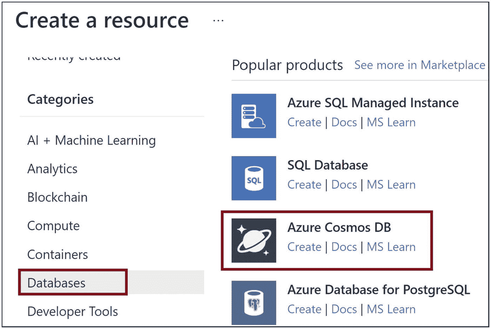
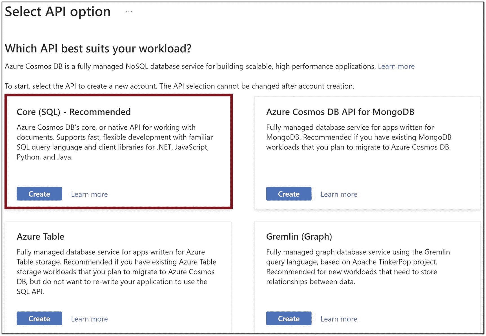
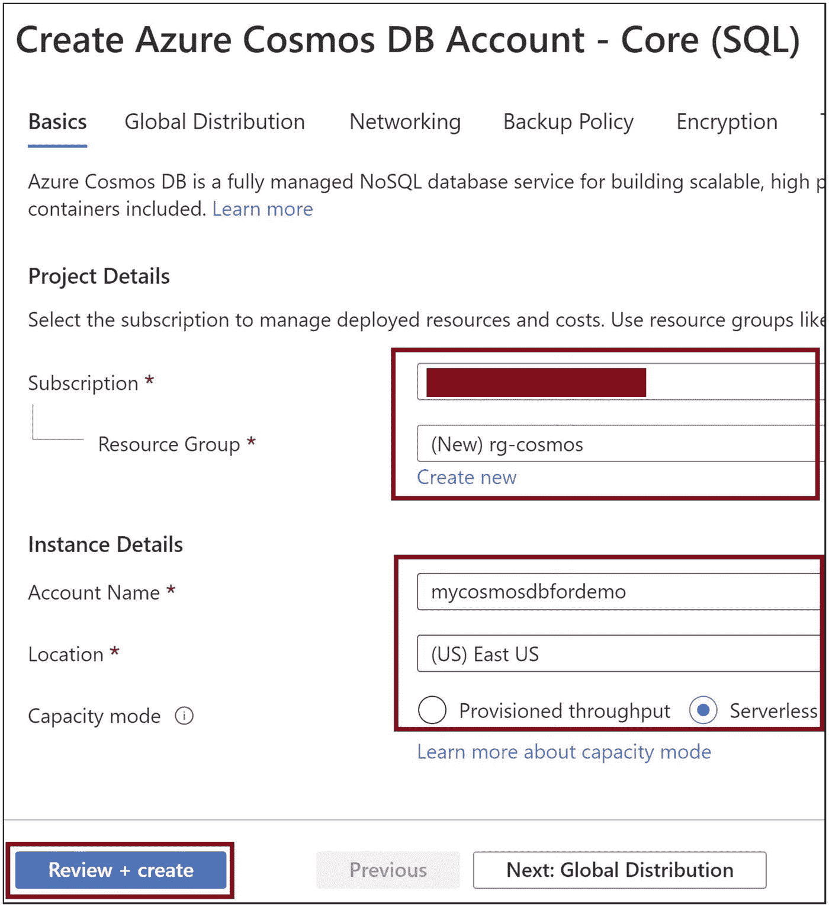
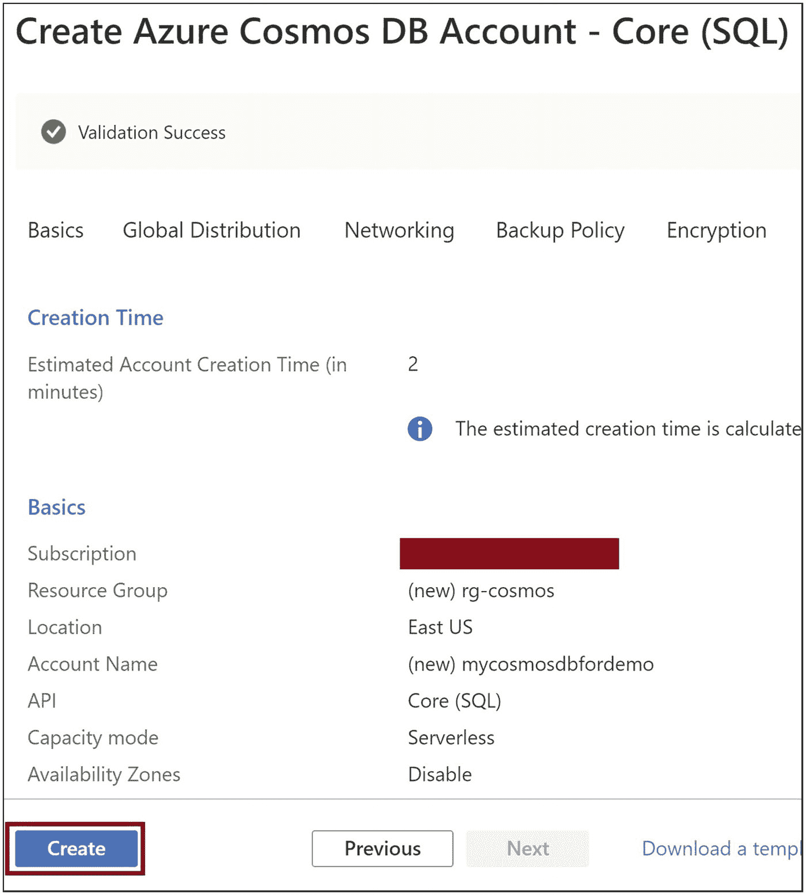
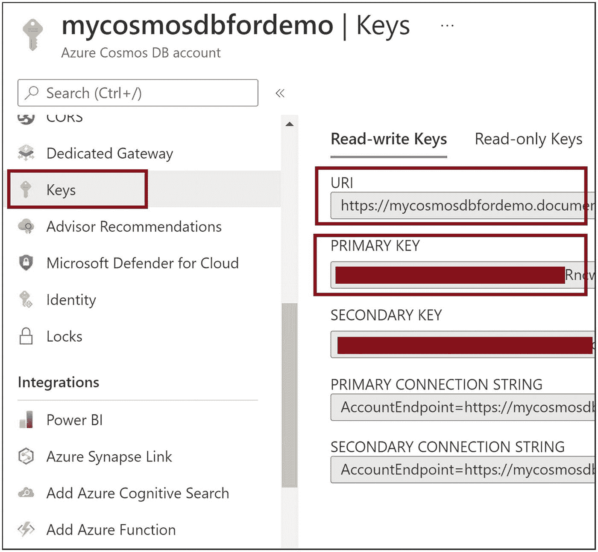
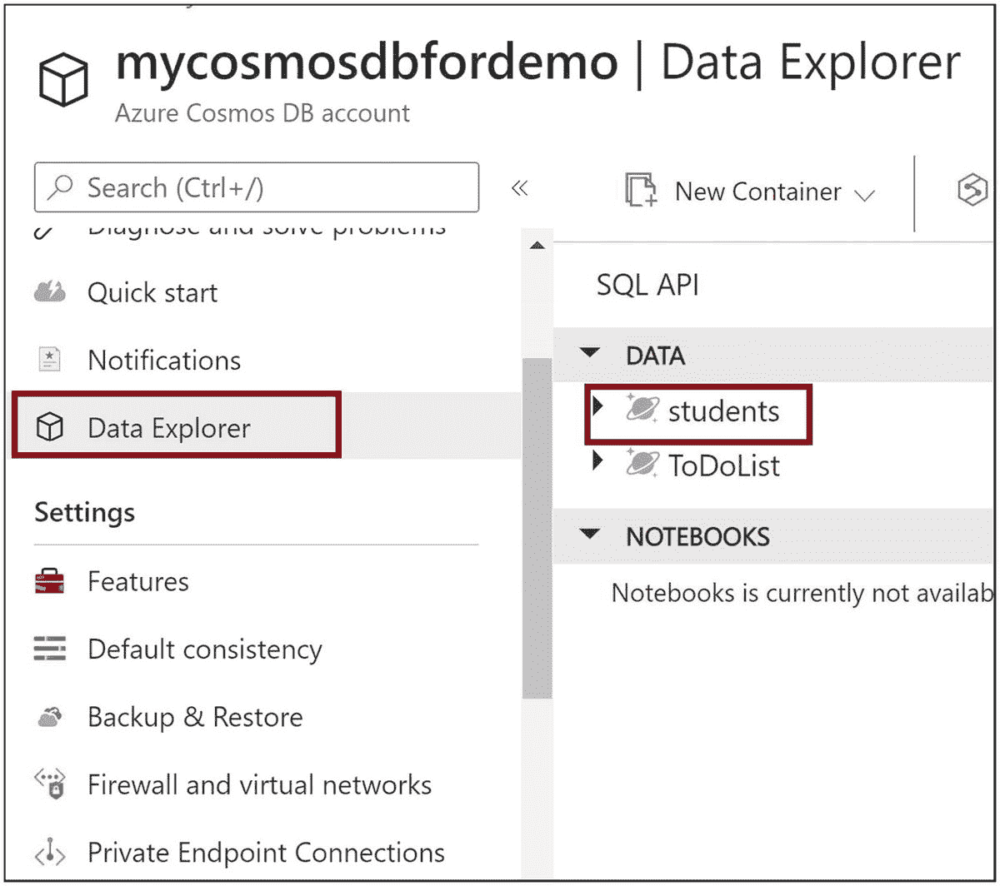
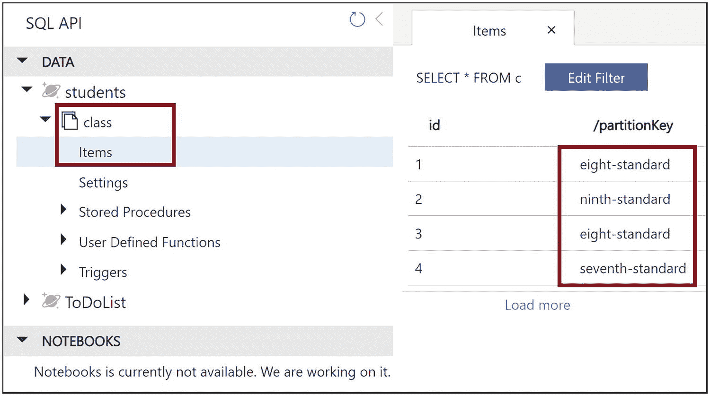
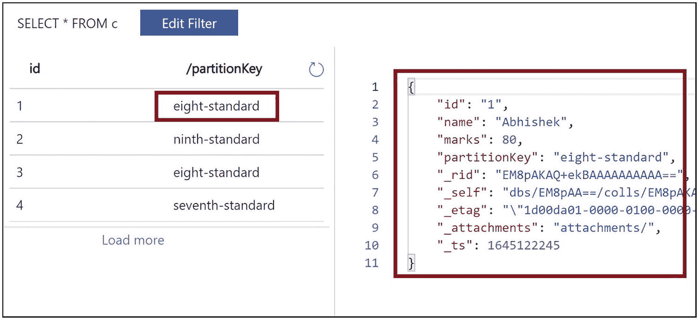

# 8. 使用 Azure Cosmos DB

现代应用程序使用 NoSQL 数据库来存储数据。这些数据库应具有高度可扩展性、响应迅速且延迟极低。这些应用程序在全球范围内可用，因此其数据库也需要在全球范围内可用。对于此类应用程序，数据复制应能即时在全球范围内完成。Azure Cosmos DB 是 Azure 上基于云的 NoSQL 数据库，可以满足这些要求。

在上一章中，我们学习了 Azure SQL 数据库的基本概念。然后，我们创建了一个基于 Java 的应用程序，并使用 Azure SQL 数据库进行了操作。在本章中，我们将学习 Azure Cosmos DB 的详细信息，然后我们将预配 Azure Cosmos DB 并构建一个能够在 Azure Cosmos DB 上执行读写操作的 Java 应用程序。

## 结构

在本章中，我们将讨论 Azure Cosmos DB 的以下方面：

*   Azure Cosmos DB 简介

*   创建 SQL API Cosmos DB

*   使用 SQL API

## 目标

学习本章后，您应该能够完成以下任务：

*   理解 Azure Cosmos DB 的概念

*   从 Java 应用程序使用 Azure Cosmos DB

## Azure Cosmos DB 简介

Azure Cosmos DB 是 Azure 上的一种平台即服务 NoSQL 数据库，最适合实时和近实时应用程序。它确保非常高的吞吐量，并保证弹性的读写可扩展性。存储的数据可以全局复制，并确保极低的延迟。该数据库可以跨多个 Azure 区域进行复制，从而实现高可用性。

您可以使用多种受支持的数据库 API 来访问存储在 Azure Cosmos DB 中的数据。以下是受支持的 API：

*   *SQL API* 帮助您使用 SQL 查询访问存储的数据。您可以使用 SQL API 将关系数据库工作负载迁移到 Cosmos DB。

*   *MongoDB API* 帮助您使用 MongoDB 查询访问数据。您可以使用 MongoDB 支持的 BSON 格式将数据插入到文档结构中。

*   *Cassandra API* 帮助您使用面向列的架构存储数据。您可以使用 Cassandra 查询语言查询数据。

*   *Table API* 帮助您以键值格式存储数据。

*   *Gremlin API* 使用边和顶点以图形数据库格式存储数据。您可以使用图形查询语言查询数据。

对于 Azure Cosmos DB，您需要按小时为您所需的吞吐量和消耗的存储空间付费。吞吐量使用请求单位来定义。请求单位是执行数据库操作所消耗的 CPU、内存和 IOPs 的组合。您可以根据消耗的请求单位来创建 Azure Cosmos DB 帐户。以下是创建 Cosmos DB 帐户的受支持方式：

*   *预配吞吐量*模式帮助您选择数据库操作所需的每秒请求单位数。您可以根据需要，以编程方式或手动增加或减少请求单位来进行缩放。

*   使用*无服务器模式*，您无需选择任何请求单位，您只需按计费周期内消耗的请求单位数量付费。

*   *自动缩放模式*可根据应用程序的需求自动缩放请求单位。此模式最适合具有不可预测流量模式的工作负载。

## 创建 SQL API Cosmos DB

让我们使用 Azure 门户为 SQL API 创建一个 Azure Cosmos DB。转到如图 8-1 所示的 Azure 门户，然后单击*创建资源*，如图 8-1 所示。


Microsoft Azure 的屏幕截图。Azure 服务包括已突出显示的“创建资源”、“资源组”和“订阅”。顶部的搜索窗口显示“搜索资源、服务和文档 G 加斜杠”。

图 8-1

创建资源

您将进入图 8-2 中的 Azure 市场。单击*数据库*。您将在此处看到所有数据库产品。单击*Azure Cosmos DB*，如图 8-2 所示。



创建资源步骤的屏幕截图。热门产品包括 Azure SQL 托管实例、SQL 数据库、已突出显示的 Azure Cosmos DB 以及用于 PostgreSQL 的 Azure 数据库。类别列表包括分析、区块链、计算、容器和已突出显示的数据库。

图 8-2

单击 Azure Cosmos DB

单击*核心 (SQL) – 推荐*的*创建*，如图 8-3 所示。



选择 API 选项的屏幕截图。API 选项列出为核心 SQL（推荐）、Azure 表、用于 MongoDB 的 Azure Cosmos DB API 和 Gremlin 图形。顶部的问题显示“哪个 API 最适合您的工作负载”。

图 8-3

单击核心 (SQL) `–` 推荐

提供订阅和资源组详细信息。提供 Cosmos DB 的帐户名称和位置。单击*查看 + 创建*，如图 8-4 所示。



选择 API 选项的屏幕截图。API 选项列出为核心 SQL（推荐）、Azure 表、用于 MongoDB 的 Azure Cosmos DB API 和 Gremlin 图形。顶部的问题显示“哪个 API 最适合您的工作负载”。

图 8-4

单击查看 + 创建

单击*创建*，如图 8-5 所示。此操作将为您启动 Azure Cosmos DB。



验证成功的 Azure Cosmos DB 帐户核心 SQL 的屏幕截图。顶部的选项卡包括基本信息、全局分发、网络、备份策略和加密。基本信息包括订阅、资源组、位置、帐户名称、API、容量模式和可用性区域。底部的按钮标题为“创建”。

图 8-5

单击创建

Cosmos DB 创建完成后，导航到该 Cosmos DB 并单击*密钥*，如图 8-6 所示。我们需要终结点 URL 和访问密钥才能从 Java 代码连接到 Cosmos DB。



Azure Cosmos DB 帐户密钥的屏幕截图。右侧列出了 2 个密钥，包括已突出显示的读写密钥和只读密钥。读写密钥包括 URI、主密钥和辅助密钥。左侧的选项卡包括专用网关、已突出显示的密钥和锁。

图 8-6

单击密钥


## 使用 SQL API 操作 Cosmos DB

现在，让我们编写一个 Java Maven 项目，并使用 SQL API 进行操作。我们需要将 Cosmos DB 包添加到 POM 文件中。清单 8-1 展示了你可以使用的 POM 文件。

```

4.0.0
com.cosmosdb
sqldemo
1.0-SNAPSHOT

com.azure
azure-cosmos
4.4.0

清单 8-1
POM.xml
```

在 Cosmos DB 数据库中，数据存储在容器内，并且存储的数据应包含分区键和 ID 列。让我们创建一个如清单 8-2 所示的 Java 类，其中包含 Main 函数，我们可以在其中添加代码来创建数据库、创建用于存储学生数据的容器、向其中插入记录以及读取记录。让我们创建一个包含学生数据字段的 Student 类。它必须包含 *id* 和 *partitionKey* 字段。数据存储在分区中以便更快地访问，每个分区由分区键标识。分区键和 ID 的组合将唯一标识一条记录。

```
public class Student {
public Student(){
}
private String id;
private String name;
private int marks;
private String partitionKey;
public String getName() {
return name;
}
public void setName(String name) {
this.name = name;
}
public int getMarks() {
return marks;
}
public void setMarks(int marks) {
this.marks = marks;
}
public String getPartitionKey() {
return partitionKey;
}
public void setPartitionKey(String partitionKey) {
this.partitionKey = partitionKey;
}
public String getId() {
return id;
}
public void setId(String id) {
this.id = id;
}
}
清单 8-2
Student.java
```

让我们将清单 8-3 中所示的代码添加到 Main 方法中，以连接到 Azure Cosmos DB。我们需要提供之前从 Azure 门户复制的终结点 URL 和密钥。

```
String endpoint = "{Provide endpoint URL}";
String key = "{Provide Access Key}";
// 创建数据库连接
CosmosClient client = new CosmosClientBuilder()
.endpoint(endpoint)
.key(key)
.buildClient();
清单 8-3
连接到数据库
```

让我们使用清单 8-4 中的代码创建一个名为 *students* 的数据库。仅当数据库不存在时才会创建。

```
// 创建数据库
String databaseName = "students";
CosmosDatabaseResponse databaseDetails = client.createDatabaseIfNotExists(databaseName);
CosmosDatabase database = client.getDatabase(databaseDetails.getProperties().getId());
System.out.println("数据库已创建 - " + database.getId() );
清单 8-4
创建数据库
```

让我们创建一个名为 *class* 的容器，用于存储不同班级的学生数据，如清单 8-5 所示。仅当容器不存在时才会创建。

```
// 创建容器
String containerName = "class";
CosmosContainerProperties containerProperties = new CosmosContainerProperties(containerName, "/partitionKey");
CosmosContainerResponse containerResponse = database.createContainerIfNotExists(containerProperties);
CosmosContainer container = database.getContainer(containerResponse.getProperties().getId());
System.out.println("容器已创建 " + container.getId());
清单 8-5
创建容器
```

让我们插入四名学生的数据，如清单 8-6 所示。

```
//向容器插入数据
//插入学生 1
Student student = new Student();
student.setId("1");
student.setMarks(80);
student.setPartitionKey("eight-standard");
student.setName("Abhishek");
CosmosItemResponse item = container.createItem(student, new PartitionKey(student.getPartitionKey()), new CosmosItemRequestOptions());
//插入学生 2
student = new Student();
student.setId("2");
student.setMarks(60);
student.setPartitionKey("ninth-standard");
student.setName("Abhijeet");
item = container.createItem(student, new PartitionKey(student.getPartitionKey()), new CosmosItemRequestOptions());
//插入学生 3
student = new Student();
student.setId("3");
student.setMarks(70);
student.setPartitionKey("eight-standard");
student.setName("Sunny");
item = container.createItem(student, new PartitionKey(student.getPartitionKey()), new CosmosItemRequestOptions());
//插入学生 4
student = new Student();
student.setId("4");
student.setMarks(60);
student.setPartitionKey("seventh-standard");
student.setName("Abhilash");
item = container.createItem(student, new PartitionKey(student.getPartitionKey()), new CosmosItemRequestOptions());
清单 8-6
插入数据
```

让我们读取存储的学生数据，如清单 8-7 所示。

```
//从容器查询数据
int pageSize = 10;
CosmosQueryRequestOptions queryOptions = new CosmosQueryRequestOptions();
//  设置填充查询指标以获取查询执行的指标
queryOptions.setQueryMetricsEnabled(true);
CosmosPagedIterable studentPagedIterable = container.queryItems
(SELECT * FROM class WHERE class.partitionKey IN ('eight-standard', 'seventh-standard')", queryOptions, Student.class);
studentPagedIterable.iterableByPage(pageSize).forEach(resultItem -> {
resultItem.getResults().forEach(data -> System.out.println(data.getId() + "-" +data.getName()+"-"+data.getMarks()));
});
清单 8-7
读取数据
```

清单 8-8 是与 Azure Cosmos DB 交互的完整代码。


```
import com.azure.cosmos.CosmosClient;
import com.azure.cosmos.CosmosClientBuilder;
import com.azure.cosmos.CosmosContainer;
import com.azure.cosmos.CosmosDatabase;
import com.azure.cosmos.models.CosmosContainerProperties;
import com.azure.cosmos.models.CosmosContainerResponse;
import com.azure.cosmos.models.CosmosDatabaseResponse;
import com.azure.cosmos.models.CosmosItemRequestOptions;
import com.azure.cosmos.models.CosmosItemResponse;
import com.azure.cosmos.models.CosmosQueryRequestOptions;
import com.azure.cosmos.models.PartitionKey;
import com.azure.cosmos.util.CosmosPagedIterable;
public class SQLDemo {
public static void main(String args[])
{
String endpoint = "{Provide endpoint URL}";
String key = "{Provide Access Key}";
// 创建数据库连接
CosmosClient client = new CosmosClientBuilder()
.endpoint(endpoint)
.key(key)
.buildClient();
// 创建数据库
String databaseName = "students";
CosmosDatabaseResponse databaseDetails = client.createDatabaseIfNotExists(databaseName);
CosmosDatabase database = client.getDatabase(databaseDetails.getProperties().getId());
System.out.println("数据库已创建 - " + database.getId() );
// 创建容器
String containerName = "class";
CosmosContainerProperties containerProperties = new CosmosContainerProperties(containerName, "/partitionKey");
CosmosContainerResponse containerResponse = database.createContainerIfNotExists(containerProperties);
CosmosContainer container = database.getContainer(containerResponse.getProperties().getId());
System.out.println("容器已创建 " + container.getId());
//向容器插入数据
//插入学生 1
Student student = new Student();
student.setId("1");
student.setMarks(80);
student.setPartitionKey("eight-standard");
student.setName("Abhishek");
CosmosItemResponse item = container.createItem(student, new PartitionKey(student.getPartitionKey()), new CosmosItemRequestOptions());
//插入学生 2
student = new Student();
student.setId("2");
student.setMarks(60);
student.setPartitionKey("ninth-standard");
student.setName("Abhijeet");
item = container.createItem(student, new PartitionKey(student.getPartitionKey()), new CosmosItemRequestOptions());
//插入学生 3
student = new Student();
student.setId("3");
student.setMarks(70);
student.setPartitionKey("eight-standard");
student.setName("Sunny");
item = container.createItem(student, new PartitionKey(student.getPartitionKey()), new CosmosItemRequestOptions());
//插入学生 4
student = new Student();
student.setId("4");
student.setMarks(60);
student.setPartitionKey("seventh-standard");
student.setName("Abhilash");
item = container.createItem(student, new PartitionKey(student.getPartitionKey()), new CosmosItemRequestOptions());
//从容器查询数据
int pageSize = 10;
CosmosQueryRequestOptions queryOptions = new CosmosQueryRequestOptions();
// 设置填充查询指标以获取查询执行的相关指标
queryOptions.setQueryMetricsEnabled(true);
CosmosPagedIterable studentPagedIterable = container.queryItems(
"SELECT * FROM class WHERE class.partitionKey IN ('eight-standard', 'seventh-standard')", queryOptions, Student.class);
studentPagedIterable.iterableByPage(pageSize).forEach(resultItem -> {
resultItem.getResults().forEach(data -> System.out.println(data.getId() + "-" +data.getName()+"-"+data.getMarks()));
});
}
}
清单 8-8
完整代码
```

现在让我们进入门户网站，检查插入到 Cosmos DB 中的数据。点击*数据资源管理器*，如图 8-7 所示。您可以看到 *students* 数据库。



Azure Cosmos DB 账户密钥的截图。右侧列出了 2 个密钥，包括高亮显示的读写密钥和只读密钥。读写密钥包括 URI、主密钥和辅助密钥。左侧的选项卡包括专用网关、密钥（高亮显示）和锁。

图 8-7

点击数据资源管理器

展开 Student 数据库，您可以看到 *class* 容器。点击*项*，如图 8-8 所示，您可以看到存储的学生记录。



SQL API 的截图。右侧的项显示编辑筛选器，包含 ID 从 1 到 4 以及分区键。分区键列出了 eight standard、ninth standard、eighth standard 和 seventh standard。数据的下拉选项卡包括 students 和 class。class 的下拉选项卡包括 items 和 settings。

图 8-8

点击项

点击任意一条记录，查看存储的数据，如图 8-9 所示。



左侧的选项显示编辑筛选器，包含 ID 从 1 到 4 以及分区键。分区键列出了 eight standard、ninth standard、eighth standard 和 seventh standard。右侧窗口显示描述符和 ID、名称、分数、分区键、_rid 和 _self 的数据。描述符编号从 1 到 11。

图 8-9

点击一个项

## 总结

在本章中，我们学习了 Azure Cosmos DB，以及如何使用 Azure 门户创建基于 Azure SQL API 的 Azure Cosmos DB。然后，我们开发了一个基于 Maven 的 Java 代码，并在 Azure Cosmos DB 上执行了插入和读取操作。在下一章中，我们将学习如何通过 Java 应用程序以编程方式使用 Azure Redis 缓存。

以下是本章的关键要点：

*   Azure Cosmos DB 是一个 NoSQL 数据库，支持全球范围内的水平数据复制，并确保低延迟。

*   存储在 Azure Cosmos DB 中的 NoSQL 数据可以使用以下 API 进行访问。
    *   SQL API

    *   MongoDB API

    *   Cassandra API

    *   Table API

    *   Gremlin API

*   您可以使用以下模式创建 Azure Cosmos DB 账户：
    *   预配吞吐量

    *   无服务器

    *   自动缩放

