# 9. 在 Azure Redis 缓存中存储运行时数据

现代应用程序生成并处理运行时数据。它们将运行时数据保存在内存中，或保存在持久性磁盘或数据存储中。将数据存储在内存中，可以更快地访问存储的临时运行时数据。然而，从磁盘或数据库等持久性存储访问数据时，速度比内存存储慢。Azure Redis 缓存可帮助您在 Azure 中为应用程序存储和管理运行时数据。Azure Redis 缓存可帮助您快速访问运行时数据，并提高应用程序的性能。

在上一章中，我们学习了 Azure Cosmos DB 的基本概念。然后，我们创建了一个基于 Java 的应用程序，并使用 Azure Cosmos DB SQL API 进行了操作。在本章中，我们将学习 Azure Redis 缓存的详细信息。然后，我们将预配 Azure Redis 缓存，并构建一个能够在 Azure Redis 缓存上执行读写操作的 Java 应用程序。

## 结构

在本章中，我们将讨论 Azure Redis 缓存的以下方面：

*   Azure Redis 缓存简介

*   创建 Azure Redis 缓存

*   使用 Azure Redis 缓存

*   使用控制台操作 Redis 缓存

## 目标

学习本章后，您应能获得以下知识：

*   理解 Azure Redis 缓存的概念

*   通过 Java 应用程序使用 Azure Redis 缓存


## Azure Redis 缓存简介

Redis 缓存是一种内存缓存服务，可帮助您保存频繁访问的运行时数据。您可以从数据存储中一次性获取数据，并在首次请求时将其保存在缓存中。对于所有后续请求，数据将从缓存中获取，而不是从数据存储中获取。当数据存储中的数据发生变化时，缓存中的数据会使用存储在数据存储中的新版本数据进行刷新。这种方法将确保 Redis 缓存数据始终保持最新，并且应用程序始终能获取到最新数据。

Azure 将 Redis 缓存作为平台即服务（PaaS）产品提供。您可以在几分钟内启动 Redis 集群并开始使用它。您无需在 Azure 上为 Redis 缓存设置任何基础设施。底层的 Azure 平台管理所有基础设施方面。Azure Redis 缓存可以存储内容、用户会话、分布式数据，甚至可以作为消息代理使用。其用例非常广泛。以下是您可以使用 Redis 缓存实现的一些用例示例：

*   您有一个在 Azure WebApp 上运行的应用程序。每当用户登录时，该用户的会话数据可以存储在 Azure Redis 缓存中，以便所有 WebApp 实例和用户请求都可以访问这些数据。在高峰时段，Azure WebApp 可以扩展到多个实例。

*   您有一个在 Azure、本地或任何基于云的服务器上运行的 Web 应用程序，它使用页眉、页脚、层叠样式表和其他静态页面。您可以将所有这些静态内容的副本存储在 Azure Redis 缓存中。首次访问时，静态内容可以从服务器获取，而对于后续请求，数据可以从缓存中提供。这种方法将提高应用程序的性能。

*   您有一个应用程序频繁调用数据库来获取数据。在这种情况下，您可以将频繁访问的静态数据存储在 Azure Redis 缓存中。应用程序可以从缓存中获取数据，而不是从数据库中获取。但是，对于第一个用户请求，数据应从数据库中获取并同时存储在 Redis 缓存中。如果数据库中的数据发生变化，Redis 缓存中的数据也应更新。

*   您可以拥有执行分布式事务的应用程序。只有当所有事务都成功时，才应将数据提交到数据库。在这种情况下，您可以将所有事务的中间事务数据存储在 Redis 缓存中，如果所有事务都成功，则将 Redis 缓存中的数据提交到数据库；如果事务失败，则使缓存中存储的数据失效，作为回滚操作。

Azure Redis 缓存为您的应用程序提供极低的延迟和高吞吐量的数据访问。数据存储在由 Azure 平台管理的 Redis 服务器的内存中，可以轻松处理海量数据请求。存储的数据经过加密且高度安全。

以下是 Azure Redis 缓存可用的定价计划：

*   *基本*计划提供在单个虚拟机实例上运行的开源 Redis 缓存版本。您可以将其用于开发和测试目的。此计划不提供 SLA。

*   *标准*计划提供在两个虚拟机实例上运行的开源 Redis 缓存版本，并且数据会在虚拟机实例之间即时复制。

*   *高级*计划提供在多个强大的虚拟机实例上运行的开源 Redis 缓存版本。它提供非常高的吞吐量、可用性、低延迟以及许多其他生产级功能。

*   *企业*计划提供比高级计划更高的性能和可用性，并为 Redis 缓存提供基于 Redis Labs 的企业级产品。您可以运行基于 Redis 的模块，如 Redis Bloom、RediSearch 和 Redis Time Series。

*   *企业闪存*计划提供一种经济高效的基于 Redis Labs 的企业版，该版本在非易失性内存上运行。

## 创建 Azure Redis 缓存

让我们使用 Azure 门户创建一个 Azure Redis 缓存。转到 Azure 门户，点击*创建资源*，如图 9-1 所示。我们将使用 Java 代码对此 Redis 缓存执行读写操作。

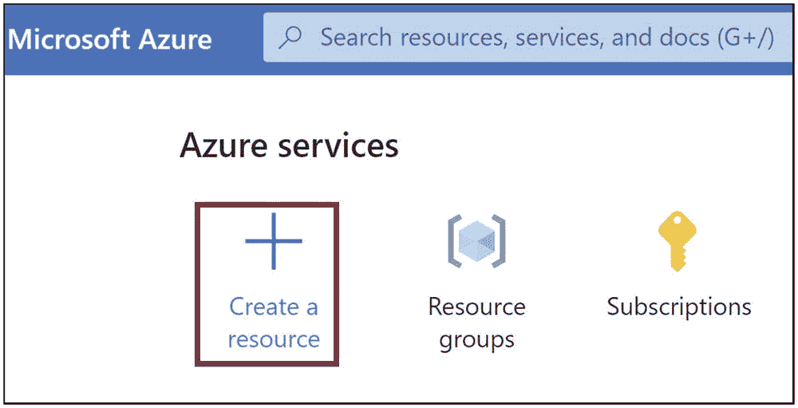

资源窗口的屏幕截图。窗口中的内容包括一个搜索栏、文本“Azure 服务”以及三个选项：创建资源、资源组和订阅。

图 9-1

创建资源

您将被导航到 Azure 市场。点击*数据库*，然后点击*Azure Cache for Redis*。示例如图 9-2 所示。

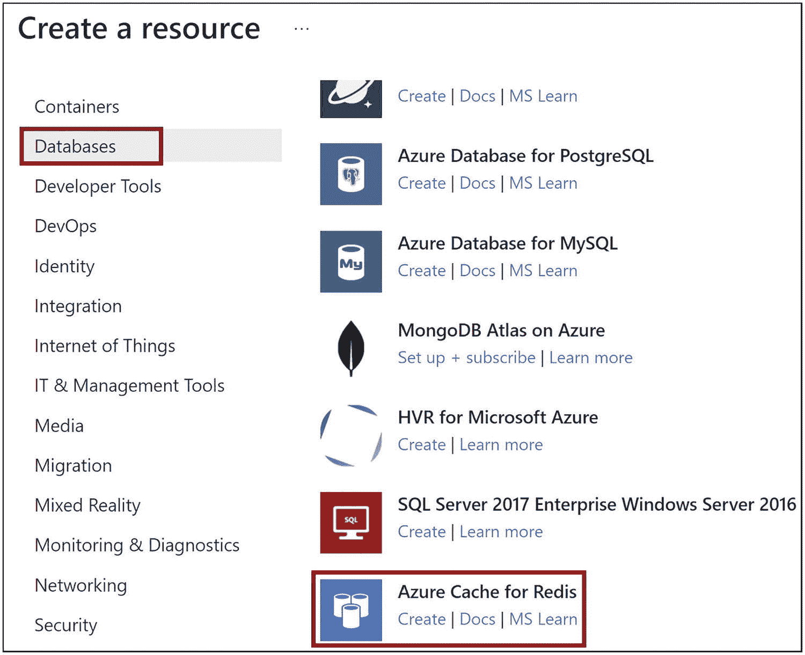

“创建资源”窗口的屏幕截图。左侧的几个选项包括容器、数据库、开发人员工具、DevOps、标识、集成、IT 和管理工具、媒体以及迁移。右侧的几个选项包括 Azure Database for PostgreSQL、Azure Database for MySQL、MongoDB Atlas on Azure、HVR for Microsoft Azure 和 Azure Cache for Redis。其中“数据库”和“Azure Cache for Redis”被突出显示。

图 9-2

点击 Azure Cache for Redis

提供创建 Redis 缓存的基本详细信息。您需要提供订阅和资源组详细信息、Redis 缓存的名称、创建 Redis 缓存的位置以及定价计划。在本演示中，我们使用不提供 SLA 的基本 C0 计划，该计划仅应用于开发和测试目的。点击*下一步：网络*以导航到“网络”选项卡，如图 9-3 所示。

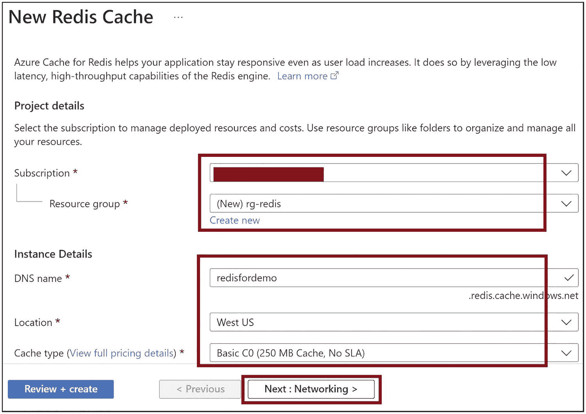

“创建资源”窗口的屏幕截图。左侧的几个选项包括容器、数据库、开发人员工具、DevOps、标识、集成、IT 和管理工具、媒体以及迁移。右侧的几个选项包括 Azure Database for PostgreSQL、Azure Database for MySQL、MongoDB Atlas on Azure、HVR for Microsoft Azure 和 Azure Cache for Redis。其中“数据库”和“Azure Cache for Redis”被突出显示。

图 9-3

提供基本详细信息

选择*公共终结点*。但是，在生产场景中，您应该配置一个*专用链接终结点*并设置一个*专用终结点*。使用更高的定价计划，您可以将 Redis 缓存集成到虚拟网络中。点击*下一步：高级*，如图 9-4 所示。

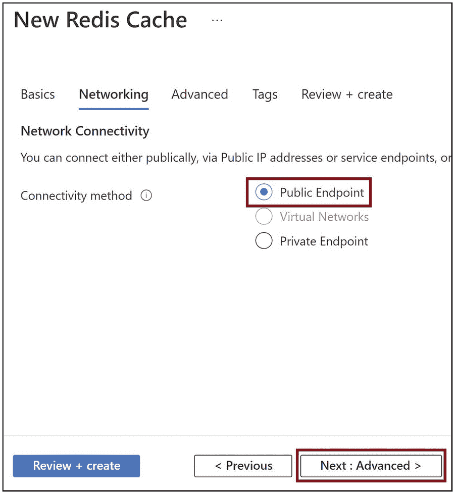

“新建 Redis 缓存网络”窗口的屏幕截图。选项包括“基本信息”、“网络”、“高级”、“标签”以及“查看 + 创建”。“网络”选项已创建，显示网络连接和连接方法，包括公共终结点、虚拟网络和专用终结点。

图 9-4

提供网络详细信息

让我们选择最新的 Redis 缓存版本。点击*查看 + 创建*，如图 9-5 所示。

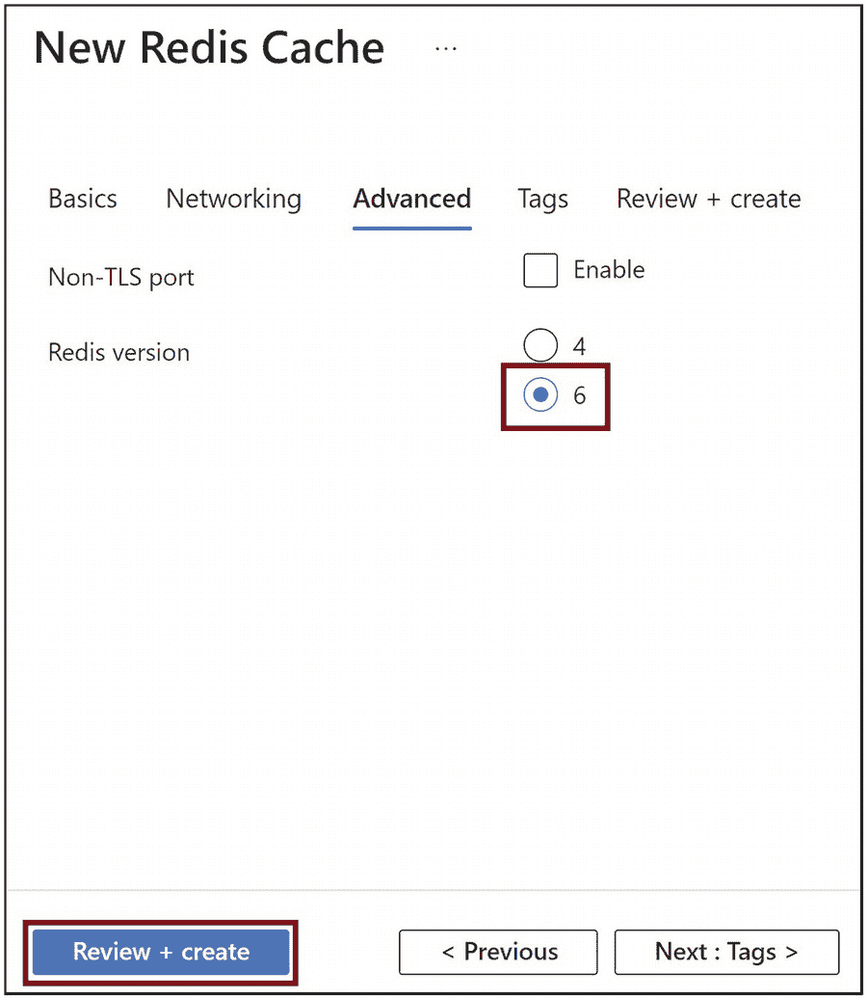

“新建 Redis 缓存网络”窗口的屏幕截图。选项包括“基本信息”、“网络”、“高级”、“标签”以及“查看 + 创建”。“高级”选项被选中，显示“非 TLS 端口”及其启用复选框，以及 Redis 版本选项 4 和 6。下方提供了“查看 + 创建”、“上一步”和“下一步”选项，其中“查看 + 创建”被选中。

图 9-5

点击查看 + 创建

点击*创建*，如图 9-6 所示。此操作将在 Azure 上启动 Redis 缓存集群。

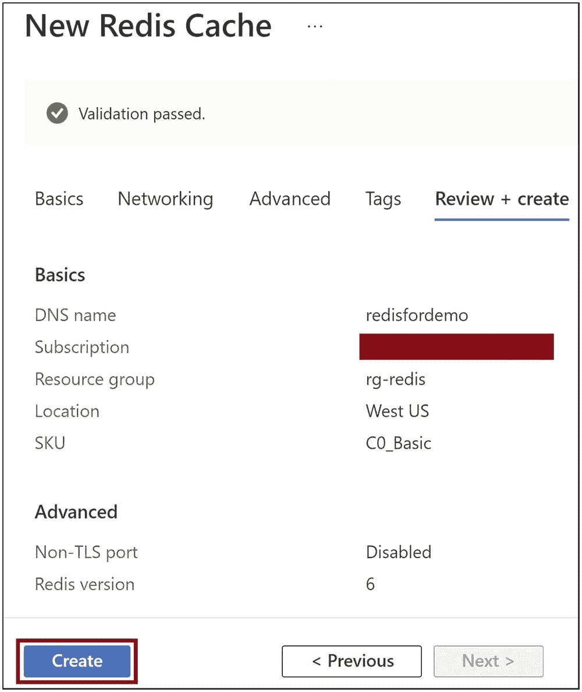


新的 Redis 缓存网络窗口截图。选项包括：基本信息、网络、高级、标签以及查看并创建。已选中“查看并创建”选项，显示的基本信息包括 DNS 名称、订阅、资源组、位置、SKU，高级信息包括非 TLS 端口和 Redis 版本。下方提供了“创建”和“上一步”选项，且“创建”已选中。

图 9-6

点击“创建”

创建 Azure Redis 缓存后，导航至该缓存并进入*访问密钥*页面，如图 9-7 所示。复制主密钥，将其用作代码中的缓存密钥。预配 Azure Redis 缓存可能需要大约 15 分钟或更长时间。

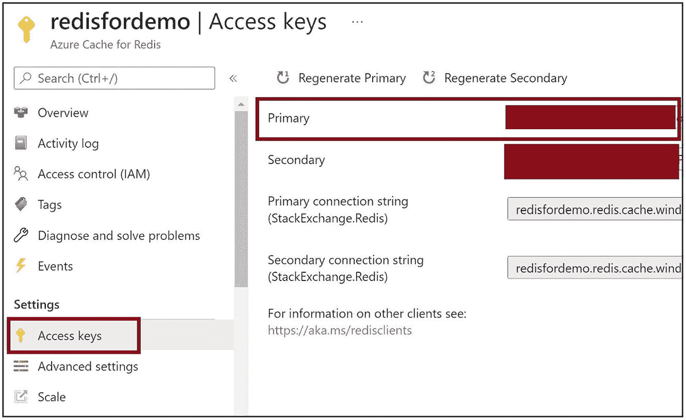

新的 Redis 缓存网络窗口截图。选项包括：基本信息、网络、高级、标签以及查看并创建。已选中“查看并创建”选项，显示的基本信息包括 DNS 名称、订阅、资源组、位置、SKU，高级信息包括非 TLS 端口和 Redis 版本。下方提供了“创建”和“上一步”选项，且“创建”已选中。

图 9-7

获取缓存密钥

进入*属性*部分，如图 9-8 所示，并复制主机名。我们将在代码中使用该主机名来连接 Azure Redis 缓存。

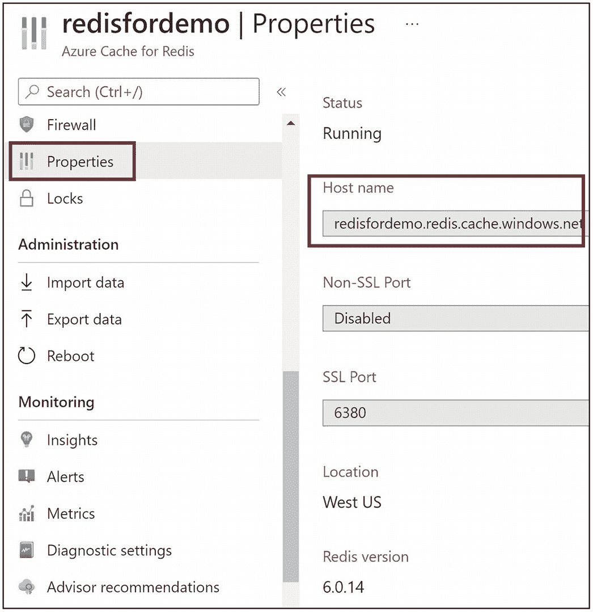

Redis 演示访问密钥窗口截图。左侧选项包括：概述、活动日志、访问控制、标签、诊断并解决问题、事件、访问密钥、高级设置和缩放。右侧内容包括：重新生成主密钥、重新生成辅助密钥、主密钥、辅助密钥、连接字符串和 URL 信息。

图 9-8

获取主机名

## 使用 Azure Redis 缓存

现在，让我们构建一个 Java 代码，该代码将向缓存插入数据、从缓存读取数据、设置缓存数据的过期时间，以及从 Redis 缓存中删除数据。我们需要 *jedis* 包来通过 Java 代码使用 Redis 缓存。

让我们将 jedis 包添加到 *pom.xml* 文件中。清单 9-1 展示了一个示例。

```
redis.clients
jedis
3.2.0
jar
compile

清单 9-1
Pom.xml
```

我们需要通过 Java 代码连接 Azure Redis 缓存。我们需要提供之前复制的主机名和缓存密钥。清单 9-2 的代码构建了一个连接。

```
boolean ssl = true;
String hostName = "{提供主机名}";
String cacheKey = "{提供缓存密钥}";
//Redis 缓存连接端口为 6380
int port = 6380;
// 构建到 Redis 缓存的连接
JedisShardInfo shardInfo = new JedisShardInfo(hostName, port, ssl);
shardInfo.setPassword(cacheKey);
Jedis jedisCache = new Jedis(shardInfo);
清单 9-2
连接到 Redis 缓存
```

你可以使用 *ping* 函数测试连接是否成功，如清单 9-3 所示。如果连接成功，你将收到 *Pong* 作为响应。

```
// 检查是否能够连接/ ping 到 Redis 缓存
System.out.println( "Ping 结果 : " + jedisCache.ping());
清单 9-3
Ping Redis 缓存
```

你可以使用 *set* 函数在缓存中设置数据，如清单 9-4 所示。你可以将数据设置为键值对。

```
// 设置数据 1 键：Data1，值：This is value for Data1
jedisCache.set("Data1", "This is value for Data1");
// 设置数据 2 键：Data2，值：This is value for Data2
jedisCache.set("Data2", "This is value for Data2");
清单 9-4
在 Redis 缓存中设置数据
```

你可以使用 *get* 函数并传入数据键，从 Azure Redis 缓存中获取数据，如清单 9-5 所示。

```
// 从 Redis 缓存读取数据 1
System.out.println( "数据 1 的值 : " + jedisCache.get("Data1"));
// 从 Redis 缓存读取数据 2
System.out.println( "数据 2 的值 : " + jedisCache.get("Data2"));
清单 9-5
从 Redis 缓存读取数据
```

你可以选择使用 *expire* 函数为某个键设置缓存数据过期时间，如清单 9-6 所示。你可以指定缓存数据过期前的秒数。

```
// 为数据 1 设置过期时间
jedisCache.expire("Data1", 60);
清单 9-6
60 秒后使 Redis 缓存中的数据过期
```

你可以使用 *del* 函数删除缓存中的数据，如清单 9-7 所示。

```
// 删除数据 2
jedisCache.del("Data2");
清单 9-7
删除 Redis 缓存中的数据
```

清单 9-8 是使用 Azure Redis 缓存的完整代码。

```
import redis.clients.jedis.*;
public class RedisDemo {
public static void main(String args[])
{
boolean ssl = true;
String hostName = "{提供主机名}";
String cacheKey = "{提供缓存密钥}";
//Redis 缓存连接端口为 6380
int port = 6380;
// 构建到 Redis 缓存的连接
JedisShardInfo shardInfo = new JedisShardInfo(hostName, port, ssl);
shardInfo.setPassword(cacheKey);
Jedis jedisCache = new Jedis(shardInfo);
// 检查是否能够连接/ ping 到 Redis 缓存
System.out.println( "Ping 结果 : " + jedisCache.ping());
// 设置数据 1 键：Data1，值：This is value for Data1
jedisCache.set("Data1", "This is value for Data1");
// 设置数据 2 键：Data2，值：This is value for Data2
jedisCache.set("Data2", "This is value for Data2");
// 从 Redis 缓存读取数据 1
System.out.println( "数据 1 的值 : " + jedisCache.get("Data1"));
// 从 Redis 缓存读取数据 2
System.out.println( "数据 2 的值 : " + jedisCache.get("Data2"));
// 为数据 1 设置过期时间
jedisCache.expire("Data1", 60);
// 删除数据 2
jedisCache.del("Data2");
jedisCache.close();
}
}
清单 9-8
完整代码
```

图 9-9 显示了代码执行的输出。你可以使用控制台来验证数据。你可以使用 *Get* 命令查看插入到 Redis 缓存中的数据。下一节将演示如何从 Azure 门户使用 Azure Redis 缓存控制台。

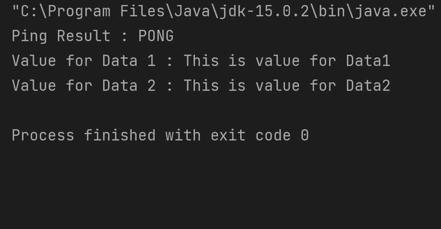

Redis 演示属性窗口截图。左侧选项包括：防火墙、属性、锁、导入数据、导出数据、重启、见解、警报、指标、诊断设置和顾问建议。右侧内容包括：状态、主机名、非 SSL 端口、SSL 端口、位置和 Redis 版本。左侧的“属性”和右侧的“主机名”已高亮显示。

图 9-9

代码执行输出


## 使用控制台操作 Redis 缓存

在某些场景下，您可能需要浏览存储在 Azure Redis 缓存中的数据。您可以使用 Azure 门户中提供的 Redis 控制台来执行所有必要的 Redis 缓存操作。请前往*概述*部分，并点击*控制台*，如图 9-10 所示。

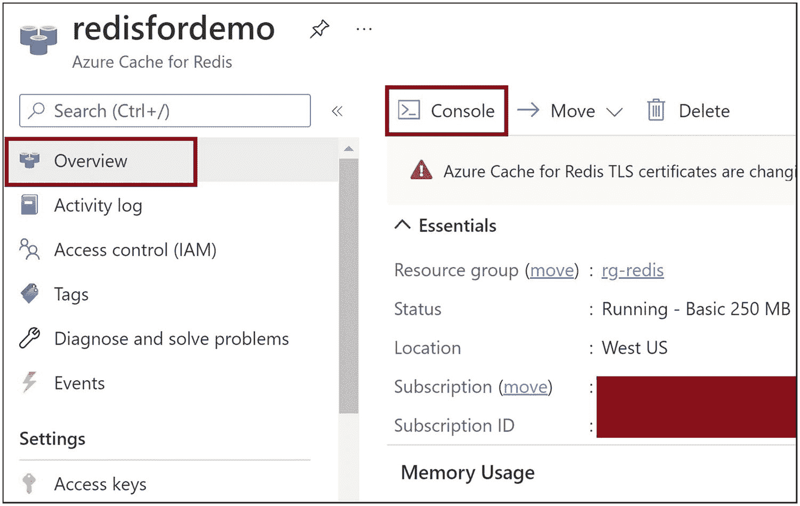

输出窗口的截图。内容为：双引号大写 C 冒号，反斜杠，Program Files 反斜杠，Java 反斜杠 jdk-15.0.2 反斜杠 bin 反斜杠 java.exe 双引号。Ping 结果：pong。data 1 的值：this is value for data 1。data 2 的值：this is value for data 2。进程已完成，退出代码 0。

图 9-10

转到 Redis 控制台

您可以使用 *SET* 命令将数据插入到缓存中。您可以使用 *GET* 命令从缓存中读取数据。您可以在此控制台上执行任何 Redis 命令，并与 Redis 缓存集群一起工作。这些命令的使用方法如图 9-11 所示。

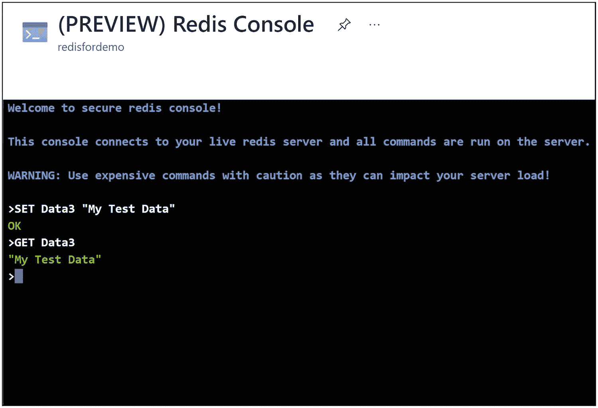

Redis 演示窗口的图像。左侧的选项包括搜索栏、概述、活动日志、访问控制、标签、诊断并解决问题、事件和访问密钥。右侧的选项包括控制台、移动、删除、基本信息（包括资源组、状态、位置、订阅和订阅 ID），其后是内存使用情况。

图 9-11

在 Redis 控制台上执行 Get 和 Set 操作

## 总结

在本章中，我们学习了 Azure Redis 缓存的基础知识，以及如何使用 Azure 门户创建 Azure Redis 缓存。然后，我们开发了一个基于 Maven 的 Java 代码，并在 Azure Redis 缓存上执行了读取、写入、过期和删除操作。在下一章中，我们将学习如何使用 Azure 环境中的 Graph API 从 Java 应用程序以编程方式发送电子邮件。

以下是本章的关键要点：

*   Redis 缓存是一种内存缓存产品，可帮助您存储频繁访问的运行时数据。

*   Azure 将 Redis 缓存作为平台即服务产品提供。您可以在几分钟内启动 Redis 集群并开始使用它。您无需在 Azure 上为 Redis 缓存设置任何基础设施。

*   Azure Redis 缓存为您的应用程序提供极低的延迟和高吞吐量的数据访问。

*   存储在 Azure Redis 缓存中的数据是加密且高度安全的。

*   Azure 同时支持开源 Redis 缓存版本和 Redis Lab 企业版。

*   以下是 Azure Redis 缓存可用的定价计划：
    *   基本版
    *   标准版
    *   高级版
    *   企业版
    *   企业闪存版

