# 10. 使用 Graph API 发送电子邮件

现代应用程序需要向利益相关者、客户、开发者或任何与应用程序相关的人员发送电子邮件。可能会出现客户在电子商务应用程序中下订单的场景。一旦订单下达，它将告知客户订单和发货状态。如果订单失败，则应通知运营团队进行调查。您可以在 Azure 上的虚拟机中配置 SMTP 服务器以满足邮件需求。但是，您最终需要维护虚拟机，并花费成本和精力来保持 SMTP 服务器的正常运行。为了解决这个问题，微软提供了部署在 Azure 上的 Graph API，帮助您与 Microsoft 365 核心服务进行交互。使用 Graph API，您可以发送电子邮件。

在上一章中，我们学习了 Azure Redis 缓存的基本概念。然后，我们创建了一个基于 Java 的应用程序，并与 Azure Redis 缓存进行了交互。在本章中，我们将学习 Graph API 的详细信息。然后，我们将构建一个可以使用 Graph API 发送邮件的 Java 应用程序。

## 结构

在本章中，我们将讨论 Graph API 的以下方面：

*   Graph API 简介
*   使用 Graph API 发送邮件的步骤
*   使用 Microsoft Graph API 发送邮件
*   Microsoft Graph API 浏览器

## 目标

学习完本章后，您应该能够获得以下知识：

*   理解 Graph API 的概念
*   使用 Graph API 从 Java 应用程序发送邮件

## Graph API 简介

Microsoft Graph API 为您提供了一组 RESTful 端点，您可以使用它们与 Microsoft 365 核心服务、企业移动性与安全性服务、Windows 10 服务和 Dynamics 365 服务进行交互。Microsoft Graph API 托管在 Azure 上，开发者可以轻松使用。开发者可以使用 Graph API 构建各种应用程序。以下是一些示例。

*   您可以使用 Microsoft 365 核心服务发送和阅读电子邮件、设置会议以及执行与电子邮件相关的操作。您可以使用 Graph API 端点来帮助您与 Microsoft 365 核心服务进行交互。
*   您可以使用 Graph API 为企业移动性与安全性服务构建围绕 Azure AD、Intune、高级威胁防护等的应用程序。
*   您可以使用 Graph API 为 Windows 10 服务自动控制并将最新补丁应用到您的 Windows 服务器。
*   您可以使用 Graph API 为 Dynamics 365 Business Central 构建与 Dynamics 365 交互的应用程序。

图 10-1 描述了使用 Graph API 的 Microsoft 服务与客户应用程序之间的交互。

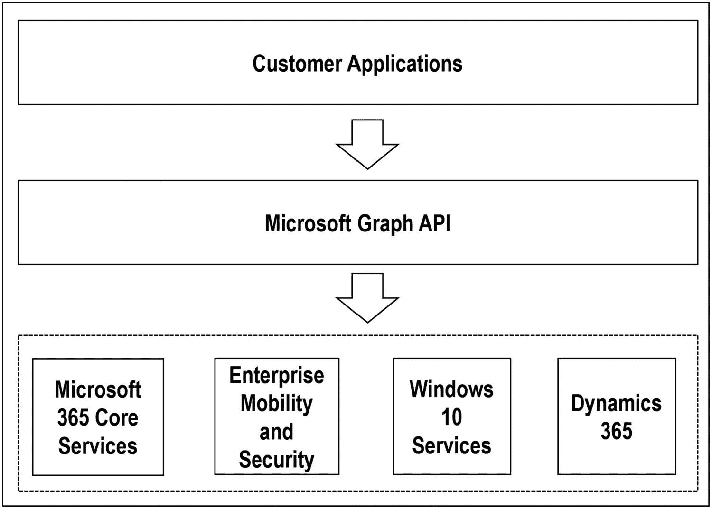

一个模型图，说明了通过 Graph API 在客户应用程序和 Microsoft 服务器之间的交互。顶部是客户应用程序；中间层是 Microsoft Graph API，它分为 Microsoft 365 核心服务、企业移动性与安全性、Windows 10 服务和 Dynamics 365。

图 10-1

Microsoft Graph API 和 Microsoft 服务

现在让我们探索一个 Graph API 的 Microsoft 365 核心用例。每当应用程序失败时，开发者需要与他的主管设置一个会议邀请。他需要在邀请中附加来自 OneDrive 的日志文件。此日志文件由应用程序生成并存储在 OneDrive 中。所有这些操作都应该是自动化的。开发者无需全天候监控 OneDrive 并不断安排会议。我们可以使用 Microsoft Graph API 构建一个解决方案来帮助开发者。该解决方案将使用 Graph API 读取主管的日历并找到可用的空闲时段。然后，它将访问开发者的邮箱并与主管设置一个邀请。该解决方案将使用 Graph API 访问存储在 OneDrive 中的日志并将其附加到邀请中。图 10-2 演示了我们讨论的用例。

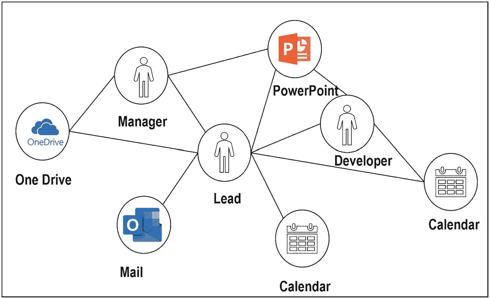

一个模型图，说明了 Microsoft Graph API 和 Microsoft 365 之间的网络基础设施。它包括中心的主管；左侧的 OneDrive、经理和邮件；右侧的 PowerPoint、开发者、日历。

图 10-2

Microsoft Graph API 和 Microsoft 365 用例


## 使用 Graph API 发送邮件的步骤

作为先决条件，您应拥有 Microsoft 365 E5 开发者许可证。该许可证将帮助您为用户或服务帐户配置邮箱以发送邮件。

注意

您可以在 [`https://developer.microsoft.com/en-us/microsoft-365/dev-program`](https://developer.microsoft.com/en-us/microsoft-365/dev-program) 免费获取 Microsoft 365 E5 开发者许可证。您可以创建自己的沙盒环境，用于本章的演示。

购买 Microsoft 365 开发者 E5 许可证后，您可以按照以下步骤配置 Graph API，并从您的应用程序调用 Graph API 发送电子邮件：

1.  在 Azure 租户中创建一个用户。

2.  为该用户分配 Microsoft 365 E5 许可证，以便使用 Microsoft 365 邮箱。

3.  创建一个服务主体，并为该服务主体授予发送邮件所需的 Graph API 权限。

4.  配置您的 Java 应用程序以发送邮件。

## 使用 Microsoft Graph API 发送邮件

让我们在 Azure 租户中创建一个用户。我们将使用该用户通过 Java 应用程序发送电子邮件。转到 Azure 门户，点击 *Azure Active Directory*，如图 10-3 所示。

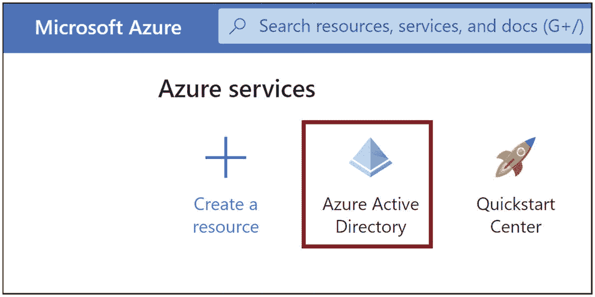

Microsoft Azure 桌面屏幕截图。左上角显示 Microsoft Azure，右侧有一个搜索栏。空白区域显示 Azure 服务，包括用于创建资源的加号、一个内部有小金字塔的正方形（代表 Azure Active Directory），以及一个用于快速入门中心的火箭图标。

图 10-3

点击 Azure Active Directory

点击 *用户*，然后点击 *新建用户*，如图 10-4 所示。我们可以在此处租户中创建一个新用户。

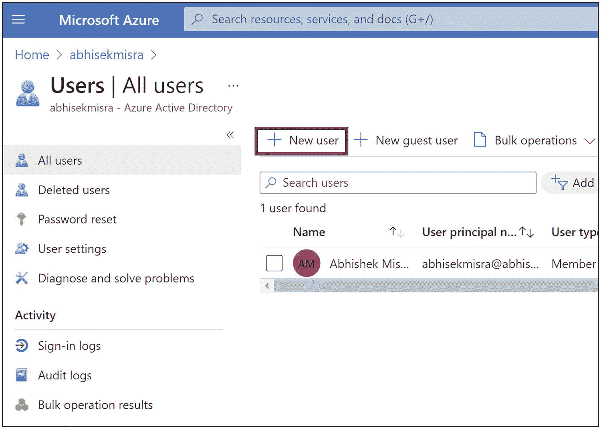

Microsoft Azure 用户配置文件窗口，包含用户信息。用户界面下有以下选项：所有用户、已删除用户、密码重置、用户设置、诊断并解决问题。活动包括登录、审核和批量操作结果。右侧选择了新用户，其中有一个用户：Abhishek Mishra。

图 10-4

点击新建用户

选择 *创建用户*，如图 10-5 所示。

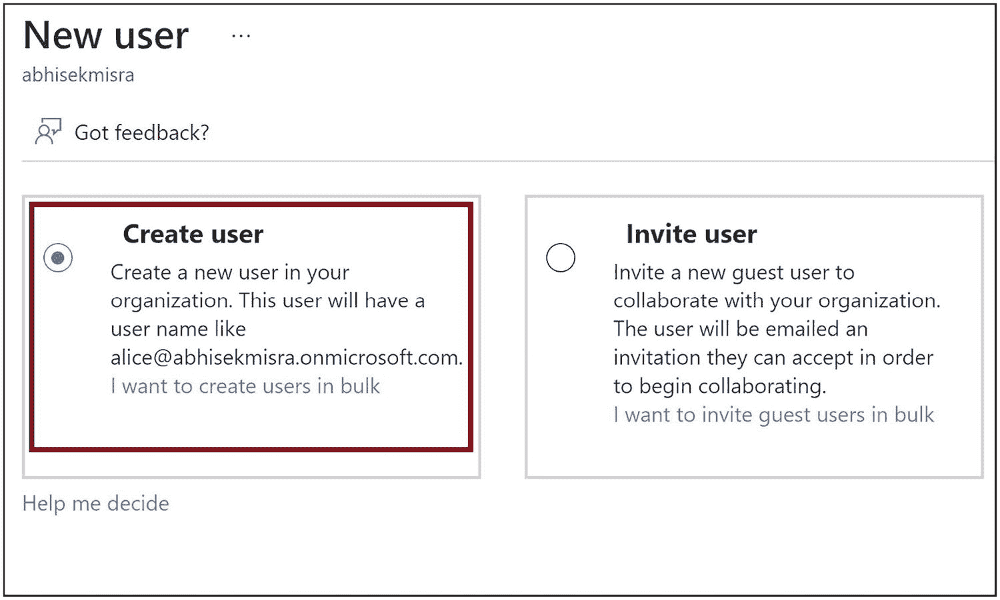

新建用户窗口的图示，包含创建用户和邀请用户选项。创建用户选项被选中，其内容为：在您的组织中创建新用户。该用户的用户名格式类似于 Alice@abhisekmisra.onmicrosoft.com。底部左侧显示“我想批量创建用户。帮我决定”。右侧显示邀请用户。

图 10-5

创建用户

提供用户的用户名、密码详情以及其他必要信息，如图 10-6 所示。

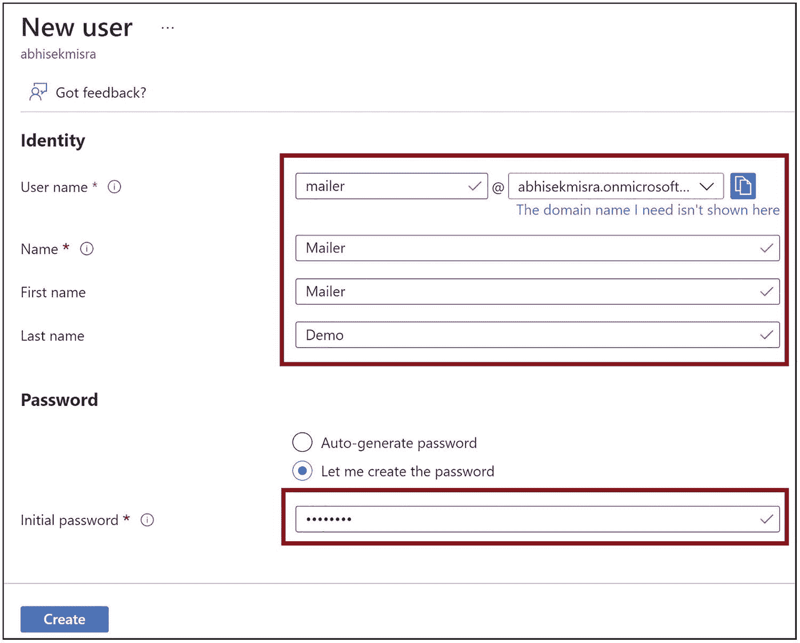

新建用户窗口的图示，在“标识”下有数据输入栏，用于输入用户名、名称、名字和姓氏。此处，用户名为 mailer@abhisekmisra.onmicrosoft.com，名称为 mailer。密码下有数据输入栏用于创建初始密码，左下角有创建选项卡。

图 10-6

提供用户详细信息

确保为您创建的用户提供使用位置。点击 *创建*，如图 10-7 所示。用户将被创建。

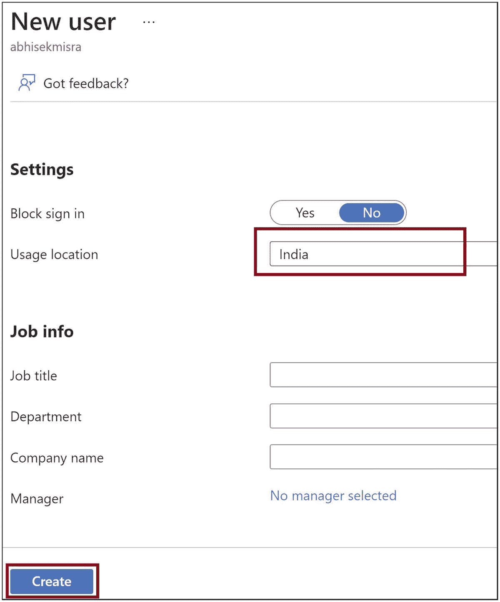

新建用户窗口的图示，在“设置”下有用于阻止登录和使用位置的选项卡。使用位置选项卡显示“印度”并被高亮。设置下方是作业信息，包含职务、部门和公司名称选项卡。经理显示未选择经理，左下角的创建选项被高亮。

图 10-7

提供使用位置

用户创建完成后，点击该用户，此操作将导航至用户详细信息部分，我们可以在其中分配许可证。图 10-8 演示了此操作。

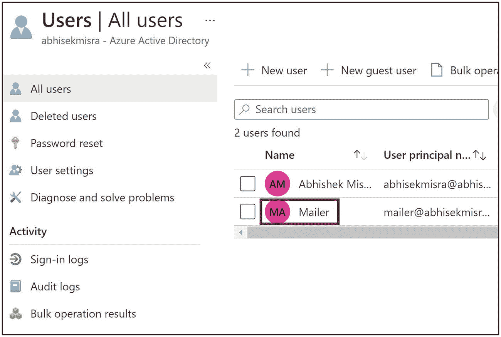

Microsoft Azure 窗口，包含用户界面，其下有如下选项：所有用户、已删除用户、密码重置、用户设置、诊断并解决问题。活动包括登录、审核和批量操作结果。右侧有 2 个用户：Abhishek Mishra 和 mailer，其中 mailer 被选中。

图 10-8

点击已创建的用户

点击 *许可证*，然后点击 *分配*，如图 10-9 所示。

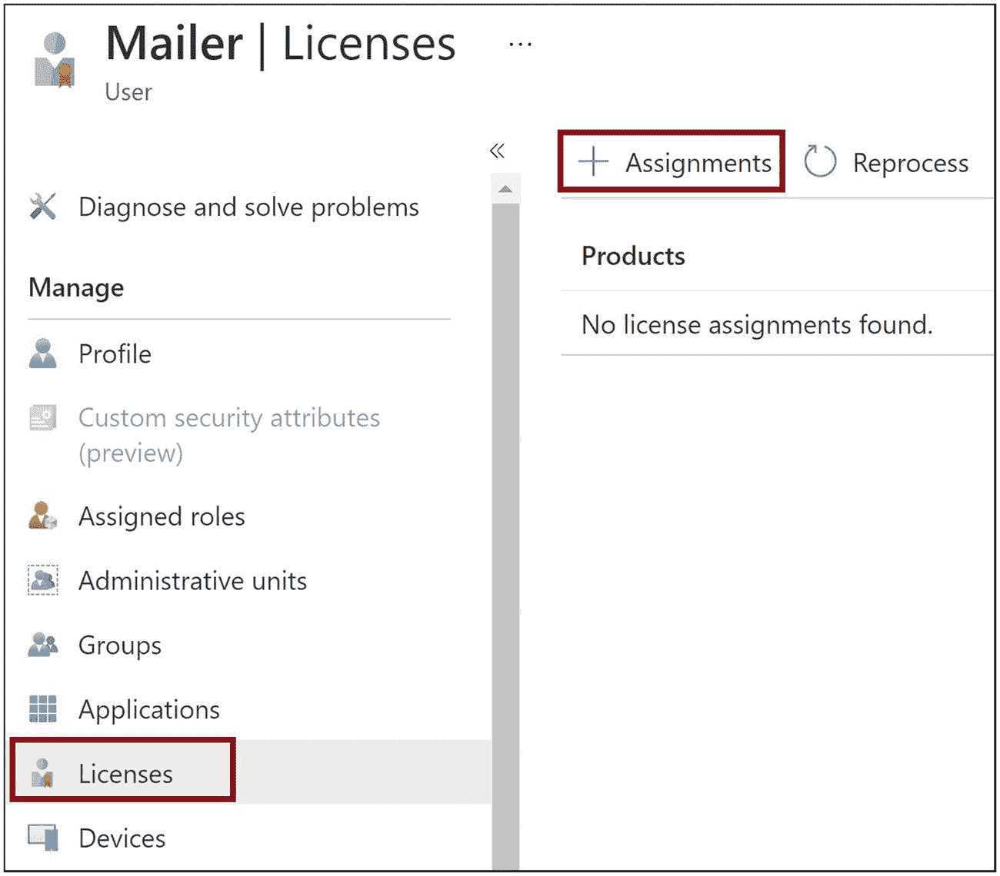


邮件许可证窗口左侧是“管理”选项卡，其下方包含“个人资料”、“已分配角色”、“管理单位”、“组”、“应用程序”、“许可证”和“设备”等标签页，其中“许可证”处于选中状态。右侧显示“分配”已选中，但在产品下未找到任何许可证分配。

图 10-9

为用户分配许可证

选择 Microsoft 365 E5 开发者许可证。只有当你已购买该订阅时，此许可证才会列在此处。点击*保存*，如图 10-10 所示。

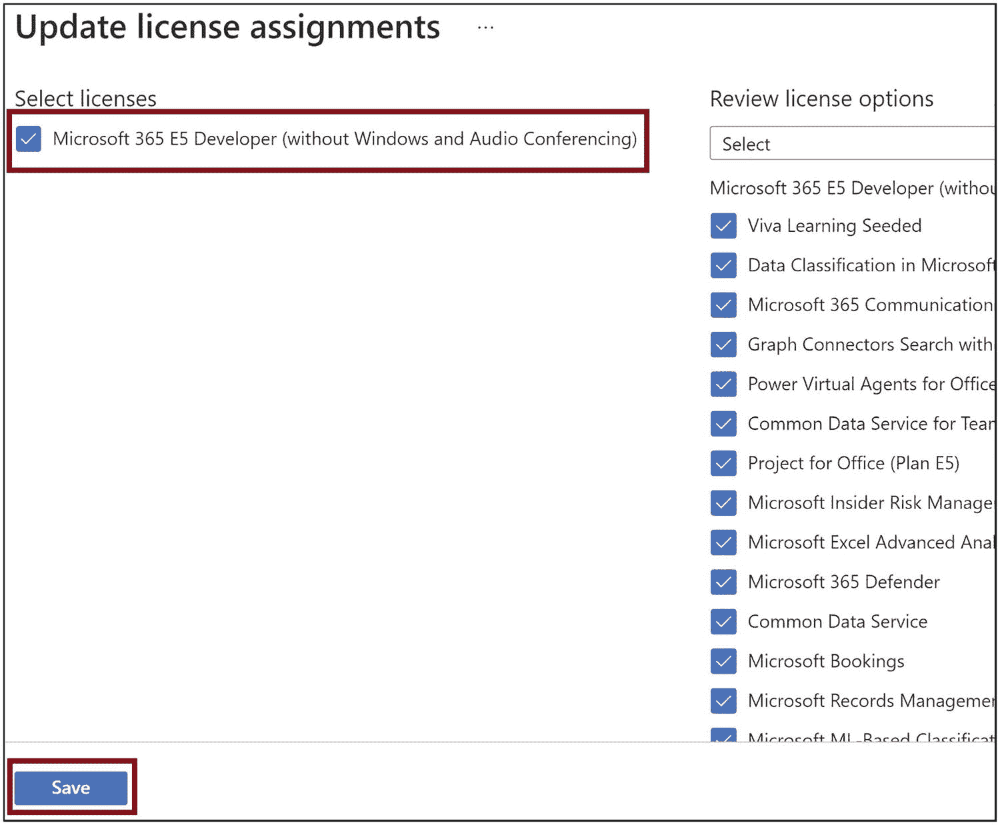

更新许可证分配的示意图中，左侧选中了“选择许可证”，其下方选中了“Microsoft 365 E5 开发者（不含 Windows 和音频会议）”。左下角的“保存”选项卡处于选中状态。右侧显示“查看许可证选项”，其下方有一个选择栏。

图 10-10

选择 Microsoft 365 E5 开发者许可证

现在用户已准备就绪，我们可以从 Java 应用程序中使用该用户发送邮件。我们需要一个服务主体来向 Azure 租户进行身份验证并发送电子邮件。在 Azure Active Directory 中，点击*应用注册*。然后点击*新注册*，如图 10-11 所示。

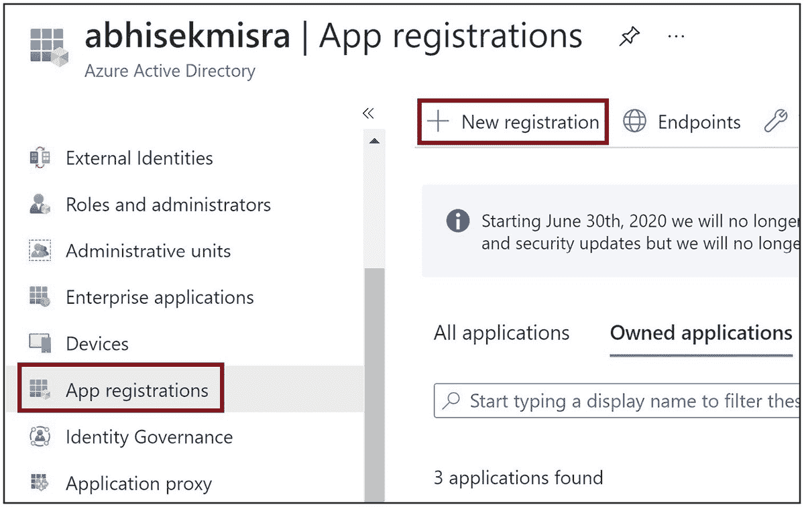

示意图显示的是 abhisekmisra 应用注册窗口。左侧包含“外部身份”、“角色和管理员”、“管理单位”、“企业应用程序”、“设备”、“应用注册”、“身份治理”和“应用程序代理”等标签页，其中“应用注册”处于选中状态。右侧的“新注册”处于选中状态。在“拥有的应用程序”下，找到了 3 个应用程序。

图 10-11

点击应用注册

为服务主体提供一个名称，然后点击*注册*，如图 10-12 所示。

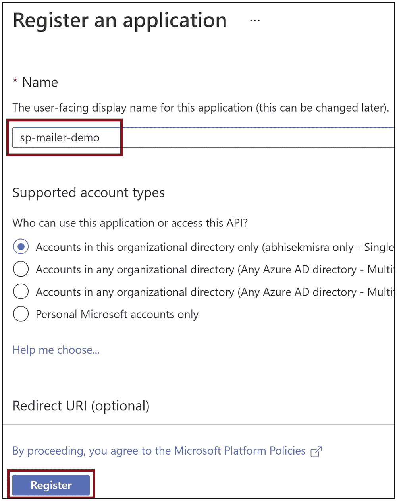

示意图显示的是“注册应用程序”窗口。该窗口包含“名称”输入栏，其中输入了“sp-mailer-demo”并高亮显示。其下方是“支持的帐户类型”，其中选中了“仅此组织目录中的帐户”，左下角是“注册”选项卡，并且已选中。

图 10-12

创建新的服务主体

创建服务主体后，打开该服务主体并点击*API 权限*。点击*添加权限*，然后为 Microsoft Graph 添加 *Mail.Send* 权限，如图 10-13 所示。确保为你添加的权限提供管理员同意。

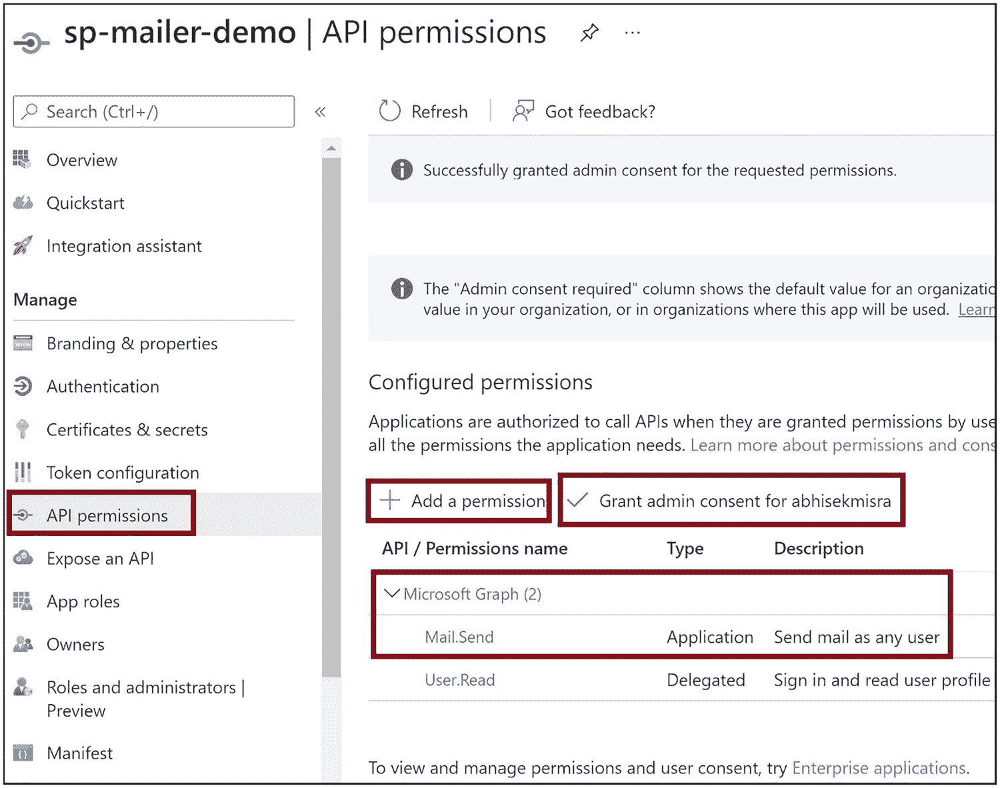

sp-mailer-demo API 权限窗口。左侧的“管理”包含多个选项卡，其中“API 权限”处于选中状态。右侧显示“已配置的权限”，其中“添加权限”和“为 abhisekmisra 授予管理员同意”处于选中状态。在“API”、“类型”和“描述”列下，分别显示“Mail.Send”、“应用程序”和“以任何用户身份发送邮件”。

图 10-13

提供 API 权限

现在我们需要为服务主体生成一个机密。转到*证书和机密*，然后点击*新建客户端机密*，如图 10-14 所示。生成一个机密并复制你创建的机密的值。你将在 Java 代码中使用此值进行身份验证和发送邮件。

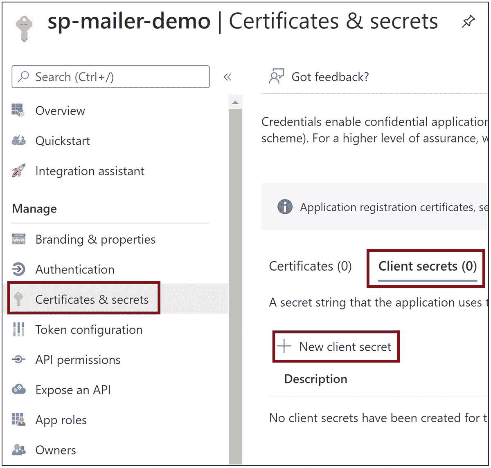

sp-mailer-demo 证书和机密窗口的示意图。左侧的“管理”包含多个选项卡，其中“证书和机密”处于选中状态。右侧显示“证书 0”和“客户端机密 0”，并且后者处于选中状态。用于创建客户端机密的“新建客户端机密”选项卡位于“客户端机密 0”下方，并且已选中。

图 10-14

为服务主体生成客户端机密

转到*概述*页面，复制*应用程序（客户端）ID* 和*目录（租户）ID*，如图 10-15 所示。我们将在 Java 代码中使用这些值。

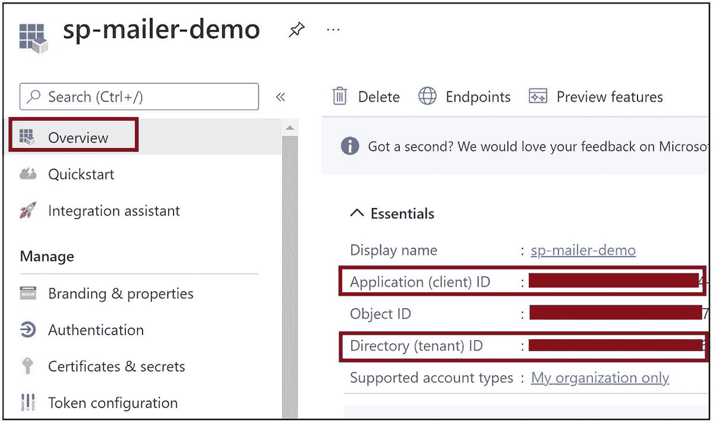

示意图显示的是 sp-mailer-demo 窗口。左侧包含“概述”、“快速入门”和“集成助手”，其中“概述”处于选中状态。右侧显示“基本信息”，其下方是“显示名称：sp-mailer-demo”、“应用程序（客户端）ID”、“对象 ID”和“目录（租户）ID”。这些 ID 使用水平条高亮显示。

图 10-15

复制服务主体的客户端 ID 和租户 ID

现在我们已经准备好了用户和服务主体。让我们创建基于 Maven 的 Java 控制台应用程序来发送电子邮件。

让我们将 Microsoft Graph API 和 Identity 包添加到 *pom.xml* 文件中，如清单 10-1 所示。

```
com.microsoft.graph
microsoft-graph
5.0,)

com.azure
azure-identity
[1.3,)

清单 10-1
Pom.xml
```

转到 Java 类文件中的 *main* 函数，如清单 [10-2 所示，并添加以下代码。我们需要创建身份验证提供程序，该提供程序将使用服务主体客户端机密来验证和授权代码使用我们创建的用户发送邮件。

```
String clientId="{提供服务主体的客户端 ID}";
String clientSecret = "提供服务主体的机密值";
String tenantId = "提供租户 ID";
//您可以使用默认范围发送。
List SCOPES = List.of("https://graph.microsoft.com/.default");
//基于服务主体构建客户端凭据
final ClientSecretCredential clientCredential = new ClientSecretCredentialBuilder()
.clientId(clientId)
.clientSecret(clientSecret)
.tenantId(tenantId)
.build();
//构建一个令牌凭据身份验证提供程序，该提供程序可以使用服务主体进行身份验证
final TokenCredentialAuthProvider tokenProvider =
new TokenCredentialAuthProvider(SCOPES, clientCredential);
清单 10-2
构建身份验证提供程序
```

构建图形客户端以使用我们创建的身份验证提供程序，并使用该用户发送邮件，如清单 10-3 所示。

```
//构建图形客户端
final GraphServiceClient graph = GraphServiceClient
.builder()
.authenticationProvider(tokenProvider)
.buildClient();
清单 10-3
构建图形客户端对象
```

现在让我们构建邮件正文和主题，并提供我们需要向其发送邮件的收件人列表，如清单 10-4 所示。

```
//构建消息
Message message = new Message();
message.subject = "订单状态 - IX1234";
ItemBody body = new ItemBody();
body.contentType = BodyType.HTML;
body.content = "尊敬的客户  您的订单已准备就绪。即将发货  谢谢运营团队";
message.body = body;
LinkedList to = new LinkedList();
Recipient toReceiver = new Recipient();
EmailAddress email = new EmailAddress();
email.address = "abhisek.misra@thecloudcompute.com";
toReceiver.emailAddress = email;
to.add(toReceiver);
message.toRecipients = to;
清单 10-4
构建邮件方法
```

让我们使用图形客户端对象，并通过我们之前创建的用户发送邮件，如清单 10-5 所示。

```
//发送邮件。提供我们在 Azure AD 中创建并分配了 Microsoft 365 开发者 E5 许可证的用户的邮件地址
graph.users("mailer@abhisekmisra.onmicrosoft.com")
.sendMail(UserSendMailParameterSet
.newBuilder()
.withMessage(message)
.withSaveToSentItems(false)
.build())
.buildRequest()
.post();
清单 10-5
发送邮件
```

以下是从 Java 应用程序使用 Graph API 发送邮件的完整代码，如清单 10-6 所示。


```
import com.azure.identity.ClientSecretCredential;
import com.azure.identity.ClientSecretCredentialBuilder;
import com.microsoft.graph.authentication.TokenCredentialAuthProvider;
import com.microsoft.graph.models.*;
import com.microsoft.graph.requests.GraphServiceClient;
import java.util.LinkedList;
import java.util.List;
public class SendMail {
public static void main(String args[])
{
String clientId="{Provide Client ID for Service Principal}";
String clientSecret = "Provide Secret value for Service Principal";
String tenantId = "Provide Tenant ID";
//You can send using the default scope.
List SCOPES = List.of("https://graph.microsoft.com/.default");
//Build Client Credential based on the Service Principal
final ClientSecretCredential clientCredential = new ClientSecretCredentialBuilder()
.clientId(clientId)
.clientSecret(clientSecret)
.tenantId(tenantId)
.build();
//Build a Token Credential Auth provider that can authenticate using the Service Principal
final TokenCredentialAuthProvider tokenProvider =
new TokenCredentialAuthProvider(SCOPES, clientCredential);
//Build the Graph Client
final GraphServiceClient graph = GraphServiceClient
.builder()
.authenticationProvider(tokenProvider)
.buildClient();
//Construct the message
Message message = new Message();
message.subject = "Order Status - IX1234";
ItemBody body = new ItemBody();
body.contentType = BodyType.HTML;
body.content = "Dear Customer   You order is ready. It will be dispatched soon   ThanksOPs Team";
message.body = body;
LinkedList to = new LinkedList();
Recipient toReceiver = new Recipient();
EmailAddress email = new EmailAddress();
email.address = "abhisek.misra@thecloudcompute.com";
toReceiver.emailAddress = email;
to.add(toReceiver);
message.toRecipients = to;
//Send mail. Provide the mail address of the user we created in the Azure AD
//and have assigned Microsoft365 Developer E5 license
graph.users("mailer@abhisekmisra.onmicrosoft.com")
.sendMail(UserSendMailParameterSet
.newBuilder()
.withMessage(message)
.withSaveToSentItems(false)
.build())
.buildRequest()
.post();
}
}
清单 10-6
完整代码
```

## Microsoft Graph API 浏览器

您可能需要找到完全适合您用例的正确 Graph API。Microsoft Graph API 浏览器可以帮助您找到正确的 API。它为您提供所有可用的 Microsoft Graph API。您可以使用 Microsoft Graph API 浏览器测试 Graph API 并查看响应。清单 10-7 显示了 Microsoft Graph API 浏览器的 URL。

```
https://developer.microsoft.com/en-us/graph/graph-explorer
清单 10-7
Microsoft Graph API 浏览器 URL
```

现在，让我们进入 Microsoft Graph API 浏览器，尝试一个流行的 Graph API 来获取用户配置文件。使用您的 Azure 凭据登录 Microsoft Graph API。您将能够看到可用的 Graph API。图 10-16 展示了部分可用的 Graph API。

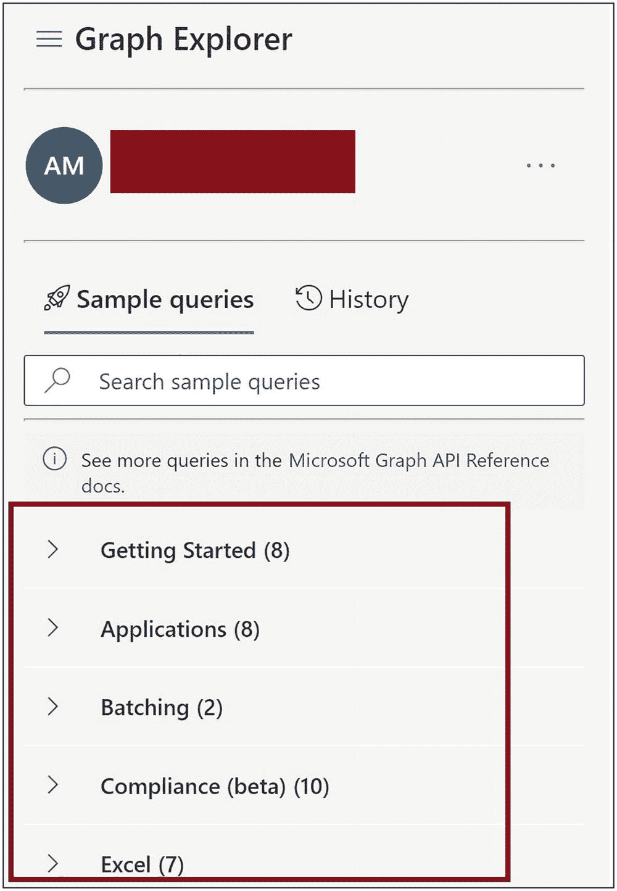

一个插图显示了 Graph 浏览器窗口。其中有“示例查询”和“历史记录”选项卡，其中“示例查询”带有下划线，下方是一个搜索栏。底部有“入门 (8)”、“应用程序 (8)”、“批处理 (2)”、“合规性 (beta) (10)”和“Excel (7)”选项卡。

图 10-16

Microsoft Graph API 浏览器

展开*入门*节点，并点击*我的个人资料* Graph API，如图 10-17 所示。

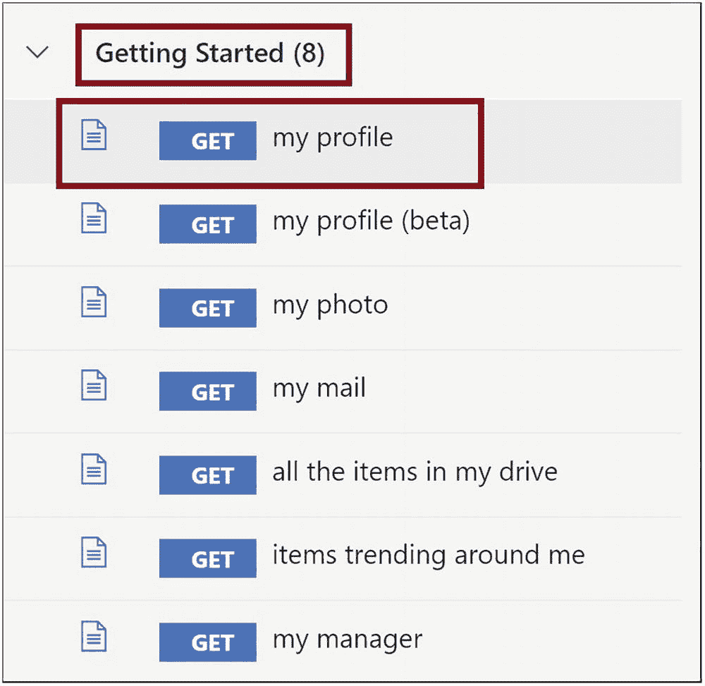

Graph API 的插图显示了一个“入门 (8)”选项，其中包含 8 个 GET 信息。它们如下：我的个人资料、我的个人资料 (beta)、我的照片 (beta)、我的邮件、我的驱动器中的所有项目、我周围的热门项目以及我的经理。其中“GET 我的个人资料”被高亮显示。

图 10-17

触发我的个人资料 Graph API

您将获得 API 调用的响应，如图 10-18 所示。您可以在此处修改 API 调用并重新触发 API。

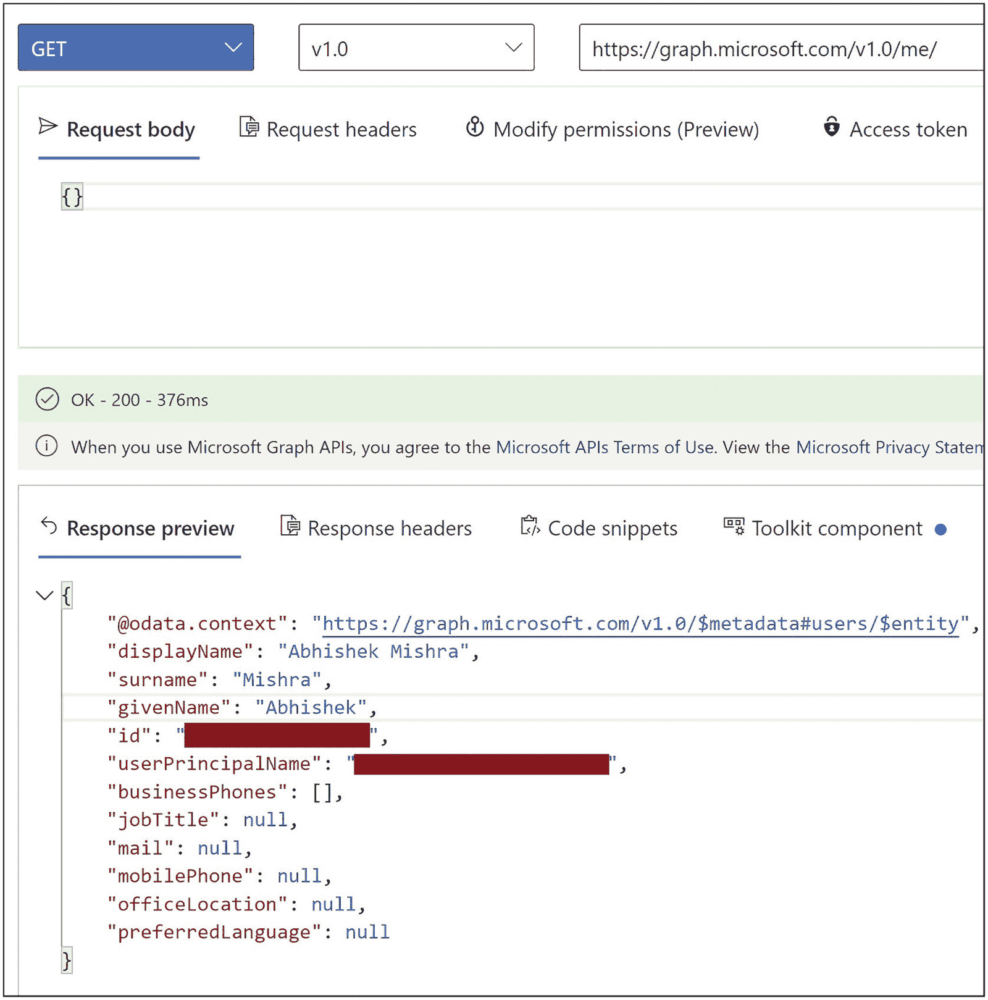

Graph API 的截图。在 GET 选项下，请求体包含大括号。响应预览中包含了用户信息的编码。此处，显示名称为 Abhishek Mishra，姓氏为 Mishra，给定名称为 Abhishek。他的 ID 和用户主体名称已隐藏。邮件、电话、职务和语言均为 null。

图 10-18

我的个人资料 Graph API 响应

## 总结

在本章中，我们学习了 Microsoft Graph API 的基础知识，以及如何为 Azure AD 用户配置权限以使用 Microsoft Graph API 发送邮件。然后，我们开发了一个基于 Maven 的 Java 代码，并使用 Microsoft Graph API 发送了邮件。在下一章中，我们将学习如何使用 Azure Monitor 和 Application Insights 监控 Java 应用程序。

以下是本章的关键要点：

*   Microsoft Graph API 为您提供了一组 RESTful 端点，您可以使用它们与 Microsoft 365 核心服务、企业移动性与安全性服务、Windows 10 服务和 Dynamics 365 服务进行交互。

*   作为先决条件，您需要拥有 Microsoft 365 E5 开发者许可证才能使用 Graph API 发送邮件。此许可证将帮助您为用户或服务帐户配置邮箱以发送邮件。

*   以下是配置 Graph API 并从您的应用程序调用 Graph API 发送电子邮件的步骤：
    *   您需要在 Azure 租户中创建一个用户。

    *   为用户分配 Microsoft 365 E5 许可证以使用 Microsoft 365 邮箱。

    *   创建一个服务主体，并为该服务主体授予必要的 Graph API 权限以发送邮件。

    *   配置您的 Java 应用程序以发送邮件。

