# 11. 使用 Azure Monitor 和 Application Insights 进行调试与监控

应用程序有时可能会变得缓慢，您可能需要排查性能问题。应用程序性能下降可能有多种原因。例如，当应用程序处理长时间运行的请求时，CPU 或内存利用率可能会变高。我们需要一种机制来定期监控应用程序性能指标（如 CPU、内存和磁盘利用率），并在应用程序达到阈值性能水平时向运维团队发出警报。您可能还需要日志来调试应用程序故障。Azure Monitor 帮助您跟踪应用程序指标，而 Azure Application Insights 帮助您分析在 Azure、本地或任何其他公有云上运行的应用程序的日志。

在上一章中，我们学习了 Microsoft Graph API 的基本概念。然后，我们创建了一个基于 Java 的应用程序，并配置了 Microsoft Graph API 来发送邮件。在本章中，我们将详细了解 Azure Monitor 和 Azure Application Insights。然后，我们将构建一个 Java 应用程序，该应用程序可以使用 Azure Monitor 生成性能指标，并使用 Azure Application Insights 生成应用程序日志。

## 结构

在本章中，我们将讨论 Azure Monitor 和 Application Insights 的以下方面：

*   Azure Monitor 和 Application Insights 简介

*   配置 Azure Monitor 指标和仪表板

*   创建性能警报

*   为 Java 应用程序使用 Application Insights

## 目标

学习本章后，您应该能够获得以下知识：

*   理解 Azure Monitor 和 Application Insights 的概念

*   为 Java 应用程序配置 Azure Monitor 和 Application Insights


## Azure Monitor 与 Application Insights 简介

Azure Monitor 可帮助您从 Azure、本地或任何其他云平台上的应用程序和基础架构中收集性能指标和日志数据。它从 Azure 服务、Azure 订阅和 Azure 租户中收集数据。Azure Monitor 中存储的日志和指标可根据您的需求进行分析和进一步使用。您可以从 Azure Monitor 收集的日志和指标中获取以下见解：

*   使用 Application Insights，您可以深入了解您的应用程序。
*   使用容器见解，您可以深入了解您的容器。
*   使用虚拟机见解，您可以深入了解您的虚拟机。
*   您可以深入了解您的网络和存储。

您可以使用 Log Analytics 分析采集的日志，并使用指标浏览器分析指标。您可以构建仪表板和工作簿，以可视化采集的日志和指标数据的分析与见解。您可以通过创建警报和自动缩放设置，根据分析结果对日志和指标做出响应。您可以与 Logic Apps 工作流集成，并根据分析结果执行操作。图 11-1 展示了 Azure Monitor。

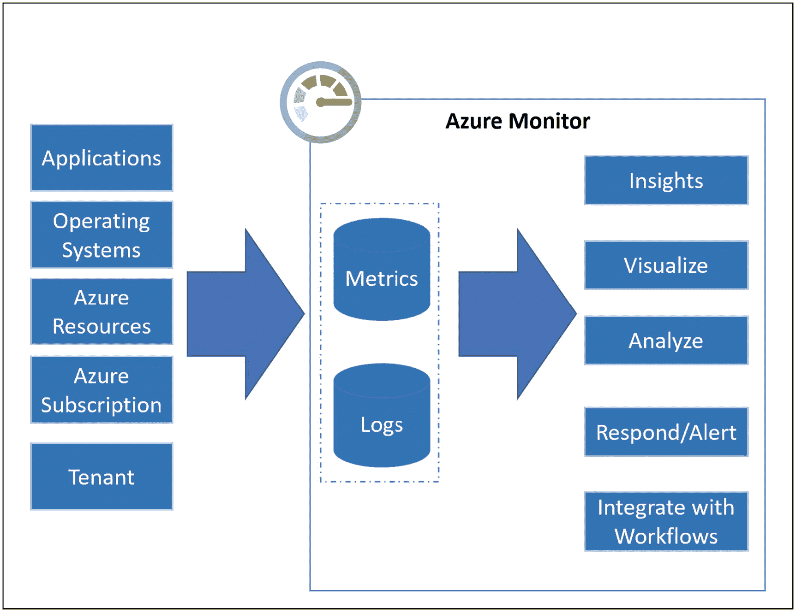

Azure Monitor 的流程图。输入是应用程序、操作系统、Azure 资源、Azure 订阅和租户，这些输入提供给 Azure Monitor。指标和日志进一步提供见解、可视化、分析、响应或警报，并与 Azure Monitor 中的工作流集成。

图 11-1

Azure Monitor

Application Insights 可帮助您监控并收集在 Azure、本地或任何其他云上运行的应用程序的日志和性能指标数据的见解。它可以与使用各种编程语言和框架（如 .NET、Java、Python、PHP 等）开发的应用程序集成。图 11-2 展示了 Application Insights。

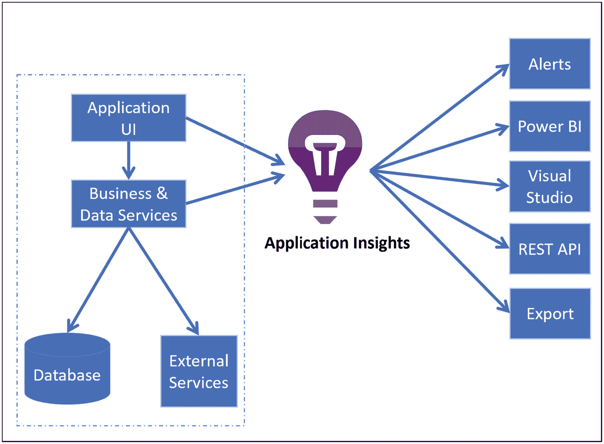

Application Insights 图表提供业务和数据见解，以形成数据库和外部服务。Application Insights 组件包括警报、Power BI、Visual Studio、REST API 和导出。

图 11-2

Application Insights

注意

Azure Monitor 收集并分析应用程序、基础架构、操作系统、Azure 服务、租户和 Azure 订阅的数据。Application Insights 是 Azure Monitor 的一个子集，可帮助您分析并从应用程序数据中收集见解。

## 配置 Azure Monitor 指标和仪表板

让我们使用 Azure Monitor 为 Azure WebApp 配置指标。然后，我们将创建一个专用仪表板来显示这些指标。作为先决条件，我们应该事先创建一个 WebApp。请参阅第 2 章了解如何创建 WebApp。转到 Azure 门户并搜索 *Monitor*。在搜索结果中单击 *Monitor*，如图 11-3 所示。

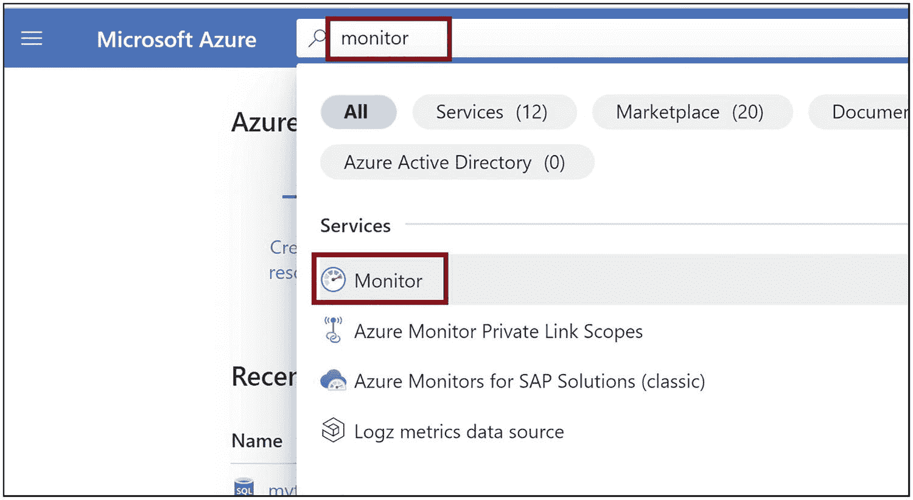

Application Insights 图表提供业务和数据见解，以形成数据库和外部服务。Application Insights 组件包括警报、Power BI、Visual Studio、REST API 和导出。

图 11-3

搜索 Monitor

在 Azure Monitor 中单击 *Metrics*，如图 11-4 所示。

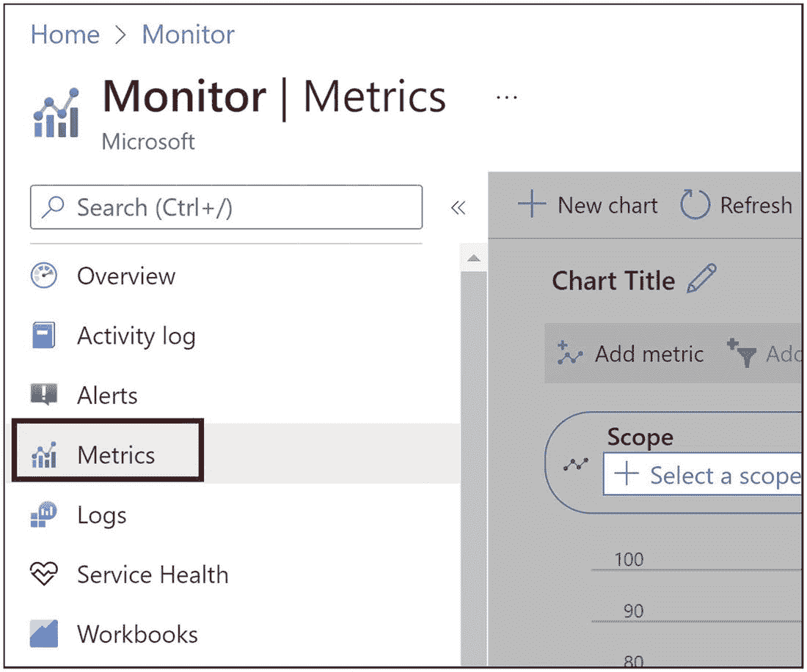

Microsoft Azure 窗口的屏幕截图，其中搜索栏中提到了 monitor。下拉菜单中找到了 monitor 选项，以及其他选项，如 azure monitor private link scopes、azure monitors for SAP solutions 和 logz metrics data sources。

图 11-4

转到 Metrics

选择订阅并展开创建 Azure WebApp 的资源组，如图 11-5 所示。

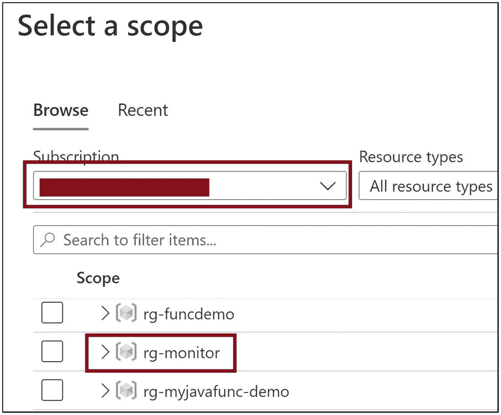

Microsoft Monitor 的屏幕截图。Metrics 选项在左侧菜单中显示为第四个选项。菜单中的其他选项包括概述、活动日志、警报、日志、服务健康状态和工作簿。

图 11-5

选择资源组

选择 WebApp 并单击 *OK*，如图 11-6 所示。

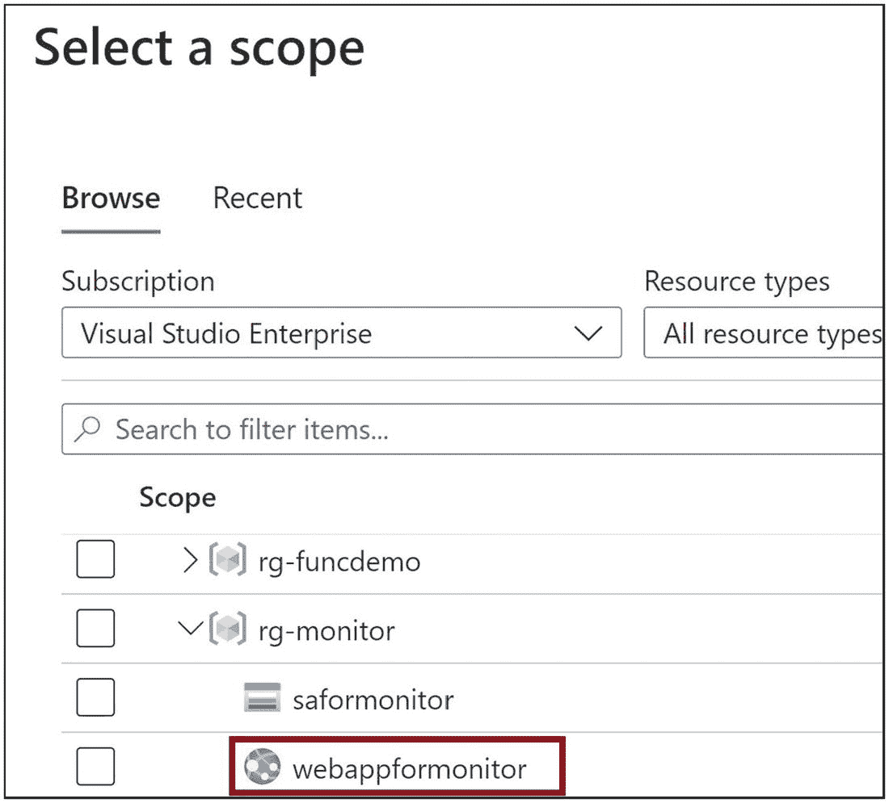

选择作用域（显示浏览选项卡）的屏幕截图。选择的订阅是 visual studio enterprise，所有资源类型已选择。作用域是 r g hyphen func demo、r g hyphen monitor 的下拉列表（包含 safor monitor）以及 web app for monitor。选中的选项是 web app for monitor。

图 11-6

选择 WebApp

选择 CPU 时间总和的指标详细信息，如图 11-7 所示。

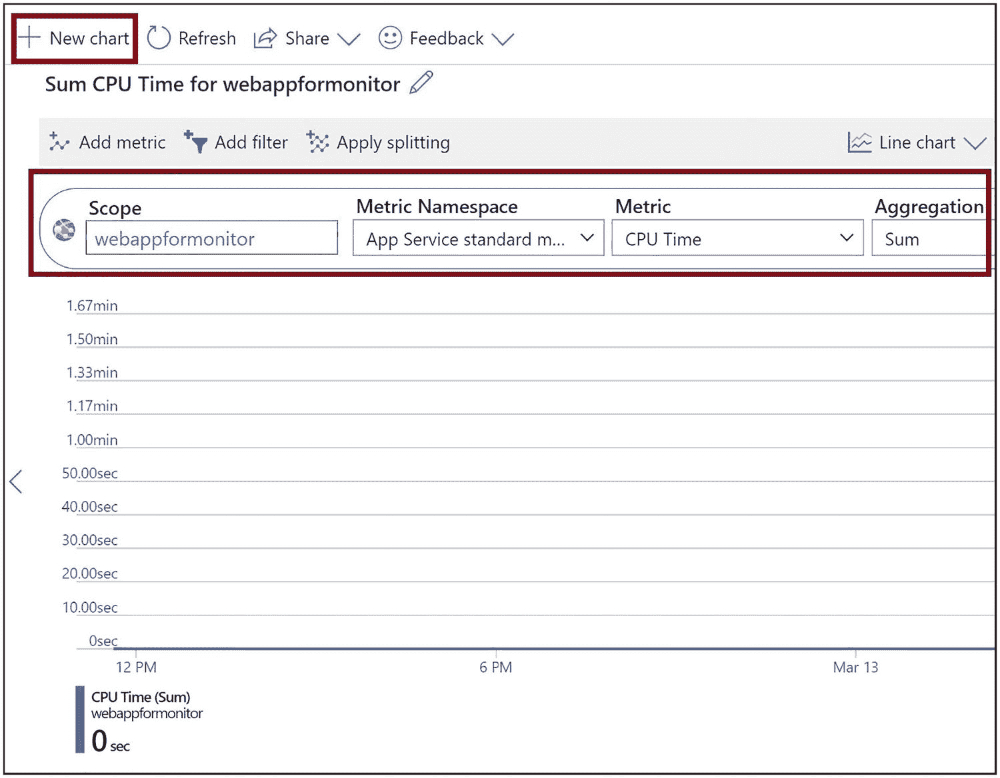

已单击新建图表选项。web app for monitor 的 Sum C P U time，其中作用域是 web app for monitor，指标命名空间是 app service standard，指标是 C P U time 选项，聚合方式是总和。其下方是空白线条，每条线条对应不同的时间刻度。

图 11-7

配置指标

让我们将此指标添加到仪表板。将指标添加到仪表板后，单击 *New chart* 以创建新指标。首先，将现有指标添加到仪表板，然后创建新指标。单击 *Save to Dashboard* 和 *Pin to Dashboard*，如图 11-8 所示。

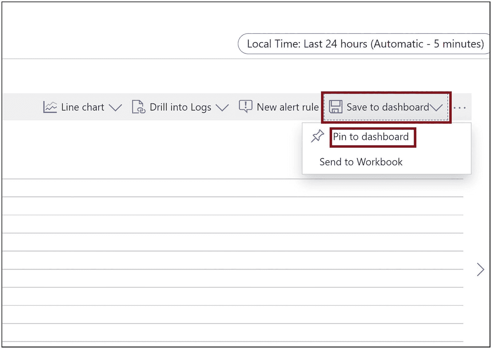

本地时间为过去 24 小时，并包含自动加 5 分钟。保存到仪表板的下拉菜单还有 2 个选项：固定到仪表板和发送到工作簿。在下拉菜单中选择固定到仪表板选项。

图 11-8

添加到仪表板

转到 *Create new* 选项卡并提供仪表板名称。单击 *Create and pin*，如图 11-9 所示。

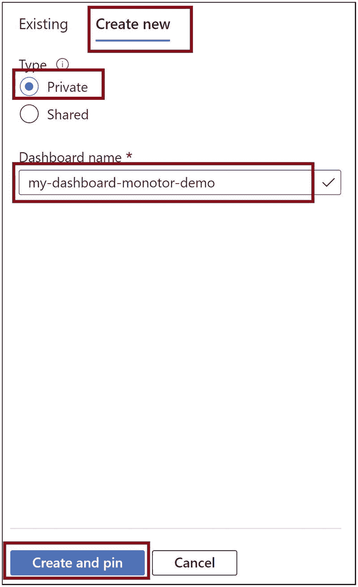

现有或新建仪表板的屏幕截图。新仪表板的类型可以选择为专用或共享。仪表板名称是 my hyphen dashboard hyphen monotor hyphen demo。底部的提示选项是创建并固定以创建仪表板，以及取消选项。

图 11-9

创建仪表板

现在单击 *New chart* 并添加一个请求总和的指标，如图 11-10 所示。

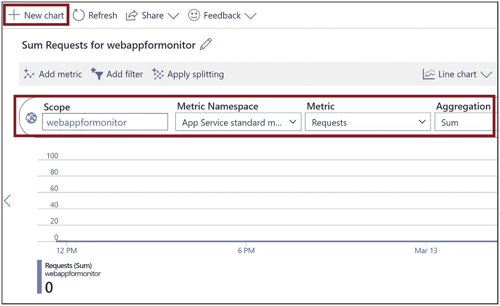


现有仪表盘或新建仪表盘的截图。新建仪表盘的类型可选择为私有或共享。仪表盘名称为 my hyphen dashboard hyphen monotor hyphen demo。底部的提示选项是“创建并固定”，用于创建仪表盘，以及“取消”选项。

图 11-10

配置指标

将此指标固定到我们之前创建的仪表盘上，如图 11-11 所示。

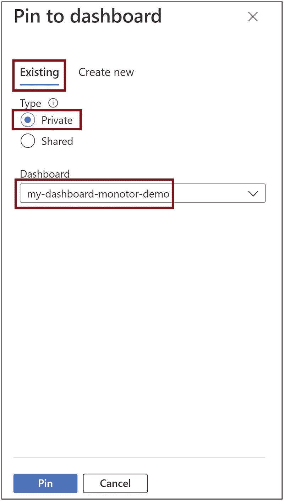

固定到现有仪表盘或新建仪表盘的截图。现有仪表盘的类型可选择为私有或共享。仪表盘名称为 my hyphen dashboard hyphen monotor hyphen demo。底部的提示选项是“固定到现有仪表盘”以及“取消”选项。

图 11-11

固定到仪表盘

让我们通过点击*新建图表*来为响应时间再添加一个指标，如图 11-12 所示。将其固定到我们之前创建的仪表盘上。

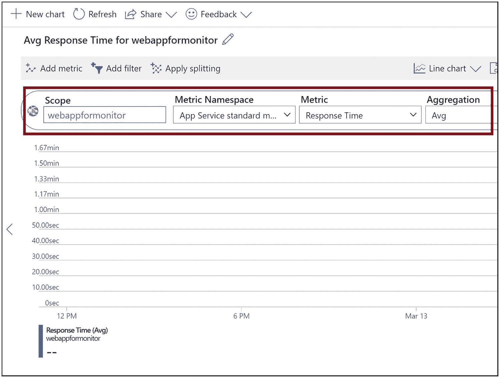

已点击新建图表选项。webappformonitor 的响应时间总和，其作用域为 webappformonitor，指标命名空间为应用服务标准，指标为响应时间选项，聚合方式为总和。其下方是空白行，每行对应不同的时间刻度。

图 11-12

配置指标

转到门户菜单中的*仪表盘*，如图 11-13 所示。

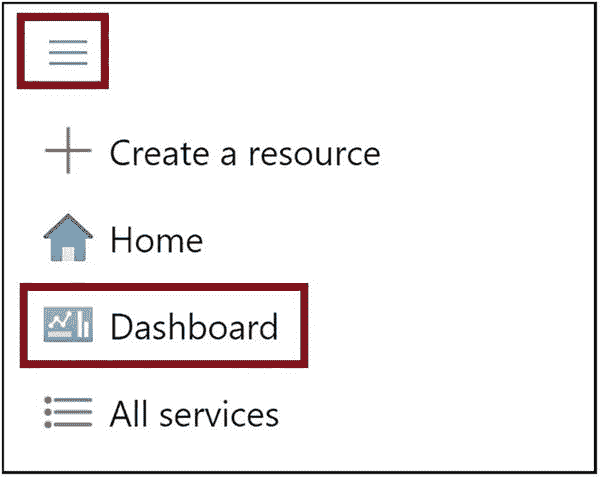

仪表盘截图，其菜单包含其他选项，如创建资源、主页、仪表盘和所有服务。

图 11-13

转到仪表盘

选择我们之前创建的仪表盘，如图 11-14 所示。

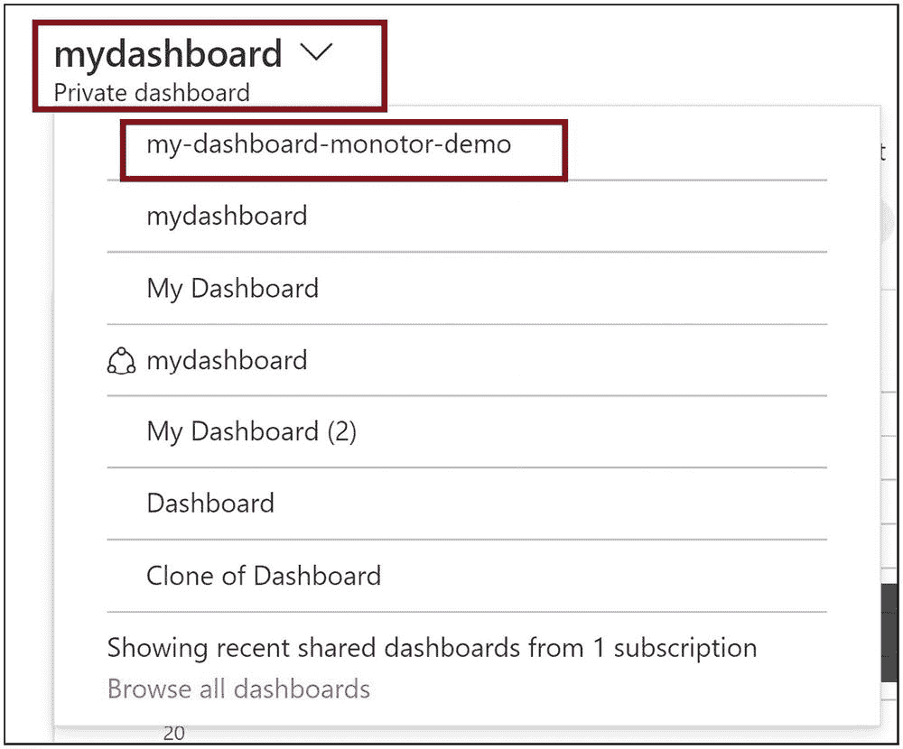

我的仪表盘截图显示其为私有。我的仪表盘的下拉菜单包含以下选项：我的仪表盘、my hyphen dashboard hyphen monotor hyphen demo 以及仪表盘克隆。列表显示来自 1 个订阅的最近共享仪表盘。

图 11-14

选择仪表盘

点击*编辑*，如图 11-15 所示，并调整图表的放置位置，使仪表盘看起来更美观。

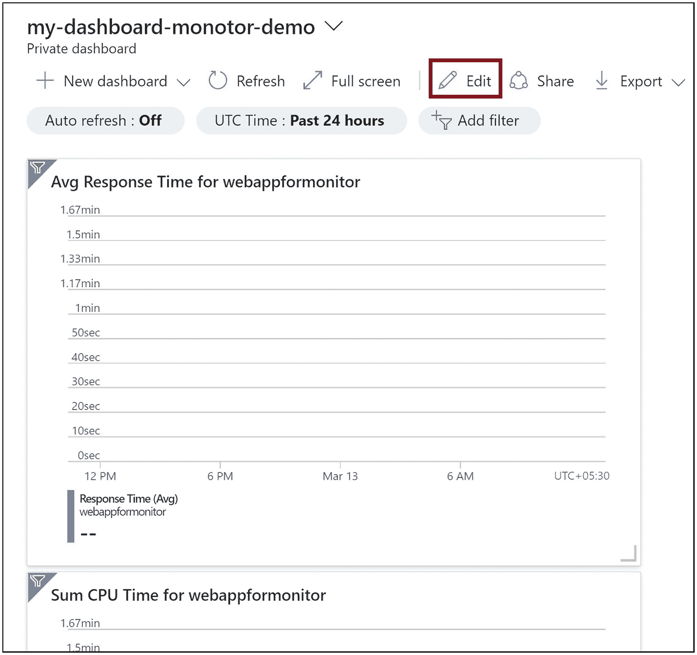

my hyphen dashboard hyphen monotor hyphen demo 的截图，已点击保存按钮进行保存。现在，可以调整仪表盘大小、移动位置，并且可以编辑或添加标题。

图 11-15

编辑仪表盘

点击*保存*，如图 11-16 所示。

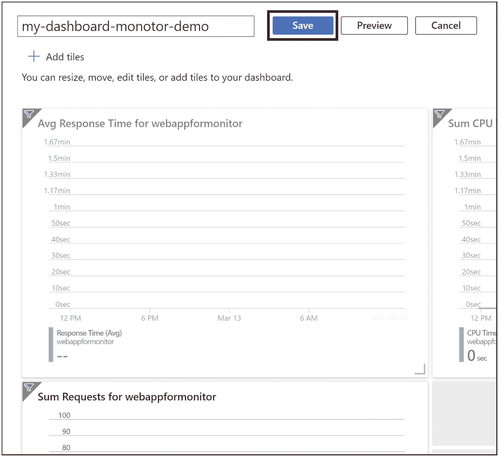

my hyphen dashboard hyphen monotor hyphen demo 的截图，已点击保存按钮进行保存。现在，可以调整仪表盘大小、移动位置，并且可以编辑或添加标题。

图 11-16

保存仪表盘

浏览 WebApp URL，您可以看到仪表盘中正在生成的指标数据，如图 11-17 所示。

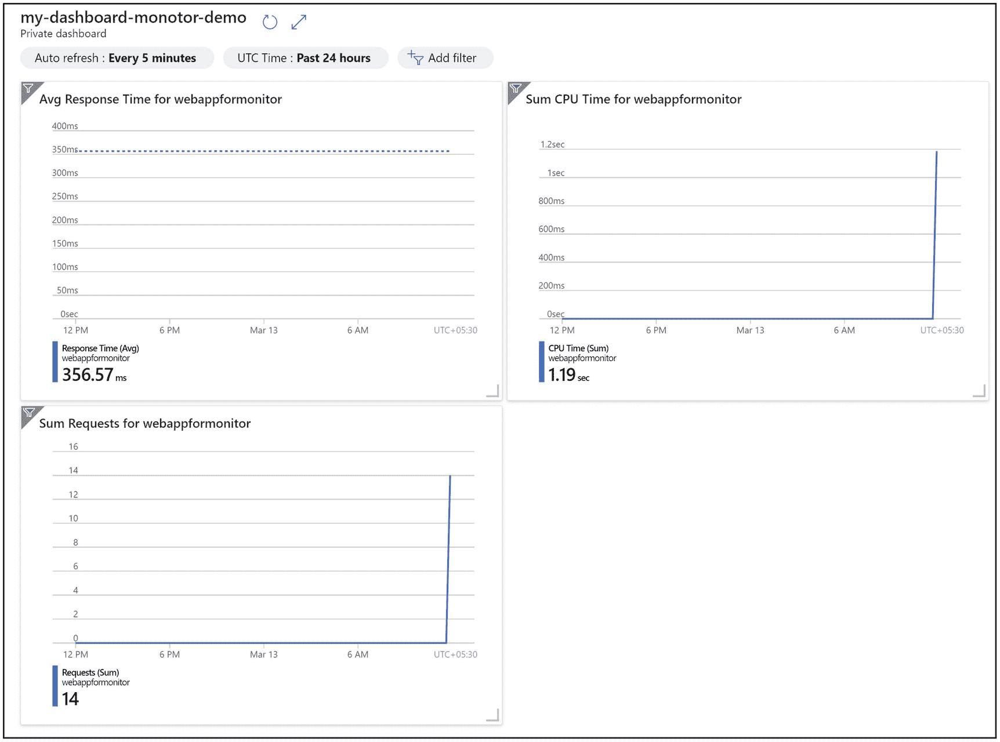

my hyphen dashboard hyphen monotor hyphen demo 的截图，已点击保存按钮进行保存。现在，可以调整仪表盘大小、移动位置，并且可以编辑或添加标题。仪表盘所选的各种筛选条件如下所示。

图 11-17

仪表盘中的指标数据

## 创建性能警报

让我们为 Azure 存储帐户创建性能警报。转到 Azure Monitor 中的*指标*。为 Blob 容器计数配置一个指标，如图 11-18 所示。

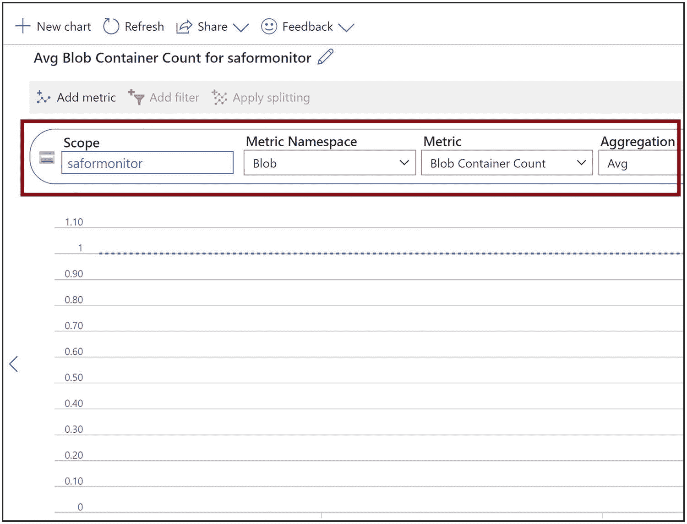

saformonitor 的平均 Blob 容器计数截图。添加指标具有以下选项：作用域为 saformonitor，指标名称位置为 blob，所选指标为 Blob 容器计数，聚合方式为平均值。其下方有空白行。

图 11-18

配置指标

让我们为已配置的指标创建一个警报。点击*新建警报规则*，如图 11-19 所示。

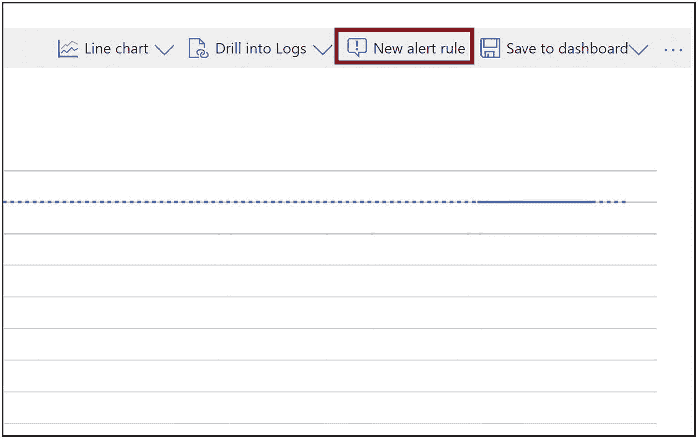

新建警报规则的截图，任务栏中有折线图、深入日志、新建警报规则和保存到仪表盘等选项。下方是用于在规则页面上编写规则的行，此图像中该页面为空。

图 11-19

新建警报规则

我们需要配置触发警报的条件。点击*条件*，如图 11-20 所示。点击列出的默认条件。

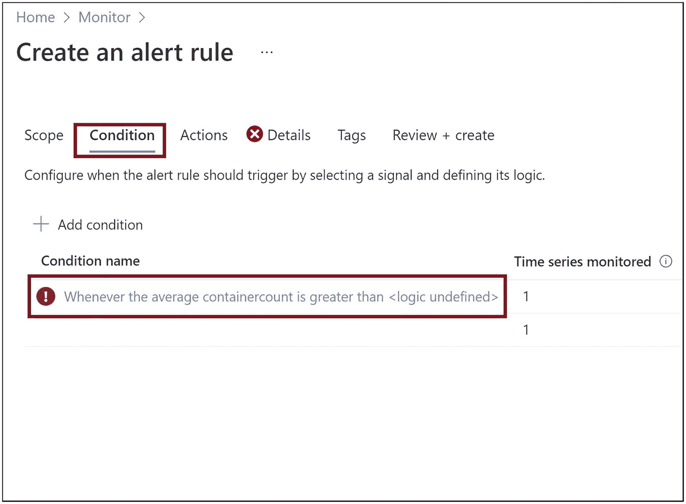

新建警报规则的截图，任务栏中有折线图、深入日志、新建警报规则和保存到仪表盘等选项。下方是用于在规则页面上编写规则的行，此图像中该页面为空。

图 11-20

配置警报条件

配置警报条件。在此条件中，我们配置当容器平均数量超过 10 时触发警报。点击*完成*，如图 11-21 所示。

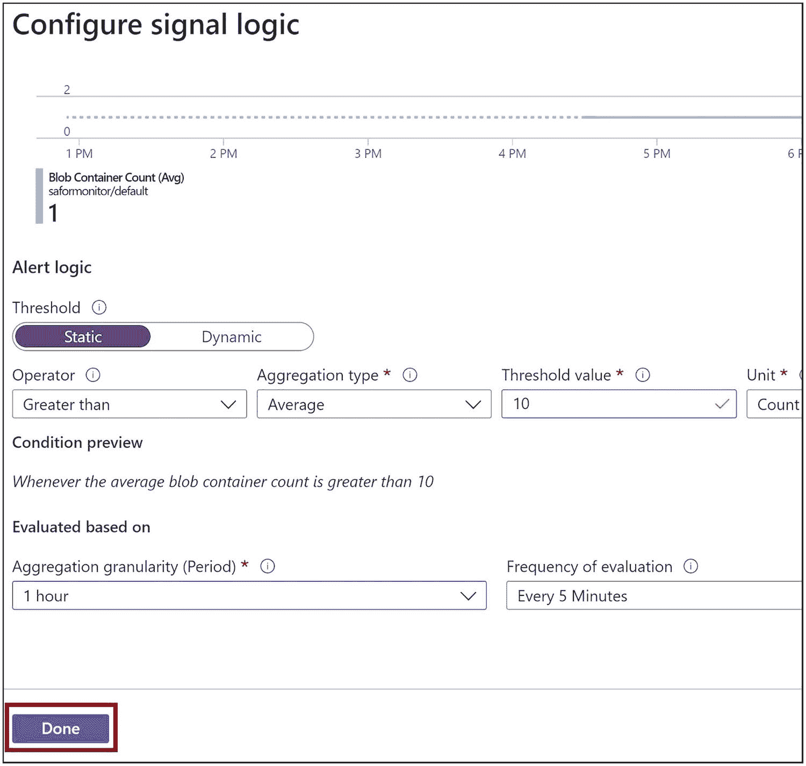

创建警报规则的截图，其中显示了操作选项。操作组是一组可应用于警报规则的操作。然后点击创建操作组。操作组名称处尚未选择任何操作组。

图 11-21

提供条件详细信息

转到*操作*选项卡，点击*创建操作组*，如图 11-22 所示。

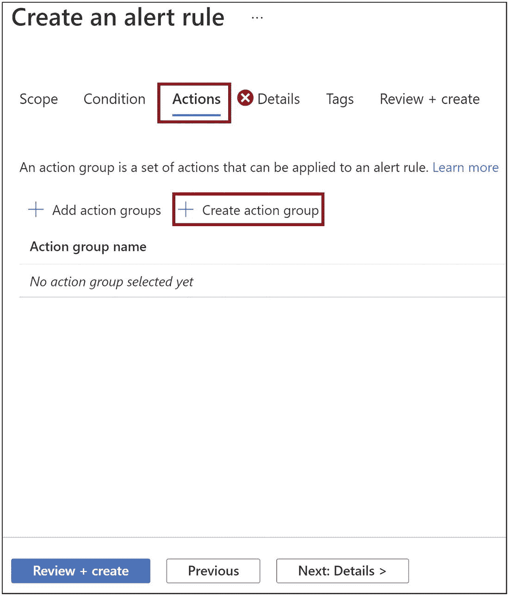

创建警报规则的截图，其中显示了操作选项。操作组是一组可应用于警报规则的操作。然后点击创建操作组。操作组名称处尚未选择任何操作组。

图 11-22

创建操作组

提供订阅、资源组、名称和其他详细信息。点击*下一步：通知*，如图 11-23 所示。

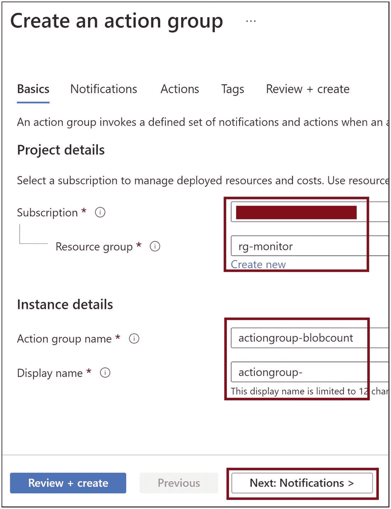

创建操作组的截图，其中显示了基本信息选项。项目详细信息为：资源组是 rg hyphen monitor，实例详细信息为：操作组名称是 actiongroup hyphen blobcount，显示名称是 actiongroup hyphen。然后点击底部的“下一步：通知”按钮。

图 11-23

提供操作组的基本详细信息

当警报触发时，我们通过电子邮件通知用户。选择电子邮件作为通知类型，如图 11-24 所示。

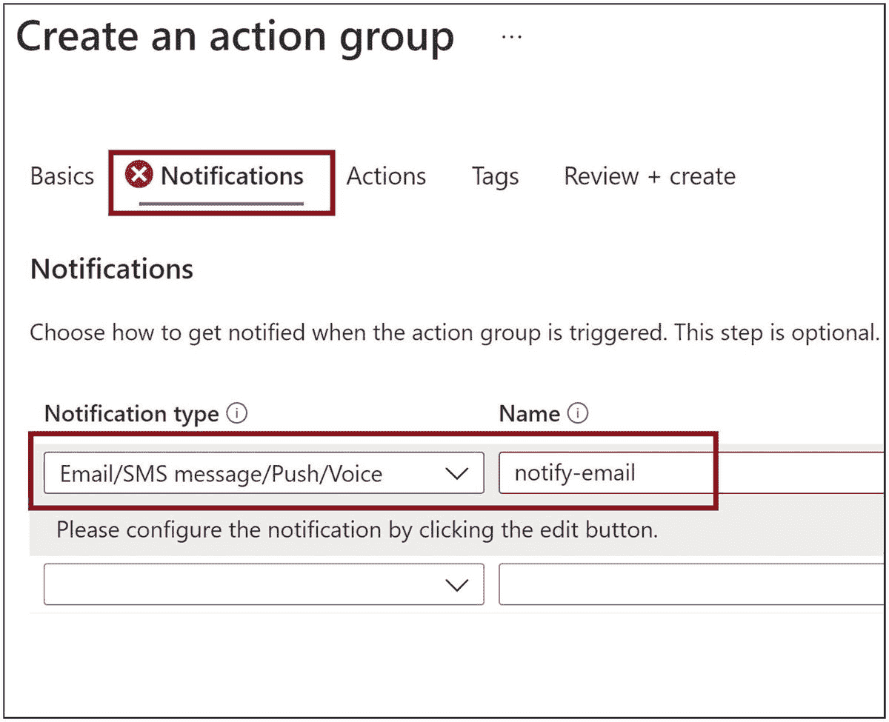

创建操作组的截图，其中显示了通知选项，旁边有一个叉号。通知类型选择为电子邮件或短信或消息或推送或语音，名称选择为 notify email。然后可以通过点击编辑按钮进行配置。

图 11-24

配置电子邮件通知

提供您的电子邮件地址，当警报触发时，将向该地址发送通知。点击*确定*，如图 11-25 所示。

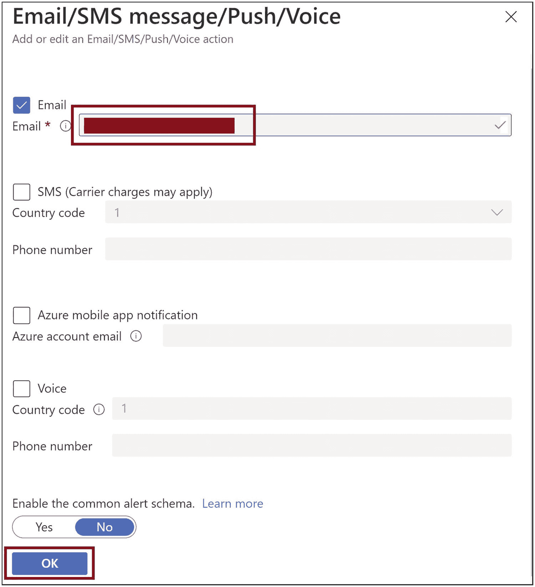


选择通知类型（如电子邮件、短信、消息或语音）的截图。已选中电子邮件选项，并在提供的列中输入了内容，然后点击页面底部的“确定”按钮以设置通知提示选项。

图 11-25

提供用于接收通知的电子邮件地址

转到 *操作* 选项卡并配置一个操作。您可以选择列出的一个操作，在触发警报时执行。最常用的是 *ITSM*，您可以在其中记录问题或服务请求到 ITSM 工具中。点击 *查看 + 创建*，如图 11-26 所示。

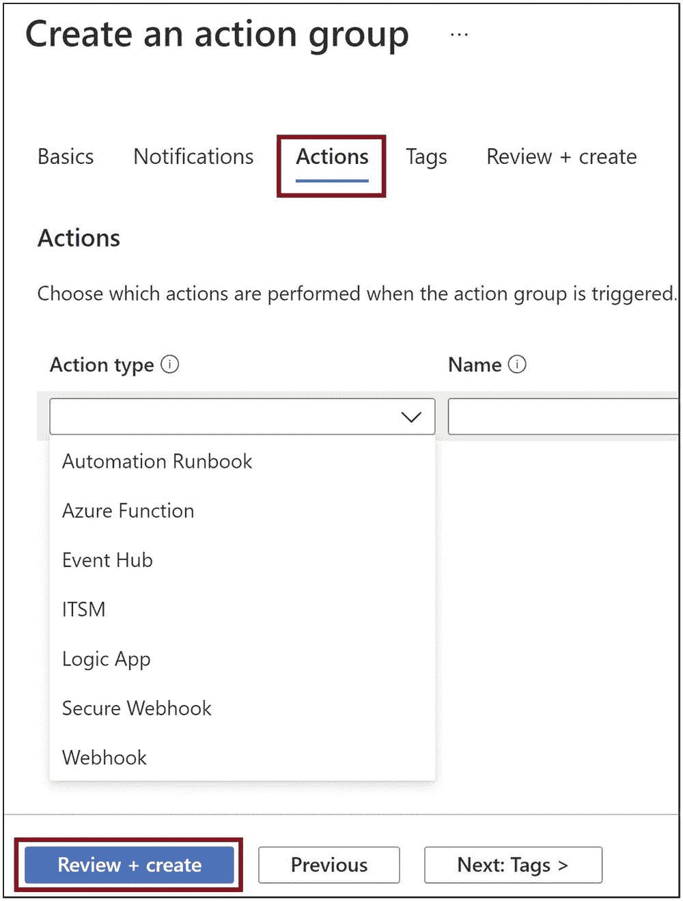

创建操作组的截图，任务栏中选中了“操作”选项。选择在触发操作组时要执行哪些操作。操作类型下拉菜单包含以下选项：自动化 Runbook、Azure 函数、事件中心、ITSM、逻辑应用、安全 Webhook 和 Webhook。应点击“查看 + 创建”选项以完成操作组的创建。

图 11-26

点击“查看 + 创建”

点击 *创建* 以启动操作组，如图 11-27 所示。

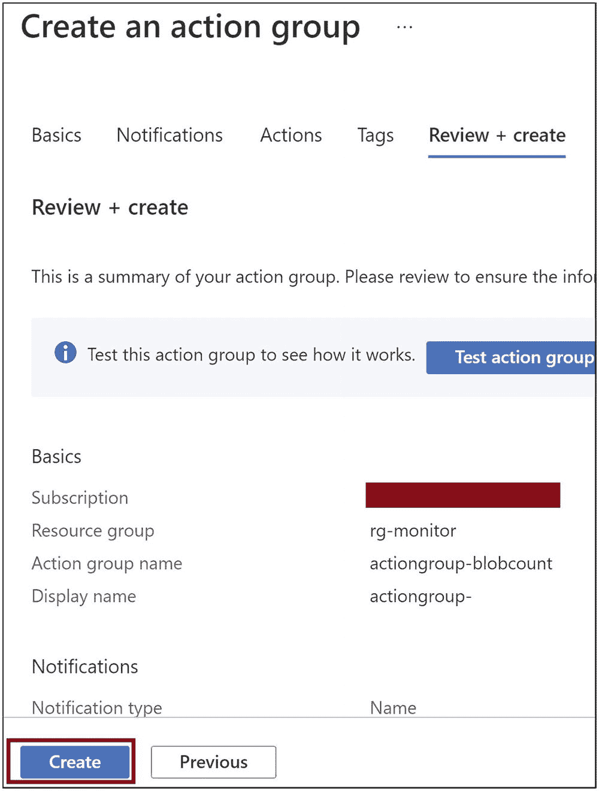

创建操作组的截图，任务栏中选中了“操作”选项。显示了“查看 + 创建”选项，这是操作组的摘要。下一步是测试已创建的操作组。基本信息包括：订阅、资源组为 rg-hyphen-monitor、操作组名称为 actiongroup-hyphen-blobcount。点击底部的“创建”选项。

图 11-27

点击“创建”

每当存储帐户中的 Blob 容器平均数量超过 10 时，就会触发警报。转到警报规则的 *详细信息* 选项卡，并提供必要的基本详细信息。点击 *查看 + 创建*，然后点击 *创建以配置警报*，如图 11-28 所示。

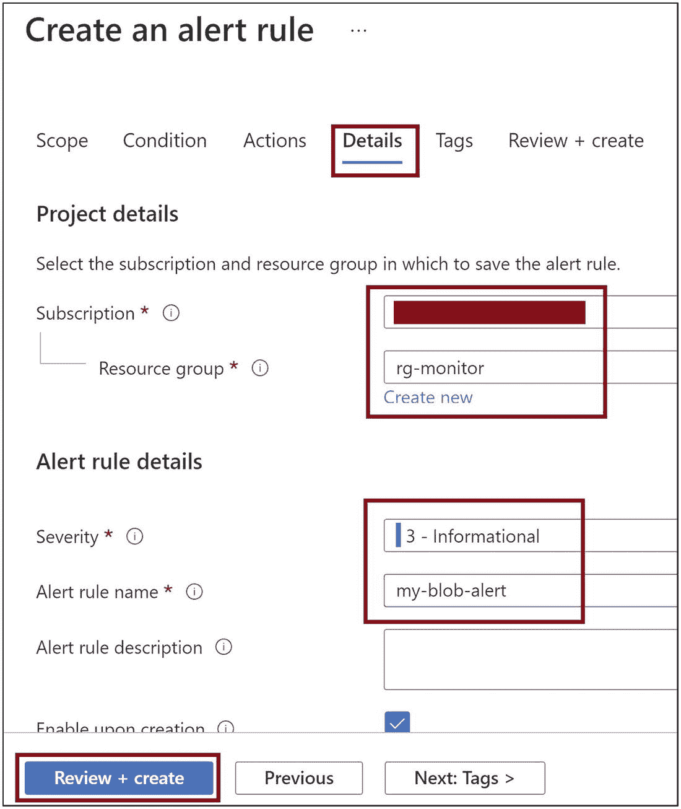

创建操作组的截图，任务栏中选中了“操作”选项。显示了“查看 + 创建”选项，这是操作组的摘要。下一步是测试已创建的操作组。基本信息包括：订阅、资源组为 rg-hyphen-monitor、操作组名称为 actiongroup-hyphen-blobcount。点击底部的“创建”选项。

图 11-28

创建警报

## 为 Java 应用程序使用 Application Insights

现在，让我们启动一个 Application Insights 资源，并向其中推送一些 Java 日志。您需要将适用于 Java 的 Application Insights 代理与应用程序打包在一起，并将其作为 JVM 参数传递。此操作会自动将应用程序日志和性能指标推送到 Application Insights，适用于基于 Java 的流行日志记录器（如 Log4j、java.util.logging 和 SLF4J），无需任何额外配置。

让我们创建一个 Application Insights。转到 Azure 门户并搜索 *Application Insights*。在搜索结果中点击 *Application Insights*，如图 11-29 所示。

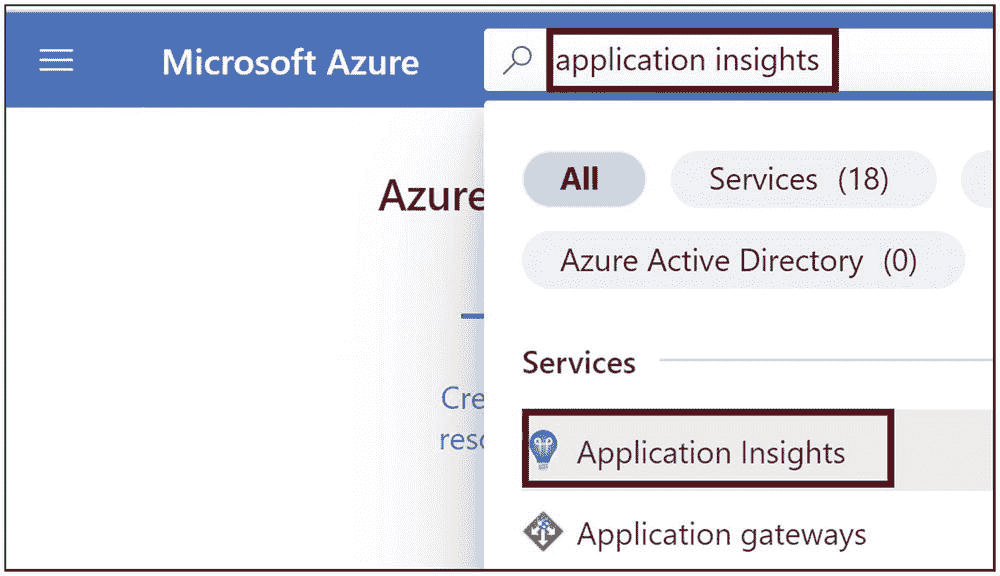

Microsoft Azure 的截图，搜索框中输入了“application insights”。在服务下拉菜单中可以看到该选项，其下方是“应用程序网关”选项。

图 11-29

搜索 Application Insights

点击 *创建* 以启动一个 Application Insights，如图 11-30 所示。

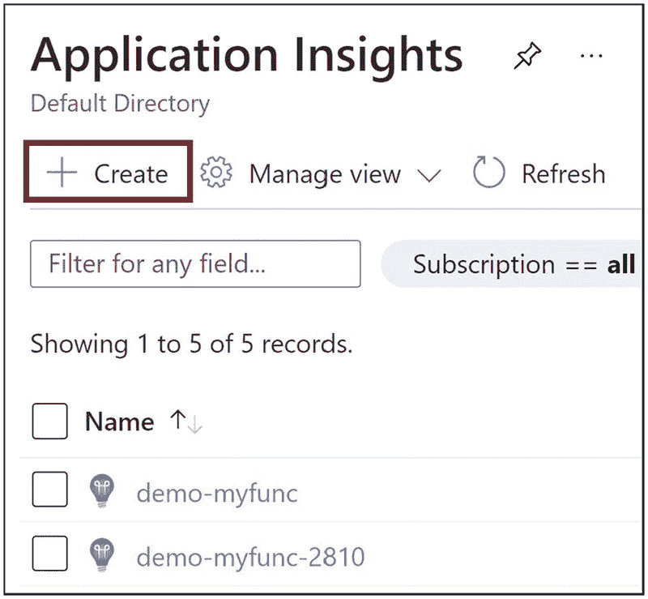

Microsoft Azure 的截图，搜索框中输入了“application insights”。在服务下拉菜单中可以看到该选项，其下方是“应用程序网关”选项。

图 11-30

创建 Application Insights

为 Application Insights 提供基本信息。我们需要将日志保存在 Log Analytics 工作区中，因此需要创建一个或使用现有的工作区。Application Insights 将连接到该 Log Analytics 工作区并获取日志见解。点击 *查看 + 创建*，然后点击 *创建*，如图 11-31 所示。

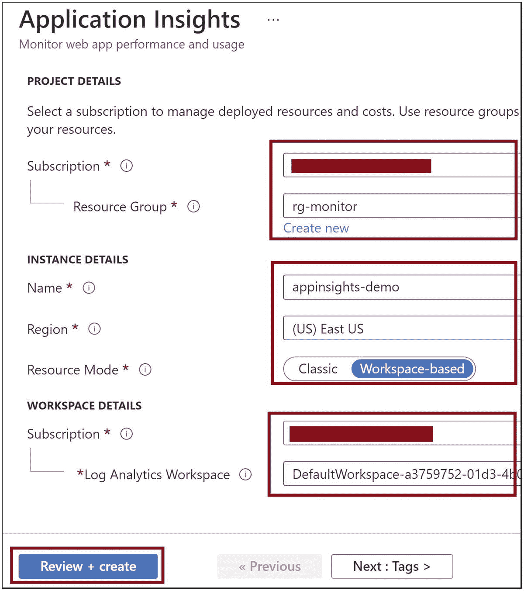

用于监控 Web 应用性能和使用的 Application Insights 截图。项目详细信息包括：选择订阅以管理部署的资源和成本。使用资源组作为您的资源。实例详细信息包括名称、区域和资源模式。工作区详细信息的订阅选项包含 Log Analytics 工作区。

图 11-31

提供基本信息

一旦 Application Insights 启动，请复制连接字符串。我们将在 Java 代码中使用该连接字符串，如图 11-32 所示。

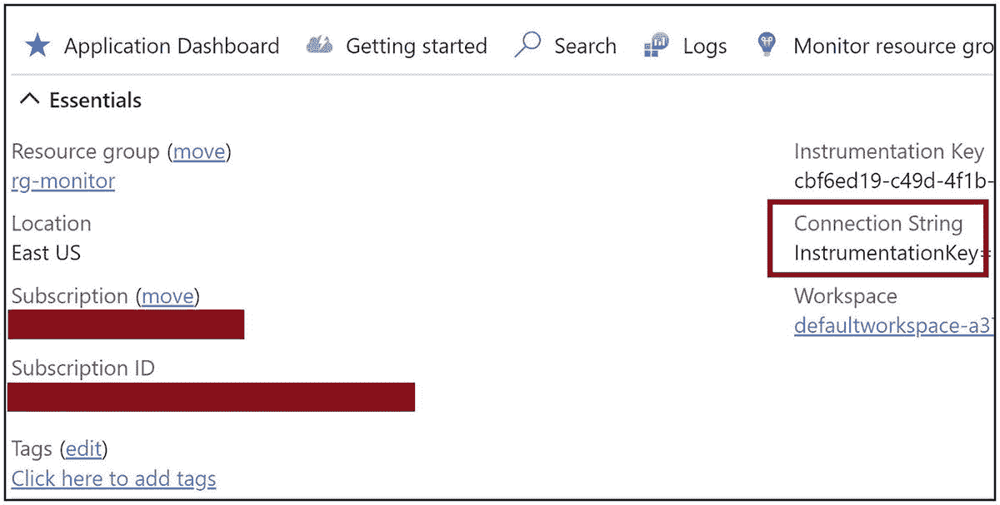

App Insight 演示的截图，带有事务搜索功能。本地时间为 24 小时制（自动），事件类型等于“全选”。结果来自 2022 年 3 月 17 日，时间 1:41:37 AM，跟踪文件的提示严重性级别分别为警告、错误和信息。跟踪结果共 20 个文件。

图 11-32

复制连接字符串

现在，让我们创建一个基于 Maven 的 Java 控制台应用程序。转到包含 Main 方法的类文件，并使用 java.util.logging 添加一些日志记录语句，如清单 11-1 所示。

```
import java.util.logging.Level;
import java.util.logging.Logger;
//https://github.com/microsoft/ApplicationInsights-Java/releases
public class AppInsightsLoggingDemo {
private static final Logger logger = Logger.getLogger("AppInsightsLoggingDemo");
public static void main(String args[])
{
logger.setLevel(Level.ALL);
logger.log(Level.INFO,"This is ERROR");
logger.log(Level.WARNING,"This is WARNING");
logger.log(Level.SEVERE, "This is SEVERE");
}
}
清单 11-1
Main 方法
```

创建一个 *applicationinsights.json* 文件，并将其放在与 *pom.xml* 文件相同的文件夹中。我们需要在此处提供 Application Insights 连接字符串，如清单 11-2 所示。

```
{
"connectionString": "提供你的连接字符串"
}
清单 11-2
Application insights.json
```

从 Microsoft GitHub 位置下载 Application Insights 代理文件 *applicationinsights-agent-3.2.8.jar*，如清单 11-3 所示。将其放在与 *pom.xml* 相同的文件夹中。

```
https://github.com/microsoft/ApplicationInsights-Java/releases
清单 11-3
下载 applicationinsights-agent-3.2.8.jar 的 URL
```

编译应用程序，并使用 JVM 参数运行应用程序：

`-javaagent:[你的路径]/applicationinsights-agent-3.2.8.jar`。将 `[你的路径]` 替换为你系统上该文件所在的路径。

几分钟后，转到 Application Insights 并点击 *事务搜索*，如图 11-33 所示。您可以看到已引入的日志。

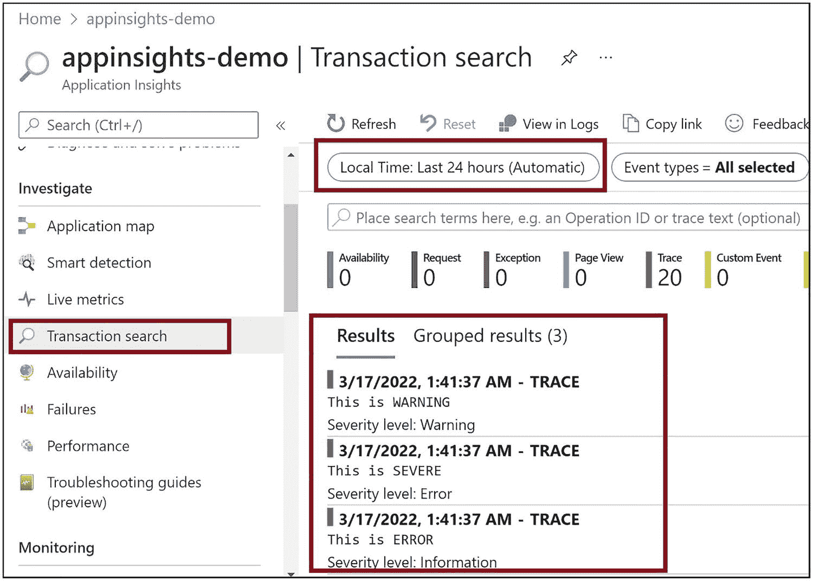

新警报规则的截图，任务栏中有折线图、深入日志、新警报规则和保存到仪表板等选项。下方是用于编写规则的横线页面，此图中为空白。

图 11-33

Application Insights 中的日志


## 总结

在本章中，我们学习了 Application Insights 和 Azure Monitor 的基础知识。我们学习了如何为 Azure Monitor 指标配置仪表板和警报。随后，我们开发了一个基于 Maven 的 Java 代码，并将日志推送到了 Application Insights。在下一章中，我们将学习如何使用 Azure Monitor 对应用程序用户进行身份验证。

以下是本章的关键要点：

*   Azure Monitor 帮助您从 Azure、本地或任何其他云平台上的应用程序和基础架构中收集性能指标和日志数据。

*   Application Insights 帮助您监控并收集在 Azure、本地或任何其他云上运行的应用程序的日志和性能指标数据的见解。

*   Application Insights 可以与使用各种编程语言和框架（如 .NET、Java、Python、PHP 等）开发的应用程序集成。

