# 12. 使用 Azure Active Directory 进行身份验证和授权

应用程序应允许经过身份验证的用户访问。经过身份验证的用户应能访问其被授权的应用程序模块，并在应用程序中执行允许的活动。Azure Active Directory 是 Azure 上的一个身份提供程序，可供托管在 Azure、本地或任何其他公有云或私有云上的应用程序用于身份验证和授权。

在上一章中，我们学习了 Azure Monitor 和 Application Insights 的基本概念。然后，我们创建了一个 Java 应用程序，该应用程序可以使用 Azure Monitor 生成性能指标，并使用 Azure Application Insights 为应用程序生成日志。在本章中，我们将使用 Spring Security 和 Azure Active Directory 来保护一个 Java 应用程序。

## 结构

在本章中，我们将讨论 Azure Active Directory 的以下方面。

*   Azure Active Directory 简介

*   为身份验证和授权配置 Azure Active Directory

*   配置 Java Spring Boot 应用程序

*   Azure AD 的身份验证场景

## 目标

学习本章后，您应能获得以下知识：

*   理解 Azure Active Directory 的概念

*   使用 Azure Active Directory

*   使用 Azure Active Directory 为 Java Spring Boot 应用程序配置身份验证和授权

## Azure Active Directory 简介

Azure Active Directory 是 Azure 上的一项身份即服务（IDaaS）产品。它在 Azure 上提供企业级的身份管理解决方案。Azure Active Directory 提供多租户目录管理服务。您还可以使用 AD Connect 将本地 Active Directory 集成到 Azure Active Directory，并将本地目录中的所有用户、组和角色同步到 Azure。您可以将其用作 Azure 上的域控制器，并将您的 Azure 虚拟机加入其中。

Azure Active Directory 帮助您管理在 Azure、本地或任何其他云上运行的应用程序的用户身份验证和授权。它提供诸如单点登录、多重身份验证以及其他现代身份管理和治理产品等功能。您可以使用 SAML、OAuth、OpenID Connect 或 WS-Federation 来对应用程序用户进行身份验证和授权。

它支持集成 B2B 场景，即另一个业务组织可以进行身份验证、协作并消费该业务组织的服务。它还支持 B2C 场景，即最终客户可以进行身份验证、协作并消费该业务组织的服务。

Azure Active Directory 是一项平台即服务产品，您只需配置和使用域和身份服务，无需构建和管理任何基础架构。

## 为身份验证和授权配置 Azure Active Directory

让我们配置 Azure Active Directory，并使用它对用户进行身份验证并授权其使用 Java Web API。以下是我们将执行的步骤。我们将使用默认租户。但是，您可能更倾向于创建一个新租户并使用它。以下是我们将为配置 Azure Active Directory 进行身份验证和授权而执行的步骤。

1.  在 Azure Active Directory 中创建一个用户。

2.  在 Azure Active Directory 中注册一个应用程序。

3.  将用户分配到应用程序角色。

### 在 Azure Active Directory 中创建用户

让我们在默认租户中创建一个用户。转到 Azure 门户。搜索 *Azure Active Directory*。在搜索结果中点击 *Azure Active Directory*，如图 12-1 所示。

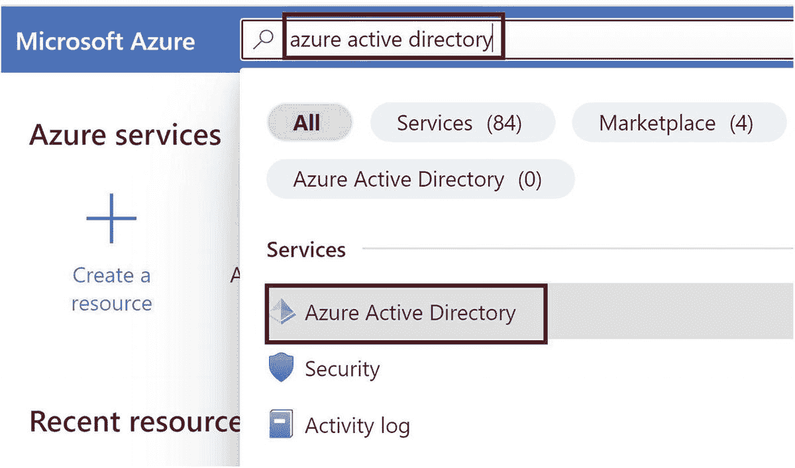

一个 Azure 窗口的图像。顶部是搜索栏，其中包含 azure active directory。左侧是 Azure 服务，包含创建资源选项及其下方的最近使用的资源。窗口中央部分有以下选项：全部、服务 84、市场 4 和 azure active directory 0。下方提供了包括 azure active directory、安全性和活动日志在内的服务。

图 12-1

搜索 Azure Active Directory

您将被导航到默认租户或目录。点击 *用户*，如图 12-2 所示。我们需要创建一个用户，以便执行身份验证和授权。

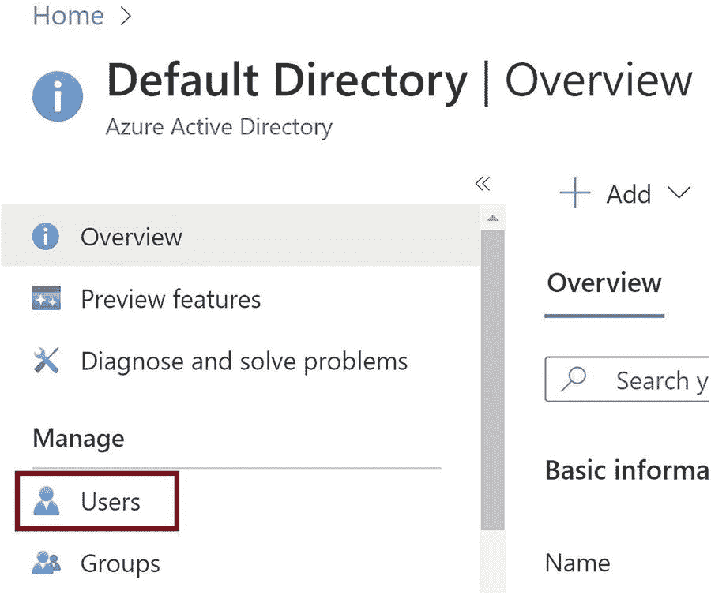

默认目录概述的图像。左侧的选项包括：概述、预览功能、诊断并解决问题，以及管理（包括用户和组），其中用户被选中。中央的选项包括：添加、带有搜索字段的概述、基本信息和名称。

图 12-2

点击用户

点击 *新建用户* 以创建一个用户，如图 12-3 所示。我们需要这个新用户来对应用程序执行身份验证和授权。

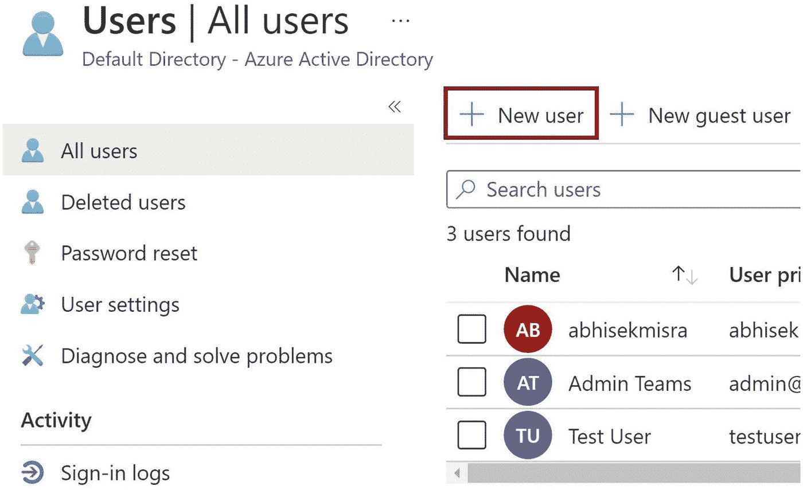

用户、所有用户窗口的图像。左侧的选项包括：所有用户、已删除用户、密码重置、用户设置、诊断并解决问题，以及活动（包括登录日志）。所有用户选项被选中。中央的内容包括：新建用户、新建来宾用户、搜索用户字段以及用户列表，其中新建用户选项被选中。

图 12-3

点击新建用户

选择 *创建用户*，如图 12-4 所示。我们需要在默认目录或租户中创建一个用户，不需要来宾用户。

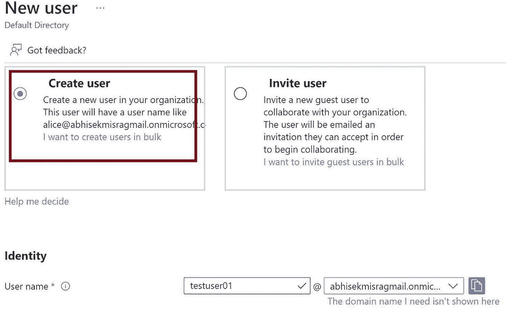

新建用户默认字典窗口的截图。下方呈现的两个选项是创建用户和邀请用户，前者被选中。下方是用户凭据字段，包括用户名和电子邮件地址。

图 12-4

选择创建用户

提供用户的姓名、密码和其他必要详细信息。点击 *创建*，如图 12-5 所示。一个新用户将被创建。

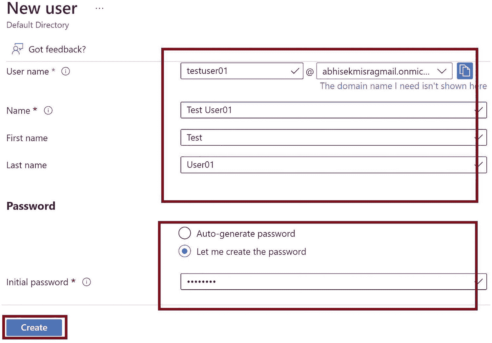

创建用户窗口的图示。存在的字段包括：用户名、名称、名字、姓氏、密码，以及自动生成密码和让我创建密码等选项，其中创建密码选项被选中。其后是初始密码字段，以及左下角的创建选项。

图 12-5

创建用户


好的，作为高级文档工程师和翻译员，我将遵循您提供的注意事项和示例，将给定的英文文本翻译成中文。


### 在 Azure Active Directory 中注册应用程序

现在，让我们在默认租户中创建一个应用程序。我们将使用此应用程序为 Java 应用程序配置身份验证和授权。转到 Azure 门户中的 Azure Active Directory，然后点击*应用注册*，如图 12-6 所示。

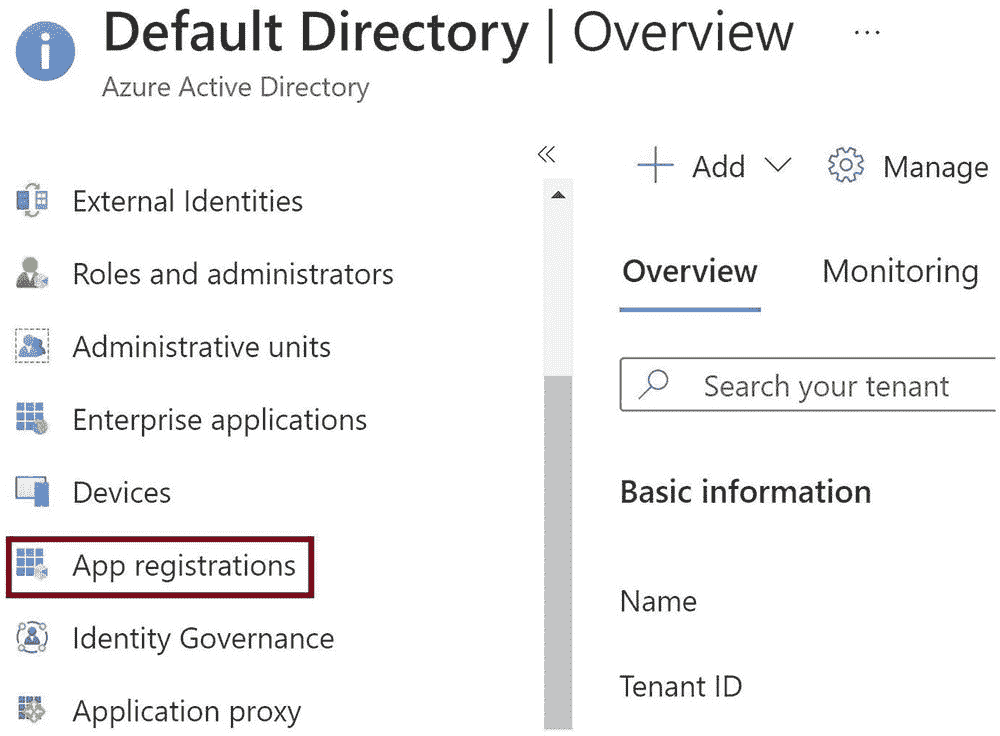

创建用户窗口的插图。显示的字段包括：用户名、名称、名字、姓氏、密码，以及自动生成密码和让我创建密码等选项，其中选择了创建密码选项。其后是初始密码字段，左下角是创建选项。

图 12-6

点击应用注册

点击*新注册*以注册新应用程序，如图 12-7 所示。

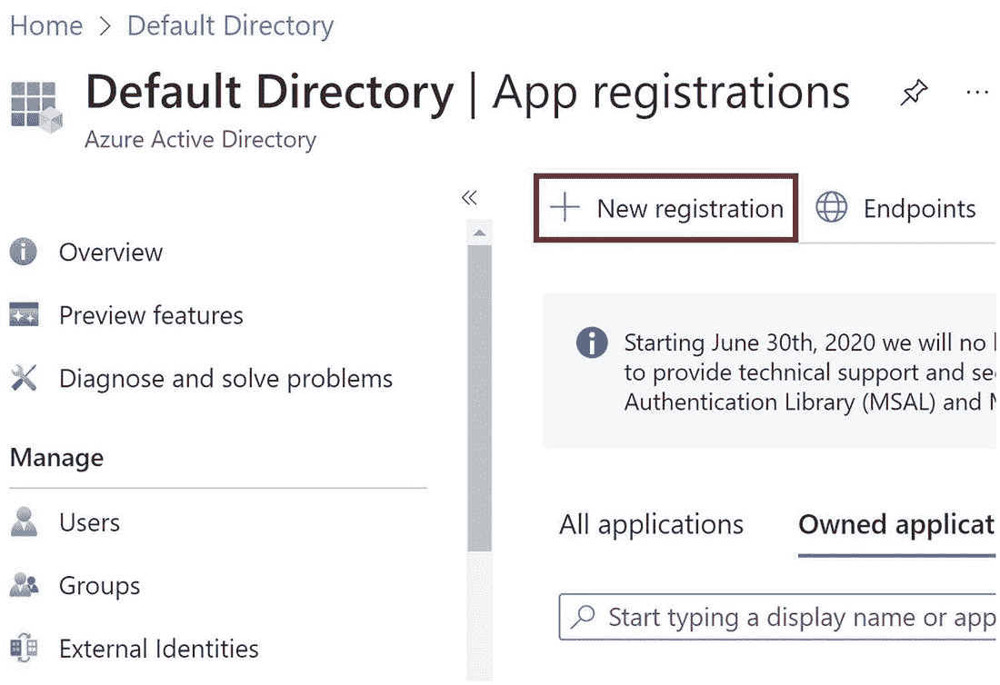

默认目录应用注册的图像。左侧的选项包括：概述、预览功能、诊断和解决问题，以及管理（包括用户、组和外部身份）。中间的选项包括：新注册、终结点、所有应用程序、拥有的应用程序和一个搜索栏。

图 12-7

点击新注册

为应用程序提供一个唯一的名称，然后点击*注册*，如图 12-8 所示。

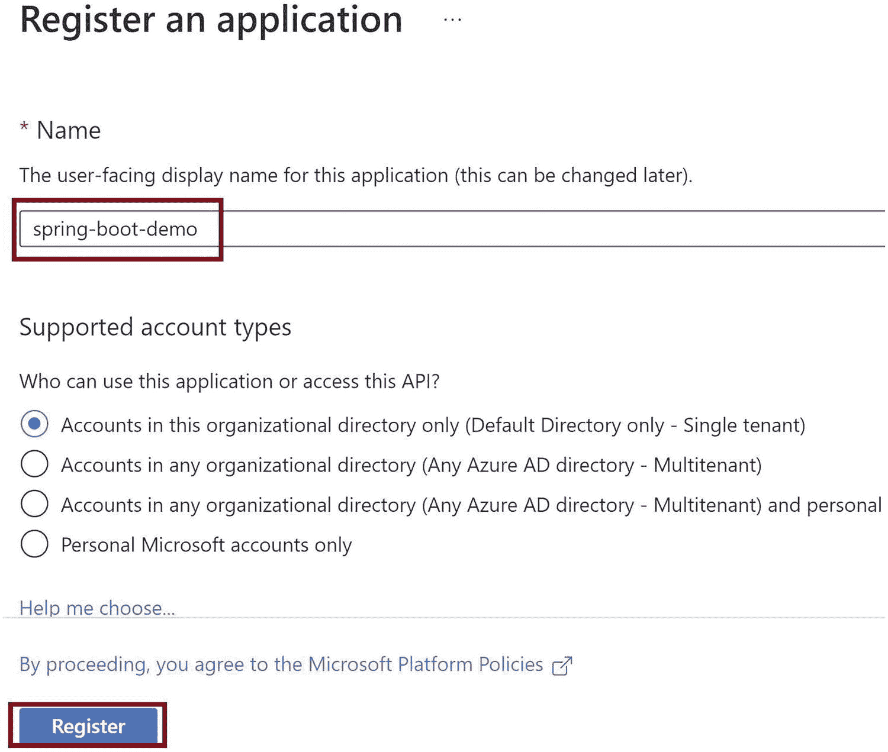

注册应用程序窗口的图像。可用的字段包括：名称（此应用程序面向用户的显示名称）和受支持的帐户类型，包含以下选项：仅此组织目录中的帐户、任何组织目录中的帐户、任何组织目录中的帐户以及仅个人 Microsoft 帐户。

图 12-8

注册应用程序

创建应用程序后，请复制该应用程序的租户或目录 ID 以及应用程序或客户端 ID。我们稍后将在 Java 应用程序中使用它们。让我们为应用程序配置一个重定向 URI。点击*添加重定向 URI*，如图 12-9 所示。

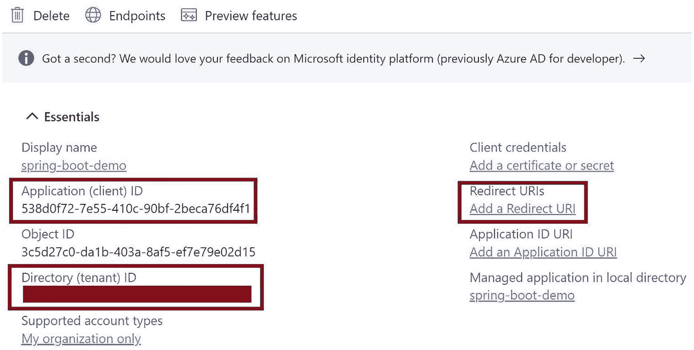

添加平台窗口的图像。任务栏上的选项包括：删除、终结点和预览功能。下面提供的字段包括：显示名称、对象 ID、目录租户 ID、客户端凭据、重定向 URL、应用程序 ID URI 和受支持的帐户类型。

图 12-9

添加重定向 URI

点击*添加平台*，如图 12-10 所示。由于我们处理的是 Web 应用程序，因此需要添加一个 Web 平台。

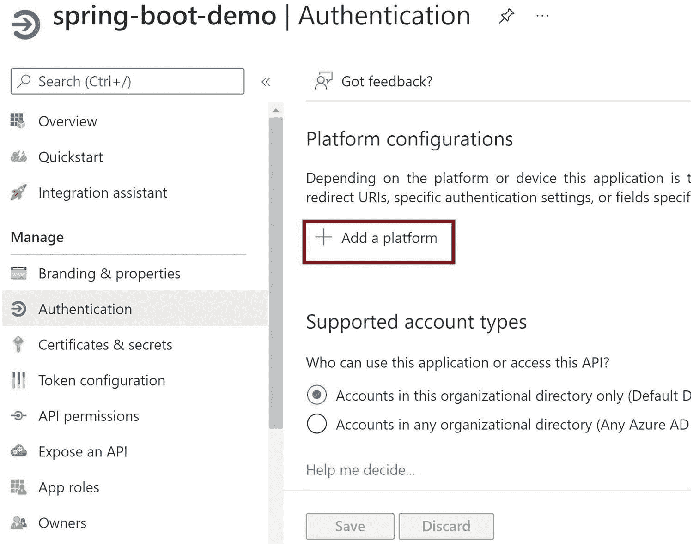

Spring Boot 演示身份验证窗口的图像。左侧的选项包括：搜索栏、概述、快速入门、集成助手、品牌和属性、身份验证、证书和机密、令牌配置、API 权限、公开 API、应用角色和所有者。中间的内容包括：平台配置和受支持的帐户类型。

图 12-10

添加平台

选择 *Web*，因为我们将在基于 Java 的 API 项目中使用此应用程序。图 12-11 演示了此操作。

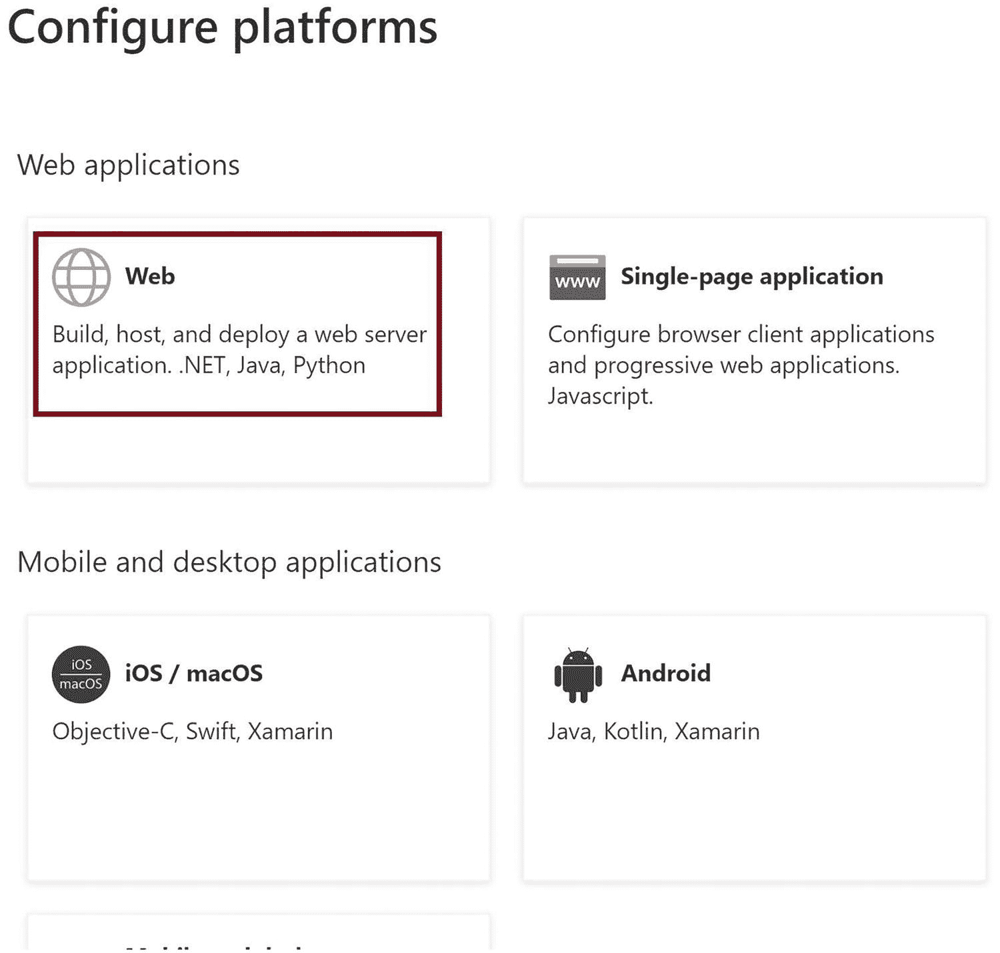

配置平台窗口的图像。Web 应用程序包括 Web 和单页应用程序。已选择 Web 选项。移动和桌面应用程序包括 iOS 或 macOS（包括 Objective C、Swift、Xamarin）和 Android（包括 Java、Kotlin 和 Xamarin）。

图 12-11

选择 Web

提供重定向 URI 为 `http://localhost:8080/login/oauth2/code/`。点击*配置*，如图 12-12 所示。应用程序将在默认租户中创建。

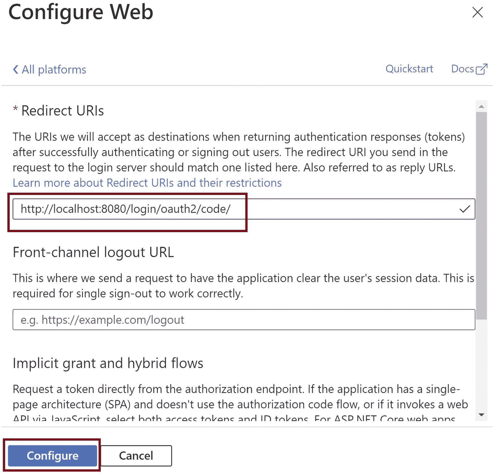

已配置的 Web 窗口的图像。内容包括：重定向 URI，带有用于输入 URI 的字段；其后是前端通道注销 URL，下方带有用于输入 URL 的字段；再其后是隐式授权和混合流。配置和取消选项位于左下角，其中已选择配置。

图 12-12

配置重定向 URI

现在，让我们为用户创建一个应用程序角色。我们将把这个角色分配给我们创建的用户。点击*应用角色*部分，然后点击*创建应用角色*，如图 12-13 所示。

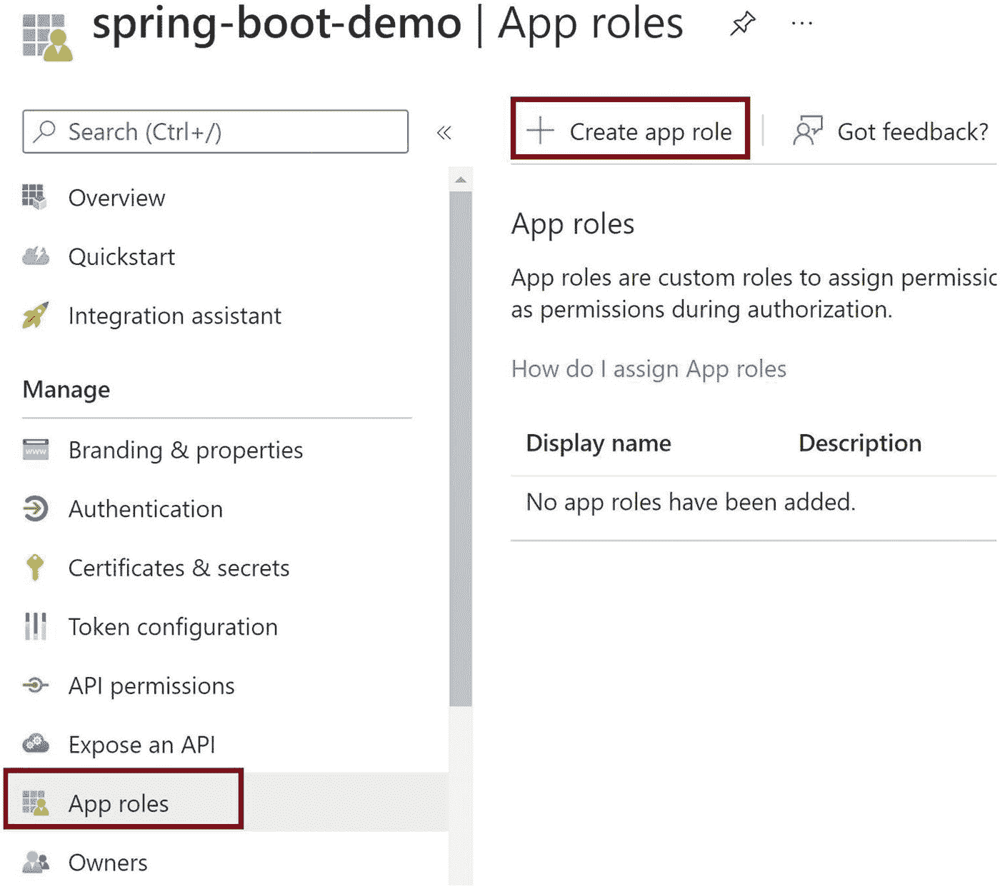

Spring Boot 演示应用角色窗口的图像。左侧的选项包括：搜索栏、概述、快速入门、集成助手、品牌和属性、身份验证、证书和机密、令牌配置、API 权限、公开 API、应用角色和所有者。中间的内容包括：创建应用角色和反馈。

图 12-13

点击应用角色

提供角色详细信息。我们将在 Java 代码中使用该角色的值。点击*应用*，如图 12-14 所示。该角色将在应用程序中创建。

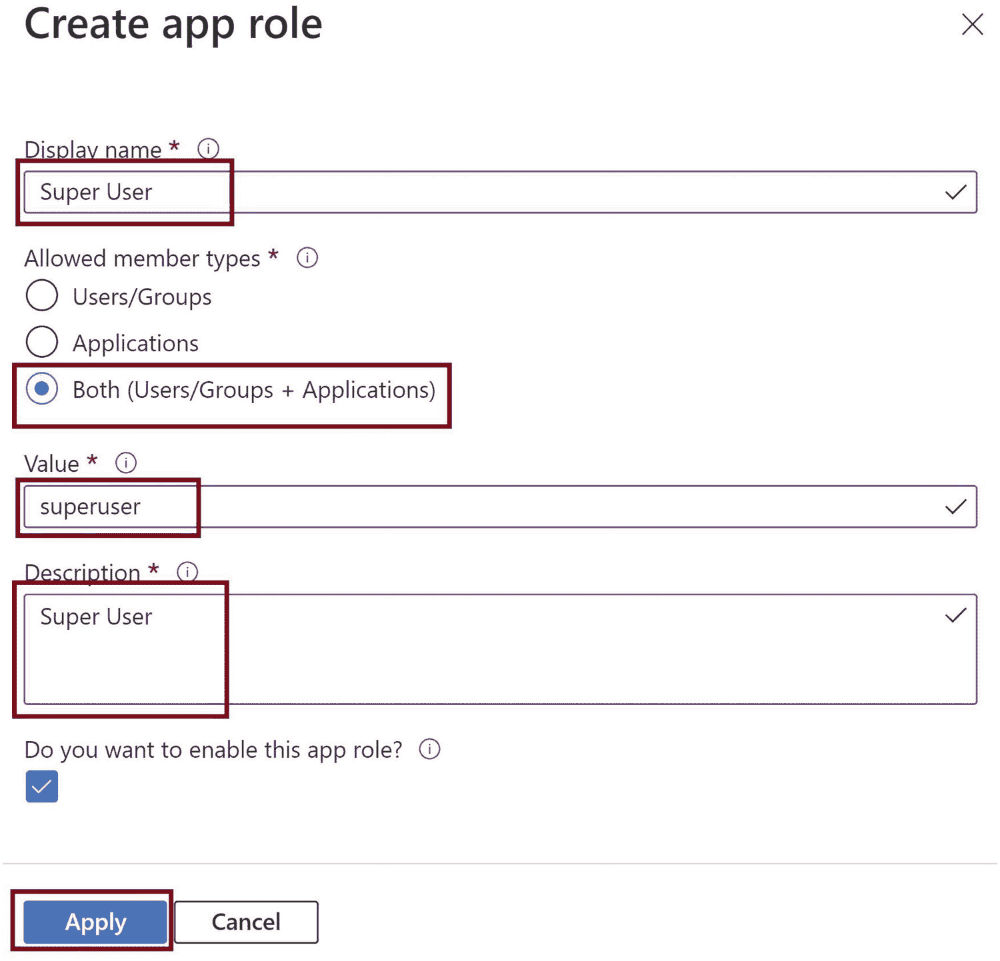

创建应用角色窗口的图像。显示的字段包括：显示名称、允许的成员类型（涉及用户或组、应用程序或两者）、值、描述、是否要启用此应用角色的复选框，以及左下角的应用和取消选项，其中已选择应用选项。

图 12-14

创建角色

我们需要为应用程序生成一个机密。我们将在 Java 代码中将其与应用程序的租户 ID 和客户端 ID 一起使用。点击*证书和机密*，如图 12-15 所示。然后点击*新建客户端机密*。创建机密后，请复制其值。您将只能看到该值一次，一旦离开此页面，该值将不再可用。

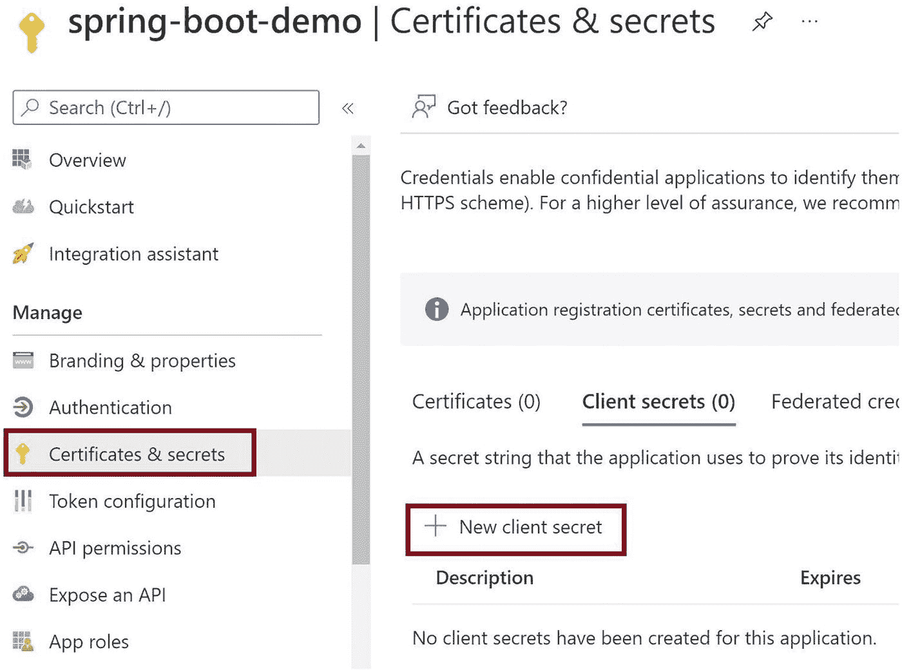

Spring Boot 演示证书和机密窗口的图像。左侧的选项包括：搜索栏、概述、快速入门、集成助手、品牌和属性、身份验证、证书和机密、令牌配置、API 权限、公开 API、应用角色和所有者。中间的内容包括：证书、客户端机密和新建客户端机密。

图 12-15

为应用程序生成机密


### 将用户分配到应用程序角色

现在，我们将用户分配给我们为应用程序创建的角色。我们需要在租户的 *企业应用程序* 部分进行此配置。点击 *企业应用程序*，如图 12-16 所示。

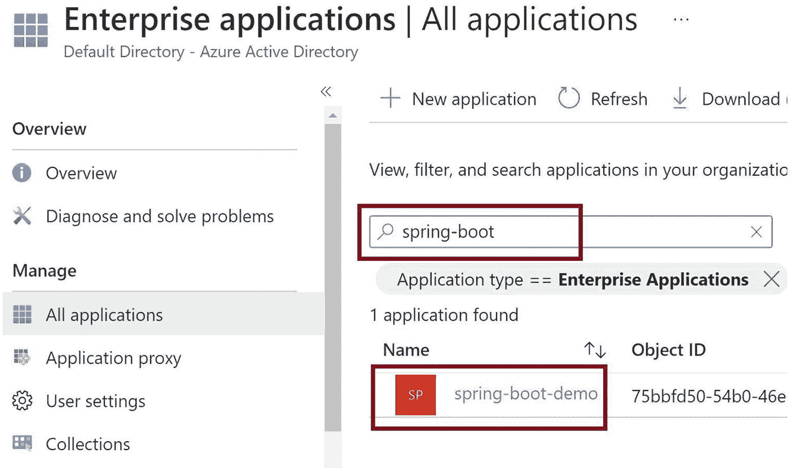

企业应用程序所有应用程序窗口的图像。左侧选项包括：概述、诊断并解决问题、所有应用程序、应用程序代理、用户设置和集合。中心选项包括：新建应用程序、刷新、下载、搜索栏和应用程序列表。

图 12-17

搜索应用程序

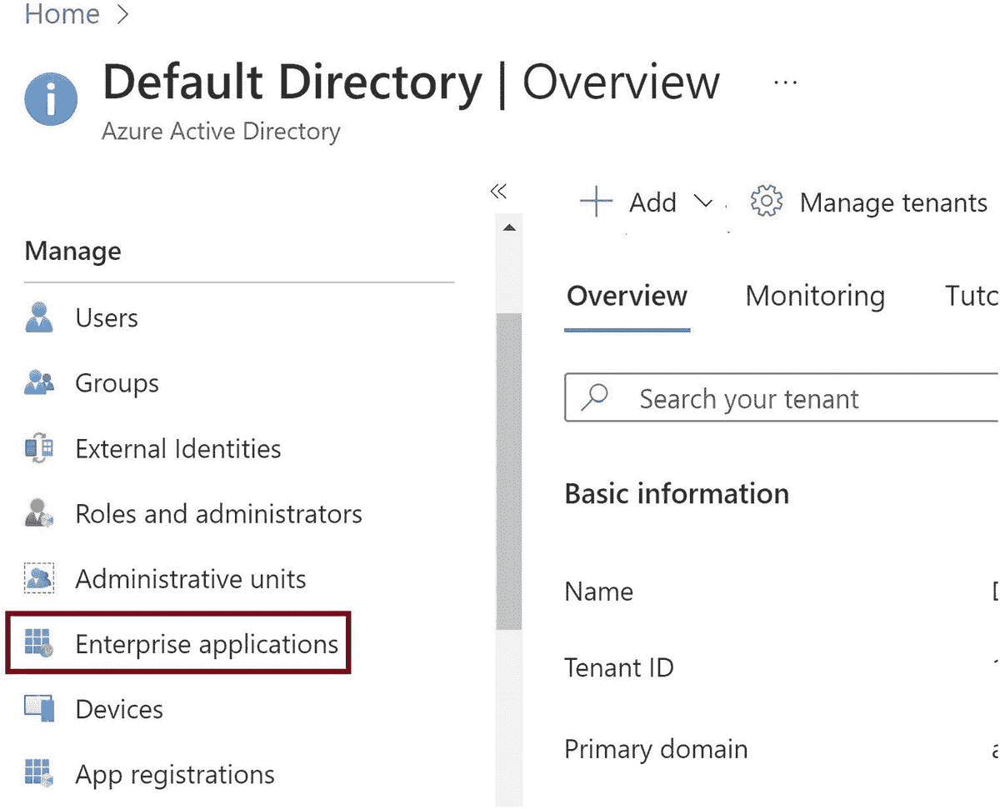

默认字典概览窗口的图像。左侧选项包括：用户、组、外部标识、角色和管理员、管理单元、企业应用程序、设备和应用注册。其中“企业应用程序”选项被选中。中心选项包括：添加、管理租户、搜索栏和基本信息。

图 12-16

点击企业应用程序

搜索我们之前创建的应用程序，然后在搜索结果中点击该应用程序，如图 12-17 所示。

转到 *用户和组*。点击 *添加用户/组*，如图 12-18 所示。我们需要搜索用户并进行角色分配。

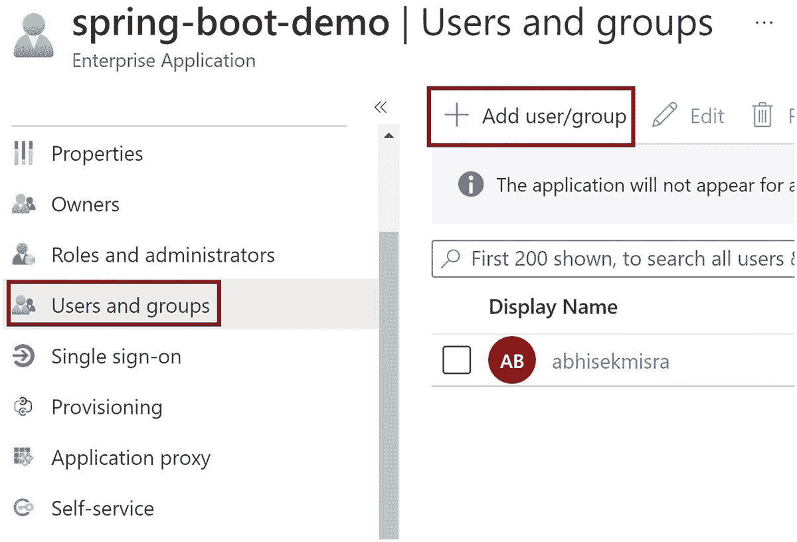

Spring Boot 演示用户和组窗口的图像。左侧选项包括：属性、所有者、角色和管理员、用户和组、单一登录、预配、应用程序代理和自助服务。中心选项包括：添加用户或组、编辑、删除、搜索栏和名称列表。

图 12-18

点击添加用户/组

让我们将用户添加给我们创建的角色。点击 *未选择*，如图 12-19 所示。

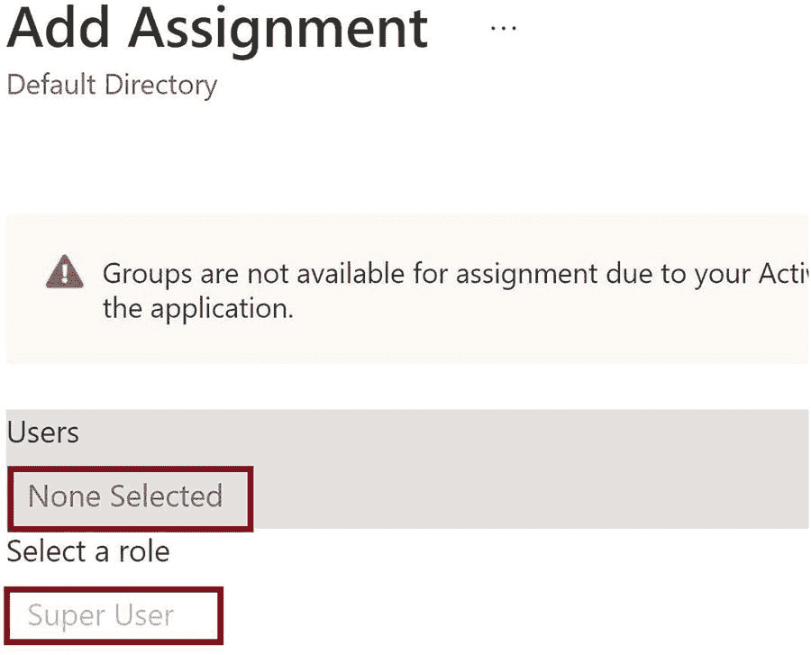

添加分配默认字典窗口的图像。需要填写的字段是：用户和选择角色。

图 12-19

点击未选择

选择用户并点击 *选择*，如图 12-20 所示。

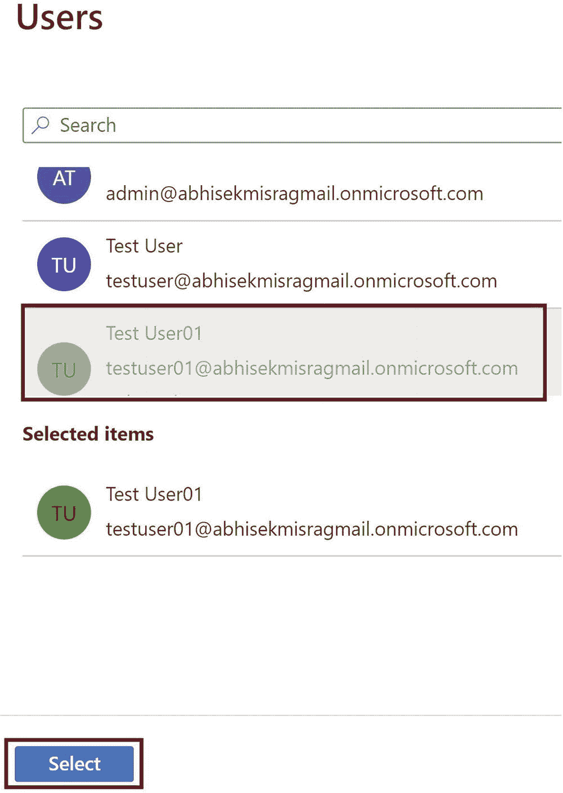

用户窗口的图像。内容包括一个搜索栏、一个包含用户名的账户列表（其中最后一个选项被选中）、已选项目列表以及左下角的“选择”选项。

图 12-20

选择用户

点击 *分配*，如图 12-21 所示，以完成用户的角色分配。

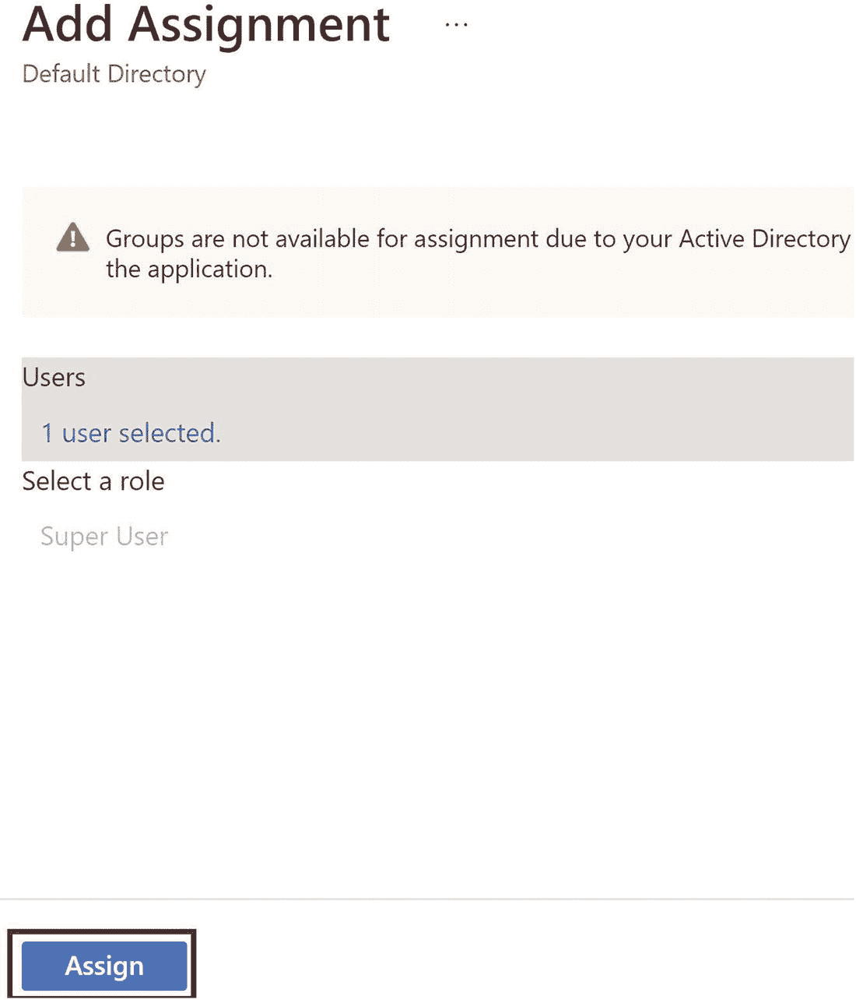

默认字典添加分配窗口的图像。窗口中的字段包括：用户（已选择一个）和角色选择。

图 12-21

为用户分配角色

## 配置 Spring Boot 应用程序

现在，让我们为 Java Spring Boot 应用程序配置身份验证和授权，以执行身份验证和授权。创建一个可以公开 API 的 Spring Boot 应用程序。你可以像在前几章中那样使用 *Spring Initializr* 来生成项目。确保 *pom.xml* 文件包含以下代码中列出的包。我们需要为 API 项目配置 Spring Security 以及 Azure Active Directory。清单 12-1 演示了 pom.xml 文件中的更改。

```

4.0.0

org.springframework.boot
spring-boot-starter-parent
2.6.4

com.azure.azuread
authdemo
0.0.1-SNAPSHOT
authdemo
Demo project for Spring Boot

3.14.0

org.springframework.boot
spring-boot-starter-oauth2-client

org.springframework.boot
spring-boot-starter-web

com.azure.spring
azure-spring-boot-starter-active-directory

org.springframework.boot
spring-boot-starter-test
test

com.azure.spring
azure-spring-boot-bom
${azure.version}
pom
import

org.springframework.boot
spring-boot-maven-plugin

清单 12-1
Pom.xml
```

让我们在 resources 文件夹中创建一个 *application.properties* 文件。我们需要提供应用程序或客户端 ID、租户 ID 以及之前在 Azure Active Directory 中创建应用程序注册时复制的客户端密钥。清单 12-2 演示了 application.properties 文件中的更改。

```
# 指定你的 Active Directory ID：
azure.activedirectory.tenant-id={提供租户 ID}
# 指定你的应用注册的应用程序 ID：
azure.activedirectory.client-id={提供应用 ID}
# 指定你的应用注册的密钥：
azure.activedirectory.client-secret={提供客户端密钥}
清单 12-2
application.properties
```

转到包含 *Main* 方法的类文件。将该类转换为 REST 控制器，如清单 12-3 所示。添加一个名为 *SuperUser* 的 REST 方法。在 *PreAuthorize* 属性中，以 *APPROLE_{RoleValue}* 格式提供角色值，其中 *RoleValue* 是你在 Azure Active Directory 应用程序中创建的角色值。

```
import org.springframework.boot.SpringApplication;
import org.springframework.boot.autoconfigure.SpringBootApplication;
import org.springframework.security.config.annotation.method.configuration.EnableGlobalMethodSecurity;
import org.springframework.security.config.annotation.web.configuration.EnableWebSecurity;
import org.springframework.web.bind.annotation.RestController;
import org.springframework.web.bind.annotation.GetMapping;
import org.springframework.web.bind.annotation.ResponseBody;
import org.springframework.web.bind.annotation.RestController;
import org.springframework.security.access.prepost.PreAuthorize;
@SpringBootApplication
@RestController
public class AuthedApplication {
public static void main(String[] args) {
System.out.println("Hello");
SpringApplication.run(AuthedApplication.class, args);
}
@GetMapping("SuperUser")
@ResponseBody
@PreAuthorize("hasAuthority('APPROLE_superuser')")
public String SuperUser() {
return "This is a Super User !! You have all kinds of Access in the WORLD !!";
}
}
清单 12-3
Main 方法的类文件
```

构建并运行应用程序。应用程序启动后，浏览清单 12-4 中的 URL。

```
http://localhost:8080/SuperUser
清单 12-4
要浏览的 URL
```

系统会提示你提供登录凭据，如图 12-22 所示。你需要提供我们创建的用户的凭据。对于所有其他用户，授权将不会成功，你将收到 *禁止访问* 的响应。

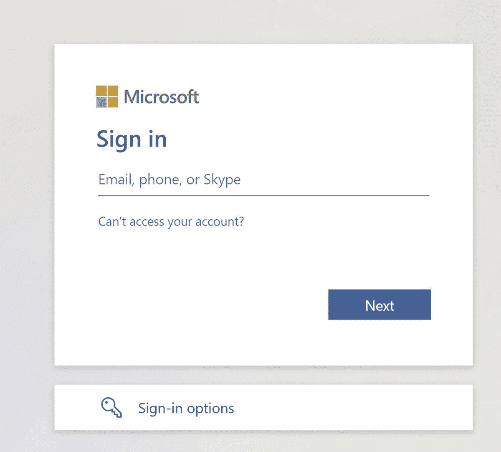

Microsoft 登录窗口的图像。内容包括：登录、输入电子邮件、电话或 Skype 的字段、无法访问你的帐户以及右下角的“下一步”选项。

图 12-22

提供凭据

一旦你提供了正确的凭据，浏览器将呈现以下输出，如图 12-23 所示。

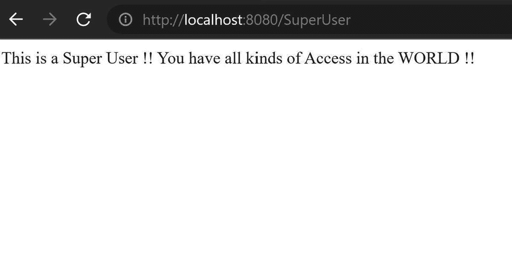

响应窗口的图像。任务栏包含 URL。内容为：这是一个超级用户！你拥有世界上所有类型的访问权限！

图 12-23

API 响应

## Azure AD 的身份验证场景

Azure AD 支持以下身份验证场景：

*   网页浏览器到 Web 应用程序

*   单页应用程序

*   本机应用程序到 Web API

*   Web 应用程序到 Web API

*   服务器应用程序到 Web API

让我们详细讨论每种场景。


### 从 Web 浏览器到 Web 应用程序

当用户在浏览器中请求应用程序的主页时，用户将被重定向到 Azure AD 登录页面。用户在 Azure AD 中登录，如果登录成功，浏览器会获得一个安全令牌作为回复 URL。然后，浏览器将此安全令牌发送给应用程序。该安全令牌包含用户的声明。应用程序验证此令牌并启动一个会话。应用程序可以检查这些声明，并允许用户根据声明中的描述在应用程序上执行操作。此登录过程支持的协议包括 OpenID Connect、SAML 2.0 和 WS-Federation。你可以使用 MSAL Azure AD SDK 来执行身份验证。

### 单页应用程序

单页应用程序使用 OAuth 2.0 隐式身份验证机制来授予用户访问应用程序及其后端 API 的权限。开发者可以使用 ADAL JavaScript 库来执行身份验证。用户在浏览器中请求单页应用程序。浏览器在浏览器中加载应用程序的登录页面。一旦用户点击登录按钮，浏览器就会向 Azure AD 授权端点发起一个 GET 请求，并请求一个 ID 令牌。该 GET 查询会根据你在门户中为应用程序配置的内容，将客户端 ID 和回复 URL 作为查询字符串参数传递。然后，Azure AD 会验证请求和回复 URL。接着，它会要求用户登录。如果用户能够成功登录，Azure AD 会将 ID 令牌作为回复 URL 的一部分返回。然后，应用程序可以提取该令牌，并根据用户声明相应地允许访问后端 API。

### 从本机应用程序到 Web API

在这种情况下，本机应用程序代表用户调用 Web API。它使用带有公共令牌的 OAuth 2.0 授权码授予类型。本机应用程序向 Azure AD 授权端点请求授权码，然后系统会要求用户登录。用户登录后，应用程序会获得一个授权码。然后，应用程序将该授权码发送到 Azure AD 令牌端点，并获取 JWT 令牌。接着，它会在请求的授权标头中将 JWT 令牌传递给 Web API。Web API 验证 JWT 令牌，然后允许应用程序访问该 Web API。

### 从 Web 应用程序到 Web API

在这里，你可以使用**委托用户身份**或**应用程序身份**来访问 Web API。在使用应用程序身份的情况下，你使用 OAuth 2.0 客户端凭据授予。用户像在“浏览器到 Web 应用程序”场景中一样登录到 Web 应用程序。然后，Web 应用程序尝试通过请求 Azure AD 令牌端点来获取访问令牌。Azure AD 对请求进行身份验证，如果身份验证成功，应用程序将获得一个 JWT 令牌。该 JWT 令牌用于调用 Web API。Web API 验证 JWT 令牌并提供访问权限。在此场景中，由于是 Web 应用程序驱动身份验证，Web API 不会在 JWT 令牌中获取用户详细信息。委托用户身份帮助 Web 应用程序以用户身份进行身份验证，并且 JWT 将包含 Web API 可以使用的用户详细信息。

### 从服务器应用程序到 Web API

服务器应用程序可以是守护程序或批处理应用程序，它们无法像人类一样进行身份验证。它需要将凭据（可以是密码或证书）以及应用程序 URI 和客户端 ID 传递给 Azure AD。为了进行身份验证，它使用带有凭据授予的应用程序身份，或使用带有 OAuth 2.0 代理流的委托用户身份。

## 总结

在本章中，我们学习了 Azure Active Directory 的基础知识。我们学习了如何在 Azure Active Directory 中创建用户和注册应用程序。然后，我们开发了一个基于 Maven 的 Java 代码，并在 Azure Active Directory 中使用了该应用程序。在下一章中，我们将学习如何使用 Azure DevOps 和 Azure CLI 来预配 Azure 资源。

以下是本章的关键要点：

*   Azure Active Directory 是 Azure 上的一种身份即服务（IDaaS）产品。

*   Azure Active Directory 帮助你管理在 Azure、本地或任何其他云上运行的应用程序的用户身份验证和授权。

*   Azure Active Directory 支持集成 B2B 和 B2C 场景。

*   你可以使用 AD Connect 将本地 Active Directory 集成到 Azure Active Directory，并将本地目录中的所有用户、组和角色同步到 Azure。

