# 13. 使用 Azure DevOps 和 Azure CLI 预配资源

基础设施即代码（IaC）是基于云的企业中广泛采用的做法。你可以使用脚本和 DevOps 工具自动创建云基础设施。你需要创建这些脚本或解决方案一次，并在多个环境中重复使用它们。这种方法可以为你节省大量时间和精力。有许多可用的基础设施即代码（IaC）实用程序和工具，可以帮助你自动预配 Azure 基础设施。

在上一章中，我们学习了 Azure Active Directory 的基本概念。然后，我们创建了一个可以使用 Azure Active Directory 执行用户身份验证和授权的 Java 应用程序。在本章中，我们将探讨 Azure 的基础设施即代码（IaC）选项，然后使用 Azure CLI 和 Azure DevOps 启动一个 Azure Web 应用。

## 结构

在本章中，我们将讨论使用 Azure DevOps 和 Azure CLI 创建基础设施的以下方面：

*   Azure 上的基础设施即代码（IaC）简介

*   创建用于启动 Azure Web 应用的 Azure CLI 脚本

*   创建用于启动 Azure Web 应用的 Azure DevOps 管道

## 目标

学习本章后，你应该能够获得以下知识：

*   探索可用于通过自动化创建 Azure 基础设施的选项

*   使用 Azure DevOps 和 Azure CLI 创建 Azure 资源


## Azure 基础设施即代码 (IaC) 简介

Azure 门户可帮助您轻松创建 Azure 资源。您会获得一个直观且基于向导的用户界面，并可使用它来创建资源。但是，您需要手动登录 Azure 门户，然后在门户中提供资源详细信息并创建资源。如果您只有一个环境，这种方法效果很好。然而，企业通常拥有多个环境，例如开发、测试、验收和生产环境。如果您使用 Azure 门户在这些环境中创建资源，最终可能会进行许多重复性活动。您需要在开发环境中为应用程序创建资源，然后在其他环境中创建相同的资源集。这种方法工作量大，并且由于涉及手动操作，存在引入错误的风险。但是，您可以自动执行资源创建活动，并在多个环境中触发自动化。这种方法将为您节省大量时间，并且不会出错。与使用 Azure 门户创建资源的方法相比，您可以更快地创建好环境。

以下是一些流行的用于自动化创建 Azure 资源的**基础设施即代码 (IaC)** 方案：

*   Azure CLI
*   Azure PowerShell
*   ARM 模板
*   Terraform
*   Bicep

Azure CLI 是一个跨平台方案，您可以在 Windows、Linux 或 Mac 系统上启动 Azure 资源。您可以从命令提示符、bash 提示符或 PowerShell 提示符运行 Azure CLI 脚本。

Azure PowerShell 为您提供了有助于启动 Azure 资源的 PowerShell 模块。如果您使用可在 PowerShell 6 及更高版本上运行的 Azure PowerShell Core，则可以构建跨平台脚本。

使用 ARM 模板，您可以将 Azure 基础设施表示为 JSON 模板，然后将该模板部署到 Azure 环境并启动您的 Azure 资源。Azure CLI 和 Azure PowerShell 都公开了可用于部署这些模板的命令。

Azure PowerShell、Azure CLI 和 ARM 模板是 Microsoft 提供的用于创建 Azure 资源的方案。Terraform 是一个第三方方案，可帮助您编写脚本来创建 Azure 资源。

您可以使用 Azure DevOps 管道来调用使用 Azure CLI、PowerShell、Terraform 或 ARM 模板开发的脚本，以启动 Azure 基础设施。在这种情况下，您可以构建发布管道以在各种环境中启动基础设施。这种方法将帮助您构建一键式自动化，从而启动 Azure 基础设施并部署应用程序。

## 创建用于启动 Azure WebApp 的 Azure CLI 脚本

让我们创建一个 Azure CLI 脚本来启动 Azure WebApp。作为先决条件，您应该在系统中安装 Azure CLI。请遵循清单 13-1 中提供的安装步骤。

```
https://docs.microsoft.com/en-us/cli/azure/install-azure-cli
清单 13-1
Azure CLI 安装 URL
```

让我们打开 PowerShell、命令提示符或 bash 提示符。第一步，我们需要使用清单 13-2 中的命令登录到 Azure。

```
az login
清单 13-2
登录到 Azure
```

系统会提示您在浏览器中提供凭据，如图 13-1 所示。

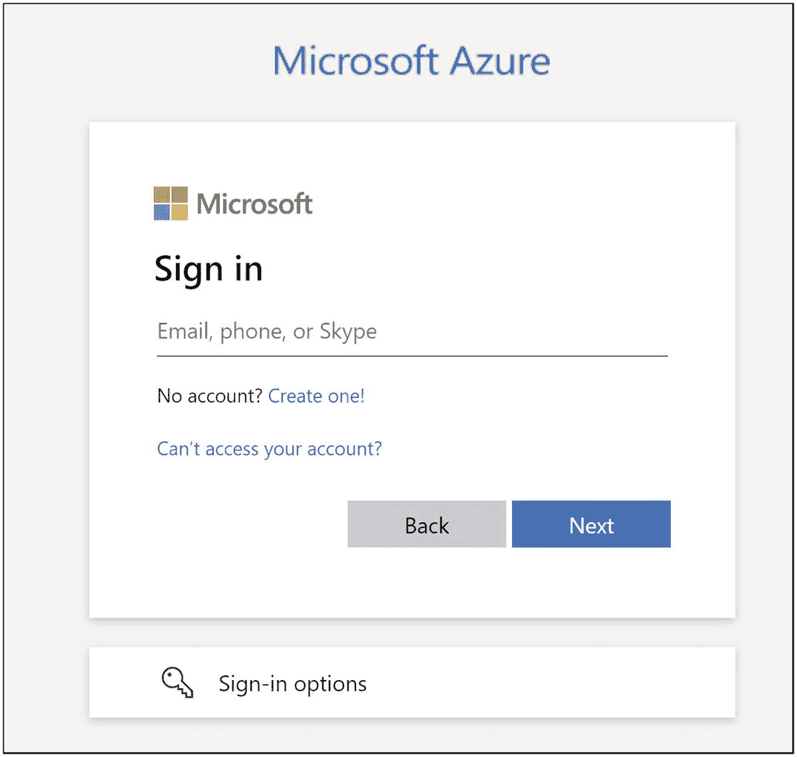

Microsoft Azure 登录页面的屏幕截图。该页面包含一个 Microsoft 徽标。一个用于输入电子邮件、电话或 Skype 的空白字段。在空白字段下方，有以下活动链接：没有帐户？创建一个。无法访问你的帐户？底部的选项卡标题为“返回”和“下一步”，其后是“登录选项”。

图 13-1

登录到 Azure

登录到 Azure 后，您需要选择一个订阅来创建资源。执行清单 13-3 中的命令来选择您的订阅。将 `{subscription}` 替换为您的订阅名称或订阅 ID。您可以使用 `az account show` 命令列出本章中的所有订阅。

```
az account set -s "{subscription}"
清单 13-3
选择一个订阅
```

您需要创建一个资源组，然后在该资源组内创建 WebApp。您也可以选择使用现有的资源组。在这种情况下，您可以忽略此步骤。将 `{name}` 替换为资源组名称。这里，我们在 eastus 位置创建资源组。您可以选择符合您需求的 Azure 位置。清单 13-4 演示了创建资源组的命令。

```
az group create --location eastus --name {name}
清单 13-4
创建一个资源组
```

我们需要为 WebApp 创建一个应用服务计划。执行清单 13-5 中的命令，了解如何使用应用服务计划的 create 命令。您还将了解此处可用的各种应用服务计划 SKU 以及其他详细信息。

```
az appservice plan create --help
清单 13-5
创建应用服务计划帮助
```

执行清单 13-6 中的命令，在 eastus 区域创建一个标准 SKU (S1) 的应用服务计划。将 `{resourcegroup-name}` 替换为资源组的名称，将 `{name}` 替换为应用服务计划的名称。

```
az appservice plan create --resource-group {resourcegroup-name} --name {name} --sku S1 --location eastus
清单 13-6
创建一个应用服务计划
```

执行清单 13-7 中的命令来创建一个 WebApp。将 `{name}` 替换为 WebApp 的名称，将 `{resourcegroup-name}` 替换为资源组的名称，将 `{plan-name}` 替换为应用服务计划的名称。

```
az webapp create --name {name} --resource-group {resourcegroup-name} --plan {plan-name}  --runtime "java:11:Java SE:11"
清单 13-7
创建一个 WebApp
```

您的 WebApp 将在提供的资源组中创建。您可以使用命令 `curl -s -o /dev/null -w "%{http_code}" https://{name}.azurewebsites.net/`，其中 `{name}` 是 WebApp 的名称。您应该会收到响应代码 200。


## 创建用于启动 Azure WebApp 的 Azure DevOps 管道

让我们使用 Azure DevOps 创建一个 Azure WebApp。我们将调用 Azure CLI 脚本，从 Azure DevOps 任务中创建 WebApp。请使用清单 13-8 中的 URL 登录 Azure DevOps 门户。

```
https://dev.azure.com
清单 13-8
Azure DevOps 登录 URL
```

登录 Azure DevOps 后，我们可以创建一个新的 DevOps 项目。点击*新建项目*，如图 13-2 所示。

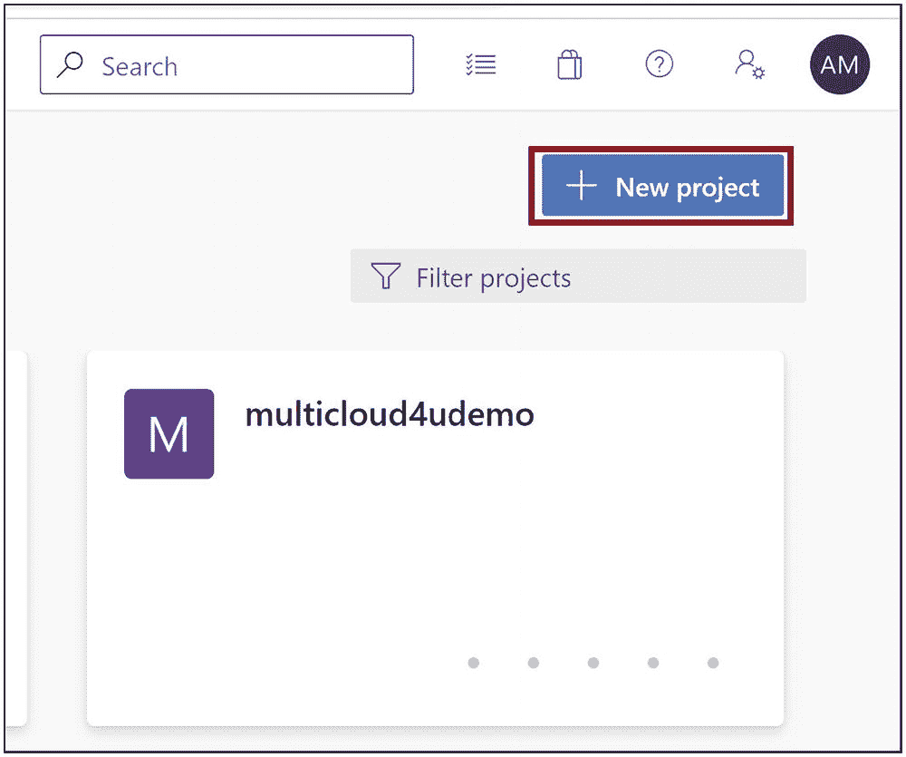

项目创建页面的截图。顶部面板包含一个搜索栏。用于创建新项目的选项卡已高亮显示。它位于右上角附近，面板下方。有一个搜索栏用于筛选项目，其后是一个显示“multi-cloud 4u demo”的空白屏幕。右下角有五个点。

图 13-2

创建新项目

提供项目名称，将其标记为私有项目，然后点击*创建*，如图 13-3 所示。

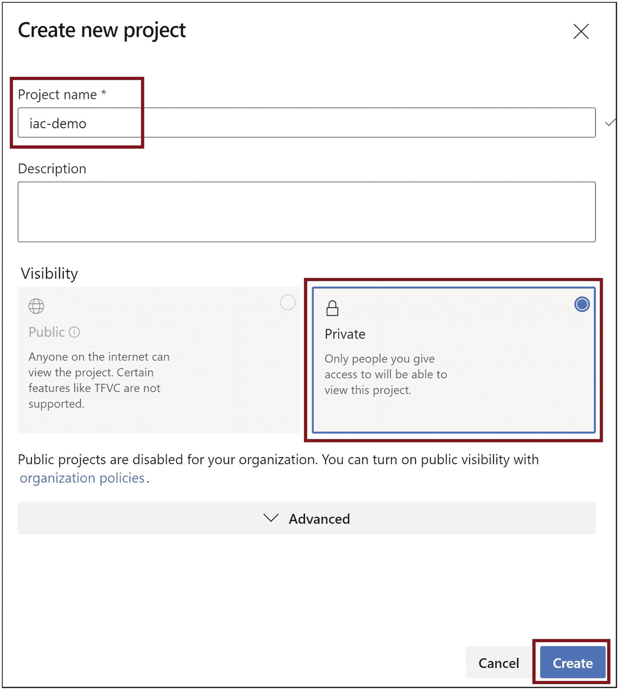

标题为“创建新项目”的网页截图。描述标题下有一个空白字段。项目名称“iac-demo”标题已高亮显示。下一个选项卡是可见性：公共或私有。私有选项已高亮显示。取消和创建选项位于右下角。创建选项卡已高亮显示。

图 13-3

点击创建

将鼠标悬停在*管道*上，如图 13-4 所示。此操作将列出管道的菜单项。

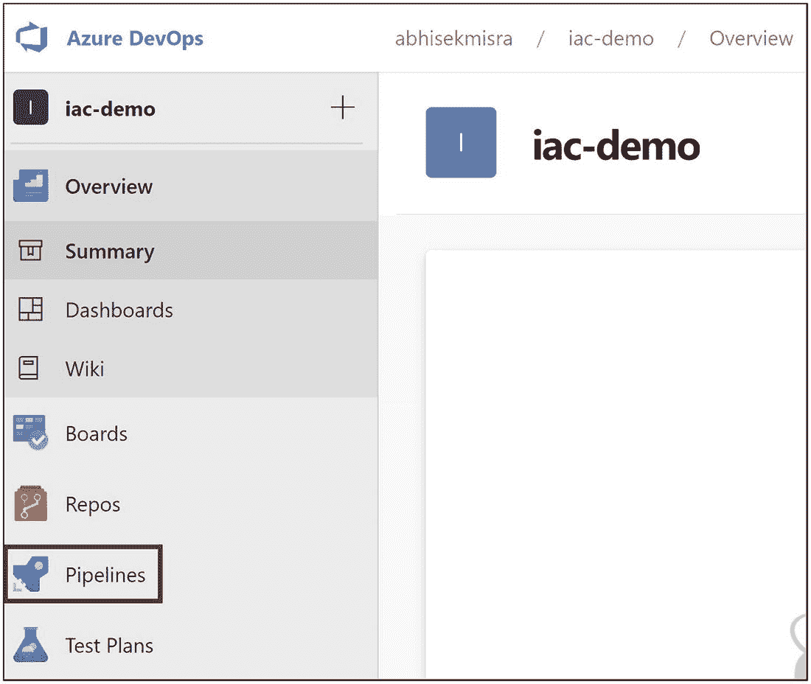

Azure DevOps 网站的截图版本。左侧面板包含以下选项：I a c demo、概述、摘要、仪表板、Wiki、存储库、管道和测试计划。管道选项已高亮显示。I a c demo 之后是右侧的空白屏幕。在右上角，您可以看到“Abisek Misra / I a c demo / 概述”。

图 13-4

将鼠标悬停在管道上

点击*发布*，如图 13-5 所示。您将导航到发布管道。

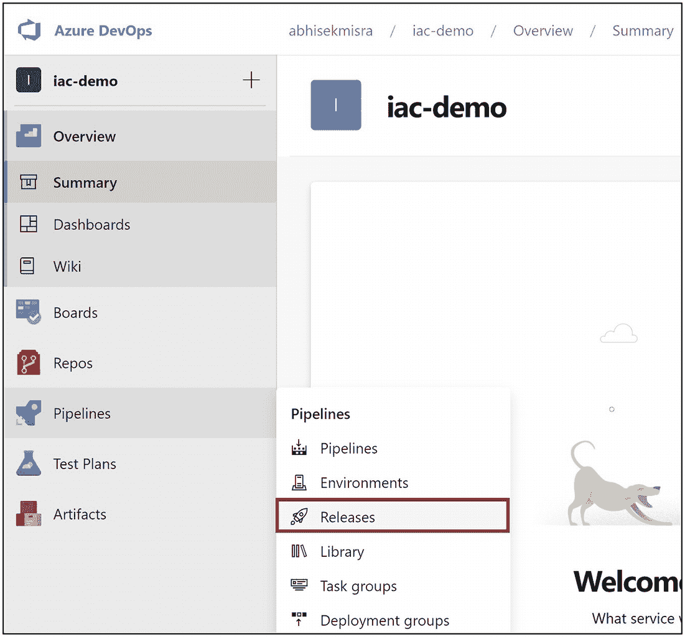

Azure DevOps 网页的截图。左侧面板中的选项有：i a c demo、概述、摘要、仪表板、存储库、管道和测试计划。在右侧，i a c demo 之后是一个空白屏幕。管道下的选项有：环境、发布、库、任务组和部署组。发布选项已高亮显示。

图 13-5

点击发布

让我们创建一个新的发布管道。点击*新建管道*，如图 13-6 所示。

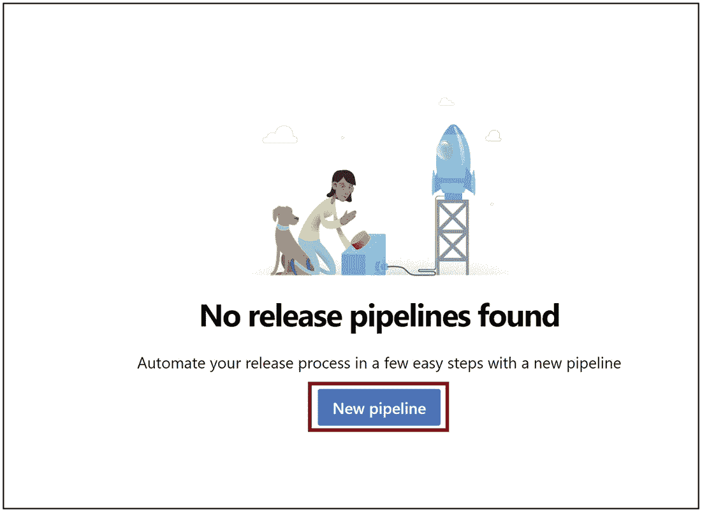

管道创建网页的截图。屏幕中央是一个卡通人物，牵着一只狗并扛着一个火箭发射器。根据下方文字，未找到任何发布管道。使用新管道，您可以通过几个简单步骤自动化发布流程。用于创建新管道的选项卡已高亮显示。

图 13-6

点击新建管道

系统将提示您选择一个作业模板。选择*空作业*，如图 13-7 所示。

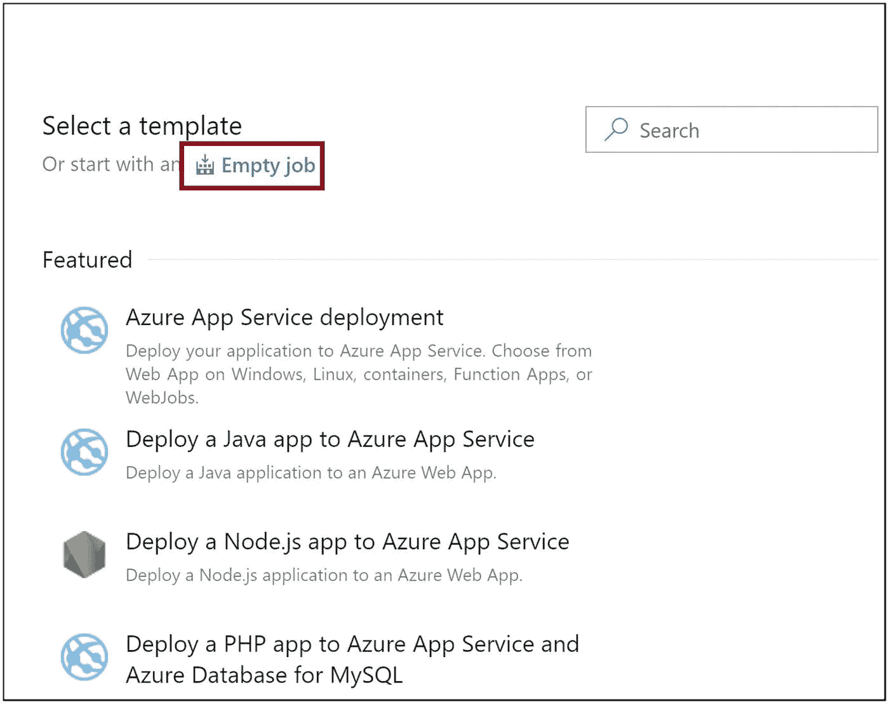

标题为“选择模板”的网页截图。标题下方是“从空作业开始”的选项。右上角有一个搜索栏。特色选项包括：Azure 应用服务部署、将 Java 应用部署到 Azure 应用服务、将 Node.js 应用部署到 Azure 应用服务、以及将 PHP 应用部署到 Azure 服务和数据库。

图 13-7

选择空作业模板

我们需要向阶段添加 Azure CLI 任务。点击*1 个作业，0 个任务*，如图 13-8 所示。

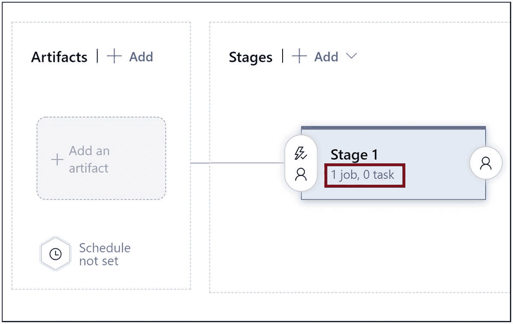


添加工件和阶段的流程截图。屏幕分为左右两部分。左侧有添加工件的选项，其后为空白区域。根据底部文字显示，尚未设置计划。右侧有添加阶段的选项，其后是一个标记为“阶段 1”的方框。在“阶段 1”下方，文字“1 个作业，0 个任务”被高亮显示。

图 13-8

添加任务

我们需要添加 Azure CLI 任务。点击如图 13-9 所示的 *+* 图标。

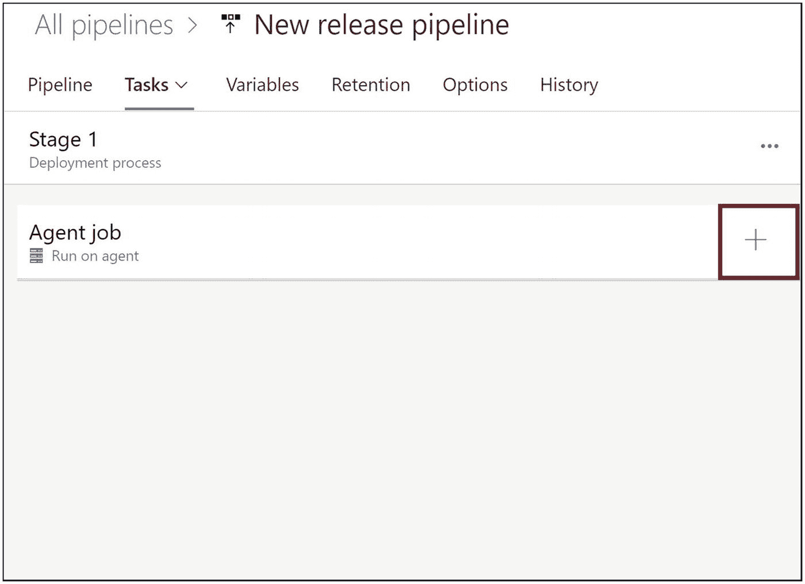

新建发布管道网页的截图。顶部面板包含以下选项卡：管道、任务、变量、保留、选项和历史记录。任务下的下拉菜单显示以下信息：阶段 1 包含部署流程和代理作业。代理作业标题旁边的加号被高亮显示。

图 13-9

点击 + 图标

搜索 *Azure CLI* 并选择 *Azure CLI*，如图 13-10 所示。

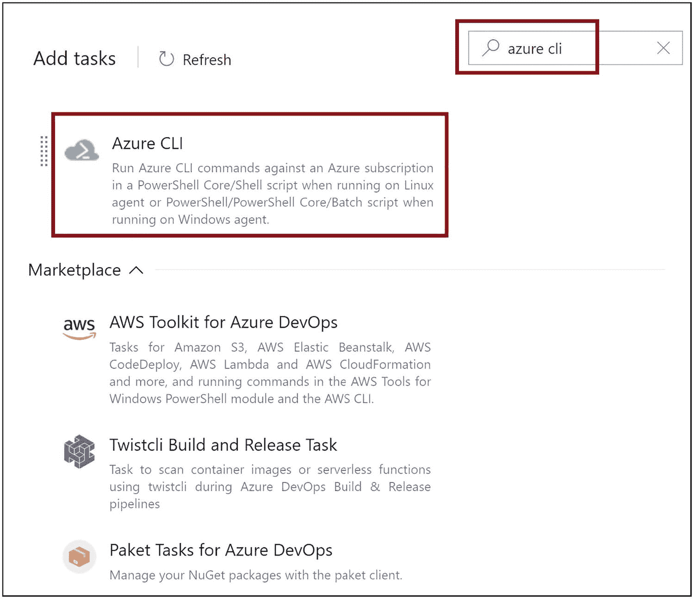

添加任务网页的截图。右上角有一个高亮显示的搜索栏。“添加任务”下的“Azure CLI”选项被高亮显示。市场下的选项包括：用于 Azure DevOps 的 AWS 工具包、twist CLI 构建和发布任务，以及用于 Azure DevOps 的 paket 任务。

图 13-10

选择 Azure CLI

点击 *添加* 将此任务包含到代理作业中，如图 13-11 所示。

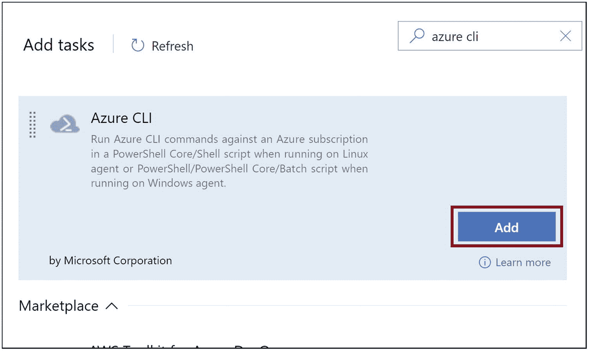

添加任务网页的截图。左上角提到“添加任务”和“刷新”。右上角有一个搜索栏。在一个阴影框中提到了 Microsoft Corporation 的“Azure CLI”选项。该选项有一个被高亮显示的“添加”标签。

图 13-11

选择“添加”

点击 *Azure CLI* 任务，如图 13-12 所示。我们需要配置此任务以创建 WebApp。

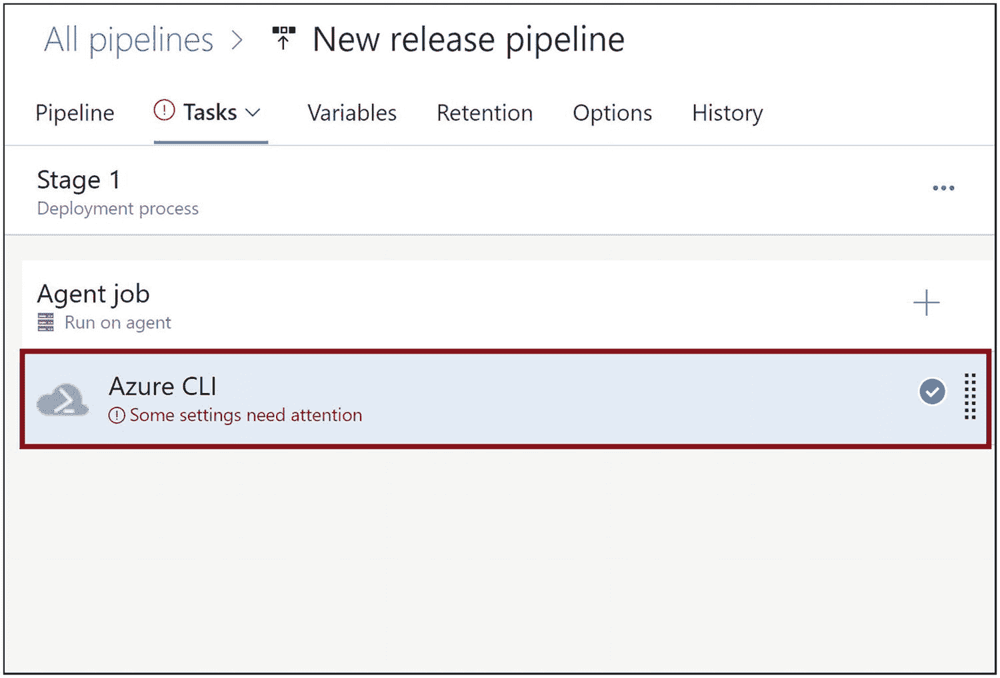

标题为“新建发布管道”的网页截图。顶部面板的选项卡包括：管道、任务、变量、保留、选项和历史记录。任务上的下拉选项包括：阶段 1、代理作业和 Azure CLI。Azure CLI 带有一个勾选标记并被高亮显示。

图 13-12

点击 Azure CLI

选择需要创建 WebApp 的 Azure 订阅，如图 13-13 所示。

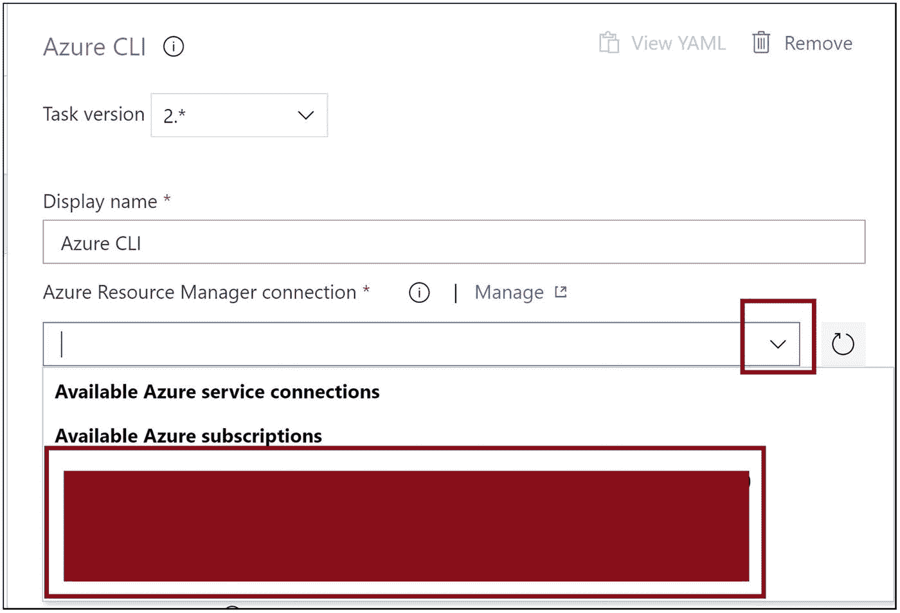

标题为“Azure CLI”的网页截图。以下选项包含空白字段：任务版本、显示名称、带有高亮下拉菜单的 Azure 资源管理器连接，以及可用的 Azure 订阅。“可用订阅”框被高亮显示并带有阴影。页面右上角有一个“删除”选项。

图 13-13

选择一个 Azure 订阅

点击 *授权*，如图 13-14 所示。此操作将授权管道连接到 Azure 环境并创建 WebApp。

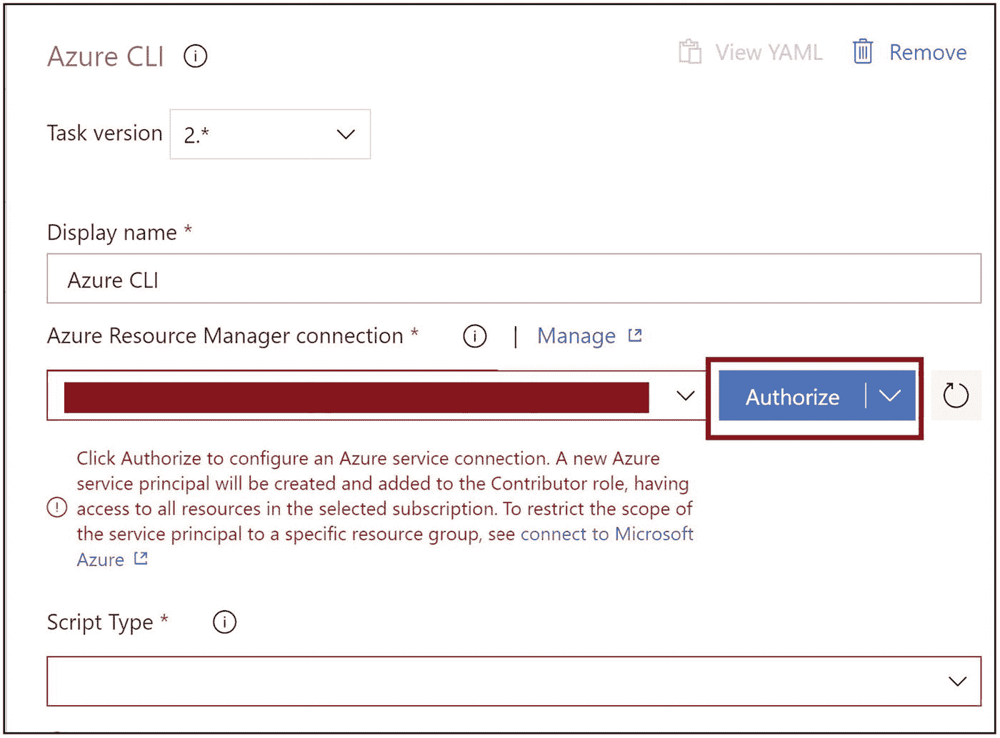

标题为“Azure CLI”的网页截图。以下选项包含空白字段：任务版本、显示名称、带有下拉菜单的 Azure 资源管理器连接，以及脚本类型。Azure 资源框带有阴影，用于授权的标签被高亮显示。下方文字显示：点击授权以配置 Azure 服务连接。

图 13-14

授权连接

系统将提示您提供登录凭据，如图 13-15 所示。

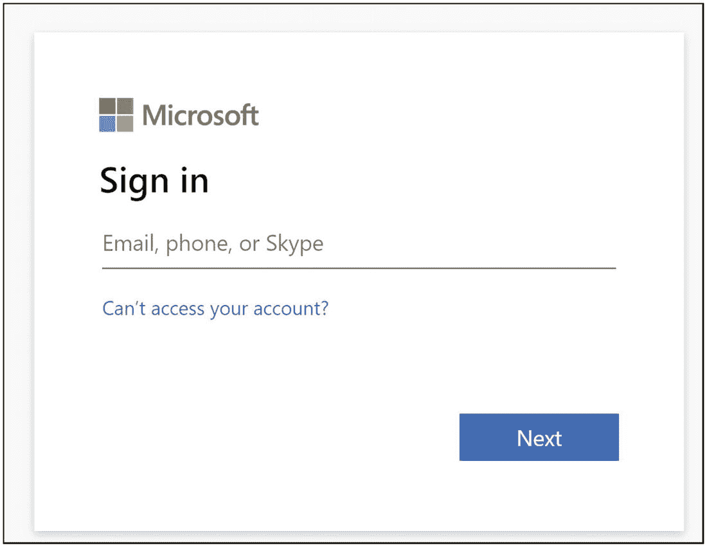

登录页面的截图。顶部显示带有其徽标的 Microsoft，其后是用于输入电子邮件、电话或 Skype 的空白字段。一个活动链接显示“无法访问你的帐户？”。下一个标签位于右下角。


图 13-15

提供登录凭据

你可以提供用于创建资源组、应用服务计划和 Web 应用的命令。选择 *PowerShell* 作为 *脚本类型*，选择 *内联脚本* 作为 *脚本位置*，如图 13-16 所示。我们无需登录 Azure 门户并选择订阅。

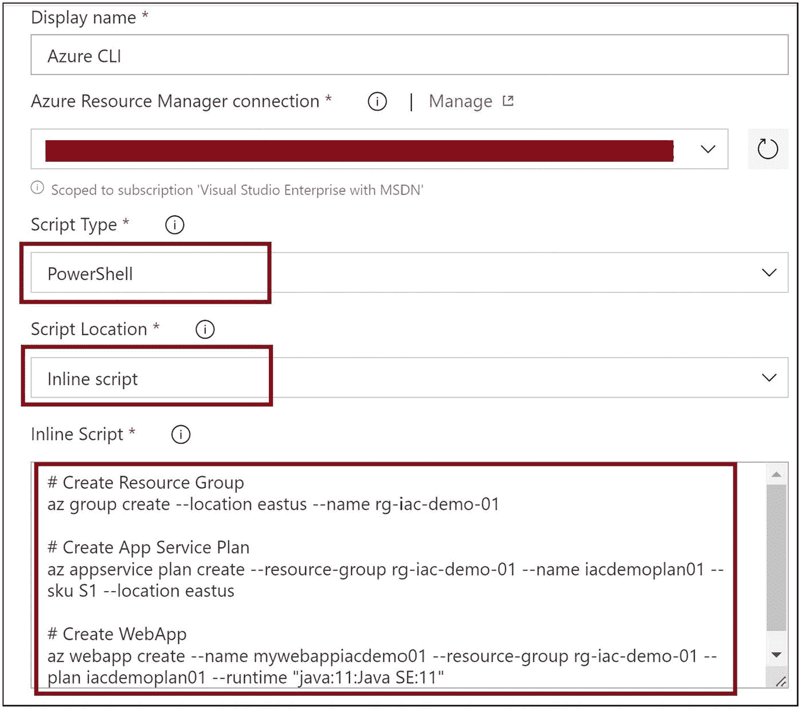

资源组创建页面的截图。显示名称：Azure CLI，Azure 资源管理器连接，脚本类型：PowerShell，脚本位置：内联脚本，以及内联脚本。内联脚本下方高亮显示的文本表示创建一个资源组、一个应用服务计划和一个 Web 应用。

图 13-16

配置 Azure CLI 任务

为管道提供一个有意义的名称，如图 13-17 所示。

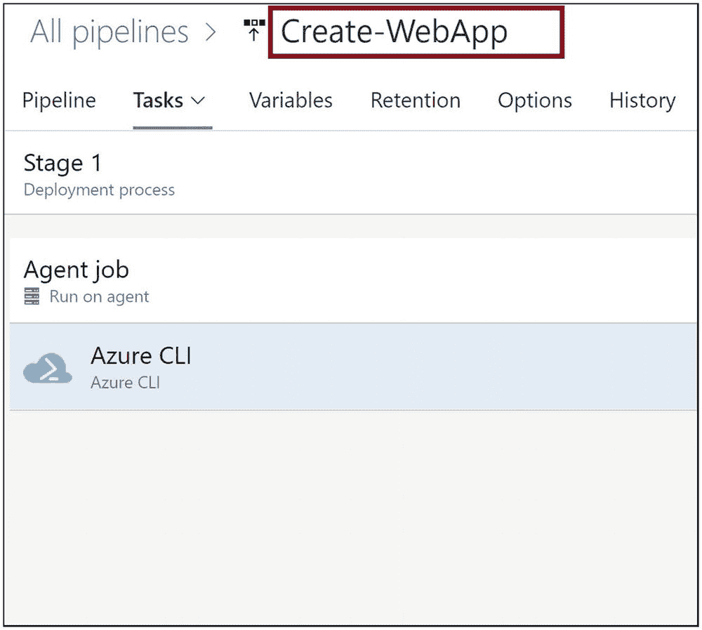

标题为“创建 Web 应用”的网页截图。顶部的文本“创建 Web 应用”被高亮显示。下方面板的选项包括：管道、任务、变量、保留、选项和历史记录。任务下拉菜单打开以下选项：阶段 1、代理作业和 Azure CLI。

图 13-17

提供管道名称

点击 *保存*，如图 13-18 所示。此操作将保存管道。

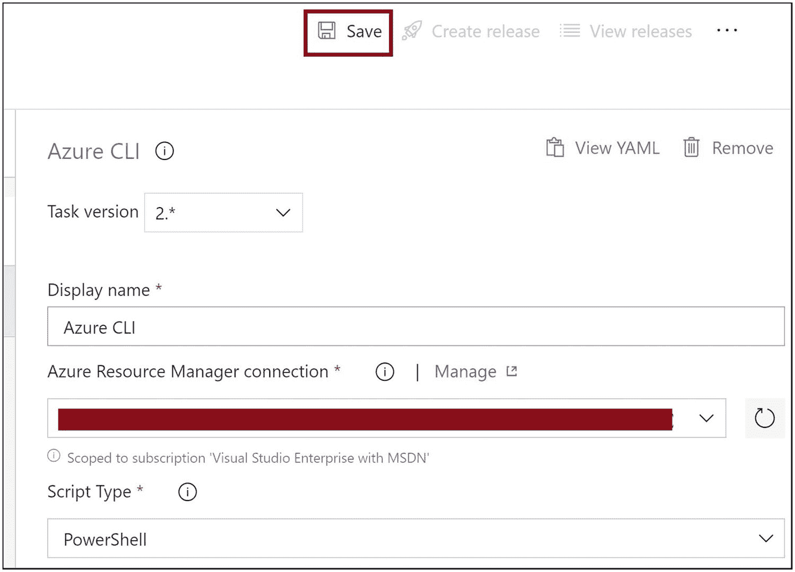

保存任务的网页截图。顶部的“保存”选项被高亮显示。Azure CLI 下的选项包括：任务版本、显示名称、Azure 资源管理器连接和脚本类型。Azure 资源管理器连接下的下拉框被阴影覆盖。

图 13-18

保存管道

点击 *创建发布* 以创建一个新发布，如图 13-19 所示。

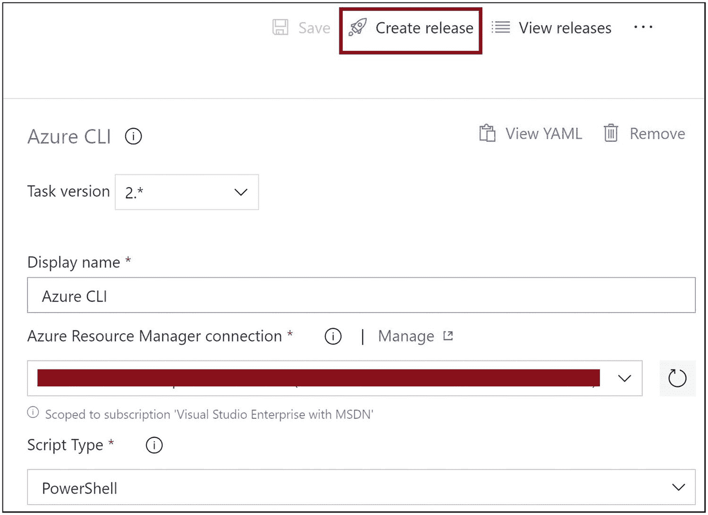

Azure CLI 网页的截图。顶部的“创建发布”选项被高亮显示。Azure CLI 下的选项包括：任务版本、显示名称、带有阴影下拉框的 Azure 资源管理器连接以及脚本类型。

图 13-19

创建发布

选择阶段并点击 *创建*，如图 13-20 所示。

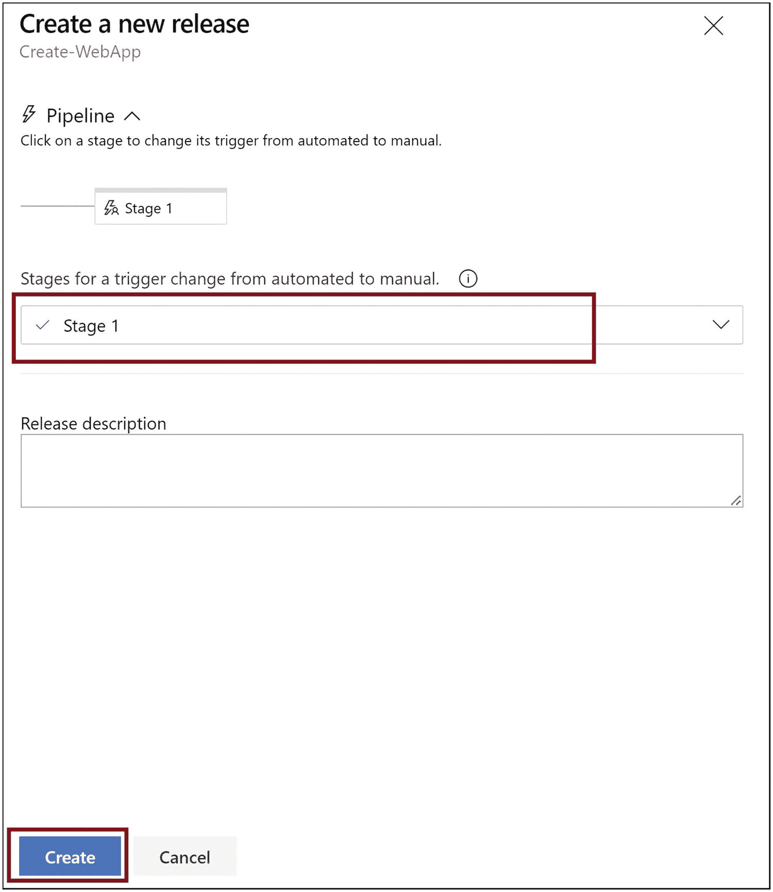

可以创建新发布的网页截图。提到的字段如下：管道：阶段 1：通过点击将触发器从自动更改为手动。触发器更改的阶段：高亮显示的下拉框中显示阶段 1。发布信息。左下角的“创建”选项卡被高亮显示。

图 13-20

点击创建

点击已创建的发布，如图 13-21 所示。

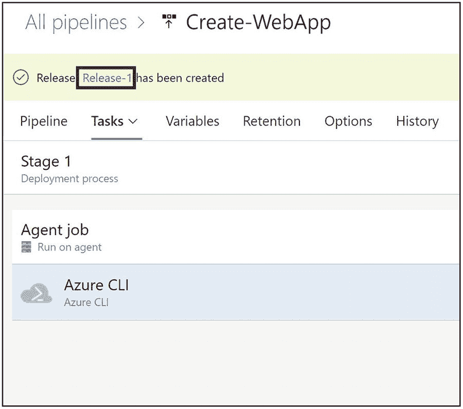

创建 Web 应用的网页截图。顶部的文本显示“发布，发布 1，已创建”。发布 1 被高亮显示。下方面板的选项包括：管道、任务、变量、保留、选项和历史记录。任务下拉菜单打开以下数据：阶段 1、代理作业和 Azure CLI。

图 13-21

点击已创建的发布

点击 *部署*，如图 13-22 所示。

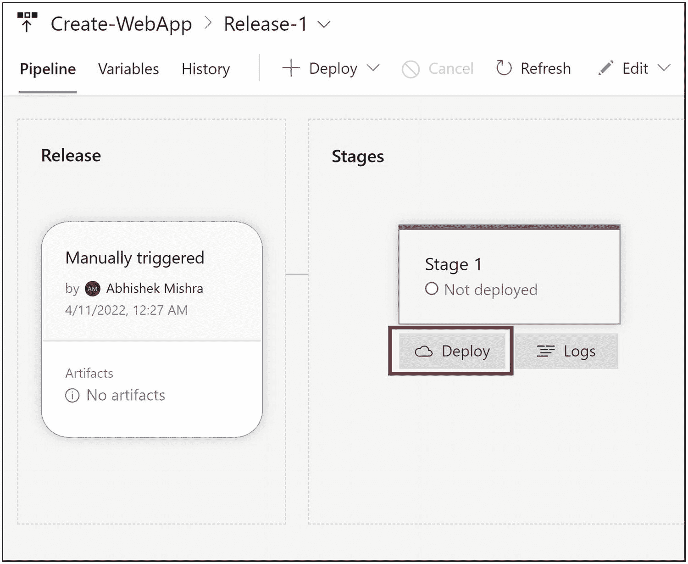

发布 1 网页的截图。顶部面板的“管道”选项打开一个下方屏幕。它分为左右两部分。左侧显示“发布”，右侧显示“阶段”。左侧屏幕有一个标题为“手动触发”的框。右侧屏幕有一个标题为“阶段 1，未部署”的框。“部署”选项被高亮显示。

图 13-22

部署发布

点击 *部署* 开始创建 Web 应用，如图 13-23 所示。一旦管道成功完成，Web 应用即被创建。

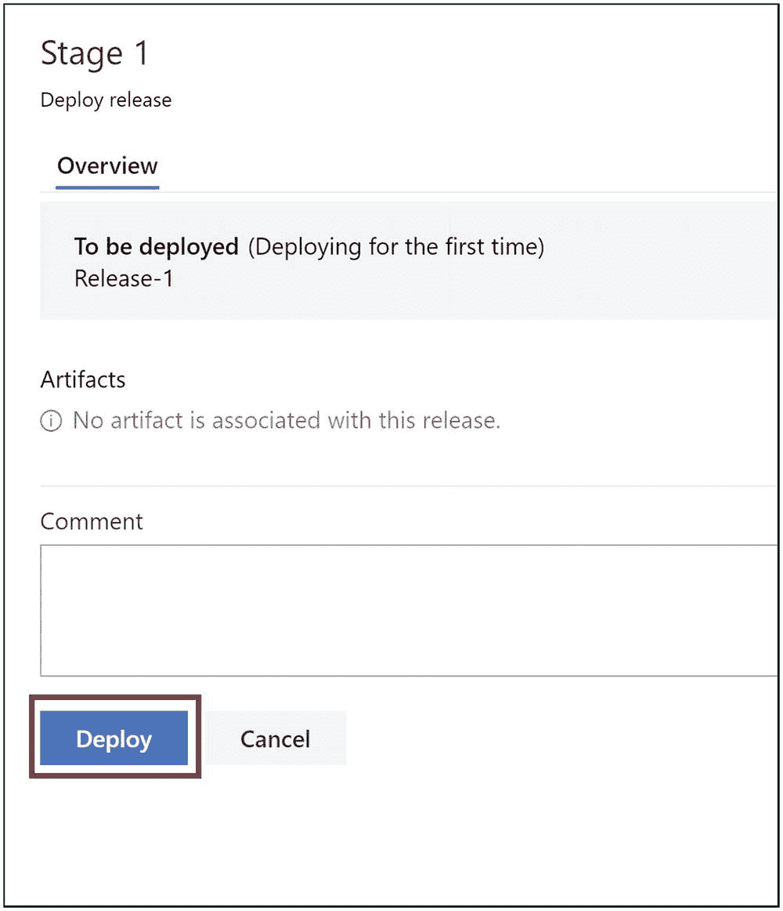

标题为“阶段 1，部署发布”的网页截图。概述部分包含以下内容：待部署：发布 1。项目：没有项目与此发布关联。一个评论框。底部的“部署”和“取消”选项卡。“部署”选项卡被高亮显示。

图 13-23

点击部署

为了验证，你可以使用命令 `curl -s -o /dev/null -w "%{http_code}"` [`https://mywebappiacdemo01.azurewebsites.net/`](https://mywebappiacdemo01.azurewebsites.net/) 并检查状态码是否为 200。

## 总结

本章教会了我们如何使用 Azure CLI 和 Azure DevOps 创建 Azure 资源。我们使用 Azure CLI 和 Azure DevOps 创建了一个资源组、一个应用服务计划和一个 Azure Web 应用。在下一章中，我们将学习如何使用 Azure DevOps 将 Java 应用程序部署到 Azure。

以下是本章的关键要点：

*   使用 Azure 门户创建 Azure 资源工作量大，且由于涉及手动操作，存在引入错误的风险。你可以自动化资源创建活动，并在多个部署环境中触发自动化。这种方法将为你节省大量时间，并且不会出错。

*   以下是一些流行的基础设施即代码（IaC）产品，用于自动化创建 Azure 资源：
    *   Azure CLI

    *   Azure PowerShell

    *   ARM 模板

    *   Terraform

    *   Bicep

