# 14. 使用 Azure DevOps 进行构建和部署

持续集成管道构建应用程序，持续部署管道将应用程序部署到目标托管环境。这种 DevOps 方法自动化了应用程序的构建和部署方法，并被所有现代企业所采用。这些管道减少了部署过程中的手动错误，并确保更快的市场发布。我们可以使用 Azure DevOps 管道来构建应用程序并将其部署到 Azure。

在上一章中，我们学习了基础设施即代码（IaC）的基本概念。然后，我们创建了一个 Azure CLI 脚本来启动 Azure 资源。我们还使用了 Azure DevOps CLI 任务来创建 Web 应用。在本章中，我们将学习如何使用 Azure DevOps 管道将 Java 应用程序部署到 Azure。

## 结构

在本章中，我们将讨论以下基于 DevOps 的应用程序部署概念：

*   创建一个 Java 应用程序并将其提交到基于 Git 的 Azure Repos

*   创建一个基于 YAML 的管道来构建应用程序并将其部署到 Azure Web 应用

## 目标

学习完本章后，你应该能够获得以下知识：

*   学习如何使用 Azure Repos

*   学习如何使用 Azure DevOps 管道构建 Java 应用程序并将其部署到 Azure


## 创建 Java 应用程序并将其提交到基于 Git 的 Azure Repos

让我们构建一个简单的 Java Spring Boot API，它将返回一个字符串。你可以使用 Spring Initializr 生成该应用程序。清单 14-1 展示了该应用程序的 POM 文件。我们需要包含 *Spring Web* 依赖项，如清单 14-1 所示。

```

4.0.0

org.springframework.boot
spring-boot-starter-parent
2.6.6

com.iac
demo
0.0.1-SNAPSHOT
demo
Demo project for Spring Boot

org.springframework.boot
spring-boot-starter-web

org.springframework.boot
spring-boot-starter-test
test

org.springframework.boot
spring-boot-maven-plugin

清单 14-1
POM.xml
```

你可以生成一个包含 Main 方法和 REST API 的类文件。清单 14-2 展示了该类文件的内容。

```
package com.iac.demo;
import org.springframework.boot.SpringApplication;
import org.springframework.boot.autoconfigure.SpringBootApplication;
import org.springframework.web.bind.annotation.GetMapping;
import org.springframework.web.bind.annotation.RestController;
@SpringBootApplication
@RestController
public class DemoApplication {
public static void main(String[] args) {
SpringApplication.run(DemoApplication.class, args);
}
@GetMapping("/")
public String index() {
return "Hello Spring Boot on WebApp !!";
}
}
清单 14-2
类文件
```

一旦应用程序构建成功，你就可以将代码签入到 Azure Repos。前提条件是，你的系统上应该已经安装了 Git。我们可以使用上一章创建的 Azure DevOps 项目。打开 Azure DevOps URL 并导航到该项目。点击 *Repos*，然后点击 *生成 Git 凭据*，如图 14-1 所示。

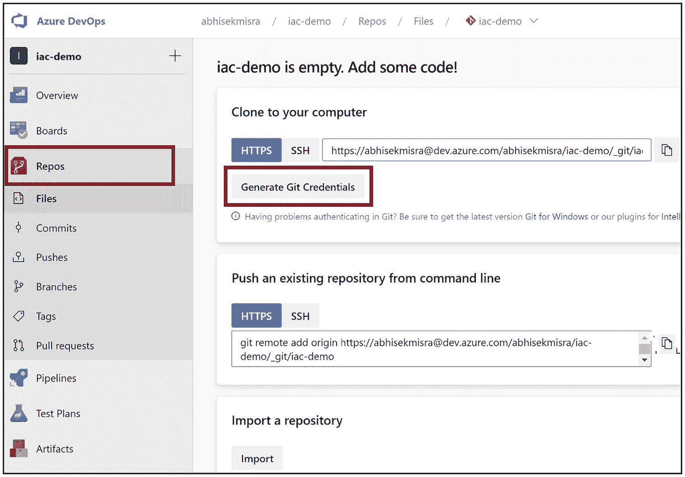

一个表示生成 Git 凭据的窗口截图。

图 14-1

生成 Git 凭据

复制 HTTPS URL、Git 用户名和密码，如图 14-2 所示。

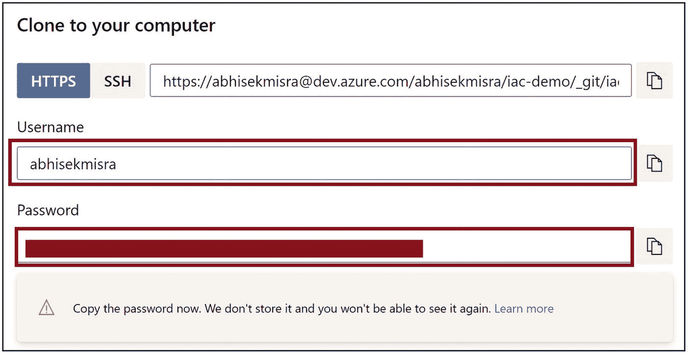

一个“克隆到您的计算机”对话框，用于复制 Git 凭据。

图 14-2

复制 Git 凭据

在 Windows 资源管理器中，导航到包含 POM 文件的 Java 项目根文件夹。执行清单 14-3 中的命令来初始化一个本地 Git 仓库。

```
git init
清单 14-3
初始化本地 Git 仓库
```

执行清单 14-4 中的命令，将文件夹内容添加到本地 Git 仓库。

```
git add .
清单 14-4
将本地更改添加到 Git 仓库
```

执行清单 14-5 中的命令，提交本地 Git 仓库中添加的文件。

```
git commit -m "Initial commit"
清单 14-5
将添加的文件提交到本地 Git 仓库
```

执行清单 14-6 中的命令，连接到 Azure DevOps 中的 Git 仓库，并将本地 Git 更改推送到该仓库。将 [HTTPS_URL] 替换为你之前在生成 Git 凭据时复制的 URL。

```
git remote add origin [HTTPS_URL]
git push -u origin --all
清单 14-6
将本地 Git 仓库更改推送到 Azure Repos
```

系统会提示你提供 Git 的凭据。你可以提供生成 Git 凭据时复制的用户名和密码。确保你提供了用户名和域——例如，abc@xyx.onmicrosoft.com。Java 项目将被签入到 Azure DevOps Repo，如图 14-3 所示。

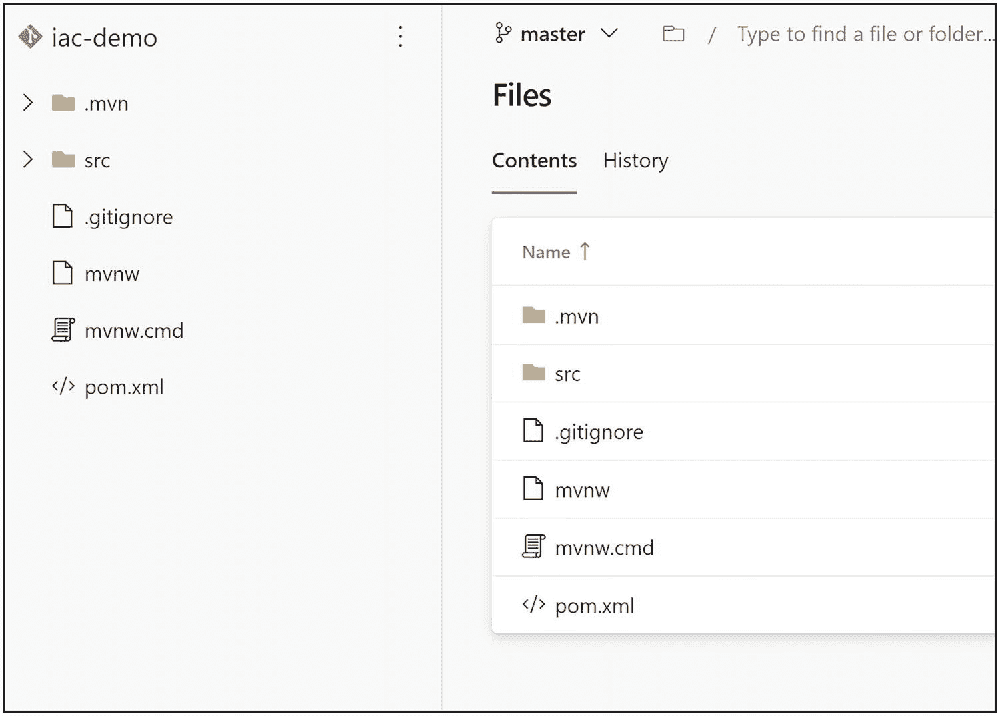

一个表示已添加到 Git Repo 的项目的窗口截图。

图 14-3

已添加到 Git Repo 的项目

## 创建基于 YAML 的管道

让我们创建一个基于 YAML 的管道，从 Azure Repos 构建 Java 项目并将其部署到 Azure WebApp。前提条件是，你应该已经为 Java 11 应用程序创建了一个基于 Linux 的 Azure WebApp。更多详细信息，请参考第 13 章。点击 *管道*，如图 14-4 所示。

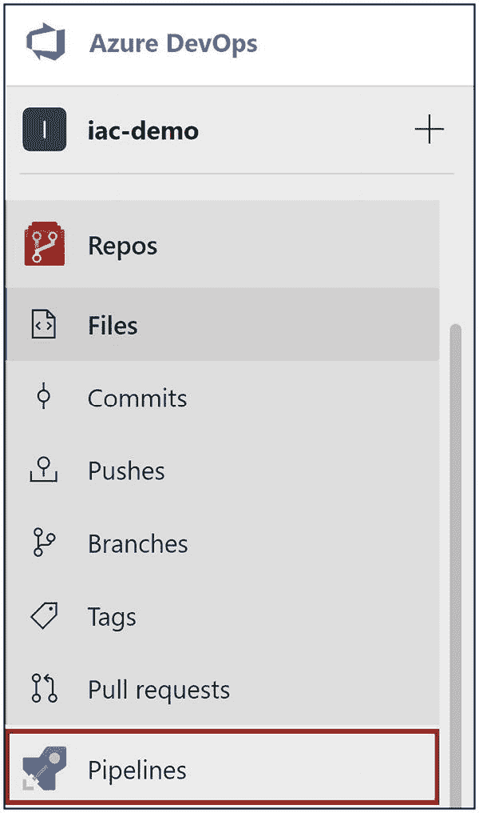

一个表示点击管道的 Azure DevOps 窗口截图。

图 14-4

点击管道

点击 *创建管道*，如图 14-5 所示，以创建一个基于 YAML 的管道。

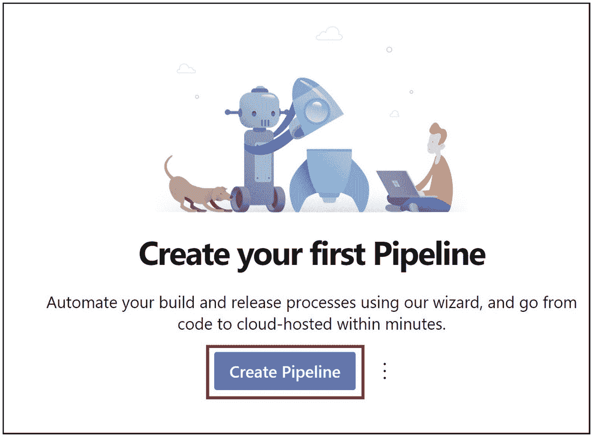

一个显示“通过点击创建管道来创建您的第一个管道”的窗口。

图 14-5

点击创建管道

系统会要求你提供 Java 代码签入的源代码仓库详细信息。我们已将其签入到 Azure Repos Git。因此，请选择 *Azure Repos Git*，如图 14-6 所示。

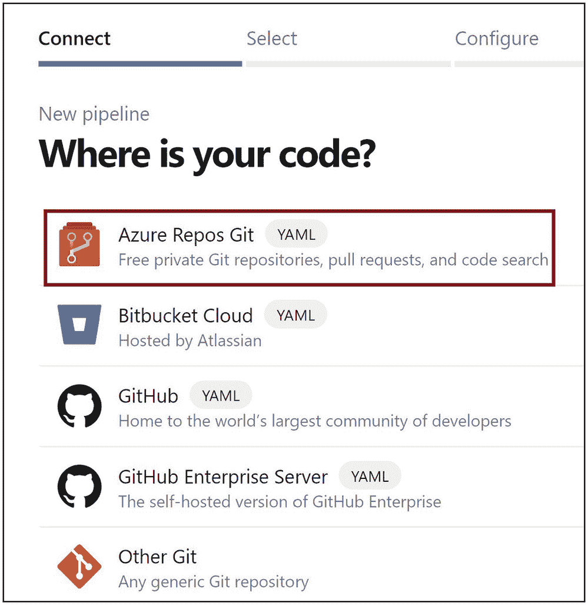

一个显示选择 Azure Repos Git 的窗口截图。

图 14-6

选择 Azure Repos Git

选择你签入代码的仓库，如图 14-7 所示。

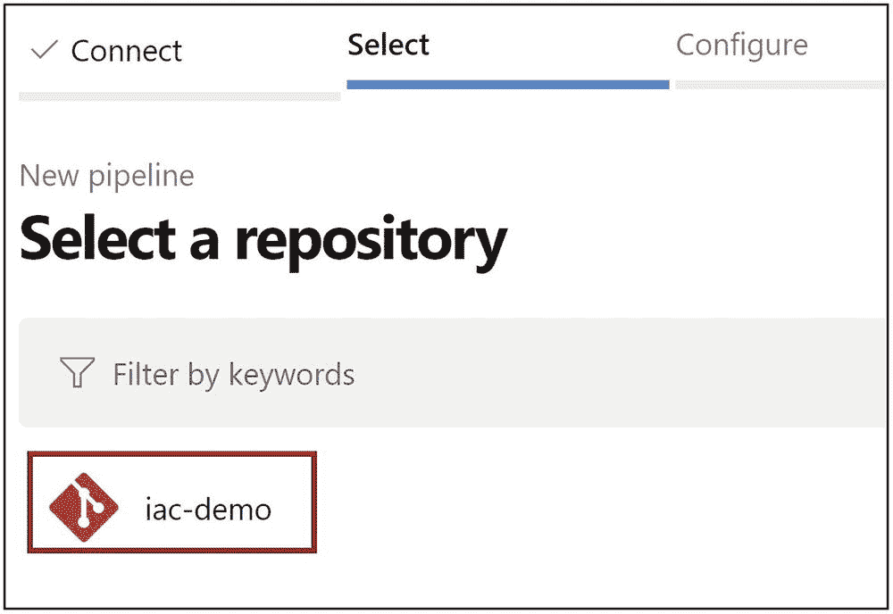

一个表示选择代码仓库的窗口截图。

图 14-7

选择代码仓库

你可以选择模板 *Maven package Java project Web App to Linux on Azure*，如图 14-8 所示。如果未列出此模板，请点击 *显示更多* 并搜索它。

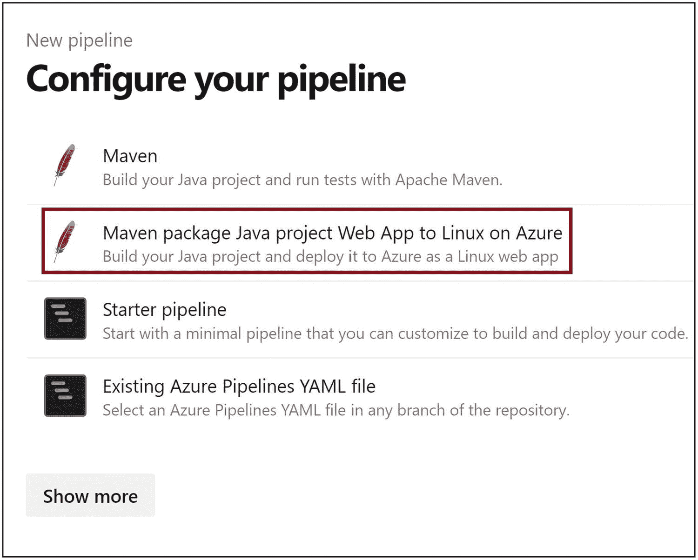

一个表示选择订阅的窗口截图。

图 14-8

选择管道模板

选择你创建 Azure WebApp 的 Azure 订阅。点击 *继续*，如图 14-9 所示。

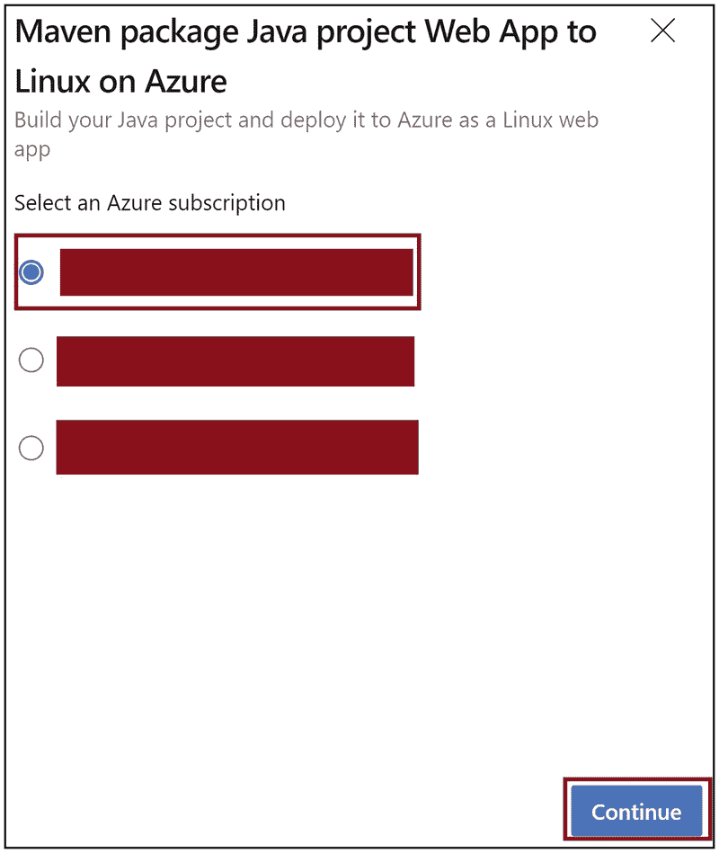

一个表示登录并提供凭据空间的窗口截图。

图 14-9

选择订阅

系统会提示你提供登录凭据，如图 14-10 所示。提供你的凭据以登录系统。

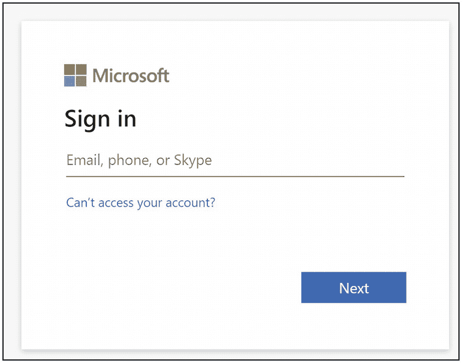

一个点击验证和配置的窗口截图。

图 14-10

提供你的凭据

选择你计划部署 Java 代码的 WebApp 名称。点击 *验证并配置*，如图 14-11 所示。创建 WebApp 后，你需要等待一段时间，它才会在 Azure DevOps 环境中显示出来。有时可能需要几个小时。

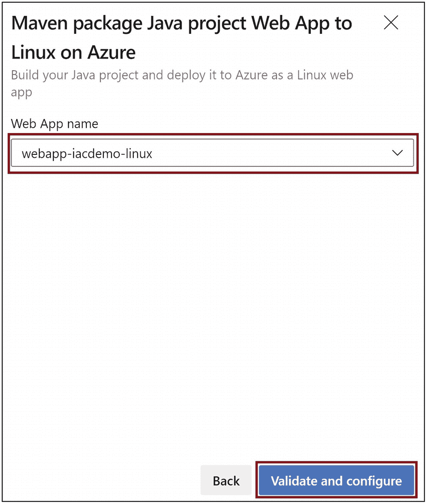

WebApp 窗口的图像。Maven 包 Java 项目 Web 应用部署到 Linux 上的 Azure。构建你的 Java 项目并将其作为 Linux Web 应用部署到 Azure。下方提供了包含 WebApp 名称的字段。

图 14-11

点击验证并配置

YAML 管道将为你生成。清单 14-7 演示了 YAML 管道的内容。


```
# Maven package Java project Web App to Linux on Azure
# Build your Java project and deploy it to Azure as a Linux web app
# Add steps that analyze code, save build artifacts, deploy, and more:
# https://docs.microsoft.com/azure/devops/pipelines/languages/java
trigger:
- master
variables:
# Azure Resource Manager connection created during pipeline creation
azureSubscription: '3956cc05-4215-45e5-98f9-6d3eef83b0d8'
# Web app name
webAppName: 'webapp-iacdemo-linux'
# Environment name
environmentName: 'webapp-iacdemo-linux'
# Agent VM image name
vmImageName: 'ubuntu-latest'
stages:
- stage: Build
displayName: Build stage
jobs:
- job: MavenPackageAndPublishArtifacts
displayName: Maven Package and Publish Artifacts
pool:
vmImage: $(vmImageName)
steps:
- task: Maven@3
displayName: 'Maven Package'
inputs:
mavenPomFile: 'pom.xml'
- task: CopyFiles@2
displayName: 'Copy Files to artifact staging directory'
inputs:
SourceFolder: '$(System.DefaultWorkingDirectory)'
Contents: '**/target/*.?(war|jar)'
TargetFolder: $(Build.ArtifactStagingDirectory)
- upload: $(Build.ArtifactStagingDirectory)
artifact: drop
- stage: Deploy
displayName: Deploy stage
dependsOn: Build
condition: succeeded()
jobs:
- deployment: DeployLinuxWebApp
displayName: Deploy Linux Web App
environment: $(environmentName)
pool:
vmImage: $(vmImageName)
strategy:
runOnce:
deploy:
steps:
- task: AzureWebApp@1
displayName: 'Azure Web App Deploy: webapp-iacdemo-linux'
inputs:
azureSubscription: $(azureSubscription)
appType: webAppLinux
appName: $(webAppName)
package: '$(Pipeline.Workspace)/drop/**/target/*.?(war|jar)'
清单 14-7
生成的 YAML 代码
```

点击*保存并运行*，如图 14-12 所示。这将保存管道更改，并导航到下一个屏幕，您可以在其中执行管道。

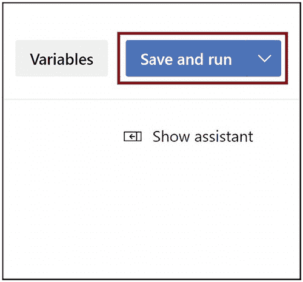

保存并运行窗口的图像。内容包括变量选项、保存并运行选项以及下方的显示助手命令。

图 14-12

点击保存并运行

点击*保存并运行*，如图 14-13 所示，以执行管道。

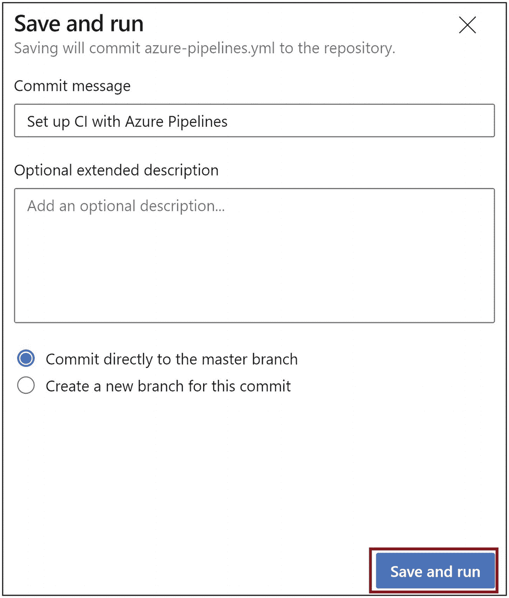

管道执行窗口的图像。内容包括包含提交消息的字段、可选的扩展描述、直接提交到主分支的选项以及为此提交创建新分支的选项。保存并运行选项位于右下角。

图 14-13

执行管道

构建阶段完成后，管道将请求您授予部署到 Azure WebApp 的权限。点击*查看*，如图 14-14 所示，并提供权限。

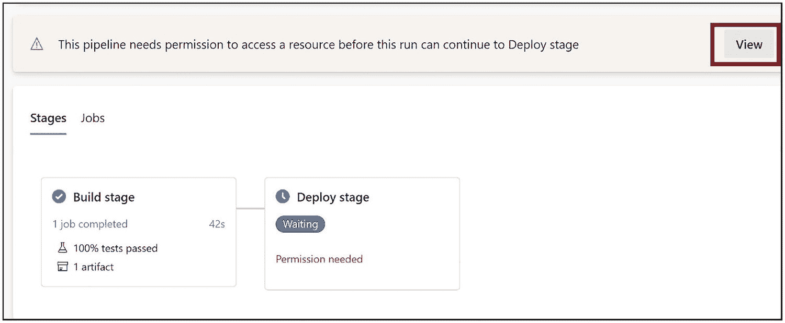

提供权限窗口的截图。阶段包括构建阶段和部署阶段。

图 14-14

为部署提供权限

管道完成后，Java 应用程序将部署到 Azure WebApp。您可以浏览 WebApp URL，并在浏览器上看到响应，如图 14-15 所示。

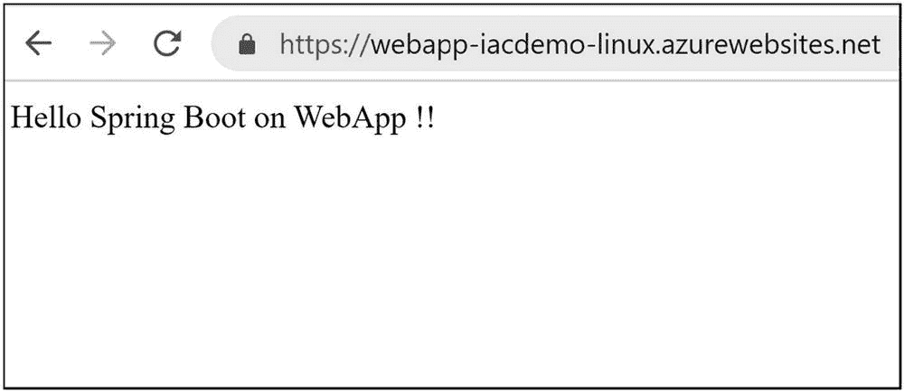

响应窗口的网页截图。窗口上显示的输出是：hello spring boot on web app。

图 14-15

浏览器上的响应输出

## 总结

本章展示了如何使用 Azure DevOps 构建 Java Spring Boot 应用程序并将其部署到 Azure WebApp。我们使用 Git 命令将 Java 代码签入到 Azure Repos。然后，我们创建了一个基于 YAML 的管道，用于从 Azure Repos 构建 Java 应用程序并将其部署到 Azure WebApp。在下一章中，我们将学习最佳案例，并探索 Azure 上的实时 Java 应用程序。

以下是本章的主要要点：

*   Azure Repos 提供了一个 Git 仓库，您可以执行 Git 命令签入到 Azure Repos。

*   您还可以使用 Azure DevOps 创建基于 TFS 的代码仓库。

*   您可以创建基于 YAML 的管道来构建 Java 代码并将其部署到 Azure。

