# 15. 一个接近生产环境的基于 Azure 的 Java 应用程序

现在我们已经到了本书的结尾。我们学习了基本 Azure 服务的基础知识，这些知识在处理基于 Azure 的 Java 应用程序时会派上用场。我们学习了如何在 Azure 服务（如 Azure WebApp、Azure Kubernetes Service、Azure Spring Cloud 和 Azure Functions）上部署基于 Java 的应用程序。我们还学习了如何使用 Azure SQL、Azure Storage 和 Azure Redis Cache。我们探讨了如何监控、保护以及使用 Azure DevOps 进行自动化基础设施创建。

在上一章中，我们学习了如何使用 Azure DevOps 构建 Java 应用程序并将其部署到 Azure 服务。在本章中，我们将探讨在 Azure 上设计和实现基于 Java 的应用程序时应遵循的最佳实践。我们还将处理一个接近生产环境的场景。

## 结构

在本章中，我们将讨论以下内容：

*   最佳实践

*   构建一个接近生产环境的场景

## 目标

学习完本章后，您应该能够获得以下知识：

*   学习如何构建一个可以托管在 Azure 上的基于 Java 的应用程序。

*   理解在 Azure 上处理 Java 应用程序时的最佳实践。

## 最佳实践

设计应用程序架构是一项关键活动。在实现应用程序架构时，您必须考虑最佳实践。针对 Azure 的应用程序应进行高度精确的规划，以便应用程序在 Azure 环境中按预期运行。让我们讨论一些在为 Azure 设计基于 Java 的应用程序时应考虑的基本最佳实践。

*   确定主机选项。

*   现代化应用程序，然后迁移到 Azure。

*   为您的应用程序选择合适的 Azure 服务。

*   规划符合预算的云成本。

*   规划可扩展性、可用性和可靠性。

*   制定强大的调试和监控策略。

*   保护您在 Azure 上的应用程序。

*   自动化 Azure 服务的启动和应用程序部署。

*   制定正确的备份和灾难恢复策略。

### 确定主机选项

您可以使用适用于 Java SE 的 App Service、适用于 Tomcat 的 App Service、适用于 JBoss 的 App Service、Azure Spring Cloud、Azure Kubernetes Service 和虚拟机来在 Azure 上托管您的 Java 应用程序。您需要使用符合您需求的正确服务。例如，如果您有一个 Spring Boot 应用程序，那么您可以在 Azure Spring Cloud、App Service 或虚拟机上运行它。

### 现代化应用程序，然后迁移到 Azure

有时您可能会发现使用 Azure 不支持的旧版组件在较旧 Java 版本上开发的应用程序。您必须确保将较旧的 Java 应用程序至少现代化到版本 1.8。您必须将旧版应用程序现代化到受支持的框架和 Java 版本，然后将其迁移到 Azure。尝试使用现代 Java 开发框架，如 Spring Boot。如果您有一个在不兼容的框架（如 WebSphere Liberty）上运行的 Java 应用程序，请尝试将其现代化为 Open Liberty 或 Spring Boot，以实现更顺畅的 Azure 迁移。

### 为您的应用程序选择合适的 Azure 服务

您必须设计 Azure 基础设施以满足应用程序的需求。如果您有一个分布式微服务应用程序，请尝试将其托管在 Azure Spring Cloud 或 Azure Kubernetes Service 上。您还可以使用 Azure Functions 构建分布式应用程序。您必须使用存储队列或服务总线队列在分布式服务之间交换消息。临时运行时数据应存储在 Azure Redis Cache 中。

如果您有一个单体应用、单个服务或基于单个容器的应用程序，则必须使用 Azure WebApp。


### 规划符合您需求的云成本

在为应用程序设计 Azure 基础设施时，总拥有成本是一个关键因素。您必须分析应用程序中可能影响使用成本的计算需求及所有必要需求。例如，您计划使用无服务器节点来扩展 Azure 集群。无服务器节点在 Azure 容器实例上运行，每次只能容纳一个 Pod。如果您一次需要数千个 Pod，就需要数千个 Azure 容器实例。相反，您可以检查是否可以使用虚拟机规模集进行扩展。单个基于虚拟机的节点一次可以容纳许多 Pod。

此外，在为 WebApp 规划应用服务计划时，请确保选择适合您应用程序计算及其他需求的正确计划。规划您的服务层级，或为符合应用程序确切需求的服务预留计算资源。不要预留可能浪费计算资源的更高层级，也不要选择应用程序计算资源不足的更低层级。为 Azure 服务合理调整计算需求，可以为您节省大量成本。

### 规划可伸缩性、可用性和可靠性

您的 Java 应用程序必须能够根据业务需求进行扩展、始终保持可用并具备容错能力。应用程序应具有高可用性。您必须尝试利用托管应用程序的服务中提供的自动缩放机制。您必须确保在负载均衡器、应用程序网关、流量管理器或 Front Door 后面运行多个托管应用程序的服务实例，以确保如果其中一个实例发生故障，流量可以路由到其他实例。您必须为失败的操作设置重试机制。在重试期间，未能处理的数据应保持可用，以确保所有数据都能被成功处理。这一措施将确保应用程序的可靠性。

### 建立强大的调试和监控策略

您必须利用 Azure Monitor 和 Application Insights 来收集应用程序和 Azure 基础设施的指标和日志。这一措施将帮助您在生产环境中调试故障、监控应用程序性能，并在出现异常时采取预防措施。应配置适当的警报，以便在发生故障或即将发生故障时通知相关利益方。

您还可以利用第三方供应商提供的其他监控产品，如 Prometheus 和 AppDynamics。

### 保护您在 Azure 上的应用程序安全

您必须为在 Azure 上运行的 Java 应用程序配置身份验证和授权。您可以使用 Azure Active Directory 或任何其他第三方身份提供商。所有应用程序的访问和操作都应受到监控并定期审计。

### 自动化 Azure 服务的启动和应用程序部署

您必须利用基础设施即代码来自动化启动 Azure 资源，并使用 DevOps 管道促进应用程序部署。此策略将减少基础设施创建和应用程序部署过程中的人工错误。此外，当您在多个环境中部署应用程序时，它还能帮助您节省时间。

### 制定正确的备份和灾难恢复策略

您必须定期备份应用程序数据，并在发生数据丢失时使其可用。存储备份数据可能成本高昂。因此，您必须决定需要保留备份数据多长时间，并清理超过保留期限的备份。您必须为应用程序规划灾难恢复策略。如果应用程序发生故障，您必须能够根据灾难恢复策略，从 Azure 上的另一个实例或基础设施运行应用程序。并且您必须快速恢复故障基础设施中的应用程序。无论如何，业务必须保持正常运行。

## 构建接近生产环境的场景

现在让我们处理一个接近生产环境的场景。我们将把用例作为问题陈述来讨论，并理解该场景的需求，然后我们将配置 Azure 基础设施并为该问题陈述构建解决方案。这一活动将让您了解如何在生产环境中将 Java 与 Azure 结合使用。

### 问题陈述

我们在 Azure SQL 数据库中有一个学生表。该表包含班级中学生的学号、姓名和成绩。让我们构建一个 Spring Boot Web 应用程序，从学生表中获取学生记录并在浏览器中呈现。该应用程序应仅对经过身份验证的用户可用。确保为应用程序启用日志记录，以便在应用程序部署到 Azure WebApp 时能够进行调试。


### 实施：创建基础设施

该应用程序需要以下 Azure 服务：

*   用于托管应用程序的 Azure WebApp
*   用于学生表的 Azure SQL 数据库
*   用于日志记录和监控的 Application Insights
*   用于应用程序身份验证的 Azure Active Directory 应用程序注册

在构建 Java 应用程序之前，让我们先创建这些服务。我们可以从创建 Azure WebApp 和 Application Insights 开始。Azure WebApp 将托管应用程序，而 Application Insights 将用于日志记录和监控。应用程序会将运行时日志注入 Application Insights，这些日志日后可用于调试。

转到 Azure 门户，点击*创建资源*，如图 15-1 所示。您将被导航到 Azure 市场。


一个 Microsoft Azure 窗口，显示用于创建资源的 Azure 服务。

图 15-1

创建资源

在市场内点击 *Web*，然后点击 *Web 应用*，如图 15-2 所示。

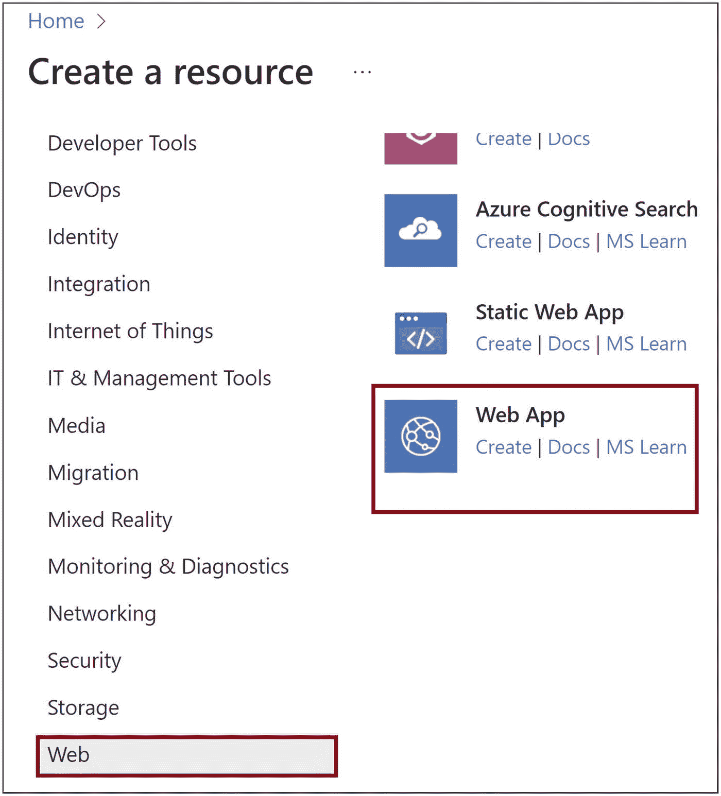

一个表示点击 Web 应用的示意图。

图 15-2

点击 Web 应用

为 WebApp 提供订阅、资源组和名称，如图 15-3 所示。

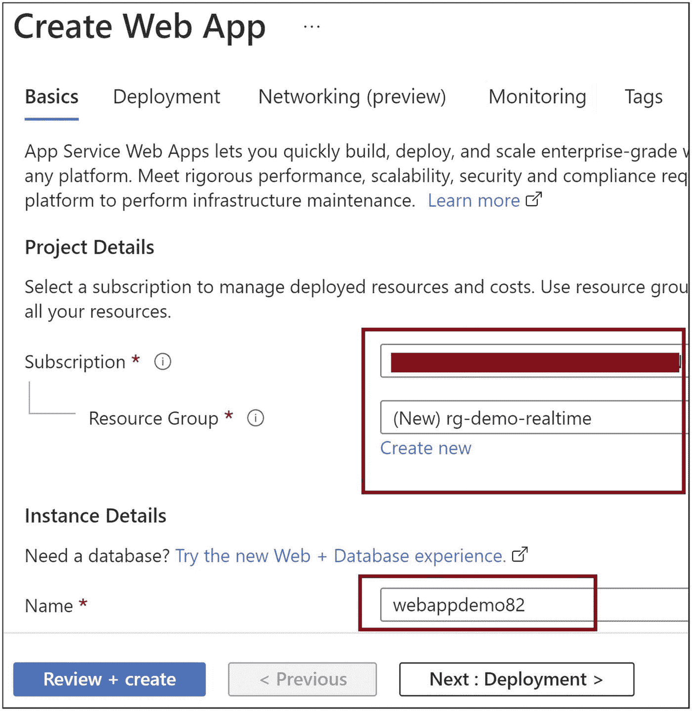

一个表示提供基本详细信息的截图。

图 15-3

提供基本信息

向下滚动，为 Web 应用提供其他必要的基本详细信息，如图 15-4 所示。

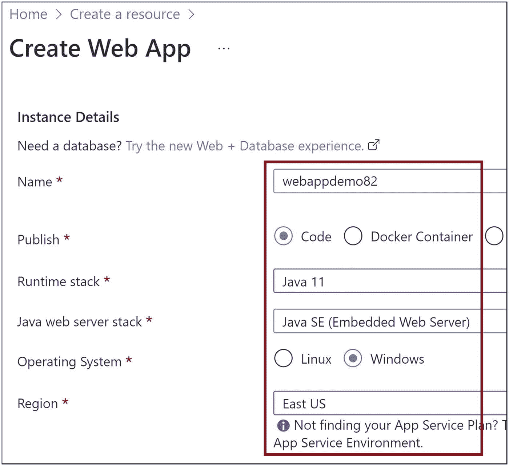

一个表示如何创建 Application Insights 的截图。

图 15-4

提供基本信息

转到 *监控* 选项卡并启用 Application Insights。您需要选择一个现有的 Application Insights 或创建一个新的。点击 *查看 + 创建*，如图 15-5 所示。

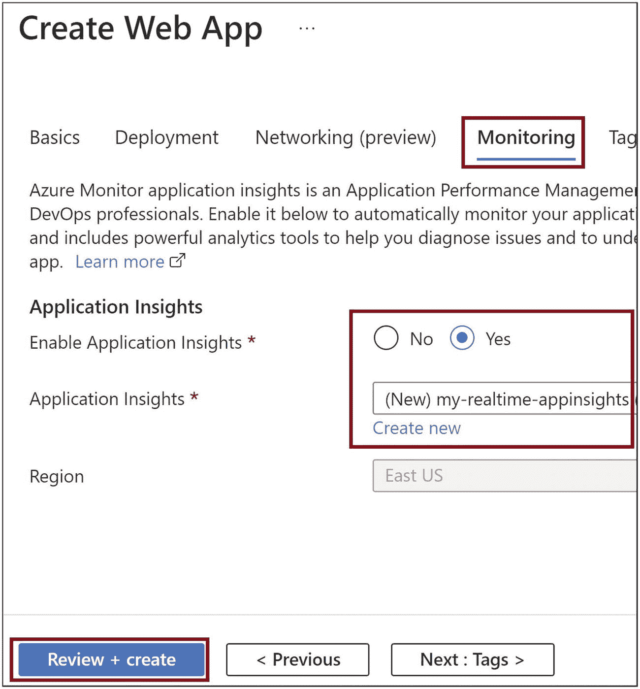

一个表示在创建 Web 应用时点击“创建”的截图。

图 15-5

创建 Application Insights

点击 *创建*，如图 15-6 所示。您的 Web 应用和 Application Insights 将被创建。Application Insights 将与 Web 应用关联，您无需对 Web 应用进行任何其他更改即可将应用程序日志注入 Application Insights。

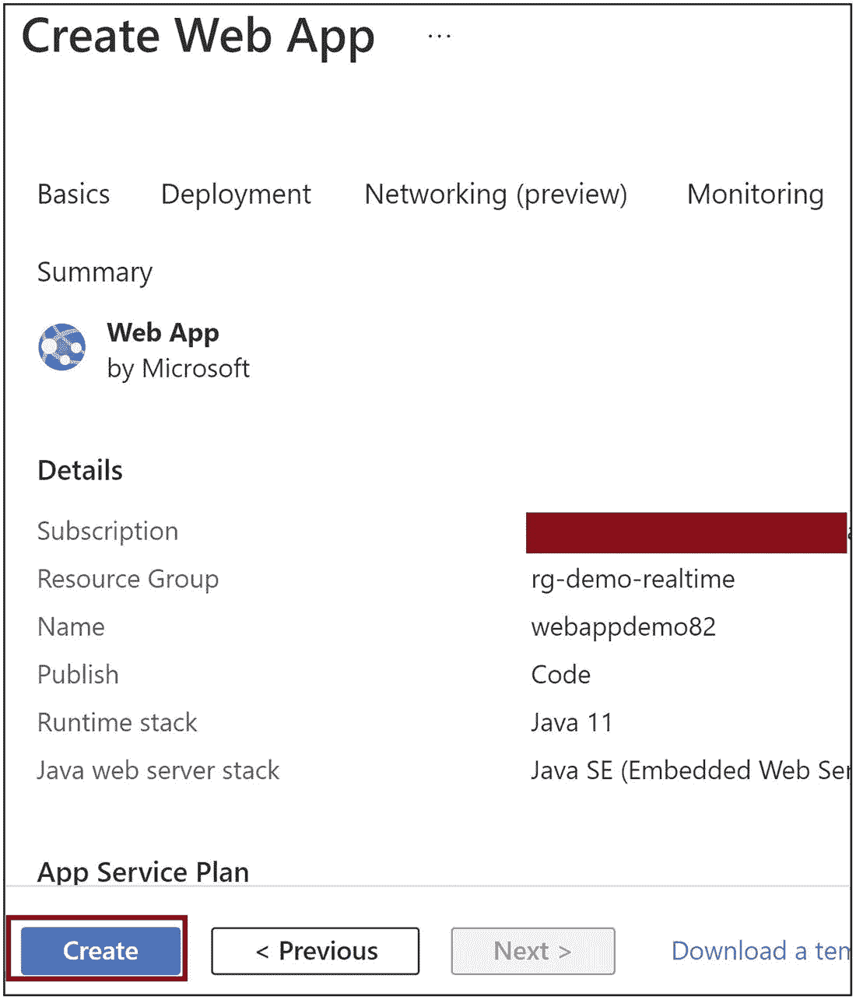

一个表示如何创建资源的截图。

图 15-6

点击创建

现在让我们启动 Azure SQL 数据库，创建学生表并插入一些学生数据。转到 Azure 门户，点击 *创建资源*，如图 15-7 所示。


一个包含 Azure 服务的 Microsoft Azure 窗口。

图 15-7

创建资源

点击 *数据库*，然后点击 *SQL 数据库*，如图 15-8 所示。

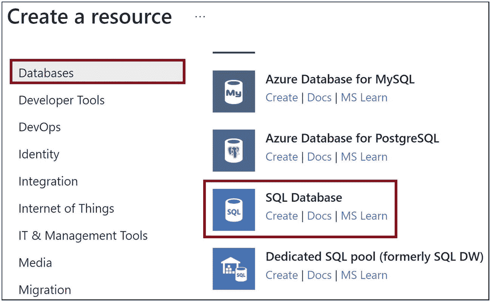

一个表示点击 SQL 数据库的窗口截图。

图 15-8

点击 SQL 数据库

为 Azure SQL 数据库提供基本信息。点击 *下一步：网络*，如图 15-9 所示。

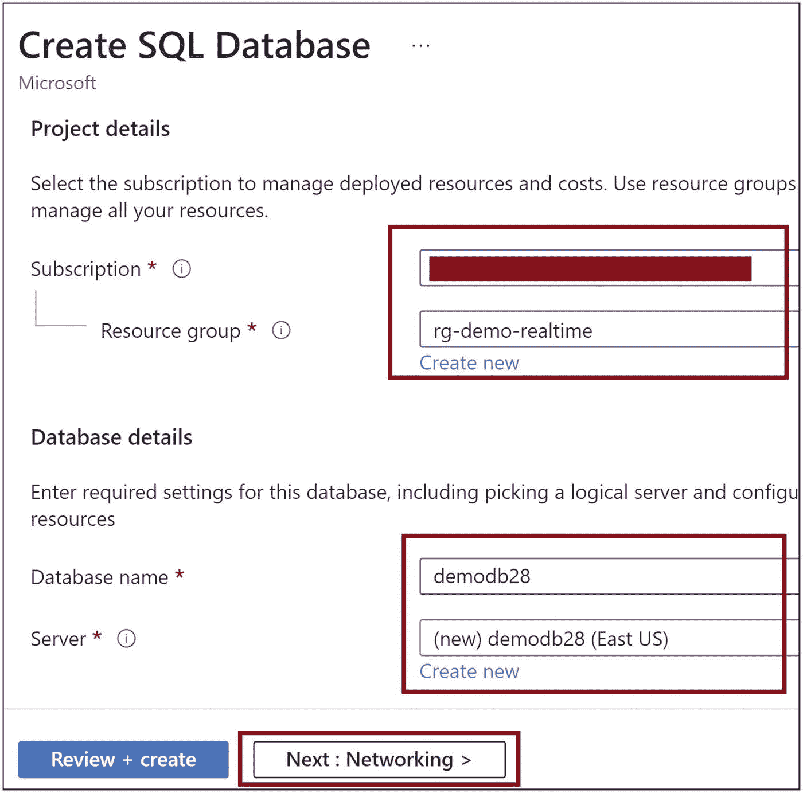

一个表示提供基本信息的窗口截图。

图 15-9

提供基本信息

选择数据库的访问方式为 *公共终结点*，如图 15-10 所示。修改数据库的防火墙规则，以允许其他 Azure 服务访问它，同时，您也应该能够从本地系统访问该数据库。点击 *查看 + 创建*，然后点击 *创建*。

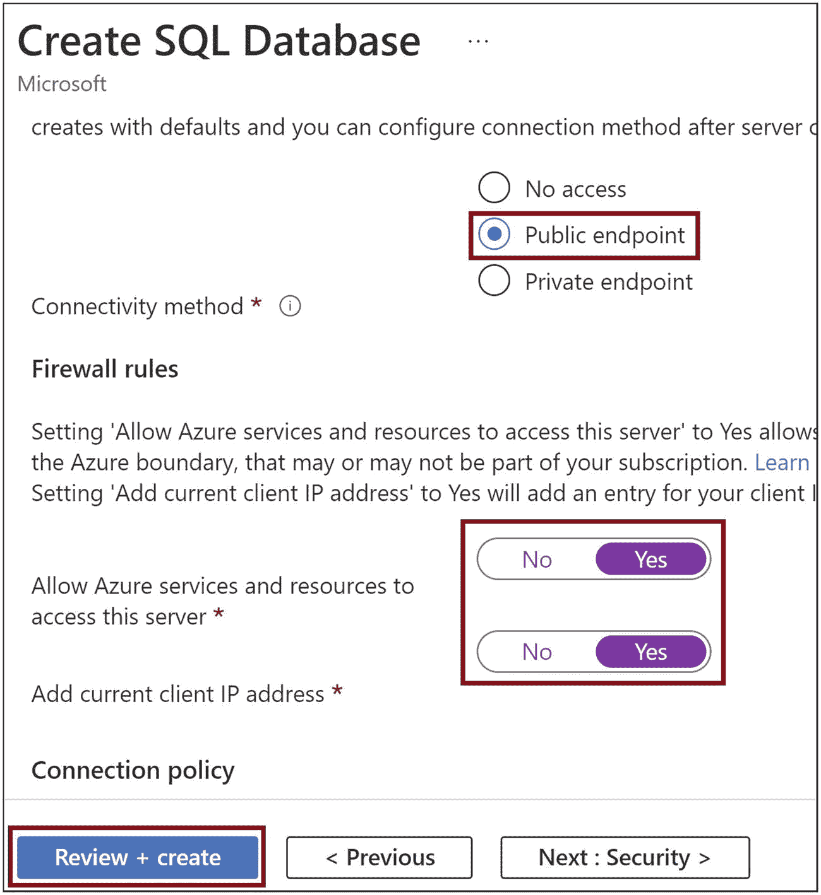

一个截图，说明了配置防火墙的规则，标题为“创建 SQL 数据库”。

图 15-10

配置防火墙规则

数据库创建完成后，转到 *查询编辑器*，如图 15-11 所示，提供数据库凭据并登录到数据库。

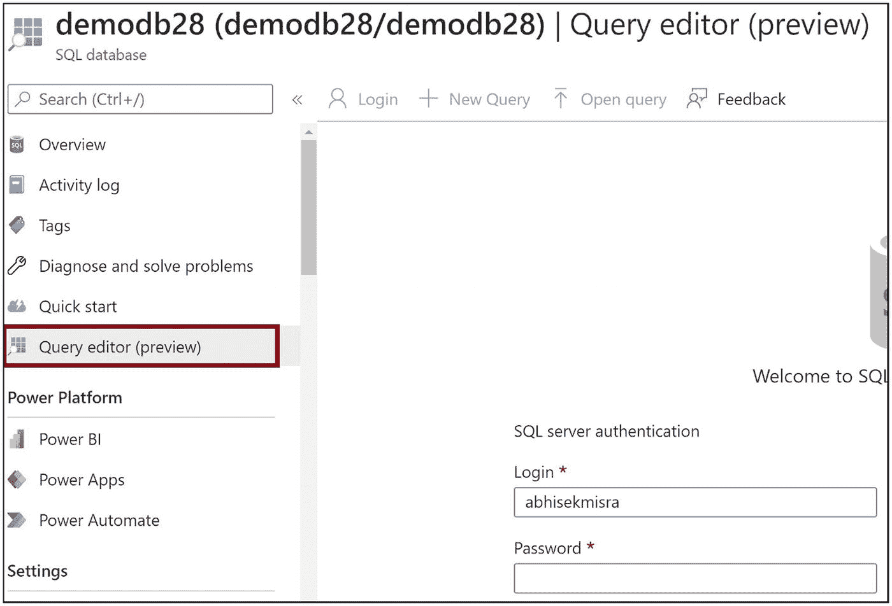

该截图表示“转到查询编辑器”窗口。

图 15-11

转到查询编辑器

运行清单 15-1 中所示的 SQL 查询来创建学生表。

```
create table student
(
roll int identity primary key,
name varchar(100),
age int,
marks int
)
清单 15-1
创建学生表
```

向数据库中插入一些学生数据。

```
insert into [dbo].[student] values ('Abhishek M', 18,88)
insert into [dbo].[student] values ('Sam', 16,72)
insert into [dbo].[student] values ('Tom', 18,64)
insert into [dbo].[student] values ('Jim', 19,92)
清单 15-2
插入学生数据
```

我们可以按照第 12 章相同的步骤在 Azure Active Directory 中创建用户并注册应用程序。在 Azure Active Directory 中注册应用程序时，请确保提供清单 15-3 中所示的 URL 作为重定向 URI。将 {WebApp} 替换为我们创建的 WebApp 的名称。

```
https://{WebApp}.azurewebsites.net/login/oauth2/code/
清单 15-3
重定向 URI
```

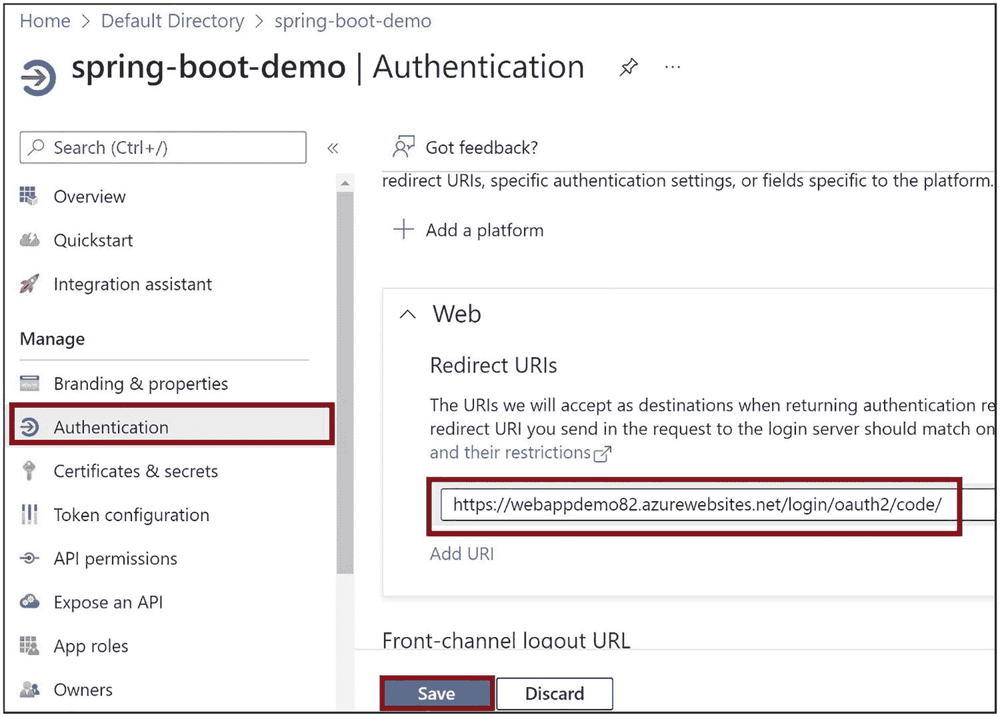

一个重定向 URI 配置的截图。

图 15-12

重定向 URI 配置


### 构建应用程序并将其部署到 Azure WebApp

基础设施已准备就绪。现在我们来构建应用程序，然后将其部署到 Azure WebApp。清单 15-4 是应用程序的 POM 文件。你需要添加依赖项以支持 Azure SQL、Azure Active Directory 和 Application Insights。

```

4.0.0

org.springframework.boot
spring-boot-starter-parent
2.6.3

com.database
demo
0.0.1-SNAPSHOT
demo
Demo project for Spring Boot

3.14.0

org.springframework.boot
spring-boot-starter-data-jdbc

org.springframework.boot
spring-boot-starter-web

com.microsoft.sqlserver
mssql-jdbc
runtime

com.microsoft.azure
applicationinsights-spring-boot-starter
2.5.1

org.springframework.boot
spring-boot-starter-oauth2-client

com.azure.spring
azure-spring-boot-starter-active-directory

org.springframework.boot
spring-boot-starter-test
test

com.azure.spring
azure-spring-boot-bom
${azure.version}
pom
import

org.springframework.boot
spring-boot-maven-plugin

清单 15-4
POM.xml
```

清单 15-5 是 *application.properties* 文件。在此文件中，我们需要提供数据库连接详细信息、Application Insights 检测密钥以及 Azure Active Directory 详细信息。

```
logging.level.org.springframework.jdbc.core=DEBUG
# 指定数据库详细信息：
spring.datasource.url=jdbc:sqlserver://{提供数据库名称}.database.windows.net:1433;database={提供数据库名称};encrypt=true;trustServerCertificate=false;hostNameInCertificate=*.database.windows.net;loginTimeout=30;
spring.datasource.username={提供数据库用户名}@{提供数据库名称}
spring.datasource.password={提供数据库密码}
spring.sql.init.mode=always
# 指定 App Insights 检测密钥：
azure.application-insights.instrumentation-key={提供检测密钥}
spring.application.name=StudentApp
# 指定你的 Active Directory ID：
azure.activedirectory.tenant-id={提供租户 ID}
# 指定你的应用注册的应用 ID：
azure.activedirectory.client-id={提供客户端 ID}
# 指定你的应用注册的密钥：
azure.activedirectory.client-secret={提供客户端密钥}
清单 15-5
Application.properties
```

让我们创建一个如清单 15-6 所示的 *Student* 类。*Student* 类作为 *student* 数据库表的领域模型。

```
package com.database.demo;
import org.springframework.data.annotation.Id;
public class Student {
public Student(){
}
public Student(String name, int Age, int marks){
this.name = name;
this.age = age;
this.marks = marks;
}
@Id
private int roll;
private String name;
private int age;
private int marks;
private int getRoll()
{
return roll;
}
private void setRoll(int roll)
{
this.roll = roll;
}
public String getName() {
return name;
}
public void setName(String name) {
this.name = name;
}
public int getAge() {
return age;
}
public void setAge(int age) {
this.age = age;
}
public int getMarks() {
return marks;
}
public void setMarks(int marks) {
this.marks = marks;
}
}
清单 15-6
Student 类
```

现在，让我们在与 *Student* 类和 *DemoApplication* 类相同的文件夹中添加一个如清单 15-7 所示的 *StudentRepository* 接口。*StudentRepository* 接口充当数据库和领域模型的仓库类。Spring Data JDBC 管理此仓库类。

```
package com.database.demo;
import org.springframework.data.repository.CrudRepository;
public interface StudentRepository extends CrudRepository {
}
清单 15-7
StudentRepository 类
```

创建如清单 15-8 所示的 *DemoApplication* Java 类，并将其转换为 REST 控制器。在 REST GET API 中，我们访问 Azure SQL 数据库并返回包含学生详细信息的 HTML 响应。已启用身份验证，并且我们将跟踪和异常记录到 Application Insights。

```
package com.database.demo;
import com.microsoft.applicationinsights.TelemetryClient;
import org.springframework.boot.SpringApplication;
import org.springframework.boot.autoconfigure.SpringBootApplication;
import org.springframework.http.HttpStatus;
import org.springframework.security.access.prepost.PreAuthorize;
import org.springframework.web.bind.annotation.*;
@SpringBootApplication
@RestController
@RequestMapping("/")
public class DemoApplication {
public static void main(String[] args) {
SpringApplication.run(DemoApplication.class, args);
}
static final TelemetryClient telemetryClient = new TelemetryClient();
private final StudentRepository studentRepository;
public DemoApplication(StudentRepository studentRepository) {
this.studentRepository = studentRepository;
}
@GetMapping("/")
@ResponseBody
@PreAuthorize("hasAuthority('APPROLE_superuser')")
public String getStudents() {
Iterable students = studentRepository.findAll();
String html = "" ;
try{
for (Student student: students) {
html = html+"";
html = html+"学号 : " + student.getRoll()+"";
html = html+"姓名 : " + student.getName()+"";
html = html+"年龄 : " + student.getAge()+"";
html = html+"分数 : " + student.getMarks()+"";
telemetryClient.trackTrace("处理成功，学号 : "+student.getRoll());
}
html = html+"";
}
catch(Exception ex){
telemetryClient.trackException(ex);
}
return html;
}
}
清单 15-8
DemoApplication 类
```

构建应用程序。它应该能够成功编译。


### 将应用程序部署到 Azure WebApp

现在，让我们将应用程序部署到 Azure WebApp。这里，我们将使用 IntelliJ 编辑器构建应用程序，然后使用 IntelliJ 的 Azure 插件将其部署到 Azure。你可以参考第 2 章了解如何使用 Maven 插件部署应用程序。不过，你也可以使用 Eclipse、Visual Studio Code 或任何其他支持部署到 Azure 的 Java 编辑器。进入 IntelliJ 设置，点击 *Plugins*，然后在 *Marketplace* 中搜索 *Azure*。安装 *Azure Toolkit for IntelliJ* 插件，如图 15-13 所示。

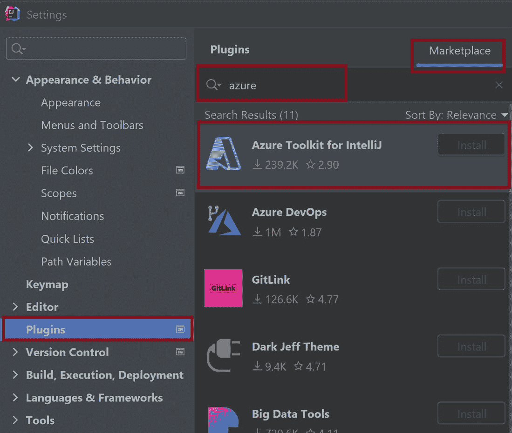

显示如何安装 Azure Toolkit 插件的窗口截图。

图 15-13

安装 Azure Toolkit 插件

插件安装完成后，右键点击项目，如图 15-14 所示。

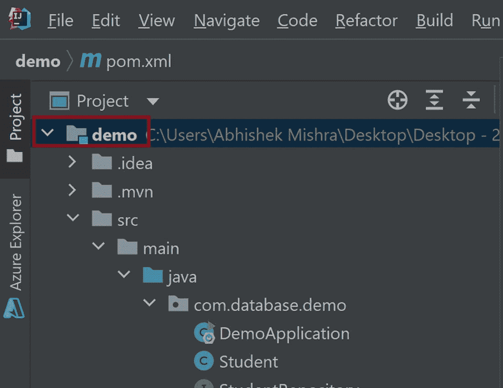

右键点击项目的窗口截图。

图 15-14

右键点击项目

点击 *Azure*，然后点击 *Deploy to Azure Web Apps*，如图 15-15 所示。

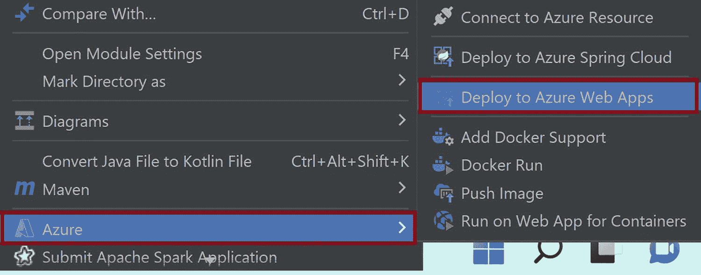

部署到 Azure Web Apps 的窗口截图。

图 15-15

部署到 Azure WebApps

选择 *Azure CLI*，然后点击 *Sign in*，如图 15-16 所示。根据提示提供你的凭据。

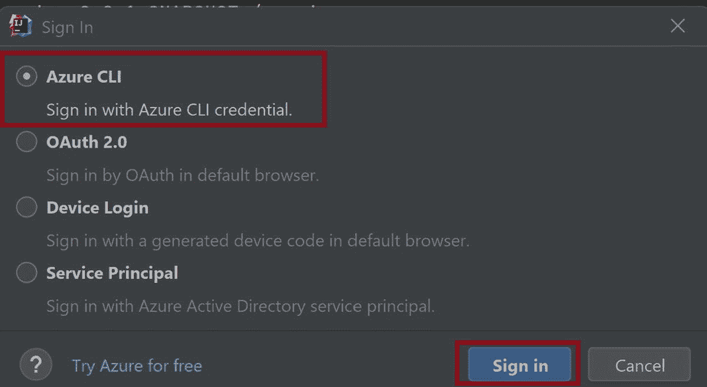

选择 Azure CLI 的窗口截图。

图 15-16

选择 Azure CLI

选择订阅，然后点击 *Select*，如图 15-17 所示。

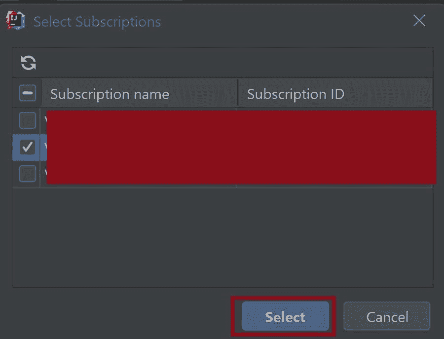

显示“选择订阅”窗口及 Azure CLI 凭据的窗口截图。

图 15-17

选择订阅

选择我们创建的 WebApp，然后点击 *Run*，如图 15-18 所示。

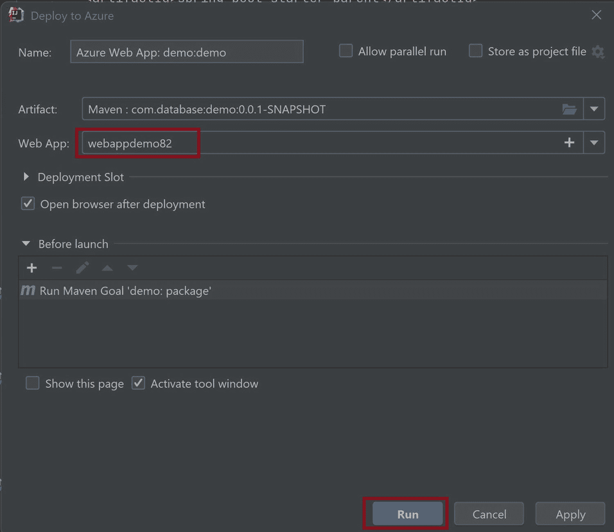

选择订阅的窗口截图。

图 15-18

部署到 WebApp

部署完成后，等待十分钟，让应用程序在 WebApp 中启动。十分钟后，导航到 WebApp 的 URL。系统会提示你提供登录凭据，如图 15-19 所示。请使用你在 Azure Active Directory 的注册应用程序中创建并授权的用户凭据。

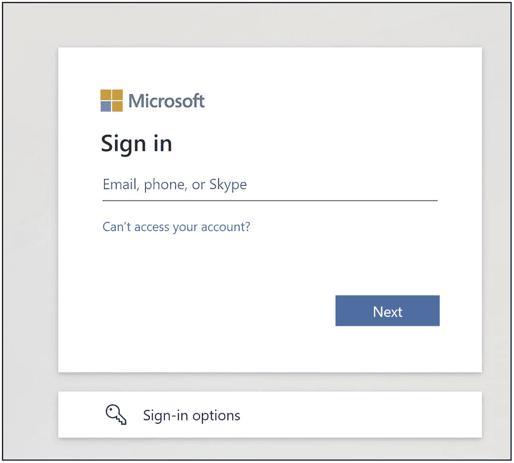

提供登录凭据的窗口截图。

图 15-19

提供登录凭据

你可以在浏览器上看到渲染出的学生详细信息，如图 15-20 所示。

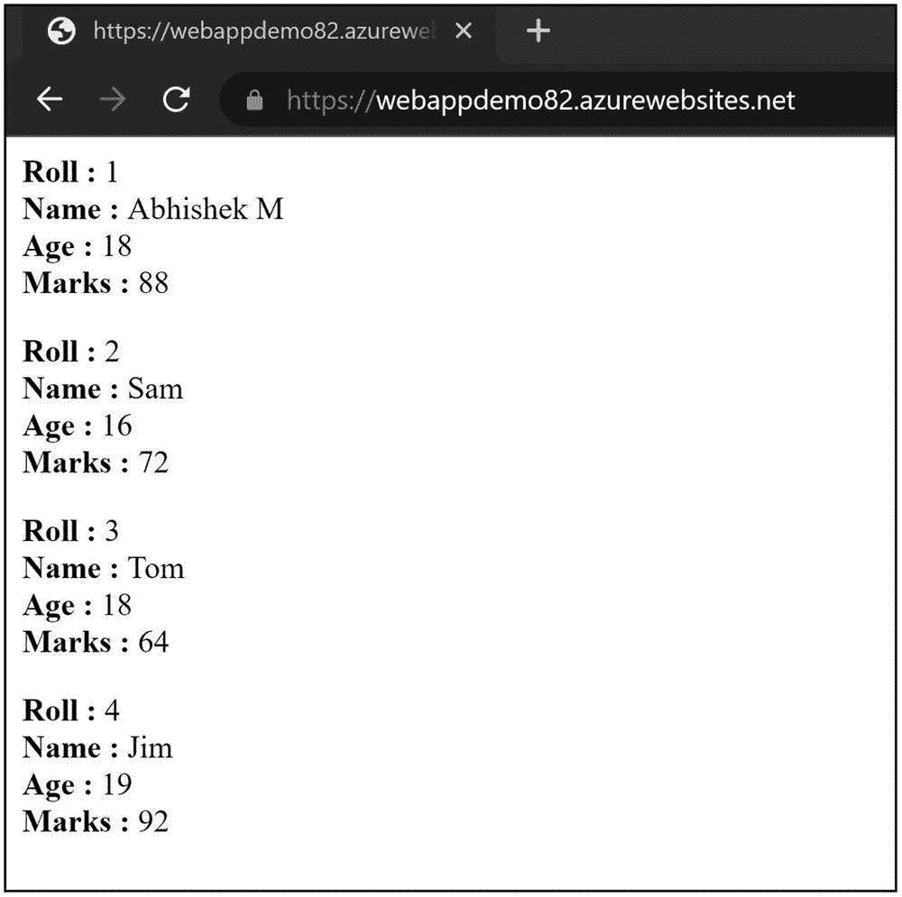

浏览器输出结果的示意图。

图 15-20

浏览器上的输出结果

应用程序的跟踪日志会在运行时被采集到 Application Insights 中，如图 15-21 所示。

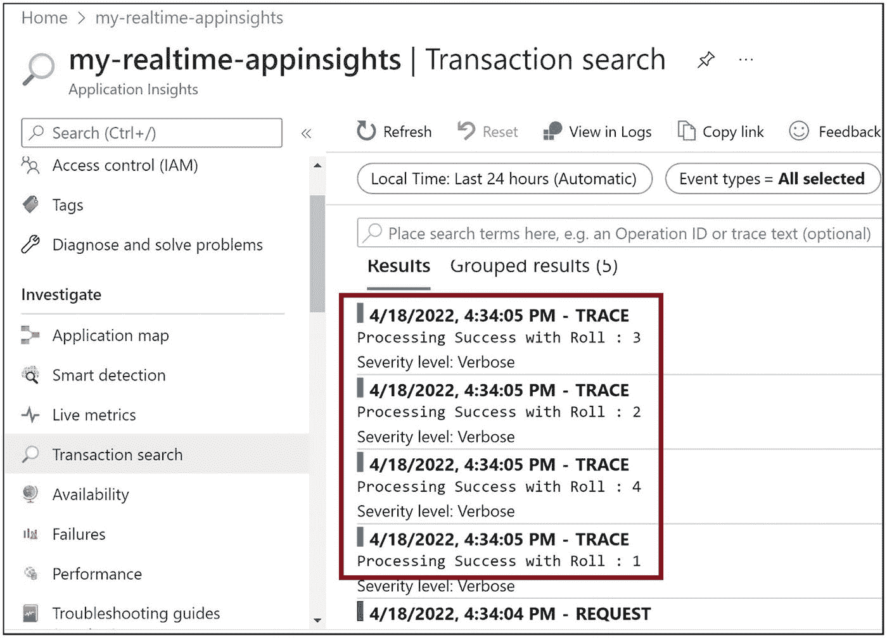

Application Insights 中应用程序日志的窗口截图。

图 15-21

Application Insights 中的应用程序日志

## 总结

在本章中，我们运用了本书中学到的概念来设计和开发一个复杂的用例。我们探索了 IntelliJ Azure 插件，用于构建 Java 应用程序并将其部署到 Azure WebApp。我们在一个 Spring Boot 应用程序中应用了多个概念，例如从 Azure SQL 读取数据、使用 Azure AD 进行身份验证、使用 Application Insights 监控应用程序，以及部署到 Azure WebApp。


索引 A Application Insights 基本详情 连接字符串 创建 .json 文件 JVM 参数 日志 搜索结果 Application.properties 文件 应用服务计划 专用计算 隔离计划 Java 应用 Azure WebApp Azure WebApp，部署 Java Spring Boot 扩展 共享计算 Azure 基于 Java 的应用 定价模型 服务 WebApp Azure Active Directory 身份验证和授权 企业应用 注册应用 Spring Boot 应用 用户创建 身份验证场景 原生应用 服务器应用 单页应用 Web 应用 Web 浏览器到 Web 应用 Azure 容器注册表 Azure Cosmos DB 完整代码 概念 数据库 Java 应用 Java 代码位置 NoSQL 数据库操作 POM 文件 学生数据库 方式 Azure DevOps 登录 URL 项目创建 授权连接 CLI 任务 部署 发布 作业模板 登录凭据 管道名称 管道 发布 创建 发布管道 订阅 Azure Functions 托管 参见托管计划 基于 Java 的 Maven 命令 编程语言 触发器/绑定 用例 Azure Kubernetes 服务 Azure 市场 Azure Monitor 配置指标 转到指标 Monitor 搜索 资源组 WebApp 仪表板创建 配置指标 编辑指标 数据 固定 门户菜单 保存 选择 性能 警报创建 操作组 警报条件 警报创建 警报规则 配置指标 电子邮件通知 查看 + 创建 Azure 门户 Azure Redis 缓存 访问和静态数据 应用数据 内存中缓存 产品 Java 代码 关键学习点 属性部分 事务 使用位置 Azure SQL 数据库 数据存储服务 基于 vCore 的购买模型 Azure SQL 服务器 Azure 租户 Azure WebApp Application Insights application.properties 文件 DemoApplication Java 类 部署应用 登录凭据 POM 文件 Student 类 StudentRepository 接口 AzureWebJobsStorage B 绑定 运行时 1.x 运行时 2.x C 云计算 优势 部署模型 云服务类型 云供应商 代码执行 输出 命令行界面 (CLI) 应用服务计划 az account show 命令 安装 URL 登录 Azure 资源组 订阅 WebApp。替换 消耗计划 容器注册表 容器 创建容器注册表 创建 Kubernetes 服务 Docker 镜像 Java 应用 Kubernetes Kubernetes 集群 运行 Kubernetes 服务 Content-Type 标头 Cosmos DB createBlobContainer 函数 D 数据库事务 数据复制 专用计算 专用计划 DemoApplication 类 DevOps 解决方案 Docker 文件 Docker 镜像 Dynamics 365 服务 E 电子商务应用 F 函数即服务 (FaaS) Function().run 方法 G 异地冗余存储 (GRS) getBlobClient 函数 getBlobContainerClient 函数 基于 Git 的 Azure Repos 添加项目 类文件 凭据 POM 文件 Git 凭据 Graph API Graph 客户端对象 Gremlin API 存储数据 H 托管计划 消耗计划 专用计划 环境计划 Kubernetes 计划 高级计划 托管软件 I 基础设施即服务 (IaaS) 基础设施即代码 (IaC) ARM 模板 Azure CLI Azure PowerShell Terraform 基础设施创建 Application Insights 基本详情 防火墙规则 查询编辑器 资源创建 SQL 数据库 Web 应用 隔离计划 J Java 应用 基于 Java 的应用 身份验证/授权 自动缩放机制 Azure 服务 云成本 会议 调试和监控策略 灾难恢复策略 识别主机选项 生产环境 参见使用 DevOps 进行基础设施创建 Java 代码 Java Maven 项目 Java 运行时环境 (JRE) Java Spring Boot 应用 Java Spring Boot 项目 K Kubernetes L listBlobContainers 函数 本地冗余存储 (LRS) M, N 基于 Maven 的 Java 代码 基于 Maven 的 Java 控制台应用 Maven 执行 Maven 项目 Microsoft Graph API Microsoft Graph API 浏览器 Microsoft SQL Server 引擎 Microsoft 365 核心 Microsoft 365 核心服务 Microsoft 365 E5 开发者许可证 Microsoft 365 E5 许可证 现代应用 O 开放容器倡议 (OCI) P, Q Ping Redis 缓存 平台即服务 平台即服务 NoSQL 数据库 平台即服务产品 平台即服务关系型数据库 pom.xml 文件 Postman 工具 高级计划 公共端点 R 读取访问异地冗余存储 (RA-GRS) receiveMessages 函数 Redis 缓存 Redis 缓存集群 Redis 缓存版本 Redis 控制台 右侧 Graph API S 横向扩展 WebApp 纵向扩展 WebApp 无服务器架构 共享计算 软件即服务 Spring Boot 应用 API 响应 application.properties 文件 禁止响应 Main 方法 pom.xml 文件 Spring Boot Java 应用 SQL 查询编辑器 SQL Server Reporting Services (SSRS) SQL Server 服务 存储服务 创建账户 创建 Blob 创建队列 创建表 类型 StudentRepository 类 T, U 表存储 触发器 运行时 1.x 运行时 2.x V 虚拟机 Visual Studio Code W, X WebApp Windows 10 服务 Y 基于 YAML 的管道 Azure Repos Git 浏览器 响应代码 实现代码 代码仓库 凭据 部署阶段 管道创建 管道执行 管道模板 保存并运行 订阅 验证并配置 Z 区域冗余存储 (ZRS)
