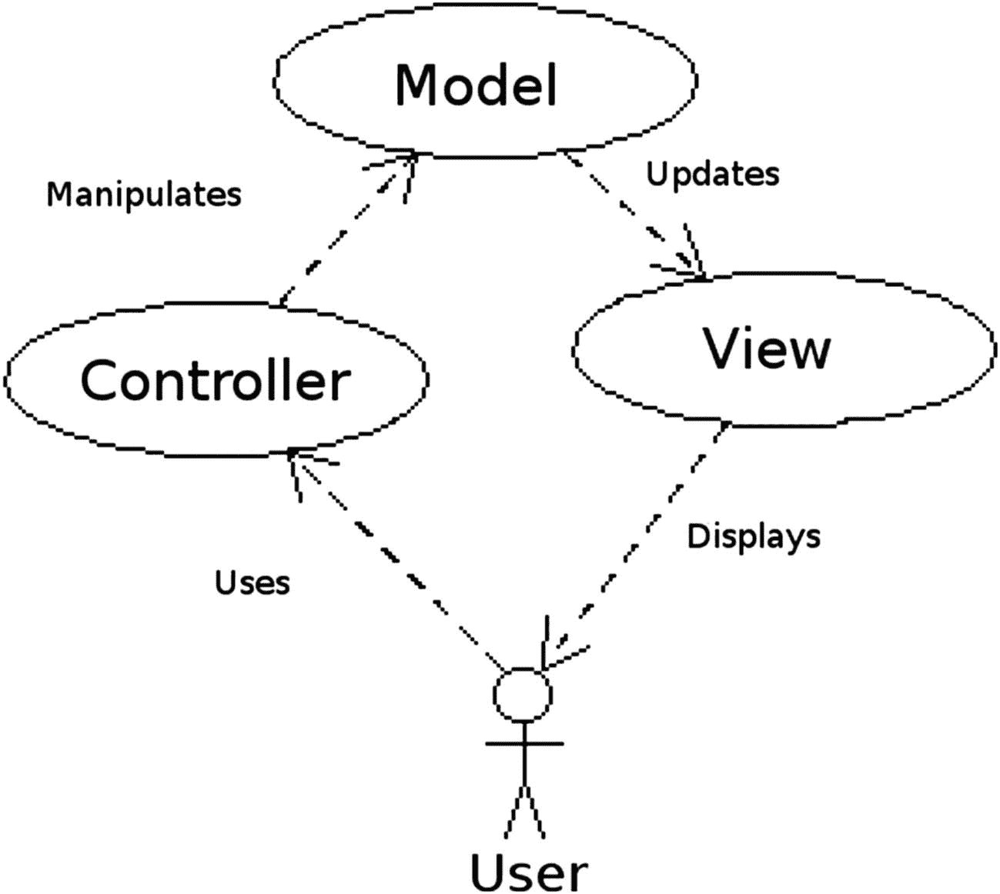
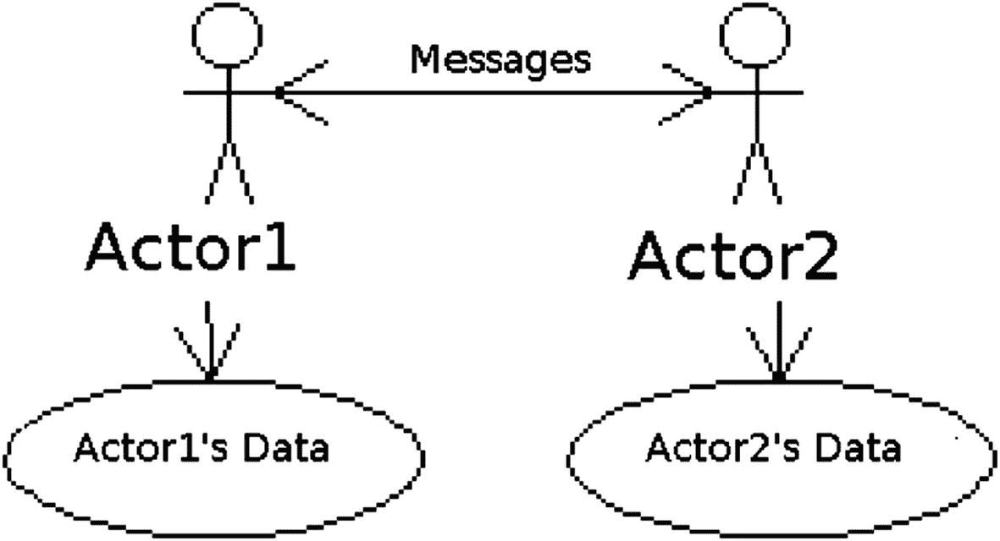

# 九、设计模式

在面向对象编程(OOP)中，设计模式是状态和行为的有用组织，使您的代码更具可读性、可测试性和可扩展性。现在你已经理解了类、继承、对象和编程的基础，让我们回顾一些常见的*设计模式*——排列应用程序代码的常见方式。

## 观察者

*observer* 模式允许您将信息从一个类传播到许多其他类，而不需要它们直接相互了解(低耦合)。

它经常和事件一起使用。例如，Java Swing 中的`KeyListener`、`MouseListener`和许多其他“监听器”接口(这是用于构建桌面应用程序的 JDK 的内置部分)实现了 observer 模式并使用了事件。

这种模式的另一个例子是 Java 中提供的`Observable`类和`Observer`接口。下面是一个简单的例子，简单地永远重复相同的事件:

```java
 1   import java.util.Observable;
 2
 3   public class EventSource extends Observable implements Runnable {
 4       @Override
 5       public void run() {
 6           while  (true) {
 7               notifyObservers("event");
 8           }
 9       }
10   }

```

尽管在本例中事件是一个字符串，但它可以是任何类型。

下面的类实现了`Observer`接口并打印出任何类型为`String`的事件:

```java
 1   import java.util.Observable;
 2   import java.util.Observer;
 3
 4   public class StringObserver implements Observer {
 5       public void update(Observable obj, Object event) {
 6           if (event instanceof String) {
 7               System.out.println("\nReceived Response: " + event );
 8           }
 9       }
10   }

```

要运行这个示例，请在您的`main`方法中编写以下代码:

```java
1   final EventSource eventSource = new EventSource();
2   // create an observer
3   final StringObserver stringObserver = new StringObserver();
4   // subscribe the observer to the event source
5   eventSource.addObserver(stringObserver);
6   // starts the event thread
7   Thread thread = new  Thread(eventSource);
8   thread.start();

Although you are only adding one observer on line 5, you could add any number of observers without changing the code of EventSource. This is what is meant by low coupling.

```

## 手动音量调节

模型-视图-控制器(MVC)可能是最流行的软件设计模式(图 [9-1](#Fig1) )。顾名思义，它由三大部分组成:



图 9-1

模型视图控制器

*   *模型*:被显示和操作的数据或信息

*   *视图*:什么实际上定义了模型如何显示给用户

*   *控制器*:定义动作如何操纵模型

这种设计允许控制器、模型和视图彼此知之甚少。这减少了*耦合*——软件的不同组件依赖其他组件的程度。当你有低耦合时，你的软件更容易理解和扩展。

我们将在关于 web 应用程序和 Grails 的章节(第 [17](17.html) 章)中看到一个很好的 MVC 例子。

## 数字式用户线路

特定领域语言(DSL)是为特定领域定制的编程语言。例如，您可以将 HTML 视为显示网页的 DSL。

有些语言给你很大的自由，你可以在语言内部创建 DSL。例如，Groovy 和 Scala 允许您覆盖数学符号(`+`、`-`等)。).这些语言的其他自由(可选的括号和分号)允许类似 DSL 的接口。我们称这些类似 DSL 的接口为*流畅接口*。

还可以用 Java 和其他语言创建流畅的界面。下面几节讨论用 Groovy 构建 DSL。

### 关闭

在 Groovy 中，您可以将一段代码(一个闭包)作为参数，然后使用一个局部变量作为委托来调用它——这使得该对象的所有方法都可以在闭包中直接引用。例如，假设您有以下发送 SMS 文本的代码:

```java
 1   class SMS {
 2           def from(String fromNumber) {
 3                   // set the from
 4           }
 5           def to(String toNumber) {
 6                   // set the to
 7           }
 8           def body(String body) {
 9                   // set the body of text
10           }
11           def send() {
12                   // send the text.
13           }
14   }

```

在 Java 中，您必须按照以下方式使用它(注意重复的部分):

```java
1   SMS m = new  SMS();
2   m.from("555-432-1234");
3   m.to("555-678-4321");
4   m.body("Hey there!");
5   m.send();

```

在 Groovy 中，您可以将下面的`static`方法添加到类似 DSL 的`SMS`类中(它接受一个闭包，将委托设置为`SMS`类的一个实例，调用块，然后在`SMS`实例上调用 send):

```java
1   def static send(Closure block) {
2           SMS m = new SMS()
3           block.delegate = m
4           block()
5           m.send()
6   }

```

这会将`SMS`对象设置为该块的委托，以便将方法转发给它。这样，您现在可以执行以下操作:

```java
1   SMS.send {
2           from '555-432-1234'
3           to '555-678-4321'
4           body 'Hey there!'
5   }

```

### 覆盖运算符

在 Scala 或 Groovy 中，您可以创建一个 DSL 来计算特定单位的速度，比如米每秒。

```java
1   val time =  20 seconds
2   val dist =  155 meters
3   val speed =  dist / time
4   println(speed.value) //  7.75

```

通过重写操作符，您可以约束 DSL 的用户以减少错误。例如，在这里不小心键入`time/dist`会导致这个 DSL 出现编译错误。

下面是如何在 Scala 中定义这个 DSL:

```java
 1   class Second(val value: Float) {}
 2   class MeterPerSecond(val  value:  Float) {}
 3   class Meter(val value: Float) {
 4     def /(sec: Second) = {
 5       new MeterPerSecond(value / sec.value)
 6     }
 7   }
 8   class EnhancedFloat(value: Float) {
 9     def seconds =  {
10       new   Second(value)
11     }
12     def  meters =  {
13       new  Meter(value)
14     }
15   }
16   implicit  def  enhanceFloat(f:  Float) =  new  EnhancedFloat(f)

```

 Scala 有`implicit`关键字，允许编译器为你做隐式转换。

注意 divide `/`操作符是如何定义的，就像任何其他使用`def`关键字的方法一样。

在 Groovy 中，你通过定义带有特殊名称 <sup>[ 1 ](#Fn1)</sup> 的方法重载操作符，比如`plus`、`minus`、`multiply`、`div`等。

## 演员

*actor 设计模式*是开发并发软件的有用模式。在这种模式中，每个参与者都在自己的线程中执行，并操作自己的数据。数据不能被其他任何人操纵。消息在参与者之间传递，使他们改变数据(图 [9-2](#Fig2) )。



图 9-2

演员

Note

当数据一次只能被一个线程改变时，我们称之为*线程安全*。如果多个线程同时修改相同的数据，这是非常糟糕的(它可能会导致异常)。

您可以使用这种模式的许多实现，包括:

*   akka<sup>[【2】](#Fn2)</sup>

*   喷气织机<sup>t1【3】T2</sup>

*   functional Java<sup>T1】4T3】</sup>

*   gpars<sup>[【5】](#Fn5)</sup>

## 责任链

责任链模式允许你分割代码来处理不同的情况，而不需要每个部分都知道所有其他的部分。

例如，在设计根据用户访问的 URL 采取不同操作的 web 应用程序时，这可能是一个有用的模式。在这种情况下，您可以拥有一个带有方法的`WebHandler`接口，该方法可能处理也可能不处理该 URL 并返回一个`String`:

```java
1   public interface WebHandler {
2       String handle(String url);
3       void setNext(WebHandler next);
4   }

```

然后，您可以实现该接口，如果您不处理该 URL，则调用链中的下一个处理程序:

```java
1   public class ZombieHandler implements WebHandler {
2       WebHandler next;
3       public String handle(String url) {
4           if (url.endsWith("/zombie")) return "Zombie!";
5           else return next.handle(url);
6       }
7       public void setNext(WebHandler next) {this.next = next;}
8   }

```

只有当 URL 以`/zombie`结尾时，这个类才会返回值。否则，它将委托给链中的下一个处理程序。

## 外表

Facade 模式允许您将更大系统的复杂性隐藏在更简单的设计之下。例如，您可以让一个类包含一些调用许多其他类的方法的方法。

让我们以前面的例子为例，创建一个 facade 来处理传入的 web URL，而不需要引用任何特定的`WebHandler`实现。创建一个名为`WebFacade`的类:

```java
1  public class WebFacade {
2    public String handle(String url) {
3        WebHandler firstHandler = new ZombieHandler();
4        WebHandler secondHandler = new DragonHandler();
5        WebHandler finalHandler = new DefaultHandler();
6        firstHandler.setNext(secondHandler);
7        secondHandler.setNext(finalHandler);
8        return firstHandler.handle(url);
9    }
10 }

```

`WebFacade`创建我们所有的处理程序类，将它们连接在一起(调用`setNext`)，最后通过调用第一个`WebHandler`的`handle`方法返回值。

`WebFacade`的用户不需要知道 URL 是如何处理的。这就是 Facade 模式的用处。

## 摘要

在本章中，你学习了一些常见的设计模式和设计应用程序的方法。这不是设计模式的完整列表。有关面向对象设计模式的更多信息，请查阅 [oodesign。com](http://oodesign.com) 。 <sup>[6](#Fn6)</sup> 在本章中，你学到了

*   什么是 DSL 以及如何编写 DSL

*   观察者、MVC、责任链和外观模式

*   处理并发的参与者模式

<aside aria-label="Footnotes" class="FootnoteSection" epub:type="footnotes">Footnotes [1](#Fn1_source)

[T2`http://groovy-lang.org/operators.html#Operator-Overloading`](http://groovy-lang.org/operators.html%2523Operator-Overloading)

  [2](#Fn2_source)

[T2`https://akka.io`](https://akka.io)

  [3](#Fn3_source)

[T2`https://github.com/jetlang`](https://github.com/jetlang)

  [4](#Fn4_source)

[T2`http://functionaljava.org/`](http://functionaljava.org/)

  [5](#Fn5_source)

[T2`http://gpars.org/`](http://gpars.org/)

  [6](#Fn6_source)

[T2`www.oodesign.com/`](http://www.oodesign.com/)

 </aside>