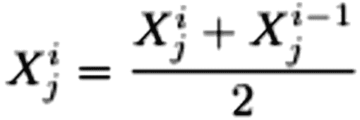
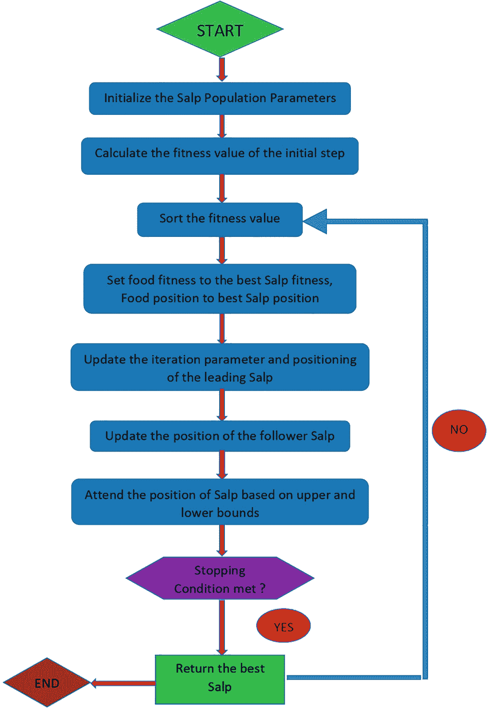

# 五、海洋生物：Salp 群优化

本章向您介绍 salp 群优化方法，这是另一种元启发式技术。优属于生活在海底的一类动物。

## 历史

Salps 属于 Salpidae 家族。它们有一个透明的桶形身体，它们的组织与水母高度相似。它们像水母一样移动，因为水是通过身体向前推进的。

关于这些生物的生物学研究正处于早期阶段，主要是因为它们的生活环境极难进入，很难将它们保持在实验室环境中。

萨尔普斯最有趣的行为之一是成群结队。在深海中，salp 经常形成一个群体，称为 *salp 链*。这种行为的主要原因尚不清楚，但一些研究人员认为，这是为了通过快速协调变化和觅食来实现更好的运动。

Salp 链主要分为两部分。

*   链中的第一个 salp 是*领导者*。

*   链条中的所有其他 salps 都是*跟随者*。

## Salp 群算法

salp 群算法(SSA)基于 salp 的群体行为。这种算法技术通常比其他群算法具有更好的性能。SSA 是一种随机算法。在优化过程开始时，通过创建一组随机解来形成初始群体。这些解决方案随着时间的推移分两个阶段进行改进，即勘探和开发。在探索阶段，探索搜索空间。在剥削中，邻里被剥削。该算法将探索和开发结合起来，避免了陷入局部最优。

领导者的位置在等式 [5-1](#Par11) 中更新。


方程式 5-1。【salp 群的位置更新

*X*<sub>*j*</sub><sup>1</sup>和 *F* <sub>*j*</sub> 分别表示 *j* 维中首领和馈源的位置。*ub*<sub>*j*</sub>和*lb*<sub>*j*</sub>表示 *j* 维的上(上)界和下(下)界。*c*T32】2 和*c*T36】3 是来自封闭区间[0，1]的两个随机浮点数。

系数 *c* <sub>1</sub> ，SSA 中最有效的参数，在整个迭代过程中逐渐减小，以平衡勘探和开采，如方程 [5-2](#Par14) 中所定义。

c<sub>1</sub>= 2e<sup>(4l L)(功率)2</sup>

方程式 5-2。*系数 c*<sub>T3】1T5*计算*</sub>

L 和 L 分别表示当前迭代和最大迭代次数。等式 [5-3](#Par17) 更新从动轮的位置。



方程式 5-3。*跟随者位置更新*

## 流程图

图 [5-1](#Fig1) 是 salp 群优化算法的流程图。在高层次上，这个流程图从初始化参数开始，比如迭代次数和群体大小。在每次迭代中，领导者和跟随者的位置被更新，并且每个 salp 的适应度被计算。最大迭代次数后，返回最合适的解。



图 5-1

salp 群优化流程图

## 伪代码

以下伪代码描述了 salp 群优化算法，如图 [5-1](#Fig1) 所示。

```java
Initialize the population of salps (i = 1, 2, .., n) considering lower and upper bounds
    while (max iterations are not done)
    Calculate the fitness value of each salp
    Set F as the best salp
    Update the parameter c, using Eq (5.2)
        for salp
            f(i==1)
                Update the position of leader salp by Eq (5.1)
            else
                Update the position of follower salps by Eq (5.3)
            end
        end
    Update the position of salps considering lower and upper limits of variables end
return F

```

## 先决条件和代码

确保您的计算机上安装了 Java 8 (JDK8 或更高版本)。像 Eclipse 这样的 IDE 是推荐的，但不是必需的，因为您可以使用命令行界面来运行代码，而不需要 IDE。

salp swarm optimizer 算法的代码包含以下类。


*   Point 是具有三个成员的实用程序类(参见清单 [5-1](#PC2) )。
    *   双数组

    *   整数数组

    *   整数

*   Rastrigin 是优化评估函数的实用程序类(参见清单 [5-2](#PC3) )。拉斯特里金方程如方程 [5-4](#Par28) 所示。

*   SalpSwarmOptimizer 是主要的优化器类(参见清单 [5-3](#PC4) )。目标函数是基准函数(本例中为 Rastrigin)的最小化。

方程式 5-4。 *Rastrigin 基准函数*

每个清单都包含详细的注释，以便更准确地描述代码的特定部分。

```java
/*
This class is the main optimizer class . Our objective function is the minimization of the benchmark function (Rastrigin in this case)
*/

import java.lang.Math;
import java.util.*;
public class SalpSwarmOptimizer
{
// declare variables for population size, number of iterations, dimensions and bounds.

int popSize;
int iterations;

int dimensions;
//declaration of bounds
double ub=5.12,lb=-5.12;
//array for holding the fitness values

double fitness[];
double[] bestSolution;

double minValueOfSolution;
double[][] positions;

public SalpSwarmOptimizer(int iterations,int popSize, int dimensions)
{
    this.iterations=iterations;
    this.popSize=popSize;
    this.dimensions=dimensions;
    positions=new double[popSize][dimensions];
    fitness=new double[popSize];
    //initialize solutions

    for(int i=0;i<popSize;i++)
    {
    for (int j=0;j<dimensions;j++)
    {

        double rnd=Math.random();

        positions[i][j]=rnd*(ub-lb)+lb;
    }
    }

    for(int i=0;i<popSize;i++)
    {
        fitness[i]=fitnessCalculator(positions[i]);

    }
    int bestIndex= indexOfSmallest(fitness);

    bestSolution=positions[bestIndex];

    minValueOfSolution=fitness[bestIndex];

}

//rastrigin function used
private  double fitnessCalculator(double[] candidate)
{

    Point p= new Point(candidate);
    Rastrigin rast=new Rastrigin(10,dimensions);
    return rast.f(p);

}
/*
Helper method which finds the index of the smallest member in an array of doubles
*/

private static int indexOfSmallest(double[] array){

    // add this
    if (array.length == 0)
        return -1;

    int index = 0;
    double min = array[index];

    for (int i = 1; i < array.length; i++){
        if (array[i] <= min){
        min = array[i];
        index = i;
        }
    }

    return index;
}
/*
Helper method to do a matrix transpose
*/

private double[][] transpose(double[][] original ,int rows, int columns)
{

     double[][] transpose=new double[rows][columns];
     for(int i=0;i<rows;i++){
for(int j=0;j<columns;j++){

transpose[i][j]=original[j][i];
}
}
return transpose;
}
/*
Helper method to return rows for a specific column of the matrix
*/

private double[] getRows(double[][] arr,int colIndex)
{
    double[] result=new double[arr.length]; //size is number of rows

    for(int i=0;i<arr.length;i++)
    {

        for (int col = 0; col < arr[i].length; col++) {

        if(col==colIndex)
        {

        result[i]=arr[i][col];
        }

        }
    }
    return result;
}
/*
Helper method which adds element of two dimensional each array and returns a two dimensional array
*/

private  double[][] addElementwise(double[] a, double[] b,double[][] positions,int dim, int pop) throws ArithmeticException {

        if (a.length != b.length) {
            throw new ArithmeticException();
        } else {

            for (int i = 0; i < a.length; i++) {
                positions[dim][pop] = ((a[i] + b[i])/2);
            }
            return positions;
        }

    }

/*
Method for running the iterations and optimizer code
*/

private void optimize()
{
    //main loop

    for(int i=0;i<iterations;i++){

        double c1 = 2 * Math.exp(-(Math.pow(4 * i / iterations,2)));
        //loop over individual moth
        for(int j=0;j<popSize;j++)
        {
            // perform a matrix transform
            positions =transpose(positions,dimensions,popSize);

            if (j < popSize/2)
            {
             for (int k=0;k<dimensions;k++)

                {
                double c2 = Math.random();
                double c3 = Math.random();
        // update the position at kth row and jth column based on value of c1 and c2
                if (c3 < 0.5)
                {
                    positions[k][j] = bestSolution[k] + c1 * ((ub - lb) * c2 + lb);

                    }
                else
                    {
                    positions[k][j] = bestSolution[k] - c1 * ((ub - lb) * c2 + lb);

                    }
                }
            }

            else if ((j >= popSize / 2) && (j < popSize + 1)){
                double[] point1= getRows(positions,j-1);

             double[] point2 = getRows(positions,j);

                  for (int k=0;k<dimensions;k++)
                {
                positions=addElementwise(point1,point2,positions,k,j);

                }

        }
        // transpose the matrix back for next iteration
        positions = transpose(positions,popSize,dimensions);

        }

        for(int j=0;j<popSize;j++)
        {

            positions[j]=simpleBounds(positions[j],lb,ub);

            // calculate fitness of each salp swarm
          double fNew = fitnessCalculator(positions[j]);

             // Update the current best solution
          if (fNew < minValueOfSolution)
            {
             bestSolution =positions[j].clone();
             minValueOfSolution = fNew;

            }

        }
        System.out.println("minimum value at iterartion "+i+"="+minValueOfSolution);

    }

}
/*
Method for bounding the value between lower and upper bounds
*/
private double[] simpleBounds(double[] val, double lower, double upper){
    double[] result = new double[val.length];
    for (int i = 0; i < val.length; i++) {

       if (val[i] < lower){
          result[i] = lower;

        }
       else if (val[i] > upper){
          result[i] = upper;

        }
        else
        {
            result[i]=val[i];

        }

    }

       return result;
}
/*
Main method to pass inputs and launch the algorithm
*/

public static void main(String[] args)
{
//takes input as number of iterations, population size and dimensions

int iter=Integer.parseInt(args[0]);
int pop=Integer.parseInt(args[1]);
int dim=Integer.parseInt(args[2]);
SalpSwarmOptimizer swarm =new SalpSwarmOptimizer(iter,pop,dim);
swarm.optimize();
}

}

Listing 5-3The SalpSwarmOptimizer Class

```

```java
    /*
    This class is used as the benchmark function and will be used throughout all algorithms.

    */

public class Rastrigin {

    private double A;
    private double n;

    public Rastrigin(double A, double n) {
       this.A = A;
       this.n = n;
    }

    /*
    This method is the main method for the Rastrigin benchmark function. It takes as input a Point object (explained above) and performs the calculations for the benchmark.
    */

    public double f(Point x) {
       double sum = 0;
       //o = numpy.sum(x ** 2 - 10 * numpy.cos(2 * math.pi * x)) + 10 * dim
       for (int i = 0; i < x.dim; i++) {

          sum += Math.pow(x.p[i], 2) - A*Math.cos(2*Math.PI*x.p[i]);

       }

       return A*n + sum;
    }

}

Listing 5-2The Rastrigin Class

```

```java
public class Point {
    public double p[];
    public int ip[];
    public int dim;

    public Point(double p[]) {
       this.dim = p.length;
       this.p = p.clone();
    }

    public Point(int p[]) {
       this.dim = p.length;
       this.ip = p.clone();
    }

    public Point(int dim) {
       this.dim = dim;
       p = new double[dim];
    }
    /*
    this method returns the square root of the sum of the square of the members in the array of doubles
    */
    public double norm(){
       double sum = 0;
       for (int i = 0; i < dim ; i ++) {
          sum += Math.pow(this.p[i], 2);
       }
       return Math.sqrt(sum);
    }

    /*
    This method returns the square root of the distance between 2 points. Its calculated by taking sum of the square of the distance between each element of the double array and then doing a square root of it.
    */
    public double dist(Point b){
       double sum = 0;
       for (int i = 0; i < dim ; i ++) {
          sum += Math.pow(this.p[i]-b.p[i], 2);
       }
       return Math.sqrt(sum);
    }
    /*
    This method adds the two Points by taking sum of the individual elements of the double array of each Point
    */

    public static Point add(Point a, Point b) throws Exception {
       if (a.dim != b.dim){
          throw new IllegalArgumentException("Adding points from different dimensions");
       }
       int dim  = a.dim;
       double cp[] = new double[dim];
       for (int i = 0; i < dim; i++){
          cp[i] = a.p[i] + b.p[i];
       }
       return new Point(cp);
    }
    /*
    This method adds the two Points by taking sum of the individual elements of the double array of each Point and then takes an average of each added elements and finally returns a Point with the averages points in the new array
    */

    public static Point mid(Point a, Point b) throws Exception{
       if (a.dim != b.dim){
          throw new IllegalArgumentException("Incompatible points");
       }

       int dim  = a.dim;
       double cor[] = new double[dim];
       for (int i = 0; i < dim; i++){
          cor[i] = (a.p[i] + b.p[i]) / 2.0;
       }
       return new Point (cor);
    }
    /*
    This method multiplies each element of the array of double with the constant a. a is the coefficient we use in the optimization algorithm.
    */
    public Point mull(double a) {
       double p[] = new double[this.dim];
       Point m = new Point(p);
       for (int i = 0; i < this.dim; i++){
          m.p[i] = this.p[i]*a;
       }
       return m;
    }
    /*
    This method returns a string representation of the double array
    */

    @Override
    public String toString() {
       if (p != null) {
          String s = "[";
          for (int i = 0; i < this.dim; i++){
             s += (float)p[i];
             if (i == this.dim - 1) {
                s += "]";
             } else {
                s += ",";
             }
          }

          return s;
       } else {
          String s = "[";
          for (int i = 0; i < this.dim; i++){
             s += (int)ip[i];
             if (i == this.dim - 1) {
                s += "]";
             } else {
                s += ",";
             }
          }
          return s;
       }
    }
}

Listing 5-1The Point Class

```

## 执行代码

让我们编译源代码并执行它。以下是编译 Java 文件的命令。

```java
javac Point.java
javac Rastrigin.java
javac SalpSwarmOptimizer.java

//running the example with 50 iterations and population size of 10 and 30 dimensions
java SalpSwarmOptimizer 50 10 30

```

### 输出

执行代码后，您会看到以下结果。

```java
minimum value at iterartion 0=244.86356621486414
minimum value at iterartion 1=124.07861122372111
minimum value at iterartion 2=45.215002332220735
minimum value at iterartion 3=45.215002332220735
minimum value at iterartion 4=10.8885992360552
minimum value at iterartion 5=10.8885992360552
minimum value at iterartion 6=10.8885992360552
minimum value at iterartion 7=10.8885992360552
minimum value at iterartion 8=10.8885992360552
minimum value at iterartion 9=10.8885992360552
minimum value at iterartion 10=10.8885992360552
minimum value at iterartion 11=10.8885992360552
minimum value at iterartion 12=10.8885992360552
minimum value at iterartion 13=10.8885992360552
minimum value at iterartion 14=10.8885992360552
minimum value at iterartion 15=10.8885992360552
minimum value at iterartion 16=10.8885992360552
minimum value at iterartion 17=10.8885992360552
minimum value at iterartion 18=10.8885992360552
minimum value at iterartion 19=10.8885992360552
minimum value at iterartion 20=10.8885992360552
minimum value at iterartion 21=0.29297658145605965
minimum value at iterartion 22=0.29297658145605965
minimum value at iterartion 23=0.29297658145605965
minimum value at iterartion 24=0.29297658145605965
minimum value at iterartion 25=0.29297658145605965
minimum value at iterartion 26=0.29297658145605965
minimum value at iterartion 27=0.29297658145605965
minimum value at iterartion 28=0.29297658145605965
minimum value at iterartion 29=0.29297658145605965
minimum value at iterartion 30=0.29297658145605965
minimum value at iterartion 31=0.29297658145605965
minimum value at iterartion 32=0.29297658145605965
minimum value at iterartion 33=0.29297658145605965
minimum value at iterartion 34=0.29297658145605965
minimum value at iterartion 35=0.29297658145605965
minimum value at iterartion 36=0.29297658145605965
minimum value at iterartion 37=0.29297658145605965
minimum value at iterartion 38=0.28874178108526394
minimum value at iterartion 39=0.28857296330363624
minimum value at iterartion 40=0.2515754513162278
minimum value at iterartion 41=0.2433592726172833

minimum value at iterartion 42=0.1984760429712651
minimum value at iterartion 43=0.18909883434662333
minimum value at iterartion 44=0.17737272169620155
minimum value at iterartion 45=0.1590004357810244
minimum value at iterartion 46=0.14865231084121433
minimum value at iterartion 47=0.14865231084121433
minimum value at iterartion 48=0.14865231084121433
minimum value at iterartion 49=0.12695612866474448

```

## 摘要

本章介绍了针对 salp 群体及其觅食行为的优化问题解决方案。它涵盖了优化问题和解决方案的基本流程、流程图、伪代码和用 Java 编写的代码。Rastrigin 基准函数被用作算法中的目标函数。