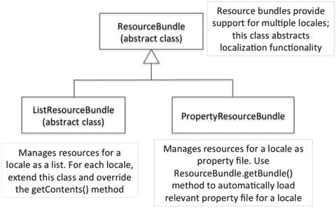
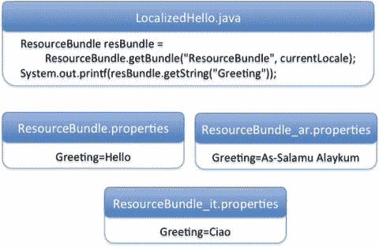
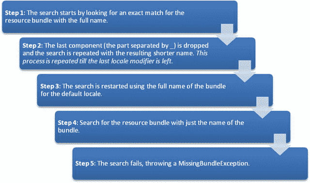

# 十三、本地化

 
| 认证目标 |
| --- |
| 使用 locale 对象读取和设置区域设置 |
| 创建并读取属性文件 |
| 为每个语言环境构建一个资源包，并在应用中加载一个资源包 |

今天，计算机和软件变得如此普遍，以至于它们在世界各地都被用于人类活动。对于任何与这些用户相关和有用的软件，它都需要本地化。我们使软件适应当地语言和习俗的过程称为本地化。

本地化就是让软件对来自不同文化的用户有用，换句话说，就是为来自不同国家或语言的用户定制软件。如何本地化一个软件应用？当您本地化软件应用时，应该注意两个重要的准则:

*   不要硬编码文本(比如给用户的消息，GUI 中的文本元素，等等。)并将它们分离到外部文件或专用类中。完成这一步后，在软件中添加对新语言环境的支持就变得轻而易举了。
*   考虑到本地化，处理特定于文化的方面，如日期、时间、货币和格式化数字。不要假定一个默认的区域设置，而是以这样一种方式设计，即获取和定制当前的区域设置。

在这一章中，你将学习如何本地化你的软件。本地化主要包括为不同的地区创建资源包，以及通过使软件适应不同的地区来使软件具有文化意识。在本章中，您还将学习如何创建和使用这些资源包。

## 现场

  
| 认证目标 |   |
| --- | --- |
| 使用 locale 对象读取和设置区域设置 |   |

场所是“代表一个国家、语言或文化的地方”考虑一下加拿大-法国语言环境。加拿大的许多地方都讲法语，这可能是一个地区。换句话说，如果你想销售为说法语的加拿大人定制的软件，那么你需要使你的软件适合这个地区。在 Java 中，这个地区由代码`fr_CA`表示，其中`fr`是法语的缩写，`CA`是加拿大的缩写；我们将在本节的后面更详细地讨论区域设置的命名方案。

### 区域设置类

在 Java 中，`java.util.Locale`类为地区提供编程支持。表 13-1 列出了这个类中的重要方法。

表 13-1。

Important Methods in the Locale Class

  
| 方法 | 简短描述 |
| --- | --- |
| `static Locale[] getAvailableLocales()` | 返回 JVM 支持的可用语言环境(即已安装的语言环境)的列表。 |
| `static Locale getDefault()` | 返回 JVM 的默认语言环境。 |
| `static void setDefault(Locale newLocale)` | 设置 JVM 的默认语言环境。 |
| `String getCountry()` | 返回 locale 对象的国家代码。 |
| `String getDisplayCountry()` | 返回区域设置对象的国家名称。 |
| `String getLanguage()` | 返回区域设置对象的语言代码。 |
| `String getDisplayLanguage()` | 返回区域设置对象的语言名称。 |
| `String getVariant()` | 返回区域设置对象的变量代码。 |
| `String getDisplayVariant()` | 返回区域设置对象的变体代码的名称。 |
| `String toString()` | 返回一个由地区语言、国家、变量等代码组成的`String`。 |

清单 13-1 中的代码检测默认语言环境，并检查 JVM 中可用的语言环境。

Listing 13-1\. AvailableLocales.java

```java
import java.util.Locale;

import java.util.Arrays ;

class AvailableLocales {

public static void main(String []args) {

System.out.println("The default locale is: " + Locale.getDefault());

Locale [] locales = Locale.getAvailableLocales();

System.out.printf("No. of other available locales is: %d, and they are: %n",

locales.length);

Arrays.stream(locales).forEach(

locale -> System.out.printf("Locale code: %s and it stands for %s %n",

locale, locale.getDisplayName()));

}

}
```

它打印以下内容:

```java
The default locale is: en_US

No. of other available locales is: 160, and they are:

Locale code: ms_MY and it stands for Malay (Malaysia)

Locale code: ar_QA and it stands for Arabic (Qatar)

Locale code: is_IS and it stands for Icelandic (Iceland)

Locale code: sr_RS_#Latn and it stands for Serbian (Latin,Serbia)

Locale code: no_NO_NY and it stands for Norwegian (Norway,Nynorsk)

Locale code: th_TH_TH_#u-nu-thai and it stands for Thai (Thailand,TH)

Locale code: fr_FR and it stands for French (France)

Locale code: tr and it stands for Turkish

Locale code: es_CO and it stands for Spanish (Colombia)

Locale code: en_PH and it stands for English (Philippines)

Locale code: et_EE and it stands for Estonian (Estonia)

Locale code: el_CY and it stands for Greek (Cyprus)

Locale code: hu and it stands for Hungarian

[...rest of the output elided...]
```

在分析输出之前，让我们看看程序中的方法。您使用`Locale`中的方法`getDefault()`来获取默认地区的代码。之后，在`Locale`类中使用`getAvailableLocales()`来获取 JVM 支持的语言环境列表。现在，为每个地区打印地区代码，并使用`Locale`的`getDisplayName()`方法打印描述性名称。

该程序将这个 JVM 的默认语言环境打印为`en_US`，这意味着默认语言环境是美国使用的英语。然后它打印出一个很长的可用地区列表；为了节省空间，我们只展示了输出的一小部分。从这个程序中，您知道有许多可用和受支持的语言环境，并且每个 JVM 都有一个默认的语言环境。

此输出中有四种不同的区域设置代码:

*   “hu 和它代表匈牙利语”:只有一个代码，其中`hu`代表匈牙利语
*   “ms_MY 和它代表马来语(马来西亚)”:由下划线分隔的两个代码，其中`ms`代表马来语，`MY`代表马来西亚
*   “no_NO_NY，它代表挪威语(挪威，尼诺斯克)”:由下划线分隔的三个代码，如 no_NO_NY，其中`no`代表挪威语，`NO`代表挪威，`NY`代表尼诺斯克语
*   “th_th_TH_#u-nu-thai，它代表泰语(Thailand，TH)”:由下划线分隔的两个或三个初始代码，最后一个由`#`或`_#`分隔，如在`th_TH_TH_#u-nu-thai`中，我们现在将讨论它。

以下是这些区域名称的编码方式:

```java
language + "_" + country + "_" + (variant + "_#" | "#") + script + "-" + extensions
```

这种语言环境编码方案允许组合不同的变体来创建一个语言环境。对于“th_TH_TH_#u-nu-thai”的地区代码，

*   语言代码是`"th"`(泰语)，并且总是用小写字母书写
*   国家代码是`"TH"`(泰国)，并且总是用大写字母书写
*   变体名称为`"TH"`；这里它重复了国家代码，但也可以是任何字符串
*   脚本名称在这里是一个空字符串；如果给定，它将是一个四个字母的字符串，第一个字母大写，其余字母小写(例如，`Latn`)
*   扩展名跟在`#`或`_#`字符之后(因为脚本是一个空字符串)；在这个例子中是“u-nu-thai”

再举一个例子，考虑地区代码`"sr_RS_#Latn"`，

*   语言代码为`"sr"`(塞尔维亚语)
*   国家代码是`"RS"`(塞尔维亚)
*   此处的变量名称为空
*   脚本名为`"Latn"`(拉丁文)，由四个字母组成，第一个字母大写，其余字母小写
*   这里的分机是空的

以英语为例，许多国家都讲英语。英语因使用该语言的国家而有所不同。我们都知道美式英语和英式英语不同，但是这样的版本很多。以下代码(清单 13-2 )从所有可用的语言环境中只过滤英语语言环境:

Listing 13-2\. AvailableLocalesEnglish.java

```java
import java.util.Locale;

import java.util.Arrays;

class AvailableLocalesEnglish {

public static void main(String []args) {

Arrays.stream(Locale.getAvailableLocales())

.filter(locale -> locale.getLanguage().equals("en"))

.forEach(locale ->

System.out.printf("Locale code: %s and it stands for %s %n",

locale, locale.getDisplayName()));

}

}
```

它会打印以下内容(输出和顺序可能会因您的机器而异):

```java
Locale code: en_MT and it stands for English (Malta)

Locale code: en_GB and it stands for English (United Kingdom)

Locale code: en_CA and it stands for English (Canada)

Locale code: en_US and it stands for English (United States)

Locale code: en_ZA and it stands for English (South Africa)

Locale code: en and it stands for English

Locale code: en_SG and it stands for English (Singapore)

Locale code: en_IE and it stands for English (Ireland)

Locale code: en_IN and it stands for English (India)

Locale code: en_AU and it stands for English (Australia)

Locale code: en_NZ and it stands for English (New Zealand)

Locale code: en_PH and it stands for English (Philippines)
```

输出用英语表示不同的地区，只使用语言代码和国家代码。我们在`Locale`中使用了`getLanguage()`方法，它返回地区代码。还有哪些这样的方法？现在让我们探索一下`Locale`类中可用的方法。

#### 获取区域设置详细信息和设置区域设置

`Locale`类中的 getter 方法如`getLanguage()`、`getCountry()`和`getVariant()`返回代码，而类似的方法`getDisplayCountry()`、`getDisplayLanguage()`和`getDisplayVariant()`返回名称。清单 13-3 展示了如何为地区`Locale.CANADA_FRENCH`使用这些方法。

Listing 13-3\. LocaleDetails.java

```java
import java.util.Locale;

public class LocaleDetails {

public static void main(String args[]) {

Locale.setDefault(Locale.CANADA_FRENCH);

Locale defaultLocale = Locale.getDefault();

System.out.printf("The default locale is %s %n", defaultLocale);

System.out.printf("The default language code is %s and the name is %s %n",

defaultLocale.getLanguage(), defaultLocale.getDisplayLanguage());

System.out.printf("The default country code is %s and the name is %s %n",

defaultLocale.getCountry(), defaultLocale.getDisplayCountry());

System.out.printf("The default variant code is %s and the name is %s %n",

defaultLocale.getVariant(), defaultLocale.getDisplayVariant());

}

}
```

它打印以下内容:

```java
The default locale is fr_CA

The default language code is fr and the name is français

The default country code is CA and the name is Canada

The default variant code is  and the name is
```

让我们来了解一下程序。`setDefault()`方法将一个`Locale`对象作为参数。在这个程序中，您使用下面的语句将默认语言环境设置为`Locale.CANADA_FRENCH`:

```java
Locale.setDefault(Locale.CANADA_FRENCH);
```

`Locale`类有许多静态的`Locale`对象来表示常见的地区，这样你就不必实例化它们并直接在你的程序中使用它们。在这种情况下，`Locale.CANADA_FRENCH`是一个静态的`Locale`对象。

不使用这个静态的`Locale`对象，您可以选择实例化一个`Locale`对象。下面是通过创建新的加拿大(法语)区域设置对象来设置默认区域设置的另一种方法:

```java
Locale.setDefault(new Locale("fr", "CA", ""));
```

`Locale`中的`getDefault()`方法返回 JVM 中的默认 locale 对象集。下一条语句使用方法获取与国家相关的信息。`getCountry()`和`getDisplayCountry()`方法的区别在于，前者返回国家代码(对我们来说可读性不强)，后者返回国家名称，这是人类可读的。国家代码是两个或三个字母的代码(此代码来自国际标准:ISO 3166)。

`getLanguage()`和`getDisplayLanguage()`的行为类似于获取国家细节。语言代码由两个或三个字母组成(这个代码来自另一个国际标准:ISO 639)。

这个语言环境中没有变量，所以当您使用`getVariant()`和`getDisplayVariant()`方法时，不会打印任何东西。然而，对于其他一些地区，可能有不同的值，这些值将被打印出来。变量可以是任何额外的细节，如操作环境(如 MAC for Macintosh 机器)或公司名称(如 Sun 或 Oracle)。

除此之外，还有一些不太常用的方法，比如返回脚本代码和地区国家名称的`getScript()`和`getDisplayCountry()`。

不要调用`Locale`的`getDisplayCountry()`方法，它不接受任何参数，你可以选择`getDisplayCountry(Locale)`的重载版本，它接受一个`Locale`对象作为参数。这将按照传递的区域设置打印国家的名称。例如，对于呼叫`Locale.GERMANY.getDisplayCountry()`，您将得到输出“德国”(这是德国人对他们国家的称呼)；然而，对于调用`Locale.GERMANY.getDisplayCountry(Locale.ENGLISH)`，您将得到输出“德国”(这是英国人对国名德国的称呼)

Different Ways to Create a Locale Object

有许多方法可以获得或创建一个`Locale`对象。我们在这里列出了四个选项，用于创建与其语言代码相对应的意大利语言环境的实例。

选项 1:使用`Locale`类的构造函数:`Locale(String language, String country, String variant):`

```java
Locale locale1 = new Locale("it", "", "");
```

选项 2:使用`Locale`类中的`forLanguageTag(String languageTag)`方法:

```java
Locale locale2 = Locale.forLanguageTag("it");
```

选项 3:通过实例化`Locale.Builder`构建一个`Locale`对象，然后从该对象调用`setLanguageTag()`:

```java
Locale locale3 = new Locale.Builder().setLanguageTag("it").build();
```

选项 4:在`Locale`类中为地区使用预定义的静态最终常量:

```java
Locale locale4 = Locale.ITALIAN;
```

您可以根据需要选择创建`Locale`对象的方式。例如，`Locale`类只有几个针对地区的预定义常量。如果你想要一个预定义的`Locale`对象，你可以直接使用它，或者你必须检查使用哪个选项。

## 资源包

  
| 认证目标 |   |
| --- | --- |
| 为每个语言环境构建一个资源包，并在应用中加载一个资源包 |   |

在上一节中，我们讨论了`Locale`类以及获取默认语言环境细节和可用语言环境列表的方法。如何使用这些地区信息来定制程序的行为？让我们举一个简单的问候别人的例子:在英语中，你说“你好”，但如果地区不同，你如何将这个问候改为，例如，“Ciao”，如果地区是意大利语(意大利)？

一个显而易见的解决方案是获取默认的区域设置，检查区域设置是否是意大利，并打印“Ciao”这是可行的，但是这种方法既不灵活也不可扩展。如何定制到其他地区，如沙特阿拉伯(阿拉伯语)或泰国(泰语)？您必须找到并替换所有特定于语言环境的字符串，以便为每个语言环境进行定制。如果您的应用由分布在一百万行代码中的数千个这样的字符串组成，并且需要支持许多地区，那么这项任务将是一场噩梦。

在 Java 中，资源包为如何定制应用以满足特定于地区的需求提供了一个解决方案。那么，什么是资源包呢？资源包是一组帮助定义一组键并将这些键映射到特定于地区的值的类或属性文件。

抽象类`java.util.ResourceBundle`提供了 Java 中资源束的抽象。它有两个派生类:`java.util.PropertyResourceBundle`和`java.util.ListResourceBundle`(见图 13-1 )。这两个派生类使用两种不同的机制为资源包提供支持:



图 13-1。

ResourceBundle and its two derived classes

*   `PropertyResourceBundle`类:这个具体的类以属性文件的形式提供了对多种语言环境的支持。对于每个区域设置，您可以在该区域设置的属性文件中指定键和值。对于给定的语言环境，如果使用`ResourceBundle.getBundle()`方法，相关的属性文件将被自动加载。当然，这里面没有魔法；创建属性文件必须遵循一定的命名约定，我们将在专门讨论属性文件的章节中讨论这一点。使用属性文件时，只能使用`Strings`作为键和值。
*   `ListResourceBundle`类:为了增加对语言环境的支持，您可以扩展这个抽象类。在你的派生类中，你必须重写`getContents()`方法，它返回一个`Object [][]`。该数组必须有键和值的列表。按键必须是`Strings`。通常值也是`Strings`，但是值可以是任何东西:声音剪辑、视频剪辑、URL 或者图片。

让我们快速看一下`ResourceBundle`抽象类支持的方法。表 13-2 总结了这个类的重要方法。我们现在将讨论使用`ResourceBundle`的这两个派生类的本地化支持。

表 13-2。

Important Methods in the ResourceBundle Abstract Class

  
| 方法 | 简短描述 |
| --- | --- |
| `Object getObject(String key)` | 返回映射到给定键的值。如果没有找到给定键的对象，抛出一个`MissingResourceException`。 |
| `static ResourceBundle getBundle(String baseName),``static final ResourceBundle getBundle(String baseName, Locale locale)` | 返回给定的`baseName`、`locale`的`ResourceBundle`，如果没有找到匹配的资源包，`control;`抛出一个`MissingResourceException`。`Control`参数用于控制或获取资源包加载过程的信息 |
| `String getString(String key)` | 返回映射到给定键的值；相当于将返回值从`getObject()`强制转换为`String`。如果没有找到给定键的对象，抛出一个`MissingResourceException`。如果返回的对象不是一个`String`，抛出`ClassCastException`。 |

### 使用 PropertyResourceBundle

  
| 认证目标 |   |
| --- | --- |
| 创建并读取属性文件 |   |

如果您使用属性文件设计应用时考虑到了本地化，那么您可以在不更改任何代码的情况下为应用添加对新语言环境的支持！

现在我们来看一个使用资源文件的例子，你会明白的。让我们从一个非常简单的向用户输出“Hello”的程序开始。这个程序有三个属性文件资源包:

The default resource bundle that assumes the English (US) locale.   A resource bundle for the Arabic locale.   A resource bundle for the Italian locale.  

如上所述，属性文件将字符串定义为文件中的键值对。下面是一个类路径的例子，它可以映射到机器中的一个实际路径:`classpath=C:\Program Files\Java\jre8`。属性文件通常包含许多这样的键值对，每个键值对位于单独的行中，如下所示:

```java
classpath=C:\Program Files\Java\jre8

temp=C:\Windows\Temp

windir=C:\Windows
```

在本地化的情况下，使用属性文件将相同的键字符串映射到不同的值字符串。在程序中，您将引用键字符串，并通过加载与该地区相匹配的属性文件，从属性文件中获取键的相应值，以便在程序中使用。

这些属性文件的命名很重要(您很快就会明白为什么)，下面是这些包的内容。为了使这个例子简单，在这些属性文件中只有一个键值对；在现实世界的程序中，每个属性文件中可能有几百甚至几千对。

```java
D:\> type ResourceBundle.properties

Greeting=Hello

D:\> type ResourceBundle_ar.properties

Greeting=As-Salamu Alaykum

D:\> type ResourceBundle_it.properties

Greeting=Ciao
```

如您所见，默认的包名为`ResourceBundle.properties`。阿拉伯语的资源包被命名为`ResourceBundle_ar.properties`。注意后缀“_ar”，表示阿拉伯语是本地语言。类似地，意大利语的资源包被命名为`ResourceBundle_it.properties`，它使用`"_it"`后缀来表示意大利语是这个属性文件的关联语言。清单 13-4 利用了这些资源包。

Listing 13-4\. LocalizedHello.java

```java
import java.util.Locale;

import java.util.ResourceBundle;

public class LocalizedHello {

public static void main(String args[]) {

Locale currentLocale = Locale.getDefault();

ResourceBundle resBundle =

ResourceBundle.getBundle("ResourceBundle", currentLocale);

System.out.printf(resBundle.getString("Greeting"));

}

}
```



图 13-2。

Getting relevant strings from ResourceBundles based on the locale

有两个选项可以按所需方式运行该程序:

*   选项 I:通过调用`setDefault()`方法来更改程序中的默认区域设置:`Locale.setDefault(Locale.ITALY);`不推荐使用该选项，因为它需要更改程序来设置区域设置。
*   选项 II:从命令行调用 JVM 时更改默认的语言环境(如果您从 ide 调用 JVM，请在 IDE 设置中为 JVM 提供命令行参数):`D:\> java -Duser.language=it -Duser.region=IT LocalizedHello`

让我们通过用选项 II(调用 JVM 时向命令行传递参数)设置语言环境来尝试这个程序。

```java
D:\> java LocalizedHello

Hello

D:\> java -Duser.language=it LocalizedHello

Ciao

D:\> java -Duser.language=ar LocalizedHello

As-Salamu Alaykum
```

正如您所看到的，根据您显式设置的地区(本例中是意大利语或阿拉伯语)，或者默认地区(本例中是美国英语)，相应的属性文件被加载，消息字符串被解析。

如果您忘记创建属性文件或者它们不在路径中，您将得到一个`MissingResourceException`。

在程序中，首先在语句中获取当前的区域设置。

```java
Locale currentLocale = Locale.getDefault();
```

之后，加载以名称`ResourceBundle`开始的资源包，并传递加载资源包的区域设置。

```java
ResourceBundle resBundle = ResourceBundle.getBundle("ResourceBundle", currentLocale);
```

最后，从资源包中，查找关键字“Greeting ”,并根据加载的资源包使用该关键字的值。

```java
System.out.printf(resBundle.getString("Greeting"));
```

### 使用 ListResourceBundle

可以使用`ListResourceBundle`通过扩展来添加对新语言环境的支持。在扩展`ListResourceBundle`的时候，你需要覆盖抽象方法`getContents();`，这个方法的签名是:

```java
protected Object[][] getContents();
```

注意键是`Strings`，但是值可以是任何类型，因此数组类型是`Object`；此外，该方法返回键和值对的列表。结果，`getContents()`方法返回一个二维数组`Objects`。

您通过扩展`ListResourceBundle`类来创建资源包，而使用`PropertyResourceBundle`，您将资源包创建为属性文件。此外，当扩展`ListResourceBundle`时，可以将任何类型的对象作为值，而属性文件中的值只能是字符串。

清单 13-5 展示了一个扩展`ListResourceBundle`的例子，它返回特定地区最卖座的电影。它定义了名为`ResBundle`的资源包。因为类名没有任何后缀(比如`"_it"`或者`"_en_US"`，所以它是资源包的默认实现。在为任何地区寻找匹配的`ResBundle`时，如果找不到匹配，将使用这个默认实现。

Listing 13-5\. ResBundle.java

```java
import java.util.ListResourceBundle;

// default US English version

public class ResBundle extends ListResourceBundle {

public Object[][] getContents() {

return contents;

}

static final Object[][] contents = {

{ "MovieName", "Avatar" },

{ "GrossRevenue", (Long) 2782275172L }, // in US dollars

{ "Year", (Integer)2009 }

};

}
```

现在，让我们为意大利地区定义一个`ResBundle`。您给这个类加上后缀`"_it_IT"`。语言代码`"it"`代表意大利语，国家代码`"IT"`代表意大利(列表 13-6 )。

Listing 13-6\. ResBundle_it_IT.java

```java
import java.util.ListResourceBundle;

// Italian version

public class ResBundle_it_IT extends ListResourceBundle {

public Object[][] getContents() {

return contents;

}

static final Object[][] contents = {

{ "MovieName", "Che Bella Giornata" },

{ "GrossRevenue", (Long) 43000000L }, // in euros

{ "Year", (Integer)2011 }

};

}
```

正如您所看到的，除了映射到键的值之外，`ResBundle`和`ResBundle_it_IT`的实现是相似的。现在，您如何知道您的资源包是否在工作呢？清单 13-7 加载默认和意大利语言环境的`ResBundle`。

Listing 13-7\. LocalizedBoxOfficeHits.java

```java
import java.util.ResourceBundle;

import java.util.Locale;

public class LocalizedBoxOfficeHits {

public void printMovieDetails(ResourceBundle resBundle) {

String movieName = resBundle.getString("MovieName");

Long revenue = (Long)(resBundle.getObject("GrossRevenue"));

Integer year = (Integer) resBundle.getObject("Year");

System.out.println("Movie " + movieName + "(" + year + ")" + " grossed "

+ revenue );

}

public static void main(String args[]) {

LocalizedBoxOfficeHits localizedHits = new LocalizedBoxOfficeHits();

// print the largest box-office hit movie for default (US) locale

Locale locale = Locale.getDefault();

localizedHits.printMovieDetails(ResourceBundle.getBundle("ResBundle", locale));

// print the largest box-office hit movie for Italian locale

locale = new Locale("it", "IT", "");

localizedHits.printMovieDetails(ResourceBundle.getBundle("ResBundle", locale));

}

}
```

它打印以下内容:

```java
Movie Avatar (2009) grossed 2782275172

Movie Che Bella Giornata (2011) grossed 43000000
```

它成功加载了默认和意大利资源包。但是，这个输出存在一些问题。值 2782275172 是美元值，值 43000000 是欧元值。而且数字打印出来没有逗号，很难搞清楚这些数字的意义。可以本地化这些货币值的格式。但是处理数字格式、十进制格式和地区间的货币差异并不包含在 OCPJP 8 考试中，所以我们在本书中不做进一步的讨论。

现在，考虑该程序中的以下语句:

```java
Long revenue = (Long)(resBundle.getObject("GrossRevenue"));
```

该语句返回映射到资源包中名为`GrossRevenue`的键的值。你已经在类`ResBundle`和`ResBundle_it_IT`中将它定义为一个`Long`对象——所以它工作了。例如，如果您错误地将类型转换为`Integer`，您将得到一个`ClassCastException`，如下所示:

```java
Integer revenue = (Integer)(resBundle.getObject("GrossRevenue"));

// This code change will result in throwing this exception:

// Exception in thread "main" java.lang.ClassCastException:

//      java.lang.Long cannot be cast to java.lang.Integer
```

这里是另一种情况:如果您错误地键入了`GrossRevenu`而不是`GrossRevenue`作为键名，程序将会崩溃并出现这个异常，如下所示:

```java
Long revenue = (Long)(resBundle.getObject("GrossRevenu"));

// This code will crash with this exception:

// Exception in the thread "main" java.util.MissingResourceException:
```

`//      Can't find resources for bundle ResBundle, key` `GrossRevenu`

为了从资源包中获取对象，在提供 keyname 时需要小心:keyname 是区分大小写的，键名应该完全匹配——否则会得到 MissingResourceException。

## 加载资源包

  
| 认证目标 |   |
| --- | --- |
| 为每个语言环境构建一个资源包，并在应用中加载一个资源包 |   |

您已经在使用`ResourceBundle`或它的两个派生类编写的程序中加载了资源包。从考试的角度来看，您需要彻底理解这个加载过程，所以我们将在本节中更详细地讨论它。

对于从`ListResourceBundles`扩展的类，寻找匹配资源包的过程与为`PropertyResourceBundles`定义的属性文件相同。

对于实现为从`ListResourceBundles`扩展的类的资源包，Java 使用反射机制来查找和加载类。您需要确保该类是公共的，以便反射机制可以找到该类。

### 资源包的命名约定

Java 强制执行一个预定义的命名约定来创建资源包。Java 库只通过属性包的名称加载相关的语言环境。因此，在创建用于本地化 Java 应用的属性包时，理解并遵循这个命名约定是很重要的。

您已经看到了语言环境名称是如何编码的。理解这种语言环境名称编码对于命名资源包非常重要，因为它使用相同的编码方案。完全限定的资源包具有以下形式:

```java
packagequalifier.bundlename + "_" + language + "_" + country + "_" + (variant + "_#" | "#") + script + "-" + extensions
```

以下是该完全限定名称中元素的描述:

*   `packagequalifier`:提供资源包的包(或子包)的名称。
*   `bundlename`:您将在程序中引用和加载的资源包的名称。
*   `language`:两个字母的缩写，通常以小写形式表示该地区的语言(在极少数情况下，也可以是三个字母)。
*   `country`:两个字母的缩写，通常以大写形式表示该地区的国家(在极少数情况下，也可以是三个字母)。
*   `variant`:当您需要一个以上的语言和国家组合的地区时，一个任意的变量列表(小写或大写)来区分地区。

我们已经省略了对脚本和扩展的描述，因为它们很少被使用。

例如，考虑这个完全限定名:

```java
localization.examples.AppBundle_ en_US_Oracle_exam
```

在本例中，`localization.examples`是包，`AppBundle`是资源包的名称，`en`是语言(代表英语)，`US`是国家，`Oracle_exam`是变体。

地区语言和国家的两个(有时三个)字母缩写是预定义的，因为它们是基于国际标准的。我们不提供详细的列表，也没有必要在考试中知道或记住所有的列表。您可以查看`Locale`类的文档来理解这一点。

在 OCPJP 八级考试中，你不需要记住用于命名资源包的语言代码或国家代码。但是，您应该记住命名约定，并认识到完全限定的资源包名称的组成部分。

假设一个包名可能有多个资源包，那么确定要加载的资源包的搜索顺序是什么？为了清楚起见，我们将该序列表示为一系列步骤。搜索从步骤 1 开始。如果在任何步骤中搜索发现匹配，则加载资源包。否则，搜索进行到下一步(见图 13-3 )。



图 13-3。

Seach sequence for ResourceBundles

搜索从给定的区域设置细节开始，如果没有找到，则继续检查默认区域设置，如下所示:

```java
BundleName + "_" + language + "_" + country + "_" + variant

BundleName + "_" + language + "_" + country

BundleName + "_" + language

BundleName + "_" + defaultLanguage + "_" + defaultCountry

BundleName + "_" + defaultLanguage
```

考虑一个例子，看看如何找到匹配的资源包，你就清楚了。假设您在搜索路径中有以下五个条目，并且您的默认区域设置是美国英语。

```java
ResourceBundle.properties               -- Global bundle

ResourceBundle_ar.properties            -- Arabic language bundle

ResourceBundle_en.properties            -- English bundle (assuming en_US is the default locale)

ResourceBundle_it.properties            -- Italian language bundle

ResourceBundle_it_IT_Rome.properties    -- Italian (Italy, Rome) bundle
```

`getBundle()`方法将一个`ResourceBundle.Control`对象作为附加参数。通过扩展这个`ResourceBundle.Control`类并将该扩展类的实例传递给`getBundle()`方法，您可以改变默认的资源包搜索过程或者读取非标准的资源包格式(比如 XML 文件)。

我们如何才能找出 Java 正在搜索的语言环境的顺序呢？为此，让我们扩展`ResourceBundle.Control`类并覆盖`getCandidateLocales()`方法:这是为了以编程方式访问和打印候选地区列表，并最终显示匹配的地区。请注意，“候选语言环境”是指 Java 在搜索过程中考虑的语言环境。假设名为`ResourceBundle_it_IT_Rome.properties`和`ResourceBundle_en.properties`的属性文件可用。该程序在清单 13-8 中给出。

Listing 13-8\. CandidateLocales.java

```java
import java.util.ResourceBundle;

import java.util.List;

import java.util.Locale;

// Extend ResourceBundle.Control and override getCandidateLocales method

// to get the list of candidate locales that Java searches for

class TalkativeResourceBundleControl extends ResourceBundle.Control {

// override the default getCandidateLocales method to print

// the candidate locales first

public List<Locale> getCandidateLocales(String baseName, Locale locale) {

List<Locale> candidateLocales = super.getCandidateLocales(baseName, locale);

System.out.printf("Candidate locales for base bundle name %s and locale %s %n",

baseName, locale.getDisplayName());

candidateLocales.forEach(System.out::println);

return candidateLocales;

}

}

// Use a helper method loadResourceBundle to load a bundle given the bundle name and locale

class CandidateLocales {

public static void loadResourceBundle(String resourceBundleName, Locale locale) {

// Pass an instance of TalkativeResourceBundleControl

// to print candidate locales

ResourceBundle resourceBundle = ResourceBundle.getBundle(resourceBundleName,

locale, new TalkativeResourceBundleControl());

String rbLocaleName = resourceBundle.getLocale().toString();

// if the resource bundle locale name is empty,

// it means default property file

if(rbLocaleName.equals("")) {

System.out.println("Loaded the default property file with name: "

+ resourceBundleName);

} else {

System.out.println("Loaded the resource bundle for the locale: "

+ resourceBundleName + "." + rbLocaleName);

}

}

public static void main(String[] args) {

// trace how ResourceBundle_it_IT_Rome.properties is resolved

loadResourceBundle("ResourceBundle", new Locale("it", "IT", "Rome"));

}

}
```

它打印以下内容:

```java
Candidate locales for base bundle name ResourceBundle and locale Italian (Italy, Rome)

it_IT_Rome

it_IT

it

Loaded the resource bundle for the locale: ResourceBundle.it_IT_Rome
```

现在，在尝试其他语言环境之前，考虑一下程序是如何工作的。为了跟踪 Java 如何解析最终加载的资源包，您需要获得候选语言环境的列表。使用`ResourceBundle.getBundle()`方法，您可以传递一个额外的参数，它是`ResourceBundle.Control`类的一个实例。出于这个原因，您定义了`TalkativeResourceBundleControl`类。

`TalkativeResourceBundleControl`类扩展了`ResourceBundle.Control`类并覆盖了`getCandidateLocales()`方法。这个`getCandidateLocales()`方法返回一个`List<Locale>`实例，其中包含给定地区的候选地区列表。您调用`super.getCandidateLocales()`并遍历产生的`List<Locale>`对象来打印候选语言环境，以便稍后可以检查输出。从这个被覆盖的`getCandidateLocales()`方法中，您只需返回这个`List<Locale>`对象。因此，`TalkativeResourceBundleControl`的行为与`ResourceBundle.Control`相同，除了`TalkativeResourceBundleControl`中被覆盖的`getCandidateLocales()`打印候选语言环境。

`CandidateLocales`类利用了`TalkativeResourceBundleControl`。它有一个名为`loadResourceBundle()`的助手方法，该方法将资源包名称和地区名称作为参数。这个方法只是将这些参数值传递给`ResourceBundle.getBundle()`方法；此外，它实例化了`TalkativeResourceBundleControl`，并将该对象作为第三个参数传递给该方法。`getBundle()`方法返回一个`ResourceBundle`对象。如果`ResourceBundle.getLocale()`名称的区域设置为空，则意味着 Java 已经加载了全局资源包。(请记住，该包名称的全局资源包没有任何相关的区域设置细节。)如果语言环境的名称不为空，则意味着 Java 已经解析到该特定的语言环境。

现在，考虑一下`main()`方法中的代码。它为地区`it_IT_Rome`调用`loadResourceBundle()`。有三个候选语言环境，其中它正确地加载了与语言环境`it_IT_Rome`匹配的属性文件。所以你知道它正确地加载了属性文件`ResourceBundle_it_IT_Rome.properties`。

为了继续这个实验，让我们将清单 13-8 的`main()`方法中的代码改为如下代码:

```java
loadResourceBundle("ResourceBundle", new Locale("fr", "CA", ""));
```

现在，该程序打印以下内容:

```java
Candidate locales for base bundle name ResourceBundle and locale French (Canada)

fr_CA

fr

Candidate locales for base bundle name ResourceBundle and locale English (United States)

en_US

en

Loaded the resource bundle for the locale: ResourceBundle.en
```

为什么程序会打印出上面的输出？注意，在属性文件列表中没有对应于`fr_CA`地区的属性文件。因此，搜索将继续检查默认语言环境的属性文件。在这种情况下，默认的地区是`en_US`，并且有一个属性文件用于`en`(英语)地区。因此，从候选语言环境中，Java 决定正确地加载属性文件`ResourceBundle_en.properties`。

这是最后一个例子。用以下语句替换`main()`方法中的代码:

```java
loadResourceBundle("ResBundl", Locale.getDefault());
```

该程序打印以下内容:

```java
Candidate locales for base bundle name ResBundl and locale English (United States)

en_US

en

The exception in thread "main" java.util.MissingResourceException: Can't find bundle for base name ResBundl, locale en_US

[... thrown stack trace elided ...]
```

您没有任何名为`ResBundl`的资源包，并且您已经给出了默认的语言环境(在本例中为`en_US`)。Java 搜索这个地区的包，您知道您没有提供任何名为`ResBundl`的包。所以，程序在抛出一个`MissingResourceException`后崩溃。

## 摘要

让我们简要回顾一下本章中每个认证目标的要点。请在参加考试之前阅读它。

使用 locale 对象读取和设置区域设置

*   区域设置代表一种语言、文化或国家；Java 中的`Locale`类为这个概念提供了一个抽象。
*   每个区域设置可以有三个条目:语言、国家和变体。您可以使用适用于语言和国家的标准代码来构成区域设置标签。变体没有标准标签；您可以根据需要提供不同的字符串。
*   `Locale`类中的 getter 方法——如`getLanguage()`、`getCountry(),`、`getVariant()`——返回代码；而`getDisplayCountry()`、`getDisplayLanguage()`、`getDisplayVariant()`的类似方法返回名字。
*   `Locale`中的`getDefault()`方法返回 JVM 中的默认区域设置。您可以使用`setDefault()`方法将这个默认语言环境更改为另一个语言环境。
*   有许多方法可以创建或获取对应于一个地区的`Locale`对象:
    *   使用`Locale`类的构造函数。
    *   使用`Locale`类中的`forLanguageTag(String languageTag)`方法。
    *   通过实例化`Locale.Builder`构建一个`Locale`对象，然后从该对象调用`setLanguageTag()`。
    *   在`Locale`类中为区域设置使用预定义的静态 final 常量。

创建并读取属性文件

*   资源包是一组帮助定义一组键并将这些键映射到特定于地区的值的类或属性文件。
*   类`ResourceBundle`有两个派生类:`PropertyResourceBundle`和`ListResourceBundle`。您可以使用`ResourceBundle.getBundle()`来获取给定地区的包。
*   `The PropertyResourceBundle`类以属性文件的形式提供对多种语言环境的支持。对于每个区域设置，您可以在该区域设置的属性文件中指定键和值。您只能使用`String`作为键和值。
*   要添加对新语言环境的支持，您可以扩展`ListResourceBundle`类。在这个派生类中，你必须重写`the Object [][] getContents()`方法。返回的数组必须包含键和值的列表。键必须是字符串，值可以是任何对象。
*   当将键字符串传递给`getObject()`方法以获取资源包中的匹配值时，确保传递的键和资源包中的键完全匹配(keyname 区分大小写)。如果不匹配，你会得到一个`MissingResourceException`。
*   完全限定的资源包名称的命名约定是`packagequalifier.bundlename + "_" + language + "_" + country + "_" + (variant + "_#" | "#") + script + "-" + extensions`。

为每个语言环境构建一个资源包，并在应用中加载一个资源包

*   对于从`ListResourceBundles`扩展的类，寻找匹配资源包的过程与为`PropertyResourceBundles`定义的属性文件相同。
*   下面是查找匹配资源包的搜索序列。搜索从步骤 1 开始。如果在任何步骤中搜索发现匹配，则加载资源包。否则，搜索进行到下一步。
    *   步骤 1:搜索从寻找与资源束完全匹配的全名开始。
    *   步骤 2:删除最后一个组件(由 _ 分隔的部分),并使用得到的较短名称重复搜索。重复这个过程，直到剩下最后一个区域设置修饰符。
    *   步骤 3:使用默认地区的包的全名继续搜索。
    *   步骤 4:只使用包的名称搜索资源包。
    *   第五步:搜索失败，抛出一个`MissingBundleException`。
*   `getBundle()`方法将一个`ResourceBundle.Control`对象作为附加参数。通过扩展这个`ResourceBundle.Control`类并传递那个对象，您可以控制或定制资源包搜索和加载过程。

Question TimeWhich one of the following statements makes use of a factory method? `Locale locale1 = new Locale("it", "", "");`   `NumberFormat.getInstance(Locale.GERMANY);`   `Locale locale3 = new Locale.Builder().setLanguageTag("it").build();`   `Date today = new Date();`   `Locale locale4 = Locale.ITALIAN;`     Consider the following program and choose the correct option: `import java.util.Locale;` `class Test {`      `public static void main(String []args) {`          `Locale locale1 = new Locale("en");             //#1`          `Locale locale2 = new Locale("en", "in");       //#2`          `Locale locale3 = new Locale("th", "TH", "TH"); //#3`          `Locale locale4 = new Locale(locale3);          //#4`          `System.out.println(locale1 + " " + locale2 + " " + locale3 + " " + locale4);`      `}` `}`    This program will print the following: en en_IN th_TH_TH_#u-nu-thai th_TH_TH_#u-nu-thai.   This program will print the following: en en_IN th_TH_TH_#u-nu-thai (followed by a runtime exception).   This program results in a compiler error at statement #1.   This program results in a compiler error at statement #2.   This program results in a compiler error at statement #3.   This program results in a compiler error at statement #4.     Choose the best option based on this program: `import java.util.` `Locale;` `class LocaleTest {`      `public static void main(String []args) {`              `Locale locale = new Locale("navi", "pandora");  //#1`              `System.out.println(locale);`      `}`   `}` The program results in a compiler error at statement #1.   The program results in a runtime exception of `NoSuchLocaleException`.   The program results in a runtime exception of `MissingResourceException`.   The program results in a runtime exception of `IllegalArgumentException`.   The program prints the following: navi_PANDORA.     For localization, resource bundle property files are created that consist of key-value pairs. Which one of the following is a valid key value pair as provided in a resource bundle property file for some strings mapped to German language? `A.` `<pair> <key>from</key> <value>von</value> </pair>` `<pair> <key>subject</key> <value> betreff </value> </pair>` `B.` `from=von` `subject=betreff` `C.` `key=from; value=von` `key=subject; value=betreff` `D.` `pair<from,von>` `pair<subject,betreff>`   Assume that you’ve the following resource bundles in your classpath: `ResourceBundle.properties` `ResourceBundle_ar.properties` `ResourceBundle_en.properties` `ResourceBundle_it.properties` `ResourceBundle_it_IT_Rome.properties` Also assume that the default locale is English (US), where the language code is en and country code is US. Which one of these five bundles will be loaded for the call `loadResourceBundle("ResourceBundle", new Locale("fr", "CA", ""));?` `ResourceBundle.properties`   `ResourceBundle_ar.properties`   `ResourceBundle_en.properties`   `ResourceBundle_it.properties`   `ResourceBundle_it_IT_Rome.properties`     Which of the following is a correct override for extending the `ListResourceBundle` class? `A.   public HashMap<String, String> getContents() {`              `Map<String, String> contents = new HashMap<>();`              `contents.add("MovieName", "Avatar");`              `return contents;`      `}` `B.   public Object[] getContents() {`              `return new Object[] { { "MovieName" } , { "Avatar" } };`      `}` `C.   public Object[][] getContents() {`              `return new Object[][] { { "MovieName", "Avatar" } };`      `}` `D.   public String[] getKeysAndValues() {`              `return new String[] { { "MovieName" } , { "Avatar" } };`      `}` `E.   public String[] getProperties() {`              `return new String[] { { "MovieName" }, { "Avatar" } };`      `}`  

答案:

B. `NumberFormat.getInstance(Locale.GERMANY);` A factory method creates an instance and returns back. Using a constructor directly to create an object is not related to a factory method, so A) and D) are not correct. C) builds a locale and is an example for using the Builder pattern. E) merely accesses the predefined `Locale` object; so it’s not a method.   F. This program results in a compiler error at #4. The `Locale` class supports three constructors that are used in statements #1, #2, and #3; however, there is no constructor in the `Locale` class that takes another `Locale` object as argument, so the compiler gives an error for statement #4.   E. The program prints the following: navi_PANDORA. To create a `Locale` object using the constructor `Locale(String language, String country)`, any `String` values can be passed. Just attempting to create a Locale object will not result in throwing exceptions other than a `NullPointerException`, which could be raised for passing null `String`s. The `toString()` method of `Locale` class returns a string representation of the `Locale` object consisting of language, country, variant, etc.)   B. `from=von` `subject=betreff` In the resource bundle property files, the key values are separated using the = symbol, with each line in the resource file separated by a newline character.   C. ResourceBundle_en.properties Java looks for candidate locales for a base bundle named`ResourceBundle` and locale French (Canada), and checks for the presence of the following property files: `ResourceBundle_fr_CA.properties` `ResourceBundle_fr.properties` Since both of them are not there, Java searches for candidate locales for the base bundle named `ResourceBundle` and a default locale (English - United States): `ResourceBundle_en_US.properties` `ResourceBundle_en.properties` `Java` `finds that there is a matching resource bundle, ResourceBundle_en.properties. Hence it loads this resource bundle.`   C. `public Object[][] getContents() {`      `return new Object[][] { { "MovieName", "Avatar" } };` `}` The return type of the `getContents()` method is `Object[][]`. Further, the method should return a new object of type `Object [][] from the method body`. Hence, option C) is the correct answer.