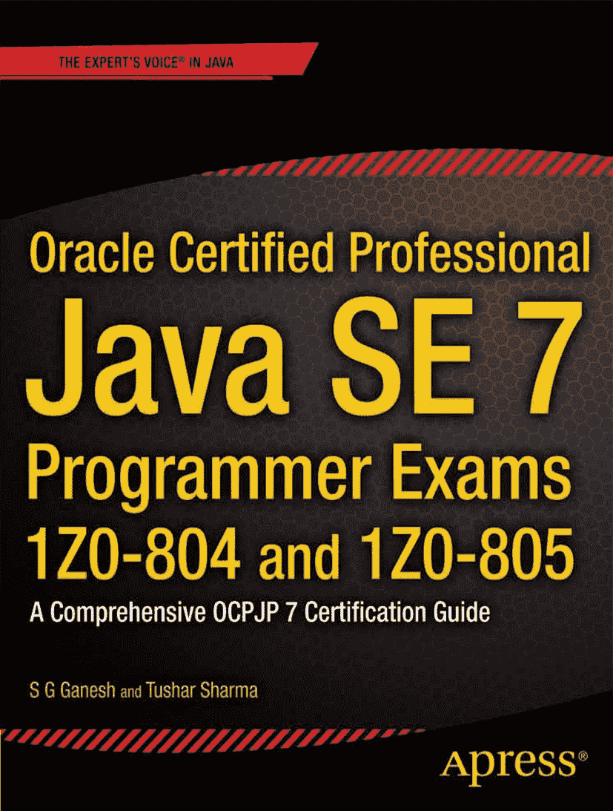


Oracle Certified Professional Java SE 7 Programmer Exams 1Z0-804 and 1Z0-805

OCPJP 7 认证全面指南


S G Ganesh

Tushar Sharma


Oracle Certified Professional Java SE 7 Programmer Exams 1Z0-804 and 1Z0-805

版权所有 © 2013 由 SG Ganesh、Tushar Sharma 持有

本作品受版权保护。出版商保留所有权利，无论涉及全部或部分材料，特别是翻译、重印、重用插图、朗诵、广播、微缩胶片复制或以任何其他物理方式复制，以及电子适配、计算机软件或现在已知或未来开发的类似或不同方法进行的信息传输或存储检索。与评论或学术分析相关的简短摘录，或专门为在计算机系统上输入和执行而提供的材料（仅供购买者独家使用）不受此法律限制。本出版物或其部分的复制仅允许在出版商所在地现行版权法的规定下进行，且使用许可必须始终从 Springer 获取。使用许可可通过 Copyright Clearance Center 的 RightsLink 获取。违反者将根据相应版权法被起诉。

ISBN-13（平装本）：978-1-4302-4764-7

ISBN-13（电子版）：978-1-4302-4765-4

本书中可能出现商标名称、标识和图像。我们不会在每次出现商标名称、标识或图像时都使用商标符号，而是仅以编辑方式使用这些名称、标识和图像，以维护商标所有者的利益，无意侵犯商标权。

本出版物中使用的商品名称、商标、服务标志及类似术语，即使未明确标识，也不应被视为对其是否受专有权利保护的表达意见。

尽管本书中的建议和信息在出版时被认为是真实准确的，但作者、编辑和出版商均不对可能出现的任何错误或遗漏承担法律责任。出版商对本书所含内容不作任何明示或暗示的保证。

总裁与出版商：Paul Manning

首席编辑：Saswata Mishra

技术审校：B V Kumar

编辑委员会：Steve Anglin、Ewan Buckingham、Gary Cornell、Louise Corrigan、Morgan Ertel、Jonathan Gennick、Jonathan Hassell、Robert Hutchinson、Michelle Lowman、James Markham、Saswata Mishra、Matthew Moodie、Morgan Ertel、Jeff Olson、Jeffrey Pepper、Douglas Pundick、Ben Renow-Clarke、Dominic Shakeshaft、Gwenan Spearing、Matt Wade、Tom Welsh

协调编辑：Jill Balzano

文字编辑：Mary Behr

排版：SPi Global

索引编制：SPi Global

插图制作：SPi Global

封面设计：Anna Ishchenko

本书通过 Springer Science+Business Media New York 在全球图书贸易中发行，地址：233 Spring Street, 6th Floor, New York, NY 10013。电话：1-800-SPRINGER，传真：(201) 348-4505，电子邮件：`orders-ny@springer-sbm.com`，或访问 `www.springeronline.com`。

如需翻译信息，请发送电子邮件至 `rights@apress.com`，或访问 `www.apress.com`。

Apress 及 friends of ED 的书籍可批量购买用于学术、企业或促销用途。大多数图书也提供电子版及许可证。如需更多信息，请参考我们的特殊批量销售–电子书许可网页：`www.apress.com/bulk-sales`。

作者在本文中引用的任何源代码或其他补充材料，读者可在 `www.apress.com` 获取。有关如何查找本书源代码的详细信息，请访问 `www.apress.com/source-code`。

献给我了不起的妈妈

——Ganesh

献给我关怀备至的父母、挚爱的妻子和可爱的儿子

——Tushar

内容概览


关于作者

关于技术审校

致谢

引言

 第 1 章：OCPJP 7 考试：常见问题解答

 第 2 章：预测试

 第 3 章：Java 类设计

 第 4 章：高级类设计

 第 5 章：面向对象设计原则

 第 6 章：泛型与集合

 第 7 章：字符串处理

 第 8 章：Java I/O 基础

 第 9 章：Java 文件 I/O (NIO.2)

 第 10 章：使用 JDBC 构建数据库应用程序

 第 11 章：异常与断言

 第 12 章：本地化

 第 13 章：线程

 第 14 章：并发

 第 15 章：OCPJP 7 快速复习

 附录 A：考试主题

 附录 B：模拟测试 – 1

 附录 C：模拟测试 – 2

索引

目录

 关于作者

 关于技术审校

 致谢

 引言

 第 1 章：OCPJP 7 考试：常见问题解答

Oracle Java 认证：概述

常见问题 1. Oracle Java 认证考试有哪些不同级别？

常见问题 2. 你能比较一下与 OCAJP 7 和 OCPJP 7 认证相关的 1Z0-803、1Z0-804 和 1Z0-805 考试规范吗？

常见问题 3. OCAJP 7 认证是通过 1Z0-804 考试获得 OCPJP 7 认证的先决条件。这是否意味着我必须先参加 OCAJP 7 考试，然后才能参加 OCPJP 7 考试？

常见问题 4. OCPJP 7 是其他 Oracle 认证考试的先决条件吗？

常见问题 5. 我应该参加 OCPJP 7 还是 OCPJP 6 考试？

常见问题 6. Oracle OCPJP 7 考试与 OCPJP 6 和 OCPJP 5 考试（以及之前的 Sun 版本 SCJP 6 和 SCJP 5）有何不同？

OCPJP 7 考试

常见问题 7. OCPJP 7 考试有多少道题？

常见问题 8. OCPJP 7 考试的时长是多少？

常见问题 9. OCPJP 7 考试的费用是多少？

常见问题 10. OCPJP 7 考试的及格分数是多少？

常见问题 11. OCPJP 7 考试会问哪些类型的问题？

常见问题 12. OCPJP 7 考试测试什么内容？


常见问题 13：我做了五年 Java 程序员，需要准备 OCPJP 7 考试吗？

常见问题 14：如何准备 OCPJP 7 考试？

常见问题 15：如何判断自己已准备好参加 OCPJP 7 考试？

参加 OCPJP 7 考试

常见问题 16：有哪些报名考试的方式？

常见问题 17：如何注册考试、预约考试日期和时间，并参加考试？

常见问题 18：考试前和考试当天需要记住哪些关键事项？

 第 2 章：预测试

OCPJP 7 考试：预测试

答案与解析

预测试后评估

 第 3 章：Java 类设计

面向对象编程基础

FunPaint 应用：一个示例

面向对象编程原理

类基础

对象创建

构造方法

访问修饰符

重载

方法重载

构造方法重载

重载解析

要点记忆

继承

运行时多态

类型转换

Java 包

使用包

总结

 第 4 章：高级类设计

抽象类

要点记忆

使用“final”关键字

最终类

最终方法和变量

要点记忆

使用“static”关键字

静态块

要点记忆

嵌套类的类型

静态嵌套类（或接口）

内部类

局部内部类

匿名内部类

枚举数据类型

要点记忆

总结

 第 5 章：面向对象设计原则

接口

声明和使用接口

抽象类与接口

对象组合

组合与继承

设计模式

单例设计模式

工厂设计模式


数据访问对象（DAO）设计模式

小结

 第 6 章：泛型与集合

泛型

使用 Object 类型与类型安全

使用 Object 类 vs. 泛型

创建泛型类

菱形语法

原始类型与泛型类型的互操作性

泛型方法

泛型与子类型

通配符参数

要点回顾

集合框架

为何需要可复用类？

集合框架的基本组件

算法（Collections 类）

Arrays 类

要点回顾

小结

泛型

集合框架

 第 7 章：字符串处理

处理字符串

字符串搜索

字符串解析

正则表达式

理解正则表达式符号

Java 中的正则表达式支持

字符串格式化

格式说明符

要点回顾

小结

 第 8 章：Java I/O 基础

从控制台读写

理解 Console 类

使用流读写文件

字符流与字节流

字符流

字节流

要点回顾

小结

 第 9 章：Java 文件 I/O（NIO.2）

I/O API 简史

使用 Path 接口

获取路径信息

比较两个路径

使用 Files 类

检查文件属性与元数据

复制文件

移动文件

删除文件

遍历文件树

重温文件复制

查找文件

监视目录变化

要点回顾

小结

 第 10 章：使用 JDBC 构建数据库应用程序

JDBC 简介

JDBC 的架构


两层与三层 JDBC 架构

JDBC 驱动程序类型

设置数据库

使用 JDBC 驱动程序连接数据库

Connection 接口

连接数据库

查询与更新数据库

Statement

执行事务

RowSet 接口

总结

定义 JDBC API 的布局

使用 JDBC 驱动程序连接数据库

更新与查询数据库

自定义 JDBC 的事务行为并提交事务

使用 JDBC 4.1 的 RowSetProvider、RowSetFactory 和 RowSet 接口

 第 11 章：异常与断言

异常处理简介

抛出异常

未处理的异常

Try-with-Resources

关闭多个资源

要点记忆

异常类型

Exception 类

RuntimeException 类

Error 类

Throws 子句

要点记忆

自定义异常

断言

Assert 语句

如何不使用断言

总结

 第 12 章：本地化

简介

区域设置

Locale 类

资源包

使用 PropertyResourceBundle

使用 ListResourceBundle

加载资源包

资源包的命名约定

针对本地文化进行格式化

NumberFormat 类

DateFormat 类

要点记忆

总结

 第 13 章：线程

并发编程简介

重要的线程相关方法

创建线程

异步执行

线程的状态

“可运行”状态中的两种状态

并发访问问题

数据竞争

线程同步

死锁

其他线程问题


等待/通知机制

更多线程状态

总结

 第 14 章：并发

使用 java.util.concurrent 集合

信号量

倒计时锁存器

交换器

循环屏障

相位器

并发集合

应用原子变量和锁

原子变量

锁

条件

使用执行器和线程池

执行器

Callable、Executors、ExecutorService、ThreadPool 和 Future

线程工厂

ThreadLocalRandom 类

TimeUnit 枚举

使用并行 Fork/Join 框架

Fork/Join 框架的有用类

使用 Fork/Join 框架

要点回顾

总结

 第 15 章：OCPJP 7 快速复习

第 3 章：Java 类设计

第 4 章：高级类设计

第 5 章：面向对象设计原则

第 6 章：泛型和集合

第 7 章：字符串处理

第 8 章：Java I/O 基础

第 9 章：Java 文件 I/O (NIO.2)

第 10 章：使用 JDBC 构建数据库应用程序

第 11 章：异常和断言

第 12 章：本地化

第 13 章：线程

第 14 章：并发

 附录 A：考试主题

OCPJP7 考试 (1Z0-804，即 Java SE 7 Programmer II) 主题

1\. Java 类设计 (G&S 第 3 章)

2\. 高级类设计 (G&S 第 4 章)

3\. 面向对象设计原则 (G&S 第 5 章)

4\. 泛型和集合 (G&S 第 6 章)

5\. 字符串处理 (G&S 第 7 章)

6\. 异常和断言 (G&S 第 11 章)

7\. Java I/O 基础 (G&S 第 8 章)

8\. Java 文件 I/O (NIO.2) (G&S 第 9 章)

9\. 使用 JDBC 构建数据库应用程序 (G&S 第 10 章)

10\. 线程 (G&S 第 13 章)

11\. 并发 (G&S 第 14 章)

12\. 本地化 (G&S 第 12 章)

OCPJP 7 考试 (1Z0-805，即升级到 Java SE 7 Programmer) 主题

1\. 语言增强 (G&S 第 6、11 章)


2\. 设计模式（G&S 第 5 章）

3\. 使用 JDBC 的数据库应用（G&S 第 10 章）

4\. 并发（G&S 第 13、14 章）

5\. 本地化（G&S 第 12 章）

6\. Java 文件 I/O（NIO.2）（G&S 第 9 章）

 附录 B：模拟测试 – 1

答题卡

答案与解析

 附录 C：模拟测试 – 2

答题卡

答案与解析

索引

关于作者

**S G Ganesh** 是西门子企业研究与技术中心（班加罗尔）代码质量管理领域的实践者。他曾任职于惠普的 C++编译器团队，并曾是 C++标准化委员会的成员。他的兴趣领域包括面向对象设计、设计模式和编程语言。他是软件工程认证讲师（IEEE 认证），并持有 OCPJP 7 认证。

**Tushar Sharma** 是西门子企业研究与技术中心（印度）的研究员和实践者。他获得了印度理工学院马德拉斯分校（IIT–Madras）的硕士学位。他的兴趣包括面向对象软件设计、面向对象编程、重构和设计模式。他持有 OCPJP 7 认证。

关于技术审校

**B V Kumar 博士** 目前是 Altius Inc 的总监，负责为企业客户提供基于技术的服务。Kumar 博士拥有印度理工学院坎普尔分校的技术硕士学位和印度理工学院克勒格布尔分校的博士学位。他在信息技术领域拥有超过 22 年的各级别经验，曾任职于 Computer Vision Corporation（新加坡）、Parametric Technologies（韩国首尔）、Sun Microsystems（印度）和 Infosys Technologies Ltd 等公司。

在创办 Altius Inc 之前，Kumar 博士曾担任 Cognizant Technology Solutions（印度）全球技术办公室的总监和首席架构师。他在企业技术解决方案领域工作了超过 12 年，专注于 Java、JEE、Web 服务、面向服务架构和开源技术。他还通过 Joomla 和 Drupal 等应用以及 Android 和 iPhone 等移动平台从事内容管理系统方面的工作。

作为 Altius Inc 的总监，Kumar 博士目前专注于技术咨询、技术培训与推广、社区发展以及为企业客户提供项目支持。Kumar 博士在 IT 领域拥有两项专利，并在国内外期刊和会议上发表过多篇技术论文。他还合著了以下信息技术书籍：《J2EE 架构》（2007 年）、《Web 服务第二版：导论》（2011 年）、《使用 Java EE 实现 SOA》（2009 年）以及《安全 Java：Web 应用开发》（2010 年）。Kumar 博士目前正在撰写 Java EE 7 架构的第二版。

致谢

我们首先要衷心感谢我们的策划编辑 Saswata Mishra，他从本书的概念构思到出版阶段都发挥了关键作用。Saswata，感谢您的出色支持——您让撰写本书成为一次愉快的体验！

我们特别感谢本书的文字编辑 Robert Hutchinson。Robert 在提升本书呈现质量方面发挥了重要作用。他对细节的关注令人惊叹。Robert，感谢您将我们粗糙的初稿打磨成可出版的稿件。

我们还要特别感谢我们的技术审校 B V Kumar 博士。他细致而严谨的审阅在提升本书的技术质量方面发挥了关键作用。

我们谨向整个 Apress 团队致以诚挚的谢意，特别是 Jeffrey Pepper、Jill Balzano 女士、Mary Behr 女士和 Anna Ishchenko 女士，感谢他们在本书出版过程中做出的卓越贡献。

我们两人都花费了无数个小时，在深夜、周末和节假日撰写章节。当各自家中的孩子们吵闹着要关注时，正是我们配偶的支持才使本书的撰写成为可能。

——S G Ganesh 和 Tushar Sharma

引言

本书是一本为准备 OCPJP 7 考试而编写的全面指南。本书涵盖了 OCPJP 两项考试（*Java SE 7 Programmer II*（1Z0-804 考试）和*Upgrade to Java SE 7 Programmer*（1Z0-805 考试））的考试目标。本书的主要目标是帮助读者准备并轻松通过 OCPJP 7 考试。

本书涵盖了*Java SE 7 Programmer II*（1Z0-804 考试）的所有考试主题。本书的章节和章节内容与考试目标及子主题一一对应。这种章节与考试目标之间的一一对应关系确保我们只涵盖所需广度和深度的主题——不多也不少。如果您正在准备*Upgrade to Java SE 7 Programmer*（1Z0-805 考试），请参阅附录 A 了解考试主题如何映射到本书各章节的说明。

读者将会发现大量的样题，包括一份预测试、每章中的众多样题以及两份完整的模拟测试。这些样题不仅帮助读者为参加考试做准备，还能让读者对考试中会遇到的内容有切合实际的预期。

本书有许多特点，旨在以流畅的、以示例驱动的形式呈现内容，以提升您的阅读和学习体验。例如，各章节提供了大量的编程和现实世界示例，帮助您内化所介绍的每一个概念。此外，在每一章中，我们使用视觉提示（如警告标志和考试提示）来引导您注意那些与 OCPJP 7 考试特别相关的重要且有趣的概念方面。

先决条件

由于 OCAJP 7（即*Java SE 7 Programmer* I/1Z0-803）考试是更全面的 OCPJP 7 考试（1Z0-804）的先决条件，我们假设读者已经熟悉该语言的基础知识。我们仅关注 OCPJP 7 的考试目标，前提是读者具备 Java 的实用知识。

目标读者

如果您符合以下任一情况，本书适合您：

*   如果您是学生或 Java 程序员，渴望攻克 OCPJP 7 考试。
*   如果您已经通过了 OCPJP 7 的任何旧版本考试（例如 SCJP 5 考试）。本书将为您准备*Upgrade to OCPJP 7*考试（1Z0-805）。
*   如果您是 OCPJP 7 考试的培训师。您可以将本书用作 OCPJP 7 考试准备的培训材料。
*   如果您只是想复习 Java 编程知识或更好地理解各种 Java API。

但请注意，本书既不是学习 Java 的教程，也不是全面的 Java 参考书。

本书阅读路线图

为了充分利用本书，我们建议您遵循以下步骤：

**第 0 步：** 确保您的机器上已安装 JDK 7，并且能够编译和运行 Java 程序。

**第 1 步：** 首先阅读第 1 章中的常见问题解答，熟悉考试内容（您可以跳过不相关的问题或您已经知道答案的问题）。


**步骤 2：** 查看考试主题（附录 A），并标记你不熟悉或没有把握的主题。阅读你为备考而标记的主题所对应的章节或小节。

**步骤 3：** 完成第 2 章的预测试。如果你正确回答了某个考试章节的所有问题，你可以考虑跳过阅读该章节。对于你得分不高的考试主题，请标记这些章节并优先阅读。在阅读章节时，尽可能多地尝试示例程序。

**步骤 4：** 一旦你觉得自己已经准备好参加考试，就进行第一次模拟测试（附录 B）。如果你没有通过，请回到你薄弱的章节，重新阅读，并尝试更多与这些主题相关的代码。当你信心十足时，尝试第二次模拟测试（附录 C）。如果你准备充分，应该能够通过。

**步骤 5：** 根据你在模拟测试中的表现，注册并参加考试。考试前一天，请阅读第 15 章“OCPJP 7 快速复习”。

关于本书中的代码示例

本书中的所有程序都是独立的程序（包含必要的 import 语句）。你可以从 `www.apress.com/9781430247647` 下载这些程序的源代码。

我们已在两个编译器中测试了本书中的代码示例：Oracle 的 Java 编译器 JDK 7（javac）和 Eclipse Java 编译器（ecj）。对于错误消息，我们提供了 javac 的错误消息。使用支持 Java 7 的 Java 编译器和 JVM 非常重要。

Java 是一种平台无关的语言，但某些特性在特定平台上解释得更好。由于 Windows 是当今使用最广泛的操作系统，一些编程示例（特别是 NIO.2 章节中的某些程序）是针对 Windows 操作系统编写的。你可能需要对程序进行少量修改，才能让它们在其它操作系统（Linux、Mac OS 等）上运行。

联系我们

如有任何疑问、建议或更正，请随时通过 `sgganesh@gmail.com` 或 `tusharsharma@ieee.org` 联系我们。

第 1 章


OCPJP 7 考试：常见问题解答

OCPJP 7 考试这个单一缩写代表两个独立但内容一致的考试：

*   Java SE 7 Programmer II 考试（考试编号 1Z0-804）
*   升级至 Java SE 7 Programmer 考试（考试编号 1Z0-805）

这两门考试是获得同一认证的替代途径。通过 1Z0-804 和 1Z0-805 考试的考生均有资格获得相同的证书：Oracle 认证专家，Java SE 7 程序员（OCPJP 7）。本书旨在帮助你准备 OCPJP 7 考试。

1Z0-804 考试大纲（完整内容见附录 A）包含十二个主题，对应本书第 3 章至第 14 章的标题和内容。本书同样适用于准备 1Z0-805 考试，其六个主题对应本书第 5 章至第 6 章以及第 9 章至第 14 章（参见附录 A）。

在本章中，我们将解答你在准备 OCPJP 7 考试时可能会想到的常见问题。同样，“OCPJP 7 考试”一词应理解为包含该考试的两种变体，即 1Z0-804 和 1Z0-805。本书提供的学习课程、模拟试题和练习测试将帮助你同样出色地准备其中任何一种考试。你选择参加 OCPJP 7 考试的哪种变体，将取决于你现有的资质，如下所述。

我们在本章中提供的常见问题解答涉及诸如 OCPJP 7 认证在 Oracle Java 认证体系中的位置、OCPJP 7 考试的难度和先决条件、OCPJP 7 考试大纲涵盖的主题范围、备考深度，以及注册和参加考试的细节等问题。广义上讲，本章包含三个部分：

*   *Oracle Java 认证* *：概述* **：** 常见问题 1–6 概述了 Oracle 的各种 Java 考试及其对应的 Java 认证。它特别关注 OCAJP 7 考试，因为 Oracle 认证助理，Java SE 7 程序员（OCAJP 7）证书是通过 1Z0-804 考试获得 OCPJP 7 认证的先决条件。
*   *OCPJP 7 考试*：常见问题 7–15 涉及 OCPJP 7 考试的目标、考试题型以及备考细节。
*   *参加 OCPJP 7 考试*：常见问题 16、17 和 18 涵盖了注册考试的具体细节、考试当天需要做的各种事情以及实际参加考试的过程。

Oracle Java 认证：概述

常见问题 1. Oracle Java 认证考试有哪些不同的级别？

表 1-1 展示了 Oracle 考试的四个递进专业级别（助理、专家、大师和大师级），并附有这些级别的 Java 认证示例，以及相应的考试名称和编号。

表 1-1. Oracle 认证级别及对应的 Java 考试示例（OCPJP 7 考试，加粗显示）

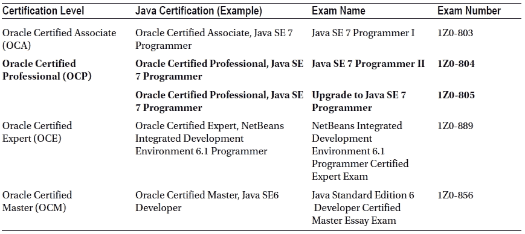

从图形上看，Oracle 提供的 Java 考试及其路径可以在图 1-1 中看到。

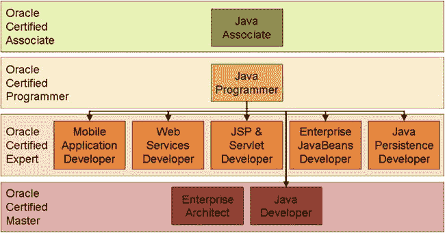

图 1-1. Oracle 提供的 Java 认证路径

常见问题 2. 你能比较一下 1Z0-803、1Z0-804 和 1Z0-805 考试在 OCAJP 7 和 OCPJP 7 认证方面的规格吗？

可以，请参见表 1-2。

表 1-2. 通向 OCAJP 7 和 OCPJP 7 认证的 Oracle 考试比较


**注 1**：在费用行中，给出的考试美元费用是近似值，实际费用因参加考试所在国家的货币而异：美国 300 美元，英国 202 英镑，印度 8,500 卢比等。

**注 2**：考试主题行仅列出了顶层主题。请注意，1Z0-804 和 1Z0-805 考试共享某些高级主题名称——例如“Java 文件 I/O (NIO.2)”、“并发”和“本地化”——但两个考试的子主题并不完全相同。1Z0-804 和 1Z0-805 考试的子主题列在附录 A 中。

常见问题 3. 通过 1Z0-804 考试获得 OCPJP 7 认证，OCAJP 7 认证是先决条件。这是否意味着我必须先参加 OCAJP 7 考试，然后才能参加 OCPJP 7 考试？

不，认证要求可以按任何顺序满足。你可以先参加 OCPJP 7 考试，再参加 OCAJP 7 考试，但只有在你通过了 1Z0-803 和 1Z0-804 两门考试后，才能获得 OCPJP 7 认证——除非你有资格参加并通过 1Z0-805 考试，该考试不要求 OCAJP 7 认证作为先决条件。

常见问题 4. OCPJP 7 是其他 Oracle 认证考试的先决条件吗？

是的，OCPJP 7 是许多其他考试的先决条件，例如：

*   Java 企业版 5 Web 组件开发人员认证专家考试（1Z0-858）
*   Oracle 认证大师，Java SE 6 开发人员考试（1Z0-855 和 1Z0-856）

常见问题 5. 我应该参加 OCPJP 7 还是 OCPJP 6 考试？

虽然你仍然可以参加旧版认证考试，例如 OCPJP 6，但 OCPJP 7 是值得拥有的最佳专业证书。

常见问题 6. Oracle OCPJP 7 考试与 OCPJP 6 和 OCPJP 5 考试（以及之前的 Sun 版本 SCJP 6 和 SCJP 5）有何不同？


*简短回答*：OCPJP 7 考试难度更大，涵盖的主题也更多。

*详细回答*：以下是 OCPJP 7 考试（1Z0-804）与 OCPJP 6 和 OCPJP 5 考试（分别为 1Z0-851 和 1Z0-853）以及 SCJP 5 和 SCJP 6 考试（前者是 Sun Microsystems 版本的 OCPJP 6 和 OCPJP 5 考试，可获得 Sun 认证 Java 程序员 6 和 5 认证）之间差异的简要列表：

*   与之前的 SCJP 6/SCJP 5 考试一样，OCPJP 6 和 5 考试涵盖语言基础知识以及一些涉及字符串、数组等的常见 API。在 Java SE 7 级别，这些主题中的大部分已移至 OCAJP 7 考试，该考试是通过 1Z0-804 考试路径获得 OCPJP 7 认证的先决条件。请注意，OCAJP 7 中的某些问题与 OCPJP 7 问题的难度级别相同。
*   OCPJP 7 考试涵盖的主题比 OCPJP 6 和 5 考试及其 Sun 前身更多，包括 JDBC、本地化、NIO.2 和并发 API。
*   OCPJP 7 还涵盖了 Java SE 7 的新特性，包括 try-with-resources 语句、JDBC 中的新 API、基于字符串的 switch 和二进制字面量。
*   OCPJP 7 考试中的问题比 OCPJP 6 和 5 考试及其 Sun 前身中的问题更难。
*   OCPJP 7 考试只有选择题，而已停考的 SCJP 考试还有交互式问题（拖放、匹配选项等）。

OCPJP 6 和 OCPJP 7 考试之间的差异总结在表 1-3 中。

表 1-3。通往 OCPJP 6 和 OCPJP 7 认证的 Oracle 考试对比

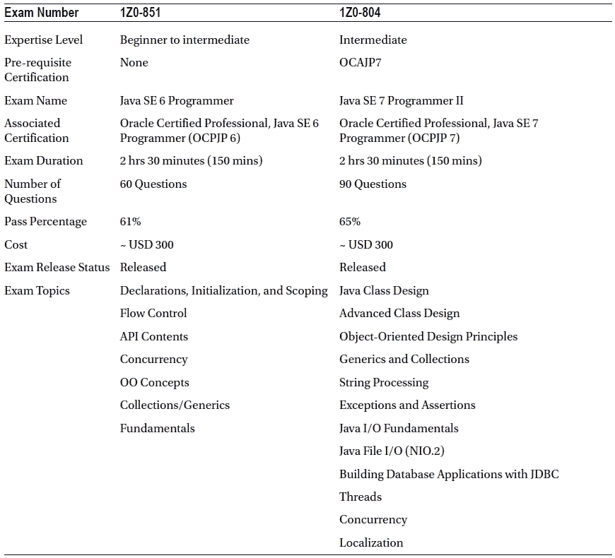

OCPJP 7 考试

常见问题 7. OCPJP 7 考试有多少道题？

在 OCPJP 7 考试的 1Z0-804 和 1Z0-805 两个版本中，都有 90 道题。

常见问题 8. OCPJP 7 考试的时长是多少？

OCPJP 7 考试的 1Z0-804 和 1Z0-805 版本分别持续 150 分钟和 180 分钟（2 小时 30 分钟和 3 小时）。

常见问题 9. OCPJP 7 考试的费用是多少？

OCPJP 7 考试的 1Z0-804 和 1Z0-805 版本费用相同，但该费用因您参加考试所在国家的货币而异：目前在美国为 300 美元，在英国为 202 英镑，在印度为 8,500 卢比，在欧元区国家为 238 欧元，等等。（考试费用在 Oracle 网站上以查看者的当地货币显示。）

常见问题 10. OCPJP 7 考试的及格分数是多少？

OCPJP 7 考试的 1Z0-804 和 1Z0-805 版本的及格分数分别为 65% 和 60%。（答错不扣分。）

常见问题 11. OCPJP 7 考试中会问哪些类型的问题？

OCPJP 7 考试中的一些问题会测试您的概念性知识，而不涉及特定的程序或代码段。但大多数问题是以下类型的编程问题：

*   给定一个程序或代码段，输出或预期行为是什么？
*   哪个（些）选项可以无错误编译或给出所需输出？
*   哪个（些）选项构成了给定 API（尤其是新引入的 API，例如与 JDBC 新类相关的 API）的正确用法？

所有问题都是选择题。大多数问题提供四到五个选项，但有些问题有六到七个选项。许多问题被设计为具有一组多个正确答案。此类问题会明确标记（通常在考试屏幕的左上角）您需要选择的选项数量。

考试问题并不局限于仅来自考试大纲中的主题。例如，您可能会遇到关于 Java 基础知识（OCAJP 大纲中的一个主题）的问题，涉及异常处理的基础知识和包装类型的使用。您也可能会遇到与考试大纲主题相关但未在其中明确说明的问题。例如，序列化和 `transient` 关键字的使用在 OCPJP 考试大纲中没有明确提及，但它们可能会出现在实际考试中，因为它们与读写流有关——而其中一个是 `ObjectStreams`，它与序列化有关！

给定的问题不限于只测试一个主题。有些问题被设计为用一个问题测试多个主题。例如，您可能会发现一个测试线程和内部类概念及其相互关联的问题。

常见问题 12. OCPJP 7 考试测试什么？

OCPJP 7 考试测试您对开发实际程序所必需的 Java 语言特性和 API 的理解。考试侧重于以下领域：

*   *对解决问题有用的语言概念*：考试不仅测试您对语言特性如何工作的了解，还涵盖您对语言特性的细节和边界情况的理解。例如，您不仅需要理解 Java 中的泛型特性，还需要理解与类型擦除、将遗留容器与泛型容器混合等相关的问题。
*   *Java API*：考试测试您对使用 Java 类库的熟悉程度，以及一些不常见的方面或边界情况，例如：

*   `Deque` 的 `remove()` 方法是做什么的？（答案：它从底层 deque 实例中移除第一个元素。）
*   如果 `sleep()` 方法被中断会发生什么？（答案：您将收到一个 `InterruptedException`。）

*   *底层概念*：例如，考试可能会测试您对序列化如何工作、重载和重写之间的区别、自动装箱和拆箱如何与泛型相关、JDBC 中不同类型的驱动程序、多线程编程如何依赖于平台、线程的不同类型的活性问题等的理解。

尽管考试不测试记忆能力，但有些问题假定您对关键元素有死记硬背的知识，例如：

*   用于与 `SimpleDateFormat` 类一起创建自定义日期和时间格式（“字符串模式”）的字母。
*   用于在正则表达式中形成模式字符串的字符。
*   用于 `String` 的 `format()` 方法和 `printf()` 中的格式说明符及其含义。

常见问题 13. 我已经做了五年的 Java 程序员。我需要准备 OCPJP 7 考试吗？

*简短回答：* 您有工作经验是好事，但您仍然需要准备 OCPJP 7 考试。

*详细回答：* 无论您拥有多少实际编程经验，有两个原因说明您应该为这次考试做准备以提高通过的机会：


*   *你可能对考试中的某些主题并不熟悉*。Java 博大精深，你可能没有机会接触到考试涵盖的每一个主题。例如，如果你从未处理过所参与应用程序的本地化方面，你可能对本地化并不熟悉。或者你的工作可能不需要你使用 JDBC。又或者你一直从事单线程程序开发，那么多线程编程对你来说可能是个新领域。此外，OCPJP 7 考试强调 Java 7，你可能尚未接触过诸如 NIO.2、新的并发 API 以及 try-with-resource 语句等增强功能这类 Java 7 主题。
*   *你可能不记得那些不常见的方面或边界情况。*无论你经验多么丰富，编程时总会遇到意想不到的情况。OCPJP 7 考试不仅测试你对常规特性的知识和技能，还考察你对不常见方面或边界情况的理解，例如多线程代码的行为，以及同时涉及重载和重写时泛型的使用。因此，你必须刻苦钻研那些在工作中很少遇到的病态情况。

在你能自信地通过 OCPJP 7 考试之前，衡量你在各个主题上需要多少准备工作的一个好方法是，先做一下第 2 章中的预测试，以及附录 B 和 C 中的两套完整样题。

常见问题 14. 我该如何准备 OCPJP 7 考试？

学习这本书。此外，

*   *编码，编码，再编码！*编写大量的小程序，进行实验，并从错误中学习。
*   *阅读，阅读，再阅读！*阅读本书，尤其要阅读 Oracle 网站上的教程和参考资料。

*   *Oracle 的免费在线 Java 教程*：访问 `http://docs.oracle.com/javase/tutorial/` 上的 Java 教程，以及 `http://docs.oracle.com/javase/tutorial/extra/certification/javase-7-programmer2.html` 上的 OCPJP 7 教程。
*   *Java 文档*：Java API 文档是一个信息宝库。该文档可在线获取（参见 `http://docs.oracle.com/javase/7/docs/api/`），并作为 Java SDK 的一部分提供。如果你无法立即访问互联网，你可能会发现 javac 的 `-Xprint` 选项很方便。要打印 `String` 类的文本表示形式，请键入完全限定名称，如下所示：

```
    javac -Xprint java.lang.String
    ```

这将在控制台中打印 `String` 类中的成员列表。

*   *阅读，编码，阅读，编码！*在阅读和编码之间循环往复，使你的书本知识与实际应用相互促进。这样，你不仅会知道一个概念，而且会*理解*它。
*   *把大部分精力集中在你最不擅长的主题上。*按照从 1 到 10 的升序，对 OCPJP 7 考试中的每个主题给自己打分。对所有你自评分数为 8 分或以下的主题进行补救性准备。

常见问题 15. 我如何知道我已经准备好参加 OCPJP 7 考试了？

在模拟真实考试的条件下，完成附录 B 中给出的两套完整的 OCPJP 7 样题：严格遵守 2.5 小时的时间限制；不要休息；不要参考任何书籍或网站。如果你的得分在 75% 或以上（1Z0-804 和 1Z0-805 的实际考试通过分数分别为 65% 和 60%），你很可能通过实际考试。

参加 OCPJP 7 考试

常见问题 16. 我有哪些注册考试的选择？

对于 OCPJP 7 考试，你有三种注册选择：

*   在 Pearson VUE 网站上注册并付款。
*   从 Oracle 购买考试券，然后在 Pearson VUE 网站上自行注册。
*   在 Oracle 考试中心 (OTC) 注册并付款（如果你所在地区有 OTC 的话）。

常见问题 17. 我如何注册考试、安排考试日期和时间，以及参加考试？

**选项 1：在 Pearson VUE 网站上注册并付款** **，步骤如下：**

*   **第 1 步。** 访问 `www.pearsonvue.com/oracle/`（如果你从 Oracle 认证页面点击第一个选项，你将被重定向到此页面）。在“安排考试”部分点击“在线安排”。
*   **第 2 步。** 选择“登录”。在“您计划参加哪种类型的考试”部分点击“监考”。选择此考试为 `"信息技术 (IT)"`  `"Oracle"`  `"监考"`。然后系统会要求您登录。
*   **第 3 步。** 登录您在 Pearson 网站上的网络帐户。如果您没有帐户，请创建一个；您将通过提供的电子邮件获得用户名和密码。首次登录时，您需要更改密码并设置安全问题及其答案。完成此操作后，您就可以安排考试了。
*   **第 4 步。** 登录后，您将看到可供选择的 Oracle 考试列表。选择以下之一：

*   1Z0-803，Java SE 7 Programmer I（即 OCAJP 7 考试）
*   1Z0-804，Java SE 7 Programmer II（即 OCPJP 7 考试）
*   1Z0-805，升级到 Java SE 7 Programmer（即 OCPJP 7 考试）

这些考试是英文的。（如果您愿意并且列表中有其他语言，您可以选择其他语言）。此页面还将显示考试费用。从列表中选择相关考试，例如“1Z0-804 (Java SE 7 Programmer II)”，然后单击“下一步”。

*   **第 5 步。** 现在您需要选择您的考试地点。选择 `国家`  `城市`  `州/省`，系统将显示您附近的考试地点。每个中心都会有一个信息图标：点击它可获取地址和路线。选择最多四个靠近您所在地的考试中心，然后单击“下一步”。
*   **第 6 步。** 选择一个考试中心，并选择预约的日期和时间。页面将显示可用的日期和时间段；选择最适合您的一个。如果您有考试券、Oracle 大学优惠券或 Oracle 促销代码，请在此处输入。
*   **第 7 步。** 从可用的付款方式中选择（通常的方式是使用信用卡付款）并支付考试费用。在支付费用之前，请确保您已选择了正确的考试、合适的考试中心和日期/时间。
*   **第 8 步。** 完成！您将通过电子邮件收到预约确认和付款收据。

**选项 2：从 Oracle 购买考试券** **并在 Pearson VUE 网站上注册。**

您可以从 Oracle 购买通用考试券，然后在 Pearson 网站上使用。如果您居住在美国，费用为 300 美元；如果您居住在其他地方，则以当地货币计价。要从 Oracle 购买考试券，请选择“OU Java、Solaris 和其他 Sun 技术考试电子券”。如果您没有 Oracle 帐户，系统会要求您创建一个。创建帐户后，确认客户类型、客户联系信息并付款。一旦您支付了费用，您就可以在 Pearson VUE 网站上使用电子券。

**选项 3：在线注册并付款** **，亲自前往 Oracle 考试中心 (OTC) 参加考试。**

如果您附近安排了现场考试场次，您可以选择此选项。费用为 300 美元或等值当地货币。

常见问题 18. 在考试前和考试当天，我需要记住哪些关键事项？

考试前：

*   您将收到 Pearson 发送的电子邮件，确认您的预约和付款。查看有关前往考试中心时应携带物品的详细信息。请注意，您至少需要两份带照片的身份证件。
*   考试前，您预订预约的 Pearson 考试中心会给您打电话（不过，这取决于考试中心）。

考试当天：


*   请在考试开始前至少 30 分钟到达考场。考场会提供储物柜用于存放个人物品。
*   出示你的考试安排信息和身份证件，然后完成考试手续，例如签署文件。
*   你将被带到考场内的一台电脑前，并登录考试软件。

考试期间：

*   你将在考试软件屏幕上看到以下内容：

*   角落里的计时器会显示剩余时间
*   你正在作答的当前题目编号
*   一个复选框，用于选择是否稍后回顾该题目
*   一个按钮（标有“回顾”），用于进入回顾界面，你可以在完成考试前重新查看题目。

*   一旦开始，题目会逐一显示。你可以通过勾选复选框来选择答案。如果对某个答案不确定，请选择“回顾”按钮，以便在考试期间的任何时间点重新查看该题。
*   考试期间，你不得咨询任何人，也不得查阅任何印刷或电子材料或程序。

考试结束后：

*   完成考试后，大约半小时左右，你会收到一封电子邮件，其中包含查看成绩的详细信息。
*   无论考试通过与否，你答错的题目所涉及的主题都会随成绩一起提供。但是，不会向你展示答错题目的正确答案。
*   如果你通过了 OCPJP 7 考试，*并且*也满足了适用的认证先决条件（例如，通过 1Z0-804 考试获得 OCPJP 7 认证的先决条件是 OCAJP 认证），则可以从 Oracle 的 CertView 网站（`https://education.oracle.com/certview.html`）下载可打印的证书。
*   如果你考试未通过，可以在 14 天的等待期后重新注册并再次缴费参加考试。

第 2 章


预测试

参加 OCPJP 7 考试的前景在考生心中引发了许多疑问。

*   “考试中会问哪些类型的问题？”
*   “考试涵盖哪些主题？”
*   “问题有多难？”
*   “我怎么知道自己是否准备好参加考试？”
*   “为了通过考试，我需要重点准备哪些主题？”

本章提供了一个*预测试*，旨在具体且可衡量地回答你所有的初步问题。将此预测试作为心理上的“量油尺”，来衡量如果你今天参加考试，通过 OCPJP 7 考试的可能性有多大。此预测试中的问题与你将在 OCPJP 7 考试中遇到的实际问题非常相似。它们分布在 1Z0-804 考试大纲的 12 个主题中。本章末尾的预测试答案与评估工具将帮助你精确识别那些需要重点准备的主题，以确保你在实际考试中取得成功。

以下预测试与 OCPJP 7 考试的唯一显著区别在于题目数量和考试时长。此预测试的配置与 OCPJP 7 考试完全相同，只是时长减半：你需要在 1 小时 15 分钟内回答 45 道题（而不是 2 小时 30 分钟内回答 90 道题）。

那么，让我们开始吧。模拟真实的考试条件。找一个安静的地方，以便你可以在不受打扰或分心的情况下进行此预测试。记录你的开始和结束时间。遵守闭卷规则：在此预测试之前或期间，请勿查阅答案或任何其他印刷、人工或网络资源。

OCPJP 7 考试：预测试

*时间：*1 小时 15 分钟                                                                          *题目数量：* 45

1.  **考虑以下程序：**

```
    class StrEqual {
            public static void main(String []args) {
                   String s1 = "hi";
                   String s2 = new String("hi");
                   String s3 = "hi";
```


```java
if(s1 == s2) {
                           System.out.println("s1 and s2 equal");
                   } else {
                           System.out.println("s1 and s2 not equal");
                   }

if(s1 == s3) {
                           System.out.println("s1 and s3 equal");
                   } else {
                           System.out.println("s1 and s3 not equal");
                   }
            }
    }
    ```

执行该程序时，以下哪个选项提供了其输出结果？

a)

s1 and s2 equal

s1 and s3 equal

b)

s1 and s2 equal

s1 and s3 not equal

c)

s1 and s2 not equal

s1 and s3 equal

d)

s1 and s2 not equal

s1 and s3 not equal

2.  **考虑以下程序：**

```
    class Point2D {
            private int x, y;
            public Point2D(int x, int y) {
                    x = x;
            }

public String toString() {
                    return "[" + x + ", " + y + "]";
            }

public static void main(String []args) {
                    Point2D point = new Point2D(10, 20);
                    System.out.println(point);
            }
    }
    ```

执行该程序时，以下哪个选项提供了其输出结果？

a) point

b) Point

c) [0, 0]

d) [10, 0]

e) [10, 20]

3.  **考虑以下程序：**

```
    class Increment {
            public static void main(String []args) {
                   Integer i = 10;
                   Integer j = 11;
                   Integer k = ++i;         // INCR
                   System.out.println("k == j is " + (k == j));
                   System.out.println("k.equals(j) is " + k.equals(j));
            }
    }
    ```

以下哪个选项正确描述了该程序的行为？

a) 执行时，该程序输出

k == j is false

k.equals(j) is false

b) 执行时，该程序输出

k == j is true

k.equals(j) is false

c) 执行时，该程序输出

k == j is false

k.equals(j) is true

d) 执行时，该程序输出

k == j is true

k.equals(j) is true

e) 编译时，程序会在标记有注释 INCR 的行产生编译错误。

4.  **考虑以下程序：**

```
    class ArrayCompare {
            public static void main(String []args) {
                   int []arr1 = {1, 2, 3, 4, 5};
                   int []arr2 = {1, 2, 3, 4, 5};
                   System.out.println("arr1 == arr2 is " + (arr1 == arr2));
                   System.out.println("arr1.equals(arr2) is " + arr1.equals(arr2));
                   System.out.println("Arrays.equals(arr1, arr2) is " +
                                   java.util.Arrays.equals(arr1, arr2));
            }
    }
    ```

执行该程序时，以下哪个选项提供了其输出结果？

a) arr1 == arr2 is false

arr1.equals(arr2) is false

Arrays.equals(arr1, arr2) is true

b) arr1 == arr2 is true

arr1.equals(arr2) is false

Arrays.equals(arr1, arr2) is true

c) arr1 == arr2 is false

arr1.equals(arr2) is true

Arrays.equals(arr1, arr2) is true

d) arr1 == arr2 is true

arr1.equals(arr2) is true

Arrays.equals(arr1, arr2) is false

e) arr1 == arr2 is true

arr1.equals(arr2) is true

Arrays.equals(arr1, arr2) is true

5.  **考虑以下程序：**

```
    class NullInstanceof {
            public static void main(String []args) {
                   String str = null;
                   if(str instanceof Object) // NULLCHK
                           System.out.println("str is Object");
                   else
                           System.out.println("str is not Object");
            }
    }
    ```

以下哪个选项正确描述了该程序的行为？

a) 该程序会在标记有注释 NULLCHK 的行产生编译错误。

b) 该程序会在标记有注释 NULLCHK 的行产生 NullPointerException。

c) 执行时，该程序将输出以下内容：str is Object。

d) 执行时，该程序将输出以下内容：str is not Object。

6.  **考虑以下程序：**


```
    interface Side { String getSide(); }

class Head implements Side {
            public String getSide() { return "Head "; }
    }

class Tail implements Side {
            public String getSide() { return "Tail "; }
    }

class Coin {
            public static void overload(Head side) { System.out.print(side.getSide()); }
            public static void overload(Tail side) { System.out.print(side.getSide()); }
            public static void overload(Side side) { System.out.print("Side "); }
            public static void overload(Object side) { System.out.print("Object "); }

public static void main(String []args) {
                   Side firstAttempt = new Head();
                   Tail secondAttempt = new Tail();
                   overload(firstAttempt);
                   overload((Object)firstAttempt);
                   overload(secondAttempt);
                   overload((Side)secondAttempt);
            }
    }
    ```

该程序执行后的输出是什么？

a) Head Head Tail Tail

b) Side Object Tail Side

c) Head Object Tail Side

d) Side Head Tail Side

7.  **考虑以下程序：**

```
    class Overloaded {
            public static void foo(Integer i) { System.out.println("foo(Integer)"); }
            public static void foo(short i) { System.out.println("foo(short)"); }
            public static void foo(long i) { System.out.println("foo(long)"); }
            public static void foo(int ... i) { System.out.println("foo(int ...)"); }
            public static void main(String []args) {
                    foo(10);
            }
    }
    ```

以下哪个选项正确描述了该程序的输出？

```
    a) foo(Integer)
    b) foo(short)
    c) foo(long)
    d) foo(int ...)
    ```

8.  **考虑以下程序：**

```
    class Base {
            public static void foo(Base bObj) {
                   System.out.println("In Base.foo()");
                   bObj.bar();
            }
            public void bar() {
                   System.out.println("In Base.bar()");
            }
    }

class Derived extends Base {
            public static void foo(Base bObj) {
                   System.out.println("In Derived.foo()");
                   bObj.bar();
            }
            public void bar() {
                   System.out.println("In Derived.bar()");
            }
    }

class OverrideTest {
            public static void main(String []args) {
                   Base bObj = new Derived();
                   bObj.foo(bObj);
            }
    }
    ```

该程序执行后的输出是什么？

a)

In Base.foo()

In Base.bar()

b)

In Base.foo()

In Derived.bar()

c)

In Derived.foo()

In Base.bar()

d)

In Derived.foo()

In Derived.bar()

9.  **考虑以下程序：**

```
    class CannotFlyException extends Exception {}

interface Birdie {
            public abstract void fly() throws CannotFlyException;
    }

interface Biped {
            public void walk();
    }

abstract class NonFlyer {
            public void fly() { System.out.print("cannot fly ");  }         // LINE A
    }

class Penguin extends NonFlyer implements Birdie, Biped {          // LINE B
            public void walk() { System.out.print("walk "); }
    }

class PenguinTest {
            public static void main(String []args) {
                   Penguin pingu = new Penguin();
                   pingu.walk();
                   pingu.fly();
            }
    }
    ```

以下哪个选项正确描述了该程序的行为？

a) 在注释为 LINE A 的行出现编译错误，因为 `fly()` 没有声明抛出 `CannotFlyException`。

b) 在注释为 LINE B 的行出现编译错误，因为 `fly()` 未定义，因此需要将其声明为抽象方法。

c) 抛出异常 `CannotFlyException` 后崩溃。

d) 执行时，程序打印“walk cannot fly”。

10.  **考虑以下程序：**


```
    class TestSwitch {
            public static void main(String []args) {
                   String [] cards = { "Club", "spade", " diamond ", "hearts" };
                   for(String card : cards) {
                           switch(card) {
                           case "Club" : System.out.print(" club "); break;
                           case "Spade" :  System.out.print(" spade "); break;
                           case "diamond" :  System.out.print(" diamond "); break;
                           case "heart" :  System.out.print(" heart "); break;
                           default: System.out.print(" none ");
                           }
                   }
            }
    }
    ```

以下哪个选项展示了该程序的输出？

a) none  none  none  none

b) club  none  none  none

c) club  spade  none  none

d) club  spade  diamond  none

e) club  spade  diamond  heart

11.  **考虑以下程序：**

```
    class Outer {
            static class Inner {
                    public final String text = "Inner";
            }
    }

class InnerClassAccess {
            public static void main(String []args) {
                    System.out.println(/*CODE HERE*/);
            }
    }
    ```

当用以下哪个表达式替换注释 `/*CODE HERE*/` 处的文本时，会在控制台打印输出“Inner”？

```
    a) new Outer.Inner().text
    b) Outer.new Inner().text
    c) Outer.Inner.text
    d) new Outer().Inner.text
    ```

12.  **考虑以下枚举定义：**

```
    enum Cards { CLUB, SPADE, DIAMOND, HEARTS };

class CardsEnumTest {
            public static void main(String []args) {
                   /* TRAVERSE */
            }
    } 
    ```

**以下哪个选项替换注释** `/* TRAVERSE */` **后，可以遍历** `Cards` **枚举并打印输出“CLUB SPADE DIAMOND HEARTS”？**

```
    a) for(Cards card : Cards.values())
           System.out.print(card + " ");
    b) for(Cards card : Cards.iterator())
           System.out.print(card + " ");
    c) for(Cards card : Cards.enums())
           System.out.print(card + " ");
    d) for(Cards card : Cards.items())
           System.out.print(card + " ");
    ```

e)   无法打印此枚举的字符串名称。枚举的 `toString()` 方法返回枚举的序数值，这等同于调用 `card.ordinal().toString();`。

13.  **给定以下三个定义**

```
    interface I1 {}
    interface I2 {}
    abstract class C {}
    ```

以下哪个选项可以无错误地编译？

```
    a) class CI12 extends C, I1, I2 {}
    b) class CI12 implements C extends I1, I2 {}
    c) class CI12 implements C, I1, I2 {}
    d) class CI12 extends C implements I1, I2 {}
    e) class CI12 extends C implements I1 implements I2 {}
    f) class CI12 implements C extends I1 extends I2 {}
    ```

14.  **给定以下两个定义**

```
    interface I1 {}
    interface I2 {}
    ```

以下哪个选项可以无错误地编译？

```
    a) interface II implements I1, I2 {}
    b) interface II implements I1 implements I2 {}
    c) interface II implements I1 extends I2 {}
    d) interface II extends I1, I2 {}
    ```

15.  **考虑以下程序：**

```
    abstract class AbstractBook {
            public String name;
    }

interface Sleepy {
            public String name = "undefined";
    }

class Book extends AbstractBook implements Sleepy {
            public Book(String name) {
                   this.name = name;             // LINE A
            }
            public static void main(String []args) {
                   AbstractBook philosophyBook = new Book("Principia Mathematica");
                   System.out.println("The name of the book is " + philosophyBook.name); // LINE B
            }
    }
    ```

以下哪个选项正确描述了该程序的行为？

a) 程序将打印输出“The name of the book is Principia Mathematica”。

b) 程序将打印输出“The name of the book is undefined”。

c) 程序无法编译，并在标记为注释 LINE A 的行产生编译器错误“ambiguous reference to name”。

d) 程序无法编译，并在标记为注释 LINE B 的行产生编译器错误“ambiguous reference to name”。

16.  **以下哪种关系描述了面向对象设计中的“组合”概念？**

a) is-a

b) is-a-kind-of

c) has-a

d) is-implemented-in-terms-of

e) composed-as

f) DAO

17.  **考虑以下程序：**

```
    import java.util.Arrays;

class DefaultSorter {
            public static void main(String[] args) {
                   String[] brics = {"Brazil", "Russia", "India", "China"};
                   Arrays.sort(brics, null);       // LINE A
                   for(String country : brics) {
                           System.out.print(country + " ");
                   }
            }
    }
    ```

以下哪个选项正确描述了该程序的行为？

a) 该程序将在标记为注释 LINE A 的行产生编译器错误。

b) 执行时，程序打印以下内容：Brazil Russia India China。

c) 执行时，程序打印以下内容：Brazil China India Russia。

d) 执行时，程序打印以下内容：Russia India China Brazil。

e) 执行时，程序在执行标记为注释 LINE A 的行时抛出运行时异常 `NullPointerException`。

f) 执行时，程序在执行标记为注释 LINE A 的行时抛出运行时异常 `InvalidComparatorException`。

18.  **考虑以下程序：**

```
    import java.util.*;

class DequeTest {
            public static void main(String []args) {
                   Deque<Integer> deque = new ArrayDeque<>();
                   deque.addAll(Arrays.asList(1, 2, 3, 4, 5));
                   System.out.println("The removed element is: " + deque.remove()); // ERROR?
            }
    }
    ```

以下哪个选项正确描述了该程序的行为？

a) 执行时，该程序打印以下内容：“The removed element is: 5”。

b) 执行时，该程序打印以下内容：“The removed element is: 1”。

c) 编译时，程序在标记为注释 ERROR 的行产生编译器错误“remove() returns void”。

d) 执行时，该程序抛出 `InvalidOperationException`。

19.  **考虑以下程序：**

```
    import java.util.*;

class Diamond {
            public static void main(String[] args) {
                   List list1 = new ArrayList<>(Arrays.asList(1, "two", 3.0));  // ONE
                   List list2 = new LinkedList<>
                           (Arrays.asList(new Integer(1), new Float(2.0F), new Double(3.0))); // TWO
                   list1 = list2;  // THREE
                   for(Object element : list1) {
                           System.out.print(element + " ");
                   }
            }
    }
    ```

以下哪个选项描述了该程序的预期行为？

a) 程序在标记为注释 `ONE` 的行产生编译器错误。

b) 程序在标记为注释 `TWO` 的行产生编译器错误。

c) 程序在标记为注释 `THREE` 的行产生编译器错误。

d) 执行时，程序打印 1 2.0 3.0。

e) 执行时，该程序抛出 `ClassCastException`。

20.  **考虑以下程序：**

```
    class SimpleCounter<T> {
            private static int count = 0;
            public SimpleCounter() {
                   count++;
            }
            static int getCount() {
                   return count;
            }
    }
```

好的，作为一名高级文档工程师和翻译员，我将严格遵循您提供的注意事项和示例，将给定的英文文本翻译成中文。


```java
class CounterTest {
            public static void main(String []args) {
                   SimpleCounter<Double> doubleCounter = new SimpleCounter<Double>();
                   SimpleCounter<Integer> intCounter = null;
                   SimpleCounter rawCounter = new SimpleCounter(); // RAW
                   System.out.println("SimpleCounter<Double> counter is "
                          + doubleCounter.getCount());
                   System.out.println("SimpleCounter<Integer> counter is " + intCounter.getCount());
                   System.out.println("SimpleCounter counter is " + rawCounter.getCount());
            }
    }
```

以下哪一项描述了该程序的预期行为？

a) 该程序将在标记有注释 `RAW` 的行导致编译错误。

b) 执行时，该程序将打印

SimpleCounter<Double> counter is 1

SimpleCounter<Integer> counter is 0

SimpleCounter counter is 1

c) 执行时，该程序将打印

SimpleCounter<Double> counter is 1

SimpleCounter<Integer> counter is 1

SimpleCounter counter is 1

d) 执行时，该程序将打印

SimpleCounter<Double> counter is 2

SimpleCounter<Integer> counter is 0

SimpleCounter counter is 2

e) 执行时，该程序将打印

SimpleCounter<Double> counter is 2

SimpleCounter<Integer> counter is 2

SimpleCounter counter is 2

21.  **考虑以下程序：**

```java
    class UsePrintf{
            public static void main(String []args) {
                   int c = 'a';
                   float f = 10;
                   long ell = 100L;
                   System.out.printf("char val is %c, float val is %f, long int val is %ld \n", c, f, ell);
            }
    }
```

**以下哪个选项最能描述该程序执行时的行为？**

a) 程序打印如下内容：char val is a, float val is 10.000000, long int val is 100.

b) 程序打印如下内容：char val is 65, float val is 10.000000, long int val is 100.

c) 程序打印如下内容：char val is a, float val is 10, long int val is 100L.

d) 程序打印如下内容：char val is 65, float val is 10.000000, long int val is 100L**.**

e) 程序打印如下内容：char val is 65, float val is 10, long int val is 100L.

f) 程序抛出一个 `java.util.UnknownFormatConversionException: Conversion = 'l'` 异常。

22.  **考虑以下程序：**

```java
    import java.util.regex.Pattern;

class Split {
            public static void main(String []args) {
                   String date = "10-01-2012"; // 2012 年 1 月 10 日，格式为日-月-年
                   String [] dateParts = date.split("-");
                   System.out.print("Using String.split method: ");
                   for(String part : dateParts) {
                           System.out.print(part + " ");
                   }
                   System.out.print("\nUsing regex pattern: ");
                   Pattern datePattern = Pattern.compile("-");
                   dateParts = datePattern.split(date);
                   for(String part : dateParts) {
                           System.out.print(part + " ");
                   }
            }
    }
```

以下哪个选项正确给出了该程序的输出？

a)

Using String.split method: 10-01-2012

Using regex pattern: 10 01 2012

b)

Using String.split method: 10 01 2012

Using regex pattern: 10 01 2012

c)

Using String.split method: 10-01-2012

Using regex pattern: 10-01-2012

d)

Using String.split method:

Using regex pattern: 10 01 2012

e)

Using String.split method: 10 01 2012

Using regex pattern:

f)

Using String.split method:

Using regex pattern:

23.  **考虑以下程序：**

```java
    import java.util.regex.Pattern;

class Regex {
            public static void main(String []args) {
                   String pattern = "a*b+c{3}";
                   String []strings = { "abc", "abbccc", "aabbcc", "aaabbbccc" };
                   for(String str : strings) {
                           System.out.print(Pattern.matches(pattern, str) + " ");
                   }
            }
    }
```

以下哪个选项正确显示了该程序的输出？

a) true true true true

b) true false false false

c) true false true false

d) false true false true

e) false false false true

f) false false false false

24.  **考虑以下程序：**

```java
    class MatchCheck {
            public static void main(String []args) {
                   String[]strings = {"Severity 1", "severity 2", "severity3", "severity five"};
                   for(String str : strings) {
                           if(!str.matches("^severity[\\s+][1–5]")) {
                                   System.out.println(str + " does not match");
                           }
                   }
            }
    }
```

以下哪个选项正确显示了该程序的输出？

a)

Severity 1 does not match

severity 2 does not match

severity five does not match

b)

severity3 does not match

severity five does not match

c)

Severity 1 does not match

severity 2 does not match

d)

Severity 1 does not match

severity3 does not match

severity five does not match

25.  **考虑以下程序：**

```java
    import java.lang.*;

class InvalidValueException extends IllegalArgumentException {}
    class InvalidKeyException extends IllegalArgumentException {}

class BaseClass {
            void foo() throws IllegalArgumentException {
                    throw new IllegalArgumentException();
            }
    }

class DeriClass extends BaseClass {
            public void foo() throws IllegalArgumentException {
                    throw new InvalidValueException();
            }
    }

class DeriDeriClass extends DeriClass {
            public void foo() {           // LINE A
                    throw new InvalidKeyException();
            }
    }

class EHTest {
            public static void main(String []args) {
                   try {
                           BaseClass base = new DeriDeriClass();
                           base.foo();
                   } catch(RuntimeException e) {
                           System.out.println(e);
                   }
            }
    }
```

以下哪个选项正确描述了该程序的行为？

a) 程序打印如下内容：`InvalidKeyException.`

b) 程序打印如下内容：`RuntimeException.`

c) 程序打印如下内容：`IllegalArgumentException.`

d) 程序打印如下内容：`InvalidValueException.`

e) 编译时，由于缺少 `throws` 子句，程序将在标记有注释 `Line A` 的行导致编译错误。

26.  **考虑以下程序：**

```java
    class EHBehavior {
            public static void main(String []args) {
                   try {
                            int i = 10/0; // LINE A
                            System.out.print("after throw -> ");
                    } catch(ArithmeticException ae) {
                            System.out.print("in catch -> ");
                            return;
                    } finally {
                            System.out.print("in finally -> ");
                    }
                    System.out.print("after everything");
            }
    }
```

以下哪个选项最能描述该程序的行为？

a) 程序打印如下内容：in catch -> in finally -> after everything.

b) 程序打印如下内容：after throw -> in catch -> in finally -> after everything.

c) 程序打印如下内容：in catch -> in finally -> after everything.

d) 程序打印如下内容：in catch -> after everything.

e) 程序打印如下内容：in catch -> in finally ->.


f) 编译后，程序会在标记为 LINE A 注释的行因除零错误导致编译器报错。

27.  **考虑以下程序：**

```
    class AssertionFailure {
            public static void main(String []args) {
                   try {
                           assert false;
                   } catch(RuntimeException re) {
                           System.out.println("RuntimeException");
                   } catch(Exception e) {
                           System.out.println("Exception");
                   } catch(Error e) {       // LINE A
                           System.out.println("Error" + e);
                   } catch(Throwable t) {
                           System.out.println("Throwable");
                   }
            }
    }
    ```

该程序通过命令行调用如下：

```
    java AssertionFailure
    ```

从以下选项中选择一个能描述该程序行为的选项：

a) 在标记为 LINE A 注释的行出现编译器错误

b) 在控制台打印 “RuntimeException”

c) 打印 “Exception”

d) 打印 “Error”

e) 打印 “Throwable”

f) 不在控制台打印任何输出

28.  **考虑以下程序：**

```
    import java.io.*;

class CreateFilesInFolder {
            public static void main(String []args) {
                   String[] fileList = { "/file1.txt", "/subdir/file2.txt", "/file3.txt" };
                   for (String file : fileList) {
                           try {
                                  new File(file).mkdirs();
                           }
                           catch (Exception e) {
                                  System.out.println("file creation failed");
                                  System.exit(−1);
                           }
                   }
            }
    }
    ```

**假设底层文件系统具有创建文件所需的权限，并且程序成功执行，没有打印“file creation failed”消息。**（在答案中，请注意术语“当前目录”是指执行此程序的目录，而 Windows 操作系统中的术语“根目录”是指执行此程序的当前驱动器的根路径。）**执行此程序时，最可能的行为是什么？**

a) 该程序将在当前目录中创建 file1.txt 和 file3.txt 文件，并在当前目录的 subdir 子目录中创建 file2.txt 文件。

b) 该程序将在当前目录中创建 file1.txt 和 file3.txt 目录，并在当前目录的 “subdir” 目录中创建 file2.txt 目录。

c) 该程序将在根目录中创建 file1.txt 和 file3.txt 文件，并在根目录的 “subdir” 目录中创建 file2.txt 文件。

d) 该程序将在根目录中创建 file1.txt 和 file3.txt 目录，并在根目录的 “subdir” 目录中创建 file2.txt 目录。

29.  **关于 Java 中的对象序列化，以下哪两个陈述是正确的？**

a) `Serializable` 接口声明了两个方法：`readObject()` 和 `writeObject()`。为了在你的类中支持序列化，你需要实现 `Serializable` 接口并定义这两个方法。

b) 当序列化一个引用了其他对象的对象时，序列化机制也会将被引用的对象作为序列化字节的一部分包含进来。

c) 当一个对象被序列化时，声明为 `transient` 的类成员将不会被序列化（因此它们在反序列化后会丢失其值）。

d) `Externalizable` 接口是一个标记接口；换句话说，它是一个不声明任何方法的空接口。

e) 如果你尝试序列化或持久化一个未实现 `Externalizable` 接口的对象，你将得到一个 `NotExternalizableException`。

30.  **考虑以下程序：**

```
    import java.util.*;

class Separate {
            public static void main(String []args) {
                   String text = "<head>first program </head> <body>hello world</body>";
                   Set<String> words = new TreeSet<>();
                   try ( Scanner tokenizingScanner = new Scanner(text) ) {
                           tokenizingScanner.useDelimiter("\\W");
                           while(tokenizingScanner.hasNext()) {
                                   String word = tokenizingScanner.next();
                                   if(!word.trim().equals("")) {
                                           words.add(word);
                                   }
                           }
                   }
                   for(String word : words) {
                           System.out.print(word + " ");
                   }
            }
    }
    ```

以下哪个选项正确给出了该程序的输出？

a) hello body program head first world

b) body first head hello program world

c) head first program head body hello world body

d) head first program body hello world

e) < </ >

31.  **考虑以下代码片段：**

```
    Path wordpadPath = Paths.get("C:\\Program Files\\Windows NT\\Accessories\\wordpad.exe");
    System.out.println(wordpadPath.subpath(beginIndex, endIndex));
    ```

在此程序中，整数值 `beginIndex` 和 `endIndex` 取何值时，此代码段会打印字符串 “Program Files” 作为输出？

a) beginIndex = 1 且 endIndex = 2

b) beginIndex = 0 且 endIndex = 1

c) beginIndex = 1 且 endIndex = 1

d) beginIndex = 4 且 endIndex = 16

32.  **考虑以下程序：**

```
    import java.io.IOException;
    import java.nio.file.*;

class Matcher {
            public static void main(String []args) {
                   Path currPath = Paths.get(".");
                   try (DirectoryStream<Path> stream =
                           Files.newDirectoryStream(currPath, "*o*?{java,class}")) {
                           for(Path file : stream) {
                                   System.out.print(file.getFileName() + " ");
                           }
                   } catch (IOException ioe) {
                           System.err.println("An I/O error occurred... exiting ");
                   }
            }
    }
    ```

假设运行该程序的当前路径包含以下文件：`Copy.class`、`Copy.java`、`Dir.class`、`Dir.java`、`Hello.class`、`hello.html`、`Matcher.class`、`Matcher.java`、`OddEven.class` 和 `PhotoCopy.java`。假设程序运行没有抛出 `IOException`。以下哪个选项正确描述了该程序执行时的行为？

a) 打印：Copy.class Copy.java Hello.class hello.html OddEven.class PhotoCopy.java

b) 打印：Copy.class Copy.java PhotoCopy.java

c) 打印：Hello.class hello.html OddEven.class PhotoCopy.java

d) 打印：Copy.class Copy.java Hello.class OddEven.class PhotoCopy.java

e) 打印：PhotoCopy.java

f) 不在控制台打印任何输出

g) 抛出异常 `java.util.regex.PatternSyntaxException`，因为模式无效。

33.  **以下哪个选项是创建用于监视目录更改的监视服务的正确方法？**

```
    a) Watchable watch = FileSystems.getDefault().newWatchable();
    b) WatchService watcher = FileSystems.getDefault().newWatchService();
    c) DirectoryWatchService dirWatcher = FileSystems.getDefault().newDirectoryWatchService();
    d) FileWatchService fileWatcher = FileSystems.getNewFileWatchService();
    e) FileDirectoryWatchService fileDirWatcher = WatchService.getNewFileDirectoryWatchService();
    ```

34.  **关于 `Statement` 及其派生类型，以下哪两个陈述是正确的？**

a) `Statement` 类型的对象可以处理 IN、OUT 和 INOUT 参数。


b) `PreparedStatement` 用于执行存储过程。

c) 你可以通过调用 `Connection` 接口中的 `preparedStatement()` 方法来获取 `PreparedStatement` 的实例。

d) `CallableStatement` 继承自 `PreparedStatement` 类；而 `PreparedStatement` 又继承自 `Statement` 类。

e) `Statement` 接口及其派生接口实现了 `AutoCloseable` 接口，因此它可以与 try-with-resources 语句一起使用。

35.  **考虑使用 JDBC API 时的以下语句序列。假设你有一个名为 TempSensor 的表，其中包含列名 temp。**

```
    // 假设已成功建立与数据库的连接
    connection.setAutoCommit(true);
    Statement statement = connection.createStatement(ResultSet.TYPE_SCROLL_SENSITIVE, ResultSet.CONCUR_UPDATABLE);
    resultSet = statement.executeQuery("SELECT * FROM TempSensor");

// 假设表中 temp 的初始值为 "0"

resultSet.moveToInsertRow();
    resultSet.updateString("temp", "100");
    resultSet.insertRow();
    Savepoint firstSavepoint = connection.setSavepoint();

resultSet.moveToInsertRow();
    resultSet.updateString("temp", "200");
    resultSet.insertRow();
    Savepoint secondSavepoint = connection.setSavepoint();

resultSet.moveToInsertRow();
    resultSet.updateString("temp", "300");
    resultSet.insertRow();
    Savepoint thirdSavepoint = connection.setSavepoint();

connection.rollback(secondSavepoint);
    connection.commit(); 
    ```

以下哪个选项正确描述了该程序的行为？

a) 表 `TempSensor` 中的 temp 值将被设置为 “100”。

b) 表 `TempSensor` 中的 temp 值将被设置为 “200”。

c) 表 `TempSensor` 中的 temp 值将被设置为 “300”。

d) 表 `TempSensor` 中的 temp 值将被设置为 “0”。

e) 程序将抛出 `SQLException`，因为自动提交为 true。

36.  **以下哪个选项正确创建了一个 JdbcRowSet 对象？**

```
    a)       RowSetProvider rowSetProvider = RowSetFactory.newProvider();
           JdbcRowSet rowSet = rowSetProvider.createJdbcRowSet();

b)       RowSetFactory rowSetFactory = RowSetProvider.newFactory();
           JdbcRowSet rowSet = rowSetFactory.createJdbcRowSet();

c)       JdbcRowSet rowSet = RowSetProvider.newFactory().getJdbcRowSetInstance();

d)       JdbcRowSet rowSet = RowSetFactory.newProvider().getInstance(connection, "JdbcRowSet");
    ```

37.  **考虑以下程序：**

```
    class Worker extends Thread {
            public void run()  {
                   System.out.println(Thread.currentThread().getName());
            }
    }

class Master {
            public static void main(String []args) throws InterruptedException {
                   Thread.currentThread().setName("Master ");
                   Thread worker = new Worker();
                   worker.setName("Worker ");
                   worker.start();
                   Thread.currentThread().join();
                   System.out.println(Thread.currentThread().getName());
            }
    }
    ```

以下哪个选项正确描述了该程序的行为？

a) 执行时，程序打印以下内容：“Worker Master ”。

b) 执行时，程序打印 “Worker ”，之后程序挂起（即不终止）。

c) 执行时，程序打印 “Worker ”，然后终止。

d) 执行时，程序抛出 `IllegalMonitorStateException`。

e) 程序无法编译，并出现多个编译器错误。

38.  **关于 `Thread` 类中定义的 `sleep()` 方法，以下哪两个陈述是正确的？**

a) `sleep()` 方法以毫秒作为睡眠时间的参数。

b) `sleep()` 方法以微秒作为睡眠时间的参数。

c) `sleep()` 方法在线程进入睡眠时释放锁，并在线程唤醒时重新获取锁。

d) 如果 `sleep()` 方法在睡眠期间被另一个线程中断，它可以抛出 `InterruptedException`。

39.  **考虑以下程序：**

```
    class Waiter extends Thread {
            public static void main(String[] args) {
                   new Waiter().start();
            }
            public void run() {
                   try {
                           System.out.println("Starting to wait");
                           wait(1000);
                           System.out.println("Done waiting, returning back");
                   }
                   catch(InterruptedException e) {
                           System.out.println("Caught InterruptedException ");
                   }
                   catch(Exception e) {
                           System.out.println("Caught Exception ");
                   }
            }
    }
    ```

以下哪个选项正确描述了该程序的行为？

a) 程序打印

Starting to wait

Done waiting, returning back

b) 程序打印

Starting to wait

Caught InterruptedException

c) 程序打印

Starting to wait

Caught Exception

d) 程序打印

Starting to wait

之后，程序进入无限等待并死锁

40.  **考虑以下程序：**

```
    import java.util.*;
    import java.util.concurrent.*;

class SetTest {
            public static void main(String []args) {
                   List list = Arrays.asList(10, 5, 10, 20);   // LINE A
                   System.out.println(list);
                   System.out.println(new HashSet(list));
                   System.out.println(new TreeSet(list));
                   System.out.println(new ConcurrentSkipListSet(list));
            }
    }
    ```

以下哪个选项正确描述了该程序的行为？

a) 程序打印

[10, 5, 10, 20]

[20, 5, 10]

[5, 10, 20]

[5, 10, 20]

b) 程序打印

[10, 5, 10, 20]

[5, 10, 20]

[5, 10, 20]

[20, 5, 10]

c) 程序打印

[5, 10, 20]

[5, 10, 20]

[5, 10, 20]

[5, 10, 20]

d) 程序打印

[10, 5, 10, 20]

[20, 5, 10]

[5, 10, 20]

[20, 5, 10]

e) 程序打印

[10, 5, 10, 20]

[5, 10, 10, 20]

[5, 10, 20]

[10, 5, 10, 20]

f) 注释标记为 LINE A 的行出现编译器错误，因为 `List` 没有使用类型 `<Integer>` 进行参数化。

41.  **考虑以下程序：**

```
    import java.util.concurrent.*;
    import java.util.*;

class COWArrayListTest {
            public static void main(String []args) {
                   ArrayList<Integer> aList = new CopyOnWriteArrayList<Integer>(); // LINE A
                   aList.addAll(Arrays.asList(10, 20, 30, 40));
                   System.out.println(aList);
            }
    }
    ```

以下哪个选项正确描述了该程序的行为？

a) 执行时程序打印以下内容：[10, 20, 30, 40]`。

b) 执行时程序打印以下内容：CopyOnWriteArrayList.class`。

c) 程序无法编译，并在注释标记为 `LINE A` 的行出现编译器错误。

d) 执行时程序抛出运行时异常 `ConcurrentModificationException`。

e) 执行时程序抛出运行时异常 `InvalidOperationException`。

42.  **考虑以下程序：**

```
    import java.util.concurrent.*;
    import java.util.*;


class Blocking {
            Deque<String> gangOfFour = new LinkedBlockingDeque<String>();
            class Producer extends Thread {
                    String []authors = { "E Gamma", "R Johnson", "R Helm", "J Vlissides" };
                    public void run() {
                            for(String author : authors) {
                                    gangOfFour.add(author);
                                    try {
                                            // 模拟添加耗时
                                            Thread.sleep(1000);
                                    }
                                    catch(InterruptedException ie) {
                                            // 忽略异常
                                    }
                           }
                   }
            }

class Consumer extends Thread {
                   int numOfAuthors = 4;
                   int processedAuthors = 0;
                   public void run() {
                           while(processedAuthors < 4) {
                                   while (gangOfFour.isEmpty()) { /*等待直到有元素被插入*/ }

System.out.println(gangOfFour.remove());
                                   processedAuthors++;
                           }
                   }
            }

public static void main(String []args) {
                   Blocking blocking = new Blocking();
                   blocking.new Producer().start();
                   blocking.new Consumer().start();
            }
    }
    ```

以下哪个选项正确描述了该程序的行为？

a) 打印

E Gamma

然后程序终止。

b) 打印

E Gamma

R Johnson

R Helm

J Vlissides

然后程序进入死锁，永不终止。

c) 打印

E Gamma

R Johnson

R Helm

J Vlissides

然后程序终止。

d) 打印

J Vlissides

R Helm

R Johnson

E Gamma

然后程序终止。

e) 程序不打印任何输出，进入死锁，永不终止。

43.  对于本地化，需要创建由键值对组成的资源包属性文件。以下哪一项是资源包属性文件中为某些映射到德语的字符串提供的有效键值对？

*   a)

```
        <pair> <key>from</key> <value>von</value> </pair>
        <pair> <key>subject</key> <value> betreff </value> </pair>
        ```

*   b)

```
        from=von
        subject=betreff
        ```

*   c)

```
        key=from; value=von
        key=subject; value=betreff
        ```

*   d)

```
        pair<from,von>
        pair<subject,betreff>
        ```

44.  **假设你的类路径中有以下资源包：**

```
    ResourceBundle.properties
    ResourceBundle_ar.properties
    ResourceBundle_en.properties
    ResourceBundle_it.properties
    ResourceBundle_it_IT_Rome.properties
    ```

同时假设默认区域设置为英语（美国），其中语言代码为 en，国家代码为 US。对于调用

`loadResourceBundle("ResourceBundle", new Locale("fr", "CA", ""));` **，将加载这五个包中的哪一个？**

```
    a) ResourceBundle.properties
    b) ResourceBundle_ar.properties
    c) ResourceBundle_en.properties
    d) ResourceBundle_it.properties
    e) ResourceBundle_it_IT_Rome.properties
    ```

45.  **以下哪一项是自定义时间格式化程序的正确实现，该程序以 10:42:30 的格式打印当前时间，其中 10 是小时** **（取值范围 1–12），42 是分钟，30 是秒？**

```
    a) System.out.println(new SimpleDateFormat("hh:mm:ss").format(new Date()));
    b) System.out.println(new CustomDateFormat("hh:mm:ss").format(new Date()));
    c) System.out.println(new SimpleTimeFormat("hh:mm:ss").format(new Date()));
    d) System.out.println(new CustomDateTimeFormat("HH:MM:SS").format(new Date()));
    ```

答题卡

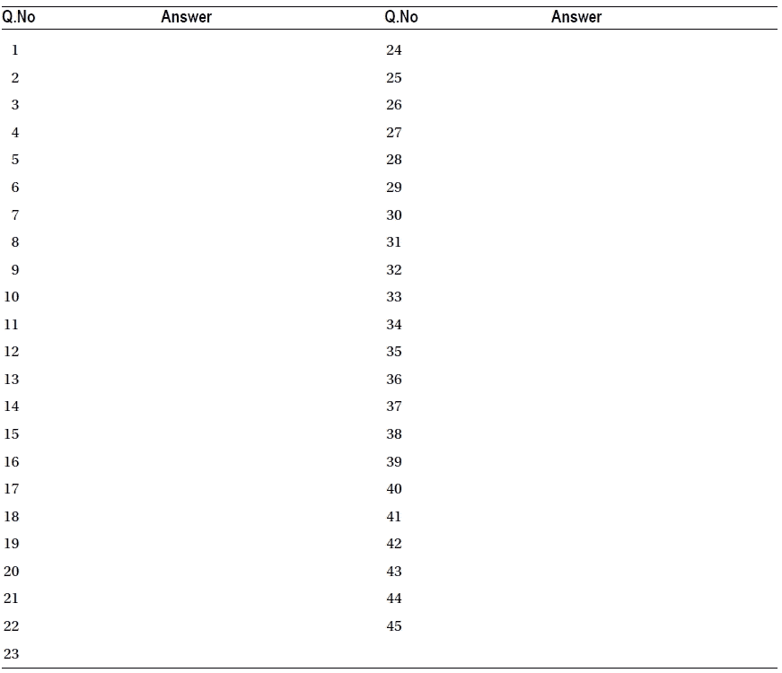

答案与解析

1.    c)

s1 和 s2 不相等

s1 和 s3 相等


JVM 设置了一个常量池，用于存储类型中使用的所有字符串常量。如果两个引用使用同一个常量声明，那么它们都指向同一个常量对象。`==` 运算符检查的是对象本身的相似性（而非其中的值）。这里，第一次比较的是两个不同的对象，因此我们得到 `s1 and s2 not equal`。另一方面，由于 `s1` 和 `s3` 的引用指向同一个对象，我们得到 `s1 and s3 equal`。

2.    c) [0, 0]

构造函数内部的赋值语句 `x = x;` 重新赋值了传入的参数；它*并未*赋值 `Point2D` 中的成员变量 `x`。正确的赋值方式是 `this.x = x;`。字段 `y` 未被赋值，因此其值保持为 0。

3.    d) 执行时，该程序会打印

k == j is true

k.equals(j) is true

`Integer` 对象是不可变对象。如果某个值对应的 `Integer` 对象已经存在，则不会再次创建新对象。换句话说，Java 会共享不可变的 `Integer` 对象，因此两个 `Integer` 对象在值相等时即相等（无论你是使用 `==` 运算符比较引用，还是使用 `equals()` 方法比较内容）。

4.    a) arr1 == arr2 is false

arr1.equals(arr2) is false

Arrays.equals(arr1, arr2) is true

两个数组对象之间的第一次比较使用了 `==` 运算符，它比较的是对象的相似性，因此返回 false。`equals()` 方法比较的是当前数组对象与传入的数组对象，由于它继承自 `Object` 类，因此不会比较数组的值。所以我们再次得到 false。另一方面，`Arrays` 类实现了多种 `equals()` 方法来比较不同类型的两个数组对象；因此最后一次调用返回 true。

5.    d) 执行时，该程序会打印以下内容：str is not Object。

变量 `str` 已被声明但未实例化；因此 `instanceof` 运算符返回 false。

6.     b) Side Object Tail Side

重载基于对象的静态类型（而重写和运行时解析则解析为对象的动态类型）。以下是对 `overload()` 方法调用的解析过程：

*   `overload(firstAttempt);` --> `firstAttempt` 的类型是 `Side`，因此解析为 `overload(Side)`。
*   `overload((Object)firstAttempt);` -> `firstAttempt` 被转换为 `Object` 类型，因此解析为 `overload(Object)`。
*   `overload(secondAttempt);` ->  `secondAttempt` 的类型是 `Tail`，因此解析为 `overload(Tail)`。
*   `overload((Side)secondAttempt);` -> `secondAttempt` 被转换为 `Side` 类型，因此解析为 `overload(Side)`。

7.    c) `foo(long)`

对于整数字面量，JVM 按以下顺序进行匹配：`int`、`long`、`Integer`、`int...`。换句话说，它首先查找 `int` 类型的参数；如果未提供，则查找 `long` 类型；依此类推。这里，由于没有任何重载方法指定 `int` 类型参数，因此匹配到 `foo(long)`。

8.    b)

`In Base.foo()`
`In Derived.bar()`

静态方法是静态解析的。在静态方法内部，调用了虚方法，该方法会动态解析。

9.    d) 执行时，程序会打印“walk cannot fly”。

要重写一个方法，被重写的方法不一定要指定异常。但是，如果指定了异常，那么指定的异常必须是超类（或接口）中定义的方法所指定异常的同级或子类。

10.    b) club  none  none  none

以下是四个枚举值的匹配情况描述：

*   “club” 匹配 case “Club”。
*   对于 “Spade”，case “spade” 因大小写不同而不匹配（switch case 匹配区分大小写）。
*   不匹配 “diamond”，因为 case 语句必须精确匹配，而原始字符串中包含了额外的空格。
*   “hearts” 不匹配字符串 “heart”。

11.    a) `new Outer.Inner().text`


访问静态内部类字段的正确方式是结合外部类使用内部类实例，因此 `new Outer.Inner().text` 即可实现。

12.    a) `for(Cards card : Cards.values())`
          `System.out.print(card + " ");`

枚举的 `values()` 方法返回枚举成员的数组。

13.    d) `class CI12 extends C implements I1, I2 {}`

一个类使用 `extends` 关键字继承另一个类，并使用 `implements` 关键字继承接口。

14.    d) `interface II extends I1, I2 {}`

一个接口可以扩展一个或多个接口。在这种情况下，我们需要使用 `extends` 关键字，并用逗号分隔父接口列表。

15.    c) 程序将无法编译，并在 LINE A 处产生编译器错误“对 name 的引用不明确”。

由于 `name` 在基接口和 `abstract` 类中都有定义，因此对成员 `name` 的任何引用都是不明确的。对 `name` 的第一次引用出现在标记为注释 `LINE A` 的行中，因此编译器在该行标记了错误。

16.    c) has-a（具有）

组合是一种设计概念，指的是“具有”（has-a）关系。

17.    c) 执行时，程序打印如下内容：Brazil China India Russia。

当将 `null` 作为第二个参数传递给 `Arrays.sort()` 方法时，意味着应使用默认的 `Comparable`（即元素的自然顺序）。默认的 `Comparator` 会导致元素按升序排序。该程序不会导致 `NullPointerException` 或任何其他异常，也不会导致编译器错误。

18.    b) 执行时，此程序打印如下内容：“The removed element is: 1”。

`remove()` 方法等同于 `removeFirst()` 方法，该方法移除 `Deque` 对象的第一个元素（队列头部）。

19.    d) 执行时，程序打印如下内容：1 2.0 3.0。

List 是一个泛型类型，但此处以原始形式使用；因此它允许我们在 `list2` 中放入不同类型的值。所以，它打印如下内容：1 2.0 3.0。

20.    e) 执行时，此程序将打印

`SimpleCounter<Double> counter is 2`

`SimpleCounter<Integer> counter is 2`

`SimpleCounter counter is 2`

`Count` 是一个静态变量，因此它属于 `class` 而非实例。每次调用构造函数时，`count` 都会递增。由于创建了两个实例，计数值为 2。

21.    f) 程序抛出异常 `java.util.UnknownFormatConversionException: Conversion = 'l'`

没有针对长整型的格式说明符，长整型使用与整型相同的 `%d` 格式说明符。因此，格式说明符 `%ld` 会导致运行时异常 `UnknownFormatConversionException`。

22.    b)

`Using String.split method: 10 01 2012`

`Using regex pattern: 10 01 2012`

使用 `str.split(regex)` 等同于使用 `Pattern.compile(regex).split(str)`。

23.    d) false true false true

以下是针对字符 x 的正则表达式匹配：

*   `x*` 表示匹配 `x` 零次或多次。
*   `x+` 表示匹配 `x` 一次或多次。
*   `x{n}` 表示精确匹配 `x` 恰好 `n` 次。

模式 `a*b+c{3}` 表示匹配 `a` 零次或多次，后跟 `b` 一次或多次，再后跟 `c` 恰好三次。

因此，以下是 `strings` 数组中元素的匹配情况：

*   对于 `"abc"`，匹配失败，结果为 `false`。
*   对于 `"abbccc"`，匹配成功，结果为 `true`。
*   对于 `"aabbcc"`，匹配失败，结果为 `false`。
*   对于 `"aaabbbccc"`，匹配成功，结果为 `true`。

24.     d) Severity 1 does not match.

severity3 does not match.

severity five does not match.

以下是所用模式的含义：

`[^xyz]` 除 x、y 或 z 之外的任何字符（即取反）

`\s` 一个空白字符

`[a-z]` 从 a 到 z

因此，模式 `"^severity[\\s+][1–5]"` 匹配字符串“severity”，后跟空白字符，再后跟 1 到 5 中的一个字母。

对于此模式，


*   “Severity 1” 不匹配，因为“Severity”中的字母 S 是大写的。
*   “severity 2” 匹配。
*   “severity3” 不匹配，因为 severity 和 3 之间没有空格。
*   “severity five” 不匹配，因为“five”不是 1 到 5 之间的数字。

25.    a) 程序输出如下：InvalidKeyException。

当一个方法重写了另一个使用 throws 子句定义了异常的方法时，该方法不必提供抛出的 `Exception`。因此，给定的程序将成功编译，并输出 `InvalidKeyException`。

26.    e) 程序输出如下：in catch -> in finally ->。

语句 `println("after throw -> ");` 永远不会被执行，因为标记为 `LINE A` 的行抛出了一个异常。catch 块处理了 `ArithmeticException`，因此 `println("in catch -> ");` 会被执行。随后有一个 return 语句，所以函数会返回。但在函数返回之前，会调用 `finally` 语句，因此 `println("in finally -> ");` 会被执行。所以，语句 `println("after everything");` 永远不会被执行。

27.    f) 不在控制台输出任何内容

默认情况下，断言是禁用的。如果启用了 `-ea`（或 `-enableassertions` 选项来启用断言），那么程序会输出“Error”，因为在断言失败的情况下抛出的异常是 `java.lang.AssertionError`，它派生自 `Error` 类。

28.    d) 该程序将在根目录下创建 file1.txt 和 file3.txt 目录，并在根目录下的“subdir”目录中创建 file2.txt 目录。

`mkdirs()` 方法为给定的名称创建一个目录。由于文件名中包含 /，该方法会在根目录（或基于你执行此程序的路径的 Windows 驱动器根路径）中创建目录。

29.    b) 当序列化一个引用了其他对象的对象时，序列化机制也会将被引用的对象作为序列化字节的一部分包含进来。

以及

c) 当一个对象被序列化时，声明为 transient 的类成员将不会被序列化（因此它们的值在反序列化后会丢失）。

选项 b) 和 c) 关于对象序列化的描述是正确的。

选项 a) 是错误的，因为 `Serializable` 接口是一个标记接口；换句话说，`Serializable` 接口是一个空接口，它没有声明任何方法。

选项 d) 是错误的，因为 `Externalizable` 接口声明了两个方法：`writeExternal()` 和 `readExternal()`。

选项 e) 是错误的，因为不存在名为 `NotExternalizableException` 的异常。

30.    b) Body first head hello program world

`TreeSet<String>` 按默认的字母升序对字符串进行排序并去除重复项。分隔符 \W 是非单词字符，因此像 < 这样的字符会作为分隔符。

31.    b) beginIndex = 0 且 endIndex = 1

在 `Path` 类的 `subpath(int beginIndex, int endIndex)` 方法中，`beginIndex` 是第一个元素的索引（包含该元素），`endIndex` 是最后一个元素的索引（不包含该元素）。请注意，*在目录层次结构中，最接近根目录的名称的索引为 0*。这里，字符串元素 `"Program Files"` 最接近根目录 `C:\`，因此 `beginIndex` 的值为 0，`endIndex` 的值为 1。

32.    d) 输出如下：Copy.class Copy.java Hello.class OddEven.class PhotoCopy.java。

在 Glob 模式 “*o*?{java,class,html}” 中，字符 * 匹配任意数量的字符，因此 *o* 匹配任何包含“o”的字符串。? 精确匹配一个字符。模式 {java,class} 匹配后缀为“java”或“class”的文件。因此，在给定的文件中，匹配的文件名是 `Copy.class`、`Copy.java`、`Hello.class`、`OddEven.class`、`PhotoCopy.java`。

33.    b) WatchService watcher = FileSystems.getDefault().newWatchService();

`FileSystems` 中的 `getDefault()` 方法返回底层 `FileSystem` 对象的引用。`newWatchService()` 方法返回一个新的 watch 服务，该服务可用于监视已注册对象的更改以及文件或目录中的事件。

34.    正确的选项是

c) 你可以通过调用 `Connection` 接口中的 `preparedStatement()` 方法来获取 `PreparedStatement` 的实例。

e) `Statement` 接口及其派生接口实现了 `AutoCloseable` 接口，因此它们可以与 try-with-resources 语句一起使用。

选项 c) 和 e) 是正确的陈述。其他三个选项不正确，原因如下：

*   选项 a) Statement 类型的对象可以处理 IN、OUT 和 INOUT 参数；你需要使用 CallableStatement 类型的对象来处理这些参数。
*   选项 b) `PreparedStatement` 用于预编译的 SQL 语句；`CallableStatement` 类型用于存储过程。
*   选项 d) `CallableStatement` 实现了 `PreparedStatement` 接口；`PreparedStatement` 又实现了 `Statement` 接口。这三种类型不是类。

35.    e) 该程序将抛出 `SQLException`，因为自动提交为 true。

如果在自动提交模式设置为 true 时调用诸如 `commit()` 或 `rollback()` 之类的方法，程序将抛出 `SQLException`。

36.    b) `RowSetFactory rowSetFactory = RowSetProvider.newFactory();`

`JdbcRowSet rowSet = rowSetFactory.createJdbcRowSet();`

37.    b) 执行时，程序输出 `"Worker"`，然后程序挂起（即不终止）。

`main()` 方法中的 `Thread.currentThread()` 语句指的是“`Master`”线程。对自身调用 `join()` 方法意味着该线程等待自身完成，这永远不会发生，因此该程序会挂起（并且不会终止）。

38.    选项 a) 和 d) 是正确的：

a) 以毫秒为单位作为睡眠时间的参数。

d) 如果在睡眠时被另一个线程中断，可以抛出 `InterruptedException`。

在选项 b) 中，`sleep()` 方法以毫秒为单位作为参数，而不是微秒。

在选项 c) 中，`sleep()` 方法在进入睡眠时不会释放锁；它会持有锁。

39.    c) 程序输出

Starting to wait

Caught Exception

在这个程序中，`wait()` 方法在没有获取锁的情况下被调用；因此会导致抛出 `IllegalMonitorStateException`，该异常将在 `Exception` 的 catch 块中被捕获。

40.    a) 程序输出

[10, 5, 10, 20]

[20, 5, 10]

[5, 10, 20]

[5, 10, 20]

以下是对输出结果的容器描述：

*   `List` 是无序的。
*   `HashSet` 是无序的，并保留唯一元素。
*   `TreeSet` 是有序的，并保留唯一元素。
*   `ConcurrentSkipListSet` 是有序的，并保留唯一元素。

41.    c) 程序无法编译，并在标记为 LINE A 的行出现编译器错误。

类 `CopyOnWriteArrayList` 不继承自 `ArrayList`，因此尝试将 `CopyOnWriteArrayList` 赋值给 `ArrayList` 引用会导致编译器错误（类名 `CopyOnWriteArrayList` 中的 `ArrayList` 后缀可能会产生误导，因为这两个类没有 is-a 关系）。

42.    c) 输出

E Gamma

R Johnson

R Helm

J Vlissides

然后程序终止。

`producer` 类将一个作者放入列表，然后睡眠一段时间。与此同时，另一个线程（consumer）不断检查列表是否非空。如果非空，consumer 线程移除该项并打印它。因此，所有四个作者的名字都被打印出来。

43.    b)

`from=von`
`subject=betreff`

在资源包属性文件中，键值使用 = 符号分隔，资源文件中的每一行由换行符分隔。

44.    c) `ResourceBundle_en.properties`


Java 会为名为 `ResourceBundle` 的基础包和法语（加拿大）区域设置查找候选区域，并检查是否存在以下属性文件：

`ResourceBundle_fr_CA.properties`

`ResourceBundle_fr.properties`

由于这两个文件都不存在，Java 会为名为 `ResourceBundle` 的基础包和默认区域设置（英语 - 美国）查找候选区域：

`ResourceBundle_en_US.properties`

`ResourceBundle_en.properties`

Java 发现存在一个匹配的资源包 `ResourceBundle_en.properties`，因此加载了该资源包。

45.    a) `System.out.println(new SimpleDateFormat("hh:mm:ss").format(new Date()));`

在格式 `hh:mm:ss` 中，`h` 表示上午/下午的小时（取值范围为 1–12），`m` 表示分钟，`s` 表示秒。用于创建和使用自定义日期或时间模式字符串的类是 `SimpleDateFormat`。表达式 `new Date()` 会创建一个包含当前日期和时间值的 `Date` 对象。

预测后评估

本次预测中的 45 道题目经过筛选和分组，代表了 Oracle 1Z0-804 考试大纲中的 12 个主题。本次预测中主题的顺序与 1Z0-804 考试大纲中的主题顺序一致。

表 2-1 是您的预测后评估工具。在最右侧一列中，根据您的答题卡，填写每个主题中您答对的预测题数量。如果您的答对数量*小于或等于*相邻列中显示的预期答对数量，则您需要将 OPCJP 7 考试的备考重点放在该考试主题以及本书中对应的章节上。

表 2-1. 预测后评估工具

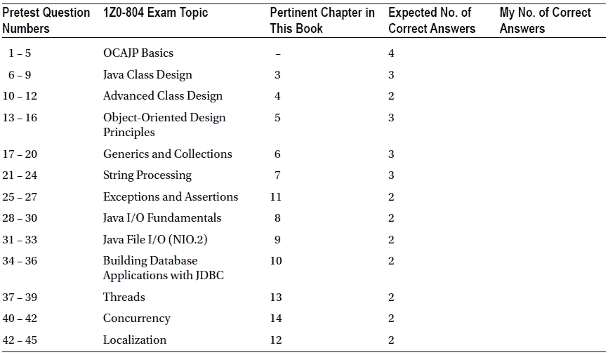

第 3 章


Java 类设计

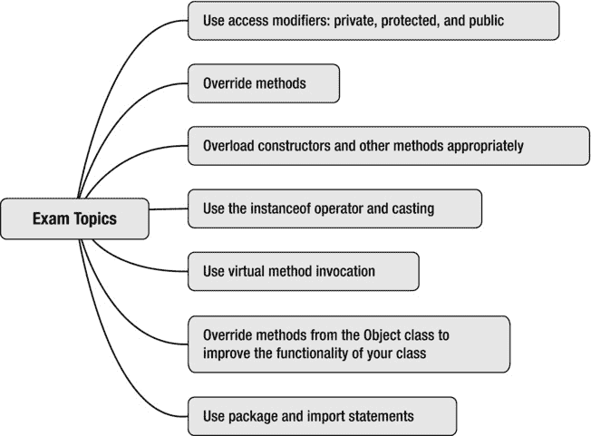

Java 是一种*面向对象编程*（OOP）语言。面向对象有助于开发者构建一个*模块化*、*可扩展*、*可维护*且*可复用*的系统。要编写出高质量的程序，程序员必须牢固掌握 OOP 概念。

面向对象编程围绕*对象*这一概念展开，对象*封装*了数据以及作用于数据上的行为。对象通过定义良好的*接口*提供服务。该接口规定了对象“提供什么”，*抽象*了“如何提供”（即实际实现）。面向对象支持在更高的抽象层次上对解决方案进行建模，涉及*类*、相关类的层次结构（*继承*）、类之间的关联以及动态绑定（*动态多态*）。

对于任何 OCPJP 考试，您都需要了解基本的 OOP 概念。本章的第一部分涵盖了 OOP 的基础：抽象、封装、继承和多态。第二部分涵盖了与类相关的概念，其中我们将详细讨论*构造器*和*访问修饰符*。第三部分回顾了*方法重载*和*构造器重载*。第四部分是关于继承的，涵盖了*is-a 关系*、*方法重写*和*类型转换*。本章的最后一部分涉及 Java 的*包*和*导入语句*。

OOP 基础

为了感受面向对象编程的世界，让我们在脑海中漫步于本地消费电子产品零售商的电视部门。电视是一种抽象，通过适当的接口（电视遥控器）提供特定功能。作为观众，您无需了解电视的工作原理；电视向观众抽象了其所有更精细的操作细节（*抽象*）。电视对象封装了电视的属性（如亮度、频道号和音量）以及控制这些属性的相关行为，形成一个单一实体（*封装*）。换句话说，对这些属性的访问被限制在相关的操作中。电视有不同的类型，例如 CRT 电视、LED 电视和 LCD 电视；它们属于同一个家族，形成了一个*继承层次结构*。尽管所有类型的电视都支持“显示”功能，但实现内容显示的内部技术可能有所不同（*多态*）。

牢记这个电视类比，并借助下一节中介绍的编程示例，让我们回顾一下基本的 OOP 概念。

FunPaint 应用程序：一个示例

假设您正在为儿童实现一个名为 FunPaint 的简单绘图程序（图 3-1）。用户可以拖放圆形和方形等基本形状，为它们着色，并使用这些形状创作图画。


图 3-1.  一个使用 OOP 概念实现的儿童绘图应用程序

我们将在本章中一直使用这个示例，来说明如何有效地将 OOP 概念应用于实际编程和问题解决。现在，假设 Circle 和 Square 等形状是作为类实现的。用户可以点击圆形图标，然后在绘图窗格中绘制一个圆形。对于圆形，您需要记住相关的信息，例如圆心、半径等。为了让用户能够给圆形着色，您需要计算其面积。接下来，您将看到如何使用 OOP 概念来实现 FunPaint 的功能。

OOP 基础

面向对象建立在封装、抽象、继承和多态的基础之上。以下各部分将帮助您重新理解这四个概念。

抽象

*抽象*的拉丁词根意为“抽离”——您抽离出除您希望关注的特定方面之外的所有内容。换句话说，抽象意味着隐藏较低层次的细节，只向用户暴露必要且相关的细节。

例如，为了驾驶汽车，驾驶员具备一套基本的技能就足够了，这些技能使她能够与汽车的转向、换挡、仪表盘、制动和加速系统进行交互。对于驾驶员来说，了解内部实现细节（例如燃油如何注入燃烧室，或者电池如何通过发动机间接充电）是多余的。驾驶员只关心如何使用汽车，而不关心汽车如何工作以及如何向驾驶员提供功能。换句话说，汽车*抽象*了内部细节，只向驾驶员暴露那些与驾驶员和汽车交互相关的细节。

在 FunPaint 示例中，您定义了诸如 `draw()` 和 `fillColor()` 之类的操作。`Circle` 类的用户不需要知道该类是如何绘制圆形或使用特定颜色填充圆形的。换句话说，您通过隐藏实现细节来抽象类的细节。

封装

结构化编程将程序的功能*分解*为各种过程（*函数*），而不太关心每个过程可以操作哪些数据。函数可以自由地操作和修改（通常是全局且未受保护的）数据。


在面向对象编程中，数据和操作这些数据的函数被组合成一个单一单元，称为*类*。术语*封装*指的是将数据及相关函数组合成一个单一单元。例如，在`Circle`类中，`radius`和`center`被定义为*私有字段*。现在你可以将方法`draw()`和`fillColor()`与字段`radius`和`center`一起引用，因为这些字段和方法彼此紧密相关。类中方法所需的所有数据（字段）都在类内部可用。换句话说，类将其字段和方法*封装*在一起。

|  | 封装将数据（字段）与逻辑相关的操作（方法）结合在一起。抽象则隐藏了内部实现层面的细节，只向用户暴露类的相关细节。抽象是*通过*封装实现的。 |

继承

*继承*是面向对象编程中的一种复用机制，它利用各种对象的共同属性来建立彼此之间的关系。抽象和共同的属性在*超类*中提供，可供更专门的*子类*使用。例如，彩色打印机和黑白打印机是打印机的一种（*单继承*）；多功能一体机是打印机、扫描仪和复印机的结合（*多继承*）。需要注意的是，Java *不*支持多继承，但支持*多接口继承*（详见第 4 章和第 5 章）。

当我们说类`B`继承自另一个类`A`时，类`B`被称为*派生类*（或*子类*），类`A`被称为*基类*（或*超类*）。通过继承，派生类接收基类的行为，使得基类中所有可见的成员方法和变量在派生类中可用。除了继承的行为外，派生类通过添加或覆盖基类行为来特化其自身行为。

在 FunPaint 中，用户可以绘制不同的形状。尽管形状不同，但所有形状都支持类似的功能——例如，填充颜色和计算形状的面积。由于这些方法对所有形状类都是通用的，你可以创建一个名为`Shape`的*基类*，并在该类中声明这些方法。其他类如`Circle`和`Triangle`继承自`Shape`并实现其特化行为。

多态

术语*多态*的希腊词根指的是一个实体的“多种形式”。在现实世界中，你传达的每条消息都有上下文。根据上下文，消息的含义可能会改变，对消息的响应也可能会改变。类似地，在面向对象编程中，一条消息可以根据对象以多种方式解释（多态）。

例如，在*函数重载*（Java 中的多态构造之一）中，你可以提供名称相同但参数数量或参数类型不同的方法。这个概念很简单，但它为程序员提供了强大的能力和灵活性。在 FunPaint 中，你可以用不同的颜色填充形状。像`fillColor()`这样的方法可以接受颜色参数为 RGB（红、绿、蓝）值或 HSB（色相、饱和度、亮度）值。对同一个方法`fillColor()`的调用，根据提供的参数表现不同；这是*编译时多态*的一个例子。

假设你在`Shape`基类中有一个名为`area()`的方法。`area()`方法返回所绘制形状的面积。因此，`area()`在`Shape`的所有派生类中都被实现（*覆盖*）。一个`Shape`引用可以指向任何派生类对象。当你从`Shape`引用调用`area()`方法时，它会调用实际对象类型（即对象的动态类型）的`area()`方法。这种动态行为被称为*运行时多态*。

我们用一个简单的例子打包了很多概念和术语。如果你不能一下子全部消化，不用担心。你将在本书中进一步学习它们。

类基础

*类*是面向对象编程中的基本抽象实体和构建块。一个类封装了一个实体的*状态*（数据）和*行为*（操作）。例如，`Circle`类为单个圆形对象定义了蓝图。这个`Circle`类可能包含状态信息，如`radius`，以及操作，如`area()`和`fillColor()`。`Circle`类将圆的状态和操作封装在一个单一实体中，并提供了一种新的抽象。从面向对象编程的角度来看，理解类定义了一个新类型，该类型可以被程序中的其他类使用，这一点很重要。

让我们看一个类的例子并分析其各个部分（图 3-2）。这个例子声明了类`Circle`，它包含类型为`Integer`的成员变量`x, y`和`radius`，以及两个成员方法`area()`和`fillColor()`。

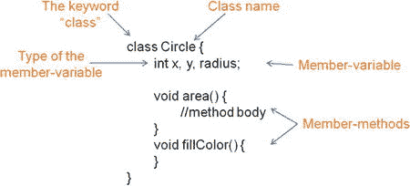

图 3-2.  一个示例类 Circle 及其各个部分

|  | 类是一个模板（或蓝图），而对象是类的一个实例。 |

对象创建

你创建类是为了在程序中使用它们。你可以创建一个*实例*（一个使用类服务的对象）。从高层次来看，在程序中使用对象有三个步骤。

*   **声明：** 你需要提供一个变量声明，其中包含*类型名称*（你想要使用的类）和*对象名称*。例如，以下语句声明了一个类型为`Circle`的变量`circleObj`：

```
    Circle circleObj;
    ```

*   **实例化：** 你使用关键字`new`来创建一个实例；该关键字为对象分配所需的内存。在这个例子中，你通过以下语句*实例化*圆形对象：

```
    Circle circleObj = new Circle ();
    ```

*   **初始化：** 一个特殊的方法，称为*构造函数*，会被自动调用。构造函数通过设置对象的初始状态来初始化新创建的对象，并且你可以获取一些资源（如文件句柄）。构造函数的主要规则是它们必须与类同名。一个类可以有多个构造函数。

|  | 每个类都有一个构造函数。如果你没有为类显式编写构造函数，Java 编译器会为该类提供一个默认构造函数（不带任何参数）。 |

假设你在 FunPaint 应用程序中实现`Circle`类。一个`Circle`应该记住其圆心和半径，因此你有三个字段：`xPos`、`yPos`和`radius`。

```
class Circle {
        int xPos, yPos, radius;
}
```

当你创建一个新的`Circle`对象时会发生什么？由于`xPos`、`yPos`和`radius`是`Integer`类型，它们的值默认会被初始化为 0。然而，这对于创建正确的`Circle`对象来说并不理想。让我们在*默认构造函数*中为变量`xPos`、`yPos`和`radius`定义默认值：


```public Circle() {
        xPos = 20; // 假设 xPos 和 yPos 的默认值
        yPos = 20;
        radius = 10; // 默认半径
}
```

如你所见，构造方法与类同名，且没有任何返回类型。默认构造方法没有任何参数。当你创建新对象且不传递任何参数时，默认构造方法会被调用。

让我们检查一下，当你尝试实例化 `Circle` 对象时，这个默认构造方法是否会被调用。为此，你需要实现 `toString()` 方法来打印 `Circle` 成员的值（清单 3-1）。（注意：你无需像本代码中那样显式调用 `toString()` 方法——它会被自动调用。你将在本章的“运行时多态”部分了解更多相关内容）。

清单 3-1.  Circle.java

```
// 一个二维 Circle 类，包含 xPos 和 yPos 字段用于存储中心点坐标，
// 以及 radius 字段用于存储圆的半径值
class Circle {
        private int xPos, yPos, radius;
        // 默认构造方法，初始化所有三个字段
        public Circle() {
                xPos = 20; // 假设 xPos 和 yPos 的默认值
                yPos = 20;
                radius = 10; // 默认半径
        }
        // 重写的 toString 方法，以字符串形式打印 Circle 对象的信息
        public String toString() {
                return "center = (" + xPos + "," + yPos + ") and radius = " + radius;
        }
        public static void main(String[]s) {
                // 将对象传递给 println 会自动调用 toString 方法
                System.out.println(new Circle());
        }
}
```

它打印出

```
center = (20,20) and radius = 10
```

是的，你的默认构造方法生效了。明白了吗？

现在，你能看出这个构造方法有什么问题吗？

```
public void Circle() {
        xPos = 20; // 假设 xPos 和 yPos 的默认值
        yPos = 20;
        radius = 10; // 默认半径
}
```

构造方法没有返回类型，而这里你指定了 `void` 返回类型。这不是一个构造方法，而是该类中一个名为 `Circle` 的方法！注意：Java 允许你声明与类名相同的方法，但使用这一特性并非良好实践（因为它会混淆阅读你代码的程序员）。

|  | 构造方法没有返回类型。如果你定义了返回类型，那它就不是构造方法，而是一个方法！请注意并避免犯这个常见错误。 |

访问修饰符

OCPJP 考试既包含直接关于访问修饰符的问题，也包含需要底层访问修饰符知识的间接问题。因此，理解 Java 支持的各种访问修饰符非常重要。

访问修饰符决定了 Java 实体（类、方法或字段）的可见性（进而决定访问权限）级别。访问修饰符使你能够实施有效的封装。如果类的所有成员变量都可以从任何地方访问，那么将这些变量放在类中就没有意义，将数据和方法封装在类中也失去了目的。

Java 支持四种类型的访问修饰符：

*   公有（Public）
*   私有（Private）
*   受保护（Protected）
*   默认（Default，未指定访问修饰符）

为了说明这四种访问修饰符，假设你在 FunPaint 应用程序中还有一个类：`Canvas`。`Shape`、`Circle` 和 `Circles` 类位于同一个包（`graphicshape`）中，而 `Canvas` 类位于另一个包（`appcanvas`）中。

```
// Shape.java
package graphicshape;

class Shape {
        // 类定义
}

// Circle.java
package graphicshape;

public class Circle extends Shape {
        // 类定义
}

//Circles.java
package graphicshape;

class Circles {
        //类定义
}

// Canvas.java
package appcanvas;
import graphicshape.Circle;

class Canvas {
        //类定义
}
```

暂时先跳过 `package graphicshape`、`...extends Shape` 和 `import graphicshape.Circle` 这些语句，我们将在后续章节中详细讨论它们。

公有访问修饰符

公有访问修饰符是最宽松的。如果一个类或其成员被声明为 *public*，则它们可以被任何其他类访问，不受包边界限制。这类似于现实世界中的公共场所，例如公司食堂，所有员工无论部门都可以使用。

在 FunPaint 示例中，假设 `Circle` 类有一个公有方法 `area()`。该方法可以从任何地方访问，甚至从另一个包中访问，如清单 3-2 片段所示。

清单 3-2.  Circle.java

```
// Shape.java
package graphicshape;

class Shape {
        // 类定义已省略
}

// Circle.java
package graphicshape;

public class Circle extends Shape {
        public void area() {       //公有方法
                // area 方法的代码已省略
        }
}

// Circles.java
package graphicshape;

class Circles {
        void getArea() {
                Circle circle = new Circle();
                circle.area();       // 在包内调用公有方法 area()
        }
}

// Canvas.java
package appcanvas;
import graphicshape.Circle;

class Canvas {
        void getArea() {
                Circle  circle = new Circle();
                circle.area(); // 在包外调用公有方法 area()
        }
}

如清单 3-2 所示，公有方法 area() 在同一个包内（Circles 类中）以及包外（Canvas 类中）均可访问。
```

|  | 类中的 *公有方法* 仅当该类被声明为 public 时，才能被外部世界访问。如果该类未指定任何访问修饰符，则公有方法仅能在其所在包内访问。 |

私有访问修饰符

私有访问修饰符是最严格的访问修饰符。*私有*类成员无法从类外部访问；只有同一个类的成员才能访问这些私有成员。这类似于银行的保险箱室，只有经过授权的人员和保险箱所有者才能进入。

让我们将属性 `radius` 作为私有成员添加到 `Circle` 类中。在这种情况下，该属性只能由 `Circle` 类的成员访问，如清单 3-3 所示。

清单 3-3.  Circle.java

```
// Shape.java
package graphicshape;

class Shape {
        //类定义
}

//Circle.java
package graphicshape;

public class Circle extends Shape {
        private int radius;       //私有字段
        public void area() {       //公有方法
                // 在类内部访问私有字段 radius
                System.out.println("area:"+3.14*radius*radius);
        }
}

// Circles.java
package graphicshape;

class Circles {
        void getArea() {
                Circle  circle = new Circle();
                circle.area();  // 在包内调用公有方法 area()
        }
}

// Canvas.java
package appcanvas;
import graphicshape.Circle;

class Canvas {
        void getArea() {
                Circle  circle = new Circle();
                circle.area(); // 在包外调用公有方法 area()
        }
}
```

在此示例中，`radius` 仅在 `Circle` 类内部可访问，在任何其他类中均不可访问，无论其所在包如何。

受保护与默认访问修饰符


*受保护*和*默认访问修饰符*非常相似。如果一个成员方法或字段被声明为 protected 或 default，那么该方法或字段可以在同一个包内被访问。请注意，没有显式的关键字来表示默认访问——实际上，当未指定任何访问修饰符时，该成员就具有默认访问权限。另外，请注意，默认访问也称为*包内受保护*访问。受保护和默认访问类似于办公室里的情况：会议室只对一个部门开放。

受保护和默认访问有什么区别？当子类与其父类不在同一个包中时，这两个访问修饰符之间会出现一个显著的区别。在这种情况下，受保护的成员可以在子类中访问，而默认成员则不能。

假设类 `Shape` 有一个受保护的成员变量 `color`，而类 `Circle` 有另一个使用默认访问修饰符声明的方法 `fillColor()`，如 清单 3-4 中的代码片段所示。

清单 3-4.  Circle.java

```
// Shape.java
package graphicshape;

class Shape {
        protected int color;
}

// Circle.java
package graphicshape;

public class Circle extends Shape {
        private int radius;     // private 字段
        public void area() {    // public 方法
                // 在类内部访问 private 字段 radius
                System.out.println("area:"+3.14*radius*radius);
        }
        void fillColor() {
                System.out.println("color:" + color); // 在子类中访问 protected 字段
        }
}

// Circles.java
package graphicshape;

class Circles {
        void getArea() {
                Circle  circle = new Circle();
                circle.area();  // 在包内调用 public 方法 area()
                circle.fillColor();     // 在包内调用具有默认访问修饰符的方法
        }
}

// Canvas.java
package appcanvas;
import graphicshape.Circle;

class Canvas {
        void getArea() {
                Circle  circle = new Circle();
                circle.area(); // 在包外调用 public 方法 area()
        }
}
```

如示例所示，受保护的字段 `color` 在类 `Circle` 中被访问，而默认方法 `fillColor()` 从类 `Circles` 中被调用。

各种访问修饰符提供的可见性总结在 表 3-1 中。

表 3-1. 访问修饰符及其可见性

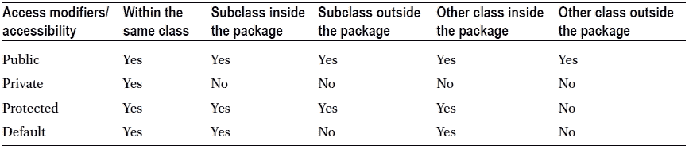

|  | 需要注意的是，类（或接口）不能被声明为 private 或 protected。此外，接口的成员方法或字段也不能被声明为 private 或 protected。 |

重载

现在让我们详细阐述一下上面“多态”部分中介绍的多态概念。

多态可以有两种形式：*静态*和*动态*。当单个实体的不同形式在编译时被解析（*早期绑定*）时，这种多态称为*静态多态*。当单个实体的不同形式在运行时被解析（*晚期绑定*）时，这种多态称为*动态多态*。*重载*是静态多态的一个例子。

方法重载

在一个类中，你可以定义多少个同名的方法？很多个！在 Java 中，你可以定义多个同名的方法，只要它们的参数列表互不相同。换句话说，如果你提供不同类型的参数、不同数量的参数，或者两者都不同，那么你就可以定义多个同名的方法。这个特性被称为*方法重载*。编译器会根据实际传递参数的数量和/或类型来解析对正确方法的调用。

在 FunPaint 应用程序中，你可以绘制和着色一个形状。假设你想给一个圆着色。你会如何定义一个可以实现此功能的方法？（请注意，任何颜色都可以通过以下两种方法之一来指定。）

1.  通过组合红、绿、蓝三种基本颜色。这种方法称为 RGB 方案。按照惯例，每个颜色值通常以 0 到 255 的范围给出。
2.  通过给出色相、饱和度和亮度值。这种方法称为 HSB 方案。按照惯例，每个值通常以 0.0 到 1.0 的范围给出。

让我们在 `Circle` 类中实现一个名为 `fillColor()` 的方法，该方法接受 RGB 或 HSB 值。由于 RGB 值是整数值，而 HSB 值是浮点数值，那么支持这两种方案来调用 `fillColor()` 方法怎么样？请参见 清单 3-5。

清单 3-5.  Circle.java

```
class Circle {
        // 其他成员
        public void fillColor (int red, int green, int blue) {
                /* 使用 RGB 颜色值为圆着色 – 实际代码已省略 */
        }

public void fillColor (float hue, float saturation, float brightness) {
                /* 使用 HSB 值为圆着色 – 实际代码已省略 */
        }
}
```

如你所见，两个 `fillColor()` 方法名称完全相同，并且都接受三个参数；然而，参数类型不同。基于在 `Circle` 上调用 `fillColor()` 方法时使用的参数类型，编译器将决定具体调用哪个方法。例如，考虑以下方法调用：

```
Circle c1 = new Circle(10, 20, 10);
c1.fillColor(0, 255, 255);

Circle c2 = new Circle(50, 100, 5);
c2.fillColor(0.5f, 0.5f, 1.0f);
```

在这段代码中，对于 `c1` 对象，对 `fillColor()` 的调用具有整数参数 0、255 和 255。因此，编译器将此调用解析为方法 `fillColor (int red, int green, int blue)`。对于 `c2` 对象，对 `fillColor()` 的调用具有参数 0.5f、0.5f 和 1.0f；因此，它将此调用解析为 `fillColor (float hue, float saturation, float brightness)`。

在上面的例子中，方法 `fillColor()` 是一个重载方法。该方法具有相同的名称和相同数量的参数，但参数类型不同。也可以使用不同数量的参数来重载方法。

这种重载方法有助于避免在不同函数中重复相同的代码。让我们看看 清单 3-6 中的一个简单示例。

清单 3-6.  HappyBirthday.java

```
class HappyBirthday {
        // 重载的 wish 方法，以 String 作为参数
        public static void wish(String name) {
                System.out.println("Happy birthday " + name + "!");
        }

// 重载的 wish 方法，无参数；此方法转而调用 wish(String) 方法
        public static void wish() {
                wish("to you");
        }

public static void main(String []args) {
                wish();
                wish("dear James Gosling");
        }
}
```

它打印出：

```
Happy birthday to you!
Happy birthday dear James Gosling!
```

这里，方法 `wish(String name)` 用于在知道人名时祝福“生日快乐”。默认方法 `wish()` 用于向任何人祝福“生日快乐”。如你所见，你不必在 `wish()` 方法中再次编写 `System.out.println`；你可以通过将默认值“to you”作为参数传递给 `wish()` 来重用 `wish(String)` 方法定义。这种重用对于大型且相关的方法定义非常有效，因为它节省了编写和测试相同代码的时间。

构造函数重载


默认构造函数适用于创建具有默认初始化值的对象。当需要在不同实例化中使用不同值初始化对象时，可以将这些值作为参数传递给构造函数。没错，一个类中可以包含多个构造函数——这就是*构造函数重载*。在类中，默认构造函数可以用默认初始值初始化对象，而另一个构造函数则可以接收用于对象实例化的参数。

在 FunPaint 应用中，用户只需将 `Circle` 模板拖放到屏幕上即可创建 `Circle` 对象。在这种情况下，必须为拖放位置设置 `xPos` 和 `yPos` 值，并为 `radius` 假定一个默认值（清单 3-7）。

清单 3-7.  Circle.java

```
// 可以通过拖放圆形模板来创建 Circle 对象
// 此时需要设置 x 和 y 位置，但可以假定一个默认的 radius 值
public Circle(int x, int y) {
        xPos = x;
        yPos = y;
        radius = 10; // 默认半径
}
```

让我们保留上一节关于默认构造函数中定义的 `toString()` 方法：

```
public String toString() {
        return "center = (" + xPos + "," + yPos + ") and radius = " + radius;
}
```

创建对象时，可以像下面这条语句一样传递参数：

```
System.out.println(new Circle(50, 100).toString());
```

上述语句会输出：

```
center = (50,100) and radius = 10
```

现在，你能看出以下构造函数实现有什么问题吗？

```
public Circle(int xPos, int yPos) {
        xPos = xPos;
        yPos = yPos;
        radius = 10; // 默认半径
}

System.out.println(new Circle(50, 100));
```

它会输出：

center = (0, 0) and radius = 10

发生了什么？你只是改变了上一个示例中构造函数的参数名称，它就不工作了！

语句 `xPos = xPos;` 就是罪魁祸首。你本意是想将成员变量 `xPos` 赋值为传入的参数值 `xPos`。然而，这条语句*重新赋值*了传入的参数值 `xPos`！传入的参数会被视为局部变量（作用域仅限于局部范围的变量）。如果局部变量与字段同名，局部变量会*隐藏*字段。

|  | 为了避免细微的错误，请避免在不同作用域中重复使用相同的变量名。 |

如何解决这个问题？你可以重命名参数，而不是使用 `xPos`，比如用 `x`。或者你可以使用 `this` 来限定 `xPos` 的使用，如下所示：

```
public Circle(int xPos, int yPos) {
        this.xPos = xPos;
        this.yPos = yPos;
        radius = 10; // 默认半径
}
```

在语句 `this.xPos = xPos;` 中，你显式地用 `this` 限定了变量 `xPos`，因此该语句的左侧（LHS）指向字段，右侧（RHS）指向参数名称。

|  | 在实例方法或构造函数中访问字段时，请使用显式的 `this` 限定符，以避免变量名称引用产生歧义。 |

通过传递更多参数来创建 `Circle` 的另一个构造函数。你还需要传递 `radius` 值。

```
public Circle(int x, int y, int r) {
        xPos = x;
        yPos = y;
        radius = r;
} 
```

现在你将编写 `main()` 方法，并在其中创建一些 `Circle` 对象。你将实现 `toString()` 方法来打印圆心位置和半径（参见清单 3-8）。

清单 3-8.  Circle.java

```
public class Circle {
        private int xPos;
        private int yPos;
        private int radius;

// Circle 的三个重载构造函数
        public Circle(int x, int y, int r) {
                xPos = x;
                yPos = y;
                radius = r;
        }

public Circle(int x, int y) {
                xPos = x;
                yPos = y;
                radius = 10; // 默认半径
        }

public Circle() {
                xPos = 20; // 为 xPos 和 yPos 假定一些默认值
                yPos = 20;
                radius = 10; // 默认半径
        }

public String toString() {
                return "center = (" + xPos + "," + yPos + ") and radius = " + radius;
        }

public static void main(String[]s) {
                System.out.println(new Circle());
                System.out.println(new Circle(50, 100));
                System.out.println(new Circle(25, 50, 5));
        }
}
```

该程序会输出：

```
center = (20,20) and radius = 10
center = (50,100) and radius = 10
center = (25,50) and radius = 5
```

如你所见，编译器根据参数的数量解析了构造函数调用。你是否注意到你在三个构造函数中重复了相同的代码？为了避免代码重复——并减少你的输入工作量——你可以从一个构造函数中调用另一个构造函数。在这三个构造函数中，接受 x 位置、y 位置和半径的构造函数是最通用的构造函数。其他两个构造函数可以重写为调用三个参数的构造函数，如下所示：

```
public Circle(int x, int y, int r) {
        xPos = x;
        yPos = y;
        radius = r;
}

public Circle(int x, int y) {
        this(x, y, 10); // 传递默认半径 10
}

public Circle() {
        this(20, 20, 10);
        // 为 xPos、yPos 和 radius 假定一些默认值
}
```

输出结果与上一个程序完全相同，但这个程序更简短；你使用了 `this` 关键字从同一个类的另一个构造函数中调用一个构造函数。

重载解析

当你定义重载方法时，编译器如何知道调用哪个方法？你能猜出清单 3-9 中代码的输出吗？

清单 3-9.  Overloaded.java

```
class Overloaded {
        public static void aMethod (int val)            { System.out.println ("int");    }
        public static void aMethod (short val)          { System.out.println ("short");  }
        public static void aMethod (Object val)         { System.out.println ("object"); }
        public static void aMethod (String val )        { System.out.println ("String"); }

public static void main(String[] args) {
                byte b = 9;
                aMethod(b);     // 第一次调用
                aMethod(9);     // 第二次调用
                Integer i = 9;
                aMethod(i);     // 第三次调用
                aMethod("9");   // 第四次调用
        }
}
```

它会输出：

```
short
int
object
String
```

以下是编译器解析这些调用的方式：

*   在第一次方法调用中，语句是 `aMethod(b)`，其中变量 `b` 的类型是 `byte`。没有接受 `byte` 作为参数的 `aMethod` 定义。最接近的类型（按大小）是 `short` 类型，而不是 `int`，因此编译器将调用 `aMethod(b)` 解析为 `aMethod(short val)` 定义。
*   在第二次方法调用中，语句是 `aMethod(9)`。常量值 9 的类型是 `int`。最匹配的是 `aMethod(int)`，因此编译器将调用 `aMethod(9)` 解析为 `aMethod(int val)` 定义。
*   第三次方法调用是 `aMethod(i)`，其中变量 `i` 的类型是 `Integer`。没有接受 `Integer` 作为参数的 `aMethod` 定义。最匹配的是 `aMethod(Object val)`，因此会调用它。为什么不是 `aMethod(int val)`？为了找到最匹配项，编译器允许隐式向上转型，而不是向下转型，因此不考虑 `aMethod(int val)`。
*   最后一次方法调用是 `aMethod("9")`。参数是 `String` 类型。由于存在精确匹配，因此会调用 `aMethod(String val)`。


编译器尝试从给定的重载方法定义中*解析*方法调用的过程称为*重载解析*。在解析方法调用时，它首先寻找*精确*匹配——即参数数量和参数类型完全相同的方法定义。如果找不到精确匹配，它会通过向上转型来寻找*最接近的匹配*。如果编译器找不到任何匹配，就会产生编译错误，如清单 3-10 所示。

清单 3-10.  More Overloaded.java

```
class Overloaded {
        public static void aMethod (byte val )  { System.out.println ("byte");  }
        public static void aMethod (short val ) { System.out.println ("short"); }

public static void main(String[] args) {
                aMethod(9);
        }
}
```

以下是编译器报错信息：

```
Overloaded.java:6: cannot find symbol
symbol  : method aMethod(int)
location: class Overloaded
                aMethod(9);
                ^
1 error
```

常量 9 的类型是 `int`，因此对于调用 `aMethod(9)` 来说，没有匹配的 `aMethod` 定义。正如你之前看到的关于重载解析的内容，编译器可以进行向上转型（例如，`byte` 转 `int`）来寻找最接近的匹配，但它不考虑向下转型（例如，本例中的 `int` 转 `byte` 或 `int` 转 `short`）。因此，编译器找不到任何匹配，并抛出一个错误。

如果编译器找到了两个匹配项呢？这也会导致错误！清单 3-11 展示了一个例子。

清单 3-11.  Two Matches in Overloaded.java

```
class Overloaded {
        public static void aMethod (long val1, int val2) {
                System.out.println ("long, int");
        }

public static void aMethod (int val1, long val2) {
                System.out.println ("int, long");
        }

public static void main(String[] args) {
                aMethod(9, 10);
        }
}
```

以下是编译器报错信息：

```
Overloaded.java:6: reference to aMethod is ambiguous, both method aMethod(long,java.lang.Integer) in Overloaded and method aMethod(java.lang.Integer,long) in Overloaded match
                aMethod(9, 10);
                ^
1 error
```

为什么这个调用变成了“模棱两可”的调用？常量 9 和 10 是 `int` 类型。有两个 `aMethod` 定义：一个是 `aMethod(long, int)`，另一个是 `aMethod(int, long)`。因此，对于调用 `aMethod(int, int)` 来说，没有精确匹配。一个整数可以隐式向上转型为 `long` 和 `Integer`。编译器会选择哪一个呢？由于有两个匹配项，编译器会报错，指出该调用是模棱两可的。

|  | 如果没有匹配项或存在模棱两可的匹配，重载解析就会失败（并产生编译错误）。 |

要点记忆

以下是关于方法重载的一些有趣规则，这些规则将帮助你准备 OCPJP 考试：

*   重载解析完全发生在编译时。在下一节中，你将学习*运行时多态*，其中方法调用在运行时解析。
*   你不能仅凭返回类型不同来重载方法。
*   你不能仅凭异常规范不同来重载方法。
*   要使重载解析成功，你需要定义方法，使得编译器找到一个精确匹配。如果编译器对你的调用找不到任何匹配，或者匹配是模棱两可的，则重载解析失败，编译器会发出错误。

|  | 方法的*签名*由方法名、参数数量和参数类型组成。你可以用相同的方法名但不同的签名来重载方法。由于返回类型和异常规范不是签名的一部分，因此你不能仅凭返回类型或异常规范来重载方法。 |

继承

面向对象编程支持的一个重要特性是使用继承进行知识的层次化分类。层次化模型易于理解。例如，你可以将车辆逻辑分类为两轮车、三轮车、四轮车等。在四轮车类别中，有轿车、面包车、公交车、卡车等。在轿车类别中，有掀背车、轿车、SUV 等。当你进行层次化分类时，就更容易理解、建模和编写程序。在 OOP 中，你可以使用继承轻松创建这样的层次结构。

考虑前面章节中使用的一个简单例子：类 `Shape` 是基类，而 `Circle` 和 `Square` 是派生类。换句话说，`Circle` 是一种 `Shape`；同样地，`Square` 也是一种 `Shape`。因此，继承关系可以被称为*is-a 关系*。

在 Java 库中，你可以看到继承的广泛使用。图 3-3 展示了 `java.lang` 库中的部分继承层次结构。`Number` 类抽象了各种数值（引用）类型，例如 `Byte`、`Integer`、`Float`、`Double`、`Short` 和 `BigDecimal`。

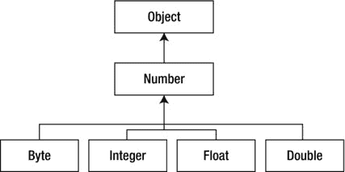

图 3-3.  java.lang 包中的部分继承层次结构

`Number` 类有许多派生类继承的通用方法。派生类不必实现 `Number` 类已实现的通用方法。此外，你可以在需要基类型的地方提供派生类型。例如，`Byte` 是一种 `Number`，这意味着你可以在需要 `Number` 对象的地方提供一个 `Byte` 对象。当你为基类型编写方法时，你可以编写通用目的的方法（或算法）。清单 3-12 展示了一个简单的例子。

清单 3-12.  TestNumber.java

```
public class TestNumber {
        // take an array of numbers and sum them up
        public static double sum(Number []nums) {
                double sum = 0.0;
                for(Number num : nums) {
                       sum += num.doubleValue();
                }
                return sum;
        }

public static void main(String []s) {
                // Create a Number array
                Number []nums = new Number[4];
                // assign derived class objects
                nums[0] = new Byte((byte)10);
                nums[1] = new Integer(10);
                nums[2] = new Float(10.0f);
                nums[3] = new Double(10.0f);
                // pass the Number array to sum and print the result
                System.out.println("The sum of numbers is: " + sum(nums));
        }
}
```

该程序输出

```
The sum of numbers is: 40.0
```

在 `main()` 方法中，你将 `nums` 声明为 `Number[]`。一个 `Number` 引用可以持有其任何派生类型的对象。你正在创建类型为 `Byte`、`Integer`、`Float` 和 `Double` 的对象，初始值为 10；`nums` 数组持有这些元素。（注意，你需要使用 `new Byte( (byte) 10)` 进行显式转换，而不是简单的 `Byte(10)`，因为 `Byte` 接受一个 `byte` 参数，而 10 是一个 `int`。）

`sum` 方法接受一个 `Number[]` 并返回 `Number` 元素的总和。`double` 类型可以容纳最大范围的值，因此你使用 `double` 作为 `sum` 方法的返回类型。`Number` 有一个 `doubleValue` 方法，该方法将 `Number` 持有的值作为 `double` 值返回。`for` 循环遍历数组，累加 `double` 值，然后在完成后返回 `sum`。

如你所见，`sum()` 方法是一个通用方法，可以处理任何 `Number[]`。Java 标准库中也有一个类似的例子，其中 `java.lang.Arrays` 类有一个静态方法 `binarySearch()`：

```
static int binarySearch(Object[] a, Object key, Comparator c)
```


该方法在给定的 `Objects` 数组中搜索指定的键（`Object` 类型）。`Comparator` 是一个声明了 `equals` 和 `compare` 方法的接口。你可以对任何实现了该 `Comparator` 接口的类类型的对象使用 `binarySearch`。如你所见，继承是编写通用方法时一个强大且有用的特性。

在 FunPaint 示例中，基类型 `Shape` 与其派生类型（如 `Circle` 和 `Square`）之间存在继承关系。通过继承将这些类关联起来有什么好处？

假设 FunPaint 用户可以从菜单中选择刷新（即重绘）选项来刷新图形。如果 `Shape` 基类声明了一个 `refresh()` 方法，那么所有派生类都可以实现 `refresh()` 方法。一旦所有派生类都实现了 `refresh()` 方法，刷新所有图形就变得容易了。

```
void refreshAll(Shapes[]shapes) {
        for(Shape shape: shapes)        // 遍历所有图形
                shape.refresh();        // 调用刷新方法
}
```

现在，如果你调用 `refreshAll()` 方法并传入包含屏幕上所有已绘制 `Shapes` 的数组，整个绘图将被刷新。之所以能编写出这样的通用方法，完全是因为“is-a”关系。

运行时多态

你刚刚了解到，基类引用可以指向派生类对象。你可以通过基类引用调用方法；然而，实际的方法调用取决于基类引用所指向对象的动态类型。基类引用的类型被称为对象的*静态类型*，而引用在运行时实际指向的对象被称为对象的*动态类型*。

当编译器看到通过基类引用调用方法时，如果该方法是一个可重写的方法（非静态且非 final 的方法），编译器会将确定具体调用哪个方法的决定推迟到运行时（后期绑定）。在运行时，根据对象的实际动态类型，会调用相应的方法。这种机制被称为*动态方法解析*或*动态方法调用*。

一个示例

假设你在 `Shape` 类中有一个 `area()` 方法。根据派生类（例如 `Circle` 或 `Square`），`area()` 方法会有不同的实现，如清单 3-13 所示。

清单 3-13.  TestShape.java

```
// Shape.java
class Shape {
        public double area() { return 0; } // 默认实现
        // 其他成员
}

// Circle.java
class Circle extends Shape {
        private int radius;
        public Circle(int r) { radius = r; }
        // 其他构造器
        public double area() { return Math.PI * radius * radius; }
        // 其他声明
}

// Square.java
class Square extends Shape {
        private int side;
        public Square(int a) { side = a; }
        public double area() { return side * side; }
        // 其他声明
}

// TestShape.java
class TestShape {
        public static void main(String []args) {
                Shape shape1 = new Circle(10);
                System.out.println(shape1.area());
                Shape shape2 = new Square(10);
                System.out.println(shape2.area());
        }
}
```

该程序输出

```
314.1592653589793
100.0
```

这个程序说明了 `area()` 方法是如何根据 `Shape` 的动态类型被调用的。在这段代码中，语句 `shape1.area();` 调用了 `Circle` 的 `area()` 方法，而语句 `shape2.area();` 调用了 `Square` 的 `area()` 方法，因此得到了上述结果。

现在，让我们提出一个更根本的问题：为什么需要重写方法？在面向对象编程中，继承的基本思想是在基类中提供默认或通用的功能；派生类则期望提供更具体的功能。在这个 `Shape` 基类以及 `Circle` 和 `Square` 派生类中，`Shape` 提供了 `area()` 方法的默认实现。`Circle` 和 `Square` 派生类定义了它们自己版本的 `area()` 方法，覆盖了基类的 `area()` 方法。因此，根据你创建的派生对象类型，通过基类引用对 `area()` 方法的调用将被解析为正确的方法。重写（即运行时多态）是扩展功能的一个简单而强大的思想。

让我们再看一个在 `Point` 类中重写 `Object` 的 `toString()` 方法的例子。但在这样做之前，让我们先探讨一下如果你*不*重写 `toString()` 方法会发生什么，如清单 3-14 所示。

清单 3-14.  Point.java

```
class Point {
        private int xPos, yPos;

public Point(int x, int y) {
                xPos = x;
                yPos = y;
        }

public static void main(String []args) {
                // 将 Point 对象传递给 println 会自动调用 toString 方法
                System.out.println(new Point(10, 20));
        }
}
```

它输出

```
Point@19821f
```

`toString()` 方法定义在 `Object` 类中，Java 中的所有类都继承自该类。以下是 `Object` 类中定义的 `toString()` 方法的概述：

```
public String toString()
```

`toString()` 方法不接受任何参数，并返回对象的 `String` 表示形式。该方法的默认实现返回 `ClassName@hex` 形式的对象哈希码。这就是为什么你会得到这种难以阅读的输出。请注意，这个十六进制值对于每个实例都是不同的，所以如果你尝试运行这个程序，你会得到不同的十六进制值作为输出。例如，当我们再次运行这个程序时，我们得到了这个输出：`Point@affc70`。

当你创建新类时，你应该重写此方法以返回你期望的类的文本表示形式。清单 3-15 展示了 `Point` 类的一个改进版本，其中重写了 `toString()` 方法。

清单 3-15.  改进的 Point.java

```
// Point 类的改进版本，重写了 toString 方法
class Point {
        private int xPos, yPos;

public Point(int x, int y) {
                xPos = x;
                yPos = y;
        }

// 这个 toString 方法覆盖了 Object 基类中提供的默认 toString 方法实现
        public String toString() {
                return "x = " + xPos + ", y = " + yPos;
        }

public static void main(String []args) {
                System.out.println(new Point(10, 20));
        }
}
```

这个程序现在输出

```
x = 10, y = 20
```

这正如你所期望的那样，清晰多了。为了更清楚，这里是这个 `Point` 类实现中 `main()` 方法的一个略有不同的版本：

```
 public static void main(String []args) {
        Object obj = new Point(10, 20);
        System.out.println(obj);
}
```

它输出

```
x = 10, y = 20
```

这里，`obj` 变量的静态类型是 `Object` 类，而对象的动态类型是 `Point`。`println` 语句调用了 `obj` 变量的 `toString()` 方法。在这里，由于运行时多态，调用了派生类（即 `Point` 的 `toString()` 方法）的 `toString()` 方法。

重写问题

在重写时，你需要注意访问级别、方法名称及其签名。以下是刚刚讨论的 `Point` 类中的 `toString()` 方法：


```
public String toString() {
        return "x = " + xPos + ", y = " + yPos;
}
```

在这个方法定义中，将访问修饰符从 `public` 改为 `protected` 会怎样？能正常工作吗？

```
protected String toString() {
        return "x = " + xPos + ", y = " + yPos;
}
```

不行，这样不行。进行此修改后，编译器会报错：

```
Point.java:8: toString() in Point cannot override toString() in java.lang.Object; attempting to assign weaker access privileges; was public
```

在重写方法时，你可以提供更强的访问权限，但不能提供更弱的访问权限；否则会导致编译错误。

下面是 `toString()` 方法的另一个略微修改的版本。它能正常工作吗？

```
public Object toString() {
        return "x = " + xPos + ", y = " + yPos;
}
```

你会得到以下编译器错误：

```
Point.java:8: toString() in Point cannot override toString() in java.lang.Object; attempting to use incompatible return type. Found: java.lang.Object. Required: java.lang.String.
```

在这种情况下，由于返回类型不匹配，你遇到了编译错误，因为重写方法中的返回类型必须与基类方法完全相同。

下面是另一个例子：

```
public String ToString() {
        return "x = " + xPos + ", y = " + yPos;
}
```

现在编译器不再报错。但这是一个名为 `ToString` 的新方法，它与 `Object` 类中的 `toString` 方法无关。因此，这个 `ToString` 方法*并没有*重写 `toString` 方法。

请牢记以下几点，以确保正确重写。重写方法：

*   应具有与基类版本*相同的参数列表类型（或兼容类型）*。
*   应具有*相同的返回类型*。

*   但从 Java 5 开始，返回类型可以是子类——即协变返回类型（你很快就会学到）。
*   不应使用比基类版本*更严格的访问修饰符*。

*   但可以使用限制更少的访问修饰符。

*   不应抛出新的或更宽泛的受检异常。

*   但可以抛出更少或更窄的受检异常，或任何非受检异常。

*   还有，哦对了，方法名必须完全匹配！

请记住，如果你没有继承某个方法，就不能重写它。私有方法不能被重写，因为它们不会被继承。

|  | 基类方法和重写方法的签名必须兼容，重写才能发生。 |

|  | 不正确的重写是 Java 程序中常见的错误来源。在回答与重写相关的问题时，要留意重写中的错误或问题。 |

协变返回类型

你知道，在重写方法时，方法的返回类型必须完全匹配。然而，借助 Java 5 引入的协变返回类型特性，你可以在重写方法中提供返回类型的派生类。嗯，这很棒，但为什么需要这个特性呢？来看看这些具有相同返回类型的重写方法：

```
abstract class Shape {
     // 其他方法...
     public abstract Shape copy();
}

class Circle extends Shape {
     // 其他方法...
     public Circle(int x, int y, int radius) { /* 在此处初始化字段 */ }
     public Shape copy() { /* 返回此对象的副本 */ }
}

class Test {
     public static void main(String []args) {
             Circle c1 = new Circle(10, 20, 30);
             Circle c2 = c1.copy();
     }
}
```

这段代码会引发编译错误：`"Type mismatch: cannot convert from Shape to Circle"`。这是因为在赋值语句 `"Circle c2 = c1.copy();"` 中缺少从 `Shape` 到 `Circle` 的显式向下转型。

由于你清楚地知道要将 `Circle` 的 `copy` 方法返回的 `Circle` 对象赋值给变量，你可以通过显式强制转换来修复编译错误：

```
Circle c2 = (Circle) c1.copy();
```

由于提供这种（或多或少毫无意义的）向下转型很繁琐，Java 提供了协变返回类型，允许你在重写方法中给出返回类型的派生类。换句话说，你可以像这样修改 `copy` 方法的定义：

```
public Circle copy() { /* 返回此对象的副本 */ }
```

现在，`main` 方法中的赋值语句 `Circle c2 = c1.copy();` 是有效的，并且不需要显式向下转型（这很好）。

重写：深入探讨

深入理解方法重写很重要，所以让我们更详细地探讨一下。让我们在 `Point` 类中使用重写的 `equals` 方法。在此之前，先看一下 `Object` 类中 `equals()` 方法的签名：

```
public boolean equals(Object obj)
```

`Object` 类中的 `equals()` 方法是一个可重写的方法，它接受 `Object` 类型作为参数。它检查当前对象的内容与传入的 `obj` 参数是否相等。如果相等，`equals()` 返回 true；否则返回 false。

现在，让我们看看 清单 3-16 中的 `Point` 类是否正确重写了 `equals()` 方法。

清单 3-16.  Point.java

```
public class Point {
        private int xPos, yPos;

public Point(int x, int y) {
                xPos = x;
                yPos = y;
        }

// 重写 equals 方法以执行
        // 两个 Point 对象的“深度”比较
        public boolean equals(Point other){
                if(other == null)
                        return false;
                // 两个点相等仅当它们的 x 和 y 位置相等
                if( (xPos == other.xPos) && (yPos == other.yPos) )
                        return true;
                else
                        return false;
        }

public static void main(String []args) {
                Point p1 = new Point(10, 20);
                Point p2 = new Point(50, 100);
                Point p3 = new Point(10, 20);
                System.out.println("p1 equals p2 is " + p1.equals(p2));
                System.out.println("p1 equals p3 is " + p1.equals(p3));
        }
}
```

这会输出：

```
p1 equals p2 is false
p1 equals p3 is true
```

输出符合预期，那么这个 `equals()` 实现正确吗？不！让我们对 `main()` 方法做如下轻微修改：

```
public static void main(String []args) {
        Object p1 = new Point(10, 20);
        Object p2 = new Point(50, 100);
        Object p3 = new Point(10, 20);
        System.out.println("p1 equals p2 is " + p1.equals(p2));
        System.out.println("p1 equals p3 is " + p1.equals(p3));
}
```

现在它输出：

```
p1 equals p2 is false
p1 equals p3 is false
```

为什么？两个 `main()` 方法是等价的。然而，这个新的 `main()` 方法使用 `Object` 类型来声明 `p1`、`p2` 和 `p3`。这三个变量的动态类型是 `Point`，所以它应该调用重写后的 `equals()` 方法。但是，重写是错误的，因此 `main()` 方法调用了基类版本，即 `Object` 类中 `Point` 的默认实现！

|  | 如果基类方法和重写方法的名称或签名不匹配，会导致微妙的错误。因此，请确保它们完全相同。 |

`equals()` 方法应该使用 `Object` 作为参数，而不是 `Point` 参数！`Point` 类中 `equals()` 方法的当前实现*隐藏*了（*而不是*重写）`Object` 类的 `equals()` 方法。


为了克服重载中的细微问题，你可以使用 Java 5 引入的 `@Override` 注解。该注解向 Java 编译器明确表达了程序员使用方法重写的意图。如果编译器对你的重写方法不满意，它会发出警告，这对你来说是一个有用的提醒。此外，该注解使程序更易于理解，因为方法定义前的 `@Override` 注解有助于你理解自己正在重写一个方法。

以下是 `equals` 方法带有 `@Override` 注解的代码：

```
@Override
public boolean equals(Point other) {
        if(other == null)
                        return false;
        // 两个点相等仅当它们的 x 和 y 位置相等
        if( (xPos == other.xPos) && (yPos == other.yPos) )
                        return true;
        else
                return false;
}
```

现在这段代码会得到一个编译器错误：“类型为 Point 的方法 `equals(Point)` 必须重写或实现超类型方法”。如何修复它？你需要将 `Object` 类型传递给 `equals` 方法的参数。清单 3-17 展示了修复后的 `equals` 方法的程序。

清单 3-17.  修复后的 Point.java

```
public class Point {
        private int xPos, yPos;

public Point(int x, int y) {
                xPos = x;
                yPos = y;
        }

// 重写 equals 方法以对两个 Point 对象进行“深度”比较
        @Override
        public boolean equals(Object other) {
                if(other == null)
                        return false;

// 检查 'other' 的动态类型是否为 Point
                // 如果 'other' 是除 'Point' 之外的任何其他类型，则两个对象不可能相等
                // 如果 'other' 是 Point 类型（或其派生类之一），则
                // 将对象向下转型为 Point 类型，然后比较成员是否相等
                if(other instanceof Point) {
                          Point anotherPoint = (Point) other;
                          // 两个点相等仅当它们的 x 和 y 位置相等
                          if( (xPos == anotherPoint.xPos) && (yPos == anotherPoint.yPos) )
                          return true;
                }
                return false;
        }

public static void main(String []args) {
                Object p1 = new Point(10, 20);
                Object p2 = new Point(50, 100);
                Object p3 = new Point(10, 20);
                System.out.println("p1 equals p2 is " + p1.equals(p2));
                System.out.println("p1 equals p3 is " + p1.equals(p3));
        }
}
```

现在这个程序输出：

```
p1 equals p2 is false
p1 equals p3 is true
```

这是预期的输出，并且 `equals` 方法的实现是正确的。

调用超类方法

在重写的方法中调用基类方法通常很有用。为此，你可以使用 `super` 关键字。在派生类构造函数中，你可以使用 `super` 关键字调用基类构造函数。如果使用，这样的调用应该是构造函数中的*第一条语句*。你也可以使用 `super` 关键字来引用基类成员。在这些情况下，它不必是方法体中的第一条语句。让我们看一个例子。

你实现了一个 `Point` 类，它是一个二维点：它有 x 和 y 位置。你也可以实现一个具有 x、y 和 z 位置的三维点类。为此，你不需要从头开始实现：你可以扩展二维点并在三维点类中添加 z 位置。首先，你将 `Point` 类的简单实现重命名为 `Point2D`。然后，你将通过扩展这个 `Point2D` 来创建 `Point3D` 类（参见清单 3-18）。

清单 3-18.  Point3D.java

```
// Point2D.java
class Point2D {
        private int xPos, yPos;
        public Point2D(int x, int y) {
                xPos = x;
                yPos = y;
        }

public String toString() {
                return "x = " + xPos + ", y = " + yPos;
        }

public static void main(String []args) {
                System.out.println(new Point2D(10, 20));
        }
}

//Point3D.java

// 以下是我们如何通过扩展 Point2D 类来创建 Point3D 类
public class Point3D extends Point2D {
        private int zPos;

// 提供一个接受三个参数（x、y 和 z 值）的公共构造函数
        public Point3D(int x, int y, int z) {
                // 调用带有两个参数的超类构造函数
                // 即，从 Point2D(int, int, int) 构造函数调用 Point2D(int, int)
                super(10, 20); // 注意 super 是方法中的第一条语句
                zPos = z;
        }

// 也重写 toString 方法
        public String toString() {
                return super.toString() + ", z = " + zPos;
        }

// 测试我们是否正确扩展了，调用 Point3D 对象的 toString 方法
        public static void main(String []args) {
                System.out.println(new Point3D(10, 20, 30));
        }
}
```

在类 `Point2D` 中，类成员 `xPos` 和 `yPos` 是私有的，因此你不能直接访问它们来在 `Point3D` 构造函数中初始化它们。但是，你可以使用 `super` 关键字调用超类构造函数并传递参数。这里，`super(10, 20);` 调用了基类构造函数 `Point2D(int, int)`。这个对超类构造函数的调用应该是第一条语句；如果你在 `zPos = z;` 之后调用它，你会得到一个编译器错误：

```
public Point3D(int x, int y, int z) {
        zPos = z;
        super(10, 20);
}

Point3D.java:19: 对 super 的调用必须是构造函数中的第一条语句
                super(10, 20);
```

类似地，你可以在派生类 `Point3D` 的 `toString()` 实现中使用 `super` 关键字调用基类 `Point2D` 的 `toString()` 方法。

类型转换

Java 是一种*强类型*语言：它执行严格的类型检查，以确保你只进行有效的转换。如果你执行一些明显无效的强制转换，编译器会给出编译器错误。如果编译器没有捕获到无效的强制转换，则会导致运行时问题或异常。因此，在执行类型转换时需要小心。

向上转型和向下转型

你可以将派生对象赋值给基类型引用，而无需执行任何显式强制转换：这就是*向上转型*。相反，如果你需要将其放回派生类型，则需要显式强制转换：这就是*向下转型*。让我们通过简单的例子详细检查这两种类型的强制转换。

在 Java 中，每个类都派生自 `Object` 基类。因此，你可以将任何对象放入 `Object` 引用中，并且它永远不会失败。

```
String str1 = "Hello world";
Object obj = str1; // 不需要显式强制转换——此类转换永远不会失败
```

但是，如果你从 `Object` 引用转换为某个派生类型（例如 `String`），则可能会失败。为什么？因为，通常，`Object` 引用可以保存任何类型的对象，并且它可能不是你向下转型的目标类型。

```
String str2 = obj;
```

对于此语句，你会得到以下错误：

```
编译器错误 - 不兼容的类型
找到   : java.lang.Object
需要: java.lang.String
```

要修复此问题，你需要使用显式的向下转型为 `String`，如下所示：

```
String str2 = (String) obj;
```

当你执行此类显式类型转换（向下转型）时，你有责任确保向下转型是有效的。否则，你会得到一个运行时异常。考虑清单 3-19 中的程序。你能说出它的输出吗？

清单 3-19.  Downcast.java


```
// 理解向下转型为何会失败的代码
class Downcast {
        public static void main(String []args) {
                Integer i = new Integer(10);
                // 向上转型 - 没问题，且总会成功
                Object obj = i;
                // 向下转型 - 会成功吗？失败时会发生什么？
                String str = (String) obj;
        }
}
```

该程序会因运行时异常而崩溃：

```
Exception in thread "main" java.lang.ClassCastException: java.lang.Integer cannot be cast to java.lang.String
        at Downcast.main(Downcast.java:6)
```

在这个程序中，你首先让 `Integer` 类型的变量 `i` 指向一个 `Object` 类型的变量 `obj`。这种类型转换是向上转型，因此没有问题，因为这种转换总会成功。现在，当你尝试将 `Object` 类型的变量转换为 `String` 类型时，这就是向下转型。编译器并不知道 `obj` 变量所指向对象的动态类型（而你知道 `obj` 指向的变量的动态类型是 `Integer` 类型）。通过显式类型转换，你强制编译器进行从 `Object` 类型到 `String` 类型的转换。由于 `Integer` 类型无法转换为 `String` 类型，向下转型失败，并抛出 `ClassCastException`。

|  | 向上转型总会成功，因此你无需担心。然而，向下转型可能会因运行时异常而失败，所以在进行向下转型时需要小心。 |

与向下转型不同，无效的转换可以被编译器本身检测到。我们接下来将讨论这个主题。

不可转换类型之间的转换

`String` 和 `StringBuffer` 都继承自 `Object` 类。但你无法直接将 `String` 转换为 `StringBuffer`，反之亦然。例如，有人可能会错误地写出如下代码：

```
Object obj = new StringBuffer("Hello");
String str2 = (String) obj;
```

编译会成功，但此转换会在运行时失败：

```
'Exception in thread "main" java.lang.ClassCastException: java.lang.StringBuffer cannot be cast to java.lang.String'.
```

在这个例子中，你首先将一个 `StringBuffer` 对象放入 `Object` 类型中，然后尝试将其转换回 `String`。那么，直接从 `StringBuffer` 转换为 `String` 呢？这会导致编译器错误/警告，还是运行时异常？

```
 String str = (String) new StringBuffer("Hello");
```

你会得到一个编译器错误，因为无法从 `StringBuffer` 转换为 `String`：

```
Cast.java:4: inconvertible types found : java.lang.StringBuffer required: java.lang.String
```

那么，对于目标类型是 `StringBuffer` 但中间转换是 `String` 的这条语句呢？

```
StringBuffer str = (String) new StringBuffer("Hello"); 
```

你仍然会得到相同的编译器错误，因为无法从 `StringBuffer` 转换为 `String`。这引出了一个重要问题：如何判断一个无效转换会导致编译器错误还是运行时异常？

如果编译器仅能利用源类型和目标类型的静态类型信息，并推断出这是一个无效转换，那么它就会成为编译器错误。如果转换的成功与否取决于对象的动态类型，编译器就无法预测转换结果。在这些情况下，它就会成为运行时异常。

使用“instanceof”进行安全的向下转型

如果在程序执行过程中抛出了 `ClassCastException`，并且没有相应的异常处理器，程序就会终止。那么，像这样提供一个异常处理器如何？

```
try {
        StringBuffer str = new StringBuffer("Hello");
        Object obj = str;
        String strBuf = (String) obj;
}
catch(ClassCastException e) {
        // 忽略异常——我们不希望程序因此崩溃！！！
}
```

是的，这样可行，程序不会崩溃。但这确实是一个*非常*糟糕的主意！这段代码存在两个主要问题。

1.  像这样为 `RuntimeExceptions` 提供异常处理器，会制造一种程序运行完全正常的假象，而实际上并非如此！
2.  像 `ClassCastException` 这样的运行时异常表明存在编程错误，不应使用异常处理器来捕获。

那么，现在该怎么办呢？在向下转型之前，先检查对象的动态类型，然后再进行向下转型。

```
StringBuffer str = new StringBuffer("Hello");
Object obj = str;
if(obj instanceof String) {
        String strBuf = (String) obj;
}
```

这是一种实现向下转型的有效且恰当的方式。使用 `instanceof` 运算符可以检查 `obj` 的动态类型，这有助于你决定是否将其向下转型为 `String` 对象。

回到 FunPaint 的例子，你有抽象基类 `Shape` 和许多派生对象，如 `Square`、`Circle` 等。你可能需要执行类型转换，以便在基类型和派生类型之间进行转换。示例如下：

```
Shape shape = canvas.getHighlightedShape();
Circle circle = (Circle) shape;
circle.redraw();
```

这里，假设有一个名为 `getHighlightedShape()` 的方法，它返回画布上当前高亮的 `Shape`。在语句 `Circle circle = (Circle) shape;` 中，你正在从 `Shape` 类型向下转型为 `Circle` 类型。然而，这是危险的，因为如果 `Shape` 持有的是 `Square` 对象，那么这次向下转型就会失败。为了避免这种情况，你需要在向下转型之前使用 *instanceof* 运算符，如下所示：

```
Shape shape = drawingWindow.getHighlightedShape();
if(shape instanceof Circle) {
        Circle circle = (Circle) shape;
        circle.redraw();
}
```

|  | 处理像 `ClassCastExceptions` 这样的运行时异常是一种糟糕的做法。相反，最好引入防御性编程检查，以避免在运行时出现此类异常。 |

Java 包

当应用程序规模增长时，你需要一种有效的机制来管理所有源文件。Java 支持*包*的概念，这是一种用于组织类并提供命名空间管理的作用域结构。所有紧密相关的类可以放在一个单一的实体中：一个包。包不仅能降低大型应用程序的复杂性，还能提供访问保护。

本质上，使用包有以下优点：

*   包通过促进相似类的分类来降低复杂性。
*   包提供命名空间管理。例如，两个开发者可以通过将相同类型名称放在不同的包中，从而避免名称冲突。
*   包提供访问保护（回顾关于默认访问修饰符的讨论）。

Java SDK 被分类到各种包中。例如，`java.lang` 提供基本的语言功能和基础类型，`java.io` 可用于执行与文件相关的操作。

如何创建自己的包，并在其他包中使用（或导入）其中的类？我们接下来将讨论这个问题。

使用包

当你想要将一个类包含在某个包中时，只需在类中使用 `package` 语句进行声明即可。在 FunPaint 应用程序中，你有 `Circle` 类。如果你想将这个类包含在 `package graphicshape` 中，那么以下声明即可生效：

```
// Circle.java
package graphicshape;

public class Circle {
        //类定义
}
```

现在，假设你想在你的 `Canvas` 类（位于不同的包中）中使用这个 `Circle` 类；请参见清单 3-20。

清单 3-20.  Canvas.java

```
// Canvas.java
package appcanvas;

public class Canvas {
        public static void main(String[] args) {
                Circle circle = new Circle();
                circle.area();
        }
}
```


这段代码会导致编译器报出以下错误信息：`"Circle cannot be resolved to a type"`。不过，你可以通过提供完整的限定类名来消除这个错误，如下所示：

```
// Canvas.java
package appcanvas;

public class Canvas {
        public static void main(String[] args) {
                graphicshape.Circle circle = new graphicshape.Circle();
                circle.area();
        }
}
```

另一种更便捷的解决方法是使用 `import` 语句。`import` 语句会指示编译器去哪里查找所用类型的定义。在这个例子中，你将从 `graphicshape` 包中导入：

```
// Canvas.java
package appcanvas;
import graphicshape.Circle;

public class Canvas {
        public static void main(String[] args) {
                Circle circle = new Circle();
                circle.area();
        }
}
```

你需要记住，`package` 语句必须出现在最前面，后面跟着 `import` 语句。显然，在一个 Java 源文件中只能有一条 `package` 语句。

假设你想在 `Canvas` 的实现中使用各种形状，比如 `Circle`、`Square`、`Triangle` 等（它们都属于 `graphicshape` 包）。你可以为每个 `graphicshape` 类使用一条 `import` 语句（例如 `import graphicshape.Circle;` 和 `import graphicshape.Square;`）。在这种情况下，更便捷的方式是使用带有通配符“*”的 `import` 语句，它表示“包含该包中的所有类”，如下所示：

```
import graphicshape.*;
```

请注意，物理层次结构（文件系统中的直接目录结构）应与包层次结构保持一致。

|  | 你不需要导入 `java.lang` 包就能使用语言的基本功能。这是唯一一个被隐式导入的包，该包中的类在所有程序中都可以直接使用。 |

静态导入

回顾一下清单 3-13 中 `area()` 方法的实现，这里重新展示如下：

```
public double area() {
        return Math.PI * radius * radius;
}
```

该实现使用了 `Math` 包中的静态成员 `PI`；这就是为什么我们在 `PI` 前面加上了包引用。Java 5 引入了一个新特性——*静态导入*——它可以用来导入所导入包或类中的静态成员。你可以像在当前类中定义了这些静态成员一样使用它们。要使用这个特性，你必须在 `import` 声明中使用“static”关键字。让我们用静态导入重新实现 `area()` 方法：

```
import static java.lang.Math.PI;

// 类声明和其他成员
public double area() {
        return PI * radius * radius;
}
```

你也可以使用通配符“*”来导入指定包或类中的所有静态成员。

|  | 请始终记住，静态导入只会导入指定包或类中的静态成员。 |

需要提醒一点：虽然使用静态导入非常方便，但它可能会给后续阅读代码的开发者带来困惑，尤其是当当前类也定义了类似的成员时。这可能会让人难以区分某个定义是静态导入的还是本地定义的。

JAVA 包的命名规范

Oracle 推荐以下 Java 包命名规范：

*   通常使用层次结构来定义包和子包。
*   所有 Java 包通常使用小写字母。
*   产品可以使用组织结构来定义包层次结构。例如，某公司（假设名为 COMP）有多个产品，其中一个产品是 PROD；该产品中的一个功能是 FTUR；该功能中的一个包是 PCKG。在这种情况下，包层次结构将是 `comp.prod.ftur.pckg`。
*   反转的互联网域名也可以用作包层次结构，例如 `com.company.feature`。
*   如果产品名称或公司名称中包含连字符或其他特殊字符，请使用下划线代替连字符和其他特殊字符。

问答时间！

在 FunPaint 应用程序中，你可以为对象着色。你需要 `Color` 类来实现这个功能。该类应使用 RGB（红、绿、蓝）颜色方案。这三个颜色分量值应作为 `int` 值存储在三个字段中。该类应实现一个默认构造函数（将颜色值设置为零）和另一个接受这三个分量值作为参数的构造函数。

1.  这个程序的输出是什么？

```
    class Color {
         int red, green, blue;

void Color() {
                 red = 10;
                 green = 10;
                 blue = 10;
         }

void printColor() {
                 System.out.println("red: " + red + " green: " + green + " blue: " + blue);
         }

public static void main(String [] args) {
                 Color color = new Color();
                 color.printColor();
         }
    }
    ```

*   A.  编译器错误：没有为类提供构造函数。
    *   B.  编译无错误，运行时打印以下内容：red: 0 green: 0 blue: 0。
    *   C.  编译无错误，运行时打印以下内容：red: 10 green: 10 blue: 10。
    *   D.  编译无错误，运行时抛出 `NullPointerException` 导致崩溃。

**答案**：B。编译无错误，运行时打印以下内容：red: 0 green: 0 blue: 0。

（请记住，构造函数没有返回类型；如果提供了返回类型，它会被视为该类中的一个方法。在这个例子中，由于 `Color` 有 `void` 返回类型，它变成了 `Color` 类中一个名为 `Color()` 的方法，而编译器提供了默认的 `Color` 构造函数。默认情况下，数据值被初始化为零，因此输出如上。）

2.  查看以下代码并预测输出：

```
    class Color {
         int red, green, blue;

Color() {
                 Color(10, 10, 10);
         }

Color(int r, int g, int b) {
                 red = r;
                 green = g;
                 blue = b;
         }

void printColor() {
                 System.out.println("red: " + red + " green: " + green + " blue: " + blue);
         }

public static void main(String [] args) {
                 Color color = new Color();
                 color.printColor();
         }
    }
    ```

*   A.  编译器错误：找不到符号。
    *   B.  编译无错误，运行时打印以下内容：red: 0 green: 0 blue: 0。
    *   C.  编译无错误，运行时打印以下内容：red: 10 green: 10 blue: 10。
    *   D.  编译无错误，运行时抛出 `NullPointerException` 导致崩溃。

**答案**：A。编译器错误：找不到符号。

（当编译器执行到 `Color(10, 10, 10);` 这条语句时，它会查找名为 `Color()` 的方法。调用另一个构造函数的正确方式是使用 `this` 关键字，如下所示：`this(10, 10, 10);`。）

3.  在 FunPaint 应用程序中，你需要编写类来绘制矩形。矩形可以有平边或圆角。你还需要为（平边或圆角的）矩形着色。你将如何定义类来创建这些平边、着色和圆角的矩形？你可以根据需要运用 is-a 关系。

查看以下实现所需功能的选项：


```
    class Rectangle { /* */ }
    class ColoredRectangle extends Rectangle { /* */ }
    class RoundedRectangle extends Rectangle { /* */ }
    class ColoredRoundedRectangle extends ColoredRectangle, RoundedRectangle { /* */ }
    ```

选择正确的选项：

*   A.  编译器错误：应为“{”，无法继承两个类。
    *   B.  编译无错误，运行时抛出异常 `MultipleClassInheritanceException`。
    *   C.  编译无错误，运行时抛出异常 `NullPointerException`。
    *   D.  编译无错误，运行时抛出异常 `MultipleInheritanceError`。

**答案**：A. 编译器错误：应为“{”，无法继承两个类。

（该程序会导致编译错误，因为 Java 不支持多重继承。）

4.  在 FunPaint 应用程序中，你可以为各种形状对象填充颜色。要实现此功能，你需要实现一个 `Color` 类。`Color` 类有三个成员：`m_red`、`m_green` 和 `m_blue`。重点关注 `toString()` 方法并检查其是否正常工作。

根据以下程序选择最佳选项：

```
    class Color {
         int red, green, blue;

Color() {
                 this(10, 10, 10);
         }

Color(int r, int g, int b) {
                red = r;
                green = g;
                blue = b;
         }
         public String toString() {
              return "The color is: " + red + green + blue;
         }

public static void main(String [] args) {
                 // 隐式调用 toString 方法
                 System.out.println(new Color());
         }
    }
    ```

*   A.  编译器错误：类型不兼容。
    *   B.  编译无错误，运行时打印以下内容：The color is: 30。
    *   C.  编译无错误，运行时打印以下内容：The color is: 101010。
    *   D.  编译无错误，运行时打印以下内容：The color is: red green blue。

**答案**：C. 编译无错误，运行时打印以下内容：The color is: 101010。

（`toString()` 实现中的表达式为 “The color is: “ + red + blue + green。由于第一个操作数是字符串，`+` 操作变为字符串连接运算符，结果为字符串 “The color is: 10”。随后，再次出现连接运算符 `+`，依此类推，最终打印出 “The color is: 101010”。）

5.  根据以下程序选择最佳选项：

```
    class Color {
         int red, green, blue;

Color() {
                 this(10, 10, 10);
         }

Color(int r, int g, int b) {
                 red = r;
                 green = g;
                 blue = b;
         }

String toString() {
                 return "The color is: " + " red = " + red + " green = " + green + " blue = " + blue;
         }

public static void main(String [] args) {
                 // 隐式调用 toString 方法
                 System.out.println(new Color());
         }
    }
    ```

*   A.  编译器错误：试图分配更弱的访问权限；`toString` 在 `Object` 中是 public 的。
    *   B.  编译无错误，运行时打印以下内容：The color is: red = 10 green = 10 blue = 10。
    *   C.  编译无错误，运行时打印以下内容：The color is: red = 0 green = 0 blue = 0。
    *   D.  编译无错误，运行时抛出 `ClassCastException`。

**答案**：A. 编译器错误：试图分配更弱的访问权限；`toString` 在 `Object` 中是 public 的。

（`toString()` 方法未指定访问修饰符。`Object` 的 `toString()` 方法具有 public 访问修饰符；你不能降低方法的可见性。因此，这将导致编译错误。）

总结

面向对象编程基础

*   *封装*：将数据及其操作函数组合成一个单一单元。
*   *抽象*：隐藏底层细节，仅向用户暴露必要且相关的细节。
*   *继承*：在相关类之间创建层次关系。
*   *多态*：根据上下文对同一消息（即方法调用）进行不同含义的解释。

**类基础**

*   *“类”* 是一个模板（或蓝图），而 *“对象”* 是类的一个实例。
*   *构造器*没有返回类型。
*   你无法在派生类中访问基类的 *private* 方法。
*   你可以从同一包中的类（如同包私有或默认访问权限）以及派生类中访问 *protected* 方法。
*   如果方法在同一包中，你也可以访问具有 *默认访问修饰符* 的方法。
*   你可以从任何其他类访问类的 *public* 方法。

**重载**

*   *方法重载*：创建名称相同但参数类型和/或数量不同的方法。
*   你可以拥有 *重载的构造器*。你可以使用 `this` 关键字在另一个构造器中调用同一类的构造器。
*   *重载解析* 是当方法存在重载定义时，编译器查找并解析调用的过程。

继承

*   *继承* 也被称为 *“is-a”关系*。
*   基于对象的动态类型来解析方法调用被称为 *运行时多态*。
*   在 *重写* 中，方法名、参数数量、参数类型和返回类型必须完全匹配。
*   在 *协变返回类型* 中，你可以在重写方法中提供返回类型的派生类。
*   你使用 `super` 关键字来调用基类方法。
*   重载是 *静态多态*（*早期绑定*）的一个例子，而重写是 *动态多态*（*晚期绑定*）的一个例子。
*   执行 *向上转型* 时，你不需要进行显式转换。向上转型总是成功的。
*   执行 *向下转型* 时，你需要进行显式转换。向下转型可能会失败。因此，你可以使用 `instanceof` 运算符来检查向下转型是否有效。

Java 包

*   *包* 是一种作用域构造，用于对类进行分类并提供命名空间管理。

第 4 章


高级类设计

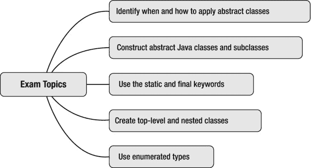

在上一章中，你学习了面向对象编程的基本概念，并使用它们构建了 Java 程序。在本章中，你将学习面向对象编程的高级概念、Java 语言的支持以及这些概念的细节。

在开篇部分，你将学习抽象类及其在实际场景中的用途。第二和第三部分涵盖了 `final` 和 `static` 这两个有用且常用的关键字。第四部分探讨了嵌套类的各种变体：静态嵌套类、内部类、局部内部类和匿名内部类。最后一部分讨论了枚举数据类型，该类型是在 Java 5 中引入的。

本章中的一些概念，尤其是嵌套类及其变体，在初读时并不容易理解。尽管我们努力以易于理解的方式呈现诸如匿名类和嵌套接口等较难的概念，但掌握它们的最佳方式还是使用它们编写程序。

对于 OCPJP 7 考试，你需要彻底了解所有这些概念。本章旨在加深你对 Java 语言的理解，并直接为你准备 OCPJP 7 考试。

抽象类


在许多编程场景中，你希望在不涉及实现细节的情况下定义抽象。此时，可以使用 Java 平台支持的*抽象类*或*接口*。当你希望定义带有某些通用功能的抽象时，通常会使用抽象类。我们将在下一章详细讨论接口，本节仅聚焦于抽象类。

你无法创建抽象类的实例。那么你可能会问，为什么要使用抽象类呢？抽象类在面向对象编程中非常有用，强烈推荐使用的原因如下：

*   抽象类定义了抽象概念，并将具体实现细节留给子类。一个抽象类型可能有多种变体，因此需要不同的实现；抽象类为子类实现这些变体提供了合适的平台。如果抽象类型及其子类（具体实现）定义得当，那么这些类的使用者就可以利用运行时多态。运行时多态是可取的，因为它能在对象之间引入松耦合。
*   另一个推荐使用抽象类的原因是它们能够提供默认实现。抽象类的子类可以根据需要特化默认实现。
*   抽象类是存放抽象类几乎所有子类所需的通用功能的完美占位符。

回想一下你在上一章开发的 FunPaint 应用。`Shape` 类为你在 FunPaint 应用中可绘制的不同形状提供了抽象。你可以创建 `Square` 和 `Circle` 等 `Shape` 类的对象，但直接创建 `Shape` 类本身的对象有意义吗？没有，现实世界中并不存在名为 `Shape` 的对象。实际上，`Shape` 是一个通用抽象，它可以被任何具体的形状（如 `Circle`）所替代。

`Shape` 类可以重写为抽象类：

```
abstract class Shape {
        public double area() { return 0; } // 默认实现
        // 其他成员
}
```

在类定义前加上 `abstract` 关键字，即可将类声明为抽象类。让我们尝试创建一个 `Shape` 对象：

```
Shape shape = new Shape();
```

对于这条语句，编译器会报错：`"Shape is abstract; cannot be instantiated"`。在 `Shape` 类定义中，有一个名为 `area()` 的方法，用于返回特定形状的面积。该方法适用于所有形状，因此它位于基类 `Shape` 中。然而，`Shape` 类中 `area()` 方法的实现应该是什么？你无法提供默认实现；将这个方法实现为 `return 0;` 是一个糟糕的解决方案，尽管编译器会欣然接受。更好的解决方案是将其声明为抽象方法，如下所示：

```
public abstract double area(); // 注意：没有实现（即没有方法体定义）
```

与声明抽象类类似，通过在方法前加上 `abstract` 关键字，你可以将 `area()` 方法声明为抽象方法。普通方法与抽象方法的主要区别在于，你不为抽象方法提供方法体。如果你提供了方法体，就会出错，如下所示：

```
public abstract double area() { return 0; } // 编译器错误！
```

对于这个定义，你会得到编译器错误：`"abstract methods cannot have a body"`。好吧，没问题！你不能为抽象方法提供方法体，但抽象方法的意义何在？抽象类通过抽象方法向其所有客户端（该抽象的使用者）承诺某些功能。抽象方法声明强制所有子类提供该抽象方法的实现。如果派生类没有实现基类中定义的所有抽象方法，那么该派生类应被声明为抽象类，如下例所示：


```
abstract class Shape {
        public abstract double area(); // 无实现
        // 其他成员
}

class Rectangle extends Shape { }
```

这段代码会导致编译器报错：`"Rectangle is not abstract and does not override abstract method area() in Shape"`。要修复此问题，你需要将派生类声明为 `abstract`，或者在派生类中提供 `area()` 方法的定义。将 `Rectangle` 声明为抽象类并不合理；因此你可以像这样定义 `area()` 方法：

```
class Rectangle extends Shape {
        private int length, height;
        public double area() { return length * height; }
        // 其他成员 ...
}
```

现在我们来讨论另一种场景：所有形状对象都需要支持一项通用功能。例如，每个对象都可以被绘制在另一个形状对象内部，这意味着每个形状对象都有一个父级（即容器）对象。如前所述，抽象类是将通用功能集中放置的最佳位置。

```
public abstract class Shape {
        abstract double area();
        private Shape parentShape;
        public void setParentShape(Shape shape){
                parentShape = shape;
        }
        public Shape getParentShape(){
                return parentShape;
        }
}
```

这个抽象类定义了一个属性和两个方法，这些属性和方法将对其所有子类可用。很实用，不是吗？

**要点记忆**

请掌握以下关于抽象类和抽象方法的要点，因为它们很可能出现在 OCPJP 7 考试中：

*   `abstract` 关键字可以应用于类或方法，但不能应用于字段。
*   抽象类不能被实例化。不过，你可以创建抽象类类型的引用变量。实际上，你可以创建从抽象类派生的类的对象，并使抽象类引用指向所创建的派生类对象。
*   抽象类可以继承另一个抽象类，也可以实现一个接口。
*   抽象类可以从具体类派生！尽管语言允许这样做，但这不是一个好主意。
*   抽象类不必声明抽象方法，这意味着抽象类不一定非要拥有声明为 `abstract` 的方法。然而，如果一个类包含抽象方法，则它必须被声明为抽象类。
*   抽象类的子类需要提供所有抽象方法的实现；否则，你需要将该子类声明为抽象类。
*   抽象类可以拥有声明为 `static` 的方法或字段。

**使用“final”关键字**

对于 OCPJP 7 考试，你需要了解 `final` 关键字的用途。在本节中，你将学习如何将 `final` 关键字用于类、方法和变量。

**最终类**

最终类是一种*不可继承的类*——也就是说，如果你将一个类声明为 final，就不能再创建它的子类。通常，面向对象编程建议类应对扩展开放，对修改关闭（开闭原则）。然而，在某些情况下，你不希望允许某个类被继承。两个重要的原因是：

1.  *防止通过继承改变行为*。在某些情况下，你可能认为类的实现已经完整，不应再更改。如果允许重写，则方法的行为可能会被改变。你知道，在需要基类对象的地方可以使用派生类对象，但在某些情况下你可能不希望这样。通过将类声明为 final，类的使用者可以确保行为不变。
2.  *提升性能*。最终类的所有方法调用都可以在编译时解析。由于没有重写方法的可能性，因此无需在运行时为最终类解析实际调用，这可以转化为性能提升。出于同样的原因，最终类鼓励方法内联。如果调用需要在运行时解析，则无法进行内联。


在 Java 库中，许多类都被声明为 `final`；例如，`String` `(java.lang.String)` 和 `System (java.lang.System)` 类。这些类几乎在所有 Java 程序中都被广泛使用。例如，如果你使用 `System.out.println()` 语句，你同时使用了 `System` 类（其中包含输出流和 `println` 方法）和 `String` 类，因为 `println` 方法接受 `String` 作为参数。如果这两个类没有被声明为 `final`，那么就有可能有人通过子类化来改变这些类的行为，从而导致整个程序的行为发生变化。为了避免此类问题，像这样广泛使用的类以及诸如 `Integer` 之类的包装类在 Java 库中都被声明为 `final`。

|  | 将类声明为 final 所带来的性能提升是有限的；重点应该放在适当的地方使用 `final`。OCPJP 7 考试主要考察你是否了解 `final` 关键字的正确用法。 |

在 FunPaint 示例中，你有一个画布，用于拖放形状来创建图片。假设你有一个 `Canvas` 类来实现该功能。此外，你希望确保通过继承 `Canvas` 不会改变其行为。换句话说，你想让 `Canvas` 成为一个 final 类。

```
final class Canvas { /* 成员 */ }

class ExtendedCanvas extends Canvas { /* 成员 */ }
```

如果你尝试扩展一个 final 类，就像你刚才尝试做的那样，你会得到编译器错误 `"cannot inherit from final Canvas"`。

Final 方法和变量

在一个类中，你可以将方法声明为 final。final 方法不能被重写。因此，如果你在一个非 final 类中将一个方法声明为 final，那么你可以扩展该类，但不能重写这个 final 方法。然而，基类中其他非 final 的方法可以在派生类的实现中被重写。

例如，在 FunPaint 应用程序中，一个方法是 final 的（`setParentShape()`），另一个方法是非 final 的（`getParentShape()`），如清单 4-1 所示。

清单 4-1.  Shape.java

```
public abstract class Shape {
        //类成员...
        final public void setParentShape(Shape shape){
                //方法体
        }
        public Shape getParentShape(){
                //方法体
        }
}
```

在这种情况下，`Circle` 类（`Shape` 的子类）只能重写 `getParentShape()`；如果你尝试重写这个 final 方法，你会得到以下错误：`"Cannot override the final method from Shape"`。

最后，我们提一下 *final 变量*。final 变量就像 CD-ROM：一旦你写入了内容，就不能再写入。在编程中，像 PI 这样的通用常量可以被声明为 final，因为你不想让任何人修改这些常量的值。final 变量只能被赋值一次。如果你在初始化后尝试更改一个 final 变量，Java 编译器会报错。

要点记忆

掌握以下要点，因为它们很可能出现在 OCPJP 7 考试中：

*   final 修饰符可以应用于类、方法或变量。final 类的所有方法都隐式地是 final 的（因此不可重写）。
*   final 变量只能被赋值一次。如果变量声明将变量定义为 final 但未初始化，则称为 *空白 final*。你需要在类中定义的所有构造函数中初始化这个空白 final；否则编译器会报错。
*   关键字 `final` 甚至可以应用于参数。final 参数的值一旦赋值就不能更改。这里需要注意的是，对于基本类型，“值”是隐式理解的。然而，对于对象，“值”指的是对象引用，而不是其状态。因此，你可以更改传递进来的 final 对象的内部状态，但不能更改引用本身。

使用 “static” 关键字

假设你想编写一个简单的类，用于统计到目前为止已创建的该类类型的对象数量。清单 4-2 中的程序能工作吗？

清单 4-2.  Counter.java

```
// Counter 类应该统计从该类创建的实例数量
public class Counter {
        private int count; // 用于存储创建的对象数量的变量
        // 对于每个创建的 Counter 对象，默认构造函数都会被调用；
        // 因此，在默认构造函数中更新计数器值
        public Counter() {
                count++;
        }
        public void printCount() { // 用于打印当前计数器值的方法
                System.out.println("到目前为止创建的实例数量是: " + count);
        }
        public static void main(String []args) {
                Counter anInstance = new Counter();
                anInstance.printCount();
                Counter anotherInstance = new Counter();
                anotherInstance.printCount();
        }
}
```

程序的输出是

```
到目前为止创建的实例数量是: 1
到目前为止创建的实例数量是: 1
```

哎呀！从输出可以看出，该类并没有跟踪创建的对象数量。发生了什么？

你使用了一个 *实例变量* `count` 来跟踪从该类创建的对象数量。由于该类的每个实例都有自己的 count 值，所以它总是打印 `1`！你需要的是一个可以在所有实例之间共享的变量。这可以通过将变量声明为 `static` 来实现。静态变量与其类相关联，而不是与其对象相关联；因此它们被称为 *类变量*。静态变量在程序开始执行时只被初始化一次。静态变量将其状态与该类的所有实例共享。你可以使用类名（而不是实例）来访问静态变量。清单 4-3 展示了 `Counter` 类的正确实现，其中 `count` 变量和 `printCount` 方法都被声明为 static。

清单 4-3.  Counter.java

```
// Counter 类应该统计从该类创建的实例数量
public class Counter {
        private static int count; // 用于存储创建的对象数量的变量
        // 对于每个创建的 Counter 对象，默认构造函数都会被调用；
        // 因此，在默认构造函数中更新计数器值
        public Counter() {
                count++;
        }
        public static void printCount() { // 用于打印当前计数器值的方法
                System.out.println("到目前为止创建的实例数量是: " + count);
        }
        public static void main(String []args) {
                Counter anInstance = new Counter();
                // 注意我们如何使用类名而不是实例变量名来调用 printCount
                Counter.printCount();
                Counter anotherInstance = new Counter();
                Counter.printCount();
        }
}
```

这个程序打印

```
到目前为止创建的实例数量是: 1
到目前为止创建的实例数量是: 2
```

这里，静态变量 `count` 在程序开始执行时被初始化。在创建第一个对象时，count 增加到 1。类似地，当创建第二个对象时，`count` 的值变为 2。正如程序输出所示，两个对象都更新了同一个 `count` 变量的副本。


好的，作为一名高级文档工程师和翻译员，我将严格遵循您提供的注意事项和示例，将给定的英文文本翻译成中文。


请注意，我们将对 `printCount()` 的调用改为了使用类名 `Counter`，即 `Counter.printCount()`。编译器会接受之前的 `anInstance.printCount()` 和 `anotherInstance.printCount()` 这两种调用，因为使用类名或实例变量名调用静态方法在语义上没有区别。但是，不推荐使用实例变量来调用静态方法。惯例是使用实例变量调用实例方法，使用类名调用静态方法。

静态方法只能访问静态变量，并且只能调用静态方法。相比之下，实例方法（非静态）可以调用静态方法或访问静态变量。

静态块

除了静态变量和方法，你还可以在类定义中定义一个*静态块*。当 JVM 将类加载到内存时，会执行这个静态块。例如，在前面的例子中，你可以定义一个静态块，将 `count` 变量初始化为默认值 1，而不是默认值 0，如清单 4-4 所示。

清单 4-4.  Counter.java

```
public class Counter {
        private static int count;
        static {
                // 此静态块中的代码将在 JVM 将类加载到内存时执行
                count = 1;
        }
        public Counter() {
                count++;
        }
        public static void printCount() {
                System.out.println("到目前为止创建的实例数量为: " + count);
        }
        public static void main(String []args) {
                Counter anInstance = new Counter();
                Counter.printCount();
                Counter anotherInstance = new Counter();
                Counter.printCount();
        }
}
```

该程序输出

```
到目前为止创建的实例数量为: 2
到目前为止创建的实例数量为: 3
```

不要将静态块与构造函数混淆。构造函数在创建类的实例时被调用，而静态块在程序初始化时被调用。

要点提示

*   `main()` 方法是程序主要执行的起点，它总是被声明为静态的。为什么？如果它是一个实例方法，将无法调用它。你必须先启动程序才能创建实例，然后才能调用该方法，对吧？
*   你不能覆盖基类中提供的静态方法。为什么？方法调用是根据实例类型通过运行时多态性来解析的。由于静态方法与类（而非实例）相关联，因此你不能覆盖静态方法，并且静态方法无法实现运行时多态性。
*   静态方法不能在其方法体中使用 `this` 关键字。为什么？请记住，静态方法与类相关联，而不是与实例相关联。只有实例方法才有关联的隐式引用；因此，类方法没有关联的 `this` 引用。
*   静态方法不能在其方法体中使用 `super` 关键字。为什么？你使用 `super` 关键字从派生类的覆盖方法中调用基类方法。由于你不能覆盖静态方法，因此不能在其方法体中使用 `super` 关键字。
*   由于静态方法无法访问实例变量（非静态变量），因此它们最适合用于工具函数。例如，`java.util.math` 库中的所有方法都是静态的。
*   与调用实例方法相比，调用静态方法被认为效率稍高。这是因为编译器在调用静态方法时无需传递隐式的 `this` 对象引用，而调用实例方法时则需要。

嵌套类的种类

定义在另一个类（或接口）主体内部的类被称为*嵌套类*。通常，你定义的类是直接属于某个包的顶层类。相比之下，嵌套类是包含在另一个类或接口内部的类。

在另一个类或接口内部创建类有什么好处？有几个好处。首先，你可以将相关的类作为一个逻辑组放在一起。其次，嵌套类可以访问其外部类的所有类成员，这在某些情况下可能很有用。第三，嵌套类有时用于特定目的。例如，匿名内部类对于使用 AWT/Swing 编写更简单的事件处理代码很有用（这与 OCPJP 7 考试无关，因此本书不涉及）。目前，你可以相信我们的话，嵌套类在某些情况下很有用，因此值得学习。

在 Java 中，有四种类型或*种类*的嵌套类：

*   静态嵌套类
*   内部类
*   局部内部类
*   匿名内部类

这四种种类之间的区别乍一看并不明显，而且经常使用替代术语来指代它们，这无助于澄清问题。为了帮助澄清混淆，我们在图 4-1 中示意性地表示了这四种嵌套类。

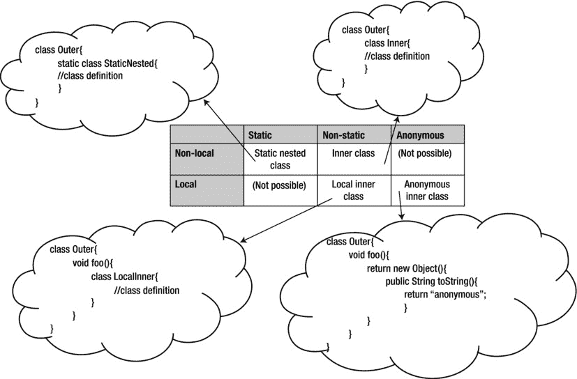

图 4-1.  嵌套类的类型及示例

研究此图。*局部类*定义在代码块（无论是方法、构造函数还是初始化块）内部，而*非局部类*定义在类内部。*静态类*使用 `static` 关键字限定，而*非静态类*在类定义中不使用 `static` 关键字。在*匿名类*中，你不提供类的名称；你只需定义其主体！

正如你在图 4-1 中所见，*静态嵌套类*是静态且非局部的，而*内部类*是非静态且非局部的。非静态且局部的嵌套类是*局部内部类*，而局部且匿名的嵌套类是*匿名内部类*。回顾此图将有助于你刷新对四种嵌套类之间本质区别的记忆。

现在，让我们更详细地讨论这四种种类中的每一种。

静态嵌套类（或接口）

你可以将一个类（或接口）定义为另一个类（或接口）内部的静态成员。由于外部类型可以是类或接口，内部类型也可以是类或接口，因此有四种组合。以下是这四种类型的示例，以便你了解它们的语法：

```
class Outer {           // 外部类有一个静态嵌套类
        static class Inner {}
}

interface Outer {       // 外部接口有一个静态嵌套类
        static class Inner {}
}

class Outer {           // 外部类有一个静态嵌套接口
        static interface Inner {}
}

interface Outer {       // 外部接口有一个静态嵌套接口
        static interface Inner {}
}
```

你不必显式地对嵌套接口使用 `static` 关键字，因为它隐式地是静态的。现在，让我们看一个创建并使用静态嵌套类的示例。

回顾第 3 章中的 FunPaint 示例，该示例实现了一个包含 `m_red`、`m_green` 和 `m_blue` 字段的 `Color` 类。由于所有形状都可以着色，你可以在 `Shape` 类中定义 `Color` 类，如清单 4-5 所示。

清单 4-5.  TestColor.java


```
abstract class Shape {
        public static class Color {
                int m_red, m_green, m_blue;
                public Color() {
                        // 通过传递默认值调用另一个重载的 Color 构造函数
                        this(0, 0, 0);
                }
                public Color(int red, int green, int blue) {
                        m_red = red; m_green = green; m_blue = blue;
                }
                public String toString() {
                        return " red = " + m_red + " green = " + m_green + " blue = " + m_blue;
                }
                // 其他颜色成员已省略
        }
        // 其他 Shape 成员已省略
}

public class TestColor {
        public static void main(String []args) {
                // 由于 Color 是一个静态嵌套类，
                // 我们使用外部类的名称来访问它，例如 Shape.Color
                // 注意，我们不需要（也无法）实例化 Shape 类来使用 Color 类
                Shape.Color white = new Shape.Color(255, 255, 255);
                System.out.println("White color has values:" + white);
        }
}
```

输出结果为

```
 White color has:  red = 255 green = 255 blue = 255
```

你从这段代码中观察到了什么？`Shape` 类被声明为 `abstract`。你可以看到 `Color` 类被定义为 `Shape` 类内部的 `public static` 类。`TestColor` 类使用 `Shape.Color` 语法来引用这个类。除了这个细微差别之外，`Color` 类看起来与在 `Shape` 类外部定义 `Color` 类并无不同。是的，这是一个很好的观察。那么，让我们重复一遍以明确：静态嵌套类与定义为外部类的类几乎相同，只有一个区别——它在物理上定义在另一个类的内部！

**要点记忆**

以下是关于静态嵌套类（和接口）的一些值得注意的方面，这些将有助于你应对 OCPJP 7 考试：

*   静态嵌套类的可访问性（`public`、`protected` 等）由外部类定义。
*   静态嵌套类的名称使用 `OuterClassName.NestedClassName` 语法表示。
*   当你在接口内部定义内部嵌套类（或接口）时，该嵌套类被隐式声明为 `public` 和 `static`。这一点很容易记住：接口中的任何字段都被隐式声明为 `public` 和 `static`，而静态嵌套类也具有相同的行为。
*   静态嵌套类可以被声明为 `abstract` 或 `final`。
*   静态嵌套类可以继承另一个类，也可以用作基类。
*   静态嵌套类可以拥有静态成员。（正如你稍后将看到的，此声明不适用于其他类型的嵌套类。）
*   静态嵌套类可以访问外部类的成员（显然，仅限静态成员）。
*   外部类也可以通过嵌套类的对象访问嵌套类的成员（甚至是私有成员）。如果你没有声明嵌套类的实例，外部类就不能直接访问嵌套类的元素。

**内部类**

你可以在另一个类内部将一个类（或接口）定义为非静态成员。那么，在接口内部声明一个类或接口呢？正如你刚才在关于静态内部类的第三点中看到的，当你在接口内部定义一个类或接口时，它被隐式地声明为 `static`。因此，不可能声明一个非静态的内部接口！这就留下了两种可能性：

```
class Outer {           // 外部类包含一个内部类
        class Inner {}
}

class Outer {           // 外部类包含一个内部接口
        interface Inner {}
}
```

让我们创建一个 `Point` 类来实现 `Circle` 的中心。由于你想将每个 `Circle` 与一个中心 `Point` 关联起来，因此将 `Point` 作为 `Circle` 的内部类是一个好主意，如代码清单 4-6 所示。

代码清单 4-6.  Circle.java

```
public class Circle {
        // 将 Point 定义为 Circle 类内部的内部类
        class Point {
                private int xPos;
                private int yPos;
                // 你可以像这样为内部类提供构造函数
                public Point(int x, int y) {
                        xPos = x;
                        yPos = y;
                }
                // 内部类与任何其他类一样——你可以在此处重写方法
                public String toString() {
                        return "(" + xPos + "," + yPos + ")";
                }
        }

// 利用内部类来声明字段
        private Point center;
        private int radius;
        public Circle(int x, int y, int r) {
                // 注意如何利用内部类来实例化它
                center = this.new Point(x, y);
                radius = r;
        }

public String toString() {
                return "mid point = " + center + " and radius = " + radius;
        }

public static void main(String []s) {
                System.out.println(new Circle(10, 10, 20));
        }
        // 其他方法如 area 已省略
}
```

这个 `Circle` 和 `Point` 的实现与你之前看到的非常相似，唯一的重大区别在于这里你将 `Point` 定义为 `Circle` 的私有成员。你像这样实例化内部类：

```
center = this.new Point(x, y);
```

你可能想知道为什么不能使用通常的 `new` 语句：

```
center = new Point(x, y);
```

你需要使用外部类的对象引用作为前缀来创建内部类的实例。在这种情况下，它是一个 `this` 引用，所以你在 `new` 运算符之前用 `this` 作为前缀。

|  | 每个内部类都与外部类的一个实例相关联。换句话说，内部类总是与一个封闭对象相关联。 |

外部类和内部类共享一种特殊的关系，就像朋友或同一家庭的成员。无论访问说明符（如 `private`）如何，成员访问都是有效的。然而，存在细微差别。你可以在不创建实例的情况下访问内部类中的外部类成员；但外部类的情况并非如此。你需要创建内部类的实例才能访问内部类的成员（*任何*成员，包括私有成员）。

内部类的一个限制是，你不能在内部类中声明静态成员，如下所示：

```
class Outer {
        class Inner {
                static int i = 10;
        }
}
```

如果你尝试这样做，将会遇到以下编译器错误：

```
Outer.java:3: inner classes cannot have static declarations
                static int i = 10;
```

**要点记忆**

以下是关于内部类和接口的一些重要规则，这些规则可能在 OCPJP 7 考试中很有用：

*   内部类的可访问性（`public`、`protected` 等）由外部类定义。
*   就像顶级类一样，内部类可以继承一个类或实现接口。类似地，内部类可以被其他类继承，内部接口可以被其他类或接口实现或继承。
*   内部类可以被声明为 `final` 或 `abstract`。
*   内部类可以拥有内部类，但阅读或理解这种复杂的类嵌套会很困难。（意思是：避免这样做！）

**局部内部类**

*局部内部类*定义在代码块中（例如，在方法、构造函数或初始化块中）。与静态嵌套类和内部类不同，局部内部类不是外部类的成员；它们只是定义它们的方法或代码的局部变量。

以下是局部类通用语法的一个示例：


```
class SomeClass {
        void someFunction() {
                class Local { }
        }
}
```

如这段代码所示，`Local` 是在 `someFunction` 内部定义的类。它在 `someFunction` 外部不可访问，甚至对 `SomeClass` 的成员也不可见。由于不能将局部变量声明为 `static`，因此也不能将局部类声明为 `static`。

由于接口中不能定义方法，因此接口内部不能包含局部类或局部接口。也不能创建局部接口。换句话说，不能在方法、构造器和初始化块中定义接口。

现在你已经理解了语法，让我们进入一个实际示例。在 FunPaint 应用程序中，你将 `Color` 类实现为静态嵌套类。以下是你在该讨论中看到的代码：

```
abstract class Shape {
        public static class Color {
                int m_red, m_green, m_blue;
                public Color() {
                        this(0, 0, 0);
                }
                public Color(int red, int green, int blue) {
                        m_red = red; m_green = green; m_blue = blue;
                }
                public String toString() {
                        return " red = " + m_red + " green = " + m_green + " blue = " + m_blue;
                }
                // 其他颜色成员已省略
        }
        // 其他 Shape 成员已省略
}
```

现在，这个 `toString()` 方法显示了 `Color` 的字符串表示形式。假设你需要在 FunPaint 应用程序的屏幕底部显示帮助消息。为此，你需要描述性消息。以这种晦涩格式显示消息对读者帮助不大。因此，你希望以以下格式显示 `Color` 字符串：`"You selected a color with RGB values red = 0 green = 0 blue = 0"`。为此，你必须在 `StatusReporter` 类中定义一个名为 `getDescriptiveColor()` 的方法。在 `getDescriptiveColor()` 中，你必须创建一个 `Shape.Color` 的派生类，其中 `toString` 方法返回此描述性消息。清单 4-7 是使用局部类的实现。

清单 4-7.  StatusReporter.java

```
class StatusReporter {
        // 注意：参数 "color" 被声明为 final 非常重要
        // 否则，局部内部类 DescriptiveColor 将无法使用它！！
        static Shape.Color getDesciptiveColor(final Shape.Color color) {
                // 局部类 DescriptiveColor，它扩展了 Shape.Color 类
                class DescriptiveColor extends Shape.Color {
                        public String toString() {
                                return "You selected a color with RGB values " + color;
                        }
                }
                return new DescriptiveColor();
        }

public static void main(String []args) {
                Shape.Color descriptiveColor =
                        StatusReporter.getDesciptiveColor(new Shape.Color(0, 0, 0));
                System.out.println(descriptiveColor);
        }
}
```

`main` 方法检查 `StatusReporter` 是否正常工作。该程序打印：

```
 You selected a color with RGB values  red = 0 green = 0 blue = 0 
```

让我们看看局部类是如何定义的。`getDescriptiveColor()` 方法接受普通的 `Shape.Color` 类对象，并返回一个 `Shape.Color` 对象。在 `getDescriptiveColor()` 方法内部，你定义了 `DescriptiveColor` 类，该类是该方法的局部类。这个 `DescriptiveColor` 是 `Shape.Color` 的派生类。在 `DescriptiveColor` 类内部，唯一定义的方法是 `toString()` 方法，它覆盖了基类 `Shape.Color` 的 `toString()` 方法。在 `DescriptiveColor` 类定义之后，`getDescriptiveColor` 方法创建了一个 `DescriptiveColor` 类的对象并返回它。

在 `Test` 类中，你可以看到一个 `main()` 方法，它只是调用了 `StatusReporter.getDescriptiveColor()` 方法，并将结果存储在一个 `Shape.Color` 引用中。你会注意到 `getDescritiveColor()` 方法返回一个 `DescriptiveColor` 对象，该对象派生自 `Shape.Color`，因此 `descriptiveColor` 变量的初始化工作正常。在 `println` 中，`descriptiveColor` 的动态类型是 `DescriptiveColor` 对象，因此打印出了颜色对象的详细描述。

你是否注意到 `getDescriptiveColor()` 方法中的另一个特性？它的参数被声明为 `final`。如果移除 `final` 限定符，如下面的代码所示，会发生什么？

```
static Shape.Color getDesciptiveColor(Shape.Color color)
```

嗯，你会得到以下编译器错误：

```
StatusReporter.java:24: 局部变量 color 从内部类中访问；需要被声明为 final
        return "You selected a color with RGB values " + color;
                                                            ^
1 error
```

为什么？关于局部类，你需要记住的一点是，只能将 `final` 变量传递给局部类。

|  | 只能将 **final** 变量传递给局部内部类。 |

要点记忆

关于局部类的以下几点很可能在 OCPJP 7 考试中出现：

你可以在代码体内部创建非静态局部类。接口不能有局部类，也不能创建局部接口。

*   局部类只能从定义该类的代码体内部访问。局部类在定义该类的代码体外部完全不可访问。
*   在定义局部类时，可以扩展一个类或实现接口。
*   局部类可以访问定义它的代码体中所有可用的变量。只能将 final 变量传递给局部内部类。

匿名内部类

顾名思义，*匿名内部类*没有名称。类的声明自动从实例创建表达式中派生。它们也简称为*匿名类*。

在几乎所有可以使用局部内部类的情况下，匿名类都很有用。局部内部类有名称，而匿名内部类没有——这是主要区别！另一个区别是匿名内部类不能有任何显式构造器。构造器以类名命名，由于匿名类没有名称，因此无法定义构造器！

（在继续之前，请注意：不存在所谓的“匿名接口”。）

以下是一个仅用于说明局部类语法的示例：

```
class SomeClass {
        void someFunction() {
                new Object() { };
        }
}
```

这段代码看起来晦涩难懂，不是吗？这里发生了什么？在语句 `new Object() { };` 中，你直接使用 `new` 关键字声明了一个 `Object` 的派生类。它没有定义任何代码，并返回该派生对象的一个实例。创建的对象没有在任何地方使用，因此被忽略。这里的 `new` 表达式调用了默认构造器；你也可以通过在 `new` 表达式中传递参数来选择调用基类的多参数构造器。定义匿名类时，它会隐式扩展基类（此处是 `Object` 基类）。

如果你没有理解这个示例，请不要担心。现在你将看到一个更实际的示例，匿名类的用法会变得更清晰。

之前你在 `StatusReporter` 类的 `getDescriptiveColor` 方法中看到了 `DescriptiveColor` 类（清单 4-7）。你可以通过将局部类转换为匿名类来简化代码，如清单 4-8 所示。

清单 4-8.  StatusReporter.java


```
class StatusReporter {
        static Shape.Color getDesciptiveColor(final Shape.Color color) {
                // 注意这里使用了匿名内部类——具体来说，该类没有名称，
                // 我们在 return 语句中“即时”构造并使用该类！
                return new Shape.Color() {
                        public String toString() {
                                return "You selected a color with RGB values " + color;
                        }
                };
        }
        public static void main(String []args) {
                Shape.Color descriptiveColor =
                        StatusReporter.getDesciptiveColor(new Shape.Color(0, 0, 0));
                System.out.println(descriptiveColor);
        }
}
```

输出结果为

```
 You selected a color with RGB values  red = 0 green = 0 blue = 0
```

这很不错。程序的其余部分，包括 `main()` 方法，保持不变，而 `getDescriptiveColor()` 方法变得更简单了！你没有显式创建一个有名称的类（即之前的 `DescriptiveColor`），而是在 return 语句中“即时”创建了一个 `Shape.Color` 的派生类。注意，关键字 `class` 也不再需要了。

**要点记忆**

以下关于匿名类的要点涉及 OPCJP 7 考试中可能提出的问题：

*   匿名类是在 `new` 表达式本身中定义的，因此你无法创建匿名类的多个对象。
*   在定义匿名类时，不能显式地继承某个类或显式地实现接口。

**枚举数据类型**

在很多情况下，你需要限制用户只能从预定义的列表中选择输入。例如，你可能希望用户从一组定义了几种打印机类型的常量中进行选择：

```
public static final int DOTMATRIX = 1;
public static final int INKJET = 2;
public static final int LASER = 3;
```

这种方案是可行的。然而，在这种情况下，你可以传入任何其他整数（例如 10），编译器也会欣然接受。因此，这种方案并不是一个*类型安全的方案*。

为了避免这种情况，你可以定义自己的类（例如 `PrinterType`），并只允许合法的值。但是，你需要手动定义该类及其属性。这就是以前你可以采用 Joshua Bloch 的*类型安全枚举模式*的地方。不过别担心——你不再需要学习那些模式了。Java 5 引入了数据类型 *enum* 来帮助你应对这种情况。

清单 4-9 为上述示例定义了一个枚举类（是的，枚举是特殊的类）。

清单 4-9.  EnumTest.java

```
// 定义一个用于分类打印机类型的枚举
enum PrinterType {
        DOTMATRIX, INKJET, LASER
}

// 现在测试这个枚举
public class EnumTest {
        PrinterType printerType;

public EnumTest(PrinterType pType) {
                printerType = pType;
        }

public void feature() {
                // 根据构造函数中传入的打印机类型进行 switch 判断
                switch(printerType){
                case DOTMATRIX:
                        System.out.println("Dot-matrix printers are economical and almost obsolete");
                        break;
                case INKJET:
                        System.out.println("Inkjet printers provide decent quality prints");
                        break;
                case LASER:
                        System.out.println("Laser printers provide best quality prints");
                        break;
                }
        }

public static void main(String[] args) {
                EnumTest enumTest = new EnumTest(PrinterType.LASER);
                enumTest.feature();
        }
}
```

输出结果为

```
Laser printers provide best quality prints
```

让我们更详细地探究一下清单 4-9 的示例。

*   在 switch-case 语句中，你不需要为枚举元素提供完全限定名称。这是因为 switch 接收的是枚举类型的一个实例，因此 switch-case 能够理解你指定枚举元素时的上下文（类型）。
*   在创建 `enumTest` 实例时，除了枚举定义中指定的值之外，你不能提供任何其他输入。这使得枚举是类型安全的。

请注意，你可以像声明任何其他普通 Java 类一样，将枚举（本例中的 `PrinterType`）声明在一个单独的文件中。

现在你已经理解了枚举数据类型的基本概念，让我们看一个更详细的示例，其中你在枚举数据类型中定义了成员属性和方法。是的，你可以在枚举定义中定义方法或字段，如清单 4-10 所示。

清单 4-10.  PrinterType.java

```
public enum PrinterType {
        DOTMATRIX(5), INKJET(10), LASER(50);

private int pagePrintCapacity;

private PrinterType(int pagePrintCapacity) {
                this.pagePrintCapacity = pagePrintCapacity;
        }

public int getPrintPageCapacity() {
                return pagePrintCapacity;
        }
}
// EnumTest.java
public class EnumTest {
        PrinterType printerType;

public EnumTest(PrinterType pType) {
                printerType = pType;
        }

public void feature() {
                switch (printerType) {
                case DOTMATRIX:
                        System.out.println("Dot-matrix printers are economical");
                        break;
                case INKJET:
                        System.out.println("Inkjet printers provide decent quality prints");
                        break;
                case LASER:
                        System.out.println("Laser printers provide the best quality prints");
                        break;
                }
                System.out.println("Print page capacity per minute: " +
                        printerType.getPrintPageCapacity());
        }

public static void main(String[] args) {
                EnumTest enumTest1 = new EnumTest(PrinterType.LASER);
                enumTest1.feature();
                EnumTest enumTest2 = new EnumTest(PrinterType.INKJET);
                enumTest2.feature();
        }
}
```

上述程序的输出如下：

```
Laser printers provide the best quality prints
Print page capacity per minute: 50
Inkjet printers provide decent quality prints
Print page capacity per minute: 10
```

那么，在这个新版本的枚举示例程序中，你观察到了什么？你为枚举类定义了一个新属性、一个新构造函数和一个新方法。属性 `pagePrintCapacity` 由枚举元素（例如 `LASER(50)`）指定的初始值设置，这会调用枚举类的构造函数。然而，枚举类不能有公共构造函数，否则编译器会报出以下信息：`"Illegal modifier for the enum constructor; only private is permitted."`

|  | 枚举类中的构造函数只能指定为 private。 |

**要点记忆**


*   枚举被隐式声明为 public、static 和 final，这意味着你无法扩展它们。
*   定义枚举时，它会隐式继承自 `java.lang.Enum`。在内部，枚举会被转换为类。此外，枚举常量是枚举类的实例，该常量被声明为该类的成员。
*   你可以对枚举元素应用 `valueOf()` 和 `name()` 方法，以返回枚举元素的名称。
*   如果在类内部声明枚举，则默认情况下它是 static 的。
*   你不能对枚举数据类型使用 new 运算符，即使在枚举类内部也不行。
*   你可以使用 == 运算符比较两个枚举是否相等。当调用枚举常量的 `toString()` 方法时，它会打印该枚举常量的名称。
*   `Enum` 类中的静态 `values()` 方法在枚举类型上调用时，会返回一个包含所有枚举常量的数组。
*   枚举常量不能被克隆。尝试克隆会抛出 `CloneNotSupportedException` 异常。
*   如果枚举常量来自两个不同的枚举，`equals()` 方法不会返回 true。

|  | 枚举避免了魔法数字，这提高了源代码的可读性和可理解性。此外，枚举是类型安全的构造。因此，你应该在适用的情况下使用枚举。 |

提问时间！

1.  以下哪个陈述是正确的？

*   A.  你不能扩展一个具体类并声明该派生类为抽象类。
    *   B.  你不能从一个抽象类扩展另一个抽象类。
    *   C.  抽象类必须至少声明一个抽象方法。
    *   D.  你可以实例化一个抽象类的具体子类，但不能实例化抽象类本身。

**答案**：D。你可以实例化一个抽象类的具体子类，但不能实例化抽象类本身。

2.  根据以下类定义选择最佳答案：

```
    public  abstract final class Shape { }
    ```

*   A.  编译器错误：类不能为空。
    *   B.  编译器错误：修饰符 abstract 和 final 的组合非法。
    *   C.  编译器错误：抽象类必须至少声明一个抽象方法。
    *   D.  无编译器错误：此类定义正确，将成功编译。

**答案**：B。编译器错误：修饰符 abstract 和 final 的组合非法。

（你不能将抽象类声明为 final，因为抽象类必须被扩展。在 Java 中，类可以为空，包括抽象类。抽象类可以声明零个或多个抽象方法。）

3.  查看以下代码，并为单词 `<access-modifier>` 选择正确的选项：

```
    // Shape.java
    public class Shape {
         protected void display() {
                 System.out.println("Display-base");
         }
    }

// Circle.java
    public class Circle extends Shape {
         <access-modifier> void display(){
                 System.out.println("Display-derived");
         }
    }
    ```

*   A.  只能使用 protected。
    *   B.  public 和 protected 都可以使用。
    *   C.  public、protected 和 private 都可以使用。
    *   D.  只能使用 public。

**答案**：B。public 和 protected 都可以使用。

（重写方法时，只能提供限制更少或相同级别的访问修饰符。）

4.  考虑以下程序并回答问题：

```
    class Shape {
         public Shape() {
                 System.out.println("Shape constructor");
         }
         public class Color {
                 public Color() {
                         System.out.println("Color constructor");
                 }
         }
    }

class TestColor {
         public static void main(String []args) {
                  Shape.Color black = new Shape().Color(); // #1
         }
    }
    ```

该程序的输出是什么？

*   A.  编译错误：类型 Shape 未定义方法 Color()。
    *   B.  编译错误：无效的内部类。
    *   C.  运行正常：Shape constructor, Color constructor。
    *   D.  运行正常：Color constructor, Shape constructor。

**答案**：A。编译错误：类型 Shape 未定义方法 Color()。

（你需要创建外部类 Shape 的实例才能创建内部类实例。）

5.  如果将上一个问题程序中（注释标记为 #1 的）Color 类实例化语句替换为以下语句，程序的输出是什么？

```
    Shape.Color black = new Shape().new Color();
    ```

*   A.  运行正常并打印以下输出：
        Shape constructor
        Color constructor
    *   B.  运行正常并打印以下输出：
        Color constructor
        Shape constructor
    *   C.  编译错误：类型 Shape 未定义方法 Color()。
    *   D.  编译无错误但导致运行时异常。

**答案**：A。运行正常并打印以下输出：

Shape constructor
    Color constructor

6.  给定程序的输出是什么？

```
    class Shape {
         private boolean isDisplayed;
         protected int canvasID;
         public Shape() {
                 isDisplayed = false;
                 canvasID = 0;
         }
         public class Color {
                 public void display() {
                         System.out.println("isDisplayed: "+isDisplayed);
                         System.out.println("canvasID: "+canvasID);
                 }
         }
    }

class TestColor {
         public static void main(String []args) {
                 Shape.Color black = new Shape().new Color();
                 black.display();
         }
    }
    ```

*   A.  编译器错误：内部类只能访问外部类的 public 成员。
    *   B.  编译器错误：内部类不能访问外部类的 private 成员。
    *   C.  运行并打印以下输出：

isDisplayed: false

canvasID: 0

*   D.  编译正常但运行时崩溃并抛出异常。

**答案**：C。运行并打印以下输出：

*   isDisplayed: false
    *   canvasID: 0

（内部类可以访问外部类的所有成员，包括外部类的 private 成员。）

7.  查看此程序并预测输出：

```
    public class EnumTest {
         PrinterType printerType;

enum PrinterType {INKJET, DOTMATRIX, LASER};
         public EnumTest(PrinterType pType) {
                 printerType = pType;
         }

public static void main(String[] args) {
                 PrinterType pType = new PrinterType();
                 EnumTest enumTest = new EnumTest(PrinterType.LASER);
         }
    }
    ```

*   A.  打印输出 printerType:LASER。
    *   B.  编译器错误：枚举必须声明为 static。
    *   C.  编译器错误：无法实例化类型 EnumTest.PrinterType。
    *   D.  此程序编译正常，运行时将崩溃并抛出运行时异常。

**答案**：C。编译器错误：无法实例化类型 EnumTest.PrinterType。

（你不能使用 new 实例化枚举类型。）

8.  下面的枚举定义是否正确？

```
    public enum PrinterType {
         private int pagePrintCapacity;          // #1
         DOTMATRIX(5), INKJET(10), LASER(50);    // #2

private PrinterType(int pagePrintCapacity) {
                 this.pagePrintCapacity = pagePrintCapacity;
         }

public int getPrintPageCapacity() {
                 return pagePrintCapacity;
         }
    }
    ```

*   A.  是的，此枚举定义正确，将干净地编译，没有任何警告或错误。
    *   B.  不，此枚举定义不正确，将导致编译错误。
    *   C.  不，此枚举定义将导致运行时异常。
    *   D.  是的，此枚举定义正确，但编译时会带有警告。


**答案**：B. 不，这个枚举定义不正确，会导致编译错误。

（在枚举类中，你需要先定义枚举元素，然后才能定义其他属性。换句话说，如果交换代码中注释标记为“#1”和“#2”的语句，这个枚举定义就能顺利编译。）

9.  考虑以下代码片段：

```
    public class EnumTest {
         public EnumTest() {
                 System.out.println("In EnumTest constructor ");
         }
         public void printType() {
                 enum PrinterType { DOTMATRIX, INKJET, LASER }
         }
    }
    ```

*   A.  这段代码将顺利编译，没有任何编译器警告或错误，并且在运行时不会出现任何问题。
*   B.  这段代码将顺利编译，没有任何编译器警告或错误，但在运行时会产生异常。
*   C.  会产生编译器错误：枚举类型不能是局部的。
*   D.  会产生编译时警告，但没有任何编译器错误。

**答案**：C. 会产生编译器错误：枚举类型不能是局部的。

（枚举只能在顶级类或接口内部定义，而不能在方法内部定义。）

总结

抽象类

*   一种抽象，指定了支持的功能，但不披露更细粒度的细节。
*   不能创建抽象类的实例。
*   抽象类支持运行时多态，而运行时多态又支持松散耦合。

使用“final”关键字

*   final 类是不可继承的类（即，不能从 final 类派生子类）。
*   final 方法是不可重写的方法（即，子类不能重写 final 方法）。
*   final 类的所有方法都隐式是 final 的（即，不可重写）。
*   final 变量只能被赋值一次。

使用“static”关键字

*   成员变量有两种类型：类变量和实例变量。所有需要类的实例（对象）才能访问的变量称为*实例变量*。所有在所有实例之间共享、与类关联而非与对象关联的变量称为*类变量*（使用 `static` 关键字声明）。
*   所有静态成员不需要实例即可调用/访问。可以直接使用类名来调用/访问它们。
*   静态成员只能调用/访问静态成员。

嵌套类的类型

*   Java 支持四种类型的嵌套类：静态嵌套类、内部类、局部内部类和匿名内部类。
*   静态嵌套类可以有静态成员，而其他类型的嵌套类则不能。
*   静态嵌套类和内部类可以访问外部类的成员（甚至是私有成员）。但是，静态嵌套类只能访问外部类的静态成员。
*   局部类（包括局部内部类和匿名内部类）可以访问外部作用域（无论是方法、构造函数还是语句块）中声明的所有变量。

枚举

*   枚举是实现用户受限输入的一种类型安全的方式。
*   不能对枚举使用 new 关键字，即使在枚举定义内部也不行。
*   枚举类默认是 final 类。
*   所有枚举类都隐式派生自 `java.lang.Enum`。

第 5 章


面向对象设计原则

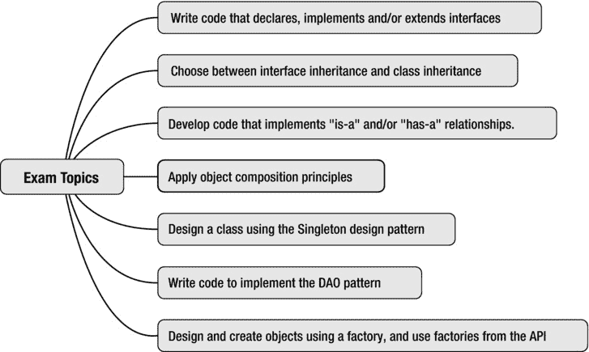

我们在第 3 章中介绍了面向对象编程基础，并在第 4 章中介绍了更高级的 OOP 主题。在本章中，我们将更深入地探讨 OOP 概念。

本章首先深入探讨*接口*。我们将讨论接口与抽象类的区别，以及在特定情况下应使用哪种结构。在第二部分，我们将向您介绍*对象组合*原则，即“优先使用组合而非继承”。第三和第四部分将介绍 OOP 中最受欢迎的主题之一：*设计模式*。您将学习设计模式背后的基本概念，以及它们如何与 OOP 相关联。我们将重点介绍*单例*、*工厂*、*抽象工厂*和*数据访问对象*（DAO）设计模式。

接口

通常，*接口*指的是两个实体（可以是人、系统、概念、机器等）之间的公共边界或互连。例如，计算机系统中的键盘提供了人与计算机之间的接口。像英语这样的自然语言是两个人之间的接口，允许他们交换观点。

在 Java 中，接口是一组定义协议（即行为契约）的抽象方法。实现接口的类必须实现接口中指定的方法。接口定义了一个协议，而实现该接口的类则遵守该协议。换句话说，接口通过定义一个抽象来向其客户端承诺特定的功能。所有实现该接口的类都为承诺的功能提供自己的实现。

让我们通过一个例子来阐明 Java 接口。考虑 `java.lang.Comparable` 接口，它指定了以下协议：

```
public interface Comparable{
        public int compareTo(Object o);
        // 意图是将此对象与指定对象进行比较
        // 返回类型是整数。当此对象小于、等于或大于指定对象时，
        // 分别返回负数、零或正数
}
```

不相关的类可以在实现 `Comparable` 时提供自己的实现。这些不相关的类有一个共同点：它们都遵循 `Comparable` 给出的规范，并且由这些单独的类来实现 `compareTo()` 方法。`java.util` 包中支持的数据结构实现了此接口。如果您想使用库中提供的通用算法，则必须实现此接口。例如，考虑 `java.util.Collections` 中 `max()` 方法的示例实现。它用于查找集合中的最大元素。它使用了 `Comparable` 接口，并且集合中的元素必须为 `compareTo()` 方法提供实现。

算法（即接口的客户端）完全不知道 `compareTo()` 方法是如何实现的。但是客户端知道确保 `compareTo()` 方法可用的契约，因此客户端可以使用它。这带来了一个非常重要的优势：当一个方法将接口作为参数时，您可以传递任何实现该接口的对象（由于运行时多态）。

从概念上讲，类和接口是两种不同的结构，用于两种不同的目的。类结合了真实对象的状态和行为，而接口则指定了抽象实体的行为。

声明和使用接口

现在是时候为形状对象实现您自己的接口了。一些圆形对象（例如 `Circle` 和 `Ellipse`）可以*滚动*到给定的角度。您可以创建一个 `Rollable` 接口并声明一个名为 `roll()` 的方法，如下所示：

```
interface Rollable {
        void roll(float degree);
}
```

如您所见，您使用 `interface` 关键字定义了一个接口。您可以在该接口中声明方法；这里声明的是 `roll()` 方法。该方法接受一个参数：滚动的 `degree`（角度）。现在让我们为 `Circle` 实现 `Rollable` 接口。


```
class Circle implements Rollable {
        public void roll(float degree) {
        /* 在此实现滚动功能 */
        }
}
```

你使用 `implements` 关键字来实现一个接口。请注意，类定义中的方法名、参数和返回类型必须与接口中给出的完全一致；如果不匹配，该类就不会被视为实现了该接口。

如果你在抽象类中实现接口，抽象类不需要定义该方法。

```
interface Rollable {
        void roll(float degree);
}

abstract class CircularShape implements Rollable extends Shape { }
```

在这个例子中，`CircularShape` 实现了 `Rollable` 接口并继承了 `Shape` 抽象类（正如你在第 3 章和第 4 章中看到的）。现在，像 `Circle` 和 `Ellipse` 这样的具体类可以继承这个抽象类并定义 `roll()` 方法。

你看到的 `Rollable` 示例只有一个方法——`roll()`。然而，接口通常有多个方法。例如，`java.util` 将 `Iterable` 接口定义如下：

```
public interface Iterator<E> {
        boolean hasNext();
        E next();
        void remove();
}
```

这个接口用于遍历集合。（不必担心 `Iterator<E>` 中的“`<E>`”。它指的是元素类型，属于*泛型*，我们将在下一章详细讨论）。它声明了三个方法：`hasNext()`、`next()` 和 `remove()`。

事实上，一个类可以同时实现多个接口——既可以直接实现，也可以通过其基类间接实现。例如，`Circle` 类还可以实现标准的 `Cloneable` 接口（用于创建 `Circle` 对象的副本）和 `Serializable` 接口（用于将对象存储在文件中以便稍后重新创建对象等），如下所示：

```
class Circle extends CircularShape implements Cloneable, Serializable {
        /* 在此定义诸如 clone 等方法 */
}
```

要点记忆

以下是一些关于接口的关键规则，将有助于你通过 OCPJP 7 考试：

*   接口不能被实例化。
*   接口可以继承另一个接口。使用 `extends`（而不是 `implements`）关键字来实现。
*   接口不能包含实例变量。如果你在接口中声明了一个数据成员，它必须被初始化，并且所有这些数据成员都被隐式视为“`public static final`”成员。
*   接口不能声明静态方法。它只能声明实例方法。
*   你不能将成员声明为 `protected` *或* `private`。接口的成员只允许 `public` 访问权限。
*   接口中声明的所有方法都被隐式视为抽象的。如果你愿意，可以显式地为方法使用 `abstract` 限定符。
*   你只能在接口中声明方法（而不能定义方法）。
*   接口可以声明为空体（即没有任何成员的接口。这样的接口被称为*标记接口*（或*标志接口*）。这类接口对于定义公共父类很有用，以便可以使用运行时多态性。例如，`java.util` 定义了没有体的接口 `EventListner`。
*   接口可以在另一个接口或类中声明；这样的接口被称为*嵌套接口*。
*   与只能具有 public 或 default 访问权限的顶级接口不同，嵌套接口可以声明为 public、protected 或 private。

抽象类与接口

抽象类和接口有很多共同点。例如，两者都可以声明所有派生类都应定义的方法。它们还有一个相似之处：你既不能创建抽象类的实例，也不能创建接口的实例。

那么，抽象类和接口之间有什么区别呢？表 5-1 列出了一些语法上的区别，表 5-2 列出了一些语义和用法上的区别。

表 5-1 抽象类与接口：语法区别

|  | 抽象类 | 接口 |
| --- | --- | --- |
| 使用的关键字 | 使用 `abstract` 和 `class` 关键字来定义类。 | 使用 `interface` 关键字来定义接口。 |
| 实现类使用的关键字 | 使用 `extends` 关键字继承抽象类。 | 使用 `implements` 关键字实现接口。 |
| 默认实现 | 抽象类可以提供方法的默认实现。 | 你不能在接口中定义方法；只能声明它们。 |
| 字段 | 抽象类可以有静态和非静态字段。 | 接口中不能有任何字段（实例变量）。 |
| 常量 | 抽象类可以有静态和非静态常量。 | 接口只能有静态常量。如果你声明了一个字段，它必须被初始化。所有字段都被隐式视为声明为 `public static` 和 `final`。 |
| 构造方法 | 你可以在抽象类中定义构造方法（例如，这对于初始化字段很有用）。 | 你不能在接口中声明/定义构造方法。 |
| 访问修饰符 | 你可以在抽象类中拥有 private 和 protected 成员。 | 你不能在接口中拥有任何 private 或 protected 成员；所有成员默认都是 public 的。 |
| 单继承与多继承 | 一个类只能继承一个类（可以是抽象类或具体类）。 | 一个类可以实现任意数量的接口。 |

表 5-2 抽象类与接口：语义和用法区别

|  | 抽象类 | 接口 |
| --- | --- | --- |
| is-a 关系与遵循协议 | 抽象基类提供了一个协议；此外，它在 is-a 关系中充当基类。 | 接口仅提供一个协议。它指定了实现它的类必须实现的功能。 |
| 方法的默认实现 | 抽象类可以提供方法的默认实现。因此，派生类可以直接使用该定义，无需再定义该方法。 | 接口只能声明方法。所有实现该接口的类都必须定义该方法。 |
| 修改的难易程度 | 可以修改抽象类的实现。例如，你可以添加一个带有默认实现的方法，而现有的派生类不会出错。 | 如果已经有很多类实现了某个接口，你很难轻易更改该接口。例如，如果你声明了一个新方法，所有实现该接口的类将停止编译，因为它们没有定义该方法。 |

在抽象类和接口之间做出选择

现在让我们比较一下抽象类和接口。嗯，有趣……它们看起来非常相似，不是吗？你如何在它们之间做出选择？什么时候应该选择抽象类，什么时候应该选择接口？

*   如果你正在确定一个基类，该基类从一组相关类中抽象出通用功能，你应该使用抽象类。如果你要提供可以被甚至不相关的类实现的通用方法或协议，那么最好使用接口来实现。
*   如果你想捕捉类之间的相似性（即使是不相关的类），而不强制建立类关系，你应该使用接口。另一方面，如果类与新实体之间存在 is-a 关系，你应该将新实体声明为抽象类。


让我们来看一个在 FunPaint 应用中选择抽象类与接口的示例。你可以将 `Shape` 作为所有形状（如 `Circle`、`Square` 等）的抽象基类；这是一个“is-a”关系的例子。此外，通用的实现，例如父形状（如第 4 章所述），可以放在 `Shape` 中。因此，在这种情况下，将 `Shape` 作为抽象类是最佳选择。

在 FunPaint 中，用户可以对形状对象执行各种操作。例如，有些形状可以旋转，有些可以滚动。像 `Square` 这样的形状可以旋转，而像 `Circle` 这样的形状可以滚动。因此，在 `Shape` 抽象类中包含 `rotate()` 或 `roll()` 方法是没有意义的。`rotate()` 或 `roll()` 的实现因具体形状而异，因此无法提供默认实现。在这种情况下，最好使用接口而不是抽象类。你可以创建 `Rotatable` 和 `Rollable` 接口，分别指定 `rotate()` 和 `roll()` 的协议，如代码清单 5-1 所示。

代码清单 5-1.  Shape.java

```
// Shape.java
// Shape 是所有形状对象的基类；与父形状对象关联的形状对象
// 保存在 parentShape 字段中
public abstract class Shape {
        abstract double area();
        private Shape parentShape;
        public void setParentShape(Shape shape) {
                parentShape = shape;
        }
        public Shape getParentShape() {
                return parentShape;
        }
}

// Rollable.java
// Rollable 接口可由圆形形状（如 Circle 和 Ellipse）实现
public interface Rollable {
        void roll(float degree);
}

// Rotatable.java
// Rotable 接口可由形状（如 Square、Rectangle 和 Rhombus）实现
public interface Rotatable {
        void rotate(float degree);
}

// Circle.java
// Circle 是一个具体类，是 Shape 的子类型；它可以滚动，因此实现了 Rollable
public class Circle extends Shape implements Rollable {
        private int xPos, yPos, radius;
        public Circle(int x, int y, int r) {
                xPos = x;
                yPos = y;
                radius = r;
        }
        public double area() { return Math. PI * radius * radius; }
        @Override
        public void roll(float degree) {
                // 在此实现滚动功能
        }
        public static void main(String[] s) {
                Circle circle = new Circle(10,10,20);
                circle.roll(45);
        }
}

// Rectangle.java
// Rectangle 是一个具体类，是 Shape 的子类型；它可以旋转，因此实现了 Rotatable
public class Rectangle extends Shape implements Rotatable {
        private int length, height;
        public Rectangle(int l, int h) {
                length = l;
                height = h;
        }
        public double area() { return length * height; }
        @Override
        public void rotate(float degree) {
                // 在此实现旋转功能
        }
}
```

对象组合

你已经学习了如何以具体类、抽象类和接口的形式定义抽象。单个抽象提供某些功能，这些功能需要与其他对象组合以表示更大的抽象：一个由其他更小对象组成的复合对象。你需要创建这样的复合对象来解决实际的编程问题。在这种情况下，复合对象与包含的对象共享“has-a”关系，其底层概念被称为*对象组合*。

打个比方，计算机是一个复合对象，包含 CPU、内存和硬盘等其他对象。换句话说，计算机对象与其他对象共享“has-a”关系。

让我们回顾一下 FunPaint 应用中定义 `Circle` 类的部分。类定义如下：

```
public class Circle {
        private int xPos;
                private int yPos;
                private int radius;

public Circle(int x, int y, int r) {
                xPos = x;
                        yPos = y;
                        radius = r;
                }
                // 其他构造函数已省略 ...

public String toString() {
                return "mid point = (" + xPos + "," + yPos + ") and radius = " + radius;
        }
        // 其他成员（如 area 方法）已省略
}
```

在这个简单的实现中，你使用 `xPos` 和 `yPos` 来定义 `Circle` 的中心。与其将这些变量定义为 `Circle` 类的成员，不如定义一个 `Point` 类，用于定义 `Circle` 的中心。请查看代码清单 5-2 中 `Point class` 的定义。

代码清单 5-2.  Circle.java

```
// Point 是一个独立的类，这里我们将其与 Circle 类一起使用
class Point {
        private int xPos;
        private int yPos;
        public Point(int x, int y) {
                xPos = x;
                yPos = y;
        }
        public String toString() {
                return "(" + xPos + "," + yPos + ")";
        }
}

// Circle.java
public class Circle {
        private Point center;   // Circle "包含" 一个 Point 对象
        private int radius;
        public Circle(int x, int y, int r) {
                center = new Point(x, y);
                radius = r;
                }
        public String toString() {
                return "center = " + center + " and radius = " + radius;
        }

public static void main(String []s) {
                System.out.println(new Circle(10, 10, 20));
        }
        // 其他成员（构造函数、area 方法等）已省略 ...
}
```

这比拥有独立的整型成员 `xPos` 和 `yPos` 是更好的解决方案。为什么？因为你可以重用 `Point` 类提供的功能。注意 `Circle` 类中 `toString()` 方法的重写，它被简化了：

```
public String toString() {
        return "center = " + center + " and radius = " + radius;
}
```

这里，变量 `center` 的使用会展开为 `center.toString()`。在这个例子中，`Circle` 拥有一个 `Point` 对象。换句话说，`Circle` 和 `Point` 共享“has-a”关系；也就是说，`Circle` 是一个包含 `Point` 对象的复合对象。

组合 vs. 继承

现在你已经掌握了组合以及继承（我们在第 4 章中详细讨论过）的知识。在某些情况下，很难在两者之间做出选择。重要的是要记住，没有银弹——你不能用一种结构解决所有问题。你需要仔细分析每种情况，并决定哪种结构最适合它。

一条经验法则是：对于组合使用“has-a”短语，对于继承使用“is-a”短语。例如：

*   计算机 has-a CPU。
*   圆形 is-a 形状。
*   圆形 has-a 点。
*   笔记本电脑 is-a 计算机。
*   向量 is-a 列表。

这条规则有助于识别错误的关系。例如，“汽车 is-a 轮胎”的关系是完全错误的，这意味着你不能在 `Car` 类和 `Tire` 类之间建立继承关系。然而，“汽车 has-a 轮胎”（意味着汽车有一个或多个轮胎）的关系是正确的——你可以组合一个包含 `Tire` 对象的 `Car` 对象。

|  | 类继承意味着 is-a 关系，接口继承意味着 is-like-a 关系，而组合意味着 has-a 关系。 |


在实际场景中，关系的区分可能并不简单。你已经了解到可以创建一个基类，并将多个类的通用功能放入其中。然而，许多人忽略了悬停在此做法上的一个重大警示——始终检查派生类与基类之间是否存在“is-a”关系。如果“is-a”关系不成立，那么最好使用组合而非继承。

例如，考虑一组类——比如`DynamicDataSet`和`SnapShotDataSet`——它们需要一项通用功能——比如排序。现在，我们可以让这些数据集类从一个排序实现派生，如清单 5-3 所示。

清单 5-3.  Sorting.java

```
import java.awt.List;

public class Sorting {
        public List sort(List list) {
                // 排序实现
                return list;
        }
}

class DynamicDataSet extends Sorting {
        // DynamicDataSet 实现
}

class SnapshotDataSet extends Sorting {
        // SnapshotDataSet 实现
}
```

你认为这是一个好的解决方案吗？不，这不是一个好的解决方案，原因如下：

*   经验法则在此不适用。`DynamicDataSet`并不是一种`Sorting`类型。如果在类设计中犯下此类错误，代价可能非常高昂——而且如果大量代码已经积累并错误地使用了继承关系，你可能无法在后期修复。例如，Java 库中的`Stack`继承了`Vector`。然而，栈显然不是向量，这不仅会造成理解问题，还可能导致错误。当你创建 Java 库提供的`Stack`类对象时，你可以从容器中的任何位置添加或删除元素，因为基类是`Vector`，它允许你从向量中的任何位置进行删除。
*   如果这两种数据集类有一个真正的基类`DataSet`呢？在这种情况下，要么让`Sorting`成为`DataSet`的基类，要么将`Sorting`类放在`DataSet`和两种数据集类之间。这两种解决方案都是错误的。
*   还有另一个具有挑战性的问题：如果一个`DataSet`类想使用一种排序算法（比如归并排序），而另一个数据集类想使用不同的排序算法（比如快速排序），该怎么办？你会继承实现两种不同排序算法的两个类吗？首先，你不能直接继承多个类，因为 Java 不支持多重类继承。其次，即使你能够以某种方式继承两个不同的排序类（`MergeSort`继承`QuickSort`，`QuickSort`继承`DataSet`），那也将是更糟糕的设计。

在这种情况下，最好使用组合——换句话说，使用“has-a”关系而不是“is-a”关系。最终的代码如清单 5-4 所示。

清单 5-4.  Sorting.java

```
import java.awt.List;

interface Sorting {
        List sort(List list);
}

class MergeSort implements Sorting {
        public List sort(List list) {
                // 排序实现
                return list;
        }
}

class QuickSort implements Sorting {
        public List sort(List list) {
                // 排序实现
                return list;
        }
}

class DynamicDataSet {
        Sorting sorting;
        public DynamicDataSet() {
                sorting = new MergeSort();
        }
        // DynamicDataSet 实现
}

class SnapshotDataSet {
        Sorting sorting;
        public SnapshotDataSet() {
                sorting = new QuickSort();
        }
        // SnapshotDataSet 实现
} 
```

|  | 当子类特化基类时使用继承，以便利用动态多态性。在其他情况下，使用组合来获得易于更改且松散耦合的代码。总之，**优先使用组合而非继承。** |

要点记忆

以下是你在参加 OCPJP 7 考试时应掌握的一些设计原则和术语细微差别：

*   遵循“优先使用组合而非继承”的面向对象设计原则。组合鼓励你遵循另一个有用的面向对象设计原则：“针对接口编程，而非针对实现编程。”这第二条原则意味着，一个类的功能应仅依赖于另一个抽象的接口，而不依赖于该抽象的具体实现细节。换句话说，一个类的实现不应依赖于另一个类的内部实现细节。在合适的情况下，组合是首选技术。
*   在面向对象编程中，有许多与组合相关的术语，例如关联和聚合。*关联*是两个对象之间关系的最一般形式，而*组合*和*聚合*是关联的特殊形式。通常，术语*聚合*和*组合*可以互换使用。尽管这两个术语非常相似，但它们确实存在细微差别。在组合中，被包含对象和容器对象的生命周期相同，而在聚合中则并非如此。例如，计算机对象和 CPU 对象是组合关系，而图书馆对象和书籍对象是聚合关系。

设计模式

在面向对象的世界中，设计模式背后的概念已经非常成熟。作为一名面向对象编程语言的开发者以及 OCPJP 7 考试的考生，你必须了解设计模式及相关概念。

编程中*设计模式*的字面含义是一种可重复的解决方案，适用于解决通用的设计问题。经验丰富的程序员和设计师从他们的经验中学习，并制定出针对频繁出现的设计问题的解决方案。设计模式捕捉并复用了经验丰富的软件设计师的经验。

|  | “设计模式是对通信对象和类的描述，这些对象和类经过定制，以在特定上下文中解决通用的设计问题。” ——《设计模式：可复用面向对象软件的基础》[旁注：这本 1994 年的经典著作普及了设计模式。四位作者（Erich Gamma、Richard Helm、Ralph Johnson 和 John Vlissides）撰写了这本书，因此它被称为“四人组”（GoF）书籍。本章涵盖的模式大多是 GoF 模式。] |

在深入探讨各种设计模式之前，需要澄清一点：设计模式是*设计解决方案*。它们不像库中的代码那样是现成的解决方案，可以随时取用并在编程时按需使用。相反，设计模式提供了模板解决方案，需要根据给定的上下文进行微调。

让我们考虑一个设计模式的例子，以初步了解设计模式的重要性和可用性。在 FunPaint 应用程序中，假设一个类（比如`ShapeArchiver`）负责归档所有已绘制形状的信息。同样，另一个类（比如`Canvas`）负责显示所有已绘制的形状。每当形状发生任何变化时，你需要将变化的信息通知这两个类。那么，你希望如何实现这种通知呢？清单 5-5 展示了一种可能的实现。

清单 5-5.  Test.java


```
// Circle.java
// 每当 Circle 类发生“变化”时，它会通过调用 Canvas 和 ShapeArchiver 这两个类的 update 方法，“通知”它们。
public class Circle {
        private Point center;
        public void setCenter(Point center) {
                this.center = center;
                canvas.update(this);
                shapeArchiver.update(this);
        }
        public void setRadius(int radius) {
                this.radius = radius;
                canvas.update(this);
                shapeArchiver.update(this);
        }
        private ShapeArchiver shapeArchiver;
        public void setShapeArchiver(ShapeArchiver shapeArchiver) {
                this.ShapeArchiver = shapeArchiver;
        }
        protected Canvas canvas;
        public void setCanvas(Canvas canvas) {
                this.canvas = canvas;
        }
        private int radius;
        public Circle(int x, int y, int r) {
                center = new Point(x, y);
                radius = r;
        }
        public String toString() {
                return "center = " + center + " and radius = " + radius;
        }
}

// Point.java
class Point {
        private int xPos;
        private int yPos;
        public Point(int x, int y) {
                xPos = x;
                yPos = y;
        }
        public String toString() {
                return "(" + xPos + "," + yPos + ")";
        }
}

// ShapeArchiver.java
public class ShapeArchiver {
        public void update(Circle circle) {
                System.out.println("ShapeArchiver::update");
                // 更新实现
        }
}

// Canvas.java
public class Canvas {
        public void update(Circle circle) {
                System.out.println("Canvas::update");
                // 更新实现
        }
}

// Test.java
public class Test {
        public static void main(String []s) {
                Circle circle = new Circle(10, 10, 20);
                System.out.println(circle);
                circle.setCanvas(new Canvas());
                circle.setShapeArchiver(new ShapeArchiver());
                circle.setRadius(50);
                System.out.println(circle);
        }
}
```

该程序输出如下：

```
center = (10,10) and radius = 20
Canvas::update
ShapeArchiver::update
center = (10,10) and radius = 50
```

嗯，这个实现确实按预期工作了——但有一个问题。主题（`Circle` 类）与两个观察者（`ShapeArchiver` 和 `Canvas`）之间存在紧密耦合。以下是紧耦合设计带来的后果：

*   主题类（`Circle`）知道具体的观察者类。因此，如果你更改了观察者类，你也需要更改主题类。（嗯，这不太好。）
*   如果你想添加或移除一个观察者，你无法在不修改主题的情况下做到这一点。
*   你无法独立地复用主题类或观察者类。

好吧，之前的实现存在一些问题。有没有办法消除这些问题呢？请查看清单 5-6 中的新实现。

清单 5-6.  Test.java

```
// Circle.java
import java.util.Observable;

public class Circle extends Observable {
        private Point center;
        public void setCenter(Point center) {
                this.center = center;
                setChanged();
                notifyObservers();
        }
        public void setRadius(int radius) {
                this.radius = radius;
                setChanged();
                notifyObservers();
        }
        private int radius;
        public Circle(int x, int y, int r) {
                center = new Point(x, y);
                radius = r;
        }
        public String toString() {
                return "center = " + center + " and radius = " + radius;
        }
}

// Point.java
class Point {
        private int xPos;
        private int yPos;
        public Point(int x, int y) {
                xPos = x;
                yPos = y;
        }
        public String toString() {
                return "(" + xPos + "," + yPos + ")";
        }
}

// Canvas.java
import java.util.Observable;
import java.util.Observer;

public class Canvas implements Observer {
        @Override
        public void update(Observable arg0, Object arg1) {
                System.out.println("Canvas::update");
                // 实际的更新代码已省略……
        }
}

// ShapeArchiver.java
import java.util.Observable;
import java.util.Observer;

public class ShapeArchiver implements Observer{
        @Override
        public void update(Observable arg0, Object arg1) {
                System.out.println("ShapeArchiver::update");
                // 实际的更新代码已省略……
        }
}

// Test.java
public class Test {
        public static void main(String []s) {
                Circle circle = new Circle(10, 10, 20);
                System. out .println(circle);
                circle.addObserver(new Canvas());
                circle.addObserver(new ShapeArchiver());
                circle.setRadius(50);
                System. out .println(circle);
        }
}
```

该程序输出如下：

```
center = (10,10) and radius = 20
ShapeArchiver::update
Canvas::update
center = (10,10) and radius = 50
```

嗯，输出结果与之前的版本相同。你取得了什么更好的成果吗？是的，你做到了。这个新实现是一个*松耦合*的实现。主题——`Circle` 类——不知道具体的观察者类，而观察者也不知道具体的主题。因此，主题和观察者现在都可以独立使用和独立更改。此外，你可以在不修改主题类的情况下，向主题添加或从中移除观察者。

这个例子是 `Observer` 设计模式的一个实现。当你有一个主题需要被多个观察者监控时，这种设计模式非常有用。每当主题发生变化时，这些观察者都需要得到通知。`Observer` 设计模式在主题和观察者之间创建了松耦合。

Java 支持一个名为 `Observable` 的抽象类和一个名为 `Observer` 的接口（两者都在 `java.util` 包中提供），用于实现 `Observer` 设计模式。`Circle` 类继承自 `Observable`，这标志着 `Circle` 类是一个主题。`Canvas` 和 `ShapeArchiver` 类实现了 `Observer` 接口，因此也实现了 `update()` 方法。每当主题的状态发生变化时，你调用 `setChanged()` 方法，然后调用 `notifyObservers()` **，** 后者是在 `Observable` 类中实现的。`notifyObservers()` 方法会调用之前为该主题注册的所有观察者。

我们希望这个例子能让你对设计模式有一个很好的理解。在本章的其余部分，我们将详细探讨更多重要的设计模式。

设计模式的类型

广义上讲，GoF 设计模式可以分为以下三类：

*   **创建型模式** 提供了灵活性，可以决定谁负责创建对象、如何创建对象、创建哪个对象以及何时进行创建。本质上，创建型模式为对象实例化提供了一种抽象。

示例：单例模式、工厂模式、抽象工厂模式和原型模式。

*   **结构型模式** 侧重于如何将相关的类（和对象）组合在一起，以形成更大的结构。

示例：组合模式、装饰器模式、代理模式和外观模式。

*   **行为型模式** 定义了对象之间的通信，并控制参与对象之间的流程。

示例：中介者模式、责任链模式、观察者模式、状态模式和策略模式。

单例设计模式


在许多情况下，你需要确保某个特定类只有一个实例存在。例如，假设你定义了一个修改注册表的类，或者实现了一个管理打印机后台处理的类，又或者实现了一个线程池管理器类。在所有这些情况下，你可能都希望通过仅实例化此类的一个对象来避免难以发现的错误。在这些情况下，你可以采用*单例设计模式*。

单例设计模式旨在确保只创建该类的一个实例。该模式的实现提供了对该类的单一访问点。这是一种*创建型设计模式*，意味着它控制对象的实例化。在 Java SDK 中，该模式被用于许多地方，例如 `java.lang.Runtime`。

图 5-1 展示了单例模式的类图。它包含一个单一的类，即你想要设为单例的那个类。它有一个私有构造函数和一个用于获取单例对象的静态方法。

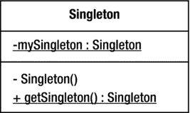

图 5-1.  单例设计模式的 UML 类图

|  | 单例设计模式提供两样东西：该类唯一的一个实例，以及一个全局的单一访问点来访问该对象。 |

假设 FunPaint 应用程序需要一个日志记录器，你希望将其实现为单例。代码清单 5-7 展示了一种可能的实现。

代码清单 5-7.  Logger.java

```
// Logger 类必须在应用程序中只实例化一次；这是为了确保
// 整个应用程序都使用同一个 Logger 实例
public class Logger {
        // 将构造函数声明为私有，以防止客户端
        // 直接实例化此类的对象
        private Logger() {      }
        public static Logger myInstance;        // 默认情况下，此字段初始化为 null
        // 供客户端用于获取 Logger 类实例的静态方法
        public static Logger getInstance() {
                if(myInstance == null) {
                        // 这是第一次调用此方法，因此 myInstance 为 null
                        myInstance = new Logger();
                }
                // 每次调用 getInstance 时都返回同一个对象引用
                return myInstance;
        }
        public void log(String s) {
                // log 的简单实现，将待记录的字符串输出到控制台
                System.err.println(s);
        }
}
```

看看 `Logger` 类的单例实现。该类的构造函数被声明为私有，因此你不能简单地使用 `new` 运算符创建 `Logger` 类的新实例。获取此类实例的唯一方法是通过 `getInstance()` 方法调用该类的静态成员方法。此方法检查 `Logger` 对象是否已存在。如果不存在，则创建一个 `Logger` 实例并将其赋值给静态成员变量。这样，无论何时调用 `getInstance()` 方法，它都将始终返回 `Logger` 类的同一个对象。

|  | 代码清单 5-7 使用了延迟初始化。如果你的单例构造函数计算开销不大，你可以采用提前初始化。 |

确保你的单例确实是单例

你可能在想我们在说什么，但确保你的单例模式实现只允许该类的一个实例，这确实非常重要（也非常困难）。

例如，代码清单 5-7 中提供的实现仅在应用程序是单线程的情况下有效。在多线程的情况下，尝试获取单例对象可能会导致创建多个对象，这当然违背了实现单例的目的。

代码清单 5-8 展示了在多线程环境中实现单例设计模式的 `Logger` 类版本。

代码清单 5-8.  Logger.java

```
public class Logger {
        private Logger() {
                // 私有构造函数以防止直接实例化
        }
        public static Logger myInstance;
        public static synchronized Logger getInstance() {
                if(myInstance == null)
                        myInstance = new Logger();
                return myInstance;
        }
        public void log(String s){
                // log 实现
                System.err.println(s);
        }
}
```

注意此实现中关键字 `synchronized` 的使用。这个关键字是一种 Java 并发机制，用于一次只允许一个线程进入同步作用域。你将在第 13 章中了解更多关于此关键字的内容。

因此，你将整个方法设为同步，以便一次只能有一个线程访问它。这使其成为一个正确的解决方案，但存在一个问题：性能不佳。你只想在第一次调用该方法时使其同步，但由于你将整个方法声明为同步，所有后续对该方法的调用都使其成为性能瓶颈。

好吧，那如果只同步 `new` 语句呢？参见代码清单 5-9。

代码清单 5-9.  Logger.java

```
public class Logger {
        private Logger() {
                // 私有构造函数
        }
        public static Logger myInstance;
        public static Logger getInstance() {
                if(myInstance == null) {
                        synchronized (Logger.class) {
                                myInstance = new Logger();
                        }
                }
                return myInstance;
        }
        public void log(String s) {
                // log 实现
                System.err.println(s);
        }
}
```

尝试得不错，但这个解决方案也行不通。同步并不能防止意外创建两个单例对象。现在，实现著名的*双重检查锁定*（参见代码清单 5-10）。

代码清单 5-10.  Logger.java

```
public class Logger {
        private Logger() {
                // 私有构造函数
        }
        public static Logger myInstance;
        public static Logger getInstance() {
                if(myInstance == null) {
                        synchronized (Logger.class) {
                                if(myInstance == null) {
                                        myInstance = new Logger();
                                }
                        }
                }
                return myInstance;
        }
        public void log(String s) {
                // log 实现
                System.err.println(s);
        }
}
```

嗯，这个实现对于多线程应用程序来说也不是一个万无一失的解决方案。由于 Java 内存模型允许错误的乱序写入，它会产生一个问题。尽管据报道该内存模型问题在 Java 5 中已修复，但我们不鼓励你使用此解决方案。


清单 5-11 展示了基于“初始化需求占位符”惯用法的 `Logger` 类的另一种实现。该惯用法使用了内部类，且未使用任何同步结构（回顾第 4 章中关于内部类的讨论）。它利用了内部类在被引用之前不会被加载这一特性。

清单 5-11.  Logger.java

```
public class Logger {
        private Logger() {
                // private constructor
        }
        public static Logger myInstance;
        public static class LoggerHolder {
                public static Logger logger = new Logger();
        }
        public static Logger getInstance() {
                return LoggerHolder.logger;
        }
        public void log(String s) {
                // log implementation
                System.err.println(s);
        }
}
```

嗯……你终于找到了一个高效可行的解决方案。然而，在结束单例设计模式的讨论之前，有两点临别忠告。第一，在适当的地方使用单例模式，但不要过度使用。第二，确保你的单例实现保证了只创建一个实例，即使你的代码是多线程的。

工厂设计模式

在现实生活中，工厂是生产同一产品的多个实例（或产品的不同变体）的制造单元。例如，汽车工厂生产特定类型和型号的汽车。工厂的主要职责是持续生产所需类型和型号的汽车。这里需要注意的一点是，同一款汽车可能有不同的变体，汽车工厂应该能够按需生产同一款汽车所需的不同变体。

类似地，在面向对象编程中，你可以实现一个工厂，按需返回所需类型的对象。在这种情况下，工厂决定实例化哪个（些）类来创建所需的对象，以及具体如何创建它们。

图 5-2 展示了工厂模式的 UML 类图。`Client` 调用 `ProductFactory` 从产品层次结构中获取合适的对象。`ProductFactory` 根据提供的信息，从 `Product` 层次结构中创建其中一个 `Products`。`Client` 使用产品对象，而无需知道它实际使用的是哪个产品，也无需知道 `ProductFactory` 是如何创建这个产品对象的。

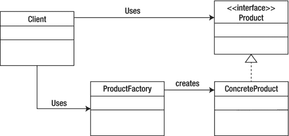

图 5-2.  工厂设计模式的 UML 类图

让我们考虑一个例子。在 FunPaint 应用程序中，有不同类型的形状，例如 `Circle` 和 `Rectangle`。现在，`Canvas` 对象可能不想知道具体创建的是哪个具体形状。假设 `Canvas` 对象从前端接收一个形状标识符，需要根据该标识符创建相应的形状对象。这里，你可以有一个 `ShapeFactory`，它可以创建所需的形状对象并将其返回给 `Canvas` 对象。清单 5-12 展示了此模式的实现。

清单 5-12.  Test.java

```
// Shape.java
public interface Shape {
        public void draw();
        public void fillColor();
}

// Circle.java
public class Circle implements Shape {
        private int xPos, yPos;
        private int radius;
        public Circle(int x, int y, int r) {
                xPos = x;
                yPos = y;
                        radius = r;
                        System.out.println("Circle constructor");
        }
        @Override
        public void draw() {
                System.out.println("Circle draw()");
                // draw() implementation
        }
        @Override
        public void fillColor() {
                // fillColor() implementation
        }
}

// Rectangle.java
public class Rectangle implements Shape {
        public Rectangle(int length, int height) {
                this.length = length;
                this.height = height;
                System.out.println("Rectangle constructor");
        }
        private int length, height;
        @Override
        public void draw() {
                System.out.println("Rectangle draw()");
                // draw() implementation
        }
        @Override
        public void fillColor() {
                // fillColor() implementation
        }
}

// ShapeFactory.java
public class ShapeFactory {
         public static Shape getShape(String sourceType) {
                switch(sourceType) {
                case "Circle":
                        return new Circle(10, 10, 20);
                case "Rectangle":
                        return new Rectangle(10, 20);
                }
                return null;
        }
}

// Canvas.java
import java.util.ArrayList;
import java.util.Iterator;

public class Canvas {
        private ArrayList<Shape> shapeList = new ArrayList<Shape>();
        public void addNewShape(String shapeType) {
                Shape shape = ShapeFactory.getShape(shapeType);
                shapeList.add(shape);
        }
        public void redraw() {
                Iterator<Shape> itr = shapeList.iterator();
                while(itr.hasNext()) {
                        Shape shape = itr.next();
                        shape.draw();
                }
        }
}

// Test.java
public class Test {
        public static void main(String[] args) {
                Canvas canvas = new Canvas();
                canvas.addNewShape("Circle");
                canvas.addNewShape("Rectangle");
                canvas.redraw();
        }
}
```

它会打印以下内容：

```
Circle constructor
Rectangle constructor
Circle draw()
Rectangle draw()
```

让我们分析一下这个实现。你定义了一个 `Shape` 接口，它定义了两个公共方法：`draw()` 和 `fillColor()`。`Circle` 和 `Rectangle` 类实现了这个接口，并提供了接口方法的实现。`Canvas` 类维护了一个画布上绘制的形状列表，并提供了一个 `addNewShape()` 方法，允许应用程序的前端创建所请求形状的新实例。在 `main()` 方法中，你调用了 `Canvas` 类的 `addnewShape()` 方法。该方法进而调用 `ShapeFactory` 类的 `getShape()` 方法。`getShape()` 方法检查请求的形状类型，根据请求的类型创建一个新实例，并将其返回给 `Canvas`。

从上述示例中可以得出以下见解：

*   `Canvas` 类不需要知道如何创建具体的形状对象。当具体对象的创建代价高昂且复杂时，这种透明性变得非常有用。
*   `Canvas` 类不需要知道确切的具体形状类型。你可以从 `Canvas` 的实现中观察到，`Canvas` 只知道 `Shape` 接口。因此，如果你添加另一个具体形状（例如 `Square`），则无需更改 `Canvas` 的实现。

Java SDK 定义了许多这样的工厂。例如，`java.util.Calendar` 就是工厂设计模式的一个实现。清单 5-13 使用了 `Calendar` 类。

清单 5-13.  mainClass.java

```
import java.util.Calendar;

public class MainClass {
        public static void main(String[] args) {
                Calendar calendar = Calendar.getInstance();
                System.out.println(calendar);
        }
}
```

该程序会打印以下内容：

```
java.util.GregorianCalendar [...]
```

清单 5-13 的输出包含了日历对象的所有字段（此处用 […] 表示以节省空间）。Java SDK 中还有许多其他使用工厂模式的例子，包括以下这些：


*   `java.sql.Connection` 接口的 `createStatement()` 方法，用于创建一个新的 `Statement` 对象与数据库通信。
*   `java.rmi.server.RmiClientSocketFactory` 接口的 `createSocket()` 方法，用于返回一个新的客户端 `Socket`。

工厂模式与抽象工厂模式的区别

*工厂设计模式*和*抽象工厂设计模式*都属于*创建型设计模式*范畴。如前文所述，工厂设计模式按需创建（或制造）所请求类型的对象。相比之下，抽象工厂本质上是工厂的工厂。换句话说，抽象工厂设计模式引入了另一层间接性来创建指定对象。抽象工厂设计模式的客户端首先从抽象工厂对象请求一个合适的工厂，然后从该工厂对象请求一个合适的对象。

这两种模式的另一个重要区别在于它们的适用性：当只需要创建一种类型的对象时，可以使用工厂设计模式；当需要创建一系列（家族）对象时，可以使用抽象工厂设计模式。

让我们通过其类图（图 5-3）来探索抽象工厂模式。假设有两个产品层级结构，`ProductA` 和 `ProductB`，以及它们的具体产品类。你想要创建 `ConcreteProductA1` 和 `ConcreteProductB1`（作为一组），或者 `ConcreteProductA2` 和 `ConcreteProductB2`。在这种情况下，你定义一个抽象的 `ProductFactory`，它有两个子类：`ProductFactory1` 和 `ProductFactory2`。`ProductFactory1` 创建 `ConcreteProductA1` 和 `ConcreteProductB1`，而 `ProductFactory2` 创建 `ConcreteProductA2` 和 `ConcreteProductB2`。因此，根据需求，你创建一个所需的工厂对象；选定的工厂对象会提供你所需的具体产品对象。

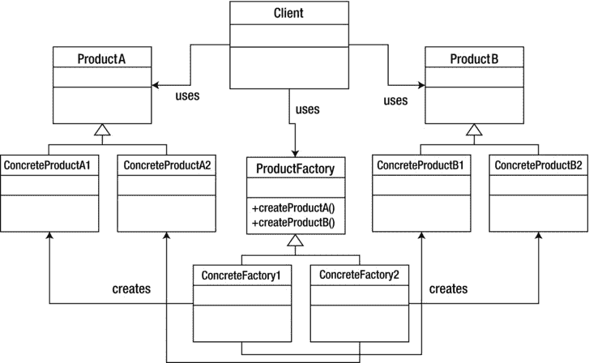

图 5-3. 抽象工厂设计模式的 UML 类图

现在我们来做一个示例。在清单 5-12 中，你已经实现了工厂设计模式。现在，假设形状可以分为两种类型：`DisplayFriendly`（显示友好型）和 `PrinterFriendly`（打印友好型）。因此，现在你的 `Circle` 类（以及 `Rectangle` 类，*作相应修改后*）有两种风格可用：`DisplayFriendlyCircle` 和 `PrinterFriendlyCircle`。显然，你现在只想创建一种类型的对象：要么是显示友好型，要么是打印友好型。好了，你已经确定，当需要创建一系列对象时，应该使用抽象工厂设计模式。清单 5-14 展示了实现代码。

清单 5-14. Test.java

```
// Shape.java
public interface Shape {
        public void draw();
}

// PrinterFriendlyShape.java
public interface PrinterFriendlyShape extends Shape {
}

// DisplayFriendlyShape.java
public interface DisplayFriendlyShape extends Shape {
}

// DisplayFriendlyCircle.java
public class DisplayFriendlyCircle implements DisplayFriendlyShape {
private int xPos, yPos;
        private int radius;
        public DisplayFriendlyCircle(int x, int y, int r) {
                xPos = x;
                yPos = y;
                radius = r;
                System.out.println("DisplayFriendlyCircle constructor");
        }
        @Override
        public void draw() {
                System.out.println("DisplayFriendlyCircle draw()");
                // draw() implementation
        }
}

// DisplayFriendlyRectangle.java
public class DisplayFriendlyRectangle implements DisplayFriendlyShape {
        public DisplayFriendlyRectangle(int length, int height) {
                this.length = length;
                this.height = height;
                System.out.println("DisplayFriendlyRectangle constructor");
        }
        private int length, height;
        @Override
        public void draw() {
                System.out.println("DisplayFriendlyRectangle draw()");
                // draw() implementation
        }
}

// PrinterFriendlyCircle.java
public class PrinterFriendlyCircle implements PrinterFriendlyShape{
        private int xPos, yPos;
        private int radius;
        public PrinterFriendlyCircle(int x, int y, int r) {
                xPos = x;
                yPos = y;
                radius = r;
                System.out.println("PrinterFriendlyCircle constructor");
        }
        @Override
        public void draw() {
                System.out.println("PrinterFriendlyCircle draw()");
                // draw() implementation
        }
}

// PrinterFriendlyRectangle.java
public class PrinterFriendlyRectangle implements PrinterFriendlyShape {
        public PrinterFriendlyRectangle(int length, int height) {
                this.length = length;
                this.height = height;
                System.out.println("PrinterFriendlyRectangle constructor");
        }
        private int length, height;
        @Override
        public void draw() {
                System.out.println("PrinterFriendlyRectangle draw()");
                // draw() implementation
        }
}

// ShapeFactory.java
public interface ShapeFactory {
         public Shape getShape(String sourceType);
}

// DisplayFriendlyFactory.java
public class DisplayFriendlyFactory implements ShapeFactory {
        @Override
        public Shape getShape(String sourceType) {
                switch(sourceType){
                case "Circle":
                        return new DisplayFriendlyCircle(10, 10, 20);
                case "Rectangle":
                        return new DisplayFriendlyRectangle(10, 20);
                }
                return null;
        }
}

// PrinterFriendlyFactory.java
public class PrinterFriendlyFactory implements ShapeFactory {
        @Override
        public Shape getShape(String sourceType) {
                switch(sourceType) {
                        case "Circle":
                                return new PrinterFriendlyCircle(10, 10, 20);
                        case "Rectangle":
                                return new PrinterFriendlyRectangle(10, 20);
                }
                return null;
        }
}

// Test.java
public class Test {
        public static void main(String[] args) {
                Canvas canvas = new Canvas();
                canvas.addNewShape("Circle", "DisplayFriendly");
                canvas.addNewShape("Rectangle", "DisplayFriendly");
                canvas.redraw();
        }
}
```

不要被冗长的代码吓到——你是可以理解的。在这段代码中，有两个主要特性需要掌握：

*   **产品层级结构：** `Shape` 是基础接口，由 `DisplayFriendlyShape` 和 `PrinterFriendlyShape` 扩展。为 `Circle` 和 `Rectangle` 类分别定义了两种风格：显示友好型和打印友好型。
*   **抽象工厂实现：** 由作为基础接口的 `ShapeFactory`，以及作为具体工厂的 `PrinterFriendlyFactory` 和 `DisplayFriendlyFactory` 组成。`PrinterFriendlyFactory` 只创建 `PrinterFriendlyCircle` 和 `PrinterFriendlyRectangle`；类似地，`DisplayFriendlyFactory` 创建 `DisplayFriendlyCircle` 和 `DisplayFriendlyRectangle`。

代码的其余部分与清单 5-12 中程序的工厂版本非常相似。

Java SDK 在许多地方都采用了抽象工厂模式。例如，你最好查看并理解以下内容：


*   `javax.xml.transform.TransformerFactory`
*   `javax.xml.xpath.XPathFactory`

|  | **括号注释：** 对于 OCPJP 7 考试，你需要理解工厂设计模式，即工厂根据提供的输入创建产品层次结构的新实例。另一种实现工厂的方式是*反射*，这不在 OCPJP 7 考试范围内，但值得一提。使用反射实现工厂的主要优势在于，你可以在不修改工厂实现或损害工厂创建新增类的能力的情况下，扩展产品层次结构。 |

数据访问对象（DAO）设计模式

假设你和家人参加一个多元文化博览会，决定乘坐旋转木马。你看到一个带有许多按钮的大面板，用于操作旋转木马。你让操作员启动旋转木马、调整速度并停止它。操作员知道如何使用面板，他遵循你的指示。他为你提供了一个抽象，让你无需了解复杂的控制面板。事实上，如果你去博览会另一端的另一个旋转木马，你可以用同样的方式指示它的操作员，而该操作员也会以同样的方式遵循你的指示，即使他的面板与第一个旋转木马不同。本质上，你的家人可以乘坐任何旋转木马，而无需了解其操作面板，因为操作机器的知识已被操作员抽象化了。*数据访问对象（DAO）*设计模式以类似的方式为你提供抽象。

在实际项目中，你会遇到需要持久化数据的情况。你可能会使用平面文件（即本地操作系统上的数据文件）、XML 文件、OODBMS、RDBMS 等。在这种情况下，你可以使用 DAO 设计模式。该设计模式抽象了底层持久化机制的细节，并为你提供了一个易于使用的接口，用于在应用程序中实现持久化功能。DAO 模式向其客户端隐藏了数据源的实现细节，从而在你的核心业务逻辑和持久化机制之间引入了松散耦合。这种松散耦合使你能够从一种持久化机制迁移到另一种，而无需进行大规模的更改。

|  | DAO 设计模式本质上将你的核心业务逻辑与持久化逻辑分离开来。 |

让我们检查一下该模式的结构，如图 5-4 所示。`DataSource` 代表具体的持久化实现，例如 RDBMS、XML 数据库，甚至是另一个系统/存储库。`DAO` 为 `DataSource` 提供抽象，隐藏了具体的实现细节，并为所有不同类型的数据源提供单一接口。`Client` 是 DAO 模式的使用者，它通过 `DAO` 使用 `DataSource`，而 `TransferObject` 是用于传输核心对象的数据传输对象。

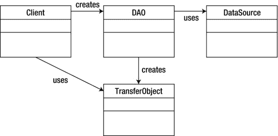

图 5-4.  DAO 设计模式的 UML 类图

除了上述参与者（`Client`、`DAO`、`TransferObject` 和 `DataSource`）之外，该模式可能还有一个参与者——`DAOFactory`。你可能拥有多个 DAO 对象，对应于你想要存储的所有不同类型的对象。你可以定义一个工厂（使用工厂设计模式，就像你在上一节中所做的那样），该工厂可以为每个 DAO 对象提供一个方法。别担心……你将在下一个示例中实现一个工厂。

假设你想在 FunPaint 应用程序中实现 DAO 设计模式。这里，你有一个 `Circle` 类，你想将其存储在持久化数据存储中。清单 5-15 展示了该模式的实现。

清单 5-15.  Test.java

```
// Circle.java
public class Circle {
        private int xPos, yPos;
        private int radius;
        public Circle(int x, int y, int r) {
                xPos = x;
                yPos = y;
                radius = r;
        }
        public String toString() {
                return "center = (" + xPos + "," + yPos + ") and radius = " + radius;
        }
        public CircleTransfer getCircleTransferObject() {
                CircleTransfer circleTransfer = new CircleTransfer();
                circleTransfer.setRadius(radius);
                circleTransfer.setxPos(xPos);
                circleTransfer.setyPos(yPos);
                return circleTransfer;
        }
        // other members
}

// CircleDAO.java
public interface CircleDAO {
        public void insertCircle(CircleTransfer circle);
        public CircleTransfer findCircle(int id);
        public void deleteCircle(int id);
}

// RDBMSDAO.java
public class RDBMSDAO implements CircleDAO {
        @Override
        public void insertCircle(CircleTransfer circle) {
                // insertCircle implementation
                System.out.println("insertCircle implementation");
        }
        @Override
        public CircleTransfer findCircle(int id) {
                // findCircle implementation
                return null;
        }
        @Override
        public void deleteCircle(int id) {
                // deleteCircle implementation
        }
}

// DAOFactory.java
public class DAOFactory {
         public static CircleDAO getCircleDAO(String sourceType) {
                // This is a simple example, so we have listed only "RDBMS" as the only source type
                // In a real-world application, you can provide more source types
                switch(sourceType){
                case "RDBMS":
                        return new RDBMSDAO();
                }
                return null;
        }
}

// CircleTransfer.java
import java.io.Serializable;

public class CircleTransfer implements Serializable {
        private int xPos;
        private int yPos;
        private int radius;
        public int getxPos() {
                return xPos;
        }
        public void setxPos(int xPos) {
                this.xPos = xPos;
        }
        public int getyPos() {
                return yPos;
        }
        public void setyPos(int yPos) {
                this.yPos = yPos;
        }
        public int getRadius() {
                return radius;
        }
        public void setRadius(int radius) {
                this.radius = radius;
        }
}

// Test.java
public class Test {
        public static void main(String[] args) {
                Circle circle = new Circle(10, 10, 20);
                System.out.println(circle);
                CircleTransfer circleTransfer = circle.getCircleTransferObject();
                CircleDAO circleDAO = DAOFactory.getCircleDAO("RDBMS");
                circleDAO.insertCircle(circleTransfer);
        }
}
```

嗯，这是一个相当大的程序。让我们逐步分析一下。`Circle` 类属于你的核心业务逻辑；除了其他常规成员外，`Circle` 类包含一个方法——`getCircleTransferObject()`——它返回包含所需数据的 `CircleTransfer` 对象。你定义了 `CircleDAO` 接口，其中包含三个常用于数据源的方法。`RDBMSDAO` 实现了 `CircleDAO`，并提供了访问 RDBMS 数据源的具体实现。`CircleTransfer` 对象在 `main()` 方法（充当 `Client`）和 `DAO` 实现（即 `RDBMSDAO` 类）之间扮演数据载体的角色。


好的，作为一名高级文档工程师和翻译员，我将严格遵循您提供的注意事项和示例，将给定的英文文本翻译成中文。


在清单 5-15 的实现中，另一个值得注意的特性是使用了工厂设计模式。在一个应用程序中，可能会有许多 DAO 对象。例如，在 FunPaint 应用程序中，你可能会有 `CircleDAO`、`RectangleDAO`、`SquareDAO` 等。你可以在一个 DAO 工厂中定义 *getter 方法* 来获取相应的 DAO 对象。在每个方法中，你可以根据提供的类型返回一个合适的 DAO 对象，就像本例中根据 RDBMS 类型所做的那样。

以下是 DAO 设计模式的好处：

*   该模式引入了一种抽象：DAO 对核心业务逻辑隐藏了实际数据源的实现细节。业务逻辑无需了解数据源的细枝末节，从而使代码更易于理解、更简单。
*   该模式将持久化机制与应用程序的其余代码分离，并将其集中到一个特定于某个数据源的类中。这种集中化使得维护和错误追踪更加容易。
*   使用此模式扩展对其他数据源的支持非常容易。例如，如果你想在 FunPaint 应用程序中提供对基于 XML 的存储库的支持，可以通过定义一个新类（例如 `XMLDAO`）来实现。这个新类将实现你的 `CircleDAO` 接口，这样你就不需要更改访问数据源的方式。唯一需要更改的是你传递给 `DAOFactory` 以创建 DAO 的参数。很简单，不是吗？

要点记忆

以下是 OCPJP 7 考试需要记住的要点：

*   你在 DAO 设计模式中看到了工厂设计模式的实现。如果你有多个 DAO 对象和多个持久化机制，你也可以采用抽象工厂设计模式。
*   请注意，你将 `TransferObject`（例如 `CircleTransfer`）声明为 *可序列化的*。知道为什么这样做吗？嗯，如果你在两个 JVM 之间使用传输对象，那么该传输对象必须是可序列化的。
*   在 OOP 中，一个有用且重要的设计原则是“关注点分离”。该原则指出，*关注点*（或特性）应该被*分离*（以实现最小重叠），以克服软件设计中固有的复杂性。DAO 设计模式帮助你遵守这一设计原则。如果你不使用 DAO，那么你的业务逻辑将暴露于持久化机制的具体实现细节——这是一种不可取的状态。使用 DAO 设计模式可以确保你将核心逻辑与持久化机制分离开来。

问答时间！

1.  以下哪个陈述是正确的？

*   A.  一个类可以继承多个基类。
    *   B.  由于 Java 不支持多重继承，你只能实现一个接口。
    *   C.  你可以实现多个接口。
    *   D.  你一次只能继承一个类或实现一个接口（但不能同时进行）。

**答案：** C

2.  考虑以下接口声明：

```
    public interface Rotatable {
         void rotate(float degree);
         // 插入代码
    }
    ```

现在，考虑以下可以替换“// 插入代码”的选项：

*   `I.  public final float degree = 0;`
    *   `II.  public static final float degree = 0;`
    *   `III.  public final static float degree = 0;`
    *   `IV.  public final float degree;`
    *   `V.  public float degree;`
    *   `VI.  float degree = 0;`

选择正确的选项：

*   A.  选项 I、II、III 和 VI 可以无错误编译。
    *   B.  选项 I、II 和 III 可以无错误编译。
    *   C.  选项 I 可以无错误编译。
    *   D.  选项 IV 和 V 可以无错误编译。
    *   E.  所有选项都可以无错误编译。

**答案：** A

3.  考虑以下示例：

```
    public interface xyz {
         void abc() throws IOException;
    }
    public interface pqr {
         void abc() throws FileNotFoundException;
    }
    public class Implementation implements xyz, pqr {
         // 插入代码
         { /*实现*/ }
    }
    ```

以下哪个语句可以插入到“// 插入代码”注释的位置？

*   A.  public void abc() throws IOException
    *   B.  public void abc() throws FileNotFoundException
    *   C.  public void abc() throws FileNotFoundException, IOException
    *   D.  public void abc() throws IOException, FileNotFoundException

**答案：** B

（因为 `FileNotFoundException` 是 `IOException` 的子类型，所以它满足两个方法的要求）。

4.  考虑以下三个类：`University`、`Department` 和 `CSE_Department`（CSE 代表计算机科学与工程）。`University` 和 `Department` 类通过关系 R1 关联，`Department` 和 `CSE_Department` 类通过关系 R2 关联。这些关系的哪种组合是合适的？

*   A.  R1：继承，R2：继承
    *   B.  R1：组合，R2：继承
    *   C.  R1：继承，R2：组合
    *   D.  R1：组合，R2：组合

**答案：** B

（一所大学有多个系，因此它们之间是 has-a 关系，即组合关系。CSE_Department 是一个系，因此这两者之间是 is-a 关系，即继承关系。）

5.  你需要对一个文件系统进行建模，其中文件夹内可以包含子文件夹和文件。在这种情况下，表示 `Folder` 和 `File` 类之间关系的最合适的设计选择是什么？

*   A.  使用组合来建模“一个 `Folder` 对象由 `File` 对象组成”的关系。
    *   B.  使用组合来建模“一个 `Folder` 对象由 `File` 对象或 `Folder` 对象组成”的关系。
    *   C.  使用继承定义一个超类（例如 `FolderItem`），并使 `Folder` 和 `File` 类成为该类的子类。使用组合来建模“一个 `Folder` 对象由 `FolderItem` 对象组成”的关系。
    *   D.  在 `Folder` 和 `File` 类之间使用继承来建模“一个 `Folder` 是 `File` 的一种类型”的关系。

**答案：** C

（实际上，这种安排被称为组合设计模式）

总结

**接口**

*   接口是一组定义协议的抽象方法。
*   接口不能被实例化；但是，一个接口可以扩展另一个接口。
*   接口中声明的所有方法都被隐式地视为抽象方法。
*   抽象类和接口是非常相似的概念。但是，你应该根据上下文谨慎地使用合适的构造。

**对象组合**

*   继承意味着 is-a 关系，接口意味着 is-like-a 关系，组合意味着 has-a 关系。
*   在可行的情况下，优先使用组合而非继承。
*   针对接口编程，而不是针对实现编程。

**设计模式**

*   设计模式是经常重复出现的设计问题的可重用解决方案。
*   观察者设计模式改善了主题和观察者之间的松散耦合。
*   单例设计模式确保只创建该类的一个实例。
*   确保预期的单例实现确实是单例是一项非常重要的任务，尤其是在多线程环境中。
*   工厂设计模式按需“制造”所需类型的产品。
*   当你有一系列对象需要创建时，应该考虑使用抽象工厂设计模式。
*   DAO 设计模式本质上将你的核心业务逻辑与持久化逻辑分离开来。

第 6 章


泛型和集合

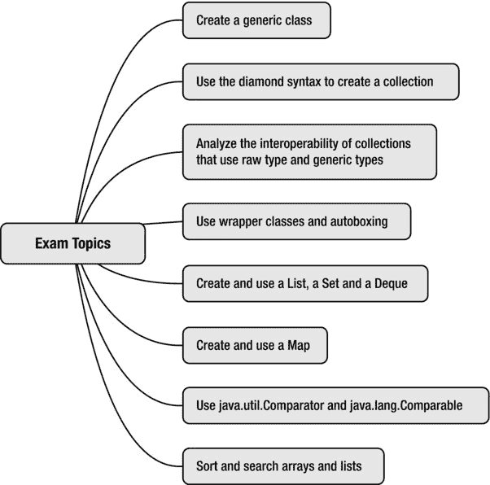


每个非平凡的 Java 应用程序都会使用数据结构和算法。Java 集合框架提供了大量现成的通用数据结构和算法。这些数据结构和算法可以以类型安全的方式与任何合适的数据类型一起使用；这是通过使用一种称为泛型的语言特性来实现的。

由于数据结构和算法是使用泛型实现的，因此在 1Z0-804 考试大纲中，这两个互补的主题被合并为一个主题。在本章中，我们首先介绍泛型，它对于定义可重用的数据结构和算法非常有用。我们将讨论泛型如何比 `Object` 类型容器提供更高的类型安全性。我们还将探讨泛型的其他方面，例如泛型中的通配符参数和泛型中的子类型化。

在本章的集合部分，你将学习如何使用 Java 库中提供的现成数据结构（使用泛型实现）。我们将讨论集合框架中一些从 OPCJP 7 考试角度来看很重要的接口和具体类。

泛型

*泛型* 是 Java 1.5 版本引入的一种语言特性。泛型帮助你为一种类型（例如 `T`）编写适用于所有类型的代码，而不是为每种类型编写单独的类。在 Java 引入泛型之前，`Object` 基类被用作泛型的替代方案。然而，使用 `Object` 类在容器中存储元素会导致类型安全问题——也就是说，使用这样的容器会允许 Java 编译器无法识别的类型错误，从而导致运行时异常。如果你不理解这段关于类型安全的描述，不用担心，因为我们接下来会用几个例子详细解释类型安全问题。理解类型安全很重要。事实上，在语言中添加泛型的主要动机是因为遗留的容器类不是类型安全的。

使用 Object 类型与类型安全

在 Java 引入泛型之前，数据结构是通过使用 `Object` 基类存储和处理元素来实现的。我们将讨论一个例子来理解为什么这些容器不是类型安全的。考虑 清单 6-1 中的程序，它使用了 `Vector` 类（你可以将 `Vector` 视为一个“动态增长的数组”，你可以像数组一样在其中添加或删除元素）。你能预测这个程序的输出吗？

清单 6-1.  OldContainerTest.java

```
import java.util.Vector;

// 此程序演示了容器（基于 Object 类型）缺乏类型安全性的问题。
class OldContainerTest {
        public static void main(String []args) {
                Vector floatValues = new Vector();
                floatValues.add(10.0f);
                floatValues.add(100.0);
                for(int i = 0; i < floatValues.size(); i++) {
                        System.out.println(floatValues.get(i));
                }
        }
}
```

它打印如下内容：

```
10.0
100.0
```

现在让我们对这个程序只做一个改动：不直接打印从 `Vector` 的 `get` 方法返回的值，而是先将其存储在一个 `Float` 类型的临时变量中，然后使用 `println` 打印该临时值：

```
Float temp = (Float) floatValues.get(i);
System.out.println(temp);
```

现在输出如下：

```
10.0
Exception in thread "main" java.lang.ClassCastException: java.lang.Double cannot be cast to
java.lang.Float at OldContainerTest.main(OldContainerTest.java:9)
```

为什么？发生了什么？`Vector` 容器能够持有任何对象（即，它持有 `Object` 类型的值）。然而，当你尝试放入一个原始类型时，它会被自动“装箱”，并且包装器对象被放入容器中（使用 Java 中的自动装箱特性）。对于 `10.0`，对应的原始类型是 `float`（注意后缀“f”！），因此会创建一个 `Float` 类型的包装器对象，并将该对象放入 `Vector`。对于 `100.0`，原始类型是 `Double`（实数，如果没有显式给出后缀，默认假定为 `Double` 类型）。因此，会创建一个 `Double` 类型的包装器对象，并将该对象放入 `Vector`。

到目前为止，一切顺利。在原始程序中，没有强制类型转换，因此浮点数值直接使用 `println` 中的 `toString()` 方法打印。然而，当你尝试使用 `Float` 类型进行强制转换时，就会遇到麻烦。你不能将 `Double` 值 100.0 转换为 `Float` 类型。（`Float` 类型可以转换为 `Double` 类型——但 `Float` 类型不能转换为 `Double` 类型！）因此你在运行时得到了一个 `ClassCastException`。

换句话说，`Vector` 是基于 `Object` 类型实现的。因此，你可以将任何类型的对象放入一个 `Vector` 对象中。你无法*在编译时*强制规定只有特定类型的元素才能被插入到容器中。事实上，在编译程序时，编译器确实会警告你使用了*原始类型* `Vector`（参见 图 6-1）。我们将在本章的“原始类型和泛型类型的互操作性”部分进一步讨论这些原始类型（即非泛型类型）。

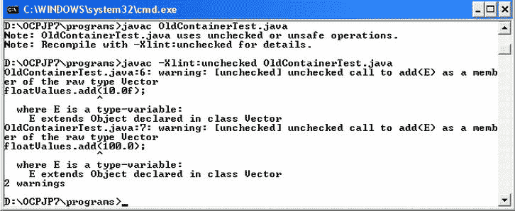

图 6-1.  编译器关于使用原始类型 Vector 的警告

使用 `Object` 基类存储元素的 `Vector` 容器允许你添加任何类型的元素，而你的应用程序逻辑可能要求只应添加字符串。使用泛型，你可以向编译器指定只有特定类型的元素才能被添加到容器中。泛型将确保任何尝试添加指定类型之外的其他类型元素的行为都会在编译时被捕获。换句话说，使用泛型实现的数据结构会在编译时检查类型安全性，因此这些数据结构是类型安全的。

使用 Object 类与泛型对比

在上一节中，我们重点讨论了在使用基于 `Object` 基类实现的现有数据结构时存在的类型安全问题。在本节中，我们将把焦点转向*定义你自己的数据结构*。通过一个使用 `Object` 基类定义容器类的例子，你将理解为什么这样的容器不是类型安全的。之后，我们将介绍泛型的概念，并向你展示使用泛型如何帮助定义类型安全的容器。

使用 Object 类的容器实现

假设你想在方括号内打印对象的值。例如，要打印一个值为 10 的 `Integer` 对象，你不想在控制台打印“10”，而是想在一个“盒子”里打印该值，像这样：“[10]”。默认的 `toString()` 方法只给出对象值的 `String` 表示；你想要一个增强的 `toString()` 方法，它会在值的前后打印“[”和“]”。你该怎么做？你可以编写一个 `BoxPrinter` 类来重写 `toString()` 方法。你将使用 `Object` 来存储该值，因为它是所有类型的公共基类（参见 清单 6-2）。

清单 6-2.  BoxPrinterTest1.java


```
// 该程序演示了基于"Object"的实现及其缺乏类型安全性的问题
class BoxPrinter {
        private Object val;
        public BoxPrinter(Object arg) {
                val = arg;
        }
        public String toString() {
                return "[" + val + "]";
        }
}

class BoxPrinterTest1 {
        public static void main(String []args) {
                BoxPrinter value1 = new BoxPrinter(new Integer(10));
                        System.out.println(value1);
                BoxPrinter value2 = new BoxPrinter("Hello world");
                System.out.println(value2);
        }
}
```

程序运行正常，输出如下：

```
[10]
[Hello world]
```

你可以传入任意类型的对象，这段代码都能正确地在"["和"]"之间打印其内容。这与旧版容器（如`Vector`）的实现机制相同。那么问题出在哪里呢？请看以下场景：假设你想添加一个名为`getValue()`的方法，用于获取`BoxPrinter`中存储的值。在创建`BoxPrinter`对象时，你如何取回当初放入的原始类型？问题由此开始。清单 6-3 包含了一个示例。

清单 6-3.  BoxPrinterTest2.java

```
// 该程序演示了基于"Object"的实现及其缺乏类型安全性的问题
class BoxPrinter {
        private Object val;
        public BoxPrinter(Object arg) {
                val = arg;
        }
        public String toString() {
                return "[" + val + "]";
        }
        public Object getValue() {
                return val;
        }
}

class BoxPrinterTest2 {
        public static void main(String []args) {
                BoxPrinter value1 = new BoxPrinter(new Integer(10));
                System.out.println(value1);
                Integer intValue1 = (Integer) value1.getValue();

BoxPrinter value2 = new BoxPrinter("Hello world");
                System.out.println(value2);
                        // 哎呀！不小心用了 (Integer) 强制转换，而不是 (String)
                        Integer intValue2 = (Integer) value2.getValue();
        }
}
```

输出结果如下：

```
[10]
[Hello world]
Exception in thread "main" java.lang.ClassCastException: java.lang.String cannot be cast to
java.lang.Integer at BoxPrinterTest2.main(Main.java:22)
```

在以下代码行中：

```
Integer intValue2 = (Integer) value2.getValue();
```

你不小心执行了从`Object`到`Integer`的下转型，而不是从`Object`到`String`。编译器无法检测到你试图将`String`类型的值转换为`Integer`的错误。你记忆中的值实际上是`Object`类型，而在执行下转型之前检查正确类型的唯一方法是使用`instanceof`运算符。在这种情况下，你可以对`String`进行`instanceof`检查，以确保转型正确。然而，通常情况下，当你不知道`BoxPrinter`中存储的对象类型时，你根本无法在代码中执行`instanceof`检查来进行下转型！这就是旧版 Java 容器类（使用`Object`类存储元素）缺乏类型安全性的原因。

使用泛型的容器实现

清单 6-4 包含了上一节中`BoxPrinter`类的泛型版本。

清单 6-4.  BoxPrinterTest3.java

```
// 该程序演示了使用泛型的容器实现
class BoxPrinter<T> {
        private T val;
        public BoxPrinter(T arg) {
                val = arg;
        }
        public String toString() {
                return "[" + val + "]";
        }
}

class BoxPrinterTest3 {
        public static void main(String []args) {
                BoxPrinter<Integer> value1 = new BoxPrinter<Integer>(new Integer(10));
                System.out.println(value1);

BoxPrinter<String> value2 = new BoxPrinter<String>("Hello world");
                System.out.println(value2);
        }
}
```

输出结果如下：

```
[10]
[Hello world]
```

这里有许多需要注意的地方。

1.  查看`BoxPrinter`的声明：

```
    class BoxPrinter<T>
    ```

你为`BoxPrinter`类提供了一个*类型占位符*`<T>`——即类名后尖括号"<"和">"中的类型名称`T`。你可以在类内部使用这个类型名称，表示它是后续实际类型的占位符。（注意，这里使用了异常简短的标识符`T`来表示类型名称：这是有意为之，稍后你将看到泛型类型的命名约定。）

2.  在类内部，你首先在字段声明中使用了`T`：

```
    private T val;
    ```

你声明了一个*泛型类型*的`val`——实际类型将在你使用`BoxPrinter`时指定。在`main()`方法中，你像这样声明了一个`Integer`类型的变量：

```
    BoxPrinter<Integer> value1
    ```

这里，你指定`T`为`Integer`类型——标识符`T`（占位符）被替换为类型`Integer`。因此，`BoxPrinter`内部的`val`变成了`Integer`类型，因为`T`被替换成了`Integer`。

3.  现在，这是另一个使用`T`的地方：

```
    public BoxPrinter(T arg) {
            val = arg;
    }
    ```

与使用类型`T`声明`val`类似，这里表示`BoxPrinter`构造函数的参数也是`T`类型。稍后在`main()`方法中，当使用`new`调用构造函数时，你指定`T`为`Integer`类型：

```
new BoxPrinter<Integer>(new Integer(10));
```

现在，在`BoxPrinter`构造函数内部，`arg`和`val`*应该是相同类型*，因为它们都是`T`类型。例如，如果你将构造函数改为如下形式：

```
new BoxPrinter<String>(new Integer(10));
```

那么`BoxPrinter`是`String`类型，而传入的参数是`Integer`类型，因此在使用泛型时会出现类型不匹配的编译器错误（这很好，因为你能更早地发现问题）。

现在，让我们添加`getValue()`方法，用于返回`BoxPrinter`类中包含的值。清单 6-5 包含了增强后的版本。

清单 6-5.  BoxPrinterTest4.java

```
// 该程序演示了泛型的类型安全特性
class BoxPrinter<T> {
        private T val;
        public BoxPrinter(T arg) {
                val = arg;
        }
        public String toString() {
                return "[" + val + "]";
        }
        public T getValue() {
                return val;
        }
}

class BoxPrinterTest4 {
        public static void main(String []args) {
                BoxPrinter<Integer> value1 = new BoxPrinter<Integer>(new Integer(10));
                System.out.println(value1);
                Integer intValue1 = value1.getValue();

BoxPrinter<String> value2 = new BoxPrinter<String>("Hello world");
                System.out.println(value2);
                // 哎呀！不小心把 String 放进了 Integer 中
                Integer intValue2 = value2.getValue();
        }
}
```

这是你犯错并试图将`String`放入`Integer`的那行代码：

```
Integer intValue2 = value2.getValue();
```

你会得到以下编译器错误：

```
BoxPrinterTest.java:23: 不兼容的类型
找到   : java.lang.String
需要: java.lang.Integer
                Integer intValue2 = value2.getValue();
```

这很好，不是吗？与在`BoxPrinter`中使用`Object`类时出现`ClassCastException`不同，这里你得到了一个编译器错误（不兼容的类型）。现在，你可以修复这个错误，程序就能正确运行了。

|  | 泛型在提供类型安全性的同时实现了泛型化实现。 |

基于这个简单的介绍，让我们通过几个示例来进一步了解泛型。

创建泛型类


让我们创建一个可以容纳两种不同类型对象 `T1` 和 `T2` 的 `Pair` 泛型类（参见清单 6-6）。不必过于纠结它在解决实际问题时有多大用处，只需尝试理解如何编写自己的泛型即可。

清单 6-6.  PairTest.java

```
// 它演示了在定义类时泛型的使用方法
class Pair<T1, T2> {
        T1 object1;
        T2 object2;
        Pair(T1 one, T2 two) {
                object1 = one;
                object2 = two;
        }
        public T1 getFirst() {
                return object1;
        }
        public T2 getSecond() {
                return object2;
        }
}

class PairTest {
        public static void main(String []args) {
                Pair<Integer, String> worldCup = new Pair<Integer, String>(2010, "South Africa");
                System.out.println("World cup " +  worldCup.getFirst() +
                        " in " + worldCup.getSecond());
        }
}
```

该程序将输出以下内容：

```
World cup 2010 in South Africa
```

这里的 `T1` 和 `T2` 是类型占位符。你将这些类型占位符放在尖括号内：`<T1, T2>`。当使用 `Pair` 类时，你必须指定要用哪些具体类型来替代 `T1` 和 `T2`。例如，在 `main()` 方法中，你为 `Pair` 使用了 `Integer` 和 `String`，即 `Pair<Integer, String>`。现在，你可以将 `Pair` 类想象成具有以下主体：

```
// Pair<Integer, String> 在内部可以被视为这样
class Pair {
        Integer object1;
        String object2;
        Pair(Integer one, String two) {
                object1 = one;
                object2 = two;
        }
        public Integer getFirst() {
                return object1;
        }
        public String getSecond() {
                return object2;
        }
```

}

换句话说，尝试手动对类型占位符执行查找替换操作，将其替换为代码中的实际类型。这将帮助你理解泛型实际的工作原理。通过这种方式，你就能理解 `getFirst()` 和 `getSecond()` 方法如何在 `main()` 方法中返回 `Integer` 和 `String` 值。

在以下语句中

```
Pair<Integer, String> worldCup = new Pair<Integer, String>(2010, "South Africa");
```

请注意类型完全匹配。如果你尝试

```
Pair<Integer, String> worldCup = new Pair<String, String>(2010, "South Africa");
```

你将得到以下编译器错误：

```
TestPair.java:20: 找不到符号
符号: 构造函数 Pair(int,java.lang.String)
位置: 类 Pair<java.lang.String,java.lang.String>
```

那么，试试下面这条语句会怎样？

```
Pair<Integer, String> worldCup = new Pair<Number, String>(2010, "South Africa");
```

由于 `worldCup` 的声明类型与初始化表达式中给出的类型不匹配，你将得到另一个编译器错误：

```
TestPair.java:20: 类型不兼容
找到: Pair<java.lang.Number,java.lang.String>
需要: Pair<java.lang.Integer,java.lang.String>
```

现在修改泛型 `Pair` 类。`Pair<T1, T2>` 存储了类型为 `T1` 和 `T2` 的对象。那么，一个接受类型 `T` 并存储两个该类型 `T` 对象的泛型对偶类又如何呢？显然，一种方法是使用相同类型实例化 `Pair<T1, T2>`，例如 `Pair<String, String>`，但这并非一个好的解决方案。为什么？因为无法确保你使用相同类型实例化 `Pair`！清单 6-7 是 `Pair` 的一个修改版本——我们称之为 `PairOfT`——它只接受一个类型占位符 `T`。

清单 6-7.  PairOfT.java

```
// 该程序展示了如何在你的程序中使用泛型

class PairOfT<T> {
        T object1;
        T object2;
        PairOfT(T one, T two) {
                object1 = one;
                object2 = two;
        }
        public T getFirst() {
                return object1;
        }
        public T getSecond() {
                return object2;
        }
}
```

现在，下面这条语句能工作吗？

```
PairOfT<Integer, String> worldCup = new PairOfT<Integer, String>(2010, "South Africa");
```

不能，因为 `PairOfT` 只接受一个类型参数，而你在这里给出了两个类型参数。因此，你会得到一个编译器错误。那么，下面这条语句呢？

```
PairOfT<String> worldCup = new PairOfT<String>(2010, "South Africa");
```

不行，你仍然会得到一个编译器错误：

```
TestPair.java:20: 找不到符号
符号: 构造函数 PairOfT(int,java.lang.String)
位置: 类 PairOfT<java.lang.String>
           PairOfT<String> worldCup = new PairOfT<String>(2010, "South Africa");
```

原因是 2010——在装箱后——是一个 `Integer`，而你应该提供一个 `String` 作为参数。下面这条语句呢？

```
PairOfT<String> worldCup = new PairOfT<String>("2010", "South Africa");
```

是的，它能编译并正常运行。

菱形语法

在上一节中，我们讨论了如何创建泛型类型实例，如下面的语句所示：

```
Pair<Integer, String> worldCup = new Pair<Integer, String>(2010, "South Africa");
```

我们还讨论了如果这些类型不匹配会导致编译器错误，例如下面的语句将无法编译：

```
Pair<Integer, String> worldCup = new Pair<String, String>(2010, "South Africa");
```

看到了吗？确保在声明类型（本例中为 `Pair<Integer, String>`）和创建新对象的表达式（本例中为 `new Pair<String, String>()`）中提供相同的类型参数是多么繁琐？

为了简化你的工作，Java 7 引入了*菱形*语法，其中类型参数可以省略：你可以让编译器从类型声明中推断类型。因此，声明可以简化为

```
Pair<Integer, String> worldCup = new Pair<>(2010, "South Africa");
```

为了更清楚，清单 6-8 包含了使用这种菱形语法的完整程序。

清单 6-8.  Pair.java

```
// 该程序展示了在使用泛型时菱形语法的用法
class Pair<T1, T2> {
        T1 object1;
        T2 object2;
        Pair(T1 one, T2 two) {
                object1 = one;
                object2 = two;
        }
        public T1 getFirst() {
                return object1;
        }
        public T2 getSecond() {
                return object2;
        }
}

class TestPair {
        public static void main(String []args) {
                Pair<Integer, String> worldCup = new Pair<>(2010, "South Africa");
                System.out.println("World cup " +  worldCup.getFirst() +
                        " in " + worldCup.getSecond());
        }
}
```

该程序将顺利编译并输出以下语句：

```
World cup 2010 in South Africa
```

请注意，在初始化表达式中忘记菱形运算符 `<>` 是一个常见错误，例如：

```
Pair<Integer, String> worldCup = new Pair (2010, "South Africa");
```

图 6-2 显示了当你忘记使用菱形语法时编译器给出的警告。由于 `Pair` 是一个泛型类型，而你忘记使用 `<>` 或显式提供类型参数，编译器会将其视为原始类型，其中 `Pair` 接受两个 `Object` 类型参数。尽管这种行为在这个特定代码段中没有引起任何问题，但它是危险的，并且可能导致错误，如下一节所示。

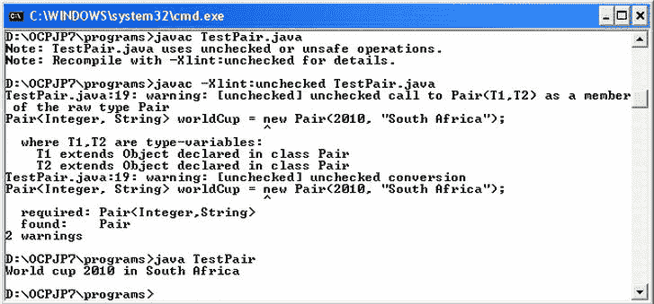

图 6-2.  当你忘记使用菱形语法时编译器给出的警告

原始类型与泛型类型的互操作性


泛型类型可以在不指定其关联类型的情况下使用；在这种情况下，该类型被称为*原始类型*。例如，`List<T>` 应与其关联类型（即 `List<String>`）一起使用；然而，它也可以在不指定伴随类型（即 `List`）的情况下使用。在后一种情况下，`List` 被称为原始类型。

当你使用原始类型时，就会失去泛型所提供的类型安全性优势。例如，清单 6-1 中的类型 `Vector` 就是一个原始类型。在编译时，编译器会生成一个警告，如图 6-1 所示。原始类型绕过了编译时的类型检查；然而，它们可能会抛出运行时异常（例如 `ClassCastException`）。因此，不建议在新代码中使用原始类型。

好了，现在你明白了不应该使用原始类型。但是，你可能会问，为什么编译器本身会允许这样的类型声明呢？答案是*向后兼容性*。Java 泛型是在 Java SDK 5 中引入的。Java 支持原始类型是为了使基于泛型的代码与遗留代码兼容。然而，强烈建议你今后不要使用原始类型。

为什么？如果你将原始类型与泛型一起使用会发生什么？让我们在清单 6-9 中同时使用这两种类型，并检查其效果。

清单 6-9.  RawTest.java

```
//此程序演示了原始类型与泛型一起使用的情况
class RawTest{
        public static void main(String []args) {
                List list = new LinkedList();
                list.add("First");
                list.add("Second");
                List<String> strList = list;  //#1
                for(Iterator<String> itemItr = strList.iterator(); itemItr.hasNext();)
                        System.out.println("Item : " + itemItr.next());

List<String> strList2 = new LinkedList<>();
                strList2.add("First");
                strList2.add("Second");
                List list2 = strList2;  //#2
                for(Iterator<String> itemItr = list2.iterator(); itemItr.hasNext();)
                        System.out.println("Item : " + itemItr.next());
        }
}
```

你期望上述程序输出什么？你认为它能正常编译/执行吗？嗯，是的——它能编译（带有警告）并毫无问题地执行。它会打印以下内容：

```
Item : First
Item : Second
Item : First
Item : Second
```

清单 6-10 引入了一些更改；观察输出结果。

清单 6-10.  RawTest2.java

```
// 此程序演示了原始类型与泛型一起使用的情况
class RawTest{
        public static void main(String []args) {
                List list = new LinkedList();
                list.add("First");
                list.add("Second");
                List<String> strList = list;
                strList.add(10);        //#1: 生成编译器错误
                for(Iterator<String> itemItr = strList.iterator(); itemItr.hasNext();)
                System.out.println("Item : " + itemItr.next());

List<String> strList2 = new LinkedList<>();
                strList2.add("First");
                strList2.add("Second");
                List list2 = strList2;
                list2.add(10);  //#2: 编译通过，导致运行时异常
                for(Iterator<String> itemItr = list2.iterator(); itemItr.hasNext();)
                System.out.println("Item : " + itemItr.next());
        }
}
```

在上面的例子中，你添加了两个语句。第一个语句如下：

```
strList.add(10);        //#1: 生成编译器错误
```

你试图向一个 `List<String>` 类型的列表中添加一个整数项，因此会得到一个编译时错误。正如之前讨论的，这种编译器级别的类型检查是好的，因为如果没有它，稍后可能会导致运行时异常。这是你添加的第二个语句：

```
list2.add(10);          //#2: 编译通过，导致运行时异常
```

这里，`list2` 链表（原始类型）被初始化为一个泛型类型 `List<String>`。初始化之后，你向这个原始类型列表中添加了一个整数。这是允许的，因为 `list2` 是一个原始类型。然而，这会导致一个 `ClassCastException`。

从这两个例子中你能学到什么？教训是避免在程序中混用原始类型和泛型类型，因为这可能会导致运行时出现错误行为。如果你需要在程序中同时使用两者，请确保在容器中只添加单一类型的元素，并使用相同的类型进行检索。

|  | 避免将原始类型与泛型类型混用。 |

泛型方法

与泛型类类似，你可以创建泛型方法——即接受泛型参数类型的方法。泛型方法对于编写适用于多种类型但功能保持不变的方法非常有用。例如，`java.util.Collections` 类中有许多泛型方法。

让我们实现一个名为 `fill()` 的简单方法。给定一个容器，`fill()` 方法会用值 `val` 填充容器的所有元素。清单 6-11 包含了 `Utilities` 类中 `fill()` 方法的实现。

清单 6-11.  Utilities.java

```
// 此程序演示了泛型方法
class Utilities {
        public static <T> void fill(List<T> list, T val) {
                for(int i = 0; i < list.size(); i++)
                        list.set(i, val);
        }
}

class UtilitiesTest {
        public static void main(String []args) {
                List<Integer> intList = new ArrayList<Integer>();
                intList.add(10);
                intList.add(20);
                System.out.println("原始列表是: " + intList);
                Utilities.fill(intList, 100);
                System.out.println("调用 Utilities.fill() 后的列表是: " + intList);
        }
}
```

它会打印以下内容：

```
原始列表是: [10, 20]
调用 Utilities.fill() 后的列表是: [100, 100]
```

让我们逐步分析这段代码：

1.  你在 `Utilities` 类中创建了一个名为 `fill()` 的方法，其声明如下：

```
    public static <T> void fill(List<T> list, T val)
    ```

你在此方法中声明了泛型类型参数 `T`。在限定符 public 和 static 之后，你放置了 `<T>`，然后紧跟返回类型、方法名及其参数。这个声明与泛型类不同——在泛型类中，你将泛型类型参数放在类名之后。

2.  在方法体中，你像编写普通方法一样编写代码。

```
    for(int i = 0; i < list.size(); i++)
            list.set(i, val);
    ```

你从 0 开始遍历列表直到其大小，并在每次迭代中将每个元素设置为值 `val`。你使用了 `List` 中的 `set()` 方法，该方法将容器中的索引位置作为第一个参数，将要设置的实际值作为第二个参数。

3.  在 `UtilitiesTest` 类的 `main()` 方法中，你像这样调用 `fill()` 方法：

```
    Utilities.fill(intList, 100);
    ```

请注意，你没有显式给出泛型类型参数的值。由于 `intList` 是 `Integer` 类型，并且 100 被装箱为 `Integer` 类型，编译器推断出 `fill()` 方法中的类型 `T` 是 `Integer` 类型。


|  | 一个常见的错误是从 `java.awt` 而非 `java.util` 导入 `List`。如果使用了错误的导入，程序可能无法编译（或产生警告）。请记住，`java.util` 中的 `List` 是泛型类型，而 `java.awt` 中的 `List` 则不是。 |

我们已经讨论了静态泛型方法。那么非静态泛型方法呢？嗯，实际上，对于非静态方法来说，几乎没有什么区别。显然，你需要创建定义该非静态方法的类的实例，才能使用该非静态方法。

泛型与子类型

这里有一个小测验。

**问题：** 以下赋值语句中，只有*一个*是正确的且能无错误编译。是哪一句？

（注意：`List` 是一个抽象类，`ArrayList` 继承自 `List`；类似地，`Number` 是一个抽象类，`Integer` 继承自 `Number`）。

*   `1\. List<Integer> intList = new List<Integer>();`
*   `2\. List<Integer> intList = new ArrayList<Integer>();`
*   `3\. List<Number> intList = new ArrayList<Integer>();`
*   `4\. List<Integer> intList = new ArrayList<Number>();`

**答案：** 只有第二个赋值语句能无错误编译。

为什么？让我们逐一分析每个选项。

1.  你试图将 `List<Integer>` 类型的 `intList` 赋值给一个 `List<Integer>` 类型的对象。但 `List` 是一个抽象类。你不能实例化抽象类，因此会得到编译器错误。
2.  你试图将 `List<Integer>` 类型的 `intList` 赋值给一个 `ArrayList<Integer>` 类型的对象。由于 `ArrayList` 继承自 `List`，这是有效的赋值，不会出现编译器错误。
3.  你试图将 `List<Number>` 类型的 `intList` 赋值给一个 `ArrayList<Integer>` 类型的对象。`ArrayList` 继承自 `List`——这没问题——但声明和初始化中的泛型参数类型应该相同。因此，你会得到编译器错误（类型不匹配）。
4.  原因与选项 3 相同。

你可以将派生类型的对象赋值给其基类型的引用；这就是*子类型*的含义。然而，对于泛型，类型参数必须完全匹配——否则你会得到编译器错误。换句话说，*子类型不适用于泛型参数*。是的，这是一个难以记住的规则，所以让我们更详细地讨论为什么子类型不适用于泛型类型参数。

|  | 对于类类型，子类型是有效的。你可以将派生类型的对象赋值给其基类型的引用。然而，对于泛型类型参数，子类型并不适用。你不能将派生泛型类型参数赋值给基类型参数。 |

为什么子类型不适用于泛型类型参数？让我们看看如果你假设可以对泛型类型参数使用子类型，可能会出现什么问题。

```
// 非法代码——假设允许以下初始化
List<Number> intList = new ArrayList<Integer>();
intList.add(new Integer(10)); // 没问题
intList.add(new Float(10.0f)); // 哎呀！
```

`List<Number>` 类型的 `intList` 本应持有一个 `ArrayList<Number>` 对象。然而，你存储的是一个 `ArrayList<Integer>`。这看起来合理，因为 `List` 继承自 `ArrayList`，且 `Integer` 继承自 `Number`。但是，你最终可能会向 `intList` 中插入一个 `Float` 值！回想一下，`intList` 的动态类型是 `ArrayList<Integer>` 类型——因此你在这里违反了类型安全（从而会得到不兼容类型的编译器错误）。由于泛型旨在避免此类类型安全错误，因此你不能将派生泛型类型参数赋值给基类型参数。

如你所见，泛型参数类型的子类型是不允许的，因为它不安全——但这仍然是一个不便的限制。幸运的是，Java 支持*通配符参数类型*，你可以使用它来实现子类型。我们现在就来探讨这个功能。

|  | 泛型的类型参数有一个限制：赋值时泛型类型参数必须完全匹配。为了克服这个子类型问题，你可以使用通配符类型。 |

通配符参数

你在上一节中看到，子类型不适用于泛型类型参数。因此，

```
List<Number> intList = new ArrayList<Integer>();
```

会产生如下编译器错误：

```
WildCardUse.java:6: 不兼容的类型
找到   : java.util.ArrayList<java.lang.Integer>
需要: java.util.List<java.lang.Number>
                List<Number> numList = new ArrayList<Integer>();
```

如果你稍微修改语句，使用通配符参数，它就能编译通过：

```
List<?> wildCardList = new ArrayList<Integer>();
```

*通配符*是什么意思？就像你在纸牌游戏中用来替代任何一张牌的通配符一样（啊，玩纸牌游戏真有趣！），你可以使用通配符来表示它可以匹配任何类型。使用 `List<?>`，意味着它是一个任意类型的 `List`——换句话说，你可以说它是一个“未知类型的列表！”

但是等等……当你想要一个表示“任意类型”的类型时，你会使用 `Object` 类，不是吗？那么，使用 `Object` 类型参数的相同语句会怎样呢？

```
List<Object> numList = new ArrayList<Integer>();
```

不行——你会得到与上面使用 `List<Number>` 时相同的错误！

```
WildCardUse.java:6: 不兼容的类型
找到   : java.util.ArrayList<java.lang.Integer>
需要: java.util.List<java.lang.Object>
                List<Object> numList = new ArrayList<Integer>();
```

换句话说，你仍然在尝试对泛型参数使用子类型——但它仍然不起作用。如你所见，`List<Object>` 与 `List<?>` 并不相同。实际上，`List<?>` 是任何 List 类型的超类型，这意味着在期望 `List<?>` 的地方，你可以传递 `List<Integer>`、`List<String>`，甚至 `List<Object>`。

让我们在一个示例中使用通配符，看看它是否有效（参见清单 6-12）。

清单 6-12.  WildCardUse.java

```
// 此程序演示了通配符参数的使用
class WildCardUse {
        static void printList(List<?> list){
                for(Object l:list)
                        System.out.println("[" + l + "]");
        }

public static void main(String []args) {
                List<Integer> list = new ArrayList<>();
                list.add(10);
                list.add(100);
                printList(list);
                List<String> strList = new ArrayList<>();
                strList.add("10");
                strList.add("100");
                printList(strList);
        }
}
```

此程序输出以下内容：

```
 [10]
[100]
[10]
[100]
```

嗯，它起作用了，使用通配符的列表可以传递整数列表和字符串列表。这是因为 `printList()` 方法的参数类型是 `List<?>`。太棒了！

通配符的限制

让我们考虑以下代码片段，它尝试添加一个元素并打印列表：

```
List<?> wildCardList = new ArrayList<Integer>();
wildCardList.add(new Integer(10));
System.out.println(wildCardList);
```

你会得到以下编译器错误：

```
WildCardUse.java:7: 找不到符号
符号  : 方法 add(java.lang.Integer)
位置: 接口 java.util.List<capture#145 of ? extends java.lang.Number>
                wildCardList.add(new Integer(10));
```

为什么？你非常确定 `add()` 方法存在于 `List` 接口中。那么为什么编译器找不到该方法呢？


这个问题需要详细解释。当你使用通配符类型 `<?>` 时，你是在告诉编译器你*忽略*了类型信息，因此 `<?>` 代表未知类型。每次你尝试向泛型类型传递参数时，Java 编译器都会尝试推断所传递参数的类型以及泛型的类型，并验证类型安全性。现在，你正尝试使用 `add()` 方法向列表中插入一个元素。由于 `wildCardList` 不知道它持有哪种类型的对象，因此向其中添加元素是有风险的。你最终可能会添加一个字符串（例如 "hello"）而不是整数值。为了避免这个问题（请记住，泛型被引入语言就是为了确保类型安全！），编译器不允许你调用修改对象的方法。由于 `add` 方法会修改对象，因此你会得到一个错误！错误信息看起来也很令人困惑，例如 `<capture#145 of ? extends java.lang.Number>`。

|  | 通常，当你使用通配符参数时，不能调用修改对象的方法。如果你尝试修改，编译器会给出令人困惑的错误信息。但是，你可以调用访问对象的方法。 |

有界通配符

以下是关于通配符的快速回顾，以帮助你理解为什么需要*有界通配符*。当你尝试使用参数类型不同的泛型类型时，会遇到编译器错误，例如：

```
// 编译器错误：
List<Number> numList = new ArrayList<Integer>();
```

你可以使用通配符类型来避免这个编译器错误：

```
// 现在可以工作了：
List<?> numList = new ArrayList<Integer>();
```

假设你希望 `numList` 只能存储数字列表。然而，使用通配符，你最终可能会存储任何类型的列表，例如：

```
List<?> numList = new ArrayList<Integer>();
numList = new ArrayList<String>();
```

是的，这可以编译通过，没有任何错误。你如何限制 `numList` 只能引用 `Number` 及其派生类（如 `Integer`、`Double` 等）呢？你可以通过使用有界通配符来实现，如下所示：

```
List<? extends Number> numList = new ArrayList<Integer>();
numList = new ArrayList<String>();
```

你会得到以下编译器错误：

```
BoundedWildCardUse.java:7: 不兼容的类型
找到   : java.util.ArrayList<java.lang.String>
需要: java.util.List<? extends java.lang.Number>
                numList = new ArrayList<String>();
```

这段代码呢？

```
List<? extends Number> numList = new ArrayList<Integer>();
numList = new ArrayList<Double>(); 
```

是的，这可以顺利编译！这是怎么回事？在 `List<? extends Number>` 中，通配符 (?) 被 `extends Number` 所限定。这意味着你用来替换通配符 (?) 的任何类型都必须满足 `extends Number` 的条件。例如，在 `? extends Number` 中，如果你用类型 `Integer` 替换 `?`，你会得到 `Integer extends Number`——这在逻辑上是成立的。因此，对于这种替换，编译会成功。但是，在 `? extends Number` 中，如果你用类型 `String` 替换 `?`，你会得到 `String extends Number`，这在逻辑上是错误的（请记住，`String` *不是* `Number`）。因此，你会得到一个编译器错误。换句话说，你限制或约束了通配符，使得替换的类型必须是 `extend Number` 类。

你可以在方法参数、返回类型等处使用有界通配符。下面是一个使用有界通配符的简单方法：

```
public static Double sum(List<? extends Number> numList) {
        Double result = 0.0;
        for(Number num : numList) {
                result += num.doubleValue();
        }
        return result;
}
```

以下是此方法的分步说明：

1.  `sum()` 方法旨在接收一个 `Number` 列表，并返回该列表中元素的总和。
2.  由于 `List` 需要被 `Number` 限制（有界），你将 `List` 声明为 `List<? Extends Number>`。
3.  由于你不知道列表元素的确切类型（Integer、Double 等），你希望使用 `double` 作为 `sum` 的返回类型。由于像 `int` 和 `double` 这样的原始类型在与集合一起使用时会被隐式地装箱/拆箱，因此你将返回类型声明为 `Double`，这比使用原始类型 `double` 更方便。
4.  来到方法体，由于元素的总和将是一个 `Double` 值，你声明结果变量 `Double` 并将其初始化为零。
5.  在 for-each 循环中，你使用 `Number` 作为循环类型。由于通配符被 `Number` 限定，你知道（无论实际作为参数传递的是哪个 `List` 对象）元素类型都将是 `Number`。
6.  你使用 `doubleValue` 方法从 `Number` 类型获取 double 值。
7.  完成后，你返回元素的总和。

清单 6-13 包含了用于测试 `sum()` 方法的 `main()` 方法。

清单 6-13.  BoundedWildCardUse.java

```
// 此程序演示了有界通配符的用法

import java.util.*;

class BoundedWildCardUse {
        public static Double sum(List<? extends Number> numList) {
                Double result = 0.0;
                for(Number num : numList) {
                        result += num.doubleValue();
                }
                return result;
        }

public static void main(String []args) {
                List<Integer> intList = new ArrayList<Integer>();
                List<Double> doubleList = new ArrayList<Double>();

for(int i = 0; i < 5; i++) {
                        intList.add(i);
                        doubleList.add((double) (i * i));
                }
                System.out.println("intList 是: " + intList);
                System.out.println("intList 中元素的总和是: " + sum(intList));

System.out.println("doubleList 是: " + doubleList);
                System.out.println("doubleList 中元素的总和是: " + sum(doubleList));
        }
}
```

它会打印以下内容：

```
intList 是: [0, 1, 2, 3, 4]
intList 中元素的总和是: 10.0
doubleList 是: [0.0, 1.0, 4.0, 9.0, 16.0]
doubleList 中元素的总和是: 30.0
```

让我们逐步分析代码：

1.  你创建了两个 `ArrayList`，一个类型为 `Integer`，另一个类型为 `Double`。
2.  在一个 `for` 循环中，你向每个列表插入了五个元素。对于 `intList`，你插入了值 0 到 4。对于 `doubleList`，你插入了值 0 到 4 的平方（0 到 16）。由于 `doubleList` 期望值是 double 类型，为了明确起见，你使用了显式转换——`((double) (i * i));` 如果你愿意，可以移除这个显式转换。
3.  你打印了 `intList` 和 `doubleList` 的内容，并通过调用你编写的 `sum()` 方法打印了元素的总和；从输出中你可以看到 `sum()` 方法对 `Integer` 和 `Double` 两种类型都正确工作。

类似于在通配符中使用 `extends` 关键字（如 `<? extends Number>`），你也可以使用 `super` 关键字，如 `<? super Integer>`。表达式 `<? super X>` 意味着你可以使用任何超类型（类或接口），包括类型 `X` 本身。例如，以下代码片段可以顺利编译。你可能会注意到 `<? super Integer>` 不仅仅意味着 `Integer` 的超类型；这个表达式也允许 `Integer` 本身。

```
List<? super Integer> intList = new ArrayList<Integer>();
System.out.println("intList 是: " + intList);
```


|  | 在受限通配符 `<? extends X>` 中，`X` 可以是类或接口（注意，即使是接口，也使用 `extends` 关键字）。`?` 的有效替换不仅限于其任何派生类或接口；你甚至可以用 `X` 本身来替换 `?`！这一点同样适用于 `<? super X>` 表达式。 |

Collections 类中的通配符

集合框架广泛使用了通配符。为了更深入地理解受限通配符的一些特性以及通配符在实际中的用法，以下是来自 `Collections` 类的一些示例。

第一个示例是 `nCopies` 方法：

```
static <T> List<T> nCopies(int num, T obj)
```

`nCopies` 方法返回一个只读的 `List`，包含 `num` 个值为 `obj` 的元素。示例如下：

```
System.out.println("包含 5 个值为 10 的元素的列表: " + Collections.nCopies(5, 10));
```

它将输出以下内容：

```
包含 5 个值为 10 的元素的列表: [10, 10, 10, 10, 10]
```

下一个示例是 `reverse` 方法：

```
static void reverse(List<?> list);
```

`reverse()` 方法会反转传入列表中元素的顺序。你可以传入任何类型的元素；`Collections` 类对 `List` 类型仅使用通配符 `<?>`。

这是另一个示例：

```
static <T> void fill(List<? super T> list, T obj)
```

此方法用值 `obj` 填充整个列表。这里使用了 `<? super T>`。为什么呢？示例如下：

```
List<Object> objList = new ArrayList<Object>();
objList.add(new Object());
objList.add(new Object());

Collections.fill(objList, "hello");
System.out.println("objList 的内容是: " + objList);
```

它将输出以下内容：

```
objList 的内容是: [hello, hello]
```

这里，你创建了一个指向 `ArrayList<Object>` 的 `List<Object>`。你创建了两个虚拟的 `Object` 并插入到 `objList` 中。然后你用字符串 `"hello"` 填充 `objList`，并且成功了。如你所见，对于 `fill()` 方法，你可以将基础类型 `List` 作为第一个参数传入。

最后是（相当棘手的）示例：`copy()` 方法。其声明如下：

```
static <T> void copy(List<? super T> dest, List<? extends T> src);
```

`copy()` 方法会将所有元素从 `src List` 复制到 `dest List`。以下示例有助于理解为什么 `dest` 是 `<? super T>` 而 `src` 是 `<? extends T>`：

```
List<? extends Number> intList = Collections.nCopies(5, new Integer(10));
List<Object> objList = new ArrayList<Object>();
for(int i = 0; i < 5; i++) {
        objList.add(new Object());
}

Collections.copy(objList, intList);
System.out.println("objList 的内容是: " + objList);
```

它将输出以下内容：

```
objList 的内容是: [10, 10, 10, 10, 10]
```

以下是这段代码中发生情况的逐步说明：

1.  首先，你创建了一个类型为 `List<? extends Number>` 的列表 `intList`。你用一个包含五个值为 10 的 `Integer` 对象实例（即 `new Integer(10);`）的 `List` 来初始化它。这是你将用于 `Collections.copy` 方法的源 `List` 类型。
2.  你创建了另一个类型为 `List<Object>` 的列表 `objList`，并用 `ArrayList<Object>` 初始化它。你用五个虚拟的 `Object` 实例初始化 `objList`。你将把这个 `List` 用作 `Collections.copy` 的目标。为什么不像处理 `intList` 那样使用 `nCopies` 方法呢？因为 `nCopies` 返回的 `List` 是只读列表，如果你将该 `List` 用作 `copy()` 方法的目标，将会抛出 `UnsupportedOperationException`。
3.  你将 `objList` 用作目标，`intList` 用作 `Collections.copy` 方法的源。现在，推断出的类型 `T` 是 `Number`。如你所见，`src` 的类型是 `<? extends T>`（即对于 `intList`）；当你将 `Integer` 代入为 `<Integer extends Number>` 时，编译成功。类似地，`dest` 的类型是 `<? super T>`（即对于 `objList`）；当你将 `Object` 代入为 `<Object super Number>` 时，编译成功。
4.  你打印出 `objList` 中复制的整数值。

|  | 当你对特定类型使用（或想要使用）`<T>`、`<?>`、`<? extends T>` 或 `<? super T>` 时，将 `T` 替换为实际类型，并想象替换后的类型会是什么样子。这是理解集合类中泛型与通配符正确用法的最简单方法。 |

要点记忆

以下是一些可能在你的 OCPJP 7 考试中很有价值的要点：

*   即使类或接口本身不是泛型的，也可以在接口或类中定义或声明泛型方法。
*   未使用类型参数使用的泛型类被称为*原始类型*。当然，原始类型不是类型安全的。Java 支持原始类型，以便可以在 Java 5 之前的代码中使用泛型类型（注意，泛型是在 Java 5 中引入的）。当你在代码中使用原始类型时，编译器会生成警告。你可以使用 `@SuppressWarnings({ "unchecked" })` 来抑制与原始类型相关的警告。
*   `List<?>` 是任何 `List` 类型的超类型，这意味着在期望 `List<?>` 的地方，你可以传入 `List<Integer>`、`List<String>`，甚至 `List<Object>`。
*   泛型的实现本质上是静态的，这意味着 Java 编译器会解释源代码中指定的泛型，并将泛型代码替换为具体类型。这被称为*类型擦除*。编译后，代码看起来类似于开发人员使用具体类型编写的代码。本质上，使用泛型有两个优点：首先，它引入了一种抽象，使你能够编写泛型实现；其次，它允许你编写具有类型安全性的泛型实现。
*   由于类型擦除，泛型类型有许多限制。以下几个重要的限制如下：

*   你不能使用 `new` 运算符实例化泛型类型。例如，假设 `mem` 是一个字段，以下语句将导致编译器错误：

```
    T mem = new T();          // 错误用法 - 编译器错误
    ```

*   你不能实例化泛型类型的数组。例如，假设 `mem` 是一个字段，以下语句将导致编译器错误：

```
    T[] amem = new T[100];    // 错误用法 - 编译器错误
    ```

*   你可以声明类型 `T` 的非静态字段，但不能声明类型 `T` 的静态字段。例如，

```
    class X<T> {
        T instanceMem;          // 正确
        static T statMem;       // 错误用法 - 编译器错误
    }
    ```

*   不可能有泛型异常类；因此，以下代码将无法编译：

```
    class GenericException<T> extends Throwable { } // 错误用法 - 编译器错误
    ```


*   你不能使用基本类型实例化泛型类型——换句话说，`List<int>` 无法被实例化。不过，你可以使用装箱后的基本类型。
*   “extends”和“super”在泛型上下文中的含义会发生变化。例如，当你声明 `<? extends X>` 时，你指的是所有扩展了 `X` 的类型以及 `X` 类型本身。

集合框架

在本章的第一部分，我们详细讨论了泛型。泛型的主要用途是能够编写可复用（且类型安全）的数据结构和算法。Java 库有一个集合框架，它广泛使用了泛型，并提供了一组容器和算法。

在本节中，我们将重点介绍如何使用集合框架。要正确使用集合，你必须理解某些相关主题。要使用像 `HashSet` 这样的集合，你必须正确地重写 `hashCode()` 和 `equals()` 方法。为了比较对象并将其存储在集合中，你必须学习如何使用 `Comparator`、`Comparable` 等。由于集合框架广泛使用了泛型，你将在集合框架的上下文中重新审视一些与泛型相关的主题，以便更好地理解泛型。

为什么需要可复用的类？

假设你想编写一个简单的程序来获取公司同事的分机号码。为此，你必须维护一个包含同事姓名及其分机号码的列表。在这个简单的目录中，你很少会添加或删除条目，但会频繁地查找条目——因此查找速度必须非常快。

要实现这个简单的目录，你必须实现一个*映射*姓名（字符串）和分机号码（整数或字符串）的类。你必须实现添加和删除条目、根据姓名查找分机号码等方法。此外，你还可以实现获取所有同事姓名、所有分机号码等方法。实现一个具备所有这些功能的类——并正确实现和测试这些功能——需要花费大量时间。

幸运的是，Java 在 `java.util` 包中已经实现了这样的数据结构。你可以直接（复）用 `java.util.HashMap` 来实现你的简单目录。稍后你将看到此类实现的示例，但重要的是要知道，你可以直接使用 Java 库中现成的数据结构，而无需自己实现。

集合框架的基本组件

Java 集合框架包含三个主要组件：

*   **抽象类和接口：** 集合框架包含许多提供通用功能的抽象类和接口。通过学习它们，你将了解其以公共方法形式提供的功能。
*   **具体类：** 这些是你在程序中实际使用的容器实例。
*   **算法：** `java.util.Collections` 实现了排序、搜索等常用功能。这些方法是*泛型*的：你可以在不同的容器上使用这些方法。

|  | 请注意，*collection(s)* 是一个通用术语，而 `Collection` 和 `Collections` 是 `java.util` 包中的特定 API。`Collections`——如 `java.util.Collections` 中所示——是一个仅包含静态方法的工具类。通用术语 *collection(s)* 指的是像 map、stack、queue 这样的容器。为避免混淆，本章在提及这些 *collection(s)* 时将使用术语 *container(s)*。 |

抽象类和接口

`java.util` 库中的类型层次结构包含许多提供通用功能的抽象类和接口。表 6-1 和 图 6-3 列出并展示了该层次结构中的一些重要类型。我们将在本章后续部分更详细地介绍其中一些类型。

表 6-1. 集合框架中的重要抽象类和接口

| 抽象类/接口 | 简要描述 |
| --- | --- |
| `Iterable` | 实现此接口的类可用于通过 `for each` 语句进行迭代。 |
| `Collection` | 集合层次结构中类的公共基接口。当你想要编写非常通用的方法时，可以传递 `Collection` 接口。例如，`java.util.Collections` 中的 `max()` 方法接受一个 `Collection` 并返回一个对象。 |
| `List` | 存储元素序列的容器的基接口。你可以使用索引访问元素，并在之后检索到相同的元素（因此它保持了插入顺序）。你可以在 `List` 中存储重复元素。 |
| `Set`, `SortedSet`, `NavigableSetQueue`, `Deque` | 不允许重复元素的容器的接口。`SortedSet` 以排序顺序维护集合元素。`NavigableSet` 允许在集合中搜索最接近的匹配项。`Queue` 是保存待处理元素序列的容器的基接口。例如，实现 `Queue` 的类可以是 LIFO（后进先出——如栈数据结构）或 FIFO（先进先出——如队列数据结构）。在 `Deque` 中，你可以从*两端*插入或移除元素。 |
| `Map`, `SortedMap`, `NavigableMap` | 将键映射到值的容器的基类。在 `SortedMap` 中，键按排序顺序排列。`NavigableMap` 允许你搜索并返回与给定搜索条件最接近的匹配项。请注意，`Map` 层次结构*不*扩展 `Collection` 接口。 |
| `Iterator`, `ListIterator` | 如果一个类实现了 `Iterator` 接口，你可以向前遍历容器。如果一个类实现了 `ListIterator` 接口，你可以向前和向后两个方向遍历。 |

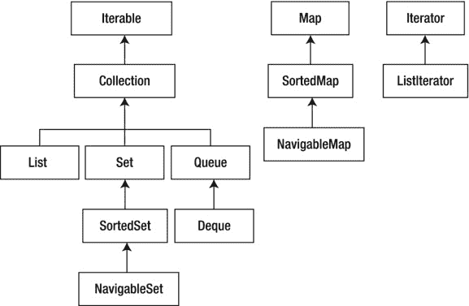

图 6-3.  重要的高级 java.util 接口及其继承关系

这些基础类型相当多，但不要被它们吓到。你将看到具体的类并使用其中一些基础类型。我们将只介绍 `Collection` 接口，然后通过介绍集合层次结构中的每个部分来继续介绍具体类。

Collection 接口

`Collection` 接口提供了诸如 `add()` 和 `remove()` 等所有容器通用的方法。表 6-2 列出了该接口中最重要的方法。在使用它们之前，请先查看一下。

表 6-2. Collection 接口中的重要方法

| 方法 | 简要描述 |
| --- | --- |
| `boolean add(Element elem)` | 将 `elem` 添加到底层容器中。 |
| `void clear()` | 移除容器中的所有元素。 |
| `boolean isEmpty()` | 检查容器是否包含任何元素。 |
| `Iterator<Element> iterator()` | 返回一个用于迭代容器的 `Iterator<Element>` 对象。 |
| `boolean remove(Object obj)` | 如果 `obj` 存在于容器中，则移除该元素。 |
| `int size()` | 返回容器中的元素数量。 |
| `Object[] toArray()` | 返回一个包含容器中所有元素的数组。 |

诸如 `add()` 和 `remove()` 之类的方法可能会因底层容器而异而失败。例如，如果容器是只读的，你将无法添加或移除元素。除了这些方法之外，`Collection` 接口中还有许多适用于容器中多个元素的方法（表 6-3）。

表 6-3. Collection 接口中适用于多个元素的方法


| 方法 | 简要描述 |
| --- | --- |
| `boolean addAll(Collection<? extends Element> coll)` | 将 `coll` 中的所有元素添加到底层容器中。 |
| `boolean containsAll(Collection<?> coll)` | 检查 `coll` 中给出的所有元素是否都存在于底层容器中。 |
| `boolean removeAll(Collection<?> coll)` | 从底层容器中移除所有也存在于 `coll` 中的元素。 |
| `boolean retainAll(Collection<?> coll)` | 仅保留底层容器中也存在于 `coll` 中的元素；移除所有其他元素。 |

具体类

`Collection` 层次结构中的众多接口和抽象类提供了特定具体类实现/扩展的通用方法。具体类提供了实际功能，你只需学习其中少数几个，就能为 OCPJP 7 考试做好充分准备。表 6-4 总结了你需要了解的这些类的特性。

表 6-4. 集合框架中的重要具体类

| 具体类 | 简要描述 |
| --- | --- |
| `ArrayList` | 内部实现为可调整大小的数组。这是最广泛使用的具体类之一。搜索速度快，但插入或删除速度慢。允许重复元素。 |
| `LinkedList` | 内部实现为双向链表数据结构。插入或删除元素速度快，但搜索元素速度慢。此外，当你需要栈（LIFO）或队列（FIFO）数据结构时，可以使用 `LinkedList`。允许重复元素。 |
| `HashSet` | 内部实现为哈希表数据结构。用于存储一组元素——不允许存储重复元素。搜索和检索元素速度快。它*不*维护存储元素的任何顺序。 |
| `TreeSet` | 内部实现为红黑树数据结构。与 `HashSet` 类似，`TreeSet` 不允许存储重复元素。然而，与 `HashSet` 不同，它按排序顺序存储元素。它使用树数据结构来决定存储或搜索元素的位置，该位置由排序顺序决定。 |
| `HashMap` | 内部实现为哈希表数据结构。存储键值对。使用哈希来查找搜索或存储对的位置。搜索或插入速度非常快。它*不*按任何顺序存储元素。 |
| `TreeMap` | 内部使用红黑树数据结构实现。与 `HashMap` 不同，`TreeMap` 按排序顺序存储元素。它使用树数据结构来决定存储或搜索键的位置，该位置由排序顺序决定。 |
| `PriorityQueue` | 内部使用堆数据结构实现。`PriorityQueue` 用于基于优先级检索元素。无论你插入的顺序如何，当你移除元素时，优先级最高的元素将首先被检索到。 |

|  | 有许多旧的 `java.util` 类（现在称为遗留集合类型）已被新的集合类取代。其中一些是（括号内为较新的类型）：`Enumeration`（`Iterator`）、`Vector`（`ArrayList`）、`Dictionary`（`Map`）和 `Hashtable`（`HashMap`）。此外，`Stack` 和 `Properties` 是没有直接替代品的遗留类。 |

迭代器接口

我们先讨论 `Iterator`，因为我们将使用 `Iterator` 来说明其他具体类。`Iterator` 接口是一个简单的接口，只有三个方法：`hasNext()`、`next()` 和 `remove()`（参见表 6-5）。

表 6-5. 迭代器接口中的方法

| 方法 | 简要描述 |
| --- | --- |
| `boolean hasNext()` | 检查迭代器是否还有更多元素可以遍历。 |
| `E next()` | 将迭代器移动到下一个元素并返回该（下一个）元素。 |
| `void remove()` | 从底层容器中移除最后访问的元素。在调用 `remove()` 之前应先调用 `next()`；否则会抛出 `IllegalStateException`。 |

列表类

`List` 用于存储元素序列。你可以使用索引将元素插入容器的特定位置，并在之后检索相同的元素（即，它维护插入顺序）。你可以在列表中存储重复元素。你需要了解两个具体类：`ArrayList` 和 `LinkedList`。

ArrayList 类

`ArrayList` 实现了一个可调整大小的数组。当你创建一个原生数组（例如，`new String[10];`）时，数组的大小在创建时是已知的（固定的）。然而，`ArrayList` 是一个*动态数组*：它可以根据需要增长大小。在内部，`ArrayList` 分配一块内存，并根据需要增长。因此，在 `ArrayList` 中访问数组元素非常快。但是，当你添加或移除元素时，内部会复制其余元素；因此添加/删除元素是一项开销很大的操作。

以下是一个访问 `ArrayList` 中元素的简单示例。你创建一个 `ArrayList` 并使用 `for-each` 结构来遍历集合：

```
ArrayList<String> languageList = new ArrayList<>();
languageList.add("C");
languageList.add("C++");
languageList.add("Java");
for(String language : languageList) {
    System.out.println(language);
}
```

它会打印以下内容：

```
C
C++
Java
```

这个 `for-each` 等同于以下显式使用 `Iterator` 的代码：

```
for(Iterator<String> languageIter = languageList.iterator(); languageIter.hasNext();) {
        String language = languageIter.next();
        System.out.println(language);
}
```

这段代码段也会打印与之前 `for-each` 循环代码相同的输出。以下是此 `for` 循环工作方式的分步说明：

1.  你使用 `iterator()` 方法获取该容器的迭代器。由于 `languageList` 是 `<String>` 类型的 `ArrayList`，你应该使用 `String` 创建 `Iterator`。将其命名为 `languageIter`。
2.  在进入循环之前，你检查是否有任何元素需要访问。你调用 `hasNext()` 方法来检查。如果返回 true，则还有更多元素需要访问；如果返回 false，则迭代结束，你退出循环。
3.  一旦进入循环体，你要做的第一件事就是调用 `next()` 并移动迭代器。`next()` 方法返回迭代的值。你将返回值捕获到 `language` 变量中。
4.  你打印 `language` 值，然后循环继续。

这种*迭代惯用法*——即你调用 `iterator()`、`hasNext()` 和 `next()` 方法的方式——很重要，需要学习；在我们的示例中，我们将广泛使用 for-each 循环或此惯用法。

请注意，你创建的是 `ArrayList<String>` 和 `Iterator<String>`，而不是仅仅使用 `ArrayList` 或 `Iterator`（即，你为这些类提供了类型信息）。`Collection` 类是泛型类；因此你需要指定类型参数才能使用它们。这里你正在存储/迭代一个字符串列表，所以你使用 `<String>`。

你可以使用迭代器在遍历容器时移除元素。让我们创建一个包含十个元素的 `ArrayList<Integer>` 类型对象。你将遍历这些元素并移除所有元素（而不是使用 `ArrayList` 中的 `removeAll()` 方法）。清单 6-14 显示了代码。它能工作吗？

清单 6-14.  TestIterator.java

```
// 此程序演示了 Iterator 的用法

import java.util.*;


class TestIterator {
    public static void main(String []args) {
         ArrayList<Integer> nums = new ArrayList<Integer>();
         for(int i = 1; i < 10; i++)
              nums.add(i);
         System.out.println("Original list " + nums);
         Iterator<Integer> numsIter = nums.iterator();
         while(numsIter.hasNext()) {
                     numsIter.remove();
         }
         System.out.println("List after removing all elements" + nums);
    }
}
```

它会输出以下内容：

```
Original list [1, 2, 3, 4, 5, 6, 7, 8, 9]
Exception in thread "main" java.lang.IllegalStateException
        at java.util.AbstractList$Itr.remove(AbstractList.java:356)
        at TestIterator.main(Main.java:12)
```

哎呀！发生了什么？问题在于你在调用 `remove()` 之前没有调用 `next()`。在 `while` 循环条件中检查 `hasNext()`，使用 `next()` 移动到元素，再调用 `remove()`，这才是移除元素的正确用法。如果你没有正确遵循这一步骤，就会遇到麻烦（即你会得到 `IllegalStateException`）。类似地，如果你连续两次调用 `remove()`，而中间没有插入 `next()`，也会抛出此异常。

让我们通过先调用 `next()` 再调用 `remove()` 来修复这个程序。以下是代码的相关部分：

```
Iterator<Integer> numsIter = nums.iterator();
while(numsIter.hasNext()) {
        numsIter.next();
                numsIter.remove();
}
System.out.println("List after removing all elements " + nums);
```

它会按预期输出一个空列表：

```
List after removing all elements []
```

|  | 请记住，在 `Iterator` 中，调用 `remove()` 之前必须先调用 `next()`；否则，你会得到一个 `IllegalStateException`。同样，如果在后续语句中连续调用 `remove()`，而中间没有调用 `next()`，也会导致此异常。基本上，当迭代器遍历容器时，对底层容器进行的任何修改都会导致此异常。 |

ListIterator 接口

在了解 `LinkedList` 之前，你应该先理解 `ListIterator`。`ListIterator` 接口扩展了 `Iterator` 接口，因此它继承了 `hasNext()`、`next()` 和 `remove()` 方法。此外，`ListIterator` 还有许多其他方法（参见表 6-6）。使用这些方法，你可以反向遍历、获取前一个或后一个索引位置，以及设置或向底层容器添加新元素。

表 6-6. ListIterator 接口中的方法（除 Iterator 方法外）

| 方法 | 简要描述 |
| --- | --- |
| `boolean hasPrevious()` | 检查迭代器是否还有更多元素可以反向遍历。 |
| `Element previous()` | 将迭代器移动到下一个元素，并返回反向遍历中的这个（下一个）元素。 |
| `int nextIndex()` | 返回正向遍历中下一个元素的索引。 |
| `int previousIndex()` | 返回反向遍历中下一个元素的索引。 |
| `void set(Element)` | 设置最后访问的元素（使用 next 或 previous）；它会替换现有元素。 |
| `void add(Element)` | 在当前迭代位置将元素添加到列表中。 |

LinkedList 类

`LinkedList` 类内部使用双向链表。因此，在 `LinkedList` 中插入和删除非常快。然而，访问元素需要逐个遍历节点，所以速度较慢。当你需要频繁地在元素列表中添加或删除元素时，最好使用 `LinkedList`。你将会看到一个结合 `ListIterator` 接口使用 `LinkedList` 的示例。

*回文*（palindrome）是指正向和反向读起来都一样的单词或短语。*回文字符串* “abcba” 在两个方向上读起来都一样。给定一个字符串，如何判断它是否是回文？

嗯，你可以通过将输入字符串存储在一个 `String` 中，并在 `for` 循环中使用 `charAt()` 方法来比较字符（一个从开头，另一个从结尾），从而判断输入字符串是否为回文。为了向你展示如何使用 `ListIterator` 和 `LinkedList`，请参见清单 6-15，其中提供了一个实现相同功能的示例解决方案。

清单 6-15.  ListIterator.java

```
// 此程序演示了 ListIterator 的用法

import java.util.*;

class ListIteratorTest {
        public static void main(String []args) {
                String palStr = "abcba";
                List<Character> palindrome = new LinkedList<Character>();

for(char ch : palStr.toCharArray())
                        palindrome.add(ch);

System.out.println("Input string is: " + palStr);
                ListIterator<Character> iterator = palindrome.listIterator();
                ListIterator<Character> revIterator = palindrome.listIterator (palindrome.size());

boolean result = true;
                while(revIterator.hasPrevious() && iterator.hasNext()) {
                        if(iterator.next() != revIterator.previous()){
                                result = false;
                                break;
                        }
                }
                if (result)
                        System.out.print("Input string is a palindrome");
                else
                        System.out.print("Input string is not a palindrome");
                }
        }
```

它会输出以下内容：

```
Input string is: abcba
Input string is a palindrome
```

在这个程序中，你使用一个 `Character` 类型的 `LinkedList` 来存储输入字符串中的每个字符。为什么用 `LinkedList<Character>` 而不是 `LinkedList<char>`？容器类存储的是对象的引用，因此你不能在任何集合类中使用基本类型。由于我们有包装类和自动装箱，这不成问题——这就是为什么这里使用 `Character` 而不是 `char`。

另外，请注意如何将 `LinkedList<Character>` 赋值给 `List<Character>`。由于 `LinkedList` 类实现了 `List` 接口，你可以进行此赋值。使用 `Collection` 接口而不是具体的类类型来持有引用是一种良好的编程实践，因为——如果你将来想将 `LinkedList` 改为 `ArrayList`，使用 `List` 接口作为引用会使更改非常容易。现在回到程序。

`String` 中的 `toCharArray()` 方法返回一个 `char[]`，你使用 `for each` 循环遍历该数组中的每个字符。随着循环的执行，你将字符放入链表中。那么，如何双向遍历这个链表呢？

你可以使用 `hasNext()` 和 `next()` 方法进行正向遍历，使用 `ListIterator` 中的 `hasPrevious()` 和 `previous()` 方法进行反向移动。如何从 `LinkedList` 获取 `ListIterator`？在 `List` 接口中有 `listIterator()` 和 `listIterator(index)` 方法。由于你想要双向遍历 `LinkedList`，你同时使用了 `listIterator()` 和 `listIterator(index)` 方法。在第一种情况下，你获得指向容器开头的迭代器；在另一种情况下，你将字符串的长度作为参数传递给 `listIterator` 方法，以获得反向迭代器。一旦你获得了这两个迭代器，就可以直接对第一个迭代器使用 `hasNext()` 和 `next()`，对第二个迭代器使用 `hasPrevious()` 和 `previous()` 方法。

Set 接口

`Set`，正如我们在高中数学课上学到的，不包含重复元素。与 `List` 不同，`Set` 不记录元素的插入位置（即它不记住插入顺序）。


`Set`有两个重要的具体类：`HashSet`和`TreeSet`。`HashSet`用于快速插入和检索元素；它*不*维护其所持有元素的任何排序顺序。`TreeSet`按排序顺序存储元素（并且它实现了`SortedSet`接口）。

HashSet 类

给定一个句子，如何去除该句子中重复的单词？`Set`不允许重复，而`HashSet`可用于快速插入和搜索。因此，你可以使用`HashSet`来解决这个问题（参见清单 6-16）。

清单 6-16.  RemoveDuplicates.java

```
// This program demonstrates the usage of HashSet class

import java.util.*;

class RemoveDuplicates {
        public static void main(String []args) {
                String tongueTwister = "I feel, a feel, a funny feel, a funny feel I feel,
                 if you feel the feel  I feel, I feel the feel you feel";
                Set<String> words = new HashSet<>();

// split the sentence into words and try putting them in the set
                for(String word : tongueTwister.split("\\W+"))
                        words.add(word);

System.out.println("The tongue twister is: " + tongueTwister);
                System.out.print("The words used were: ");
                System.out.println(words);
        }
}
```

它会输出以下内容：

```
The tongue twister is: I feel, a feel, a funny feel, a funny feel I feel, if you
feel the feel I feel, I feel the feel you feel
The words used were: [feel, if, a, funny, you, the, I]
```

在这个例子中，绕口令句子只有两个单词分隔符——逗号和空格。你通过使用`split()`方法，利用这些分隔符来拆分字符串。`split()`方法接受一个正则表达式作为参数（正则表达式在第 7 章中介绍）。正则表达式`\\W+`表示它用于在单词边界处进行拆分。因此，字符串被分割成单词，并忽略逗号等标点符号。

你尝试将每个单词插入到集合中。如果单词已存在，`add()`方法会失败并返回 false（你没有存储这个返回值）。一旦你将所有元素插入到`HashSet`中，你逐个打印它们，发现这个包含 25 个单词的绕口令只用了 7 个单词！

TreeSet 类

给定一个句子，如何将该句子中使用的字母按字母顺序排序？`TreeSet`将值按排序顺序放置，因此你可以使用`TreeSet`容器来解决这个问题（参见清单 6-17）。

清单 6-17.  TreeSetTest.java

```
// This program demonstrates the usage of TreeSet class

import java.util.*;

class TreeSetTest {
        public static void main(String []args) {
                String pangram = "the quick brown fox jumps over the lazy dog";
                Set<Character> aToZee = new TreeSet<Character>();
                for(char gram : pangram.toCharArray())
                        aToZee.add(gram);
                System.out.println("The pangram is: " + pangram);
                System.out.print("Sorted pangram characters are: " + aToZee);
        }
}
```

它会输出以下内容：

```
The pangram is: the quick brown fox jumps over the lazy dog
Sorted pangram characters are: [ , a, b, c, d, e, f, g, h, i, j, k, l, m, n, o, p, q, r, s, t, u, v,
w, x, y, z]
```

*全字母句*是一个使用了字母表中所有字母至少一次的句子。你想要将全字母句的字符存储在集合中。由于容器需要使用引用类型，你创建了一个`Character`类型的`TreeSet`。

那么，如何从`String`中获取字符呢？记住，数组索引不适用于`String`。例如，要获取第一个字符`"t"`，如果你在程序中使用`pangram[0]`，你会得到一个编译器错误。幸运的是，`String`有一个名为`toCharArray()`的方法，它返回一个`char[]`。因此，你使用这个方法遍历字符串并获取所有字符。当你将字符添加到`TreeSet`中时，字符会按排序顺序存储。因此，当你打印集合时，你会得到所有的小写字母。

注意输出中有一个前导逗号。为什么？全字母句字符串包含许多空白字符。一个空白字符也被存储到了集合中，所以它也被打印出来了！

Map 接口

`Map`存储键值对。`Map`接口*不*扩展`Collection`接口。但是，`Map`接口中有一些方法，你可以使用它们来获取`Collection`中的类以解决这个问题。此外，`Map`中的方法名与`Collection`中的方法非常相似，因此理解和`使用 Map`很容易。我们将介绍`Map`的两个重要具体类：`HashMap`和`TreeMap`。

`HashMap`在内部使用哈希表数据结构。在`HashMap`中，搜索（或查找元素）是一个快速的操作。然而，`HashMap`既不记住你插入元素的顺序，也不以任何排序顺序维护元素。

`TreeMap`在内部使用红黑树数据结构。与`HashMap`不同，`TreeMap`按排序顺序维护元素（即，按键排序）。因此，搜索或插入比`HashMap`稍慢一些。

HashMap 类

假设你正在实现一个简单的拼写检查器。给定一个输入字符串，拼写检查器会查找通常拼写错误的单词；如果找到匹配项，它会打印出正确的拼写。因此，拼写检查器应该维护一个常用拼写错误单词及其正确拼写的列表。你如何实现这个功能？

给定一个键，你可以使用`Map`查找一个值。那么，使用哪个映射呢，`HashMap`还是`TreeMap`？*不需要*（尽管你可以）将拼写错误的单词按排序顺序维护，并且对拼写错误单词的查找应该非常快。因此，`HashMap`适合解决这个问题。

清单 6-18 是一个展示如何实现拼写检查器的简单程序。

清单 6-18.  SpellChecker.java

```
// This program shows the usage of HashMap class
public class SpellChecker {
      public static void main(String []args) {
            Map<String, String> misspeltWords = new HashMap<String, String>();
            misspeltWords.put("calender", "calendar");
            misspeltWords.put("tomatos", "tomatoes");
            misspeltWords.put("existance", "existence");
            misspeltWords.put("aquaintance", "acquaintance");
            String sentence = "Buy a calender for the year 2013";
            System.out.println("The given sentence is: " + sentence);
            for(String word : sentence.split("\\W+")) {
                  if(misspeltWords.containsKey(word)) {
                        System.out.println("The correct spelling for " + word
                                    + " is: " + misspeltWords.get(word));
                  }
            }
      }
}
```

它会输出以下内容：

```
The given sentence is: Buy a calender for the year 2013
The correct spelling for calender is: calendar
```

首先，你需要创建一个拼写错误单词及其正确拼写的表格。由于键和值都是`String`，你创建了一个`HashMap<String, String>`对象。你在`HashMap`中插入了四个拼写错误的单词及其正确拼写。拼写错误的单词是键，正确的拼写是值。你使用`put()`方法（而不是你在`Container`中使用的`add()`方法）将一个键值对插入到`Map`中。


你采用了一种简单的方法来拆分句子中的单词——使用 `String` 的 `split()` 方法。对于每个单词，你检查它是否与拼写错误的单词完全匹配；如果是，则打印与该键对应的值。你使用 `containsKey()` 方法来检查该键是否存在于映射中；它会返回一个布尔值。你使用 `get()` 方法，以键作为参数，从映射中返回对应的值。由于给定的句子中有一个单词拼写错误（“calender”），你会打印该单词的正确拼写。

现在，让我们看看 `misspeltWords HashMap` 中的键。你可以使用 `keySet()` 方法获取 `HashMap` 中的所有键。由于你使用的是 `HashMap<String, String>`，返回的集合类型是 `Set<String>`。

```
Set<String> keys = misspeltWords.keySet();
System.out.print("拼写检查器中的拼写错误单词为：");
System.out.println(keys); 
```

它会打印以下内容：

```
拼写检查器中的拼写错误单词为：[calender, existance, aquaintance, tomatos]
```

类似地，你可以使用 `valueSet()` 方法来获取映射中可用的值。

重写 hashCode() 方法

正确重写 `equals` 和 `hashCode` 方法对于在容器（特别是 `HashMap` 和 `HashSet`）中使用这些类非常重要。清单 6-19 是一个简单的 `Circle` 类示例，以便你理解可能出现的问题。

清单 6-19.  TestCircle.java

```
// 此程序展示了 equals() 和 hashCode() 方法的重要性

import java.util.*;

class Circle {
        private int xPos, yPos, radius;
        public Circle(int x, int y, int r) {
                xPos = x;
                yPos = y;
                radius = r;
        }

public boolean equals(Object arg) {
                if(arg == null) return false;
                if(this == arg) return true;
                if(arg instanceof Circle) {
                        Circle that = (Circle) arg;
                        if( (this.xPos == that.xPos) && (this.yPos == that.yPos)
                                && (this.radius == that.radius )) {
                                return true;
                        }
                }
                return false;
        }
}

class TestCircle {
        public static void main(String []args) {
                Set<Circle> circleList = new HashSet<Circle>();
                circleList.add(new Circle(10, 20, 5));
                System.out.println(circleList.contains(new Circle(10, 20, 5)));
        }
}
```

它打印的是 `false`（而不是 `true`）！为什么？`Circle` 类重写了 `equals()` 方法，但没有重写 `hashCode()` 方法。当你在标准容器中使用 `Circle` 对象时，这就成了一个问题。为了快速查找，容器会比较对象的哈希码。如果 `hashCode()` 方法没有被重写，那么即使传入一个内容相同的对象，容器也找不到该对象！因此，你需要重写 `hashCode()` 方法。

那么，如何重写 `hashCode()` 方法呢？在理想情况下，`hashCode()` 方法应该为不同的对象返回唯一的哈希码。

如果 `equals()` 方法返回 true，那么 `hashCode()` 方法*应该*返回相同的哈希值。如果对象不同（因此 `equals()` 方法返回 false）呢？如果对象不同，`hashCode()` 最好（尽管不是必须）返回不同的值。原因是，要编写一个能为每个不同对象都返回唯一值的 `hashCode()` 方法是很困难的。

|  | 对于一个类来说，`hashCode()` 和 `equals()` 方法需要保持一致。在实际应用中，请确保遵循这一条规则：如果两个对象的 `equals()` 方法返回 true，那么 `hashCode()` 方法应该为它们返回相同的哈希值。 |

在实现 `hashCode()` 方法时，你可以使用类的实例成员的值来创建哈希值。以下是 `Circle` 类 `hashCode()` 方法的一个简单实现：

```
public int hashCode() {
        // 使用位运算符（如 ^）来生成接近唯一的哈希码
        // 这里我们使用了魔法数字 7、11 和 53，但你可以使用任何数字，最好是质数
        return (7 * xPos) ^ (11 * yPos) ^ (53 * yPos);
}
```

现在，如果你运行 `main()` 方法，它会打印 “true”。在这个 `hashCode()` 方法的实现中，你将值乘以一个质数，并进行了位运算。如果你想要更好的哈希函数，可以为 `hashCode()` 编写更复杂的代码，但这个实现对于实际应用来说已经足够了。

你可以对 `int` 值使用位运算符。那么其他类型呢，比如浮点值或引用类型？举个例子，下面是 `java.awt.Point2D` 的 `hashCode()` 实现，它包含浮点值 `x` 和 `y`。`getX()` 和 `getY()` 方法分别返回 `x` 和 `y` 的值：

```
public int hashCode() {
        long bits = java.lang.Double.doubleToLongBits(getX());
        bits ^= java.lang.Double.doubleToLongBits(getY()) * 31;
        return (((int) bits) ^ ((int) (bits >> 32)));
}
```

这个方法使用了 `doubleToLongBits()` 方法，它接受一个 `double` 值并返回一个 `long` 值。对于浮点值 `x` 和 `y`（由 `getX` 和 `getY` 方法返回），你得到位形式的 `long` 值，然后使用位操作来获取 `hashCode()`。

现在，如果类有引用类型的成员，你该如何实现 `hashCode` 方法呢？例如，考虑使用 `Point` 类的实例作为成员，而不是原始类型字段 `xPos` 和 `yPos`：

```
class Circle {
        private int radius;
        private Point center;
        // 其他成员...
}
```

在这种情况下，你可以调用 `Point` 的 `hashCode()` 方法来实现 `Circle` 的 `hashCode` 方法：

```
public int hashCode() {
        return center.hashCode() ^ radius;
}
```

|  | 如果你在 `HashSet` 或 `HashMap` 等容器中使用对象，请确保正确重写 `hashCode()` 和 `equals()` 方法。否则，在使用这些容器时，你会遇到令人头疼的意外（bug）！ |

NavigableMap 接口

`NavigableMap` 接口扩展了 `SortedMap` 接口。在 `Collection` 层次结构中，`TreeMap` 类是广泛使用的实现 `NavigableMap` 的类。顾名思义，使用 `NavigableMap`，你可以轻松地导航 `Map`。它有许多使 `Map` 导航变得容易的方法。你可以获取与给定键最接近的值、所有小于给定键的值、所有大于给定键的值等。让我们看一个例子：Lennon、McCartney、Harrison 和 Starr 参加了一次在线考试。在那次考试中，最高分是 100 分，及格分是 40 分。如果你想查找谁通过了考试等详细信息，并按升序或降序对考试成绩进行排序，`NavigableMap` 非常方便（参见清单 6-20）。

清单 6-20.  NavigableMapTest.java

```
// 此程序演示了可导航树接口和 TreeMap 类的用法

import java.util.*;

public class NavigableMapTest {
        public static void main(String []args) {
                NavigableMap<Integer, String> examScores = new TreeMap<Integer, String>();

examScores.put(90, "Sophia");
                examScores.put(20, "Isabella");
                examScores.put(10, "Emma");
                examScores.put(50, "Olivea");


System.out.println("The data in the map is: " + examScores);
                System.out.println("The data descending order is: " + examScores.descendingMap());
                System.out.println("Details of those who passed the exam: " +
         examScores.tailMap(40));
                System.out.println("The lowest mark is: " + examScores.firstEntry());
        }
}
```

输出结果如下：

```
The data in the map is: {10=Emma, 20=Isabella, 50=Olivea, 90=Sophia}
The data descending order is: {90=Sophia, 50=Olivea, 20=Isabella, 10=Emma}
Details of those who passed the exam: {50=Olivea, 90=Sophia}
The lowest mark is: 10=Emma
```

在这个程序中，你有一个 `NavigableMap<Integer, String>`，它将考试成绩和人员姓名进行映射。你创建了一个 `TreeMap<String, String>` 来实际存储考试成绩。默认情况下，`TreeMap` 按升序存储数据。如果你希望数据按降序排列，也很简单：只需使用 `descendingMap()` 方法（如果你只关心键，则使用 `descendingKeySet()` 方法）。

假设及格分数是 40，你可能希望获取包含未通过考试人员数据的映射。为此，你可以使用 `headMap()` 方法，并传入键值 40（由于数据是升序排列，你需要从指定位置获取映射的“头部”部分）。类似地，要获取通过考试人员的数据，你可以使用 `tailMap()` 方法。

如果你想要刚好高于和低于及格分数的相邻数据，可以分别使用 `higherEntry()` 和 `lowerEntry()` 方法。`firstEntry()` 和 `lastEntry()` 方法分别返回键值最小和最大的条目。因此，当你在 `examScores` 上使用 `firstEntry()` 方法时，你会得到得分为 10 的 Emma。如果你使用 `lastEntry()`，则会得到得分为 90 的 Sophia。

Queue 接口

`Queue` 遵循 FIFO 机制：最先插入的元素将最先被移除。为了获得队列行为，你可以创建一个 `LinkedList` 对象，并通过 `Queue` 引用来引用它。当你从 `Queue` 引用调用方法时，该对象的行为就像一个 `Queue`。清单 6-21 展示了一个示例，这将使概念变得清晰。Lennon、McCartney、Harrison 和 Starr 正在参加一场在线考试。让我们看看如何记住他们登录参加考试的顺序（参见清单 6-21）。

清单 6-21.  QueueTest.java

```
// This program shows the key characteristics of Queue interface

import java.util.*;

class QueueTest {
        public static void main(String []args) {
                Queue<String> loginSequence = new LinkedList<String>();

loginSequence.add("Harrison");
                loginSequence.add("McCartney");
                loginSequence.add("Starr");
                loginSequence.add("Lennon");
                System.out.println("The login sequence is: " + loginSequence);
                while(!loginSequence.isEmpty())
                        System.out.println("Removing " + loginSequence.remove());
        }
}
```

输出结果如下：

```
The login sequence is: [Harrison, McCartney, Starr, Lennon]
Removing Harrison
Removing McCartney
Removing Starr
Removing Lennon
```

在这个例子中，你创建了一个 `Queue<String>` 来指向一个 `LinkedList<String>` 对象。然后你向队列中添加了四个元素（按他们登录顺序排列的名字）。插入元素后，你通过（隐式地）在 `loginSequence` 上调用 `toString()` 方法来打印队列。你调用 `remove()` 方法来移除队列中的一个元素。`remove()` 方法从队列头部移除一个元素并返回被移除的元素。你得到的输出顺序与你插入队列的顺序相同。

Deque 接口

`Deque`（双端队列）是一种允许你在两端插入和移除元素的数据结构。`Deque` 接口是在 Java 6 中引入的，位于 `java.util.collection` 包中。`Deque` 接口扩展了刚刚讨论过的 `Queue` 接口。因此，`Queue` 提供的所有方法在 `Deque` 接口中同样可用。让我们来考察一下 `Deque` 接口中常用的方法，这些方法总结在表 6-7 中。

表 6-7. Deque 接口中常用的方法

| 方法 | 简要描述 |
| --- | --- |
| `void addFirst(Element)` | 将 `Element` 添加到 Deque 的前端。 |
| `void addLast(Element)` | 将 `Element` 添加到 Deque 的末端。 |
| `Element removeFirst()` | 从 Deque 前端移除一个元素并返回它。 |
| `Element removeLast()` | 从 Deque 末端移除一个元素并返回它。 |
| `Element getFirst()` | 返回 Deque 中的第一个元素，但不移除。 |
| `Element getLast()` | 返回 Deque 中的最后一个元素，但不移除。 |

表 6-7 中列出的所有方法在失败时都会引发相应的异常。还有另一组方法，列在表 6-8 中，它们实现了相同的功能。然而，它们在失败时不会引发异常；而是返回一个特殊值。例如，`getFirst()` 方法返回 Deque 中的第一个元素但不移除它。如果 Deque 为空，它会引发 `NoSuchElementException` 异常。同时，`peekFirst()` 方法也执行相同的功能。但是，如果 Deque 为空，它会返回 null。当 Deque 以预定义容量创建时，表 6-8 中列出的方法比表 6-7 中列出的方法更受推荐。

表 6-8. Deque 接口中常用的方法（返回特殊值）

| 方法 | 简要描述 |
| --- | --- |
| `boolean offerFirst(Element)` | 如果不违反容量限制，则将 `Element` 添加到 Deque 的前端。 |
| `boolean offerLast(Element)` | 如果不违反容量限制，则将 `Element` 添加到 Deque 的末端。 |
| `Element pollFirst()` | 从 Deque 前端移除一个元素并返回它；如果 Deque 为空，则返回 `null`。 |
| `Element pollLast()` | 从 Deque 末端移除一个元素并返回它；如果 Deque 为空，则返回 `null`。 |
| `Element peekFirst()` | 返回 Deque 中的第一个元素但不移除它；如果 Deque 为空，则返回 `null`。 |
| `Element peekLast()` | 返回 Deque 中的最后一个元素但不移除它；如果 Deque 为空，则返回 `null`。 |

|  | 你刚刚观察到，表 6-8 中的方法在失败时会返回 `null`。如果你将 `null` 作为元素存储会怎样？嗯，不建议你将 `null` 作为参数存储，因为 `Deque` 接口中有方法会返回 `null`，这将使你难以区分方法调用是成功还是失败。 |

`Deque` 接口有三个具体的实现：`LinkedList`、`ArrayDeque` 和 `LinkedBlockingDeque`。让我们使用 `ArrayDeque` 来理解 `Deque` 接口的特性。


从`Deque`支持的方法列表可以明显看出，它可以实现队列、栈和双端队列的标准行为。让我们实现一个特殊队列（例如，用于支付水电费），顾客只能添加到队列末尾，并且可以从队列前端移除（当顾客支付账单后），也可以从队列末尾移除（当顾客因排队过长而失去耐心自行离开时）。清单 6-22 展示了如何实现。

清单 6-22.  SplQueueTest.java

```
// This program shows the usage of Deque interface

import java.util.*;

class SplQueue {
        private Deque<String> splQ = new ArrayDeque<>();
        void addInQueue(String customer){
                splQ.addLast(customer);
        }
        void removeFront(){
                splQ.removeFirst();
        }
        void removeBack(){
                splQ.removeLast();
        }
        void printQueue(){
                System.out.println("Special queue contains: " + splQ);
        }
}

class SplQueueTest {
        public static void main(String []args) {
                SplQueue splQ = new SplQueue();
                splQ.addInQueue("Harrison");
                splQ.addInQueue("McCartney");
                splQ.addInQueue("Starr");
                splQ.addInQueue("Lennon");

splQ.printQueue();
                splQ.removeFront();
                splQ.removeBack();
                splQ.printQueue();
        }
}
```

它输出以下内容：

```
Special queue contains: [Harrison, McCartney, Starr, Lennon]
  Special queue contains: [McCartney, Starr]
```

首先定义一个类——`SplQueue`——它定义了一个类型为`ArrayDeque`的容器`splQ`，并包含四个基本操作。方法`addInQueue()`在队列末尾添加一位顾客，方法`removeBack()`从队列末尾移除一位顾客，方法`removeFront()`从队列前端移除一位顾客，方法`printQueue()`则简单地打印队列中的所有元素。你只需使用`Deque`接口中的`addLast()`、`removeFront()`和`removeLast()`方法来实现`SplQueue`类的方法。在`main()`方法中，你实例化了`SplQueue`并调用了`SplQueue`类的`addInQueue()`方法。之后，你从前端和末尾各移除一位顾客，并打印移除前后队列的内容。嗯，它按预期工作了。

.

Comparable 和 Comparator 接口

顾名思义，`Comparable`和`Comparator`接口用于比较相似的对象（例如，在执行搜索或排序时）。假设你有一个包含`Person`对象列表的容器。现在，如何比较两个`Person`对象？有任意数量的可比较属性，例如`SSN`、`name`、`driving-license number`等等。两个对象可以根据`SSN`进行比较，也可以根据个人的`name`进行比较；这取决于上下文。因此，比较`Person`对象的标准不能预先定义；开发人员必须定义这个标准。Java 定义了`Comparable`和`Comparator`接口来实现这一点。

`Comparable`类只有一个方法`compareTo()`，其声明如下：

```
int compareTo(Element that)
```

由于你在类中实现了`compareTo()`方法，因此可以访问`this`引用。你可以将`当前元素`与传入的`Element`进行比较，并返回一个`int`值。这个`int`值应该是什么？以下是返回整数值的规则：

```
如果当前对象 > 传入对象，返回 1
如果当前对象 == 传入对象，返回 0
如果当前对象 < 传入对象，返回 -1
```

现在，一个重要的问题：对于`Element`来说，>、< 或 == 意味着什么？嗯，如何比较两个对象由你决定！但比较的含义应该是自然的；换句话说，比较应该意味着*自然排序*。例如，你看到了`Integer`是如何基于*数字顺序*相互比较的，这是`Integer`类型的自然顺序。类似地，你使用*字典序比较*来比较`String`，这是`String`的自然顺序。对于用户定义的类，你需要找到可以比较对象的自然顺序。例如，对于`Student`类，`StudentId`可能是比较`Student`对象的自然顺序。清单 6-23 现在实现了一个简单的`Student`类。

清单 6-23.  ComparatorTest.java

```
// This program shows the usage of Comparable interface

import java.util.*;

class Student implements Comparable<Student> {
        String id;
        String name;
        Double cgpa;
        public Student(String studentId, String studentName, double studentCGPA) {
                id = studentId;
                name = studentName;
                cgpa = studentCGPA;
        }
        public String toString() {
                return " \n " + id + "  \t  " + name + "  \t  " + cgpa;
        }
        public int compareTo(Student that) {
                return this.id.compareTo(that.id);
        }
}

class ComparatorTest {
        public static void main(String []args) {
                Student []students = {  new Student("cs011", "Lennon  ", 3.1),
                        new Student("cs021", "McCartney", 3.4),
                        new Student("cs012", "Harrison ", 2.7),
                        new Student("cs022", "Starr ", 3.7) };

System.out.println("Before sorting by student ID");
                System.out.println("Student-ID \t  Name \t  CGPA (for 4.0) ");
                System.out.println(Arrays.toString(students));

Arrays.sort(students);

System.out.println("After sorting by student ID");
                System.out.println("Student-ID \t  Name \t  CGPA (for 4.0) ");
                System.out.println(Arrays.toString(students));
        }
}
```

它输出以下内容：

```
Before sorting by student ID
Student-ID        Name    CGPA (for 4.0)
[
 cs011            Lennon          3.1,
 cs021            McCartney       3.4,
 cs012            Harrison        2.7,
 cs022            Starr           3.7]
After sorting by student ID
Student-ID        Name    CGPA (for 4.0)
[
 cs011            Lennon          3.1,
 cs012            Harrison        2.7,
 cs021            McCartney       3.4,
 cs022            Starr           3.7]
```

你已经实现了`Comparable<Student>`接口。当你调用`sort()`方法时，它会调用`compareTo()`方法，通过学生的`ID`来比较`Student`对象。由于`Student ID`是唯一的，这是一种运行良好的自然比较顺序。

现在，你可能需要根据学生获得的累积平均绩点（CGPA）来排列他们。你甚至可能需要根据学生的`name`来比较`Student`。如果你需要实现两种或更多种替代方式来比较两个相似对象，那么你可以实现`Comparator`类。清单 6-24 是一个实现（`Student`类没有变化，因此这里不再重复列出）。

清单 6-24.  ComparatorTest2.java

```
// This program shows the implementation of Comparator interface

import java.util.*;

class CGPAComparator implements Comparator<Student> {
        public int compare(Student s1, Student s2) {
                return (s1.cgpa.compareTo(s2.cgpa));
        }
}


class ComparatorTest {
        public static void main(String []args) {
                Student []students = {  new Student("cs011", "Lennon  ", 3.1),
                        new Student("cs021", "McCartney", 3.4),
                        new Student("cs012", "Harrison ", 2.7),
                        new Student("cs022", "Starr ", 3.7) };

System.out.println("按 CGPA 排序前 ");
                System.out.println("学生 ID \t  姓名 \t  CGPA（满分 4.0） ");
                System.out.println(Arrays.toString(students));

Arrays.sort(students, new CGPAComparator());

System.out.println("按 CGPA 排序后");
                System.out.println("学生 ID \t  姓名 \t  CGPA（满分 4.0） ");
                System.out.println(Arrays.toString(students));
        }
}
```

输出结果如下：

```
按 CGPA 排序前
学生 ID        姓名    CGPA（满分 4.0）
[
 cs011            Lennon          3.1,
 cs021            McCartney       3.4,
 cs012            Harrison        2.7,
 cs022            Starr           3.7]
按 CGPA 排序后
学生 ID        姓名    CGPA（满分 4.0）
[
 cs012            Harrison        2.7,
 cs011            Lennon          3.1,
 cs021            McCartney       3.4,
 cs022            Starr           3.7]
```

是的，程序输出了按 CGPA 排序后的`Student`数据。你没有修改`Student`类；该类仍然实现了`Comparable<String>`接口并定义了`compareTo()`方法，但在程序中并未使用`compareTo()`方法。你创建了一个名为`CGPAComparator`的独立类，并实现了`Comparator<Student>`接口。你定义了`compare()`方法，该方法接收两个`Student`对象作为参数。你通过（重复）使用`Double`类的`compareTo()`方法来比较参数`s1`和`s2`的 CGPA。除了调用`sort()`方法的方式外，你没有对`main()`方法做任何修改。你创建了一个新的`CGPAComparator()`对象，并将其作为第二个参数传递给`sort()`方法。默认情况下，`sort()`使用`compareTo()`方法；由于你显式传递了一个`Comparator`对象，它现在会使用`CGPAComparator`中定义的`compare()`方法。因此，`Student`对象现在会根据其 CGPA 进行比较和排序。

关于`Comparable`和`Comparator`接口之间的区别，你已经学到了很多，总结在表 6-9 中。

表 6-9. 实现 Comparable 接口与 Comparator 接口的区别

| Comparable 接口 | Comparator 接口 |
| --- | --- |
| 当需要按对象的*自然顺序*进行比较时使用。 | 当需要按自定义的用户定义顺序（*非*自然顺序）进行比较时使用。 |
| 无需为了实现`Comparable`接口而单独创建一个类。 | 需要为了实现`Comparator`接口而单独创建一个类。 |
| 对于给定的类类型，只有该类（且仅限该类）实现`Comparable`接口。 | 可以有多个独立的类实现`Comparator`接口，每个类定义不同的对象比较方式。 |
| `Comparable`接口中的方法声明为`int compareTo(ClassType type);`。 | `Comparator`接口中的方法声明为`int compare(ClassType type1, ClassType type2);`。 |

|  | 大多数类都有比较对象的自然顺序，因此在这些情况下请为你的类实现`Comparable`接口。如果你想按非自然顺序比较对象，或者你的类类型没有自然顺序，那么请创建实现`Comparator`接口的独立类。 |

算法（Collections 类）

你已经了解了集合框架的两个重要组成部分：抽象类/接口和具体类实现。集合框架还有一个名为`Collections`的工具类（注意类名中的后缀“s”）。它提供了对集合框架中的数据结构进行操作的实用算法。在本节中，你将看到一些重要的方法，如`sort()`、`binarySearch()`、`reverse()`、`shuffle()`等（请查看表 6-10）。

表 6-10. 重要算法（Collections 类中的静态方法）

| 方法 | 简要描述 |
| --- | --- |
| `int binarySearch(List<? extends Comparable<? super T>> list, T key)` | 在`List`中查找`key`。如果找到，返回一个>=0 的值；否则返回一个负值。它有一个重载版本，也接受一个`Comparator`对象用于比较元素。 |
| `void copy(List<? super T> dest, List<? extends T> src)` | 将`src List`中的所有元素复制到`dest List`。 |
| `void fill(List<? super T> list, T obj)` | 用值`obj`填充整个`list`。 |
| `T max(Collection<? extends T> coll)` | 返回列表中的`max`元素。它有一个重载版本，也接受一个`Comparator`对象用于比较元素。 |
| `T min(Collection<? extends T> coll)` | 返回列表中的`min`元素。它有一个重载版本，也接受一个`Comparator`对象用于比较元素。 |
| `boolean replaceAll(List<T> list, T oldVal, T newVal)` | 将`list`中所有出现的`oldVal`替换为`newVal`。 |
| `void reverse(List<?> list)` | 反转给定`list`中的所有元素。 |
| `void rotate(List<?> list, int distance)` | 按给定的`distance`值旋转`list`。 |
| `void shuffle(List<?> list)` | 随机打乱`list`中的元素。 |
| `void sort(List<T> list)` | 按自然顺序（即使用`compareTo()`方法）对列表进行排序。它有一个重载版本，也接受一个`Comparator`对象用于比较元素。 |
| `void swap(List<?> list, int i, int j)` | 交换`list`中位置 i 和 j 处的元素。 |

假设你正在创建一张迈克尔·杰克逊最喜爱歌曲的播放列表。你可以对播放列表做很多事情：排序、随机播放、搜索、反转或重播歌曲。让我们在`PlayList`程序中完成所有这些操作（参见清单 6-25）。

清单 6-25.  PlayList.java

```
// 此程序演示了 Collections 类中的一些实用方法

import java.util.*;

class PlayList {
        public static void main(String []args) {
                // 让我们创建一个包含迈克尔·杰克逊一些歌曲的列表
                List<String> playList = new LinkedList<String>();
                playList.add("Rock With You - 1979");
                playList.add("Billie Jean - 1983");
                playList.add("Man In the Mirror - 1988");
                playList.add("Black Or White - 1991");

System.out.println("MJ 歌曲的原始播放列表");
                System.out.println(playList);

System.out.println("\n 反转后的播放列表");
                Collections.reverse(playList);
                System.out.println(playList);

System.out.println("\n 现在随机打乱播放列表后");
                Collections.shuffle(playList);
                System.out.println(playList);

System.out.println("\n 按歌曲名称排序");
                Collections.sort(playList);
                System.out.println(playList);


System.out.println("\n 我最喜欢的歌曲《Black Or White - 1991》是否在列表中？");
                String backOrWhiteSong = "Black Or White - 1991";
                int index = Collections.binarySearch(playList, backOrWhiteSong);
                if(index >= 0)
                        System.out.printf("是的，它是第 %d 首歌 \n", (index + 1));
                else
                        System.out.printf("不，它不在播放列表中 \n");

System.out.println("\n 让我向前移动两首歌（旋转列表）");
                Collections.rotate(playList, 2);
                System.out.println(playList);
        }
}
```

它输出以下内容：

```
MJ 歌曲的原始播放列表
[Rock With You - 1979, Billie Jean - 1983, Man In the Mirror - 1988, Black Or Wh
ite - 1991]

反转后的播放列表
[Black Or White - 1991, Man In the Mirror - 1988, Billie Jean - 1983, Rock With
You - 1979]

现在打乱播放列表后
[Black Or White - 1991, Man In the Mirror - 1988, Rock With You - 1979, Billie J
ean - 1983]

按歌曲名称排序
[Billie Jean - 1983, Black Or White - 1991, Man In the Mirror - 1988, Rock With
You - 1979]

我最喜欢的歌曲《Black Or White - 1991》是否在列表中？
是的，它是第 2 首歌

让我向前移动两首歌（旋转列表）
[Man In the Mirror - 1988, Rock With You - 1979, Billie Jean - 1983, Black Or
White - 1991]
```

花几分钟对照程序查看输出，确保你理解它。好了，让我们看看发生了什么。

1.  你创建了一个包含四首 MJ 歌曲的 `LinkedList<String>`。
2.  你打印了列表的内容；它按照你插入的顺序打印了歌曲。
3.  `Collections.reverse()` 方法会反转给定 `List` 的内容。因此，你得到了逆序的歌曲。
4.  接下来，你使用 `Collections.shuffle()` 打乱了 `List`——现在歌曲处于不同的位置。你按歌曲名称对它们进行了排序。由于歌曲是 `Strings`，现在它们按字母顺序排序。
5.  你使用 `Collections.binarySearch()` 方法在播放列表中搜索你最喜欢的歌曲。该方法接受两个参数：`List` 和你正在搜索的键。如果找到该键，`int` 值将 >= 0，并且该值就是该键在 `List` 中的索引。如果为负数，则表示未找到该值。你找到了你搜索的歌曲。
6.  你使用 `Collections.rotate()` 方法将排序后的播放列表旋转了两个位置。它接受两个参数：`List` 和一个 `int` 值，用于指示你需要移动值的位置数。

Arrays 类

与 `Collections` 类似，`Arrays` 也是一个工具类（即该类只有静态方法）。`Collections` 中的方法也与 `Arrays` 中的方法非常相似。`Collections` 类用于容器类；`Arrays` 类用于原生数组（即使用 [] 语法的数组）。

Arrays 类中的方法

清单 6-26 是一个简单的示例，用于说明为什么 `Arrays` 类在处理原生数组时非常有用。你能说出这个程序打印了什么吗？

清单 6-26.  PrintArray.java

```
// 这段代码实现了一个简单的整数数组

class PrintArray {
        public static void main(String []args) {
                int [] intArray = {1, 2, 3, 4, 5};
                System.out.println("数组内容是：     " + intArray);
        }
}
```

它输出以下内容：

```
数组内容是：     [I@3e25a5
```

哪里出了问题？`println()` 隐式调用了原生 `int[]` 数组的 `toString()` 方法。原生数组不是类，尽管它们继承了 `Object` 类，因此无法重写像 `toString()` 这样的方法。（请记住，重写只能在类中进行。）换句话说，调用了 `intArray.toString()`，其中 `toString()` 方法是从 `Object` 继承的。那么，如何打印原生数组的内容呢？

幸运的是，你有 `Arrays` 工具类，它包含像 `toString()` 这样的方法。清单 6-27 是打印原生数组内容的正确程序。

清单 6-27.  PrintArray2.java

```
// 这个程序演示了 Arrays 类的用法

import java.util.*;

class PrintArray {
        public static void main(String []args) {
                int [] intArray = {1, 2, 3, 4, 5};
                System.out.println("数组内容是：  " + Arrays.toString(intArray));
        }
}
```

现在输出符合预期：

```
数组内容是：  [1, 2, 3, 4, 5]
```

使用 `Arrays.toString()` 方法打印数组的内容，而不是使用 Object 的 toString() 方法！如你所见，`Arrays` 类中的方法非常方便。现在，你将了解像 `sort()`、`binarySearch()` 等方法。表 6-11 列出了 `Arrays` 类中的重要方法。

表 6-11. Arrays 类中的重要（静态）方法

| 方法 | 描述 |
| --- | --- |
| List<T> asList(T . . . a) | 从给定数组创建一个固定大小的 `List`。 |
| int binarySearch(Object[] objArray, Object key) | 在 `objArray` 中搜索 `key`。如果找到，返回一个 >= 0 的 int 值（`key` 的索引）；否则返回一个负值。提供针对原始类型（如 `int[]`、`byte[]` 等）的重载。还提供接受 `Comparator` 对象的重载。 |
| boolean equals(Object[] objArray1, Object[] objArray2) | 检查 `objArray1` 和 `objArray2` 的内容是否相等。提供针对原始类型数组（如 `int[]`、`byte[]` 等）的重载。 |
| void fill(Object[] objArray, Object val) | 用值 `val` 填充 `objArray`。提供针对原始类型数组（如 `int[]`、`byte[]` 等）的重载。 |
| void sort(Object[] objArray) | 基于自然顺序（即使用 `compareTo()` 方法）对 `objArray` 进行排序。提供针对原始类型数组（如 `int[]`、`byte[]` 等）的重载。还提供接受 `Comparator` 对象的重载。 |
| String toString(Object[] a) | 返回给定 `objArray` 的 `String` 表示形式。提供针对原始类型数组（如 `int[]`、`byte[]` 等）的重载。 |

`Arrays.sort(Object [])` 调用 `compareTo()` 方法来比较元素。因此，传递给 sort 的数组元素必须实现 `Comparable` 接口。`sort` 方法针对原始类型（如 `byte[]`、`int[]` 等）进行了重载。对于元素，排序按数值升序进行。清单 6-28 对 `String` 数组和 `int` 数组调用了 `sort()` 方法。

清单 6-28.  CollectionsTest.java

```
// 它演示了数组的排序
class CollectionsTest {
        public static void  main(String []args) {
                String [] strArr = { "21", "1", "111", "12", "123" };
                Arrays.sort(strArr);
                System.out.println(Arrays.toString(strArr));

int [] intArr = { 21, 1, 111, 12, 123 };
                Arrays.sort(intArr);
                System.out.println(Arrays.toString(intArr));
        }
}
```

它输出以下内容：

```
[1, 111, 12, 123, 21]
[1, 12, 21, 111, 123]
```

数组的内容看起来相似，但输出却不同。为什么？这显示了字符串和原始类型排序的差异。`String` 的 `compareTo()` 方法执行*字典序比较*——字符串内容逐字符进行比较。例如，如果你有像“john”、“johannes”、“johann”、“johnny”这样的字符串，这是有意义的。然而，对于数字，你需要比较数值。因此，对于字符串，在“1”之后是“111”，然后是“12”，依此类推；而对于整数，则是 1、12、21，依此类推。


|  | 请注意使用 `sort()` 方法时值的比较方式。例如，整数采用数值比较，而字符串采用字典序比较。 |

你已经尝试过排序了。现在你将尝试在数组中搜索值。清单 6-29 中的程序会输出什么？

清单 6-29.  BinarySearchTest.java

```
// This program shows the usage of binary search

import java.util.*;

class BinarySearchTest {
        public static void  main(String []args) {
                String [] strArr = { "21", "22", "11", "12", "13" };
                System.out.println("The given strArr is: " + Arrays.toString(strArr));
                int index = Arrays.binarySearch(strArr, "22");
                System.out.println("The index value is: " + index);
        }
}
```

它输出以下内容：

```
The index value is: -6
```

哪里出错了？`binarySearch` 方法接受两个参数：第一个是要搜索的数组，第二个是要搜索的键值。如果成功，它会返回键元素在数组中的索引。如果未找到键值，则返回一个负值。现在，`binarySearch()` 方法期望在已排序的数组上调用。这里，你忘记在执行 `binary search` 之前调用 `sort()`，所以方法执行失败了。清单 6-30 展示了改进后的代码。

清单 6-30.  BinarySearchTest2.java

```
// This program shows the usage of binary search

import java.util.*;

class BinarySearchTest {
        public static void  main(String []args) {
                String [] strArr = { "21", "22", "11", "12", "13" };
                System.out.println("The given strArr is: " + Arrays.toString(strArr));
                Arrays.sort(strArr);
                System.out.println("strArr after sorting is: " + Arrays.toString(strArr));
                int index = Arrays.binarySearch(strArr, "22");
                System.out.println("The index value is: " + index);
        }
}
```

它输出以下内容：

```
The given strArr is: [21, 22, 11, 12, 13]
strArr after sorting is: [11, 12, 13, 21, 22]
The index value is: 4
```

注意数组索引从零开始，所以 22 的索引位置是 4（即 strArr[4] == “22”）。

|  | 确保始终在已排序的数组/容器上调用 `binarySearch()`。否则，你将得到不可预测的结果。 |

数组作为列表

假设你记录了你所在地区一周的温度。如何编写一个简单的程序来打印记录的最高和最低温度？

为了存储温度，你可以使用数组。然而，`Arrays` 类没有 `max()` 或 `min()` 方法。避免编写自己方法的一种方式是使用 `asList` 方法将数组转换为 `List`，然后使用 `Collections` 类中的 `max()` 和 `min()` 方法（参见清单 6-31）。请记住，数组必须是引用类型（你不能对原始类型数组使用 `asList` 方法）。

清单 6-31.  ArrayAsList.java

```
// This program demonstrates the usage of arrays as list

import java.util.*;

public class ArrayAsList {
        public static void main(String []args) {
                Double [] weeklyTemperature = {31.1, 30.0, 32.5, 34.9, 33.7, 27.8};
                List<Double> temperatures = Arrays.asList(weeklyTemperature);
                System.out.println("Maximum temperature recorded was: " +
Collections.max(temperatures));
                System.out.println("Minimum recorded was: " + Collections.min(temperatures));
        }
}
```

这会输出以下内容：

```
Maximum temperature recorded was: 34.9
Minimum recorded was: 27.8
```

是的，它起作用了。但你犯了一个简单的逻辑错误。在这个程序中，你只给出了六天的温度，而不是七天。你可以在数组中再添加一个值，但你是否应该尝试直接将其添加到你得到的 `List<Double>` 中？以下是尝试在 `List` 中 `add` 一个元素的代码片段：

```
List<Double> temperatures = Arrays.asList(weeklyTemperature);
temperatures.add(32.3);
```

现在你得到以下内容：

```
Exception in thread "main" java.lang.UnsupportedOperationException
       at java.util.AbstractList.add(AbstractList.java:131)
       at java.util.AbstractList.add(AbstractList.java:91)
       at ArrayAsList.main(ArrayAsList.java:13)
```

你不能向 `asList()` 方法返回的列表添加元素。一种解决方案是自行创建一个新的 `List` 类型对象（例如，一个 `ArrayList` 对象），并将元素添加到该 `List` 中，如清单 6-32 所示。

清单 6-32.  ArrayAsList2.java

```
// This program demonstrates the usage of arrays as list

import java.util.*;

class ArrayAsList{
        public static void main(String []args) {
                Double [] temperatureArray = {31.1, 30.0, 32.5, 34.9, 33.7, 27.8};
                System.out.println("The original array is:     " + Arrays.toString(temperatureArray));
                List<Double> temperatureList = new ArrayList<Double>(Arrays.asList(temperatureArray));
                temperatureList.add(32.3);
                System.out.println("The new List with an added element is: " + temperatureList);
        }
}
```

它输出以下内容：

```
The original array is:     [31.1, 30.0, 32.5, 34.9, 33.7, 27.8]
The new List with an added element is: [31.1, 30.0, 32.5, 34.9, 33.7, 27.8, 32.3]
```

是的，现在它起作用了。

要点记忆

以下是一些有趣的事实，可能对你的 OCPJP 考试有所帮助：

*   `ArrayList` 和 `ArrayDeque` 之间的区别在于，你可以使用索引在数组列表的任何位置添加元素；然而，你只能在数组双端队列的前端或末端添加元素。这使得在数组双端队列中插入比在数组列表中高效得多；然而，在数组双端队列中导航比在数组列表中成本更高。
*   关于使用 `Arrays.asList()` 方法返回的 `List`，还有一点你需要记住。虽然你不能向 `asList()` 方法返回的 `List` 添加元素，但你可以修改这个 `List`！此外，你通过 `List` 所做的修改会反映到原始数组中。例如，如果你在 `List` 中将第一天的温度从 31.1 修改为 35.2，原始数组也会被修改，如清单 6-33 所示。

清单 6-33.  ArrayAsList3.java

```
import java.util.*;

class ArrayAsList3 {
  public static void main(String []args) {
          Double [] temperatureArray = {31.1, 30.0, 32.5, 34.9, 33.7, 27.8};
          System.out.println("The original array is: " + Arrays.toString(temperatureArray));
                  List<Double> temperatureList = Arrays.asList(temperatureArray);
                  temperatureList.set(0, 35.2);
          System.out.println("The modified array is: " + Arrays.toString(temperatureArray));
          }
}
```

它输出以下内容：

```
The original array is: [31.1, 30.0, 32.5, 34.9, 33.7, 27.8]
The modified array is: [35.2, 30.0, 32.5, 34.9, 33.7, 27.8]
```

`Arrays` 类只提供了有限的功能，你通常会希望使用 `Collections` 类中的方法。为了实现这一点，调用 `Arrays.asList()` 方法是一个有用的技巧。

|  | 请记住，你不能向 `Arrays.asList()` 方法返回的 `List` 添加元素。但是，你可以修改返回的 `List` 中的元素，并且对该 `List` 所做的更改会反映回数组中。 |

提问时间！

1.  预测此程序的输出：

```
    import java.util.*;


```java
class UtilitiesTest {
         public static void main(String []args) {
                 List<int> intList = new ArrayList<>();
                 intList.add(10);
                 intList.add(20);
                 System.out.println("The list is: " + intList);
         }
    }
    ```

*   A.  输出结果为：The list is: [10, 20].
    *   B.  输出结果为：The list is: [20, 10].
    *   C.  导致编译错误。
    *   D.  导致运行时异常。

**答案**：C. 导致编译错误。

（不能将原始类型与泛型一起使用，因此 `List<int>` 需要改为 `List<Integer>`。）

2.  预测以下程序的输出：

```java
    import java.util.*;

class UtilitiesTest {
         public static void main(String []args) {
                 List<Integer> intList = new LinkedList<>();
                 List<Double> dblList = new LinkedList<>();
                 System.out.println("First type: " + intList.getClass());
                 System.out.println("Second type:" + dblList.getClass());
         }
    }
    ```

*   A.  输出结果为：
             First type: class java.util.LinkedList
             Second type:class java.util.LinkedList

*   B.  输出结果为：
              First type: class java.util.LinkedList<Integer>
              Second type:class java.util.LinkedList<Double>

*   C.  导致编译错误。

*   D.  导致运行时异常。

**答案：** A. 输出结果为：

First type: class java.util.LinkedList

Second type:class java.util.LinkedList

（由于类型擦除，编译后两种类型都被视为相同的 `LinkedList` 类型）。

3.  关于 `List<?>` 和 `List<Object>`，哪个说法是正确的？

*   A.  两者相同，只是表达同一事物的两种不同方式。
    *   B.  `List<?>` 是元素类型相同但未知的同构列表，`List<Object>` 是元素类型不同的异构列表。
    *   C.  `List<?>` 是元素类型不同的异构列表，`List<Object>` 是元素类型相同但未知的同构列表。

**答案**：B. `List<?>` 是元素类型相同但未知的同构列表，`List<Object>` 是元素类型不同的异构列表。

4.  预测以下程序的输出：

```java
    import java.io.*;

class LastError<T> {
         private T lastError;
         void setError(T t){
                 lastError = t;
                 System.out.println("LastError: setError");
         }
    }
    class StrLastError<S extends CharSequence> extends LastError<String>{
         public StrLastError(S s) {
         }
         void setError(S s){
                 System.out.println("StrLastError: setError");
         }
    }

class Test {
         public static void main(String []args) {
                 StrLastError<String> err = new StrLastError<String>("Error");
                 err.setError("Last error");
         }
    }
    ```

*   A.  输出结果为：StrLastError: setError.
    *   B.  输出结果为：LastError: setError.
    *   C.  导致编译错误。
    *   D.  导致运行时异常。

**答案**：C. 导致编译错误。

（看起来 `StrLastError` 中的 `setError()` 方法覆盖了 `LastError` 类中的 `setError()` 方法。但事实并非如此。在编译时，类型 `S` 的信息不可用。因此，编译器将这两个方法的签名记录为超类中的 `setError(String)` 和子类中的 `setError(S_extends_CharSequence)`——将它们视为重载方法（而非重写）。在这种情况下，当找到对 `setError()` 的调用时，编译器发现两个重载方法都匹配，导致方法调用不明确的错误。错误信息如下：

```
    Test.java:22: error: reference to setError is ambiguous, both method setError(T) in LastError
    and method setError(S) in StrLastError match
                    err.setError("Last error");
                       ^
    ```

其中 T 和 S 是类型变量：

T 继承自 `Object`，在类 `LastError` 中声明。

S 继承自 `CharSequence`，在类 `StrLastError` 中声明）。

总结

泛型

*   泛型将确保任何尝试添加非指定类型元素的行为都会在编译时被捕获。因此，泛型提供了具有类型安全性的通用实现。
*   Java 7 引入了*菱形*语法，其中类型参数（在 new 运算符和类名之后）可以省略。编译器将从类型声明中推断类型。
*   泛型不是协变的。也就是说，子类型化不适用于泛型；你不能将派生泛型类型参数赋值给基类型参数。
*   `<?>` 在泛型中指定未知类型，被称为通配符。例如，`List<?>` 指的是未知类型的列表。
*   通配符可以是有界的。例如，`<? extends Runnable>` 指定 `?` 可以匹配任何类型，只要它是 `Runnable` 或其任何派生类型。注意 `extends` 是包含性的，因此你可以替换 `? extends X` 中的 `X`。然而，在 `<? super Runnable>` 中，`?` 将只匹配 `Runnable` 的超类型，而 `Runnable` 本身不匹配（即它是一个排他性子句）。
*   在泛型中指定有界类型时，对于类类型和接口，你都使用 `extends` 关键字。要指定多个基类型，你使用 `&` 符号。例如，在 `List<? extends X & Y>` 中，`?` 将匹配同时扩展了类型 `X` 和 `Y` 的类型。

集合框架

*   避免将原始类型与泛型类型混合使用。在其他情况下，请手动确保类型安全。
*   术语 Collection、Collections 和 collection 是不同的。`Collection`——`java.util.Collection<E>`——是集合层次结构中的根接口。`Collections`——`java.util.Collections`——是一个仅包含静态方法的工具类。通用术语 *collection(s)* 指的是像 map、stack、queue 等容器。
*   容器类存储对象的引用，因此你不能在任何集合类中使用原始类型。
*   对于一个类，`hashCode()` 和 `equals()` 方法需要保持一致。出于实际目的，请确保遵循这一条规则：如果 `equals()` 方法对两个对象返回 true，那么 `hashCode()` 方法应该为它们返回相同的哈希值。
*   如果你在像 `HashSet` 或 `HashMap` 这样的容器中使用对象，请确保正确重写 `hashCode()` 和 `equals()` 方法。
*   `Map` 接口不扩展 `Collection` 接口。
*   不建议将 null 作为参数存储，因为 `Deque` 接口中有一些方法会返回 null，你将难以区分方法调用是成功还是失败。
*   为你的类实现 `Comparable` 接口，前提是存在自然顺序。如果你想以非自然顺序比较对象，或者你的类类型没有自然顺序，那么创建实现 `Comparator` 接口的单独类。此外，如果你有多种替代方式来决定顺序，那么请使用 `Comparator` 接口。

第 7 章


字符串处理

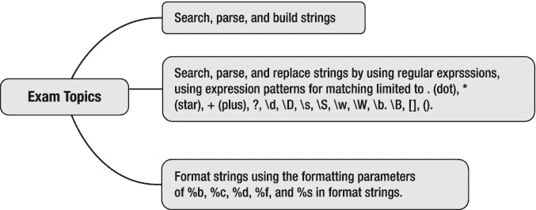

`String 对象` 在编写 Java 应用程序中被广泛使用。Java 程序不仅在业务逻辑中使用`字符串`，还用于实现诸如日志记录之类的实用功能。因此，理解`字符串`及相关概念非常有用且重要。


除了常见操作外，搜索和解析是对`string`执行的两种有用操作。Java 提供了广泛的支持来高效且轻松地实现这些操作。从版本 4 开始，Java 支持正则表达式，并提供了两个有用的类来利用正则表达式的强大功能。从版本 5 开始，Java 还支持类似 C 语言的 `printf()` 风格来格式化字符串。

OCAJP7 考试包含三个与字符串相关的主题：“创建和操作字符串”；“使用 StringBuilder 类及其方法操作数据”；以及“使用 == 和 equals() 测试字符串与其他对象之间的相等性”。假设您已具备 OCPJP 7 认证的先决条件，并且已经熟练使用 `string`，我们将直接进入 OCPJP7 考试涵盖的主题。

作为 OCPJP7 考生，您需要熟悉字符串的搜索、解析和构建；正则表达式及其用法；以及字符串格式化和格式说明符。在本章中，我们将详细涵盖所有这些主题。

处理字符串

在本节中，您将学习如何处理存储在 `String` 对象中的字符数据。

字符串搜索

在处理 `string` 时，您经常需要在给定的 `string` 中进行搜索。`String` 类提供了多个重载版本的 `indexOf()` 方法用于向前搜索字符串，`lastIndexOf()` 方法用于向后搜索字符串，以及 `regionMatches()` 方法用于比较字符串中的文本“区域”。我们将依次讨论这些方法。

IndexOf() 方法

如何搜索字符串中的特定字符，如果存在，它位于哪个位置？例如，字符 J 在字符串“OCPJP”中占据哪个索引位置？代码清单 7-1 包含了使用 `indexOf()` 方法回答这个问题的代码。

*代码清单 7-1.*  SearchString1.java

```
// Demonstrates searching a character in a string
public class SearchString1 {
        public static void main(String[] s) {
                String str = "OCPJP";
                System.out.println("Character J occurs at index: " + str.indexOf('J'));
        }
}
```

它会打印以下内容：

```
Character 
J
 occurs at index 3
```

很简单，对吧？`indexOf()` 方法搜索指定的字符——这里是字符 J——并返回该字符的第一次出现位置（注意索引从 0 开始，而不是 1！）。现在，让我们在给定的字符串中搜索一个子字符串。`indexOf()` 方法被重载了，其中一个方法定义接受一个 `string` 作为搜索参数。代码清单 7-2 展示了一个示例。

*代码清单 7-2.*  SearchString2.java

```
// Demonstrates searching a substring within a string using indexOf() method
public class SearchString2 {
        public static void main(String[] s){
                String str = "I am preparing for OCPJP";
                System.out.println("Substring \"for\" occurs at index: " + str.indexOf("for"));
        }
}
```

该程序会打印以下内容：

```
Substring "for" occurs at index: 15
```

（请注意，我们使用了转义字符 \ 来在双引号内打印“for”。）

如果搜索的字符串在目标字符串中不存在，会发生什么？例如，如果您在上面的示例中搜索“fort”而不是“for”，您将得到以下结果：

```
Substring "for" occurs at index: -1
```

嗯，失败的 `indexOf` 搜索会返回值 −1，表示“未找到”。

这两个是简单的问题；现在让我们尝试一个稍微难一点的。给定一个长字符串，如何找出给定字符串（例如“am”）在该字符串中出现了多少次？别担心——在这种情况下，有另一个版本的 `indexOf()` 方法。在这个方法中，您可以指定一个索引，搜索将从该索引开始。代码清单 7-3 展示了实现。

*代码清单 7-3.*  SearchString3.java

```
// This example demonstrates how to search multiple occurences of a search string
public class SearchString3 {
        public static void main(String[] s) {
                String str = "I am a student. I am preparing for OCPJP";
                int fromIndex = 0;
                while(str.indexOf("am", fromIndex) > −1) {
                        fromIndex = str.indexOf("am", fromIndex);
                        System.out.println("Substring \"am\" occurs at index: " + fromIndex);
                        fromIndex++;
                }
        }
}
```

该示例会打印以下内容：

```
Substring "am" occurs at index: 2
Substring "am" occurs at index: 18
```

它使用一个 `while` 循环来检查输入字符串中是否还有更多搜索字符串的出现。它还维护了一个索引（`fromIndex`），用于向前搜索。每次找到搜索字符串后，它会递增 `fromIndex` 变量，以便找到下一个搜索字符串的出现位置。

如果您想搜索搜索字符串的最后一次出现，可以使用 `String` 类中定义的 `lastIndexOf()` 方法的重载版本。`String` 类还提供了一些简单的方法来检查字符串的开头或结尾，这些方法在表 7-1 中给出。

表 7-1. 检查字符串中匹配前缀或后缀的方法

| 方法 | 描述 |
| --- | --- |
| `boolean startsWith(String prefixString, int offset)` | 从 `offset` 开始，检查此字符串是否以 `prefixString` 开头。 |
| `boolean startsWith(String prefixString)` | 检查此 `string` 是否以 `prefixString` 开头；等同于 `startsWith(prefixString, 0)`； |
| `boolean endsWith(String suffixString)` | 检查此 `string` 是否以 `suffixString` 结尾。 |

regionMatches() 方法

考虑字符串“Tarzan: Hi Jane, wanna ride an elephant? \n Jane: No thanks! I’m preparing for OCPJP now!”。如何检查字符串“ Jane: No thanks!”是否作为 Jane 回复的第一部分出现？（注意：Jane 的回复是换行符“\n”之后的文本区域。）

解决这个问题有很多方法，这里我们将使用 `regionMatches()` 方法来学习如何使用它。表 7-2 列出了 `regionMatches()` 方法的两个重载版本。为了解决给定字符串中的问题，您可以首先查找字符“\n”，然后从该索引位置开始，搜索字符串“ Jane: No thanks! ”，如代码清单 7-4 所示。

表 7-2. regionMatches() 方法及描述

| 方法 | 描述 |
| --- | --- |
| `boolean regionMatches(int start, String matchingStr, int matchStartOffset, int matchLen)` | 从该 `String` 对象中的 `start` 开始，检查由 `matchingStr` 给出的文本区域是否匹配。在 `matchStr` 中，检查从 `matchStartOffset` 开始的 `matchLen` 个字符。 |
| `boolean regionMatches(boolean ignoreCase, int start, String matchingStr, int matchStartOffset, int matchLen)` | 与上一个方法相同，但增加了第一个参数，用于忽略大小写差异。 |

*代码清单 7-4.*  MatchRegionInString.java


```
// 此示例演示如何在字符串中搜索文本的“区域”
public class MatchRegionInString {
        public static void main(String[] s) {
                String chat = "Tarzan: Hi Jane, wanna ride an Elephant? \n Jane: No thanks! I'm preparing for OCPJP now!";
                String matchString = " Jane: No thanks!";
                // 首先获取搜索区域起始位置的索引
                int startIndex = chat.indexOf('\n');
                System.out.println("Jane 的回复起始索引为: " + startIndex);
                // 如果找到 '\n'，则尝试从该位置匹配字符串 " Jane: No thanks!"
                if(startIndex > −1) {
                        // 记住索引从 0 开始而非 1，因此需要给 startIndex 加 1
                        boolean doesMatch = chat.regionMatches(startIndex + 1, matchString, 0, matchString.length());
                        if(doesMatch)
                                System.out.println("Jane 的回复与字符串" + matchString + "匹配");
                }
        }
} 
```

该程序会输出如下你期望的结果：

```
Jane 的回复起始索引为: 41
Jane 的回复与字符串 Jane: No thanks! 匹配
```

字符串解析

解析是对字符串进行的一项有趣且有用的操作。（*解析*一词意为“根据假定的结构进行分析，将其分解为组成部分”。）在本节中，我们将向你介绍基本的解析操作；在本章后面讨论正则表达式时，我们将进一步探讨高级解析主题。

字符串转换

在程序中，你经常会发现需要将字符串与基本类型（如浮点数、整数和布尔值）进行相互转换。要将基本类型值转换为字符串类型，可以使用 `String` 类中重载的 `valueOf()` 方法。

让我们从将整数值 10 转换为 `String` 开始。具体操作如下：

```
String str1 = String.valueOf(10);        // 将整数转换为字符串的正确方法
```

请注意，直接赋值或强制类型转换会导致编译错误，例如以下两条语句：

```
 String str1 = 10;                // 编译错误——无法从 int 转换为 String
String str1 = (String) 10;       // 编译错误——无法从 int 转换为 String
```

那么反过来呢：如果一个 `string` 包含某种基本类型的值（比如整数值），该如何进行转换？显然，以下两条尝试直接赋值或通过显式强制类型转换来改变类型的语句会导致编译错误：

```
int i = "10";            // 编译错误——无法从 String 转换为 int
int i = (int) "10";      // 编译错误——无法从 String 转换为 int
```

要进行这种类型转换，你需要使用 `Integer` 类中提供的 `parseInt()` 静态方法，如下所示：

```
int i = Integer.parseInt("10"); // 将字符串转换为整数的正确方法 
```

这个 `parseInt()` 方法是一个重载方法。还有另一个 `parseInt()` 方法，它接受一个额外的参数：整数值的基数（如八进制和十六进制）。包装类 `Byte`、`Short`、`Long`、`Float` 和 `Double` 都有等效的解析方法，用于将字符串转换为相应的基本类型值。如果你向这些解析方法传递无效参数会怎样？例如，

```
float f = Float.parseFloat("no such value");
```

对于这段代码，你会得到一个运行时异常 `java.lang.NumberFormatException`，因为字符串“no such value”无法转换为 `float` 类型值。

Split() 方法

清单 7-5 展示了一个示例，演示如何使用 `String` 类的 `split()` 方法拆分句子并打印字符串中的所有单词。

*清单 7-5.*  ParseString1.java

```
// 此示例演示了 split() 方法的用法
public class ParseString1 {
        public static void main(String[] s) {
                String quote = "Never lend books-nobody ever returns them!";
                String [] words = quote.split(" "); // 基于分隔符 " "（空格）拆分字符串
                for (String word : words) {
                        System.out.println(word);
                }
        }
}
```

它会输出以下内容：

```
Never
lend
books-nobody
ever
returns
them!
```

`split()` 方法接受一个分隔符作为正则表达式（你将在本章后面学习正则表达式）。在此示例中，你提供了一个空格作为分隔符，因此能够提取句子中的所有单词。请注意，字符“-”和“!”是字符串“books-nobody”和“them!”的一部分，因为你没有指定任何标点字符作为分隔符。稍后在学习正则表达式时，你将再次探讨这个问题。

|  | `split()` 方法的参数是一个分隔符字符串，它是一个正则表达式。如果你传入的正则表达式语法无效，将会得到一个 `PatternSyntaxException` 异常。 |

现在，假设你有一个包含文件夹路径的字符串，并且想要解析该字符串并打印出各个文件夹名称。清单 7-6 展示了实现方法。

*清单 7-6.*  ParseString2.java

```
public class ParseString2 {
        public static void main(String[] args) {
                String str = "c:\\work\\programs\\parser";
                String [] dirList = str.split("\\\\");
                for (int i=0; i<dirList.length; i++) {
                        System.out.println(dirList[i]);
                }
        }
}
```

它会输出以下内容：

```
c:
work
programs
parser
```

在这个示例中，有两件事可能会让你感到惊讶。

*   首先，使用“\\”而不是“\”很有意思。为了在字符串中显示特殊字符，你需要对这些特殊字符使用转义序列。例如，如果你想插入一个换行符，必须使用“\n”；同样，对于制表符，必须使用“\t”。这里，你想使用一个反斜杠，在字符串中可以表示为“\\”。
*   第二件事是与 `split()` 方法一起使用的分隔符。实际上，这里使用了一个正则表达式，以“\”作为分隔符来解析路径。我们将在讨论正则表达式时，很快解释为什么使用四个连续的反斜杠而不是一个。

正则表达式

*正则表达式*定义了一种搜索模式，可用于执行字符串搜索和字符串操作等操作。正则表达式不过是一系列按照预定义语法指定的预定义符号，帮助你搜索或操作字符串。正则表达式被指定为一个字符串，并从左到右应用于另一个字符串。

你可能会想，既然可以直接使用字符串函数进行搜索（例如上一节中使用 `indexOf()` 那样），为什么还需要*正则表达式*（regex，REGular EXpression 的缩写）呢？答案很简单。当你确切知道要搜索的字符串时，可以使用 `indexOf()` 方法（或任何其他类似方法）。但是，当你只知道字符串的模式而不知道具体字符串时，就需要使用正则表达式。在搜索和操作字符串方面，正则表达式比简单的搜索方法强大得多。例如，假设你想在给定的字符串中搜索所有电子邮件地址。你无法使用 `indexOf()` 方法实现这一点，因为你不知道确切的电子邮件地址；但是，你可以使用正则表达式指定一个模式，从而找到字符串中的所有电子邮件地址。

理解正则表达式符号


现在我们将重点理解用于指定正则表达式的符号的语法和语义。表 7-3 展示了用于指定正则表达式的常用符号。

表 7-3. 用于指定正则表达式的常用符号

| 符号 | 描述 |
| --- | --- |
| ^expr | 匹配行首的 expr。 |
| expr$ | 匹配行尾的 expr。 |
| . | 匹配任意单个字符（换行符除外）。 |
| [xyz] | 匹配 x、y 或 z 中的任意一个。 |
| [p-z] | 指定一个范围。匹配从 p 到 z 的任意字符。 |
| [p-z1-9] | 匹配从 p 到 z 的任意字符或从 1 到 9 的任意数字（注意，它不会匹配 p1）。 |
| [^p-z] | 方括号内作为第一个字符的 '^' 表示否定该模式；它匹配除 p 到 z 之外的任意字符。 |
| Xy | 匹配 x 后跟 y。 |
| x &#124; y | 匹配 x 或 y。 |

你可以使用表 7-3 中给出的符号来指定正则表达式。例如，你可以编写 `"[0–9]"` 来匹配所有数字字符，或者编写 `"[\t\r\f\n]"` 来匹配所有空白字符。此外，你还可以使用某些预定义的*元符号*来简化正则表达式的指定。例如，你可以指定 `"\d"` 代替 `"[0–9]"` 来匹配数字，或者指定 `"\s"` 代替 `"[\t\r\f\n]"` 来匹配所有空白字符。表 7-4 总结了常用的元符号列表。

表 7-4. 用于指定正则表达式的常用元符号

| 符号 | 描述 |
| --- | --- |
| \d | 匹配数字（等价于 [0–9]）。 |
| \D | 匹配非数字。 |
| \w | 匹配单词字符。 |
| \W | 匹配非单词字符。 |
| \s | 匹配空白字符（等价于 [\t\r\f\n]）。 |
| \S | 匹配非空白字符。 |
| \b | 在方括号外时匹配单词边界。在方括号内时匹配反斜杠。 |
| \B | 匹配非单词边界。 |
| \A | 匹配字符串开头。 |
| \Z | 匹配字符串结尾。 |

好了，到目前为止还不错。但是，如果你想指定一个匹配涉及字符出现次数的正则表达式，该怎么办呢？对于这种情况，你可以使用表 7-5 中提供的*量词符号*。

表 7-5. 常用的量词符号

| 符号 | 描述 |
| --- | --- |
| expr? | 匹配 0 次或 1 次 expr（等价于 expr{0,1}）。 |
| expr* | 匹配 0 次或多次 expr（等价于 expr{0,}）。 |
| expr+ | 匹配 1 次或多次 expr（等价于 expr{1,}）。 |
| expr{x} | 匹配 x 次 expr。 |
| expr{x, y} | 匹配 x 到 y 次 expr。 |
| expr{x,} | 匹配 x 次或更多次 expr。 |

Java 中的正则表达式支持

Java 1.4 SDK 在 Java 中引入了正则表达式支持。`java.util.regex` 包支持正则表达式。它包含两个重要的类：`Pattern` 和 `Matcher`。`Pattern` 以编译后的表示形式表示一个正则表达式，而 `Matcher` 则解释一个正则表达式并在给定字符串中匹配相应的子串。

此时，你可能会问，既然 `String` 类中的 `split()` 等方法已经支持正则表达式，为什么还要用 `Matcher` 和 `Pattern` 这样的专用类来支持正则表达式呢？这个问题的答案只有一个词：性能。`Pattern` 和 `Matcher` 类针对性能进行了优化，而 `String` 中的 `split()` 等方法则没有。

|  | 当你需要频繁地对字符串执行搜索或替换操作时，请使用 `Pattern` 和 `Matcher` 类；它们比 `String` 中的 `split()` 或其他方法更高效。 |

现在，让我们看看如何使用 `Pattern` 和 `Matcher` 类。首先，你需要调用 `Pattern` 类中的静态方法 `compile()` 来获取一个模式实例。该方法的第一个参数是一个正则表达式。然后，你需要从 `Pattern` 类中调用另一个名为 `matcher()` 的静态方法来获取 `Matcher` 类的一个实例。`matcher()` 方法返回一个 `Matcher` 对象。然后使用该对象对输入字符串执行所需操作。

让我们看看如何使用 `Pattern` 和 `Matcher` 类。假设你有一个包含一组人个人详细信息（如姓名、地址、电话号码）的字符串。你将使用以下字符串作为本节剩余部分示例的输入：

```
String str = "Danny Doo, Flat no 502, Big Apartment, Wide Road, Near Huge Milestone, Hugo-city 
56010, Ph: 9876543210, Email: danny@myworld.com. Maggi Myer, Post bag no 52, Big bank post office, 
Big bank city 56000, ph: 9876501234, Email: maggi07@myuniverse.com."
```

|  | 你需要使用反斜杠 (\) 来指定正则表达式；不要使用正斜杠 (/)。如果你使用正斜杠，编译器不会报错；但是，你将无法得到期望的输出。 |

使用正则表达式进行搜索和解析

让我们从一个简单的例子开始。你需要编写代码来打印字符串 `str` 中的所有单词。该怎么做呢？还记得元字符 `"\w"` 吗？它匹配构成单词的所有符号。你将使用 `"\w"` 以及量词 `"+"` 来构成 `"\w+"`，这意味着你想要搜索所有长度为一个或多个字符的单词；请参见清单 7-7。

*清单 7-7.*  Regex1.java

```
import java.util.regex.Matcher;
import java.util.regex.Pattern;

public class Regex1 {
        public static void main(String[] args) {
                String str = "Danny Doo, Flat no 502, Big Apartment, Wide Road, Near Huge Milestone, 
Hugo-city 56010, Ph: 9876543210, Email: danny@myworld.com. Maggi Myer, Post 
bag no 52, Big bank post office, Big bank city 56000, ph: 9876501234, Email: maggi07@myuniverse.com."
                Pattern pattern = Pattern.compile("\\w+");
                Matcher matcher = pattern.matcher(str);
                while(matcher.find()) {
                        System.out.println(matcher.group());
                }
        }
}
```

它会打印以下内容：

```
Danny
Doo
Flat
no

...
maggi07
myuniverse
com
```

（请注意，我们为了节省空间用 . . . 截断了结果。）但是，你可以看到正则表达式搜索了所有至少包含一个字符的单词。这里发生的是，你调用了 `compile()` 方法，并传入 `Pattern` 类的一个正则表达式来获取 `Pattern` 实例。之后，你通过调用模式实例上的 `matcher()` 方法获取了 `Matcher` 类的一个实例。最后，你使用 `Matcher` 类的 `group()` 和 `find()` 方法得到了结果。如果存在任何搜索结果，`find()` 方法返回 true。`group()` 方法将搜索结果作为一个字符串返回。

|  | 请注意，我们在清单 7-7 中指定的正则表达式里使用了两个反斜杠（“\\w+”），因为反斜杠是正则表达式中的转义字符。然而，反斜杠也是 Java 字符串中的转义字符，这意味着字面量“\\”会被解释为一个单独的反斜杠。这导致了一个有趣的结果：我们在正则表达式中写“\\”表示一个单独的反斜杠，而在 Java 程序中，如果我们想指定一个单独的反斜杠，则需要写成“\\\\”。 |

同样地，你可以使用 `"\d+"` 正则表达式搜索所有数字。现在，假设你想搜索并打印字符串中出现的所有邮政编码。假设邮政编码的长度始终为 5。你能用正则表达式实现吗？清单 7-8 中的程序能工作吗？


*清单 7-8.*  Regex2.java

```
import java.util.regex.Matcher;
import java.util.regex.Pattern;

// This program demonstrates how we can search numbers of a specified length
public class Regex2 {
        public static void main(String[] args) {
                String str = "Danny Doo, Flat no 502, Big Apartment, Wide Road, Near Huge Milestone, 
Hugo-city 56010, Ph: 9876543210, Email: danny@myworld.com. Maggi Myer, Post 
bag no 52, Big bank post office, Big bank city 56000, ph: 9876501234, Email: maggi07@myuniverse.com."
                Pattern pattern = Pattern.compile("\\d{5}");
                Matcher matcher = pattern.matcher(str);
                while(matcher.find()) {
                        System.out.println(matcher.group());
                }
        }
}
```

你使用了 `"\d{5}"` 作为正则表达式字符串。让我们看看这个程序会输出什么：

```

```

哎呀！它打印出了两个邮政编码，但也意外地打印出了三个电话号码的部分数字。嗯，要只获取邮政编码，你必须更准确地指定正则表达式。试试清单 7-9 中的代码。

*清单 7-9.*  Regex3.java

```
import java.util.regex.Matcher;
import java.util.regex.Pattern;

// This program demonstrates how we can search numbers of a specified length
public class Regex3 {
        public static void main(String[] args) {
                String str = "Danny Doo, Flat no 502, Big Apartment, Wide Road, Near Huge Milestone, 
Hugo-city 56010, Ph: 9876543210, Email: danny@myworld.com. Maggi Myer, 
Post bag no 52, Big bank post office, Big bank city 56000, ph: 9876501234, Email: maggi07@myuniverse.com."
                Pattern pattern = Pattern.compile("\\D\\d{5}\\D");
                Matcher matcher = pattern.matcher(str);
                while(matcher.find()) {
                        System.out.println(matcher.group());
                }
        }
}
```

它打印出以下内容：

```
56010,
 56000,
```

这次你使用了 `"\D\d{5}\D"`，效果很好。你本质上做的是指定一个非数字字符前后各有一个六位数字。很简单，对吧！嗯，这个解决方案有一个问题。程序在六位数字之前打印了一个空格，在六位数字之后打印了一个逗号（这两个字符都由 `"\D"` 匹配）。你能去掉这些不需要的字符吗？是的，有一个优雅的解决方案：你可以在这里使用 `"\b"`（用于检测单词边界）。试试清单 7-10 中的代码，看看是否有效。

*清单 7-10.*  RegexDemo.java

```
import java.util.regex.Matcher;
import java.util.regex.Pattern;

// This program demonstrates how we can search numbers of a specified length
public class Regex4 {
        public static void main(String[] args) {
                String str = "Danny Doo, Flat no 502, Big Apartment, Wide Road, Near Huge Milestone, 
Hugo-city 56010, Ph: 9876543210, Email: danny@myworld.com. Maggi Myer, Post 
bag no 52, Big bank post office, Big bank city 56000, ph: 9876501234, Email: maggi07@myuniverse.com."
                Pattern pattern = Pattern.compile("\\b\\d{5}\\b");
                Matcher matcher = pattern.matcher(str);
                while(matcher.find()) {
                        System.out.println(matcher.group());
                }
        }
}
```

它打印出以下内容：

```

```

完美。类似地，你也可以搜索所有电话号码，因为示例字符串中电话号码的长度是 10。

现在，让我们尝试做一些稍微困难的事情：搜索电子邮件地址。在电子邮件地址中，第一部分是一个单词（可以用 `"\w+"` 指定），后面跟着一个 `"@"`，然后是另一个单词，并以 `".com"` 结尾（为简单起见，我们忽略其他后缀，如 “`.edu`”）。因此，在示例字符串中搜索电子邮件地址的正则表达式是 `"\w+@\w+\.com"`。这个正则表达式字符串能行吗？试试清单 7-11 中的代码。

*清单 7-11.*  Regex5.java

```
import java.util.regex.Matcher;
import java.util.regex.Pattern;

// This program demonstrates how we can search email addresses
public class Regex5 {
        public static void main(String[] args) {
                String str = "Danny Doo, Flat no 502, Big Apartment, Wide Road, Near Huge Milestone, 
Hugo-city 56010, Ph: 9876543210, Email: danny@myworld.com. Maggi Myer, Post 
bag no 52, Big bank post office, Big bank city 56000, ph: 9876501234, Email: maggi07@myuniverse.com."
                Pattern pattern = Pattern.compile("\\w+@\\w+\\.com");
                Matcher matcher = pattern.matcher(str);
                while(matcher.find()) {
                        System.out.println(matcher.group());
                }
        }
}
```

它打印出以下内容：

```
danny@myworld.com
maggi07@myuniverse.com
```

成功了！

使用正则表达式替换字符串

在上一节中，你尝试使用正则表达式搜索和解析字符串。你也可以使用正则表达式操作（修改）字符串。现在让我们尝试替换字符串。

在示例字符串中，目前所有电话号码都表示为连续的 10 位数字字符串。现在你想将此电话号码格式更改为 XXX-XXXXXXX 格式——换句话说，你想在电话号码的第三位数字后插入一个连字符（-）。清单 7-12 展示了如何实现这一点。

*清单 7-12.*  Regex6.java

```
import java.util.regex.Matcher;
import java.util.regex.Pattern;

// This program demonstrates how we can manipulate text
public class Regex6 {
        public static void main(String[] args) {
                String str = "Danny Doo, Flat no 502, Big Apartment, Wide Road, Near Huge Milestone, 
Hugo-city 56010, Ph: 9876543210, Email: danny@myworld.com. Maggi Myer, Post 
bag no 52, Big bank post office, Big bank city 56000, ph: 9876501234, Email: maggi07@myuniverse.com."
                Pattern pattern = Pattern.compile("(\\D)(\\d{3})(\\d{7})(\\D)");
                Matcher matcher = pattern.matcher(str);
                String newStr = matcher.replaceAll("$1$2-$3$4");
                System.out.println(newStr);
        }
}
```

该程序的输出如下：

```
Danny Doo, Flat no 502, Big Apartment, Wide Road, Near Huge Milestone, 
Hugo-city 56010, Ph: 987–6543210, Email: danny@myworld.com. Maggi Myer, Post 
bag no 52, Big bank post office, Big bank city 56000, ph: 987–6501234, Email: maggi07@myuniverse.com.
```

很好，它按预期工作了。但你是如何做到的呢？一个非常明显的观察是你使用了 `Matcher` 类的 `replaceAll()` 方法。然而，要理解上面的例子，你还需要了解一个更重要的概念。

你可以在正则表达式内形成组。这些组可用于对整个正则表达式的所需子集指定量词。这些组也可用于指定反向引用。每个组可以被称为 `$n`，其中 n 是一个整数——例如，第一个组可以被称为 `$1`，第二个组可以被称为 `$2`，依此类推。

在这里，你形成了四个组，并在替换时，在第二组和第三组之间插入了一个连字符。这就是你的替换工作原理。

现在，让我们做点不同的事情。让我们实现一个方法来验证 IP 地址。你能建议一个匹配 IP 地址的正则表达式吗？


你说的是 `"\b\d{1,3}\.\d{1,3}\.\d{1,3}\.\d{1,3}\b"`，其中 `"\b"` 用于匹配单词边界，`"\d{1,3}"` 用于指定此处期望一个三位数字。嗯，想法不错，但这是错的！

一个有效的 IP 地址由 4 个用点分隔的数字组成，每个数字的取值范围是 0 到 255（含两端）。这意味着任何大于 255 的数字都会导致无效的 IP 地址。然而，在上述正则表达式中，你可以写入任意三位数字（甚至大于 255），正则表达式都会匹配。因此，它是错误的。

清单 7-13 展示了 IP 地址正则表达式的正确实现。

*清单 7-13.*  Regex7.java

```
import java.util.regex.Pattern;

// This program demonstrates how we can validate an IP address
public class Regex7 {
        void validateIP(String ipStr) {
                String regex = "\\b((25[0–5]|2[0–4]\\d|[01]?\\d\\d?)(\\.)){3}(25[0–5]|2[0–4]\\d|[01]?\\d\\d?)\\b";
                System.out.println(ipStr + " is valid? " + Pattern.matches(regex, ipStr));
        }
        public static void main(String[] args) {
                String ipStr1 = "255.245.188.123";       // valid IP address
                String ipStr2 = "255.245.188.273";       // invalid IP address - 273 is greater than 255
                Regex7 validator = new Regex7();
                validator.validateIP(ipStr1);
                validator.validateIP(ipStr2);
        }
}
```

这段代码会输出以下内容：

```
255.245.188.123 is valid? True
255.245.188.273 is valid? False
```

第一个字符串（`ipStr1`）是有效的 IP 地址，第二个字符串（`ipStr2`）是无效的 IP 地址。你指定的正则表达式成功识别出了有效的 IP 地址。不要被这个冗长的正则表达式吓到；一旦你理解了它，就会觉得很简单。

让我们从起始和结束符号开始——`"\b"` 是一个边界标记，正如你之前所见。现在，我们来看第一个分组 `"((25[0–5]|2[0–4]\d|[01]?\d\d?)(\.))"`，它包含两部分：第一部分指定了小于 256 的数字的正则表达式，第二部分指定了一个点。第一个分组的第一部分包含 3 个子表达式。第一个子表达式指定数字范围在 250 到 255 之间。第二个子表达式指定数字范围在 200 到 249 之间，第三个子表达式指定数字范围在 0 到 199 之间。你需要将这个第一个分组重复三次，因此在第一个分组后面立即加上 `"{3}"`。第二个分组其实就是不带点的第一个分组。

字符串格式化

到目前为止，我们已经讨论了如何搜索或解析一个 `String` 对象。如果你想要按照预定义的模板格式化一个字符串，该怎么办呢？例如，假设你正在计算一个圆的面积，并且希望只打印出保留两位小数的计算结果。如果你尝试使用通常的 `System.out.println` 方法，它会打印出一个相当大的浮点数。再举一个例子，假设你想用逗号这样的分隔符来分隔一个大数字的各位数字，以便打印给最终用户看。在这种情况下，你可以使用 Java 5 中引入的 C 风格 `printf()`（格式化打印）方法。

`printf()` 方法使用字符串格式化标志来格式化字符串。它与 C 编程语言库中提供的 `printf()` 函数非常相似。`printf()` 方法是作为 `PrintStream` 类的一部分提供的。以下是它的签名：

```
PrintStream printf(String format, Object... args)
```

`printf()` 方法的第一个参数是一个格式字符串。格式字符串可以包含字符串字面量和*格式说明符*。实际参数作为第二个参数（此处的 `args` 参数）传入。如果传入的格式不正确，此方法可能会抛出 `IllegalFormatException`。

格式说明符是字符串格式化概念的核心。它们定义了特定数据类型的占位符及其格式（例如对齐方式和宽度）。`printf()` 方法的其余参数是变量（或字面量），它们按照格式说明符的顺序提供实际数据来填充占位符。

格式说明符

让我们来研究一下 `printf()` 方法中格式说明符的模板：

```
%[flags][width][.precision]datatype_specifier
```

如你所见，每个格式说明符以 `%` 符号开头，后跟标志、宽度和精度信息，并以数据类型说明符结尾。在这个字符串中，标志、宽度和精度信息是可选的，而 `%` 符号和数据类型说明符是必需的。

*标志*是单字符符号，用于指定对齐方式和填充字符等特性。例如，标志“`-`”指定左对齐，“`^`”指定居中对齐，“`0`”则用前导零填充数字。

宽度说明符指示最终格式化字符串中字符的最小跨度。如果输入数据短于指定的宽度，则默认用空格填充。如果输入数据大于指定的宽度，则输出字符串中会显示完整数据，不会进行截断。

*精度字段*指定输出字符串中的精度位数。这个可选字段对于浮点数特别有用。

最后，*数据类型说明符*指示预期输入数据的类型。该字段是指定输入数据的占位符。表 7-6 列出了常用的数据类型说明符。

表 7-6. 常用的数据类型说明符

| 符号 | 描述 |
| --- | --- |
| %b | 布尔值 |
| %c | 字符 |
| %d | 十进制整数（有符号） |
| %e | 科学计数法表示的浮点数 |
| %f | 十进制格式的浮点数 |
| %g | 十进制或科学计数法表示的浮点数（取决于传入的参数值） |
| %h | 传入参数的哈希码 |
| %n | 行分隔符（换行符） |
| %o | 格式化为八进制值的整数 |
| %s | 字符串 |
| %t | 日期/时间 |
| %x | 格式化为十六进制值的整数 |

让我们使用 `printf()` 方法来格式化 `Circle` 类的 `area()` 方法的输出。默认情况下，`area()` 方法计算圆的面积并使用 `System.out.println()` 方法打印。但是，你想要控制输出的格式。更具体地说，你希望只打印保留两位小数的面积。清单 7-14 展示了如何实现这一点。

*清单 7-14.*  Circle.java

```
// This program shows the usage of formatting string in printf() method
class Circle {
        private int x, y, radius;
        public Circle(int x, int y, int radius) {
                this.x = x;
                this.y = y;
                this.radius = radius;
        }
        void area() {
                double tempArea = Math.PI * radius * radius;
                System.out.println("Cirle area using default formatting with println: " + tempArea);
                System.out.printf("Circle area using format specifier with printf: %.2f", tempArea);
        }
        public static void main(String[] str) {
                Circle circle = new Circle(10,10,5);
                circle.area();
        }
}
```

该程序产生以下输出：

```
Cirle area using default formatting with println: 78.53981633974483
Circle area using format specifier with printf: 78.54
```

你看，第一行包含未格式化的长输出，而第二行则使用 `printf()` 方法中的格式化字符串包含了格式化后的输出。


让我们通过一个示例来演示更多格式化选项。假设你想打印一张足球运动员表格，包含姓名、出场次数、进球数和场均进球数。不过，这里有一些限制条件：

*   球员姓名需要左对齐。
*   球员姓名字段至少需要 15 个字符。
*   每列之间用一个制表符距离隔开。
*   场均进球数只需保留一位小数。

清单 7-15 展示了如何实现这一点。

*清单 7-15.*  FormattedTable.java

```
// This program demonstrates the use of format specifiers in printf
class FormattedTable {
        static void line() {
                System.out.println("-----------------------------------------------------------------");
        }
        static void printHeader() {
                System.out.printf("%-15s \t %s \t %s \t %s \n",
                        "Player", "Matches", "Goals", "Goals per match");

}
        static void printRow(String player, int matches, int goals) {
                System.out.printf("%-15s \t %5d \t\t %d \t\t %.1f \n",
                        player, matches, goals, ((float)goals/(float)matches));
        }
        public static void main(String[] str) {
                FormattedTable.line();
                FormattedTable.printHeader();
                FormattedTable.line();
                FormattedTable.printRow("Demando", 100, 122);
                FormattedTable.printRow("Mushi", 80, 100);
                FormattedTable.printRow("Peale", 150, 180);
                FormattedTable.line();
        }
}
```

该程序产生如下输出：

```

Player            Matches         Goals           Goals per match

Demando           100             122             1.2
Mushi              80             100             1.3
Peale             150             180             1.2

```

我们来分析一下`printRow()`方法中指定的格式字符串。格式字符串的第一部分是"`%-15s`"。这里，表达式以`%`开头，表示格式说明符字符串的开始。下一个符号是`'-'`，用于使字符串左对齐。数字"`15`"指定了字符串的宽度，最后的数据类型说明符"`s"`表示输入数据类型为`String`。下一个格式说明符字符串是"`%5d",`，表示它期望一个整数，该整数将以至少 5 位数字显示。最后一个格式说明符字符串是"`%.1f`"，它期望一个浮点数，该数字将显示一位小数。所有格式说明符字符串之间用一个或多个`"\t"s`（制表符）分隔，以在列之间留出空间。

**要点提示**

以下是一些可能对你的 OCPJP 考试有用的要点：

*   如果你没有指定任何字符串格式化说明符，`printf()`方法将不会从给定的参数中打印任何内容！
*   诸如"`-`"、"`^`"或"`0`"之类的标志，只有在格式说明符字符串中指定了宽度时才有意义。
*   你也可以在格式字符串中打印`%`字符；但是，你需要为其使用转义序列。在格式说明符字符串中，`%`是一个转义字符——这意味着你需要使用`%%`来打印单个`%`。
*   如果你没有提供格式字符串所期望的输入数据类型，则可能会收到`IllegalFormatConversionException`。例如，如果你在`printRow()`方法实现中提供了一个字符串而不是预期的整数，你将收到以下异常：

```
Exception in thread "main" java.util.IllegalFormatConversionException:
```

`d != java.lang.String at java.util.Formatter$FormatSpecifier.failConversion(Unknown Source)`

*   如果你想构建一个字符串并在以后使用它，而不是仅仅使用`printf()`方法打印它，你可以使用`String`类中的一个静态方法——`format()`。我们使用`format()`方法重新实现了上一个示例中使用的`printRow()`方法，如下所示：

```
void printRow(String player, int matches, int goals){
    String str = String.format("%-15s \t %5d \t\t %d \t\t %.1f \n",
           player, matches, goals, ((float)goals/(float)matches));
    System.out.print(str);
}
```

**问答时间！**

1.  考虑以下程序，它旨在打印由字符‘*’在其两端分隔的单词：

`public class SearchString {`

`public static void main(String[] args) {`

`String quote = "An *onion* a day keeps everyone away!";`

`// match the word delimited by *'s`

`int startDelimit = quote.indexOf('*');`

`int endDelimit = quote.lastIndexOf("*");`

`System.out.println(quote.substring(startDelimit, endDelimit));`

`}`

`}`

该程序将打印以下哪个选项：

*   A.  *onion
    *   B.  *onion*
    *   C.  onion
    *   D.  *onio
    *   E.  nion*

**答案**：A. *onion

（子字符串 (`beginIndex`, `endIndex`) 由从 `beginIndex` 处的字符开始到 `endIndex` – 1 处的字符结束的字符组成。）

2.  预测以下程序的输出：

`public class ParseString1 {`

`public static void main(String[] s) {`

`String quote = "Never lend books-nobody ever returns them!";`

`String [] words = quote.split(" ", 2);              // split strings based on the delimiter " " (space)`

`for (String word : words) {`

`System.out.println(word);`

`}`

`}`

`}`

*   A.  会导致编译时错误。
    *   B.  会导致运行时异常。
    *   C.  执行时会打印以下输出

Never

lend

*   D.  执行时会打印以下输出

Never

lend books-nobody ever returns them!

**答案：** D. 执行时会打印以下输出

Never

lend books-nobody ever returns them!

（`split()`方法的第二个参数指定了`split()`方法需要生成的字符串总数。在最后一个字符串（此处为第二个字符串）中，`split()`方法会放入字符串的剩余部分。）

3.  清单 7-11 使用了正则表达式 `"\w+@\w+\.com"` 来匹配字符串中以“.com”域名结尾的电子邮件地址。你能将正则表达式替换为以下内容吗：`"\w+@\w+.com"`？

*   A.  可以，它会完美运行，并且只匹配有效的电子邮件地址。
    *   B.  不行，会导致编译时错误。
    *   C.  不行，会导致运行时异常。
    *   D.  不行，会产生错误匹配，并且会匹配无效的电子邮件地址。

**答案**：D. 不行，会产生错误匹配，并且会匹配无效的电子邮件地址。

（它会产生错误的匹配。例如，它也会匹配 `"abc@xyz!com"`，因为这里的 `"."` 充当单个字符的通配符，可以匹配任何字符。）

4.  以下哪个正则表达式是匹配以下格式存储的手机号码的正确表达式：+YY-XXXXXXXXXX（YY 是国家代码，其余部分是手机号码）？

*   A.  “\+\d{2}-\d{10}”
    *   B.  “\b\+\d{2}-\d{10}\b”
    *   C.  “+\d{2}-\d{10}”
    *   D.  “\b+\d{2}-\d{10}\b”

**答案**：A. “\+\d{2}-\d{10}”

（你需要为“+”提供一个反斜杠作为转义字符。另一个重要点是，如果字符串的第一个或最后一个字符不是单词字符，则不能在开头和结尾使用“\b”。）

5.  你想编写一个正则表达式来匹配电子邮件地址。该电子邮件地址不应以数字开头，并且应以“.com”结尾。以下哪个正则表达式满足此要求？

*   A.  “\b\w+@\w+\.com\b”
    *   B.  “\b\D\w*@\w+\.com\b”
    *   C.  “\b\D\w+@\w+\.com\b”
    *   D.  以上都不是

**答案**：B. “\b\D\w*@\w+\.com\b”


（“\b”用于标记单词边界，“\D”用于匹配任意非数字字符，“\w*”用于匹配长度为零或更多的任意单词。其余部分与之前使用的类似。）

6.  正则表达式 `"\d*[02468]"` 会匹配什么样的字符串？

*   A.  任何包含至少一个数字 0、2、4、6 或 8 的数字。
    *   B.  任何以数字 0、2、4、6 或 8 开头的数字。
    *   C.  任何在数字末尾包含所有指定数字（0、2、4、6、8）的数字。
    *   D.  任何以指定数字（0、2、4、6、8）之一结尾的数字。

**答案**：D. 任何以指定数字（0、2、4、6、8）之一结尾的数字。

（所有偶数。）

总结

搜索、解析和构建字符串

*   你可以使用 `String` 类中重载版本的 `indexOf()` 方法在字符串中进行正向搜索，使用 `lastIndexOf()` 进行反向搜索，以及使用 `regionMatches()` 比较字符串中的某个“区域”文本。
*   要将原始类型值转换为 `String` 类型对象，你可以利用重载的 `valueOf()` 方法，该方法接受一个原始类型值作为参数并返回 `String` 对象。要将 `String` 类型对象转换为原始类型值，你可以使用原始类型对应包装类中提供的解析方法。
*   要解析字符串，你可以使用 `String` 类中提供的 `split()` 方法。它接受一个分隔符作为参数，该参数是一个正则表达式。

正则表达式

*   正则表达式定义了一种搜索模式，可用于执行字符串搜索和字符串操作等操作。
*   当你需要大量执行字符串搜索或替换时，请使用 `Pattern` 和 `Matcher` 类；它们在 Java 中执行搜索/替换时比其他任何方式都更高效、更快速。
*   你可以在正则表达式中形成组。这些组可用于对整个正则表达式的所需子集指定量词。这些组也可用于指定反向引用。

字符串格式化

*   `printf()` 方法（以及 `String` 类中的 `format()` 方法）使用字符串格式化标志来格式化字符串。
*   每个格式说明符以 % 符号开头；后跟标志、宽度和精度信息；并以数据类型说明符结尾。在此字符串中，标志、宽度和精度信息是可选的，但 % 符号和数据类型说明符是必需的。

第 8 章


Java I/O 基础

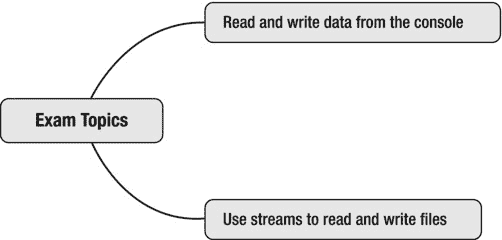

在本章中，我们将向你介绍 Java I/O 编程的基础知识。我们将涵盖两个主题：如何从控制台读取和写入数据，以及如何使用（文件）流来读取和写入数据。

使用 I/O 进行编程也需要编写一些异常处理代码。如果你不熟悉异常处理的基础知识，例如如何使用 try-catch-finally 块或 try-with-resources 语句，我们建议你先阅读关于异常处理和断言的章节（第 11 章）中的前三节，然后再回到本章。

文件操作的支持由 `java.io` 和 `java.nio` 包提供。在本章的开头部分，我们将只关注 `java.io` 包；稍后，我们将专注于使用流来读取和写入数据（但不涉及 `java.io` 包提供的其他特性。`java.nio` 包为文件 I/O 提供了全面的支持，我们将在第 9 章中介绍）。你可以将 `printf` 风格的格式化与 `Console` 类一起使用，此格式化 API 在第 7 章中有详细说明。

从控制台读取和写入

在本节中，我们将讨论从控制台读取和写入。

理解 Console 类

使用 `Console` 类（在 Java 1.6 中引入）将大大简化从控制台读取数据和向控制台写入数据的过程。请注意，这里的“控制台”指的是字符输入设备（通常是键盘）和字符显示设备（通常是屏幕显示）。你可以使用 `System.console()` 方法获取对控制台的引用；如果 JVM 未与任何控制台关联，此方法将返回 `null`。

你的第一个练习是实现一个简单的 `Echo` 命令，该命令在运行此程序时打印回你作为输入键入的文本行（清单 8-1）。

*清单 8-1.*  Echo.java

```
import java.io.Console;

// Echo 命令的简单实现
class Echo {
        public static void main(String []args) {
                // 获取系统控制台对象
                Console console = System.console();
                if(console == null) {
                        System.err.println("无法获取控制台对象 - 您是否从 IDE 运行应用程序？正在退出应用程序... ");
                        System.exit(−1); // 终止应用程序
                }
                // 读取一行并通过 printf 打印
                console.printf(console.readLine());
        }
}
```

以下是该程序对不同输出的行为：

```
D:\>java Echo
hello world
hello world

D:\>java Echo
^Z
Exception in thread "main" java.lang.NullPointerException
        at java.util.regex.Matcher.getTextLength(Matcher.java:1234)
        ... [为节省空间，省略了堆栈跟踪的此部分]
        at Echo.main(Echo.java:14)
```

对于正常的文本输入，此程序运行良好。如果你不输入任何内容并尝试使用 ^z 或 ^d（Ctrl+Z 或 Ctrl+D 组合键）终止程序，则程序将不会收到输入，因此 `readLine()` 方法返回 null；当 `printf` 接受一个 null 参数时，它会抛出 `NullReferenceException`。

请注意，你是从命令行运行此程序的。如果 JVM 是从命令行调用的，并且没有重定向输入或输出流，则 `System.console()` 方法将成功，因为 JVM 将与一个控制台（通常是键盘和显示屏）关联。如果 JVM 是由 IDE 间接调用的，或者 JVM 是从后台进程调用的，则方法调用 `System.console()` 将失败并返回 null。例如，图 8-1 显示了当我们从 Eclipse IDE 运行此程序时发生的情况。

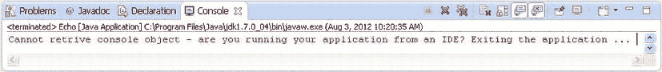

图 8-1.  从 Eclipse IDE 调用时，System.console() 返回 null

在这种情况下，JVM 未与控制台（如命令行）关联，因为它是从 IDE 调用的，因此程序失败。

|  | 如果 JVM 是由 IDE 间接调用的，或者 JVM 是从后台进程调用的，则方法调用 `System.console()` 将失败并返回 null。 |

`Console` 类中一些重要的方法列于表 8-1 中。

表 8-1. Console 类中的重要方法


| 方法 | 简要描述 |
| --- | --- |
| `Reader reader()` | 返回与此 `Console` 对象关联的 `Reader` 对象；可通过此返回的引用执行读取操作。 |
| `PrintWriter writer()` | 返回与此 `Console` 对象关联的 `PrintReader` 对象；可通过此返回的引用执行写入操作。 |
| `String readLine()` | 读取一行文本 `String`（此返回的字符串对象不包含任何行终止符）；如果读取失败则返回 null（例如用户在控制台按下 Ctrl+Z 或 Ctrl+D）。 |
| `String readLine(String fmt, Object... args)` | 与 `readLine()` 方法相同，但会先打印字符串 `fmt`。 |
| `char[] readPassword()` | 读取密码文本并以字符数组形式返回；此方法会禁用回显，因此用户输入密码时控制台不会显示任何内容。 |
| `char[] readPassword(String fmt,` `Object... args)` | 与 `readPassword()` 方法相同，但在读取密码字符串之前，会先打印作为格式字符串参数给出的字符串。 |
| `Console format(String fmt, Object... args)` | 将格式化字符串（基于 `fmt` 字符串和传入的 `args` 值创建）写入控制台。 |
| `Console printf(String fmt, Object... args)` | 将格式化字符串（基于 `fmt` 字符串和传入的 `args` 值创建）写入控制台。此 `printf` 方法与 `format` 方法相同：这是一种“便捷方法”——`printf` 方法和格式说明符对大多数 C/C++ 程序员来说都很熟悉，因此除了 `format` 方法之外还提供了此方法。 |
| `void flush()` | 刷新控制台对象缓冲区中所有仍待打印的数据。 |

使用 Console 类进行格式化 I/O

`Console` 类在 `printf()` 和 `format()` 方法以及 `readPassword()` 和 `readLine()` 的重载方法中支持格式化 I/O。本章不会介绍 `printf()` 和 `format()` 方法；它们将在第 7 章的“字符串格式化”部分详细讨论。

在 `readPassword()` 和 `readLine()` 方法中，第一个参数是格式说明符字符串，后续参数是传递给格式说明符字符串的值。这两个方法返回从控制台读取的字符数据。`readLine()` 和 `readPassword()` 方法有什么区别？主要区别在于 `readPassword()` 不会在控制台显示输入的字符串（原因显而易见，即不显示秘密密码），而 `readLine()` 会显示您在控制台输入的内容。另一个次要区别是 `readLine()` 方法返回一个 `String`，而 `readPassword()` 返回一个 `char` 数组。请参见清单 8-2。

*清单 8-2.*  Login.java

```
import java.io.Console;
import java.util.Arrays;

// 代码用于说明 readPassword 方法的使用
class Login {
        public static void main(String []args) {
                Console console = System.console();
                if(console != null) {
                        String userName = null;
                        char[] password = null;
                        userName = console.readLine("请输入您的用户名: ");
                        // 输入的密码字符不会在屏幕上显示
                        password = console.readPassword("请输入密码: ");
                        // password 是一个 char[]：先将其转换为 String 再比较内容
                        if(userName.equals("scrat") && new String(password).equals("nuts")) {
                                // 此处为了演示而硬编码用户名和密码，实际中请勿这样做！
                                console.printf("登录成功！");
                        }
                        else {
                                console.printf("请重新启动应用程序并重试");
                        }
                        // 使用完毕后“清空”密码
                        Arrays.fill(password, ' ');
                }
        }
}
```

以下是运行此程序并输入正确用户名和密码的实例：

```
D:\>java Login
请输入您的用户名: scrat
请输入密码:
登录成功！
```

请注意，输入密码时控制台没有显示任何内容。程序中为什么要有 `Arrays.fill(password, ' ');`？这是一种推荐的做法，即在密码字符串使用完毕后将其“清空”；这里使用 `Array` 的 `fill()` 方法来实现此目的。这是一种安全的编程实践，可以避免恶意读取程序数据以发现密码字符串。事实上，与返回 `String` 的 `readLine()` 方法不同，`readPassword()` 方法返回一个字符数组。使用字符数组，一旦密码验证完毕，就可以清空它并从内存中移除密码文本的痕迹；而对于会被垃圾回收的 `String` 对象，则不像字符数组那样容易处理。

Console 类中的特殊字符处理

通过 `Console` 的 `printf()` 或 `format()` 方法写入文本的优势在于，这些方法比通过 `PrintStream` 打印文本能更好地处理特殊字符。（我们将在下一节更详细地讨论 `streams`。）清单 8-3 展示了一个示例。

*清单 8-3.*  SpecialCharHandling.java

```
import java.io.Console;

// 通过 Console 对象打印更好——它能更好地处理“特殊字符”
class SpecialCharHandling {
        public static void main(String []args) {
                // 字符串包含三个斯堪的纳维亚字符
                String scandString = "å, ä, and ö";
                // 尝试直接用 println 打印斯堪的纳维亚字符
                System.out.println("直接用 println 打印斯堪的纳维亚字符: " + scandString);
                // 现在，获取 Console 对象并通过它打印斯堪的纳维亚字符
                Console console = System.console();
                console.printf("通过 console 的 printf 方法打印斯堪的纳维亚字符: " + scandString);
        }
}
```

以下是该程序的输出：

```
 直接用 println 打印斯堪的纳维亚字符: •, •, and ÷
通过 console 的 printf 方法打印斯堪的纳维亚字符: å, ä, and ö
```

从输出中可以看出，`Console` 的 `printf()` 方法（以及其他方法）对特殊字符有更好的支持。

使用流读取和写入文件


什么是流？流是有序的数据序列。Java 通过流来处理输入和输出。例如，当你从二进制文件中读取字节序列时，你正在从一个*输入流*中读取；同样地，当你向二进制文件写入字节序列时，你正在向一个*输出流*中写入。注意我们提到的是从*二进制文件*中读取或写入*字节*，那么从*文本文件*中读取或写入*字符*呢？Java 区分了文本数据和二进制数据的处理。在深入探讨流以及从文件读取或写入数据之前，你必须首先理解字符流和字节流之间的区别，这对于理解本章的其余内容至关重要。

字符流和字节流

考虑一下 Java 源文件和编译器生成的类文件之间的区别。Java 源文件的扩展名为 `.java`，旨在供人类以及编译器等编程工具阅读。然而，Java 类文件的扩展名为 `.class`，并非供人类阅读；它们旨在由 JVM（Windows 中的可执行文件 `java.exe`）和 Java 反汇编器（Windows 中的可执行文件 `javap.exe`）等底层工具处理。我们将包含文本（或字符）且人类可读的文件称为*文本文件*；将机器可读或底层数据存储文件称为*二进制文件*。自然，你解读文本文件和二进制文件内容的方式是不同的。例如，在文本文件中，你可以解读从文件中读取的数据，并区分制表符、空白字符、换行符等。然而，处理二进制文件中的数据则不是这样；它们是底层值。再举一个例子，考虑你用 Windows 中的记事本等文本编辑器创建的一个 `.txt` 文件；它包含人类可读的文本。现在，考虑将你的照片存储在一个 `.bmp` 或 `.jpeg` 文件中；这些文件显然不是人类可读的。它们旨在供照片编辑或图像处理软件处理，并且这些文件包含某种预定义底层格式的数据。

`java.io` 包中包含支持字符流和字节流的类。你可以使用字符流进行基于文本的 I/O。字节流用于基于数据的 I/O。用于读取和写入的字符流分别称为*读取器*和*写入器*（由抽象类 `Reader` 和 `Writer` 表示）。用于读取和写入的字节流分别称为*输入流*和*输出流*（由抽象类 `InputStream` 和 `OutputStream` 表示）。表 8-2 总结了字符流和字节流之间的区别，供你快速参考。

表 8-2. 字符流与字节流的区别

| 字符流 | 字节流 |
| --- | --- |
| 用于读取或写入基于字符或文本的 I/O，例如文本文件、文本文档、XML 和 HTML 文件。 | 用于读取或写入二进制数据 I/O，例如可执行文件、图像文件以及 `.zip`、`.class`、`.obj` 和 `.exe` 等底层格式的文件。 |
| 处理的数据是 16 位 Unicode 字符。 | 处理的数据是字节（即 8 位数据单元）。 |
| 输入和输出字符流分别称为*读取器*和*写入器*。 | 输入和输出字节流简称为*输入流*和*输出流*。 |
| `java.io` 包中的抽象类 `Reader` 和 `Writer` 及其派生类为字符流提供支持。 | `java.io` 包中的抽象类 `InputStream` 和 `OutputStream` 及其派生类为字节流提供支持。 |

|  | 如果你在需要字符流时尝试使用字节流，反之亦然，你的程序将会出现严重问题。例如，位图（.`bmp`）图像文件必须使用字节流处理；如果你尝试使用字符流，你的程序将无法工作。所以不要混淆流！ |

字符流

在本节中，你将探索使用字符流进行 I/O。你将学习如何读取和写入文本文件，以及一些可选功能，例如使用缓冲来加速 I/O。对于读取和写入文本文件，你可以分别使用派生自 `Reader` 和 `Writer` 抽象类的类。对于字符流，图 8-2 显示了重要的 `Reader` 类，表 8-3 提供了这些类的简短描述。图 8-3 显示了重要的 `Writer` 类，表 8-4 提供了这些类的简短描述。请注意，本章将只介绍该类层次结构中的几个重要类。

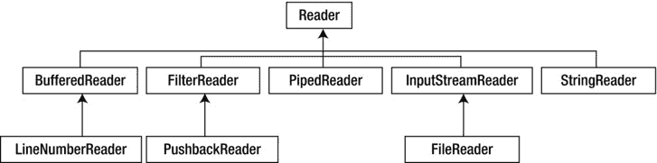

图 8-2.  派生自 Reader 类的重要类

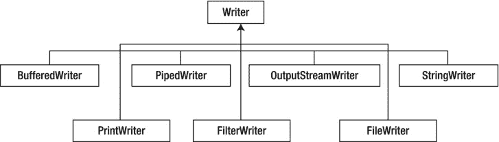

图 8-3.  派生自 Writer 类的重要类

表 8-3. 派生自 Reader 类的重要类

| 类名 | 简短描述 |
| --- | --- |
| `StringReader` | 一个操作`字符串`的字符流。 |
| `InputStreamReader` | 此类是字符流和字节流之间的桥梁。 |
| `FileReader` | `InputStreamReader` 的派生类，提供对读取字符文件的支持。 |
| `PipedReader` | `PipedReader` 和 `PipedWriter` 类形成一对，用于字符的“管道”读取/写入。 |
| `FilterReader` | 流的抽象基类，支持在从流中读取字符时对数据应用过滤操作。 |
| `PushbackReader` | `FilterReader` 的派生类，允许将读取的字符推回流中。 |
| `BufferedReader` | 为底层字符流添加缓冲，这样就不需要为每次读取和写入操作访问底层文件系统。 |
| `LineNumberReader` | `BufferedReader` 的派生类，在从底层字符流读取字符时跟踪行号。 |

表 8-4. 派生自 Writer 类的重要类

| 类名 | 简短描述 |
| --- | --- |
| `StringWriter` | 一个字符流，将输出收集到字符串缓冲区中，可用于创建`字符串`。 |
| `OutputStreamWriter` | 此类是字符流和字节流之间的桥梁。 |
| `FileWriter` | `InputStreamWriter` 的派生类，提供对写入字符文件的支持。 |
| `PipedWriter` | `PipedReader` 和 `PipedWriter` 类形成一对，用于字符流中字符的“管道”读取/写入。 |
| `FilterWriter` | 流的抽象基类，支持在将字符写入字符流时对数据应用过滤操作。 |
| `PrintWriter` | 支持格式化打印字符到输出字符流。 |
| `BufferedWriter` | 为底层字符流添加缓冲，这样就不需要为每次读取和写入操作访问底层文件系统。 |

读取文本文件

`Reader` 类读取流中的内容，并尝试将其解释为字符，例如制表符、文件结束符、换行符等。清单 8-4 实现了 Windows 中 `type` 命令的简化版本。`type` 命令显示作为命令行参数传递的文件的内容。


*清单 8-4.*  Type.java

```
import java.io.FileNotFoundException;
import java.io.FileReader;
import java.io.IOException;

// 实现 Windows 中 "type" 命令的简化版本
// 给定一个（或多个）文本文件名作为参数，在控制台打印文本文件的内容
class Type {
        public static void main(String []files) {
                if(files.length == 0) {
                        System.err.println("请将文件名作为参数传入");
                        System.exit(−1);
                }
                // 处理作为参数传入的每个文件
                for(String file : files) {
                        // 尝试用 FileReader 打开文件
                        try (FileReader inputFile = new FileReader(file)) {
                                int ch = 0;
                                // 当还有字符可获取时，读取并打印字符
                                // 当到达 EOF 时，read() 将返回 −1，从而终止循环
                                while( (ch = inputFile.read()) != −1) {
                                        // ch 是 int 类型——在打印前将其转换回 char
                                        System.out.print( (char)ch );
                                }
                        } catch (FileNotFoundException fnfe) {
                                // 传入的文件未找到……
                                System.err.printf("无法打开给定的文件 %s ", file);
                        }
                        catch(IOException ioe) {
                                // 读取文件时发生某些 IO 错误……
                                System.err.printf("处理文件 %s 时出错... 跳过该文件", file);
                        }
                        // try-with-resources 将自动释放 FileReader 对象
                }
        }
}
```

对于示例文本文件，以下是 Windows 中 type 命令和我们 `Type` 程序的输出：

```
D:\> type SaturnMoons.txt
土星的光环中有许多冰冷的卫星。土星的一些大型卫星包括：土卫一、土卫二、土卫三、土卫四、土卫五、土卫六、土卫七和土卫八。

D:\> java Type SaturnMoons.txt
土星的光环中有许多冰冷的卫星。土星的一些大型卫星包括：土卫一、土卫二、土卫三、土卫四、土卫五、土卫六、土卫七和土卫八。
```

程序按预期运行。在此程序中，你实例化了 `FileReader` 类，并传入要打开的文件名。如果文件未找到，`FileReader` 构造函数将抛出 `FileNotFoundException`。

文件打开后，你使用 `read()` 方法获取底层文件中的字符。你正在逐个字符地读取。或者，你也可以使用 `readLine()` 等方法逐行读取。

请注意，`read()` 方法返回的是 `int` 而不是 `char`——这是因为当 `read()` 到达文件末尾（EOF）时，它会返回 −1，而 −1 超出了 `char` 的范围。因此，`read()` 方法返回 `int` 以指示已到达文件末尾，并且你应该停止尝试从底层流中读取更多字符。

在此程序中，你只读取了一个文本文件；现在你将尝试同时读取和写入文本文件。

读取和写入文本文件

在之前的读取文本文件示例（清单 8-4）中，你按如下方式创建了字符流：

```
FileReader inputFile = new FileReader(file);
```

这使用了非缓冲 I/O，与缓冲 I/O 相比效率较低。换句话说，读取的字符是直接传递的，而没有使用临时（内部）缓冲区，而缓冲区本可以加速 I/O。要以编程方式使用缓冲 I/O，你可以将 `FileReader` 引用传递给 `BufferedReader` 对象，如下所示：


```
BufferedReader inputFile = new BufferedReader(new FileReader(file);
```

同理，你也可以使用 `BufferedWriter` 进行带缓冲的输出。（对于字节流，你可以使用 `BufferedInputStream` 和 `BufferedOutputStream`，我们将在本章后面讨论）。

现在，你将使用带缓冲的 I/O 来读取和写入文本文件。清单 8-5 包含了 Windows 中 `copy` 命令的简化版本。

*清单 8-5.*  Copy.java

```
import java.io.BufferedReader;
import java.io.BufferedWriter;
import java.io.FileNotFoundException;
import java.io.FileReader;
import java.io.FileWriter;
import java.io.IOException;

// implements a simplified version of "copy" command provided in Windows
// syntax: java Copy SrcFile DstFile
// copies ScrFile to DstFile; over-writes the DstFile if it already exits
class Copy {
        public static void main(String []files) {
                if(files.length != 2) {
                        System.err.println("Incorrect syntax. Correct syntax: Copy SrcFile DstFile");
                        System.exit(−1);
                }
                String srcFile = files[0];
                String dstFile = files[1];
                // try opening the source and destination file
                // with FileReader and FileWriter
                try (BufferedReader inputFile = new BufferedReader(new FileReader(srcFile));
                BufferedWriter outputFile = new BufferedWriter(new FileWriter(dstFile))) {
                        int ch = 0;
                        // while there are characters to fetch, read the characters from
                        // source stream and write them to the destination stream
                        while( (ch = inputFile.read()) != −1) {
                                // ch is of type int - convert it back to char before
                                // writing it
                                outputFile.write( (char)ch );
                        }
                        // no need to call flush explicitly for outputFile - the close()
                        // method will first call flush before closing the outputFile stream
                } catch (FileNotFoundException fnfe) {
                        // the passed file is not found ...
                        System.err.println("Cannot open the file " + fnfe.getMessage());
                }
                catch(IOException ioe) {
                        // some IO error occurred when reading the file ...
                        System.err.printf("Error when processing file; exiting ... ");
                }
                // try-with-resources will automatically release FileReader object
        }
}
```

我们先检查一下这个程序是否工作正常。将这个 Java 源程序本身（`Copy.java`）复制到另一个文件（`DuplicateCopy.java`）中。你可以使用 Windows 提供的 `fc`（文件比较）命令来确保原始文件和复制文件的内容相同，从而确认程序正确运行。

```
D:\> java Copy Copy.java DuplicateCopy.java
D:\> fc Copy.java DuplicateCopyjava
Comparing files Copy.java and DuplicateCopy.java
FC: no differences encountered
```

是的，它运行正确。如果你给它一个不存在的源文件名会怎样？

```
D:\> java Copy Cpy.java DuplicateCopyjava
Cannot open the file Cpy.java (The system cannot find the file specified)
```

你输入的是 `Cpy.java` 而不是 `Copy.java`，程序按预期终止并显示了一条可读的错误信息。

以下是该程序的工作原理。在 try-with-resources 语句中，你打开了 `srcFile` 用于读取，`dstFile` 用于写入。你想使用带缓冲的 I/O，因此分别将 `FileReader` 和 `FileWriter` 的引用传递给了 `BufferedReader` 和 `BufferedWriter`。

```
try (BufferedReader inputFile = new BufferedReader(new FileReader(srcFile));          BufferedWriter outputFile = new BufferedWriter(new FileWriter(dstFile)))
```

你使用了 try-with-resources 语句，`BufferedWriter` 的 `close()` 方法会在关闭流之前首先调用 `flush()` 方法。

|  | 当你在程序中使用带缓冲的 I/O 时，最好在需要确保所有待处理的字符或数据都被刷新（即写入底层文件）的地方显式调用 `flush()` 方法。   |

“分词”文本

在前两个示例（清单 8-4 和 8-5）中，你只是读取或写入文本文件。然而，在实际程序中，你可能希望在读取或写入文件时执行一些处理。例如，你可能需要查找特定模式、搜索某些特定字符串、将一个字符序列替换为另一个字符序列、过滤掉特定单词、以某种方式格式化输出等。你可以使用现有的 API，例如正则表达式（在第 7 章中介绍）、`Scanner` 等来实现这些目的。

举例来说，假设你想列出给定文本文件中的所有单词，并消除所有不必要的空白字符、标点符号等。此外，你需要按字母顺序打印结果单词。为了解决这个问题，你可以使用 `Scanner` 并传入你想要匹配或分隔的正则表达式（参见清单 8-6）。

*清单 8-6.*  Tokenize.java

```
import java.io.FileNotFoundException;
import java.io.FileReader;
import java.util.Scanner;
import java.util.Set;
import java.util.TreeSet;

// read the input file and convert it into "tokens" of words;
// convert the words to same case (lower case), remove duplicates, and print the words
class Tokenize {
        public static void main(String []args) {
                // read the input file
                if(args.length != 1) {
                        System.err.println("pass the name of the file to be read as an argument");
                        System.exit(−1);
                }
                String fileName = args[0];
                // use a TreeSet<String> which will automatically sort the words
                // in alphabetical order
                Set<String> words = new TreeSet<>();
                try ( Scanner tokenizingScanner = new Scanner(new FileReader(fileName)) ) {
                        // set the delimiter for text as non-words (special characters,
                        // white-spaces, etc), meaning that all words other than punctuation
                        // characters, and white-spaces will be returned
                        tokenizingScanner.useDelimiter("\\W");
                        while(tokenizingScanner.hasNext()) {
                                String word = tokenizingScanner.next();
                                if(!word.equals("")) { // process only non-empty strings
                                        // convert to lowercase and then add to the set
                                        words.add(word.toLowerCase());
                                }
                        }
                        // now words are in alphabetical order without duplicates,
                        // print the words separating them with tabs
                        for(String word : words) {
                                System.out.print(word + '\t');
                        }
                } catch (FileNotFoundException fnfe) {
                        System.err.println("Cannot read the input file - pass a valid file name");
                }
        }
}
```

让我们看看它是否有效：

```
D:\> type limerick.txt
There was a young lady of Niger
Who smiled as she rode on a tiger.
They returned from the ride
With the lady inside
And a smile on the face of the tiger.
```


D:\> java Tokenize limerick.txt
a      and    as     face   from   inside lady        niger   of      on returned        ride
    rode   she    smile  smiled the    there  they tiger  was     who     with               young
```

是的，它确实能正确运行。现在让我们看看这个程序做了什么。程序首先使用 `FileReader` 打开文件，并将其传递给 `Scanner` 对象。程序通过 `useDelimiter("\\W");` 为 `Scanner` 设置分隔符；“\W”匹配非单词字符，因此任何非单词字符都将成为分隔符。（请注意，你设置的是分隔符，而不是你想要匹配的模式）。程序使用 `TreeSet<String>` 来存储读取的字符串。程序从底层流中读取单词，检查其是否为非空字符串，并将字符串的小写版本添加到 `TreeSet` 中。由于数据结构是 `TreeSet`，它会去除重复项；记住它是一个 `Set`，不允许重复。此外，它还是一个有序的数据结构，意味着它会维护插入值的“顺序”，在本例中是对 `String` 的字母顺序排序。因此，程序能正确打印出包含一首打油诗的给定文本文件中的单词。

字节流

在本节中，你将探索使用字节流进行 I/O 操作。你将首先学习如何读写数据文件，以及如何序列化对象、将其存储到文件中，然后再读取回来。`OutputStream` 类及其派生类如图 8-4 所示；`InputStream` 及其派生类如图 8-5 所示。

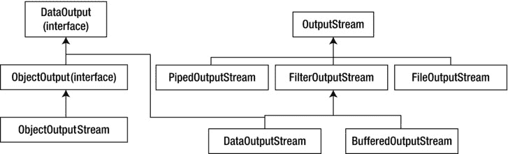

图 8-4.  派生自 OutputStream 抽象类的重要类

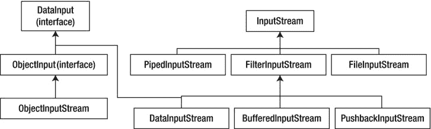

图 8-5.  派生自 InputStream 抽象类的重要类

表 8-5 总结了 `InputStream` 和 `OutputStream` 的重要类。

表 8-5. 派生自 InputStream 和 OutputStream 类的重要类

| 类名 | 简要描述 |
| --- | --- |
| `PipedInputStream, PipedOutputStream` | `PipedInputStream` 和 `PipedOutputStream` 创建一个通信管道，数据可以通过该管道发送和接收。`PipedOutputStream` 发送数据，`PipedInputStream` 接收在管道上发送的数据。 |
| `FileInputStream, FileOutputStream` | `FileInputStream` 从文件接收字节流，`FileOutputStream` 将字节流写入文件。 |
| `FilterInputStream, FilterOutputStream` | 这些过滤流用于为普通流添加功能。`InputStream` 的输出可以使用 `FilterInputStream` 进行过滤。`OutputStream` 的输出可以使用 `FilterOutputStream` 进行过滤。 |
| `BufferedInputStream, BufferedOutputStream` | `BufferedInputStream` 为输入流添加缓冲功能。`BufferedOutputStream` 为输出流添加缓冲功能。 |
| `PushbackInputStream` | `FilterInputStream` 的子类，它为输入流添加“推回”功能。 |
| `DataInputStream, DataOutputStream` | `DataInputStream` 可用于从输入流读取 Java 原始数据类型。`DataOutputStream` 可用于将 Java 原始数据类型写入输出流。 |

读取字节流

字节流用于处理不包含人类可读文本的文件。例如，Java 源文件包含人类可读的内容，但 `.class` 文件则不然。`.class` 文件是为 JVM 处理而设计的，因此你必须使用字节流来处理 `.class` 文件。

`.class` 文件的内容以特定的文件格式编写，该格式在 Java 虚拟机规范中有所描述。别担心，你不需要理解这种复杂的文件格式，只需检查它的“魔数”即可。每种文件格式都有一个用于快速检查文件格式的魔数。例如，“.MZ”是 Windows 中 `.exe` 文件的魔数（更准确地说，是魔字符串）。类似地，`.class` 文件的魔数是“0xCAFEBABE”，以十六进制值表示。这些魔数通常作为变长文件格式的前几个字节写入。

为了理解字节流的工作原理，你只需检查给定文件是否以魔数“0xCAFEBABE”开头（清单 8-7）。如果是，则可能是一个有效的 `.class` 文件；如果不是，则肯定不是 `.class` 文件。

*清单 8-7.*  ClassFileMagicNumberChecker.java

```
import java.io.FileInputStream;
import java.io.FileNotFoundException;
import java.io.IOException;
import java.util.Arrays;

// 检查传入的文件是否为有效的 .class 文件。
// 注意，这是一个基础版本的检查器，用于检查给定文件
// 是否为根据 JVM 规范编写的有效文件
// 它仅检查魔数
class ClassFileMagicNumberChecker {
        public static void main(String []args) {
                if(args.length != 1) {
                        System.err.println("请传入一个有效的文件名作为参数");
                        System.exit(−1);
                }
                String fileName = args[0];
                // 创建一个字节数组 magicNumber，包含 0xCAFEBABE 的四个字节值
                // 需要显式向下转换为 byte 类型，因为
                // 像 0xCA 这样的十六进制值是 int 类型
                byte []magicNumber = {(byte) 0xCA, (byte)0xFE, (byte)0xBA, (byte)0xBE};
                try (FileInputStream fis = new FileInputStream(fileName)) {
                        // 魔数为 4 字节 –
                        // 使用临时缓冲区读取前四个字节
                        byte[] u4buffer = new byte[4];
                        // 从文件中读取一个完整的缓冲区（此处为 4 字节）数据
                        if(fis.read(u4buffer) != −1) { // 如果读取成功
                                // 两个字节数组的 equals 重载方法
                                // 用于检查内容是否相等
                                if(Arrays.equals(magicNumber, u4buffer)) {
                                        System.out.printf("传入文件 %s 的魔数与 .class 文件匹配", fileName);
                                }
                                else {
                                        System.out.printf("传入文件 %s 的魔数与 .class 文件不匹配", fileName);
                                }
                        }
                } catch(FileNotFoundException fnfe) {
                        System.err.println("给定文件名对应的文件不存在");
                } catch(IOException ioe) {
                        System.err.println("处理文件时发生 I/O 错误");
                }
        }
}
```

让我们先通过传入同一程序的源文件（`.java`）和 `.class` 文件来测试它是否工作。

```
D:> java ClassFileMagicNumberChecker ClassFileMagicNumberChecker.java
传入文件 ClassFileMagicNumberChecker.java 的魔数与 .class 文件不匹配
D:\> java ClassFileMagicNumberChecker ClassFile
MagicNumberChecker.class
传入文件 ClassFileMagicNumberChecker.class 的魔数与 .class 文件匹配 
```


是的，它有效。`InputStream` 和 `OutputStream` 类构成了字节流层次结构的基础。你要执行文件 I/O 操作，因此将给定文件作为 `FileInputStream` 打开。你需要检查前四个字节，因此在一个临时缓冲区中读取四个字节。你需要将该缓冲区的内容与字节序列 0xCA、0xFE、0xBA 和 0xBE 进行比较。如果这两个数组的内容不相等，那么传入的文件就不是一个 `.class` 文件。

在这个程序中，你使用 `FileInputStream` 直接操作底层字节流。如果你需要读取大量字节以加速程序，可以使用缓冲输出流，如下所示：

```
BufferedInputStream bis = new BufferedInputStream(new FileInputStream(fileName));
```

与这些输入流类似，你可以使用输出流向数据文件写入字节序列。你可以使用 `FileOutputStream` 和 `BufferedOutputStream` 来实现。

阅读完这个程序后，你是否觉得读取一个四字节数组并比较字节数组的内容（而不是直接比较一个整数的内容）有些笨拙？换句话说，`0xCAFEBABE` 是一个整数值，你可以直接将其作为整数值读取，并与读取到的整数值进行比较。为此，你需要使用数据流，它提供了诸如 `readInt()` 之类的方法，我们现在就来讨论这些方法。

数据流

为了理解如何使用字节流进行写入或读取，让我们编写一个简单的程序，该程序将常量值写入数据文件，然后再读取出来（参见清单 8-8）。为了简化问题，你只需以以下原始类型值的形式写入 0 到 9 这些值：`byte`、`short`、`int`、`long`、`float` 和 `double`。

*清单 8-8.*  DataStreamExample.java

```
import java.io.DataInputStream;
import java.io.DataOutputStream;
import java.io.FileInputStream;
import java.io.FileNotFoundException;
import java.io.FileOutputStream;
import java.io.IOException;

// 一个简单的类，用于演示数据流；以不同的数据类型值写入常量 0 和 1
// 到文件中，然后读取结果并打印出来
class DataStreamExample {
        public static void main(String []args) {
                // 将一些数据写入一个硬编码名为 "temp.data" 的数据文件
                try (DataOutputStream dos =
                        new DataOutputStream(new FileOutputStream("temp.data"))) {
                        // 以 byte、short、int、long、float 和 double 类型写入值 1 到 10
                        // 省略 boolean 类型，因为 int 值无法转换为 boolean
                        for(int i = 0; i < 10; i++) {
                                dos.writeByte(i);
                                dos.writeShort(i);
                                dos.writeInt(i);
                                dos.writeLong(i);
                                dos.writeFloat(i);
                                dos.writeDouble(i);
                        }
                } catch(FileNotFoundException fnfe) {
                        System.err.println("无法使用给定的文件名创建文件 ");
                        System.exit(−1); // 不继续执行——退出程序
                } catch(IOException ioe) {
                        System.err.println("处理文件时发生 I/O 错误");
                        System.exit(−1); // 不继续执行——退出程序
                }
                // DataOutputStream 会自动关闭，因此无需担心
                // 现在，读取写入的数据并将其打印到控制台
                try (DataInputStream dis = new DataInputStream(new FileInputStream("temp.data"))) {
                        // 要读取的值的顺序是 byte、short、int、long、float 和 double
                        // 由于我们从 0 写到了 9，for 循环需要运行 10 次
                        for(int i = 0; i < 10; i++) {
                                // %d 用于打印 byte、short、int 或 long
                                // %f、%g 或 %e 用于打印 float 或 double
                                // %n 用于打印换行符
                                System.out.printf("%d %d %d %d %g %g %n",
                                                dis.readByte(),
                                                dis.readShort(),
                                                dis.readInt(),
                                                dis.readLong(),
                                                dis.readFloat(),
                                                dis.readDouble());
                        }
                } catch(FileNotFoundException fnfe) {
                        System.err.println("无法使用给定的文件名创建文件 ");
                } catch(IOException ioe) {
                        System.err.println("处理文件时发生 I/O 错误");
                } // DataOutputStream 会自动关闭，因此无需担心
        }
}
```

首先，让我们通过执行程序来看看它是否有效。

```
D:> java DataStreamExample
0 0 0 0 0.000000 0.000000
1 1 1 1 1.000000 1.000000
2 2 2 2 2.000000 2.000000
3 3 3 3 3.000000 3.000000
4 4 4 4 4.000000 4.000000
5 5 5 5 5.000000 5.000000
6 6 6 6 6.000000 6.000000
7 7 7 7 7.000000 7.000000
8 8 8 8 8.000000 8.000000
9 9 9 9 9.000000 9.000000
```

是的，它有效。现在，如前所述，数据文件的内容是不可读的。在这个例子中，你将值 0 到 9 以各种原始类型值的形式写入名为 `temp.data` 的临时文件中。如果你尝试打开这个数据文件并查看其内容，你将无法识别或理解它包含什么。以下是其内容的一个示例：


```
D:>type temp.data
                           • •   •       •?Ç  ?•      • •   •       •@   @
 • •   •       •@@        • •   •       •@Ç  @•      • •   •       •@á  @¶
• •   •       •@•  @•                 @•  @•         A   @
                A•  @"
```

文件 `temp.data` 的键入内容看起来像是乱码，这是因为像整数值 0 或 9 这样的原始类型值是以字节形式存储的。然而，Windows 中的 `type` 命令会尝试将这些字节转换为人类可读的字符，因此输出毫无意义。只有当我们知道文件中存储的数据格式，并按照该格式读取时，数据才会有意义。

现在让我们回到程序，看看它是如何工作的。该程序使用硬编码的文件名 `temp.data` 向当前目录（程序运行所在的目录）写入数据文件。程序首先写入数据，因此它以输出流的形式打开文件。第一个 `try` 块中的以下语句是什么意思？

```
DataOutputStream dos = new DataOutputStream(new FileOutputStream("temp.data"))
```

你可以直接使用 `OutputStream` 及其派生类 `FileOutputStream` 执行二进制 I/O，但要处理诸如原始类型值之类的数据格式，你需要使用 `DataOutputStream`，它充当底层 `FileOutputStream` 的包装器。因此，你在这里使用 `DataOutputStream`，它提供了诸如 `writeByte` 和 `writeShort` 之类的方法。你使用这些方法将原始类型值 0 到 9 写入数据文件。请注意，你无需显式关闭流，因为你是在 try-with-resources 语句中打开的 `DataOutputStream`，因此 `dos` 引用上的 `close()` 方法将自动被调用。`close()` 方法还会刷新底层流；此 `close()` 方法还将关闭对 `FileOutputStream` 的底层引用。

文件写入完成后，你以类似的方式读取数据文件。你打开一个 `FileInputStream`，并用 `DataInputStream` 包装它。你从流中读取数据并将其打印到控制台。你使用了格式说明符，例如 `%d`（这是用于打印整数值（如 `byte`、`short`、`int` 或 `long`）的常见格式说明符），以及用于打印 `float` 或 `double` 类型浮点值的 `%f`、`%g` 或 `%e` 说明符；`%n` 用于打印换行符。

在这个程序中，你读写的是原始类型值。那么引用类型对象（例如 Objects、Maps 等）呢？对象的读写是通过对象流实现的，我们现在就来讨论这一点。

写入和读取对象流：序列化

`ObjectInputStream` 和 `ObjectOutputStream` 类支持读写你在程序中使用的 Java 对象。例如，如果你正在创建一个用于购物的在线电子商务网站，你可以选择将客户、已提交的购买请求等对象写入 RDBMS（我们将在第 10 章中介绍 JDBC），或者将对象直接存储在*平面文件*中。在这种情况下，你必须知道如何将对象读写到流中。

在继续之前，让我们先介绍一些与此主题相关的术语。将内存中的对象转换为字节序列的过程称为*序列化*。将内存中的对象存储到文件中的机制称为*持久化*。通常这些概念被合并在一起，仅称为序列化。

清单 8-9 包含一个简单示例，演示了将 `Map` 数据结构的内容写入文件并读回，以说明使用 `ObjectInputStream` 和 `ObjectOutputStream` 类读写对象。你将最后三位美国总统的详细信息存储在此映射中。

*清单 8-9.*  ObjectStreamExample.java

```
import java.io.FileInputStream;
import java.io.FileNotFoundException;
import java.io.FileOutputStream;
import java.io.IOException;
import java.io.ObjectInputStream;
import java.io.ObjectOutputStream;
import java.util.HashMap;
import java.util.Map;

// 一个说明对象流的简单类：填充数据结构，将其写入临时文件，读回并打印读取的数据结构
class ObjectStreamExample {
        public static void main(String []args) {
                Map<String, String> presidentsOfUS = new HashMap<>();
                presidentsOfUS.put("巴拉克·奥巴马", "2009 年至今，民主党，第 56 届");
                presidentsOfUS.put("乔治·W·布什", "2001 年至 2009 年，共和党，第 54 届和第 55 届");
                presidentsOfUS.put("比尔·克林顿", "1993 年至 2001 年，民主党，第 52 届和第 53 届");
                try (ObjectOutputStream oos = new ObjectOutputStream(new FileOutputStream("object.data"))) {
                        oos.writeObject(presidentsOfUS);
                } catch(FileNotFoundException fnfe) {
                        System.err.println("无法使用给定的文件名创建文件 ");
                } catch(IOException ioe) {
                        System.err.println("处理文件时发生 I/O 错误");
                } // ObjectOutputStream 将自动关闭，因此无需担心

try (ObjectInputStream ois = new ObjectInputStream(new FileInputStream("object.data"))) {
                        Object obj = ois.readObject();
                        // 首先检查 obj 是否为 Map 类型
                        if(obj != null && obj instanceof Map) {
                                Map<String, String> presidents = (Map<String, String>) obj;
                                System.out.println("总统姓名 \t 描述 \n");
                                for(Map.Entry<String, String> president : presidents.entrySet()) {
                                        System.out.printf("%s \t %s %n", president.getKey(), president.getValue());
                                }
                        }
                } catch(FileNotFoundException fnfe) {
                        System.err.println("无法使用给定的文件名创建文件 ");
                } catch(IOException ioe) {
                        System.err.println("处理文件时发生 I/O 错误");
                } catch(ClassNotFoundException cnfe) {
                        System.err.println("无法识别对象的类 - 文件是否已损坏？");
                }
        }
}
```

在讨论程序如何工作之前，让我们先检查它是否有效。

```
D:\> java ObjectStreamExample
总统姓名   描述

巴拉克·奥巴马     2009 年至今，民主党，第 56 届
比尔·克林顿     1993 年至 2001 年，民主党，第 52 届和第 53 届
乔治·W·布什   2001 年至 2009 年，共和党，第 54 届和第 55 届
```

序列化过程会转换内存中对象的内容及其描述（称为*元数据*）。当对象引用其他对象时，序列化机制也会将它们作为序列化字节的一部分包含在内。如果你尝试打开存储了持久化对象的文件，则无法读取这些已序列化并持久化的对象。例如，如果你尝试读取 `object.data` 文件，你会看到大量不可读的字符。

现在，让我们回到程序，看看它是如何工作的。在这个程序中，你将最后三位美国总统的详细信息填充到 `HashMap` 容器中。然后，你按如下方式打开一个输出流：

```
ObjectOutputStream oos = new ObjectOutputStream(new FileOutputStream("object.data"))
```


`FileOutputStream` 在当前目录下打开一个名为 `object.data` 的临时文件。`ObjectOutputStream` 是对底层 `FileOutputStream` 的包装。在这个 try-with-resources 代码块中，你只有一条语句 `oos.writeObject(presidentsOfUS)`，它将对象写入 `object.data` 文件。

读取对象比写入对象需要更多的工作。`ObjectInputStream` 中的 `readObject()` 方法返回一个 `Object` 类型。你需要将其转换回 `Map<String, String>`。在向下转型为该特定类型之前，你需要检查 `obj` 是否为 `Map` 类型。请注意，你**不必**检查它是否为 `Map<String, String>`，因为这些泛型类型在称为*类型擦除*的过程中会丢失（关于此主题的讨论，请参见第 6 章）。一旦向下转型成功，你就可以读取该对象中内容的值。

序列化：更多细节

我们有必要进一步阐述序列化这一主题。如上一节所述，序列化是将对象转换为字节序列的过程。你可以像上一个示例那样将序列化后的对象写入文件，也可以将其放入套接字中通过网络发送。

上一个示例演示了如何将对象写入流；这其实就是持久化序列化。在上一个示例中，你创建了一个 `HashMap` 实例，然后对其进行了序列化和反序列化。如果你想序列化自己创建的类的对象（而不是序列化 `HashMap`），该怎么办呢？实际上，只要类实现了 `Serializable` 接口，你就可以序列化所有类的对象。换句话说，类默认是不可序列化的；你需要实现 `Serializable` 接口才能使其可序列化。在上一个示例中，`HashMap` 类也实现了 `Serializable` 接口。

|  | 如果你希望类的对象可序列化，则需要在类中实现 `Serializable` 接口。 |

现在，假设你想序列化一个包含不可序列化类成员（例如 `Thread` 或 `Socket`）的对象。或者，考虑一种你不想序列化某个成员变量的情况。针对这种情况，Java 提供了一个名为 `transient` 的关键字。你可以将一个成员变量声明为 `transient`，这样 JVM 就不会序列化该变量。让我们看一个例子来更好地理解它。假设你有一个 `USPresident` 类，用于存储美国总统的姓名、任期和任职届数。你想序列化这个类的对象，因此该类实现了 `Serializable` 接口。但是，你不想序列化某个字段，比如 `term`。代码清单 8-10 展示了如何实现这一点。

*代码清单 8-10.*  TransientSerialization.java

```
import java.io.FileInputStream;
import java.io.FileNotFoundException;
import java.io.FileOutputStream;
import java.io.IOException;
import java.io.ObjectInputStream;
import java.io.ObjectOutputStream;
import java.io.Serializable;

class USPresident implements Serializable{
        private static final long serialVersionUID = 1L;
        @Override
        public String toString() {
                return "US President [name=" + name + ", period=" + period + ", term=" + term + "]";
        }
        public USPresident(String name, String period, String term) {
                this.name = name;
                this.period = period;
                this.term = term;
        }
        private String name;
        private String period;
        private transient String term;
}
class TransientSerialization {
        public static void main(String []args) {
                USPresident usPresident = new USPresident("Barack Obama", "2009 to --", "56th term");
                System.out.println(usPresident);

//序列化对象
                try (ObjectOutputStream oos = new ObjectOutputStream(new FileOutputStream("USPresident.data"))){
                        oos.writeObject(usPresident);
                }
                catch(FileNotFoundException fnfe) {
                        System.err.println("无法使用给定的文件名创建文件 ");
                } catch(IOException ioe) {
                        System.err.println("处理文件时发生 I/O 错误");
                } // ObjectOutputStream 会自动关闭，因此无需担心

//反序列化对象
                try(ObjectInputStream ois = new ObjectInputStream(new FileInputStream("USPresident.data"))){
                        Object obj = ois.readObject();
                        if(obj != null && obj instanceof USPresident){
                                USPresident presidentOfUS = (USPresident)obj;
                                System.out.println(presidentOfUS);
                        }
                }catch(FileNotFoundException fnfe) {
                        System.err.println("无法使用给定的文件名创建文件 ");
                } catch(IOException ioe) {
                        System.err.println("处理文件时发生 I/O 错误");
                } catch(ClassNotFoundException cnfe) {
                        System.err.println("无法识别对象的类 - 文件是否已损坏？");
                }
        }
}
```

程序输出如下：

```
US President [name=Barack Obama, period=2009 to --, term=56th term]
US President [name=Barack Obama, period=2009 to --, term=null]
```

这个程序非常简单。首先，你使用所有必需的字段创建了一个 `USPresident` 类的实例。然后，你打印了该对象的内容。之后，你序列化了该对象，然后反序列化它。你再次打印了该对象的内容。从输出中你可以观察到，程序没有存储字段 `term` 的值。为什么？因为你将 `term` 声明为 `transient` 字段。所有声明为 `transient` 的类成员都不会被序列化，因此它们的值在反序列化后会丢失。

这里还有一件事需要注意——`serialVersionUID`。在这个例子中，它被设置为 1。如果你实现了 `Serializable` 但没有定义 `serialVersionUID`，你会收到一条警告消息。事实上，如果你不定义它，JVM 会为你定义它；JVM 会根据类的行为来计算它。但为什么需要它呢？嗯，它是为了防止在反序列化时错误地加载了错误版本的类。此外，定义 `serialVersionUID` 可以使序列化后的程序在不同的 JVM 实现之间无缝运行（如果你没有显式定义它，情况可能并非如此）。底线是：每当你对序列化类进行更改时，不要忘记同时更改 `serialVersionUID`。

要点回顾

以下是帮助你掌握 Java I/O 概念的值得注意的要点：


*   使用缓冲流时，应在数据传输完成后调用 `flush()`。内部缓冲区可能持有一些数据，调用 `flush()` 后这些数据将被清除并发送到目的地。不过，流上的 `close()` 方法会自动调用 `flush()`。
*   你可能已经注意到，你可以组合流对象。你可以创建一个 `BufferedInputStream` 对象，它接收一个 `FileInputStream` 对象。这样，一个流的输出就被链接到过滤流上。这是一种重要、有用且优雅的方式，可以按需定制流。
*   `Serializable` 接口是一个标记接口。这意味着 `Serializable` 接口内部没有声明任何方法。
*   如果你想自定义序列化过程，可以实现 `readObject()` 和 `writeObject()`。请注意，这两个方法都是私有方法，这意味着你并非在重写或重载这些方法。JVM 会检查这些方法的实现，并调用它们而不是常规方法。这听起来有些奇怪，但这就是 JVM 中实现序列化过程自定义的方式。
*   正如前面章节所讨论的，序列化后的对象可以通过网络进行通信，并在另一台机器上反序列化。但是，该对象的类文件必须位于目标机器的路径中，否则只会恢复对象的状态，而不会恢复整个对象（即，你无法在恢复后的对象上调用方法）。
*   你可以创建自己的序列化协议。为此，你只需要实现 `Externalizable` 接口，而不是 `Serializable` 接口。
*   当你在一个可序列化的类中没有指定 `serialVersionUID` 时，JVM 会为你计算它。然而，每个 JVM 实现计算它的机制都不同；因此，如果你没有显式指定 `serialVersionUID`，则无法保证你的可序列化类能在两个不同的 JVM 上正常工作。因此，强烈建议你在实现 `Serializable` 接口的类中提供 `serialVersionUID`。

提问时间！

1.  考虑以下代码片段：

`USPresident usPresident = new USPresident("Barack Obama", "2009 to --", 56);`

`try (ObjectOutputStream oos = new ObjectOutputStream(new FileOutputStream("USPresident.data"))){`

`oos.writeObject(usPresident);`

`usPresident.setTerm(57);`

`oos.writeObject(usPresident);`

`}`

如果你反序列化该对象并打印字段 `term`（`term` 声明为 `int` 且不是 `transient`），它会打印什么？

*   A.  56
    *   B.  57
    *   C.  null
    *   D.  编译器错误
    *   E.  运行时异常

**答案：** A. 56

（是的，即使你使用 setter 将 term 改为 57 并再次序列化，它仍会打印 56。这是由于 `serialVersionUID` 造成的，JVM 在序列化时会检查它。如果一个类已经被序列化，并且你试图再次序列化它，JVM 将不会进行序列化。）

2.  考虑以下代码段：

`OutputStream os = new FileOutputStream("log.txt");`

`System.setErr(new PrintStream(os)); // 设置 SYSTEM.ERR`

`System.err.println("Error");`

关于此代码段，以下哪个陈述是正确的？

*   A.  带有注释 SET SYSTEM.ERR 的那一行将无法编译，并导致编译器错误。
    *   B.  带有注释 SET SYSTEM.ERR 的那一行将导致抛出运行时异常，因为 `System.err` 无法通过编程方式重定向。
    *   C.  程序将在控制台打印文本“Error”，因为 `System.err` 默认将输出发送到控制台。
    *   D.  此代码段将 `System.err` 重定向到 `log.txt` 文件，并将文本“Error”写入该文件。

**答案**：D. 此代码段将 `System.err` 重定向到 `log.txt` 文件，并将文本“Error”写入该文件。

（请注意，你可以使用 `setErr()` 方法通过编程方式重定向 `System.err`。`System.err` 的类型是 `PrintStream`，而 `System.setErr()` 方法接受一个 `PrintStream` 作为参数。一旦设置了错误流，所有对 `System.err` 的写入都将被重定向到该流。因此，此程序将创建包含文本“Error”的 `log.txt` 文件。）

3.  以下哪个 `AResource` 类的实现定义是正确的，以便它可以与 try-with-resources 语句一起使用？

`A.`   `class AResource implements Closeable {`

`protected void close() /* throws IOException */ {`

`// close 的主体，用于释放资源`

`}`

`}`

`B.`   `class AResource implements Closeable {`

`public void autoClose() /* throws IOException */ {`

`// close 的主体，用于释放资源`

`}`

`}`

`C.`   `class AResource implements AutoCloseable {`

`void close() /* throws IOException */ {`

`// close 的主体，用于释放资源`

`}`

`}`

`D.`   `class AResource implements AutoCloseable {`

`public void close() throws IOException {`

`// close 的主体，用于释放资源`

`}`

答案：

`D.`   `class AResource implements AutoCloseable {`

`public void close() throws IOException {`

`// close 的主体，用于释放资源`

`}`

`}`

（`AutoCloseable` 是 `Closeable` 接口的基接口；`AutoCloseable` 将 close 声明为 `void close() throws Exception;`。在 `Closeable` 中，它被声明为 `public void close() throws IOException;`。一个类要能与 try-with-resources 一起使用，它必须实现 `Closeable` 或 `AutoCloseable`，并正确重写 `close()` 方法。选项 A 将 `close()` 声明为 protected；由于基接口中的 `close()` 方法声明为 public，你不能将其可见性降低为 protected，因此这会导致编译器错误。选项 B 声明了 `autoClose()`；正确的实现应该定义 `close()` 方法。选项 C 将 `close()` 声明为默认访问权限；由于基接口中的 close 方法声明为 public，你不能将其可见性降低为默认访问权限，因此会导致编译器错误。选项 D 是 `AResource` 类的正确实现，它重写了 `close()` 方法。）

4.  考虑以下代码段：

`FileInputStream findings = new FileInputStream("log.txt");`

`DataInputStream dataStream = new DataInputStream(findings);`

`BufferedReader br = new BufferedReader(new InputStreamReader(dataStream));`

`String line;`

`while ((line = br.readLine()) != null) {`

`System.out.println(line);`

`}`

`br.close();`

关于此代码段，哪两个选项是正确的？

*   A.  `br.close()` 语句将只关闭 `BufferedReader` 对象，而 `findings` 和 `dataStream` 将保持未关闭状态。
    *   B.  `br.close()` 语句将关闭 `BufferedReader` 对象以及由 `findings` 和 `dataStream` 引用的底层流对象。
    *   C.  在语句 `br.readLine()` 中调用的 `readLine()` 方法可能抛出 `IOException`；如果抛出此异常，`br.close()` 将不会被调用，从而导致资源泄漏。
    *   D.  在语句 `br.readLine()` 中调用的 `readLine()` 方法可能抛出 `IOException`；但是，由于垃圾回收器会回收所有资源，因此不会发生任何资源泄漏。
    *   E.  在此代码段中，调用 `br.close()` 不会抛出任何异常，因此不存在资源泄漏的可能性。

**答案：** B 和 C。`br.close()` 语句将关闭 `BufferedReader` 对象以及由 `findings` 和 `dataStream` 引用的底层流对象。在语句 `br.readLine()` 中调用的 `readLine()` 方法可能抛出 `IOException`；如果抛出此异常，`br.close()` 将不会被调用，从而导致资源泄漏。请注意，垃圾回收器只会回收不再被引用的内存资源；确保所有其他资源（如流对象）被释放是程序员的责任。

总结

**向控制台读写数据**


*   你可以使用 `System.console()` 方法获取控制台的引用；如果 JVM 未关联任何控制台，该方法将失败并返回 null。
*   `Console` 类提供了许多支持格式化 I/O 的方法。你可以使用 `Console` 类中的 `printf()` 和 `format()` 方法来打印格式化文本；重载的 `readLine()` 和 `readPassword()` 方法接受格式字符串作为参数。
*   使用 `readPassword()` 方法读取密码等安全字符串。建议使用 `Array` 的 `fill()` 方法“清空”读入字符数组的密码（以避免恶意访问输入的密码）。
*   与通过 `PrintStreams` 打印文本相比，`Console` 类中的方法对特殊字符有更好的支持。

**使用流读写文件**

*   `java.io` 包中包含支持字符流和字节流的类。
*   你可以使用字符流进行基于文本的 I/O。字节流用于基于数据的 I/O。
*   用于读写的字符流分别称为*读取器（reader）*和*写入器（writer）*（由 `Reader` 和 `Writer` 抽象类表示）。
*   用于读写的字节流分别称为*输入流（input stream）*和*输出流（output stream）*（由 `InputStream` 和 `OutputStream` 抽象类表示）。
*   你应该只使用字符流处理文本文件（或人类可读的文件），使用字节流处理数据文件。如果你尝试使用一种类型的流代替另一种，程序将无法按预期工作；即使偶然能运行，也会出现严重的错误。因此，不要混淆流，要根据手头的任务使用正确的流。
*   对于字节流和字符流，你都可以使用缓冲。缓冲类作为底层流的包装类提供。在执行批量 I/O 操作时，使用缓冲可以加快 I/O 速度。
*   对于处理包含基本数据类型和字符串的数据，你可以使用数据流。
*   *序列化*：将内存中的对象转换为一系列字节的过程。
*   *持久化*：将内存中的对象存储到文件中的机制。
*   你可以使用对象流进行对象持久化（即，将内存中的对象读写到文件中，反之亦然）。

第 9 章


Java 文件 I/O (NIO.2)

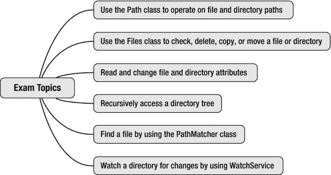

我们在上一章介绍了 I/O 基础知识，你学习了如何从控制台读写，以及如何使用流读写文件。在本章中，你将学习如何处理文件系统——例如，如何保存文件/目录；创建文件/目录；浏览目录；复制、移动或删除文件/目录等。作为一名 Java 程序员，你应该了解如何以编程方式实现这些文件/目录操作。

Java 提供了丰富的 API 来操作文件和目录。事实上，Java 7 引入了一套名为 NIO.2 的新 I/O API，它提供了执行文件系统相关操作的便捷方式。在本章中，你将探索如何执行各种文件操作，例如创建、移动、复制和删除。你还将学习如何在目录结构中搜索文件，以及如何获取/设置文件/目录的属性。

I/O API 简史

最初，Java 提供了 `File` 类（位于 `java.io` 包中）来访问文件系统。该类代表文件系统中的文件/目录，并允许你执行诸如检查文件/目录是否存在、获取属性以及删除文件/目录等操作。然而，第一版 API 不足以满足开发者的需求，因此人们感到需要改进的 I/O API。简而言之，第一版 Java I/O API 存在以下缺点：

*   `File` 类缺乏实现即使是常用功能所需的重要功能。例如，它缺少用于复制文件/目录的 `copy` 方法。
*   `File` 类定义了许多返回 `Boolean` 值的方法。因此，在出错时，会返回 `false`，而不是抛出异常，所以开发者无法知道调用失败的原因。
*   `File` 类对处理符号链接的支持不佳。
*   `File` 类处理目录和路径的方式效率低下（可扩展性差）。
*   `File` 类仅提供对非常有限的文件属性集的访问，这在许多情况下是不够的。

为了克服这些问题，Java 在 Java 4 中引入了 *NIO（New IO）*。NIO 的关键特性是：

*   **通道和选择器：** NIO 支持各种类型的`通道`。*通道*是对底层文件系统特性（如内存映射文件和文件锁定）的抽象，可以让你以更快的速度传输数据。通道是非阻塞的，因此 Java 提供了另一个特性——*选择器*——来选择就绪的通道进行数据传输。*套接字*是阻塞特性，而通道是非阻塞特性。
*   **缓冲区：** Java 4 为所有基本类型（`Boolean` 除外）引入了缓冲。它提供了 `Buffer` 类，该类提供了诸如 `clear`、`flip`、`mark`、`reset` 和 `rewind` 等操作。具体类（`Buffer` 基类的子类）提供了 getter 和 setter 方法，用于向缓冲区设置数据和从缓冲区获取数据。
*   **字符集：** Java 4 还引入了字符集（`java.nio.charset`）、编码器和解码器，用于映射字节和 Unicode 符号。

从 SE 7 版本开始，Java 引入了对 I/O 操作的全面支持。Java 7 引入了 `java.nio.file` 包，以更好地支持处理符号链接、提供全面的属性访问，并通过 `Path`、`Paths` 和 `Files` 等接口或类支持扩展文件系统。你将在本章的其余部分更详细地探讨这些主题。

使用 Path 接口

文件系统通常形成一棵树。文件系统从一个根目录开始，该目录包含文件和目录（在 Windows 中，目录也称为*文件夹*）。每个目录又可能包含子目录或保存文件。要定位一个文件，你只需将从根目录到包含该文件的直接目录的路径组合起来，加上文件分隔符，最后跟上文件名。例如，如果 `myfile.txt` 文件位于 `mydocs` 目录中，而该目录位于根目录 `C:\` 下，那么该文件的路径是 `C:\mydocs\myfile.txt`。每个文件都有一个唯一的路径来定位它（符号链接除外）。

路径可以是*绝对路径*（例如 `C:\mydocs\myfile.txt`），它从根元素开始。另一方面，路径也可以指定为*相对路径*。当你尝试编译 Java 程序时，你只需编写类似 `javac programFileName.java` 的命令；在这里，你指定了相对于当前选定目录的 Java 源文件路径，因此这是一个相对路径。你需要一个参考路径（例如本例中的当前目录路径）来解释相对路径。

在我们进一步讨论之前，有必要谈谈*符号链接*。符号链接就像实际文件的指针或引用。通常，符号链接对应用程序是透明的，这意味着操作直接在实际文件上执行，而不是在这些链接上执行（当然，符号链接特定的操作除外）。


Java 7 引入了一种新的路径编程抽象，即 `Path` 接口。该 `Path` 抽象被用于 NIO.2 中的新特性和 API 中，因此它是一个需要理解的重要接口。路径对象包含构成 `Path` 对象所代表的文件/目录完整路径的目录和文件名称；`Path` 抽象提供了提取路径元素、操作它们以及追加它们的方法。事实上，稍后您会看到，几乎所有访问文件/目录以获取其信息或对其进行操作的方法都使用 `Path` 对象。在您看到几个说明如何使用 `Path` 接口的示例之前，表 9-1 快速总结了该接口中的重要方法。

表 9-1. Path 接口中的重要方法

| 方法 | 描述 |
| --- | --- |
| `Path getRoot()` | 返回一个 `Path` 对象，表示给定路径的根目录，如果路径没有根目录则返回 null。 |
| `Path getFileName()` | 返回给定路径的文件名或目录名。请注意，文件/目录名是给定路径中的最后一个元素或名称。 |
| `Path getParent()` | 返回 `Path` 对象，表示给定路径的父路径，如果路径不存在父组件则返回 null。 |
| `int getNameCount()` | 返回给定路径中文件/目录名称的数量；如果给定路径表示根目录则返回 0。 |
| `Path getName(int index)` | 返回第 i 个文件/目录名称；索引 0 从最靠近根目录的名称开始。 |
| `Path subpath(int beginIndex, int endIndex)` | 返回一个 `Path` 对象，它是此 `Path` 对象的一部分；返回的 `Path` 对象包含从 `beginIndex` 开始到索引 *endIndex - 1* 处的元素。换句话说，`beginIndex` 包含该索引处的名称，而不包含 `endIndex` 处的名称。如果 beginIndex >= 元素数量，或 endIndex <= beginIndex，或 endIndex > 元素数量，此方法可能抛出 `IllegalArgumentException`。 |
| `Path normalize()` | 移除路径中的冗余元素，例如 .（表示当前目录的点符号）和 ..（表示父目录的双点符号）。 |
| `Path resolve(Path other)` `Path resolve(String other)` | 根据给定路径解析一个路径。例如，此方法可以将给定路径与另一个路径合并，并返回结果路径。 |
| `Boolean isAbsolute()` | 如果给定路径是绝对路径则返回 true；否则返回 false（例如，当给定路径是相对路径时）。 |
| `Path startsWith(String path) Path startsWith(Path path)` | 如果此 `Path` 对象以给定的 `path` 开头则返回 true，否则返回 false。 |
| `Path toAbsolutePath()` | 返回绝对路径。 |

获取路径信息

让我们创建一个 `Path` 对象并检索与该对象关联的基本信息。清单 9-1 展示了如何创建一个 `Path` 对象并获取其信息。

清单 9-1.  PathInfo1.java

```
import java.nio.file.*;

// 用于说明如何使用 Path 接口及其方法的类
public class PathInfo1 {
        public static void main(String[] args) {
                // 通过调用 Paths 类中的静态方法 get() 创建一个 Path 对象
                Path testFilePath = Paths.get("D:\\test\\testfile.txt");

// 检索路径的基本信息
                System.out.println("打印文件信息: ");
                System.out.println("\t 文件名: " + testFilePath.getFileName());
                System.out.println("\t 路径的根目录: " + testFilePath.getRoot());
                System.out.println("\t 目标的父目录: " + testFilePath.getParent());

// 打印路径元素
                System.out.println("打印路径的元素: ");
                for(Path element : testFilePath) {
                        System.out.println("\t 路径元素: " + element);
                }
        }
}
```

程序输出如下：

```
打印文件信息:
         文件名: testfile.txt
         路径的根目录: D:\
         目标的父目录: D:\test
打印路径的元素:
         路径元素: test
         路径元素: testfile.txt
```

输出结果不言自明。让我们理解一下这个程序。

*   首先，你使用 `Paths` 类的 `get()` 方法创建一个 `Path` 实例。`get()` 方法期望一个表示路径的 `string` 作为输入。这是创建 `Path` 对象最简单的方法。
*   请注意，你在 `Paths.get("D:\\test\\testfile.txt")` 中使用了转义字符 `\`。如果不这样做，`\t` 将表示一个制表符，如果你运行程序，将会得到一个 `java.nio.file.InvalidPathException`，因为路径名称中不能包含制表符。
*   然后，你使用 `Path` 对象的 `getFilename()` 方法提取此 `Path` 对象所代表的文件名。
*   你还使用 `getRoot()` 获取 `Path` 对象的根元素，并使用 `getParent()` 方法获取目标文件的父目录。
*   你使用 `foreach` 循环遍历路径中的元素。或者，你可以使用 `getNameCount()` 获取路径中元素或名称的数量，并使用 `getName(index)` 逐个遍历和访问元素/名称。

现在，让我们尝试另一个示例。在这个示例中，你将探索 `Path` 对象的一些有趣方面，例如如何从相对路径获取绝对路径，以及如何*规范化*路径。

在查看示例之前，你需要先理解示例中使用的方法：

*   `toUri()` 方法从路径返回 URI（一种可以从浏览器打开的路径）。
*   `toAbsolutePath()` 方法从给定的相对路径返回绝对路径。如果输入路径已经是绝对路径，该方法返回同一个对象。
*   `normalize()` 方法对输入路径执行规范化。换句话说，它从 `Path` 对象中移除不必要的符号（例如“ . ”和“ .. ”）。
*   `toRealPath()` 是一个有趣的方法。它从输入路径对象返回一个绝对路径（如同 `toAbsolutePath()`）。同时，它还会规范化路径（如同 `normalize()`）。此外，如果正确选择了链接选项，它还会解析符号链接。但是，要成功使用此方法，目标文件/目录必须存在于文件系统中，而*这*并不是其他 `Path` 方法的先决条件。

现在，让我们看一下清单 9-2 中的示例。假设文件系统中不存在名为 `Test` 的文件。

清单 9-2.  PathInfo2.java

```
import java.io.IOException;
import java.nio.file.*;

// 用于说明 normalize()、toAbsolutePath() 和 toReativePath() 等重要方法
class PathInfo2 {
        public static void main(String[] args) throws IOException {
                //获取一个包含相对路径的路径对象
                Path testFilePath = Paths.get(".\\Test");
                System.out.println("文件名是: " + testFilePath.getFileName());
                System.out.println("它的 URI 是: " + testFilePath.toUri());
                System.out.println("它的绝对路径是: " + testFilePath.toAbsolutePath());
                System.out.println("它的规范化路径是: " + testFilePath.normalize());


// 获取另一个具有标准化相对路径的 Path 对象
                Path testPathNormalized = Paths.get(testFilePath.normalize().toString());
                System.out.println("其标准化的绝对路径是：" + testPathNormalized.toAbsolutePath());
                System.out.println("其标准化的真实路径是：" +
                        testFilePath.toRealPath (LinkOption.NOFOLLOW_LINKS));
        }
}
```

在我们的机器上，它打印了以下内容：

```
The file name is: Test
It's URI is: file:///D:/OCPJP7/programs/NIO2/./Test
It's absolute path is: D:\OCPJP7\programs\NIO2\.\Test
It's normalized path is: Test
It's normalized absolute path is: D:\OCPJP7\programs\NIO2\Test
Exception in thread "main" java.nio.file.NoSuchFileException: D:\OCPJP7\programs\NIO2\Test
        at sun.nio.fs.WindowsException.translateToIOException(WindowsException.java:79)
        [. . . stack trace elided . . .]
        at PathInfo2.main(PathInfo2.java:16)
```

根据你运行此程序的目录，目录路径会有所不同。在这个程序中，你使用相对路径实例化了一个 `Path` 对象。正如你在上一个示例中看到的，`getFileName()` 方法返回目标文件名。`getUri()` 方法返回 URI，该 URI 可用于浏览器，而 `toAbsolutePath()` 方法返回给定相对路径的绝对路径。（请注意，我们从 `"D:/OCPJP7/programs/NIO2/"` 文件夹执行程序，因此它成为当前工作目录，并出现在绝对路径和 URI 中。）

你调用 `normalize()` 方法从路径中移除冗余符号，因此 `normalize()` 方法会移除前导点号（在许多操作系统中，“.”（单点）符号代表当前目录，“..”（双点）代表父目录）。然后，你使用标准化后的输出实例化另一个 `Path` 对象，并再次打印绝对路径。最后，你尝试调用 `toRealpath()`；但是，你遇到了一个异常（`NoSuchFileException`）。为什么？因为，你还没有在当前工作目录中创建 `Test` 目录。

现在，让我们在 `D:/OCPJP7/programs/NIO2/` 目录中创建一个 `Test` 目录，并再次运行此示例。我们得到了以下输出：

```
The file name is: Test
It's URI is: file:///D:/OCPJP7/programs/NIO2/./Test/
It's absolute path is: D:\OCPJP7\programs\NIO2\.\Test
It's normalized path is: Test
It's normalized absolute path is: D:\OCPJP7\programs\NIO2\Test
It's normalized real path is: D:\OCPJP7\programs\NIO2\Test
```

现在，最后一次调用 `toRealPath()` 工作正常，并返回标准化的绝对路径。

`Path` 提供了许多其他有用的方法，其中一些列在表 9-1 中。举个例子，以下是使用 `resolve()` 方法的方法：

```
Path dirName = Paths.get("D:\\OCPJP7\\programs\\NIO2\\");
Path resolvedPath = dirName.resolve("Test");
System.out.println(resolvedPath);
```

这段代码打印了以下内容：

```
D:\OCPJP7\programs\NIO2\Test
```

如本例所示，`resolve()` 方法将给定的路径视为一个目录，并将传入的路径与其连接（即解析）。

|  | `java.io`.`File` 类中的 `toPath()` 方法返回 `Path` 对象；此方法是在 Java 7 中添加的。类似地，你可以使用 `Path` 接口中的 `toFile()` 方法来获取 `File` 对象。 |

比较两个路径

`Path` 接口提供了两种方法来比较两个 `Path` 对象：`equals()` 和 `compareTo()`。`equals()` 方法检查两个 `Path` 对象的相等性，并返回一个 `Boolean` 值；而 `compareTo()` 方法逐字符比较两个 `Path` 对象，并返回一个整数：如果两个 `Path` 对象相等，则返回 0；如果此路径按字典顺序小于参数路径，则返回负整数；如果此路径按字典顺序大于参数路径，则返回正整数。

清单 9-3 包含一个用于理解这些方法的小程序。

清单 9-3.  PathCompare1.java

```
import java.nio.file.*;

// 说明如何使用 compareTo 和 equals，并展示这两种方法之间的区别
class PathCompare1 {
        public static void main(String[] args) {
                Path path1 = Paths.get("Test");
                Path path2 = Paths.get("D:\\OCPJP7\\programs\\NIO2\\Test");
                // 使用 compareTo() 方法比较两个路径
                 System.out.println("(path1.compareTo(path2) == 0) 是：" + (path1.compareTo(path2) == 0));

// 使用 equals() 方法比较两个路径
                System.out.println("path1.equals(path2) 是：" + path1.equals(path2));

// 使用 equals() 方法比较两个路径（使用绝对路径）
                System.out.println("path2.equals(path1.toAbsolutePath()) 是 "
                                + path2.equals(path1.toAbsolutePath()));
        }
}
```

我们特意将一个路径设为相对路径，另一个设为绝对路径。你能猜出程序的输出吗？它打印了以下内容：

```
(path1.compareTo(path2) == 0) 是：false
path1.equals(path2) 是：false
path2.equals(path1.toAbsolutePath()) 是 true
```

让我们逐步理解这个程序。

*   首先，你使用 `compareTo()` 方法比较两个路径，该方法逐字符比较路径并返回一个整数。在这种情况下，由于一个路径是相对路径，另一个是绝对路径，因此预期会首先得到一条消息，表明两个路径不相等。
*   然后，你使用 `equals()` 比较两个路径。结果相同，这意味着即使两个 `Path` 对象指向同一个文件/目录，`equals()` 也可能返回 false。你需要确保两个路径都是绝对路径。
*   在下一步中，你将相对路径转换为绝对路径，然后使用 `equals()` 进行比较。这次两个路径匹配。

|  | 即使两个 `Path` 对象指向同一个文件/目录，也不能保证从 `equals()` 方法得到 true。你需要确保两个路径都是绝对路径和标准化路径，才能使路径的相等性比较成功。 |

使用 Files 类

上一节讨论了如何创建 `Path` 实例并从中提取有用信息。现在你将使用 `Path` 对象来操作文件/目录。Java 7 提供了一个新的 `Files` 类（位于 `java.nio.file` 包中），你可以使用它来对文件或目录执行各种与文件相关的操作。请注意，`Files` 是一个工具类，这意味着它是一个带有私有构造函数的 final 类，并且仅包含静态方法。因此，你可以通过调用它提供的静态方法来使用 `Files` 类，例如使用 `copy()` 来复制文件。这个类提供了广泛的功能。使用这个类，你可以创建目录、文件或符号链接；创建流，例如目录流、字节通道或输入/输出流；检查文件的属性；遍历文件树；或执行文件操作，例如读取、写入、复制或删除。表 9-2 提供了 `Files` 类中重要方法的示例。

表 9-2.  Files 类中与文件属性相关的一些方法


| 方法 | 描述 |
| --- | --- |
| `Path createDirectory(Path dirPath, FileAttribute<?>. . . dirAttrs)` `Path createDirectories(Path dir, FileAttribute<?>. . . attrs)` | 创建由 `dirPath` 指定的目录，并设置 `dirAttributes` 给定的属性。可能会抛出异常，例如 `FileAlreadyExistsException` 或 `UnsupportedOperationException`（例如，当无法按 `dirAttrs` 设置文件属性时）。`createDirectory` 和 `createDirectories` 的区别在于，如果 `dirPath` 指定的中间目录不存在，`createDirectories` 会创建它们。 |
| `Path createTempFile(Path dir, String prefix, String suffix, FileAttribute<?>. . . attrs)` | 在 `dir` 指定的目录中，使用给定的前缀、后缀和属性创建一个临时文件。 |
| `Path createTempDirectory(Path dir, String prefix, FileAttribute<?>. . . attrs)` | 在 `dir` 指定的路径中，使用给定的前缀和目录属性创建一个临时目录。 |
| `Path copy(Path source, Path target, CopyOption. . . options)` | 将文件从源路径复制到目标路径。`CopyOption` 可以是 `REPLACE_EXISTING`、`COPY_ATTRIBUTES` 或 `NOFOLLOW_LINKS`。可能会抛出异常，例如 `FileAlreadyExistsException`。 |
| `Path move(Path source, Path target, CopyOption. . . options)` | 与复制操作类似，但会删除源文件；如果源和目标位于同一目录，则这是一个文件重命名操作。 |
| `boolean isSameFile(Path path, Path path2)` | 检查两个 `Path` 对象是否指向同一个文件。 |
| `boolean exists(Path path, LinkOption. . . options)` | 检查给定路径下是否存在文件/目录；可以指定 `LinkOption.NOFOLLOW_LINKS` 以不跟踪符号链接。 |
| `Boolean isRegularFile(Path path, LinkOption. . .)` | 如果路径表示的文件是常规文件，则返回 true。 |
| `Boolean isSymbolicLink(Path path)` | 如果路径表示的文件是符号链接，则返回 true。 |
| `Boolean isHidden(Path path)` | 如果路径表示的文件是隐藏文件，则返回 true。 |
| `long size(Path path)` | 返回路径表示的文件的大小（以字节为单位）。 |
| `UserPrincipal getOwner(Path path, LinkOption. . .), Path setOwner(Path path, UserPrincipal owner)` | 获取/设置文件的所有者。 |
| `FileTime getLastModifiedTime(Path path, LinkOption. . .), Path setLastModifiedTime(Path path, FileTime time)` | 获取/设置指定文件的最后修改时间。 |
| `Object getAttribute(Path path, String attribute, LinkOption. . .), Path setAttribute(Path path, String attribute, Object value, LinkOption. . .)` | 获取/设置指定文件的指定属性。 |

检查文件属性和元数据

在上一节关于 `Path` 接口的内容中，你尝试判断两个路径是否指向同一个文件（参见清单 9-3）。还有另一种方法可以判断同一件事。你可以使用 `Files` 类中的 `isSameFile()` 方法。清单 9-4 展示了如何操作。

清单 9-4.  PathCompare2.java

```
import java.io.IOException;
import java.nio.file.*;

// 说明如何使用 File 类比较两个路径
class PathCompare2 {
        public static void main(String[] args) throws IOException {
                Path path1 = Paths.get("Test");
                Path path2 = Paths.get("D:\\OCPJP7\\programs\\NIO2\\Test");

System.out.println("Files.isSameFile(path1, path2) is: "
                                + Files.isSameFile(path1, path2));
        }
}
```

程序输出如下：

```
Files.isSameFile(path1, path2) is: true
```

在这个例子中，你在路径 `D:\OCPJP7\programs\NIO2\` 下创建了 `Test` 目录，程序运行正常。

然而，如果 `Test` 文件/目录在给定路径中不存在，你将收到一个 `NoSuchFileException`。但是，如何判断给定路径中是否存在文件/目录呢？`Files` 类提供了 `exists()` 方法来实现这一点。实际上，你还可以使用 `Files` 类中的另一个名为 `isDirectory()` 的方法来区分文件和目录。清单 9-5 使用了这些方法。

清单 9-5.  PathExists.java

```
import java.nio.file.*;

class PathExists {
        public static void main(String[] args) {
                Path path = Paths.get(args[0]);

if(Files.exists(path, LinkOption.NOFOLLOW_LINKS))
 {
                        System.out.println("文件/目录 " + path.getFileName() + " 存在");
                        // 检查它是文件还是目录
                        if(Files.isDirectory(path, LinkOption.NOFOLLOW_LINKS)) {
                                System.out.println(path.getFileName() + " 是一个目录");
                        }
                        else {
                                System.out.println(path.getFileName() + " 是一个文件");
                        }
                }
                else {
                        System.out.println("文件/目录 " + path.getFileName() + " 不存在");
                }
        }
}
```

在这个程序中，你从命令行接受一个文件/目录名并创建一个 `Path` 对象。然后，你使用 `Files` 类中的 `exists()` 方法来判断文件/目录是否存在。`exists()` 方法的第二个参数是链接选项，用于指定是否要跟踪符号链接；在这个例子中，你没有跟踪符号链接。如果与输入路径关联的文件/目录存在，那么你将使用 `Files` 类的 `isDirectory()` 方法检查输入路径指示的是文件还是目录。

我们使用两个不同的命令行参数运行了这个程序，得到了以下输出：

```
D:\OCPJP7\programs\NIO2\src>java PathExists PathExists.java
文件/目录 PathExists.java 存在
PathExists.java 是一个文件

D:\OCPJP7\programs\NIO2\src>java PathExists D:\OCPJP7\
文件/目录 OCPJP7 存在
OCPJP7 是一个目录

D:\OCPJP7\programs\NIO2\src>java PathExists D:\
文件/目录 null 存在
null 是一个目录
```

在这些输出中，你可能已经注意到当根名称（本例中为 Windows 中的驱动器名）作为参数给出时的行为。根名称是一个目录，但如果路径是根名称，`path.getFileName()` 会返回 null，因此产生了上述输出。

根据你的凭据，现有文件可能不允许你读取、写入或执行。你可以通过编程方式检查程序读取、写入或执行的能力。`Files` 类提供了 `isReadable()`、`isWriteable()` 和 `isExecutable()` 方法来实现这一点。清单 9-6 在一个小示例中使用了这些方法。

清单 9-6.  FilePermissions.java

```
import java.nio.file.*;

class FilePermissions {
        public static void main(String[] args) {
                Path path = Paths.get(args[0]);
                System.out.printf( "可读: %b, 可写: %b, 可执行: %b ",
                           Files.isReadable(path), Files.isWritable(path), Files.isExecutable(path));
        }
}
```

让我们用两个不同的输入执行这个程序；以下是输出：

```
D:\OCPJP7\programs\NIO2\src>java FilePermissions readonly.txt
可读: true, 可写: false, 可执行: true
D:\OCPJP7\programs\NIO2\src>java FilePermissions FilePermissions.java
可读: true, 可写: true, 可执行: true
```

对于 `readonly.txt` 文件，其权限是可读、可执行，但不可写。`FilePermissions.java` 文件本身拥有所有三种权限：可读、可写和可执行。


还有许多其他方法可用于获取文件属性。让我们使用 `getAttribute()` 方法来获取文件的一些属性。该方法接受可变数量的参数：第一个是 `Path` 对象；第二个是属性名称；随后是链接选项（参见清单 9-7）。

清单 9-7.  FileAttributes.java

```
import java.io.IOException;
import java.nio.file.*;

class FileAttributes {
        public static void main(String[] args) {
                Path path = Paths.get(args[0]);
                try {
                        Object object = Files.getAttribute(path, "creationTime", LinkOption.NOFOLLOW_LINKS);
                        System.out.println("Creation time: " + object);

object = Files.getAttribute(path, "lastModifiedTime", LinkOption.NOFOLLOW_LINKS);
                        System.out.println("Last modified time: " + object);

object = Files.getAttribute(path, "size", LinkOption.NOFOLLOW_LINKS);
                        System.out.println("Size: " + object);

object = Files.getAttribute(path, "dos:hidden", LinkOption.NOFOLLOW_LINKS);
                        System.out.println("isHidden: " + object);

object = Files.getAttribute(path, "isDirectory", LinkOption.NOFOLLOW_LINKS);
                        System.out.println("isDirectory: " + object);
                } catch (IOException e) {
                        e.printStackTrace();
                }
        }
}
```

我们先运行这个程序，传入程序本身的名称，然后看看会发生什么：

```
D:\> java FileAttributes FileAttributes.java
Creation time: 2012-10-06T10:20:10.34375Z
Last modified time: 2012-10-06T10:21:54.859375Z
Size: 914
isHidden: false
isDirectory: false
```

这个示例的难点在于 `getAttribute()` 方法的第二个参数。你需要提供一个正确的属性名称来提取关联的值。期望的字符串应以 `view:attribute` 格式指定，其中 view 是 `FileAttributeView` 的类型，attribute 是该视图支持的属性名称。如果未指定视图，则默认视图为 `basic`。在此例中，你指定了所有属于 `basic` 视图的属性，除了一个来自 `dos` 视图的属性。如果你没有指定正确的视图名称，将会抛出 `UnsupportedOperationException`；如果你搞错了属性名称，则会抛出 `IllegalArgumentException`。

例如，如果你将 size 误写为 sized，就会得到这个异常：

Exception in thread “main” java.lang.IllegalArgumentException: ‘sized’ not recognized
[ . . . 堆栈跟踪已省略 . . . ]

好了，现在你已经知道如何使用 `getAttribute()` 方法读取与文件关联的元数据。然而，如果你想一次性读取多个属性，那么为每个属性都调用 `getAttribute()` 方法可能不是一个好主意（从性能角度来看）。针对这种情况，Java 7 提供了一个解决方案：一个名为 `readAttributes()` 的 API，用于一次性读取属性。该 API 有两种形式：

```
Map<String,Object> readAttributes(Path path, String attributes, LinkOption. . . options)

<A extends BasicFileAttributes> A readAttributes(Path path, Class<A> type, LinkOption. . . options)
```

第一个方法返回一个属性值对的 `Map`，并接受可变长度参数。`attributes` 参数是关键参数，你需要在此指定想要检索的内容。该参数与你之前在 `getAttribute()` 方法中使用的类似；不过，这里你可以指定一个属性列表，也可以使用 `'*'` 来指定所有属性。例如，使用 `"*"` 表示默认 `FileAttributeView` 的所有属性，例如 `BasicFileAttributes`（指定为 basic-file-attributes）。另一个例子是：`dos:*`，它指的是 dos 文件属性的所有属性。

第二个方法使用了泛型语法（第 6 章）。这里的第二个参数接受一个来自 `BasicFileAttributes` 层次结构的类。我们稍后会讨论这个层次结构。该方法返回一个来自 `BasicFileAttributes` 层次结构的实例。

文件属性的层次结构如图 9-1 所示。`BasicFileAttributes` 是基础接口，`DosFileAttributes` 和 `PosixFileAttributes` 派生自该接口。请注意，这些属性接口都位于 `java.nio.file.attribute` 包中。

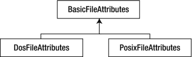

图 9-1.  BasicFileAttributes 的层次结构

正如你所见，`BasicFileAttributes` 接口定义了所有常见平台都支持的基本属性。然而，特定平台会定义自己的文件属性，这些属性由 `DosFileAttributes` 和 `PosixFileAttributes` 捕获。你可以指定这些接口中的任何一个来检索关联的文件属性。清单 9-8 包含一个使用 `BasicFileAttributes` 检索文件所有属性的程序。

清单 9-8.  FileAttributes2.java

```
import java.io.IOException;
import java.nio.file.*;
import java.nio.file.attribute.*;

class FileAttributes2 {
        public static void main(String[] args) {
                Path path = Paths.get(args[0]);
                try {
                        BasicFileAttributes fileAttributes = Files.readAttributes(path, BasicFileAttributes.class);
                        System.out.println("File size: " + fileAttributes.size());
                        System.out.println("isDirectory: " + fileAttributes.isDirectory());
                        System.out.println("isRegularFile: " + fileAttributes.isRegularFile());
                        System.out.println("isSymbolicLink: " + fileAttributes.isSymbolicLink());
                        System.out.println("File last accessed time: " + fileAttributes.lastAccessTime());
                        System.out.println("File last modified time: " + fileAttributes.lastModifiedTime());
                        System.out.println("File creation time: " + fileAttributes.creationTime());
                } catch (IOException e) {
                        e.printStackTrace();
                }
        }
}
```

以下是该程序的示例输出：

```
D:\>java FileAttributes2 FileAttributes2.java
File size: 904
isDirectory: false
isRegularFile: true
isSymbolicLink: false
File last accessed time: 2012-10-06T10:28:29.0625Z
File last modified time: 2012-10-06T10:28:22.4375Z
File creation time: 2012-10-06T10:26:39.1875Z
```

你使用 `readAttribute()` 方法配合 `BasicFileAttributes` 来检索基本的文件属性。类似地，你可以分别使用 `DosFileAttributes` 和 `PosixFileAttributes` 来检索 DOS 或 UNIX 环境中与文件关联的属性。

复制文件

现在让我们尝试将文件/目录从一个位置复制到另一个位置。这个任务很容易完成：只需调用 `Files.copy()` 即可将文件从源复制到目标。以下是该方法的签名：

```
Path copy(Path source, Path target, CopyOption. . . options)
```

清单 9-9 使用此方法编写了一个简单的文件复制程序。

清单 9-9.  FileCopy.java

```
import java.io.IOException;
import java.nio.file.*;


public class FileCopy {
        public static void main(String[] args) {
                if(args.length != 2){
                        System.out.println("usage: FileCopy <source-path> <destination-path>");
                        System.exit(1);
                }
                Path pathSource = Paths.get(args[0]);
                Path pathDestination = Paths.get(args[1]);
                try {
                        Files.copy(pathSource, pathDestination);
                        System.out.println("Source file copied successfully");
                } catch (IOException e) {
                        e.printStackTrace();
                }
        }
}
```

让我们执行它，看看是否有效。

```
D:\> java FileCopy FileCopy.java Backup.java
Source file copied successfully
```

是的，它有效。让我们尝试用相同的参数再次运行它。

```
D:\OCPJP7\programs\NIO2\src>java FileCopy FileCopy.java Backup.java
java.nio.file.FileAlreadyExistsException: Backup.java
        at sun.nio.fs.WindowsFileCopy.copy(Unknown Source)
        [. . .stack trace elided. . .]
```

哎呀！发生了什么？当你第二次尝试复制文件时，你得到了一个 `FileAlreadyExistsException`，因为目标文件已经存在。那么，如果你想覆盖现有文件怎么办？解决方案：你需要告诉 `copy()` 方法你想要覆盖现有文件。在清单 9-9 中，将 `copy()` 方法修改如下：

```
Files.copy(pathSource, pathDestination, StandardCopyOption.REPLACE_EXISTING);
```

在这个修改中，你`是`指定了一个额外的参数（因为 `copy()` 方法支持可变参数）来告诉该方法，如果文件已存在，你想要覆盖它。那么，让我们运行这个程序，看看它是否有效。

```
D:\>java FileCopy FileCopy.java Backup.java
Source file copied successfully

D:\>java FileCopy FileCopy.java Backup.java
Source file copied successfully
```

是的，它有效。现在，尝试将一个文件复制到一个新目录。

```
D:\OCPJP7\programs\NIO2\src>java FileCopy FileCopy.java bak\Backup.java
java.nio.file.NoSuchFileException: FileCopy.java -> bak\Backup.java
        [. . .stack trace elided . . .]
```

嗯，这里你试图将一个文件复制到不存在的备份目录。为此，你得到了 `NoSuchFileException`。请注意，要使 `copy()` 方法成功，不仅给定的目录，而且路径中的所有中间目录都必须存在。

|  | 指定路径中的所有目录（如果复制的是目录，则除最后一个目录外）都必须存在，以避免 `NoSuchFileException`。 |

如果你尝试复制一个目录呢？它会起作用，但请记住，它只会复制顶层目录，而不会复制该目录中包含的文件/子目录。

|  | 如果你使用 `copy()` 方法复制一个目录，它不会复制源目录中包含的文件/子目录；你需要显式地将它们复制到目标文件夹。 |

在本章后面，当你实现一个可以将目录及其包含的文件/子目录复制到另一个目录的复制程序时，你将再次讨论这个主题。

移动文件

移动文件与复制文件非常相似；为此，你可以使用 `Files.move()` 方法。该方法的签名是

```
Path move(Path source, Path target, CopyOption. . . options)
```

清单 9-10 包含一个使用此方法的小程序。

清单 9-10.  FileMove.java

```
import java.io.IOException;
import java.nio.file.*;

public class FileMove {
        public static void main(String[] args) {
                if(args.length != 2){
                        System.out.println("usage: FileMove <source-path> <destination-path>");
                        System.exit(−1);
                }
                Path pathSource = Paths.get(args[0]);
                Path pathDestination = Paths.get(args[1]);
                try {
                        Files.move(pathSource, pathDestination, StandardCopyOption.REPLACE_EXISTING);
                        System.out.println("Source file moved successfully");
                } catch (IOException e) {
                        e.printStackTrace();
                }
        }
}
```

这个基本实现工作正常。然而，以下是 `move()` 方法特有的一些注意事项：

*   与 `copy()` 方法一样，`move()` 方法也不会覆盖现有的目标文件，除非你使用 `REPLACE_EXISTING` 指定这样做。
*   如果你移动一个符号链接，移动的是链接本身，而不是链接的目标文件。需要注意的是，对于 `copy()` 方法，如果你指定一个符号链接，复制的是链接的目标，而不是链接本身。
*   如果移动目录不需要移动其包含的文件/子目录，则可以移动非空目录。例如，将一个目录从一个物理驱动器移动到另一个物理驱动器可能会失败（将抛出 `IOException`）。如果移动目录操作成功，那么所有包含的文件/子目录也将被移动。
*   你可以使用 `ATOMIC_MOVE` 复制选项将 `move()` 操作指定为原子操作。如果 `move()` 作为非原子操作执行并在中途失败，则两个文件的状态都是未知和未定义的。

删除文件

`Files` 类提供了一个 `delete()` 方法来删除文件/目录/符号链接。清单 9-11 包含一个删除指定文件的简单程序。

清单 9-11.  FileDelete.java

```
import java.io.IOException;
import java.nio.file.*;

public class FileDelete {
        public static void main(String[] args) {
                if(args.length != 1){
                System.out.println("usage: FileDelete <source-path>");
                        System.exit(1);
                }
                Path pathSource = Paths.get(args[0]);
                try {
                        Files.delete(pathSource);
                        System.out.println("File deleted successfully");
                } catch (IOException e) {
                        e.printStackTrace();
                }
        }
}
```

执行时会打印以下内容：

```
D:\> java FileDelete log.txt
File deleted successfully
```

使用 `Files.delete()` 方法时有几点需要记住。对于目录，`delete()` 方法应在空目录上调用；否则该方法将失败。对于符号链接，将删除链接，而不是链接的目标文件。你打算删除的文件必须存在；否则你将得到 `NoSuchFileException`。如果你想静默删除文件并且不想被此异常打扰，那么你可以使用 `deleteIfExists()` 方法，如果文件不存在，它不会报错，如果文件存在，则会删除它。

遍历文件树

在各种情况下，你需要遍历文件树。例如，当你想要搜索特定文件/目录时，你需要遍历文件树。另一个需要遍历文件树的例子是当你想要复制包含文件/子目录的整个目录时。

`Files` 类提供了两个让你遍历文件树的方法；这些方法的签名如下：

```
Path walkFileTree(Path start, FileVisitor<? super Path> visitor)


Path walkFileTree(Path start, Set<FileVisitOption> options, int maxDepth, FileVisitor<? super Path> visitor)
```

这两个方法都接受一个起始路径（文件树遍历将从该路径开始）和一个 `FileVisitor` 实例（该实例将控制在遍历文件树时执行的操作）。（我们稍后将详细讨论 `FileVisitor`。）此外，第二个方法还接受两个额外参数：文件访问选项和最大深度。最大深度参数指定了你希望访问的文件树的深度；值为 0 表示仅访问指定的文件，而值为 `MAX_VALUE` 则表示必须访问所有层级的目录。

请注意，你需要向 `walkFileTree()` 方法提供一个 `FileVisitor` 实例。`FileVisitor` 接口允许你在某些关键节点执行特定操作。例如，该接口提供了一个 `visitFile()` 方法，你可以实现该方法来精确指定当 `FileVisitor` 实例访问一个文件时需要执行的操作。同样，它还提供了另外三个有用的方法，你可以根据需求进行自定义：`preVisitDirectory()`、`postVisitDirectory()` 和 `visitFileFailed()`。表 9-3 提供了这些方法的简要总结。

表 9-3.  FileVisitor 接口支持的方法

| 方法 | 描述 |
| --- | --- |
| `FileVisitResult preVisitDirectory(T dir, BasicFileAttributes attrs)` | 在访问目录中的元素之前调用。 |
| `FileVisitResult visitFile(T file, BasicFileAttributes attrs)` | 在访问文件时调用。 |
| `FileVisitResult postVisitDirectory(T dir, IOException exc)` | 在访问完目录中的所有元素之后调用。 |
| `FileVisitResult visitFileFailed(T file, IOException exc)` | 在无法访问文件时调用。 |

你需要实现 `FileVisitor` 接口，以便创建实现类的实例并将其传递给 `walkFileTree()` 方法。但是，如果你不想实现 `FileVisitor` 接口中的所有四个方法，你可以简单地从 `SimpleFileVisitor` 类扩展你的实现。这样，你只需覆盖那些你想要自定义的方法即可。

清单 9-12 包含一个示例，以便你更清楚地理解这一点。假设你想从特定点打印文件树。

清单 9-12.  FileTreeWalk.java

```
import java.io.IOException;
import java.nio.file.*;
import java.nio.file.attribute.BasicFileAttributes;

class MyFileVisitor extends SimpleFileVisitor<Path> {
        public FileVisitResult visitFile(Path path, BasicFileAttributes fileAttributes){
                System.out.println("file name:" + path.getFileName());
                return FileVisitResult.CONTINUE;
        }
        public FileVisitResult preVisitDirectory(Path path, BasicFileAttributes fileAttributes){
                System.out.println("----------Directory name:" + path + "----------");
                return FileVisitResult.CONTINUE;
        }
}

public class FileTreeWalk {
        public static void main(String[] args) {
                if(args.length != 1) {
                        System.out.println("usage: FileWalkTree <source-path>");
                        System.exit(−1);
                }
                Path pathSource = Paths.get(args[0]);
                try {
                        Files.walkFileTree(pathSource, new MyFileVisitor());
                } catch (IOException e) {
                        e.printStackTrace();
                }
        }
}
```

我们先执行这个程序，然后理解它的工作原理。

```
D:\> java FileTreeWalk ch9-13
----------Directory name: ch9-13----------
file name:.classpath
file name:.project
----------Directory name: ch9-13\.settings----------
file name:org.eclipse.jdt.core.prefs
----------Directory name: ch9-13\bin----------
file name:FileTreeWalk.class
file name:MyFileVisitor.class
----------Directory name: ch9-13\bin\Test----------
file name:log.txt
----------Directory name: ch9-13\src----------
file name:FileTreeWalk.class
file name:FileTreeWalk.java
file name:MyFileVisitor.class
----------Directory name: ch9-13\src\Test----------
file name:log.txt
```

我们用一个目录执行了这个程序。它打印了给定输入目录中包含的所有文件和目录。现在，它的工作原理如下：

*   你定义了一个 `FileVisitor`，即 `MyFileVisitor`，在其中覆盖了 `SimpleFileVisitor` 类的两个方法：`visitFile()` 和 `preVisitDirectory()`。在这些方法中，你只是打印了文件/目录的名称（如果是目录，则连同路径一起打印）。
*   然后，你使用 `MyFileVisitor` 的一个实例调用了 `walkFileTree()`。
*   `walkFileTree()` 方法从指定的输入路径开始。当它访问一个文件时，会调用 `visitFile()` 方法；在开始访问目录中的元素之前，会调用 `preVisitDirectory()`；在完成访问目录中的所有元素之后，会立即调用 `postVisitDirectory()`；如果任何文件/目录无法访问，则会调用 `visitFileFailed()`。
*   在这里，由于你覆盖了两个方法，因此能够打印所访问文件的名称和目录的路径。
*   这里还需要注意的一点是 `FileVisitReturn` 值。你可以使用 `FileVisitReturn` 值来控制遍历的流程。有四种不同类型的返回值：

*   **CONTINUE**：表示应继续遍历文件树。
*   **TERMINATE**：表示应立即终止遍历文件树。
*   **SKIP_SUBTREE**：表示在遍历文件树时应跳过子树的其余部分。
*   **SKIP_SIBLINGS**：表示应停止遍历当前目录及其同级目录的文件树。如果从 `preVisitDirectory()` 返回此值，则不会访问包含的文件/目录，也不会调用 `postVisitDirectory()`。如果从 `visitFile()` 返回此值，则不会访问该目录中的其他文件。如果从 `postVisitDirectory()` 返回此值，则不会访问该目录的同级目录。

重新审视文件复制

你之前了解了如何将文件从一个位置复制到另一个位置。但是，你无法对整个目录（及其文件/子目录）执行复制操作。现在，你可以遍历文件树，这使得实现一个能够复制整个目录及其包含元素的复制程序变得更加容易。清单 9-13 展示了实现此功能的程序。

清单 9-13.  FileTreeWalkCopy.java

```
import java.io.IOException;
import java.nio.file.*;
import java.nio.file.attribute.*;

// 我们的文件访问者实现，执行复制操作
class MyFileCopyVisitor extends SimpleFileVisitor<Path> {
        private Path source, destination;


public MyFileCopyVisitor(Path s, Path d) {
                source = s;
                destination = d;
        }
        public FileVisitResult visitFile(Path path, BasicFileAttributes fileAttributes) {
                Path newd = destination.resolve(source.relativize(path));
                try {
                        Files.copy(path, newd, StandardCopyOption.REPLACE_EXISTING);
                } catch (IOException e) {
                        e.printStackTrace();
                }
                return FileVisitResult.CONTINUE;
        }
        public FileVisitResult preVisitDirectory(Path path, BasicFileAttributes fileAttributes) {
                Path newd = destination.resolve(source.relativize(path));
                try {
                        Files.copy(path, newd, StandardCopyOption.REPLACE_EXISTING);
                }catch (IOException e) {
                        e.printStackTrace();
                }
                return FileVisitResult.CONTINUE;
        }
}

public class FileTreeWalkCopy {
        public static void main(String[] args) {
                if(args.length != 2) {
                        System.out.println("用法: FileTreeWalkCopy <源路径> <目标路径>");
                        System.exit(1);
                }
                Path pathSource = Paths.get(args[0]);
                Path pathDestination = Paths.get(args[1]);
                try {
                        Files.walkFileTree(pathSource, new MyFileCopyVisitor(pathSource, pathDestination));
                        System.out.println("文件复制成功！");
                } catch (IOException e) {
                        e.printStackTrace();
                }
        }
}
```

让我们执行这个程序，看看它是否有效：

```
D:\> java FileTreeWalkCopy Test Test2
文件复制成功！
```

程序将 `Test` 目录及其包含的文件复制到了 `Test2` 目录。本质上，你所做的非常简单：在 `preVisitDirectory()` 方法中，你复制了正在访问的目录。为了获取新的目标路径，你使用了 `Path` 类的 `relativize()` 方法。类似地，每次访问文件时，你都会获取一个新的目标路径，用于将文件复制到目标目录。就是这样，完成了。

查找文件

一旦你理解了如何遍历文件树，查找所需文件就变得非常直接和简单。例如，如果你要查找特定的文件/目录，可以尝试在 `visitFile()` 或 `preVisitDirectory()` 方法中匹配你要查找的文件/目录名。但是，如果你要在文件树中查找所有匹配特定模式的文件（例如，所有 Java 源文件或 xml 文件），你可以使用 `glob` 或 `regex` 来匹配文件名。在这种情况下，`PathMatcher` 接口非常有用，因为一旦你指定了所需的模式，它就会为你匹配路径。`PathMatcher` 接口是为每个文件系统实现的，你可以通过 `FileSystem` 类的 `getPathMatcher()` 方法获取其实例。

在查看详细示例之前，我们先了解一下 `Glob` 模式。`Glob` 是一种模式指定机制，你可以将文件匹配模式指定为字符串。表 9-4 总结了 glob 语法支持的模式。

表 9-4.  Glob 语法支持的模式

| 模式 | 描述 |
| --- | --- |
| `*` | 匹配任意长度（包括零长度）的任意字符串。 |
| `**` | 类似于“*”，但可以跨越目录边界。 |
| `?` | 匹配任意单个字符。 |
| `[xyz]` | 匹配 x、y 或 z 中的任意一个。 |
| `[0–5]` | 匹配 0 到 5 范围内的任意字符。 |
| `[a–z]` | 匹配任意小写字母。 |
| `{xyz, abc}` | 匹配 xyz 或 abc 中的任意一个。 |

因此，你可以指定诸如 `File*.java` 这样的语法来匹配所有以 `"File"` 开头的 Java 源文件，或者使用诸如 `program[0–9].class` 这样的语法，它将匹配 `program0.class`、`program1.class` 等文件。

让我们尝试一个示例，它接受一个路径（起始路径）和一个模式（用于查找匹配的文件），然后打印出匹配指定模式的文件列表。该程序如清单 9-14 所示。

清单 9-14.  FileTreeWalkFind.java

```
import java.io.IOException;
import java.nio.file.*;
import java.nio.file.attribute.*;

class MyFileFindVisitor extends SimpleFileVisitor<Path> {
        private PathMatcher matcher;

public MyFileFindVisitor(String pattern){
                try {
                        matcher = FileSystems.getDefault().getPathMatcher(pattern);
                } catch(IllegalArgumentException iae) {
                        System.err.println("无效模式；你是否忘记添加前缀 \"glob:\"？（例如 glob:*.java）");
                        System.exit(−1);
                }

}
        public FileVisitResult visitFile(Path path, BasicFileAttributes fileAttributes){
                find(path);
                return FileVisitResult.CONTINUE;
        }
        private void find(Path path) {
                Path name = path.getFileName();
                if(matcher.matches(name))
                        System.out.println("匹配的文件:" + path.getFileName());
        }
public FileVisitResult preVisitDirectory(Path path, BasicFileAttributes fileAttributes){
                find(path);
                return FileVisitResult.CONTINUE;
        }
}

public class FileTreeWalkFind {
        public static void main(String[] args) {
                if(args.length != 2){
System.out.println("用法: FileTreeWalkFind <起始路径> <搜索模式>");
                        System.exit(−1);
                }
                Path startPath = Paths.get(args[0]);
                String pattern = args[1];
                try {
                        Files.walkFileTree(startPath, new MyFileFindVisitor(pattern));
                        System.out.println("文件搜索完成！");
                } catch (IOException e) {
                        e.printStackTrace();
                }
        }
}
```

我们先执行它，然后了解其工作原理。

```
d:\> java FileTreeWalkFind ch9-15 glob:File*.java
匹配的文件:FileTreeWalkFind.java
文件搜索完成！

d:\> java FileTreeWalkFind ch9-15 glob:File*
匹配的文件:FileTreeWalkFind.class
匹配的文件:FileTreeWalkFind.class
匹配的文件:FileTreeWalkFind.java
文件搜索完成！
```

其工作原理如下：

*   你定义了 `FileVisitor`，即 `MyFileFindVisitor`，它重写了两个方法：`visitFile()` 和 `preVisitDirectory()`。
*   在访问者类的构造函数中，你使用 `FileSystem` 实例获取了一个 `PathMatcher` 实例。
*   重写的方法调用了 `find()` 方法；该方法从传入的 `Path` 对象的文件名创建一个新的 `Path` 对象。这是必要的，因为你希望匹配器只匹配文件名，而不是整个路径。
*   你使用 `walkFileTree()` 方法开始遍历文件树；并将 `MyFileFindVisitor` 的一个实例指定为 `FileVisitor`。
*   如果当前访问的文件/目录匹配该模式，你就打印文件名。匹配指定模式的过程由 `PathMatcher` 实例执行。

监视目录变化


假设你已经实现了一个简单的 IDE 来编写 Java 程序。你在其中加载了一个 Java 源文件并正在编辑它。如果其他程序修改了你正在编辑的源文件，会发生什么？你可能想询问用户是否要重新加载该源文件。事实上，许多 IDE 和其他程序会向用户显示一条消息，并请求用户许可来重新加载文件（参见图 9-2）。然而，关键问题是：你如何得知正在编辑的文件被其他程序修改了？

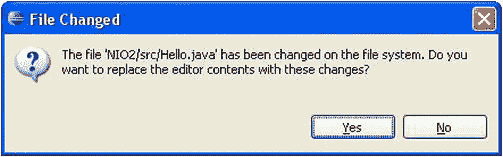

图 9-2.  Eclipse IDE 中显示的文件变更通知

Java 7 提供了一个目录监视服务，可以实现完全相同的效果。你可以使用此服务注册一个目录以接收变更事件通知，每当该目录发生任何变更（例如创建新文件、删除文件和修改文件）时，你都会收到关于该变更的事件通知。监视服务是一种便捷、可扩展且简单的方法，用于跟踪目录中的变更。

我们先来看清单 9-15 中的程序，然后再了解监视服务 API 的工作原理。假设你想监视当前项目的 `src` 目录。你只对文件修改事件感兴趣，这样该目录中任何文件的任何变更都会向你的程序发送事件通知。

清单 9-15.  KeepAnEye.java

```
import java.io.IOException;
import java.nio.file.*;

public class KeepAnEye {
        public static void main(String[] args) {
                Path path = Paths.get("..\\src");
                WatchService watchService = null;
                try {
                        watchService = path.getFileSystem().newWatchService();
                        path.register(watchService, StandardWatchEventKinds.ENTRY_MODIFY);
                } catch (IOException e1) {
                        e1.printStackTrace();
                }

//无限循环
                for(;;){
                        WatchKey key = null;
                        try {
                                key = watchService.take();
                        } catch (InterruptedException e) {
                                e.printStackTrace();
                        }
                        // 遍历每个事件
                        for(WatchEvent<?> event:key.pollEvents()){
                                switch(event.kind().name()){
                                case "OVERFLOW":
                                        System.out.println("我们丢失了一些事件");
                                        break;
                                case "ENTRY_MODIFY":
                                        System.out.println("文件 " + event.context() + " 已被修改！");
                                        break;
                                }
                        }
                        // 重置 key 对于接收后续通知非常重要
                        key.reset();
                }
        }
}
```

执行此程序，同时尝试修改 `src` 目录中的源文件和类文件。你可能会得到如下结果：

```
d:\workspace\ch9-16\src>java KeepAnEye
文件 KeepAnEye.java 已被修改！
文件 KeepAnEye.java 已被修改！
文件 KeepAnEye.java 已被修改！
文件 KeepAnEye.class 已被修改！
文件 KeepAnEye.class 已被修改！
```

嗯，这很棒——它按预期工作了。现在，让我们逐步理解这个程序：

*   你需要做的第一件事是获取一个 `WatchService` 实例。你可以使用 `FileSystem` 类获取监视服务实例。这里，你通过一个路径实例获取 `FileSystem` 实例，然后从 `FileSystem` 请求一个监视服务实例。你也可以从 `FileSystems`（`FileSystems.getDefault()`）获取 `FileSystem` 实例。
*   一旦有了监视服务实例，下一步就是将目录注册到监视服务。`Path` 对象提供了两种注册方法：第一种 `register()` 方法接受可变参数（首先是监视服务实例，然后是你感兴趣的事件类型）。第二种 `register()` 方法接受一个额外的参数——监视事件修饰符。这里，你使用的是第一种 `register()` 方法。
*   你只想在文件被修改时收到事件通知；因此你指定了 `ENTRY_MODIFY`（属于 `StandardWatchEventKinds`）。其他类型的事件包括 `ENTRY_CREATE`、`ENTRY_DELETE` 和 `OVERFLOW`。前三种类型不言自明；`OVERFLOW` 表示一些事件通知被丢弃或遗漏。可以根据需求指定这些事件类型。
*   注册完成后，你就可以接收事件通知了。你可以实现一个无限循环，在其中等待合适的事件发生。
*   在循环中，你需要等待事件发生。这里，你可以要求监视服务在事件发生时通知此程序。你可以使用三种方法来实现：

*   `poll()` 方法返回一个排队的 key（如果可用）；否则立即返回。
*   `poll(long, TimeUnit)` 方法返回一个排队的 key（如果可用）；否则等待指定的时间（long 值）和指定的时间单位。该方法在指定的时间限制过后返回。
*   `take()` 方法返回一个排队的 key（如果可用）；否则一直等待直到有 key 可用。

`poll()` 和 `take()` 方法的主要区别在于 `poll()` 是非阻塞调用，而 `take()` 是阻塞调用。

*   当返回一个 key 时，可能有一个或多个事件被排队；这就是为什么你要放入另一个 `for` 循环来遍历所有可用事件。
*   你可以使用 `kind()` 方法获取事件类型，使用 `context()` 方法获取发生事件的文件名。
*   事件处理完成后，你需要使用 key 上的 `reset()` 方法重置该 key。

要点记忆

以下是需要通过 OCPJP 考试本节内容所需理解的概念。


*   不要混淆 `File` 与 `Files`、`Path` 与 `Paths`、以及 `FileSystem` 与 `FileSystems`：它们各不相同。*File* 是一个旧类（Java 4），用于表示文件/目录路径名，而 *Files* 是在 Java 7 中引入的一个工具类，全面支持 I/O API。*Path* 接口表示文件/目录路径，并定义了一系列有用的方法。然而，*Paths* 类是一个工具类，仅提供两个方法（均用于获取 `the Path` 对象）。*FileSystems* 为 `FileSystem` 类提供了一系列工厂方法，而 *FileSystem* 则提供了一组有用的方法来获取文件系统的信息。
*   由 `Path` 对象表示的文件或目录可能不存在。
*   你已学习了如何对文件/目录执行复制操作。然而，你并非只能对两个文件/目录执行复制。你可以从 `InputStream` 获取输入并写入文件，或者从文件获取输入并复制到 `OutputStream`。此处可使用 `copy(InputStream, Path, CopyOptions. . .)` 和 `copy(Path, OutputStream, CopyOptions. . .)` 方法。
*   在遍历文件树时执行操作必须小心。例如，如果你正在执行递归删除，应先删除所有包含的文件，然后再删除包含这些文件的目录。
*   `Visitor` 设计模式用于实现对文件树的遍历。
*   在监视服务的上下文中，每个监视键都关联一个状态。监视键可能处于 `ready` 状态（准备接收事件）、`signed` 状态（当一个或多个事件排队时）或 `invalid` 状态（当监视键无效时）。如果键处于 `signed` 状态，则需要调用 `reset()` 方法；否则键的状态不会变为 `ready` 状态，你将无法收到任何进一步的事件通知。
*   即使你的程序未注册此事件，它也可能收到 `OVERFLOW` 事件。
*   如果你使用 Java 7 提供的监视服务监视一个目录，那么只会监视该目录中包含的文件，而不会监视该目录子目录中的文件。如果你打算监视文件系统的整个子树，则需要递归地注册子树中的每个目录。

问题时间！

1.  考虑以下程序：

```
    import java.nio.file.*;
    public class PathInfo {
         public static void main(String[] args) {
                 Path aFilePath = Paths.get("D:\\dir\\file.txt");        // FILEPATH

while(aFilePath.iterator().hasNext()) {
                         System.out.println("path element: " + aFilePath.iterator().next());
                 }
         }
    }
    ```

假设文件 `D:\dir\file.txt` 存在于底层文件系统中。以下哪个选项正确描述了此程序的行为？

*   A)  程序在标记有注释 `FILEPATH` 的行出现编译器错误，因为未处理受检异常 `FileNotFoundException`。
    *   B)  程序在标记有注释 `FILEPATH` 的行出现编译器错误，因为未处理受检异常 `InvalidPathException`。
    *   C)  程序进入无限循环，永远打印 “path element: dir”。
    *   D)  程序打印以下内容：
    *   path element: dir
    *   path element: file.txt

**答案：** C) 程序进入无限循环，永远打印 “path element: dir”。

（在 `while` 循环中，你使用 `iterator()` 获取一个临时迭代器对象。因此，对临时变量调用 `next()` 的结果丢失了，导致 `while` 循环进入无限循环。换句话说，以下循环将在打印路径的 “dir” 和 “file.txt” 部分后终止：

```
    Iterator<Path> paths = aFilePath.iterator();
    while(paths.hasNext()) {
         System.out.println("path element: " + paths.next());
    }
    ```

选项 A) 错误，因为 `Paths.get` 方法不会抛出 `FileNotFoundException`。

选项 B) 错误，因为 `InvalidPathException` 是一个 `RuntimeException`。此外，由于文件路径存在于底层文件系统中，程序执行时不会抛出此异常。

选项 D) 错误，因为程序将进入无限循环）。

2.  关于 `SimpleFileVisitor` 接口，以下哪 **两个** 语句是正确的？

*   A)  `SimpleFileVisitor` 中声明的 `postVisitDirectory` 方法将在目录的所有条目（即文件和子目录）被访问后调用。
    *   B)  `SimpleFileVisitor` 中声明的 `visitFile` 方法将在访问文件时调用。
    *   C)  `SimpleFileVisitor` 中声明的 `visitFileOrDirectory` 方法将在访问文件或子目录时调用。
    *   D)  `SimpleFileVisitor` 中声明的 `walkFileTree` 方法将遍历文件树。

**答案：** A) 和 B) 是正确的陈述。

（关于选项 C)，`SimpleFileVisitor` 接口中没有名为 `visitFileOrDirectory` 的方法。关于选项 D)，`walkFileTree` 方法是定义在 `Files` 类中的一个静态方法，用于遍历文件树。`walkFileTree` 方法并未在 `SimpleFileVisitor` 中声明。实际上，`FileVisitor` 是该方法的参数之一，你可以将 `SimpleFileVisitor` 对象作为参数传递）。

3.  考虑以下程序：

```
    import java.nio.file.*;

class Relativize {
         public static void main(String []args) {
                 Path javaPath = Paths.get("D:\\OCPJP7\\programs\\NIO2\\src\\Relativize.java").normalize();
                 Path classPath =
    Paths.get("D:\\OCPJP7\\programs\\NIO2\\src\\Relativize.class").normalize();
                 Path result = javaPath.relativize(classPath);
                 if(result == null) {
                         System.out.println("relativize failed");
                 } else if(result.equals(Paths.get(""))) {
                         System.out.println("relative paths are same, so relativize returned empty path");
                 } else {
                         System.out.println(result);
                 }
         }
    }
    ```

以下哪个选项正确显示了此程序的输出？

*   A)  程序打印：relativize failed。
    *   B)  程序打印：relative paths are same, so relativize returned empty path。
    *   C)  程序打印：..\Relativize.class。
    *   D)  程序打印：..\Relativize.java。

**答案：** C) 程序打印：..\Relativize.class。

（`relativize()` 方法构造此路径与给定路径之间的相对路径。在此例中，两个文件的路径相同，仅文件名不同（`Relativize.java` 和 `Relativize.class`）。路径的相对比较是从调用 relativize 方法的路径到传入的路径进行的，因此它打印 ..\Relativize.class。

*注意：* `normalize()` 方法会移除路径中任何冗余的名称元素。在此程序中，没有冗余的名称元素，因此它对程序的输出没有影响）。

4.  考虑以下程序：

```
    import java.nio.file.*;

class SubPath {
         public static void main(String []args) {
    Path aPath = Paths.get("D:\\OCPJP7\\programs\\..\\NIO2\\src\\.\\SubPath.java");
                 aPath = aPath.normalize();
                 System.out.println(aPath.subpath(2, 3));
         }
    }
    ```

此程序打印以下内容：

*   A)  ..
    *   B)  src
    *   C)  NIO2
    *   D)  NIO2\src
    *   E)  ..\NIO2

**答案：** B) src

（`normalize()` 方法会移除给定路径中的冗余名称元素，因此在调用 `normalize()` 方法后，`aPath` 的值为 `D:\OCPJP7\NIO2\src\SubPath.java`。


`subpath(int beginIndex, int endIndex)` 方法根据 `beginIndex` 和 `endIndex` 的值返回一个路径。最接近根目录的名称索引为 0；请注意，根目录本身（本例中为 `D:\`）不被视为路径中的元素。因此，名称元素 “OCPJP7”、“NIO2”、“src”、“SubPath.java” 的索引位置分别为 0、1、2 和 3。

请注意，`beginIndex` 是第一个元素的索引（包含该元素）；`endIndex` 是最后一个元素的索引（不包含该元素）。因此，子路径是 “sub”，它在此路径中的索引位置为 2。

5.  假设变量 `path` 指向一个有效的 `Path` 对象，以下哪条语句是创建 `WatchService` 的正确方式？

*   A)  `WatchService watchService = WatchService.getInstance(path);`
    *   B)  `WatchService watchService = FileSystem.newWatchService();`
    *   C)  `WatchService watchService = path.getFileSystem().newWatchService();`
    *   D)  `WatchService watchService = FileSystem("default").getWatchService(path);`

**答案：** C) `WatchService watchService = path.getFileSystem().newWatchService();`

（`newWatchService()` 方法是在 `FileSystem` 类中定义的抽象方法。要获取与给定 `path` 对象关联的 `WatchService` 实例，您需要先获取关联的 `FileSystem` 对象，然后在该 `FileSystem` 对象上调用 `newWatchService()` 方法。因此，选项 C) 是正确的答案。）

总结

**使用 Path 类**

*   `Path` 对象是一种编程抽象，用于表示文件/目录的路径。
*   您可以使用 `Paths` 类的 `get()` 方法获取 `Path` 实例。
*   `Path` 提供了两种方法来比较 `Path` 对象：`equals()` 和 `compareTo()`。即使两个 `Path` 对象指向同一个文件/目录，也不能保证 `equals()` 方法返回 true。

**对文件/目录执行操作**

*   您可以使用 `Files` 类的 `exists()` 方法检查文件是否存在。
*   `Files` 类提供了 `isReadable()`、`isWriteable()` 和 `isExecutable()` 方法，用于以编程方式检查程序的读取、写入或执行能力。
*   您可以使用 `getAttributes()` 方法检索文件的属性。
*   您可以使用 `Files` 类的 `readAttributes()` 方法批量读取文件的属性。
*   `copy()` 方法可用于将文件从一个位置复制到另一个位置。类似地，`move()` 方法可用于将文件从一个位置移动到另一个位置。
*   复制时，指定路径中的所有目录（如果要复制目录，则除最后一个目录外）都必须存在，以避免出现 `NoSuchFileException`。
*   使用 `delete()` 方法删除文件；使用 `deleteIfExists()` 方法仅在文件存在时删除它。

**遍历文件树**

*   `Files` 类提供了两种 `walkFileTree()` 方法，使您能够遍历文件系统。
*   `FileVisitor` 接口允许您在特定的关键节点执行某些操作。
*   如果您不想实现 `FileVisitor` 接口中的所有四个方法，您可以简单地从 `SimpleFileVisitor` 类扩展您的实现。

**查找文件**

*   当您想要查找满足特定模式的文件时，`PathMatcher` 接口非常有用。您可以使用 `glob` 或 `regex` 指定模式。

**监视目录更改**

*   Java 7 提供了一个目录监视服务，当您正在处理的文件被其他程序更改时，它可以通知您。
*   您可以使用监视服务以及特定的事件类型注册一个 `Path` 对象。每当指定目录中的任何文件发生更改时，就会向注册的程序发送一个事件。

第 10 章


使用 JDBC 构建数据库应用程序

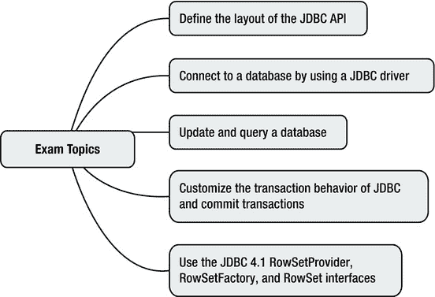

JDBC（Java 数据库连接）是一个重要的 Java API，它定义了客户端如何访问数据库。因此，它在构建大规模企业级 Java 解决方案中至关重要。作为 Oracle 认证程序员，您需要理解 JDBC 及其相关特性。您可以使用 JDBC 执行数据库操作，例如插入、更新和创建数据库实体，以及执行 SQL 查询。使用 JDBC 支持，您还可以在数据库上执行事务。

本章从 `ResultSet`、`Connection` 和 `Statement` 实现的角度讨论 JDBC 特性。JDBC 4.1 引入了 `RowSet` 及其相关的实用程序类，例如 `RowSetFactory` 和 `RowSetProvider`，本章也将讨论这些内容。

JDBC 类是 `java.sql.*` 和 `javax.sql.*` 包的一部分。在本章中，我们假设您已经熟悉 SQL 查询，并对数据库概念有基本的了解。

JDBC 简介

当您编写解决实际问题的应用程序时，经常会遇到需要存储、导航和修改数据的需求。在企业环境中，您需要与 DBMS（数据库管理系统）协作来处理大量数据。然而，与 DBMS（此后，我们简称为*数据库*）交互并非易事或直截了当。当今有许多企业级和开源数据库系统可用，它们彼此不同：DB2、SQL Server、MySQL、Oracle 等等。流行数据库的这种异构性使得编写可用于任何数据库的代码变得困难。为了解决这些问题并让您的工作更轻松，Java 提供了 JDBC。JDBC 是 Java 提供的一组 API，用于以编程方式与各种数据库交互。

从高层次来看，与数据库交互涉及以下步骤：

*   建立与数据库的连接。
*   执行 SQL 查询以检索、创建或修改数据库。
*   关闭与数据库的连接。

Java 提供了一组 API（即 JDBC）来执行这些与数据库相关的活动。换句话说，您可以使用 JDBC 建立与数据库的连接，执行 SQL 查询，并关闭与数据库的连接。JDBC 的美妙之处在于您不是为特定的数据库编写程序。JDBC 在您的 Java 程序和所使用的数据库类型之间创建了松散耦合。例如，数据库在建立连接的方式上可能不同（例如，API 名称可能因数据库而异）。JDBC 隐藏了所有这些数据库的异构性，并提供了一组统一的 API 来与所有类型的数据库交互。

JDBC 的架构

让我们检查一下 JDBC 的关键组件，以及这些组件如何协同工作以实现与数据库的无缝集成。JDBC 的简化架构如图 10-1 所示。Java 应用程序使用 JDBC API 与数据库交互。JDBC API 与 JDBC 驱动程序管理器交互，以透明地连接并针对不同类型的数据库执行各种数据库活动。JDBC 驱动程序管理器使用各种 JDBC 驱动程序连接到它们特定的 DBMS。

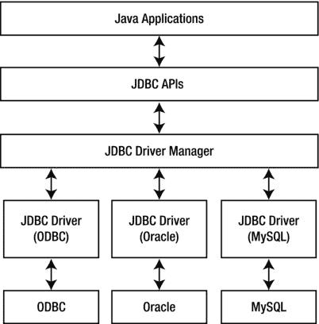

图 10-1.  JDBC 架构

在此上下文中，JDBC 驱动程序和驱动程序管理器在实现 JDBC 的目标方面起着关键作用。JDBC 驱动程序是专门为与其各自的 DBMS 交互而设计的。驱动程序管理器充当 JDBC 驱动程序的目录——换句话说，它维护可用数据源及其驱动程序的列表。驱动程序管理器选择合适的驱动程序来与相应的 DBMS 通信。它可以管理多个同时连接到各自数据源的驱动程序。


您可以在此观察到，异构交互的复杂性被委托给了 JDBC 驱动程序管理器和 JDBC 驱动程序；因此，所有细节和复杂性都被 JDBC API 对应用程序开发者隐藏了。

两层与三层 JDBC 架构

广义上讲，JDBC 架构主要分为两种配置：两层架构和三层架构。在两层配置中，一个 Java 应用程序连同 JDBC 驱动程序作为客户端构成第一层。另一方面，数据库作为服务器，负责满足客户端发送的需求。通常，数据库位于通过网络连接的不同机器上。

三层配置中的第一层是一个轻量级 Java 应用程序（例如，一个小程序），它与应用服务器（第二层）通信。应用服务器再将请求转发给数据库（第三层）。在此配置中，中间层扮演着至关重要的角色，因为可以根据需求（例如，强制执行访问控制）对配置的行为进行微调。

JDBC 驱动程序的类型

业界已经出现了多种类型的 JDBC 驱动程序，并根据偏好和需求被广泛使用。它们可以根据用于与实际相应 DBMS 通信的技术进行分类。在为 Java 应用程序选择合适的 DBMS 时，这些驱动程序的类型可能起着关键作用。JDBC 驱动程序共有四种类型：

*   **JDBC-ODBC 桥接驱动程序（类型 1）：** 您可能已经了解 ODBC（开放数据库连接），这是一个用 C 语言编写的、用于访问数据库的可移植中间件 API。第一类驱动程序旨在与 ODBC 驱动程序协同工作；它们扮演着从 Java 应用程序到 ODBC 驱动程序的桥梁角色。这类驱动程序在 DBMS 的 ODBC 驱动程序可用时尤其有用。JDBC 驱动程序使用 Java 本地接口（JNI）调用 ODBC 本地调用。此类驱动程序可能不适合小程序，因为此桥接器通常需要客户端软件和 ODBC 驱动程序才能正常工作。
*   **本地 API 驱动程序（类型 2）：** 属于此类的数据库驱动程序使用特定数据库的客户端库，并将 JDBC 调用转换为本地数据库调用。大多数情况下，这些驱动程序并非完全用 Java 编写，因此不可移植。这些驱动程序不适合 Java 小程序，因为它们需要在客户端机器上安装专有客户端软件。但是，这些驱动程序通常比类型 1 的驱动程序更快。
*   **网络协议驱动程序（类型 3）：** 这种类型的数据库驱动程序实现了三层架构，其中 JDBC 调用通过中间件实现转换为本地数据库调用。换句话说，驱动程序调用数据库中间件，而中间件实际上将 JDBC 调用转换为特定于数据库的本地调用。通常，该驱动程序是用 Java 实现的，不需要在客户端进行任何其他客户端实现；因此，它们可以用于基于 Internet 的应用程序。但是，这些驱动程序通常比类型 2 的驱动程序慢。
*   **本地协议驱动程序（类型 4）：** 此类驱动程序完全用 Java 实现，因此它们是平台无关的。属于此类的驱动程序直接通过网络进行特定于数据库的调用，无需任何额外的客户端库支持。这些驱动程序是所有其他数据库类型中最灵活的数据库驱动程序。这些驱动程序的性能优于其他类型的驱动程序。但是，这些驱动程序可能在覆盖数据库访问的安全性方面有所欠缺。

对于企业级应用程序，您需要根据需求选择合适的驱动程序。

设置数据库

在您开始通过示例探索 JDBC API 及其用法之前，首先必须配置一个您将使用的数据库。在开始编写 JDBC 程序之前，需要正确配置数据库。您可以使用任何广泛使用的数据库。在本章中，我们将使用 MySQL 来解释 JDBC API 的各个方面，因为这个数据库是免费的且广泛可用。因此，我们将展示在您的机器上设置 MySQL 数据库的步骤，假设您使用的是 Windows（如果您使用的是其他操作系统，这些步骤会略有不同）：

*   第一步是为您的平台下载合适的安装程序。对于 MySQL 数据库，您可以从 MySQL 下载页面（`www.mysql.com/downloads/mysql/`）下载最新的安装程序。
*   下载安装程序后，下一步是安装它。您必须拥有机器的管理员权限才能安装该软件。您需要运行安装程序，并按照安装向导显示的所有步骤进行操作。保留默认值并完成安装。安装程序会要求您提供 root 密码；请记住它，因为它将在这些示例中使用。
*   下一步是下载数据库连接器。只有数据库连接器才能让您连接到数据库。您可以从其连接器下载页面（`http://dev.mysql.com/downloads/connector/j/`）下载 MySQL 的连接器。
*   不要忘记将连接器的路径添加到类路径中。如果连接器名称是 `mysql-connector-java-5.1.21-bin.jar`，存储在 `C:\mysql-connector-java-5.1.21` 中，则将 `c:\ mysql-connector-java-5.1.21\mysql-connector-java-5.1.21-bin.jar` 添加到类路径。
*   调用 MySQL 的命令行客户端（在我们的例子中，是开始菜单中显示的“MySQL 5.5 Command Line Client”）。一旦您提供了 root 密码，您将看到一个 MySQL 提示符，如下所示：

```
Enter password: ********
Welcome to the MySQL monitor. Commands end with ; or \g.
Your MySQL connection id is 1
Server version: 5.5.27 MySQL Community Server (GPL)

Copyright (c) 2000, 2011, Oracle and/or its affiliates. All rights reserved.

Oracle is a registered trademark of Oracle Corporation and/or its affiliates. Other names may be trademarks of their respective owners.

Type 'help;' or '\h' for help. Type '\c' to clear the current input statement.

mysql> /* 让我们创建一个供我们使用的数据库。*/

mysql> create database addressBook;
Query OK, 1 row affected (0.01 sec)

mysql> /* 现在，让我们在这个数据库中创建一个表，并插入两条记录供以后使用。 */

mysql> use addressBook;
Database changed

mysql> create table contact (id int not null auto_increment, firstName varchar(30) Not null, lastName varchar(30), email varchar(30), phoneNo varchar(13), primary key (id));
Query OK, 0 rows affected (0.20 sec)

mysql> insert into contact values (default, 'Michael', 'Taylor', 'michael@abc.com', '+919876543210');
Query OK, 1 row affected (0.10 sec)

mysql> insert into contact values (default, 'William', 'Becker', 'william@abc.com', '+449876543210');
Query OK, 1 row affected (0.03 sec)

mysql> /* 就这样。我们的数据库现在可以使用了。*/
```

使用 JDBC 驱动程序连接到数据库

在本节中，我们将讨论如何使用 JDBC 驱动程序以编程方式连接到数据库。在此之前，我们将简要介绍 `Connection` 接口。

Connection 接口

`java.sql` 包的 `Connection` 接口表示从应用程序到数据库的连接。它是您的应用程序和数据库进行通信的通道。表 10-1 列出了 `Connection` 接口中的重要方法。所有这些方法都会抛出 `SQLExceptions`，因此我们不会在表中再次提及。我们在表 10-3 中列出了 `Connection` 接口中与事务相关的方法。

表 10-1. Connection 接口中的重要方法


| 方法 | 描述 |
| --- | --- |
| `Statement createStatement()` | 创建一个 `Statement` 对象，用于向数据库发送 SQL 语句。 |
| `PreparedStatement prepareStatement(String sql)` | 创建一个 `PreparedStatement` 对象，该对象可包含 SQL 语句。SQL 语句可以包含 IN 参数；这些参数可能包含 ‘?’ 符号，用作稍后传递实际值的占位符。 |
| `CallableStatement prepareCall(String sql)` | 创建一个 `CallableStatement` 对象，用于调用数据库中的存储过程。SQL 语句可以包含 IN 或 OUT 参数；这些参数可能包含 ‘?’ 符号，用作稍后传递实际值的占位符。 |
| `DatabaseMetaData getMetaData()` | 获取 `DataBaseMetaData` 对象。此元数据包含有用的信息，例如数据库模式信息、表信息等，当您不了解底层数据库时尤其有用。 |
| `Clob createClob()` | 返回一个 `Clob` 对象（`Clob` 是接口的名称）。CLOB（字符大对象）是 SQL 中的内置类型；可用于存储数据库表行中的列值。 |
| `Blob createBlob()` | 返回一个 `Blob` 对象（`Blob` 是接口的名称）。BLOB（二进制大对象）是 SQL 中的内置类型；可用于存储数据库表行中的列值。 |
| `void setSchema(String schema)` | 传入模式名称时，将此 `Connection` 对象设置为要访问的数据库模式。 |
| `String getSchema()` | 返回与此 `Connection` 对象关联的数据库的模式名称；如果没有关联模式，则返回 `null`。 |

连接到数据库

与数据库通信的第一步是在应用程序和数据库服务器之间建立连接。清单 10-1 展示了一个获取连接的简单应用程序。

清单 10-1.  DbConnect.java

```
import java.sql.*;

// 该类尝试获取与数据库的连接
class DbConnect {
        public static void main(String[] args) {
                // url 指向 jdbc 协议 : mysql 子协议；localhost 是安装了 DBMS 的服务器地址（即本地机器）
                // 3306 是我们需要联系 DBMS 的端口
                String url = "jdbc:mysql://localhost:3306/";
                // 我们连接到之前创建的 addressBook 数据库
                String database = "addressBook";
                // 我们以 "root" 用户身份登录，密码为 "mysql123"
                String userName = "root";
                String password = "mysql123";
                try (Connection connection = DriverManager.getConnection
                        (url + database, userName, password)){
                        System.out.println("数据库连接：成功");
                } catch (Exception e) {
                        System.out.println("数据库连接：失败");
                        e.printStackTrace();
                }
        }
}
```

让我们逐步分析该程序：

1.  URL `jdbc:mysql://localhost:3306/` 表示 `jdbc` 是协议，`mysql` 是子协议；`localhost` 是安装了 DBMS 的服务器地址（即本地机器），`3306` 是我们需要联系 DBMS 的端口。（请注意，当您使用其他数据库时，此端口号会不同。实际上，我们使用了 MySQL 数据库提供的默认端口号，如有需要可以更改。此外，如果您使用其他数据库，子协议也会更改。）您需要使用 `root` 凭据访问 `addressBook` 数据库。
2.  您可以通过调用 `DriverManager.getConnection()` 方法获取连接对象；该方法需要数据库的 URL 以及数据库名称、用户名和密码。
3.  您需要在程序退出前关闭连接。此示例使用了 try-with-resources 语句；因此 `connection` 的 `close()` 方法将被自动调用。
4.  如果出现任何问题，您将收到异常。在这种情况下，它将打印异常的堆栈跟踪。

好了，现在运行这个程序。以下是输出结果：

```
数据库连接：失败
java.sql.SQLException: 未找到适用于 jdbc:mysql://localhost:3306/addressBook 的合适驱动程序
        at java.sql.DriverManager.getConnection(DriverManager.java:604)
        at java.sql.DriverManager.getConnection(DriverManager.java:221)
        at DbConnect.main(DbConnect.java:16)
```

哎呀！发生了什么？为什么会出现这个 `SQLException`？嗯，忘记将 jar 包的路径添加到 classpath 环境变量中是一个常见错误。在这种情况下，JDBC API 将无法定位 JDBC 驱动程序，因此会抛出此异常。请记住，仅输入 jar 包的路径是不够的；您需要将 jar 包名称及其完整路径都添加到 classpath 变量中。

|  | 您需要提供 JDBC 驱动程序 jar 文件的完整路径，以避免出现“未找到合适的驱动程序”异常。实际上，仅输入 jar 包的路径是不够的；您需要将 jar 包名称及其完整路径都添加到 classpath 变量中。 |

好了，让我们更新 classpath 变量，然后重试。如果您再次尝试相同的程序，可能会遇到另一个异常：

```
数据库连接：失败
java.sql.SQLException: 用户 'root'@'localhost' 访问被拒绝（使用密码：YES）
    at com.mysql.jdbc.SQLError.createSQLException(SQLError.java:1074)
    [. . . 其余堆栈跟踪已省略 . . .]
```

在此程序中，我们提供了用户名“root”和密码“mysql123”。如果您将 root 用户密码设置为其他值，您将收到此异常，并显示消息“用户访问被拒绝”。有两种方法可以解决此问题。第一种方法是修改程序，使用您自己的密码替换我们在此程序中使用的“mysql123”。第二种方法是在数据库中重置密码。对于 MySQL，您可以按如下方式为用户“root”重置密码：

```
UPDATE mysql.user SET Password=PASSWORD('mysql123') WHERE User='root';
FLUSH PRIVILEGES;
```

如果此程序成功运行，输出结果如下：

```
数据库连接：成功
```

当您看到此输出时，表示您已成功与数据库建立连接。如果您想尝试本章其余部分的程序，您应该让此程序在您的系统上运行起来；您需要建立连接才能查询或更新数据库。

|  | 您已经看到了两个从 JDBC API 抛出的 `SQLException` 示例。当您遇到 `SQLException` 时，在程序中几乎无法采取任何措施来恢复。在真实世界的应用程序中，您可以做的是将其包装为更高级别的异常，并重新抛出给调用组件。为了节省代码段中的空间，在本章的程序中，我们将只打印异常的堆栈跟踪并忽略它。 |


清单 10-1 包含以下用于获取连接的代码（位于 try-with-resources 语句中），其中无需显式加载 JDBC 驱动：

```
Connection connection = DriverManager.getConnection(url + database, userName, password);
```

在 JDBC 4.0 之前，你必须使用 `Class.forName()` 语句显式加载 JDBC 驱动，如下所示：

```
Class.forName("com.mysql.jdbc.Driver").newInstance();
Connection connection = DriverManager.getConnection(url + database, userName, password);
```

换句话说，在 JDBC 4.0 及更高版本中，无需显式加载驱动，因为当你调用 `getConnection()` 时，JDBC API 会自动加载驱动。这段代码是*向后兼容*的——这意味着，即使在 JDBC 4.0 或更高版本的代码中提供了 `显式的 Class.forName()` 调用，该语句也会被忽略，而你的代码仍能像以前一样工作。

查询和更新数据库

一旦建立了与目标数据库的连接，你就可以执行实际任务——查询或更新数据库。你可以使用 SELECT SQL 语句执行查询，使用 INSERT、UPDATE 或 DELETE SQL 语句之一执行更新。JDBC 提供了两个重要的接口来支持查询：`Statement` 和 `Resultset`。我们将在接下来的两个小节中简要讨论这些接口。

Statement

顾名思义，`Statement` 是一个 SQL 语句，可用于向已连接的数据库发送 SQL 语句并从数据库接收结果。你可以使用 `Statement` 构建 SQL 查询，并使用 `Statement`（或其派生接口之一）中提供的 API 执行它。`Statement` 有三种形式：`Statement`、`PreparedStatement` 和 `CallableStatement`，它们的继承层次结构如图 10-2 所示。

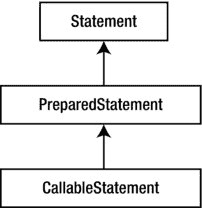

图 10-2.  Statement 接口及其子接口

在特定情况下，如何从这三种 `Statement` 接口中进行选择？这些不同形式的 `Statement` 之间有什么区别？以下是关于这些 `Statement` 的更多信息：

*   **Statement：** 当你需要向数据库发送不带任何参数的 SQL 语句时，需要使用 `Statement`。在一般情况下，你只需要使用此接口。你可以使用 `Connection` 接口中的 `createStatement()` 方法创建 `Statement` 实例。
*   **PreparedStatement：** `PreparedStatement` 代表一个*预编译的 SQL 语句*，可以使用 IN 参数进行定制。通常，它比 `Statement` 对象更高效；因此，它用于提高性能，特别是当 SQL 语句被多次执行时。你可以通过调用 `Connection` 接口中的 `preparedStatement()` 方法来获取 `PreparedStatement` 实例。
*   **CallableStatement：** `CallableStatement` 用于执行*存储过程*。`CallableStatement` 实例可以处理 IN 以及 OUT 和 INOUT 参数。你需要调用 `Connection` 接口中的 `prepareCall()` 方法来获取此类的实例。

一旦创建了合适的 `Statement` 对象，你就可以使用该 `Statement` 对象执行 SQL 语句了。`Statement` 接口提供了三种执行方法：`executeQuery()`、`executeUpdate()` 和 `execute()`。你可以使用其中一种执行方法来执行你的 SQL 语句。如果你的 SQL 语句是 `SELECT` 查询，你可以使用 `executeQuery()` 方法，该方法返回一个 `ResultSet`（在下一节中定义）。当你想要使用 `INSERT`、`UPDATE` 或 `DELETE` 语句之一更新数据库时，应使用 `executeUpdate()` 方法，该方法返回一个反映更新行数的整数。如果你不知道 SQL 语句的类型，可以使用 `execute()` 方法，该方法可能返回多个结果集、多个更新计数或两者的组合。

|  | 根据 SQL 语句的类型选择合适的执行方法。请记住，每个执行方法返回不同的输出。方法 `executeQuery()` 返回一个结果集，`executeUpdate()` 返回一个更新计数，而 `execute()` 方法可能返回多个结果集、多个更新计数或两者的组合。 |

ResultSet

关系数据库包含表。每个表都有一组属性（由表建模的对象的属性），这些属性由列表示；行是包含这些属性值的记录。当你查询数据库时，会得到表格形式的数据：一定数量的行，包含查询请求的列。这种表格数据被称为 `ResultSet`。总之，`ResultSet` 是一个包含查询请求的列标题和相关值的表。

`ResultSet` 维护一个指向当前行的*游标*。一次只能读取一行，因此必须更改游标的位置才能读取/遍历整个 `ResultSet`。*最初，游标设置在第一行之前。* 你需要在 `ResultSet` 上调用 `next()` 方法，将游标位置向前移动一行。此方法返回一个 `boolean` 值；因此，你可以在 `while` 循环中使用它来迭代整个 `ResultSet`。表 10-2 显示了 `ResultSet` 支持的其他用于移动游标的方法。

表 10-2.  ResultSet 中用于移动游标的有用方法

| 方法 | 描述 |
| --- | --- |
| `void beforeFirst()` | 将游标设置在 `ResultSet` 的第一行之前。 |
| `void afterLast()` | 将游标设置在 `ResultSet` 的最后一行之后。 |
| `boolean absolute(int rowNumber)` | 将游标绝对地设置到请求的行号。 |
| `boolean relative(int rowNumber)` | 将游标相对地设置到请求的行号。 |
| `boolean next()` | 将游标设置到 `ResultSet` 的下一行。 |
| `boolean previous()` | 将游标设置到 `ResultSet` 的上一行。 |

`ResultSet` 还提供了一组方法，用于读取当前行中所需列的值。通常，这些方法有两种形式：第一种形式以列号作为输入，第二种形式以列名作为输入。例如，读取 double 值的方法是 `double getDouble(int columnNumber)` 和 `double getDouble(String columnName)`。类似地，`ResultSet` 为所有基本类型提供了 `get()` 方法。

同样，`ResultSet` 提供了一组方法，用于更新选定行中所需列的值。这些方法也有两种变体：`void updateXXX(int columnNumber, XXX x)` 和 `void updateXXX(String columnName, XXX x)`，其中 update 方法针对表示为 XXX 的各种数据类型定义。

查询数据库


现在你已经了解了在数据库上执行简单 SQL 查询所需的所有必要接口：`Connection`、`Statement` 和 `ResultSet`。接下来，让我们查询一个数据库并打印输出。回想一下，你已经创建了一个名为 `addressBook` 的数据库，并在其中创建了一个名为 `contact` 的表，且向表中插入了两行数据。假设你想打印表的内容；代码清单 10-2 和 10-3 包含了实现此功能的程序。

代码清单 10-2.  DbConnector.java

```
import java.sql.*;

// 工具类，包含 connectToDb() 方法，本章其他程序将使用该方法
public class DbConnector {
        public static Connection connectToDb() throws SQLException {
                String url = "jdbc:mysql://localhost:3306/";
                String database = "addressBook";
                String userName = "root";
                String password = "mysql123";
                return DriverManager.getConnection(url + database, userName, password);
        }
}
```

代码清单 10-3.  DbQuery.java

```
import java.sql.*;

// 程序演示如何查询数据库
class DbQuery {
        public static void main(String[] args) {
                // 获取连接，执行查询，获取结果集
                // 并打印结果集中的条目
                try (Connection connection = DbConnector.connectToDb();
                        Statement statement = connection.createStatement();
                        ResultSet resultSet = statement.executeQuery("SELECT * FROM contact")){
                        System.out.println("ID \tfName \tlName \temail \t\tphoneNo");
                        while (resultSet.next()) {
                                System.out.println(resultSet.getInt("id") + "\t"
                                + resultSet.getString("firstName") + "\t"
                                + resultSet.getString("lastName") + "\t"
                                + resultSet.getString("email") + "\t"
                                + resultSet.getString("phoneNo"));
                        }
                }
                catch (SQLException sqle) {
                        sqle.printStackTrace();
                        System.exit(−1);
                }
        }
}
```

程序的输出为：

```
ID      fName   lName   email           phoneNo
1       Michael Taylor  michael@abc.com +919876543210
2       William Becker  william@abc.com +449876543210
```

让我们逐步看看这段代码中发生了什么。

*   在 `main()` 方法中，有一个 try-with-resources 语句。第一条语句是调用程序中定义的 `connectToDb()` 方法。`connectToDb()` 方法简单地连接到数据库（你在上一个示例中已经看到），如果连接成功，则返回一个 `Connection` 对象。
*   在下一个语句中，你通过 `connection` 创建了一个 `Statement` 对象。
*   现在使用 `Statement` 对象来执行查询。你想获取 `contact` 表中的所有列；因此，你编写了 `SELECT * FROM contact` 作为 SQL 查询。你使用 statement 对象的 `executeQuery()` 方法执行查询。查询的结果存储在一个 `ResultSet` 对象中。
*   现在使用这个 `ResultSet` 对象来打印获取的数据。你读取当前行中的所有列值，并对 `ResultSet` 对象中的每一行执行相同的操作。
*   由于你是在 try-with-resources 语句中创建的 `Connection`、`Statement` 和 `ResultSet` 对象，因此无需显式调用这些资源的 `close()` 方法。但是，如果你没有使用 try-with-resources，则需要在 `finally` 块中显式释放它们。

这里，你使用列名来读取关联的值。你也可以使用列号来完成同样的工作。以下是 while 循环内部使用列号的修改代码：

```
while (resultSet.next()) {
        System.out.println(resultSet.getInt(1)
                + "\t" + resultSet.getString(2)
                + "\t" + resultSet.getString(3)
                + "\t" + resultSet.getString(4)
                + "\t" + resultSet.getString(5));
}
```

这段代码产生的结果与上一个示例完全相同。然而，这里需要注意的一个重要事项是：*列索引从 1 开始，而不是从 0 开始*。

|  | `ResultSet` 对象中的列索引从 1 开始，而不是从 0 开始。 |

在这里，当通过列索引引用列时，如果你引用的索引大于总列数，将会得到一个异常。例如，如果你将上一个示例中使用的某个列索引改为 6，你将得到以下异常：

```
java.sql.SQLException: Column Index out of range, 6 > 5.
        at com.mysql.jdbc.SQLError.createSQLException(SQLError.java:1074)
        [. . . 此部分堆栈跟踪已省略 . . .]
        at DbQuery.main(DbQuery.java:18)
```

因此，你应该小心谨慎，始终提供正确的列索引。

在这个示例中，你知道列的数量以及列中的数据类型。如果你既不知道每行的列数，也不知道列中的数据类型，该怎么办？你可以使用 `getMetaData()` 方法，并使用 `getColumnCount()` 方法来获取列数。当你不知道列条目的数据类型时，你可以直接在 `ResultSet` 对象上使用 `getObject()` 方法。以下是使用这些方法的修改代码：

```
// 从结果集元数据中，找出有多少列，然后读取列条目
int numOfColumns = resultSet.getMetaData().getColumnCount();
while (resultSet.next()) {
        // 记住列索引从 1 开始，而不是 0
        for(int i = 1; i <= numOfColumns; i++) {
                // 由于我们不知道列的数据类型，因此使用 getObject()
                System.out.print(resultSet.getObject(i) + "\t");
        }
        System.out.println("");
}
```

程序的输出保持不变，因此我们在此不再展示输出结果。

好了，让我们再进行另一个练习。这次你只想打印名字与“Michael”匹配的姓名和电子邮件地址。参见代码清单 10-4。

代码清单 10-4.  DbQuery4.java

```
import java.sql.*;

class DbQuery4 {
        public static void main(String[] args) throws SQLException {
                try (Connection connection = DbConnector.connectToDb();
                        Statement statement = connection.createStatement();
                        ResultSet resultset = statement.executeQuery("SELECT firstName, email FROM contact WHERE firstName=\"Michael\"")) {
                        System.out.println("fName \temail");
                        while (resultset.next()){
                                System.out.println(resultset.getString("firstName") + "\t"
                                                + resultset.getString("email"));
                        }
                } catch (SQLException e) {
                        e.printStackTrace();
                        System.exit(−1);
                }
        }
}
```

它打印出：

```
fName   email
Michael michael@abc.com
```

更新数据库

现在让我们更新数据库。你可以通过两种方式更新数据库：你可以直接使用 SQL 查询来更新数据库，或者你可以使用 SQL 查询获取一个 `ResultSet`，然后修改 `ResultSet` 和数据库。JDBC 支持这两种方法。让我们重点讨论检索 `ResultSet` 并修改 `ResultSet` 和数据库的方法。


为了修改`ResultSet`和数据库，`ResultSet`类为每种数据类型提供了一组更新方法。此外，还有其他辅助方法，如`updateRow()`和`deleteRow()`，使任务更简单。是时候动手实践了：假设你`addressBook`数据库中的一个联系人更改了电话号码，现在你将使用 JDBC 程序更新数据库中的电话号码。

清单 10-5.  DbUpdate.java

```
import java.sql.*;

// 演示如何更新数据库
class DbUpdate {
        public static void main(String[] args) throws SQLException {
                try (Connection connection = DbConnector.connectToDb();
                        Statement statement = connection.createStatement();
                        ResultSet resultSet = statement.executeQuery("SELECT * FROM contact WHERE firstName=\"Michael\"")) {
                        // 首先获取数据并在更新操作前显示
                        System.out.println("更新前");
                        System.out.println("id \tfName \tlName \temail \t\tphoneNo");
                        while (resultSet.next()) {
                                System.out.println(resultSet.getInt("id") + "\t"
                                        + resultSet.getString("firstName") + "\t"
                                        + resultSet.getString("lastName") + "\t"
                                        + resultSet.getString("email") + "\t"
                                        + resultSet.getString("phoneNo"));
                        }
                        // 现在更新 resultSet 并显示修改后的数据
                        resultSet.absolute(1);
                        resultSet.updateString("phoneNo", "+919976543210");
                        System.out.println("更新后");
                        System.out.println("id \tfName \tlName \temail \t\tphoneNo");
                        resultSet.beforeFirst();
                        while (resultSet.next()) {
                                System.out.println(resultSet.getInt("id") + "\t"
                                        + resultSet.getString("firstName") + "\t"
                                        + resultSet.getString("lastName") + "\t"
                                        + resultSet.getString("email") + "\t"
                                        + resultSet.getString("phoneNo"));
                        }
                } catch (SQLException e) {
                        e.printStackTrace();
                        System.exit(−1);
                }
        }
}
```

让我们逐步剖析程序的细节：

*   使用`DbConnector.connectToDb()`方法建立连接。
*   创建`Statement`对象后，对数据库执行查询，查找与*Michael*相关的记录。（为简单起见，我们假设`ResultSet`将只包含一条记录。）
*   打印检索到的记录。
*   使用`absolute()`方法将游标移动到`ResultSet`对象的第一行；然后使用`updateString()`方法更新电话号码。
*   最后打印修改后的结果集。

嗯，看起来很简单。现在，执行它，看看这个程序会输出什么：

```
更新前
id      fName   lName   email           phoneNo
1       Michael Taylor  michael@abc.com +919876543210
com.mysql.jdbc.NotUpdatable: Result Set not updatable.(. . .rest of the text elided)
        at com.mysql.jdbc.ResultSetImpl.updateString(ResultSetImpl.java:8618)
        at com.mysql.jdbc.ResultSetImpl.updateString(ResultSetImpl.java:8636)
        at DbUpdate.main(DbUpdate.java:34)
```

哎呀，程序抛出异常后崩溃了！发生了什么？

你正在尝试更新一个不可更新的`ResultSet`对象。换句话说，为了在`ResultSet`和数据库中进行更新，你需要使这个`ResultSet`可更新。你可以通过创建合适的`Statement`对象来实现；在调用`createStatement()`方法时，你可以传入参数，例如是否需要可滚动的`ResultSet`（对更改敏感），或者是否需要可更新的`ResultSet`。

因此，对清单 10-5 中`createStatement()`方法的调用做如下一处修改：

```
Statement statement = connection.createStatement(ResultSet.TYPE_SCROLL_SENSITIVE, ResultSet.CONCUR_UPDATABLE);
```

现在运行修改后的程序，看看是否有效。

```
更新前
id      fName   lName   email           phoneNo
1       Michael Taylor  michael@abc.com +919876543210
更新后
id      fName   lName   email           phoneNo
1       Michael Taylor  michael@abc.com +919876543210
```

很好，程序没有引发任何异常。但等等，Michael 的电话号码没有更新！发生了什么？你在更新后忘记了一个关键语句：`updateRow()`方法。每次使用适当的`updateXXX()`方法对`ResultSet`进行更改后，都需要调用`updateRow()`来确保所有值确实在数据库中更新。进行此修改后再试一次（参见清单 10-6）。

清单 10-6.  DbUpdate2.java

```
import java.sql.*;


// 演示如何更新数据库
class DbUpdate2 {
        public static void main(String[] args) throws SQLException {
                try (Connection connection = DbConnector.connectToDb();
                        // 创建一个语句，由此生成的 ResultSet
                        // 既支持“滚动敏感”，也支持“可更新”
                        Statement statement =                         connection.createStatement(ResultSet.TYPE_SCROLL_SENSITIVE,                         ResultSet.CONCUR_UPDATABLE);
                        ResultSet resultSet = statement.executeQuery("SELECT * FROM
                                contact WHERE firstName=\"Michael\"")) {
                        // 首先获取数据并在更新操作前显示
                        System.out.println("更新前");
                        System.out.println("id \t 名 \t 姓 \t 邮箱 \t\t 电话");
                        while (resultSet.next()) {
                                System.out.println(resultSet.getInt("id") + "\t"
                                + resultSet.getString("firstName") + "\t"
                                + resultSet.getString("lastName") + "\t"
                                + resultSet.getString("email") + "\t"
                                + resultSet.getString("phoneNo"));
                        }
                        // 现在更新 resultSet 并显示修改后的数据
                        resultSet.absolute(1);
                        resultSet.updateString("phoneNo", "+919976543210");
                        // 通过调用 updateRow() 方法将这些更改反映回数据库
                        resultSet.updateRow();
                        System.out.println("更新后");
                        System.out.println("id \t 名 \t 姓 \t 邮箱 \t\t 电话");
                        resultSet.beforeFirst();
                        while (resultSet.next()) {
                                System.out.println(resultSet.getInt("id") + "\t"
                                + resultSet.getString("firstName") + "\t"
                                + resultSet.getString("lastName") + "\t"
                                + resultSet.getString("email") + "\t"
                                + resultSet.getString("phoneNo"));
                        }
                } catch (SQLException e) {
                        e.printStackTrace();
                        System.exit(−1);
                }
        }
}
```

现在，该程序输出以下内容：

```
更新前
id      名      姓      邮箱                    电话
1       Michael Taylor  michael@abc.com +919876543210
更新后
id      名      姓      邮箱                    电话
1       Michael Taylor  michael@abc.com +919976543210
```

是的，现在运行正常。现在您已经了解了更新数据库中一行所需的要求和步骤。

|  | 修改行内容后务必调用 `updateRow()`；否则更改将丢失。 |

接下来，如何在 `RecordSet` 和数据库中插入一条记录？请尝试下一个示例，如清单 10-7 所示。

清单 10-7.  DbInsert.java

```
import java.sql.*;

// 演示如何在 ResultSet 和数据库中插入一行
class DbInsert {
        public static void main(String[] args) throws SQLException {
                try (Connection connection = DbConnector.connectToDb();
                Statement statement = connection.createStatement(
                        ResultSet.TYPE_SCROLL_SENSITIVE, ResultSet.CONCUR_UPDATABLE);
                ResultSet resultSet = statement.executeQuery("SELECT * FROM contact")) {
                System.out.println("插入前");
                System.out.println("id \t 名 \t 姓 \t 邮箱 \t\t 电话");
                while (resultSet.next()){
                        System.out.println(resultSet.getInt("id") + "\t"
                                + resultSet.getString("firstName") + "\t"
                                + resultSet.getString("lastName") + "\t"
                                + resultSet.getString("email") + "\t"
                                + resultSet.getString("phoneNo"));
                }
                resultSet.moveToInsertRow();
                resultSet.updateString("firstName", "John");
                resultSet.updateString("lastName", "K.");
                resultSet.updateString("email", "john@abc.com");
                resultSet.updateString("phoneNo", "+19753186420");
                resultSet.insertRow();
                System.out.println("插入后");
                System.out.println("id \t 名 \t 姓 \t 邮箱 \t\t 电话");
                resultSet.beforeFirst();
                while (resultSet.next()){
                        System.out.println(resultSet.getInt("id") + "\t"
                                + resultSet.getString("firstName") + "\t"
                                + resultSet.getString("lastName") + "\t"
                                + resultSet.getString("email") + "\t"
                                + resultSet.getString("phoneNo"));
                        }
                } catch (SQLException e) {
                        e.printStackTrace();
                }
        }
}
```

这个示例中发生了什么？打印当前记录后，您调用了 `moveToInsertRow()` 方法。此方法将游标设置到一条新记录，并准备 `ResultSet` 以插入一行（创建一个缓冲区来保存列值）。之后，您使用 `updateString()` 方法修改新添加行中的每个列值。最后，调用 `insertRow()` 将新行最终插入到 `ResultSet` 和数据库中。这里需要注意的一点是，您需要为每一列提供正确的值类型。此外，如果列值不能留空，则不能将列留空（即不提供任何值）。如果违反这两点中的任何一点，您可能会收到 `SQLException`。

让我们看看这个程序输出什么。

```
插入前
id      名      姓      邮箱                    电话
1       Michael Taylor  michael@abc.com +919976543210
2       William Becker  william@abc.com +449876543210
插入后
id      名      姓      邮箱                    电话
1       Michael Taylor  michael@abc.com +919976543210
2       William Becker  william@abc.com +449876543210
3       John    K.      john@abc.com    +19753186420
```

看起来不错！现在让我们尝试另一个操作：从数据库中删除一条记录。请查看清单 10-8 中的程序。

清单 10-8.  DbDelete.java

```
import java.sql.*;


// 演示如何删除 ResultSet 和数据库中的行
class DbDelete {
        public static void main(String[] args) throws SQLException {
                try (Connection connection = DbConnector.connectToDb();
                        Statement statement =
                        connection.createStatement(ResultSet.TYPE_SCROLL_SENSITIVE,
                        ResultSet.CONCUR_UPDATABLE);
                        ResultSet resultSet1 =
                                statement.executeQuery
                                ("SELECT * FROM contact WHERE firstName=\"John\"")) {
                        if(resultSet1.next()){
                                // 删除第一行
                                resultSet1.deleteRow();
                        }
                        resultSet1.close();

// 现在再次从数据库中获取数据
                        try (ResultSet resultSet2 =
                                statement.executeQuery("SELECT * FROM contact")) {
                                System.out.println("删除之后");
                                System.out.println("id \tfName \tlName \temail \t\tphoneNo");
                                while (resultSet2.next()){
                                        System.out.println(resultSet2.getInt("id") + "\t"
                                                + resultSet2.getString("firstName") + "\t"
                                                + resultSet2.getString("lastName") + "\t"
                                                + resultSet2.getString("email") + "\t"
                                                + resultSet2.getString("phoneNo"));
                                }
                        }
                } catch (SQLException e) {
                        e.printStackTrace();
                        System.exit(−1);
                }
        }
}
```

这个程序简单地选择要删除的适当行，并在当前选中的行上调用 `deleteRow()` 方法。以下是程序的输出：

```
After the deletion
id      fName   lName   email           phoneNo
1       Michael Taylor  michael@abc.com +919976543210
2       William Becker  william@abc.com +449876543210
```

程序运行正常，正确删除了名字为“John”的行。

你可能还记得，你已经在数据库中创建了一个名为 `contact` 的表来进行操作。当时，你是通过 MySQL 命令提示符创建该表的。同样的任务也可以通过 JDBC 程序完成。现在，让我们通过编程方式在数据库中创建一个名为 `familyGroup` 的新表（参见清单 10-9）。本章稍后将使用这个表。

清单 10-9.  DbCreateTable.java

```
import java.sql.*;
class DbCreateTable {
        public static void main(String[] args) {
                try (Connection connection = DbConnector.connectToDb();
                        Statement statement = connection.createStatement()){
                        // 使用 CREATE TABLE SQL 语句创建表 familyGroup
                        int result = statement.executeUpdate("CREATE TABLE familyGroup (id int not                         null auto_increment, nickName varchar(30) not null, primary key(id));");
                        System.out.println("Table created successfully");

}
                catch (SQLException sqle) {
                        sqle.printStackTrace();
                        System.exit(−1);
                }
        }
}
```

程序输出如下：

```
Table created successfully
```

程序按预期工作。这里，你连接到数据库并像之前一样获取 statement 对象。然后，你使用 `Update()` 方法发出一个 SQL 语句。通过该 SQL 语句，你声明需要创建一个名为 `familyGroup` 的表，其中包含两列：`id` 和 `nickName`。同时，你声明 `id` 应作为主键。就这样，SQL 语句在你的数据库中创建了一个新表。

请注意，SQL 语句的语法由你负责。如果你传递了错误的 SQL 语句，你将收到一个属于 `com.mysql.jdbc.exceptions.jdbc4.MySQLSyntaxErrorException` 的 `MySQLSyntaxErrorException`。

获取数据库元数据

你可以从 `Connection` 对象获取元数据，以检查底层数据库的能力。你可以通过调用 `Connection` 接口中的 `getMetaData()` 方法来实现；其返回类型是 `DatabaseMetaData`。`DatabaseMetaData` 是一个丰富的类，提供了大量方法来检查数据库的详细信息。例如，你可以检查数据库支持的事务类型、表中可以拥有的最大列数等。清单 10-10 将为你更清晰地说明这一点。

清单 10-10.  DbConnectionMetaData.java

```
import java.sql.*;
// 演示如何从 Connection 对象获取元数据
// 并检查元数据以便在程序中使用
class DbConnectionMetaData {
        public static void main(String []args) throws SQLException {
                Connection connection = DbConnector.connectToDb();
                DatabaseMetaData metaData = connection.getMetaData();
                System.out.println("Displaying some of the database metadata from the                 Connection object");
                System.out.println("Database is: " + metaData.getDatabaseProductName() + " " +                 metaData.getDatabaseProductVersion());
                System.out.println("Driver is: " + metaData.getDriverName() + metaData.                getDriverVersion());
                System.out.println("The URL for this connection is: " + metaData.getURL());
                System.out.println("User name is: " + metaData.getUserName());
                System.out.println("Maximum no. of rows you can insert is: " + metaData.                getMaxRowSize());
        }
}
```

它输出如下：

```
Displaying some of the database metadata from the Connection object
Database is: MySQL 5.5.27
Driver is: MySQL-AB JDBC Drivermysql-connector-java-5.1.21 ( Revision: ${bzr.rev
ision-id} )
The URL for this connection is: jdbc:mysql://localhost:3306/addressBook
User name is: root@localhost
Maximum no. of rows you can insert is: 2147483639
```

要点记忆

以下是一些可能对你的 OCPJP 考试有帮助的要点：

*   `ResultSet` 中的 `boolean absolute(int)` 方法将光标移动到该 `ResultSet` 对象中指定的行号位置。如果行号为正，则从 `ResultSet` 对象的开头移动到该位置；如果行号为负，则从 `ResultSet` 对象的末尾移动到该位置。假设 `ResultSet` 对象中有 10 条记录。调用 `absolute(3)` 会将光标移动到第三行。调用 `absolute(−3)` 会将光标移动到第 10–3 行，即第七行。如果给出超出范围的值，光标将移动到开头或末尾。
*   在 `ResultSet` 对象中，调用 `absolute(1)` 等同于调用 `first()`，调用 `absolute(−1)` 等同于调用 `last()`。

执行事务

*事务*是一组 SQL 操作，这些操作要么全部成功执行，要么全部不执行。即使一个操作失败，也会导致数据库不一致和错误。

数据库必须满足 ACID 属性（原子性、一致性、隔离性和持久性），以保证数据库事务的成功。


*   **原子性：** 每个事务都应完整执行；如果事务的某一部分失败，则整个事务失败。
*   **一致性：** 数据库在执行事务前后都应处于有效状态。
*   **隔离性：** 每个事务应在完全隔离的状态下执行，无需知晓其他事务的存在。
*   **持久性：** 一旦事务完成，事务所做的更改就是永久的（即使在发生电源故障等异常事件时也是如此）。

事务的一个经典示例是通过银行账户进行资金转账。如果要将一定金额 x 转账到另一个账户，则必须从第一个账户中扣除金额 x，并将其添加到另一个账户中。本质上，完成资金转账（可称之为一个事务）需要两个操作。任何一个操作失败都是不可接受的：如果从第一个账户扣除了资金，但未添加到另一个账户，则第一个账户持有人会无故损失 x 金额；如果第二个账户获得了 x 金额，但未从第一个账户扣除，则银行肯定会出问题。因此，要么两个操作都成功，要么两个操作都失败。

|  | 事务的所有操作必须要么全部成功，要么完全不执行。 |

通常，在 JDBC 环境中，每条语句都是一个事务。这意味着什么？当你调用诸如 `updateRow()` 之类的方法时，JDBC 会立即更新底层数据库。JDBC 的这种行为可以通过 `setAutoCommit()` 方法控制；默认情况下它为 true，因此每个更新语句都会立即更改数据库。但是，如果你将此属性设置为 false，则你有责任在 `Connection` 对象上调用 `commit()` 方法。`commit()` 方法实际上会将所有更改提交到数据库。

在查看使用 `Connection` 接口进行事务的示例程序之前，你首先会看到此类中支持的事务相关方法（表 10-3）。（请注意，此表中给出的所有方法都可能抛出 `SQLException`，因此我们在此表中不会为每个方法明确提及这一点。）

表 10-3. Connection 接口中的事务相关方法

| 方法 | 描述 |
| --- | --- |
| `void setAutoCommit(boolean autoCommit)` | 将自动提交模式设置为 true 或 false。默认情况下，`Connection` 对象的自动提交设置为 true，你可以通过调用此方法并将 false 作为参数值来将其设置为 false。 |
| `boolean getAutoCommit()` | 返回自动提交模式值（true 值表示自动提交模式，false 值表示手动提交模式）。 |
| `Savepoint setSavepoint()` | 在当前事务中创建一个 `Savepoint` 对象并返回该对象。 |
| `Savepoint setSavepoint(String name)` | 与上一个方法相同，只是 `Savepoint` 对象关联了一个名称。 |
| `void releaseSavepoint(Savepoint savepoint)` | 从当前事务中移除给定的 `Savepoint` 对象及其后续的 `Savepoint` 对象。 |
| `void rollback(Savepoint savepoint)` | 回滚到给定的 `Savepoint` 状态。换句话说，在创建 `Savepoint` 之后所做的所有更改都将丢失或移除（即撤消到该 `Savepoint` 的操作）。如果无法执行回滚（例如，传递了无效的 `Savepoint` 对象），将抛出 `SQLException`。 |
| `void rollback()` | 回滚（撤消）当前事务中所做的所有更改。如果回滚失败（例如，在设置了自动提交模式时调用了 `rollback()`），将抛出 `SQLException`。 |
| `void commit()` | 将事务中到目前为止所做的所有更改提交到数据库。 |

让我们通过一个示例来理解事务。回想一下，你有一个名为 `addressBook` 的 MySQL 数据库，其中有一个名为 `contact` 的表。现在，你想要拥有不同的联系人组；例如，其中一个组是 `familyGroup`；你为家庭成员维护了另一个名为 `familyGroup` 的表。现在假设你想在 `familyGroup` 表中添加一条新记录（你只存储家庭成员的昵称），同时在 `contact` 表中添加完整的联系详情。设想一种情况：你在 `familyGroup` 中添加了家庭成员的昵称，但无法添加联系人的完整联系详情！这种情况会导致数据库不一致。这是一个事务的示例，因为你希望两个操作都成功执行（或者根本不做任何更改，以便可以再次尝试）。清单 10-11 包含一个实现此功能的小程序。

清单 10-11.  DbTransaction.java

```
import java.sql.*;

// 说明如何执行提交或回滚
class DbTransaction {
        public static void main(String[] args) throws SQLException {
                Connection connection = DbConnector.connectToDb();
                ResultSet resultSet1 = null, resultSet2 = null;
                // 在此代码中我们使用显式的 finally 块
                // 而不是 try-with-resources 语句
                try {
                        // 为了提交/回滚，我们首先需要将自动提交设置为 false
                        connection.setAutoCommit(false);
                        Statement statement = connection.createStatement
                                (ResultSet.TYPE_SCROLL_SENSITIVE, ResultSet.CONCUR_UPDATABLE);
                        resultSet1 = statement.executeQuery("SELECT * FROM familyGroup");
                        resultSet1.moveToInsertRow();
                        resultSet1.updateString("nickName", "Sam Uncle");
                        // 在此更新...但如果发生回滚，此更改将丢失
                        resultSet1.insertRow();
                        System.out.println("第一个表已更新...");

resultSet2 = statement.executeQuery("SELECT * FROM contact");
                        resultSet2.moveToInsertRow();
                        resultSet2.updateString("firstName", "Samuel");
                        // resultSet2.updateString("firstName",
                                "来自华盛顿特区的亿万富翁山姆大叔");
                        resultSet2.updateString("lastName", "Uncle");
                        resultSet2.updateString("email", "sam@abc.com");
                        resultSet2.updateString("phoneNo", "+119955331100");
                        // 在此更新...但如果发生回滚，此更改将丢失
                        resultSet2.insertRow();
                        System.out.println("两个表都已更新，现在提交。");
                        // 我们现在才提交两个表的更改
                        connection.commit();
                } catch (SQLException e) {
                        System.out.println(
                                "出现问题，无法在家庭组中添加联系人");
                        // 由于出现问题，回滚事务中的所有更改
                        connection.rollback();
                        e.printStackTrace();
                }
                finally {
                        if(connection != null) connection.close();
                        if(resultSet1 != null) resultSet1.close();
                        if(resultSet2 != null) resultSet2.close();
                }
        }
}
```


让我们先理解这个程序。事务中基本上有两个操作：第一个是在名为 `familyGroup` 的表中为联系人“Sam Uncle”添加新行；第二个是在名为 `contact` 的表中添加“Sam Uncle”的完整联系人详情。现在，看看关键区别：你调用了 `setAutoCommit()` 方法，参数为 `false`；因此，自动提交不会发生。另一个区别是，你通过连接对象调用了 `commit()` 方法。因此，当两个操作都成功时，你将通过调用 `commit()` 方法（按计划更新）来更新数据库。

现在，让我们执行这个程序，看看它会输出什么。

```
Something gone wrong, couldn't add a contact in family group
com.mysql.jdbc.exceptions.jdbc4.MySQLSyntaxErrorException: Table 'addressbook.familygroup' doesn't exist
        at sun.reflect.NativeConstructorAccessorImpl.newInstance0(Native Method)
        [. . . 此处省略部分堆栈跟踪以节省空间 . . .]
        at DbTransaction.main(DbTransaction.java:18)
```

发生了什么？你还没有创建 `familyGroup` 表。在 MySQL 命令行中创建它。

```
mysql> create table familyGroup (id int not null auto_increment, nickName varchar(30) Not null, primary key (id));
Query OK, 0 rows affected (0.11 sec)
```

现在尝试再次运行程序。

```
First table updated. . .
Something gone wrong, couldn't add a contact in family group
com.mysql.jdbc.MysqlDataTruncation: Data truncation: Data too long for column 'firstName' at row 1
        at com.mysql.jdbc.MysqlIO.checkErrorPacket(MysqlIO.java:4072)
        [. . . 此处省略部分堆栈跟踪以节省空间 . . .]
        at DbTransaction.main(DbTransaction.java:43)
```

嗯，你遇到了一个 `SQLException`，因为为 Uncle Sam 的名字提供的字符串太长。你可以观察到第一个表已更新，而异常发生在执行第二个操作时。但是，你已经将自动提交模式设置为 false；因此，第一个表在数据库中并未更改。实际上，只有当你执行 `commit()` 方法时，两个表才会被更改。换句话说，如果在手动提交模式下 `commit()` 方法没有执行，那么数据库将不会有任何更改。在上面的例子中，由于异常发生在 `commit()` 方法能够执行之前，两个表都没有被更改。

让我们在 `updateString()` 方法（在上面的程序中）中更改 Sam uncle 的名字，然后重新运行示例。将之前的语句替换为这个新语句：

```
resultSet2.updateString("firstName", "Samuel");
```

让我们看看这次程序的输出。

```
First table updated. . .
Both tables updated, committing now.
```

完美！这次两个操作都成功了，所以事务完成了。

回滚数据库操作

在最后一个示例（清单 10-11）中，你使用了一个名为 `rollback()` 的方法，该方法通过 `Connection` 对象调用。此方法用于回滚事务中所有未提交的操作。

如果你从最后一个示例中移除 rollback 语句，会发生什么？如果你的答案是：在成功条件下它能正常工作，但在发生异常时程序将无法工作（因为缺少 `rollback()` 方法调用），那你就错了。程序在两种情况下都能工作。是的，两种情况下都能！那么，为什么还要使用 `rollback()` 呢？答案如下三点所述：

*   上面的示例说明了一个相当简单的两操作事务。在这种情况下，显式的 `rollback()` 不会改变任何东西。然而，在可以定义各种里程碑（以 `savepoints` 的形式，我们稍后会讨论）的多阶段事务中，回滚起着至关重要的作用。未完成或不完整的子事务状态可能会导致不一致。
*   如果你的连接对象是一个池化连接对象，那么调用 `rollback()` 是有意义的。对于池化连接对象，该连接对象稍后会被重用，而此时未完成的操作可能会导致不一致。
*   一般来说，在失败的情况下使用 `rollback()` 方法总是被推荐的。

对于大型事务，你可以将事务划分为多个子事务。换句话说，你可以定义多个里程碑来完成事务。这些里程碑被称为 `savepoints`，Java 中对此概念的抽象是 `java.sql.Savepoint` 接口。一旦事务完成了某个里程碑，该点可以保存为一个 `Savepoint`，并且到该点为止执行的操作可以被提交。如果稍后在执行其他数据库操作时发生故障，你可以将数据库回滚到你最后定义并保存的 `savepoint`。这样，你就不必从头开始整个冗长的事务；你可以从最后一个保存的 `savepoint` 开始。清单 10-12 演示了如何使用 `savepoints`。

清单 10-12.  DbSavepoint.java

```
import java.sql.*;

// 演示如何将保存点与提交和回滚一起使用
class DbSavepoint {
        public static void main(String[] args) throws SQLException {
                Connection connection = DbConnector.connectToDb();
                ResultSet resultSet = null;
                // 在此代码中我们使用显式的 finally 块
                // 而不是 try-with-resources 语句
                try {
                        // 为了提交/回滚，我们首先需要将自动提交设置为 false
                        connection.setAutoCommit(false);
                        Statement statement =
                                connection.createStatement(
                                ResultSet.TYPE_SCROLL_SENSITIVE,
                                ResultSet.CONCUR_UPDATABLE);
                        resultSet = statement.executeQuery("SELECT * FROM familyGroup");

System.out.println("打印插入前表的内容");
                        while(resultSet.next()) {
                                System.out.println(resultSet.getInt("id") + " "
                                        + resultSet.getString("nickName"));
                        }
                        System.out.println("开始插入行");
                        // 第一次插入
                        resultSet.moveToInsertRow();
                        resultSet.updateString("nickName", "Tom");
                        resultSet.insertRow();
                        System.out.println("为 Tom 插入了行");
                        // 我们的第一个保存点在这里……
                        Savepoint firstSavepoint = connection.setSavepoint();

// 第二次插入
                        resultSet.moveToInsertRow();
                        resultSet.updateString("nickName", "Dick");
                        resultSet.insertRow();
                        System.out.println("为 Dick 插入了行");
                        // 我们的第二个保存点在这里……在我们插入 Dick 之后
                        // 我们可以为保存点指定一个字符串名称
                        Savepoint secondSavepoint = connection.setSavepoint("SavepointForDick");


```java
// 第三次插入
                        resultSet.moveToInsertRow();
                        resultSet.updateString("nickName", "Harry");
                        resultSet.insertRow();
                        System.out.println("已为 Harry 插入行");
                        // 我们的第三个保存点在这里……用于“Harry”
                        Savepoint thirdSavepoint = connection.setSavepoint("ForHarry");
                        System.out.println("表更新完成……");

// 回滚到插入 Dick 时的状态；
                        // 因此对 Harry 的插入将会丢失
                        System.out.println(
                                "回滚到已插入 Tom 和 Dick 的状态");
                        connection.rollback(secondSavepoint);
                        // 现在提交更改，查看表内容的变化
                        connection.commit();
                        System.out.println("提交后打印表内容");
                        resultSet = statement.executeQuery("SELECT * FROM familyGroup");
                        while(resultSet.next()) {
                                System.out.println(resultSet.getInt("id") + " "
                                        + resultSet.getString("nickName"));
                        }
                } catch (SQLException e) {
                        System.out.println("出现错误，无法在家庭组中添加联系人");
                        // 由于出现错误，回滚事务中的所有更改
                        connection.rollback();
                        e.printStackTrace();
                }
                finally {
                        if(connection != null) connection.close();
                        if(resultSet != null) resultSet.close();
                }
        }
}
```

首先运行这个程序。

```
插入前打印表内容
开始插入行
已为 Tom 插入行
已为 Dick 插入行
已为 Harry 插入行
表更新完成……
回滚到已插入 Tom 和 Dick 的状态
提交后打印表内容
1 Tom
2 Dick
```

现在让我们理解这个程序。

1.  首先获取 `connection`，创建 `statement`，获取 `ResultSet`，并打印表内容（此时为空）。
2.  你依次插入三行。每插入一行后，你就在该事务中创建一个 `Savepoint` 对象。第一个 `savepoint` 是在插入“Tom”之后的一个未命名 `Savepoint`，第二个和第三个是命名保存点，分别在插入“Dick”和“Harry”之后创建。
3.  在语句 `connection.rollback(secondSavepoint);` 中，你指示 JDBC 将事务回滚到第二个 `savepoint`。请记住，你创建第二个保存点是为了记住插入“Tom”和“Dick”之后但插入“Harry”之前的状态。因此回滚到已插入包含“Tom”和“Dick”行的状态。
4.  `commit()` 方法提交事务的当前状态。由于已经调用了回滚，事务的当前状态是已插入两行，分别包含昵称“Tom”和“Dick”。打印表内容确认了这一点。

RowSet 接口

`javax.sql.RowSet` 接口扩展了 `ResultSet 接口`，以提供对 JavaBean 组件模型的支持。`RowSet` 接口为不同数据类型定义了 getter 和 setter 方法。

`RowSet` 还支持添加和移除事件监听器的方法（因为它是一个 JavaBean 组件）。其他 Java 对象可以使用 `RowSet` 支持的事件通知机制。`RowSet` 接口实现了观察者设计模式（作为主题）。想要从 `RowSet` 接收事件通知的 Java 对象必须实现 `RowSetListner` 接口，并且必须向 `RowSet` 对象注册。`RowSet` 会在发生以下事件之一时通知所有已注册的对象：游标位置变化、行变化以及整个 `RowSet` 对象的变化。

Java 提供了五种不同风格的 `RowSet` 接口（参见图 10-3）。这些风格的接口可以在 `javax.sql.rowset` 包中找到。这五个接口分别是 `JdbcRowSet`、`JoinRowSet`、`CachedRowSet`、`WebRowSet` 和 `FilteredRowSet`。Java 还提供了这些接口的默认参考实现，可以在 `com.sun.rowset` 包中找到。这些实现分别是 `JdbcRowSetImpl`、`JoinRowSetImpl`、`CachedRowSetImpl`、`WebRowSetImpl` 和 `FilteredRowSetImpl`。

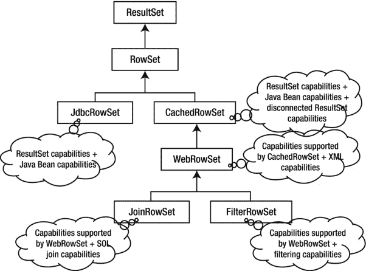

图 10-3.  RowSet 层次结构

`JdbcRowSet` 是一个已连接的 `RowSet`，这意味着 `JdbcRowSet` 实现始终与相应的数据库保持连接。其他四个接口是断开的 `RowSet`，这意味着这四个 `RowSet` 实现（除 `JdbcRowSet` 外）中的任何一个对象仅在需要读取或写入时才连接到数据库；其他所有时间它们都与数据库断开连接。这四个接口实现的这一特性，加上可序列化的能力，使它们适合通过网络发送。

图 10-3 展示了各种 `RowSet` 接口之间的层次关系。如你所知，`RowSet` 是 `ResultSet` 接口的子接口。`JdbcRowSet` 是 `RowSet` 的子接口；`JdbcRowSet` 拥有 `ResultSet` 支持的所有功能，外加 JavaBean 能力。`CachedRowSet` 也是 `RowSet` 接口的子接口；它拥有 `JdbcRowSet` 支持的所有功能，外加断开式 `ResultSet` 的能力。`WebRowSet` 在 `CachedRowSet` 功能的基础上增加了 XML 能力。类似地，`JoinRowSet` 在 `WebRowSet` 基础上增加了 SQL 连接能力，而 `FilteredRowSet` 在 `WebRowSet` 基础上增加了结果过滤能力。

现在让我们讨论 Java 7 中引入的 `RowSetProvider` 类和 `RowSetFactory` 接口。`RowSetProvider` 提供了获取 `RowSetFactory` 实现的 API，该实现可用于实例化适当的 `RowSet` 实现。它提供了以下两个方法：

*   **RowSetFactory newFactory():** 此 API 创建一个新的 `RowSetFactory` 实现实例。那么这个方法会实例化哪个工厂实现呢？这是个好问题；答案是此 API 会根据环境设置推断要实例化的工厂实现类型。它首先在系统属性 `javax.sql.rowset.RowSetFactory` 中查找。如果 API 无法推断出工厂实现，则使用 `ServiceLoader` API 来确定要实例化的工厂实现类型，最后它会查找 `RowSetFactory` 实例的平台默认实现。如果 API 无法推断出工厂实现类型，则会抛出 `SQLException`。
*   **RowSetFactory newFactory(String factoryClassName, ClassLoader classloader):** 如果由于作用域中存在多个驱动程序，导致调用普通的 `newFactory()` 方法时不清楚将加载哪个驱动程序，你可以使用重载方法 `newFactory()`，该方法接受工厂的类名和类加载器，并实例化适当的工厂。


`RowSetFactory` 定义了五个方法；每个方法都会创建一种类型的 `RowSet` 实现。那么，既然可以使用传统的普通方式创建 `RowSet` 实现，为什么还需要 `RowSetFactory` 和 `RowSetProvider` 呢？答案是*灵活性*；你可以在创建 `RowSet` 对象时无需指定传统方式下需要提供的细节；然后在对象创建后再设置其他细节。不如编写一个程序来看看如何使用 `RowSetFactory` 和 `RowSetProvider`？请参见清单 10-13。

清单 10-13.  DbQuery5.java

```
import javax.sql.rowset.*;
import java.sql.*;

// 演示如何使用 RowSet、RowSetProvider 和 RowSetFactory
class DbQuery5 {
        public static void main(String[] args) {
                String url = "jdbc:mysql://localhost:3306/addressBook";
                String userName = "root";
                String password = "mysql123";
                try {
                        // 首先，为 rowset 创建一个工厂对象
                        RowSetFactory rowSetFactory = RowSetProvider.newFactory();
                        // 从工厂创建一个 JDBC rowset
                        JdbcRowSet rowSet = rowSetFactory.createJdbcRowSet();
                        rowSet.setUrl(url);
                        rowSet.setUsername(userName);
                        rowSet.setPassword(password);
                        rowSet.setCommand("SELECT * FROM contact");
                        rowSet.execute();
                        System.out.println("id \tfName \tlName \temail \t\tphoneNo");
                        while (rowSet.next()){
                                System.out.println(rowSet.getInt("id") + "\t"
                                                + rowSet.getString("firstName") + "\t"
                                                + rowSet.getString("lastName") + "\t"
                                                + rowSet.getString("email") + "\t"
                                                + rowSet.getString("phoneNo"));
                        }
                } catch (SQLException sqle) {
                        sqle.printStackTrace();
                }
        }
}
```

程序输出如下：

```
Id      fName   lName   email           phoneNo
1       Michael Taylor  michael@abc.com +919976543210
2       William Becker   william@abc.com +449876543210
3       Samuel Uncle   sam@abc.com     +119955331100
```

程序的输出符合预期。不过，你使用了 `RowSetProvider` 和 `RowSetFactory`。你首先获取了合适的 `RowSetFactory`，然后使用该工厂创建了 `JdbcRowSet`。程序的其余部分与你之前在清单 10-3 中看到的一致。

要点记忆

以下是一些可能对 OCPJP 考试有帮助的要点：

*   你可以在 `ResultSet` 方法中使用列名或列索引。你使用的索引是 `ResultSet` 对象的索引，而不是数据库表中的列号。
*   如果发生以下情况，`Statement` 对象会关闭当前的 `ResultSet` 对象：a) `Statement` 对象被关闭，b) 被重新执行，或 c) 被用于检索下一组结果。这意味着不必显式调用 `ResultSet` 对象的 `close()` 方法；不过，在对象使用完毕后调用 `close()` 是一个好习惯。
*   你可以使用 `ResultSet` 对象的列名，而无需担心大小写：`getXXX()` 方法接受不区分大小写的列名来检索关联的值。
*   考虑一种情况：`ResultSet` 对象中有两个同名的列。如何使用列名检索关联的值？如果使用列名检索值，它将始终指向与给定名称匹配的第一列。因此，在这种情况下，你必须使用列索引来检索与这两列关联的值。
*   你可能还记得 `PreparedStatement` 接口继承自 `Statement`。然而，`PreparedStatement` 重写了所有 `execute()` 方法的变体。例如，`executeUpdate()` 的行为可能与其基类方法不同。
*   发出正确的 SQL 命令是你的责任；JDBC `Statement` 不会检查其正确性。例如，如果 SQL 命令字符串中存在语法错误，你不会收到编译错误。相反，你会在运行时收到 `MySQLSyntaxErrorException`。
*   使用 `insertRow()` 方法插入一行后，你可以立即调用相应的 `get()` 方法。但是，该行的值是未定义的。
*   你可以使用 `cancelRowUpdates()` 方法取消所做的任何更新。但是，你必须在调用 `updateRow()` 方法之前调用此方法。在所有其他情况下，它对行没有影响。
*   连接数据库时，你需要指定正确的用户名和密码。如果提供的用户名或密码不正确，你将收到 `SQLException`。
*   JDBC 4.1 引入了使用 try-with-resources 语句自动关闭资源（`Connection`、`ResultSet` 和 `Statement`）的功能。

问答时间！

1.  考虑以下代码片段。假设连接对象有效，并且 `statement.executeQuery()` 方法成功返回了一个包含几行数据的 `ResultSet` 对象。

```
    Statement statement = connection.createStatement();
    ResultSet resultSet = statement.executeQuery("SELECT * FROM contact")){
    System.out.println("ID \tfName \tlName \temail \t\tphoneNo");
    // 从 resultSet 元数据中，找出有多少列，然后读取列条目
    int numOfColumns = resultSet.getMetaData().getColumnCount();
    while (resultSet.next()) {
    // 按索引值遍历列
         for(int i = 0; i < numOfColumns; i++) {
            // 由于我们不知道列的数据类型，因此使用 getObject()
            System.out.print(resultSet.getObject(i) + "\t");
    ```

```
     }
       System.out.println("");
    }
    ```

关于此代码片段，以下哪项陈述是正确的？

*   A.  该代码片段将成功打印 `ResultSet` 对象中行的内容。
    *   B.  循环头是错误的。要遍历所有列，应该是

```
         for(int i = 0; i <= numOfColumns; i++) {
        ```

*   C.  循环头是错误的。要遍历所有列，应该是

```
         for(int i = 1; i <= numOfColumns; i++) {
        ```

*   D.  循环头是错误的。要遍历所有列，应该是

```
         for(int i = 1; i < numOfColumns; i++) {
        ```

**答案：** C。循环头是错误的。要遍历所有列，应该是

```
    for(int i = 1; i <= numOfColumns; i++) {
    ```


（假设表中有 N 列，有效的列索引范围是 1 到 N，而不是 0 到 N-1。）

2.  假设你刚刚在 MySQL 中使用以下命令创建了这张表：

```
    create table familyGroup (id int not null auto_increment, nickName varchar(30) Not null, primary key (id));
    ```

你编写了以下使用这张表的程序：

```
    import java.sql.Connection;
    import java.sql.ResultSet;
    import java.sql.SQLException;
    import java.sql.Statement;

class DbTransactionTest {
         public static void main(String[] args) throws SQLException {
                 try (Connection connection = DbConnector.connectToDb();
                         Statement statement =
                          connection.createStatement(
                                 ResultSet.TYPE_SCROLL_SENSITIVE, ResultSet.CONCUR_UPDATABLE);
                         ResultSet resultSet =
                                 statement.executeQuery("SELECT * FROM familyGroup")) {
                         resultSet.moveToInsertRow();
                         resultSet.updateString("nickName", "Sam");
                         resultSet.insertRow();  // 插入行
                         System.out.println("表已更新一行...");
                         connection.commit();    // 提交语句
                 }
         }
    }
    ```

假设建立连接成功，执行此程序的结果是什么？

*   A.  程序将成功插入一行，其 id = 1，nickName = “Sam”。
    *   B.  在标记为“插入行”的代码行将抛出 `SQLException`，因为你无法在只读的 `ResultSet` 对象上插入行。
    *   C.  在标记为“提交语句”的代码行将抛出 `SQLException`，因为启用了自动提交；因此提交将失败。
    *   D.  程序不会向 `familyGroup` 表中插入任何内容。

**答案：** C. 在标记为“提交语句”的代码行将抛出 `SQLException`，因为启用了自动提交；因此提交将失败。

（如果未禁用自动提交，任何尝试使用 `commit`、`rollback`、`setSavepoint` 等方法的行为都将导致抛出 `SQLException`。）

3.  考虑事务中的以下操作序列：

```
    // 假设此程序中的所有操作均成功执行，未抛出任何异常；同时假设连接已成功建立
    connection.setAutoCommit(false);

// 在此处向表中插入一行
    // 在此事务中创建一个保存点

// 在此处向表中插入另一行
    // 在此事务中创建一个命名保存点

// 在此处向表中插入第三行

connection.rollback();
    connection.commit();
    ```

在执行 `connection.commit()` 语句后，此操作序列的效果是什么？

*   A.  三行将被插入到表中。
    *   B.  表中不会插入任何行。
    *   C.  一行将被插入到表中。
    *   D.  两行将被插入到表中。
    *   E.  所有三行都将被插入到表中。

**答案：** B. 表中不会插入任何行。

（由于在 `connection.commit()` 之前调用了 `connection.rollback()`，所有操作都将被撤销，因此表中不会插入任何行。）

4.  在 JDBC 3.0 中，以下哪个语句是必需的？

*   A.  `Connection connection = DriverManager.getConnection("jdbc:mysql://localhost:3306/addressBook", "root", "password"))`
    *   B.  `Connection connection = DriverManager.createConnection("jdbc:mysql://localhost:3306/addressBook", "root", "password"))`
    *   C.  `Class.forName("com.mysql.jdbc.Driver").newInstance();`
    *   D.  `Class.forName("com.mysql.jdbc.Driver").getInstance();`

**答案：** C. `Class.forName("com.mysql.jdbc.Driver").newInstance();`

（在 JDBC 3.0 中，你需要使用 `Class.forName()` 语句显式加载 JDBC 驱动程序。从 4.0 开始，不再需要此语句，你可以直接获取连接。请注意，选项 A) 展示了如何获取 MySQL 的连接，并且此 URL 将取决于所使用的具体数据库。）

5.  考虑以下程序并选择最能描述其行为的选项（假设连接有效）：

```
    try (Statement statement = connection.createStatement();
    ResultSet resultSet = statement.executeQuery("SELECT * FROM contact")){
      System.out.println(resultSet.getInt("id") + "\t"
       + resultSet.getString("firstName") + "\t"
       + resultSet.getString("lastName") + "\t"
       + resultSet.getString("email") + "\t"
       + resultSet.getString("phoneNo"));
    }
    catch (SQLException sqle) {
    System.out.println("SQLException");
    }
    ```

*   A.  此程序将打印：`SQLException`。
    *   B.  此程序将打印 contact 表中的第一行。
    *   C.  此程序将打印 contact 表中的所有行。
    *   D.  此程序将报告编译错误。

**答案：** A. 此程序将打印：`SQLException`。

（缺少 `while (resultSet.next())` 语句。）

6.  关于 JDBC 中的 RowSet，以下哪两个陈述是正确的？

*   A.  可以将 `JdbcRowSet` 用作 JavaBeans 组件。
    *   B.  `WebRowSet` 以 JSON 格式提供结果集。
    *   C.  `FilteredRowSet` 对象中的过滤器在其创建时设置；一旦 `FilteredRowSet` 对象创建，就无法再设置过滤器。
    *   D.  `CachedRowSet` 对象在其内存中缓存数据，这使得可以在不始终连接到其数据源的情况下使用 `CachedRowSet` 对象。

**答案：**

A.     可以将 `JdbcRowSet` 用作 JavaBeans 组件。

D.     `CachedRowSet` 对象在其内存中缓存数据，这使得可以在不始终连接到其数据源的情况下使用 `CachedRowSet` 对象。

（注意：B) `WebRowSet` 以 XML 格式（而非 JSON 格式，JSON 是 XML 的替代方案之一）提供结果集；C) `FilteredRowSet` 对象中的过滤器可以随时使用 `setFilter()` 方法设置。）

7.  以下哪个接口**不**扩展 `RowSet` 接口？

*   A.  `JdbcRowSet`
    *   B.  `CachedRowSet`
    *   C.  `WebRowSet`
    *   D.  `TraversalRowSet`
    *   E.  `JoinRowSet`

**答案：** D) `TraversalRowSet`

（从 `JdbcRowSet` 派生的接口有 `CachedRowSet`、`WebRowSet`、`JoinRowSet` 和 `FilteredRowSet`。）

总结

定义 JDBC API 的布局

*   Java 提供的 JDBC（Java 数据库连接）API 旨在以编程方式访问数据库管理系统（DBMS）。
*   JDBC 隐藏了所有 DBMS 的异构性，并提供了一套统一的 API 来与所有类型的数据库进行交互。
*   异构交互的复杂性被委托给 JDBC 驱动程序管理器和 JDBC 驱动程序；因此，所有细节和复杂性都被 JDBC API 对应用程序开发者隐藏了。
*   共有四种类型的驱动程序：

*   **类型 1（JDBC-ODBC 桥接驱动程序）：** JDBC 驱动程序使用 Java 本地接口（JNI）调用 ODBC（开放数据库连接）本地调用。
*   **类型 2（本地 API 驱动程序）：** 这些驱动程序使用特定数据库的客户端库，并将 JDBC 调用转换为本地数据库调用。
*   **类型 3（网络协议驱动程序）：** 这些驱动程序调用数据库中间件，中间件再将 JDBC 调用转换为特定于数据库的本地调用。
*   **类型 4（本地协议驱动程序）：** 驱动程序直接通过网络进行特定于数据库的调用，无需任何额外的客户端库支持。

使用 JDBC 驱动程序连接到数据库


*   `java.sql.Connection` 接口提供了一个通道，应用程序和数据库通过该通道进行通信。
*   `DriverManager` 类中的 `getConnection()` 方法接受三个参数：URL 字符串、用户名字符串和密码字符串。
*   URL（需要指定以获取 `Connection` 对象）的语法是 `<protocol>:<subprotocol>://<server>:<port>/`。URL 字符串的一个示例是 `jdbc:mysql://localhost:3306/`。对于所有 DBMS，`<protocol> jdbc` 都是相同的；`<subprotocol>` 会因 DBMS 而异，`<server>` 取决于你托管数据库的位置，每个 DBMS 都使用特定的 `<port>` 编号。
*   如果 JDBC API 无法定位 JDBC 驱动程序，它将抛出 `SQLException`。如果有可用的驱动程序 jar 包，则需要将它们包含在类路径中，以使 JDBC API 能够定位驱动程序。
*   在 JDBC 4.0 之前，你必须使用 `Class.forName()` 语句显式加载 JDBC 驱动程序；在 JDBC 4.0 及更高版本中，则不需要此语句，JDBC API 将从 URL 字符串中给出的详细信息加载驱动程序。

更新和查询数据库

*   JDBC 支持两个用于查询和更新的接口：`Statement` 和 `Resultset`。
*   `Statement` 是一个 SQL 语句，可用于将 SQL 语句发送到已连接的数据库并从数据库接收结果。有三种类型的 `Statements`：

*   `Statement`：当你需要向数据库发送不带任何参数的 SQL 语句时，需要使用 `Statement`。
*   `PreparedStatement`：表示一个预编译的 SQL 语句，可以使用 IN 参数进行自定义。
*   `CallableStatement`：用于执行存储过程；可以处理 IN 以及 OUT 和 INOUT 参数。

*   `ResultSet` 是一个包含查询请求的列标题和相关值的表格。
*   `ResultSet` 对象维护一个指向当前行的游标。最初，游标位于第一行之前；调用 `next()` 方法会将游标位置向前移动一行。
*   `ResultSet` 对象中的列索引从 1 开始（*而不是*从 0 开始）。
*   在修改 `ResultSet` 中的行内容后，你需要调用 `updateRow()`；否则，对 `ResultSet` 对象所做的更改将丢失。
*   通过调用 `Connection` 接口中的 `getMetaData()` 方法，你可以检查底层数据库的能力。

自定义 JDBC 的事务行为并提交事务

*   事务是一组 SQL 操作，这些操作要么全部成功执行，要么全部不执行。
*   `Connection` 接口支持与事务相关的方法。
*   默认情况下，自动提交模式设置为 true，因此你通过连接所做的所有更改都会自动提交到数据库。
*   你可以使用 `setAutoCommit(false);` 来启用手动提交。在未启用自动提交的情况下，你需要显式地提交或回滚事务。
*   如果在手动提交模式下未执行 `commit()` 方法，则数据库中将不会发生任何更改。
*   你可以将一个大事务划分为多个里程碑。这些里程碑被称为 `savepoints`。这样，一旦达到某个里程碑，你就可以将对数据库的更改保存到该里程碑。

使用 JDBC 4.1 RowSetProvider、RowSetFactory 和 RowSet 接口

*   `RowSet` 是一个特殊的 `ResultSet`，它支持 JavaBean 组件模型。
*   `JdbcRowSet` 是一个已连接的 `RowSet`，而 `RowSet` 的其他子接口（即 `JoinRowSet, CachedRowSet, WebRowSet` 和 `FilteredRowSet`）是断开的 `RowSets`。
*   `RowSetProvider` 提供了获取 `RowSetFactory` 实现的 API，该实现又可用于实例化相关的 `RowSet` 实现。

第 11 章


异常和断言

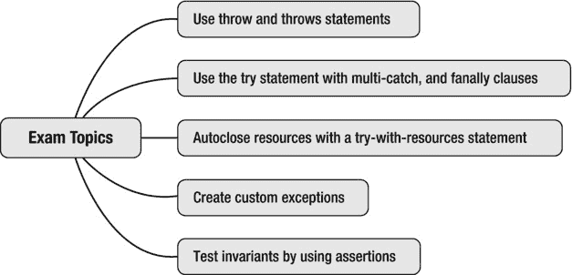

在本章中，你将详细了解 Java 对异常处理的支持。你将首先学习异常处理背后的基本概念，然后学习如何抛出、捕获和重新抛出异常。你还将学习最近添加的语言特性，例如 try-with-resources 和多 catch 语句。接下来，你将学习如何定义自己的异常类（自定义异常）。最后，我们将讨论相关的断言主题，并教你如何在程序中使用它们。本章中的大多数编程示例都使用了 I/O 函数（第 8 章和第 9 章）来说明异常处理的概念。

异常处理简介

作为程序员，我们很乐观——我们只是编写代码来解决手头的问题，并期望它能毫无问题地运行。然而，事情确实会出错（而且往往比我们希望的更频繁！），所以我们应该始终预料到错误和异常，并编写代码来处理这些异常情况。

Java 内置了对异常的支持。Java 语言以 `throw, throws, try`, `catch` 和 `finally` 关键字的形式支持异常处理。请参阅图 11-1 以了解这些关键字的基本语法。

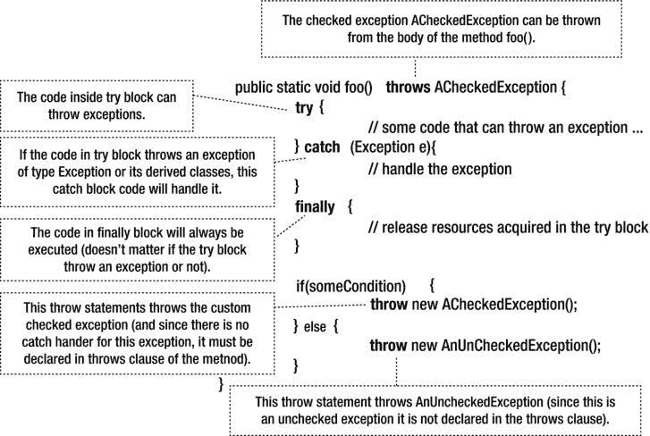

图 11-1.  异常处理相关关键字的基本语法

抛出异常

清单 11-1 是一个非常简单的编程示例，其中你希望将作为命令行参数输入的文本回显给用户。假设用户必须键入一些文本作为要回显的命令行参数，否则你需要通知用户“错误情况”。

清单 11-1.  Echo.java

```
// 一个没有异常处理代码的简单程序
class Echo {
                public static void main(String []args) {
                                if(args.length == 0) {

// 没有传递参数 – 向用户显示错误
                                                System.out.println("Error: No input passed to echo command... ");
                                                System.exit(-1);
                                }
                                else {
                                                for(String str : args) {
// 命令行参数被分隔并作为数组传递
                                                // 通过在数组元素之间添加空格来打印它们
                                                System.out.print(str + " ");
                                                }
                                }
                }
}
```

在这种情况下，你使用 `println()` 语句在控制台中打印错误。这是一个简单的程序，错误发生在 `main()` 方法中，因此错误处理很容易。在这种情况下，你可以在将错误消息打印到控制台后终止程序。但是，如果你在复杂应用程序的函数调用深处，则需要一种更好的方式来指示发生了“异常情况”，然后将该情况通知给调用者。此外，你通常需要从错误情况中恢复，而不是终止程序。因此，你需要能够“处理”异常，或者将该异常“重新抛出”到调用堆栈的更上层，以便调用者可以处理该异常。（我们将在本章后面重新讨论重新抛出异常这个主题。）现在，你将修改清单 11-1 中的程序，使其抛出异常而不是打印错误消息（在单独的程序 `Echo1.java` 中），如下所示：

```
if(args.length == 0) {
        // 没有传递参数 - 抛出异常
        throw new IllegalArgumentException("No input passed to echo command");
}
```


在 `args.length == 0` 的 `if` 条件内部的这个代码块，是该程序中唯一需要修改的部分。请注意抛出异常的语法：`throw` 关键字后跟异常对象。这里你使用了 Java 库中已定义的 `IllegalArgumentException`。在本章后面，你将学习如何定义自己的异常。

现在，如果你在命令行中不传递任何参数运行此程序，程序将抛出一个 `IllegalArgumentException`。

```
D:\> java Echo1
Exception in thread "main" java.lang.IllegalArgumentException: No input passed to echo command
        at Echo1.main(Echo1.java:5)
```

由于没有为此异常设置处理器，这个未捕获的异常终止了程序。在这个例子中，你显式地抛出了一个异常。当你编写某些代码或调用 Java API 时，也可能会抛出异常。现在来看一个例子。

未处理的异常

考虑清单 11-2 中的程序，它尝试读取用户在控制台输入的整数值，并将读取到的整数打印回控制台。为了从控制台读取整数，你使用了 `java.util.Scanner` 类中提供的 `readInt()` 方法。要实例化 `Scanner` 类，你需要传入 `System.in`，它是对*系统输入流*的引用。

清单 11-2.  ScanInt1.java

```
// 一个简单的程序，用于从用户处接收整数

import java.util.*;

class ScanInt {
                public static void main(String [] args) {
                                System.out.println("请在控制台输入一个整数：");
                                Scanner consoleScanner = new Scanner(System.in);
                System.out.println("你输入的整数值是：" + consoleScanner.nextInt());
                }
}
```

当你运行此程序并在控制台输入一个整数（例如 10）时，程序会正确运行并成功将整数打印出来。

```
D:\> java ScanInt1
请在控制台输入一个整数：

你输入的整数值是：10
```

然而，如果你（或程序的用户）错误地输入了字符串 "ten" 而不是整数值 "10"，会发生什么？程序将在抛出如下异常后终止：

```
D:\> java ScanInt1
请在控制台输入一个整数：
ten
Exception in thread "main" java.util.InputMismatchException
        at java.util.Scanner.throwFor(Scanner.java:909)
        at java.util.Scanner.next(Scanner.java:1530)
        at java.util.Scanner.nextInt(Scanner.java:2160)
        at java.util.Scanner.nextInt(Scanner.java:2119)
        at ScanInt.main(ScanInt1.java:7)
```

如果你阅读 `nextInt()` 的文档，你会发现该方法可能会抛出 `InputMismatchException`，“如果下一个标记与 `Integer` 正则表达式不匹配，或者超出范围”。在这个简单的程序中，你假设你（或用户）总会按预期输入一个整数值，而当这个假设不成立时，就会抛出异常。如果程序抛出了异常且未被处理，程序将在输出类似上面所示的堆栈跟踪后异常终止。

*堆栈跟踪*显示了在控制流到达抛出异常的语句之前所调用的方法列表（包含行号）。作为程序员，你会发现它对于跟踪控制流以调试程序并修复导致此异常的问题非常有用。

那么，如何处理这种情况呢？你需要将这些代码放在 `try` 和 `catch` 块中，然后处理异常。

Try 和 Catch 语句

Java 提供了 `try` 和 `catch` 关键字来处理你编写的代码中可能抛出的任何异常。清单 11-3 是清单 11-2 中程序的改进版本。

清单 11-3.  ScanInt2.java


```java
// 一个简单的程序，用于在正常情况下从用户处接收整数，
// 否则打印错误信息

import java.util.*;

class ScanInt2 {
                public static void main(String [] args) {
                                System.out.println("请在控制台中输入一个整数：");
                                Scanner consoleScanner = new Scanner(System.in);
                                try {
                                System.out.println("您输入的整数值为：" + consoleScanner.nextInt());
                        } catch(InputMismatchException ime) {
                                                // 如果控制台输入的不是整数，nextInt() 会抛出 InputMismatchException
                                                // 因此在此处处理该异常
                        System.out.println("错误：您输入的内容不是有效的整数值...");
                                }
                }
}
```

如果输入的不是有效的整数，该程序会向用户打印一条可读的错误信息。

```
D:\> java ScanInt2
请在控制台中输入一个整数：
ten
错误：您输入的内容不是有效的整数值...
```

现在我们来分析这段代码。`try` 关键字后面的代码块限定了您预期可能抛出某些异常的代码段。如果 `try` 块中抛出了任何异常，Java 运行时将搜索一个*匹配的处理程序*（稍后我们将更详细地讨论）。在本例中，存在一个针对 `InputMismatchException` 的异常处理程序，其类型与抛出的异常完全相同。这个*完全匹配*的 catch 处理程序位于 try 块之外，形式为关键字 `catch` 后跟一个代码块，并且这个 catch 块会被执行。在 catch 块中，您捕获了异常，因此您在此处处理该异常。您提供的是人类可读的错误字符串，而不是抛出原始的堆栈跟踪（就像您在清单 11-2 的早期程序中所做的那样），因此您为程序提供了优雅的退出方式。

以编程方式访问堆栈跟踪

您已经看到堆栈跟踪对于调试很有用，那么如何在 catch 块中获取它呢？您可以使用 `printStackTrace()` 方法，该方法会将堆栈跟踪打印到控制台。让我们将以下语句添加到 catch 块中：

```
ime.printStackTrace();
```

现在这条语句将打印堆栈跟踪：

```
java.util.InputMismatchException
                at java.util.Scanner.throwFor(Scanner.java:909)
                at java.util.Scanner.next(Scanner.java:1530)
                at java.util.Scanner.nextInt(Scanner.java:2160)
                at java.util.Scanner.nextInt(Scanner.java:2119)
                at ScanInt2.main(ScanInt2.java:9)
```

您还可以访问堆栈跟踪中的每个条目。所有异常都有一个名为 `getStackTrace()` 的方法，该方法返回一个 `StackTraceElements` 数组。因此，假设您在 catch 块中编写了以下语句：

```
System.out.println("堆栈跟踪中的调用为：");
// 访问"调用堆栈"中的每个元素并单独打印
for(StackTraceElement methodCall : ime.getStackTrace())
        System.out.println(methodCall);
```

当您执行这段代码时，它将打印以下内容：

```
堆栈跟踪中的调用为：
java.util.Scanner.throwFor(Scanner.java:909)
java.util.Scanner.next(Scanner.java:1530)
java.util.Scanner.nextInt(Scanner.java:2160)
java.util.Scanner.nextInt(Scanner.java:2119)
ScanInt2.main(ScanInt2.java:9)
```

多个 Catch 块

在清单 11-2 中，您使用了一个 `Scanner` 对象从控制台读取整数。请注意，您也可以使用 `Scanner` 对象从字符串中读取（参见清单 11-4）。

清单 11-4.  ScanInt3.java

```
// 一个从给定字符串中扫描整数的程序

import java.util.*;

class ScanInt3 {
        public static void main(String [] args) {
                                String integerStr = "100";
                                System.out.println("要从中扫描整数的字符串是：" + integerStr);
                                Scanner consoleScanner = new Scanner(integerStr);
                                try {
                                                System.out.println("从字符串中扫描到的整数值是：" +
                                consoleScanner.nextInt());
                                } catch(InputMismatchException ime) {
                                                // 如果字符串中提供的不是整数，nextInt() 会抛出 InputMismatchException
                                                System.out.println("错误：无法从给定的字符串中扫描整数");
                                }
        }
}
```

该程序打印以下内容：

```
要从中扫描整数的字符串是：100
从字符串中扫描到的整数值是：100
```

如果您修改清单 11-4 中的程序，使字符串包含一个非整数值，例如：

```
String integerStr = "hundred";
```

那么 try 块将抛出一个 `InputMismatchException`，该异常将在 catch 块中被处理，您将得到以下输出：

要从中扫描整数的字符串是：hundred

错误：无法从给定的字符串中扫描整数

现在，如果您修改清单 11-4 中的程序，使字符串包含一个空字符串，例如：

```
String integerStr = "";
```

对于这种情况，`nextInt()` 将抛出一个 `NoSuchElementException`，该异常在此程序中未被处理，因此此程序会崩溃。

```
要从中扫描整数的字符串是：
Exception in thread "main" java.util.NoSuchElementException
        at java.util.Scanner.throwFor(Scanner.java:907)
        at java.util.Scanner.next(Scanner.java:1530)
        at java.util.Scanner.nextInt(Scanner.java:2160)
        at java.util.Scanner.nextInt(Scanner.java:2119)
        at ScanInt3.main(ScanInt.java:11)
```

此外，如果您查看 `Scanner.nextInt()` 方法的 JavaDoc，您会发现它还可能抛出 `IllegalStateException`（如果在一个已关闭的 `Scanner` 对象上调用 `nextInt()` 方法，则会抛出此异常）。因此，让我们为 `InputMismatchException`、`NoSuchElementException` 和 `IllegalStateException` 提供 catch 处理程序（参见清单 11-5）。

清单 11-5.  ScanInt4.java

```
// 一个从给定字符串中扫描整数的程序

import java.util.*;

class ScanInt4 {
                public static void main(String [] args) {
                                String integerStr = "";
                                System.out.println("要从中扫描整数的字符串是：" + integerStr);
                                Scanner consoleScanner = new Scanner(integerStr);
                                try {

System.out.println("从字符串中扫描到的整数值是：" +
                                   consoleScanner.nextInt());
                                } catch(InputMismatchException ime) {
                                                System.out.println("错误：无法从给定的字符串中扫描整数");
                                } catch(NoSuchElementException nsee) {
                                                System.out.println("错误：无法从给定的字符串中扫描整数");
                                } catch(IllegalStateException ise) {
                                                System.out.println("错误：在已关闭的 Scanner 对象上调用了 nextInt()");
                                }
                }
}
```

以下是运行此程序时的输出：


```
The string to scan integer from it is:
Error: Cannot scan an integer from the given string
```

从输出可以看出，由于字符串为空，抛出了 `NoSuchElementException`。该异常被对应的 catch 处理器捕获，并执行了 catch 块内的代码，从而实现了优雅退出。

请注意，通过堆叠多个 catch 处理器，你提供了多个处理程序：先提供特定（即派生类型）的异常处理器，再提供更通用（即基类型）的异常处理器。如果在基类型异常处理器之后提供派生类型异常处理器，则会导致编译器错误。你可能还不知道，`NoSuchElementException` 实际上是 `InputMismatchException` 的基类！尝试颠倒 `InputMismatchException` 和 `NoSuchElementException` 的 catch 处理器顺序，看看会发生什么。

```
try {
        System.out.println("The integer value scanned from string is: "
                      + consoleScanner.nextInt());
} catch(NoSuchElementException nsee) {
        System.out.println("Error: Cannot scan an integer from the given string");
} catch(InputMismatchException ime) {
        System.out.println("Error: Cannot scan an integer from the given string");
}
```

这段代码将导致以下编译器错误：

```
ScanInt4.java:14: error: exception InputMismatchException has already been caught

} catch(InputMismatchException ime) {
                  ^
1 error
```

|  | 当提供多个 catch 处理器时，应先处理特定异常，再处理通用异常。如果在基类异常处理器*之后*提供派生类异常 catch 处理器，代码将无法编译。 |

多重捕获块

你刚刚看到，不能颠倒 `InputMismatchException` 和 `NoSuchElementException` 的 catch 处理器顺序。但是，是否可以将这两个 catch 处理器合并在一起呢？Java 7 提供了一个名为*多重捕获块*的特性，你可以使用它将多个 catch 处理器合并在一起（参见清单 11-6）。

清单 11-6.  ScanInt5.java

```
// A program that illustrates multi-catch blocks

import java.util.*;

class ScanInt5 {
                public static void main(String [] args) {
                                String integerStr = "";
                                System.out.println("The string to scan integer from it is: " + integerStr);
                                Scanner consoleScanner = new Scanner(integerStr);
                                try {
                        System.out.println("The integer value scanned from string is: " +
                                      consoleScanner.nextInt());
                                } catch(NoSuchElementException | IllegalStateException multie) {
                                                System.out.println("Error: An error occured while attempting to scan the integer");
                                }
                }
}
```

请注意，这里使用 `| (OR)` 运算符（与对整数值执行按位 `OR` 运算时使用的运算符相同）将 `NoSuchElementException` 和 `IllegalStateException` 的 catch 子句合并在一起。

与 `NoSuchElementException` 和 `IllegalStateException` 的合并 catch 子句不同，你不能合并 `NoSuchElementException` 和 `InputMismatchException` 的 catch 子句。正如我们已经讨论过的，`NoSuchElementException` 是 `InputMismatchException` 的基类，因此不能在多重捕获块中同时捕获它们。如果尝试编译这样的多重捕获子句，将得到以下编译器错误：

```
ScanInt5.java:11: error: Alternatives in a multi-catch statement cannot be related by subclassing
        } catch(InputMismatchException | NoSuchElementException exception) {
                                                                           ^
```

那么替代方案是什么？当需要为那些一个异常是另一个异常基类的异常提供 catch 处理器时，仅提供基类的 catch 处理器就足够了（因为该基类 catch 处理器会处理可能发生的派生类异常）。

|  | 在多重捕获块中，不能合并具有基类和派生类关系的两个异常的 catch 处理器。只能合并那些彼此之间没有父子关系的异常的 catch 处理器。 |

如何判断是合并异常处理块更好，还是堆叠它们更好？这是一个设计选择，需要考虑以下方面：a) 这些异常是由于相似原因还是不同原因抛出的？(b) 处理代码是相似还是不同？如果对这两个问题的回答都是“相似”，那么合并它们更好；如果对其中任何一个问题的回答是“不同”，那么分开它们更好。

清单 11-6 中的具体情况如何？对于 `InputMismatchException` 和 `IllegalStateException` 异常，是合并处理器更好还是分开更好？可以看到，两个 catch 块的异常处理是相同的。但这两个异常的原因却大相径庭。`InputMismatchException` 是在你（或用户）在控制台输入无效输入时抛出的。而 `IllegalStateException` 则是在调用 `Scanner` 的 `close()` 方法后，又调用 `nextInt()` 方法时，因编程错误而抛出的。因此，在这种情况下，将这两个异常的处理器分开是更好的设计选择。

通用捕获处理器

你是否注意到，在使用与 I/O 操作相关的 API 时，可能会抛出许多异常？我们刚刚讨论过，仅仅调用 `Scanner` 类的一个方法 `nextInt()`，就需要处理三个异常：`InputMismatchException`、`NoSuchElementException` 和 `IllegalStateException`。如果一直像这样处理那些在程序运行时实际上可能不会导致异常情况的特定异常，那么你的大部分代码都将由 try-catch 代码块组成！有没有更好的方法来表示“处理所有其他异常”？有的，你可以提供一个*通用异常处理器*。

以下代码片段展示了来自清单 11-4 的 `ScanInt3` 类中仅包含 try-catch 块的代码，并增加了一个通用异常处理器：

```
try {
        System.out.println("You typed the integer value: " + consoleScanner.nextInt());
} catch(InputMismatchException ime) {
        // if something other than integer is typed, we'll get this exception, so handle it
                System.out.println("Error: You typed some text that is not an integer value...");
} catch(Exception e) {
        // catch IllegalStateException here which is unlikely to occur...
                System.out.println("Error: Encountered an exception and could not read an integer from the console... ");
}
```

这段代码为 `Exception` 类型的基类异常提供了一个 catch 处理器。因此，如果 try 块抛出了 `InputMismatchException` 之外的任何异常，并且该异常是 `Exception` 类的派生类，这个通用 catch 处理器就会处理它。建议的做法是先捕获特定异常，然后提供一个通用异常处理器，以确保所有其他异常也能得到处理。

异常链

当你想捕获一个异常并抛出另一个异常时，可以将第一个异常“链接”到抛出的异常上。换句话说，在抛出异常时，你可以关联另一个导致该异常发生的异常。


创建异常对象时，你可以使用一个以另一个异常为参数的构造函数；这个传入的参数就是链接到当前异常对象的异常。此外，还有一个重载的构造函数，可以额外接收一个描述消息作为参数。例如，以下是 `Exception` 类的两个重载构造函数：

```
Exception(Throwable cause)
Exception(string detailMsg, throwable cause)
```

其他类如 `Throwable`、`Error` 和 `RuntimeException` 也提供了类似的构造函数。下面的程序演示了链式异常：

```
class ChainedException {
                public static void foo() {
                                try {
                                                String [] str =  { "foo" };
                                                System.out.println("About to throw ArrayIndexOutOfBoundsException");
                                                // 以下语句存在越界访问
                                                String functionName = str[10];
                                } catch(ArrayIndexOutOfBoundsException oob) {
                                                System.out.println("Wrapping ArrayIndexOutOfBoundsException into a RuntimeException");
                                                throw new RuntimeException(oob);
                }
}
                public static void main(String []args) {
                                try {
                                                foo();
                                } catch(Exception re) {
                                                System.out.println("The caught exception in main is: " + re.getClass());
                                                System.out.println("The cause of the exception is: " + re.getCause());
                }
           }
}
```

执行该程序时，会输出以下内容：

```
About to throw ArrayIndexOutOfBoundsException
Wrapping ArrayIndexOutOfBoundsException into a RuntimeException
The caught exception in main is: class java.lang.RuntimeException
The cause of the exception is: java.lang.ArrayIndexOutOfBoundsException: 10
```

与链式异常相关的方法是在 `Throwable` 类中定义的 `getCause()` 和 `initCause()` 方法。

`getCause()` 方法返回一个 `Throwable` 对象。它返回链接到调用该方法的异常对象上的异常。这个链式异常是导致当前异常的原始异常。如果没有异常链接到当前异常，则此方法返回 `null`。

`initCause(Throwable causeException)` 方法为调用该方法的异常对象设置链式异常。如果在创建异常对象时已经设置了链式异常，调用此方法将导致抛出 `IllegalStateException`。此方法只能调用一次；任何多次调用的尝试都会导致抛出 `IllegalStateException`。

请注意，异常可以链接到任意深度。

**Finally 块**

`Scanner` 类提供了一个 `close()` 方法，你需要调用它来关闭资源。在 `ScanInt1`、`ScanInt2` 和 `ScanInt3` 类（分别对应列表 11-2、11-3 和 11-4）中，请注意你创建了一个 `Scanner` 对象但没有关闭它。因此，这些程序存在*资源泄漏*！“资源”一词指的是任何从底层操作系统获取系统资源的类，例如网络、文件、数据库以及其他句柄。但如何知道哪些类需要关闭呢？问得好。答案是：如果一个类实现了 `java.io.Closeable`，那么你必须调用该类的 `close()` 方法；否则，就会导致资源泄漏。

|  | 垃圾回收器（GC）只负责释放内存资源。如果你使用了任何获取系统资源的类，你有责任通过调用该对象的 `close()` 方法来释放它们。 |

`ScanInt6`（列表 11-7）在其 `main()` 方法中调用了 `Scanner` 对象的 `close()` 方法；为了简化代码，你将使用一个通用的异常处理器来处理 try 块中可能抛出的所有异常。

列表 11-7.  ScanInt6.java

```
import java.util.*;

class ScanInt6 {
                public static void main(String [] args) {
                                System.out.println("Type an integer in the console: ");
                                Scanner consoleScanner = new Scanner(System.in);
                                try {
                                                System.out.println("You typed the integer value: " +
                                                                                consoleScanner.nextInt());
                                                System.out.println("Done reading the text... closing the Scanner");
                                                               consoleScanner.close();
                                } catch(Exception e) {
                                                // 在此处理所有其他异常...
                         System.out.println("Error: Encountered an exception and could not read an integer from the console... ");

System.out.println("Exiting the program - restart and try the program again!");
                                }
                }
}
```

让我们看看这个程序是否正常工作。

```
D:\> java ScanInt6
Type an integer in the console:

You typed the integer value: 10
Done reading the text... closing the Scanner
```

因为程序打印了 `"Done reading the text... closing the Scanner"`，并正常完成执行，所以可以认为 `consoleScanner.close();` 语句已成功执行。如果抛出异常会发生什么？

```
D:\> java ScanInt6
Type an integer in the console:
ten
Error: Encountered an exception and could not read an integer from the console...
Exiting the program - restart and try the program again!
```

从输出可以看出，程序没有打印 `"Done reading the text... closing the Scanner"`，因此 `consoleScanner.close();` 语句没有执行。如何修复这个问题？一种方法是在 catch 块中也调用 `consoleScanner.close()`，如下所示：

```
try {
        System.out.println("You typed the integer value: " + consoleScanner.nextInt());
        System.out.println("Done reading the text... closing the Scanner");
                consoleScanner.close();
} catch(Exception e) {
        // 在此处理所有其他异常...
                consoleScanner.close();
                System.out.println("Error: Encountered an exception and could not read an integer from the console... ");
                System.out.println("Exiting the program - restart and try the program again!");
}
```

这个解决方案可行，但不够优雅。你知道可以有多个 catch 块，并且必须在所有 catch 块中提供对 `consoleScanner.close();` 的调用！有没有更好的方法来释放资源？有的，你可以在 `finally` 块中释放资源（参见列表 11-8）。

列表 11-8.  ScanInt7.java

```
import java.util.*;
```


class ScanInt7 {
                public static void main(String [] args) {
                                System.out.println("Type an integer in the console: ");
                                Scanner consoleScanner = new Scanner(System.in);
                                try {
                                                System.out.println("You typed the integer value: " +
                                                                                consoleScanner.nextInt());
                                } catch(Exception e) {
                                                // call all other exceptions here ...

System.out.println("Error: Encountered an exception and could not read an integer from the console... ");
                        System.out.println("Exiting the program - restart and try the program again!");
                                } finally {

System.out.println("Done reading the integer... closing the Scanner");
                                                consoleScanner.close();
                                }
                }
}
```

在这个例子中，`catch` 块之后提供了一个 `finally` 块。无论是否发生异常，这个 `finally` 块都会被执行。因此，`finally` 块是调用 `Scanner` 对象的 `close()` 方法以确保该资源始终被释放的好地方。

|  | 如果你在方法内部调用 `System.exit()`，程序会异常终止。因此，如果调用方法有 `finally` 块，它将不会被调用，可能导致资源泄漏。出于这个原因，调用 `System.exit()` 来终止程序是一种不良的编程实践。 |

现在，让我们看看在程序正常完成（即未抛出异常）和程序抛出异常后终止这两种情况下，扫描器是否都被关闭了。

```
D:\> java ScanInt7
Type an integer in the console:

You typed the integer value: 10
Done reading the integer... closing the Scanner

D:\> java ScanInt7
Type an integer in the console:
ten
Error: Encountered an exception and could not read an integer from the console...
Exiting the program - restart and try the program again!
Done reading the integer... closing the Scanner
```

是的，无论是否抛出异常，语句“`Done reading the integer... closing the Scanner`”都会被调用。请注意，你也可以在 `try` 块之后直接跟一个 `finally` 块，而不需要 `catch` 块；这个特性虽然很少使用，但仍然是一个有用的特性。

要点记忆

以下是一些与在 `finally` 块中抛出/处理异常和释放资源相关的有趣要点：

*   你可以捕获异常，将它们包装成更通用的异常，并在调用栈中向上抛出。当你捕获一个异常并创建一个更通用的异常时，你可以保留对原始异常的引用；这被称为*异常链*。

```
    catch(LowLevelException lle) {
            // 将低级异常包装为高级异常；
        // 同时，将原始异常链接到新抛出的异常
            throw new HighLevelException(lle);
    }
    ```

异常链对于调试非常有用。当你得到一个通用异常时，你可以检查是否存在链接的低级异常，并尝试理解该低级异常发生的原因。

*   无论 `try` 块中的代码是否抛出异常，`finally` 语句总是会被执行。考虑以下方法。它会向调用者返回 `true` 还是 `false`？

```
    static boolean returnTest() {
                    try {
                                    return true;
                    }
                    finally {
                                    return false;
                    }
    }
    ```

这个方法总是返回 `false`，因为 `finally` 总是会被调用。事实上，如果你使用 `–Xlint` 选项，你会得到这个编译器警告：“finally clause cannot complete normally.”（请注意，`try` 块后面可以跟 `catch` 块或 `finally` 块，或者两者都跟。）

精确重抛

考虑以下程序：

```
class PreciseRethrow {
          public static void main(String []str) {
                                try {
                                                foo();
                                }
                                catch(NumberFormatException ife) {
                                                System.out.println(ife);
                                }
          }
                static private void foo() throws NumberFormatException {
                                try {
                                                int i = Integer.parseInt("ten");
                                }
                                catch(Exception e) {
                                                throw e;
                                }
          }}
```

如果你在 Java 1.7 之前的 Java 版本中尝试这个程序，你会得到以下错误：

```
C:\> javac -source 1.6 PreciseRethrow.java
PreciseRethrow.java:16: error: unreported exception Exception; must be caught or
declared to be thrown
                        throw e;
                        ^
1 error
```

在这个程序中，`Integer.parseInt()` 方法可能会抛出一个 `NumberFormatException`。然而，`catch` 块声明捕获的是通用异常类型 `Exception`。在 `catch` 块内部，异常被重新抛出。现在，方法 `foo()` 的 `throws` 子句表明它可以抛出 `NumberFormatException`，这是正确的，因为这是 `Integer.parseInt()` 方法唯一能抛出的异常。然而，由于被重抛异常的静态类型是 `Exception`，编译器会抱怨 `foo()` 方法的 `throws` 子句应该声明为 `Exception`。

Java 7 允许你在重抛异常时更加精确。如果你从 `catch` 块重抛一个异常，你可以抛出一个 `try` 块可以抛出但之前没有 `catch` 块处理过的类型。此外，重抛的异常类型不必与 `catch` 类型参数相同；它可以是 `catch` 参数的一个子类型。因此，上面给出的 `PreciseRethrow` 类在编译时不会出现警告或错误。（当然，程序在抛出 `NumberFormatException` 后会崩溃，因为字符串 “ten” 不是一个整数！）

Try-with-Resources

Java 程序员忘记释放资源是一个相当常见的错误，即使在 `finally` 块中也是如此。此外，如果你处理多个资源，记住在 `finally` 块中调用 `close()` 方法是很繁琐的。Java 7 引入了一个名为 try-with-resources 的特性，旨在让你的生活更轻松。清单 11-9 使用了这个特性；它是清单 11-8 的改进版本。

清单 11-9.  TryWithResources1.java

```
import java.util.*;

class TryWithResources1 {
                public static void main(String [] args) {
                                System.out.println("Type an integer in the console: ");
                                try(Scanner consoleScanner = new Scanner(System.in)) {

System.out.println("You typed the integer value: " + consoleScanner.nextInt());
                                } catch(Exception e) {
                                                // catch all other exceptions here ...

System.out.println("Error: Encountered an exception and could not read an integer from the console... ");
                        System.out.println("Exiting the program - restart and try the program again!");
                                }
                }
}
```


该行为与清单 11-7 中的程序类似，因此我们不再运行程序并重复展示示例输出。

请务必仔细查看 try-with-resources 块的语法。

```
try(Scanner consoleScanner = new Scanner(System.in)) {
```

在此语句中，你已在 `try` 关键字之后、`try` 块之前的括号内获取了资源。此外，在示例中，你没有提供 finally 块。Java 编译器会在内部将此 try-with-resources 块转换为 try-finally 块（当然，编译器会保留你提供的 catch 块）。你可以在 try-with-resources 块中获取多个资源；这些资源获取语句应以分号分隔。

你能提供不带任何显式 catch 或 finally 块的 try-with-resources 语句吗？可以！请记住，try 块可以与 catch 块、finally 块或两者关联。try-with-resources 语句块会在内部扩展为 try-finally 块。因此，你可以提供不带显式 catch 或 finally 块的 try-with-resources 语句。清单 11-10 使用了不带任何显式 catch 或 finally 块的 try-with-resources 语句。

清单 11-10.  TryWithResources2.java

```
import java.util.*;

class TryWithResources2 {
                public static void main(String [] args) {
                                System.out.println("Type an integer in the console: ");
                                try(Scanner consoleScanner = new Scanner(System.in)) {

System.out.println("You typed the integer value: " + consoleScanner.nextInt());
                                }
                }
}
```

虽然可以创建不带任何显式 catch 或 finally 块的 try-with-resources 语句，但这并不意味着你应该这样做！例如，由于此代码没有 catch 块，如果你输入了无效输入，程序将会崩溃。

```
D:\> java TryWithResources1
Type an integer in the console:
ten
Exception in thread "main" java.util.InputMismatchException
        at java.util.Scanner.throwFor(Scanner.java:909)
        at java.util.Scanner.next(Scanner.java:1530)
        at java.util.Scanner.nextInt(Scanner.java:2160)
        at java.util.Scanner.nextInt(Scanner.java:2119)
        at TryWithResources1.main(TryWithResources1.java:7)
```

因此，try-with-resources 语句的好处在于它简化了你的工作，无需显式提供 finally 块。然而，你仍然需要提供必要的 catch 块。

请注意，要使资源能够与 try-with-resources 语句一起使用，该资源的类必须实现 `java.lang.AutoCloseable` 接口。此接口声明了一个名为 `close()` 的单一方法。你已经知道 try-with-resources 特性是在 Java 7 中添加的。这个 `AutoCloseable` 接口也是在 Java 7 中引入的，并且该接口是 `Closeable` 接口的基接口。这是为了确保现有的资源类能够与 try-with-resources 语句无缝协作。换句话说，你可以将所有的旧流类与 try-with-resources 一起使用，因为它们实现了 `AutoCloseable` 接口。

关闭多个资源

你可以在 try-with-resources 语句中使用多个资源。以下是一个代码片段，用于从给定的文本文件创建 zip 文件，其中使用了 try-with-resources 语句：

```
// buffer 是用于将数据从一个流复制到另一个流的临时字节缓冲区
byte [] buffer = new byte[1024];

// 这些流构造函数可能抛出 FileNotFoundException
try (ZipOutputStream zipFile = new ZipOutputStream(new FileOutputStream(zipFileName));
        FileInputStream fileIn = new FileInputStream(fileName)) {
        zipFile.putNextEntry(new ZipEntry(fileName));                 // putNextEntry 可能抛出
                                                              // IOException
                int lenRead = 0; // 用于跟踪成功读取字节数的变量
                // 将输入文件的内容复制到 zip 文件中
                while((lenRead = fileIn.read(buffer)) > 0) {                  // read 可能抛出 IOException
                                zipFile.write(buffer, 0, lenRead);                    // write 可能抛出 IOException
        }
        // 流将自动关闭，因为它们位于 try-with-
        // resources 语句内
}
```

在这段代码中，`buffer` 是一个字节数组。这个数组是临时存储，用于将原始数据从一个流复制到另一个流。在 try-with-resources 语句中，你打开了两个流：用于写入 zip 文件的 `ZipOutputStream` 和用于读取文本文件的 `FileInputStream`。（注意：`java.util.zip` 库提供了对 zip（和 jar）文件的 API 支持。）你想要读取输入的文本文件，将其压缩，并将该条目放入 zip 文件中。为了将文件/目录条目放入 zip 文件，`ZipOutputStream` 类提供了一个名为 `putNextEntry()` 的方法，该方法接受一个 `ZipEntry` 对象作为参数。语句 `zipFile.putNextEntry(new ZipEntry(fileName));` 将一个名为 `fileName` 的文件条目放入 `zipFile` 中。

为了读取文本文件的内容，你使用了 `FileInputStream` 类中的 `read()` 方法。`read()` 方法接受 `buffer` 数组作为参数。每次迭代读取的数据量（即要读取的“数据块大小”）由传递的数组大小决定；在此代码中为 1024 字节。`read()` 方法返回它读取的字节数，如果没有更多数据可读，则返回 –1。`while` 循环在将数据写入 zip 文件之前检查读取是否成功（使用 > 0 条件）。

为了将数据写入 zip 文件，你使用了 `ZipOutputStream` 类中的 `write()` 方法。`write()` 方法接受三个参数：第一个参数是数据缓冲区；第二个参数是数据缓冲区中的起始偏移量（为 0，因为你总是从缓冲区的起始位置开始读取）；第三个参数是要写入的字节数。

现在我们回到主要讨论。请注意你如何在 try 块中打开两个资源，并且这两个资源获取语句由分号分隔。你没有显式的 finally 块来释放资源，因为编译器会在 finally 块中自动插入对这两个流的 `close` 方法的调用。

清单 11-11 是完整的程序，它利用此代码段来说明使用 try-with-resources 语句自动关闭多个流。

清单 11-11.  ZipTextFile.java

```
import java.util.*;
import java.util.zip.*;
import java.io.*;

// 类 ZipTextFile 将文本文件的名称作为输入，并在压缩该文本文件后创建一个 zip 文件。

class ZipTextFile {
                public static final int CHUNK = 1024; // 用于帮助复制 1KB 的块
                public static void main(String []args) {
                                if(args.length == 0) {

System.out.println("Pass the name of the file in the current directory to be zipped as an argument");
                                                System.exit(-1);
                                }
                                String fileName = args[0];
                                // zip 文件的名称是输入文件名加上后缀 ".zip"
                                String zipFileName = fileName + ".zip";


```java
byte [] buffer = new byte[CHUNK];
                                // 这些构造方法可能抛出 FileNotFoundException
                try (ZipOutputStream zipFile = new ZipOutputStream(new FileOutputStream(zipFileName)); FileInputStream fileIn = new FileInputStream(fileName)) {
                                                // putNextEntry 可能抛出 IOException

zipFile.putNextEntry(new ZipEntry(fileName));
                                                int lenRead = 0; // 用于记录成功读取的字节数的变量
                                         // 成功读取
                                                // 将输入文件的内容复制到 zip 文件中
                                                while((lenRead = fileIn.read(buffer)) > 0) {
                                                                // read 和 write 方法都可能抛出 IOException
                                zipFile.write (buffer, 0, lenRead);
                                }
                                                // 流会自动关闭，因为它们位于

// try-with-resources 语句内
                                }
                                // 这可能导致 try 块抛出多个异常；
                // 使用“被抑制的异常”来获取被抑制的异常！
                                catch(Exception e) {
                                                System.out.println("捕获到的异常是：" + e);
                                                System.out.print("被抑制的异常是：");
                                                for(Throwable suppressed : e.getSuppressed()) {
                                                                System.out.println(suppressed);
                                                }
                                }
                }
}
```

我们已经讨论过 try-with-resources 块的部分。我们尚未讨论的是*被抑制的异常*。在 try-with-resources 语句中，可能会抛出多个异常；例如，一个在 try 块中，一个在 catch 块中，另一个在 finally 块中。然而，只能捕获一个异常，因此其他异常将被列为被抑制的异常。从给定的异常对象中，你可以使用 `getSuppressed()` 方法获取被抑制异常的列表。

## 要点记忆

以下是一些关于 try-with-resources 语句的有趣要点，将有助于你应对 OCPJP 7 考试：

*   你不能在 try-with-resources 语句体内对 try-with-resources 中声明的资源变量进行赋值。这是为了确保在 try-with-resources 头部获取的相同资源能够在 finally 块中被释放。
*   一个常见的错误是在 try-with-resources 语句内显式关闭资源。请记住，try-with-resources 会扩展为在 finally 块中调用 `close()` 方法，因此扩展后的代码将导致 `close()` 方法被调用两次。考虑以下代码：

```java
    try(Scanner consoleScanner = new Scanner(System.in)) {
          System.out.println("你输入的整数值是：" + consoleScanner.nextInt());
          consoleScanner.close();
          // 显式调用 close() 方法——请记住，try-with-resources
          // 语句也会扩展为在 finally 方法中调用 close()；
          // 因此这将导致 Scanner 的 close() 方法被调用两次！
    }
```

`Scanner` 类的 `close()` 方法文档指出，如果 scanner 对象已经关闭，再次调用该方法将不会产生任何效果。因此，在这种情况下你是安全的。然而，一般来说，你不能期望所有资源都实现了可以安全调用两次的 `close()` 方法。因此，在 try-with-resources 语句内显式调用 `close()` 方法是一种不良实践。

## 异常类型

到目前为止，我们重点解释了与异常相关的语言结构：try、catch、multi-catch、finally 和 try-with-resources 块。有些概念对你来说可能还不清楚。例如，你学习了 `throws` 子句，用于声明某个方法可能抛出某些异常。你发现对于某些类型的异常，你不需要在 throws 子句中声明它们，但对于其他某些类型的异常，你可以在 `throws` 子句中声明它们。这是为什么？这些不同类型的异常是什么？为了回答这些问题并更好地理解 Java 库中的异常处理支持，我们将在本节讨论异常的类型。

在 Java 中，你不能将任何基本类型作为异常对象抛出。这并不意味着你可以将任何引用类型对象作为异常抛出。抛出的对象必须是 `Throwable` 类或其某个子类的实例：`Throwable` 是 Java 异常层次结构中的顶级类。诸如 `throw` 语句、`throws` 子句和 `catch` 子句等异常处理结构仅处理 `Throwable` 及其子类。你需要详细了解 `Throwable` 的三个重要子类：`Error`、`Exception` 和 `RuntimeException` 类。图 11-2 提供了这些类的高级概述。

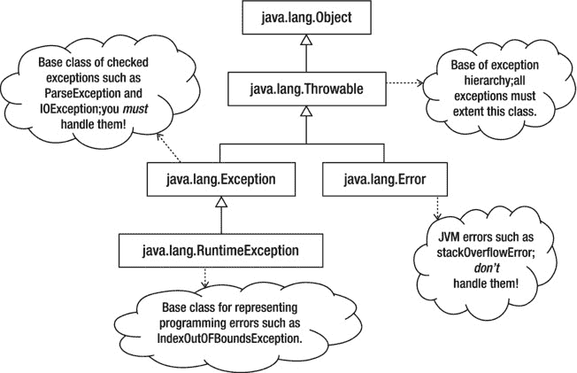

图 11-2. Java 的异常层次结构

## Exception 类

类型为 `Exception` 的异常被称为*受检异常*。如果代码可能抛出 `Exception`，你必须使用 catch 块处理它，或者声明该方法抛出该异常，从而强制该方法的调用者处理该异常。请参考清单 11-12。

清单 11-12. CheckedExceptionExample1.java

```java
import java.io.*;

class CheckedExceptionExample1 {
                public static void main(String []args) {
                                FileInputStream fis = new FileInputStream(args[0]);
                }
}
```

此程序会导致编译器错误。

```
CheckedExceptionExample1.java:5: 错误: 未报告的异常 FileNotFoundException；必须被捕获或声明抛出
                FileInputStream fis = new FileInputStream(args[0]);
                                                          ^
1 个错误
```

`FileInputStream` 的构造方法声明它会抛出 `FileNotFoundException` 异常。这个 `FileNotFoundException` 派生自 `Exception` 类，因此是一个受检异常。对于受检异常，Java 强制你考虑失败条件以及如何处理它们。现在，思考清单 11-13 中的代码：你正在尝试打开由字符串 `args[0]` 指定的文件，该文件可能不存在。如果你不想捕获并处理 `FileNotFoundException`，你可以声明 `main()` 方法抛出此异常。

清单 11-13. CheckedExceptionExample2.java

```java
import java.io.*;

class CheckedExceptionExample2 {
                public static void main(String []args) throws FileNotFoundException {
                                FileInputStream fis = new FileInputStream(args[0]);
                }
}
```


该程序可以顺利编译，不会出现任何错误。然而，这段代码仍然不尽如人意：如果你在命令行中传入一个搜索路径中不存在的文件名，程序将在抛出以下异常后崩溃：

```
D:\ > java CheckedExceptionExample2 somefile.txt
Exception in thread "main" java.io.FileNotFoundException: somefile.txt (The system cannot find the file specified)
        at java.io.FileInputStream.open(Native Method)
        at java.io.FileInputStream.<init>(FileInputStream.java:138)
        at java.io.FileInputStream.<init>(FileInputStream.java:97)
        at CheckedExceptionExample2.main(CheckedExceptionExample2.java:5)
```

更好的处理方式是向用户抛出一条错误消息，告知她必须将文件名作为程序的第一个参数传入，如清单 11-14 所示。

清单 11-14.  CheckedExceptionExample3.java

```
import java.io.*;

class CheckedExceptionExample3 {
                public static void main(String []args) {
                                try {
                                                FileInputStream fis = new FileInputStream(args[0]);
                                } catch(FileNotFoundException fnfe) {

System.out.println("Error: There is no file that exists with name " + args[0]);

System.out.println("Pass a valid file name as commandline argument!");
                                }
                }
}
```

现在，当传入一个不存在的文件名时，程序将终止并向用户显示这条有用的错误消息：

```
D:\ > java CheckedExceptionExample3 somefile.txt
Error: There is no file that exists with name somefile.txt
Pass a valid file name as commandline argument!
```

|  | 如果你的某个方法中的代码可能抛出受检异常，你可以在两种方案之间进行选择。你可以通过提供一个 `catch` 块来处理该异常，或者声明该方法会抛出该异常。如果你既不捕获异常，也不声明方法会抛出该异常，你的代码将无法编译。 |

表 11-1 总结了 `Exception` 类的重要子类。

表 11-1. Exception 类的重要子类

| 类 | 简短描述 |
| --- | --- |
| `CloneNotSupportedException` | 当在类未实现 `Cloneable` 接口的对象上调用 `clone()` 方法时抛出。 |
| `IOException` | 当输入/输出操作失败时抛出（例如，由于调用中断）。 |
| `EOFException` | 当意外到达文件末尾时抛出；`IOException` 的子类。 |
| `FileNotFoundException` | 当运行时无法定位或打开给定文件时抛出；`IOException` 的派生类。 |
| `ReflectiveOperationException` | 当反射操作失败时抛出；与反射相关的异常（如 `NoSuchMethodException` 和 `InvocationTargetException`）的超类。 |
| `RuntimeException` | 非受检异常的超类（将在本章下一节讨论）。 |
| `SQLException` | 当数据库访问或相关操作失败时抛出；与数据库相关的异常（如 `SerialException`）的超类。 |
| `ParseException` | 当解析失败时抛出（例如，在处理 `Format` 类中与区域设置相关的信息（如日期和时间）时）。 |

RuntimeException 类

`RuntimeException` 是 `Exception` 类的派生类。从该类派生的异常被称为*非受检异常*。我们先讨论一个 `RuntimeException` 的例子。回想一下清单 11-14 中关于 `FileNotFoundException` 的上下文（我们在清单 11-15 中重命名了该类）。

清单 11-15.  UnCheckedExceptionExample1.java

```
import java.io.*;

class UnCheckedExceptionExample1 {
                public static void main(String []args) throws FileNotFoundException {
                                FileInputStream fis = new FileInputStream(args[0]);
                }
}
```

如果你在运行该程序时没有向其传递任何参数，会发生什么？它将在抛出 `ArrayIndexOutOfBoundsException` 后崩溃。

```
Exception in thread "main" java.lang.ArrayIndexOutOfBoundsException: 0
                at UnCheckedExceptionExample1.main(UnCheckedExceptionExample1.java:5)
```

在这个程序中，你没有检查 `args` 的长度（以查看它是否包含任何值），就尝试在表达式 `args[0]` 中对 `args` 进行索引。换句话说，你假设用户总是会提供要打开的文件名作为命令行参数，而当没有提供参数时，就变成了一个异常情况。因此，这是一个编程错误。请注意，尽管表达式 `args[0]` 可能抛出 `ArrayIndexOutOfBoundsException`，但你并没有捕获这个异常，也没有在 `main()` 方法的 `throws` 子句中声明它。这是因为 `ArrayIndexOutOfBoundsException` 是一个 `RuntimeException`，所以它是一个非受检异常。

|  | 处理非受检异常是可选的。如果你在方法中编写的代码段可能抛出非受检异常，则并非必须捕获该异常或在该方法的 `throws` 子句中声明该异常。 |

如何修复清单 11-15 中的问题？对程序进行如下修改以处理 `ArrayIndexOutOfBoundsException`（如清单 11-16 所示）怎么样？

清单 11-16.  UnCheckedExceptionExample2.java

```
import java.io.*;

class UnCheckedExceptionExample2 {
                public static void main(String []args) throws FileNotFoundException {
                                try {
                                                FileInputStream fis = new FileInputStream(args[0]);
                                } catch (ArrayIndexOutOfBoundsException aioobe) {

System.out.println("Error: No arguments passed in the commandline!");

System.out.println("Pass the name of the file to open as commandline argument");
                                }
                }
}
```

运行时，该程序会打印以下内容：

```
D:\> java UnCheckedExceptionExample2
Error: No arguments passed in the commandline!
Pass the name of the file to open as commandline argument
```

是的，显示错误消息并告知用户正确的做法是好的。然而，这种捕获运行时异常（如 `ArrayIndexOutOfBoundsException`）的方法是一种*不良实践*！为什么？像 `ArrayIndexOutOfBoundsException` 这样的运行时异常表明可能存在*编程错误*，你应该修复代码，而不是捕获并处理这些异常。那么，你该如何修复这里的程序呢？你可以在尝试访问数组成员之前检查 `args` 的长度（参见清单 11-17）。

清单 11-17.  UnCheckedExceptionExample3.java

```
import java.io.*;

class UnCheckedExceptionExample3 {
                public static void main(String []args) throws FileNotFoundException {
                                // if any argument is passed, it would be greater than or equal to one
                                if(args.length >= 1) {
                                                FileInputStream fis = new FileInputStream(args[0]);
                                } else {
                        System.out.println("Error: No arguments passed in the commandline!");
                        System.out.println("Pass the name of the file to open as commandline argument");
                                }
                }
}
```


如果程序未传入任何参数，输出结果相同，但代码更优：它在实际索引数组之前会检查是否可以进行数组索引，因此采用了防御性编程。

|  | 执行防御性检查并避免引发不必要的运行时异常是一种良好的实践。 |

表 11-2 总结了 `RuntimeException` 类的重要子类。

表 11-2. RuntimeException 类的重要子类

| 类 | 简要描述 |
| --- | --- |
| `ArithmeticException` | 当算术错误发生时抛出，例如尝试除以零。 |
| `BufferOverflowException, BufferUnderflowException` | 当尝试写入超出缓冲区限制时抛出。 |
| `ClassCastException` | 当尝试在不兼容的类型之间进行转换时抛出（例如 String 转 Integer 类型或反之）。 |
| `NegativeArraySizeException` | 当尝试创建负大小的数组时抛出。 |
| `NoSuchElementException` | 当尝试在 `Enumeration` 上使用 `nextElement()` 方法但已无更多值可访问时抛出。 |
| `NullPointerException` | 当尝试通过空引用进行解引用时抛出。 |
| `UnsupportedOperationException` | 当尝试应用不支持或不存在的操作时抛出（例如，尝试写入只读文件系统将导致抛出 `ReadOnlyFileSystemException`，它是此异常的一个派生类）。 |
| `IllegalArgumentException` | 当向方法传递了不正确或不合适的参数时抛出。 |
| `IndexOutOfBoundsException` | 当尝试使用不在允许范围内的索引值访问数据结构时抛出；是 `ArrayIndexOutOfBoundsException` 和 `StringIndexOutOfBoundsException` 的基类。 |

Error 类

当 JVM 检测到程序中存在严重的异常状况时，它会抛出一个 `Error` 类型的异常。当你遇到 `Error` 或其子类型的异常时，该异常并非设计让你处理。最佳做法是让程序崩溃！为什么？让我们通过一个简单的例子来理解这一点。

假设你尝试运行一个不存在的程序！例如，考虑你在清单 11-16 中看到的 `UnCheckedExceptionExample3` 类；如果你在类名的大小写上出错并尝试调用它，你将得到 `NoClassDefFoundError`。

```
D:\ > java UncheckedExceptionExample3
Exception in thread "main" java.lang.NoClassDefFoundError: UncheckedExceptionExample3 (wrong name: UnCheckedExceptionExample3)
        at java.lang.ClassLoader.defineClass1(Native Method)
        at java.lang.ClassLoader.defineClass(ClassLoader.java:791)
        at java.security.SecureClassLoader.defineClass(SecureClassLoader.java:142)
        at java.net.URLClassLoader.defineClass(URLClassLoader.java:449)
        at java.net.URLClassLoader.access$100(URLClassLoader.java:71)
        at java.net.URLClassLoader$1.run(URLClassLoader.java:361)
        at java.net.URLClassLoader$1.run(URLClassLoader.java:355)
        at java.security.AccessController.doPrivileged(Native Method)
        at java.net.URLClassLoader.findClass(URLClassLoader.java:354)
        at java.lang.ClassLoader.loadClass(ClassLoader.java:423)
        at sun.misc.Launcher$AppClassLoader.loadClass(Launcher.java:308)
        at java.lang.ClassLoader.loadClass(ClassLoader.java:356)
        at sun.launcher.LauncherHelper.checkAndLoadMain(LauncherHelper.java:480)
```

正如堆栈跟踪中有帮助的部分所示（“`wrong name: UnCheckedExceptionExample3`”），你提供了一个要加载的类，但该名称的类并不存在（注意 Java 中的名称是区分大小写的）。因此，JVM 以 `NoClassDefFoundError` 作为响应。

让我们考虑一个编程示例来理解 `error` 是如何发生的。假设你正在编写一个递归方法来计算一个数的阶乘，但忘记放入正确的终止条件（参见清单 11-18）。

清单 11-18.  NonTerminatingRecursion.java

```
class NonTerminatingRecursion {
                // factorial 是一个递归调用
                static int factorial(int n) {
                                int result = 0;
                                // 假设以下终止条件语句缺失 ...
                                // if(n == 0) return 1;
                                result = factorial(n - 1) * n;
                                return result;
                }
                public static void main(String ... args) {
                                System.out.println("factorial of 4 is: " + factorial(4));
                }
}
```

运行时，该程序在抛出此异常后崩溃：

```
Exception in thread "main" java.lang.StackOverflowError
                at NonTerminatingRecursion.factorial(NonTerminatingResursion.java:7)
                at NonTerminatingRecursion.factorial(NonTerminatingResursion.java:7)
                [... 此处的 "NonTerminatingRecursion.factorial(NonTerminatingResursion.java:7)" 重复了大量次数...]
```

对于每个方法调用，JVM 会在其栈区创建一个名为*栈帧*的运行时结构。由于递归调用，JVM 不断创建这样的栈帧，一段时间后，它会耗尽栈区。此时，JVM 无法继续执行，因此抛出 `StackOverflowError`。当你遇到 `StackOverflowError` 时，几乎可以确定是编程错误导致了此异常。你需要修复程序以避免引发此异常。

|  | `Error` 类型的异常表示程序中的异常状况。捕获此异常并试图继续执行、假装什么都没发生是没有意义的。这样做是一种*非常*糟糕的实践！ |

表 11-3 提供了 `Error` 类的重要子类列表**。**

表 11-3. Error 类的重要子类

| 类 | 简要描述 |
| --- | --- |
| `AssertionError` | 当断言失败时抛出（本章稍后讨论）。 |
| `IOError` | 当发生严重的 I/O 错误时抛出。 |
| `VirtualMachineError` | 当 JVM 本身进入错误状态（由于 bug）或 JVM 资源耗尽（例如内存）时抛出。 |
| `OutOfMemoryError` | 当 JVM 无法再分配内存时抛出；是 `VirtualMachineError` 的派生类。 |
| `LinkageError` | 当 JVM 执行的链接失败时抛出（例如，由于循环类层次结构，在这种情况下将抛出 `ClassCircularityError`，它是 `LinkageError` 的派生类）。 |
| `NoClassDefFoundError` | 当类加载器无法找到某个类而尝试加载其定义时抛出。 |
| `StackOverflowError` | 当应用程序有无终止的递归调用，或应用程序进行了过多 JVM 无法处理的函数调用时抛出；是 `VirtualMachineError` 的派生类。 |

Throws 子句

一个方法可以抛出受检异常；`throws` 子句在方法签名中指定这些受检异常。你在本章开头已经简要了解了 `throws` 关键字。在 `throws` 子句中，你列出方法可能抛出的*受检异常*，因此理解受检异常是理解 throws 子句的前提。由于我们已经在上一节关于异常类型的部分中介绍了受检异常，现在我们将介绍 throws 子句。


让我们尝试读取当前目录下名为 `integer.txt` 的文件中存储的一个整数。`Scanner` 类有一个重载的构造函数，它接受一个 `File` 对象作为输入，因此我们尝试使用它。清单 11-19 展示了该程序。它能正常工作吗？

清单 11-19.  ThrowsClause1.java

```
import java.io.*;
import java.util.*;
class ThrowsClause1 {
                public static void main(String []args) {
                                System.out.println("正在从文件 'integer.txt' 中读取一个整数：");
                                Scanner consoleScanner = new Scanner(new File("integer.txt"));
                System.out.println("你输入的整数值是：" + consoleScanner.nextInt());
                }
}
```

这段代码会导致编译器错误：“`unreported exception FileNotFoundException; must be caught or declared to be thrown.`” 如果你查看这个 `Scanner` 方法的声明，你会看到一个 throws 子句：

```
public Scanner(File source) throws FileNotFoundException {
```

因此，任何调用此构造函数的方法要么应该处理此异常，要么添加一个 throws 子句来声明该方法可能抛出此异常。给 `main()` 方法添加一个 throws 子句；参见清单 11-20。

清单 11-20.  ThrowsClause2.java

```
import java.io.*;
import java.util.*;

class ThrowsClause2 {
                public static void main(String []args) throws FileNotFoundException {
                                System.out.println("正在从文件 'integer.txt' 中读取一个整数：");
                                Scanner consoleScanner = new Scanner(new File("integer.txt"));
                System.out.println("你输入的整数值是：" + consoleScanner.nextInt());
                }
} 
```

如果你运行此程序，并且不存在名为 `integer.txt` 的文件，程序将在抛出此异常后崩溃：

```
正在从文件 'integer.txt' 中读取一个整数：
Exception in thread "main" java.io.FileNotFoundException: integer.txt (系统找不到指定的文件)
                at java.io.FileInputStream.open(Native Method)
                at java.io.FileInputStream.<init>(FileInputStream.java:138)
                at java.util.Scanner.<init>(Scanner.java:656)
                at ThrowsClause2.main(ThrowsClause2.java:7)
```

现在，让我们将 `main()` 方法中的代码提取到一个名为 `readIntFromFile()` 的新方法中。你将其定义为一个实例方法，因此你还需要创建一个 `ThrowsClause3` 类的对象，以便从 `main()` 方法中调用此方法。由于 `readIntFromFile()` 中的代码可能抛出 `FileNotFoundException`，它要么需要引入一个 catch 处理程序来处理此异常，要么在其 throws 子句中声明此异常（参见清单 11-21）。

清单 11-21.  ThrowsClause3.java

```
import java.io.*;
import java.util.*;

class ThrowsClause3 {
                // 由于此方法不处理 FileNotFoundException，
                // 该方法必须在 throws 子句中声明此异常
                public int readIntFromFile() throws FileNotFoundException {
                                Scanner consoleScanner = new Scanner(new File("integer.txt"));
                                return consoleScanner.nextInt();
                }

// 由于 readIntFromFile() 抛出 FileNotFoundException 而 main() 不处理它，
                // 因此 main() 方法在其 throws 子句中声明此异常
                public static void main(String []args) throws FileNotFoundException {
                                System.out.println("正在从文件 'integer.txt' 中读取一个整数：");
                System.out.println("你输入的整数值是：" +                 new ThrowsClause3().readIntFromFile());
                }
}
```


程序在清单 11-20 和清单 11-21 中的行为保持一致。然而，清单 11-21 展示了 `main()` 方法在其 throws 子句中仍然必须声明抛出 `FileNotFoundException`（否则程序将无法编译）。

方法重写与 throws 子句

当一个可重写的方法包含 throws 子句时，重写该方法需要考虑诸多因素。以清单 11-22 中的程序为例，它实现了一个名为 `IntReader` 的接口。该接口声明了一个名为 `readIntFromFile()` 的方法，其 throws 子句中列出了 `FileNotFoundException`。

清单 11-22.  ThrowsClause4.java

```
import java.io.*;
import java.util.*;

// 此接口旨在供从文件中读取整数的类实现
interface IntReader {
                int readIntFromFile() throws IOException;
}

class ThrowsClause4 implements IntReader {
                // 使用相同的 throws 子句或更具体的 throws 子句实现 readIntFromFile
                public int readIntFromFile() throws FileNotFoundException {
                                Scanner consoleScanner = new Scanner(new File("integer.txt"));
                                return consoleScanner.nextInt();
                }
                // 此代码中省略了 main 方法，因为此处重点在于理解涉及 throws 子句时的重写问题
}
```

在这段代码中，你可以观察到几个重要事实。首先，你可以在接口中声明的方法上使用 throws 子句；实际上，你也可以为抽象类中声明的抽象方法提供 throws 子句。其次，`IntReader` 接口中声明的方法声明抛出 `IOException`，这是一个比 `FileNotFoundException` 更通用的异常（图 11-3）。在实现方法时，既可以提供与基方法相同异常类型的 throws 子句，也可以提供比基方法更具体的异常类型。在此例中，`readIntFromFile()` 方法在其 throws 子句中列出了更具体的异常（`FileNotFoundException`），而 `IntReader` 接口中声明的基方法在其 throws 子句中列出的是更通用的异常 `IOException`。

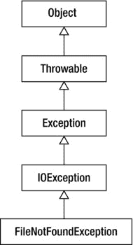

图 11-3.  FileNotFoundException 的类层次结构

如果尝试更改 throws 子句会怎样？有多种方式可以更改重写方法中的 throws 子句，包括以下几种：

1.  不提供任何 throws 子句。
2.  列出更通用的受检异常进行抛出。
3.  在基方法给定的受检异常基础上，额外列出更多的受检异常。

如果你尝试上述任何一种情况，都会遇到编译器错误。例如，尝试在实现 `IntReader` 接口的类中，不为 `readIntFromFile()` 方法提供 throws 子句。

```
public int readIntFromFile() {
        Scanner consoleScanner = new Scanner(new File("integer.txt"));
                return consoleScanner.nextInt();
}
```

你会得到如下编译器错误：“`unreported exception FileNotFoundException; must be caught or declared to be thrown.`”

总而言之，基类方法的 throws 子句是其向该方法调用者提供的一份契约：它表明调用者应处理列出的异常，或在其自身的 throws 子句中声明这些异常。当重写基方法时，派生方法也应遵守该契约。基方法的调用者只准备处理基方法中列出的异常，因此重写方法不能抛出比列出的受检异常更通用或其他的异常。

然而，请注意，关于派生类方法的 throws 子句应遵循基方法 throws 子句契约的讨论，仅限于受检异常。与基类方法的 throws 子句相比，非受检异常仍然可以添加或移除。例如，考虑以下情况：

```
public int readIntFromFile() throws IOException, NoSuchElementException {
        Scanner consoleScanner = new Scanner(new File("integer.txt"));
                return consoleScanner.nextInt();
}
```

这是一个可接受的 throws 子句，因为 `readIntFromFile()` 方法可能会抛出 `NoSuchElementException`。该异常是一个非受检异常，当 `nextInt()` 方法无法从文件中读取整数时会被抛出。这是一种常见情况，例如，如果你有一个名为 `integer.txt` 的空文件，尝试从中读取整数将导致此异常。

要点记忆

以下是一些关于 throws 语句的值得注意的要点，可帮助您应对 OCPJP 7 考试：

*   如果方法没有 throws 子句，这*并不*意味着它不能抛出任何异常；只是意味着它不能抛出任何*受检*异常。
*   良好的实践是使用 `@throws` JavaDoc 标签来记录方法可能抛出异常（包括受检和非受检异常）的特定情况或场景。
*   在 throws 子句中列出方法可能抛出的非受检异常是一种不良实践。为什么？因为编译器无法强制调用者处理非受检异常，所以将它们列在 throws 子句中并无意义。相反，如果方法可能抛出非受检异常，最好使用 `@throws` 标签来记录这种可能性。
*   静态初始化块不能抛出任何受检异常。为什么？请记住，静态初始化块在类加载时被调用，因此调用者无法处理抛出的异常。此外，也无法在 throws 子句中声明受检异常。
*   非静态初始化块可以抛出受检异常；但是，所有构造函数都应在其 throws 子句中声明这些异常。为什么？编译器在代码生成阶段会将非静态初始化块和构造函数的代码合并，因此可以使用构造函数的 throws 子句来声明非静态初始化块可能抛出的受检异常。
*   重写方法不能在 throws 子句中声明比基方法 throws 子句中声明的异常列表更多的异常。为什么？基方法的调用者只能看到该方法 throws 子句中给出的异常列表，并会在其代码中声明或处理这些受检异常（而不会处理更多）。
*   重写方法可以声明比基方法 throws 子句中列出的异常更具体的异常；换句话说，你可以在重写方法的 throws 子句中声明派生异常。
*   如果一个方法在两个或多个接口中声明，并且该方法在这些接口的 throws 子句中声明抛出不同的异常，则实现应列出所有这些异常。

自定义异常

在大多数情况下，使用 Java 库中已提供的异常就足够了。例如，如果你正在检查传递给公共函数的参数的有效性，并发现它们为 null 或超出预期范围，你可以抛出 `IllegalArgumentException`。然而，对于大多数非平凡的应用，你需要开发自己的异常类（自定义异常）来指示异常情况。


如何定义自定义异常？有两种选择：你可以根据需求扩展 `Exception` 或 `RuntimeException` 类。如果你希望强制自定义异常的使用者处理该异常，则可以从 `Exception` 类扩展你的异常类，这将使你的自定义异常成为受检异常。如果你希望给自定义异常的使用者提供灵活性，由他们自行决定是否处理异常，则可以从 `RuntimeException` 类派生你的异常。因此，选择自定义异常的基类是一个设计决策。那么，扩展 `Throwable` 或 `Error` 类来创建自定义异常呢？`Throwable` 类过于通用，不适合作为异常的基类，因此不推荐这样做。`Error` 类则保留用于 JVM 可能抛出的致命异常（例如 `StackOverflowError`），因此也不建议将其作为异常的基类。

|  | 自定义异常应扩展 `Exception` 或 `RuntimeException` 类。通过扩展 `Throwable` 或 `Error` 类来创建自定义异常是一种不良实践。 |

要扩展基类，你需要了解基类提供了哪些方法。在本例中，你希望通过扩展 `Exception` 或 `RuntimeException` 类来创建自定义异常。由于 `Exception` 类是 `RuntimeException` 类的基类，因此了解 `Exception` 类的成员就足够了。表 11-4 列出了 `Exception` 类的重要方法（包括构造方法）。

表 11-4. Exception 类的重要方法和构造方法

| 成员 | 简要描述 |
| --- | --- |
| `Exception()` | `Exception` 类的默认构造方法，不包含异常的额外（或详细）信息。 |
| `Exception(String)` | 构造方法，接受一个包含异常详细信息的字符串作为参数。 |
| `Exception(String, Throwable)` | 除了接受一个详细信息的字符串作为参数外，此异常构造方法还接受异常的原因（即另一个异常）作为参数。 |
| `Exception(Throwable)` | 构造方法，接受异常的原因作为参数。 |
| `String getMessage()` | 返回详细消息（创建异常时作为字符串传入）。 |
| `Throwable getCause()` | 返回异常的原因（如果有，否则返回 null）。 |
| `Throwable[] getSuppressed()` | 以数组形式返回被抑制的异常列表（通常在使用 try-with-resources 语句时产生）。 |
| `void printStackTrace()` | 将堆栈跟踪（即方法调用列表及相关的行号）打印到控制台（标准错误流）。如果异常中包含了原因（即另一个异常对象），则该信息也会被打印。此外，如果有任何被抑制的异常，它们也会被打印。 |

为了说明如何创建自己的异常类，假设你想创建一个名为 `InvalidInputException` 的自定义异常。当你尝试读取输入（本例中为读取整数）时，如果失败，你想抛出这个 `InvalidInputException`。清单 11-23 通过扩展 `RuntimeException` 类定义了该异常类。

清单 11-23.  InvalidInputException.java

```
// 一个自定义的“非受检异常”，旨在当用户提供的输入无效时抛出
class InvalidInputException extends RuntimeException {
                // 默认构造方法
                public InvalidInputException() {
                                super();
                }

// 构造方法，接受我们在抛出异常时传递的字符串详细信息
                public InvalidInputException(String str) {
                                super(str);
                }

// 构造方法，记录异常的原因并抛出新的异常
                public InvalidInputException(Throwable originalException) {
                                super(originalException);
                }

// 第一个参数接受抛出异常时创建的详细信息字符串
                // 第二个参数用于记录异常的原因
                public InvalidInputException(String str, Throwable originalException) {
                                super(str, originalException);
                }
}
```

在这个 `InvalidInputException` 类中，你没有引入任何新字段，但如果有必要，你可以添加任何字段。这也是一个简单的自定义异常，其构造方法只是调用了基类中相同类型的构造方法。类 `CustomExceptionTest`（参见清单 11-24）展示了如何使用这个自定义异常。

清单 11-24.  InvalidInputException.java

```
import java.util.*;

// 用于测试自定义异常 InvalidInputException 的类
class CustomExceptionTest {
                public static int readIntFromConsole() {
                                Scanner consoleScanner = new Scanner(System.in);
                                int typedInt = 0;
                                try {
                                                typedInt = consoleScanner.nextInt();
                                } catch(NoSuchElementException nsee) {
                                                System.out.println("正在包装异常并抛出...");

throw new InvalidInputException("在控制台中输入了无效的整数", nsee);
                                } catch(Exception e) {
                                                // 在此处处理所有其他异常...

System.out.println("错误：遇到异常，无法从控制台读取整数... ");
                                }
                                return typedInt;
                }
                public static void main(String [] args) {
                                System.out.println("请在控制台中输入一个整数：");
                                try {

System.out.println("你输入的整数值是：" + readIntFromConsole());
                                } catch(InvalidInputException iie) {
                                                System.out.println("错误：控制台输入无效... ");
                        System.out.println("当前捕获的异常类型是：" + iie);
                        System.out.println("最初捕获的异常类型是：" + iie.getCause());
                                }
                }
}
```

在阅读代码讨论之前，请先编译并运行此程序。

```
D:\> java CustomExceptionTest
请在控制台中输入一个整数：
one
正在包装异常并抛出...
错误：控制台输入无效...
当前捕获的异常类型是：InvalidInputException: 在控制台中输入了无效的整数
最初捕获的异常类型是：java.util.InputMismatchException
```

在这段代码中，你使用 `InvalidInputException` 的方式与 Java 库中已定义的任何其他异常相同。你在 `main()` 方法中捕获了从 `readIntFromConsole()` 方法抛出的 `InvalidInputException`。以下语句调用了 `InvalidInputException` 的 `toString()` 方法：

```
System.out.println("当前捕获的异常类型是：" + iie);
```


你没有重写 `toString()` 方法，因此 `InvalidInputException` 类从基类 `RuntimeException` 继承了 `toString()` 方法的默认实现。这个默认的 `toString()` 方法会打印所抛出异常的名称（`InvalidInputException`），并且还会包含你在创建异常对象时传入的详细信息字符串（“`Invalid integer input typed in console`”）。`main()` 方法中的最后一条语句用于获取异常的原因。

```
System.out.println("The originally caught exception is of type: " + iie.getCause());
```

由于 `InvalidInputException` 的原因是 `InputMismatchException`，因此该异常名称会以其完全限定名 `java.util.InputMismatchException` 的形式打印在控制台中。你可以认为 `InputMismatchException` *导致*了 `InvalidInputException`；这两个异常被称为*链式异常*。

断言

在创建应用程序时，你会做出许多假设。然而，经常会发生假设不成立的情况，从而导致错误状态。`assert` 语句用于检查或测试你对程序所做的假设。

关键字 `assert` 为 Java 中的断言提供了支持。每个断言语句都包含一个布尔表达式。如果布尔表达式的结果为 true，则表示假设成立，程序正常运行。但是，如果布尔结果为 false，则说明你对程序所做的假设不再成立，并且会抛出一个 `AssertionError`。请记住，`Error` 类及其派生类表示严重的运行时错误，并且不应该被处理。同样，如果抛出了 `AssertionError`，最佳做法是不要捕获该异常，而是让程序终止。之后，你需要检查假设为何不成立，然后修复程序。

有很多理由说明你应该在程序中添加断言。一个原因是它有助于及早发现问题；当你在程序中检查假设时，如果其中任何一个假设失败，你就能立即知道问题出在哪里以及需要修复什么。此外，当其他程序员阅读你带有断言的代码时，他们能够更好地理解代码，因为你通过断言明确地表达了你的假设。

断言语句

Java 中的断言语句有两种形式：

```
 assert booleanExpression;

assert booleanExpression : "Detailed error message string";
```

如果在 assert 语句中使用了非布尔表达式，则会导致编译错误。清单 11-25 包含了第一个关于断言的示例。

清单 11-25.  AssertionExample1.java

```
class AssertionExample1 {
                public static void main(String []args) {
                                int i = -10;
                                if(i < 0) {
                                                // 如果为负值，则转换为正值
                                                i = -i;
                                }
                                System.out.println("the value of i is: " + i);
                                // 此时，假设 i 不能为负；
                                // 由于这是一个始终成立的假设，因此断言此条件
                                assert (i >= 0) : "impossible: i is negative!";
                }
}
```

在这个程序中，你检查了 i 的值是否小于 0；你使用表达式 –i 将其转换为正值。一旦条件检查 `if (i < 0)` 完成，i 的值就不能为负，或者这是你的假设。这样的假设可以用 assert 语句来断言。以下是 assert 语句：

```
assert (i >= 0) : "impossible: i is negative!";
```

如果布尔表达式 `(i >= 0)` 求值为 true，程序将正常运行。但是，如果它求值为 false，程序将通过抛出 `AssertionError` 而崩溃。让我们来检查这种行为（你需要使用 `–ea` 标志在运行时启用断言；我们稍后将详细讨论这个标志）。

```
D:\>java -ea AssertionExample1
the value of i is: 10
```

是的，这个程序成功执行，没有抛出任何异常。

是否存在某个 i 的值会导致条件失败？是的，存在！如果 i 的值是整数的最小可能值，那么它无法被转换为正值。为什么？请记住，整数的范围是 -2³¹ 到 2³¹ – 1，因此 i 的整数值范围为 –2147483648 到 2147483647。换句话说，正值 2147483648 不在整数的范围内。所以，如果 `i` 的值是 –2147483648，那么表达式 `-i` 将会*溢出*，结果再次得到值 –2147483648。因此，你的假设不成立。

在清单 11-25 中，将 i 的值改为整数的最小值，如下所示：

```
int i = Integer.MIN_VALUE;
```

现在，尝试运行这个程序。

```
D:\> java -ea AssertionExample1
the value of i is: -2147483648
Exception in thread "main" java.lang.AssertionError: impossible: i is negative!
        at AssertionExample1.main(AssertionExample1.java:12)
```

在此输出中，请注意断言是如何失败的。应用程序崩溃是因为程序抛出了 `AssertionError`，并且没有处理器，因此程序终止。

你看到断言在运行时是禁用的；要在运行时启用断言，请使用 `-ea` 开关（或其更长的形式 `-enableasserts`）。要在运行时禁用断言，请使用 `-da` 开关。如果断言在运行时默认是禁用的，那么 `-da` 开关有什么用呢？有很多用途。例如，如果你想为给定包中的所有类启用断言，但又想禁用该包中特定类的断言，那么 `-da` 开关就很有用。表 11-5 列出了重要的命令行参数及其含义。请注意，你无需重新编译程序即可启用或禁用断言；只需在调用 JVM 时使用命令行参数来启用或禁用它们即可。

表 11-5. 用于启用/禁用断言的重要命令行参数

| 命令行参数 | 简短描述 |
| --- | --- |
| `-ea` | 默认启用断言（系统类除外）。 |
| `-ea:<类名>` | 为指定的类名启用断言。 |
| `-ea:<包名>...` | 为指定包 `<包名>` 中的所有成员启用断言。 |
| `-ea:...` | 为指定的未命名包启用断言。 |
| `-esa` | 是 `-enablesystemsassertions` 的缩写；在系统类中启用断言。此选项很少使用。 |
| `-da` | 默认禁用断言（系统类除外）。 |
| `-da:<类名>` | 为指定的类名禁用断言。 |
| `-ea:<包名>...` | 禁用指定包 `<包名>` 中所有成员的断言。 |
| `-da:...` | 为指定的未命名包禁用断言。 |
| `-dsa` | 是 `-disablesystemsassertions` 的缩写；在系统类中禁用断言。此选项很少使用。 |

如何不使用断言

理解断言的关键在于，它们对于调试和测试应用程序非常有用，并且断言在应用程序部署给最终用户时应该被禁用。


*   不要使用断言来验证输入值或公共方法的参数。对于此类运行时故障，应使用异常来指示。
*   不要使用断言来检查应用程序正常运行所需的条件。由于断言在运行时默认是禁用的，当代码中不存在断言的条件时，应用程序将无法正常运行。
*   `assert`语句中给出的布尔表达式不应有副作用——例如修改变量值、将值打印到控制台等。换句话说，无论断言是启用还是禁用，应用程序的功能都应保持不变。

**提问时间！**

1.  考虑来自 `java.nio.file` 包的以下类层次结构并回答问题。

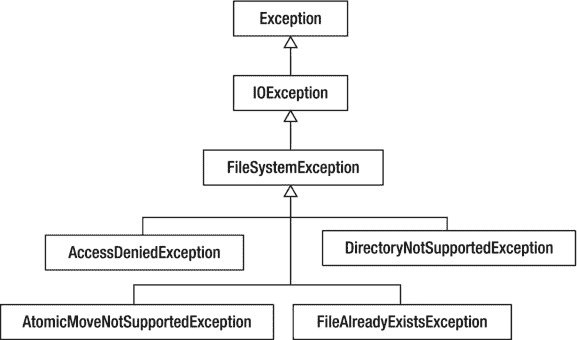

在以下类定义中，基类 `Base` 有一个方法 `foo()`，该方法抛出 `FileSystemException`；派生类 `Deri` 继承自 `Base` 并重写了 `foo()` 的定义。

```
    class Base {
                    public void foo() throws FileSystemException {
                                    throw new FileSystemException("");
                    }
    }

class Deri extends Base {
                    /* 在此处提供 foo 定义 */
    }
    ```

以下 `Deri` 类中 `foo()` 方法的哪些重写定义与基类 `foo()` 方法定义兼容？选择所有在替换注释 `/* 在此处提供 foo 定义 */` 后能够无编译错误通过的 `foo()` 方法定义。

*   A.

```
        public void foo() throws IOException {           super.foo();
          }
        ```

*   B.

```
        public void foo() throws AccessDeniedException {
                              throw new AccessDeniedException("");
          }
        ```

*   C.

```
        public void foo() throws FileSystemException, RuntimeException {
                              throw new NullPointerException();
          }
        ```

*   D.

```
        public void foo() throws Exception {
                              throw new NullPointerException();
          }
        ```

**答案：** B 和 C。

（在选项 A 和 D 中，`throws` 子句分别声明抛出 `IOException` 和 `Exception`，它们比 `FileSystemException` 更通用，因此与基类方法定义不兼容。在选项 B 中，`foo()` 方法声明抛出 `AccessDeniedException`，它比 `FileSystemException` 更具体，因此与基类 `foo()` 方法的定义兼容。在选项 C 中，`throws` 子句声明抛出 `FileSystemException`，这与基类 `foo()` 方法的定义相同。此外，它还声明抛出 `RuntimeException`，这不是一个受检异常，因此 `foo()` 方法的定义与基类 `foo()` 方法的定义兼容）。

2.  考虑以下程序：

```
    class ChainedException {
                    public static void foo() {
                                    try {
                                                    throw new ArrayIndexOutOfBoundsException();
                                    } catch(ArrayIndexOutOfBoundsException oob) {
                                                    RuntimeException re = new RuntimeException(oob);
                                                    re.initCause(oob);
                                                    throw re;
                                    }
                    }
                    public static void main(String []args) {
                                    try {
                                                    foo();
                                    } catch(Exception re) {
                                                    System.out.println(re.getClass());
                                    }
                    }
    }
    ```

执行时，该程序会打印以下哪个选项？

*   A.  class java.lang.RuntimeException
    *   B.  class java.lang.IllegalStateException
    *   C.  class java.lang.Exception
    *   D.  class java.lang.ArrayIndexOutOfBoundsException

**答案：** B. class java.lang.IllegalStateException

（在表达式 `new RuntimeException(oob);` 中，异常对象 `oob` 已经链接到了 `RuntimeException` 对象。不能在构造函数调用期间已经链接了异常对象的异常对象上调用 `initCause()` 方法。因此，调用 `re.initCause(oob);` 会导致 `initCause()` 抛出一个 `IllegalStateException`。）

3.  考虑以下程序：

```
    class ExceptionTest {
                    public static void foo() {
                                    try {
                                                    throw new ArrayIndexOutOfBoundsException();
                                    } catch(ArrayIndexOutOfBoundsException oob) {
                                                    throw new Exception(oob);
                                    }
                    }
                    public static void main(String []args) {
                                    try {
                                                    foo();
                                    } catch(Exception re) {
                                                    System.out.println(re.getCause());
                                    }
                    }
    }
    ```

以下哪个选项正确描述了此程序的行为？

*   A.  java.lang.Exception
    *   B.  java.lang.ArrayIndexOutOfBoundsException
    *   C.  class java.lang.IllegalStateException
    *   D.  此程序因编译器错误而失败

**答案：** D. 此程序因编译器错误而失败

（`foo()` 方法捕获了 `ArrayIndexOutOfBoundsException` 并将其链接到一个 `Exception` 对象。然而，由于 `Exception` 是一个受检异常，它必须在 `foo()` 的 `throws` 子句中声明。因此，此程序会导致以下编译器错误：

```
    ExceptionTest.java:6: error: unreported exception Exception; must be caught or declared to be thrown
                            throw new Exception(oob);
                            ^

1 error)
    ```

4.  考虑以下程序：

```
    import java.io.*;
      import java.sql.*;

class MultiCatch {
                    public static void fooThrower() throws FileNotFoundException {
                                    throw new FileNotFoundException();
                    }
                    public static void barThrower() throws SQLException {
                                    throw new SQLException();
                    }
                    public static void main(String []args) {
                                    try {
                                                    fooThrower();
                                                    barThrower();
                    } catch(FileNotFoundException || SQLException multie) {
                                                    System.out.println(multie);
                                    }
                    }
    }
    ```

以下哪个选项正确描述了此程序的行为？

*   A.  此程序打印以下内容：java.io.FileNotFoundException。
    *   B.  此程序打印以下内容：java.sql.SQLException。
    *   C.  此程序打印以下内容：java.io.FileNotFoundException || java.sql.SQLException。
    *   D.  此程序因编译器错误而失败。

**答案：** D. 此程序因编译器错误而失败。

（对于多捕获块，需要使用单竖线（`|`）符号，而不是双竖线（`||`），正如该程序中所提供的那样。因此，此程序将因编译器错误而失败。）

5.  考虑来自 `javax.security.auth.login` 包的以下类层次结构并回答问题。


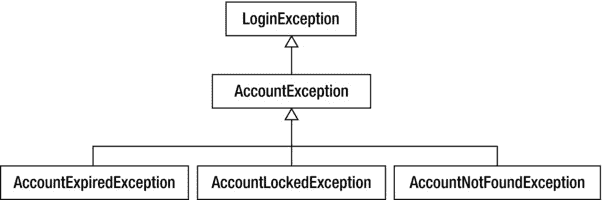

*   5.1  下列哪个使用了多捕获异常处理特性的处理程序可以无错误地编译？
    *   A.  `catch (AccountException | LoginException exception)`
    *   B.  `catch (AccountException | AccountExpiredException exception)`
    *   C.  `catch (AccountExpiredException | AccountNotFoundException exception)`
    *   D.  `catch (AccountExpiredException exception1 | AccountNotFoundException exception2)`

**答案：** C. `catch (AccountExpiredException | AccountNotFoundException exception)`

（对于 A 和 B，基类型处理程序与派生类型处理程序一同提供，因此多捕获不正确。对于 D，异常名称 exception1 是多余的，会导致语法错误。C 是正确选项，可以无错误地编译。）

6.  考虑以下代码片段，它使用了此异常层次结构：

```
    try {
         LoginException le = new AccountNotFoundException();
              throw (Exception) le;
       }
       catch (AccountNotFoundException anfe) {
            System.out.println("在 AccountNotFoundException 的处理程序中");
       }
       catch (AccountException ae) {
            System.out.println("在 AccountException 的处理程序中");
       }
       catch (LoginException le) {
            System.out.println("在 LoginException 的处理程序中");
       }
       catch (Exception e) {
            System.out.println("在 Exception 的处理程序中");
       }
    ```

执行时，此代码片段将打印以下哪个语句？

*   A.  在 AccountNotFoundException 的处理程序中
    *   B.  在 AccountException 的处理程序中
    *   C.  在 LoginException 的处理程序中
    *   D.  在 Exception 的处理程序中

**答案：** A. 在 AccountNotFoundException 的处理程序中

（在此代码中，异常的创建类型是 `AccountNotFoundException`。虽然异常对象存储在 `LoginException` 类型的变量中，然后被类型转换为 `Exception`，但异常的动态类型保持不变，仍然是 `AccountNotFoundException`。在查找 catch 处理程序时，Java 运行时根据对象的动态类型查找精确的处理程序。由于它立即作为第一个处理程序可用，因此这个完全匹配的 catch 处理程序被执行。）

总结

异常处理简介

*   当 try 块中抛出异常时，JVM 会在方法调用链的 catch 处理程序列表中查找匹配的 catch 处理程序。如果未找到匹配的处理程序，则该未处理的异常将导致应用程序崩溃。
*   在提供多个异常处理程序（堆叠的 catch 处理程序）时，应在通用异常处理程序之前提供特定的异常处理程序。在派生处理程序之前提供基异常处理程序将导致编译器错误。
*   你可以使用诸如 `printStackTrace()` 和 `getStackTrace()` 之类的方法以编程方式访问堆栈跟踪，这些方法可以在任何异常对象上调用。
*   一个 try 块可以有多个 catch 处理程序。如果两个或多个异常的原因相似，并且处理代码也相似，你可以考虑合并这些处理程序，使其成为一个多捕获块。
*   无论 try 块是成功执行还是导致异常，finally 块中的代码都将被执行。这使得 finally 块成为释放资源（如文件句柄、数据库句柄、网络流等）最合适的地方。

Try-with-Resources

*   忘记通过显式调用 `close()` 方法来释放资源是一个常见错误。你可以使用 try-with-resources 语句来简化代码并自动关闭资源。要使资源在 try-with-resources 语句中可用，该资源的类必须实现 `java.lang.AutoCloseable` 接口并定义 `close()` 方法。
*   你可以在一个 try-with-resources 语句中自动关闭多个资源。这些资源需要在 try-with-resources 语句头部用分号分隔。
*   由于你可以在一个 try-with-resources 语句中使用多个资源，因此 try 块和 finally 块中抛出多个异常的可能性很高。如果 try 块抛出一个异常，并且 finally 块也抛出了异常，那么 finally 块中抛出的异常将被添加为抑制异常，附加到从 try 块抛出给调用者的异常上。

异常类型

*   `Throwable` 类是异常层次结构的根类。只有 `Throwable` 及其派生类可以与 Java 异常处理关键字（如 try、catch 和 throws）一起使用。
*   `Exception` 类（除了其 `RuntimeException` 类的子层次结构）及其派生类被称为*受检异常*。这些异常表示程序执行时*可以合理预期*会发生的异常情况，因此必须处理它们。包含可能抛出受检异常的代码段的方法必须提供 catch 处理程序来处理它，或者在其 throws 子句中声明该异常。
*   `RuntimeException` 和 `Error` 类及其派生类被称为*非受检异常*。它们可以在程序中的任何位置抛出（无需声明该代码段可能抛出这些异常）。
*   `RuntimeException` 类及其派生类表示编程错误（逻辑错误），并且*通常*不期望在程序中被捕获和处理。然而，在某些情况下，在 catch 块中处理这些异常是有意义的。
*   `Error` 类及其派生类表示由于 JVM 错误而引发的异常；要么是 JVM 检测到严重的异常情况，要么是资源耗尽。当发生 `Error` 时，*典型*的最佳做法是终止程序。
*   catch 块应该处理异常或重新抛出它。通过捕获异常而不做任何操作来*隐藏*或*吞没*异常实际上是一种不良实践。

Throws 子句

*   方法的 throws 子句用于列出方法体可能抛出的*受检异常*。
*   静态初始化块不能抛出任何受检异常。非静态初始化块可以抛出受检异常；但是，所有构造函数都应在其 throws 子句中声明该异常。
*   方法的 throws 子句是其派生类中重写方法应遵守的契约的一部分。重写方法可以提供与基方法 throws 子句相同的 throws 子句，或者比基方法 throws 子句更具体的 throws 子句。与基方法的 throws 子句相比，重写方法不能提供更通用的 throws 子句，也不能声明抛出额外的受检异常。

自定义异常

*   你可以在程序中定义自己的异常类（称为自定义异常）。
*   建议你从 `Exception` 或 `RuntimeException` 类派生自定义异常。不建议通过扩展 `Throwable` 类（过于通用）或 `Error` 类（此类型的异常保留给 JVM 和 Java API 抛出）来创建自定义异常。
*   你可以包装一个异常并将其作为另一个异常抛出。这两个异常成为*链式异常*。从抛出的异常中，你可以获取异常的原因。

断言


*   断言是程序中的条件检查，用于显式验证你在编写程序时所做的假设。
*   `assert` 语句有两种形式：一种接受布尔参数，另一种接受一个额外的字符串参数。
*   如果断言参数中给定的布尔条件失败（即计算结果为 false），程序将在抛出 `AssertionError` 后终止。当程序抛出 `AssertionError` 时，不建议捕获并恢复程序。
*   默认情况下，断言在运行时是禁用的。你可以在调用 JVM 时使用命令行参数 `–ea`（用于启用断言）和 `–da`（用于禁用断言）及其变体。

第 12 章


本地化

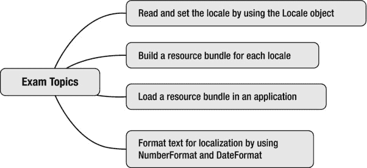

如今，计算机和软件已经非常普及，在世界各地的人类活动中无处不在。任何软件要想对用户有用且相关，都需要进行本地化。我们将软件适应当地语言和习俗的过程称为*本地化*。一个*区域设置*代表一个国家独特的语言、文化、数字、货币等集合。

Java 为软件应用程序的本地化提供了良好的支持；我们将在本章详细讨论相关主题。尽管 Java 支持 Unicode，并且大多数计算机都具备显示多种语言文本所需的字体，但主动将软件适配到不同区域设置是我们的职责。例如，本地化不仅仅意味着为某个区域设置显示文本——它还可能意味着为该区域设置使用音频或视频片段。此外，还需要考虑与显示日期、时间或使用当地货币相关的方面。

在本章中，你将学习如何本地化你的软件。本地化主要涉及为不同的区域设置创建*资源包*，以及通过使软件适应不同区域的使用来使其具有文化感知能力。我们将在前三节中向你展示如何创建和使用这些资源包。在最后一节中，我们将教你如何处理不同区域设置的时间和日期、数字以及货币。

引言

本地化就是让软件对不同文化的用户具有相关性和可用性——换句话说，就是为来自不同国家或语言的人们定制软件。如何本地化一个软件应用程序？在本地化软件应用程序时，应遵循两个重要准则：

*   不要硬编码文本（例如给用户的消息、GUI 中的文本元素等），而是将它们分离到外部文件或专用类中。完成此操作后，通常只需最少的努力即可在你的软件中增加对新区域设置的支持。
*   处理特定于文化的方面，如日期、时间、货币和数字格式，并始终考虑本地化。不要假设默认区域设置，而应设计成能够获取并定制当前区域设置的方式。

|  | 文本可能不是应用程序中唯一需要本地化的内容。例如，如果你的应用程序使用音频声音来提供指令，那么为了本地化，这些声音也需要更改。类似地，如果软件为特定区域设置显示某些字形或图片，它们也需要进行转换。 |

区域设置

区域设置是“代表一个国家、语言或文化的地方”。以加拿大-法语区域设置为例。加拿大许多地方都讲法语，这可以作为一个区域设置。换句话说，如果你想销售为讲法语的加拿大人定制的软件，那么你需要为这个区域设置提供支持。在 Java 中，这个区域设置由代码 fr_CA 表示，其中 fr 是法语的缩写，CA 是加拿大的缩写；我们将在本节后面更详细地讨论区域设置的命名方案。

Locale 类

在 Java 中，`Locale` 类为区域设置提供了编程支持。表 12-1 列出了该类中的重要方法。

表 12-1. Locale 类中的重要方法

| 方法 | 简短描述 |
| --- | --- |
| `static Locale[] getAvailableLocales()` | 返回 JVM 支持的可用区域设置（即已安装的区域设置）列表。 |
| `static Locale getDefault()` | 返回 JVM 的默认区域设置。 |
| `static void setDefault(Locale newLocale)` | 设置 JVM 的默认区域设置。 |
| `String getCountry()` | 返回区域设置对象的国家*代码*。 |
| `String getDisplayCountry()` | 返回区域设置对象的国家*名称*。 |
| `String getLanguage()` | 返回区域设置对象的语言*代码*。 |
| `String getDisplayLanguage()` | 返回区域设置对象的语言*名称*。 |
| `String getVariant()` | 返回区域设置对象的变体*代码*。 |
| `String getDisplayVariant()` | 返回区域设置对象变体代码的*名称*。 |
| `String toString()` | 返回一个由区域设置的语言、国家、变体等代码组成的 `String`。 |

清单 12-1 中的代码检测默认区域设置并检查 JVM 中的可用区域设置。

清单 12-1.  AvailableLocales.java

```
import java.util.Locale;

class AvailableLocales {
        public static void main(String []args) {
                System.out.println("The default locale is: " + Locale.getDefault());
                Locale [] locales = Locale.getAvailableLocales();
                System.out.printf("No. of other available locales is: %d, and they are: %n",
                locales.length);
                for(Locale locale : locales) {
                        System.out.printf("Locale code: %s and it stands for %s %n",     
                        locale, locale.getDisplayName());
       }
        }
} 
```

它打印出以下内容：

```
The default locale is: en_US
No. of other available locales is: 156, and they are:
Locale code: ms_MY and it stands for Malay (Malaysia)
Locale code: ar_QA and it stands for Arabic (Qatar)
Locale code: is_IS and it stands for Icelandic (Iceland)
Locale code: sr_RS_#Latn and it stands for Serbian (Latin,Serbia)
Locale code: no_NO_NY and it stands for Norwegian (Norway,Nynorsk)
Locale code: th_TH_TH_#u-nu-thai and it stands for Thai (Thailand,TH)
Locale code: fr_FR and it stands for French (France)
Locale code: tr and it stands for Turkish
Locale code: es_CO and it stands for Spanish (Colombia)
Locale code: en_PH and it stands for English (Philippines)
Locale code: et_EE and it stands for Estonian (Estonia)
Locale code: el_CY and it stands for Greek (Cyprus)
Locale code: hu and it stands for Hungarian
 [...rest of the output elided...]
```

在分析输出之前，我们先看看程序中的方法。你使用 `Locale` 中的 `getDefault()` 方法来获取默认区域设置的代码。之后，你使用 `Locale` 类中的 `getAvailableLocales()` 来获取 JVM 中可用区域设置的列表。现在，对于每个区域设置，你通过隐式调用 `locale` 的 `toString()` 方法来打印区域设置的代码，并使用 `Locale` 的 `getDisplayName()` 方法来打印描述性名称。

该程序将此 JVM 的默认区域设置打印为 en_US，这意味着默认区域设置是美国使用的英语。然后它打印出一个非常长的可用区域设置列表；为了节省空间，我们只展示了输出的一小部分。从这个程序中，你可以知道有许多可用的、受支持的区域设置，并且每个 JVM 都有一个与之关联的默认区域设置。

此输出中有四种不同类型的区域设置代码：


*   只有一个代码，如上所示最后一个条目：hu 代表匈牙利语。
*   由下划线分隔的两个代码，如第一个区域设置所示，ms_MY，其中 ms 代表马来西亚，MY 代表马来语。
*   由下划线分隔的三个代码，如 no_NO_NY，其中 no 代表挪威，NO 代表挪威语，NY 代表尼诺斯克语。
*   由下划线分隔的两个或三个初始代码，最后一个代码由 # 或 _# 分隔，如 th_TH_TH_#u-nu-thai，我们接下来将讨论这个。这些区域设置名称的编码方式如下：

```
language + "_" + country + "_" + (variant + "_#" | "#") + script + "-" + extensions
```

对于区域设置代码 th_TH_TH_#u-nu-thai，

*   语言代码是 th（泰语），并且始终小写。
*   国家/地区代码是 TH（泰国），并且始终大写。
*   变体名称是 TH；这里它重复了国家/地区代码，但它可以是任何字符串。
*   脚本名称在这里是一个空字符串；如果给出，它将是一个四字母字符串，首字母大写，其余字母小写（例如，Latn）。
*   扩展名跟在 # 或 _# 字符之后；在此示例中是 u-nu-thai。

这种编码方案允许即使在同一种语言内也存在编程变体。例如，许多国家都说英语，并且根据说英语的国家，语言也存在差异。我们都知道美式英语与英式英语不同，但还有许多其他版本。让我们更改清单 12-1 中的循环，仅列出与英语相关的区域设置，如下所示：

```
for(Locale locale : locales) {
        // 过滤并仅显示英语区域设置
        if(locale.getLanguage().equals("en")) {
                System.out.printf("区域设置代码: %s 代表 %s %n",
                locale, locale.getDisplayName());
        }
}
```

它会打印以下内容：

```
区域设置代码: en_MT 代表 英语 (马耳他)
区域设置代码: en_GB 代表 英语 (英国)
区域设置代码: en_CA 代表 英语 (加拿大)
区域设置代码: en_US 代表 英语 (美国)
区域设置代码: en_ZA 代表 英语 (南非)
区域设置代码: en 代表 英语
区域设置代码: en_SG 代表 英语 (新加坡)
区域设置代码: en_IE 代表 英语 (爱尔兰)
区域设置代码: en_IN 代表 英语 (印度)
区域设置代码: en_AU 代表 英语 (澳大利亚)
区域设置代码: en_NZ 代表 英语 (新西兰)
区域设置代码: en_PH 代表 英语 (菲律宾)
```

输出指的是英语中的不同区域设置。你使用 `Locale` 中的 `getLanguage()` 方法，该方法返回区域设置代码。还有哪些其他类似的方法？你现在将探索 `Locale` 类中可用的方法。

获取区域设置详细信息

`Locale` 类中的 getter 方法，例如 `getLanguage()`、`getCountry()` 和 `getVariant()`，返回*代码*，而类似的方法 `getDisplayCountry()`、`getDisplayLanguage()` 和 `getDisplayVariant()` 返回*名称*。清单 12-2 说明了如何对区域设置 `Locale.CANADA_FRENCH` 使用这些方法。

清单 12-2.  LocaleDetails.java

```
import java.util.Locale;

public class LocaleDetails {
        public static void main(String args[]) {
                Locale.setDefault(Locale.CANADA_FRENCH);
                Locale defaultLocale = Locale.getDefault();
                System.out.printf("默认区域设置为 %s %n", defaultLocale);
                System.out.printf("默认语言代码为 %s，名称为 %s %n",
                defaultLocale.getLanguage(), defaultLocale.getDisplayLanguage());
                System.out.printf("默认国家/地区代码为 %s，名称为 %s %n",
                defaultLocale.getCountry(), defaultLocale.getDisplayCountry());
                System.out.printf("默认变体代码为 %s，名称为 %s %n",
                defaultLocale.getVariant(), defaultLocale.getDisplayVariant());
        }
}
```

它会打印以下内容：

```
默认区域设置为 fr_CA
默认语言代码为 fr，名称为 français
默认国家/地区代码为 CA，名称为 Canada
默认变体代码为 ，名称为 Canada
```

让我们理解这个程序。`setDefault()` 方法接受一个 `Locale` 对象作为参数。在这个程序中，你使用以下语句将默认区域设置设置为 `Locale.CANADA_FRENCH`：

```
Locale.setDefault(Locale.CANADA_FRENCH);
```

`Locale` 类有许多表示常见区域设置的静态 `Locale` 对象，这样你就不必实例化它们并直接在程序中使用它们。在这种情况下，`Locale.CANADA_FRENCH` 是一个静态的 `Locale` 对象。除了使用这个静态的 `Locale` 对象，你也可以选择实例化一个 `Locale` 对象。以下是创建新的加拿大（法语）区域设置对象来设置默认区域设置的另一种方法：

```
Locale newLocale = new Locale("fr", "CA", "");
Locale.setDefault(newLocale);
```

`Locale` 中的 `getDefault()` 方法返回在 JVM 中设置的默认区域设置对象。下一条语句使用方法来获取与国家/地区相关的信息。`getCountry()` 和 `getDisplayCountry()` 方法之间的区别在于，前者返回国家/地区代码（对我们来说不太易读），而后者返回国家/地区名称，这是人类可读的。国家/地区代码是一个由两个或三个字母组成的代码（此代码来自国际标准：ISO 3166）。

`getLanguage()` 和 `getDisplayLanguage()` 的行为与获取国家/地区详细信息类似。语言代码由两个或三个字母组成，此代码来自另一个国际标准（ISO 639）。

此区域设置中没有变体，因此当你使用 `getVariant()` 和 `getDisplayVariant()` 方法时，没有打印任何内容。但是，对于其他一些区域设置，可能存在变体值，并且这些值将针对该区域设置打印出来。变体可以是任何额外的详细信息，例如操作系统环境（如 MAC 代表 Macintosh 机器）或公司名称（如 Sun 或 Oracle）。

除此之外，你还有一些使用较少的方法，例如 `getScript()`，它返回区域设置的脚本代码。

资源包

在上一节中，我们讨论了 `Locale` 类以及获取默认区域设置和可用区域设置列表详细信息的方法。你如何*使用*此区域设置信息来自定义程序的行为？让我们举一个简单的问候示例：在英语中，你说“Hello”，但如果区域设置不同，你如何更改此问候语，例如，如果区域设置是意大利（和意大利语），则说“Ciao”？

一个显而易见的解决方案是获取默认区域设置，检查区域设置是否为意大利，然后打印“Ciao”。这可行，但这种方法既不灵活也不可扩展。如何自定义到其他区域设置，例如沙特阿拉伯（阿拉伯语）或印度（印地语）？你必须查找并替换所有特定于区域设置的字符串，以便为每个区域设置进行自定义；如果你的应用程序包含数千个此类字符串，分布在数百万行代码中，那么这项任务将是一场噩梦。


在 Java 中，资源包提供了一种解决方案，用于根据特定区域设置的需求定制应用程序。那么，什么是资源包？资源包是一组类或属性文件，用于定义一组键，并将这些键映射到特定区域设置的值。

抽象类 `ResourceBundle` 提供了 Java 中资源包的抽象。它有两个派生类：`PropertyResourceBundle` 和 `ListResourceBundle`（参见图 12-1）。这两个派生类通过两种不同的机制为资源包提供支持：

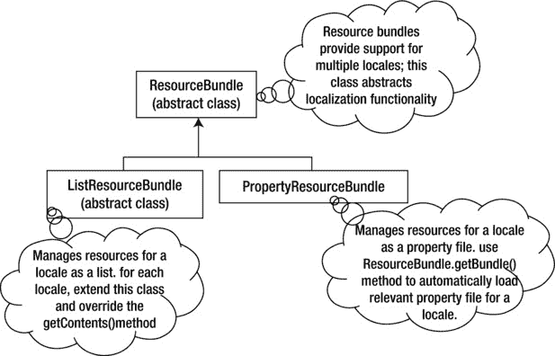

图 12-1.  ResourceBundle 及其两个派生类

*   **`PropertyResourceBundle` 类：** 这个具体类以属性文件的形式为多种区域设置提供支持。对于每个区域设置，你可以在该区域设置的属性文件中指定键和值。对于给定的区域设置，如果你使用 `ResourceBundle.getBundle()` 方法，相关的属性文件将被自动加载。当然，这并非魔法；你必须遵循特定的命名约定来创建属性文件，我们将在专门讨论属性文件的章节中对此进行说明。使用属性文件时，你只能使用 `Strings` 作为键和值。
*   **`ListResourceBundle` 类：** 要为某个区域设置添加支持，你可以扩展这个抽象类。在你的派生类中，你必须重写 `getContents()` 方法，该方法返回一个 `Object [][]`。这个数组必须包含键和值的列表。键必须是 `Strings`。通常值也是 `Strings`，但值可以是任何东西：声音片段、视频片段、URL 或图片。

让我们快速浏览一下 `ResourceBundle` 抽象类支持的方法。表 12-2 总结了该类的重要方法。我们现在将讨论使用 `ResourceBundle` 的这两个派生类来实现本地化支持。

表 12-2. ResourceBundle 抽象类中的重要方法

| 方法 | 简短描述 |
| --- | --- |
| `Object getObject(String key)` | 返回映射到给定键的值。如果未找到给定键的对象，则抛出 `MissingResourceException`。 |
| `static ResourceBundle getBundle(String baseName)`, `static final ResourceBundle getBundle(String baseName, Locale locale)` `final ResourceBundle getBundle(String baseName, Locale targetLocale, Control control)` | 返回给定 `baseName`、`locale` 和 `control` 的 `ResourceBundle`；如果未找到匹配的资源包，则抛出 `MissingResourceException`。`Control` 实例用于控制或获取有关资源包加载过程的信息。 |
| `string getString(String key)` | 返回映射到给定键的值；等同于将 `getObject()` 的返回值强制转换为 `String`。如果未找到给定键的对象，则抛出 `MissingResourceException`。如果返回的对象不是 `String`，则抛出 `ClassCastException`。 |

使用 PropertyResourceBundle

如果你在设计应用程序时考虑使用属性文件进行本地化，那么你可以为应用程序添加对新区域设置的支持，*而无需更改任何代码*！

我们现在来看一个使用资源文件的示例，这样你就会明白了。让我们从一个非常简单的程序开始，该程序向用户打印“Hello”。这个程序有三个属性文件资源包：

1.  默认资源包，假设为英语（美国）区域设置。
2.  阿拉伯语区域设置的资源包。
3.  意大利语区域设置的资源包。

如上所述，属性文件在文件中将字符串定义为键值对。以下是一个可以映射到你机器上实际路径的类路径示例：`classpath = C:\Program Files\Java\jre7`。属性文件通常包含许多这样的键值对，每对各占一行，如下所示：

```
classpath = C:\Program Files\Java\jre7
temp = C:\Windows\Temp
windir = C:\Windows
```

在本地化的情况下，你使用属性文件将相同的键字符串映射到不同的值字符串。在程序中，你将引用键字符串，并通过加载与区域设置匹配的属性文件，从属性文件中获取键对应的值，以供程序使用。

这些属性文件的命名很重要（你很快就会明白为什么），以下是这些资源包的内容。为了保持示例简单，这些属性文件中只有一个键值对；在实际程序中，每个属性文件中可能有几百甚至几千个键值对。

```
D:\ > type ResourceBundle.properties
Greeting = Hello

D:\ > type ResourceBundle_ar.properties
Greeting = As-Salamu Alaykum

D:\ > type ResourceBundle_it.properties
Greeting = Ciao
```

如你所见，默认包名为 ResourceBundle.properties。阿拉伯语的资源包名为 ResourceBundle_ar.properties。注意后缀 _ar，表示阿拉伯语为本地语言。类似地，意大利语的资源包名为 ResourceBundle_it.properties，它使用后缀 _it 来表示意大利语是与该属性文件关联的语言。清单 12-3 使用了这些资源包。

清单 12-3.  LocalizedHello.java

```
import java.util.*;

public class LocalizedHello {
        public static void main(String args[]) {
                Locale currentLocale = Locale.getDefault();
                ResourceBundle resBundle =
                        ResourceBundle.getBundle("ResourceBundle", currentLocale);
                System.out.printf(resBundle.getString("Greeting"));
        }
}
```

有两种方法可以按预期方式运行此程序：

*   **选项 I：** 通过调用 `setDefault()` 方法更改程序中的默认区域设置：

```
Locale.setDefault(Locale.ITALY);
```

不推荐此选项，因为它需要更改程序来设置区域设置。

*   **选项 II：** 在从命令行调用 JVM 时更改默认区域设置（如果你从 IDE 调用 JVM，请在 IDE 设置中为 JVM 提供命令行参数）：

```
D:\ > java -Duser.language = it -Duser.region = IT LocalizedHello
```

让我们尝试使用选项 II（在调用 JVM 时向命令行传递参数）来设置区域设置并运行程序。

```
D:\ > java LocalizedHello
Hello
D:\ > java -Duser.language=it LocalizedHello
Ciao
D:\ > java -Duser.language=ar LocalizedHello
As-Salamu Alaykum
```

如你所见，根据你显式设置的区域设置（本例中为意大利语或阿拉伯语）或默认区域设置（本例中为美国英语），会加载相应的属性文件并解析消息字符串。

|  | 如果你忘记创建属性文件，或者它们不在路径中，你将收到 `MissingResourceException`。 |

在程序中，你首先在语句中获取当前区域设置。

```
Locale currentLocale = Locale.getDefault();
```

之后，你加载以名称 ResourceBundle 开头的资源包，并传递区域设置以加载该资源包。

```
ResourceBundle resBundle = ResourceBundle.getBundle("ResourceBundle", currentLocale);
```

最后，从资源包中，你查找键“Greeting”，并根据加载的资源包使用该键的值。

```
System.out.printf(resBundle.getString("Greeting"));
```

使用 ListResourceBundle


可以通过扩展 `ListResourceBundle` 来添加对新语言环境的支持。在扩展 `ListResourceBundle` 时，你需要重写抽象方法 *getContents()*；该方法的签名如下：

```
protected Object[][] getContents();
```

请注意，键是 `Strings`，但值可以是任何类型，因此数组类型是 `Object`；此外，该方法返回一个键值对列表。因此，`getContents()` 方法返回一个二维的 `Objects` 数组。

清单 12-4 展示了一个扩展 `ListResourceBundle` 的示例，该示例旨在返回特定语言环境下票房最高的电影。它定义了一个名为 `ResBundle` 的资源包。由于类名没有任何后缀（例如 _it 或 _en_US），因此它是该资源包的默认实现。当为任何语言环境查找匹配的 `ResBundle` 时，如果未找到匹配项，将使用此默认实现。

清单 12-4.  ResBundle.java

```
import java.util.*;

// 默认的美国英语版本
public class ResBundle extends ListResourceBundle {
        public Object[][] getContents() {
                        return contents;
        }
        static final Object[][] contents = {
                { "MovieName", "Avatar" },
                { "GrossRevenue", (Long) 2782275172L }, // 以美元计
                { "Year", (Integer)2009 }
        };
}
```

现在，让我们为意大利语环境定义一个 `ResBundle`。给该类添加后缀 _it_IT。语言代码 it 代表意大利语，国家代码 IT 代表意大利。参见清单 12-5。

清单 12-5.  ResBundle_it_IT.java

```
import java.util.*;

// 意大利语版本
public class ResBundle_it_IT extends ListResourceBundle {
        public Object[][] getContents() {
                        return contents;
        }
        static final Object[][] contents = {
                { "MovieName", "Che Bella Giornata" },
                { "GrossRevenue", (Long) 43000000L }, // 以欧元计
                { "Year", (Integer)2011 }
        };
}
```

如你所见，`ResBundle` 和 `ResBundle_it_IT` 的实现除了映射到键的值不同之外，其他都是相似的。现在，你如何知道你的资源包是否正常工作呢？清单 12-6 为默认语言环境和意大利语环境加载了 `ResBundle`。

清单 12-6.  LocalizedHello2.java

```
import java.util.*;

public class LocalizedHello2 {
        public static void printMovieDetails(ResourceBundle resBundle) {
                String movieName = resBundle.getString("MovieName");
                Long revenue = (Long)(resBundle.getObject("GrossRevenue"));
                Integer year = (Integer) resBundle.getObject("Year");

System.out.println("Movie " + movieName + "(" + year ")" + " grossed "
                + revenue );
        }
        public static void main(String args[]) {
                // 打印默认（美国）语言环境下票房最高的电影
                Locale locale = Locale.getDefault();
                printMovieDetails(ResourceBundle.getBundle("ResBundle", locale));

// 打印意大利语环境下票房最高的电影
                locale = new Locale("it", "IT", "");
                printMovieDetails(ResourceBundle.getBundle("ResBundle", locale));
        }
}
```

它会打印以下内容：

```
Movie Avatar (2009) grossed 2782275172
Movie Che Bella Giornata (2011) grossed 43000000
```

它成功加载了默认和意大利语的资源包。然而，这个输出存在一些问题。值 2782275172 是美元值，而值 43000000 是欧元。此外，这些数字打印时没有逗号，因此很难理解这些数字的含义。这些值也需要进行本地化，我们将在本章的最后一节重新讨论这个主题。

现在，考虑这个程序中的以下语句：

```
Long revenue = (Long)(resBundle.getObject("GrossRevenue"));
```

这条语句返回资源包中映射到键名为 GrossRevenue 的值。你在 `ResBundle` 和 `ResBundle_it_IT` 类中将其定义为整数对象——所以它起作用了。如果你错误地转换了类型，将会得到一个 `ClassCastException`。

此外，请注意*键名是区分大小写的，并且键名必须完全匹配*——否则你会得到一个 `MissingResourceException`。例如，在这条语句中，如果你将键名 GrossRevenue 误拼为 GrossRevenu，程序将因以下异常而崩溃：

```
The Exception in the thread "main" java.util.MissingResourceException: Can't find resources for bundle ResBundle, key GrossRevenu 
```

|  | 通过扩展 `ListResourceBundle` 类来创建资源包，而使用 `PropertyResourceBundle` 时，则将资源包创建为属性文件。此外，扩展 `ListResourceBundle` 时，你可以使用任何类型的对象作为值，而属性文件中的值只能是字符串。 |

加载资源包

在你编写的程序中，你已经使用 `ResourceBundle` 或其两个派生类加载过资源包。你需要彻底理解这个加载过程，我们将在本节中更详细地介绍它。

查找匹配资源包的过程，对于从 `ListResourceBundles` 扩展的类，与为 `PropertyResourceBundles` 定义的属性文件是相同的。

|  | 对于实现为从 `ListResourceBundles` 扩展的类的资源包，Java 使用反射机制来查找和加载该类。你需要确保该类是公共的，以便反射机制能够找到它。 |

资源包的命名约定

Java 强制要求遵循预定义的命名约定来创建资源包。Java 库仅通过属性包的名称来加载相关的语言环境。因此，在为本地化 Java 应用程序创建属性包时，理解并遵循此命名约定非常重要。

你已经看到了语言环境名称是如何编码的。理解这种语言环境名称编码对于命名资源包很重要，因为它使用了相同的编码方案。一个完全限定的资源包具有以下形式：

```
packagequalifier.bundlename + "_" + language + "_" + country + "_" + (variant + "_#" | "#") + script + "-" + extensions
```

以下是此完全限定名称中各元素的描述：

*   **packagequalifier**：提供资源包的包（或子包）的名称。
*   **bundlename**：你将在程序中引用和加载的资源包的名称。
*   **language**：通常以小写形式给出的语言环境语言的两个字母缩写（在极少数情况下，也可能是三个字母）。
*   **country**：通常以大写形式给出的语言环境国家的两个字母缩写（在极少数情况下，也可能是三个字母）。
*   **variant**：当需要为某个语言和国家组合提供多个语言环境时，用于区分语言环境的任意变体列表（小写或大写）。

我们省略了对 script 和 extension 的描述，因为它们很少使用。

例如，考虑这个完全限定的名称：

```
localization.examples.AppBundle_en_US_Oracle_exam
```


在此例中，`localization.examples` 是包名，`AppBundle` 是资源包名称，`en` 是语言代码（代表英语），`US` 是国家代码，`Oracle_exam` 是变体。

语言和国家的两个字母（有时是三个字母）缩写是基于国际标准预定义的。我们不会提供详细列表，你也不需要记住所有缩写。你可以查阅 `Locale` 类的文档来了解这一点。

|  | 在 OCPJP 7 考试中，你不需要记住用于命名资源包的语言代码或国家代码。但是，你需要*记住命名约定*，并能够识别完全限定资源包名称的组成部分。 |

考虑到一个包名可能对应多个资源包，那么确定加载哪个资源包的搜索顺序是怎样的？为了清晰说明，我们将搜索过程分解为一系列步骤。搜索从第 1 步开始。如果在某一步找到了匹配项，则加载该资源包。否则，继续执行下一步。

*   **第 1 步：** 搜索首先尝试查找与完整名称完全匹配的资源包。
*   **第 2 步：** 移除最后一个组件（由下划线分隔的部分），然后使用缩短后的名称重复搜索。*重复此过程，直到只剩下最后一个区域设置修饰符*。
*   **第 3 步：** 使用默认区域设置的完整包名重新开始搜索。
*   **第 4 步：** 仅使用包名搜索资源包。
*   **第 5 步：** 搜索失败，抛出 `MissingBundleException`。

搜索从给定的区域设置详细信息开始，如果未找到，则继续检查默认区域设置，如下所示：

BundleName + "_" + language + "_" + country + "_" + variant

BundleName + "_" + language + "_" + country

BundleName + "_" + language

BundleName + "_" + defaultLanguage + "_" + defaultCountry

BundleName + "_" + defaultLanguage

考虑一个例子来了解如何找到匹配的资源包，这样你就会明白了。假设你的搜索路径中有以下五个条目，并且你的默认区域设置是美式英语。

```
ResourceBundle.properties             -- 全局资源包
ResourceBundle_ar.properties          -- 阿拉伯语资源包
ResourceBundle_en.properties          -- 英语资源包（假设 en_US 是默认区域设置）
ResourceBundle_it.properties          -- 意大利语资源包
ResourceBundle_it_IT_Rome.properties  -- 意大利语（意大利，罗马，梵蒂冈）资源包
```

|  | `getBundle()` 方法接受一个 `ResourceBundle.Control` 对象作为额外参数。通过扩展 `ResourceBundle.Control` 类并将该扩展类的实例传递给 `getBundle()` 方法，你可以更改默认的资源包搜索过程，或从非标准资源包格式（如 XML 文件）中读取数据。 |

因此，你将扩展 `ResourceBundle.Control` 类并重写 `getCandidateLocales()` 方法。这是为了以编程方式列出候选区域设置，并最终显示匹配的区域设置。程序如清单 12-7 所示。

清单 12-7.  *CandidateLocales*.java

```
import java.util.*;

// 扩展 ResourceBundle.Control 并重写 getCandidateLocales 方法
// 以获取 Java 搜索的候选区域设置列表
class TalkativeResourceBundleControl extends ResourceBundle.Control {
        // 重写默认的 getCandidateLocales 方法，首先打印
        // 候选区域设置
        public List < Locale > getCandidateLocales(String baseName, Locale locale) {
                List < Locale > candidateLocales = super.getCandidateLocales(baseName, locale);
                System.out.printf("基础包名 %s 和区域设置 %s 的候选区域设置 %n",
          baseName, locale.getDisplayName());
                for(Locale candidateLocale : candidateLocales) {
                    System.out.println(candidateLocale);
                }
                return candidateLocales;
        }
}

// 使用辅助方法 loadResourceBundle 根据包名和区域设置加载资源包
class CandidateLocales {
        public static void loadResourceBundle(String resourceBundleName, Locale locale) {
                // 传递 TalkativeResourceBundleControl 的实例
                // 以打印候选区域设置
                ResourceBundle resourceBundle = ResourceBundle.getBundle(resourceBundleName, locale,
            new TalkativeResourceBundleControl());
                String rbLocaleName = resourceBundle.getLocale().toString();
                // 如果资源包区域设置名称为空，
                // 则表示默认属性文件
                if(rbLocaleName.equals("")) {
                        System.out.println("已加载默认属性文件，名称为: " +                        
                resourceBundleName);
                } else {
                        System.out.println("已加载区域设置的资源包: " +                
                    resourceBundleName + "." + rbLocaleName);
                }
        }

public static void main(String[] args) {
                // 追踪 ResourceBundle_it_IT_Rome.properties 是如何被解析的
                loadResourceBundle("ResourceBundle", new Locale("it", "IT", "Rome"));
        }
}
```

它打印以下内容：

```
基础包名 ResourceBundle 和区域设置 Italian (Italy, Rome) 的候选区域设置
it_IT_Rome
it_IT
it

已加载区域设置的资源包: ResourceBundle.it_IT_Rome
```

现在，在尝试其他区域设置之前，先考虑一下程序是如何工作的。为了追踪 Java 如何解析最终要加载的资源包，你需要获取候选区域设置列表。使用 `ResourceBundle.getBundle()` 方法时，你可以传递一个额外的参数，即 `ResourceBundle.Control` 类的实例。因此，你定义了 `TalkativeResourceBundleControl` 类。

`TalkativeResourceBundleControl` 类扩展了 `ResourceBundle.Control` 类并重写了 `getCandidateLocales()` 方法。这个 `getCandidateLocales()` 方法返回一个 `List < Locale >` 实例，其中包含给定区域设置的候选区域设置列表。你调用 `super.getCandidateLocales()` 并遍历生成的 `List < Locale >` 对象来打印候选区域设置，以便稍后检查输出。从这个重写的 `getCandidateLocales()` 方法中，你只需返回这个 `List < Locale >` 对象。因此，`TalkativeResourceBundleControl` 的行为与 `ResourceBundle.Control` 相同，只是 `TalkativeResourceBundleControl` 中重写的 `getCandidateLocales()` 会打印候选区域设置。


好的，作为高级文档工程师和翻译员，我将严格遵循您提供的注意事项和示例格式，将给定的英文文本翻译成中文。


`CandidateLocales` 类使用了 `TalkativeResourceBundleControl`。它有一个名为 `loadResourceBundle()` 的辅助方法，该方法将资源包名称和区域设置名称作为参数。此方法只是将这些参数值传递给 `ResourceBundle.getBundle()` 方法；此外，它还实例化了 `TalkativeResourceBundleControl`，并将该对象作为第三个参数传递给此方法。`getBundle()` 方法返回一个 `ResourceBundle` 对象。如果 `ResourceBundle.getLocale()` 名称的区域设置为空，则表示 Java 已加载全局资源包。（请记住，该包名称的全局资源包没有任何关联的区域设置详细信息。）如果区域设置的名称不为空，则表示 Java 已解析到该特定区域设置。

现在，考虑 `main()` 方法中的代码。它为区域设置 `it_IT_Rome` 调用了 `loadResourceBundle()`。有三个候选区域设置，它正确地加载了与区域设置 `it_IT_Rome` 匹配的属性文件。因此，您知道它正确地加载了属性文件 `ResourceBundle_it_IT_Rome.properties`。

为了继续这个实验，让我们将 清单 12-7 中 `main()` 方法内的代码更改为以下代码：

```
loadResourceBundle("ResourceBundle", new Locale("fr", "CA", ""));
```

现在程序打印如下内容：

```
Candidate locales for base bundle name ResourceBundle and locale French (Canada)
fr_CA
fr
Candidate locales for base bundle name ResourceBundle and locale English (United States)
en_US
en
Loaded the resource bundle for the locale: ResourceBundle.en
```

为什么程序会打印上述输出？请注意，在属性文件列表中，没有与 `fr_CA` 区域设置对应的属性文件。因此，搜索会继续检查默认区域设置的属性文件。在这种情况下，默认区域设置是 `en_US`，并且存在一个用于 `en`（英语）区域设置的属性文件。因此，从候选区域设置中，Java 正确地解析并加载了属性文件 `ResourceBundle_en.properties`。

这是最后一个示例。将 `main()` 方法中的代码替换为以下语句：

```
loadResourceBundle("ResBundl", Locale.getDefault());
```

程序打印如下内容：

```
Candidate locales for base bundle name ResBundl and locale English (United States)
en_US
en

The exception in thread "main" java.util.MissingResourceException: Can't find bundle for base name ResBundl, locale en_US
        [... thrown stack trace elided ...]
```

您没有任何名为 `ResBundl` 的资源包，并且您提供了默认区域设置（本例中为 `en_US`）。Java 会搜索此区域设置的包，而您知道您没有提供任何名为 `ResBundl` 的包。因此，程序在抛出 `MissingResourceException` 后崩溃。

**针对本地文化的格式化**

文本显然是本地化的主要方面。但是，还有许多方面会根据区域设置进行不同的处理：日期和时间、数字以及货币。我们现在将详细讨论这些主题。

对于文本本地化，您需要遵循的主要方法是不对字符串进行硬编码。对于日期、时间、货币和数字，要记住的关键思想是使用文化感知的格式化来本地化它们。图 12-2 展示了我们将在本节中讨论的两个重要类——`NumberFormat` 和 `DateFormat`——如何都继承自 `Format` 基类；这些类是 `java.text` 包的一部分，对于创建区域设置感知的软件非常有用。

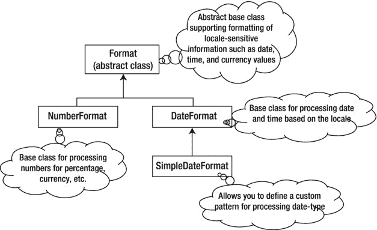

图 12-2.  Format 类及其重要的派生类

**NumberFormat 类**

`NumberFormat` 类提供了以区域设置敏感的方式处理数字的支持。例如，根据区域设置的不同，千位分隔符、用于分隔它们的标点字符、将金额打印为货币值等都会有所不同，而 `NumberFormat` 类提供了此功能。

`NumberFormat` 类提供了格式化或解析数字的方法。这里的“格式化”是指以文化敏感的方式将数值转换为字符串值；类似地，“解析”是指将数字转换回数字形式。例如，如果您想在德语区域设置中将长整型常量值 `10_000_000L` 打印为一千万，您可以通过将其传递给 `NumberFormat` 类中的 `format()` 方法来格式化此值，此方法将返回字符串 `“10.000.000”`（注意使用点作为千位分隔符）。现在，如果您在德语区域设置中读取输入值一千万，以将其转换为长整型值以便在程序中使用，您可以将该字符串传递给 `parse()` 方法。清单 12-8 展示了执行这些转换的步骤。

清单 12-8.  *FormatNumber*.java

```
import java.util.*;
import java.text.*;

// 演示如何为特定区域设置格式化或解析数字的类
class FormatNumber {
        public static void main(String []args) {
                long tenMillion = 10_000_000L;
                // 首先在德语区域设置中打印一千万
                NumberFormat germanFormat = NumberFormat.getInstance(Locale.GERMANY);
                String localizedTenMillion = germanFormat.format(tenMillion);
                System.out.println("Ten million in German locale is " + localizedTenMillion);

// 现在，扫描以德语区域设置给出的一千万值
                try {
                        Number parsedAmount = germanFormat.parse(localizedTenMillion);
                        if(tenMillion == parsedAmount.longValue()) {
                                System.out.println("Successfully parsed the number for the locale");
                        }
                }
                catch (ParseException pe) {
                        System.err.println("Error: Cannot parse the number for the locale");
                }
        }
}
```

它打印如下内容：

```
Ten million in German locale is 10.000.000
Successfully parsed the number value back to Number value based on the locale
```

如您所见，在德语区域设置中，一千万的值以这种格式打印：10.000.000。要解析给定区域设置中的此类数字，您可以使用 `NumberFormat` 的 `parse()` 方法，如果解析成功，该方法会返回一个 `Number`，否则该方法会抛出一个受检异常 `ParseException`。

请注意，`parse()` 方法与 `format()` 方法不同。`parse()` 方法用于读取以 `String` 形式提供的数字，并尝试将其转换为 `Number`。`format()` 方法用于根据 `NumberFormat` 对象中设置的值来打印值。清单 12-9 说明了这两者之间的区别。

清单 12-9.  *FractionDigits*.java

```
import java.util.*;
import java.text.*;


public class FractionDigits {
        public static void main(String[] args) throws ParseException {
                String[] numbers = {"1.222", "0.12345F"};
                double[] doubles = {1.222, 0.12345F};
                NumberFormat numberFormat = NumberFormat.getInstance();
                numberFormat.setMaximumFractionDigits(2);
                System.out.println("Using format method: ");
                for(double val : doubles) {
                        System.out.println(numberFormat.format(val));
                }
                System.out.println("Using parse method: ");
                for(String number : numbers) {
                        System.out.println(numberFormat.parse(number));
                }
        }
}
```

它会打印以下内容：

```
 Using format method:
1.22
0.12
Using parse method:
1.222
0.12345 
```

`parse()` 方法会读取这些值，如果成功则将其转换为 `Number`。因此，它不会使用通过 `setMaximumFractionDigits()` 设置的最大小数位数；然而，如果使用旨在打印数字的 `format()` 方法，它就会使用这个设置的最大小数位数限制，这就解释了输出结果之间的差异。

`NumberFormat` 类中的重要方法列于表 12-3 中。那些以“get”开头并以“Instance”结尾的静态方法——例如 `getCurrencyInstance()`——是该类支持的工厂方法。

表 12-3. NumberFormat 类中的重要方法

| 方法 | 简要描述 |
| --- | --- |
| `String format(double number)` `String format(long number)` | 根据 `NumberFormat` 的语言环境格式化数字。前两个重载方法使用隐式的 `StringBuffer`，而后两个使用显式的 `StringBuffer` 来构建字符串。 |
| `Number parse(String source)` | 从给定的 `String` 中解析出数字。根据 `source` 中给定数字的值，它返回一个 `Long` 或 `Double` 实例。如果解析失败，则抛出 `ParseException`。 |
| `static Locale[] getAvailableLocales()` | 返回 Java 运行时支持用于数字格式化的语言环境列表。 |
| `static NumberFormat getInstance()` | 工厂方法，返回默认语言环境的 `NumberFormat` 对象。 |
| `Currency getCurrency()` | 返回此 `NumberFormat` 对象使用的货币实例。 |
| `static NumberFormat getCurrencyInstance()` | 返回适用于货币格式化的 `NumberFormat` 实例；此方法的一个重载版本接受一个 `Locale` 作为参数。 |
| `static NumberFormat getIntegerInstance()` | 返回适用于格式化整数的 `NumberFormat` 实例；此方法的一个重载版本接受一个 `Locale` 作为参数。 |
| `static NumberFormat getPercentInstance()` | 返回适用于格式化百分比的 `NumberFormat` 实例；此方法的一个重载版本接受一个 `Locale` 作为参数。 |

`NumberFormat` 类支持打印货币值。你可以使用它的 `getCurrencyInstance()` 方法，该方法返回一个 `Currency` 对象。清单 12-10 演示了如何使用此方法在四种不同的语言环境中打印 1000 万这个值（不进行汇率转换）。

清单 12-10.  *LocalizedCurrency*.java

```
import java.util.*;
import java.text.*;

// 演示如何使用 NumberFormat 类获取 Currency 实例
class LocalizedCurrency {
        public static void main(String []args) {
                long tenMillion = 10000000L; // 这是一千万
                Locale [] locales =
                        { Locale.CANADA, Locale.FRANCE, Locale.GERMANY, Locale.TAIWAN };
                // 对于这四个语言环境中的每一个，
                // 打印该语言环境下的货币金额
                for(Locale locale : locales) {
                        System.out.println("Ten million in " + locale.getDisplayName() + " is " + NumberFormat.getCurrencyInstance(locale).format(tenMillion));
                }
        }
}
```

它会打印：

```
Ten million in English (Canada) is $10,000,000.00
Ten million in French (France) is 10 000 000,00 €
Ten million in German (Germany) is 10.000.000,00 €
Ten million in Chinese (Taiwan) is NT$10,000,000.00
```

如你所见，通过使用从 `getCurrencyInstance(Locale)` 返回的 `NumberFormat` 对象，你可以格式化数字，使其作为特定语言环境的货币值打印出来。你也可以独立于 `NumberFormat` 类使用 `Currency` 类，我们接下来将讨论这一点。

Currency 类

表 12-4 列出了 `Currency` 类的重要方法。

表 12-4. Currency 类中的重要方法

| 方法 | 简要描述 |
| --- | --- |
| `int getNumericCode()` | 返回货币的 ISO 4217 数字代码。 |
| `int getDefaultFractionDigits()` | 返回该货币使用的默认小数位数，例如日元为 0，美元为 2。 |
| `String getDisplayName()`   | 返回基础语言环境的 `Currency` 的可读描述，例如，美元。 |
| `String getDisplayName(Locale)`   | 返回给定语言环境的 `Currency` 的可读描述。 |
| `static Currency getInstance(String currencyCode)` | 返回与给定货币代码相对应的 `Currency` 对象。 |
| `static Currency getInstance(Locale locale)` | 返回与给定 `Locale` 对象相对应的 `Currency` 对象。 |
| `static Set < Currency > getAvailableCurrencies()` | 获取 JDK 中可用的 `Currency` 实例列表。 |
| `String getSymbol()` | 返回货币符号（如果有）；否则返回货币代码。 |
| `String getSymbol(Locale)` | 返回给定 `Locale` 对象的货币符号。 |
| `String getCurrencyCode()` | 返回 `Currency` 实例的语言环境的货币代码（ISO 4217）。 |

清单 12-11 演示了如何使用表 12-4 中列出的部分方法。

清单 12-11.  *CurrencyDetails*.java

```
import java.util.*;

// 获取默认语言环境（en_US 语言环境）的货币详细信息
class CurrencyDetails {
        public static void main(String []args) {
                Locale locale = Locale.getDefault();
                Currency currencyInstance = Currency.getInstance(locale);
                System.out.println(" The currency code for locale " + locale
                        + " is: " + currencyInstance.getCurrencyCode()
                        + " \n The currency symbol is " + currencyInstance.getSymbol()
                        + " \n The currency name is " + currencyInstance.getDisplayName());
        }
}
```

它会打印以下内容：

```
The currency code for locale en_US is: USD
The currency symbol is $
The currency name is US Dollar
```

输出结果不言自明。请注意，对于许多没有相关符号的语言环境，`getSymbol()` 将只返回货币代码。

DateFormat 类


`DateFormat` 类提供了以区域敏感方式处理日期和时间的功能（虽然名称中只提到了 `DateFormat`，但它同时支持日期和时间）。表 12-5 列出了 `DateFormat` 类中的一些重要方法。

表 12-5. DateFormat 类中的重要方法

| 方法 | 简要描述 |
| --- | --- |
| `String format(Date date)` | 根据默认区域设置格式化给定日期，并返回文本表示形式。其重载版本接受 `StringBuffer` 和位置作为参数，并返回一个 `StringBuffer` 对象；当需要格式化现有 `StringBuffer` 以表示日期时非常有用。 |
| `Date parse(String source)` | 根据默认区域设置约定读取给定的字符串，返回一个 `Date` 对象；如果解析失败则抛出 `ParseException`。它有一个重载版本，额外接受 `ParsePosition`（解析字符串的起始位置）作为参数。 |
| `String format(Date date)` | 根据默认区域设置格式化给定日期，并返回文本表示形式。 |
| `static Locale[] getAvailableLocales()` | 返回 Java 运行时环境支持的、用于日期/时间格式化的 `Locale` 数组。 |
| `static DateFormat getInstance()` | 返回同时支持*日期和时间*的默认 `DateFormat` 实例；它对日期和时间均使用 `DateFormat.SHORT` 样式。 |
| `static DateFormat getDateInstance()` | 返回适用于处理默认区域设置日期的 `DateFormat` 实例；其两个重载版本额外接受 `style` 和 `Locale` 作为参数。 |
| `static DateFormat getTimeInstance()` | 返回适用于处理默认区域设置时间的 `DateFormat` 实例；其两个重载版本额外接受 `style` 和 `Locale` 作为参数。 |
| `static DateFormat getDateTimeInstance()` | 返回适用于同时处理默认区域设置日期和时间的 `DateFormat` 实例；其两个重载版本额外接受 `style` 和 `Locale` 作为参数。 |

根据区域设置的不同，显示的日期或时间可能会有显著差异，如清单 12-12 中程序针对四个区域设置的输出所示。

清单 12-12.  *DatePrint*.java

```
import java.util.*;
import java.text.*;

// 演示如何使用 DateFormat 类格式化日期并打印的类
class DatePrint {
        public static void main(String[] args) {
                // Date 的默认构造函数
                // 将日期/时间设置为当前日期/时间
                Date today = new Date();
                Locale [] locales = { Locale.CANADA, Locale.FRANCE, Locale.GERMANY, Locale.ITALY };
                for(Locale locale : locales) {
                        // DateFormat.FULL 表示日期的完整详细信息
                        DateFormat dateFormat = DateFormat.getDateInstance(DateFormat.FULL, locale);
                        System.out.println("区域设置 " + locale + " 中的日期为: " + dateFormat.                        
                        format(today));
                }
        }
}
```

当此程序于 2012 年 9 月 4 日运行时，它打印了以下内容：

```
Date in locale en_CA is: Tuesday, September 4, 2012
Date in locale fr_FR is: mardi 4 septembre 2012
Date in locale de_DE is: Dienstag, 4\. September 2012
Date in locale it_IT is: martedì 4 settembre 2012
```

该程序使用 `getDateInstance()` 方法的一个重载版本来获取 `DateFormat` 类的实例。此方法将*显示格式样式*作为第一个参数，将用于格式化日期的区域设置作为第二个参数。这些显示格式样式是什么？清单 12-13 展示了四种样式以及这些样式下日期的不同显示效果。

清单 12-13.  *DateStyleFormats*.java

```
import java.util.*;
import java.text.*;

// 演示 DateFormat 中决定显示样式的常量的使用
class DateStyleFormats {
        public static void main(String []args) {
                Date now = new Date();
                int [] dateStyleFormats = { DateFormat.SHORT, DateFormat.MEDIUM, DateFormat.LONG,                
                 DateFormat.FULL, DateFormat.DEFAULT};
                System.out.println("不同样式下的今天日期为: ");

// 以所有四种格式以及默认区域设置中的默认格式打印今天的日期
                for(int dateStyleFormat : dateStyleFormats) {
                        DateFormat dateFormat = DateFormat.getDateInstance(dateStyleFormat);
                        System.out.println(dateFormat.format(now));
                }
        }
}
```

当于 2012 年 9 月 5 日运行时，它打印了以下内容：

```
Today's date in different styles are:
9/5/12
Sep 5, 2012
September 5, 2012
Wednesday, September 5, 2012
Sep 5, 2012
```

如您所见，您可以根据需要获取首选样式的 `DateFormat` 实例。默认样式是 `DateFormat.MEDIUM`。

`DateFormat` 有三个重载的工厂方法——`getDateInstance()`、`getTimeInstance()` 和 `getDateTimeInstance()`——它们分别返回用于处理日期、时间以及日期和时间的 `DateFormat` 实例。清单 12-14 展示了如何使用它们。

清单 12-14.  *DateTimePrint*.java

```
import java.util.*;
import java.text.*;

// 演示如何使用 DateFormat 类获取日期、时间或带时间的日期的类
class DateTimePrint {
        public static void main(String []args) {
                // Date 的默认构造函数获取当前时间和日期
                Date today = new Date();
                Locale [] locales =
                        { Locale.CANADA, Locale.FRANCE, Locale.GERMANY, Locale.ITALY };

// 首先打印表头
                System.out.printf("%5s \t %10s \t %10s \t %10s %n",
                        "区域设置", "日期", "时间", "带时间的日期");

// 为每个区域设置打印日期、时间以及日期和时间
                for(Locale locale : locales) {
                        // DateFormat.SHORT 用于以紧凑格式提供日期或时间详细信息
                        DateFormat dateFormat = DateFormat.getDateInstance(DateFormat.SHORT, locale);
                        DateFormat timeFormat = DateFormat.getTimeInstance(DateFormat.SHORT, locale);

// 现在，对于日期和时间，将样式更改为 MEDIUM 和 FULL
                        DateFormat dateTimeFormat = DateFormat.getDateTimeInstance(DateFormat.MEDIUM, DateFormat.FULL, locale);
                        System.out.printf("%5s \t %10s \t %10s \t %20s %n", locale,
                        dateFormat.format(today), timeFormat.format(today),
                          dateTimeFormat.format(today));
                }
        }
}
```

当于 2012 年 9 月 5 日下午运行时，它打印了以下内容：

```
Locale        Date         Time      Date with Time
en_CA     05/09/12      2:32 PM      5-Sep-2012 2:32:56 o'clock PM GMT + 05:30
fr_FR     05/09/12        14:32      5 sept. 2012 14 h 32 GMT + 05:30
de_DE     05.09.12        14:32      05.09.2012 14:32 Uhr GMT + 05:30
it_IT     05/09/12        14.32      5-set-2012 14.32.56 GMT + 05:30
```

此程序展示了如何获取用于处理日期、时间或日期和时间的 `DateFormat` 实例。您还可以看到对不同区域设置使用不同样式的效果。

到目前为止，您只使用了 `DateFormat` 来处理不同区域设置的预定义日期和时间。如果您想创建自己的格式或模式来处理日期或时间，可以做到吗？可以，`SimpleDateFormat` 类提供了此功能。

SimpleDateFormat 类


`SimpleDateFormat` 扩展了 `DateFormat` 类。`SimpleDateFormat` 使用模式字符串的概念来格式化日期和时间。在深入探讨如何创建模式字符串之前，先看一个简单的示例，学习如何创建用于打印日期和时间的自定义格式（清单 12-15）。

清单 12-15.  *PatternStringExample*.java

```
import java.util.*;
import java.text.*;

// 使用 SimpleDateFormat 通过模式字符串创建自定义的日期和时间格式
class PatternStringExample {
        public static void main(String []args) {
                String pattern = "dd-MM-yy"; /* d 代表日，M 代表月，y 代表年 */
                SimpleDateFormat formatter = new SimpleDateFormat(pattern);
                // 默认的 Date 构造器会初始化为当前日期/时间
                System.out.println(formatter.format(new Date()));
        }
}
```

它会按以下格式打印日期：

```
05-09-12
```

你可以使用字母来编码日期或时间的格式，从而形成日期或时间模式字符串。通常这些字母会在模式中重复出现。请注意，大写和小写字母可能具有相似或不同的含义，因此在尝试使用这些字母时，请仔细阅读文档。例如，在 `dd-MM-yy` 中，`MM` 指的是月份；然而，在 `dd-mm-yy` 中，`mm` 指的是分钟！

在这个程序中，你看到了一个创建自定义日期格式的简单示例。类似的字母也可用于创建自定义的日期和时间模式字符串。以下是用于创建日期模式的重要字母及其含义列表：

`G`     纪元（公元前/公元）

`y`     年份

`Y`     周年份

`M`     月份（一年中的）

`w`     周数（一年中的）

`W`     周数（一个月中的）

`D`     天数（一年中的）

`d`     天数（一个月中的）

`F`     一个月中的星期几

`E`     星期几的名称

`u`     星期几的数字（取值范围 1-7）

清单 12-16 是一个程序，它使用了从简单到复杂的模式字符串来创建自定义的日期格式。

清单 12-16.  *CustomDatePatterns*.java

```
import java.util.*;
import java.text.*;

// 通过示例说明如何使用“模式字符串”来打印日期
class CustomDatePatterns {
        public static void main(String []args) {
                // 从简单到复杂的模式
                String [] dateFormats = {
                        "dd-MM-yyyy", /* d 是日（一个月中的），M 是月，y 是年 */
                        "d '('E')' MMM, YYYY", /*E 是星期几的名称，Y 是年份*/
                        "w'th week of' YYYY", /* w 是一年中的第几周 */
                        "EEEE, dd'th' MMMM, YYYY" /*E 是星期几的名称 */
                };
                Date today = new Date();
                System.out.println("日期的默认格式是 " + DateFormat.getDateInstance().format(today));
                for(String dateFormat : dateFormats) {
                        System.out.printf("模式为 \"%s\" 的日期是 %s %n", dateFormat, new SimpleDateFormat(dateFormat).format(today));
                }
        }
}
```

在一次示例运行中，它打印了以下内容：

```
日期的默认格式是 Sep 5, 2012
模式为 "dd-MM-yyyy" 的日期是 05-09-2012
模式为 "d '('E')' MMM, YYYY" 的日期是 5 (Wed) Sep, 2012
模式为 "w'th week of' YYYY" 的日期是 36th week of 2012
模式为 "EEEE, dd'th' MMMM, YYYY" 的日期是 Wednesday, 05th September, 2012
```

如你所见，重复字母会导致条目的输出形式更长。例如，当你使用 `E`（代表星期几的名称）时，它会打印 `Wed`；而当你使用 `EEEE` 时，它会打印星期几的完整形式，即 `Wednesday`。

另一个需要注意的重要事项是如何在给定的模式字符串中打印文本。为此，你需要使用单引号将文本分隔开，就像 `'within single quotes'` 这样，`SimpleDateFormat` 会原样打印这些文本。例如，`'('E')'` 会打印 `(Wed)`。如果你给出了错误的模式，或者忘记使用单引号将文本与模式字符串中的模式字母分隔开，那么你会因为传递了“非法模式”而得到一个 `IllegalArgumentException` 异常。

现在，来看一个类似的创建自定义时间模式字符串的示例。以下是用于定义自定义时间模式的重要字母列表：

`a`     上午/下午标记的文本标记

`H`     小时（取值范围 0-23）

`k`     小时（取值范围 1-24）

`K`     上午/下午制的小时（取值范围 0-11）

`h`     上午/下午制的小时（取值范围 1-12）

`m`     分钟

`s`     秒

`S`     毫秒

`z`     时区（通用时区格式）

更多字母及其描述，请参阅 `SimpleDateFormat` 类的 JavaDoc。清单 12-17 是一个程序，它使用了从简单到复杂的模式字符串来创建自定义的时间格式。

清单 12-17.  *CustomTimePatterns*.java

```
import java.util.*;
import java.text.*;

// 通过示例说明如何使用“模式字符串”来构建自定义的时间格式
class TimePattern {
        public static void main(String []args) {
                // 从简单到复杂的模式
                String [] timeFormats = {
                        "h:mm", /* h 是上午/下午制的小时 (1-12)，m 是分钟 */
                        "hh 'o''clock'",  /* '' 是打印单引号的转义序列 */
                        "H:mm a", /* H 是一天中的小时 (0-23)，a 是上午/下午*/
                        "hh:mm:ss:SS", /* s 是秒，S 是毫秒 */
                        "K:mm:ss a, zzzz" /*K 是上午/下午制的小时(0-11)，z 是时区 */
                };
                Date today = new Date();
                System.out.println("时间的默认格式是 " + DateFormat.getTimeInstance().format(today));
                for(String timeFormat : timeFormats) {
                        System.out.printf("模式为 \"%s\" 的时间是 %s %n", timeFormat, new SimpleDateFormat(timeFormat).format(today));
                }
        }
}
```

它打印了以下内容：

```
时间的默认格式是 3:10:05 PM
模式为 "hh 'o''clock'" 的时间是 03 o'clock
模式为 "h:mm" 的时间是 3:10
模式为 "H:mm a" 的时间是 15:10 PM
模式为 "hh:mm:ss:SS" 的时间是 03:10:05:355
模式为 "K:mm:ss a, zzzz" 的时间是 3:10:05 PM, GMT + 05:30
```

请注意，输出结果会根据你在该程序中所使用的模式字符串而有所不同。

要点记忆

以下是一些可能在考试中对你有用的要点：

*   获取或创建 `Locale` 对象有多种方法。这里我们列出四种选项，用于创建对应意大利语语言代码的意大利语环境实例。

**选项 1：** 使用 `Locale` 类的构造器：`Locale(String language, String country, String variant):`

```
Locale locale1 = new Locale("it", "", "");
```

**选项 2：** 使用 `Locale` 类中的 `forLanguageTag(String languageTag)` 方法：

```
Locale locale2 = Locale.forLanguageTag("it");
```

**选项 3：** 通过实例化 `Locale.Builder` 来构建一个 `Locale` 对象，然后从该对象调用 `setLanguageTag()`：

```
Locale locale3 = new Locale.Builder().setLanguageTag("it").build();
```

**选项 4：** 使用 `Locale` 类中预定义的静态 final 常量：

```
Locale locale4 = Locale.ITALIAN;
```

你可以根据需求选择创建 `Locale` 对象的方式。例如，`Locale` 类只有少数几个预定义的区域设置常量。如果你想要一个来自预定义常量之一的 `Locale` 对象，可以直接使用它；否则，你需要检查应该使用哪种其他选项。


*   你可以不调用不带参数的 `Locale` 的 `getDisplayCountry()` 方法，而是选择其重载版本 `getDisplayCountry(Locale)`，该方法接受一个 `Locale` 对象作为参数。这将打印出*与传入的语言环境一致*的国家名称。例如，调用 `Locale.GERMANY.getDisplayCountry()` 会输出“Deutschland”（这是德国人对自己国家的称呼）；然而，调用 `Locale.GERMANY.getDisplayCountry(Locale.ENGLISH)` 则会输出“Germany”（这是英国人对德国这个国家名称的称呼）。

提问时间！

考虑以下程序：

```
import java.text.NumberFormat;
import java.text.ParseException;
public class FractionDigits {
public static void main(String[] args) {
String[] numbers = {"1.222", "0.456789F"};
NumberFormat numberFormat = NumberFormat.getInstance();
numberFormat.setMaximumFractionDigits(2);
for(String number : numbers) {
System.out.println(numberFormat.parse(number));
catch(ParseException pe) {
System.out.println("Failed parsing " + number);
                     }
             }
     }
}
```

1.  该程序会打印以下哪个选项？

*   A.  1.22
        0.45
    *   B.  1.22
        0.46
    *   C.  1.222
        0.456789
    *   D.  1.222
        Failed parsing 0.456789
    *   E.  Failed parsing 1.222
        0.456789
    *   F.  Failed parsing 1.222
        Failed parsing 0.456789

**答案**：C. 1.222
    0.456789

`（parse()` 方法会读取这些值，如果成功则将其转换为 `Number`。因此，它不会使用通过 `setMaximumFractionDigits` 设置的最大小数位数；但是，如果使用用于打印数字的 `format()` 方法，则会应用这个最大小数位数限制。）

2.  考虑以下程序：

```
    import java.text.SimpleDateFormat;
    import java.util.Date;
    import java.util.Locale;
    // 使用 SimpleDateFormat 以“模式字符串”的形式创建自定义日期和时间格式
    class PatternStringExample {
    public static void main(String []args) {
    String pattern = "EEEE";
    SimpleDateFormat formatter = new SimpleDateFormat(pattern, Locale.US);
    Date today = new Date();
    System.out.println(formatter.format(today));
         }
    }
    ```

以下哪个是最可能的输出（即与此代码段中给定的字符串模式 EEEE 匹配的输出）？

*   A)  F
    *   B)  Friday
    *   C)  Sept
    *   D)  September

**答案**：B)  Friday

（E 是星期中的某一天名称；模式 EEEE 会以完整格式打印星期几的名称。Fri 是简写形式，由模式 E 打印，但 EEEE 会以完整形式打印星期几，即 Friday。由于语言环境是 Locale.US，因此会以英文打印。Sept 或 September 是不可能的，因为 E 指的是星期中的名称，而不是月份中的名称。）

以下哪个语句使用了工厂方法？

*   A)  `Locale locale1` = `new Locale("it", "", "");`
    *   B)  `NumberFormat.getInstance(Locale.GERMANY);`
    *   C)  `Locale locale3` = `new Locale.Builder().setLanguageTag("it").build();`
    *   D)  `Date today` = `new Date();`
    *   E)  `Locale locale4` = `Locale.ITALIAN;`

**答案**：B)  `NumberFormat.getInstance(Locale.GERMANY);`

（工厂方法会创建实例并返回。直接使用构造函数创建对象与工厂方法无关，因此 A) 和 D) 不正确。C) 构建了一个 Locale，可能是建造者模式的一个例子。E) 只是访问了预定义的 `Locale` 对象，所以它不是一个方法。）

3.  以下哪个是扩展 `ListResourceBundle` 类的正确重写？

*   A)

```
        public HashMap < String, String >  getContents() {
                    Map < String, String > contents = new HashMap<>();
                    contents.add("MovieName", "Avatar");
                    return contents;
            }
        ```

*   B)

```
        public Object[] getContents() {
                    return new Object[] { { "MovieName" } , { "Avatar" } };
            }
        ```

*   C)

```
         public Object[][] getContents() {
                    return new Object[][] { { "MovieName", "Avatar" } };
            }
        ```

*   D)

```
        public String[] getKeysAndValues() {
                    return new String[] { { "MovieName" } , { "Avatar" } };
            }
        ```

*   E)

```
        public String[] getProperties() {
                    return new String[] { { "MovieName" }, { "Avatar" } };
            }
        ```

**答案：** C)

```
        public Object[][] getContents() {
            return new Object[][] { { "MovieName", "Avatar" } };
        }
        ```

（`getContents()` 方法的返回类型是 `Object[][]`。此外，该方法应返回一个类型为 `Object [][]` 的新对象。所以 C) 是正确答案。）

总结

使用 Locale 对象读取和设置语言环境

*   *语言环境*代表一种语言、文化或国家；Java 中的 `Locale` 类为此概念提供了抽象。
*   每个语言环境可以有三个条目：语言、国家和变体。你可以使用可用的语言和国家标准代码来形成语言环境标签。变体没有标准标签；你可以根据需要提供变体字符串。
*   `Locale` 类中的 getter 方法——例如 `getLanguage()`、`getCountry()` 和 `getVariant()`——返回*代码*；而类似的 `getDisplayCountry()`、`getDisplayLanguage()` 和 `getDisplayVariant()` 方法则返回*名称*。
*   `Locale` 中的 `getDefault()` 方法返回 JVM 中设置的默认语言环境。你可以使用 `setDefault()` 方法将此默认语言环境更改为另一个语言环境。
*   有多种方法可以创建或获取对应于某个语言环境的 `Locale` 对象：

*   使用 `Locale` 类的构造函数。
*   使用 `Locale` 类中的 `forLanguageTag(String languageTag)` 方法。
*   通过实例化 `Locale.Builder` 来构建一个 `Locale` 对象，然后从该对象调用 `setLanguageTag()`。
*   使用 `Locale` 类中预定义的静态 final 常量。

**为每个语言环境构建资源包**

*   资源包是一组类或属性文件，有助于定义一组键并将这些键映射到特定于语言环境的值。
*   `ResourceBundle` 类有两个派生类：`PropertyResourceBundle` 和 `ListResourceBundle`。你可以使用 `ResourceBundle.getBundle()` 为给定的语言环境自动加载包。
*   `PropertyResourceBundle` 类以属性文件的形式提供对多种语言环境的支持。对于每个语言环境，你可以在该语言环境的属性文件中指定键和值。你只能使用字符串作为键和值。
*   要添加对新语言环境的支持，你可以扩展 `ListResourceBundle` 类。在这个派生类中，你必须重写 `Object [][] getContents()` 方法。返回的数组必须包含键和值的列表。键必须是字符串，值可以是任何对象。
*   当将键字符串传递给 `getObject()` 方法以获取资源包中的匹配值时，请确保传递的键与资源包中的键完全匹配（键名区分大小写）。如果不匹配，你将收到 `MissingResourceException`。
*   完全限定的资源包名称的命名约定是 `包限定符.包名` + `"_"` + `语言` + `"_"` + `国家` + `"_"` + `(变体` + `"_#" | "#")` + `脚本` + `"-"` + `扩展名`。

**在应用程序中加载资源包**


*   对于继承自 `ListResourceBundles` 的类，查找匹配资源包的过程与为 `PropertyResourceBundles` 定义的属性文件相同。
*   以下是查找匹配资源包的搜索顺序。搜索从第 1 步开始。如果在任何步骤找到匹配项，则加载该资源包。否则，搜索将继续进行到下一步。

*   **第 1 步：** 搜索首先尝试使用完整名称查找资源包的精确匹配项。
*   **第 2 步：** 丢弃最后一个组件（由下划线 `_` 分隔的部分），并使用生成的较短名称重复搜索。*此过程会重复进行，直到只剩下最后一个语言环境修饰符*。
*   **第 3 步：** 使用默认语言环境的资源包完整名称重新开始搜索。
*   **第 4 步：** 仅使用资源包的名称进行搜索。
*   **第 5 步：** 搜索失败，抛出 `MissingBundleException` 异常。

*   `getBundle()` 方法接受一个 `ResourceBundle.Control` 对象作为附加参数。通过扩展 `ResourceBundle.Control` 类并传递该对象，您可以控制或自定义资源包的搜索和加载过程。

**使用 NumberFormat 和 DateFormat 格式化文本以实现本地化**

*   要以文化敏感的方式处理日期、时间、数字和货币，您可以使用 `java.text.Format` 类及其两个主要的派生类 `NumberFormat` 和 `DateFormat`。
*   `NumberFormat` 类提供了对数字进行本地化敏感处理的支持，涉及千位分隔符的处理、将数字视为货币值等。
*   `NumberFormat` 类提供了格式化或解析数字的方法。“格式化”是指将数值转换为适合向用户显示的文本形式；“解析”是指将数字转换回程序使用的数值形式。`parse()` 方法在成功时返回一个 `Number` 对象，否则会抛出 `ParseException`（一个受检异常）。
*   `NumberFormat` 有许多工厂方法：`getInstance()`、`getCurrencyInstance()`、`getIntegerInstance()` 和 `getPercentInstance()`。
*   `Currency` 类提供了以本地化敏感方式处理货币值的支持。
*   `DateFormat` 类提供了以本地化敏感方式处理日期和时间的支持。
*   `DateFormat` 有三个重载的工厂方法——`getDateInstance()`、`getTimeInstance()` 和 `getDateTimeInstance()`——它们分别返回用于处理日期、时间以及日期和时间的 `DateFormat` 实例。
*   `SimpleDateFormat`（派生自 `DateFormat`）使用模式字符串的概念来支持日期和时间的自定义格式。
*   您可以使用区分大小写的字母对日期或时间的格式进行编码，以形成日期或时间模式字符串。

第 13 章


线程

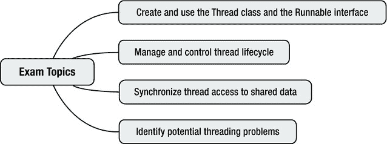

如今，当您购买电脑（无论是笔记本电脑还是台式机）时，您会看到诸如*双核*、*四核*等标签来描述系统内部的处理器类型。现在的处理器拥有多个核心，即同一处理器中的多个执行单元。为了充分利用这些多核处理器，我们需要并行运行任务或线程。换句话说，我们需要使我们的程序成为多线程（或并发）程序。本质上，随着这些技术的日益普及，并发的重要性与日俱增。幸运的是，Java 内置了对并发的支持。在本章中，您将学习多线程编程的基础知识以及如何编写并发程序和应用程序。关于并发的更高级主题将在下一章中介绍。

*并发*一词的拉丁词根意为“一起运行”。在编程中，您可以让多个线程在程序中并行运行，同时执行不同的任务。因此，这是一个强大且有用的特性。

多个线程可以在同一进程的上下文中运行，从而共享相同的资源。您可以出于多种原因使用多线程。在 GUI 应用程序或小程序中，多线程提高了应用程序对用户的响应能力。对于大型计算密集型应用程序，如果应用程序运行在多处理器或多核机器上，将任务并行化可以提高应用程序的性能。

并发编程简介

在像文字处理器这样的典型应用程序中，需要同时执行许多任务——例如，响应用户、检查拼写、执行格式化和某些相关的后台任务等。像文字处理器这样的交互式应用程序需要同时执行多个任务。顺序执行这些任务是可能的；然而，用户体验可能会有所不同。例如，许多文字处理器具有自动保存功能。如果每 60 秒调用一次自动保存，并且在此期间应用程序不响应用户的操作，用户会感觉应用程序似乎挂起了。与其顺序执行这些任务，不如让自动保存任务在后台自动执行，而不中断响应用户的主要活动，这样用户体验会好得多。类似的场景是，当用户输入单词时，在后台字典中运行拼写检查，然后为拼写错误的单词建议替代拼写。并行执行此类活动可以增强应用程序的响应能力，从而改善用户体验。这些并行活动可以实现为线程：同时并行运行多个线程称为*多线程*或*并发*。

多线程对于互联网应用程序也非常有用。例如，一个显示股票市场更新信息的小程序可能希望检索最新信息并显示图形和文本更新。您可以编写一个简单的无限循环，该循环将一直等待更新，然后刷新图形和文本。这种方法浪费处理器周期；而且，当更新发生时，用户会感觉小程序挂起了。更好的方法是让一个线程等待更新发生，并在任何更新发生时通知主线程。然后，单独的线程可以刷新小程序的图形和文本。

`Object` 和 `Thread` 类以及 `Runnable` 接口为 Java 中的并发提供了必要的支持。`Object` 类具有诸如 `wait()`、`notify()`/`notifyAll()` 等方法，这些方法对多线程很有用。由于 Java 中的每个类都派生自 `Object` 类，因此所有对象都具有一些基本的多线程能力。例如，您可以获取对 Java 中*任何*对象的锁（如果您还不明白“获取锁”的含义，请不要担心——我们将在本章后面讨论）。然而，要*创建*一个线程，`Object` 提供的这种基本支持是不够的。为此，一个类应该扩展 `Thread` 类或实现 `Runnable` 接口。`Thread` 和 `Runnable` 都在 `java.lang` 库中，因此您无需显式导入这些类即可编写多线程程序。

重要的线程相关方法

表 13-1 列出了 `Thread` 类中一些重要的方法，您将在本章中使用这些方法。

表 13-1 . Thread 类中的重要方法


| 方法 | 方法类型 | 简要描述 |
| --- | --- | --- |
| `Thread currentThread()` | 静态方法 | 返回当前线程的引用。 |
| `String getName()` | 实例方法 | 返回当前线程的名称。 |
| `int getPriority()` | 实例方法 | 返回当前线程的优先级值。 |
| `void join(),` `void join(long),` `void join(long, int)` | 重载的实例方法 | 调用 join 的当前线程会等待另一个线程终止。你可以选择以毫秒为单位（以 `long` 类型给出）指定超时时间，或以毫秒和纳秒为单位（以 `long` 和 `int` 类型给出）指定超时时间。 |
| `void run()` | 实例方法 | 一旦你启动一个线程（使用 `start()` 方法），当线程准备好执行时，`run()` 方法就会被调用。 |
| `void setName(String)` | 实例方法 | 将线程的名称更改为参数中给定的名称。 |
| `void setPriority(int)` | 实例方法 | 将线程的优先级设置为给定的参数值。 |
| `void sleep(long)` `void sleep(long, int)` | 重载的静态方法 | 使当前线程休眠给定的毫秒数（以 long 类型给出），或给定的毫秒数和纳秒数（以 `long` 和 `int` 类型给出）。 |
| `void start()` | 实例方法 | 启动线程；JVM 会调用线程的 `run()` 方法。 |
| `String toString()` | 实例方法 | 返回线程的字符串表示形式；该字符串包含线程的名称、优先级及其所属线程组。 |

在本章中，你还会用到 `Object` 类中一些与线程相关的方法，如表 13-2 所示。

表 13-2 .  Object 类中重要的线程相关方法

| 方法 | 方法类型 | 简要描述 |
| --- | --- | --- |
| `void wait(),` `void wait(long),` `void wait(long, int)` | 重载的实例方法 | 当前线程在调用任何 wait 方法之前，必须先获取该对象的锁。如果调用了 `wait()`，线程将无限期等待，直到其他线程通知（通过调用 `notify()`/`notifyAll()` 方法）该锁。`wait(long)` 方法以毫秒为参数。线程会一直等待，直到被通知或超时。`wait(long, int)` 方法与 `wait(long)` 类似，但额外以纳秒为参数。 |
| `void notify()` | 实例方法 | 当前线程在调用 `notify()` 之前，必须先获取该对象的锁。JVM 会选择*一个*正在等待该锁的线程并将其唤醒。 |
| `void notifyAll()` | 实例方法 | 当前线程在调用 `notifyAll()` 之前，必须先获取该锁。JVM 会唤醒*所有*正在等待该锁的线程。 |

创建线程

Java 线程可以通过两种方式创建：继承 `Thread` 类或实现 `Runnable` 接口。两者都有一个名为 `run()` 的方法。当线程开始执行时，JVM 会调用此方法。你可以将 `run()` 方法视为线程执行的起点，就像 `main()` 方法是程序执行的起点一样。在学习它们之间的区别之前，你将先看到两个创建线程的示例——继承 `Thread` 和实现 `Runnable`。

继承 Thread 类

你首先来了解如何继承 `Thread` 类。当你想要继承 `Thread` 类时，需要重写 `run()` 方法。如果你不重写 `run()` 方法，则会调用 `Thread` 类中默认的 `run()` 方法，该方法什么也不做。

要重写 `run()` 方法，你需要将其声明为 `public`；它不接受任何参数，并且返回类型为 `void`——换句话说，它应该声明为 `public void run()`。

可以通过在 `Thread` 类（或其派生类）的对象上调用 `start()` 方法来创建线程。当 JVM 调度该线程时，它会将线程移至*可运行*状态，然后执行 `run()` 方法。（我们将在本章后面讨论线程状态）。当 `run()` 方法执行完毕并返回时，线程将终止。清单 13-1 是多线程的第一个示例。

清单 13-1.  MyThread1.java

```
class MyThread1 extends Thread {
        public void run() {
                try {
                       sleep(1000);
                }
                catch (InterruptedException ex) {
                        ex.printStackTrace();
                        // 忽略 InterruptedException - 这可能是 Java 中少数几个可以忽略的异常之一
                }
                System.out.println("在 run 方法中；线程名称是：" + getName());
        }
        public static void main(String args[])  {
                Thread myThread = new MyThread1();
                myThread.start();
                System.out.println("在 main 方法中；线程名称是：" +
                        Thread.currentThread().getName());
        }
}
```

该程序输出以下内容：

```
在 main 方法中；线程名称是：main
在 run 方法中；线程名称是：Thread-0
```

在这个示例中，`MyThread1` 类继承了 `Thread` 类。你在这个类中重写了 `run()` 方法。当线程运行时，会调用这个 `run()` 方法。在 `main()` 函数中，你创建了一个新线程并使用 `start()` 方法启动它。一个重要的注意事项：你不要直接调用 `run()` 方法。相反，你使用 `start()` 方法启动线程；`run()` 方法由 JVM 自动调用。我们稍后会再次讨论这个话题。

要打印线程的名称，你可以使用实例方法 `getName()`，它返回一个 `String`。由于 `main()` 是一个静态方法，你无法访问 `this` 引用。因此，你使用 `Thread` 类中的静态方法 `currentThread()`（该方法返回一个 `Thread` 对象）来获取当前线程的名称。现在你可以在返回的对象上调用 `getName`。正如你稍后将看到的，`main()` 方法也是作为一个线程执行的！然而，在 `run()` 方法内部，你可以直接调用 `getName()` 方法：`MyThread1` 继承了 `Thread`，因此所有基类成员在 `MyThread1` 中也是可用的。

该程序从 `main` 线程和你（在 `main` 中）创建的 `myThread` 中打印消息。打印出的线程名称是 *Thread-0*。稍后你将看到线程的默认命名约定。

图 13-1 展示了该程序如何执行并打印输出。请注意，`main` 线程和 `myThread1` 线程同时执行（即并发执行），如图所示。如果你多次运行此程序，你可能会得到上面显示的输出，或者这两个语句的顺序可能会颠倒（取决于哪个线程被优先调度来执行此语句）。你将在本章稍后部分研究这种非确定性行为。

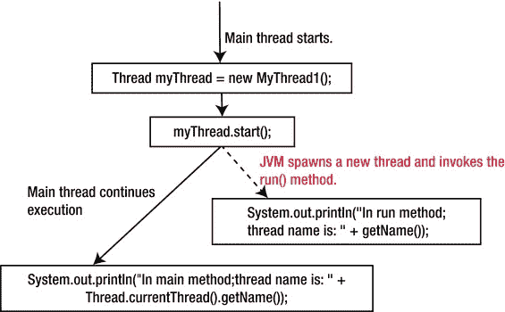

图 13-1.  从 main 方法中生成一个新线程

实现 Runnable 接口

`Thread` 类本身实现了 `Runnable` 接口。除了继承 `Thread` 类，你也可以实现 `Runnable` 接口。`Runnable` 接口声明了一个唯一的方法 `run()`。

```
// 在 java.lang 包中
public interface Runnable {
        public void run();
}
```


当你实现 `Runnable` 接口时，需要定义 `run()` 方法。请记住，`Runnable` 并未声明 `start()` 方法。那么，如果你实现了 `Runnable` 接口，该如何创建线程呢？`Thread` 有一个重载的构造函数，它接受一个 `Runnable` 对象作为参数。

```
Thread(Runnable target)
```

你可以使用这个重载的构造函数，从一个实现了 `Runnable` 接口的类来创建线程。

首先，让我们通过实现 `Runnable` 接口来修改之前的程序。如果你将 “`class MyThread1 extends Thread`” 改为 “`class MyThread1 implements Runnable`” 并编译代码，你会遇到两个编译错误：

```
MyThread1.java:3: 找不到符号
符号  : 方法 getName()
位置: 类 MyThread1
                System.out.println("In run method; thread name is: " + this.getName());

MyThread1.java:7: 类型不兼容
找到   : MyThread1
需要: java.lang.Thread
                Thread myThread = new MyThread1();
```

`getName()` 方法位于 `Thread` 类中，但 `MyThread1` 类不再继承 `Thread`，因此会导致编译错误。同样，`start()` 方法也位于 `Thread` 类中，由于你直接实现了 `Runnable`，你也不再拥有该方法。

清单 13-2 包含了修复这两个编译错误后，实现 `Runnable` 接口的改进版程序。

清单 13-2.  MyThread2.java

```
class MyThread2 implements Runnable {
        public void run() {
                System.out.println("In run method; thread name is: " + Thread.currentThread().getName());
        }

public static void main(String args[]) throws Exception {
                Thread myThread = new Thread(new MyThread2());
                myThread.start();
                System.out.println("In main method; thread name is: " + Thread.currentThread().getName());
        }
}
```

它输出的结果与之前的程序相同：

```
In main method; thread name is: main
In run method; thread name is: Thread-0
```

你像之前的程序一样实现了 `run()` 方法。然而，为了获取线程名称，你必须采用一种迂回的方式，通过 `Thread.currentThread().getName()` 来获取线程名，就像你在 `main()` 方法中获取线程名那样。同样，在 `main()` 方法中，为了创建线程，你必须将类的对象传递给 `Thread` 构造函数。而在继承 `Thread` 类时，只需创建 `MyThread1` 对象并直接调用其 `start()` 方法，既简单又方便。

应该继承 Thread 还是实现 Runnable？

你可以通过继承 `Thread` 类或实现 `Runnable` 接口来创建线程。那么，你应该选择哪一种呢？

`Thread` 类对 `run()` 方法有默认实现，因此如果你在继承 `Thread` 类时没有提供 `run()` 方法的定义，编译器不会报错。然而，`Thread` 类中的默认实现*什么也不做*，所以如果你希望你的线程执行一些有意义的工作，你仍然需要定义它。`Runnable` 接口声明了 `run()` 方法，因此如果你实现了 `Runnable` 接口，你*必须*在你的类中定义 `run()` 方法。所以，实现 `Runnable` 还是继承 `Thread` 并不重要。出于所有实际目的，你都必须定义 `run()` 方法。总之，这并不是继承 `Thread` 和实现 `Runnable` 之间的主要区别。那么继承关系呢？

由于 Java 只支持单继承，如果你继承了 `Thread`，你就无法再继承任何其他类。由于继承是一种“is-a”关系，你很少需要让一个类与 `Thread` 类建立“is-a”关系。因此，面向对象纯粹主义者认为你不应该继承 `Thread` 类。另一方面，如果你实现了 `Runnable` 接口，你仍然可以继承其他类。因此，许多 Java 专家建议，除非有强有力的理由需要继承 `Thread` 类，否则最好实现 `Runnable` 接口。

然而，在许多情况下，继承 `Thread` 类更为方便。在你看到的获取线程名称的例子中，当实现 `Runnable` 接口时，你必须使用 `Thread.currentThread().getName()`，而由于 `MyThread1 extends Thread`，在继承 `Thread` 时你只需直接使用 `getName()` 方法。因此，在这种情况下，继承 `Thread` 稍微方便一些。

这两种技术都很有用，并且在解决问题时基本等效。所以，请从实用角度出发：根据你试图解决的具体问题，选择使用其中任何一种。对于 OCPJP 7 考试，你需要知道如何通过继承 `Thread` 类或实现 `Runnable` 接口来创建用于多线程的类，以及这两种方法之间的区别。

Start( ) 和 Run( ) 方法

你重写了 `run()` 方法，但调用的是 `start()` 方法。为什么不能直接调用 `run()` 方法呢？如果你将之前的程序中的 `myThread.start()` 改为 `myThread.run()`，会发生什么？清单 13-3 展示了这个修改后的程序（并将类名改为 `MyThread3`）。

清单 13-3.  MyThread3.java

```
class MyThread3 implements Runnable {
        public void run() {
                System.out.println("In run method; thread name is: " + Thread.currentThread().getName());
        }

public static void main(String args[]) throws Exception {
                Thread myThread = new Thread(new MyThread3());
                myThread.run(); // 注意这里用的是 run() 而不是 start()
                System.out.println("In main method; thread name is : " + Thread.currentThread().getName());
        }
}
```

这会输出以下内容：

```
In run method; thread name is: main
In main method; thread name is: main
```

现在输出不同了！如果你直接调用 `run()` 方法，它只是*作为调用线程的一部分来执行*。它不会作为一个线程来执行：它不会被调度，也不会被 JVM 调用。这就是为什么 `run()` 方法中的 `getName()` 方法返回的是 “main” 而不是 “Thread-0”。当你调用 `start()` 方法时，线程会被调度，当执行该线程的时机到来时，JVM 会调用 `run()` 方法。

|  | 永远不要直接调用 `run()` 方法来启动线程。请使用 `start()` 方法，并让 JVM 隐式地调用 `run()` 方法。直接调用 `run()` 方法而不是 `start()` 是一个错误，也是一个相当常见的 bug。 |

线程名称、优先级和组

你需要了解与每个 Java 线程相关的三个主要方面：它的*名称*、*优先级*以及它所属的*线程组*。

每个线程都有一个名称，你可以用它来标识线程。如果你没有显式地指定名称，线程会获得一个默认名称。优先级范围从 1（最低）到 10（最高）。普通线程的优先级默认为 5，你可以通过显式提供优先级值来更改这个默认优先级。每个线程都是某个*线程组*的一部分。这是一个很少使用的特性，因此本书不会介绍它。`Thread` 的 `toString()` 方法会打印这三个详细信息，请参阅清单 13-4 中获取这些详细信息的简单程序。


清单 13-4.  SimpleThread.java

```
class SimpleThread {
        public static void main(String []s) {
                Thread t = new Thread();
                System.out.println(t);
        }
}
```

该程序输出如下内容：

```
Thread[Thread-0,5,main]
```

`Thread` 是类的名称。在“[”和“]”之间的是线程的名称、优先级和线程组。你没有给线程指定任何名称，因此使用了默认名称 `Thread-0`（随着你创建更多线程，线程将被命名为 `Thread-1`、`Thread-2` 等）。默认优先级为 5。你在 `main()` 中创建了该线程，因此默认线程组是“main”。

现在，让我们尝试使用 `setName()` 和 `setPriority()` 方法来更改线程的名称和优先级：

```
Thread t = new Thread();
t.setName("SimpleThread");
t.setPriority(9);
System.out.println(t);
```

这段代码输出如下内容：

```
Thread[SimpleThread,9,main]
```

线程现在拥有了你赋予的名称和优先级。你可以随意更改线程的名称，这不会改变程序的行为。但是，在更改线程优先级时需要小心，因为它会影响线程的调度。你可以通过静态成员 `MIN_PRIORITY`、`NORM_PRIORITY` 和 `MAX_PRIORITY` 以编程方式访问线程的最小、正常和最大优先级，如清单 13-5 所示。

清单 13-5.  ThreadPriorities.java

```
class ThreadPriorities {
        public static void main(String []s) {
                System.out.println("Minimum priority of a thread: " + Thread.MIN_PRIORITY);
                System.out.println("Normal priority of a thread: " + Thread.NORM_PRIORITY);
                System.out.println("Maximum priority of a thread: " + Thread.MAX_PRIORITY);
        }
}
```

该程序输出如下内容：

```
Minimum priority of a thread: 1
Normal priority of a thread: 5
Maximum priority of a thread: 10
```

使用 Thread.sleep() 方法

假设你想为一个定时炸弹实现一个倒计时器，从九数到零，每次计数暂停 1 秒。到达零后，它应该打印“Boom!!!”。你可以通过创建一个线程来执行倒计时来实现此功能。为了每秒暂停一次，你可以调用 `Thread.sleep` 方法。请参见清单 13-6。

清单 13-6.  TimeBomb.java

```
class TimeBomb extends Thread {
        String [] timeStr = { "Zero", "One", "Two", "Three", "Four", "Five", "Six", "Seven", "Eight", "Nine" };

public void run() {
                for(int i = 9; i > = 0; i--) {
                        try {
                                System.out.println(timeStr[i]);
                                Thread.sleep(1000);
                        }
                        catch(InterruptedException ie) {
                                ie.printStackTrace();
                        }
                }
        }

public static void main(String []s) {
                TimeBomb timer = new TimeBomb();
                System.out.println("Starting 10 second count down. . . ");
                timer.start();
                System.out.println("Boom!!!");
        }
}
```

它输出如下内容，从 Nine 打印到 Zero 之间间隔 1 秒：

```
Starting 10 second count down. . .
Boom!!!
Nine
Eight
Seven
Six
Five
Four
Three
Two
One
Zero
```

程序并没有完全按预期工作。消息“Boom!!!”甚至在倒计时开始之前就被打印出来了！在讨论这种奇怪行为的原因之前，让我们先了解一下 `sleep()` 方法的基础知识。

你可以使用 `Thread` 类中提供的静态方法 `sleep()` 来让当前线程休眠（或暂停）一段时间。`Thread` 类中有两个重载的静态 `sleep()` 方法：

```
void sleep(long)
void sleep(long, int)
```

`sleep()` 方法的第一个版本以毫秒为参数。第二个版本除了毫秒之外，还以纳秒作为第二个参数。

`sleep()` 方法会抛出 `InterruptedException`。由于 `InterruptedException` 是一个受检异常（它继承自 `Exception` 类），你需要在 `sleep()` 周围提供一个 try-catch 块，或者声明 `run()` 方法 `throws` 异常 `InterruptedException`。但是，如果你声明 `void run() throws InterruptedException`，你将不会重写 `run()` 方法，因为异常规范不同（`run()` 方法不会抛出任何受检异常）。因此，你必须在 `run()` 方法内提供一个 try-catch 块来处理此异常。那么，你应该如何处理 `InterruptedException` 呢？

首先，你需要理解 `InterruptedException` 的含义以及它何时被抛出。一个线程可以“中断”另一个线程，例如，请求它停止工作。在这种情况下，接收中断的线程——如果它处于 `sleep()` 或 `wait()`（我们稍后会再次讨论）状态——会导致抛出 `InterruptedException`。接收中断的线程可以忽略中断并继续执行（这不是一个好主意，但可以这样做），或者它可以停止执行。在本书涵盖的多线程程序中，你不会中断其他线程。因此，我们假设你的线程不会收到任何中断，你将忽略该异常并让线程继续工作。换句话说，你将有意忽略 `InterruptedException`（在调用异常的 `printStackTrace()` 方法之后）；然而，在实际程序中，如果你使用线程中断功能，你可能需要处理此异常。

回到程序的输出，消息“Boom!!!”在打印完“Starting 10 second count down. . . ”之后立即被打印出来，而不是在倒计时到零之后。为什么会这样？

`main` 线程通过调用 `timer.start()` 开始执行计时器线程。`main` 线程的执行独立于 `timer` 线程的执行，因此它执行下一条语句，即向控制台打印“Boom!!!”。

但请记住，你希望 `main()` 方法等待，直到 `timer` 线程完成。如何做到这一点？为此，你必须学习如何使用 `Thread` 类中提供的 `join()` 方法。

使用 Thread 的 Join 方法

`Thread` 类有一个实例方法 `join()`，用于等待一个线程“死亡”。在 `TimeBomb` 程序中，你希望 `main()` 线程等待计时器线程完成其执行。你可以使用 `Thread` 类中的实例方法 `join()` 来实现这一点。以下是 `TimeBomb` 程序的改进版本，仅对 `main()` 方法进行了更改：

```
public static void main(String []s) {
        TimeBomb timer = new TimeBomb();
        System.out.println("Starting 10 second count down. . . ");
        timer.start();
        try {
                timer.join();
        }
        catch(InterruptedException ie) {
                ie.printStackTrace();
        }
        System.out.println("Boom!!!");
}
```

现在程序按预期输出结果：

```
Starting 10 second count down. . .
Nine
Eight
Seven
Six
Five
Four
Three
Two
One
Zero
Boom!!!
```

`Thread` 类有三个重载版本的 `join()` 方法：

```
void join();
void join(long);
void join(long, int);
```


如果当前线程在另一个线程的实例上调用 `join()`（即此处列出的第一个重载版本），那么当前线程将无限期地等待该线程终止。接下来的两个重载方法接受一个“超时”时间作为参数；当前线程只会等待另一个线程终止，直到超时时间到期。如果另一个线程在超时时间之前没有完成，当前线程将继续执行。第二个方法以毫秒（`long` 类型值）为单位接受超时时间，第三个重载版本则同时接受毫秒和纳秒（`long` 和 `int` 类型值）。

`join()` 方法还会抛出 `InterruptedException`；你将忽略此异常，原因与本章前面讨论 `sleep()` 方法时相同。

异步执行

在前面的程序中，你看到主线程和你创建的线程是独立执行的。换句话说，线程是*异步*运行的。线程不会顺序执行（像函数调用那样），因此线程的执行顺序是不可预测的——也就是说，线程的行为本质上是*非确定性的*。为了理解这一点，请参考清单 13-7。

清单 13-7.  AsyncThread.java

```
class AsyncThread extends Thread {
        public void run() {
                System.out.println("启动线程 " + getName());
                for(int i = 0; i < 3; i++) {
                        System.out.println("在线程 " + getName() + " 中；迭代 " + i);
                        try {
                                // 在下一次迭代前休眠一小段时间
                                Thread.sleep(10);
                        }
                        catch(InterruptedException ie) {
                                // 我们没有中断任何线程
                                // – 因此可以安全地忽略此异常
                                ie.printStackTrace();
                        }
                }
        }

public static void main(String args[]) {
                AsyncThread asyncThread1 = new AsyncThread();
                AsyncThread asyncThread2 = new AsyncThread();
                // 同时启动两个线程
                asyncThread1.start();
                asyncThread2.start();
        }
}
```

在清单 13-7 中，`run()` 方法包含一个迭代三次的 `for` 循环。在 `for` 循环中，你打印了线程名称和迭代次数。打印这些信息后，你强制当前线程 `sleep` 10 毫秒。

在一次示例运行中，输出如下：

```
启动线程 Thread-0
启动线程 Thread-1
在线程 Thread-1 中；迭代 0
在线程 Thread-0 中；迭代 0
在线程 Thread-1 中；迭代 1
在线程 Thread-0 中；迭代 1
在线程 Thread-0 中；迭代 2
在线程 Thread-1 中；迭代 2
```

在另一次示例运行中，输出如下：

```
启动线程 Thread-0
启动线程 Thread-1
在线程 Thread-1 中；迭代 0
在线程 Thread-0 中；迭代 0
在线程 Thread-1 中；迭代 1
在线程 Thread-0 中；迭代 1
在线程 Thread-1 中；迭代 2
在线程 Thread-0 中；迭代 2
```

如你所见，这两次运行的输出略有不同（参见输出中的斜体部分）！为什么？

线程 `Thread-0` 和 `Thread-1` 是独立执行的。输出不是固定的，线程中迭代的执行顺序也是不可预测的。程序员无法确定线程的执行顺序。底层平台可能使用多个处理器中的任何一个，或者对单个处理器进行时间片分配，来为线程分配 CPU 时间。这既不受 JVM 控制，也不受程序员控制。这是多线程编程中需要理解的基本且最重要的概念之一。

|  | 你既无法预测也无法控制线程的执行顺序！ |

|  | 由于多线程程序的行为是非确定性的，因此在编写多线程程序时必须小心谨慎。你不能期望基于线程执行顺序的预定输出。 |

线程的状态

线程在其生命周期中有多种状态。理解线程的不同状态，并基于这种理解编写健壮的代码非常重要。你将看到三种线程状态——*新建*、*可运行*和*终止*——这些状态几乎适用于你将在本节中创建的所有线程。我们稍后会讨论更多线程状态。

程序可以使用 `Thread.State` 枚举来访问线程的状态。`Thread` 类有一个 `getState()` 实例方法，它返回线程的当前状态；请参考清单 13-8 中的示例。

清单 13-8.  BasicThreadStates.java

```
class BasicThreadStates extends Thread {
        public static void main(String []s) throws Exception {
                Thread t = new Thread(new BasicThreadStates());
                System.out.println("刚创建线程后；\n" +
                                "       线程状态为：" + t.getState());
                t.start();
                System.out.println("刚调用 t.start() 后；\n" +
                                "       线程状态为：" + t.getState());
                t.join();
                System.out.println("主线程刚调用 t.join() 后；\n" +
                                "       线程状态为：" + t.getState());
        }
}
```

该程序打印如下内容：

```
刚创建线程后；
        线程状态为：NEW
刚调用 t.start() 后；
        线程状态为：RUNNABLE
主线程刚调用 t.join() 后；
        线程状态为：TERMINATED
```

刚创建线程之后、调用该线程的 `start()` 方法之前，线程处于*新建*状态。调用 `start()` 方法后，线程已准备好运行或正在运行（你无法确定），因此它处于*可运行*状态。从 `main()` 方法中，你调用了 `t.join()`。`main()` 方法等待线程 `t` 终止。因此，一旦 `main()` 线程成功执行了 `t.join()` 语句，就意味着线程 `t` 已经终止或结束。所以，线程现在处于*终止*状态。

一个建议：使用 `getState()` 方法访问线程状态时要小心。为什么？因为当你获取线程状态信息并打印它时，状态可能已经改变了！我们知道最后这句话令人困惑。为了理解使用 `getState()` 方法获取线程状态信息的问题，请考虑前面的示例。在同一个程序的一次示例运行中，它打印了以下内容：

```
刚创建线程后；
        线程状态为：NEW
刚调用 t.start() 后；
        线程状态为：TERMINATED
主线程刚调用 t.join() 后；
        线程状态为：TERMINATED
```

注意输出中的斜体部分，即打印“`刚调用 t.start() 后；`”之后的语句。在最初的输出中，你得到的线程状态（如预期）是 `RUNNABLE` 状态。然而，在同一个程序未做任何修改的另一次执行中，它打印的状态是 `TERMINATED`。为什么？在这种情况下，线程在你有机会检查并打印其状态之前就已经结束了！（注意，你在 `BasicThreadStates` 类中没有实现 `run()` 方法，因此 `run()` 方法的默认实现什么也不做，并迅速终止。）


每个 Java 线程都会经历以下三种状态，如图 图 13-2 所示。其中，*可运行*状态实际上在操作系统层面包含两个独立的状态，我们现在就来讨论这一点。

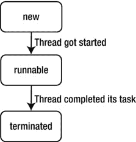

图 13-2.  线程生命周期中的基本状态

“可运行”状态中的两个子状态

一旦线程从*新建*状态转换到*可运行*状态，你可以认为该线程在操作系统层面具有两个状态：*就绪*状态和*运行*状态。当线程等待操作系统将其调度到处理器上运行时，它处于*就绪*状态。当操作系统实际将其在处理器上运行时，它处于*运行*状态。可能有很多线程在等待处理器时间。当前线程可能会占用大量时间，最终自愿放弃 CPU。在这种情况下，该线程会再次回到*就绪*状态。这两个状态如图 图 13-3 所示。

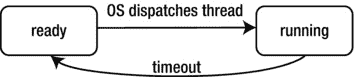

图 13-3.  可运行状态在操作系统层面实现为两个状态

并发访问问题

线程中的并发编程充满了陷阱和问题。在本节中，我们将讨论两个主要的并发访问问题——*数据竞争*和*死锁*。

数据竞争

线程共享内存，并且可以并发地修改数据。由于修改可以在没有保护措施的情况下同时进行，这可能导致非直观的结果。

当两个或更多线程试图访问一个变量，并且其中一个线程想要修改它时，就会出现一个称为*数据竞争*的问题（也称为*竞态条件*或*竞争冒险*）。代码清单 13-9 展示了一个数据竞争的例子。

代码清单 13-9.  DataRace.java

```
// This class exposes a publicly accessible counter
// to help demonstrate data race problem
class Counter {
        public static long count = 0;
}

// This class implements Runnable interface
// Its run method increments the counter three times
class UseCounter implements Runnable {
        public void increment() {
                // increments the counter and prints the value
                // of the counter shared between threads
                Counter.count++;
                System.out.print(Counter.count + "  ");
        }
        public void run() {
                increment();
                increment();
                increment();
        }
}

// This class creates three threads
public class DataRace {
        public static void main(String args[]) {
                UseCounter c = new UseCounter();
                Thread t1 = new Thread(c);
                Thread t2 = new Thread(c);
                Thread t3 = new Thread(c);
                t1.start();
                t2.start();
                t3.start();
        }
}
```

在这个程序中，有一个 `Counter` 类，它有一个静态变量 `count`。在 `UseCounter` 类的 `run()` 方法中，你通过调用 `increment()` 方法将 `count` 递增三次。你在 `DataRace` 类的 `main()` 函数中创建了三个线程并启动它们。你期望程序在线程运行并递增计数器时，按顺序打印出 1 到 9。然而，当你运行这个程序时，它确实打印了九个整数值，但输出看起来像是乱码！在一次示例运行中，我们得到了这些值：

```
3  3  5  6  3  7  8  4  9
```

请注意，每次运行此程序时，这些值通常都会不同；当我们又运行了两次时，得到了以下输出：

```
3  3  5  6  3  4  7  8  9

3  3  3  6  7  5  8  4  9
```

那么，问题出在哪里呢？

表达式 `Counter.count++` 是一个写操作，而接下来的 `System.out.print` 语句是对 `Counter.count` 的读操作。当三个线程执行时，每个线程都有 `Counter.count` 值的一个本地副本，当它们通过 `Counter.count++` 更新 `counter` 时，它们不需要立即将该值反映到主内存中（参见 图 13-4）。在接下来的 `Counter.count` 读操作中，打印的是 `Counter.count` 的本地值。

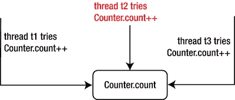

图 13-4.  线程 t1、t2 和 t3 试图更改 Counter.count，导致数据竞争

因此，这个程序存在数据竞争问题。为了避免这个问题，你需要确保单个线程能够*原子地*一起执行写和读操作。被多个线程共同访问和修改的代码段称为*临界区*。为了避免数据竞争问题，你需要确保临界区一次只能由一个线程执行。

如何做到这一点呢？通过获取对象上的锁。一次只有一个线程可以获取对象上的锁，并且只有该线程可以执行由该锁保护的代码块（即临界区）。在此之前，其他线程必须等待。在内部，这是通过监视器实现的，这个过程称为*加锁*和*解锁*（即*线程同步*）。让我们更详细地讨论这一点。

线程同步

Java 有一个关键字 `synchronized`，它有助于线程同步。你可以以两种形式使用它——同步块和同步方法。

同步块

在同步块中，你为引用变量使用 `synchronized` 关键字，后面跟着一个代码块。线程必须获取同步变量上的锁才能进入该块；当块执行完成时，线程释放该锁。例如，如果代码块位于非静态方法内，你可以获取 `this` 引用上的锁：

```
synchronized(this) {
        // 由互斥锁保护的代码段
}
```

如果在同步块内抛出异常怎么办？锁会被释放吗？是的，无论块是完全执行还是抛出异常，JVM 都会自动释放锁。

使用同步块，你只能获取引用变量上的锁。如果你使用基本类型，将会出现编译器错误。

```
int i = 10;
synchronized(i) { /* 这里的代码块 */}
```

对于这段代码，你将收到以下编译器错误：

```
Lock.java:5: int is not a valid type's argument for the synchronized statement
found   : int
required: reference
                synchronized(i) { /* 这里的代码块 */}
```

以下是上一节讨论的程序的改进版本，它对 `Counter.count` 执行同步访问，并在临界区中对该变量执行读写操作。为此，你只需要更改 `increment` 方法，如下所示：

```
 public void increment() {
        // 这两个语句对一个被多个线程共同访问的变量执行读写操作。
        // 因此，在处理这个“临界区”之前获取一个锁。
        synchronized(this) {
                Counter.count++;
                System.out.print(Counter.count + "  ");
        }
}
```

现在程序正确地打印了预期的输出：

```
1  2  3  4  5  6  7  8  9
```


在 `increment()` 方法中，你在读写 `Counter.count` 之前获取了 `this` 引用的锁。因此，不可能有多个线程同时执行这些语句。由于只有一个线程能获取锁并执行“临界区”代码块，所以在任意给定时刻，计数器只会被一个线程递增；结果，程序正确打印出 1 到 9 的值（没有数据竞争问题）。

同步方法

整个方法可以声明为 `synchronized`。在这种情况下，当调用声明为 `synchronized` 的方法时，会在调用该方法的对象上获取一个锁，并在方法返回给调用者时释放该锁。示例如下：

```
public synchronized void assign(int i) {
        val = i;
}
```

现在 `assign()` 方法是一个同步方法。如果你调用 `assign()` 方法，它会隐式获取 `this` 引用的锁，然后执行语句 `val = i;`。如果其他线程已经获取了锁，会发生什么？就像同步块一样，如果线程无法获取锁，它将被*阻塞*，并等待直到锁可用。

如果你将整个方法体包裹在一个 `synchronized(this)` 块中，那么同步方法就等同于一个同步块。因此，使用同步块的等效 `assign()` 方法是：

```
public void assign() {
        synchronized(this) {
                val = i;
        }
}
```

你可以将静态方法声明为 `synchronized`。然而，锁是在哪个引用变量上获取的呢？记住，静态方法没有隐式的 `this` 引用。静态同步方法在 `class` 对象上获取锁。每个类都与一个 `Class` 类型的对象相关联，你可以使用 `ClassName.class` 语法来访问它。例如：

```
class SomeClass {
        private static int val;
        public static synchronized void assign(int i) {
                val = i;
        }
        // 更多成员 . . .
}
```

在这种情况下，`assign` 方法在被调用时会获取 `SomeClass.class` 对象上的锁。现在，使用同步块的等效 `assign()` 方法可以写成：

```
class SomeClass {
        private static int val;
        public static void assign(int i) {
                synchronized(SomeClass.class) {
                        val = i;
                }
        }
        // 更多成员 . . .
}
```

你不能将构造函数声明为 `synchronized`；这会导致编译器错误。例如，对于：

```
class Synchronize {
        public synchronized Synchronize() { /* 构造函数体 */}
        // 更多方法
}
```

你会得到这个错误：

```
Synchronize.java:2: modifier synchronized not allowed here
        public synchronized Synchronize() { /* 构造函数体 */}
```

为什么不能将构造函数声明为 `synchronized`？JVM 确保在任意给定时间点，只有一个线程能调用构造函数（针对特定的构造函数）。因此，没有必要将构造函数声明为 `synchronized`。不过，如果你愿意，可以在构造函数内部使用同步块。

让我们回到 `Counter` 示例。`increment()` 方法也可以重写为同步方法：

```
// 将 increment 声明为同步方法，而不是在方法内部
// 使用同步语句包裹一段代码块
public synchronized void increment() {
        Counter.count++;
        System.out.print(Counter.count + "  ");
}
```

现在程序正确打印出预期的输出：

```
1  2  3  4  5  6  7  8  9
```

在这个例子中，`increment()` 是一个实例方法。静态方法呢？首先，让我们看看当 `increment()` 方法是静态方法时的数据竞争问题；参见清单 13-10。

清单 13-10.  DataRace.java

```
class Counter {
        public static long count = 0;
}

class UseCounter implements Runnable {
        public static void increment() {
                Counter.count++;
                System.out.print(Counter.count + "  ");
        }
        public void run() {
                increment();
                increment();
                increment();
        }
}

public class DataRace {
        public static void main(String args[]) {
                UseCounter c = new UseCounter();
                Thread t1 = new Thread(c);
                Thread t2 = new Thread(c);
                Thread t3 = new Thread(c);
                t1.start();
                t2.start();
                t3.start();
        }
}
```

是的，这个程序存在数据竞争问题。要修复它，你可以将静态的 `increment` 方法声明为 `synchronized`，如下所示：

```
public static synchronized void increment() {
        Counter.count++;
        System.out.print(Counter.count + "  ");
}
```

做了这个改动后，程序就没有数据竞争问题了。

|  | 初学者常误解同步块是为一段代码块获取锁。实际上，锁是为一个对象获取的，而不是为一段代码。获取的锁会一直持有，直到该块中的所有语句执行完毕。 |

同步块 vs. 同步方法

从之前关于同步块和同步方法的讨论可以看出，你可以使用其中任何一种来解决数据竞争问题。那么应该选择哪一种呢？与其他语言特性一样，你需要根据特定情况的需求在同步方法和同步块之间做出选择。以下是一些考虑因素。

如果你只想为一段小的代码块（而不是整个方法）获取对象上的锁，那么同步块就足够了；在这种情况下使用同步方法有些大材小用。通常，最好为小段代码获取锁，而不是不必要地锁定整个方法，因此同步块在这方面很有用。在同步块中，你可以显式提供要获取锁的引用对象。然而，对于同步方法，你不需要提供任何显式引用来获取锁。同步方法隐式地在 `this` 引用（对于实例方法）和类对象（对于静态方法）上获取锁。

另一方面，如果你想为一个小方法的整个方法体获取锁，那么使用 `synchronized` 作为方法属性比使用同步块更优雅、更方便。在同步方法中，阅读方法声明本身时，就能清楚地知道该方法是同步的；而对于同步块，你需要阅读文档或查看代码内部才能理解执行了某些同步操作。

死锁

获取和使用锁很棘手，可能导致很多问题。其中一个困难（且常见）的问题被称为*死锁*。还有其他问题，如*活锁*和*锁饥饿*，我们将在下一节简要讨论。

当锁定线程导致它们无法继续执行，从而无限等待其他线程终止时，就会发生死锁。假设一个线程获取了资源 r1 上的锁，并等待获取另一个资源 r2 上的锁。同时，假设有另一个线程已经获取了 r2，并正在等待获取 r1 上的锁。除非另一个线程释放锁，否则这两个线程都无法继续执行，而这种情况永远不会发生——因此它们陷入了死锁。

清单 13-11 展示了这种情况是如何发生的（使用板球比赛的例子）。

清单 13-11.  DeadLock.java

```
// Balls 类有一个全局可访问的数据成员，用于保存到目前为止投出的球数
class Balls {
        public static long balls = 0;
}


// Runs 类有一个全局可访问的数据成员，用于保存到目前为止的得分次数
class Runs {
        public static long runs = 0;
}

// Counter 是一个线程类，包含两个方法——IncrementBallAfterRun 和
// IncrementRunAfterBall。
// 为了演示死锁，我们在 run 方法中调用这两个方法，
// 以便在这两个方法中以相反的顺序请求锁
class Counter implements Runnable {
        // 此方法先增加 runs 变量，然后增加 balls 变量
        // 由于这些变量可被其他线程访问，
        // 我们需要在处理它们之前获取锁
        public void IncrementBallAfterRun() {
                // 由于我们先更新 runs 变量，因此先锁定 Runs.class 引用
                synchronized(Runs.class) {
                        // 现在在更新 balls 变量之前，获取 Balls.class 变量上的锁
                        synchronized(Balls.class) {
                                Runs.runs++;
                                Balls.balls++;
                        }
                }
        }

public void IncrementRunAfterBall() {
                // 由于我们先更新 balls 变量，因此先锁定 Balls.class 引用
                synchronized(Balls.class) {
                        // 现在在更新 runs 变量之前，获取 Runs.class 变量上的锁
                        synchronized(Runs.class) {
                                Balls.balls++;
                                Runs.runs++;
                        }
                }
        }

public void run() {
                // 调用这两个以不同顺序获取锁的方法
                // 根据线程调度和锁获取的顺序，
                // 可能会也可能不会发生死锁
                IncrementBallAfterRun();
                IncrementRunAfterBall();
        }
}

public class DeadLock {
        public static void main(String args[]) throws InterruptedException {
                Counter c = new Counter();
                // 创建两个线程并同时启动它们
                Thread t1 = new Thread(c);
                Thread t2 = new Thread(c);
                t1.start();
                t2.start();
                System.out.println("等待线程完成执行...");
                t2.join();
                t2.join();
                System.out.println("完成。");
        }
}
```

如果你执行这个程序，它可能正常运行，也可能发生死锁而永不终止（该程序中死锁的发生取决于线程的调度方式）。

```
D:\ > java DeadLock
等待线程完成执行...
完成。

D:\ > java DeadLock
等待线程完成执行...
完成。

D:\ > java DeadLock
等待线程完成执行...
[死锁 – 用户按下了 ctrl + c 终止程序]

D:\ > java DeadLock
等待线程完成执行...
完成。
```

在这个例子中，有两个类，`Balls` 和 `Runs`，它们分别包含名为 `balls` 和 `runs` 的静态成员。`Counter` 类有两个方法：`IncrementBallAfterRun()` 和 `IncrementRunAfterBall()`。它们以相反的顺序获取 `Balls.class` 和 `Runs.class` 上的锁。`run()` 方法连续调用这两个方法。`Dead` 类中的 `main()` 方法创建并启动了两个线程。

当线程 `t1` 和 `t2` 执行时，它们会调用 `IncrementBallAfterRun` 和 `IncrementRunAfterBall` 方法。在这些方法中，锁以相反的顺序获取。可能会发生这样的情况：`t1` 获取了 `Runs.class` 上的锁，然后等待获取 `Balls.class` 上的锁。与此同时，`t2` 可能已经获取了 `Balls.class`，现在正在等待获取 `Runs.class` 上的锁。因此，这个程序可能导致死锁（图 13-5）。

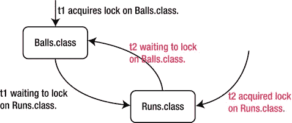


图 13-5. 线程 t1 与 t2 之间的死锁

无法保证每次执行该程序都会导致死锁。为什么？因为你永远无法预知线程的执行顺序以及锁的获取与释放顺序。因此，这类问题被称为**非确定性**问题，且无法稳定复现。

针对死锁有不同的处理策略，例如死锁预防、死锁避免或死锁检测。就考试而言，你需要了解关于死锁的以下内容：

*   死锁可能发生在多个锁的上下文中。
*   如果多个锁以相同的顺序获取，则不会发生死锁；但如果以不同的顺序获取，则可能发生死锁。
*   死锁（如同其他多线程问题）是非确定性的；你无法稳定地复现死锁。

|  | 避免获取多个锁。如果你需要获取多个锁，请确保在所有地方都以相同的顺序获取它们，以避免死锁。 |

其他线程问题

到目前为止，我们通过示例讨论了数据竞争和死锁。现在我们将简要讨论另外两个线程问题：活锁和锁饥饿。

活锁

为了帮助理解活锁，我们打个比方。假设有两辆自动驾驶的机器人汽车在道路上行驶。出现了一种情况：两辆机器人汽车同时到达一座窄桥的两端。桥非常窄，一次只能通过一辆车。机器人汽车被编程为等待另一辆车先通过。当两辆车同时试图进入桥时，可能会发生以下情况：每辆车开始进入桥，注意到另一辆车也在试图做同样的事，然后倒车！请注意，汽车不断前进和后退，看起来好像做了很多工作，但两辆车都没有取得任何进展。这种情况被称为*活锁*。

考虑两个线程 t1 和 t2。假设线程 t1 进行了一项更改，而线程 t2 撤销了该更改。当线程 t1 和 t2 同时工作时，看起来好像完成了大量工作，但实际上没有取得任何进展。这种情况在线程中被称为活锁。

活锁和死锁的相似之处在于进程“挂起”，程序永远不会终止。然而，在死锁中，线程卡在相同的状态，等待其他线程释放共享资源；而在活锁中，线程持续执行任务，进程状态不断变化，但整个应用程序并未取得进展。

锁饥饿

考虑这样一种情况：大量线程被分配了不同的优先级（范围从最低优先级 1 到最高优先级 10，这是 Java 中线程允许的优先级范围）。当一个互斥锁可用时，线程调度器会优先考虑高优先级线程而非低优先级线程。如果有许多高优先级线程想要获取锁并且长时间持有锁，那么低优先级线程何时才有机会获取锁呢？换句话说，低优先级线程长时间“饥饿”地试图获取锁的情况被称为*锁饥饿*。

有许多技术可用于检测或避免诸如活锁和饥饿之类的线程问题，但这些不在 OCPJP7 考试范围内。从考试的角度来看，你需要了解本章已经介绍过的不同类型的线程问题。

等待/通知机制

在多线程程序中，通常需要一个线程与另一个线程进行通信。当线程必须相互通信以提供某项功能时，等待/通知机制非常有用。

以咖啡店为例。服务员使用咖啡机煮咖啡，并将咖啡送给顾客。这家咖啡店的咖啡机是一台古董机：一次只能煮一杯咖啡，煮一杯需要五到十分钟。服务员在等待咖啡机完成煮咖啡的过程中不必闲着；他可以在此期间去给顾客送之前煮好的咖啡。不过这个例子有点牵强：假设咖啡机不停地煮咖啡，服务员不停地送咖啡。

`wait()`方法允许调用线程等待等待对象（即调用`wait()`的对象）。换句话说，如果你想让一个线程等待另一个线程，你可以使用`wait()`方法让它等待该等待对象。一个线程会保持在*等待*状态，直到另一个线程在该等待对象上调用`notify()`或`notifyAll()`方法。为了理解等待/通知机制，你将在程序中模拟这个咖啡店场景。你可以将咖啡机实现为一个线程，将服务员实现为另一个线程，分别放在两个不同的类中。咖啡机可以通知服务员取咖啡，然后等待直到服务员从托盘上取走咖啡。同样，服务员可以在咖啡准备好时取走咖啡，并通知咖啡机再煮一杯。

用示例解释等待/通知机制涉及相当多的代码。但这是一个说明此概念的有趣示例，请继续阅读。清单 13-12 包含了`CoffeeMachine`类。

清单 13-12. CoffeeMachine.java

```
// CoffeeMachine 类作为一个独立的线程运行。
// 一旦机器煮好咖啡，它会通知服务员来取。
// 当服务员要求咖啡机再次煮咖啡时，
// 整个过程重新开始，并且这个过程持续进行……
class CoffeeMachine extends Thread {
        static String coffeeMade = null;
        static final Object lock = new Object();
        private static int coffeeNumber = 1;
        void makeCoffee() {
                synchronized(CoffeeMachine.lock) {
                        if(coffeeMade ! = null) {
                                try {
                                        System.out.println("咖啡机：等待服务员通知取咖啡");
                                        CoffeeMachine.lock.wait();
                                }
                                catch(InterruptedException ie) {
                                        ie.printStackTrace();
                                }
                        }
                        coffeeMade = "咖啡编号 " + coffeeNumber ++;
                        System.out.println("咖啡机说：已制作 " + coffeeMade);
                        // 咖啡准备好后，通知服务员来取
                        CoffeeMachine.lock.notifyAll();
                        System.out.println("咖啡机：通知服务员取咖啡 ");
                }
        }

public void run() {
                while(true) {
                        makeCoffee();
                        try {
                                System.out.println("咖啡机：现在正在制作另一杯咖啡");
                                // 通过调用 sleep 方法模拟煮咖啡所需的时间
                                Thread.sleep(10000);
                        }
                        catch(InterruptedException ie) {
                                // 忽略此异常是可以的
                                // 因为我们没有使用线程中断机制
                                ie.printStackTrace();
                        }
                }
        }
}
```


`CoffeeMachine` 对象将作为线程运行，因此它继承了 `Thread` 类并实现了 `run()` 方法。`run()` 方法会无限循环，持续调用 `makeCoffee()` 方法。每次迭代中，它都会调用 `sleep()` 方法休眠十秒，以模拟咖啡机制作咖啡所需的时间。

`CoffeeMachine` 有三个静态成员。`coffeeMade` 成员存储了已制作咖啡的字符串描述。`lock` 成员用于 `CoffeeMachine` 和 `Waiter` 线程之间的同步。`numOfCoffees` 在 `makeCoffee()` 方法内部使用，用于获取已制作咖啡的描述。

`makeCoffee()` 方法完成了大部分工作。它首先使用 `synchronized` 关键字获取锁 `CoffeeMachine.lock`。在同步块内部，它会检查 `coffeeMade` 是否为 `null`。当 `CoffeeMachine` 线程首次调用 `makeCoffee()` 方法时，`coffeeMade` 将为 `null`。在其他情况下，是由 `Waiter` 线程将 `coffeeMade` 置为 `null`，并（使用 `notifyAll()` 方法）通知 `CoffeeMachine` 线程。如果 `Waiter` 线程尚未清除它，则该线程会进入 `wait()` 状态，并打印消息“等待服务员通知以提供咖啡”。

一旦 `Waiter` 通知了 `CoffeeMachine` 线程，咖啡机就会将下一杯咖啡交给服务员；它会打印消息通知服务员取咖啡。现在，让我们看看 `Waiter` 类（参见清单 13-13）。

清单 13-13.  Waiter.java

```
// Waiter 作为一个独立的线程运行
// 它与 CoffeeMachine 交互，等待咖啡制作完成
// 并在准备好后提供咖啡，然后请求咖啡机
// 制作下一杯，此活动将无限循环……
class Waiter extends Thread {
        public void getCoffee() {
                synchronized(CoffeeMachine.lock) {
                        if(CoffeeMachine.coffeeMade == null) {
                                try {
                                        // 等待直到 CoffeeMachine 通知咖啡已准备好
                                        System.out.println("Waiter: Will get orders till
                                                        coffee machine notifies me ");
                                        CoffeeMachine.lock.wait();
                                }
                                catch(InterruptedException ie) {
                                        // 忽略此异常是可以的
                                        // 因为我们没有使用线程中断机制
                                        ie.printStackTrace();
                                }
                        }
                        System.out.println("Waiter: Delivering " + CoffeeMachine.coffeeMade);
                        CoffeeMachine.coffeeMade = null;
                        // 请求（通知）咖啡机制作下一杯咖啡
                        CoffeeMachine.lock.notifyAll();
                        System.out.println("Waiter: Notifying coffee machine to make another one");
                }
        }

public void run() {
                // 持续运行，直到用户按下 Ctrl-C 终止程序
                while(true) {
                        getCoffee();
                }
        }
}
```

`Waiter` 类也 `extends` 了 `Thread`，因为 `Waiter` 对象也将作为线程 `运行`。它有一个 `run()` 方法，做的事情非常简单：它无限循环地调用 `getCoffee()` 方法。

`Waiter` 类中的 `getCoffee()` 方法完成了大部分工作。该方法首先尝试获取 `CoffeeMachine.lock` 上的锁。一旦获得锁，它会检查 `coffeeMade` 是否为 `null`。如果该变量为 `null`，则表示 `CoffeeMachine` 线程仍在准备咖啡。在这种情况下，`Waiter` 线程会调用 `wait()`，然后打印消息“在咖啡机通知我之前，我会一直接单”。当 `CoffeeMachine` 线程制作好咖啡后，它会设置变量 `coffeeMade`，此时该变量将不为 `null`；该线程还会使用 `notifyAll()` 通知 `Waiter` 线程。

一旦 `Waiter` 线程收到通知，它就可以将咖啡提供给顾客；它会打印消息“正在提供咖啡”。之后，它会将 `coffeeMade` 变量清除为 `null`，并通知 `CoffeeMachine` 制作下一杯咖啡（“通知咖啡机制作下一杯”）。清单 13-14 展示了 `CoffeeShop` 类。

清单 13-14.  CoffeeShop.java

```
// 此类实例化两个线程 - CoffeeMachine 和 Waiter 线程
// 这两个线程通过 wait/notify 相互交互
// 直到你通过按 Ctrl-C 显式终止应用程序
class CoffeeShop {
        public static void main(String []s) {
                CoffeeMachine coffeeMachine = new CoffeeMachine();
                Waiter waiter = new Waiter();
                coffeeMachine.start();
                waiter.start();
        }
}
```

`CoffeeShop` 类中的 `main()` 方法所做的工作很简单：它创建 `CoffeeMachine` 和 `Waiter` 线程并启动它们。现在，这两个线程相互通信并无限循环运行。程序输出如下所示：

```
Coffee machine says: Made Coffee No. 1
Coffee machine: Notifying waiter to pick the coffee
Coffee machine: Making another coffee now
Waiter: Delivering Coffee No. 1
Waiter: Notifying coffee machine to make another one
Coffee machine says: Made Coffee No. 2
Coffee machine: Notifying waiter to pick the coffee
Coffee machine: Making another coffee now
Waiter: Will get orders till coffee machine notifies me
Waiter: Delivering Coffee No. 2
Waiter: Notifying coffee machine to make another one
Coffee machine says: Made Coffee No. 3
Coffee machine: Notifying waiter to pick the coffee
Coffee machine: Making another coffee now
Waiter: Will get orders till coffee machine notifies me
Waiter: Delivering Coffee No. 3
Waiter: Notifying coffee machine to make another one
```

// 无限循环，直到你按下 Ctrl-C 终止应用程序……

应该使用 NOTIFY() 还是 NOTIFYALL()？

你有两种方法——`notify()` 和 `notifyAll()`——用于通知（即唤醒 `Thread` 类中等待的线程）。但你应该使用哪一个呢？

让我们来探讨一下这两个调用之间的细微差别。`notify()` 方法会唤醒*一个*等待该锁的线程（第一个在该锁上调用 `wait()` 的线程）。`notifyAll()` 方法会唤醒*所有*等待该锁的线程；JVM 会从等待该锁的线程列表中选择一个线程并将其唤醒。

在只有一个线程等待锁的情况下，`notify()` 和 `notifyAll()` 之间没有显著区别。然而，当有多个线程等待锁时，无论是使用 `notify()` 还是 `notifyAll()`，具体唤醒哪个线程都由 JVM 控制，你无法通过编程方式控制唤醒特定线程。


乍一看，仅调用 `notify()` 来唤醒一个线程似乎是个好主意；唤醒所有线程似乎并无必要。然而，`notify()` 的问题在于，被唤醒的线程可能并非适合被唤醒的那个（该线程可能正在等待其他条件，或者该条件对该线程而言仍未满足等）。在这种情况下，`notify()` 发出的通知可能会丢失，且没有其他线程会被唤醒，这可能导致一种死锁（通知丢失，所有其他线程都在等待通知——永远等待！）。

为避免此问题，当有多个线程在等待一个锁（或等待多个条件）时，最好始终调用 `notifyAll()`。`notifyAll()` 方法会唤醒所有线程，因此效率不高。然而，在实际应用中，这种性能损失可以忽略不计。

|  | 优先使用 `notifyAll()` 而非 `notify()`。 |

|  | 使用 `notify()`/`notifyAll()` 只会唤醒在调用该方法的锁上等待的线程；它不会唤醒任何其他线程。如果你错误地在某个锁上使用 `wait()`，而在另一个锁上使用 `notify()`/`notifyAll()`，那么等待的线程将永远不会收到通知，程序将挂起（导致一种死锁情况！）。 |

让我们解决一个问题

由于 wait/notify 机制很重要，让我们再举一个例子，并更深入地理解它。

**问题描述：** *假设你需要实现一个掷骰子游戏。这是一个双人游戏（假设玩家是“Joe”和“Jane”），玩家轮流掷骰子。当一个玩家掷骰子时，另一个玩家等待。一旦该玩家完成掷骰子，他/她通知另一个玩家开始；之后，他/她开始等待另一个玩家掷骰子。你需要将这两个玩家实现为协同工作的两个线程。游戏在每个玩家掷骰子 6 次后结束（因此游戏中总共会有 12 次掷骰子）。*

由于问题描述中提到“将这两个玩家实现为协同工作的两个线程”，你的解决方案是一个多线程程序，每个玩家作为一个线程实现。问题还指出，当一个玩家掷骰子时，另一个等待。因此，你可能应该使用 wait/notify 机制。掷骰子应产生一个随机值，因此你可以使用 `Random` 类来生成 1 到 6 的随机数。

以下是一个解决方案。首先通读整个程序（清单 13-15），然后你将看到其工作原理的解释。

清单 13-15.  DiceGame.java

```
import java.util.Random;

// Gamers 类仅保存掷骰子的玩家名称
class Gamers {
        // 通过将构造函数设为私有来防止实例化此工具类
        private Gamers() {}
        public static final String JOE = "Joe";
        public static final String JANE = "Jane";
}

// Dice 类抽象了骰子如何掷出以及谁在玩
class Dice {
        // 记住轮到谁掷骰子
        private static String turn = null;
        synchronized public static String getTurn() { return turn ; }
        synchronized public static void setTurn(String player) { turn = player; }

// 哪个玩家开始游戏
        public static void setWhoStarts(String name) { turn = name; }

// 通过将构造函数设为私有来防止实例化此类（我们只有静态成员）
        private Dice() { }

// 当我们掷骰子时，它应给出一个随机结果
        private static Random random = new Random();
        // random.nextInt(6) 给出 0 到 5 的值，因此在 roll() 中加 1
        public static int roll() { return random .nextInt(6) + 1; }
}

// Player 类抽象了玩骰子游戏的玩家
// 每个玩家作为一个单独的线程运行，因此 Player 继承 Thread 类
class Player extends Thread {
        private String currentPlayer = null;
        private String otherPlayer = null;

public Player(String thisPlayer) {
                currentPlayer = thisPlayer;
                // 我们只有两个玩家；我们将它们保存在 currentPlayer 和 otherPlayer 中
                otherPlayer = thisPlayer.equals(Gamers. JOE ) ? Gamers. JANE : Gamers. JOE ;
        }

public void run() {
                // 每个玩家在游戏中掷骰子 6 次
                for(int i = 0; i < 6; i++) {
                        // 在继续之前获取锁
                        synchronized(Dice.class) {
                                // 如果当前不是 currentPlayer 的回合，则
                                // 等待 otherPlayer 的通知
                                while(!Dice. getTurn ().equals(currentPlayer)) {
                                        try {
                                                Dice.class.wait(1000);
                                                System. out .println(currentPlayer +
                                                        " 正在等待 " + otherPlayer);
                                        }
                                        catch(InterruptedException ie) {
                                                ie.printStackTrace();
                                        }
                                }
                                // 现在是 currentPlayer 的回合；掷骰子
                                System. out .println(Dice. getTurn () + " 掷出了 " + Dice. roll ());
                                // 将回合设置为 otherPlayer，并通知 otherPlayer
                                Dice. setTurn (otherPlayer);
                                Dice.class.notifyAll();
                        }
                }
        }
}

// DiceGame 类通过启动玩家线程来开始游戏
class DiceGame {
        public static void main(String []s) {
                Player player1 = new Player(Gamers. JANE );
                Player player2 = new Player(Gamers. JOE );
                // 不要忘记设置谁开始游戏
                Dice. setWhoStarts (Gamers. JOE );
                player1.start();
                player2.start();
        }
}
```

当你运行该程序时，示例输出将如下所示：

```
Joe 掷出了 2
Jane 正在等待 Joe
Jane 掷出了 5
Joe 掷出了 6
Jane 正在等待 Joe
Jane 掷出了 1
Joe 掷出了 2
Jane 正在等待 Joe
Jane 掷出了 6
Joe 掷出了 6
Jane 正在等待 Joe
Jane 掷出了 5
Joe 正在等待 Jane
Joe 掷出了 5
Jane 正在等待 Joe
Jane 掷出了 4
Joe 正在等待 Jane
Joe 掷出了 4
Jane 正在等待 Joe
Jane 掷出了 5
```

现在，让我们更详细地查看代码以理解其工作原理。

```
// Gamers 类仅保存掷骰子的玩家名称
class Gamers {
        // 通过将构造函数设为私有来防止实例化此工具类
        private Gamers() {}
        public static final String JOE = "Joe";
        public static final String JANE = "Jane";
}
```

`Gamers` 类只是一个工具类，保存玩家名称（`Joe` 和 `Jane`）。由于无需实例化该类，你将构造函数声明为 `private`。

`Dice` 类抽象了骰子如何掷出；它还记录了玩家轮流的情况。

```
class Dice {
        // 记住轮到谁掷骰子
        private static String turn = null;
        synchronized public static String getTurn() { return turn; }
        synchronized public static void setTurn(String player) { turn = player; }

// 哪个玩家开始游戏
        public static void setWhoStarts(String name) { turn = name; }

// 通过将构造函数设为私有来防止实例化此类（我们只有静态成员）
        private Dice() { }


// 当我们掷骰子时，它应该产生一个随机结果
        private static Random random = new Random();
        // random.nextInt(6) 返回 0 到 5 之间的值，因此在 roll() 方法中加 1
        public static int roll() { return random.nextInt(6) + 1; }
}
```

你有一个名为 `turn` 的 `String` 类型成员变量。该变量保存当前轮到掷骰子的玩家名称。`getTurn()` 和 `setTurn()` 方法是该成员的 getter 和 setter 方法。游戏开始时，你需要指定谁先开始游戏（你需要将 `turn` 设置为一个合适的初始值）；通过调用 `setWhoStarts` 来实现。类中的所有成员都是静态的，因此无需实例化该类；通过将构造函数设为私有来强制执行这一点。

掷骰子应产生一个 1 到 6 之间的随机值。你可以使用 `java.util` 包中的 `Random` 类来获取随机数。`Random` 类有一个实例方法 `nextInt()`，可用于获取你想要的数值范围。如果你向 `nextInt` 传递整数值 6，它会返回 0 到 5 之间的值，因此加 1 即可得到 1 到 6 之间的值。

`Player` 类是你完成大部分工作的地方。`Player` 类抽象了玩 `Dice` 游戏的玩家。每个玩家作为一个独立的线程运行，因此 `Player` 继承了 `Thread` 类。或者，你也可以通过实现 `Runnable` 接口来实现 `Player`。这两种方法等效且都是可接受的解决方案。

```
class Player extends Thread {
        private String currentPlayer = null;
        private String otherPlayer = null;

public Player(String thisPlayer) {
                currentPlayer = thisPlayer;
                // 我们只有两名玩家；我们将他们记录在 currentPlayer 和 otherPlayer 中
                otherPlayer = thisPlayer.equals(Gamers.JOE) ? Gamers.JANE: Gamers.JOE;
        }
        // 其他成员
} 
```

你为每个玩家创建两个 `Player` 线程。因此，你将值保存在 `currentPlayer` 和 `otherPlayer` 中；在 `Player` 构造函数中设置这些值。

以下是 `Player` 的 `run()` 方法：

```
public void run() {
        // 游戏中每个玩家掷骰子 6 次
        for(int i = 0; i < 6; i++) {
                // 在继续之前获取锁
                synchronized(Dice.class) {
                        // 如果当前不是 currentPlayer 的回合，则
                        // 等待 otherPlayer 的通知
                        while(!Dice.getTurn().equals(currentPlayer)) {
                                try {
                                        System.out.println(currentPlayer +
                                                " 正在等待 " + otherPlayer);
                                        Dice.class.wait(1000);                                 }
                                catch(InterruptedException ie) {
                                        ie.printStackTrace();
                                }
                        }
                        // 现在是 currentPlayer 的回合；掷骰子
                        System.out.println(Dice.getTurn() +
                        " 掷出了 " + Dice.roll());
                        // 将回合设置为 otherPlayer，并通知 otherPlayer
                        Dice.setTurn(otherPlayer);
                        Dice.class.notifyAll();
                }
        }
}
```

每个 `Player` 线程都会调用 `run()` 方法。每个玩家掷骰子六次，因此你有一个包含六次迭代的 `for` 循环。在每次循环迭代中，你检查是否轮到 `currentPlayer` 掷骰子。如果不是，则让该玩家线程等待，直到 `otherPlayer` 通知 `currentPlayer` 轮到其回合。在检查 `turn` 之前，你需要获取一个锁。任何公共锁都可以，这里你使用 `Dice.class` 作为锁。一旦 `currentPlayer` 收到通知，他/她就会调用 `Dice.roll()` 方法。他/她的回合结束，因此他/她将 `turn` 设置为另一个玩家，并调用 `notifyAll()` 来唤醒 `otherPlayer` 线程。你也可以使用 `notify()` 方法，但使用 `notifyAll()` 方法同样可以接受，而且后者更好。

`DiceGame` 类做的事情非常简单。它包含 `main()` 方法，你可以在其中创建 `Jane` 和 `Joe` 玩家对象。你设置其中一个开始游戏。你调用这两个玩家线程的 `start()` 方法来开始游戏。

|  | 如果你需要一种机制来等待特定事件发生，wait/notify 机制是最佳选择。有时程序员通过使用 sleep 调用来解决这个问题，并反复检查条件以查看事件是否已发生。这是一种低效的解决方案。此外，调用 sleep 不会释放锁（与 wait 不同），因此使用 sleep 的解决方案容易导致死锁。当 wait/notify 机制是合适的解决方案时，不要使用 sleep 方法。 |

更多线程状态

在本章前面，我们讨论了三种基本的线程状态：*新建*、*可运行*和*终止*状态。除了这些状态之外，线程还可能处于*阻塞*、*等待*、*定时等待*状态，我们现在就来讨论这些状态。图 13-6 展示了这六种状态通常如何以及何时发生状态转换。

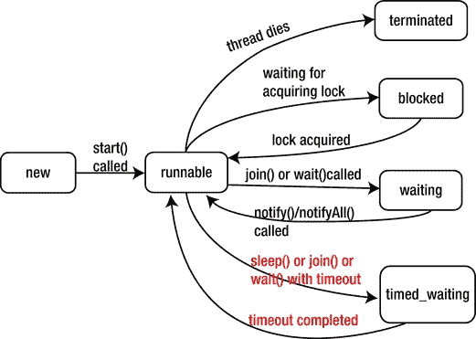

图 13-6.  线程生命周期中可能的状态

定时等待和阻塞状态

清单 13-16 包含一个简单的示例，用于理解*定时等待*和*阻塞*状态。

清单 13-16.  MoreThreadStates.java

```
// 这个 Thread 类在获取其类对象的锁后，仅调用 sleep 方法
class SleepyThread extends Thread {
        public void run() {
                synchronized(SleepyThread.class) {
                        try {
                                Thread.sleep(1000);
                        }
                        catch(InterruptedException ie) {
                                // 忽略此异常是可以的，因为我们在此代码中不中断异常
                                ie.printStackTrace();
                        }
                }
        }
}

// 该类创建两个线程，以展示这些线程如何进入
// TIMED_WAITING 和 BLOCKED 状态
class MoreThreadStates {
        public static void main(String []s) {
                Thread t1 = new SleepyThread();
                Thread t2 = new SleepyThread();
                t1.start();
                t2.start();
                System.out.println(t1.getName() + ": 我处于状态 " + t1.getState());
                System.out.println(t2.getName() + ": 我处于状态 " + t2.getState());
        }
}
```

它会打印以下内容：

```
Thread-0: 我处于状态 TIMED_WAITING
Thread-1: 我处于状态 BLOCKED
```

你有一个 `SleepyThread` 类，其 `run()` 方法仅获取一个锁然后进入睡眠。你在 `main()` 方法中创建了两个线程 `t1` 和 `t2`。


当 `t1` 运行时，它会获取锁（`SleepyThread.class`）并进入休眠。请记住，当线程休眠时，它不会释放锁：它只是持有锁。因此，`sleep()` 被调用 1 秒（1000 毫秒；`sleep()` 的参数以毫秒为单位），所以线程 `t1` 处于 `TIMED_WAITING` 状态。

与此同时，`main` 线程启动了 `t2` 线程。当它的 `run()` 方法被调用时，它发现必须获取锁（`SleepyThread.class`）。然而，你知道锁已经被线程 `t1` 获取，并且该线程仍在休眠（并且处于 *timed_waiting* 状态）。因此，线程 `t2` 等待获取锁，从而处于 *blocking* 状态。`main()` 方法在启动线程后，通过调用 `getState()` 方法打印这两个线程的状态。

等待状态

*等待*状态通常发生在线程通过调用 `wait()` 方法等待特定条件发生时。清单 13-17 是一个简单的示例，用于说明*等待*状态。

清单 13-17.  WaitingThreadState.java

```
// 此类包含的 run 方法会永远等待，因为没有其他线程来通知它
class InfiniteWaitThread extends Thread {
        static boolean okayToRun = false;
        synchronized public void run() {
                while(!okayToRun) {
                        try {
                                // 注意调用 wait 时没有设置任何超时值
                                // 因此它会永远等待某个线程来通知它
                                wait();
                        }
                        catch(InterruptedException ie) {
                                // 忽略此异常是可以的，因为我们在此代码中
                                // 不会中断异常
                                ie.printStackTrace();
                        }
                }
        }
}

class WaitingThreadState {
        public static void main(String []s) {
                Thread t = new InfiniteWaitThread();
                t.start();
                System.out.println(t.getName() + ": I'm in state " + t.getState());
        }
}
```

该程序会打印以下内容：

```
Thread-0: I'm in state WAITING
```

你必须按 Ctrl + C 来终止该线程，因为线程会无限等待条件发生（即 `okayToRun` 变为 `true`）。在实际的程序中，你也会编写代码来使条件发生；换句话说，你会编写代码将 `okayToRun` 设置为 `true`，然后调用 `notify()/notifyAll()`。然而，由于这只是一个用于说明*等待*状态的虚拟程序，我们省略了那部分。

如果你将 `run` 语句中的 `wait` 语句改为 `wait(1000)` 会怎样？现在程序将打印 `TIMED_WAITING`。*timed_waiting* 状态不仅发生在你之前看到的带有超时的 `sleep` 中；它也适用于带有超时值的 `wait()` 方法调用。

使用 Thread.State 枚举

`Thread` 类定义了 `Thread.State` 枚举，其中包含一系列可能的线程状态。清单 13-18 是一个简单的程序，用于打印此枚举中状态的值。

清单 13-18.  ThreadStatesEnumeration.java

```
class ThreadStatesEnumeration {
        public static void main(String []s) {
                for(Thread.State state : Thread.State.values()){
                        System.out.println(state);
                }
        }
}
```

它会打印以下内容：

```
NEW
RUNNABLE
BLOCKED
WAITING
TIMED_WAITING
TERMINATED
```

理解 IllegalThreadStateException

在编写线程代码时，你应该始终保持谨慎，时刻牢记线程的状态。如果你不注意底层状态，会发生什么？让我们先看看清单 13-19 中的简单示例。

清单 13-19.  ThreadStateProblem.java

```
class ThreadStateProblem {
        public static void main(String []s) {
                Thread thread = new Thread();
                thread.start();
                thread.start();
        }
}
```

程序失败并显示以下堆栈跟踪：

```
Exception in thread "main" java.lang.IllegalThreadStateException
        at java.lang.Thread.start(Unknown Source)
        at ThreadStateProblem.main(ThreadStateProblem.java:6)
```

在这里，你试图启动一个已经启动过的线程。当你调用 `start()` 时，线程会进入*新建*状态。如果再次调用 `start()`，则没有从*新建*状态进行正确的状态转换，因此 JVM 会抛出 `IllegalThreadStateException`。

|  | 永远不要对同一个线程调用两次 `start()` 方法。 |

你能通过在第二次调用 `start()` 周围添加 try-catch 块来解决这个问题吗？那是一个糟糕的解决方案！`IllegalThreadStateException` 是一个 `RuntimeException`，意味着它指示了一个编程错误。因此，你需要在程序中修复问题，而不是处理它。即使你提供了一个 try-catch 块，在 catch 块中你能做什么？什么也做不了；你可以让它为空，或者仅仅记录异常。这种空的 catch 块是糟糕代码的标志。因此，在这种情况下，正确的解决方案是确保不会对同一个线程再次调用 `start()`。

|  | 永远不要编写 catch 块来处理 `IllegalThreadStateException`。如果你遇到此异常，代码中肯定存在 bug。修复那个 bug。 |

清单 13-20 包含另一个示例。

清单 13-20.  ThreadStateProblem.java

```
class ThreadStateProblem extends Thread {
        public void run() {
                try {
                        wait(1000);
                }
                catch(InterruptedException ie) {
                        // 忽略此异常是可以的，因为我们在此代码中
                        // 不会中断异常
                        ie.printStackTrace();
                }
        }

public static void main(String []s) {
                new ThreadStateProblem().start();
        }
}
```

该程序也会因 `IllegalMonitorStateException` 而崩溃，如下所示：

```
Exception in thread "Thread-0" java.lang.IllegalMonitorStateException
        at java.lang.Object.wait(Native Method)
        at ThreadStateProblem.run(ThreadStateProblem.java:4)
```

`wait(int)` 方法（无论是否带有超时值）只能在获取锁之后调用：`wait()` 调用会将线程添加到已获取锁的等待队列中。如果你不这样做，就无法从*运行*状态正确转换到 *timed_waiting*（或*等待*状态，如果未提供超时值）。因此，程序会通过抛出 `IllegalMonitorStateException` 异常而崩溃。

正确的修复方法是在调用 `wait()` 之前获取锁。在这种情况下，你可以将 `run()` 方法声明为 `synchronized`：

```
synchronized public void run() {
        try {
                wait(1000);
        }
        catch(InterruptedException ie) {
                // 忽略此异常是可以的，因为我们在此代码中
                // 不会中断异常
                ie.printStackTrace();
        }
}
```

由于 `run()` 方法是 `synchronized` 的，`wait()` 会将自己添加到 `this` 对象引用锁上。由于没有其他线程调用 `notify()`/`notifyAll()` 方法，在 1 秒（1000 毫秒）的超时结束后，它将从 `run()` 方法返回。因此，`wait(1000);` 语句的行为几乎与 `sleep(1000)` 语句相同；区别在于，调用 `wait()` 在等待时会释放此对象上的锁，而 `sleep()` 调用在休眠时不会释放锁。


|  | 仅在获取相关锁之后，才能调用 `wait` 和 `notify`/`notifyAll` *方法*。 |

提问时间！

1.  以下是一个名为 `PingPong` 的类，它继承了 `Thread` 类。下列哪个 `PingPong` 类的实现能够正确地让工作线程打印“ping”，然后让主线程打印“pong”？

*   A.

```
        class PingPong extends Thread {
                     public void run() {
                             System.out.println("ping ");
                     }
                     public static void main(String []args)  {
                             Thread pingPong = new PingPong();
                             System.out.print("pong");
                     }
              }
        ```

*   B.

```
        class PingPong extends Thread {
                     public void run() {
                             System.out.println("ping ");
                     }
                     public static void main(String []args)  {
                             Thread pingPong = new PingPong();
                             pingPong.run();
                             System.out.print("pong");
                     }
              }
        ```

*   C.

```
        class PingPong extends Thread {
                     public void run() {
                             System.out.println("ping");
                     }
                     public static void main(String []args)  {
                             Thread pingPong = new PingPong();
                             pingPong.start();
                             System.out.println("pong");
                     }
              }
        ```

*   D.

```
        class PingPong extends Thread {
                     public void run() {
                             System.out.println("ping");
                     }
                     public static void main(String []args) throws InterruptedException{
                             Thread pingPong = new PingPong();
                             pingPong.start();
                             pingPong.join();
                             System.out.println("pong");
                     }
              }
        ```

**答案：** D.

（`main` 线程创建工作线程并等待其完成（打印“ping”）。之后，它打印“pong”。因此，此实现正确地打印了“ping pong”。为什么其他选项是错误的？

`main()` 方法创建了工作线程，但没有启动它。因此，该程序只打印“pong”。该程序总是打印“ping pong”，但这具有误导性。该程序直接调用了 `run()` 方法，而不是 `start()` 方法。因此，这是一个单线程程序。`main` 线程和 `worker` 线程独立执行，没有任何协调。因此，根据哪个线程先被调度，你可能会得到“ping pong”或“pong ping”的输出。）

2.  考虑以下程序，并选择正确描述其行为的选项。

```
    class ThreadTest {
         public static void main(String []args) throws InterruptedException {
                 Thread t1 = new Thread() {
                         public void run() { System.out.print("t1 "); }
                 };
                 Thread t2 = new Thread() {
                         public void run() { System.out.print("t2 "); }
                 };
                 t1.start();
                 t1.sleep(5000);
                 t2.start();
                 t2.sleep(5000);
                 System.out.println("main ");
         }
    }
    ```

*   A.  t1 t2 main
    *   B.  t1 main t2
    *   C.  main t2 t1
    *   D.  此程序会导致编译错误。
    *   E.  此程序会抛出运行时错误。

**答案：** A. t1 t2 main

（当创建一个新线程时，它处于*新建*状态。然后，它进入*可运行*状态。线程只有在*可运行*状态下，调用 `sleep()` 后才能进入*定时等待*状态。因此，在执行 `sleep()` 之前，该线程的 `run()` 方法会被调用。所以，程序会打印“t1 t2 main”。）

3.  你编写了一个用于处理任务的应用程序。在这个应用程序中，你将关键或紧急任务与非关键或非紧急任务分离开来。你为关键或紧急任务分配了高优先级。

在这个应用程序中，你发现非关键或非紧急的任务会异常长时间地等待。由于关键或紧急任务优先级高，它们大部分时间都在运行。以下哪个多线程问题正确地描述了这种情况？

*   A.  死锁
    *   B.  饥饿
    *   C.  活锁
    *   D.  竞态条件

**答案：** B. 饥饿

（低优先级线程长时间等待以获取锁并执行临界区代码的情况被称为饥饿。）

4.  考虑以下程序：

```
    class ExtendThread extends Thread {
             public void run() { System.out.print(Thread.currentThread().getName()); }
    }

class ThreadTest{
             public static void main(String []args) throws InterruptedException {
                     Thread thread1 = new Thread(new ExtendThread(), "thread1 ");
                     Thread thread2 = new Thread(thread1, "thread2 ");
                     thread1.start();
                     thread2.start();
                     thread1.start();       // 开始
             }
    }
    ```

以下哪项正确描述了此程序的行为？

*   A.  程序打印如下内容：thread1 thread2 thread1。
    *   B.  程序打印如下内容：thread1 thread1 thread1。
    *   C.  程序打印如下内容：thread1 thread2。
    *   D.  程序在带有注释 `START` 的语句处导致编译错误。
    *   E.  程序在执行带有注释 `START` 的语句时抛出 `IllegalMonitorStateException`。

**答案：** E. 程序在执行带有注释 `START` 的语句时抛出 `IllegalMonitorStateException`。

（对一个线程多次调用 `start()` 方法是非法的；在这种情况下，线程会抛出 `IllegalMonitorStateException`。）

5.  以下 `Sync` 的两个定义（分别在单独文件中编译）中，哪一个可以无错误地编译？

*   A.

```
        class Sync {
                     public synchronized void foo() {}
             }
        ```

*   B.

```
        abstract class Sync {
                     public synchronized void foo() {}
             }
        ```

*   C.

```
        abstract class Sync {
                     public abstract synchronized void foo();
             }
        ```

*   D.

```
        interface Sync {
                      public synchronized void foo();
             }
        ```

**答案：** A. 和 B.

（抽象方法（在抽象类或接口中）不能声明为 `synchronized`，因此选项 C 和 D 是错误的。）

总结

**并发编程入门**


*   通过实现 `Runnable` 接口或继承 `Thread` 类，你可以创建能够支持多线程的类。
*   始终实现 `run()` 方法。`Thread` 类中的默认 `run()` 方法不执行任何操作。
*   在代码中调用 `start()` 方法，而不是直接调用 `run()` 方法。（将调用 `run()` 方法的任务交给 JVM。）
*   每个线程都关联着一个线程名称、优先级和线程组；`Thread` 类中默认的 `toString()` 方法实现会打印这些信息。
*   如果调用线程的 `sleep()` 方法，该线程不会释放锁，而是会继续持有锁。
*   你可以使用 `join()` 方法来等待另一个线程终止。
*   通常，如果你没有在线程中使用“中断”功能，可以安全地忽略 `InterruptedException`；不过，如果发生该异常，最好还是记录或打印堆栈跟踪信息。
*   线程是异步执行的；你无法预测线程的运行顺序。
*   线程也是非确定性的：在很多情况下，你无法每次都重现诸如死锁或数据竞争之类的问题。

**线程状态**

*   线程有三种基本状态：*新建*、*可运行*和*终止*。当线程刚被创建时，它处于*新建*状态；当它准备运行或正在运行时，它处于*可运行*状态。当线程死亡时，它处于*终止*状态。
*   *可运行*状态在内部（操作系统层面）包含两种状态：*就绪*和*运行*状态。
*   当线程等待获取锁时，它将处于*阻塞*状态。当对 `wait` 等调用设置了超时时间时，线程将处于*定时等待*状态。例如，当调用 `wait()`（没有超时值）时，线程将处于*等待*状态。
*   如果你的操作导致了无效的线程状态转换，你将收到一个 `IllegalThreadStateException` 异常。

**并发访问问题**

*   对资源的并发读写可能导致*数据竞争*问题。
*   你必须使用线程同步（即锁）来访问共享值并避免数据竞争。Java 提供了线程同步特性来提供对共享资源的受保护访问——即同步块和同步方法。
*   使用锁可能会引入死锁等问题。当发生死锁时，进程将*挂起*并且永远不会终止。
*   死锁通常发生在两个线程以相反的顺序获取锁时。当一个线程获取了一个锁并等待另一个锁时，另一个线程获取了那个另一个锁并等待第一个锁被释放。因此，无法取得任何进展，程序陷入死锁。
*   为了避免死锁，最好避免获取多个锁。当你必须获取多个这样的锁时，请确保在程序的所有地方都以相同的顺序获取它们。

等待/通知机制

*   当一个线程必须等待另一个线程满足特定条件或事件时，你可以使用等待/通知机制作为线程间的通信机制。
*   当一个线程需要等待特定条件/事件时，你可以调用 `wait()`，可以指定超时值，也可以不指定。
*   为了避免通知丢失，最好始终使用 `notifyAll()` 而不是 `notify()`。

第 14 章


并发

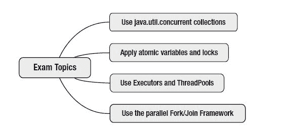

从一开始，Java 就以底层线程管理、锁、同步和并发 API 的形式支持并发。我们在前一章讨论 `Thread` 类、`Runnable` 接口和 `synchronized` 关键字时已经涵盖了这些内容。

自 5.0 版本起，Java 还在其 `java.util.concurrent` 包中支持高级并发 API。在本章中，我们将重点讨论这些用于并发编程的 API。这些高级 API 利用了当今的多核硬件（即单个处理器拥有多个核心）。这些 API 对于利用支持多处理器的机器上的并发性也很有用。

大多数 Java 并发工具都在 `java.util.concurrent` 包中提供。用于无需使用锁即可高效更新共享变量的类在 `java.util.concurrent.atomic` 子包中提供。`Lock` 接口及其派生类在 `java.util.concurrent.locks` 子包中提供。

使用 java.util.concurrent 集合

`java.util.concurrent` 包中有许多类提供了用于并发编程的高级 API。在本节中，我们将主要讨论该包中提供的同步器类。之后，我们将简要介绍 `java.util.concurrent` 包中提供的重要并发集合类。

从上一章你已经了解了底层的并发结构（例如使用 `synchronized` 关键字、`Runnable` 接口和 `Thread` 类来创建线程）。对于需要被多个线程访问的共享资源，需要保护对该共享资源的访问和修改。当你使用 `synchronized` 关键字时，你使用互斥锁在线程之间进行同步，以实现安全的共享访问。线程也经常需要协调它们的执行以完成一个更大的高级任务。上一章讨论的等待/通知模式是协调多个线程执行的一种方式。

使用 API 来获取和释放锁（使用互斥锁）或在锁上调用等待/通知方法是底层任务。可以为线程同步构建更高级别的抽象。这些用于同步两个或多个线程活动的高级抽象被称为*同步器*。同步器在内部使用现有的底层 API 进行线程协调。

`java.util.concurrent` 库中提供的同步器及其用途如下所列：

*   `Semaphore` 控制对一个或多个共享资源的访问。
*   `Phaser` 用于支持同步屏障。
*   `CountDownLatch` 允许线程等待倒计时完成。
*   `Exchanger` 支持在两个线程之间交换数据。
*   `CyclicBarrier` 使线程能够在预定义的执行点等待。

现在，我们将借助示例依次讨论每个同步器。

信号量

信号量控制对共享资源的访问。信号量维护一个计数器来指定它所控制的资源数量。如果计数器大于零，则允许访问资源，而计数器为零表示当前没有可用资源，因此拒绝访问。

方法 `acquire()` 和 `release()` 用于从信号量获取和释放资源。如果一个线程调用 `acquire()` 且计数器为零（即资源不可用），则该线程会等待，直到计数器非零，然后获取资源以供使用。一旦线程使用完资源，它会调用 `release()` 来增加资源可用性计数器。

请注意，如果资源数量为 1，那么在给定时间只有一个线程可以访问该资源；在这种情况下，使用信号量类似于使用锁。表 14-1 列出了 `Semaphore` 类中的重要方法。

表 14-1. Semaphore 类中的重要方法


| 方法 | 描述 |
| --- | --- |
| `Semaphore(int permits)` | 构造函数，用于创建具有指定数量*许可*（即一次可访问资源的线程数）的 `Semaphore` 对象。如果许可值为负数，则必须先调用指定次数的 `release`() 方法，然后 `acquire`() 调用才能成功。 |
| `Semaphore(int permits,           boolean fair)` | 与上一个构造函数相同，但额外的 `fair` 选项表示应按照先到先得的原则分配许可。 |
| `void acquire()void acquire(int permits)` | 如果许可可用则获取一个许可；否则，它将阻塞直到有许可可用。如果在等待获取许可时被其他线程中断，可能会抛出 `InterruptedException`。重载版本接受一个许可数量作为参数。 |
| `void acquireUninterruptibly()` | 与 `acquire`() 方法相同，但此线程在等待获取许可时不能被中断。 |
| `boolean tryAcquire()` `boolean tryAcquire(long timeout,                   TimeUnit unit)` | 如果在调用时信号量有可用许可，则获取一个许可并返回 `true`；如果不可用，则立即返回 `false`（不阻塞）。重载的 `tryAcquire`() 方法额外接受一个超时参数——线程会阻塞以从信号量获取许可，直到给定的超时期限。 |
| `void release()void release(int permits)` | 从信号量释放一个许可。重载版本指定要释放的许可数量。 |

假设一个 ATM 机房里有两台 ATM 机。因此，房间里一次只允许两个人进入。有五个人在外面等着使用 ATM 机。这种情况可以通过代码清单 14-1 中的代码来模拟，其中每台 ATM 机都被视为由信号量控制的资源。

代码清单 14-1.  ATMRoom.java

```
import java.util.concurrent.Semaphore;

// This class simulates a situation where an ATM room has only two ATM machines
// and five people are waiting to access the machine. Since only one person can access
// an ATM machine at a given time, others wait for their turn
class ATMRoom {
        public static void main(String []args) {
                // assume that only two ATM machines are available in the ATM room
                Semaphore machines = new Semaphore(2);

// list of people waiting to access the machine
                new Person(machines, "Mickey");
                new Person(machines, "Donald");
                new Person(machines, "Tom");
                new Person(machines, "Jerry");
                new Person(machines, "Casper");
        }
}

// Each Person is an independent thread; but their access to the common resource
// (two ATM machines in the ATM machine room in this case) needs to be synchronized.
class Person extends Thread {
        private Semaphore machines;
        public Person(Semaphore machines, String name) {
                this.machines = machines;
                this.setName(name);
                this.start();
        }
        public void run() {
                try {
                        System.out.println(getName() + " waiting to access an ATM machine");
                        machines.acquire();
                        System.out.println(getName() + " is accessing an ATM machine");
                        Thread.sleep(1000); // simulate the time required for withdrawing amount
                        System.out.println(getName() + " is done using the ATM machine");
                        machines.release();
                } catch(InterruptedException ie) {
                        System.err.println(ie);
                }
        }
}
```

以下是该程序某次运行示例的输出：

```
Mickey waiting to access an ATM machine
Tom waiting to access an ATM machine
Jerry waiting to access an ATM machine
Donald waiting to access an ATM machine
Casper waiting to access an ATM machine
Tom is accessing an ATM machine
Mickey is accessing an ATM machine
Tom is done using the ATM machine
Mickey is done using the ATM machine
Jerry is accessing an ATM machine
Donald is accessing an ATM machine
Donald is done using the ATM machine
Jerry is done using the ATM machine
Casper is accessing an ATM machine
Casper is done using the ATM machine
```

现在我们来分析这个程序是如何工作的。通过创建一个继承 `Thread` 的 `Person` 类来模拟等待使用 ATM 机的人。`Thread` 类中的 `run()` 方法获取一个信号量，模拟从 ATM 机取款，然后释放信号量。

`main()` 方法通过创建一个具有两个*许可*的 `Semaphore` 对象来模拟一个有两台 ATM 机的 ATM 机房。排队等待使用 ATM 机的人通过将他们添加到 `Semaphore` 对象来实现。

从程序输出可以看出，信号量一次只允许两个线程，其他线程则持续等待。当一个线程释放信号量时，另一个线程会获取它。很酷，不是吗？

CountDownLatch

这个同步器允许一个或多个线程等待倒计时完成。这个倒计时可以是为了等待一组事件发生，或者等待在其他线程中执行的一组操作完成。表 14-2 列出了该类中的重要方法。

表 14-2. CountDownLatch 类中的重要方法

| 方法 | 描述 |
| --- | --- |
| `CountDownLatch(int count)` | 创建一个 `CountDownLatch` 实例，指定在使用 `await()` 等待的线程可以继续执行之前，必须调用 `countDown`() 方法的次数。 |
| `void await()` | 如果 `CountDownLatch` 对象中的当前计数为零，则立即返回；否则，线程将阻塞，直到倒计数达到零。可能会抛出 `InterruptedException`。 |
| `boolean await(long timeout,              TimeUnit unit)` | 与上一个方法 `await`() 相同，但额外接受一个超时参数。如果线程在计数达到零后成功返回，此方法返回 `true`；如果线程因超时而返回，则返回 `false`。 |
| `void countDown()` | 将此 `CountDownLatch` 对象中的计数减一。如果计数达到零，则所有（等）待线程都会被释放。如果当前计数已经为零，则什么也不会发生。 |
| `long getCount()` | 返回此 `CountDownLatch` 对象中待处理的计数。 |

当你创建一个 `CountDownLatch` 时，你会用一个整数（代表计数值）来初始化它。线程会等待（通过调用 `await()` 方法）这个计数达到零。一旦达到零，所有线程都会被释放；由于计数已经为零，任何对 `await()` 的后续调用都会立即返回。可以通过调用 `countDown()` 方法将计数器值减一。你可以使用 `getCount()` 方法获取计数器的当前值。参见代码清单 14-2。

代码清单 14-2.  RunningRaceStarter.java

```
import java.util.concurrent.*;

// this class simulates the start of a running race by counting down from 5\. It holds
// three runner threads to be ready to start in the start line of the race and once the count down
// reaches zero, all the three runners start running...

class RunningRaceStarter {
        public static void main(String []args) throws InterruptedException {
                CountDownLatch counter = new CountDownLatch(5);
                // count from 5 to 0 and then start the race
```


// 实例化三个跑步者线程
                new Runner(counter, "卡尔");
                new Runner(counter, "乔");
                new Runner(counter, "杰克");

System.out.println("开始倒计时 ");
                long countVal = counter.getCount();
                while(countVal > 0) {
                        Thread.sleep(1000); // 1000 毫秒 = 1 秒
                        System.out.println(countVal);
                        if(countVal == 1) {
                                // 一旦下一语句中调用了 counter.countDown();
                                // 倒计时将归零；因此喊出“开始”
                                System.out.println("开始");
                        }
                        counter.countDown(); // 每秒减 1
                        countVal = counter.getCount();
                }
        }
}

// 这个 Runner 类模拟 100 米短跑比赛中的赛道运动员。运动员等待
// 倒计时器归零，然后开始跑步
class Runner extends Thread {
        private CountDownLatch timer;
        public Runner(CountDownLatch cdl, String name) {
                timer = cdl;
                this.setName(name);
                System.out.println(this.getName() + " 已就绪，等待倒计时开始");
                start();
        }

public void run() {
                try {
                        // 等待计时器倒计时归零
                        timer.await();
                } catch (InterruptedException ie) {
                        System.err.println("中断——无法开始赛跑");
                }
                System.out.println(this.getName() + " 开始跑步");
        }
}
```

该程序输出如下：

```
卡尔 已就绪，等待倒计时开始
乔 已就绪，等待倒计时开始
杰克 已就绪，等待倒计时开始
开始倒计时

开始
乔 开始跑步
卡尔 开始跑步
杰克 开始跑步
```

让我们思考一下程序的工作原理。`Runner` 类模拟了赛跑比赛中等待起跑的运动员。它通过调用构造函数传入的 `CountDownLatch` 对象上的 `await()` 方法来等待比赛开始。

`RunningRaceStarter` 类创建了一个 `CountDownLatch` 对象。该计数器对象初始化为计数值 5，这意味着倒计时从 5 到 0。在 `main()` 方法中，你创建了 `Runner` 对象；这三个线程在 `counter` 对象上等待。每秒调用一次 `countDown()` 方法，该方法将计数减 1。一旦计数归零，所有三个等待线程都会被释放，并自动继续执行。

**注意：** 在此程序中，乔、卡尔或杰克的打印顺序无法预测，因为这取决于线程调度。因此，如果你运行此程序，这三个名字可能会以其他顺序打印出来。

Exchanger

`Exchanger` 类用于在两个线程之间交换数据。`Exchanger` 的作用非常简单：它等待直到两个线程都调用了 `exchange()` 方法。当两个线程都调用了 `exchange()` 方法时，`Exchanger` 对象实际上会将线程之间共享的数据相互交换。当两个线程需要彼此同步并持续交换数据时，此类非常有用。

这是一个很小的类，只有一个方法：`exchange()`。请注意，`exchange()` 方法有一个重载形式，它接受一个超时时间作为参数。

清单 14-3 展示了一个模拟 Java 吉祥物 Duke 与咖啡店之间傻气对话的示例。`DukeThread` 和 `CoffeeShop` 这两个线程独立运行。然而，要进行对话，它们需要在对方说话时倾听。一个 `Exchange` 对象为它们提供了一种相互交谈的方式。

清单 14-3.  KnockKnock.java

```
import java.util.concurrent.Exchanger;

// DukeThread 类作为一个独立线程运行。它与同样独立运行的 CoffeeShopThread 对话。
// 对话是通过一个共同的 Exchanger<String> 对象交换消息来实现的，
// 该对象同步它们之间的对话。
// 注意，打印的消息是从 CoffeeShopThread 接收到的“回复”
class DukeThread extends Thread {
        private Exchanger<String> sillyTalk;

public DukeThread(Exchanger<String> args) {
                sillyTalk = args;
        }
        public void run() {
                String reply = null;
                try {
                        // 开始与 CoffeeShopThread 的对话
                        reply = sillyTalk.exchange("咚咚咚！");
                        // 现在，打印从 CoffeeShopThread 收到的回复
                        System.out.println("咖啡店: " + reply);

// 交换另一组消息
                        reply = sillyTalk.exchange("Duke");
                        // 现在，打印从 CoffeeShopThread 收到的回复
                        System.out.println("咖啡店: " + reply);

// 只有当发送和接收同时发生时，交换才能发生
                        // 由于这是要说的最后一句话，我们通过忽略“虚拟”回复来结束对话
                        reply = sillyTalk.exchange("那个在这家咖啡店出生的人！");
                        // 对话结束，忽略回复！
                } catch(InterruptedException ie) {
                        System.err.println("在傻气对话中被打断");
                }
        }
}

class CoffeeShopThread extends Thread {
        private Exchanger<String> sillyTalk;

public CoffeeShopThread(Exchanger<String> args) {
                sillyTalk = args;
        }
        public void run() {
                String reply = null;
                try {
                        // 交换第一条消息
                        reply = sillyTalk.exchange("谁在那里？");
                        // 打印 Duke 说的话
                        System.out.println("Duke: " + reply);

// 交换第二条消息
                        reply = sillyTalk.exchange("哪个 Duke？");
                        // 打印 Duke 说的话
                        System.out.println("Duke: " + reply);

// 没有消息要发送，但为了从 Duke 线程获取消息，
                        // 两端都需要发送消息；因此发送一个“虚拟”字符串
                        reply = sillyTalk.exchange("");
                        System.out.println("Duke: " + reply);
                } catch(InterruptedException ie) {
                        System.err.println("在傻气对话中被打断");
                }
        }
}

// 通过实例化 Exchanger 对象以及 CoffeeShop 和 Duke 线程来协调 Duke 和 CoffeeShop 之间的傻气对话
class KnockKnock {
                public static void main(String []args) {
                        Exchanger<String> sillyTalk = new Exchanger<String>();
                        new CoffeeShopThread(sillyTalk).start();
                        new DukeThread(sillyTalk).start();
                }
}
```

该程序输出如下：

```
Duke: 咚咚咚！
咖啡店: 谁在那里？
Duke: Duke
咖啡店: 哪个 Duke？
Duke: 那个在这家咖啡店出生的人！
```

程序中的注释解释了其工作原理。理解此示例的主要概念是，`Exchanger` 有助于协调（即同步）两个线程之间的消息交换。两个线程相互等待，并使用 `exchange()` 方法来交换消息。

CyclicBarrier


在并发编程中，线程常常需要在预定义的执行点等待，直到所有其他线程都到达该点。`CyclicBarrier` 有助于提供这样一个同步点；该类中的重要方法请参见表 14-3。

表 14-3. CyclicBarrier 类中的重要方法

| 方法 | 描述 |
| --- | --- |
| `CyclicBarrier(int numThreads)` | 创建一个 `CyclicBarrier` 对象，并指定在其上等待的线程数量。如果 `numThreads` 为负数或零，则抛出 `IllegalArgumentException`。 |
| `CyclicBarrier(int parties,Runnable barrierAction)` | 与上一个构造方法相同；此构造方法额外接受一个参数，即当屏障被触发时要调用的线程。 |
| `int await ()int await(long timeout, TimeUnit unit)` | 阻塞直到指定数量的线程在此屏障上调用了 `await()`。该方法返回此线程的到达索引。如果线程在等待其他线程时被中断，此方法可能抛出 `InterruptedException`；如果屏障因某种原因被破坏（例如，另一个线程超时或被中断），则抛出 `BrokenBarrierException`。重载的方法额外接受一个超时时间作为选项；如果所有其他线程未在超时时间内到达，此重载版本会抛出 `TimeoutException`。 |
| `boolean isBroken()` | 如果屏障被破坏，则返回 true。如果屏障中至少有一个线程被中断或超时，或者屏障操作失败并抛出异常，则屏障被视为被破坏。 |
| `void reset()` | 将屏障重置为初始状态。如果有任何线程正在该屏障上等待，它们将抛出 `BrokenBarrier` 异常。 |

清单 14-4 是一个使用 `CyclicBarrier` 类的示例。

清单 14-4.  CyclicBarrierTest.java

```
import java.util.concurrent.*;

// 此线程中的 run() 方法应仅在四名玩家准备好开始游戏时调用
class MixedDoubleTennisGame extends Thread {
        public void run() {
                System.out.println("所有四名玩家已就绪，游戏开始 \n 零比零...");
        }
}

// 此线程模拟玩家的到达。
// 一旦玩家到达，他/她应等待其他玩家到达
class Player extends Thread {
        CyclicBarrier waitPoint;
        public Player(CyclicBarrier barrier, String name) {
                this.setName(name);
                waitPoint = barrier;
                this.start();
                }
        public void run() {
                System.out.println("玩家 " + getName() + " 已就绪 ");
                try {
                       waitPoint.await(); // 等待所有四名玩家到达
                } catch(BrokenBarrierException | InterruptedException exception) {
                        System.out.println("等待时发生异常... " + exception);
                }
        }
}

// 通过传递线程数量和当所有线程到达屏障时要运行的线程来创建 CyclicBarrier 对象
class CyclicBarrierTest {
        public static void main(String []args) {
                // 混合双打网球比赛需要四名玩家；因此等待四名玩家
                // （即四个线程）加入以开始游戏
                System.out.println("预订网球场 \n 一旦四名玩家到达，游戏将开始");
                CyclicBarrier barrier = new CyclicBarrier(4, new MixedDoubleTennisGame());
                new Player(barrier, "G I Joe");
                new Player(barrier, "Dora");
                new Player(barrier, "Tintin");
                new Player(barrier, "Barbie");
        }
}

程序输出如下：

Reserving tennis court
As soon as four players arrive, game will start
Player G I Joe is ready
Player Dora is ready
Player Tintin is ready
Player Barbie is ready
All four players ready, game starts
 Love all...
```

现在让我们看看这个程序是如何工作的。在 `main()` 方法中，你创建了一个 `CyclicBarrier` 对象。构造方法接受两个参数：要等待的线程数量，以及当所有线程到达屏障时要调用的线程。在这个例子中，你需要等待四名玩家，因此创建了四个线程，每个线程代表一名玩家。`CyclicBarrier` 构造方法的第二个参数是 `MixedDoubleTennisGame` 对象，因为此线程代表游戏，一旦所有四名玩家就绪，游戏就会开始。

在每个 `Player` 线程的 `run()` 方法内部，你在 `CyclicBarrier` 对象上调用了 `await()` 方法。一旦 `CyclicBarrier` 对象的等待线程数量达到四个，就会调用 `MixedDoubleTennisGame` 中的 `run()` 方法。

Phaser

当少数独立线程需要分阶段协作完成一项任务时，`Phaser` 是一个有用的特性。因此，需要一个同步点，让线程先完成任务的一部分，等待其他线程完成另一部分，并在进入下一部分任务之前进行同步。表 14-4 列出了该类中的重要方法。

表 14-4. Phaser 类中的重要方法

| 方法 | 描述 |
| --- | --- |
| `Phaser()` | 创建一个 `Phaser` 对象，没有注册的参与方，也没有父级。初始阶段设置为 0。 |
| `Phaser(int numThreads)` | 创建一个 `Phaser` 对象，指定需要到达以进入下一阶段的线程（参与方）数量；初始阶段设置为 0。 |
| `int register()` | 向此 `Phaser` 对象添加一个新线程（参与方）。返回当前阶段编号。如果已注册的参与方达到最大支持数量，则抛出 `IllegalStateException`。 |
| `int bulkRegister(int numThreads)` | 向此 `Phaser` 对象添加 `numThreads` 个未到达的参与方。返回当前阶段编号。如果已注册的参与方达到最大支持数量，则抛出 `IllegalStateException`。 |
| `int arrive()` | 到达此阶段，无需等待其他线程到达。返回到达的阶段编号。可能抛出 `IllegalStateException`。 |
| `int arriveAndDeregister()` | 与上一个方法相同，但还会从 `Phaser` 对象中注销。 |
| `int arriveAndAwaitAdvance()` | 到达此阶段并等待（即阻塞）直到其他线程到达。 |
| `int awaitAdvance(int phase)` | 等待（即阻塞）直到此 `Phaser` 对象前进到给定的阶段值。 |
| `int getRegisteredParties()` | 返回在此 `Phaser` 对象上注册的线程（参与方）数量。 |
| `int getArrivedParties()` | 返回在此 `Phaser` 对象的当前阶段已到达的线程（参与方）数量。 |
| `int getUnarrivedParties()` | 返回在此 `Phaser` 对象的当前阶段，与已注册的参与方相比尚未到达的线程（参与方）数量。 |

考虑一个小咖啡店处理外卖订单的例子。假设只有三名员工：一名厨师、一名帮工和一名服务员。为简化程序逻辑，假设每个外卖订单包含三份食物。完成一个外卖订单需要依次准备这三份食物。要完成一份食物的准备，所有三名员工——厨师、帮工和服务员——都需要完成各自的工作部分。清单 14-5 展示了如何使用 `Phaser` 类实现这种情况。

清单 14-5.  ProcessOrder.java

```
import java.util.concurrent.*;


// `ProcessOrder` 线程是主线程，负责监督确保 `Cook`、`Helper` 和 `Attendant` 完成各自的工作，以完成食品准备和订单配送。
// 为简化逻辑，我们假设每个配送订单恰好包含三个食品项目。
class ProcessOrder {
        public static void main(String []args) throws InterruptedException {
                // `Phaser` 是一个同步器，用于逐个处理食品项目，
                // 并在进入下一个项目前完成配送。
                Phaser deliveryOrder = new Phaser(1);

System.out.println("开始处理配送订单");

new Worker(deliveryOrder, "Cook");
                new Worker(deliveryOrder, "Helper");
                new Worker(deliveryOrder, "Attendant");

for(int i = 1; i <= 3; i++) {
                        // 准备、混合并配送此食品项目
                        deliveryOrder.arriveAndAwaitAdvance();
                        System.out.println("配送食品项目编号 " + i);
                }
                // 此配送订单的工作已完成，因此取消注册
                deliveryOrder.arriveAndDeregister();
                System.out.println("配送订单完成... 交给顾客");
        }
}

// 工作角色可以是 `Cook`、`Helper` 或 `Attendant`。虽然三者独立工作，但
// 他们需要同步各自的工作，以完成各自的部分并共同准备一个食品项目。
class Worker extends Thread {
        Phaser deliveryOrder;
        Worker(Phaser order, String name) {
                deliveryOrder = order;
                this.setName(name);
                deliveryOrder.register();
                start();
        }
        public void run() {
                for(int i = 1; i <= 3; i++) {
                        System.out.println("\t" + getName() + " 正在为订单编号 " + i + " 执行工作");
                        if(i == 3) {
                                // 此配送订单的工作已完成，因此取消注册
                                deliveryOrder.arriveAndDeregister();
                        } else {
                                deliveryOrder.arriveAndAwaitAdvance();
                        }
                        try {
                                Thread.sleep(3000); // 模拟准备食品项目所需的时间
                        } catch(InterruptedException ie) {
                                /* 忽略异常 */
                                ie.printStackTrace();
                        }
                }
        }
} 

程序输出如下：

```
Starting to process the delivery order
        Cook doing his work for order no. 1
        Attendant doing his work for order no. 1
        Helper doing his work for order no. 1
Deliver food item no. 1
        Helper doing his work for order no. 2
        Attendant doing his work for order no. 2
        Cook doing his work for order no. 2
Deliver food item no. 2
        Helper doing his work for order no. 3
        Cook doing his work for order no. 3
        Attendant doing his work for order no. 3
Deliver food item no. 3
Delivery order completed . . . give it to the customer
```

在这个程序中，你创建了一个 `Phaser` 对象来支持三个 `Worker` 线程对象的同步。你通过调用 `Phaser` 对象的默认构造函数来创建 `Phaser` 对象。当 `Worker` 线程对象被创建时，它们会向 `Phaser` 对象注册自己。或者，你也可以调用

```
Phaser deliveryOrder = new Phaser(3); // 用于三方（即线程）
```

在这种情况下，你就不需要在 `Worker` 线程构造函数中调用 `Phaser` 对象的 `register`() 方法。

在这个例子中，你假设一个配送订单包含处理三个食品项目，因此 `for` 循环运行三次。每次迭代，你调用 `deliveryOrder.arriveAndAwaitAdvance()`。要使此语句继续执行，所有三方（`Cook`、`Helper` 和 `Attendant`）都必须完成各自准备食品项目的工作。你通过在这些 `Worker` 线程的 `run` 方法中调用 `sleep`() 方法来模拟“准备食品”。这些 `worker` 线程为准备每个食品项目调用 `deliveryOrder.arriveAndAwaitAdvance()`。随着每个食品项目准备完成（即每个阶段完成），工作进入下一阶段。一旦三个阶段完成，配送订单处理即告完成，程序返回。

并发集合

`java.util.concurrent` 包提供了许多类，它们是 `java.util` 包中集合框架类（参见表 14-5）的线程安全等价物。例如，`java.util.concurrent.ConcurrentHashMap` 是 `java.util.HashMap` 的并发等价物。这两个容器的主要区别在于，使用 `HashMap` 时需要显式同步插入和删除操作，而这种同步已内置于 `ConcurrentHashMap` 中。如果你知道如何使用 `HashMap`，你也就隐式地知道如何使用 `ConcurrentHashMap`。从 OCPJP 7 考试的角度来看，你只需要对表 14-5 中的类有一个总体了解，因此我们不会深入探讨如何使用这些类的细节。

表 14-5. java.util.concurrent 包中的一些并发集合类

| 类/接口 | 简要描述 |
| --- | --- |
| `BlockingQueue` | 此接口扩展了 `Queue` 接口。在 `BlockingQueue` 中，如果队列为空，它会等待（即阻塞）直到有元素被插入；如果队列已满，它会等待直到有元素被移除。 |
| `ArrayBlockingQueue` | 此类提供了基于固定大小数组的 `BlockingQueue` 接口实现。 |
| `LinkedBlockingQueue` | 此类提供了基于链表的 `BlockingQueue` 接口实现。 |
| `DelayQueue` | 此类实现了 `BlockingQueue`，包含类型为 `Delayed` 的元素。只有在其延迟期过后，才能从此队列中检索元素。 |
| `PriorityBlockingQueue` | 等同于 `java.util.PriorityQueue`，但实现了 `BlockingQueue` 接口。 |
| `SynchronousQueue` | 此类实现了 `BlockingQueue`。在此容器中，一个线程的每次 `insert`() 操作都会等待（阻塞）另一个线程的相应 `remove`() 操作，反之亦然。 |
| `LinkedBlockingDeque` | 此类实现了 `BlockingDeque`，其中插入和移除操作可能会阻塞；使用链表实现。 |
| `ConcurrentHashMap` | 类似于 `Hashtable`，但提供安全的并发访问和更新。 |
| `ConcurrentSkipListMap` | 类似于 `TreeMap`，但提供安全的并发访问和更新。 |
| `ConcurrentSkipListSet` | 类似于 `TreeSet`，但提供安全的并发访问和更新。 |
| `CopyOnWriteArrayList` | 类似于 `ArrayList`，但提供安全的并发访问。当 `ArrayList` 被更新时，它会创建底层数组的一个全新副本。 |
| `CopyOnWriteArraySet` | 一个 `Set` 实现，但提供安全的并发访问，并使用 `CopyOnWriteArrayList` 实现。当容器被更新时，它会创建底层数组的一个全新副本。 |


代码清单 14-6 和 14-7 展示了并发版本与非并发版本的区别。假设你有一个由两个线程共享的`PriorityQueue`对象。再假设一个线程向优先队列插入元素，另一个线程移除元素。如果线程调度使得插入元素发生在移除元素之前，则没有问题。然而，如果第一个线程在第二个线程插入元素之前尝试移除元素，就会遇到麻烦。

代码清单 14-6.  PriorityQueueExample.java

```
import java.util.*;

// 简单的 PriorityQueue 示例。这里我们创建两个线程，一个线程插入元素，
// 另一个线程从优先队列中移除元素。
class PriorityQueueExample {
        public static void main(String []args) {
                final PriorityQueue<Integer> priorityQueue = new PriorityQueue<>();
                // 生成一个从优先队列中移除元素的线程
                new Thread() {
                        public void run() {
                                // 使用 PriorityQueue 的 remove() 方法移除元素（如果可用）
                                System.out.println("被移除的元素是: " + priorityQueue.remove());
                        }
                }.start();
                // 生成一个向优先队列插入元素的线程
                new Thread() {
                        public void run() {
                                // 将整数值 10 作为条目插入优先队列
                                priorityQueue.add(10);
                                System.out.println("成功向队列添加了一个元素 ");
                        }
                }.start();
        }
}
```

如果运行此程序，会抛出如下异常：

```
Exception in thread "Thread-0" java.util.NoSuchElementException
at java.util.AbstractQueue.remove(AbstractQueue.java:117)
at PriorityQueueExample$1.run(QueueExample.java:10)
Successfully added an element to the queue 
```

该输出表明第一个线程试图从空优先队列中移除元素，因此导致了`NoSuchElementException`。

然而，考虑对该程序稍作修改（代码清单 14-7），使用`PriorityBlockingQueue`代替`PriorityQueue`。

代码清单 14-7.  PriorityBlockingQueueExample.java

```
// 演示 PriorityBlockingQueue 的用法。在这种情况下，如果优先队列中没有可用元素，
// 调用 take() 方法的线程将阻塞（即等待），直到另一个线程插入元素。

import java.util.concurrent.*;

class PriorityBlockingQueueExample {
        public static void main(String []args) {
                final PriorityBlockingQueue<Integer> priorityBlockingQueue
                        = new PriorityBlockingQueue<>();
                new Thread() {
                        public void run() {
                                try {
                                       // 使用 take() 代替 remove()
                                       // 注意 take() 会阻塞，而 remove() 不会阻塞
                                       System.out.println("被移除的元素是: "
                                               + priorityBlockingQueue.take());
                                } catch(InterruptedException ie) {
                                        // 忽略此异常是安全的
                                        ie.printStackTrace();
                                }
                        }
                }.start();
                new Thread() {
                        public void run() {
                                // 向优先队列添加值为 10 的元素
                                priorityBlockingQueue.add(10);
                                System.out.println("成功向队列添加了一个元素 ");
                        }
                }.start();
        }
}
```

该程序会打印以下内容：

```
Successfully added an element to the queue
The removed element is: 10
```

此程序不会像前一个案例（代码清单 14-6）那样导致崩溃。这是因为`take()`方法会阻塞，直到另一个线程插入元素；一旦插入，`take()`方法就会返回该值。换句话说，如果你使用`PriorityQueue`对象，你需要同步线程，使得元素的插入总是发生在移除之前。然而，在`PriorityBlockingQueue`中，顺序无关紧要，无论先调用哪个操作（插入或移除元素），程序都能正确运行。通过这种方式，并发集合为在多线程环境下安全使用集合提供了支持，无需你执行显式的同步操作。

应用原子变量和锁

`java.util.concurrent`包有两个子包：`java.util.concurrent.atomic`和`java.util.concurrent.locks`。本节我们将讨论这两个子包。与本章其余部分讨论的高级并发抽象不同，原子变量和锁都是底层 API。然而，在编写多线程代码时，它们提供了更细粒度的控制。

原子变量

你是否见过为执行诸如变量自增、变量自减等原始/简单操作而获取和释放锁的代码？为这类原始操作获取和释放锁效率并不高。在这种情况下，Java 以原子变量的形式提供了一种高效的替代方案。

以下是该包中部分类及其简要说明的列表：

*   `AtomicBoolean`: 可原子更新的`Boolean`值。
*   `AtomicInteger`: 可原子更新的`int`值；继承自`Number`类。
*   `AtomicIntegerArray`: 一个`int`数组，其中的元素可以原子更新。
*   `AtomicLong`: 可原子更新的`long`值；继承自`Number`类。
*   `AtomicLongArray`: 一个`long`数组，其中的元素可以原子更新。
*   `AtomicReference<V>`: 类型为 V 的可原子更新的对象引用。
*   `AtomicReferenceArray<E>`: 一个可原子更新的数组，可以持有类型为`E`的对象引用（`E`指元素的基类型）。

|  | 只有`AtomicInteger`和`AtomicLong`继承自`Number`类，而`AtomicBoolean`没有。`java`.`util`.`concurrent`.`atomic`子包中的所有其他类都直接继承自`Object`类。 |


在 `java.util.concurrency.atomic` 子包的类中，`AtomicInteger` 和 `AtomicLong` 最为重要。表 14-6 列出了 `AtomicInteger` 类中的重要方法。（`AtomicLong` 中的方法与之类似。）

表 14-6. AtomicInteger 类中的重要方法

| 方法 | 描述 |
| --- | --- |
| `AtomicInteger()` | 创建一个初始值为 0 的 `AtomicInteger` 实例。 |
| `AtomicInteger(int initVal)` | 创建一个初始值为 `initVal` 的 `AtomicInteger` 实例。 |
| `int get()` | 返回此对象中保存的整数值。 |
| `void set(int newVal)` | 将此对象中保存的整数值重置为 `newVal`。 |
| `int getAndSet(int newValue)` | 返回此对象中保存的当前 `int` 值，并将此对象中保存的值设置为 `newVal`。 |
| `boolean compareAndSet (int expect, int update)` | 将此对象的 `int` 值与 `expect` 值进行比较，如果相等，则将此对象的 `int` 值设置为 `update` 值。 |
| `int getAndIncrement()` | 返回此对象中整数的当前值，并将此对象中的整数值加 1。类似于 `i` 为 `int` 类型时 `i++` 的行为。 |
| `int getAndDecrement()` | 返回此对象中整数的当前值，并将此对象中的整数值减 1。类似于 `i` 为 `int` 类型时 `i--` 的行为。 |
| `int getAndAdd(int delta)` | 返回此对象中保存的整数值，并将给定的增量值加到该整数值上。 |
| `int incrementAndGet()` | 将此对象中的整数值加 1 并返回该值。类似于 `i` 为 `int` 类型时 `++i` 的行为。 |
| `int decrementAndGet()` | 将此对象中的整数值减 1 并返回该值。类似于 `i` 为 `int` 类型时 `--i` 的行为。 |
| `int addAndGet(int delta)` | 将 `delta` 值加到当前整数值上并返回该值。 |
| `int intValue()long longValue()float floatValue()doubleValue()` | 转换对象的当前 `int` 值，并以 `int`、`long`、`float` 或 `double` 值的形式返回。 |

让我们通过一个示例来了解如何使用 `AtomicInteger` 或 `AtomicLong`。假设你有一个公共的计数器值，所有线程都可以访问它。如何安全地更新或访问这个公共计数器值，而不会引入数据竞争问题（上一章讨论过）？显然，你可以使用 `synchronized` 关键字来确保临界区（修改计数器值的代码）在任意时刻只能被一个线程访问。临界区会非常小，如下所示：

```
 public void run() {
        synchronized(SharedCounter.class) {
                SharedCounter.count++;
        }
}
```

然而，这段代码效率低下，因为每次仅仅为了递增 `count` 的值，它都要获取并释放锁。或者，如果你将 `count` 声明为 `AtomicInteger` 或 `AtomicLong`（视情况而定），则无需使用 `synchronized` 关键字加锁。清单 14-8 给出了完整的程序，展示了如何在实际中使用 `AtomicLong`。

清单 14-8.  *AtomicVariableTest.java*

```
import java.util.concurrent.atomic.*;

// 演示递增“普通”（即非线程安全）整数和递增“原子”（即线程安全）整数有何不同的类：
// 在没有锁的情况下递增共享的 Integer 对象可能导致数据竞争；
// 然而，递增共享的 AtomicInteger 不会导致数据竞争。

class AtomicVariableTest {
        // 创建两个整数对象——一个普通，一个原子——初始值相同
        private static Integer integer = new Integer(0);
        private static AtomicInteger atomicInteger = new AtomicInteger(0);

static class IntegerIncrementer extends Thread {
                public void run() {
                        System.out.println("递增后的整数值为: " + ++integer);
                }
        }
        static class AtomicIntegerIncrementer extends Thread {
                public void run() {
                        System.out.println("递增后的原子整数值为: "
                                        + atomicInteger.incrementAndGet());
                }
        }
        public static void main(String []args) {
                // 分别为递增原子整数和“普通”整数创建三个线程
                for(int i = 0; i < 5; i++) {
                        new IntegerIncrementer().start();
                        new AtomicIntegerIncrementer().start();
                }
        }
} 
```

实际输出取决于线程调度。在一次运行中，它打印了以下内容：

```
递增后的原子整数值为: 1
递增后的整数值为: 1
递增后的整数值为: 1
递增后的原子整数值为: 2
递增后的整数值为: 2
递增后的原子整数值为: 3
递增后的整数值为: 3
递增后的整数值为: 4
递增后的原子整数值为: 4
递增后的原子整数值为: 5
```

在此输出中，请注意递增 `Integer` 对象导致了数据竞争：`Integer` 在递增 5 次后（从初始值 0 开始）的最终值为 4。然而，对于 `AtomicInteger`，其值为 5——这是正确的。

让我们分析一下这个程序。`AtomicVariableTest` 有两个数据成员——一个类型为 `Integer`，另一个类型为 `AtomicInteger`——初始值相同。

有两个 `Thread` 类。一个类在其 `run()` 方法中递增 `Integer` 值，另一个类在其 `run()` 方法中递增 `AtomicInteger` 值。在 `main()` 方法中，你生成了这两种 `Thread` 的五个线程。输出显示，在没有锁的情况下递增 `Integer` 值容易发生数据竞争，而在没有任何锁的情况下递增 `AtomicInteger` 值是安全的。

锁

在上一章中，我们讨论了 `synchronized` 关键字以及它如何强制一次只有一个线程在临界区中执行。`java.util.concurrent.locks` 包提供了更复杂的工具。在本节中，我们将讨论 `Lock` 接口。

使用 `Lock` 对象类似于使用 `synchronized` 关键字获取隐式锁。这两种构造的目的相同：确保一次只有一个线程访问共享资源。然而，与 `synchronized` 关键字不同，`Lock` 还支持等待/通知机制，并支持 `Condition` 对象。

|  | 你可以认为使用 `synchronized` 是隐式加锁，而使用 `Lock` 对象是显式加锁。 |

使用 `synchronized` 关键字（隐式加锁）的好处是，你不必记得在 `finally` 块中释放锁，因为在 `synchronized` 块（或方法）结束时，会生成代码自动释放锁。尽管这是一个有用的特性，但在某些情况下，你可能需要手动控制锁的释放（例如，在块结束之外的其他地方释放它），而 `Lock` 对象提供了这种灵活性。但是，在使用 `Lock` 对象时，你有责任确保在 `finally` 块中释放锁。以下代码片段描述了 `Lock` 的使用惯用法：

```
Lock lock = /* 获取 Lock 类型实例 */;
lock.lock();
try {
       // 临界区
}
finally {
       lock.unlock();
}
```


隐式锁与显式 `Lock` 对象的另一个区别在于，你可以使用 `Locks` 进行“非阻塞尝试”来获取锁。那么，“非阻塞尝试”在这里是什么意思呢？如果锁可用，你就获取该锁；或者你可以通过 `Lock` 对象上的 `tryLock()` 方法放弃请求锁。这很有趣，不是吗？如果你成功获取了锁，就可以执行临界区中的任务；否则，你将执行替代操作。值得注意的是，`tryLock()` 方法的一个重载版本将超时值作为参数，这样你就可以在指定时间内等待获取锁。

`tryLock(long time, TimeUnit unit)`.

使用 `tryLock()` 时，使用 `Lock` 对象的惯用写法是：

```
Lock lock = /* 获取 Lock 类型实例 */;
if(tryLock()) {
        try {
                // 临界区
        }
        finally {
                lock.unlock();
        }
}
else {

}
```

使用 `tryLock()` 有助于避免上一章讨论的一些线程同步相关问题，例如死锁和活锁。表 14-7 列出了 `Lock` 类中的重要方法。

表 14-7. Lock 类中的重要方法

| 方法 | 描述 |
| --- | --- |
| `void lock()` | 获取锁。 |
| `boolean tryLock()` | 获取锁，如果锁可用则返回 `true`；如果锁不可用，则不获取锁并返回 `false`。 |
| `boolean tryLock(long time,                 TimeUnit unit)` | 与之前的 `tryLock()` 方法相同，但在获取锁失败并返回 `false` 之前，会等待给定的等待时间。 |
| `void lockInterruptibly()` | 获取锁；在获取锁的过程中，如果另一个线程中断它，此方法会抛出 `InterruptedException` |
| `Condition newCondition()` | 返回与此 `Lock` 对象关联的 `Condition` 对象。 |
| `void unlock()` | 释放锁。 |

让我们看一个 `Lock` 对象的示例。在此示例中，你使用一个 `Lock` 对象并将其传递给线程，以便在此 `Lock` 对象上同步它们。此程序是清单 14-1 中使用 `Semaphores` 的程序的简单变体。在清单 14-9 中，你模拟访问 ATM 机，这是一个共享资源。当然，一次只能有一个人使用 ATM 机，因此访问机器的代码是一个临界区。

清单 14-9.  ATMRoom.java

```
import java.util.concurrent.locks.*;

// 此类模拟只有一台 ATM 机可用，且五个人正在等待使用该机器的情况。
// 由于一次只能有一个人使用 ATM 机，其他人需要等待轮到自己
class ATMMachine {
        public static void main(String []args) {
                // 一个人可以重复使用机器，因此使用“可重入锁”
                Lock machine = new ReentrantLock();

// 等待使用机器的人员列表
                new Person(machine, "Mickey");
                new Person(machine, "Donald");
                new Person(machine, "Tom");
                new Person(machine, "Jerry");
                new Person(machine, "Casper");
        }
}

// 每个 Person 都是一个独立的线程；它们对公共资源（此处为 ATM 机）的访问需要使用锁进行同步
class Person extends Thread {
        private Lock machine;
        public Person(Lock machine, String name) {
                this.machine = machine;
                this.setName(name);
                this.start();
        }
        public void run() {
                try {
                        System.out.println(getName() + " 正在等待使用 ATM 机");
                        machine.lock();
                        System.out.println(getName() + " 正在使用 ATM 机");
                        Thread.sleep(1000); // 模拟取款所需时间
                } catch(InterruptedException ie) {
                        System.err.println(ie);
                }
                finally {
                        System.out.println(getName() + " 已使用完 ATM 机");
                        machine.unlock();
                }
        }
} 
```

以下是此程序的输出：

```
Donald 正在等待使用 ATM 机
Jerry 正在等待使用 ATM 机
Tom 正在等待使用 ATM 机
Mickey 正在等待使用 ATM 机
Donald 正在使用 ATM 机
Casper 正在等待使用 ATM 机
Donald 已使用完 ATM 机
Jerry 正在使用 ATM 机
Jerry 已使用完 ATM 机
Tom 正在使用 ATM 机
Tom 已使用完 ATM 机
Mickey 正在使用 ATM 机
Mickey 已使用完 ATM 机
Casper 正在使用 ATM 机
Casper 已使用完 ATM 机
```

从输出中可以看出，尽管可能还有其他人在等待使用机器，但一次只有一个人在使用机器。在此程序中，`ATMMachine` 类创建了一个代表 ATM 机的 `Lock` 对象。有五个人在等待使用机器，通过创建五个 `Person` 类的实例来模拟。`Person` 类继承自 `Thread`，并记住了需要获取和释放锁的 `Lock` 对象。

`run()` 方法简单地获取锁，访问共享资源，并在 `finally` 块中释放锁。`Lock` 对象（此处的 machine 变量）确保在任意时刻只有一个线程访问它。当一个线程正在访问锁时，其他线程会被阻塞。

请注意，如果你尝试运行此程序，可能会得到不同的人员使用机器的顺序。这是因为访问顺序取决于 JVM 中的调度器如何调度线程运行。

|  | `ReadWriteLock` 接口（继承自 `Lock` 接口）定义了一个锁，该锁为只读访问和写访问提供了单独的锁。你可以分别使用 `readLock()` 和 `writeLock()` 方法获取读锁和写锁的实例。`ReentrantReadWriteLock` 类实现了 `ReadWriteLock` 接口。   |

条件

`Condition` 支持线程通知机制。当某个条件不满足时，一个线程可以等待另一个线程满足该条件；一旦条件满足，另一个线程可以发出通知。`condition` 与 `lock` 绑定。`Condition` 对象提供了三种方法来支持等待/通知模式：`await()`、`signal()` 和 `signalAll()`。这三种方法类似于 `Object` 类支持的 `wait()`、`notify()` 和 `notifyAll()` 方法。

线程可以使用 `await()` 方法等待某个条件变为真，这是一个可中断的阻塞调用。如果你想要不可中断的等待，可以调用 `awaitUninterruptibly()`。你还可以使用以下重载方法之一指定等待的时间长度：

*   `long awaitNanos(long nanosTimeout)`
*   `boolean await(long time, TimeUnit unit)`
*   `boolean awaitUntil(Date deadline)`


现在让我们看一个使用 `Condition` 对象的示例。假设你正在等待一位名叫 Joe 的人乘坐从马德里开往巴黎的 IC1122 次列车。当 Joe 的列车到达车站时，他会通知你；你接上他然后回家。

假设多趟列车可以到达同一个火车站，你需要等待特定的列车到达。一旦你关注的那趟列车到达，你就会收到来自该列车的“通知”或“信号”。这个场景非常适合使用等待/通知模式。实现该模式有两种方式。第一种是使用隐式锁，并利用 `Object` 类中的 `wait()` 和 `notifyAll()` 方法。第二种方式——如清单 14-10 所示——是使用显式的 `Lock` 和 `Condition` 对象，并利用 `Condition` 对象中的 `await()` 和 `signalAll()` 方法。

清单 14-10.  RailwayStation.java

```
import java.util.concurrent.locks.*;

// This class simulates arrival of trains in a railway station.
class RailwayStation {
        // A common lock for synchronization
        private static Lock station = new ReentrantLock();
        // Condition to wait or notify the arrival of Joe in the station
        private static Condition joeArrival = station.newCondition();

// Train class simulates arrival of trains independently
        static class Train extends Thread {
                public Train(String name) {
                    this.setName(name);
                }
                public void run() {
                        station.lock();
                        try {
                                System.out.println(getName() + ": I've arrived in station ");
                                if(getName().startsWith("IC1122")) {
                                        // Joe is coming in train IC1122 - he announces it to us
                                        joeArrival.signalAll();
                                }
                        }
                        finally {
                                station.unlock();
                        }
                }
        }

// Our wait in the railway station for Joe is simulated by this thread. Once we get notification from Joe
        // that he has arrived, we pick-him up and go home
        static class WaitForJoe extends Thread {
                public void run() {
                        System.out.println("Waiting in the station for IC1122 in which Joe is coming");
                        station.lock();
                        try {
                                // await Joe's train arrival
                                joeArrival.await();
                                // if this statement executes, it means we got a train arrival signal
                                System.out.println("Pick up Joe and go home");
                        } catch(InterruptedException ie) {
                                ie.printStackTrace();
                        }
                        finally {
                                station.unlock();
                        }
                }
        }

// first create a thread that waits for Joe to arrive and then create new Train threads
        public static void main(String []args) throws InterruptedException {
                // we are waiting before the trains start coming
                new WaitForJoe().start();
                // Trains are separate threads - they can arrive in any order
                new Train("IC1234 - Paris to Munich").start();
                new Train("IC2211 - Paris to Madrid").start();
                new Train("IC1122 - Madrid to Paris").start();
                new Train("IC4321 - Munich to Paris").start();
        }
}
```

以下是该程序的输出：

```
Waiting in the station for IC1122 in which Joe is coming
IC1234 - Paris to Munich: I've arrived in station
IC1122 - Madrid to Paris: I've arrived in station
IC2211 - Paris to Madrid: I've arrived in station
Pick up Joe and go home
IC4321 - Munich to Paris: I've arrived in station
```

让我们分析一下这个程序是如何工作的。在 `RailwayStation` 类中，你有一个名为 `station` 的公共 `Lock` 对象。从该 `station` 对象中，你获得了一个名为 `joeArrival` 的 `Condition` 对象（记住，条件总是与锁相关联）。你使用了 `newCondition()` 方法，因此生成的 `Condition` 对象是一个可中断的条件；你没有指定任何超时时间，所以等待的线程将永远等待，直到收到信号。

`Train` 类是一个模拟列车到达火车站的 `Thread`。`Train` 中的 `run()` 方法首先获取锁，然后宣布列车已到达，并在方法退出前释放锁。请注意，如果在未获取锁的情况下对 `Condition` 对象调用 `await()`，你将收到一个 `IllegalMonitorStateException`。在 `run()` 方法中，如果 `Train` 的名称是 `IC1122`，它将通过调用 `joeArrival.signalAll();` 通知我们 Joe 已经到达。

你在火车站等待 `Joe` 的过程由这个 `WaitForJoe` 线程模拟。在 `run()` 方法中，你获取锁并等待 `joeArrival` 条件被发出信号。一旦你收到通知（即信号）说他已到达，你就接上他然后回家。

|  | 在多线程编程中，一个常见的需求是等待一个线程满足某个条件后，另一个线程才能继续执行。使用轮询（即使用 `while` 循环反复检查条件）是一种糟糕的解决方案，因为这会浪费 CPU 周期；此外，它还容易引发数据竞争。请改用基于等待/通知或等待/信号的保护块。 |

一个锁上的多个条件

从 OCPJP 7 考试的角度来看，理解锁和条件非常重要。因此，我们将讨论另一个更详细的示例，该示例使用了锁和条件。在这个程序中，我们将展示如何在一个 `Lock` 对象上获取多个 `Condition` 对象。

假设你需要实现一个固定大小的队列，队列的大小在线程创建时确定。在典型的队列中，如果队列中没有元素并且调用了 `remove()` 方法，它将抛出一个 `NoSuchElementException`（如你在清单 14-6 中所见）。然而，在这种情况下，你希望线程阻塞，直到其他线程插入一个元素。类似地，如果你尝试向一个已满的队列中插入元素，线程不应该抛出 `IllegalStateException` 来指示无法再插入更多元素，而应该阻塞，直到有元素被移除。换句话说，你需要实现一个简单的阻塞队列（参见清单 14-11）。

清单 14-11.  BlockerQueue.java

```
import java.util.concurrent.locks.*;

// this implements a fixed size queue with size determined at the time of creation. I/ if remove() is called
// when there are no elements, then the queue blocks (i.e., waits) until an element is inserted.
// If insert() is called when the queue is full, then the queue blocks until an element is removed

class BlockerQueue {
        // remember the max size of the queue
        private int size = 0;

// array to store the elements in the queue
        private Object elements[];

// pointer that points to the current element in the queue
        private int currPointer = 0;

// internal lock used for synchronized access to the BlockerQueue
        private Lock internalLock = new ReentrantLock();

// condition to wait for when queue is empty that makes use of the common lock
        private Condition empty = internalLock.newCondition();


// 利用公共锁实现队列满时的等待条件
        private Condition full =  internalLock.newCondition();

public BlockerQueue(int size) {
                this.size = size;
                elements = new Object[size];
        }

// 移除一个元素（如果存在）；如果队列中没有元素，
        // 则等待元素插入。一旦有元素被插入，通知所有因队列满而等待插入的线程
        public Object remove() {
                Object element = null;
                internalLock.lock();
                try {
                        if(currPointer == 0) {
                                System.out.println("In remove(): 没有元素可移除，等待插入");
                                // 无法移除——队列中没有元素；
                                // 因此阻塞，直到有元素被插入
                                empty.await();
                                // 如果执行到这里，说明某个线程已完成
                                // 对 insert() 的调用，因此继续移除该元素
                                System.out.println("In remove(): 收到通知，已有元素被插入");
                        }
                        // 先递减 currPointer，再获取元素
                        element = elements[--currPointer];
                        System.out.println("In remove(): 已移除元素 " + element);

// 元素已被移除，因此有空间可供插入
                        // 通知所有等待插入的线程
                        full.signalAll();
                        System.out.println("In remove(): 已发出信号，表示有空间可供插入");
                } catch(InterruptedException ie) {
                        ie.printStackTrace();
                } finally {
                        internalLock.unlock();
                }
                return element;
        }

// 如果有空间则插入元素。如果队列已满，
        // 则等待 remove() 被调用并收到信号后继续插入。
        // 插入完成后，通知所有因队列为空而等待的线程。
        public void insert(Object element) {
                internalLock.lock();
                try {
                        if(currPointer == size) {
                                System.out.println("In insert(): 队列已满，等待移除");
                                // 无法插入——队列已满；
                                // 因此阻塞，直到有元素被移除
                                full.await();
                                // 如果执行到这里，说明某个线程已完成
                                // 对 remove() 的调用，因此继续插入该元素
                                System.out.println("In insert(): 收到通知，remove 已被调用，继续插入元素");
                        }
                        // 获取元素，然后递增 currPointer
                        elements[currPointer++] = element;
                        System.out.println("In insert(): 已插入元素 " + element);
                        // 元素已插入，因此其他线程可以移除它...
                        // 通知所有等待移除的线程
                        empty.signalAll();
                        System.out.println("In insert(): 已通知队列非空");
                } catch(InterruptedException ie) {
                        ie.printStackTrace();
                } finally {
                        internalLock.unlock();
                }
        }
}

以下是该类的测试代码：

```
class BlockerQueueTest1 {
        public static void main(String []args) {
                final BlockerQueue blockerQueue = new BlockerQueue(2);
                new Thread() {
                        public void run() {
                                System.out.println("Thread1: 尝试从队列中移除一个元素");
                                Object o = blockerQueue.remove();
                        }
                }.start();

new Thread() {
                        public void run() {
                                System.out.println("Thread2: 尝试向队列中插入一个元素");
                                blockerQueue.insert("one");
                        }
                }.start();
       }
}
```

该测试代码输出如下：

```
Thread1: 尝试从队列中移除一个元素
In remove(): 没有元素可移除，等待插入
Thread2: 尝试向队列中插入一个元素
In insert(): 已插入元素 one
In insert(): 已通知队列非空
In remove(): 收到通知，已有元素被插入
In remove(): 已移除元素 one
In remove(): 已发出信号，表示有空间可供插入
```

从输出可以看出，`remove()` 方法先被调用，它等待 `insert()` 被调用。一旦 `insert()` 完成，`remove()` 方法便成功从队列中移除了元素。现在，让我们尝试另一个测试用例，测试 `insert()` 方法中的阻塞功能是否正常：

```
class BlockerQueueTest2 {
        public static void main(String []args) {
                final BlockerQueue blockerQueue = new BlockerQueue(3);
                blockerQueue.insert("one");
                blockerQueue.insert("two");
                blockerQueue.insert("three");
                new Thread() {
                        public void run() {
                                System.out.println("Thread2: 尝试向队列中插入一个元素");
                                blockerQueue.insert("four");
                        }
                }.start();

new Thread() {
                        public void run() {
                                System.out.println("Thread1: 尝试从队列中移除一个元素");
                                Object o = blockerQueue.remove();
                        }
                }.start();
        }
}
```

该测试代码输出如下：

```
In insert(): 已插入元素 one
In insert(): 已通知队列非空
In insert(): 已插入元素 two
In insert(): 已通知队列非空
In insert(): 已插入元素 three
In insert(): 已通知队列非空
Thread2: 尝试向队列中插入一个元素
In insert(): 队列已满，等待移除
Thread1: 尝试从队列中移除一个元素
In remove(): 已移除元素 three
In remove(): 已发出信号，表示有空间可供插入
In insert(): 收到通知，remove 已被调用，继续插入元素
In insert(): 已插入元素 four
In insert(): 已通知队列非空
```

从输出可以看出，当一个线程在已满的队列上调用 `insert` 时（本例中你指定的容量为 3 个元素），该线程会阻塞。一旦另一个线程从队列中移除了一个元素，被阻塞的线程就会恢复并成功插入元素。

使用 Executors 和 ThreadPools

你可以通过创建 `Thread` 对象在应用程序中直接创建和管理线程。但是，如果你想屏蔽多线程编程的底层细节，可以使用 `Executor` 接口。

图 14-1 展示了 `Executor` 层次结构中的重要类和接口。在本节中，你将重点学习如何使用 `Executor` 接口、`ExecutorService` 和 `ThreadPools`。我们将在下一节“使用并行 Fork/Join 框架”中介绍 `ForkJoinPool`。


图 14-1. Executor 层级结构中的重要类/接口

Executor

`Executor` 是一个仅声明了一个方法的接口：`void execute(Runnable)`。这个接口本身看起来可能并不庞大，但其派生类（或接口），例如 `ExecutorService`、`ThreadPoolExecutor` 和 `ForkJoinPool`，支持着非常有用的功能。我们将在本节剩余部分更详细地讨论 `Executor` 的派生类。现在，先看一下代码清单 14-12 中关于 `Executor` 接口的简单示例，了解如何实现该接口并在实践中使用它。

代码清单 14-12. ExecutorTest.java

```
import java.util.concurrent.*;

// 这个 Task 类实现了 Runnable，因此它是一个线程对象
class Task implements Runnable {
        public void run() {
                System.out.println("Calling Task.run() ");
        }
}

// 这个类实现了 Executor 接口，并且应该重写 execute(Runnable) 方法。
// 我们提供了一个带有额外参数 'times' 的重载 execute 方法，用于创建并
// 运行指定次数的线程
class RepeatedExecutor implements Executor {
        public void execute(Runnable runnable) {
                new Thread(runnable).start();
        }
        public void execute(Runnable runnable, int times) {
                System.out.printf("Calling Task.run() thro' Executor.execute() for %d times %n", times);
                for(int i = 0; i < times; i++) {
                        execute(runnable);
                }
        }
}

// 这个类生成一个 Task 线程并显式调用 start() 方法。
// 它还展示了如何使用 Executor 执行一个线程
class ExecutorTest {
        public static void main(String []args) {
                Runnable runnable = new Task();
                System.out.println("Calling Task.run() by directly creating a Thread object");
                Thread thread = new Thread(runnable);
                thread.start();
                RepeatedExecutor executor = new RepeatedExecutor();
                executor.execute(runnable, 3);
        }
}
```

以下是该程序的输出：

```
Calling Task.run() by directly creating a Thread object
Calling Task.run()
Calling Task.run() thro' Executor.execute() for 3 times
Calling Task.run()
Calling Task.run()
Calling Task.run()
```

在这个程序中，你有一个 `Task` 类，它通过提供 `run()` 方法的定义来实现 `Runnable`。`RepeatedExecutor` 类通过提供 `execute(Runnable)` 方法的定义来实现 `Executor` 接口。

`Runnable` 和 `Executor` 在某种意义上很相似，它们都提供了一个待实现的方法。在这个定义中，你可能已经注意到 `Executor` 本身并不是一个线程，你必须创建一个 `Thread` 对象来执行传入 `execute()` 方法的 `Runnable` 对象。然而，`Runnable` 和 `Executor` 的主要区别在于，`Executor` 旨在抽象化线程的执行方式。例如，根据 `Executor` 的实现不同，`Executor` 可以安排线程在特定时间运行，或者在延迟一段时间后执行线程。

在这个程序中，你重载了 `execute()` 方法，增加了一个额外的参数，用于创建并执行指定次数的线程。在 `main()` 方法中，你首先创建一个 `Thread` 对象并安排其运行。之后，你实例化 `RepeatedExectutor` 来执行该线程三次。

Callable、Executors、ExecutorService、ThreadPool 和 Future

`Callable` 是一个仅声明了一个方法的接口：`call()`。它的完整签名是 `V call() throws Exception`。它代表一个需要由线程完成的任务。任务完成后，它会返回一个值。如果由于某些原因，`call()` 方法无法执行或执行失败，它会抛出一个 `Exception`。

要使用 `Callable` 对象执行任务，你首先需要创建一个线程池。线程池是一个能够执行任务的线程集合。你可以使用 `Executors` 工具类来创建线程池。这个类提供了获取线程池实例、线程工厂等的方法。

`ExecutorService` 接口实现了 `Executor` 接口，并提供了诸如终止线程和生成 `Future` 对象等服务。某些任务可能需要相当长的执行时间才能完成。因此，当你向执行器服务提交一个任务时，你会得到一个 `Future` 对象。

`Future` 代表那些包含一个将来由线程返回的值的对象（即，它在“将来”线程终止时返回值）。你可以使用 `Future` 类中的 `isDone()` 方法来检查任务是否完成，然后使用 `get()` 方法来获取任务结果。如果你在任务未完成时直接调用 `get()` 方法，该方法会阻塞，直到任务完成并返回可用的值。

话不多说——尝试一个简单的示例，看看这些类如何协同工作（代码清单 14-13）。

代码清单 14-13. CallableTest.java

```
// Factorial 实现了 Callable，以便可以将其传递给 ExecutorService
// 并作为任务执行。
class Factorial implements Callable<Long> {
        long n;
        public Factorial(long n) {
                this.n = n;
        }
        public Long call() throws Exception {
                if(n <= 0) {
                        throw new Exception("for finding factorial, N should be > 0");
                }
                long fact = 1;
                for(long longVal = 1; longVal <= n; longVal++) {
                        fact *= longVal;
                }
                return fact;
        }
}

// 说明了 Callable、Executors、ExecutorService 和 Future 之间的关系；
// 也展示了它们如何协同工作来执行一个任务
class CallableTest {
        public static void main(String []args) throws Exception {
                // 我们要为其计算阶乘的值
                long N = 20;
                // 获取一个可提交给执行器服务的 callable 任务
                Callable<Long> task = new Factorial(N);
                // 创建一个具有固定线程池（包含一个线程）的 ExecutorService
                ExecutorService es = Executors.newSingleThreadExecutor();
                // 将任务提交给执行器服务并存储 Future 对象
                Future<Long> future = es.submit(task);
                // 等待 get() 方法，该方法会阻塞直到计算完成。
                System.out.printf("factorial of %d is %d", N, future.get());
                // 完成。关闭执行器服务，因为我们不再需要它了
                es.shutdown();
        }
}
```

程序输出如下：

```
factorial of 20 is 2432902008176640000
```

在这个程序中，你有一个实现了 `Callable` 的 `Factorial` 类。由于任务是计算数字 `N` 的阶乘，该任务需要返回一个结果。你为阶乘值使用了 `Long` 类型，因此你实现了 `Callable<Long>`。在 `Factorial` 类内部，你定义了 `call()` 方法，该方法实际执行任务（这里的任务是计算给定数字的阶乘）。如果给定的值 `N` 是负数或零，你不执行任务，而是向调用者抛出一个异常。否则，你从 1 循环到 `N` 并计算阶乘值。


在 `CallableTest` 类中，你首先创建了一个 `Factorial` 类的实例。然后你需要执行这个任务。为简单起见，你通过调用 `Executors` 类中的 `newSingleThreadExecutor()` 方法来获取一个单线程执行器。请注意，你也可以根据所需的并行度，使用其他方法（如 `newFixedThreadPool(nThreads)`）来创建包含多个线程的线程池。

一旦你获得了 `ExecutorService`，就可以提交任务进行执行。`ExecutorService` 抽象了任务何时执行、任务如何分配给线程等细节。当你调用 `submit(task)` 方法时，会获得一个 `Future<Long>` 的引用。通过这个 future 引用，你可以在任务完成后调用 `get()` 方法来获取结果。如果在调用 `future.get()` 时任务仍在执行，这个 `get()` 方法将会阻塞，直到任务执行完成。执行完成后，你需要通过调用 `shutdown()` 方法来手动释放 `ExecutorService`。

现在你已经熟悉了执行任务的基本机制，接下来看一个复杂的示例。假设你的任务是求从 1 到 N 的数字之和，其中 N 是一个很大的数（在我们的例子中是一百万）。当然，你可以使用公式 `[(N * (N + 1)) / 2]` 来计算总和。是的，你将利用这个公式来检查从 1 到 N 的求和是否正确。不过，仅为了演示，你将把 1 到 100 万的范围划分为 N 个子范围，并通过生成 N 个线程来对每个子范围内的数字求和；请参见清单 14-14。

清单 14-14.  SumOfN.java

```
import java.util.*;
import java.util.concurrent.*;

// 我们创建一个 SumOfN 类，用于对 1..N 范围内的值求和，其中 N 是一个很大的数。
// 我们将求和任务
// 分配给 10 个线程（这只是一个用于演示的任意限制）。
// 计算完成后，我们将所有线程的结果相加，
// 并使用公式 (N * (N + 1))/2 来检查计算结果是否正确。
class SumOfN {
        private static long N = 1_000_000L;    // 一百万
        private static long calculatedSum = 0; // 用于保存 1..N 范围内值之和的变量
        private static final int NUM_THREADS = 10;  // 为分配工作而创建的线程数

// 这个 Callable 对象对 from..to 范围内的数字求和
        static class SumCalc implements Callable<Long> {
                long from, to, localSum = 0;

public SumCalc(long from, long to) {
                        this.from = from;
                        this.to = to;
                }
                public Long call() {
                        // 对 'from' 到 'to'（包含 'to'）范围内的值求和
                        for(long i = from; i <= to; i++) {
                                localSum += i;
                        }
                        return localSum;
                }
        }

// 在 main 方法中，我们实现将求和任务分配给
        // 给定数量的线程的逻辑，并最终检查计算出的总和是否正确
        public static void main(String []args) {
                // 将任务分配给固定数量的可用线程
                ExecutorService executorService = Executors.newFixedThreadPool(NUM_THREADS);
                // 将 Future 对象的引用存储在一个 List 中，以便后续一起求和
                List<Future<Long>> summationTasks = new ArrayList<>();
                long nByTen = N/10;       // 将 N 除以 10，以便作为 10 个任务提交
                for(int i = 0; i < NUM_THREADS; i++) {
                        // 创建一个求和任务
                        // 范围从 (10 * 0) + 1 .. (N/10 * 1) 到 (10 * 9) + 1 .. (N/10 * 10)
                        long fromInInnerRange = (nByTen * i) + 1;
                        long toInInnerRange = nByTen * (i+1);
                        System.out.printf("生成线程，对范围 %d 到 %d 求和 %n",fromInInnerRange, toInInnerRange);
                        // 为给定的求和范围创建一个 callable 对象
                        Callable<Long> summationTask =
                               new SumCalc(fromInInnerRange, toInInnerRange);
                        // 将该任务提交给 executor 服务
                        Future<Long> futureSum = executorService.submit(summationTask);
                        // 任务需要时间完成，因此将其添加到列表中，稍后再处理
                        summationTasks.add(futureSum);
                }

// 现在，计算每个任务的总和
                for(Future<Long> partialSum : summationTasks) {
                        try {
                                // get() 方法会阻塞（即等待），直到计算完成
                                calculatedSum += partialSum.get();
                        } catch(CancellationException | ExecutionException
                                | InterruptedException exception) {
                                // 不太可能出现异常 - 如果出现问题则退出
                                exception.printStackTrace();
                                System.exit(-1);
                        }
                }

// 现在使用公式 (N * (N + 1))/2 计算总和，无需进行繁重的工作
                long formulaSum = (N * (N + 1))/2;
                // 打印使用公式计算的总和以及逐个计算的总和
                // 它们必须相等！
                System.out.printf("线程求和 = %d, 使用公式求和 = %d",
                        calculatedSum, formulaSum);
        }
}
```

以下是该程序的输出：

```
生成线程，对范围 1 到 100000 求和
生成线程，对范围 100001 到 200000 求和
生成线程，对范围 200001 到 300000 求和
生成线程，对范围 300001 到 400000 求和
生成线程，对范围 400001 到 500000 求和
生成线程，对范围 500001 到 600000 求和
生成线程，对范围 600001 到 700000 求和
生成线程，对范围 700001 到 800000 求和
生成线程，对范围 800001 到 900000 求和
生成线程，对范围 900001 到 1000000 求和
线程求和 = 500000500000, 使用公式求和 = 500000500000 
```

现在我们来分析这个程序是如何工作的。在这个程序中，你需要求 1..N 的总和，其中 N 是一百万（一个很大的数）。`SumCalc` 类实现了 `Callable<Long>`，用于对 `from` 到 `to` 范围内的值求和。`call()` 方法通过从 `from` 循环到 `to` 来执行实际的计算，并将中间和值作为 `Long` 值返回。


在这个程序中，你将求和任务分配给多个线程。你可以根据处理器内核数量决定线程数；不过，为了简化程序，这里使用十个线程。

在 `main()` 方法中，你创建一个包含十个线程的 `ThreadPool`。你将创建十个求和任务，因此需要一个容器来保存这些任务的引用。使用 `ArrayList` 来保存 `Future<Long>` 引用。

在 `main()` 的第一个 `for` 循环中，你创建十个任务并提交给 `ExecutorService`。提交任务时，你会获得一个 `Future<Long>` 引用，并将其添加到 `ArrayList` 中。

创建完十个任务后，你在下一个 `for` 循环中遍历数组列表以获取任务结果。你将各个任务的部分结果相加，计算出最终总和。

得到从 1 到 100 万的计算总和后，你使用简单公式 `N * (N + 1)/2` 求出公式总和。从输出结果可以看出，计算总和与公式总和相等，因此可以确定你划分任务并合并任务结果的逻辑是正确的。

现在，在继续讨论 fork/join 框架之前，我们先快速介绍几个对并发编程有用的类。

ThreadFactory

`ThreadFactory` 是一个用于创建线程的接口，而不是通过调用 `new Thread()` 显式创建线程。例如，假设你经常创建高优先级线程。你可以创建一个 `MaxPriorityThreadFactory`，将该工厂创建的线程的默认优先级设置为最高优先级（参见清单 14-15）。

清单 14-15.  TestThreadFactory.java

```
import java.util.concurrent.*;

// 一个 ThreadFactory 实现，将其创建的所有线程的优先级设置为最高
class MaxPriorityThreadFactory implements ThreadFactory {
        private static long count = 0;
        public Thread newThread(Runnable r) {
             Thread temp = new Thread(r);
             temp.setName("prioritythread" + count++);
             temp.setPriority(Thread.MAX_PRIORITY);
             return temp;
        }
}

class ARunnable implements Runnable {
        public void run() {
                System.out.println("Running the created thread ");
        }
}

class TestThreadFactory {
        public static void main(String []args) {
                ThreadFactory threadFactory = new MaxPriorityThreadFactory();
                Thread t1 = threadFactory.newThread(new ARunnable());
                System.out.println("The name of the thread is " + t1.getName());
                System.out.println("The priority of the thread is " + t1.getPriority());
                t1.start();
        }
}
```

它会输出以下内容：

```
The name of the thread is prioritythread0
The priority of the thread is 10
Running the created thread
```

通过使用 `ThreadFactory`，你可以减少设置线程优先级、名称、线程池等的样板代码。

ThreadLocalRandom 类

在进行并发编程时，你会发现经常需要生成随机数。使用 `Math.random()` 对于并发编程来说效率不高。因此，`java.util.concurrent` 包引入了 `ThreadLocalRandom` 类，它适用于并发程序。你可以使用 `ThreadLocalRandom.current()`，然后调用 `nextInt()` 和 `nextFloat()` 等方法生成随机数。

TimeUnit 枚举

你在本章前面已经看到一些方法将 `TimeUnit` 作为参数。`TimeUnit` 是一个枚举，用于指定时间精度。`TimeUnit` 中的时间单位可以是 `DAYS`、`HOURS`、`MINUTES`、`SECONDS`、`MICROSECONDS`、`MILLISECONDS` 或 `NANOSECONDS` 之一。该枚举还包含在这些时间单位之间进行转换的有用方法。例如，


```
System.out.printf("One day has %d hours, %d minutes, %d seconds",
        TimeUnit.DAYS.toHours(1), TimeUnit.DAYS.toMinutes(1), TimeUnit.DAYS.toSeconds(1));
```

输出结果为

```
One day has 24 hours, 1440 minutes, 86400 seconds
```

Java API 中的某些方法使用特定的时间单位。例如，`sleep()` 方法以毫秒为单位接收休眠时间。那么，如果你想用其他时间单位（比如秒或天）来指定线程休眠的时间，该怎么办呢？`TimeUnit` 让这项任务变得简单。请参见清单 14-16 中的示例。

清单 14-16.  TimeUnitExample.java

```
import java.util.concurrent.TimeUnit;

// 一个展示如何使用 TimeUnit 枚举的简单示例
class TimeUnitExample {
        public static void main(String []args) throws InterruptedException {
                System.out.println("在主线程上调用 sleep() 方法，休眠 2 秒");
                // Thread.sleep 以毫秒为参数。通过使用 TimeUnit 枚举，
                // 你可以用其他时间单位（如小时、分钟、秒等）来指定休眠时间。
                Thread.sleep(TimeUnit.SECONDS.toMillis(2));
                System.out.println("主线程从休眠中醒来");
        }
}
```

使用并行 Fork/Join 框架

`java.util.concurrent` 包中的 Fork/Join 框架有助于简化并行化代码的编写。该框架是 `ExecutorService` 接口的一个实现，并提供了一个易于使用的并发平台，以便利用多处理器。这个框架对于建模分治问题非常有用。这种方法适用于可以递归划分并在较小规模上计算的任务；计算出的结果随后被合并。将任务划分为更小的任务称为*分叉（forking）*，而合并来自较小任务的结果称为*连接（joining）*。

Fork/Join 框架使用了工作窃取算法：当一个 `worker` 线程完成其工作并空闲时，它会从其他仍在忙碌的线程那里获取（或“窃取”）工作。起初，你可能会觉得使用 Fork/Join 是一项复杂的任务。然而，一旦你熟悉了它，你就会意识到它在概念上很简单，并且能显著简化你的工作。关键在于递归地将任务细分为可以由独立线程处理的更小片段。

简而言之，Fork/Join 算法的设计如下：

```
forkJoinAlgorithm() {
        拆分任务；
        分叉任务；
        连接任务；
        组合结果；
}
```

以下是这些步骤如何工作的伪代码：

```
doRecursiveTask(input) {
        if (任务小到可以由一个线程处理) {
                计算小任务；
                如果有结果需要返回，则返回
        }
        else {
                将任务分成两部分（即分叉）
                对第一个任务调用 compute()，对第二个任务调用 join()，合并两个结果并返回
        }
}
```

图 14-2 直观地展示了任务如何被递归地细分为更小的任务，以及部分结果如何被合并。如图所示，一个任务被拆分为两个子任务，然后每个子任务再次被拆分为两个子任务，依此类推，直到每个拆分后的子任务都可以由每个线程计算。一旦线程完成计算，它就会返回结果，以便与其他结果合并；通过这种方式，所有计算出的结果都被合并回来。

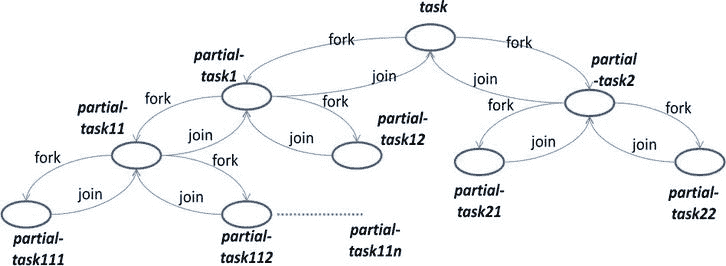

图 14-2.  Fork/Join 框架如何使用分治法完成任务

Fork/Join 框架的有用类

以下类在 Fork/Join 框架中扮演关键角色：`ForkJoinPool`、`ForkJoinTask`、`RecursiveTask` 和 `RecursiveAction`。让我们更详细地了解这些类。

*   `ForkJoinPool` 是 Fork/Join 框架中最重要的类。它是一个用于运行 fork/join 任务的线程池——它执行 `ForkJoinTask` 的实例。它执行任务并管理其生命周期。表 14-8 列出了这个抽象类的重要方法。

表 14-8. ForkJoinPool 类中的重要方法

| 方法 | 描述 |
| --- | --- |
| `void execute(ForkJoinTask<?> task)` | 异步执行给定的任务。 |
| `<T> T invoke(ForkJoinTask<T> task)` | 执行给定的任务并返回计算出的结果。 |
| `<T> List<Future<T>> invokeAll(Collection<? extends           Callable<T>> tasks)` | 执行所有给定的任务，并在所有任务完成后返回一个 future 对象列表。 |
| `boolean isTerminated()` | 如果所有任务都已完成，则返回 `true`。 |
| `int getParallelism()` `int getPoolSize()` `long getStealCount()` | 状态检查方法。 |
| `int getActiveThreadCount()<T> ForkJoinTask<T> submit(Callable<T> task)` `<T> ForkJoinTask<T> submit(ForkJoinTask<T> task)` `ForkJoinTask<?> submit(Runnable task)` `<T> ForkJoinTask<T> submit(Runnable task, T result)` | 执行提交的任务。重载版本接受不同类型的任务；返回一个 Task 对象或 Future 对象。 |

*   `ForkJoinTask<V>` 是一个轻量级的类线程实体，代表一个定义了 `fork()` 和 `join()` 等方法的任务。表 14-9 列出了这个类的重要方法。

表 14-9. ForkJoinTask 类中的重要方法

| 方法 | 描述 |
| --- | --- |
| `boolean cancel(boolean mayInterruptIfRunning)` | 尝试取消任务的执行。 |
| `ForkJoinTask<V> fork()` | 异步执行任务。 |
| `V join()` | 当计算完成时返回计算结果。 |
| `V get()` | 返回计算结果；如果计算未完成则等待。 |
| `V invoke()` `static <T extends ForkJoinTask<?>> Collection<T> invokeAll(Collection<T> tasks)` | 开始执行提交的任务；等待直到计算完成，并返回结果。 |
| `boolean isCancelled()` | 如果任务被取消，则返回 `true`。 |
| `boolean isDone()` | 如果任务已完成，则返回 `true`。 |

*   `RecursiveTask<V>` 是一个可以在 `ForkJoinPool` 中运行的任务；其 `compute()` 方法返回一个 V 类型的值。它继承自 `ForkJoinTask`。
*   `RecursiveAction` 是一个可以在 `ForkJoinPool` 中运行的任务；其 `compute()` 方法执行任务中的实际计算步骤。它与 `RecursiveTask` 类似，但不返回值。

使用 Fork/Join 框架

让我们来确定如何在问题解决中使用 Fork/Join 框架。以下是使用该框架的步骤：

*   首先，检查问题是否适合使用 Fork/Join 框架。请记住：Fork/Join 框架并非适用于所有类型的任务。如果你的问题符合以下描述，则该框架是合适的：

*   问题可以设计为一个递归任务，其中任务可以细分为更小的单元，并且结果可以合并在一起。
*   细分后的任务是独立的，可以单独计算，在计算过程中无需任务之间进行通信。（当然，计算结束后，你需要将它们连接起来。）


*   如果你要解决的问题可以通过递归建模，那么定义一个继承自 `RecursiveTask` 或 `RecursiveAction` 的任务类。如果任务需要返回结果，则继承 `RecursiveTask`；否则继承 `RecursiveAction`。
*   在新定义的任务类中重写 `compute()` 方法。如果任务足够小可以直接执行，`compute()` 方法就实际执行该任务；否则将任务拆分为子任务并调用它们。子任务可以通过 `invokeAll()` 或 `fork()` 方法调用（当子任务需要返回值时使用 `fork()`）。使用 `join()` 方法获取计算结果（如果你之前使用了 `fork()` 方法）。
*   如果子任务有计算结果，则合并这些结果。
*   然后实例化 `ForkJoinPool`，创建 `task` 类的实例，并通过 `ForkJoinPool` 实例上的 `invoke()` 方法启动任务的执行。
*   就这样——完成了。

现在让我们尝试解决如何计算 1 到 N（N 是一个大数）的和的问题。在清单 14-16 中，你将求和计算任务迭代地细分为十个子范围；然后计算每个子范围的和，再计算这些部分和的总和。或者，你可以使用 Fork/Join 框架递归地解决这个问题（清单 14-17）。

清单 14-17.  SumOfNUsingForkJoin.java

```
import java.util.concurrent.*;

// 这个类演示了如何使用 fork/join 框架计算 1 到 N 的和。
// 数字范围被不断对半分割，直到该范围可以由一个线程处理。
// 一旦范围求和完成，结果会被汇总起来。

class SumOfNUsingForkJoin {
        private static long N = 1000_000; // 一百万 - 我们想要计算从 1 到一百万的
                                          // 和
        private static final int NUM_THREADS = 10; // 用于分配任务的线程数

// 这是算法的递归实现；继承自 RecursiveTask
        // 而不是 RecursiveAction，因为我们要返回值。
        static class RecursiveSumOfN extends RecursiveTask<Long> {
                long from, to;
                // from 和 to 是要求和的范围
                public RecursiveSumOfN(long from, long to) {
                        this.from = from;
                        this.to = to;
                }
                // 该方法执行 fork 和 join 来计算总和。
                // 如果值的范围可以由一个线程求和
                // （记住我们希望将求和任务平均分配给 NUM_THREADS 个线程）
                // 那么，使用一个简单的 for 循环对 from..to 范围内的数字求和
                // 否则，fork 该范围并 join 结果
                public Long compute() {
                        if( (to - from) <= N/NUM_THREADS) {
                                // 这个范围可以由一个线程处理，所以执行求和
                                long localSum = 0;
                                // 对范围 'from' 到 'to'（包含 'to'）内的值进行累加
                                for(long i = from; i <= to; i++) {
                                        localSum += i;
                                }
                                System.out.printf("\t 对值范围 %d 到 %d 求和的结果是 %d %n",from,to, localSum);
                                return localSum;
                        }
                        else { // 不，这个范围对一个线程来说太大了，所以 fork 计算
                              // 我们找到范围 from..to 的中点值
                              long mid = (from + to)/2;
                              System.out.printf("将计算任务 fork 为两个范围：" +
                                      "%d 到 %d 和 %d 到 %d %n", from, mid, mid, to);
                              // 确定前半部分范围 from..mid 的计算
                              RecursiveSumOfN firstHalf = new RecursiveSumOfN(from, mid);
                              // 现在，fork 该任务
                              firstHalf.fork();
                              // 确定后半部分范围 mid+1..to 的计算
                              RecursiveSumOfN secondHalf = new RecursiveSumOfN(mid + 1, to);
                              long resultSecond = secondHalf.compute();
                              // 现在，等待前半部分求和计算完成，
                              // 完成后，将其结果与剩余部分相加
                              return firstHalf.join() + resultSecond;
                        }
                }
        }

public static void main(String []args) {
                // 创建一个包含 NUM_THREADS 个线程的 fork-join 池
                ForkJoinPool pool = new ForkJoinPool(NUM_THREADS);
                // 将计算任务提交给 fork-join 池
                long computedSum = pool.invoke(new RecursiveSumOfN(0, N));
                // 这是范围 1..N 的求和公式
                long formulaSum = (N * (N + 1)) / 2;
                // 比较计算出的和与公式计算的和
                System.out.printf("范围 1..%d 的和；计算和 = %d，公式和 = %d %n", N, computedSum, formulaSum);
        }
}
```

程序输出如下：


```
将计算拆分为两个范围：0 到 500000 和 500000 到 1000000
将计算拆分为两个范围：0 到 250000 和 250000 到 500000
将计算拆分为两个范围：0 到 125000 和 125000 到 250000
将计算拆分为两个范围：0 到 62500 和 62500 到 125000
         值范围 0 到 62500 的总和为 1953156250
         值范围 62501 到 125000 的总和为 5859406250
将计算拆分为两个范围：125001 到 187500 和 187500 到 250000
         值范围 125001 到 187500 的总和为 9765656250
         值范围 187501 到 250000 的总和为 13671906250
将计算拆分为两个范围：250001 到 375000 和 375000 到 500000
将计算拆分为两个范围：250001 到 312500 和 312500 到 375000
         值范围 250001 到 312500 的总和为 17578156250
         值范围 312501 到 375000 的总和为 21484406250
将计算拆分为两个范围：375001 到 437500 和 437500 到 500000
         值范围 375001 到 437500 的总和为 25390656250
         值范围 437501 到 500000 的总和为 29296906250
将计算拆分为两个范围：500001 到 750000 和 750000 到 1000000
将计算拆分为两个范围：500001 到 625000 和 625000 到 750000
将计算拆分为两个范围：500001 到 562500 和 562500 到 625000
         值范围 500001 到 562500 的总和为 33203156250
         值范围 562501 到 625000 的总和为 37109406250
将计算拆分为两个范围：625001 到 687500 和 687500 到 750000
         值范围 625001 到 687500 的总和为 41015656250
         值范围 687501 到 750000 的总和为 44921906250
将计算拆分为两个范围：750001 到 875000 和 875000 到 1000000
将计算拆分为两个范围：750001 到 812500 和 812500 到 875000
         值范围 750001 到 812500 的总和为 48828156250
         值范围 812501 到 875000 的总和为 52734406250
将计算拆分为两个范围：875001 到 937500 和 937500 到 1000000
         值范围 875001 到 937500 的总和为 56640656250
         值范围 937501 到 1000000 的总和为 60546906250
范围 1..1000000 的总和；计算总和 = 500000500000，公式总和 = 500000500000
```

让我们分析一下这个程序是如何工作的。在这个程序中，你想要计算范围 1..1,000,000 内数值的总和。为简单起见，你决定使用十个线程来执行任务。类 `RecursiveSumOfN` 继承自 `RecursiveTask<Long>`。在 `RecursiveTask<Long>` 中，你使用 `<Long>` 是因为每个子范围内数字的总和是一个 `Long` 值。此外，你选择 `RecursiveTask<Long>` 而不是普通的 `RecursiveAction`，是因为每个子任务都会返回一个值。如果子任务不返回值，你可以改用 `RecursiveAction`。

在 `compute()` 方法中，你决定是直接计算该范围的总和，还是使用以下条件进一步细分任务：

```
 (to - from) <= N/NUM_THREADS)
```

你在此计算中使用这个“阈值”值。换句话说，如果值的范围在某个任务可以处理的阈值之内，那么你就执行计算；否则，你将任务递归地分成两部分。你使用一个简单的 `for` 循环来查找该范围内值的总和。在另一种情况下，你划分范围的方式类似于二分查找算法中划分范围的方式：对于范围 `from .. to`，你找到中点，并创建两个子范围 `from .. mid` 和 `mid + 1 .. to`。一旦你调用了 `fork()`，你就等待第一个任务完成总和的计算，并为计算的第二部分生成另一个任务。

在 `main()` 方法中，你创建一个 `ForkJoinPool`，其线程数由 `NUM_THREADS` 指定。你将任务提交给 fork/join 池，并获得 1..1,000,000 的计算总和。现在，你还使用连续 N 个数的求和公式来计算总和。

从程序的输出中，你可以观察到任务是如何被细分为子任务的。你还可以从输出中验证，计算出的总和与公式计算出的总和是相同的，这表明你对子范围求和的任务划分是正确的。

在这个程序中，你任意假设要使用的线程数为十个。这是为了简化此程序的逻辑。确定阈值的一个更好的方法是将数据大小除以可用处理器的数量。换句话说，

```
阈值 = (数据长度大小) / (可用处理器数量);
```

如何以编程方式获取可用处理器的数量？为此，你可以使用 `Runtime.getRuntime().availableProcessors())` 方法。

在清单 14-17 中，你使用了 `RecursiveTask`；然而，如果任务不返回值，那么你应该使用 `RecursiveAction`。让我们使用 `RecursiveAction` 实现一个搜索程序。假设你有一个大数组（比如 10,000 个元素），并且你想要搜索一个关键字。你可以使用 Fork/Join 框架将任务拆分为多个子任务并并行执行它们。清单 14-18 包含了实现该解决方案的程序。

清单 14-18.  SearchUsingForkJoin.java

```
import java.util.concurrent.*;

//此类说明了如何使用 fork/join 框架（使用 RecursiveAction）在 N 个数字中搜索关键字。
//数字范围被分成两半，直到该范围可以由一个线程处理。
class SearchUsingForkJoin {
        private static int N = 10000;
        private static final int NUM_THREADS = 10; // 用于分配工作的线程数
        private static int searchKey= 100;
        private static int[] arrayToSearch;

// 这是该算法的递归实现；
        // 继承自 RecursiveAction
        static class SearchTask extends RecursiveAction {
                private static final long serialVersionUID = 1L;
                int from, to;
                // from 和 to 是要搜索的值范围
                public SearchTask(int from, int to) {
                         this.from = from;
                         this.to = to;
                }

public void compute() {
                        //如果范围足够小，可以由一个线程处理，
                        //我们就在该范围内搜索
                        if( (to - from) <= N/NUM_THREADS) {
                               // 在范围 'from' .. 'to' 内（包含 'to' 值）进行添加
                               for(int i = from; i <= to; i++) {
                                       if(arrayToSearch[i] == searchKey)
                                               System.out.println("搜索关键字在索引处找到:" +i);
                               }
                        }
                        else {
                               // 不，该范围对于一个线程来说太大了，
                               // 因此拆分计算
                               // 我们找到范围 from..to 中的中点值
                               int mid = (from + to)/2;
                               System.out.printf("将计算拆分为两个范围：" +
"%d 到 %d 和 %d 到 %d %n", from, mid, mid, to);
                               //调用所有子任务
                               invokeAll(new SearchTask(from, mid),new SearchTask(mid + 1, to));
                        }
                }
        }
```


public static void main(String []args) {
                //实例化待搜索的数组
                arrayToSearch = new int[N];
                //用随机数填充数组
                for(int i=0; i<N; i++){
                        arrayToSearch[i] = ThreadLocalRandom.current().nextInt(0,1000);
                }
                // 创建一个包含 NUM_THREADS 个线程的 fork-join 池
                ForkJoinPool pool = new ForkJoinPool(NUM_THREADS);
                // 将计算任务提交给 fork-join 池
                pool.invoke(new SearchTask(0, N-1));
        }
}
```

程序会输出以下内容（每次运行结果可能不同）：

```
Forking computation into two ranges: 0 to 4999 and 4999 to 9999
Forking computation into two ranges: 0 to 2499 and 2499 to 4999
Forking computation into two ranges: 5000 to 7499 and 7499 to 9999
Forking computation into two ranges: 2500 to 3749 and 3749 to 4999
Forking computation into two ranges: 0 to 1249 and 1249 to 2499
Forking computation into two ranges: 2500 to 3124 and 3124 to 3749
Forking computation into two ranges: 7500 to 8749 and 8749 to 9999
Forking computation into two ranges: 5000 to 6249 and 6249 to 7499
Forking computation into two ranges: 8750 to 9374 and 9374 to 9999
Forking computation into two ranges: 5000 to 5624 and 5624 to 6249
Forking computation into two ranges: 7500 to 8124 and 8124 to 8749
Forking computation into two ranges: 3750 to 4374 and 4374 to 4999
Search key found at index:4736
Search key found at index:2591
Forking computation into two ranges: 1250 to 1874 and 1874 to 2499
Search key found at index:1315
Forking computation into two ranges: 0 to 624 and 624 to 1249
Search key found at index:445
Search key found at index:9402
Search key found at index:9146
Forking computation into two ranges: 6250 to 6874 and 6874 to 7499
Search key found at index:6797
Search key found at index:7049
Search key found at index:862
```

清单 14-14 与清单 14-15 的关键区别在于，后者使用了 `RecursiveAction` 而非 `RecursiveTask`。为了将任务类改为继承自 `RecursiveAction`，你需要做几处修改。第一处修改是 `compute()` 方法不再返回任何值。另一处修改是使用 `invokeAll()` 方法来提交子任务执行。还有一个明显的改动是，你在 `compute()` 方法中执行的是搜索操作，而非之前案例中的求和操作。除了这些改动之外，清单 14-17 中的程序与清单 14-18 中的程序运行方式非常相似。

**要点记忆**

请记住以下考试要点：

*   使用基本的并发结构（如 `start()` 和 `join()`）也能实现 Fork/Join 框架所提供的功能。然而，Fork/Join 框架抽象了许多底层细节，因此更易于使用。此外，使用 Fork/Join 框架比在底层直接处理线程要高效得多。而且，使用 `ForkJoinPool` 能高效地管理线程，其性能远优于传统的线程池。基于这些原因，建议你使用 Fork/Join 框架。
*   Fork/Join 框架中的每个 `worker` 线程都有一个工作队列，该队列使用 `Deque` 实现。每当创建一个新任务（或子任务）时，它会被推送到其自身队列的头部。当一个任务完成一个任务，并需要与另一个尚未完成的任务执行 join 操作时，它会采取智能策略。该线程会从其队列头部弹出一个新任务并开始执行，而不是休眠（以等待另一个任务完成）。实际上，如果某个线程的队列为空，该线程会从另一个线程队列的尾部弹出一个任务。这本质上就是一种工作窃取算法。
*   对于两个子任务（如果你将任务拆分为两个子任务），分别调用 `fork()` 和两次 `join()` 看起来是理所当然的。这样做是正确的，但效率低下。为什么呢？原因在于，你创建了超出实际需要的并行任务。在这种情况下，原始线程会等待另外两个任务完成，考虑到任务创建的开销，这种做法效率很低。这就是为什么你只调用一次 `fork()`，而对第二个任务调用 `compute()` 的原因。
*   `fork()` 和 `join()` 调用的位置非常重要。例如，假设你按以下顺序进行调用：

```
    first.fork();
    resultFirst = first.join();
    resultSecond = second.compute();
    ```

这种用法会导致两个任务串行执行，因为第二个任务只有在第一个任务完成后才会开始执行。因此，其效率甚至低于串行版本，因为该版本还包含了任务创建的开销。结论是：请注意 `fork()`/`join()` 调用的位置。

*   使用 Fork/Join 框架并不能保证总能获得性能提升。我们之前提到的一个原因就是 `fork()`/`join()` 调用的位置问题。

**提问时间！**

1.  考虑以下程序：

```
    import java.util.concurrent.atomic.*;
    class AtomicIntegerTest {
         static AtomicInteger ai = new AtomicInteger(10);
         public static void check() {
                 assert (ai.intValue() % 2) == 0;
         }
         public static void increment() {
                 ai.incrementAndGet();
         }
         public static void decrement() {
                 ai.getAndDecrement();
         }
         public static void compare() {
                 ai.compareAndSet(10, 11);
         }
         public static void main(String []args) {
                 increment();
                 decrement();
                 compare();
                 check();
                 System.out.println(ai);
         }
     }
    ```

该程序通过以下命令调用：

```
    java -ea AtomicIntegerTest
    ```

该程序的预期输出是什么？

*   A.  输出 11。
    *   B.  输出 10。
    *   C.  输出 9。
    *   D.  程序崩溃并抛出 `AssertionError`

**答案：**D. 程序崩溃并抛出 `AssertionError`

（`AtomicInteger` 的初始值为 10。调用 `incrementAndGet()` 后，其值增加 1。之后，调用 `getAndDecrement()` 后，其值减少 1。方法 `compareAndSet`(10, 11) 会检查当前值是否为 10，如果是，则将原子整型变量设置为 11。由于 assert 语句检查原子整型值 `% 2` 是否为零（即检查是否为偶数），断言失败，程序因此抛出 `AssertionError`。）


2.  下列哪个选项正确使用了 `Callable` 且编译时不会出现任何错误？

*   A.

```
        import java.util.concurrent.Callable;
            class CallableTask implements Callable {
                    public int call() {
                            System.out.println("In Callable.call()");
                            return 0;
                    }
            }
        ```

*   B.

```
        import java.util.concurrent.Callable;
            class CallableTask extends Callable {
                    public Integer call() {
                            System.out.println("In Callable.call()");
                            return 0;
                    }
            }
        ```

*   C.

```
        import java.util.concurrent.Callable;

class CallableTask implements Callable<Integer> {
                    public Integer call() {
                            System.out.println("In Callable.call()");
                            return 0;
                    }
            }
        ```

*   D.

```
        import java.util.concurrent.Callable;

class CallableTask implements Callable<Integer> {
                    public void call(Integer i) {
                            System.out.println("In Callable.call(i)");
                    }
            }
        ```

*   **答案：** `C.`

```
        import java.util.concurrent.Callable;

class CallableTask implements Callable<Integer> {
                    public Integer call() {
                            System.out.println("In Callable.call()");
                            return 0;
                    }
            }
        ```

（`Callable` 接口定义如下：

```
        public interface Callable<V> {
            V call() throws Exception;
         }
        ```

在选项 A 中，`call()` 方法的返回类型是 `int`，这与重写 `call` 方法所期望的返回类型不兼容，因此无法编译。

在选项 B 中，使用了 `extends` 关键字，这会导致编译错误（因为 `Callable` 是一个接口，应该使用 `implements` 关键字）。

选项 C 正确定义了 `Callable` 接口，并提供了类型参数 `<Integer>`。`call()` 方法（无参数）的返回类型也使用了相同的类型参数 `Integer`，因此编译时不会出错。

在选项 D 中，`call()` 的返回类型是 `void`，并且 `call()` 方法还接受一个 `Integer` 类型的参数。因此，接口中声明的 `Integer call()` 方法在 `CallableTask` 类中未被实现，程序将无法编译。）

3.  下列哪个方法返回一个 `Future` 对象？

*   A.  `ConcurrentMap` 接口中声明的重载 `replace()` 方法
    *   B.  `ThreadFactory` 接口中声明的 `newThread()` 方法
    *   C.  `ExecutorService` 接口中声明的重载 `submit()` 方法
    *   D.  `Callable` 接口中声明的 `call()` 方法

**答案：** C. `ExecutorService` 接口中声明的重载 `submit()` 方法

选项 A) `ConcurrentMap` 接口中声明的重载 `replace()` 方法用于从映射中移除一个元素，并返回操作的成功状态（布尔值）或被移除的值。

选项 B) `newThread()` 是 `ThreadFactory` 接口中声明的唯一方法，它返回一个 `Thread` 对象作为返回值。

选项 C) `ExecutorService` 接口具有重载的 `submit()` 方法，该方法接受一个任务进行执行，并返回一个代表任务待处理结果的 `Future`。

选项 D) `Callable` 接口中声明的 `call()` 方法返回其执行任务的结果。

4.  你正在编写一个生成 0 到 100 范围内随机数的应用程序。你希望在多线程以及 `ForkJoinTasks` 中使用这些随机数。为了减少争用（即高效的解决方案），你会选择以下哪个选项？

*   A.  `int randomInt = ThreadSafeRandom.current().nextInt(0, 100);`
    *   B.  `int randomInt = ThreadLocalRandom.current().nextInt(0, 101);`
    *   C.  `int randomInt = new Random(seedInt).nextInt(101);`
    *   D.  `int randomInt = new Random().nextInt() % 100;`

答案：

B. `int randomInt = ThreadLocalRandom.current().nextInt(0, 101);`

（`ThreadLocalRandom` 是一个特定于线程的随机数生成器。根据该类的 API 文档：“在并发程序中使用 `ThreadLocalRandom` 而不是共享的 `Random` 对象，通常会显著减少开销和争用。”

`ThreadLocalRandom` 类中的 `int nextInt(int least, int bound)` 方法返回一个伪随机数，该数在给定的最小值（包含）和边界值（不包含）之间均匀分布。因此，调用 `nextInt(0, 101)` 会返回 0 到 100 范围内的伪随机整数。）

5.  在你的应用程序中，有一个生产者组件不断向一个固定大小的队列添加新项；消费者组件则从该队列中获取项。如果队列已满，生产者必须等待项被取出；如果队列为空，消费者必须等待项被添加。

以下哪个工具适合用于同步这个供生产者和消费者并发使用的公共队列？

*   A.  `RecursiveAction`
    *   B.  `ForkJoinPool`
    *   C.  `Future`
    *   D.  `Semaphore`
    *   E.  `TimeUnit`

**答案：** D. `Semaphore`

（这个问题是经典的生产者-消费者问题，可以通过使用信号量来解决。同步器类 `java.util.concurrent.Semaphore` 的对象可用于保护公共队列，以便生产者和消费者可以同步它们对队列的访问。在给定的选项中，信号量是唯一的*同步器*；其他选项与提供对队列的同步访问无关。

选项 A) `RecursiveAction` 支持递归的 `ForkJoinTask`，选项 B) `ForkJoinPool` 有助于在 Fork/Join 框架的上下文中运行 `ForkJoinTask`。选项 C) `Future` 表示异步计算的结果，该结果“将在计算完成后在未来某个时刻可用”。选项 E) `TimeUnit` 是一个枚举，提供对不同时间单位（如毫秒、秒和天）的支持。）

总结

使用 java.util.concurrent 集合

*   信号量控制对共享资源的访问。信号量维护一个计数器来指定其控制的资源数量。
*   `CountDownLatch` 允许一个或多个线程等待倒计时完成。
*   `Exchanger` 类用于在两个线程之间交换数据。当两个线程需要相互同步并持续交换数据时，此类非常有用。
*   `CyclicBarrier` 有助于提供一个同步点，线程可能需要在预定义的执行点等待，直到所有其他线程都到达该点。
*   `Phaser` 是一个有用的特性，适用于少数独立线程需要分阶段工作以完成一个任务的情况。

应用原子变量和锁

*   Java 以原子变量的形式提供了一种高效的替代方案，用于需要对变量执行基本操作而获取和释放锁的场景。
*   锁确保一次只有一个线程访问共享资源。
*   `Condition` 支持线程通知机制。当某个条件不满足时，一个线程可以等待另一个线程满足该条件；一旦条件满足，另一个线程可以发出通知。

使用执行器和线程池


*   `Executors` 层次结构抽象了多线程编程的底层细节，并提供了高级的、用户友好的并发构造。
*   `Callable` 接口表示一个需要由线程完成的任务。任务完成后，`Callable` 实现的 `call`() 方法会返回一个值。
*   线程池是一个可以执行任务的线程集合。
*   `Future` 表示包含线程将来返回的值的对象。
*   `ThreadFactory` 是一个用于创建线程的接口，而不是通过调用 `new Thread`() 来显式创建线程。

使用并行 Fork/Join 框架

*   Fork/Join 框架是一种以良好并行性执行程序的可移植方式。
*   该框架是 `ExecutorService` 接口的一个实现，并提供了一个易于使用的并发平台，以便利用多处理器。
*   该框架对于建模分治问题非常有用。
*   Fork/Join 框架使用了工作窃取算法：当一个工作线程完成其工作并空闲时，它会从其他仍在忙碌执行某些工作的线程那里获取（或“窃取”）工作。
*   工作窃取技术以最小的同步成本实现了良好的负载均衡线程管理。
*   `ForkJoinPool` 是 Fork/Join 框架中最重要的类。它是一个用于运行 fork/join 任务的线程池——它执行 `ForkJoinTask` 的实例。它执行任务并管理其生命周期。
*   `ForkJoinTask` <v>是一个轻量级的、类似线程的实体，代表一个定义了诸如</v> `fork`() 和 `join`() 等方法的任务。

第 15 章


OCPJP 7 快速复习

本章从 OCPJP 7 考试的角度，对需要记住的重要知识点进行了快速总结。还整理了一份考试技巧摘要列表，以帮助你备考。请在考试前一天阅读本章。祝你好运！

考试技巧

*   OCPJP 7 考试中的大多数问题都是关于预测程序行为的。根据我们的考试经验，我们发现如果先阅读问题然后立即开始查看答案，答案在很多情况下会让我们感到困惑（导致我们选错答案！）。为了避免这种混淆，我们建议采用另一种方法：首先理解问题并得出答案，*然后*检查选项，看是否有匹配的答案。这对于与模式匹配（正则表达式、glob 等）相关的问题尤其重要；如果你先看答案，它们常常会误导你选择错误的答案！
*   OCPJP 7 考试中的问题会明确说明对于给定问题你应该选择的正确选项数量。如果你在一个需要选择多个答案的问题中只选择一个选项，反之亦然，考试软件*不会*警告你。因此，请注意这个陷阱，并确保你只为每个问题选择明确要求的准确数量的答案。
*   在参加 OCPJP 7 考试时，如果你不确定答案，可以标记该问题以便稍后重新查看。考试软件在屏幕右上角提供了一个复选框。
*   考试中有很多问题篇幅较长或耗时较多。如果你阅读或回答某个特定问题花费了太长时间，请标记它以便稍后重新查看。
*   许多问题要求你预测程序的行为，并且大多数选项会提供可能的输出，其中有一个选项会提到程序将导致编译器错误（但不给出具体的编译器错误）。一个常见的错误是过于“乐观”，认为程序会无错误地编译！例如，你知道如果尝试实例化一个抽象类，你会得到一个编译器错误；然而，在一个向你展示 20-25 行程序的问题中，如果你直接查看答案列表，很容易忽略实例化抽象类的尝试。为了避免这个陷阱，我们建议你在检查与程序输出相关的其他选项之前，首先在程序中寻找可能的编译器错误。
*   在查看答案之前，要注意程序可能抛出的潜在异常。例如，检查程序是否可能导致与线程状态转换相关的 `IllegalThreadStateException`。类似地，在不先检查类型的情况下执行向下转型的程序可能会导致 `ClassCastException`。是的，这很明显，但根据我们的考试经验，我们发现回答问题时很容易忽略这些常见的运行时异常。
*   有许多 API 会传递参数来指定范围。例如，`Path` 接口中的 `subpath(int beginIndex, int endIndex)` 方法将 `beginIndex` 和 `endIndex` 作为参数。在这种情况下，请注意 `beginIndex` 是第一个名称元素的索引，*包含*自身，而 `endIndex` 是最后一个名称元素的索引，*不包含*自身。换句话说，在*大多数*指定范围的 Java API 方法中（例如 `Random` 中的 `nextInt()` 方法），第一个参数是包含的，第二个参数是不包含的。在回答答案取决于范围的问题时，如果你不知道参数是否包含，一个合理的猜测是将第一个参数视为包含的，第二个参数视为不包含的！
*   在涉及断言的问题中，问题会通过提及命令行中是否传递了 `–ea` 或 `–da` 选项来说明断言是启用还是禁用的（如果没有明确提及，请记住断言在程序中默认是*禁用*的）。回答关于程序行为的问题时，要牢记断言是启用还是禁用的。

*   对于涉及向 API 传递 null 的问题，不要总是假设 API 会抛出 `NullPointerException`。例如，`ArrayList` 中的 `add()` 方法接受 null 参数，并且不会抛出 `NullPointerException`。一般来说，在审查 Java 库中方法的行为时，要特别关注边界情况以及方法可能抛出的异常。
*   在审查 API 时，要理解看起来相似的类或方法之间的差异（例如，`Comparable` 和 `Comparator` 接口之间的异同）。
*   在预测与线程和并发相关的程序输出时，要特别注意线程调度和线程交错如何影响输出。
*   参加考试时，你可能会得到一个可擦写的草稿板。你可能会发现它在回答某些类型的问题时很方便。例如，我们建议你在草稿板上快速画出类之间的关系，以便为与类关系（例如 is-a 和 has-a 关系）相关的问题选择正确的选项。


第 3 章：Java 类设计

*   你无法在派生类中访问基类的 *private* 方法。
*   你可以从同一包中的类（如同包私有或默认访问权限）以及派生类（即使属于另一个包）访问 *protected* 方法。
*   你可以拥有*重载的构造函数*。你可以使用 `this` 关键字在另一个构造函数中调用同一个类的构造函数。
*   *继承*也被称为*“是一个”关系*。
*   在*重写*中，方法名、参数数量、参数类型和返回类型必须完全匹配（然而，在*协变返回类型*中，你可以在重写方法中提供返回类型的派生类）。
*   你不能仅凭返回类型不同来重载方法。同样，你也不能仅凭异常规范不同来重载方法。
*   要使重载解析成功，你需要定义方法，以便编译器找到一个精确匹配。如果编译器对你的调用找不到匹配项或找到多个匹配项，则重载解析失败，编译器会报错。
*   重载是*静态多态*（*早期绑定*）的一个例子，而重写是*动态多态*（*后期绑定*）的一个例子。
*   执行*向上转型*时，你不需要进行显式转换。向上转型总是会成功。
*   执行*向下转型*时，你需要进行显式转换。向下转型可能会失败。你可以使用 `instanceof` 运算符来检查向下转型是否有效。
*   静态导入仅导入指定包或类的静态成员。

第 4 章：高级类设计

*   `abstract` 关键字可以应用于类或方法，但不能应用于字段。
*   抽象类不能被实例化。但是，你可以创建抽象类类型的引用变量。
*   抽象类可以继承另一个抽象类，也可以实现一个接口。此外，抽象类可以从具体类派生（尽管这不是一个好习惯）！
*   抽象类不必声明抽象方法，这意味着抽象类不一定需要有声明为抽象的方法。但是，如果一个类有抽象方法，它应该被声明为抽象类。
*   抽象类的具体子类需要提供它继承的所有抽象方法的实现；否则，你需要将该子类声明为抽象类。
*   抽象类可以有声明为 static 的方法或字段。final 类是一个不可继承的类（即，你不能从 final 类继承）。
*   final 方法是一个不可重写的方法（即，子类不能重写 final 方法）。
*   final 类的所有方法都隐式地是 final 的（即，不可重写）。
*   final 变量必须被初始化。如果在声明时未初始化，则必须在所有构造函数中初始化它。此外，final 变量只能被赋值一次。
*   关键字 `final` 可用于参数。一旦赋值，`final` 参数的值就不能再更改。这里需要注意的是，对于基本类型，该值是隐式理解的。然而，对于对象，该值指的是对象引用，而不是其状态。因此，你可以更改传递的 final 对象的内部状态，但不能更改引用本身。
*   所有静态成员都不需要其类的实例来调用/访问它们。你可以直接使用类名来调用/访问它们。
*   静态成员只能调用/访问其自身类的静态成员。
*   静态方法不能在其方法体中使用 `this` 或 `super` 关键字。
*   Java 支持四种类型的嵌套类：静态嵌套类、内部类、局部内部类和匿名内部类。
*   静态嵌套类可以有静态成员，而其他类型的嵌套类则不能。
*   静态嵌套类和内部类可以访问外部类的成员（甚至是私有成员）。但是，静态嵌套类只能访问外部类的静态成员。
*   局部类（包括局部内部类和匿名内部类）可以访问外部作用域中声明的所有变量（无论是方法、构造函数还是语句块）。
*   你不能对 `enums` 使用 `new`，即使在 `enum` 定义内部也不行。
*   `Enums` 被隐式声明为 public、static 和 final，这意味着你不能扩展它们。
*   当你定义一个枚举时，它隐式地继承自 `java.lang.Enum`。在内部，枚举被转换为类。此外，枚举常量是枚举类的实例，这些枚举常量被声明为该类的成员。
*   如果你在类中声明一个 `enum`，那么它默认是 static 的。
*   你可以使用 `==` 运算符比较两个枚举是否相等。当调用枚举常量的 `toString()` 方法时，它会打印该枚举常量的名称。

第 5 章：面向对象设计原则

*   接口可以扩展另一个接口。为此，请使用 `extends`（而不是 `implements`）关键字。
*   接口中声明的所有方法都被隐式视为抽象的。
*   接口不能包含实例变量。如果你在接口中声明一个数据成员，它必须被初始化，并且所有这些数据成员都被隐式视为 `public static final` 成员。
*   接口不能声明静态方法。它只能声明实例方法。
*   你不能在接口中将成员声明为 `protected` 或 `private`。接口的成员只允许 `public` 访问权限。
*   接口中声明的所有方法都被隐式视为抽象的。但是，你可以显式地为方法使用 `abstract` 限定符。
*   接口可以声明为空体（即，没有任何成员的接口；这些接口被称为*标记接口*或*标志接口*）。此类接口对于定义公共父类很有用，以便可以使用运行时多态。例如，`java.util` 定义了没有方法体的 `EventListener` 接口。
*   接口可以在另一个接口或类中声明。此类接口称为嵌套接口。
*   与只能具有 public 或 default 访问权限的顶级接口不同，嵌套接口可以声明为 public、protected 或 private。
*   继承意味着“是一个”，接口意味着“像是一个”，而组合意味着“有一个”关系。
*   在可行的情况下，优先使用组合而非继承。
*   `Singleton` 设计模式确保只创建该类的一个实例。
*   确保预期的单例实现确实是单例是一项重要的任务，尤其是在多线程环境中。
*   工厂设计模式按需“制造”所需类型的产品。
*   当你有一系列需要创建的对象时，你应该考虑使用抽象工厂设计模式。
*   `DAO` 设计模式本质上将你的核心业务逻辑与持久化逻辑分离开来。
*   在 `DAO` 模式中，如果你有多个 `DAO` 对象和多种持久化机制，你也可以采用抽象工厂设计模式。

第 6 章：泛型与集合


*   泛型将确保任何尝试混合指定类型以外的元素类型的操作都会在编译时被捕获。因此，与使用 `Object` 类型相比，泛型提供了类型安全性。
*   Java 7 引入了“菱形”语法，其中类型参数（在 new 运算符和类名之后给出）可以省略。编译器会从类型声明中推断出类型。
*   泛型不是协变的。也就是说，子类型化不适用于泛型。你不能将派生泛型类型参数赋值给基类型参数。
*   `<?>` 在泛型中指定了一个未知类型，被称为通配符。例如，`List<?>` 指的是一个未知类型值的列表。
*   通配符可以是有界的。例如，`<? extends Runnable>` 指定 `?` 可以匹配任何类型，只要它是 `Runnable` 或其任何派生类型。请注意，此上下文中的 `extends` 和 `super` 都是包含性子句，因此你可以替换 `<? extends X>` 和 `<? super X>` 中的 `X`。
*   在泛型中指定有界类型时，对类类型和接口都使用 `extends` 关键字。要指定多个基类型，请使用 `&` 符号。例如，在 `List<? extends X & Y>` 中，`?` 将匹配同时扩展了类型 `X` *和* `Y` 的类型。
*   通常，当你使用通配符参数时，不能调用修改对象的方法。如果你尝试修改，编译器会给出错误消息。但是，你可以调用访问对象的方法。
*   术语 Collection、Collections 和 collection 是不同的。Collection——`java.util.Collection<E>`——是集合层次结构中的根接口。`Collections`——`java.util.Collections`——是一个只包含静态方法的工具类。通用术语 collection(s) 指的是像 map、stack、queue 等容器。
*   即使类或接口不是泛型的，也可以在接口或类中定义或声明泛型方法。
*   没有使用其类型参数的泛型类被称为*原始类型*。当然，原始类型不是类型安全的。Java 支持原始类型，以便可以在 Java 5 之前的代码中使用泛型类型（请注意，泛型是在 Java 5 中引入的）。当你在代码中使用原始类型时，编译器会生成警告。你可以使用 `@SuppressWarnings({ "unchecked" })` 来抑制与原始类型相关的警告。
*   `List<?>` 是任何 `List` 类型的超类型，这意味着在期望 `List<?>` 的地方，你可以传递 `List<Integer>`、`List<String>` 甚至 `List<Object>`。
*   泛型的实现本质上是静态的，这意味着 Java 编译器会解释源代码中指定的泛型，并将泛型代码替换为具体类型。这被称为*类型擦除*。编译后，代码看起来类似于开发人员使用具体类型编写的代码。本质上，使用泛型提供了两个优点：首先，它引入了一种抽象，使你能够编写泛型实现；其次，它允许你编写具有类型安全性的泛型实现。
*   由于类型擦除，泛型类型有许多限制。以下几个是重要的：

*   你不能使用 `new` 运算符实例化泛型类型。例如，假设 `mem` 是一个字段，以下语句将导致编译器错误：

```
    T mem = new T();       // 错误用法 - 编译器错误
    ```

*   你不能实例化泛型类型的数组。例如，假设 `mem` 是一个字段，以下语句将导致编译器错误：

```
    T[] amem = new T[100]; // 错误用法 - 编译器错误
    ```

*   你可以声明类型 `T` 的非静态字段，但不能声明类型 `T` 的静态字段。例如，

```
    class X<T> {
      T instanceMem;  // 可以
      static T statMem;        // 错误用法 - 编译器错误
    }
    ```

*   不可能有泛型异常类。例如，以下代码将无法编译：

```
    class GenericException<T> extends Throwable { } // 错误用法 - 编译器错误
    ```

*   你不能使用原始类型实例化泛型类型。例如，`List<int>` 会引发编译器错误。但是，你可以使用装箱的原始类型。
*   对于一个类，`hashCode()` 和 `equals()` 方法需要保持一致。出于实际目的，请确保遵循此规则：如果 `equals()` 方法对两个对象返回 true，则 `hashCode()` 方法应为它们返回相同的哈希值。
*   如果你在像 `HashSet` 或 `HashMap` 这样的容器中使用对象，请确保正确重写 `hashCode()` 和 `equals()` 方法。
*   在容器中，不建议将 null 作为参数存储，因为可能难以理解返回 null 的方法的行为。例如，`Deque` 接口中有一些方法返回 null，你很难区分该方法是成功返回了元素值 null，还是方法失败并返回了 null。
*   图 15-1 展示了属于 `java.util` 包的重要接口。

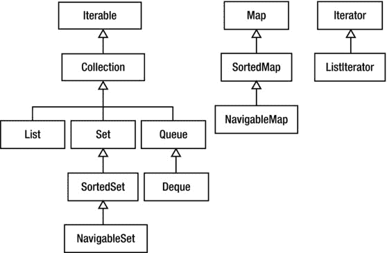

图 15-1.  重要的高级 java.util 接口及其继承关系

*   当存在自然顺序时，为你的类实现 `Comparable` 接口。如果你想以自然顺序之外的方式比较对象，或者你的类类型没有自然顺序，那么创建实现 `Comparator` 接口的单独类。此外，如果你有多种备选方式来决定顺序，那么请使用 `Comparator` 接口。

第 7 章：字符串处理

*   正则表达式定义了一种搜索模式，可用于执行字符串搜索和字符串操作等操作。表 15-1 总结了指定正则表达式的常用符号，表 15-2 列出了指定正则表达式的常用元符号，表 15-3 展示了正则表达式中常用的量词。

表 15-1. 指定正则表达式的常用符号

| 符号 | 描述 |
    | --- | --- |
    | ^expr | 匹配行首的 `expr`。 |
    | expr$ | 匹配行尾的 `expr`。 |
    | . | 匹配任何单个字符（换行符除外）。 |
    | [xyz] | 匹配 x、y 或 z。 |
    | [p-z] | 指定一个范围。匹配从 p 到 z 的任何字符。 |
    | [p-z1-9] | 匹配从 p 到 z 的任何字符或从 1 到 9 的任何数字（记住，它不会匹配 p1）。 |
    | [^p-z] | 方括号内的 '`^`' 作为第一个字符时否定该模式；它匹配除 p 到 z 之外的任何字符。 |
    | Xy | 匹配 x 后跟 y。 |
    | x &#124; y | 匹配 x 或 y。 |

表 15-2. 指定正则表达式的常用元符号

| 符号 | 描述 |
    | --- | --- |
    | \d | 匹配数字（相当于 [0–9]）。 |
    | \D | 匹配非数字。 |
    | \w | 匹配单词字符。 |
    | \W | 匹配非单词字符。 |
    | \s | 匹配空白字符（相当于 [\t\r\f\n]）。 |
    | \S | 匹配非空白字符。 |
    | \b | 在方括号外时匹配单词边界。在方括号内时匹配反斜杠。 |
    | \B | 匹配非单词边界。 |
    | \A | 匹配字符串开头。 |
    | \Z | 匹配字符串结尾。 |

表 15-3. 常用量词符号


| 符号 | 描述 |
    | --- | --- |
    | expr? | 匹配 0 次或 1 次 expr（等同于 `expr{0,1}`）。 |
    | expr* | 匹配 0 次或多次 expr（等同于 `expr{0,}`）。 |
    | expr+ | 匹配 1 次或多次 expr（等同于 `expr{1,}`）。 |
    | expr{x} | 匹配 x 次 expr。 |
    | expr{x, y} | 匹配 x 到 y 次 expr。 |
    | expr{x,} | 匹配 x 次或更多次 expr。 |

*   `split()` 方法的参数是一个分隔符字符串，它是一个正则表达式。如果你传入的正则表达式语法无效，将会抛出 `PatternSyntaxException` 异常。
*   当你在字符串上频繁执行搜索或替换操作时，请使用 `Pattern` 和 `Matcher` 类；它们在 Java 中执行搜索/替换的效率比任何其他方式都更高、更快。
*   你可以在正则表达式中形成组。这些组可用于对整个正则表达式的所需子集指定量词。这些组也可用于指定反向引用。
*   `printf()` 方法（以及 `String` 类中的 `format()` 方法）使用字符串格式化标志来格式化字符串。
*   每个格式说明符都以 `%` 符号开头；后跟标志、宽度和精度信息；并以数据类型说明符结尾。在此字符串中，标志、宽度和精度信息是可选的，而 `%` 符号和数据类型说明符是必需的。表 15-4 显示了常用的数据类型说明符符号。

表 15-4. 常用数据类型说明符

| 符号 | 描述 |
    | --- | --- |
    | %b | 布尔值 |
    | %c | 字符 |
    | %d | 十进制整数（有符号） |
    | %e | 科学计数法格式的浮点数 |
    | %f | 十进制格式的浮点数 |
    | %g | 十进制或科学计数法格式的浮点数（取决于传入的参数值） |
    | %h | 传入参数的哈希码 |
    | %n | 行分隔符（换行符） |
    | %o | 格式化为八进制值的整数 |
    | %s | 字符串 |
    | %t | 日期/时间 |
    | %x | 格式化为十六进制值的整数 |

*   如果你未指定任何字符串格式化说明符，`printf()` 方法将不会根据给定的参数打印任何内容！
*   诸如 `'-'`、`'^'` 或 `'0'` 之类的标志仅在你使用格式说明符字符串指定宽度时才有意义。
*   你也可以在格式字符串中打印 `%` 字符；但是，你需要为其使用转义序列。在格式说明符字符串中，`%` 是一个转义字符，这意味着你需要使用 `%%` 来打印单个 `%`。
*   如果你未提供格式字符串所期望的输入数据类型，你可能会收到 `IllegalFormatConversionException` 异常。
*   如果你想构建一个字符串并在以后使用它，而不是仅仅使用 `printf()` 方法打印它，你可以使用 `String` 类中的静态方法 `format()`。

第 8 章：Java I/O 基础

*   你可以使用 `System.console()` 方法获取对控制台的引用；如果 JVM 未与任何控制台关联，此方法将失败并返回 null。
*   `Console` 提供了许多支持格式化 I/O 的方法。你可以使用 `Console` 类中的 `printf()` 和 `format()` 方法来打印格式化文本；重载的 `readLine()` 和 `readPassword()` 方法将格式字符串作为参数。
*   你可以使用字符流进行基于文本的 I/O，使用字节流进行基于数据的 I/O。
*   用于读取和写入的字符流分别称为*读取器*和*写入器*（由抽象类 `Reader` 和 `Writer` 表示）。用于读取和写入的字节流分别称为*输入流*和*输出流*（由抽象类 `InputStream` 和 `OutputStream` 表示）。
*   你可以组合流对象。你可以创建一个 `BufferedInputStream` 对象，该对象接收一个 `FileInputStream` 对象。这样，一个流的输出就链接到了过滤流。这是一种根据你的需求自定义流的重要、有用且优雅的方式。
*   对于处理具有基本数据类型和 `String` 的数据，你可以使用数据流。
*   *序列化*是将内存中的对象转换为字节序列的过程。如果你希望使类的对象可序列化，则需要在类中实现 `Serializable` 接口。
*   `Serializable` 接口是一个标记接口。这意味着 `Serializable` 接口内部没有声明任何方法。
*   如果你想自定义序列化过程，可以实现 `readObject()` 和 `writeObject()` 方法。请注意，这两个方法都是私有方法，这意味着你并非在重写或重载这些方法。JVM 会检查这些方法的实现，并调用它们而不是通常的方法。这听起来很奇怪，但这就是 JVM 中实现序列化过程自定义的方式。
*   序列化后的对象可以通过网络进行通信，并在另一台机器上反序列化。但是，该对象的类文件必须位于目标机器的路径中，否则只会恢复对象的状态，而不会恢复整个对象（即，你无法在恢复的对象上调用方法）。
*   你可以创建自己的序列化协议。为此，你需要实现 `Externalizable` 接口而不是 `Serializable` 接口。
*   当你在可序列化的类中未指定 `serialVersionUID` 时，JVM 会为你计算它。但是，每个 JVM 实现都有不同的计算机制；因此，当你未显式指定 `serialVersionUID` 时，无法保证你的可序列化类能在两个不同的 JVM 上正常工作。因此，强烈建议你在实现 `Serializable` 接口的类中提供 `serialVersionUID`。

第 9 章：Java 文件 I/O (NIO.2)


*   `Path` 对象是一种编程抽象，用于表示文件/目录的路径。
*   不要混淆 `File` 与 `Files`、`Path` 与 `Paths`、以及 `FileSystem` 与 `FileSystems`；它们是不同的。*File* 是一个旧类（Java 4），用于表示文件/目录路径名，而 *Files* 是在 Java 7 中引入的，作为一个实用工具类，全面支持 I/O API。*Path* 接口表示文件/目录路径，并定义了一组有用的方法。然而，*Paths* 类是一个实用工具类，仅提供两个方法（都用于获取 `the Path` 对象）。*FileSystems* 为 `FileSystem` 类提供了一系列工厂方法，而 *FileSystem* 则提供了一组有用的方法来获取文件系统的信息。
*   由 `Path` 对象表示的文件或目录可能不存在。
*   `Path` 提供了两个用于比较 `Path` 对象的方法：`equals()` 和 `compareTo()`。即使两个 `Path` 对象指向同一个文件/目录，也不能保证 `equals()` 方法会返回 true。你需要确保两个路径都是绝对路径且已规范化，路径的相等性比较才能成功。
*   你可以使用 `Files` 类的 `exists()` 方法来检查文件是否存在。
*   你可以使用 `getAttributes()` 方法检索文件的属性。你可以使用 `Files` 类的 `readAttributes()` 方法来批量读取文件的属性。
*   在复制时，指定路径中的所有目录（如果你正在复制一个目录，则除最后一个目录外）都必须存在，以避免出现 `NoSuchFileException`。
*   如果你使用 `copy()` 方法复制一个目录，它不会复制源目录中包含的文件/子目录；你需要显式地将它们复制到目标文件夹。
*   并非只能在两个文件/目录之间执行复制操作。你可以从 `InputStream` 获取输入并写入文件；同样，你也可以从文件获取输入并复制到 `OutputStream`。你可以使用 `copy(InputStream, Path, CopyOptions...)` 和 `copy(Path, OutputStream, CopyOptions...)` 方法。
*   使用 `delete()` 方法删除文件；使用 `deleteIfExists()` 方法仅在文件存在时删除它。
*   如果你不想实现 `the FileVisitor` 接口中的所有四个方法，你可以简单地从 `SimpleFileVisitor` 类扩展你的实现。
*   当你想要查找满足特定模式的文件时，`PathMatcher` 接口非常有用。你可以使用 `glob` 或 `regex` 来指定模式。表 15-5 总结了 Glob 语法支持的模式。

表 15-5. Glob 语法支持的模式

| 模式 | 描述 |
    | --- | --- |
    | `*` | 匹配任意长度的任意字符串，甚至零长度。 |
    | `**` | 类似于“*”，但可以跨越目录边界。 |
    | `?` | 匹配任意单个字符。 |
    | `[xyz]` | 匹配 x、y 或 z 中的任意一个。 |
    | `[0-5]` | 匹配 0 到 5 范围内的任意字符。 |
    | `[a-z]` | 匹配任意小写字母。 |
    | `{xyz, abc}` | 匹配 xyz 或 abc 中的任意一个。 |

*   Java 7 提供了一个目录监视服务，当您正在处理的文件被其他程序更改时，它可以通知您。您可以使用监视服务以及特定的事件类型来注册一个 `Path` 对象。每当指定目录中的任何文件发生更改时，就会向注册的程序发送一个事件。
*   在遍历文件树时执行操作必须小心。例如，如果您正在执行递归删除，那么您应该先删除所有包含的文件，然后再删除包含这些文件的目录。
*   `Visitor` 设计模式用于实现对文件树的遍历。
*   在监视服务的上下文中，一个状态与一个监视键相关联。监视键可能处于 `ready` 状态（准备接受事件）、`signed` 状态（当一个或多个事件排队时）或 `invalid` 状态（当监视键无效时）。如果键处于 `signed` 状态，则需要调用 `reset()` 方法；否则键的状态不会变为 `ready` 状态，您将不会收到任何进一步的事件通知。
*   如果您使用 Java 7 提供的监视服务监视一个目录，则只会监视该目录中包含的文件，而不会监视该目录子目录中包含的文件。如果您打算监视文件系统的整个子树，则需要递归地注册子树中的每个目录。

第 10 章：使用 JDBC 构建数据库应用程序

*   Java 提供的 JDBC（Java 数据库连接）API 旨在以编程方式访问数据库管理系统（DBMS）。
*   JDBC 隐藏了所有 DBMS 的异构性，并提供了一组统一的 API 来与所有类型的数据库进行交互。异构交互的复杂性被委托给 JDBC 驱动程序管理器和 JDBC 驱动程序；因此，所有细节和复杂性都被 JDBC API 对应用程序开发者隐藏了。
*   有四种类型的驱动程序：

*   **类型 1（JDBC-ODBC 桥接驱动程序）：** JDBC 驱动程序使用 Java 本地接口（JNI）调用 ODBC（开放数据库连接）本地调用。
*   **类型 2（本地 API 驱动程序）：** 这些驱动程序使用特定数据库的客户端库，并将 JDBC 调用转换为本地数据库调用。
*   **类型 3（网络协议驱动程序）：** 这些驱动程序调用数据库中间件，中间件再将 JDBC 调用转换为特定于数据库的本地调用。
*   **类型 4（本地协议驱动程序）：** 驱动程序直接通过网络进行特定于数据库的调用，无需任何额外的客户端库支持。

*   `java.sql.Connection` 接口提供了应用程序和数据库通信的通道。`DriverManager` 类中的 `getConnection()` 方法接受三个参数：URL 字符串、用户名字符串和密码字符串。
*   URL（需要指定以获取 `Connection` 对象）的语法是 `<protocol>:<subprotocol>://<server>:<port>/`。URL 字符串的一个示例是 `jdbc:mysql://localhost:3306/`。<protocol>jdbc 对所有 DBMS 都是相同的；<subprotocol>对于每个 DBMS 会有所不同，<server>取决于您托管数据库的位置，并且每个 DBMS 使用特定的 <port> 端口号。</port></server></subprotocol></protocol>
*   如果 JDBC API 无法定位 JDBC 驱动程序，它将抛出 `SQLException`。如果有可用的驱动程序 jar 包，则需要将它们包含在类路径中，以使 JDBC API 能够定位驱动程序。
*   在 JDBC 4.0 之前，您必须使用 `Class.forName()` 语句显式加载 JDBC 驱动程序；在 JDBC 4.0 及更高版本中，不需要此语句，JDBC API 将从 URL 字符串中给出的详细信息加载驱动程序。
*   JDBC 支持两个用于查询和更新的类：`Statement` 和 `Resultset`。
*   `Statement` 是一个 SQL 语句，可用于将 SQL 语句发送到连接的数据库并从数据库接收结果。有三种类型的 Statements：

*   `Statement`：当您需要向数据库发送不带任何参数的 SQL 语句时，使用 `Statement`。
*   `PreparedStatement`：表示一个预编译的 SQL 语句，可以使用 IN 参数进行自定义。
*   `CallableStatement`：用于执行存储过程；可以处理 IN 以及 OUT 和 INOUT 参数。


*   根据 SQL 语句的类型选择合适的执行方法。请记住，每种执行方法返回的输出不同。`executeQuery()` 方法返回一个结果集；`executeUpdate()` 返回更新计数；而 `execute()` 方法可能返回多个结果集、多个更新计数，或两者的组合。
*   如果 a) `Statement` 对象被关闭，b) 被重新执行，或 c) 被用于检索下一组结果，则 `Statement` 对象会关闭当前的 `ResultSet` 对象。这意味着不必显式调用 `ResultSet` 对象的 `close()` 方法；不过，在完成对象使用后调用 `close()` 仍是一种良好的实践。
*   发出正确的 SQL 命令是您的责任；JDBC `Statement` 不会检查其正确性。例如，如果 SQL 命令字符串中存在语法错误，您不会收到编译错误，而是在运行时收到 `SQLSyntaxErrorException` 异常。
*   `ResultSet` 对象维护一个指向当前行的游标。初始时，游标位于第一行之前；调用 `next()` 方法会将游标位置向前移动一行。
*   您可以在 `ResultSet` 方法中使用列名或列索引。您使用的索引是 `ResultSet` 对象的索引，而不是数据库表中的列号。
*   `ResultSet` 对象中的列索引从 1 开始（*而非*从 0 开始）。
*   您可以使用 `ResultSet` 对象的列名，而无需担心大小写：`getXXX()` 方法接受不区分大小写的列名来检索关联值。
*   考虑一种情况：`ResultSet` 对象中有两列同名。如何使用列名检索关联值？如果使用列名检索值，它将始终指向第一个匹配给定名称的列。因此，在这种情况下，您必须使用列索引来检索与这两列关联的值。
*   在修改 `ResultSet` 中的行内容后，需要调用 `updateRow()`；否则，对 `ResultSet` 对象所做的更改将丢失。
*   您可以使用 `cancelRowUpdates()` 方法取消所做的任何更新。但是，必须在调用 `updateRow()` 方法之前调用此方法。在其他所有情况下，它对行没有影响。
*   通过调用 `Connection` 接口中的 `getMetaData()` 方法，您可以检查底层数据库的能力。
*   事务是一组 SQL 操作，这些操作要么全部成功执行，要么全部不执行。
*   默认情况下，自动提交模式设置为 true，因此您通过连接所做的所有更改都会自动提交到数据库。您可以使用 `setAutoCommit(false)` 来启用手动提交。在未启用自动提交的情况下，您需要显式提交或回滚事务。
*   如果在手动提交模式下未执行 `commit()` 方法，则数据库中将不会发生任何更改。
*   您可以将一个大事务划分为多个里程碑。这些里程碑被称为 `Savepoints`。这样，一旦达到某个里程碑，您就可以将数据库的更改保存到该里程碑。
*   `RowSet` 是一种特殊的 `ResultSet`，它支持 JavaBean 组件模型。图 15-2 总结了 `RowSet` 的层次结构及相关关键功能。

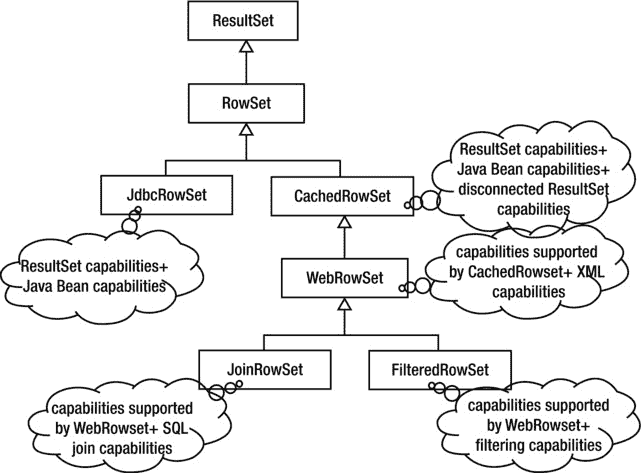

图 15-2.  RowSet 层次结构

*   `JdbcRowSet` 是一个保持连接的 `RowSet`，而 `RowSet` 的其他子接口（即 `JoinRowSet`、`CachedRowSet`、`WebRowSet` 和 `FilteredRowSet`）是断开的 `RowSet`。
*   `RowSetProvider` 提供了获取 `RowSetFactory` 实现的 API，该实现可用于实例化相关的 `RowSet` 实现。
*   JDBC 4.1 引入了使用 try-with-resources 语句自动关闭资源（`Connection`、`ResultSet` 和 `Statement`）的功能。

第 11 章：异常与断言


*   在提供多个异常处理器（“堆叠”的 catch 处理器）时，应将具体的异常处理器放在通用的异常处理器之前。在派生类处理器之前提供基类处理器会导致编译器错误。
*   一个 `try` 块可以有多个 catch 处理器。如果两个或多个异常的原因相似，且处理代码也相似，可以考虑合并这些处理器，形成一个 multi-catch 块。
*   `finally` 块中的代码无论 `try` 块是成功执行还是抛出异常，都会被执行。这使得 `finally` 块成为释放资源（如文件句柄、数据库句柄、网络流等）最合适的地方。
*   在 multi-catch 块中，不能合并具有基类和派生类关系的两个异常的 catch 处理器。你只能合并那些彼此之间没有父子继承关系的异常的 catch 处理器。
*   忘记通过显式调用 `close()` 方法来释放资源是一个常见错误。你可以使用 try-with-resources 语句来简化代码并自动关闭资源。要使资源能在 try-with-resources 语句中使用，该资源的类必须实现 `java.lang.AutoCloseable` 接口并定义 `close()` 方法。
*   你可以在一个 try-with-resources 语句中自动关闭多个资源。这些资源需要在 try-with-resources 语句头中用分号分隔。
*   由于可以在 try-with-resources 语句中使用多个资源，`try` 块和 `finally` 块都可能抛出多个异常的可能性很高。如果 `try` 块抛出一个异常，并且 `finally` 块也抛出了异常，那么 `finally` 块中抛出的异常将被添加为*被抑制的异常*，附加到从 `try` 块抛出给调用者的异常上。
*   你不能在 try-with-resources 语句体内为 try-with-resources 中声明的资源变量赋值。这是为了确保在 try-with-resources 头中获取的相同资源能在 `finally` 块中被释放。
*   在 try-with-resources 语句内显式关闭资源是一个常见错误。请记住，try-with-resources 会扩展为在 `finally` 块中调用 `close()` 方法，因此如果你在 `finally` 块中显式调用了 `close()` 方法，扩展后的 `finally` 块实际上会双重调用 `close()` 方法。
*   `Throwable` 类是异常层次结构的根类。只有 `Throwable` 及其派生类可以与 Java 异常处理关键字（如 `try`、`catch` 和 `throws`）一起使用。
*   `Exception` 类（除了其 `RuntimeException` 子层次结构）及其派生类被称为*受检异常*。这些异常代表了程序执行时“可以合理预期”会发生的异常情况，因此必须进行处理。包含可能抛出受检异常的代码段的方法，要么必须提供一个 catch 处理器来处理它，要么在其 throws 子句中声明该异常。
*   `RuntimeException` 和 `Error` 类及其派生类被称为*非受检异常*。它们可以在程序中的任何地方抛出（无需声明该代码段可能抛出这些异常）。
*   `RuntimeException` 类及其派生类代表编程错误（逻辑错误），通常*不*期望在程序中被捕获和处理。然而，在某些情况下，在 catch 块中处理这些异常是有意义的。
*   `Error` 类及其派生类代表因 JVM 错误而引发的异常——要么是 JVM 检测到严重的异常状况，要么是资源耗尽。

当发生 `Error` 时，*典型*的最佳做法是终止程序。
*   catch 块应该要么处理异常，要么重新抛出它。通过捕获异常但不做任何处理来*隐藏*或*吞没*异常是一种非常糟糕的做法。
*   方法的 throws 子句用于列出方法体可能抛出的*受检异常*。
*   静态初始化块不能抛出任何受检异常。非静态初始化块可以抛出受检异常；但是，所有构造函数都应该在其 throws 子句中声明该异常。
*   方法的 throws 子句是其派生类中重写方法应遵守的契约的一部分。重写方法可以提供与基方法 throws 子句相同的 throws 子句，或者比基方法 throws 子句更具体的 throws 子句。与基方法的 throws 子句相比，重写方法不能提供更通用的 throws 子句，也不能声明抛出额外的受检异常。
*   如果方法没有 throws 子句，这并*不*意味着它不能抛出任何异常——只是意味着它不能抛出任何*受检*异常。
*   使用 throws 子句列出方法可能抛出的非受检异常是一种糟糕的做法。为什么？因为编译器无法强制调用者处理非受检异常，所以将它们列在 throws 子句中是没有意义的。相反，如果方法可能抛出非受检异常，最好使用 `@throws` 子句来记录这种可能性。
*   非静态初始化块可以抛出受检异常；但是，所有构造函数都应该在其 throws 子句中声明这些异常。为什么？编译器在代码生成阶段会合并非静态初始化块和构造函数的代码，因此构造函数的 throws 子句可用于声明非静态初始化块可能抛出的受检异常。
*   重写方法不能在 throws 子句中声明比基方法 throws 子句中声明的异常列表更多的异常。为什么？基方法的调用者只能看到该方法 throws 子句中给出的异常列表，并会在其代码中声明或处理这些受检异常（而不会处理更多）。
*   重写方法可以声明比基方法 throws 子句中列出的异常更具体的异常；换句话说，你可以在重写方法的 throws 子句中声明派生异常。
*   如果一个方法在两个或多个接口中声明，并且该方法在 throws 子句中声明抛出不同的异常，那么实现类应该在其 throws 子句中列出所有这些异常。
*   你可以在程序中定义自己的异常类（称为自定义异常）。
*   建议你从 `Exception` 或 `RuntimeException` 类派生自定义异常。不建议通过扩展 `Throwable` 类（过于通用）或 `Error` 类（此类型的异常保留给 JVM 和 Java API 抛出）来创建自定义异常。
*   你可以包装一个异常并将其作为另一个异常抛出。这两个异常成为链式异常。从抛出的异常中，你可以获取该异常的原因。
*   断言是程序中的条件检查，旨在用于显式检查你在编写程序时所做的假设。
*   `assert` 语句有两种形式：一种接受布尔参数，另一种接受一个额外的字符串参数。
*   如果 `assert` 参数中给出的布尔条件失败（即计算结果为 false），程序将在抛出 `AssertionError` 后终止。不建议在程序抛出 `AssertionError` 时捕获并恢复。
*   默认情况下，断言在运行时是禁用的。


你可以在调用 JVM 时使用命令行参数 `–ea`（用于启用断言）和 `–da`（用于禁用断言）及其变体。

第 12 章：本地化

*   *区域设置*代表一种语言、文化或国家；Java 中的 `Locale` 类为此概念提供了抽象。
*   每个区域设置可以包含三个条目：语言、国家和变体。你可以使用语言和国家的标准代码来形成区域设置标签。变体没有标准标签；你可以根据需要提供变体字符串。
*   有多种方法可以创建或获取与区域设置对应的 `Locale` 对象：

*   使用 `Locale` 类的构造函数。
*   使用 `Locale` 类中的 `forLanguageTag`(String languageTag) 方法。
*   通过实例化 `Locale.Builder`，然后调用该对象的 `setLanguageTag`() 方法来构建 `Locale` 对象。
*   使用 `Locale` 类中预定义的静态 final 常量来表示区域设置。

*   资源包是一组类或属性文件，有助于定义一组键，并将这些键映射到特定于区域设置的值。
*   `ResourceBundle` 类有两个派生类：`PropertyResourceBundle` 和 `ListResourceBundle`。你可以使用 `ResourceBundle.getBundle()` 为给定的区域设置自动加载包。
*   `PropertyResourceBundle` 类以属性文件的形式提供对多个区域设置的支持。对于每个区域设置，你可以在该区域设置的属性文件中指定键和值。你只能使用字符串作为键和值。
*   完全限定的资源包名称的命名约定是 `packagequalifier.bundlename + "_" + language + "_" + country + "_" + (variant + "_#" | "#") + script + "-" + extensions`。
*   此处介绍了查找匹配资源包的搜索顺序。搜索从步骤 1 开始。如果在任何步骤中找到匹配项，则加载该资源包。否则，搜索将继续进行到下一步。

*   **步骤 1：** 搜索首先尝试查找与完整名称完全匹配的资源包。
*   **步骤 2：** 删除最后一个组件（由 _ 分隔的部分），并使用生成的较短名称重复搜索。*此过程重复进行，直到只剩下最后一个区域设置修饰符*。
*   **步骤 3：** 使用默认区域设置的包的完整名称重新开始搜索。
*   **步骤 4：** 仅使用包的名称搜索资源包。
*   **步骤 5：** 搜索失败，抛出 `MissingBundleException`。

*   对于实现为从 `ListResourceBundles` 派生的类的资源包，Java 使用反射机制来查找和加载该类。你需要确保该类是公共的，以便反射机制能够找到它。
*   要以文化敏感的方式处理日期和时间、数字以及货币，你可以使用 `java.text.Format` 类及其两个主要的派生类 `NumberFormat` 和 `DateFormat`。图 15-3 展示了 `Format` 及其重要的派生类。

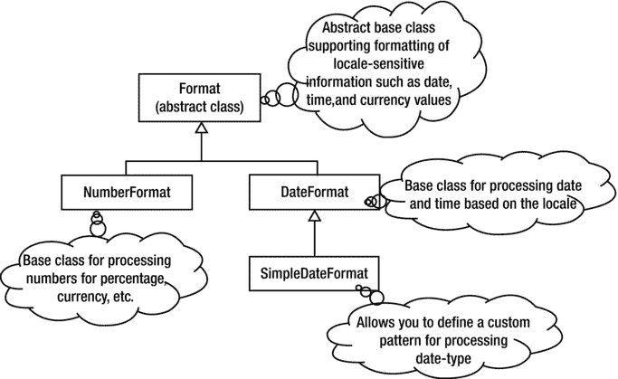

图 15-3.  Format 类及其重要的派生类

*   `NumberFormat` 类提供了格式化或解析数字的方法。“格式化”是指将数值转换为适合向用户显示的文本形式；“解析”是指将数字转换回程序使用的数值形式。`parse()` 方法如果成功则返回一个 `Number`；否则抛出 `ParseException`（一个受检异常）。
*   `NumberFormat` 有许多工厂方法：`getInstance()`、`getCurrencyInstance()`、`getIntegerInstance()` 和 `getPercentInstance()`。
*   `Currency` 类以区域设置敏感的方式处理货币值提供了良好的支持。
*   `DateFormat` 类以区域设置敏感的方式处理日期和时间提供了支持。
*   `DateFormat` 有三个重载的工厂方法——`getDateInstance()`、`getTimeInstance()` 和 `getDateTimeInstance()`——它们分别返回用于处理日期、时间以及日期和时间的 `DateFormat` 实例。
*   `SimpleDateFormat`（派生自 `DateFormat`）使用*模式字符串*的概念来支持日期和时间的自定义格式。以下是创建日期模式的重要字母及其含义列表：

*   `G`         纪元（公元前/公元）
*   `y`         年
*   `Y`         周年份
*   `M`         月（一年中的月份）
*   `w`         周（一年中的周数）
*   `W`         周（一月中的周数）
*   `D`         日（一年中的天数）
*   `d`         日（一月中的天数）
*   `F`         月中的星期几
*   `E`         星期中的天数名称
*   `u`         星期中的天数编号（值范围 1–7）

*   类似地，以下是用于定义自定义时间模式的重要字母：

```
    a         上午/下午标记
    H         小时（值范围 0–23）
    k         小时（值范围 1–24）
    K         上午/下午的小时（值范围 0–11）
    h         上午/下午的小时（值范围 1–12）
    m         分钟
    s         秒
    S         毫秒
    z         时区（通用时区格式）
    ```

第 13 章：线程


*   你可以通过实现 `Runnable` 接口或继承 `Thread` 类来创建能够进行多线程处理的类。
*   始终实现 `run()` 方法。`Thread` 类中的默认 `run()` 方法不执行任何操作。
*   在代码中调用 `start()` 方法，而不是直接调用 `run()` 方法。（将调用 `run()` 方法的任务留给 JVM。）
*   每个线程都有与之关联的线程名称、优先级和线程组；`Thread` 类中默认的 `toString()` 方法实现会打印这些信息。
*   如果你调用线程的 `sleep()` 方法，该线程不会释放锁，并且会继续持有该锁。
*   你可以使用 `join()` 方法来等待另一个线程终止。
*   通常，如果你没有在线程中使用“中断”功能，可以安全地忽略 `InterruptedException`；然而，如果发生该异常，最好还是记录或打印堆栈跟踪信息。
*   线程是非确定性的：在许多情况下，你无法通过重新运行程序来重现死锁或数据竞争等问题。
*   线程有三种基本状态：*新建*、*可运行*和*终止*。当线程刚被创建时，它处于*新建*状态；当它准备好运行或正在运行时，它处于*可运行*状态。当线程死亡时，它处于*终止*状态。
*   可运行状态在内部（在操作系统层面）包含两种状态：*就绪*和*运行*状态。
*   当线程等待获取锁时，它将处于*阻塞*状态。当为诸如 `wait` 之类的调用指定了超时时间时，线程将处于*定时等待*状态。例如，当调用 `wait()`（不带超时值）时，线程将处于*等待*状态。
*   如果你的操作导致无效的线程状态转换，你将收到一个 `IllegalThreadStateException` 异常。
*   对多个线程共享的公共资源同时进行读写可能会导致“数据竞争”（也称为“竞态条件”和“竞争风险”）问题。
*   你必须使用线程同步（即锁）来访问共享值并避免数据竞争。Java 提供了线程同步特性来提供对共享资源的受保护访问——即同步块和同步方法。
*   使用锁可能会引入死锁等问题。当发生死锁时，进程将挂起并且永远不会终止。
*   当两个（或多个）线程以相反的顺序获取锁时，通常会发生死锁。当一个线程已获取一个锁并等待另一个锁时，另一个线程已获取了那个另一个锁并等待第一个锁被释放。因此，无法取得任何进展，程序陷入死锁。
*   为了避免死锁，最好避免获取多个锁。当你必须获取多个这样的锁时，请确保在程序的所有地方都以相同的顺序获取它们。
*   当一个线程必须等待另一个线程满足特定条件或事件时，你可以使用等待/通知机制作为线程间的通信机制。
*   当一个线程需要等待特定条件/事件时，你可以调用带有或不带有指定超时值的 `wait()` 方法。
*   为了避免通知丢失，最好始终使用 `notifyAll()` 而不是 `notify()`。

第 14 章：并发

*   `semaphore`（信号量）控制对共享资源的访问。信号量维护一个计数器来指定其控制的资源数量。
*   `CountDownLatch`（倒计时门闩）允许一个或多个线程等待倒计时完成。
*   `Exchanger`（交换器）类用于在两个线程之间交换数据。当两个线程需要彼此同步并持续交换数据时，此类非常有用。
*   `CyclicBarrier`（循环屏障）有助于提供一个同步点，线程可能需要在预定义的执行点等待，直到所有其他线程都到达该点。
*   当一些独立的线程必须分阶段工作以完成一项任务时，`Phaser`（相位器）是一个有用的特性。
*   为了对原始类型变量执行操作而获取和释放锁，Java 提供了原子变量这种高效的替代方案。
*   `AtomicInteger` 和 `AtomicLong` 类继承自 `Number` 类。`java.util.concurrent.atomic` 子包中的所有其他类都直接继承自 `Object` 类，而不继承 `Number` 类。
*   `Conditions`（条件）支持线程通知机制。当某个条件不满足时，一个线程可以等待另一个线程满足该条件；一旦条件满足，另一个线程可以发出通知。
*   `Executors`（执行器）层次结构抽象了多线程编程的底层细节，并提供了高级的、用户友好的并发构造。
*   `Callable`（可调用）接口表示一个需要由线程完成的任务。任务完成后，`Callable` 实现的 `call()` 方法会返回一个值。
*   `Future`（未来）表示包含线程将来返回的值的对象。
*   `ThreadFactory`（线程工厂）是一个用于创建线程的接口，而不是通过调用 `new Thread()` 显式创建线程。
*   Fork/Join 框架允许针对某些类型的任务利用并行性（以多核的形式提供）。可以建模为分治问题的任务适合与 Fork/Join 框架一起使用。
*   Fork/Join 框架是 `ExecutorService` 接口的一个实现。
*   Fork/Join 框架使用工作窃取算法——换句话说，当一个 `worker`（工作）线程完成其工作并空闲时，它会从其他仍在忙碌的线程那里获取（或“窃取”）工作。
*   工作窃取技术能够以最小的同步成本实现良好的负载均衡线程管理。
*   在 Fork/Join 中，对两个子任务（如果你将任务拆分为两个子任务）都调用 `fork()` 并调用两次 `join()` 看起来是可以接受的。这是正确的——但效率低下。为什么？在这种情况下，原始线程将等待其他两个任务完成，考虑到任务创建成本，这是低效的。这就是为什么你调用一次 `fork()` 并为第二个任务调用 `compute()` 的原因。
*   `ForkJoinPool` 是 Fork/Join 框架中最重要的类。它是一个用于运行 fork/join 任务的线程池——换句话说，它执行 `ForkJoinTask` 的实例。它执行任务并管理它们的生命周期。
*   `ForkJoinTask<V>` 是一个轻量级的类线程实体，代表一个定义了诸如 `fork()` 和 `join()` 等方法的任务。

附录 A


考试主题

本附录列出了以下两项认证考试的主题：

*   **Java SE 7 Programmer II** 考试（也称为考试编号 **1Z0-804**）：

OCAJP 7 认证 + 1ZO-804 通过 = **Oracle Certified Professional, Java SE 7 Programmer**（**OCPJP 7**）认证

*   **升级到 Java SE 7 Programmer** 考试（也称为考试编号 **1Z0-805**）：

早期版本（OCPJP 5 或 OCPJP 6 或任何 SCJP）认证 + 1ZO-805 通过 = **Oracle Certified Professional, Java SE 7 Programmer**（**OCPJP 7**）认证

我们在下方主题标题旁边的括号中展示了考试主题如何映射到本书的章节（用“G&S”代表 Ganesh 和 Sharma）。


OCPJP 7 考试（1Z0-804，即 Java SE 7 程序员 II）主题

本书旨在帮助读者为 Z10-804 或 Z10-805 考试路径（通往 OCPJP 7 认证）做好同等准备，其内容组织与更全面的 1Z0-804 考试主题相对应。如下括号中所示，1Z0-804 大纲中的考试主题与本书各章节一一对应。我们感谢甲骨文公司允许在本附录中使用其考试主题。

1.  Java 类设计（G&S 第 3 章）

    *   1.1  使用访问修饰符：`private`、`protected` 和 `public`。
    *   1.2  使用方法重写。
    *   1.3  适当地使用方法重载的构造器和其他方法。
    *   1.4  使用 `instanceof` 运算符和类型转换。
    *   1.5  使用虚方法调用。
    *   1.6  使用来自 `Object` 类的重写方法以改进类的功能。
    *   1.7  使用 `package` 和 `import` 语句。

2.  高级类设计（G&S 第 4 章）

    *   2.1  识别何时以及如何应用抽象类。
    *   2.2  如何构建抽象 Java 类及其子类。
    *   2.3  使用 `static` 和 `final` 关键字。
    *   2.4  创建顶层类和嵌套类。
    *   2.5  使用枚举类型。

3.  面向对象设计原则（G&S 第 5 章）

    *   3.1  编写声明、实现和/或扩展接口的代码。
    *   3.2  在接口继承和类继承之间做出选择。
    *   3.3  开发实现“is-a”和/或“has-a”关系的代码。
    *   3.4  应用对象组合原则。
    *   3.5  使用 `Singleton` 设计模式设计类。
    *   3.6  编写实现 `DAO` 模式的代码。
    *   3.7  使用工厂设计并创建对象，并使用 API 中的工厂。

4.  泛型与集合（G&S 第 6 章）

    *   4.1  创建泛型类。
    *   4.2  使用菱形语法创建集合。
    *   4.3  分析使用原始类型和泛型类型的集合的互操作性。
    *   4.4  使用包装类和自动装箱。
    *   4.5  创建并使用 `List`、`Set` 和 `Deque`。
    *   4.6  创建并使用 `Map`。
    *   4.7  使用 `java.util.Comparator` 和 `java.lang.Comparable`。
    *   4.8  对数组和列表进行排序和搜索。

5.  字符串处理（G&S 第 7 章）

    *   5.1  搜索、解析和构建字符串。
    *   5.2  使用正则表达式搜索、解析和替换字符串，使用的表达式模式仅限于 . (点)、* (星号)、+ (加号)、?、\d、\D、\s、\S、\w、\W、\b、\B、[]、()。
    *   5.3  在格式字符串中使用格式化参数 %b、%c、%d、%f 和 %s 来格式化字符串。

6.  异常与断言（G&S 第 11 章）

    *   6.1  使用 `throw` 和 `throws` 语句。
    *   6.2  使用带有多重捕获和 finally 子句的 `try` 语句。
    *   6.3  使用 try-with-resources 语句自动关闭资源。
    *   6.4  创建自定义异常。
    *   6.5  使用断言测试不变量。

7.  Java I/O 基础（G&S 第 8 章）

    *   7.1  从控制台读写数据。
    *   7.2  使用流来读写文件。

8.  Java 文件 I/O (NIO.2)（G&S 第 9 章）

    *   8.1  使用 `Path` 类操作文件和目录路径。
    *   8.2  使用 `Files` 类检查、删除、复制或移动文件或目录。
    *   8.3  读取和更改文件及目录属性。
    *   8.4  递归访问目录树。
    *   8.5  使用 `PathMatcher` 类查找文件。
    *   8.6  使用 `WatchService` 监视目录的更改。

9.  使用 JDBC 构建数据库应用程序（G&S 第 10 章）

    *   9.1  定义 JDBC API 的布局。
    *   9.2  通过 JDBC 驱动程序连接到数据库。
    *   9.3  更新和查询数据库。
    *   9.4  自定义 JDBC 的事务行为并提交事务。
    *   9.5  使用 JDBC 4.1 的 `RowSetProvider`、`RowSetFactory` 和 `RowSet` 接口。

10. 线程（G&S 第 13 章）

    *   10.1  创建并使用 `Thread` 类和 `Runnable` 接口。
    *   10.2  管理和控制线程生命周期。
    *   10.3  同步线程对共享数据的访问。
    *   10.4  识别潜在的线程问题。

11. 并发（G&S 第 14 章）

    *   11.1  使用 `java.util.concurrent` 集合。
    *   11.2  应用原子变量和锁。
    *   11.3  使用 `Executors` 和 `ThreadPools`。
    *   11.4  使用并行 Fork/Join 框架。

12. 本地化（G&S 第 12 章）

    *   12.1  使用 `Locale` 对象读取和设置区域设置。
    *   12.2  为每个区域设置构建资源包。
    *   12.3  在应用程序中加载资源包。
    *   12.4  使用 `NumberFormat` 和 `DateFormat` 格式化文本以实现本地化。

OCPJP 7 考试（1Z0-805，即升级到 Java SE 7 程序员）主题

本书涵盖了升级考试（通往 OCPJP 7 认证的替代路径）的所有主题，对应章节已在括号中指明。

1.  语言增强（G&S 第 6 章、第 11 章）

    *   1.1  在 switch 语句中使用 `String`。
    *   1.2  使用二进制字面量和带下划线的数字字面量。
    *   1.3  使用 try-with-resources。
    *   1.4  在异常语句中使用多重捕获。
    *   1.5  在泛型声明中使用菱形运算符。
    *   1.6  在异常中使用更精确的重新抛出。

2.  设计模式（G&S 第 5 章）

    *   2.1  使用 `Singleton` 设计模式设计类。
    *   2.2  识别何时以及如何使用组合来解决业务问题。
    *   2.3  编写实现 `DAO` 模式的代码。
    *   2.4  设计一个使用 `Factory` 设计模式的类。

3.  使用 JDBC 的数据库应用程序（G&S 第 10 章）

    *   3.1  描述 JDBC API。
    *   3.2  识别使用 JDBC 连接到数据库所需的 Java 语句。
    *   3.3  使用 JDBC 4.1 的 `RowSetProvider`、`RowSetFactory` 和新的 `RowSet` 接口。
    *   3.4  使用 JDBC 事务。
    *   3.5  使用适当的 JDBC API 提交查询并从数据库读取结果。
    *   3.6  使用 JDBC 的 `PreparedStatement` 和 `CallableStatement`。

4.  并发（G&S 第 13 章、第 14 章）

    *   4.1  识别潜在的线程问题。
    *   4.2  使用 `java.util.concurrent` 集合。
    *   4.3  使用原子变量和锁。
    *   4.4  使用 `Executors` 和 `ThreadPools`。
    *   4.5  使用并行 Fork/Join 框架。

5.  本地化（G&S 第 12 章）

    *   5.1  描述本地化应用程序的优势。
    *   5.2  定义区域设置所代表的内容。
    *   5.3  使用 `Locale` 对象读取和设置区域设置。
    *   5.4  为每个区域设置构建资源包。
    *   5.5  从应用程序中调用资源包。
    *   5.6  根据区域设置选择资源包。
    *   5.7  使用 `NumberFormat` 和 `DateFormat` 格式化文本以实现本地化。

6.  Java 文件 I/O (NIO.2)（G&S 第 9 章）

    *   6.1  使用 `Path` 类操作文件和目录路径。
    *   6.2  使用 `Files` 类检查、删除、复制或移动文件或目录。
    *   6.3  读取和更改文件及目录属性。
    *   6.4  递归访问目录树。
    *   6.5  使用 `PathMatcher` 类查找文件。
    *   6.6  使用 `WatchService` 监视目录的更改。

附录 B


模拟测试 – 1


本次模拟测试中的题目是根据 OCPJP 7 考试大纲及其标准设计的。实际考试中的题目不会按考试主题均匀分布，且题目顺序随机。此外，参加真实考试时，你会发现有些题目可能不够直观或令人困惑。例如，你可能会觉得第 22、23 和 26 题不完整或令人费解，而这正是有意为之。

请将本次测试当作真实的 OCPJP 7 考试来对待。祝你好运。

*时间：*2 小时 30 分钟                                                                       *题目数量：*90

1.  **请考虑以下代码片段：**

```
    if(i == 10.0)
        System.out.println("true");
    ```

**以下哪个变量** `i` **的声明在编译时不会出错，并且在程序执行时会输出** `true`**？**

a)   int i = 012;

b)   int i = 10.0f;

c)   int i = 10L;

d)   int i = 10.0;

2.  **请考虑以下程序：**

```
    import java.math.BigDecimal;

class NumberTest {
         public static void main(String []args) {
                 Number [] numbers = new Number[4];
                 numbers[0] = new Number(0);       // NUM
                 numbers[1] = new Integer(1);
                 numbers[2] = new Float(2.0f);
                 numbers[3] = new BigDecimal(3.0);       // BIG
                 for(Number num : numbers) {
                         System.out.print(num + " ");
                 }
         }
    }
    ```

以下哪个选项正确描述了该程序的行为？

a)   注释标记为 `NUM` 的行会出现编译错误，因为 `Number` 无法被实例化。

b)   注释标记为 `BIG` 的行会出现编译错误，因为 `BigDecimal` 并非继承自 `Number`。

c)   执行时，该程序会输出：`0 1 2.0 3`。

d)   执行时，该程序会输出：`0.0 1.0 2.0 3.0`。

3.  **请考虑以下代码段：**

```
    StringBuffer strBuffer = new StringBuffer("This, that, etc.!");
    System.out.println(strBuffer.replace(12, 15, "etcetera"));
    ```

以下哪个选项正确描述了该代码段的行为？

a)   该代码段输出：This, that, etcetera.!

b)   该代码段输出：This, that, etcetera!

c)   该代码段输出：This, that, etc.

d)   该程序会抛出 `ArrayIndexOutOfBoundsException`。

4.  **请考虑以下程序：**

```
    class SBAppend {
            public static void main(String []args) {
                    Object nullObj = null;
                    StringBuffer strBuffer = new StringBuffer(10);

strBuffer.append("hello ");
                    strBuffer.append("world ");
                    strBuffer.append(nullObj);
                    strBuffer.insert(11, '!');
                    System.out.println(strBuffer);
            }
    }
    ```

**以下哪个选项正确描述了该程序的行为？**

a)   该程序输出：hello world!

b)   该程序输出：hello world! null

c)   该程序会抛出 `NullPointerException`。

d)   该程序会抛出 `InvalidArgumentException`。

e)   该程序会抛出 `ArrayIndexOutOfBoundsException`。

5.  **请考虑以下代码段：**

```
    Boolean b = null;
    System.out.println(b ? true : false); 
    ```

**以下哪个选项正确描述了该代码段的行为？**

a)   该代码会导致编译错误，因为引用类型（`Boolean` 类型）不能用作条件检查表达式的一部分。

b)   该代码会抛出 `NullPointerException`。

c)   该代码会在控制台输出 `true`。

d)   该代码会在控制台输出 `false`。

6.  **以下程序的输出是什么？**

```
    class Base {
         public Base() {
                 System.out.println("Base");
         }
    }


```java
class Derived extends Base {
         public Derived() {
                 System.out.println("Derived");
         }
    }

class DeriDerived extends Derived {
         public DeriDerived() {
                 System.out.println("DeriDerived");
         }
    }

class Test {
         public static void main(String []args) {
                 Derived b = new DeriDerived();
         }
    }
```

a)   Base
     Derived
     DeriDerived

b)   Derived
     DeriDerived

c)   DeriDerived
     Derived
     Base

d)   DeriDerived
     Derived

7.  **考虑以下代码片段：**

```java
    MODIFIER class SomeClass { }
```

**以下哪三个修饰符替换** `MODIFIER` **后，代码可以顺利编译？**

a)   public

b)   protected

c)   private

d)   abstract

e)   final

f)   static

8.  **考虑以下类定义：**

```java
    class Point {
            private int x = 0, y;
            public Point(int x, int y) {
                    this.x = x;
                    this.y = y;
            }
            // DEFAULT_CTOR
    }
```

**以下哪个** `Point` **构造函数的定义可以替换注释** `DEFAULT_CTOR` **的位置且不会导致编译错误？**

a)  `public Point() {`
            `this(0, 0);`
            `super();`
    `}`

b)  `public Point() {`
            `super();`
            `this(0, 0);`
    `}`

c)  `private Point() {`
            `this(0, 0);`
    `}`

d)  `public Point() {`
            `this();`
    `}`

e)  `public Point() {`
            `this(x, 0);`
    `}`

9.  **考虑以下程序：**

```java
    class Base {
         public Base() {
                 System.out.print("Base ");
         }
         public Base(String s) {
                 System.out.print("Base: " + s);
         }
    }

class Derived extends Base {
         public Derived(String s) {
                 super();       // Stmt-1
                 super(s);      // Stmt-2
                 System.out.print("Derived ");
         }
    }

class Test {
         public static void main(String []args) {
                 Base a = new Derived("Hello ");
         }
    }
```

**从以下列表中选择三个正确的选项：**

a)   删除 `Stmt-1` 将使程序可编译，并输出以下内容：Base Derived。

b)   删除 `Stmt-1` 将使程序可编译，并输出以下内容：Base: Hello Derived。

c)   删除 `Stmt-2` 将使程序可编译，并输出以下内容：Base Derived。

d)   同时删除 `Stmt-1` 和 `Stmt-2` 将使程序可编译，并输出以下内容：Base Derived。

e)   同时删除 `Stmt-1` 和 `Stmt-2` 将使程序可编译，并输出以下内容：Base: Hello Derived。

10. **你想使用** `abc.org.project` **包中类 A 的静态成员** `MYCONST`。**以下哪个语句展示了静态导入功能的正确用法？**

`a)   static import abc.org.project.A;`

`b)   static import abc.org.project.A.MYCONST;`

`c)   import static abc.org.project.A;`

`d)   import static abc.org.project.A.MYCONST;`

11. **以下哪个程序可以无错误编译并在控制台输出“hello world”？**

```java
    a)      import static java.lang.System.out.println;
        class StaticImport {
            public static void main(String []args) {
                    println("hello world");
            }
        }

b)      import static java.lang.System.out;
        class StaticImport {
            public static void main(String []args) {
                    out.println("hello world");
            }
        }

c)      import static java.lang.System.out.*;
        class StaticImport {
            public static void main(String []args) {
                    out.println("hello world");
            }
        }

d)      import static java.lang.System.out.*;
```


```
class StaticImport {
            public static void main(String []args) {
                    println("hello world");
            }
        }
    ```

12.  **考虑以下程序，并从给定的选项中选择正确的答案：**

```
    class Base {
         public void test() {
                 protected int a = 10;          // #1
         }
    }

class Test extends Base {                   // #2
         public static void main(String[] args) {
                 System.out.printf(null);       // #3
         }
    }
    ```

a)   编译器将在语句 #1 处报告错误。

b)   编译器将在语句 #2 处报告错误。

c)   编译器将在语句 #3 处报告错误。

d)   程序将编译无误。

13.  **考虑以下程序，并从选项列表中选择正确的选项：**

```
    class Base {
         public void test() {}
    }

class Base1 extends Base {
         public void test() {
                 System.out.println("Base1");
         }
    }

class Base2 extends Base {
         public void test() {
                 System.out.println("Base2");
         }
    }

class Test {
         public static void main(String[] args) {
                 Base obj = new Base1();
                 ((Base2)obj).test();    // CAST
         }
    }
    ```

a)   程序将输出以下内容：Base1。

b)   程序将输出以下内容：Base2。

c)   编译器将在标记有注释 CAST 的行报告错误。

d)   程序将导致异常（`ClassCastException`）。

14.  **考虑以下程序：**

```
    class Outer {
         class Inner {
                 public void print() {
                        System.out.println("Inner: print");
                 }
         }
    }

class Test {
         public static void main(String []args) {
                 // Stmt#1
                 inner.print();
         }
    }
    ```

**以下哪条语句替换 `// Stmt#1` 后，能使程序编译并成功运行，在控制台输出“Inner: print”？**

`a)   Outer.Inner inner = new Outer.Inner();`

`b)   Inner inner = new Outer.Inner();`

`c)   Outer.Inner inner = new Outer().Inner();`

`d)   Outer.Inner inner = new Outer().new Inner();`

15.  **考虑以下程序：**

```
    public class Outer {
            private int mem = 10;
            class Inner {
                    private int imem = new Outer().mem; // ACCESS1
            }

public static void main(String []s) {
                    System.out.println(new Outer().new Inner().imem); // ACCESS2
            }
    }
    ```

**以下哪个选项是正确的？**

a)   编译时，程序将在标记有注释 ACCESS1 的行导致编译器错误。

b)   编译时，程序将在标记有注释 ACCESS2 的行导致编译器错误。

c)   执行时，程序将输出 10。

d)   执行时，程序将输出 0。

16.  **考虑以下程序：**

```
    interface EnumBase { }

enum AnEnum implements EnumBase {       // IMPLEMENTS_INTERFACE
            ONLY_MEM;
    }

class EnumCheck {
            public static void main(String []args) {
                    if(AnEnum.ONLY_MEM instanceof AnEnum) {
                            System.out.println("yes, instance of AnEnum");
                    }
                    if(AnEnum.ONLY_MEM instanceof EnumBase) {
                            System.out.println("yes, instance of EnumBase");
                    }
                    if(AnEnum.ONLY_MEM instanceof Enum) {   // THIRD_CHECK
                            System.out.println("yes, instance of Enum");
                    }
            }
    }
    ```

**以下哪个选项是正确的？**

a)   程序在标记有注释 IMPLEMENTS_INTERFACE 的行导致编译器错误。

b)   程序在标记有注释 THIRD_CHECK 的行导致编译器错误。


c)   执行该程序时，将输出以下内容：
           yes, instance of AnEnum

d)   执行该程序时，将输出以下内容：
           yes, instance of AnEnum
           yes, instance of EnumBase

e)   执行该程序时，将输出以下内容：
           yes, instance of AnEnum
           yes, instance of EnumBase
           yes, instance of Enum

17.  **关于** `enum` **，以下哪些说法是正确的？（选择所有适用项）**

a)   `enum` 可以拥有 `private` 构造方法。

b)   `enum` 可以拥有 `public` 构造方法。

c)   `enum` 可以拥有 `public` 方法和字段。

d)   `enum` 可以实现一个接口。

e)   `enum` 可以继承一个类。

18.  **考虑以下程序并预测其行为：**

```
    class base1 {
         protected int var;
    }

interface base2 {
          int var = 0; // #1
    }

class Test extends base1 implements base2 { // #2
         public static void main(String args[]) {
                 System.out.println("var:" + var); // #3
         }
    }
    ```

a)   程序将在语句 #1 处报告编译错误。

b)   程序将在语句 #2 处报告编译错误。

c)   程序将在语句 #3 处报告编译错误。

d)   程序将无错误地编译通过。

19.  **考虑以下程序：**

```
    class WildCard {
            interface BI {}
            interface DI extends BI {}
            interface DDI extends DI {}

static class C<T> {}
            static void foo(C<? super DI> arg) {}

public static void main(String []args) {
                    foo(new C<BI>());      // ONE
                    foo(new C<DI>());      // TWO
                    foo(new C<DDI>());     // THREE
                    foo(new C());          // FOUR
            }
    }
    ```

**以下哪些选项是正确的？**

a)   标记为注释 ONE 的行将导致编译器错误。

b)   标记为注释 TWO 的行将导致编译器错误。

c)   标记为注释 THREE 的行将导致编译器错误。

d)   标记为注释 FOUR 的行将导致编译器错误。

20.  **考虑以下定义：**

```
    interface BI {}
    interface DI extends BI {}
    ```

**以下选项提供了模板类 X 的定义。哪个选项定义的类 X 具有一个类型参数，其上限声明 DI 是所有类型参数必须派生的超类型？**

a)   `class X <T super DI> { }`

b)   `class X <T implements DI> { }`

c)   `class X <T extends DI> { }`

d)   `class X <T extends ? & DI> { }`

21.  **考虑以下程序：**

```
    class base1{}

class base2{}

interface base3{}

interface base4{}

// Stmt
    public static void main(String args[]){
         }
    }
    ```

**如果将以下哪个语句替换到标记为注释 Stmt 的位置，程序将无错误地编译通过？**

a)   `class Test extends base1, base2 implements base3, base4 {`

b)   `class Test extends base1 implements base3, base4 {`

c)   `class Test extends base1 implements base3 implements base4 {`

d)   `class Test extends base1, extends base2 implements base3, base4 {`

22.  **在单例模式的上下文中，以下哪个说法是正确的？**

a)   `Singleton` 类不能有任何静态成员。

b)   `Singleton` 类有一个公共构造方法。

c)   `Factory` 类可以使用 `Singleton` 模式。

d)   `Singleton` 类的所有方法都必须是私有的。

23.  **在** `DAO` **模式的上下文中，以下哪个类可能扮演** `TransferObject` **的角色：**

a)   `ImageManager`

b)   `ImageFactory`

c)   `Image`

d)   `ImageProcessor`

24.  **以下哪个面向对象概念描述了 has-a 关系？**

a)   继承

b)   组合模式

c)   内部类

d)   组合

25.  **考虑以下程序：**

```
    class ClassA {}

interface InterfaceB {}

class ClassC {}
```


```java
class Test extends ClassA implements InterfaceB {
         String msg;
         ClassC classC;
    }
```

**以下哪项陈述是正确的？**

a)   类 `Test` 与 `ClassA` 是**has-a**关系。

b)   类 `Test` 与 `ClassC` 是**组合**关系。

c)   类 `Test` 与 `String` 是**is-a**关系。

d)   类 `ClassA` 与 `InterfaceB` 是**is-a**关系。

26.  **考虑以下类程序的 UML 图，并选择正确的选项：**

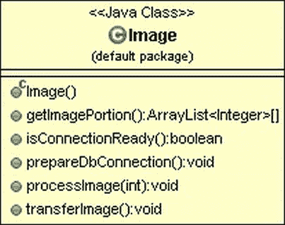

a)   该类表现出低内聚性。

b)   该类实现了`Singleton`模式。

c)   该类实现了`DAO`模式。

d)   该类表现出低耦合性。

27.  **考虑以下程序：**

```java
    import java.util.Comparator;
    import java.util.Arrays;

class CountryComparator implements Comparator<String> {
            public int compare(String country1, String country2) {
                    return country2.compareTo(country2); // COMPARE_TO
            }
    }

public class Sort {
            public static void main(String[] args) {
                    String[] brics = {"Brazil", "Russia", "India", "China"};
                    Arrays.sort(brics, null);
                    for(String country : brics) {
                            System.out.print(country + " ");
                    }
            }
    }
```

**以下哪个选项正确描述了该程序的行为？**

a)   程序在标记为 COMPARE_TO 注释的行导致编译器错误。

b)   程序输出：Brazil Russia India China。

c)   程序输出：Brazil China India Russia。

d)   程序输出：Russia India China Brazil。

e)   程序抛出异常 `InvalidComparatorException`。

f)   程序抛出异常 `InvalidCompareException`。

g)   程序抛出异常 `NullPointerException`。

28.  **以下哪个类定义可以无错误地编译？**

a) `class P<T> {`
                  `static T s_mem;`
           `}`

b) `class Q<T> {`
                  `T mem;`
                  `public Q(T arg) {`
                   `mem = arg;`
               `}`
           `}`

c) `class R<T> {`
                  `T mem;`
                  `public R() {`
                   `mem = new T();`
            `}`
        `}`

d) `class S<T> {`
                  `T []arr;`
                  `public S() {`
                  `arr = new T[10];`
            `}`
        `}`

29.  **以下哪个类/接口支持“基于与给定值或值集的最接近匹配来检索元素”？**

a)   `EnumSet`

b)   `HashSet`

c)   `AbstractSet`

d)   `NavigableSet`

30.  **在继承自** `ListResourceBundle` **的类中，以下哪个方法定义正确地重写了基类的** `getObject()` **方法？**

a)   `public String[][] getContents() {`
            `return new Object[][] { { "1", "Uno" }, { "2", "Duo" }, { "3", "Trie" }};`
        `}`

b)   `public Object[][] getContents() {`
            `return new Object[][] { { "1", "Uno" }, { "2", "Duo" }, { "3", "Trie" }};`
        `}`

c)   `private List<String> getContents() {`
            `return new ArrayList (Arrays.AsList({ { "1", "Uno" }, { "2", "Duo" },    { "3", "Trie" }});`
        `}`

d)   `protected Object[] getContents(){`
            `return new String[] { "Uno", "Duo", "Trie" };`
        `}`

31.  **以下哪个接口声明了一个名为** `iterator()` **的单一方法？（注意：实现此接口允许对象成为 for-each 语句的目标。）**

a)   `Iterable<T>`

b)   `Iterator<T>`

c)   `Enumeration<E>`

d)   `ForEach<T>`

32.  **以下哪个选项最适合在多线程应用程序中生成随机数？**

a)   `使用 java.lang.Math.random()`

b)   `使用 java.util.concurrent.ThreadLocalRandom`


c)   `使用 java.util.RandomAccess`

d)   `使用 java.lang.ThreadLocal<T>`

33.  **考虑以下程序：**

```
    import java.util.*;

class ListFromVarargs {
        public static <T> List<T> asList1(T... elements) {
           ArrayList<T> temp = new ArrayList<>();
           for(T element : elements) {
                    temp.add(element);
            }
            return temp;
        }

public static <T> List<?> asList2(T... elements) {
            ArrayList<?> temp = new ArrayList<>();
            for(T element : elements) {
                    temp.add(element);
            }
            return temp;
        }

public static <T> List<?> asList3(T... elements) {
            ArrayList<T> temp = new ArrayList<>();
            for(T element : elements) {
                    temp.add(element);
            }
            return temp;
        }

public static <T> List<?> asList4(T... elements) {
            List<T> temp = new ArrayList<T>();
            for(T element : elements) {
                    temp.add(element);
            }
            return temp;
        }
    }
    ```

**该程序中哪个** `asList` **的定义会导致编译错误？**

a)   `asList1` 的定义会导致编译错误。

b)   `asList2` 的定义会导致编译错误。

c)    `asList3` 的定义会导致编译错误。

d)     `asList4` 的定义会导致编译错误。

e)   所有定义（`asList1, asList2, asList3, asList4`）都不会导致编译错误。

34.  **考虑以下程序：**

```
    import java.util.*;

class TemplateType {
            public static void main(String []args) {
                    List<Map<List<Integer>, List<String>>> list =
                            new ArrayList<>();     // ADD_MAP
                    Map<List<Integer>, List<String>> map = new HashMap<>();
                    list.add(null);        // ADD_NULL
                    list.add(map);
                    list.add(new HashMap<List<Integer>,
                            List<String>>()); // ADD_HASHMAP
                    for(Map element : list) {       // ITERATE
                            System.out.print(element + " ");
                    }
            }
    }
    ```

**以下哪个选项是正确的？**

a)   该程序在注释为 ADD_MAP 的行会导致编译错误。

b)   该程序在注释为 ADD_HASHMAP 的行会导致编译错误。

c)   该程序在注释为 ITERATE 的行会导致编译错误。

d)   运行时，该程序会在注释为 ADD_NULL 的行崩溃，抛出 `NullPointerException`。

e)   运行时，该程序将打印以下内容：`null {} {}`

35.  **考虑以下程序：**

```
    class Base<T> { }

class Derived<T> { }

class Test {
         public static void main(String []args) {
                 // Stmt #1
         }
    }
    ```

**哪些语句可以放在** `//Stmt#1` **的位置，并且程序保持可编译（选择两项）：**

a)   `Base<Number> b = new Base<Number>();`

b)   `Base<Number> b = new Derived<Number>();`

c)   `Base<Number> b = new Derived<Integer>();`

d)   `Derived<Number> b = new Derived<Integer>();`

e)   `Base<Integer> b = new Derived<Integer>();`

f)   `Derived<Integer> b = new Derived<Integer>();`

36.  **考虑以下程序：**

```
    class Base<T> { }

class Derived<T> { }

class Test {
         public static void main(String []args) {
                 //Stmt#1
         }
    }
    ```

**哪些语句可以放在** `//Stmt#1` **的位置，并且程序保持可编译（选择所有适用项）？**

a)   `Base<? extends Number> b = new Base<Number>();`

b)   `Base<? extends Number> b = new Derived<Number>();`

c)   `Base<? extends Number> b = new Derived<Integer>();`

d)   `Derived<? extends Number> b = new Derived<Integer>();`

e)   `Base<?> b = new Derived<Integer>();`

f)   `Derived<?> b = new Derived<Integer>();`


好的，作为一名高级文档工程师和翻译员，我将严格遵循您提供的注意事项和示例，将给定的英文文本翻译成中文。


37.  **下列关于** `java.sql.Savepoint` **的陈述哪些是正确的？（请选择所有适用项）**

a)   `Savepoint 是当前事务中的一个点，可以从 Connection.rollback() 方法中引用它`

b)   `当事务回滚到某个保存点时，该保存点之后所做的所有更改都将被撤销。`

c)   `保存点必须命名。不可能存在“未命名的保存点”。`

d)   `java.sql.Savepoint 是一个抽象类；它由 java.sql 包中的 JDBCSavepoint、ODBCSavepoint 和 TransactionSavepoint 等类实现。`

38.  **考虑以下程序并选择正确的选项：**

```
    import java.util.*;

class Test {
         public static void main(String []args) {
                 Set<Integer> set = new LinkedHashSet<Integer>(); //#1
                 LinkedHashSet<Integer> set2 = new HashSet<Integer>(); //#2
                 SortedSet<Integer> set3 = new TreeSet<Integer>(); //#3
                 SortedSet<Integer> set4 = new NavigableSet<Integer>(); //#4
         }
    }
    ```

a)   语句 #1 和 #2 将成功编译。

b)   语句 #1 和 #3 将成功编译。

c)   语句 #1、#2 和 #3 将成功编译。

d)   语句 #2 和 #4 将成功编译。

39.  **考虑以下程序：**

```
    import java.util.*;

class Test {
         public static void main(String []args) {
                 Set<Integer> set = new TreeSet<Integer>();
                 set.add(5);
                 set.add(10);
                 set.add(3);
                 set.add(5);
                 System.out.println(set);
         }
    }
    ```

该程序的输出是什么？

a)   [5, 10, 3, 5]

b)   [5, 10, 3]

c)   [3, 5, 10]

d)   [10, 5, 3]

40.  **关于针对本地化文化格式化日期和时间的类，以下哪些陈述是正确的？（请选择所有适用项）**

a)   java.text.Format 是抽象基类，支持格式化区域敏感信息，例如日期、时间和货币。

b)   `java.text.CustomTimeFormat` 允许您定义自定义模式，用于处理特定区域的时间。

c)   `java.text.NumberFormat` 派生自 `java.text.Format` 类；它是以区域敏感方式处理数字、货币等的基类。

d)   `java.text.DateFormat` 派生自 `java.text.Format` 类；它是基于区域设置处理日期和时间信息的基类。

41.  **考虑以下程序并选择正确的选项：**

```
    import java.util.*;

class Test {
         public static void main(String []args) {
                 Map<String, int> map =
                         new HashMap<int, String>();            //#1
                 Map<String, String> map2 =
                         new HashMap<String, String>();         //#2
                 Map<String, String> map3 = new HashMap<>();    //#3
                 Map<> map4 = new HashMap<String, String>();    //#4
         }
    }
    ```

a)   语句 #1 和 #2 将成功编译。

b)   语句 #2 和 #3 将成功编译。

c)   语句 #3 和 #4 将成功编译。

d)   语句 #4 和 #1 将成功编译。

42.  **考虑以下程序并预测输出：**

```
    import java.util.*;

class Test {
         public static void main(String []args) {
                 Map<Integer, String> map = new TreeMap<Integer, String>();
                 map.put(5, "5");
                 map.put(10, "10");
                 map.put(3, "3");
                 map.put(5,"25");
                 System.out.println(map);
         }
    }
    ```

a)   {5=5, 10=10, 3=3, 5=25}

b)   {10=10, 3=3, 5=25}

c)   {3=3, 5=5, 5=25, 10=10}

d)   {3=3, 5=25, 10=10}

e)   {3=3, 5=5, 10=10}

43.  **考虑以下程序并预测输出：**

```
    import java.util.*;

class Test {
         public static void main(String []args) {
                 Deque<Integer> deque = new LinkedList<>();
                 deque.add(10);
                 deque.add(20);
                 deque.peek();
                 deque.peek();
                 deque.peek(); //#1
                 System.out.println(deque);
         }
    }
    ```

a)   [10, 20]

b)   [20, 10]

c)   []

d)   执行第 #1 行时抛出 `NoSuchElementException`。

44.  **java.util.concurrent.atomic 包中的哪些类继承自 java.lang.Number？（请选择所有适用项）**

a)   AtomicBoolean

b)   AtomicInteger

c)   AtomicLong

d)   AtomicFloat

e)   AtomicDouble

45.  **考虑以下程序并预测输出：**

```
    import java.util.HashSet;

class Student{
         public Student(int r) {
                 rollNo = r;
         }
         int rollNo;
    }

class Test {
         public static void main(String[] args){
                 HashSet<Student> students = new HashSet<>();
                 students.add(new Student(5));
                 students.add(new Student(10));
                 System.out.println(students.contains(new Student(10)));
         }
    }
    ```

a)   该程序输出以下内容：true。

b)   该程序输出以下内容：false。

c)   该程序导致编译器错误。

d)   该程序抛出 `NoSuchElementException`。

46.  **关于本地化上下文中的资源包，以下哪些陈述是正确的？（请选择所有适用项）**

a)   java.util.ResourceBundle 是基类，是包含区域特定对象的资源包的抽象。

b)   `java.util.PropertyResourceBundle` 是 `java.util.ResourceBundle` 的一个具体子类，它使用以属性文件形式提供的字符串来管理某个区域设置的资源。

c)   扩展 `java.util.PropertyResourceBundle` 的类必须重写 `getContents()` 方法，该方法的返回类型为 `Object [][]`。

d)   `java.util.ListResourceBundle` 定义了 `getKeys()` 方法，该方法返回资源包中包含的键的枚举。

47.  **考虑以下程序并预测输出：**

```
    import java.util.HashSet;

class Student{
         public Student(int r) {
                 rollNo = r;
         }

int rollNo;
         public int hashCode(){
                 return rollNo;
         }
    }

class Test {
         public static void main(String[] args){
                 HashSet<Student> students = new HashSet<>();
                 students.add(new Student(5));
                 Student s10 = new Student(10);
                 students.add(s10);
                 System.out.println(students.contains(new Student(10)));
                 System.out.println(students.contains(s10));
         }
    }
    ```

a)   false
          true

b)   false
          false

c)   true
          false

d)   true
          true

48.  **关于** `java.util.concurrent` **包中定义的类或接口，以下哪些陈述是正确的？**

a)    `Executor` 接口声明了一个单一方法 `execute(Runnable command)`，该方法在将来的某个时间执行给定的命令。

b)   `Callable` 接口声明了一个单一方法 `call()`，该方法计算结果。

c)    `Exchanger` 类提供了一个“同步点，线程可以在该点配对并交换对内的元素”。

d)   `TimeUnit` 枚举表示时间持续时间，对于在并发程序中指定定时参数很有用。

49.  **考虑以下程序并预测输出：**

```
    import java.util.*;

class Test {
         public static void main(String []args) {
            List<Integer> intList = new ArrayList<>();
            intList.add(10);
            intList.add(20);
            List list = intList;
            list.add("hello");       // ADD_STR
            for(Object o : list) {
                 System.out.print(o + " ");
            }
         }
    }
    ```


a)   该程序不会打印任何输出，并会抛出 `ClassCastException`。

b)   该程序将先打印 10 和 20，然后抛出 `ClassCastException`。

c)   该程序会在标记有注释 ADD_STR 的行产生编译错误。

d)   该程序将打印 10、20 和 hello。

50.  **以下哪两个选项提供了可以无编译错误的赋值？**

a)   `Map<String, String> map1 = new NavigableMap<>();`

b)   `Map<String, String> map2 = new IdentityHashMap<>();`

c)   `Map<String, String> map3 = new Hashtable<>();`

d)   `Map<String, String> map4 = new ConcurrentMap<>();`

51.  **考虑以下程序：**

```
    import java.util.*;

class AsList {
            public static void main(String []args) {
                    String hello = "hello";
                    String world = "world";
                    StringBuffer helloWorld = new StringBuffer(hello + world);
                    List<String> list =
                            Arrays.asList(hello, world, helloWorld.toString());
                    helloWorld.append("!");
                    list.remove(0);        // REMOVE
                    System.out.println(list);
            }
    }
    ```

**以下哪个选项是正确的？**

a)   编译时，该程序会在标记有注释 REMOVE 的行产生编译错误。

b)   运行时，该程序在执行标记有注释 REMOVE 的行时会抛出异常 `UnsupportedOperationException`。

c)   运行时，该程序会打印以下输出：[hello, world, helloworld]

d)   运行时，该程序会打印以下输出：[world, helloworld!]

e)   运行时，该程序会打印以下输出：[world, helloworld]

52.  **考虑以下程序并预测输出：**

```
    class Test {
         public static void main(String []args) {
                 String s = new String("5");
                 System.out.println(1+10+s+1+10);
         }
    }
    ```

a)   11511

b)   1105110

c)   115110

d)   27

53.  **考虑以下程序并预测输出：**

```
    class Test {
         public static void main(String []args) {
                 String s = new String("5");
                 System.out.println(1.0+10.5+s+(1.0+10.5));
         }
    }
    ```

a)   11.5511.5

b)   11.551.010.5

c)   1.010.551.010.5

d)   11.55(1.010.5)

e)   11.55(11.5)

54.  **考虑以下程序：**

```
    class Printf {
            public static void main(String []args) {
                    System.out.printf("%3.4s %n", "hello world");
                    System.out.printf("%05d", 123);
            }
    }
    ```

**以下哪个选项正确提供了该程序的输出？**

a)   lo

b)   hell

c)   hello

d)   hell

e)   hello world

55.  **考虑以下程序：**

```
    class PrintlnTest {
            public static void main(String[] args) {
                    String two = "2";
                    System.out.println("1 + 2 + 3 + 4 = "
                            + 1 + Integer.parseInt(two) + 3 + 4); // PARSE
            }
    }
    ```

**以下哪个选项正确描述了该程序的行为？**

a)   编译时，该程序会在标记有注释 PARSE 的行产生编译错误，因为缺少 `NumberFormatException` 的 catch 处理程序。

b)   执行时，该程序打印以下内容：`1 + 2 + 3 + 4 = 1234`。

c)   执行时，该程序打印以下内容：`1 + 2 + 3 + 4 = 10`。

d)   执行时，该程序打印以下内容：`1 + 2 + 3 + 4 = 127`。

e)   执行时，该程序打印以下内容：`1 + 2 + 3 + 4 = 19`。

f)   执行时，该程序在标记有注释 PARSE 的行抛出 `NumberFormatException`。

56.  **考虑以下程序并预测输出：**

```
    class Test {
         public static void main(String []args) {
                 int a = 7, b = 10;
                 System.out.printf("no:%2$s and %1$s", a, b);
                 System.out.printf("\nno:2$s and 1$s", a, b);
         }
    }
    ```

a)   no:10 and 7
          no:2$s and 1$s

b)   no:7 and 10
          no:2$s and 1$s

c)   no:10 and 7
          no:10 and 7

d)   no:7 and 10
          no:7 and 10

e)   该程序会产生编译错误。

57.  **考虑以下程序并预测输出（忽略输出中的任何空行）：**

```
    class Test {
         public static void main(String[] s) {
                 String quote = "aba*abaa**aabaa***";
                 String [] words = quote.split("a\\**", 10);
                 for (String word : words) {
                         System.out.println(word);
                 }
         }
    }
    ```

a)   ab
          aba
          *aaba
          **

b)   b
          b
          b

c)   aba*aba
          aaba

d)   该程序会抛出运行时异常。

58.  **考虑以下程序并预测输出：**

```
    import java.util.regex.*;

class Test {
         public static void main(String[] args) {
                 String str1 = "xxzz";
                 String str2 = "xyz";
                 String str3 = "yzz";
                 Pattern pattern = Pattern.compile("(xx)*y?z{1,}");
                 Matcher matcher = pattern.matcher(str1);
                 System.out.println(matcher.matches());
                 System.out.println(pattern.matcher(str2).matches());
                 System.out.println(
                         Pattern.compile("(xx)*y?z{1,}").
                         matcher(str3).matches());
         }
    }
    ```

a)   true
          false
          true

b)   true
          false
          false

c)   false
          false
          false

d)   false
          false
          true

e)   true
          true
          true

59.  **考虑以下程序并预测输出：**

```
    import java.util.regex.*;

class Test {
         public static void main(String[] args) {
                 String str = "OCPJP 2013 OCPJP7";

Pattern pattern = Pattern.compile("\\b\\w+\\D\\b");
                 Matcher matcher = pattern.matcher(str);
                 while(matcher.find()) {
                         System.out.println(matcher.group());
                 }
         }
    }
    ```

a)   OCPJP

OCPJP7

b)   OCPJP

c)   OCPJP
          OCPJP7

d)   该程序不会产生任何输出。

60.  **考虑以下程序并预测输出：**

```
    import java.util.regex.*;

class Test {
         public static void main(String[] args) {
                 String str =
                         "Suneetha N.=9876543210, Pratish Patil=9898989898";
                 Pattern pattern =
                         Pattern.compile("(\\w+)(\\s\\w+)(=)(\\d{10})");
                 Matcher matcher = pattern.matcher(str);
                 String newStr = matcher.replaceAll("$4:$2,$1");
                 System.out.println(newStr);
         }
    }
    ```

a)   9876543210: N.,Suneetha, 9898989898: Patil,Pratish

b)   Suneetha N.=9876543210, Pratish Patil=9898989898

c)   Suneetha N.=9876543210, 9898989898: Patil,Pratish

d)   该程序会抛出运行时异常。

61.  **关于预定义流** `System.in` **、** `System.out` **和** `System.err` **，以下哪两个陈述是正确的？**

a)   System.in 的类型是 `InputStream`。

b)   System.in 的类型是 `FileReader`。

c)   System.out 的类型是 `OutputStream`。

d)   System.err 的类型是 `ErrorStream`。

e)   `System`.out 和 System.err 的类型都是 `PrintStream`。

f)   `System`.out 和 `System`.err 的类型都是 `FileWriter`。

62.  **考虑以下程序：**

```
    import java.io.*;

class CloseableImpl implements Closeable {
            public void close() throws IOException {
                    System.out.println("In CloseableImpl.close()");
            }
    }


```java
class AutoCloseableImpl implements AutoCloseable {
            public void close() throws Exception {
                    System.out.println("In AutoCloseableImpl.close()");
            }
    }

class AutoCloseCheck {
            public static void main(String []args) {
                    try (Closeable closeableImpl = new CloseableImpl();
                            AutoCloseable autoCloseableImpl
                                    = new AutoCloseableImpl()) {
                    } catch (Exception ignore) {
                            // 不做任何操作
                    }
                    finally {
                            // 不做任何操作
                    }
            }
    }
```

**以下哪个选项正确显示了该程序执行时的输出？**

a)   该程序在控制台不打印任何输出。

b)   该程序打印以下输出：
          In AutoCloseableImpl.close()

c)   该程序打印以下输出：
          In AutoCloseableImpl.close()
          In CloseableImpl.close()

d)   该程序打印以下输出：
          In CloseableImpl.close()
          In AutoCloseableImpl.close()

63.  **考虑以下代码片段，并选择最佳选项：**

```java
    public static void main(String []files) {
            try (FileReader inputFile =
                    new FileReader(new File(files[0]))) { // #1
            }
            catch (FileNotFoundException | IOException e) { // #2
                    e.printStackTrace();
            }
    }
```

a)   该代码片段编译时不会出现任何错误。

b)   编译器将在语句 #1 处报告错误。

c)   编译器将在语句 #2 处报告错误。

d)   编译器将在语句 #1 和 #2 处报告错误。

64.  **考虑以下代码段：**

```java
    while( (ch = inputFile.read()) != VAL) {
            outputFile.write( (char)ch );
    }
```

**假设** `inputFile` **的类型是** `FileReader` **，** `outputFile` **的类型是** `FileWriter` **，并且** `ch` **的类型是** `char` **。方法** `read()` **在成功时返回字符，如果到达流末尾则返回** `VAL` **。在** `while` **循环中检查流末尾时，这个** `VAL` **的正确值是什么？**

a)   -1

b)   0

c)   255

d)   Integer.MAX_VALUE

e)   Integer.MIN_VALUE

65.  **考虑以下程序并预测输出：**

```java
    import java.io.*;

class USPresident implements Serializable{
         private static final long serialVersionUID = 1L;
         @Override
         public String toString() {
                 return "US President [name=" + name +
                 ", period=" + period + ", term=" + term + "]";
         }
         public USPresident(String name, String period, String term) {
                 this.name = name;
                 this.period = period;
                 this.term = term;
         }
         private String name;
         private String period;
         private static transient String term;
    }

class TransientSerialization {
         public static void main(String []args) {
                 USPresident usPresident = new USPresident
                         ("Barack Obama", "2009 to --", "56th term");
                 System.out.println(usPresident);
                 try (ObjectOutputStream oos = new ObjectOutputStream
                         (new FileOutputStream("USPresident.data"))){
                         oos.writeObject(usPresident);
                 } catch(IOException ioe) {
                         // 忽略
                 }
                 try(ObjectInputStream ois = new ObjectInputStream
                         (new FileInputStream("USPresident.data"))){
                         Object obj = ois.readObject();
                         if(obj != null && obj instanceof USPresident){
                                USPresident presidentOfUS = (USPresident)obj;
                                System.out.println(presidentOfUS);
                         }
                 }catch(IOException ioe) {
                         // 忽略
                 } catch (ClassNotFoundException e) {
                         // 忽略
                 }
         }
    }
```

a)   US President [name=Barack Obama, period=2009 to --, term=56th term]
          US President [name=Barack Obama, period=2009 to --, term=56th term]

b)   US President [name=Barack Obama, period=2009 to --, term=56th term]
          US President [name=Barack Obama, period=2009 to --, term=null]

c)   该程序将导致编译器错误。

d)   该程序将导致运行时异常。

66.  **以下哪个陈述是正确的？**

a)   如果在序列化时没有指定 `serialVersionUID`，你的类将无法编译。

b)   如果在序列化时没有指定 `serialVersionUID`，JVM 将能在所有平台和 JVM 实现上工作。

c)   如果你实现了 `Externalizable` 接口，则无需指定 `serialVerionUID`。

d)   如果一个类已被序列化，并且你尝试再次序列化它，JVM 将因相同的 `serialVersionUID` 而不会序列化它。

67.  **考虑以下程序：**

```java
    import java.io.*;

class CopyFile {
         public static void main(String []files) {
                 if(files.length != 2) {
                         System.err.println
                         ("Incorrect syntax. Usage: Copy SrcFile DstFile");
                         System.exit(-1);
                 }
                 String srcFile = files[0];
                 String dstFile = files[1];

try (BufferedReader inputFile
                         = new BufferedReader(new FileReader(srcFile));
                       BufferedWriter outputFile
                         = new BufferedWriter(new FileWriter(dstFile))) {
                         int ch = 0;
                         inputFile.skip(6);
                         while( (ch = inputFile.read()) != -1) {
                                outputFile.write( (char)ch );
                         }
                         outputFile.flush();
                 } catch (IOException exception) {
                         System.err.println("Error "
                                + exception.getMessage());
                 }
         }
    }
```

假设你有一个名为 HelloWorld.txt 的文件，内容如下：

```
    Hello World!
```

**该程序从命令行调用如下：**

```
    java CopyFile HelloWorld.txt World.txt
```

**以下哪个选项正确描述了该程序的行为（假设** `srcFile` **和** `dstFile` **都成功打开）？**

a)   程序将抛出 `IOException`，因为在调用 `read()` 之前调用了 `skip()`。

b)   程序将创建文件 `World.txt`，其内容为“World!”。

c)   程序将抛出 `CannotSkipException`。

d)   程序将抛出 `IllegalArgumentException`。

68.  **考虑以下程序：**


```
    import java.nio.file.*;

class SubPath {
            public static void main(String []args) {
                    Path aPath = Paths.get("C:\\WINDOWS\\system32\\config\\systemprofile\\Start Menu\\Programs\\Accessories\\Entertainment\\Windows Media Player");
                    System.out.println(aPath.subpath(3, 4));
            }
    }

以下哪个选项是正确的？
    ```

a)   该程序输出：config\systemprofile。

b)   该程序输出：config。

c)   该程序输出：systemprofile。

d)   该程序输出：system32\config。

e)   该程序抛出 `IllegalArgumentException`。

69.  **考虑以下代码段：**

```
    Path testFilePath = Paths.get("C:\\WINDOWS\\system32\\config\\.\\systemprofile\\Start Menu\\Programs\\Accessories\\Entertainment\\..\\..");
    System.out.println("It's normalized absolute path is: " + testFilePath.normalize().toAbsolutePath());
    ```

以下哪个选项正确给出了该代码段的输出？

a)   `C:\\WINDOWS\\system32\\config\\systemprofile\\Start`
          `Menu\\Programs\\Accessories\\Entertainment\\`

b)   `C:\WINDOWS\system32\config\systemprofile\Start`
          `Menu\Programs\Accessories\Entertainment\`

c)   `C:\WINDOWS\system32\config\systemprofile\Start Menu\Programs`

d)   `C:\WINDOWS\system32\systemprofile\Start`
          `Menu\Programs\Accessories\Entertainment\`

70.  **考虑以下程序并预测输出****：**

```
    class Base {
         protected void finalize() {
                 System.out.println("in Base.finalize");
         }
    }

class Derived extends Base {
         protected void finalize() {
                 System.out.println("in Derived.finalize");
         }
    }

class Test {
         public static void main(String []args) {
                 Derived d = new Derived();
                 d = null;
                 Runtime.runFinalizersOnExit(true);
        }
    }
    ```

a)   该程序输出：in Base.finalize。

b)   该程序输出：in Derived.finalize。

c)   该程序抛出 `CannotRunFinalizersOnExitException`。

d)   该程序抛出 `NullPointerException`。

71.  **考虑以下程序并预测输出：**

```
    class Test {
         private static int mem = 0;
        public static void foo() {
                 try {
                         mem = mem + 1;
                 }
                 catch(Exception e) {
                         e.printStackTrace();
                 }
                 finally {
                         mem = mem + 1;
                 }
         }
         public static void main(String []args) {
                 foo();
                 System.out.println(mem);
         }
    }
    ```

a)   0

b)   1

c)   2

d)   3

72.  **考虑以下程序：**

```
    class Base {
            public void foo() {
                    assert true;   // ASSERT_BASE
            }
    }

class Derived extends Base {
            public void foo() {
                    assert false; // ASSERT_DERIVED
            }
    }

class AssertionCheck {
            public static void main(String []args) {
                    try {
                            Base base = new Base();
                            base.foo();
                    }
                    catch(Exception e) {
                            base = new Derived();
                            base.foo();
                    }
            }
    }
    ```

在命令行中，该程序按如下方式调用：

```
    java -ea -da:Derived AssertionCheck
    ```

以下哪个选项正确描述了该程序运行时的行为？

a)   该程序在注释为 ASSERT_BASE 的行抛出 `AssertionError` 导致崩溃。

b)   该程序在注释为 ASSERT_DERIVED 的行抛出 `AssertionError` 导致崩溃。


c)   该程序首先打印“Caught exception”，然后在标记有注释 `ASSERT_DERIVED` 的行抛出一个 `AssertionError` 并崩溃。

d)   该程序正常完成执行，不产生任何输出，也不抛出任何异常。

73.  **考虑以下代码段：**

```
    try (BufferedReader inputFile
        = new BufferedReader(new FileReader(srcFile));
        BufferedWriter outputFile
        = new BufferedWriter(new FileWriter(dstFile))) {  // TRY-BLOCK
        int ch = 0;
        while( (ch = inputFile.read()) != -1) {
            outputFile.write( (char)ch );
        }
    } catch (FileNotFoundException
        | IOException exception) {       // MULTI-CATCH-BLOCK
        System.err.println("Error in opening or processing file "
            + exception.getMessage());
    }
    ```

**假设** `srcFile` **和** `dstFile` **是字符串类型。以下哪个选项正确描述了该程序的行为？**

a)   该程序将进入无限循环，因为对流结束的条件检查（检查 `!= -1`）不正确。

b)   该程序将进入无限循环，因为变量 `ch` 被声明为 `int` 而非 `char`。

c)   该程序将在标记有注释 TRY-BLOCK 的行导致编译错误，因为打开多个资源时需要使用 ,（逗号）而不是 ;（分号）作为分隔符。

d)   该程序将在标记有注释 MULTI-CATCH-BLOCK 的行导致编译错误，因为 `IOException` 是 `FileNotFoundException` 的基类。

74.  **考虑以下程序，并用适当的声明替换语句 #1 和 #2：**

```
    import java.io.Console;

class Login {
         public static void main(String []args) {
                 Console console = System.console();
                 if(console != null) {
                         //#1
                         //#2
                         userName = console.readLine("Enter your username: ");
                         password = console.readPassword("Enter password: ");
                         System.out.println(userName + " ," + password);
                 }
         }
    }

a)   String userName = null;
        char[] password = null;
    b)   String userName = null;
        String password = null;
    c)   char[] userName = null;
        String password = null;
    d)   char[] userName = null;
        char[] password = null;
    ```

75.  **假设** `file` **是一个字符串变量，以下哪个语句是无效的？**

a)   `BufferedReader inputFile = new BufferedReader(new FileReader(file));`

b)   `FileReader inputFile = new FileReader(file);`

c)   `FilterReader fr = new FilterReader(file);`

d)   `FilterReader fr = new PushbackReader(new FileReader(file));`

76.  **考虑以下代码片段：**

```
    try (FileReader inputFile = new FileReader(file)) {
                 //#1
                 System.out.print( (char)ch );
         }
    }
    ```

以下哪个语句可以替换语句 #1 的位置？

a)   `while( (ch = inputFile.read()) != null) {`

b)   `while( (ch = inputFile.read()) != -1) {`

c)   `while( (ch = inputFile.read()) != 0) {`

d)   `while( (ch = inputFile.read()) != EOF) {`

77.  **在给定的选项中，哪两个选项可以成功编译：**

```
    a)   BufferedReader br =
            new BufferedReader(new FileReader(srcFile));
        br.getChannel();
    b)   RandomAccessFile raf =
            new RandomAccessFile(srcFile, "rw+");
        raf.getChannel();
    c)   FileInputStream ifr =
             new FileInputStream(srcFile);
        ifr.getChannel();
    d)   DataInputStream dis =
            new DataInputStream(new FileInputStream("temp.data"));
        dis.getChannel();
    ```

78.  **考虑以下程序并预测输出（以下文件存在于给定路径中** `File09.java, File0.java, FileVisitor1.java, FileVisitor1.class` **）：**


```
    class MyFileFindVisitor extends SimpleFileVisitor<Path> {
         private PathMatcher matcher;
         public MyFileFindVisitor(String pattern) {
                 matcher =
                         FileSystems.getDefault().getPathMatcher(pattern);
         }
         public FileVisitResult visitFile
                 (Path path, BasicFileAttributes fileAttributes){
                 find(path);
                 return FileVisitResult.CONTINUE;
         }
         private void find(Path path) {
                 Path name = path.getFileName();
                 if(matcher.matches(name))
                         System.out.println
                                ("Matching file:" + path.getFileName());
         }
         public FileVisitResult preVisitDirectory
                 (Path path, BasicFileAttributes fileAttributes){
                 find(path);
                 return FileVisitResult.CONTINUE;
         }
    }

class FileTreeWalkFind {
         public static void main(String[] args) {
                 Path startPath = Paths.get("d:\\workspace\\test\\src");
                 String pattern = "glob:File[0-9]+.java";
                 try {
                         Files.walkFileTree
                         (startPath, new MyFileFindVisitor(pattern));
                         System.out.println("File search completed!");
                 } catch (IOException e) {
                         e.printStackTrace();
                 }
         }
    }
    ```

a)    `File09.java`
           `File0.java`
           `FileVisitor1.java`
           `File search completed!`

b)   `File09.java`
           `File0.java`
           `File search completed!`

c)    `File0.java`
           `File search completed!`

d)   `File search completed!`

79.  **在 NIO.2 的上下文中，以下哪项陈述是不正确的？**

a)   查找文件/目录时，默认的模式格式是 glob；因此，你无需以 `"glob:"` 开头来指定搜索模式。

b)     你可以使用 glob 格式或正则表达式格式来指定搜索模式。

c)   Glob 格式是正则表达式模式格式的一个子集。

d)     如果你指定了错误的 glob 搜索模式，不会产生错误或运行时异常。

80.  **以下哪条语句可以无错误地编译？**

a)   `Locale Locale1 = new Locale.US;`

b)   `Locale locale2 = Locale.US;`

c)   `Locale locale3 = new US.Locale();`

d)   `Locale locale4 = Locale("US");`

e)   `Locale locale5 = new Locale(Locale.US);`

81.  **考虑以下程序：**

```
    import java.util.*;

class Format {
            public static void main(String []args) {
                    Formatter formatter = new Formatter();
                    Calendar calendar = Calendar.getInstance(Locale.US);
                    calendar.set(/* year =*/ 2012,
                            /* month = */ Calendar.FEBRUARY, /* date = */ 1);
                    formatter.format("%tY/%tm/%td",
                            calendar, calendar, calendar);
                    System.out.println(formatter);
            }
    }
    ```

**以下哪个选项是正确的？**

a)   程序抛出 `MissingFormatArgumentException`。

b)     程序抛出 `UnknownFormatConversionException`。

c)   程序输出以下内容：2012/02/01。

d)     程序输出以下内容：12/Feb/01。

82.  **关于** `Closeable` **和** `AutoCloseable` **接口，以下哪项陈述是正确的？**

a)   接口 `Closeable` 继承自 `AutoCloseable` 并定义了一个方法 `close()`。

b)   接口 `Autocloseable` 继承自 `Closeable` 并定义了一个方法 `close()`。

c)   接口 `Closeable` 继承自 `AutoCloseable` 且没有定义任何方法。

d)   接口 `AutoCloseable` 继承自 `Closeable` 且没有定义任何方法。

e)   `Closeable` 和 `AutoCloseable` 接口之间没有任何继承关系。

83.  **以下哪个代码片段展示了 try-with-resources 语句的正确用法？**

```
    a)   public static void main(String []files) {
                try (FileReader inputFile
                    = new FileReader(new File(files[0]))) {
                        //...
                }
                catch(IOException ioe) {}
        }

b)     public static void main(String []files) {
                try (FileReader inputFile
                    = new FileReader(new File(files[0]))) {
                        //...
                }
                finally {/*...*/}
                catch(IOException ioe) {}
        }

c)   public static void main(String []files) {
                try (FileReader inputFile
                    = new FileReader(new File(files[0]))) {
                        //...
                }
                catch(IOException ioe) {}
                finally {/*...*/}
        }

d)   public static void main(String []files) {
                try (FileReader inputFile
                    = new FileReader(new File(files[0]))) {
                        //...
                }
        }
    ```

84.  **考虑以下程序并预测输出：**

```
    class MyThread extends Thread {
         public MyThread(String name) {
                 this.setName(name);
                 start();
                 System.out.println("in ctor " + getName());
        }
         public void start() {
                 System.out.println("in start " + getName());
         }
         public void run() {
                 System.out.println("in run " + getName());
         }
    }

class Test {
         public static void main(String []args) {
                 new MyThread("oops");
         }
    }
    ```

a)   in start oops
          in ctor oops

b)   in start oops
          in run oops
          in ctor oops

c)   in start oops
          in ctor oops
          in run oops

d)   in ctor oops
          in start oops
          in run oops

85.  **以下哪个方法返回一个** `Future` **对象？**

a)   `ExecutorService 接口中声明的重载 submit() 方法。`

b)   `Executor 接口中声明的 execute() 方法。`

c)   `Callable 接口中声明的 call() 方法。`

d)   `Runnable 接口中声明的 run() 方法。`

86.  **考虑以下程序：**

```
    import java.util.concurrent.locks.*;

class LockUnlock {
            public static void main(String []args) {
                    Lock lock = new ReentrantLock();
                    try {
                            System.out.print("Lock 1 ");
                            lock.lock();
                            System.out.print("Critical section 1 ");
                            System.out.print("Lock 2 ");
                            lock.lock();    // LOCK_2
                            System.out.print("Critical section 2 ");
                    } finally {
                            lock.unlock();
                            System.out.print("Unlock 2 ");
                            lock.unlock();       // UNLOCK_1
                            System.out.print("Unlock 1 ");
                    }
            }
    }

以下哪个选项是正确的？
    ```

a)   该程序将在注释为 `LOCK`_2 的行抛出 `IllegalMonitorStateException`。

b)   该程序将在注释为 `UNLOCK`_1 的行抛出 `IllegalMonitorStateException`。

c)   该程序将在注释为 `UNLOCK`_1 的行抛出 `UnsupportedOperationException`。

d)   该程序输出以下内容：Lock 1 Critical section 1 Lock 2 Critical section 2 Unlock 2 Unlock 1。

87.  **考虑以下程序：**

```
    import java.util.concurrent.locks.*;


class LockUnlock {
            public static void main(String []args) {
                    Lock lock1 = new ReentrantLock();
                    Lock lock2 = new ReentrantLock();
                    try {
                            System.out.println("Going to lock...");
                            lock1.lock();
                            System.out.println("In critical section");
                    } finally {
                            lock2.unlock();
                            System.out.println("Unlocking ...");
                    }
            }
    }

以下哪个选项是正确的？
    ```

a)   该程序将输出：
         “Going to lock…”
         “In critical section”
         Unlocking …

b)   该程序将输出：
         “Going to lock…”
         “In critical section”
         然后正常终止。

c)   该程序将输出：
         “Going to lock…”
         “In critical section” 然后进入死锁，因为 `lock2.unlock()` 会等待 `lock2` 先被锁定。

d)   该程序将抛出 `IllegalMonitorStateException`。

88.  **考虑以下程序：**

```
    import java.util.concurrent.Semaphore;

class ATMRoom {
            public static void main(String []args) {
                    Semaphore machines = new Semaphore(2);  //#1
                    new Person(machines, "Mickey");
                    new Person(machines, "Donald");
                    new Person(machines, "Tom");
                    new Person(machines, "Jerry");
                    new Person(machines, "Casper");
            }
    }

class Person extends Thread {
            private Semaphore machines;
            public Person(Semaphore machines, String name) {
                    this.machines = machines;
                    this.setName(name);
                    this.start();
            }
            public void run() {
                    try {
                            System.out.println(getName()
                                   + " waiting to access an ATM machine");
                            machines.acquire();
                            System.out.println(getName()
                                   + " is accessing an ATM machine");
                            Thread.sleep(1000);                        System.out.println(getName()
                                   + " is done using the ATM machine");
                            machines.release();
                    } catch(InterruptedException ie) {
                            System.err.println(ie);
                    }
            }
    }
    ```

如果你将语句 #1 替换为以下语句，哪个选项是正确的？

```
    Semaphore machines = new Semaphore(2, true);
    ```

a)   等待使用 ATM 机的人员获得机器的确切顺序无法预测。

b)   ATM 机将按照等待人员的顺序被访问（因为信号量构造函数中的第二个参数）。

c)   程序无法编译，因为信号量实例化中不允许使用第二个参数。

d)   程序将抛出 `IllegalMonitorStateException`。

89.  **几个朋友正在等待更多朋友到来，以便他们可以一起去餐厅吃晚餐。以下哪种同步构造可用于以编程方式模拟这种情况？**

a)   Exchanger

b)   Lock

c)   CyclicBarrier

d)   RecursiveAction

90.  **一个应用程序与数据库建立连接，数据库返回一个包含两个相同列名的结果集。你正在使用** `ResultSet` **来检索关联的值。在这种情况下，哪个语句是正确的？**

a)   你可以使用列名检索这两个列的值。

b)   你可以使用列名检索这两个列的值；但是，你需要使用列索引来指定列名（即 列名:列索引）。

c)   你不能使用列名来检索这两个值；你需要使用列索引来完成。

d)   选项 b 和 c 都可行。

答题卡

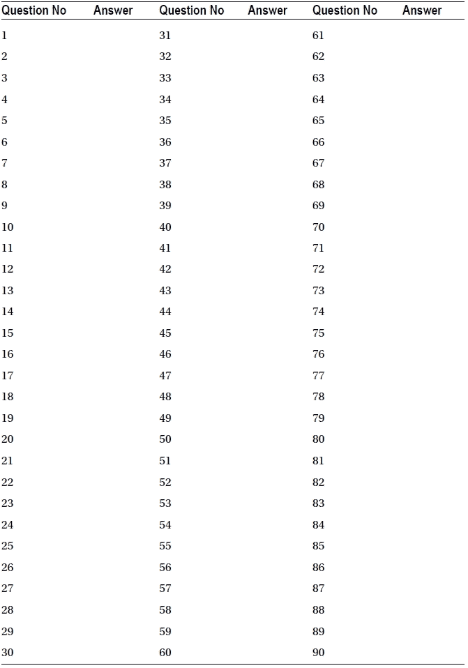

答案与解释

1.  a)   `int i = 012;`

在数字前加 0 会使该数字成为八进制数。012（八进制）的十进制等效值是 10。如果你尝试从 float、long 或 double 类型（分别如选项 b、c 和 d 所示）隐式转换为整数，将会出现编译器错误。

2.  a)   标有注释 `NUM` 的行出现编译器错误，因为 `Number` 无法被实例化

`Number` 是一个抽象类，因此你不能使用 `new` 运算符实例化它。许多类，包括 `Integer`、`Float` 和 `BigDecimal`，都派生自 `Number` 类。

3.  a)   此代码段：This, that, etcetera.!

方法 `StringBuffer replace(int start, int end, String str)` 根据解释此代码段行为的 Javadoc，具有以下行为：“用指定 String 中的字符替换此序列子字符串中的字符。子字符串从指定的 start 开始，一直延伸到索引 end - 1 处的字符，如果不存在这样的字符，则延伸到序列末尾。首先，移除子字符串中的字符，然后在 start 处插入指定的 String。（如有必要，此序列将延长以容纳指定的 String。）”

4.  b)   此程序输出：hello world! null。

调用 `new StringBuffer`(10); 创建一个初始容量为 10 个字符的 `StringBuffer` 对象；当你不断调用像 `append`() 这样的方法时，此容量会增长。在调用 append “hello” 和 “world” 之后，调用 append null 会导致将字符串 “null” 添加到字符串缓冲区（它不会导致 `NullPointerException` 或 `InvalidArgumentException`）。随着 “null” 的追加，字符串缓冲区的容量已增长到 17 个字符。因此，调用 `strBuffer.insert(11, '!');` 成功地将字符 ‘!’ 插入到第 11 个位置，而不是导致 `ArrayIndexOutOfBoundsException`。

5.  b)   此代码将导致抛出 `NullPointerException`。

请注意，当你在需要原始类型值的地方使用包装类型对象时，拆箱可以在表达式中发生。在这种情况下，对于条件运算符（?: 运算符）的条件检查，需要一个原始 `boolean` 值，但提供了一个包装类型对象。因此发生自动拆箱，而引用指向 null。结果，此代码段导致抛出 `NullPointerException`。

6.  a)   Base
          Derived
         DeriDerived

每当一个类被实例化时，其基类的构造函数（层次结构中根节点的构造函数首先执行）会在实例化类的构造函数之前被调用。

7.  `a)   public`
    `d)   abstract`
    `e)   final`

对于外部类，只允许使用 `public`、`abstract` 和 `final` 修饰符；使用 `private`、`protected` 或 `static` 将导致编译器错误。

8.  c)   `private Point() {`
                `this(0, 0);`
        `}`

选项 a) 和 b)：对 `super`() 或 `this`() 的调用应该是构造函数中的第一条语句，因此构造函数中不能同时存在这两个调用。

选项 d)：编译器会检测到的 `Point`() 的递归构造函数调用。

选项 e)：在使用 this 关键字显式调用构造函数时，不能引用实例字段 x。

9.  b)   移除 `Stmt-1` 将使程序可编译，并将输出：Base: Hello Derived。

c)   移除 `Stmt-2` 将使程序可编译，并将输出：Base Derived。

d)   同时移除 `Stmt-1` 和 `Stmt-2` 将使程序可编译，并将输出：Base Derived。


如果你移除 `Stmt`-1，调用 `super`(s) 将会打印 Base: Hello，然后 `Derived` 类的构造函数调用会打印 Derived。同样地，移除 `Stmt-2` 也会产生正确的程序。事实上，如果你同时移除这两个语句，你仍然会得到一个可编译的程序。

10.  d)   `import static abc.org.project.A.MYCONST;`

11.  b)    `import static java.lang.System.out;`        `class StaticImport {`
                    `public static void main(String []args) {`
                            `out.println("hello world");`
                    `}`
         `}`

成员 `out` 是 `System` 类中的一个静态成员；你可以静态导入它并调用其 `println` 方法。请注意，`println` 是一个非静态成员。此外，语句 `import static java.lang.System.out.*;` 会导致编译器错误，因为 `out` 不是一个类（而是一个类型为 `PrintStream` 的静态成员）。

12.  a)   编译器会在语句 #1 处报告一个错误。

语句 #1 会导致编译器错误，因为关键字 `protected` 不允许出现在方法体内部。

13.  d)   该程序将导致一个异常（`ClassCastException`）。

变量 `obj` 的动态类型是 `Base1`，而你试图将其强制转换为 `Base2`。这种转换不被支持，因此会导致异常。

14.  d)   `Outer.Inner inner = new Outer().new Inner();`
15.  c)   该程序运行并打印 10。

内部类可以访问外部类的私有成员。同样地，外部类也可以访问属于内部类的私有变量。

16.  e)   执行时，该程序会打印以下内容：

yes, instance of AnEnum

yes, instance of EnumBase

yes, instance of Enum

枚举可以实现一个接口（但不能继承一个类，也不能作为一个基类）。

每个枚举常量都是其枚举类型的一个对象。枚举自动继承抽象类 `java.util.Enum`。因此，所有三个 `instanceof` 检查都会成功。

17.  a)   `Enum` 可以拥有私有构造函数。

c)   `Enum` 可以拥有公有方法和字段。

d)   `Enum` 可以实现一个接口。

18.  c)   该程序将在语句 #3 处报告一个编译错误。

语句 #1 和 #2 不会引发任何问题；只有对变量 `var` 的访问会产生错误，因为该访问存在歧义（因为该变量在 `base1` 和 `base2` 中都有声明）。

19.  c)   标记有注释 THREE 的行会导致编译器错误。

选项 a) 和 b)：为了使替换成功，替换通配符 `?` 的类型必须是 `DI` 或其某个超类型。

选项 c)：类型 `DDI` 不是 `DI` 的超类型，因此会导致编译器错误。

选项 d)：未提供类型参数，这意味着在表达式 `new C()` 中，C 是一个原始类型。因此，这会产生一个编译器警告，而不是错误。

20.  c)   `class X <T extends DI> { }`

关键字 `extends` 用于指定类型 `T` 的上界；有了这个限制，只有实现了接口 `DI` 的类或接口才能用作 `T` 的替换类型。请注意，`extends` 关键字用于任何基类型——无论基类型是类还是接口。

21.  b)   `class Test extends base1 implements base3, base4 {`

你只能从一个基类继承（因为 Java 不支持多重类继承）。但是，你可以实现多个接口；在这种情况下，实现的接口列表用逗号分隔。

22.  c)   `Factory` 类可能使用 `Singleton` 模式

`Factory` 类按需生成所需类型的对象。因此，可能要求只存在一个 `Factory` 对象；在这种情况下，可以在 `Factory` 类中采用 `Singleton` 模式。

23.  c)   Image

`DAO` 模式将持久化逻辑与其余业务逻辑分离。在此模式中，`TransferObject` 是由需要存储在持久化介质上的对象所扮演的角色。这里，只有 `Image` 类符合 `TransferObject` 的描述。

24.  d)   组合（Composition）

组合也被称为 has-a 关系，而继承被称为 is-a 关系。`Composite` 模式是一种设计模式，并不是 has-a 关系的替代名称。

25.  b)   类 `Test` 与 `ClassC` 是组合关系。

当一个类继承自另一个类时，它们共享 is-a 关系。另一方面，如果一个类使用了另一个类（通过声明另一个类的实例），那么第一个类与所使用的类之间是 has-a 关系。

26.  a)   该类表现出低内聚性。

该类的各个方法表明，该类执行了多种类型的操作，这使得该类缺乏内聚性。

27.  b)   程序打印以下内容：Brazil China India Russia。

对于 `sort()` 方法，第二个参数传递了 `null` 值，这表示应使用元素的“自然顺序”。在这种情况下，`Strings` 的自然顺序会导致字符串按升序排序。请注意，向 `sort()` 方法传递 `null` 不会导致 `NullPointerException`。

28.  b)   `class Q<T> {`
                `T mem;`
                `public Q(T arg) {`
                        `mem = arg;`
                `}`
        `}`

选项 a)：你不能创建类型 `T` 的静态引用。

选项 c) 和 d)：你不能使用 new 运算符实例化类型 `T` 或 `T[]`。

29.  d)   `NavigableSet`

`EnumSet` 是一个专门用于 `enum` 类型的 `Set` 实现类。`HashSet` 是一种利用哈希机制快速检索元素的 `Set` 实现。`AbstractSet` 是所有 `Set` 类的抽象基类。`NavigableSet` 提供了“导航方法”，可以搜索与给定值或值集最接近的匹配项。

30.  b)   `public Object[][] getContents() {`
            `return new Object[][] { { "1", "Uno" }, { "2", "Duo" }, { "3", "Trie" }};`
         `}`

`getContents()` 方法在 `ListResourceBundle` 中声明如下：

```
    protected abstract Object[][] getContents()
    ```

其他三个定义是不正确的重写，会导致编译器错误。

31.  a)   `Iterable<T>`

接口 `Iterable<T>` 声明了这一个方法：

`Iterator<T> iterator();`

这个 `iterator()` 方法返回一个类型为 `Iterator<T>` 的对象。一个类必须实现 `Iterable<T>`，才能将其对象用于 `for-each` 循环中。

32.  b)   使用 java.util.concurrent.ThreadLocalRandom

`java.lang.Math.random()` 对于并发程序来说效率不高。与在并发程序中使用 `Random` 对象相比，使用 `ThreadLocalRandom` 可以减少开销和争用（因此在这种情况下使用此类类型是最佳选择）。

`java.util.RandomAccess` 与随机数生成无关。此接口是随机访问数据结构的基接口，由 `Vector` 和 `ArrayList` 等类实现。`java.lang.ThreadLocal<T>` 类为创建线程局部变量提供支持。

33.  b)   `asList2` 的定义会导致编译器错误。

在 `asList2` 方法定义中，`temp` 被声明为 `ArrayList<?>`。由于模板类型是通配符，你不能向其中放入任何元素（或修改容器）。因此，方法调用 `temp.add(element);` 会导致编译器错误。

34.  e)   运行时，该程序将打印以下内容：`null {} {}`


标记有注释 `ADD_MAP` 和 `ADD_HASHMAP` 的行是使用菱形运算符推断类型参数的有效用法。在标记有注释 `ITERATE` 的行中，`Map` 类型未参数化，因此会产生警告（而非编译错误）。调用 `add()` 方法并传入 `null` 不会导致 `NullPointerException`。该程序运行时，将成功输出 null, {}, {}（null 输出表示向列表中添加了空值，{} 输出表示 `Map` 为空）。

35.  a)   `Base<Number> b = new Base<Number>();`

f)   `Derived<Integer> b = new Derived<Integer>();`

请注意，`Base` 和 `Derived` 之间不存在继承关系。此外，对于泛型类型参数，子类型化不起作用：你不能将派生泛型类型参数赋值给基类型参数。

36.  `a)   Base<? extends Number> b = new Base<Number>();`
    `d)   Derived<? extends Number> b = new Derived<Integer>();`
    `f)   Derived<?> b = new Derived<Integer>();`

当指定 `<? extends Number>` 作为类型时，你可以使用任何派生自 `Number` 的类型（包括 `Number`）；因此，选项 a) 和 d) 是正确的。选项 f) 也是正确的，因为两侧的类名相同，并且 `<?>` 中的 `?` 被替换为 `Integer`，这是允许的。

37.  a)   保存点是当前事务中的一个点，可以从 `Connection.rollback()` 方法引用。

b)   当事务回滚到某个保存点时，该保存点之后所做的所有更改都将被撤销。

`Savepoints` 可以命名或未命名。我们可以通过引用底层数据源生成的 ID 来标识“未命名的保存点”。

`java.sql.Savepoint` 是一个接口（它不是抽象类）。`JDBCSavepoint`、`ODBCSavepoint` 和 `TransactionSavepoint` 类在 `java.sql` 包中不存在。因此，选项 a) 和 b) 是正确的。

38.  b)   语句 #1 和 #3 将编译成功。

`LinkedHashSet` 继承自 `Set`，因此语句 #1 将编译成功。`TreeSet` 继承自 `SortedSet`，因此语句 #3 也将编译成功。

`LinkedHashSet` 继承自 `HashSet`，因此语句 #2 将无法编译。语句 #4 尝试创建 `NavigableSet` 类型的对象，而 `NavigableSet` 是一个接口，因此它也无法编译。

39.  c)   `[3, 5, 10]`

`TreeSet` 是一个有序集合；因此，所有插入的元素都按升序排序。此外，由于 `TreeSet` 是一个 `Set`，它会移除任何重复插入的元素。

40.  a)   `java.text.Format` 是抽象基类，支持格式化区域敏感信息，例如日期、时间和货币。

c)   `java.text.NumberFormat` 派生自 `java.text.Format` 类；它是以区域敏感方式处理数字、货币等的基类。

d)   `java.text.DateFormat` 派生自 `java.text.Format` 类；它是基于区域设置处理日期和时间信息的基类。

类 `java.text.SimpleDateFormat` 允许你为特定区域设置定义自定义模式来处理日期和时间。

41.  b)   语句 #2 和 #3 将编译成功。

由于“菱形”语法，在对象创建语句的右侧指定模板类型是可选的。因此，语句 #3 是正确的。语句 #2 是正确的，因为 `HashMap` 是一个 `Map`。因此，选项 b) 是正确的。

在语句 #1 中，声明类型中参数的顺序与初始化类型中参数的顺序不同。在语句 #4 中，菱形语法用于类型声明中，因此是不正确的（正确的方式是在初始化类型中使用菱形运算符）。

42.  d)   `{3=3, 5=25, 10=10}`

`TreeMap` 是一个 `Map`；值根据键存储，元素根据键排序。选项 c) 是不可能的，因为一个键不能对应两个值。在 `Map` 中，键是唯一的，因此选项 a) 和 b) 是不可能的。选项 e) 也不正确，因为你已经用键 5 覆盖了值 25，而选项 e) 没有捕获到这一点。

43.  `a)   [10, 20]`

方法 `peek()` 从 `Deque` 的头部检索一个元素并返回，但不会移除该元素。因此，对 `Deque` 没有影响。

44.  b)   AtomicInteger

c)   AtomicLong

类 `AtomicInteger` 和 `AtomicLong` 扩展了 `Number` 类。

`AtomicBoolean` 不扩展 `java.lang.Number`。名为 `AtomicFloat` 或 `AtomicDouble` 的类在 `java.util.concurrent.atomic` 包中不存在。

45.  b)   该程序输出如下：false。

由于 `Student` 类没有重写 `equals()` 和 `hashcode()` 方法，`contains()` 方法将无法按预期工作，并输出 false。

46.  a)   `ResourceBundle` 是基类，是包含区域特定对象的资源包的抽象。

d)   `java.util.ListResourceBundle` 定义了 `getKeys()` 方法，该方法返回资源包中包含的键的枚举。

`java.util.ListResourceBundle` 是 `java.util.ResourceBundle` 的一个具体子类，它使用以属性文件形式提供的字符串来管理特定区域设置的资源。扩展 `java.util.ListResourceBundle` 的类必须重写 `getContents()` 方法，该方法的返回类型为 `Object [][]`。

47.  a)   false
          true

由于新创建的对象不属于 `students` 集合，因此对 `contains` 的调用将返回 `false`（请注意，此类中未重写 `equals()` 方法）。对象 `s10` 是 `students` 集合的一部分。因此选项 a) 是正确答案。

48.  a)   Executor 接口声明了一个单一方法 `execute(Runnable command)`，该方法在未来的某个时间执行给定的命令。

b)   Callable 接口声明了一个单一方法 `call()`，该方法计算结果。

c)   Exchanger 类提供了一个“同步点，线程可以在该点配对并交换元素”。

d)   TimeUnit 枚举表示时间持续时间，对于在并发程序中指定时间参数很有用。

选项 a)、b)、c) 和 d)——所有四个选项都是正确的陈述。

49.  d)   它将打印 10, 20, 和 hello。

原始类型 `List` 从 `List<Integer>` 初始化（这会产生一个编译器*警告*而非错误），然后你向原始 `List` 添加一个字符串元素，这是允许的。然后整个列表被迭代以打印每个元素；每个元素都被转换为 `Object` 类型，因此它打印 10, 20, 和 hello。

50.  b)   `Map<String, String> map2 = new IdentityHashMap<>();`

c)   `Map<String, String> map3 = new Hashtable<>();`

类 `IdentityHashMap` 和 `Hashtable` 派生自 `Map` 接口，因此选项 b) 和 c) 中的赋值将无错误地编译。`NavigableMap` 和 `ConcurrentMap` 是派生自 `Map` 接口的*接口*，而接口不能被实例化；因此选项 a) 和 d) 中的赋值将导致编译错误。

51.  b)   运行时，该程序将在执行标记有注释 `REMOVE` 的行时崩溃，并抛出异常 `UnsupportedOperationException`。

`Arrays.asList` 方法返回一个由固定长度数组支持的 `List` 对象。你不能修改此数组返回的 `List` 对象，因此调用诸如 `add()` 或 `remove()` 之类的方法将导致抛出 `UnsupportedOperationException`。

52.  c)   115110

字符串连接运算符的工作方式如下：如果两个操作数都是数字，则执行加法；否则，它通过调用 `toString()` 方法（如果需要）来连接参数。它从左到右计算。因此，程序中的表达式结果为字符串 115110。

53.  a)   11.5511.5


前面解释中指定的规则在此同样适用。不过，这里使用括号改变了计算顺序。因此，`+` 运算符会先计算括号内的数字，得到 11.5511.5。

54.  d)   hell

在第一个 `printf`() 方法中，`%3.4s` 表示要打印字符串的前四个字符。在第二个 `printf`() 方法调用中，`%05d` 表示要打印一个整数，且最少占五位。如果数字位数不足，则会在前面补零。

55.  b)   执行时，程序会打印以下内容：1 + 2 + 3 + 4 = 1234。

字符串连接运算符的工作方式如下：如果两个操作数都是数字，则执行加法；否则，执行字符串连接。运算符从左操作数开始检查。这里，第一个操作数是字符串，因此所有操作数都会被连接。

注意，`parseInt` 不需要捕获 `NumberFormatException`，因为它是一个 `RuntimeException`；因此，缺少 catch 处理程序不会导致编译错误。由于 `parseInt` 方法执行成功，程序不会抛出 `NumberFormatException`。

56.  a)   no:10 and 7
          no:2$s and 1$s

格式说明符字符串 `%$s` 表示要重新排列输入值的顺序。夹在 `%` 和 `$` 符号之间的数字（整数）用于重新排列输入值的顺序；该数字表示要在此处放置哪个输入变量。在 `%2$s` 中，表示要放置第二个参数。类似地，`%1$s` 表示要放置第一个参数。

57.  b)   b
           b
           b

指定的正则表达式（即“`a\\**`”）会匹配以“a”开头，后跟一个或多个“*”的字符串（因为“\\**”表示零个或多个“*”）。因此，当对输入字符串调用 split 时，会得到三个“b”。

第二个参数指定了分割的限制，它控制模式应用的次数。这里限制是 10，但模式只应用了三次，因此在这个程序中没有任何区别。

58.  a)   true
          false
          true

指定的正则表达式期望零个或多个“xx”实例，后跟零个或一个“y”实例，再后跟一个或多个“z”实例。

第一个字符串匹配该正则表达式（一个“xx”实例，零个“y”实例，以及多个“z”实例），因此 `matches`() 返回 `true`。第二个字符串因为只有一个“x”（而不是“xx”）而不匹配正则表达式，因此 `matches`() 返回 `false`。第三个字符串匹配指定的正则表达式（因为有零个“xx”实例，一个“y”实例，以及多个“z”实例），因此 `matches`() 打印 `true`。

59.  b)   OCPJP

表达式“`\b`”匹配单词边界。第一个“`\b`”匹配字符串开头，“`\w+`”匹配 OCPJP，“”匹配空格，“`\b`”匹配第二个单词的开头。因此，它在第一行打印 OCPJP。类似地，“`\b`”匹配第二个单词的开头，“`\w+"` 匹配 2013，“`\D`”匹配空格，“`\b`”匹配第三个单词的开头。因此，程序在第二行打印 2013。然而，对于最后一个单词，“`\b`”匹配第三个单词的开头，“`\w+`”匹配 OCPJP7，但“`\D`”没有匹配到任何内容；因此，第三个单词不会被打印。

60.  c)   Suneetha N.=9876543210, 9898989898: Patil,Pratish

第一个联系人信息与指定的正则表达式不匹配（因为“.”不在“`\w+`”的覆盖范围内）；因此，字符串的第一部分保持不变。字符串的第二部分与指定的正则表达式匹配，因此替换操作会重新排列子字符串。

61.  a)   `System.in` 的类型是 `InputStream`。

e)   `System.out` 和 `System.err` 的类型都是 `PrintStream`。

`System.in` 的类型是 `InputStream`，而 `System.out` 和 `System`.`err` 的类型都是 `PrintStream`。这些是字节流，尽管它们通常用于从控制台读取或向控制台写入字符。

62.  c)   此程序打印以下输出：
          `In AutoCloseableImpl.close()`
          `In CloseableImpl.close()`

实现了 `AutoCloseable` 的类型可以与 try-with-resources 语句一起使用。`Closeable` 接口扩展了 `AutoCloseable`，因此实现了 `Closeable` 的类也可以与 try-with-resources 语句一起使用。

`close`() 方法的调用顺序与 try-with-resources 语句中获取资源的顺序相反。因此，此程序首先调用 `AutoCloseableImpl` 的 `close()` 方法，然后调用 `CloseableImpl` 对象的 `close()` 方法。

63.  c)   编译器会在语句 #2 处报告错误。

这两个指定的异常属于同一层次结构（`FileNotFoundException` 派生自 `IOException`），因此不能在 multi-catch 处理程序块中同时指定这两个异常。

64.  a)   −1

`read()` 方法在到达流末尾（EOS）时返回值 −1，这在此 `while` 循环中进行了检查。

65.  a)   US President [name=Barack Obama, period=2009 to --, term=56th term]
          US President [name=Barack Obama, period=2009 to --, term=56th term]
          静态的 transient 变量在序列化过程中会被保留。

66.  d)   如果一个类被序列化，并且你试图再次序列化它，由于相同的 `serialVersionUID`，JVM 将不会序列化它。

67.  b)   程序将创建文件 `World.txt`，其中包含内容“World!”。

方法调用 `skip(n)` 会跳过 `n` 个字节（即将缓冲区指针移动 `n` 个字节）。在这种情况下，需要跳过 6 个字节，因此在读取和写入文件内容的 `while` 循环中，字符串“Hello”不会被复制。

错误选项的解释：

选项 a)：`skip`() 方法可以在 `read`() 方法之前调用。

选项 c)：不存在名为 `CannotSkipException` 的异常。

选项 d)：只有当传递负值时，`skip`() 方法才会抛出 `IllegalArgumentException`。

68.  c)   此程序打印以下内容：systemprofile。

以下是 `subpath` 方法的描述：`subpath(int beginIndex, int endIndex)` 方法返回一个 `Path` 对象。返回的 `Path` 对象包含从 `beginIndex` 开始到索引 `endIndex` - 1 处的元素。换句话说，`beginIndex` 包含该索引处的名称，而 `endIndex` 处的名称不包含在内。如果 `beginIndex >= 元素数量`，或 `endIndex <= beginIndex`，或 `endIndex > 元素数量`，此方法可能会抛出 `IllegalArgumentException`。

在此程序中，索引从 `WINDOWS` 开始，位于索引 0。给定的 `beginIndex` 是 3，因此子路径是 `systemprofile`，并且不包含 `endIndex` 处的 `value4`。因此得到上述输出。

69.  c)   `C:\WINDOWS\system32\config\systemprofile\Start Menu\Programs`

方法 `normalize`() 会移除路径中的冗余元素，例如 .（表示当前目录的点符号）和 ..（表示父目录的双点符号）。因此，结果路径是 `C:\WINDOWS\system32\config\systemprofile\Start Menu\Programs`。

70.  b)   它打印以下内容：in Derived.finalize。

语句 `Runtime`.`runFinalizersOnExit`(true); 确保在应用程序退出时调用 `finalize` 方法（尽管 `runFinalizersOnExit`() 方法现已弃用）。这里，对象的动态类型是“Derived”，因此在应用程序退出前会调用 `Derived` 类的 `finalize`() 方法。

71.  c)   2


变量 `mem` 初始值为 0。它在 `try` 块中递增 1，并在 `finally` 块中进一步递增至 2。请注意，无论 `try` 块中是否抛出异常，`finally` 块始终会执行。因此，程序将输出 2。

72.  d)   该程序正常完成执行，未产生任何输出或抛出任何异常。

语句 `assert true;` 执行时始终成功。语句 `assert true;` 执行时始终失败。

请记住，断言默认是禁用的，`–ea` 为整个程序启用断言。然而，`-da` 禁用断言，而 `–da:Derived` 指示 JVM 在 `Derived` 类中禁用断言。因此，程序正常完成执行，未产生任何输出或抛出任何异常。

73.  d)   该程序将在标记有注释 `MULTI-CATCH-BLOCK` 的行导致编译器错误，因为 `IOException` 是 `FileNotFoundException` 的基类。

74.  a)   `String userName = null;`
          `char[] password = null;`

`readLine()` 方法返回一个 `String` 对象，而 `readPassword()` 方法返回一个 `char` 数组。

75.  c)   `FilterReader fr = new FilterReader(file);`

`FilterReader` 是一个抽象类，因此无法实例化。

76.  b)   `while( (ch = inputFile.read()) != -1) {`

当文件到达末尾时，`read()` 方法返回 -1。

77.  b)   `RandomAccessFile raf = new RandomAccessFile(srcFile, "rw+");`
        `raf.getChannel();`

c)   `FileInputStream ifr = new FileInputStream(srcFile);`
        `ifr.getChannel();`

`getChannel()` 方法仅受 `RandomAccessFile` 和 `FileInputStream` 类支持。

78.  d)   文件搜索完成！

嗯，`glob` 不支持“`+`”；因此，指定的 `glob` 表达式找不到任何匹配该表达式的文件。

79.  a)   查找文件/目录时，默认模式格式是 `glob`；因此，你无需以“`glob`:”开头来编写搜索模式。

其他三个语句是正确的。

80.  b)   `Locale locale2 = Locale.US;`

`Locale` 类中的 `static public final Locale US` 成员通过表达式 `Locale.US` 访问，如选项 b) 所示。

81.  c)   程序输出如下：2012/02/01。

格式说明符 `%t` 允许格式化日期和时间信息。它以后缀形式接受格式以及日期或时间信息的一部分。格式 `Y` 表示四位数字显示的年份。格式 `m` 表示月份的十进制表示（月份范围为 01 到 12）。格式 `d` 表示月份的日期十进制表示（日期范围为 01 到 31）。

82.  a)   接口 `Closeable` 扩展了 `AutoCloseable`，并定义了一个方法 `close()`。

83.  a)   `public static void main(String []files) {`
                `try (FileReader inputFile`
                            `= new FileReader(new File(files[0]))) {`
                            `//...`
                    `}`
                    `catch(IOException ioe) {}`
        `}`

选项 b) 和 c) 使用了 `finally` 块，这不适用于 try-with-resource 语句。在选项 d) 中，缺少 `catch` 块，这使其错误。

84.  a)   `in start oops`
           `in ctor oops`

你重写了 `start()` 方法，因此 `run()` 方法从未被调用！

85.  a)   重载的 `submit()` 方法在 `ExecutorService` 接口中声明。

`executor` 接口重载了 `submit()` 方法，该方法接受“一个返回值的任务以供执行，并返回一个表示任务待处理结果的 `Future`”。

86.  d)   该程序输出如下：Lock 1 Critical section 1 Lock 2 Critical section 2 Unlock 2 Unlock 1。

在可重入锁中，你可以再次获取同一把锁。但是，你需要释放该锁相同的次数。

87.  d)   该程序将抛出 `IllegalMonitorStateException`。

请注意，在此程序中，你在 `lock1` 变量上调用了 `lock()` 方法，并在 `lock2` 变量上调用了 `unlock()` 方法。因此，在 `lock2.unlock()` 中，你试图在 `Lock` 对象上调用 `lock()` 之前调用 `unlock()`，这会导致抛出 `IllegalMonitorStateException`。

88.  a)   等待使用 ATM 机的人员的确切顺序无法预测。

第二个参数指定了 `semaphore` 对象的公平性策略。但是，`semaphore` 对象有两个许可；因此你无法预测等待人员获得 ATM 访问权限的顺序。

89.  c)   `CyclicBarrier`

当线程可能需要在一个预定义的执行点等待，直到所有其他线程都到达该点时，会使用 `CyclicBarrier`。此构造符合给定的要求。

90.  c)   你不能使用列名来检索这两个值；你需要使用列索引来实现。

附录 C


模拟测试 – 2

本模拟测试中的题目是根据 OCPJP7 考试模式及其标准的要求设计的。请像参加真正的 OCPJP 7 考试一样进行测试。祝你好运。

*时间：* 2 小时 30 分钟                                                                       *题目数量：* 90

1.  **考虑以下程序并预测该程序的行为：**

```
    class Base {
            public void print() {
                    System.out.println("Base:print");
            }
    }

abstract class Test extends Base { //#1
            public static void main(String[] args) {
                    Base obj = new Base();
                    obj.print(); //#2
            }
    }
    ```

a)   在语句 #1 处出现编译器错误“抽象类不能继承自具体类”。

b)   在语句 #2 处出现编译器错误“无法解析对 print 方法的调用”。

c)   程序输出如下：Base:print。

d)   程序将抛出 AbstractClassInstantiationException 运行时异常。

2.  **考虑以下程序并预测输出：**

```
    class  Test {
            final Integer a;  // #1
            public void print(){
                    System.out.println("a = " + a);
            }
            public static void main(String[] args) {
                    Test obj = new Test();
                    obj.print();
            }
    }
    ```

a)   程序将在语句 #1 处报告编译器错误。

b)   程序将导致抛出 `NullPointerException`。

c)   程序将输出如下：a = 0。

d)   程序将输出如下：a = null。

3.  **考虑以下程序并预测输出：**

```
    class  Test {
            int a = 0;
            public static void print(int a) {
                    this.a = a;
                    System.out.println("a = " + this.a);
            }
            public static void main(String[] args) {
                    Test obj = new Test();
                    obj.print(10);
            }
    }
    ```

a)   程序将报告编译器错误。

b)   程序将生成运行时异常。

c)   程序将输出如下：a = 0。

d)   程序将输出如下：a = 10。

4.  **考虑以下程序：**

```
    import java.util.*;

class Format {
            public static void main(String []args) {
                    Formatter formatter = new Formatter();
                    Calendar calendar = Calendar.getInstance(Locale.US);
                    calendar.set(/* year =*/ 2012, /* month = */ Calendar.FEBRUARY,
                     /* date = */ 1);
                    formatter.format("%tY/%<tB/%<td", calendar);
                    System.out.println(formatter);
            }
    }
    ```

以下哪个选项正确描述了此程序的行为？

a)   程序抛出 `MissingFormatArgumentException`。

b)   程序抛出 `UnknownFormatConversionException`。


c)   程序会抛出 `IllegalFormatConversionException`。

d)   程序会输出以下内容：12/February/01。

5.  **考虑以下程序：**

```
    import java.util.*;

public class ResourceBundle_it_IT extends ListResourceBundle {
            public Object[][] getContents() {
                    return contents;
            }
            static final Object[][] contents = {
                    { "1", "Uno" },
                    { "2", "Duo" },
                    { "3", "Trie" },
            };
            public static void main(String args[]) {
                    ResourceBundle resBundle =
                            ResourceBundle.getBundle("ResourceBundle", new Locale("it", "IT", ""));
                    System.out.println(resBundle.getObject(new Integer(1).toString()));
            }
    }
    ```

以下哪个选项正确描述了该程序的行为？

a)   程序会输出以下内容：Uno。

b)   程序会输出以下内容：1。

c)   程序会抛出 `MissingResourceException`。

d)   程序会抛出 `ClassCastException`。

6.  **考虑以下程序：**

```
    import java.util.*;

class SortedOrder {
            public static void main(String []args) {
                    Set<String> set = new TreeSet<String>();
                    set.add("S");
                    set.add("R");
                    Iterator<String> iter = set.iterator();
                    set.add("P");
                    set.add("Q");
                    while(iter.hasNext()) {
                            System.out.print(iter.next() + " ");
                    }
            }
    }
    ```

以下哪个选项正确描述了该程序的行为？

a)   程序会输出以下内容：S R P Q。

b)   程序会输出以下内容：P Q R S。

c)   程序会输出以下内容：S R。

d)   程序会输出以下内容：R S。

e)   程序会抛出 `ConcurrentModificationException`。

7.  **考虑以下程序：**

```
    import java.util.*;
    import java.util.concurrent.*;

class SortedOrder {
            public static void main(String []args) {
                    Set<String> set = new CopyOnWriteArraySet<String>(); // #1
                    set.add("2");
                    set.add("1");
                    Iterator<String> iter = set.iterator();
                    set.add("3");
                    set.add("-1");
                    while(iter.hasNext()) {
                            System.out.print(iter.next() + " ");
                    }
            }
    }
    ```

**以下哪个选项正确描述了该程序的行为？**

a)   程序会输出以下内容：2 1。

b)   程序会输出以下内容：1 2。

c)   程序会输出以下内容：-1 1 2 3。

d)   程序会输出以下内容：2 1 3 -1。

e)   程序会抛出 `ConcurrentModificationException`

f)   程序在语句 #1 处会导致编译错误

8.  **以下哪个语句是错误的？**

a)   接口 `Iterator` <t>声明了以下方法：</t> `boolean hasNext(), T next()` 和 `void remove()`。

b)   接口 `Enumeration` <e>声明了两个方法：</e> `boolean hasMoreElements()` 和 E `nextElement()`。

c)   接口 `Iterable` <t>声明了三个方法：</t> `boolean hasNext(), T next()` 和 `void remove()`。

d)   实现 `Iterable` <t>接口允许一个对象成为</t> `foreach` 语句的目标。

9.  **考虑以下程序：**

```
    import java.io.IOException;
    import java.nio.file.*;
    class javals {
            public static void main(String []args) {
                    Path currPath = Paths.get(".");
                    try (DirectoryStream<Path> javaFiles = Files.newDirectoryStream
                    (currPath, "*.{java}")) {
                            for(Path javaFile : javaFiles) {
                                    System.out.println(javaFile);
                            }
                    } catch (IOException ioe) {
                            System.err.println("IO Error occurred");
                            System.exit(-1);
                    }
            }
    }
    ```

以下哪个选项正确描述了该程序的行为？

a)   程序会抛出 `PatternSyntaxException`。

b)   程序会抛出 `UnsupportedOperationException`。

c)   程序会抛出 `InvalidArgumentException`。

d)   程序会列出当前目录下以 `.java` 后缀结尾的文件。

10. **考虑以下程序：**

```
    class Assert {
            public static void main(String []args) {
                    try {
                            assert false;
                    }
                    catch (RuntimeException re) {
                            System.out.println("In the handler of RuntimeException");
                    }
                    catch (Exception e) {
                            System.out.println("In the handler of Exception");
                    }
                    catch (Error ae) {
                            System.out.println("In the handler of Error");
                    }
                    catch (Throwable t) {
                            System.out.println("In the handler of Throwable");
                    }
            }
    }
    ```

该程序在命令行中按如下方式调用：

```
    java Assert
    ```

以下哪个选项正确描述了该程序的行为？

a)   程序会输出以下内容：In the handler of RuntimeException。

b)   程序会输出以下内容：In the handler of Exception。

c)   程序会输出以下内容：In the handler of Error。

d)   程序会输出以下内容：In the handler of Throwable。

e)   程序因未捕获的异常 `AssertionError` 而崩溃。

f)   程序不产生任何输出并正常终止。

11. **考虑以下程序：**

```
    class GenericCast {
            static <E> E cast(Object item) {                // ERROR1
                    return (E) item;
            }
            public static void main(String []args) {
                    Object o1 = 10;
                    int i = 10;
                    Integer anInteger = 10;

Integer i1 = cast(o1);                  // ERROR2
                    Integer i2 = cast(i);                   // ERROR3
                    Integer i3 = cast(10);                  // ERROR4
                    Integer i4 = cast(anInteger);           // ERROR5

System.out.printf("i1 = %d, i2 = %d, i3 = %d, i4 = %d", i1, i2, i3, i4);
            }
    }
    ```

以下哪个选项正确描述了该程序的行为？

a)   程序会在标记有注释 `ERROR1` 的行导致编译错误。

b)   程序会在标记有注释 `ERROR2` 的行导致编译错误。

c)   程序会在标记有注释 `ERROR3` 的行导致编译错误。

d)   程序会在标记有注释 `ERROR4` 的行导致编译错误。

e)   程序会在标记有注释 `ERROR5` 的行导致编译错误。

f)   执行时，程序会输出以下内容：i1 = 10, i2 = 10, i3 = 10, i4 = 10。

12. **考虑以下程序：**

```
    import java.nio.file.*;
    import java.util.Iterator;


```  
class PathInfo {  
            public static void main(String[] args) {  
                    Path aFilePath = Paths.get("D:\\dir\\file.txt");  
                    Iterator<Path> paths = aFilePath.iterator();  
                    while(paths.hasNext()) {  
                            System.out.print(paths.next() + " ");  
                    }  
            }  
    }  
```  

假设底层文件系统中不存在文件 `D:\dir\file.txt`。以下哪个选项最准确地描述了该程序执行时的行为？

a)   程序抛出 `FileNotFoundException`。

b)   程序抛出 `InvalidPathException`。

c)   程序抛出 `UnsupportedOperationException`。

d)   程序进入无限循环，不断打印“path element: dir”。

e)   程序打印以下内容：dir file.txt。

13.  **考虑以下程序：**

```  
    import java.io.*;  

class Point2D implements Externalizable {  
            private int x, y;  
            public Point2D(int x, int y) {  
                    x = x;  
            }  
            public String toString() {  
                    return "[" + x + ", " + y + "]";  
            }  
            public void writeExternal(ObjectOutput out) throws IOException {  
                    System.out.println("Point " + x + ":" + y);  
            }  
            public void readExternal(ObjectInput in) throws IOException,  
            ClassNotFoundException {  
                    /* 空 */  
            }  
            public static void main(String []args) {  
                    Point2D point = new Point2D(10, 20);  
                    System.out.println(point);  
            }  
    }  
```  

执行该程序时，会打印以下内容：

a)   Point

b)   [10, 0]

c)   [10, 20]

d)   [0, 0]

e)   Point 10:20

14.  **考虑以下程序：**

```  
    import java.util.PriorityQueue;  

class PQueueTest {  
            public static void main(String []args) {  
                    PriorityQueue<Integer> someValues = new PriorityQueue<Integer>();  
                    someValues.add(new Integer(10));  
                    someValues.add(new Integer(15));  
                    someValues.add(new Integer(5));  
                    Integer value;  
                    while ((value = someValues.poll()) != null) {  
                            System.out.print(value + " ");  
                    }  
            }  
    }  
```  

执行该程序时，会打印以下内容：

a)   10 10 10

b)   10 15 5

c)    5 10 15

d)   15 10 5

e)     5 5 5

15.  **考虑以下程序：**

```  
    class Base {}  
    class DeriOne extends Base {}  
    class DeriTwo extends Base {}  

class ArrayStore {  
            public static void main(String []args) {  
                    Base [] baseArr = new DeriOne[3];  
                    baseArr[0] = new DeriOne();  
                    baseArr[2] = new DeriTwo();  
                    System.out.println(baseArr.length);  
            }  
    }  
```  

以下哪个选项正确描述了该程序的行为？

a)   该程序打印以下内容：3。

b)   该程序打印以下内容：2。

c)   该程序抛出 `ArrayStoreException`。

d)   该程序抛出 `ArrayIndexOutOfBoundsException`。

16.  **考虑以下程序：**

```  
    import java.util.*;  

class Task implements Comparable<Task> {  
            int priority;  
            public Task(int val) {  
                    priority = val;  
            }  
            public int compareTo(Task that) {  
                    if(this.priority == that.priority)  
                            return 0;  
                    else if (this.priority > that.priority)  
                            return -1;  
                    else  
                            return 1;  
            }  
            public String toString() {  
                    return new Integer(priority).toString();  
            }  
    }  

class Test {  
            public static void main(String []args) {  
                    PriorityQueue<Task> tasks = new PriorityQueue<Task>();  
                    tasks.add(new Task(10));  
                    tasks.add(new Task(15));  
                    tasks.add(new Task(5));  
                    Task task;  
                    while ( (task = tasks.poll()) != null) {  
                            System.out.print(task + " ");  
                    }  
            }  
    }  
```  

执行该程序时，会打印以下内容：

a)   10 10 10

b)   10 15 5

c)   5 10 15

d)   15 10 5

e)   5 5 5

17.  **考虑以下程序：**

```  
    import java.util.ArrayList;  

class RemoveTest {  
            public static void main(String []args) {  
                    ArrayList<Integer> list = new ArrayList<Integer>();  
                    list.add(new Integer(2));  
                    list.add(1);  
                    list.add(5);  
                    list.remove(2);         // 移除  
                    System.out.println(list);  
            }  
    }  
```  

以下哪个选项正确描述了该程序的行为？

a)   执行时，该程序打印以下内容：[2, , 5]。

b)   执行时，该程序打印以下内容：[2, 1]。

c)   执行时，该程序打印以下内容：[1, 5]。

d)   该程序在注释为 `REMOVE` 的行导致编译错误。

e)   该程序在注释为 `REMOVE` 的行导致 `NoSuchElementException`。

18.  **考虑以下程序：**

```  
    class Replace {  
            public static void main(String []args) {  
                    String talk = "Pick a little, talk a little, pick a little, talk a  
                     little, cheep cheep cheep, talk a lot, pick a little more";  
                    String eat = talk.replaceAll("talk","eat").replace("cheep", "burp");  
                    System.out.println(eat);  
            }  
    }  
```  

执行该程序时，会打印以下内容：

a)   Pick a little, talk a little, pick a little, talk a little, cheep cheep cheep, talk a lot, pick a little more.

b)   Pick a little, eat a little, pick a little, eat a little, cheep cheep cheep, eat a lot, pick a little more.

c)   Pick a little, eat a little, pick a little, eat a little, burp cheep cheep, eat a lot, pick a little more.

d)   Pick a little, eat a little, pick a little, eat a little, burp burp burp, eat a lot, pick a little more.

19.  **考虑以下程序：**

```  
    import java.util.*;  
    import java.util.concurrent.*;  

class SetTest {  
            public static void main(String []args) {  
                    List list = Arrays.asList(10, 5, 10, 20);  
                    System.out.println(list);  
                    System.out.println(new HashSet(list));  
                    System.out.println(new TreeSet(list));  
                    System.out.println(new ConcurrentSkipListSet(list));  
            }  
    }  
```  

该程序打印以下内容：

```  
    a)   [10, 5, 10, 20]  
            [20, 5, 10]  
            [5, 10, 20]  
            [5, 10, 20]  

b)      [10, 5, 10, 20]  
            [5, 10, 20]  
            [5, 10, 20]  
            [20, 5, 10]  

c)      [5, 10, 20]  
            [5, 10, 20]  
            [5, 10, 20]  
            [5, 10, 20]  

d)      [10, 5, 10, 20]  
            [20, 5, 10]  
            [5, 10, 20]  
            [20, 5, 10]  
    ```

20.  **考虑以下程序：**

```  
    import java.util.regex.Pattern;  
```  


```java
class Split {
            public static void main(String []args) {
                    String date = "10-01-2012"; // 2012 年 1 月 10 日，格式为 dd-mm-yyyy
                    String [] dateParts = date.split("-");
                    System.out.print("使用 String.split 方法: ");
                    for(String part : dateParts) {
                            System.out.print(part + " ");
                    }
                    System.out.print("\n 使用正则表达式模式: ");
                    Pattern datePattern = Pattern.compile("-");
                    dateParts = datePattern.split(date);
                    for(String part : dateParts) {
                            System.out.print(part + " ");
                    }
            }
    }
    ```

该程序输出如下：

a)   使用 `String.split` 方法：10-01-2012

使用 `regex` 模式：10 01 2012

b)   使用 `String.split` 方法：10 01 2012

使用 `regex` 模式：10 01 2012

c)   使用 `String.split` 方法：10-01-2012

使用 `regex` 模式：10-01-2012

d)   使用 `String.split` 方法：

使用 `regex` 模式：10 01 2012

e)   使用 `String.split` 方法：10 01 2012

使用 `regex` 模式：

f)   使用 `String.split` 方法：

使用 `regex` 模式：

21.  **考虑以下程序：**

```java
    import java.util.ArrayList;

class TypeCheck {
            public static void main(String []args) {
                    Class c1 = new ArrayList<String>().getClass();          // 第 A 行
                    Class c2 = ArrayList.class;                             // 第 B 行
                    System.out.println(c1 == c2);
            }
    }
    ```

以下哪个选项正确描述了该程序的行为？

a)   程序将在注释为`第 A 行`的行出现编译错误。

b)   程序将在注释为`第 B 行`的行出现编译错误。

c)   执行时，程序输出如下：true。

d)   执行时，程序输出如下：false。

22.  **考虑以下程序：**

```java
    class Waiter extends Thread {
            public static void main(String[] args) {
                    new Waiter().start();
            }
            public void run() {
                    try {
                            System.out.println("开始等待");
                            wait(1000);
                            System.out.println("等待结束，返回");
                    }
                    catch(InterruptedException e) {
                            System.out.println("捕获到 InterruptedException 异常");
                    }
                    catch(Exception e) {
                            System.out.println("捕获到 Exception 异常");
                    }
            }
    }
    ```

执行时，该程序输出如下：

a)  开始等待
              等待结束，返回

b)  开始等待
              捕获到 InterruptedException 异常

c)  开始等待
              捕获到 Exception 异常

d)  打印"开始等待"后，程序进入无限等待并死锁。

23.  **考虑以下程序：**

```java
    import java.util.ArrayList;

class ArrayListUse {
            static ArrayList<Integer> doSomething(ArrayList<Integer> values) {
                    values.add(new Integer(10));
                    ArrayList<Integer> tempList = new ArrayList<Integer>(values);
                    tempList.add(new Integer(15));
                    return tempList;
            }
            public static void main(String []args) {
                    ArrayList<Integer> allValues = doSomething(new ArrayList<Integer>());
                    System.out.println(allValues);
            }
    }
    ```

该程序输出如下：

a)   []

b)   [10]

c)   [15]

d)   [10, 15]

24.  **考虑以下程序：**

```java
    class Overload {
            private Overload(Object o) {
                    System.out.println("Object");
            }
            private Overload(double [] arr) {
                    System.out.println("double []");
            }
            private Overload() {
                    System.out.println("void");
            }
            public static void main(String[]args) {
                    new Overload(null);     // 标记行
            }
    }
    ```

以下哪个选项正确描述了该程序的行为？

a)   在注释为`标记行`的行因重载歧义而抛出编译错误。

b)   执行时，程序输出如下：Object。

c)   执行时，程序输出如下：double []。

d)   执行时，程序输出如下：void。

25.  **考虑以下程序：**

```java
    class SuperClass {
            SuperClass() {
                    foo();
            }
            public void foo(){
                    System.out.println("在 SuperClass.foo()中");
            }
    }

class SubClass extends SuperClass {
            public SubClass() {
                    member = "HI";
            }
            public void foo() {
                    System.out.println("在 Derived.foo()中: " + member.toLowerCase());
            }
            private String member;
            public static void main(String[] args) {
                    SuperClass reference = new SubClass();
                    reference.foo();
            }
    }
    ```

该程序输出如下：

a)   在 `SuperClass.foo()` 中

b)      在 `Derived.foo()` 中：hi

c)   在 `SuperClass.foo()` 中
                  在 `Derived.foo()` 中：hi

d)   该程序抛出 `NullPointerException` 异常。

26.  **考虑以下程序：**

```java
    class BaseClass {
            private void foo() {
                    System.out.println("在 BaseClass.foo()中");
            }
            void bar() {
                    System.out.println("在 BaseClass.bar()中");
            }
            public static void main(String[] args) {
                        BaseClass po = new DerivedClass();
                        po.foo();   // BASE_FOO_CALL
                        po.bar();
            }
    }

class DerivedClass extends BaseClass {
            void foo() {
                    System.out.println("在 Derived.foo()中");
            }
            void bar() {
                    System.out.println("在 Derived.bar()中");
            }
    }
    ```

以下哪个选项正确描述了该程序的行为？

a)     程序在注释为`BASE_FOO_CALL`的行出现编译错误。

b)   该程序输出如下：

在 `BaseClass.foo()` 中

在 `BaseClass.bar()` 中

c)   该程序输出如下：

在 `BaseClass.foo()` 中

在 `Derived.bar()` 中

d)   该程序输出如下：

在 `Derived.foo()` 中

在 `Derived.bar()` 中

27.  **以下哪个选项能正确地从控制台读取一行字符串？**

```
    a)  BufferedReader br = new BufferedReader(System.in);
        String str = br.readLine();
    b)  BufferedReader br = new BufferedReader(new InputStreamReader(System.in));
        String str = br.readLine();
    c)  InputStreamReader isr = new InputStreamReader (new BufferedReader(System.in));
        String str = isr.readLine();
    d)  String str = System.in.readLine();
    e)  String str;
        System.in.scanf(str);
    ```

28.  **考虑以下程序：**

```java
    import java.util.Scanner;

class AutoCloseableTest {
            public static void main(String []args) {
                    try (Scanner consoleScanner = new Scanner(System.in)) {
                            consoleScanner.close(); // 关闭
                            consoleScanner.close();
                    }
            }
    }
    ```

以下哪个陈述是正确的？

a)   该程序正常终止，不会抛出任何异常。


b)   该程序会抛出 `IllegalStateException`。

c)   该程序会抛出 `IOException`。

d)   该程序会抛出 `AlreadyClosedException`。

e)   该程序会在标记有注释 `CLOSE` 的行产生编译错误。

29.  **考虑以下程序：**

```
    import java.io.*;
    class ExceptionTest {
            public static void thrower() throws Exception {
                    try {
                            throw new IOException();
                    } finally {
                            throw new FileNotFoundException();
                    }
            }
            public static void main(String []args) {
                    try {
                            thrower();
                    } catch(Throwable throwable) {
                            System.out.println(throwable);
                    }
            }
    }
    ```

执行时，该程序会打印以下内容：

a)   java.io.IOException

b)   java`.io.FileNotFoundException`

c)   java.lang.Exception

d)   java.lang.Throwable

30.  **考虑以下程序：**

```
    // mock 包中的类 PQR
    package mock;

public class PQR {
            public static void  foo() {
                    System.out.println("foo");
            }
    }

// mock 包中的类 XYZ
    package mock;
    import static mock.*;

public class XYZ {
            public static PQR pqr;
    }

// 类 StatImport
    import static mock.XYZ.*;

class StatImport {
            public static void main(String []args) {
                    // STMT
            }
    }
    ```

当用标记有注释 `STMT` 的行替换后，以下哪个语句可以无错误地编译？

a)   `foo()`;

b)   `pqr.foo()`;

c)   `PQR.foo()`;

d)   `XYZ.pqr.foo`();

31.  **以下哪项不是使用互斥锁进行线程同步时出现的问题？**

a)     死锁

b)   锁饥饿

c)     类型擦除

d)   活锁

32.  **假设一个线程获取了对象 obj 上的锁；同一线程再次尝试获取同一对象 obj 上的锁。会发生什么？**

a)   如果线程再次尝试获取锁，将导致抛出 `IllegalMonitorStateException`。

b)   如果线程再次尝试获取锁，将导致抛出 `AlreadyLockAcquiredException`。

c)   线程再次获取 `obj` 上的锁是可以的，并且这样的尝试会成功。

d)   如果线程再次尝试获取锁，将导致死锁。

33.  **考虑以下程序：**

```
    class NullAccess {
            public static void main(String []args) {
                    String str = null;
                    System.out.println(str.valueOf(10));
            }
    }
    ```

以下哪个语句正确描述了该程序的行为？

a)   该程序会产生编译错误。

b)   该程序会抛出 `NullPointerException`。

c)   该程序会在控制台打印 10。

d)   该程序会在控制台打印 null。

34.  **`java.io` 包中有两种流：字符流（即派生自 `Reader` 和 `Writer` 接口的流）和字节流（即派生自 `InputStream` 和 `OutputStream` 的流）。关于这两种流之间的区别，以下哪个语句是正确的？**

a)   在字符流中，数据以字节为单位处理；在字节流中，数据以 Unicode 字符为单位处理。

b)   字符流适用于读取或写入可执行文件、图像文件以及诸如 `.zip`、`.class`、`.obj` 和 `.exe` 等低级文件格式的文件。

c)   字节流适用于读取或写入基于文本的 I/O，例如文档和文本、XML 以及 HTML 文件。

d)   字节流用于处理人类不可读的二进制数据；字符流用于处理人类可读的字符。


35.  **以下哪个接口是空的（即，不声明任何方法的标记接口）？**

a)   `java.lang.AutoCloseable` 接口

b)   `java.util.concurrent.Callable<T>` 接口

c)   `java.lang.Cloneable` 接口

d)   `java.lang.Comparator<T>` 接口

36.  **以下哪些修饰符不能同时用于一个类？（从给定选项中选择两个。）**

a)     `final`

b)   `public`

c)     `strictfp`

d)   `abstract`

37.  **考虑以下代码片段：**

```
    String str = "A.B.C!";
    System.out.println(str.replaceAll(".", ",").replace("!", "?"));
    ```

执行时，该代码片段将输出以下内容：

a)   A,B,C!

b)   A,B,C?

c)   ,,,,,,

d)   A.B.C?

38.  **考虑以下程序，并选择描述其输出的正确选项：**

```
    import java.util.concurrent.atomic.AtomicInteger;

class Increment {
            public static void main(String []args) {
                    AtomicInteger i = new AtomicInteger(0);
                    increment(i);
                    System.out.println(i);
            }
            static void increment(AtomicInteger atomicInt){
                    atomicInt.incrementAndGet();
            }
    }
    ```

a)   0

b)   1

c)     该程序抛出 `UnsafeIncrementException` 异常。

d)   该程序抛出 `NonThreadContextException` 异常。

39.  **考虑以下程序，并选择描述其输出的正确选项：**

```
    import java.util.concurrent.atomic.AtomicInteger;

class NullInstanceof {
            public static void main(String []args) {
                    if(null instanceof Object)
                            System.out.println("null is instance of Object");
                    if(null instanceof AtomicInteger)
                            System.out.println("null is instance of AtomicInteger");
            }
    }
    ```

a)   该程序输出以下内容：

null is instance of Object

b)   该程序输出以下内容：

null is instance of Object

null is instance of AtomicInteger

c)   该程序正常执行并终止，不在控制台输出任何内容。

d)   该程序抛出 `NullPointerException` 异常。

e)   该程序将导致编译器错误。

40.  **线程优先级的范围是多少？线程的默认优先级值是多少？**

a)   线程优先级的范围是 1 到 5；默认线程优先级是 3。

b)   线程优先级的范围是 1 到 10；默认线程优先级是 6。

c)   线程优先级的范围是 1 到 10；默认线程优先级是 5。

d)   所有线程的优先级均为 1；因此，默认线程优先级也是 1。

e)   线程是使用协作式多线程方法实现的，而不是抢占式多线程；因此，在 Java 中它们没有任何优先级。

41.  **以下哪个接口不继承自 `java.util.Collection<E>` 接口？**

a)   Set`<E>`

b)   Queue`<E>`

c)   List`<E>`

d)   Map`<K, V>`

42.  **哪些修饰符可以应用于类中的数据成员？（选择所有适用的选项。）**

a)   synchronized

b)   native

c)   abstract

d)   transient

e)   strictfp

43.  **以下哪些来自 Object 类的方法可以被重写？（选择所有适用的选项。）**

a)   `finalize()` 方法

b)   `clone()` 方法

c)   `getClass()` 方法

d)   `notify()` 方法

e)   `wait()` 方法

44.  **考虑以下程序并预测输出：**

```
    class MyThread extends Thread {
            public void run() {
                    System.out.println("In run method; thread name is: "
                            + Thread.currentThread().getName());
            }
            public static void main(String args[])  {
                    Thread myThread = new MyThread();
                    myThread.run(); //#1
                    System.out.println("In main method; thread name is: "
                             +Thread.currentThread().getName());
            }
    }
    ```

a)     该程序在语句 #1 处导致编译器错误。

b)   该程序导致运行时异常。

c)   该程序输出以下内容：

In run method; thread name is: main

In main method; thread name is: main

d)   该程序输出：

In the `run` method; the thread name is: thread-0

In the `main` method; the thread name is: `main`

45.  **考虑以下程序并预测输出：**

```
    class MyThread extends Thread {
            public void run() {
                    System.out.println("In run method; thread name is: " + Thread.
                    currentThread().getName());
            }
            public static void main(String args[])  {
                    Thread myThread = new MyThread();
                    myThread.start();
                    myThread.start();  //#1
            }
    }
    ```

a)   该程序在语句 #1 处导致编译器错误。

b)   该程序导致抛出 `IllegalThreadStateException` 异常。

c)   该程序输出以下内容：

In the run method; thread name is: thread-0

In the main method; thread name is: thread-0

d)   该程序输出以下内容：

In the run method; thread name is: thread-0

46.  **考虑以下程序并预测输出：**

```
    class MyThread extends Thread {
            public void run() {
                    try {
                            this.join();
                    } catch (InterruptedException e) {
                            e.printStackTrace();
                    }
                    System.out.println("In run method; thread name is: " + Thread.
                    currentThread().getName());
            }
            public static void main(String args[])  {
                    Thread myThread = new MyThread();
                    myThread.start();
            }
    }
    ```

a)   该程序导致编译器错误。

b)   该程序导致抛出 `IllegalThreadStateException` 异常。

c)   该程序输出以下内容：

In the run method; thread name is: thread-0

d)   该程序将永远不会终止。

47.  **关于 `Thread` 和 `Runnable`，以下哪些陈述是正确的？（选择所有适用的选项。）**

a)   `Thread` 是一个抽象类。

b)   `Thread` 为 `run()` 方法提供了默认实现。

c)   `Thread` 是一个抽象类，它继承了抽象基类 `Runnable`。

d)   `Runnable` 是一个抽象类。

48.  **以下哪些状态不是合法的线程状态？（选择所有适用的选项。）**

a)   NEW

b)   EXECUTING

c)   WAITING

d)   TERMINATED

e)   RUNNABLE

49.  **以下哪个构造函数不是 `Thread` 类的有效构造函数？**

a)   `Thread()`

b)   `Thread(String name)`

c)   `Thread(Runnable target, Object obj)`

d)   `Thread(Runnable target, String name)`

e)   `Thread(ThreadGroup group, String name)`

50.  **考虑以下程序并选择最佳选项：**

```
    class MyThread extends Thread {
            public void run() {
                    System.out.print("Burp! ");
            }
            public static void main(String args[]) throws InterruptedException  {
                    Thread myThread = new MyThread();
                    myThread.start();
                    System.out.print ("Eat! ");
                    myThread.join();
                    System.out.print ("Run! ");
            }
    }
    ```

a)   执行时，它总是输出以下内容：Eat! Burp! Run!

b)   执行时，它输出以下之一：Eat! Burp! Run! 或 Burp! Eat! Run!

c)   执行时，它输出以下之一：Eat! Burp! Run!；Burp! Eat! Run!；或 Run! Eat! Burp!

d)   执行时，它输出以下之一：Burp! Eat! Run! 或 Burp! Run! Eat!

51.  **考虑以下程序并选择正确答案：**


```
    class MyThread extends Thread {
            public MyThread(String name) {
                    this.setName(name);
            }
            public void run(){
                    try {
                            sleep(100);
                    } catch (InterruptedException e) {
                            e.printStackTrace();
                    }
                    play();
            }
            private void play() {
                    System.out.print(getName());
                    System.out.print(getName());
            }
            public static void main(String args[]) throws InterruptedException  {
                    Thread tableThread = new MyThread("Table");
                    Thread tennisThread = new MyThread("Tennis");
                    tableThread.start();
                    tennisThread.start();
            }
    }
    ```

a)   该程序会抛出 `IllegalMonitorStateException` 异常。

b)   该程序始终会打印以下内容：Tennis Tennis Table Table。

c)   该程序始终会打印以下内容：Table Table Tennis Tennis。

d)   该程序的输出无法预测，取决于线程调度。

52.  **考虑以下程序并选择正确的选项：**

```
    class MyThread extends Thread {
            public void run(){
                    System.out.println("Running");
            }
            public static void main(String args[]) throws InterruptedException  {
                    Runnable r = new MyThread();      //#1
                    Thread myThread = new Thread(r);  //#2
                    myThread.start();
            }
    }
    ```

a)   程序会在语句 #1 处导致编译错误。

b)   程序会在语句 #2 处导致编译错误。

c)   程序编译无误，并在控制台打印“Running”。

d)   程序编译无误，但不在控制台输出任何内容。

53.  **以下程序的输出是什么？**

```
    class EnumTest {
            enum Directions { North, East, West, South };
            enum Cards { Spade, Hearts, Club, Diamond };
            public static void main(String []args) {
                    System.out.println("equals: " + Directions.East.equals(Cards.Hearts));
                    System.out.println("Ordinals: " +
                            (Directions.East.ordinal() == Cards.Hearts.ordinal()));
            }
    }
    ```

a)   equals: false

Ordinals: false

b)   equals: true

Ordinals: false

c)   equals: false

Ordinals: true

d)   equals: true

Ordinals: true

54.  **考虑以下代码并选择最佳选项：**

```
    import java.util.concurrent.atomic.AtomicInteger;

class AtomicVariableTest {
            private static AtomicInteger counter = new AtomicInteger(0);
            static class Decrementer extends Thread {
                    public void run() {
                            counter.decrementAndGet(); // #1
                    }
            }
            static class Incrementer extends Thread {
                    public void run() {
                            counter.incrementAndGet(); // #2
                    }
            }
            public static void main(String []args) {
                    for(int i = 0; i < 5; i++) {
                            new Incrementer().start();
                            new Decrementer().start();
                    }
                    System.out.println(counter);
            }
    }
    ```

a)   该程序始终会打印 0。

b)   该程序会打印 −5 到 5 之间的任意值。

c)   如果将 `Incrementer` 和 `Decrementer` 类中的 `run()` 方法设为同步，该程序将始终打印 0。

d)   程序会在语句 #1 和 #2 处报告编译错误。

55.  **以下哪个选项是不正确的？**

a)   可以从 `Lock` 对象获取 `Condition` 对象。


b) `Executor` 是一个接口，仅声明了一个方法，即 `void execute(Runnable)`。

c) 使用只有一个资源的信号量类似于使用锁。

d) `CountDownLatch` 允许每个线程逐步完成其分配的任务。

56. **以下哪个选项是不正确的？**

a) `Runnable` 对象不返回结果；`Callable` 对象返回结果。

b) `Runnable` 对象不能抛出受检异常；`Callable` 对象可以抛出异常。

c) `Runnable` 接口自 Java 1.0 以来就已存在；`Callable` 仅在 Java 1.5 中引入。

d) 实现 `Runnable` 或 `Callable` 的类的实例可能由另一个线程执行。

e) `Callable` 可以由 `ExecutorService` 执行，但 `Runnable` 不能由 `ExecutorService` 执行。

57. **当你实现 `ThreadFactory` 接口时，你会定义以下哪个方法？**

a) `Thread newThread(Runnable r)`

b) `Thread createThread(Runnable r)`

c) `Thread newThreadInstance(Runnable r)`

d) `Thread getThread(Runnable r)`

58. **以下哪个陈述是不正确的？**

a) 你可以使用 ExecutorService 来计算中等规模的数学方程。

b) 你可以使用 ExecutorService 来实现网络爬虫。

c) 你可以使用 Fork/Join 框架来解决汉诺塔问题。

d) 你可以使用 Fork/Join 框架来实现欧几里得算法以寻找最大公约数。

e) Fork/Join 框架适用于涉及大量用户交互和 I/O 操作的任务。

59. **对于以下枚举定义，以下哪个选项会在控制台打印值 2？**

```
    enum Pets { Cat, Dog, Parrot, Chameleon }; 
    ```

a) `System.out.print(Pets.Parrot.ordinal());`

b) `System.out.print(Pets.Parrot);`

c) `System.out.print(Pets.indexAt("Parrot"));`

d) `System.out.print(Pets.Parrot.value());`

e) `System.out.print(Pets.Parrot.getInteger());`

60. **考虑以下程序并选择正确的选项：**

```
    import java.util.Locale;

class Test {
            public static void main(String []args) {
                    Locale locale1 = new Locale("en");  //#1
                    Locale locale2 = new Locale("en", "in");  //#2
                    Locale locale3 = new Locale("th", "TH", "TH"); //#3
                    Locale locale4 = new Locale(locale3); //#4
                    System.out.println(locale1 + " " + locale2 + " " + locale3 + "
                     " + locale4);
            }
    }
    ```

a) 该程序将打印以下内容：en en_IN th_TH_TH_#u-nu-thai th_TH_TH_#u-nu-thai。

b) 该程序将打印以下内容：en en_IN th_TH_TH_#u-nu-thai（随后抛出运行时异常）。

c) 该程序在语句 #1 处导致编译错误。

d) 该程序在语句 #2 处导致编译错误。

e) 该程序在语句 #3 处导致编译错误。

f) 该程序在语句 #4 处导致编译错误。

61. **考虑以下程序并预测输出：**

```
    import java.util.Locale;

class LocaleTest {
            public static void main(String []args) {
                    Locale locale = new Locale("navi", "pandora");  //#1
                    System.out.println(locale);
            }
    }
    ```

a) 该程序在语句 #1 处导致编译错误。

b) 该程序导致 `NoSuchLocaleException` 运行时异常。

c) 该程序导致 `MissingResourceException` 运行时异常。

d) 该程序导致 `IllegalArgumentException` 运行时异常。

e) 该程序打印以下内容：navi_PANDORA。

62. **以下哪个类不提供工厂方法来实例化该类？**

a) `AtomicInteger`

b) `DateFormat`

c) `NumberFormat`

d) `Calendar`

63. **关于 `NumberFormat` 类中的 `parse()` 和 `format()` 方法，以下哪些选项是正确的（选择两项）：**


a) `parse()` 方法用于读取以 `String` 形式提供的数字，并尝试将其转换为 `Number`。

b) `format()` 方法用于根据 `NumberFormat` 对象中设置的值来打印数值。

c) `parse()` 方法用于根据 `NumberFormat` 对象中设置的值来打印数值。

d) `format()` 方法用于读取以 `String` 形式提供的数字，并尝试将其转换为 `Number`。

64.  **考虑以下程序：**

`String dateFormat = "d '('E')' MMM, YYYY"; // 假设今天的日期是 2012 年 10 月 28 日`
    `System.out.printf("%s", new SimpleDateFormat(dateFormat).format(new Date()));`

这段代码的输出是：

a) 28 (44) Oct, 2012

b) 28 (Sun) Oct, 2012

c) 28 ‘(Sunday)’ Oct, 2012

d) 28 (7) Oct, 2012

65.  **关于 JDBC 架构中的驱动程序管理器，以下哪个选项是不正确的？**

a) 驱动程序管理器维护一个可用数据源及其驱动程序的列表。

b) 驱动程序管理器选择合适的驱动程序与相应的 DBMS 进行通信。

c) 驱动程序管理器确保事务的原子性属性。

d) 驱动程序管理器管理多个连接到各自数据源的并发驱动程序。

66.  **以下哪个语句是不正确的？**

a) 当你需要向数据库发送不带任何参数的 SQL 语句时，需要使用 `Statement`。

b) `PreparedStatement` 表示一个预编译的 SQL 语句。

c) `PreparedStatement` 可以处理 IN 和 OUT 参数。

d) `CallableStatement` 用于执行存储过程。

67.  **你需要指定 URL 来建立与 MySQL 数据库的连接。以下哪个是正确的？**

a) `String url = "jdbc:mysql://localhost:3306/";`

b) `String url = "jdbc:mysql:localhost:3306";`

c) `String url = "jdbc//mysql//localhost//3306/";`

d) `String url = "jdbc/mysql/localhost/3306/";`

68.  **以下哪个语句是实例化 `Statement` 对象的正确方式：**

a) `Statement statement = connection.getStatement();`

b) `Statement statement = connection.createStatement();`

c) `Statement statement = connection.newStatement();`

d) `Statement statement = connection.getStatementInstance();`

69.  **考虑以下代码片段：**

```
    try(ResultSet resultSet = statement.executeQuery("SELECT * FROM contact")){
            //语句 #1
            resultSet.updateString("firstName", "John");
            resultSet.updateString("lastName", "K.");
            resultSet.updateString("email", "john@abc.com");
            resultSet.updateString("phoneNo", "+19753186420");
            //语句 #2
    ...
    }
    ```

假设 `resultSet` 和 `Statement` 是合法的实例。关于成功插入新行的 `语句 #1` 和 `语句 #2`，以下哪个语句是正确的？

a) 仅将 `语句 #1` 替换为 `resultSet.moveToInsertRow()` 即可使程序工作。

b) 仅将 `语句 #1` 替换为 `resultSet.insertRow()` 即可使程序工作。

c) 将 `语句 #1` 替换为 `resultSet.moveToInsertRow()` 并将 `语句 #2` 替换为 `resultSet.insertRow()` 将使程序工作。

d) 将 `语句 #1` 替换为 `resultSet.insertRow()` 并将 `语句 #2` 替换为 `resultSet.moveToInsertRow()` 将使程序工作。

70.  **关于 `ResultSet`，以下哪个语句是正确的？**

a) 在 `ResultSet` 实例上调用 `absolute(1)` 等同于调用 `first()`，调用 `absolute(-1)` 等同于调用 `last()`。

b) 在 `ResultSet` 实例上调用 `absolute(0)` 等同于调用 `first()`，调用 `absolute(-1)` 等同于调用 `last()`。

c) 在 `ResultSet` 实例上调用 `absolute(-1)` 等同于调用 `first()`，调用 `absolute(0)` 等同于调用 `last()`。

d) 在 `ResultSet` 实例上调用 `absolute(1)` 等同于调用 `first()`，调用 `absolute(0)` 等同于调用 `last()`。

71.  **关于嵌套类，以下哪个语句是不正确的？**

a) 外部类无需声明嵌套类的对象即可访问嵌套类的私有成员。

b) 静态嵌套类可以访问外部类的静态成员。

c) 静态嵌套类可以声明为 abstract 或 final。

d) 静态嵌套类可以继承另一个类，或者被用作基类。

72.  **以下哪个 JDK 类没有实现 `Singleton` 模式？**

a) `java.lang` 包中的 `Runtime`。

b) `java.awt` 包中的 `Toolkit`。

c) `java.awt` 包中的 `Desktop`。

d) `java.util` 包中的 `Locale`。

73.  **在具有多个 `DAO` 对象和多个持久化机制（即数据源）的 `DAO` 模式实现中，以下哪个选项在此上下文中是正确的？**

a) 你不能使用 `DAO` 模式同时实现多个 `DAO` 对象和多个数据源。

b) 你需要实现 `Observer` 模式来管理上下文的复杂性。

c) 你需要使用抽象工厂模式来管理上下文的复杂性。

d) 你需要实现 `DAO` 模式的多个实例来处理上下文的复杂性。

74.  **考虑以下程序并预测输出：**

```
    import java.nio.file.*;

class PathInfo {
            public static void main(String[] args) {
                    // 假设当前目录是 "D:\workspace\ch14-test"
                    Path testFilePath = Paths.get(".\\Test");
                    System.out.println("file name:" + testFilePath.getFileName());
                    System.out.println("absolute path:" + testFilePath.toAbsolutePath());
                    System.out.println("Normalized path:" + testFilePath.normalize());
            }
    }
    ```

a) file name:Test
     absolute path:D:\workspace\ch14-test\.\Test
     Normalized path:Test

b) file name:Test
     absolute path:D:\workspace\ch14-test\Test
     Normalized path:Test

c) file name:Test
     absolute path:D:\workspace\ch14-test\.\Test
     Normalized path:D:\workspace\ch14-test\.\Test

d) file name:Test
     absolute path:D:\workspace\ch14-test\.\Test
     Normalized path:D:\workspace\ch14-test\Test

75.  **考虑以下程序：**

```
    import java.io.*;

class Read {
            public static void main(String []args) throws IOException {
                    BufferedReader br = new BufferedReader(new FileReader("names.txt"));
                    System.out.println(br.readLine());
                    br.mark(100);   // MARK
                    System.out.println(br.readLine());
                    br.reset();     // RESET
                    System.out.println(br.readLine());
            }
    }
    ```

假设 `names.txt` 存在于当前目录中，文件打开成功，并且 `br` 指向一个有效的对象。names.txt 的内容如下：

olivea

emma

margaret

emily

以下哪个选项正确描述了此程序的行为？

a) 此程序打印以下内容：

olivea

emma

margaret

b) 此程序打印以下内容：

olivea

emma

olivea

c) 此程序打印以下内容：

olivea

emma

emma

d) 此程序在 `MARK` 行抛出 `IllegalArgumentException`。

e) 此程序在 `RESET` 行抛出 `CannotResetToMarkPositionException`。

76.  **考虑以下程序并预测输出：**

```
    import java.text.DateFormat;
    import java.util.*;


```java
class Test {
            public static void main(String[] args) {
                    DateFormat df = DateFormat.getDateInstance(DateFormat.LONG, Locale.US);
                    Calendar c = Calendar.getInstance();
                    c.set(Calendar.YEAR, 2012);
                    c.set(Calendar.MONTH, 12);
                    c.set(Calendar.DAY_OF_MONTH, 1);
                    System.out.println(df.format(c.getTime()));
            }
    }
    ```

a)   程序将产生运行时异常。

b)   程序将产生编译错误。

c)   程序将输出：December 1, 2012。

d)   程序将输出：January 1, 2013。

77.  **考虑以下程序并预测输出：**

```java
    class Test implements Runnable {
            public void run() {
                    System.out.println(Thread.currentThread().getName());
            }
            public static void main(String arg[]) {
                    Thread thread = new Thread(new Test());
                    thread.run();
                    thread.run();
                    thread.start();
            }
    }
    ```

a)   main

main

Thread-0

b)   Thread-0

main

Thread-1

c)   main

Thread-0

Thread-1

d)   Thread-0

Thread-1

Thread-2

78.  **考虑以下程序并预测输出：**

```java
    class Test {
            Integer I;
            int i;
            public Test(int i) {
                    this.i = I + i;
                    System.out.println(this.i);
            }
            public static void main(String args[]) {
                    Integer I = new Integer(1);
                    Test test = new Test(I);
            }
    }
    ```

a)   程序将输出：2。

b)   程序将输出：1。

c)   程序将报告编译错误。

d)   程序将报告运行时异常。

79.  **考虑以下程序并预测输出：**

```java
    class Base {
            public void print() {
                    System.out.println("Base");
            }
    }

class Derived extends Base {
            public void print() {
                    System.out.println("Derived");
            }
    }

class Test {
            public static void main(String args[]) {
                    Base obj1 = new Derived();
                    Base obj2 = (Base)obj1;
                    obj1.print();
                    obj2.print();
            }
    }
    ```

a)     Derived

Derived

b)   Base

Derived

c)     Derived

Base

d)     Base

Base

80.  **考虑以下程序并预测输出：**

```java
    class Test {
            public static void main(String args[]) {
                    String test = "I am preparing for OCPJP";
                    String[] tokens = test.split("\\S");
                    System.out.println(tokens.length);
            }
    }
    ```

a)   0

b)   5

c)   12

d)   16

81.  **考虑以下程序并预测输出：**

```java
    class Test {
             public void print(Integer i){
                     System.out.println("Integer");
             }
             public void print(int i){
                     System.out.println("int");
             }
             public void print(long i){
                     System.out.println("long");
             }
            public static void main(String args[]) {
                    Test test = new Test();
                    test.print(10);
            }
    }
    ```

a)   程序导致编译错误（“重载歧义”）。

b)   long

c)   Integer

d)   int

82.  **考虑以下程序，并选择一个正确的选项来替换 `Stmt #1`，使其编译无错误：**

```java
    class Phone {
            public enum State {ONCALL, IDLE, WAITING}
    }

class Test {
            public static void main(String args[]) throws InterruptedException {
                    //Stmt #1
            }
    }
    ```

a)   `Phone.State state = Phone.State.ONCALL;`

b)   `State state = Phone.ONCALL;`

c)   `State state = State.ONCALL;`

d)   `State state = ONCALL;`


83.  **考虑以下声明并选择正确的选项：**

```
    abstract class abstClass{
            public void print1();
            final void print2(){};
            public abstract final void print3();
            public abstract static void print4();
    }
    ```

a)   方法 `print1()`, `print2()` 和 `print3()` 将无法编译。

b)   方法 `print1()`, `print3()` 和 `print4()` 将无法编译。

c)   方法 `print3()` 和 `print4()` 将无法编译。

d)   方法 `print1()` 和 `print3()` 将无法编译。

84.  **考虑以下类定义：**

```
    abstract class Base {
            public abstract Number getValue();
    }
    ```

以下哪两个选项是正确的继承 `Base` 类的具体类？

```
    a)   class Deri extends Base {
              protected Number getValue() {
                      return new Integer(10);
              }
        }
    ```

```
    b)    class Deri extends Base {
              public Integer getValue() {
                      return new Integer(10);
              }
        }
    ```

```
    c)      class Deri extends Base {
              public Float getValue(float flt) {
                      return new Float(flt);
              }
        }
    ```

```
    d)    class Deri extends Base {
              public java.util.concurrent.atomic.AtomicInteger getValue() {
                      return new java.util.concurrent.atomic.AtomicInteger(10);
              }
        }
    ```

85.  **以下哪个选项是正确的？**

a)   抽象类必须将其所有方法声明为抽象方法。

b)   抽象类必须至少包含一个抽象方法。

c)   如果一个方法被声明为抽象方法，那么它的类必须被声明为抽象类。

d)   在抽象类中，所有非抽象方法都是 final 的。

86.  **考虑以下程序：**

```
    import java.util.*;

class DequeTest {
            public static void main(String []args) {
                    Deque<String> deque = new ArrayDeque<String>(2);
                    deque.addFirst("one ");
                    deque.addFirst("two ");
                    deque.addFirst("three ");
                    System.out.print(deque.pollLast());
                    System.out.print(deque.pollLast());
                    System.out.print(deque.pollLast());
            }
    }
    ```

该程序执行时输出什么？

a)   one two three

b)   three two one

c)   one one one

d)   three three three

87.  **以下哪个语句是不正确的？**

a)   switch 可以与枚举（`enums`）一起使用。

b)   switch 可以与 `string` 类型一起使用。

c)   switch 可以与 `floating point` 类型一起使用。

d)   switch 可以与 `byte, char, short` 或 `int` 类型一起使用。

e)   switch 可以与 `Byte, Character, Short` 或 `Integer` 包装类型一起使用。

88.  **考虑以下程序并预测其输出：**

```
    class Test {
             public static void main(String []args) {
                    String str = null;

switch(str) {  // #1
                            case "null":
                                    System.out.println("null string"); // #2
                                    break;
                    }
             }
    }
    ```

a)   该程序在 `语句` #1 处导致编译器错误。

b)   该程序在 `语句` #2 处导致编译器错误。

c)   该程序导致抛出 `NullPointerException`。

d)   该程序输出以下内容：null string。

89.  **以下哪个接口没有扩展 `RowSet` 接口？**

a)   `JdbcRowSet`

b)   `CachedRowSet`

c)   `WebRowSet`

d)   `TraversalRowSet`

e)   `JoinRowSet`

90.  **以下哪两个类定义在** java.util.concurrent.atomic **包中？**

a)   AtomicBoolean

b)   AtomicDouble

c)   AtomicReference<V>

d)   AtomicString

e)   AtomicObject<V>

答题卡

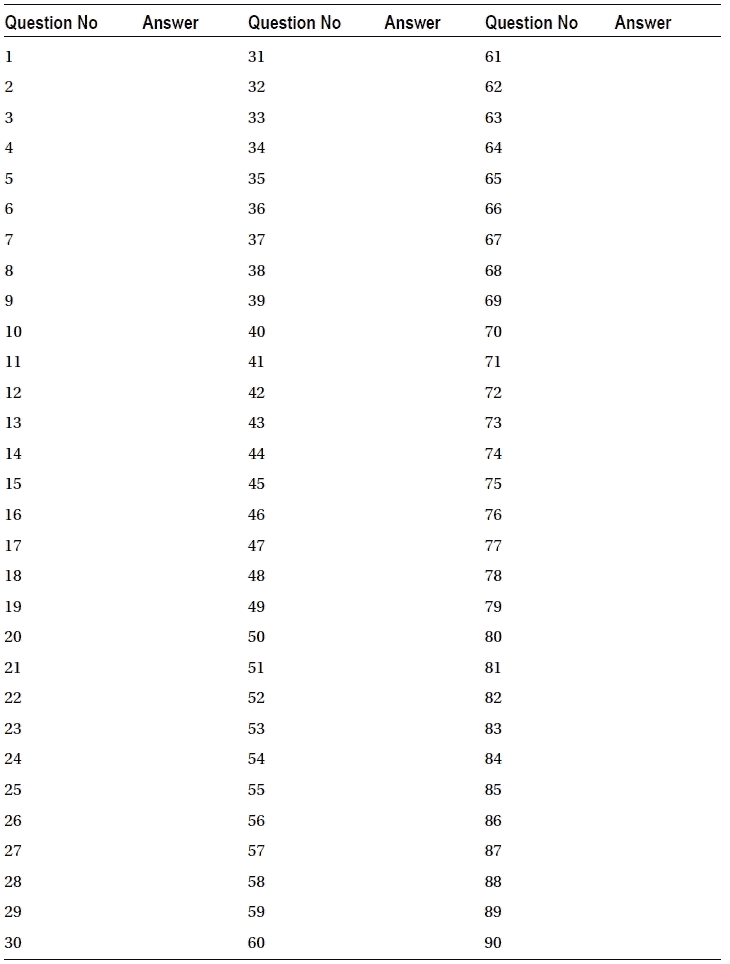

答案与解释

1.  c)      程序输出以下内容：Base:print。

抽象类可以继承具体类（尽管这种继承通常意义不大）。此外，抽象类可以拥有静态方法。由于无需创建类的对象即可调用该类中的静态方法，因此可以调用定义在抽象类中的 `main()` 方法。

2.  a)   该程序将在语句 #1 处报告编译器错误。

每个 final 变量都必须被初始化。如果 final 变量在变量声明时未被初始化（称为空白 final），则必须在类的所有构造函数中对其进行初始化。由于该类中的 final 变量未被初始化，代码会导致编译器错误。

3.  a)   该程序将报告编译器错误。

关键字 `this` 不能在静态方法中使用，因此程序将无法编译。

4.  d)      程序输出以下内容：12/February/01。

格式字符串中的 `<` 符号支持相对索引，你可以用它重用前一个格式说明符匹配的参数。显式传递参数的等效示例如下：

```
    formatter.format("%tY/%tB/%td", calendar, calendar, calendar);
    ```

该程序通过重用传递给前一个格式说明符的参数使用了简写形式：

```
    formatter.format("%tY/%<tB/%<td", calendar);
    ```

5.  a)   该程序输出以下内容：Uno。

该程序正确扩展了 `ListResourceBundle` 并为区域设置 `it_IT` 定义了资源包。

`getObject()` 方法接受 `String` 作为参数；该方法返回匹配键的值。表达式 `new Integer(1).toString()` 等同于提供键“`1`”，因此程序输出 Uno。

6.  e)      程序抛出 `ConcurrentModificationException`。

来自 `TreeSet` 的文档：“此类 `iterator` 方法返回的迭代器是 *fail-fast* 的：如果在创建迭代器之后的任何时间修改集合，除非通过迭代器自身的 `remove` 方法，否则迭代器将抛出 `ConcurrentModificationException`。”

该程序使用较早的迭代器通过 `add`() 方法修改了底层的 `TreeSet` 容器对象。因此，该程序抛出 `ConcurrentModificationException`。

7.  a)   程序输出以下内容：2 1。

由于迭代器是在添加元素“2”和“1”时使用快照实例创建的，因此程序输出 2 和 1。请注意，`CopyOnWriteArraySet` 不会按排序顺序存储元素。此外，使用诸如 `add`() 之类的方法修改非线程安全的容器（如 `TreeSet`）并使用旧的迭代器将抛出 `ConcurrentModificationException`。然而，`CopyOnWriteArraySet` 是线程安全的，旨在供多个线程并发使用，因此不会抛出此异常。

8.  c)      接口 `Iterable<T>` 声明了三个方法：boolean `hasNext(), T next()` 和 void `remove()`。

接口 `Iterable<T>` 只声明了一个方法 `Iterator<T> iterator()`，因此选项 c) 中的语句是错误的。其他语句是正确的。

9.  d)      该程序列出当前目录中以 `.java` 结尾的文件

路径“.”指定当前目录。glob 模式“`*.{java}"` 匹配后缀为 `.java` 的文件名。

10.  f)      该程序不产生任何输出并正常终止。

由于断言默认是禁用的，程序不会引发 `AssertionError`，因此程序不产生任何输出并正常终止。如果通过在命令行传递 `–ea` 来调用程序，它将打印“In the handler of Error”（因为程序会抛出 `AssertionError`）。

11.  f)      执行时，该程序将输出以下内容：i1 = 10, i2 = 10, i3 = 10, i4 = 10。


这是用于在类型之间进行转换的泛型方法 `cast` 的正确实现。请注意，在 `cast` 方法的定义中，你会收到一个“未检查的转换”警告（而非错误），因为这里执行了从 `Object` 到类型 `E` 的不安全显式转换。

12.  e)      程序输出如下：dir file.txt。

`path` 对象中的名称元素是基于分隔符来识别的。注意：遍历 `Path` 对象的名称元素实际上并不要求对应的文件/目录必须存在，因此不会抛出任何异常。

13.  d)      [0, 0]

在 `Point2D` 的构造函数中，语句 `x = x;` 重新赋值了传入的参数，并未赋值 `Point2D` 中的成员 `x`。字段 `y` 未被赋值，因此其值为 0。请注意，你实现了 `Externalizable` 接口以支持序列化；该程序使用了 `toString()` 方法，这与对象序列化/持久化无关。

14.  c)      5 10 15

`PriorityQueue` 根据其“自然顺序”对队列中的元素进行优先级排序。对于 `integers`，自然顺序是升序，因此输出如上。注意，`poll()` 方法会检索并移除队列的头部元素（如果存在），如果队列为空则返回 null。

15.  c)      该程序抛出 ArrayStoreException。

变量 `baseArr` 的类型是 `Base[]`，它指向一个类型为 `DeriOne` 的数组。然而，在语句 `baseArr[2] = new DeriTwo()` 中，一个 `DeriTwo` 类型的对象被赋值给了 `DeriOne` 类型，而这两者没有父子继承关系（它们只有一个共同的父类 `Base`）。因此，这个赋值操作导致了 `ArrayStoreException`。

16.  d)      15 10 5

`Task` 类实现了 `Comparable<Task>`，该接口规定了如何比较其元素。`PriorityQueue` 方法通过调用 `compareTo()` 方法来对队列中的元素进行优先级排序。如果当前 `Task` 对象的优先级大于被比较的 `Task` 对象，`compareTo()` 方法返回 -1。因此，`PriorityQueue` 中的元素按降序被检索。

17.  b)      执行时，该程序输出如下：[2, 1]。

`ArrayList` 中的 `remove` 方法会移除列表中*指定位置*的元素，并将列表中后续的所有元素向左移动。

18.  d)      捡一点，吃一点，捡一点，吃一点，嗝嗝嗝，吃很多，再捡一点。

`replaceAll()` 和 `replace()` 方法都会替换给定字符串中所有出现的子串。它们之间的区别在于，`replaceAll()` 将 `regex` 作为第一个参数，将 `replacement` 字符串作为第二个参数。`replace()` 方法则将 `CharSequence` 作为两个参数（注意，`String` 实现了 `CharSequence` 接口）。

19.  a)    [10, 5, 10, 20]

[20, 5, 10]

[5, 10, 20]

[5, 10, 20]

列表是无序的。`HashSets` 是无序的，并保留唯一元素。`TreeSets` 是有序的，并保留唯一元素。`ConcurrentSkipListSets` 是有序的，并保留唯一元素。

20.  b)      使用 String.split 方法：10 01 2012

使用正则表达式模式：10 01 2012

使用 `str.split(regex)` 得到的结果与 `Pattern.compile(regex).split(str)` 相同。

21.  c)      执行时，该程序输出如下：true。

通过类型*擦除*，泛型类型的详细信息在程序编译时丢失。因此，在运行时，`ArrayList<String>` 实例和原始类型 `ArrayList` 的类型是相同的。

22.  c)      开始等待

捕获到异常

方法 `wait()` 在没有获取锁的情况下被调用，因此程序将导致 `IllegalMonitorStateException`。该异常会在 `catch` 块中被捕获（针对 `Exception`），因此输出如上。

23.  d)      [10, 15]

在这个程序中，引用 `allValues` 被传递给 `doSomething()` 方法。在这个容器中，添加了值为 10 的元素。随后，通过复制*当前*引用的元素创建了一个新容器，因此值 10 也被复制到了新容器中。由于在现有元素 10 之外又添加了元素 15，并且返回了该容器的引用，程序输出 [10, 15]。

24.  c)      执行时，该程序输出如下：double []。

重载解析会匹配到最具体的重载。当传递参数 null 时，有两个候选方法：`Overload(Object)` 和 `Overload(double[])`，在这两者中，`Overload(double[])` 是最具体的重载，因此编译器解析为调用该方法。

25.  d)      该程序抛出 `NullPointerException`。

在这个程序中，`SuperClass` 的构造函数调用了在派生类中被重写的 `foo()` 方法。因此，由于创建的是 `SubClass` 对象，对 `SuperClass` 构造函数的调用将导致调用 `SubClass.foo()` 方法。

当创建派生类对象时，首先调用基类构造函数，*然后*再调用派生类构造函数。请注意，成员变量仅在派生类构造函数中初始化。因此，当基类构造函数执行时，派生类构造函数尚未将成员变量初始化为“HI”。所以该程序会导致 `NullReferenceException`。

26.  c)    该程序输出如下：

在 BaseClass.foo() 中

在 Derived.bar() 中

由于私有方法对其他任何类（包括其派生类）都不可见，因此它不能被重写。

27.  b)     `BufferedReader br = new BufferedReader(new InputStreamReader(System.in));`
              `String str = br.readLine();`

这是从控制台读取一行字符串的正确方式：将 `System.in` 引用传递给 `InputStreamReader`，再将返回的引用传递给 `BufferedReader`。通过 `BufferedReader` 引用，你可以调用 `readLine()` 方法从控制台读取字符串。

28.  a)   该程序正常终止，没有抛出任何异常。

try-with-resources 语句在内部展开为在 `finally` 块中调用 `close()` 方法。如果资源在 `try` 块中被显式关闭，那么再次调用 `close()` 不会有任何效果。根据 `AutoCloseable` 接口中 `close()` 方法的描述：“关闭此流并释放与之关联的所有系统资源。如果流已经关闭，则调用此方法无效。”

29.  b)      `java.io.FileNotFoundException`

如果 `try` 块和 `finally` 块都抛出异常，则 `try` 块抛出的异常将被忽略。因此，`thrower()` 方法抛出了 `FileNotFoundException`。变量 `throwable` 的动态类型是 `FileNotFoundException`，所以程序打印了该类型名称。

30.  b)      pqr.foo();

在这个程序中，成员 `pqr` 是静态导入的。因此，可以通过 `pqr.foo()` 的方式来访问 `foo()` 方法。注意，`foo()` 本身并未被静态导入，因此不能在此程序中直接调用。

31.  c)      类型擦除。

死锁、锁饥饿和活锁是使用互斥锁进行线程同步时出现的问题。类型擦除是与泛型相关的概念，指泛型类型信息在编译后丢失。

32.  c)      线程再次获取 `obj` 上的锁是允许的，并且这样的尝试会成功。

Java 锁是可重入的：一个 Java 线程如果已经获取了锁，可以再次获取它，并且这样的尝试会成功。在这种情况下，不会抛出异常，也不会发生死锁。

33.  c)      该程序将在控制台打印 10。


`String` 中的 `valueOf(int)` 方法是一个静态方法，它返回作为参数传入的整数值的 `String` 表示形式。由于调用静态方法不需要解引用调用它的引用变量，因此该程序不会抛出 `NullPointerException`。

34.  d)      字节流用于处理不可读的二进制数据；字符流用于处理人类可读的字符。

在字符流中，数据以 Unicode 字符为单位进行处理，而在字节流中，数据以字节为单位进行处理。字节流适用于读取或写入可执行文件、图像文件以及诸如 `.zip`、`.class`、`.obj` 和 `.exe` 等低级文件格式的文件。字符流适用于读取或写入基于文本的 I/O，例如文档和文本、XML 以及 HTML 文件。

35.  c)      `java.lang.Cloneable` 接口

`AutoCloseable` 接口声明了 `close`() 方法。`Callable` 声明了 `call`() 方法。`Comparator` <t>接口声明了</t> `compare()` 和 `equals()` 方法。

根据 `clone`() 方法的文档：“按照*惯例*，实现此接口的类应重写 Object.`clone` 方法。请注意，此接口并*不*包含 `clone` 方法。”

36.  a)   final 和 d) abstract

一个类不能同时是 final（意味着它不能被任何其他类继承）和 abstract（意味着它可以被其他类继承）。

37.  c)      `,,,,,,`

`String` 中的 `replaceAll`() 方法将*正则表达式*作为第一个参数。由于字符“.”匹配*任意*字符，因此字符串 `str` 中的所有字符都被替换为逗号，即替换字符串。在替换后的字符串中，没有匹配的“`!`”字符，因此 `replace`() 方法在此代码段中无效。

38.  b)      `1`

尽管调用 `atomicInt.incrementAndGet();` 的返回值被忽略了，但该方法改变了通过引用变量 `atomicInt` 传递的整数值，因此更改后的值会在 `main`() 方法中打印出来。请注意，`AtomicInteger` 可以在线程或非线程上下文中使用（尽管在单线程程序中使用它没有任何实际用途）。

39.  c)      该程序正常执行并终止，不在控制台打印任何输出。

使用 `instanceof` 运算符检查 null 并不是编译器错误。但是，如果为 `instanceof` 运算符传递了 null，它将返回 `false`。由于两个条件检查都失败，程序不会在控制台打印任何输出。

40.  c)      线程优先级的范围是 1 到 10；默认线程优先级是 5。

线程优先级的范围是 1 到 10，其中 10 是最高优先级。默认情况下，线程的优先级是 5。你可以使用 `Thread` 类中的 `getPriority`() 和 `setPriority`() 方法来获取或设置线程的优先级。

41.  d)      `Map<K, V>`

除了 `Map` 接口（它将键映射到值）之外，其他三个接口都表示元素的集合，并且派生自 `Collection` 接口。

42.  d)      `transient`

其他修饰符只能应用于方法，而不能应用于字段。transient 修饰符用于序列化上下文中：当对象被序列化时，被标记为 transient 的数据成员将不会是序列化对象的一部分。

43.  a)   `finalize`() 方法和 b) `clone`() 方法。

`finalize`() 和 `clone`() 方法可以被重写。`getClass()`、`notify()` 和 `wait()` 方法是 final 方法，因此不能被重写。

44.  c)      程序打印以下内容：

在 run 方法中；线程名称为：main

在 main 方法中；线程名称为：main

调用线程的正确方式是在 `Thread` 对象上调用 `start`() 方法。如果你直接调用 `run()` 方法，该方法将像任何其他方法一样运行（换句话说，它将在同一个线程中顺序执行，而不会作为单独的线程运行）。


45.  b)      程序会抛出 `IllegalThreadStateException`

如果在一个线程对象上两次调用 `start`() 方法，将会导致抛出 `IllegalThreadStateException`。

46.  d)      程序将永远不会终止。

调用 `this.join()` 会导致无限等待，因为线程正在等待自身终止。

47.  b)      `Thread` 为 `run()` 方法提供了默认实现。

`Thread` 是一个实现了 `Runnable` 接口的具体类。`Thread` 类也为 `run()` 方法提供了默认实现。

48.  b)      `EXECUTING`

一个线程可以处于以下状态之一（如 `java.lang.Thread.State` 枚举中所定义）：NEW、`RUNNABLE`、`BLOCKED`、`WAITING`、`TIMED_WAITING` 和 `TERMINATED`。

49.  c)      `Thread(Runnable target, Object obj)`

其他构造函数都是有效的 `Thread` 构造函数。

50.  b)      执行时，它会打印以下内容之一：Eat! Burp! Run! 或 Burp! Eat! Run!

如果线程 `myThread` 在调用 `start`() 后立即被调度执行，它将打印 “Burp! Eat! Run!”；否则将打印 “Eat! Burp! Run!”。由于 `main`() 方法中调用了 `join`() 方法，输出 “Run!” 将始终最后执行。

51.  d)      该程序的输出无法预测；它取决于线程调度。

由于此程序中的线程未同步，因此无法确定其输出。根据线程的调度方式，它甚至可能生成诸如 Table Tennis Tennis Table 之类的输出。

52.  c)      程序将编译无误，并在控制台打印 “Running”。

类 `Thread` 实现了 `Runnable` 接口，因此语句 #1 中的赋值是有效的。此外，你可以通过将 `Runnable` 引用传递给 `Thread` 构造函数来创建新的线程对象，因此语句 #2 也是有效的。因此，程序将编译无误，并在控制台打印 “Running”。

53.  c)      `equals: false`

`Ordinals: true`

`equals`() 方法仅在枚举常量相同时才返回 true。在这种情况下，枚举常量属于不同的枚举，因此 `equals`() 方法返回 `false`。然而，这些枚举常量的序数值是相等的，因为两者都是各自枚举中的第二个元素。

54.  a)   计数器的最终值将始终为 0。

你使用了 `AtomicInteger`，它提供了一组 `atomic` 方法，例如 `incrementAndGet`() 和 `decrementAndGet`()。因此，计数器的最终值将始终为 0。然而，根据线程调度，中间计数器值可能在 -5 到 +5 之间，但计数器的最终值将始终为 0。因此，线程之间不需要同步，尽管它们访问/修改了一个公共变量。

55.  d)      `CountDownLatch` 允许每个线程逐步完成其分配的任务。

`CountDownLatch` 允许线程等待倒计时完成。实际上是 `Phaser` 允许每个线程逐步完成其分配的任务。其他三个陈述是正确的。

56.  e)      一个 Callable 可以被 `ExecutorService` 执行，但一个 `Runnable` 不能被 `ExecutorService` 执行。

`Runnable` 对象也可以被 `ExecutorService` 执行。其他陈述是正确的。

57.  a)   `Thread newThread(Runnable r)`

`ThreadFactory` 接口只定义了一个方法：Thread `newThread`(Runnable r)。在使用此接口实现新的线程工厂时，你必须定义此方法。

58.  e)      Fork/Join 框架适用于涉及大量用户交互和 I/O 操作的任务。

你可以将 Fork/Join 框架用于计算密集型任务，这些任务自然可以分解为更小的子任务并对子任务执行计算。当任务涉及大量用户交互或 I/O 操作时，Fork/Join 框架并不适用，因为它不符合该框架的适用场景。


59.  a)   `System.out.print(Pets.Parrot.ordinal());`

选项 a) `ordinal` 方法会打印枚举常量在枚举中的位置。

选项 b) 调用 `print(Pets.Parrot);` 会在控制台打印字符串 "Parrot"。

选项 c)、d) 和 e) `Enum` 中没有名为 `indexAt()`、`value()` 或 `getInteger()` 的方法。

60.  f)      该程序在 #4 处会导致编译器错误。

`Locale` 类支持三个构造函数，分别用于语句 #1、#2 和 #3；但是，`Locale` 类中没有接受另一个 `Locale` 对象作为参数的构造函数，因此编译器会在语句 #4 处报错。

61.  e)      程序会打印以下内容：navi_PANDORA。

使用构造函数 `Locale(String language, String country)` 创建 `Locale` 对象时，可以传递任何 `String` 值；仅仅尝试创建一个 `Locale` 对象不会抛出异常（除非传递了 `null` 字符串，这可能会引发 `NullPointerException`）。

`Locale` 类的 `toString()` 方法返回一个 `Locale` 对象的字符串表示形式，其中包含语言、国家、变体等信息。

62.  a)   `AtomicInteger`

`DateFormat` 类提供了诸如 `getDateInstance()` 和 `getTimeInstance()` 之类的方法，`NumberFormat` 提供了诸如 `getInstance()` 和 `getNumberInstance()` 之类的方法，而 `Calendar` 提供了 `getInstance()` 方法，这些都是工厂方法。`AtomicInteger` 类不支持任何工厂方法。（实际上，它没有任何静态方法！）

63.  a)  `parse()` 方法用于读取以 `String` 形式提供的数字，并尝试将其转换为 `Number`。

b)  `format()` 方法用于根据 `NumberFormat` 对象中设置的值来打印数值。

`parse()` 方法用于从包含数值的 `String` 对象创建一个 `Number` 对象，而 `format()` 方法用于将数值转换为 `String` 对象。

64.  b)      `28 (Sun) Oct, 2012`

相关字母及其含义：

```
    d   月份中的天数
    E   星期中的天数名称
    M   年份中的月份
    Y   年份
    ```

调用 `new Date()` 对象会为当前日期创建一个 `Date` 对象。在日期格式字符串 “`d '('E')' MMM, YYYY`” 中，左括号和右括号被放在单引号内（即 ‘(`'E'`)’），以确保它们不被视为格式说明符字符，因此单引号不会出现在输出本身中。

65.  c)      驱动程序管理器确保事务的原子性属性。
66.  c)      `PreparedStatement` 可以处理 IN 和 OUT 参数。

`PreparedStatement` 只能处理 `IN` 参数；`CallableStatement` 可以处理 `IN`、`OUT` 和 `INOUT` 参数。

67.  a)   `String url = "jdbc:mysql://localhost:3306/";`
68.  b)      `Statement statement = connection.createStatement();`
69.  c)      将 `Stmt #1` 替换为 `resultSet.moveToInsertRow();`，并将 `Stmt #2` 替换为 `resultSet.insertRow();` 将使程序正常工作。

你需要调用 `moveToInsertRow()` 方法来插入新行（此方法准备结果集以创建新行）。一旦行被更新，你需要调用 `insertRow()` 将该行插入结果集和数据库。

70.  a)   在 `ResultSet` 实例上调用 `absolute(1)` 等同于调用 `first()`，而调用 `absolute(-1)` 等同于调用 `last()`。
71.  a)   外部类可以访问嵌套类的私有成员，而无需声明嵌套类的对象。

外部类只能通过声明嵌套类的对象来访问嵌套类的私有成员。

72.  d)      `Locale` 位于 `java.util` 包中

`Locale` 类有三个公共构造函数，因此它没有实现单例模式。其他三个类实现了单例模式。

73.  c)      你需要使用抽象工厂模式来管理上下文的复杂性。

使用抽象工厂模式，你可以使用适用的 `DAO` 对象创建适当的数据源实例。

74.  a)   `file name:Test`

`absolute path:D:\workspace\ch14-test\.\Test`

`Normalized path:Test`

绝对路径会添加从根目录开始的路径；但是，它不会规范化路径。因此，“`.\`” 会保留在结果路径中。另一方面，`normalize()` 方法会规范化路径，但不会使其成为绝对路径。

75.  c)      该程序会打印以下内容：

`olivea`

`emma`

`emma`

`BufferedReader` 中的 `void mark(int limit)` 方法标记当前位置，以便将流重置到标记位置。参数 limit 指定在保留标记的同时可以读取的字符数。该程序在读取 “`olivea`” 后标记位置，因此在读取 “`emma`” 后，当重置标记并再次读取该行时，它会再次读取 “`emma`”。

76.  d)      它会打印以下内容：January 1, 2013。

月份索引从 0 开始；因此，如果你给月份索引 12，它会将年份增加 1，并从一月开始计数。

77.  a)     `main`
    `main`
    `Thread-0`

直接调用 `run()` 不会创建新线程。正确的方法是调用 `start()` 方法，该方法会依次在新线程中调用 `run()` 方法。

78.  d)      该程序将报告一个运行时异常。

成员变量 `I` 未初始化，并在构造函数中被访问，这会导致 `NullPointerException`。`main()` 方法声明了一个名为 `I` 的局部变量，其作用域仅限于 `main()` 方法。

79.  a)   `Derived`
               `Derived`

实例变量 `obj2` 的动态类型保持不变（即 `Derived`）。因此，当在 `obj2` 上调用 `print()` 时，它会调用派生类版本的方法。

80.  d)      16

指定的正则表达式是 “`\\S`” 而不是 “`\\s`”；第一个正则表达式指定非空白字符，另一个指定空白字符。

81.  d)      int

如果指定了 `Integer` 和 `long` 类型，字面量将匹配 `int`。因此，程序会打印 `int`。

82.  a)   Phone.State state = Phone.State.ONCALL;
83.  b)      方法 `print1()`、`print3()` 和 `print4()` 将无法编译

方法 `print2()` 是正确的，因为它定义了一个方法并将其声明为 `final`，这是可以接受的。

方法 `print1()` 不正确，因为方法要么有方法体，要么需要在抽象类中声明为 `abstract`。方法 `print3()` 不正确，因为一个方法不能同时是 `abstract` 和 `final`。类似地，`print4()` 也不正确，因为一个方法不能同时是 `static` 和 `abstract`。

84.  b)

```
    class Deri extends Base {
              public Integer getValue() {
                     return new Integer(10);
              }
        }
    ```

```
    d)      class Deri extends Base {
              public java.util.concurrent.atomic.AtomicInteger getValue() {
                     return new java.util.concurrent.atomic.AtomicInteger(10);
              }
        }
    ```

选项 a) 试图通过将方法声明为 `protected` 来赋予较弱的访问权限，而基类方法是 `public` 的，因此不正确。

选项 b) 使用了协变返回类型（注意 `Integer` 继承自 `Number`），并正确定义了覆盖方法。

在选项 c) 中，方法 `Float getValue(float flt)` 没有覆盖 `Base` 中的 `getValue()` 方法，因为签名不匹配，所以不正确。

选项 d) 使用了协变返回类型（注意 `AtomicInteger` 继承自 `Number`），并正确定义了覆盖方法。

85.  c)      如果一个方法被声明为 `abstract`，那么它的类必须被声明为 `abstract`。
86.  a)   打印以下内容：one two three。


`addFirst()` 方法将元素插入到 `Deque` 对象的前端，而 `pollLast()` 方法则从对象的另一端检索并移除元素。由于元素 “one”、“two” 和 “three” 从一端插入并从另一端检索，因此这些元素会按照插入时的相同顺序被检索出来。

87.  c)      `switch` 不能与浮点类型一起使用。

`switch` 语句可以与 `enum`、`String` 以及原始类型 `byte`、`char`、`short`、`int` 及其包装类型一起使用；但不能与浮点类型一起使用。

88.  c)      此程序会抛出 `NullPointerException`。

如果向 `switch` 语句传递了空值，则会抛出 `NullPointerException`。

89.  d)      TraversalRowSet

从 `JdbcRowSet` 派生的接口包括 `CachedRowSet`、`WebRowSet`、`JoinRowSet` 和 `FilteredRowSet`。

90.  a)   `AtomicBoolean` 和 c) `AtomicReference<V>`

`AtomicBoolean` 类支持原子更新的布尔值。`AtomicReference<V>` 类支持类型为 `V` 的原子更新引用。`AtomicDouble`、`AtomicString` 和 `AtomicObject` 类不属于 `java.util.concurrent.atomic` 包。

索引

  A, B

抽象类 *vs.* 接口

area() 方法

比较

错误

对象

要点

原因

语义与用法差异

Shape 类

总结

语法差异

高级类设计。*另请参阅* 抽象类

章节概述

类图

枚举数据类型

EnumTest.java

要点

PrinterType.java

打印机类型

总结

类型安全解决方案

final 类

final 类

方法

要点

字符串

子类

总结

变量

嵌套类

匿名内部类

优势

定义

内部类

局部内部类

静态嵌套类

总结

类型

快速总结

问答

抽象类

编译错误

枚举类

内部类

static 关键字

代码块

类变量


实例变量

要点

printCount()

程序

总结

断言

assert 语句

AssertionError

命令行参数

编译器错误

在 Java 中

受限使用

练习

AccessDeniedException

AccountNotFoundException

ArrayIndexOutOfBoundsException

编译器错误

派生类型处理器

foo() 方法

initCause() 方法

new RuntimeException(oob)

  C

链式异常

集合框架。*另请参阅* 具体类，集合框架；泛型

算法（集合类）

输出

PlayList.java

静态方法

arrays 类

list() 方法

方法

要点

Comparable 和 Comparator 接口

ComparatorTest2.java

ComparatorTest.java

compareTo() 方法

区别

组件

抽象类和接口

接口

类型

hashCode() 和 equals() 方法

概述

要点

快速总结

问答

可复用类

组合 *vs.* 继承

has-a 和 is-a 短语

OCPJP 7 考试

原因

结果代码

排序实现

具体类，集合框架

deque 接口

方法

返回值（方法）

SplQueueTest.java

迭代器接口

列表类

ArrayList 实现

LinkedList 类

ListIterator 接口

映射接口


HashMap

NavigableMap 接口

override-hashCode() 方法

Set 接口

HashSet

TreeSet

并发

原子变量

AtomicVariableTest.java

方法

包与描述

章节

总结

Callable、Executors、ExecutorService 与 ThreadPool

CallableTest.java

call() 方法

get() 方法

shutdown() 方法

总结

SumOfN.java

条件

await()、signal() 与 signalAll()

重载方法

RailwayStation.java

run() 方法

数据流

Executor 接口

类/接口

execute() 方法

ExecutorTest.java

Fork/Join 框架

算法

类

分治

问题求解

步骤

总结

java.util.concurrent 包

集合类

并发集合

CountDownLatch

CyclicBarrier

交换器

底层构造

Phaser

信号量

总结

线程同步

锁

优势

ATMRoom.java

insert() 方法

方法

多条件

总结

synchronized 关键字

tryLock() 方法

概述

要点

问答

ThreadFactory

ThreadLocalRandom 类

TimeUnit 枚举

并发编程

异步执行


互联网应用

简介

join() 方法

Object 类

快速总结

Runnable 接口

编译器错误

声明

扩展/实现

run() 方法

Start() 和 Run() 方法

getName() 方法

修改

Thread 类

getName() 方法

run() 方法

spaw-main 方法

start() 方法

线程相关方法

重要方法

Object 类

文字处理器

并发访问

数据竞争

示例

increment() 方法

操作

死锁

结果

run() 方法

t1 和 t2

活锁,

锁饥饿、同步

块

块 vs. 方法

方法

线程状态

流程图

IllegalThreadStateException

Thread.State 枚举

定时等待和阻塞状态

等待状态

等待/通知机制

CoffeeMachine 类

CoffeeShop 类

通信

makeCoffee() 方法

notify() 和 notifyAll()

输出

问题解决

总结

Waiter 类

构造函数重载

对象实例化

输出

参数

语句

  D

数据访问对象（DAO）设计模式

抽象

优势

实现

要点

UML 类图

数据流

close() 方法


DataStreamExample

示例

语句

数据更新

createStatement() 方法

DbCreateTable

DbUpdate

DbUpdate2

DbInsert

删除

RecordSet

SQLException

步骤

updateRow() 方法

数据库查询

列索引

DbConnector.java

DbQuery

DbQuery4

异常

getObject() 方法

步骤

设计模式，面向对象编程

数据访问对象

抽象

优势

实现

要点

UML 类图

描述

工厂设计模式

Calendar 类

区别

实现

输出

所需对象

Shape 接口

UML 类设计

实现

松耦合实现

含义

新实现

观察者与主题

要点

单例设计模式

创建型设计模式

确保

FunPaint 应用程序

getInstance() 方法

含义

UML 类图

类型

  E

枚举数据类型

EnumTest.java

要点

PrinterType.java

打印机类型

总结

类型安全解决方案

异常与断言。*另请参阅* 断言

自定义异常

构造函数，异常类

CustomExceptionTest

Exception()

Exception(String)

Exception(String, Throwable)


异常(Throwable)

InvalidInputException.java

方法，异常类

StackOverflowError

String.getMessage()

Throwable.getClause()

[Throwable[] getSuppressed()](../Text/9781430247647_Ch11.xhtml#cXXX.966)

toString() 方法

void printStackTrace()

异常处理

抛出异常后

基本类型

按位或运算符

代码块

链式异常

close() 方法

consoleScanner.close()

调试

派生类型

echo.java

错误条件

精确匹配

异常链

异常，try 和 catch

foo() 方法

通用 catch 处理器

通用异常处理器

getCause() 方法

getStackTrace() 方法

处理器，多个 catch

错误处理

IllegalArgumentException

IllegalStateException

initCause() 方法

InputMismatchException

Integer.parseInt() 方法

匹配处理器

多 catch 代码块

多个 catch 代码块

nextInt()

NoSuchElementException

NumberFormatException

对象，构造函数

| (或) 运算符

重载构造函数

精确重抛

printStackTrace() 方法

资源泄漏！

资源释放

ScanInt1.java

Scanner.nextInt() 方法

堆栈跟踪访问

语法，关键字

System.exit()

Throwable 类

抛出异常

try 和 catch

未处理异常

快速总结

TryWithResources

close()

关闭资源

显式 catch，无


finally 代码块，无

getSuppressed() 方法

无效输入

资源变量

被抑制的异常

try-finally 代码块

ZipEntry 类

创建 zip 文件

zipFile.putNextEntry() 方法

ZipTextFile 类

异常类型

apex 类

ArithmeticException 类

ArrayIndexOutOfBoundsException 类

数组成员

AssertionError 类

BufferOverflowException 类

BufferUnderflowException 类

已检查异常

类层次结构，FileNotFoundException

ClassCastException 类

clone() 方法

CloneNotSupportedException 类

编译器错误

EOFException 类

错误类

错误消息

FileInputStream 类

FileNotFoundException 类

FileNotFoundExceptions 类

强制抛出异常

Java 中的层次结构

IllegalArgumentException 类

IndexOutOfBoundException 类

IntReader 接口

IOError 类

IOException 类

LinkageError 类

main() 方法，throws 子句

NegativeArraySizeException 类

NoClassDefFoundError 类

NonTerminatingRecursion.java 文件

NoSuchElementException 类

NullPointerException 类

OutOfMemoryError 类

重载的构造函数

重写与 throws 子句

ParseException 类

编程错误

readIntFromFile() 方法

ReflectiveOperationException 类

RunTimeException 类

SQLException 类

栈帧

StackOverflowError 类

throw 语句

子类，类

子类，错误

子类，RunTimeException

throws 子句方法

未报告的异常

UnsupportedOperationException 类


虚拟机错误

  F

工厂设计模式

日历类

抽象工厂设计模式的区别

适用性

特性

实现

UML 类图

实现

输出

所需对象

形状接口

UML 类设计

文件 I/O (NIO.2)

类设计

类（方法到属性）

复制（文件/目录）

copy() 方法

Files.copy()

总结

目录

文件变更通知

修改事件

程序步骤

总结

文件查找

FileTreeWalkFind

glob 语法

总结

visitFile()/preVisitDirectory() 方法

工作流程

历史

移动（文件/目录）

基本实现

Files.move() 方法

路径接口

基本信息

比较

定义

目录

方法

总结

符号链接

toPath() 方法

要点

属性和元数据

BasicFileAttributes

文件属性层次结构

getAttribute() 方法

isDirectory() 方法

方法

PathCompare2

PathExists

readAttributes()

快速总结

问答

循环

newWatchService() 方法

normalize() 方法

relativize() 方法

SimpleFileVisitor 接口

树

示例

文件复制

FileTreeWalk


输入目录

方法

总结

最终类

最终类

方法

要点

字符串

子类

总结

变量

  G, H

泛型

类

编译器错误

getFirst() 和 getSecond() 方法

main() 方法

PairOfT.java

PairTest.java

定义

菱形语法

特性

方法

对象基类 *vs.* 泛型

泛型（容器实现）

对象类（容器实现）

对象类型与类型安全

println

原始类型 Vector

Vector 类

要点

快速总结

问答

原始类型

向后兼容性

遗留代码

输出

RawTest2.java

通配符参数

有界通配符

集合框架

局限性

含义

要点

章节

WildCardUse.java

  I

继承

转换

不可转换类型

instanceof

强类型语言

向上转型与向下转型

部分层次结构

多态

area() 方法

深入探讨（重写）

重写问题

静态类型与动态类型

超类方法

refresh() 方法

关系

返回类型

编写方法

接口。*参见* 抽象类

I/O 基础。*另请参阅* 流（读写文件）

章节概述


类设计

控制台类

字符处理

Echo 命令

在格式化 I/O 中

方法

返回 null

总结

要点

快速总结

问题与答案

代码段

资源声明

序列化

  J, K

Java 类设计 *另请参阅* 高级类设计；面向对象编程 (OOP)

访问修饰符

包级私有访问

私有方法

公有方法

类型

类基础

类基本原理

访问修饰符

构造器

对象创建

各个部分

考试主题

继承

转换

部分层次结构

要点

多态

refresh() 方法

关系

写入方法

重载

构造器重载

方法重载

重载解析

要点

多态

规则

包

优势

类名

声明

graphicshape 包

层次结构

命名约定

要点

静态导入

快速总结

Java 数据库连接 (JDBC)

API

架构

数据库

两层和三层配置

类型

类设计

连接

数据库

接口

总结

特性

要点

快速总结

查询与更新


-   数据库查询
-   数据更新
-   元数据
-   要点
-   ResultSet
-   语句接口
-   总结
-   问答
-   代码片段
-   接口
-   JDBC 3.0
-   MySQL
-   操作
-   RowSets
-   SQLException
-   需求
-   RowSetProvider、RowSetFactory 和 RowSet 接口
-   步骤
-   事务
-   ACID 属性
-   commit() 方法
-   连接接口
-   DbTransaction
-   执行
-   不一致和错误的数据库
-   MySQL 命令行
-   rollback() 方法
-   RowSet 接口
-   总结
-   updateString() 方法
-   带答案的问题（解释）
-   java.util.concurrent 包
-   集合类
-   并发集合
-   CountDownLatch
-   CyclicBarrier
-   交换器
-   底层构造
-   Phaser
-   信号量
-   总结
-   线程同步
-   Java SE 7 程序员 II
-     L
-   本地化
-   加载资源包
-   包名
-   CandidateLocales.java
-   国家
-   语言
-   loadResourceBundle()
-   区域设置详情
-   命名约定
-   包限定符
-   限定名称
-   ResourceBundle.getBundle() 方法
-   序列
-   变体
-   加载资源包：getCandidateLocales() 方法
-   本地文化格式
-   货币类
-   CurrencyDetails.java
-   Currency getCurrency()
-   CustomDatePatterns.java
-   DateFormat 类


Date parse()

DatePrint.java

DateStyleFormats.java

DateTimePrint.java

格式类及其子类

format() 方法

FormatNumber.java

FractionDigits.java

int getNumericCode()

LocalizedCurrency.java

NumberFormat

Number parse(String source)

parse() 方法

PatternStringExample.java

setMaximumFractionDigits()

SimpleDateFormat 类

static Currency getInstance()

static DateFormat getInstance() 方法

[static Locale[] getAvailableLocales()](../Text/9781430247647_Ch12.xhtml#cXXX.1053)

static NumberFormat getCurrencyInstance()

static NumberFormat getInstance()

static NumberFormat getIntegerInstance()

static NumberFormat getPercentInstance()

static Set<Currency>getAvailableCurrencies()

String formar()

String format(Date date)

String getDisplayName()

String getDisplayNAme

String getSymbol()

String getSymbol(Locale)

时间模式

time pattern.java

区域设置

可用性检查

类

代码

getAvailableLocales()

getDefault()

getDisplayName() 方法

getDisplayVariant()

getScript()

获取详细信息

getVariant()

LocaleDetails

类中的方法

[static Locale[] getAvailableLocales()](../Text/9781430247647_Ch12.xhtml#cXXX.993)

static Locale getDefault()

static void setDefault(Locale newLocale)

String getCountry()

String getDisplayCountry()

String getDisplayLanguage()

String getDisplayVariant()

String getLanguage()

String getVariant()

String toString

th_TH_TH_#u-nu-thai

toString() 方法

要点

意大利区域设置


ListResourceBundle 类

加载资源包

NumberFormat.getInstance()

读取和设置区域设置

构建资源包

setMaximunFactionDigits

文本格式

快速总结

资源包

抽象类

ClassCastException

派生类

英语区域设置

getContents()

在 Java 中

意大利语区域设置

ListResourceBundle

ListResourcesBundle

LocalizedHello.java

MissingResourceException

PropertyResourceBundle

ResBundle.java

  M

方法重载

方法

不同函数

特性

fillColor() 方法

多线程。*参见* 并发编程

  N

原生 API 驱动程序

原生协议驱动程序

网络协议驱动程序

嵌套类

匿名内部类

定义

要点

StatusReporter.java

语法

优势

定义

内部类

Circle.java

限制

外部类

要点

语法

局部内部类

getDescriptiveColor() 方法

要点

静态嵌套类

语法

toString() 方法

静态嵌套类

要点

语法

TestColor.java

网络协议驱动程序

总结

类型

不可继承类。*参见* Final 类

  O

面向对象编程 (OOP) *另请参阅* 设计模式，OOP

抽象

章节概述

概念


设计原则

动态绑定

基础

抽象

封装

继承

多态

FunPaint 应用程序

继承层次结构

接口

抽象类与接口

类

公共边界

声明与使用

关键规则

要点

协议

roll() 方法

To() 方法

对象组合

抽象

组合与继承

FunPaint 应用程序

Point 类

toString() 方法

快速总结

问答

OCPJP 7

抽象类

抽象工厂模式

类的访问权限

addFirst() 插入

字符串拼接

All() 方法

追加类

ArrayList 移除

ArrayStoreException

asList

AsList

AssertionError

AutoCloseable

atomicInt.incrementAndGet()

AtomicInteger

AutoCloseable 接口

基类与派生类

BigDecimal

布尔运算

BufferedReader

调用 last()

调用 run()

类定义

Printf 类

类/接口支持

ClassCastException

close()

close() 方法

Closeable

代码段行为

内聚性

Comparable<Task>

比较器

编译与执行

编译错误

组合

concurrent.atomic 包

ConcurrentModificationException


Connection.rollback() 方法

构造函数

CountDownLatch

协变返回类型

Date 对象

DateFormat 类

死锁

声明为抽象

DEFAULT_CTOR

派生类

菱形语法

dir file.txt

doSomething() 方法

驱动程序管理器确保

dstFile

动态类型

流结束 (EOS)

枚举

equals() 方法

异常

FileNotFoundException

FilterReader

finalize 方法

finalize() 和 clone() 方法

浮点类型

foo() 方法

Fork/Join 框架

Format 类

格式字符串

Future 对象

泛型类型和方法

getChannel() 方法

getPathMatcher()

glob 表达式

HashSet

IdentityHashMap

IllegalThreadStateException

inputFile, FileReader

instanceof 运算符

整数函数

接口操作

接口 Iterable<T>

iterator() 方法

java –ea –da

java CopyFile HelloWorld.txt

java.nio.file

java.sql.Savepoint

java.util.concurrent 包

java.util.concurrent.locks

java.util.regex

ListResourceBundle

区域设置

lock() 方法

LockUnlock

Mao 接口

映射

matches()

月份索引

moveToInsertRow() 方法

多重捕获块

MYCONST

myThread

NavigableSet

normalize()

NOT 语句

NullPointerException


NUM 类

NumberformatException

+ 运算符

ordinal 方法

外部类

outputFile, FileWriter

重载解析

重写方法

parse() 方法

Point 构造器

Point()

Point2D

PreparedStatement

print2() 方法

printf() 方法

println 方法

PrintlnTest

PrintStream

PriorityQueue

read() 方法

readLine() 方法

readPassword()

引用类型

正则表达式

replaceAll() 和 replace() 方法

资源包

ResourceBundle

ResultSet

run() 方法

runFinalizersOnExit()

Runnable 接口

Runnable 对象

运行时异常

保存点

序列化

serialVersionUID

单例模式

skip() 方法

快照实例

srcFile

start() 方法

状态

StingBufer replace() 方法

字符串操作

StringBuffer()

str.split(regex)

subpath 方法

super() 方法

后缀 .java

同步

TemplateType

终止

testFilePath.normalize()

this() 方法

线程优先级

ThreadFactory 接口

ThreadLocalRandom

线程

toString() 方法

TransferObject

transient 修饰符

TraversalRowSet

TreeSet

try-with-resource

类型参数

UML 图

unlock() 方法


Unicode 字符

未排序且保留唯一元素

VAL

valueOf(int) 方法

wait() 方法

while 语句

OCPJP 7 考试 *另请参阅* Oracle Java 认证

同类考试

费用

时长

考试技巧

Java 语言特性与 API

关键点

语言概念

及格分数

准备

问题

实际编程经验

在线注册并付款

注册选项

模拟考试

章节

优惠券来源

网站注册

ODBC-JDBC 桥接驱动程序

Oracle Java 认证

比较（1Z0-803、1Z0-804 和 1Z0-805 考试）

差异

不同级别

Java 认证路径

OCAJP 7 考试

OCPJP 6/OCPJP 7

先决条件

重载，Java

构造函数重载

对象实例化

输出

参数

语句

方法重载

方法

不同功能

特性

fillColor() 方法

重载解析

编译器

定义

错误消息

方法

多态

规则

  P, Q

预测试

OCPJP 7 考试

ArithmeticException

数组比较

Arrays.sort

AssertionError

基类变量

beginIndex

阻塞执行

捕获异常

ClassCastException

classpath

代码片段

编译器错误,


composition

CopyOnWriteArrayList.class

CopyOnWriteArrayListTest.class

正确性检查

count，静态变量

关键执行

日期对象

出队元素

endIndex

枚举

相等性程序

equals() 方法

异常处理

异常

异常处理程序

文件创建失败

执行文件

格式说明符

getDefault() 方法

Glob 模式

IllegalMonitorStateException

继承类

接口方法

IOException

Java AssertionFailure

JdbcRowSet 对象

join() 方法

面向对象设计概念

overload() 方法

重写方法

模式识别

模式

点程序

preparedStatement() 方法

正面和反面的概率

正则表达式模式

remove() 方法

替换方法

ResourceBundle 属性

运行时错误

序列化

集合程序

sleep() 方法

排序函数

SQLException

语句验证

str 变量

switch 语句

TempSensor 表

执行测试

线程类

Thread.currentThread()

抛出异常

时间格式化器

计时与问题

TreeSet 字符串

变量声明

变量值

wait() 方法

监视服务

前后测评估

处理字符串。*参见* 字符串处理

  R

正则表达式符号


在 Java 中

类

matcher() 方法

替换

搜索与解析

元符号

量词符号

使用

ResultSet

rollback() 方法

DbSavepoint

点

程序

Row 接口

DbQuery5

定义

灵活性

层次结构

JdbcRowSet 实现

RowSetFactory newFactory()

String factoryClassName 和 ClassLoader classloader

  S

序列化

定义

FileOutputStream

平面文件

元数据

对象

ObjectStreamExample.java

持久化

readObject() 方法

TransientSerialization

单例设计模式

创建型设计模式

确保

双重检查锁定

内部类

多线程环境

同步

FunPaint 应用程序

getInstance() 方法

含义

UML 类图

Split() 方法

Static 关键字

块

类变量

实例变量

要点

printCount()

程序

总结

流（读写文件）

二进制文件

字节流

数据流

区别

InputStream

InputStream 和 OutputStream 类

OutputStream

读取文本文件

序列化

字符流

类（读取器类）

类（写入器类）

区别


读者层级

读取文本文件

文本分词

写入层级

写入和读取文本文件

Java 源文件和类文件（区别）

总结

字符串处理

章节概述

类设计

格式化

要点

printf() 方法

格式说明符

indexOf() 方法

实现

前缀/后缀

regionMatches() 方法

搜索参数

SearchString1.java

解析

转换

Split() 方法

快速总结

正则表达式

定义

正则表达式符号

同步块 *vs.* 同步方法

  T, U, V

线程。*另请参阅* 并发编程

章节概述,

类设计,

并发访问

数据竞争

死锁

活锁

锁饥饿

总结

同步

线程状态

等待/通知机制

快速总结

状态

getState() 实例方法

getState() 方法

操作系统层级

可运行状态

总结

Thread.sleep() 方法

toPath() 方法

TryWithResources

close()

关闭资源

无显式 catch

无 finally 块

getSuppressed()

无效输入

资源变量

被抑制的异常

try-finally 块

ZipEntry

创建 zip 文件

zipFile.putNextEntry() 方法

ZipTextFile

  W, X, Y

等待/通知机制

CoffeeMachine 类

CoffeeShop 类

通信

makeCoffee() 方法

notify() 和 notifyAll()

输出

问题解决

总结

Waiter 类

  Z

1Z0-804 即 Java SE 7 Programmer II

高级类设计

并发

使用 JDBC 的数据库应用

异常和断言

泛型和集合

Java 类设计

Java 文件 I/O (NIO.2)

Java I/O

本地化

面向对象设计原则

字符串处理

线程

1Z0-805 即升级到 Java SE 7 Programmer

并发

数据库应用，JDBC

设计模式

Java 文件 I/O (NIO.2)

语言增强

本地化
