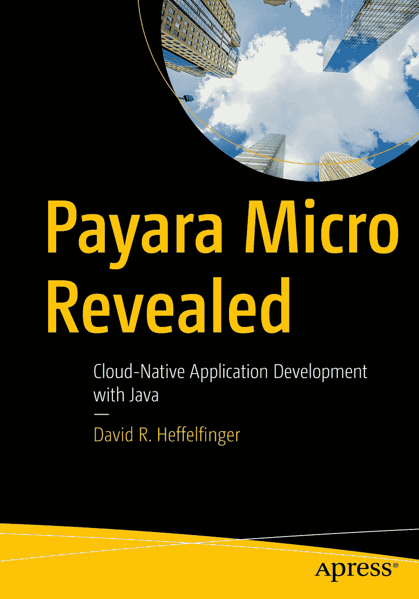

ISBN 978-1-4842-8160-4 电子版 ISBN 978-1-4842-8161-1 [`doi.org/10.1007/978-1-4842-8161-1`](https://doi.org/10.1007/978-1-4842-8161-1) © David R. Heffelfinger 2022 本作品受版权保护。所有权利均由出版商独家许可，涉及材料的全部或部分内容，特别是翻译、重印、重用插图、朗诵、广播、以缩微胶片或任何其他物理形式复制，以及信息存储与检索的传输、电子改编、计算机软件，或目前已知或今后开发的类似或不同方法。本出版物中使用通用描述性名称、注册商标、商标、服务标志等，即使未作明确声明，也不意味着这些名称不受相关保护法律和法规的约束，因此可自由使用。出版商、作者和编辑认为，本书中的建议和信息在出版之日是真实准确的。出版商、作者或编辑均不对本材料中包含的内容或可能存在的任何错误或遗漏提供明示或暗示的担保。出版商对已出版地图中的管辖权主张和机构归属保持中立。

本 Apress 印记由注册公司 APress Media, LLC（Springer Nature 的一部分）出版。

注册公司地址为：1 New York Plaza, New York, NY 10004, U.S.A.

致谢

我要感谢 Apress 编辑团队，特别是 Jonathan Gennick 和 Jill Balzano 的指导和支持。

我还要感谢技术审稿人 Andres Sacco 提供的宝贵反馈。

此外，我要感谢 Payara Services Ltd 的产品经理 Rudy De Busscher 的帮助。

最后，我要感谢我的妻子和女儿们，感谢她们忍受我长时间的工作，使我无法陪伴家人。

关于作者 关于技术审稿人

