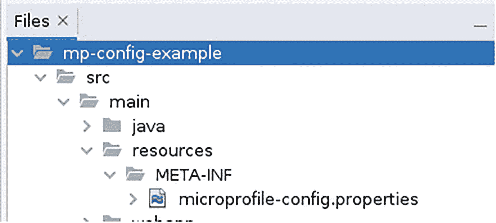
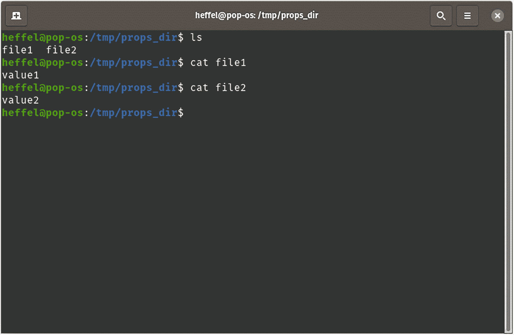
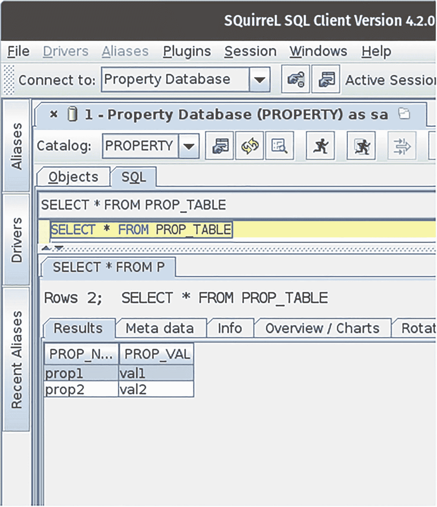
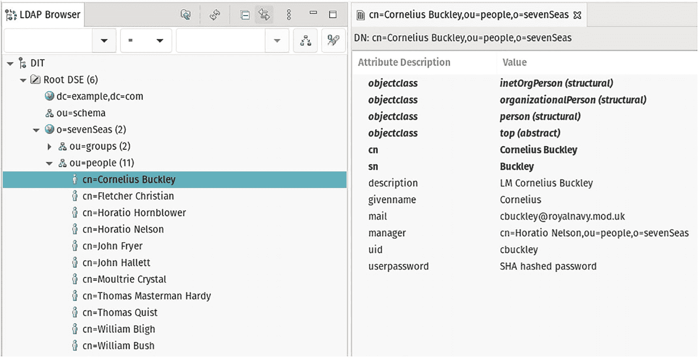
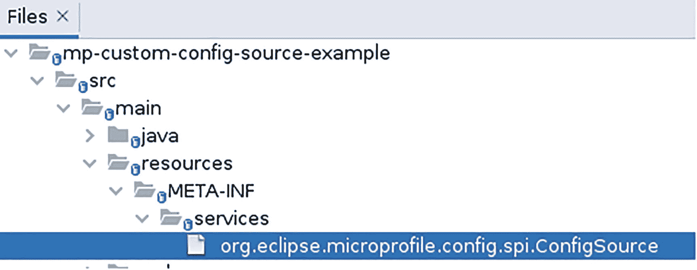
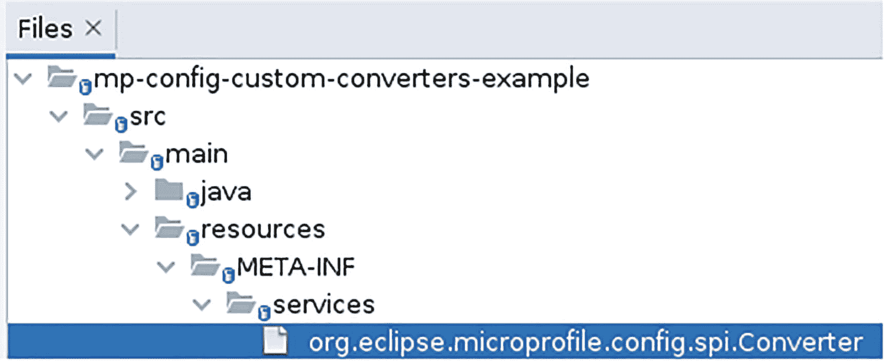

# 5. 应用程序配置

MicroProfile 包含一个名为 MicroProfile Config 的配置 API（名称恰如其分），它标准化了应用程序的配置方式。配置用于设置可能因环境而异的数值，例如数据库 URL 或文件系统中的目录。MicroProfile Config 标准化了我们检索属性以获取应用程序配置值的方式。

## 配置源

配置应用程序有三种标准方式：通过 WAR 文件内的 *microprofile-config.properties* 文件、通过 Java 系统属性以及通过环境变量。我们还可以添加自定义配置源。

配置源具有由其*序数值*定义的优先级；序数值越高，优先级越高。表 5-1 总结了所有标准配置源的序数值。

表 5-1

MicroProfile 配置源的默认序数值

| 配置源 | 默认序数值 |
| --- | --- |
| microprofile-config.properties | 100 |
| 环境变量 | 300 |
| 系统属性 | 400 |

除了标准的 MicroProfile Config 配置源之外，Payara Micro 还实现了许多额外的配置源，可用于配置应用程序（本章稍后讨论）。表 5-2 列出了所有 Payara Micro 特定的配置源及其默认序数值。

表 5-2

Payara Micro 配置源的默认序数值

| 配置源 | 默认序数值 |
| --- | --- |
| 目录 | 90 |
| 密码 | 105 |
| 域 | 110 |
| JNDI | 115 |
| 配置 | 120 |
| 服务器 | 130 |
| 应用程序 | 140 |
| 模块 | 150 |
| 集群 | 160 |
| JDBC | 190 |
| LDAP | 200 |
| 特定云提供商 | 180 |

可以通过向配置源添加 `config_ordinal` 属性来覆盖默认序数值；例如，如果我们希望将 *microprofile-config.properties* 的序数值提高到高于环境变量（序数值为 300）但低于系统属性（序数值为 400），可以在 *microprofile-config.properties* 中添加一个值介于它们序数值之间的属性，例如：

```
config_ordinal=350
```

如我们所见，*microprofile-config.properties* 在标准配置源中具有最低的序数值；这对于我们希望包含打包在应用程序中的默认配置值非常有用，这些值可以通过设置相应的环境变量或系统属性轻松覆盖。

请注意，无论使用何种配置源，检索属性的 API 都是完全相同的；MicroProfile Config API 会从优先级最高的源开始查找属性，依次向下到优先级最低的配置源，直到找到匹配的属性名称。


### 通过属性文件进行配置

配置应用程序最简单直接的方法是将 *microprofile-config.properties* 文件添加到 WAR 文件中；该文件的标准位置位于 WAR 文件类路径根目录下的 META-INF 目录中。在一个典型的 Maven 项目中，该属性文件在 WAR 文件中的位置是 *WEB-INF/classes/META-INF/microprofile-config.properties*；在源代码中，我们会将其放置在 *src/main/resources/META-INF/microprofile-config.properties* 下，当我们构建代码时，Maven 会将该文件放置在 WAR 文件中的正确位置。

为了演示这一点，假设我们希望在开发环境中向 Payara Micro 日志发送额外的输出，但在测试或生产等其他环境中抑制该输出。要实现类似功能，我们可以在 *microprofile-config.properties* 中设置一个 `project.stage` 属性。

```
project.stage=production
```

在一个标准的 Maven 项目中，此文件需要放置在 *src/resources/META-INF* 目录下。图 5-1 展示了目录树结构。



图 5-1

microprofile-config.properties 目录位置

我们可以通过 MicroProfile Config API 提供的 `@ConfigProperty` 注解来检索该属性。

```
package com.ensode.mp.config.example;
//imports omitted
@RequestScoped
@Path("mpconfigexample")
public class MpConfigDemoService {
private static final Logger LOGGER =
Logger.getLogger(MpConfigDemoService.class.getName());
@Inject
@ConfigProperty(name = "project.stage")
private String projectStage;
@POST
@Produces(MediaType.APPLICATION_JSON)
public void processPostRequest() {
LOGGER.log(Level.INFO, String.format(
"Project stage is: %s", projectStage));
ProjectStageEnum projectStageEnum =
ProjectStageEnum.valueOf(projectStage.toUpperCase());
if (ProjectStageEnum.DEVELOPMENT.equals(projectStageEnum)) {
LOGGER.log(Level.INFO,
"processPostRequest() method invoked");
}
if (ProjectStageEnum.DEVELOPMENT.equals(projectStageEnum)) {
LOGGER.log(Level.INFO,
"leaving processPostRequest() method");
}
}
}
```

正如我们在示例中所见，我们需要将 CDI 的 `@Inject` 注解与 `@ConfigProperty` 结合使用来检索属性的值。`@ConfigProperty` 有一个 `name` 属性，其值需要与 *microprofile-config.properties* 中定义的属性名称匹配。

在开发应用程序时，运行代码最简单直接的方法通常是像往常一样通过 Maven 进行。

```
mvn war:exploded payara-micro:start
```

我们可以使用 *curl* 发送 HTTP POST 请求，如下所示：

```
curl -X POST http://localhost:8080/mpconfigex/webresources/mpconfigexample
```

执行此操作后，我们检查 Payara Micro 的输出，发现正如预期的那样，没有记录额外的输出，因为我们将 `project.stage` 属性设置为 `production`。

```
[2021-09-15T08:08:41.306-0400] [] [INFO] [] [PayaraMicro] [tid: _ThreadID=1 _ThreadName=main] [timeMillis: 1631707721306] [levelValue: 800] Payara Micro  5.2021.6 #badassmicrofish (build 4579) ready in 8,542 (ms)
[2021-09-15T08:08:48.085-0400] [] [INFO] [] [com.ensode.mp.config.example.MpConfigDemoService] [tid: _ThreadID=78 _ThreadName=http-thread-pool::http-listener(2)] [timeMillis: 1631707728085] [levelValue: 800] Project stage is: production
[2021-09-15T08:33:14.192-0400] [] [INFO] [] [fish.payara.micro.cdi.extension.ClusteredCDIEventBusImpl] [tid: _ThreadID=83 _ThreadName=payara-executor-service-scheduled-task] [timeMillis: 1631709194192] [levelValue: 800] Clustered CDI Event bus initialized
```

我们可以通过修改 *microprofile-config.properties* 将属性值更改为 `development`。

```
project.stage=development
```

我们重新运行应用程序并发送另一个 POST 请求；这次额外的输出被发送到了 Payara Micro 日志中。

```
[2021-09-15T08:45:42.535-0400] [] [INFO] [] [com.ensode.mp.config.example.MpConfigDemoService] [tid: _ThreadID=76 _ThreadName=http-thread-pool::http-listener(2)] [timeMillis: 1631709942535] [levelValue: 800] Project stage is: development
[2021-09-15T08:45:42.537-0400] [] [INFO] [] [com.ensode.mp.config.example.MpConfigDemoService] [tid: _ThreadID=76 _ThreadName=http-thread-pool::http-listener(2)] [timeMillis: 1631709942537] [levelValue: 800] processPostRequest() method invoked
[2021-09-15T08:45:42.537-0400] [] [INFO] [] [com.ensode.mp.config.example.MpConfigDemoService] [tid: _ThreadID=76 _ThreadName=http-thread-pool::http-listener(2)] [timeMillis: 1631709942537] [levelValue: 800] leaving processPostRequest() method
```

通过 `@ConfigProperty` 注解读取配置属性简单直接；然而，它不够灵活；当我们部署应用程序时，尝试读取的属性可能不存在，在这种情况下我们会得到一个异常；此外，也无法有条件地将属性值赋给变量。为了涵盖这些用例并提供更大的灵活性，MicroProfile Config 提供了一个 `Config` 类，可用于以编程方式检索属性值。以下示例说明了其用法：

```
package com.ensode.mp.config.example;
//imports omitted
@RequestScoped
@Path("mpconfigexample")
public class MpConfigDemoService {
private static final Logger LOGGER = Logger.getLogger(MpConfigDemoService.class.getName());
@Inject
private Config config;
private String projectStage;
@POST
@Produces(MediaType.APPLICATION_JSON)
public void processPostRequest() {
projectStage = config.getValue("project.stage", String.class);
LOGGER.log(Level.INFO, String.format("Project stage is: %s", projectStage));
ProjectStageEnum projectStageEnum = ProjectStageEnum.valueOf(projectStage.toUpperCase());
if (ProjectStageEnum.DEVELOPMENT.equals(projectStageEnum)) {
LOGGER.log(Level.INFO, "processPostRequest() method invoked");
}
if (ProjectStageEnum.DEVELOPMENT.equals(projectStageEnum)) {
LOGGER.log(Level.INFO, "leaving processPostRequest() method");
}
}
}
```

在这里，我们修改了之前的示例以使用 `Config` 类；正如我们所见，`Config` 可以通过 CDI 的 `@Inject` 注解进行注入；然后我们可以通过其 `getValue()` 方法检索属性值，其第一个参数是一个包含要检索的属性名称的 `String`，第二个参数是属性值变量的类型。在我们的例子中，我们将属性赋值给一个 `String`；因此，我们使用 `String.class` 作为 `Config.getValue()` 的第二个参数；例如，如果我们检索的是一个整数值，我们会使用 `Integer.class` 作为 `Config.getValue()` 的第二个参数。

我们也可以通过调用 `ConfigProvider.getConfig()` 来获取 `Config` 的实例，但通过 CDI 注入更简单直接。

我们现在已经了解了如何从标准的 *microprofile-config.property* 文件中检索属性；正如我们所见，这种配置方法简单直接；然而，如果需要更改属性的值，则必须修改文件，并重新构建和重新部署代码。在我们的示例中，我们需要为不同的环境（开发、测试、生产等）提供不同版本的属性文件。因此，有时希望将配置信息放在部署模块之外。MicroProfile Config 规范定义了两种实现此目的的方法：通过环境变量和通过 Java 系统属性检索属性；我们接下来将讨论这些方法。


### 通过环境变量进行配置

所有现代操作系统都允许我们定义环境变量，这些变量可以被操作系统上运行的进程读取。

例如，在 Unix BASH shell 中，我们可以按如下方式定义一个环境变量：

```
$ export PROJECT_STAGE=test
```

这将定义一个名为 `PROJECT_STAGE` 的环境变量，其值为 `"test"`。

MicroProfile Config 可以读取环境变量并检索其值；以下示例说明了如何做到这一点：

```
package com.ensode.mp.config.example;
//imports omitted
@RequestScoped
@Path("mpconfigexample")
public class MpConfigDemoService {
private static final Logger LOGGER = Logger.getLogger(MpConfigDemoService.class.getName());
@Inject
@ConfigProperty(name = "PROJECT_STAGE")
private String projectStage;
@POST
@Produces(MediaType.APPLICATION_JSON)
public void processPostRequest() {
LOGGER.log(Level.INFO, String.format("Project stage is: %s", projectStage));
ProjectStageEnum projectStageEnum =
ProjectStageEnum.valueOf(projectStage.toUpperCase());
if (ProjectStageEnum.DEVELOPMENT.equals(projectStageEnum)) {
LOGGER.log(Level.INFO,
"processPostRequest() method invoked");
}
if (ProjectStageEnum.DEVELOPMENT.equals(projectStageEnum)) {
LOGGER.log(Level.INFO,
"leaving processPostRequest() method");
}
}
}
```

请注意，与之前的示例相比，我们唯一更改的是 `@ConfigProperty` 注解中的属性名称；其他一切完全相同。无论我们使用何种配置源，MicroProfile Config API 都是完全相同的，这非常方便，因为如果我们更改属性源，无需修改代码。

在我们的示例中，我们使用了 `@ConfigSource` 注解来检索环境变量值；使用 `Config.getValue()` 也同样有效。

同样值得指出的是，无需特殊配置；我们只需在操作系统 shell 中设置环境变量并运行代码即可；MicroProfile Config 无需我们额外操作就能读取环境变量。

### 通过系统属性进行配置

Java 虚拟机 (JVM) 有许多内置的系统属性，我们可以用来检索有关当前工作环境的信息。它包含诸如我们正在使用的 Java 版本 (`java.version`)、用户主目录 (`home.dir`) 等属性。我们还可以通过编程方式或命令行添加自己的系统属性。

如前所述，无论使用何种配置源，用于检索属性值的 MicroProfile Config API 都是相同的；使用系统属性作为配置源也不例外。

我们可以通过配置 Payara Micro Maven 插件，将系统属性传递给运行 Payara Micro 的 JVM：

```
fish.payara.maven.plugins
payara-micro-maven-plugin
1.4.0

${version.payara}

-Dmy.system.property

"If you don't see this, it didn't work"

false

--autoBindHttp

--deploy
${project.build.directory}/${project.build.finalName}

/mpconfigex

```

通常，Payara Micro Maven 插件的 `<javaCommandLineOptions>` 标签允许我们向 JVM 传递参数；在这个特定案例中，我们设置了一个系统属性，以便 MicroProfile Config API 可以使用它。

从命令行运行 Payara Micro 时，我们可以按如下方式向 JVM 传递系统属性：

```
java -Dmy.system.property="If you don't see this, it didn't work" -jar ~/.m2/repository/fish/payara/extras/payara-micro/5.2021.7/payara-micro-5.2021.7.jar --deploy ./target/mp-config-example-1.0-SNAPSHOT.war:mpconfigex
```

到目前为止，我们只讨论了从 Maven 插件运行 Payara Micro；前面的示例直接从命令行启动 Payara Micro；我们将在第 12 章中介绍启动 Payara Micro 的各种方法。

然后，我们可以像往常一样读取系统属性，无论是使用 `@ConfigSource` 注解还是通过 `Config.getValue()`。

```
@Inject
@ConfigProperty(name = "my.system.property")
private String sysPropVal;
```

然后我们可以像往常一样使用该属性值。

### Payara 特定的配置源

Payara Micro 在 MicroProfile Config 规范定义的配置源之上，还包含了额外的配置源。

[`https://docs.payara.fish/enterprise/docs/5.25.0/documentation/microprofile/config.html`](https://docs.payara.fish/enterprise/docs/5.25.0/documentation/microprofile/config.html)

#### 目录配置源

Payara Micro 可以读取目录中的文件，并将文件名用作属性名称，文件内容作为属性值。

目录配置源可用于读取 Kubernetes 的 secrets 文件。

例如，假设我们的文件系统中有一个目录 `/tmp/props_dir`，我们希望该目录中的文件名被用作 MicroProfile Config 的属性名称，其内容作为相应的属性值。图 5-2 展示了典型 Linux 终端中的目录结构。



图 5-2

目录配置源的示例目录

我们需要配置 Payara Micro，以指定包含要作为属性使用的文件的目录。使用 Payara Server 时，这通常通过 `asadmin` 命令行工具完成。该工具不包含在 Payara Micro 中；但是，我们可以通过文本文件和 `–postbootcommandfile` 命令行参数将 `asadmin` 命令传递给 Payara Micro。

例如，假设我们有一个名为 *post-boot-commands.txt* 的文本文件，内容如下：

```
set-config-dir –directory=/tmp/props_dir
```

`set-config-dir` 是一个 `asadmin` 命令，用于指定文件系统中用作配置源的目录；目录路径通过 `-directory` 参数的值传递给 `set-config-dir`。

然后，我们可以通过传递 `–postbootcommandfile` 参数来告诉 Payara Micro 读取此文件，如下所示：

```
java -jar path/to/payara-micro.jar --deploy path/to/warfile.war --postbootcommandfile=/tmp/props_dir
```

使用 Payara Micro Maven 插件时，我们可以将文件放在 `src/main/resources` 中，并按如下方式配置插件：

```
fish.payara.maven.plugins
payara-micro-maven-plugin
1.4.0

${version.payara}
false

--postbootcommandfile

${basedir}/src/main/resources/post-boot-commands.txt

/mpconfigex

```

以这种方式配置插件，允许我们在希望通过 `payara-micro:start` Maven 目标运行时配置 Payara Micro。

一旦配置了目录配置源，我们就可以像往常一样检索属性值；例如，使用 `@ConfigProperty` 注解，我们可以按如下方式检索目录中某个文件的内容：

```
@Inject
@ConfigProperty(name = "file1")
private String value;
```

这将读取配置目录中名为 *file1* 的文件的内容，并将其内容赋值给被注解的 `value` 变量。


#### 密码配置源

Payara Server 和 Payara Micro 都允许我们设置密码别名。密码别名的目的是为了安全；密码别名允许我们在需要读取密码时使用别名来代替实际密码。这使我们无需在代码中硬编码密码。

为了在 Payara Micro 中设置密码别名，我们需要创建一个包含所需密码的密码文件，内容如下：

```
AS_ADMIN_ALIASPASSWORD=secret
```

然后，我们在启动后命令文件中使用 `create-password-alias` 命令：

```
create-password-alias my-password --passwordfile=/path/to/password.txt
```

如果需要创建多个密码别名，我们可以创建多个密码文件，并在启动后命令文件中包含多个 create-password-alias 命令：

```
create-password-alias my-password --passwordfile=/tmp/password.txt
create-password-alias another-password –passwordfile=/tmp/password2.txt
```

创建好密码别名后，用于检索它们的属性名称遵循以下模式：`${ALIAS=alias-name}`。

在我们的示例启动后命令文件中，我们创建了两个密码别名，分别名为 *my-password* 和 *another-password*；我们可以通过 `@ConfigSource` 注解在代码中检索它们，如下所示：

```
@Inject
@ConfigProperty(name = "${ALIAS=my-password}")
private String password;
@Inject
@ConfigProperty(name = "${ALIAS=another-password}")
private String password2;
```

当然，我们也可以使用 Config 对象中的等效方法来检索这些值。

#### 域配置源

Payara Server 有*域*的概念；我们可以将已部署的应用程序分组到一个域中，它们将共享共同的配置，例如 JDBC 连接池等。我们可以在一个 Payara Server 实例中设置多个域。Payara Micro 不支持多个域；但是，已部署的应用程序会被添加到一个默认域中。

我们可以通过命令文件向 Payara Micro 添加域属性，如下所示：

```
set-config-property --propertyName=domain.property.name --propertyValue='some value' –source=domain
```

该属性将被添加到默认的 Payara Micro 域中，并且可以像往常一样在我们的代码中检索。

```
@Inject
@ConfigProperty(name = "domain.property.name")
private String value;
```

#### JNDI 配置源

Java 命名和目录接口是一个用于在我们的应用程序中查找资源的 API；例如，数据库连接之类的东西可以被赋予一个 JNDI 名称，并通过 JNDI API 进行检索。

Payara Micro 允许我们通过 MicroProfile Config API 及其自定义的 JNDI 配置源来检索 JNDI 属性。

在通过 JNDI 检索属性之前，我们需要通过启动后命令文件来设置它：

```
create-custom-resource --restype=string --factoryclass=org.glassfish.resources.custom.factory.PrimitivesAndStringFactory --property value="jndi-property-val" jndi-property-name
```

关于设置 JNDI 资源的完整解释超出了我们的范围，就我们的目的而言，只需说明 Payara 包含一个 JNDI 工厂类，可用于为 Java 基本类型（int、long、float、double、boolean 等）和字符串添加 JNDI 名称/值对。我们可以使用这个工厂类创建一个 JNDI 名称/值对，然后通过 MicroProfile Config API 进行检索。在我们之前的示例命令文件中，我们设置了一个 String 类型的属性，其名称为 *jndi-property-name*，其值为 *jndi-property-value*。

我们像往常一样指示 Payara Micro 从命令行执行该命令文件；然后，我们可以从 JNDI 配置源中检索在 JNDI 中设置的属性值，例如：

```
@Inject
@ConfigProperty(name = "jndi-property-name")
private String propertyVal;
```

#### 配置配置源

Payara Server 有*命名配置*的概念；同一域中的不同 GlassFish 实例可以拥有独立的配置。Payara Micro 默认域有一个名为 *server-config* 的单一配置。我们可以通过命令文件向 Payara Micro 的配置添加一个属性，如下所示：

```
set-config-property --propertyName=my.config.property --propertyValue='config property value' --source=config --sourceName=server-config
```

然后，我们可以像往常一样从代码中检索该属性的值：

```
@Inject
@ConfigProperty(name = "my.config.property")
private String value;
```

#### 服务器配置源

在服务器配置源设置的属性将可以从 Payara Micro 的单个实例中访问。我们可以通过命令文件向服务器 MicroProfile Config 源添加属性，如下例所示。

```
set-config-property --propertyName=my.config.property --propertyValue='from server source' --source=server –sourceName=server
```

然后，我们可以通过 `@ConfigSource` 注解或像往常一样调用 `Config.getConfigValue()` 从代码中检索属性值。


#### 应用程序配置源

可以将多个 WAR 文件部署到单个 Payara Micro 实例中；我们可以通过命令行实现这一点，只需在 Payara Micro 命令行中添加多个 `--deploy` 参数即可。

```
java -jar pat/to/payara-micro.jar --deploy path/to/mp-config-example-1.0-SNAPSHOT.war:mpconfigex --deploy path/to/mp-application-config-example-1.0-SNAPSHOT.war:mpappconfigex
```

在此示例中，我们将部署两个 WAR 文件，一个名为 *mp-config-example-1.0-SNAPSHOT.war*，另一个名为 *mp-application-config-example-1.0-SNAPSHOT.war*。部署到 Payara Micro 的每个 WAR 文件都会被分配一个应用程序名称，该名称对应于 WAR 文件的基本名称（在我们的示例中为 `mp-config-example-1.0-SNAPSHOT` 和 `mp-application-config-example-1.0-SNAPSHOT`）。在命令文件中设置属性时，我们需要指定应用程序名称，如下所示：

```
set-config-property --propertyName=my.config.property --propertyValue='from application source' --source=application --sourceName=mp-config-example-1.0-SNAPSHOT
set-config-property --propertyName=my.config.property --propertyValue='A different value' --source=application –sourceName=mp-application-config-example-1.0-SNAPSHOT
```

从传递给 Payara Micro 的 `postbootcommandfile` 参数的命令文件中执行这些命令将会失败，因为运行此命令时文件尚未部署；幸运的是，Payara Micro 提供了另一种通过 `postdeploycommandfile` 参数从文件执行命令的方式。

```
java -jar path/to/payara-micro.jar --deploy path/to/mp-config-example-1.0-SNAPSHOT.war:mpconfigex --deploy path/to/mp-application-config-example-1.0-SNAPSHOT.war:mpappconfigex --postdeploycommandfile src/main/resources/post-deploy-commands.txt
```

文件名可以是任何内容；它只需要是一个包含要传递给 Payara Micro 的 *asadmin* 命令的纯文本文件。

从 `postdeploymentcommandfile` Payara Micro 参数执行的命令只有在 WAR 文件部署完成后才会执行；因此，如果我们通过这种方式设置 MicroProfile Config 属性，注入配置值将会失败，因为它们在应用程序部署时尚未设置。在这种情况下，我们需要通过 `Config.getConfigValue()` 或 `Config.getValue()` 来检索值。

例如，在我们的一个 WAR 文件中，我们可以按如下方式检索值：

```
value = config.getValue("my.config.property", String.class);
```

如前所述，`getValue()` 的第一个参数是属性名称；第二个参数是我们正在读取的属性的类型。以下示例说明了我们如何以这种方式检索属性值：

```
package com.ensode.mp.config.example;
//imports omitted
@RequestScoped
@Path("mpconfigexample")
public class MpConfigDemoService {
private static final Logger LOGGER = Logger.getLogger(MpConfigDemoService.class.getName());
private String value;
@Inject
private Config config;
@POST
@Produces(MediaType.APPLICATION_JSON)
public void processPostRequest() {
value = config.getValue("my.config.property", String.class);
LOGGER.log(Level.INFO, String.format(
"Property value is: %s", value));
}
}
```

当此服务收到 HTTP POST 请求时，它会将属性值显示到 Payara Micro 日志中。

或者，我们可以通过 `Config.getConfigValue()` 检索属性值。

```
ConfigValue configValue = config.getConfigValue("my.config.property");
return String.format("Property value is %s", configValue.getValue());
```

`Confg.getValue()` 返回一个 `ConfigValue` 实例，该实例又有一个 `getValue()` 方法，该方法以字符串形式返回属性值。

我们可以在另一个不同的 WAR 文件中创建第二个 RESTful Web 服务，以这种方式检索属性值。

```
package com.ensode.mp.application.config.example;
//imports omitted
@RequestScoped
@Path("appconfig")
public class AppconfigResource {
@Inject
private Config config;
@GET
@Produces(MediaType.TEXT_PLAIN)
public String processGetRequest() {
ConfigValue configValue =
config.getConfigValue("my.config.property");
return String.format("Property value is %s",
configValue.getValue());
}
}
```

此示例会将属性值作为纯文本返回给调用该服务的客户端。

按照之前的说明，在后部署命令文件中设置属性并将我们的 WAR 文件部署到单个 Payara Micro 实例后，我们可以验证每个应用程序是否获得了适当的值。

例如，我们可以按如下方式向第一个服务发送 HTTP POST 请求：

```
curl -X POST http://localhost:8080/mpconfigex/webresources/mpconfigexample
```

然后，如果我们检查 Payara Micro 输出，应该会看到预期的值：

```
[2021-09-20T10:05:18.547-0400] [] [INFO] [] [com.ensode.mp.config.example.MpConfigDemoService] [tid: _ThreadID=79 _ThreadName=http-thread-pool::http-listener(2)] [timeMillis: 1632146718547] [levelValue: 800] Property value is: from application source
```

然后，我们可以向第二个服务（已部署在另一个 WAR 文件中）发送 HTTP GET 请求，并验证返回给客户端的值是否符合预期。

```
curl  http://localhost:8080/mpappconfigex/webresources/appconfig
Property value is A different value
```

请注意，每个服务检索的是相同的属性名称；但检索到的值不同；正如预期的那样，它们与我们在命令行中传递给 Payara Micro 的后部署命令文件中设置的值相匹配。

#### 模块配置源

某些 Jakarta EE 应用程序可能有多个模块；例如，我们可以在企业归档（EAR）文件中部署一个或多个 WAR 文件和 EJB JAR 文件。模块配置源允许属性仅对多模块应用程序中的单个模块可见。

模块配置源更适合 Payara Server，因为 Payara Micro 不支持部署 EAR 文件中的应用程序。不过，如果我们确实需要，可以将模块配置源用作上一节讨论的应用程序配置源的替代方案。

```
set-config-property --propertyName=my.config.property --propertyValue='from application source' --source=module --sourceName=mp-config-example-1.0-SNAPSHOT --moduleName=mp-config-example-1.0-SNAPSHOT
set-config-property --propertyName=my.config.property --propertyValue='A different value' --source=module --sourceName=mp-application-config-example-1.0-SNAPSHOT –moduleName=mp-application-config-example-1.0-SNAPSHOT
```

模块配置源需要 `sourceName` 和 `moduleName` 参数；将应用程序部署到 Payara Micro 时，这两个参数的值必须与应用程序名称（即我们正在部署的 WAR 文件的根名称）匹配。

与 *application* 配置源一样，*module* 配置源必须从后部署命令文件中设置；否则，命令将失败，因为执行命令时 WAR 文件尚未部署；此外，在 *module* 配置源上设置的任何属性都必须通过 `Config` 对象中的适当方法检索；注入这些值将导致应用程序无法正确部署，因为这些属性直到应用程序部署完成后才会设置。


#### 集群配置源

当我们在同一网络上启动多个 Payara Micro 实例时，它们会自动形成一个集群；这非常有用，因为集群中的所有 Payara Micro 实例都可以共享数据。我们可以通过在命令文件中执行如下命令，在集群级别设置配置属性：

```
set-config-property --propertyName=clustered.property.name --propertyValue='clustered property value' --source=payara
```

我们需要使用 `cluster` 作为源，并像往常一样指定属性名称和值。

然后，我们可以像往常一样从集群中的任何 Payara Micro 实例检索该属性，例如，通过注入的方式：

```
@Inject
@ConfigProperty(name = "clustered.property.name")
private String propertyVal;
```

#### JDBC 配置源

我们可以使用数据库表作为 MicroProfile 配置源；通过 `set-jdbc-config-source` asadmin 命令进行设置，需要指定表名、包含属性名称的列以及包含属性值的列。

```
create-jdbc-connection-pool --datasourceclassname org.h2.jdbcx.JdbcDataSource --restype javax.sql.DataSource --property user=sa:password=sa:url="jdbc:h2:tcp://localhost//tmp/property" PropertyConnectionPool
create-jdbc-resource --connectionpoolid PropertyConnectionPool PropertyDataSource
set-jdbc-config-source-configuration --jndiName PropertyDataSource --tableName PROP_TABLE --keyColumnName PROP_NAME --valueColumnName PROP_VAL
```

在设置 JDBC 配置源之前，我们需要先设置好一个 JDBC 连接池和一个 JDBC 资源。在 Payara Micro 中，我们可以通过 `create-jdbc-connection-pool` 命令设置 JDBC 连接池；通过 `--datasourceclassname` 参数指定特定于 RDBMS 的数据源类名，通过 `--restype` 参数指定资源类型为 `javax.sql.DataSource`，并指定一些特定于 RDBMS 的属性；最后一个参数是连接池 ID；在创建 JDBC 资源时需要用到这个值。

在这个例子中，我们使用的是 H2 数据库；`--datasourceclassname` 和 `--property` 的值会根据我们使用的 RDBMS（MySQL、Oracle、Sybase、PostgreSQL 等）而有所不同；请查阅您的 RDBMS 文档以获取要使用的适当值。

下一步是从我们刚刚创建的连接池创建一个 JDBC 资源；我们通过 `create-jdbc-resource` asadmin 命令来完成，传入我们刚刚创建的连接池的 ID。`create-jdbc-resource` 的最后一个参数是资源的 JNDI 名称，我们需要用它来创建 JDBC 配置源。

现在我们已经创建了 JDBC 连接池和 JDBC 资源，就可以配置我们的 JDBC 配置源了；我们可以通过 `set-jdbc-config-source-configuration` 命令来完成。在我们的示例中，我们创建了一个 JNDI 名称为 `PropertyDataSource` 的 JDBC 资源；我们将此值传递给 `set-jdbc-config-source-configuration` 命令的 `jndiName` 参数。我们通过 `--tableName` 参数指定包含属性的表名，并分别通过 `--keyColumnName` 和 `--valueColumnName` 参数指定包含属性名称和属性值的列。

在我们的示例中，我们从名为 `PROP_TABLE` 的表中读取属性，属性名称和属性值分别存储在名为 `PROPERTY_NAME` 和 `PROPERTY_VAL` 的列中。图 5-3 展示了我们的示例表和值。



图 5-3

JDBC 配置源的示例表

我们可以像往常一样通过 MicroProfile Config API 检索属性值，例如，通过 `@ConfigProperty` 注解注入配置值。

```
@Inject
@ConfigProperty(name="prop1")
private String propertyVal;
```

在后台，Payara Micro 会查询数据库并为我们检索值。

值得注意的是，JDBC 配置源是动态的，这意味着如果数据库中的属性值发生变化，调用 `config.getValue()` 或等效方法将实时从数据库中检索最新值。

#### LDAP 配置源

我们可以使用 LDAP 目录作为配置源；为此，我们需要通过 `set-ldap-config-source-configuration` 命令设置配置源。

在我们的示例中，我们将使用 Apache DS 基本用户指南中的示例目录树，网址为 [`https://directory.apache.org/apacheds/basic-user-guide.html`](https://directory.apache.org/apacheds/basic-user-guide.html)。

图 5-4 展示了一个可用于 Payara Micro LDAP 配置源的示例 LDAP 目录树。



图 5-4

示例 LDAP 目录树

当使用 LDAP 作为配置源时，条目的属性充当属性名称，其对应的值作为属性值。

在我们的示例中，我们将检索 sn 属性为 *Buckley* 的条目；然后，我们可以通过 MicroProfile Config API 在代码中检索该条目的任何属性。

```
set-ldap-config-source-configuration --enabled=true --dynamic=true --url=ldap://localhost:10389 --authType=simple --bindDN=uid=admin,ou=system --bindDNPassword=secret --searchBase=ou=people,o=sevenSeas --searchScope=subtree --searchFilter=(&(sn=Buckley))
```

我们需要通过传递 `--enabled=true` 作为参数来启用我们的配置源。LDAP 配置源可以是静态的，也可以是动态的；如果是静态的，属性只会在应用程序初始部署时读取一次；如果 LDAP 目录中的值更新了，应用程序不会读取新值；如果我们将 dynamic 设置为 true，那么我们的应用程序将实时查询 LDAP 目录，检索目录中的最新值。

我们通过 `--url` 参数指定要连接的 LDAP 服务器的 URL。授权类型可以是 *none* 或 *simple*；在我们的示例中，我们使用简单身份验证；我们通过 `--bindDN` 参数指定要连接用户的专有名称 (dn)，并通过 `--bindDNPassword` 参数指定其密码。`--searchBase` 参数指定 LDAP 目录中开始搜索属性的起始节点；`--searchScope` 指定搜索范围；有效值为 *subtree*、*onelevel* 和 *object*。

表 5-3 列出了不同的 LDAP 配置源搜索范围。

表 5-3

LDAP 配置源搜索范围

| 搜索范围 | 描述 |
| --- | --- |
| subtree | 对 `–searchBase` 中指定条目的所有下级条目执行搜索 |
| onelevel | 对 `–searchBase` 中指定条目的直接下级条目执行搜索 |
| object | 仅对 `-searchBase` 中指定的条目执行搜索 |

`--searchFilter` 参数指定一个搜索过滤器，用于从 `--searchBase` 中指定的基础 DN 开始，按照 `--searchScope` 指定的范围查找值。

一旦我们设置好 LDAP 配置源，就可以检索与我们的配置匹配的条目中的任何属性；例如，要检索我们示例中 LDAP 条目的 cn 属性，我们可以如下调用 `Config.getConfigValue()`：

```
ConfigValue configValue = config.getConfigValue("cn");
```


### 云提供商特定配置源

Payara Micro 可以从各种云提供商的配置源中检索属性；设置这些属性超出了本章的讨论范围；检索它们的方式与我们之前所见并无不同。Payara Micro 可以从以下云提供商特定的配置源中检索属性：

*   AWS Secrets

*   Azure Secrets

*   DynamoDB

*   Google Cloud Platform Secrets

*   HashiCorp Secrets

请查阅您的云提供商文档，了解如何在前述配置源上设置属性的说明。

### 自定义配置源

到目前为止，我们已经讨论了所有 MicroProfile Config 标准配置源，以及 Payara 特定的 MicroProfile Config 配置源。如果所提供的配置源都无法满足我们的需求，我们可以实现自己的自定义 MicroProfile Config 配置源。

要开发自定义的 MicroProfile Config 配置源，我们需要实现 `org.eclipse.microprofile.config.spi.ConfigSource` 接口。该接口有三个抽象方法：

*   `public Set<String> getPropertyNames()` 返回一个包含所有属性名称（字符串形式）的集合。

*   `public String getValue(String propName)` 返回属性的字符串值；它需要属性名称作为参数。

*   `public String getName()` 返回我们自定义配置源的名称。

我们至少需要在自定义配置源中实现上述三个方法。此外，`ConfigSource` 接口还有两个默认方法，我们可以选择性地覆盖它们：

`public int getOrdinal()` 返回我们自定义配置源的序数值；如果我们不覆盖此方法，则配置源的序数值默认为 100。

`public Map<String, String> getProperties()` 返回一个映射，其中键是我们配置源的键，对应的值则是每个属性的字符串值。

以下示例说明了如何实现自定义的 MicroProfile Config 配置源：

```
package com.ensode.mpcustomconfigsource;
//imports omitted
public class ExternalPropertyFileConfigSource implements
ConfigSource {
private static final Logger LOGGER =
Logger.getLogger(
ExternalPropertyFileConfigSource.class.getName());
private static final String CONFIG_SOURCE_NAME =
"ExternalPropFile";
private Map propertyMap;
public ExternalPropertyFileConfigSource() throws IOException {
Properties properties = new Properties();
String homeDir = System.getProperty("user.home");
String configFilePath = String.format(
"%s/config/config.properties", homeDir);
InputStream inputStream;
try {
inputStream = new FileInputStream(configFilePath);
properties.load(inputStream);
} catch (FileNotFoundException ex) {
LOGGER.log(Level.SEVERE, String.format(
"%s not found!", configFilePath), ex);
}
propertyMap = (Map) properties;
}
@Override
public Set getPropertyNames() {
return propertyMap.keySet();
}
@Override
public String getValue(String propName) {
String retVal = null;
var propVal = propertyMap.get(propName);
if (propVal != null) {
retVal = propVal.toString();
}
return retVal;
}
@Override
public String getName() {
return CONFIG_SOURCE_NAME;
}
}
```

在此示例中，我们从用户主目录下名为 *config* 的子目录中的一个名为 *config.properties* 的属性文件中读取属性。在类的构造函数中，我们读取该属性文件，并用其属性名称作为键、对应的值作为值来填充一个 `Map` 实现。

我们的 `getPropertyNames()` 实现简单地返回了映射中 `keySet()` 方法的值，这正好满足了我们的需求：以集合形式返回配置源中的属性名称。

我们的 `getValue()` 实现则简单地从包含我们属性的映射中检索值，并返回其 `toString()` 实现的结果；如果属性名称不存在或值为 null，我们则直接返回 null。

我们将自定义配置源命名为 *“ExternalPropFile”*；我们将此值赋给了 `CONFIG_SOURCE_NAME` 常量，并在 `getName()` 实现中返回了该常量。

在使用自定义配置源之前，我们需要先注册它；我们可以通过创建一个名为 *org.eclipse.microprofile.config.spi.ConfigSource* 的文件来实现，该文件包含我们自定义配置源的完全限定类名。在我们的示例中，该文件将包含前面示例类的完全限定类名，如下所示：

```
com.ensode.mpcustomconfigsource.ExternalPropertyFileConfigSource
```

我们需要将此文件放置在 WAR 文件中的 *META-INF/services* 目录下。当使用 Maven 构建代码时，我们可以将此文件放在 *src/main/resources/META-INF/services* 下；Maven 在构建代码时会将其放置在正确的位置。图 5-5 展示了正确的目录树。



图 5-5

自定义配置源目录树

然后，我们可以像往常一样通过 MicroProfile Config API 检索属性。假设我们的外部属性文件包含以下两个属性：

```
sample.property1=first value
sample.property2=second value
```

我们可以像往常一样通过注入或 Config 类来检索其中一个属性的值，例如，通过如下方式注入属性值：

```
@Inject
@ConfigProperty(name = "sample.property1")
private String prop1;
```


## 动态属性

动态属性允许 MicroProfile Config 实时检索属性的最新值。大多数标准配置源是静态的，这意味着如果底层配置源中的值发生变化，MicroProfile Config API 不会捕获该变化；相反，该值将保持为应用程序部署时的值。

动态属性是指当源中的值发生变化时会实时改变的属性。在大多数情况下，如果要实现动态属性，我们必须开发一个自定义配置源。以下示例是我们在上一节中讨论的外部属性文件配置源的更新版本；此版本将动态更新值。

```
package com.ensode.mpdynamicconfigsource;
//imports omitted
public class DynamicExternalPropertyFileConfigSource implements
ConfigSource {
private static final String CONFIG_SOURCE_NAME =
"DynamicExternalPropFile";
private static final Logger LOGGER = Logger.getLogger(
DynamicExternalPropertyFileConfigSource.class.getName());
private Map propertyMap;
String configFileDir;
public DynamicExternalPropertyFileConfigSource() throws
IOException, InterruptedException {
String homeDir = System.getProperty("user.home");
configFileDir = String.format("%s/config", homeDir);
updateProperties();
}
private void updateProperties() throws IOException {
Properties properties = new Properties();
String configFilePath = String.format(
"%s/config.properties", configFileDir);
InputStream inputStream;
try {
inputStream = new FileInputStream(configFilePath);
properties.load(inputStream);
} catch (FileNotFoundException ex) {
LOGGER.log(Level.SEVERE, String.format(
"%s not found!", configFilePath), ex);
}
propertyMap = (Map) properties;
}
@Override
public Set getPropertyNames() {
return propertyMap.keySet();
}
@Override
public String getValue(String propName) {
String retVal = null;
try {
updateProperties();
var propVal = propertyMap.get(propName);
if (propVal != null) {
retVal = propVal.toString();
}
} catch (IOException ex) {
LOGGER.log(Level.SEVERE, null, ex);
}
return retVal;
}
@Override
public String getName() {
return CONFIG_SOURCE_NAME;
}
}
```

在此版本的配置源中，我们将填充包含属性的 `Map` 的逻辑移到了 `updateProperties()` 方法中；我们在构造函数和自定义配置源的 `getValue()` 方法中都调用了此方法。由于每次读取值时我们都会重新填充映射，因此对于任何特定属性，我们始终会返回配置文件中存储的最新值。

Payara Micro 可能会缓存从配置源读取的值；配置文件中的更改可能需要大约一分钟才能“生效”，并通过用于检索属性值的 MicroProfile API 调用返回。

## 转换器

配置源中的值通常存储为字符串；然而，有时我们需要读取非字符串类型的属性；例如，它可能是一个数值，甚至是一个自定义对象。

### 标准转换器

MicroProfile Config 包含所有标准 Java 数值类型以及布尔类型的转换器；它们的工作方式正如你所预期的那样。例如，表示整数或浮点数的数字字符串会被转换为相应的数值。对于布尔值，以下值将解析为 *true：* `"true"`、`"yes"`、`"Y"`、`"on"`、`"1"`；其他任何值都将解析为 *false*。

以下原始类型及其对应的对象包装器在 MicroProfile Config 中具有标准转换器：

*   `boolean`

*   `int`

*   `long`

*   `float`

*   `double`

此外，还有一个用于 `java.lang.Class` 的转换器，它接受一个包含我们想要初始化的类类型的完全限定名称的字符串；其工作方式类似于标准的 `Class.forName()` 方法。

还有一个用于数组和列表的转换器，其中数组元素由逗号分隔；例如，以下属性在分配给数组或列表时，将生成三个单独的元素：“a”、“b”和“c”。

```
my.array.property=a,b,c
```

如果我们需要在某个元素中包含逗号，可以使用反斜杠对其进行转义。

```
array.property.with.comma=a,b\,c
```

上述属性将使用两个元素填充数组或列表：“a”和“b,c”。

### Payara Micro 特定转换器

除了标准的 MicroProfile Config 转换器之外，Payara Micro 还额外包含了两个用于 `java.net.URL` 和 `java.net.InetAddress` 的转换器，其中包含有效 URL 或 IP 地址的属性将被转换为相应的类型。


### 自定义转换器

如果需要转换为自定义类型，可以通过实现 `org.eclipse.microprofile.config.spi.Converter` 接口来实现。该接口包含一个需要实现的抽象方法：

```
public T convert(String value)
```

`Converter` 接口方法使用了泛型，以便我们能够返回合适的值。

假设我们有一个简单的 Person 类，包含 `firstName` 和 `lastName` 属性。

```
package com.ensode.mpconfigcustomconverters;
public class Person {
private String firstName;
private String lastName;
// getters 和 setters 已省略
}
```

让我们编写一个简单的转换器，用于读取属性值并将其转换为 `Person` 实例。

```
package com.ensode.mpconfigcustomconverters;
import org.eclipse.microprofile.config.spi.Converter;
public class PersonConverter implements Converter {
@Override
public Person convert(String value) throws
IllegalArgumentException, NullPointerException {
Person person = new Person();
String[] nameArr = value.split(" ");
person.setFirstName(nameArr[0]);
person.setLastName(nameArr[1]);
return person;
}
}
```

从示例中可以看出，要实现一个转换器，我们需要将目标转换类型作为泛型类型参数传入；在本例中，我们希望转换为 Person 实例，因此类型参数为 `<Person>`。然后实现 `convert()` 方法的主体，该方法将返回目标类的实例。在我们这个（确实过于简单的）示例中，我们只是读取一个字符串值，以空格为分隔符进行拆分，并将拆分后的第一个和第二个元素分别赋值给 Person 类的 firstName 和 `lastName` 属性。

在使用自定义转换器之前，需要先注册它；具体做法是在 WAR 文件的 *META-INF/services* 目录下创建一个名为 `org.eclipse.microprofile.config.spi.Converter` 的文件，并在文件中写入自定义转换器的完全限定类名。与往常一样，如果我们在源代码项目的 `src/main/resources/META-INF/services` 目录下放置该文件，Maven 会将其正确放置在 WAR 文件的对应目录中，如图 5-6 所示。



图 5-6

自定义转换器注册目录树

在我们的示例中，该文件的内容如下：

```
com.ensode.mpconfigcustomconverters.PersonConverter
```

假设我们在 microprofile-config.properties 中有以下两个属性：

```
customer1=David Heffelfinger
customer2=John Doe
```

读取其中任意一个属性并将其赋值给 Person 类型的对象，都会触发我们的自定义转换器。

```
package com.ensode.mpconfigcustomconverters;
// 导入已省略
@RequestScoped
@Path("customconverter")
public class CustomConverterService {
@Inject
@ConfigProperty(name = "customer1")
private Person person;
@GET
@Produces(MediaType.APPLICATION_JSON)
public Person getCustomer() {
return person;
}
}
```

上述 RESTful Web 服务会读取 customer1 属性的值；由于该值被赋值给 Person 类型的变量，我们的自定义转换器便会生效。当服务收到 HTTP GET 请求时，`getCustomer()` 方法会返回已填充的 `Person` 对象的 JSON 表示形式；例如，使用 curl 发送请求

*curl* *http://localhost:8080/mpconfigcustomconverter/webresources/customconverter*

将返回以下 JSON 字符串：

*{“firstName”:”David”, “lastName”:“Heffelfinger”}*

## 总结

在本章中，我们介绍了如何使用 MicroProfile Config API 配置应用程序。

我们讨论了 MicroProfile Config 规范要求的标准配置源。此外，还介绍了 Payara Micro 实现的额外 MicroProfile Config 配置源。我们还了解了如何实现自己的自定义配置源。

我们还介绍了如何通过转换器将字符串属性转换为 Java 对象。我们讨论了 MicroProfile 规范提供的标准转换器，以及 Payara Micro 提供的额外转换器。此外，我们还了解了如何实现自己的自定义 MicroProfile Config 转换器。

