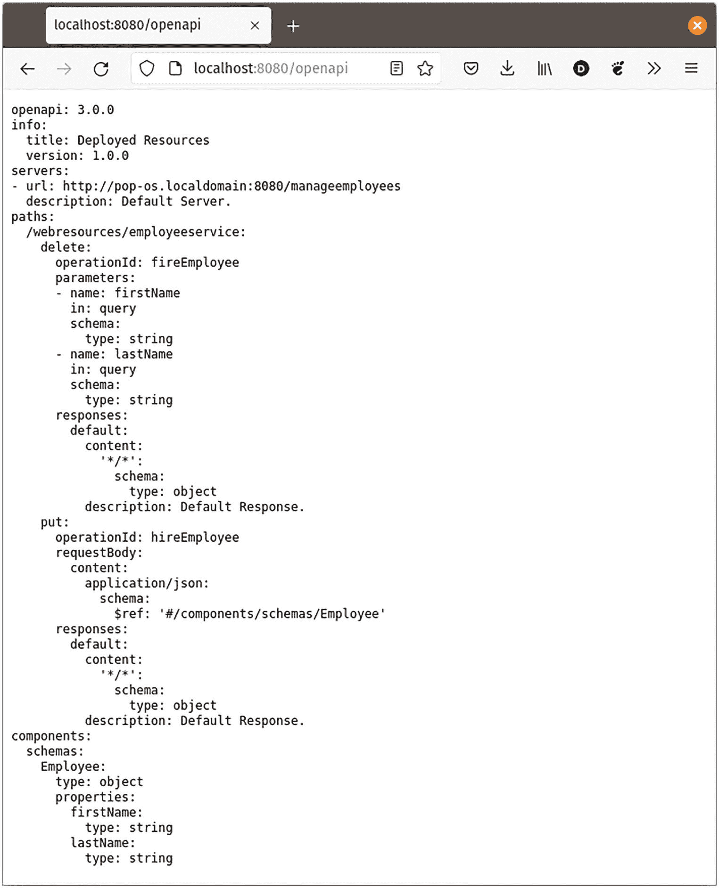
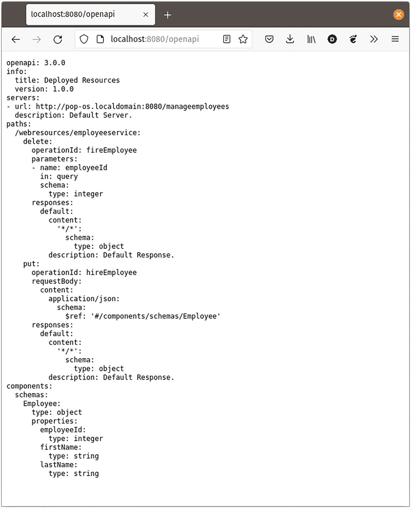
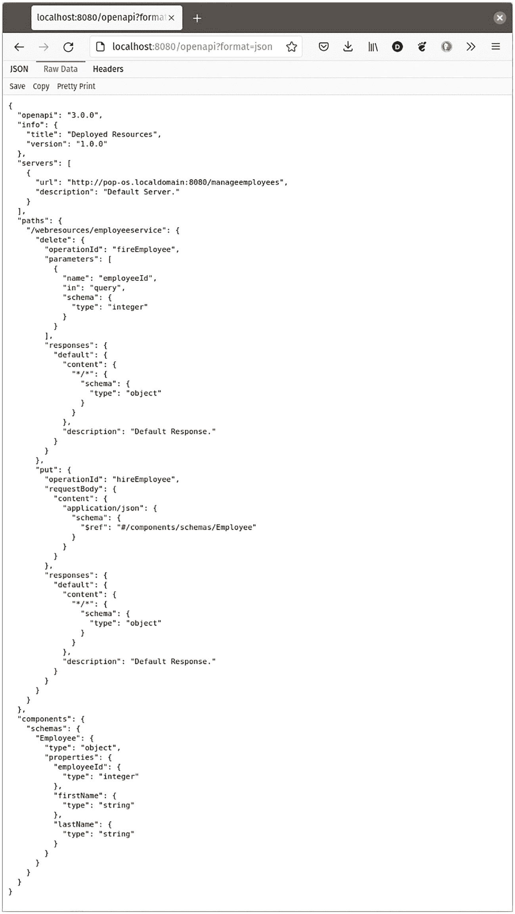
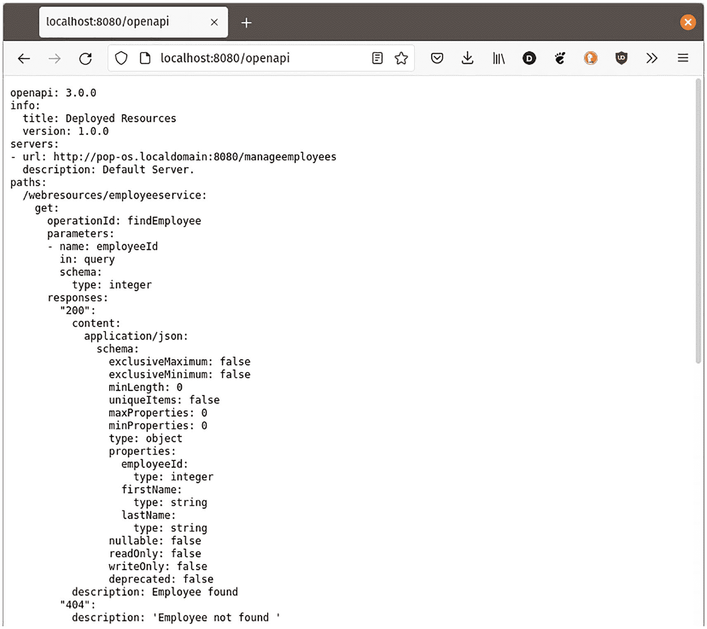
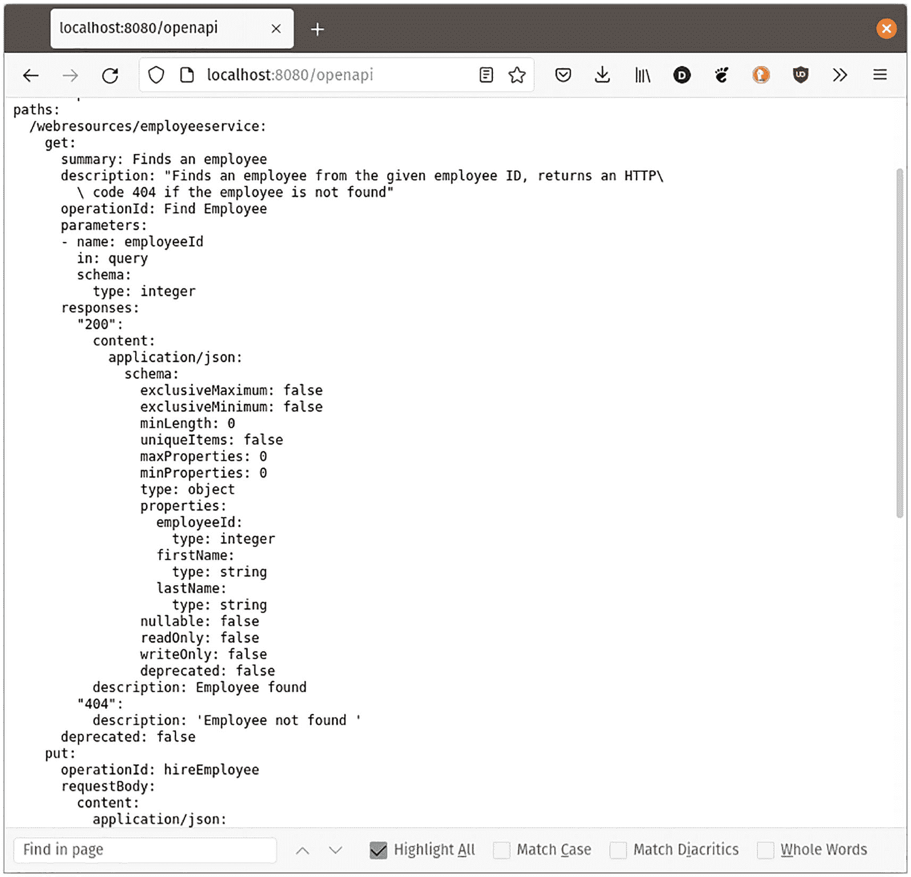
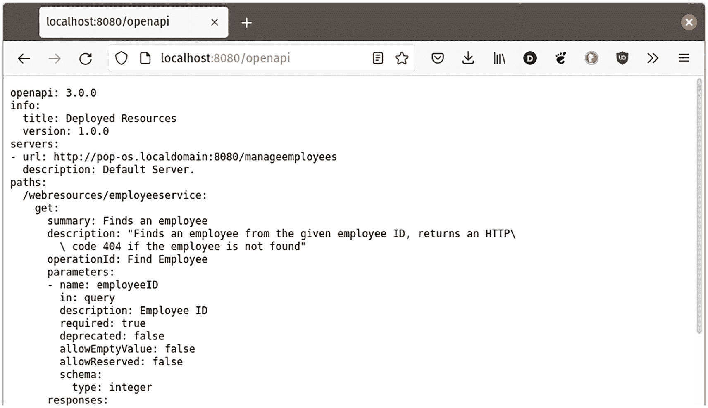

# 10. 记录 Web 服务

代码文档是一项艰巨且常常吃力不讨好的任务；因此，随着代码库的变更，文档很容易变得过时且陈旧；在许多情况下，文档并未更新以反映最新的变更。

Payara Micro 可以通过其对 MicroProfile OpenAPI 的支持来缓解这一问题，该支持使得生成文档变得轻而易举；在许多情况下，文档会随着代码的更新而自动更新；例如，为现有 Web 服务端点添加一个新参数，可能会导致该新参数自动添加到文档中。


## 自动生成文档

任何部署到 Payara Micro 的 RESTful Web 服务都会自动生成文档；要查看生成的文档，我们只需向 Payara Micro 实例的 */openapi* 端点发送一个 HTTP GET 请求即可。

在前面的章节中，我们使用一个以 Web 服务形式实现的简单人力资源系统来雇佣和解雇员工；在本章中，我们将使用同一个系统来演示 OpenAPI。

该系统的核心是一个简单的 RESTful Web 服务，它接受 HTTP PUT 请求来雇佣员工，以及 DELETE 请求来解雇员工；作为回顾，以下是这个简单 RESTful Web 服务的源代码：

```
package com.ensode.openapiexample;
//imports omitted
@ApplicationScoped
@Path("employeeservice")
public class EmployeeResource {
private List employeeList = new CopyOnWriteArrayList(); //thread safe
@PUT
@Consumes(MediaType.APPLICATION_JSON)
public void hireEmployee(Employee employee) {
employeeList.add(employee);
}
@DELETE
@Consumes(MediaType.APPLICATION_JSON)
public void fireEmployee(@QueryParam("firstName")
String firstName, @QueryParam("lastName") String lastName) {
Optional employeeToFire =
employeeList.stream().filter(emp ->
emp.getFirstName().equals(firstName) &&
emp.getLastName().equals(lastName)).findAny();
employeeToFire.ifPresent(
emp -> {employeeList.remove(emp);});
}
}
```

要查看我们 RESTful Web 服务自动生成的文档，只需向 *http://localhost:8080/openapi* 发送一个 HTTP GET 请求（假设项目已部署到本地工作站并使用默认 HTTP 端口）。发送 GET 请求最简单的方法是将浏览器指向上述 URL，如图 10-1 所示。



图 10-1

自动生成的文档

生成的文档采用 YAML 格式。我们可以看到有一个 *webresources/employeeservice* 路径，它接受 HTTP DELETE 或 PUT 请求。

对于 DELETE 请求，文档指出该端点期望两个类型为 String 的查询参数：一个名为 *firstName*，另一个名为 *lastName*。

对于 PUT 请求，我们可以看到请求体必须包含一个遵循特定模式的 JSON 对象，该模式也在文档底部附近作为 `Employee` 模式被记录；这个模式是从我们的 Employee 类自动生成的。

OpenAPI 支持的一个好处是文档会自动更新；因此，它永远不会过时。例如，假设我们更新了 `Employee` 类，使其包含一个 `employeeID` 字段，如下所示：

```
package com.ensode.openapiexample;
//imports omitted
public class Employee {
public Employee() {
}
public Employee(Integer employeeId, String firstName,
String lastName) {
this.employeeId = employeeId;
this.firstName = firstName;
this.lastName = lastName;
}
private Integer employeeId;
private String firstName;
private String lastName;
//setters, getters, equals() and hashCode() omitted for brevity
}
```

然后假设我们更新了 `fireEmployee()` 方法，使其接受 `employeeID` 作为查询参数：

```
package com.ensode.openapiexample;
//imports omitted
@ApplicationScoped
@Path("employeeservice")
public class EmployeeResource {
private List employeeList = new CopyOnWriteArrayList(); //thread safe
@PUT
@Consumes(MediaType.APPLICATION_JSON)
public void hireEmployee(Employee employee) {
employeeList.add(employee);
}
@DELETE
@Consumes(MediaType.APPLICATION_JSON)
public void fireEmployee(
@QueryParam("employeeId") Integer employeeID) {
Optional employeeToFire =
employeeList.stream().filter(emp →
emp.getEmployeeId().equals(employeeID)).findAny();
employeeToFire.ifPresent(
emp -> {
employeeList.remove(emp);
});
}
}
```

部署我们的应用程序后，我们再次将浏览器指向 *http://localhost:8080/openapi*，发现文档已经自动更新，我们无需任何额外操作。

请注意，在文档中，*operationID fireEmployee* 现在只接受一个名为 *employeeID* 的参数，并且在文档底部附近，*Employee* 模式已自动更新，增加了一个类型为 integer 的 *employeeID* 属性；所有这些更新都直接由我们的代码更改驱动，我们甚至无需考虑更新文档。我们可以在图 10-2 中看到更新后的文档。



图 10-2

自动更新的文档

如前所述，默认情况下，文档以 YAML 格式生成；如果我们希望以 JSON 格式生成，可以通过向 */openapi* 端点传递一个名为 *format*、值为 *json* 的查询参数来实现，例如：

*http://localhost:8080/openapi?format=json*

图 10-3 展示了我们更新后的服务对应的等效文档，这次是 JSON 格式。



图 10-3

自动更新的文档（JSON 格式）

## 通过代码注解自定义文档

OpenAPI 提供了可用于自定义生成文档的注解。

### 自定义 HTTP 响应

我们可以自定义响应的生成文档；此外，我们还可以为端点返回的不同 HTTP 状态码添加描述；这可以通过在 Jakarta RESTful Web 服务的方法上使用 `@APIResponse` 注解来实现。

假设我们为人力资源应用程序添加了一个按 ID 查找员工的端点；成功找到员工后，会自动返回 HTTP 状态码 200（“OK”）；如果未找到员工，我们可以通过抛出 `NotFoundException` 来触发 HTTP 状态码 404（“未找到”）。我们可以通过使用 `@APIResponse` 注解在代码中记录此行为。

```
@GET
@APIResponse(responseCode = "200",
description = "Employee found",
content = @Content(mediaType = APPLICATION_JSON,
schema =
@Schema(implementation = Employee.class))
@APIResponse(responseCode = "404",
description = "Employee not found ")
public Employee findEmployee(
@QueryParam("employeeId") Integer employeeID) {
Optional employeeToFind =
employeeList.stream().filter(emp →
emp.getEmployeeId().equals(employeeID)).findFirst();
return employeeToFind.orElseThrow(
() -> new NotFoundException()); //if not found, return a 404
}
```

从前面的示例可以看出，`@APIResponse` 有三个属性；`responseCode` 和 `description` 不言自明；可选的 `content` 属性指定了响应体的媒体类型和模式（如果有的话）。

图 10-4 展示了我们应用程序更新后文档的相关部分。



图 10-4

由 @APIResponse 注解生成的文档

我们的新方法被自动添加，无需我们额外操作；请注意 *operationId findEmployee*（我们的新方法）对应的 HTTP 状态码 200 和 404 的描述；这些是由我们添加到方法上的 `@APIResponse` 注解生成的。


### 为操作定制文档

默认情况下，我们 RESTful Web 服务上的每个端点都会被赋予一个与其方法名匹配的操作 ID；这就是示例中关于端点如何响应 HTTP GET、PUT 和 DELETE 请求的文档中生成 *operationID* 字段的方式。

如果我们想覆盖生成的 `operationID`，可以使用 `@Operation` 注解来实现；该注解还允许我们为操作提供摘要和详细描述，如下例所示：

```
@GET
@Operation(operationId = "Find Employee",
summary = "查找员工",
description = "根据给定的员工 ID 查找员工，如果未找到员工则返回 HTTP 代码 404")
@APIResponse(responseCode = "200",
description = "找到员工",
content = @Content(mediaType = APPLICATION_JSON, schema =
@Schema(implementation = Employee.class)))
@APIResponse(responseCode = "404",
description = "未找到员工")
public Employee findEmployee(@QueryParam("employeeId") Integer employeeID) {
Optional employeeToFind =
employeeList.stream().filter(emp →
emp.getEmployeeId().equals(employeeID)).findFirst();
return employeeToFind.orElseThrow(
() -> new NotFoundException());
}
```

`@Operation` 注解的 `operationID` 属性会覆盖文档中生成的 *operationId*。`summary` 和 `description` 属性分别提供操作的简要和详细描述。

图 10-5 展示了该操作更新后的文档。



图 10-5

自定义操作 ID

请注意更新后的 *operationID*，以及因 `@Operation` 注解而生成的新 *summary* 和 *description* 字段。

### 为路径或查询参数定制文档

路径或查询参数使用 `@PathParam` 或 `@QueryParam` 进行注解。OpenAPI 会为任一参数类型生成默认文档；如果需要，我们可以向生成的文档中添加关于参数的额外信息；这可以通过 `@Parameter` 注解来实现，如下例所示：

```
@GET
@Operation(operationId = "Find Employee",
summary = "查找员工",
description = "根据给定的员工 ID 查找员工，如果未找到员工则返回 HTTP 代码 404")
@APIResponse(responseCode = "200",
description = "找到员工",
content = @Content(mediaType = APPLICATION_JSON, schema =
@Schema(implementation = Employee.class)))
@APIResponse(responseCode = "404",
description = "未找到员工")
public Employee findEmployee(@QueryParam("employeeId")
@Parameter(description = "员工 ID", required = true)
Integer employeeID) {
Optional employeeToFind =
employeeList.stream().filter(emp →
emp.getEmployeeId().equals(employeeID)).findFirst();
return employeeToFind.orElseThrow(
() -> new NotFoundException());
}
```

在此示例中，我们为 `employeeID` 查询参数添加了描述，并指定该参数是必需的。图 10-6 展示了更新后文档的相关部分。



图 10-6

自定义参数文档

请注意，文档中的 *employeeID* 参数现在有了描述，并被记录为必需参数，这都是因为我们向查询参数添加了 `@Parameter` 注解。

## 配置 OpenAPI

OpenAPI 可以通过 MicroProfile Config API 进行配置，使用每个 MicroProfile 实现都必须支持的标准配置属性。此外，Payara Micro 通过预启动或后启动命令文件提供了额外的配置选项。

### 通过 MicroProfile Config 配置 OpenAPI

OpenAPI 提供了许多可用于自定义其行为的属性；这些属性可以在 MicroProfile Config 支持的任何源中设置（*microprofile-config.properties*、环境变量、系统属性等）。

表 10-1 总结了所有可用于自定义 OpenAPI 的属性。

表 10-1

OpenAPI MicroProfile Config 属性

| 属性 | 描述 |
| --- | --- |
| `mp.openapi.model.reader` | `OASModelReader` 接口实现的完全限定名称，可用于以编程方式创建或扩充文档 |
| `mp.openapi.filter` | `OASFilter` 接口实现的完全限定名称，可用于实现在处理 OpenAPI 注解时要执行的回调 |
| `mp.openapi.scan.disable` | 用于禁用文档生成 |
| `mp.openapi.scan.packages` | 用于指定处理 OpenAPI 注解时要扫描的包 |
| `mp.openapi.scan.classes` | 用于指定处理 OpenAPI 注解时要扫描的类 |
| `mp.openapi.scan.exclude.packages` | 用于指定处理 OpenAPI 注解时要排除的包 |
| `mp.openapi.scan.exclude.classes` | 用于指定处理 OpenAPI 注解时要排除的类 |
| `mp.openapi.scan.lib` | 用于指定是否应扫描 WAR 文件内 JAR 文件中的类以查找 OpenAPI 注解 |
| `mp.openapi.servers` | 用于指定提供连接信息的全局服务器列表 |
| `mp.openapi.servers.path.` | 属性的前缀，用于指定为路径中的所有操作提供服务的备用服务器列表。例如，mp.openapi.servers.path./employeemanagement=[`https://example.com/v1`](https://example.com/v1) |
| `mp.openapi.servers.operation.` | 属性的前缀，用于指定为某个操作提供服务的备用服务器列表。属性名的其余部分必须是相关端点的 operationId。例如，mp.openapi.servers.operation.hireEmployee=[`https://example.com/v1`](https://example.com/v1) |
| `mp.openapi.schema.` | 属性的前缀，用于以 JSON 格式指定特定 Java 类的模式。属性名的其余部分必须是完全限定的 Java 类名。值必须是有效的 OpenAPI 模式对象，以 JSON 格式指定 |

### 通过 Payara Micro 命令文件配置 OpenAPI

我们可以通过作为后启动命令文件或类似方式传递的命令文件，使用 `set-openapi-configuration` asadmin 命令在 Payara Micro 中配置 OpenAPI。

#### 禁用 OpenAPI

Payara Micro 默认启用 OpenAPI；如果我们想禁用它，可以使用以下 asadmin 命令：

```
set-openapi-configuration --enabled=false
```

#### 启用 CORS 头

可以通过执行以下 asadmin 命令，将跨域资源共享（CORS）头添加到 OpenAPI 端点响应中：

```
set-openapi-configuration --corsheaders=true
```

#### 保护 OpenAPI

默认情况下，*/openapi* 端点是不安全的，这意味着任何未经身份验证的随机用户都可以访问它。

如果我们想保护它，可以通过执行以下 asadmin 命令来实现：

```
set-openapi-configuration --securityenabled=true
```

在保护 */openapi* 端点时，我们可以按如下方式指定哪些角色可以访问它：

```
set-openapi-configuration --roles=role1,role2
```

`--roles` 参数的值是一个逗号分隔的角色列表，这些角色被允许访问健康端点。

#### 自定义 OpenAPI 端点

默认情况下，可以通过 */openapi* 端点检索文档。如果需要，我们可以使用不同的端点。

```
set-openapi-configuration --endpoint=foo
```

*--endpoint* 参数的值是我们自定义 OpenAPI 端点的上下文根。


## 总结

在本章中，我们介绍了如何从 JAX-RS 注解自动生成 RESTful Web 服务的文档，从而确保文档与代码始终保持同步。

接着，我们探讨了如何使用 OpenAPI 注解来自定义生成的文档。

最后，我们学习了如何通过 MicroProfile Config 和 asadmin 命令来配置 OpenAPI。

