# 13. Payara Cloud

通常，将应用程序部署到云环境涉及的工作远不止“仅仅”开发应用程序；可能需要配置“Pod”（通常是精简版的虚拟 Linux 服务器）来运行我们的应用程序；在应用程序正常运行之前，可能需要开发复杂的配置文件。

必须执行所有这些管理任务正是流行的 *DevOps* 术语的由来，软件开发人员现在需要负责传统上由系统管理员执行的任务。这些任务通常超出了典型软件开发人员的专业领域；开发团队在最初将应用程序迁移到云环境时，经历一段“烈火试炼”期并不罕见，他们必须快速学习所有现在成功部署应用程序所需的额外管理任务。

Payara Cloud 在云中提供一个 Payara Micro 实例，并自动执行所有必要的配置；只需要部署一个标准的 WAR 文件；所有配置都会自动生成，类似于部署到更传统的“重量级”Jakarta EE 应用服务器。

## 注册 Payara Cloud

要注册 Payara Cloud，请访问以下 URL：[`https://payara.cloud/#subscribe`](https://payara.cloud/%2523subscribe)。

在撰写本文时，Payara Cloud 尚未向公众开放；Payara 的优秀员工允许我们预览 Payara Cloud，以便我们可以在书中进行介绍。感谢 Payara 产品经理兼开发者倡导者 Rudy De Busscher，以及 Payara 营销团队！

有三种计划可供选择，以满足您的预算和需求。有基础版、标准版和高级版计划，每个计划都提供额外的计算资源（如 CPU 和 RAM）以及不同级别的支持。请访问上述 URL 了解每个计划的详细信息。

## 为 Payara Cloud 开发应用程序

为部署到 Payara Cloud 而开发应用程序并不比为本地 Payara Micro 实例开发应用程序需要额外的努力。如果您的应用程序可以在 Payara Micro 中成功部署和运行，那么它部署到 Payara Cloud 后也能很好地部署和运行。

## 将应用程序部署到 Payara Cloud

Payara Cloud 有一个 *命名空间* 的概念；命名空间是一组相关的应用程序。

在您首次将应用程序上传到 Payara Cloud 之前，您需要创建一个命名空间。


### 创建命名空间

通过点击 Payara Cloud 网页界面欢迎屏幕右上角的*创建新命名空间*按钮即可创建命名空间，如图 13-1 所示。

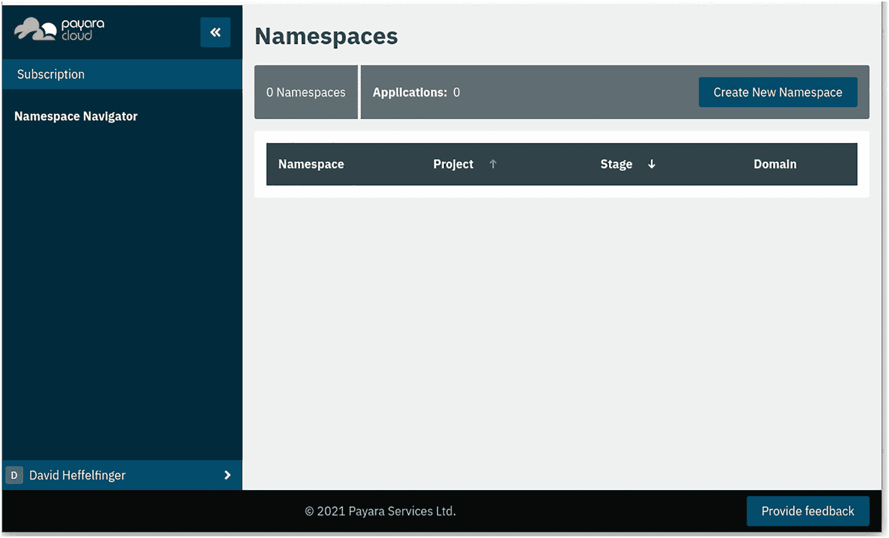

图 13-1

创建命名空间

创建命名空间时，我们需要输入*项目*名称和*阶段*，如图 13-2 所示。

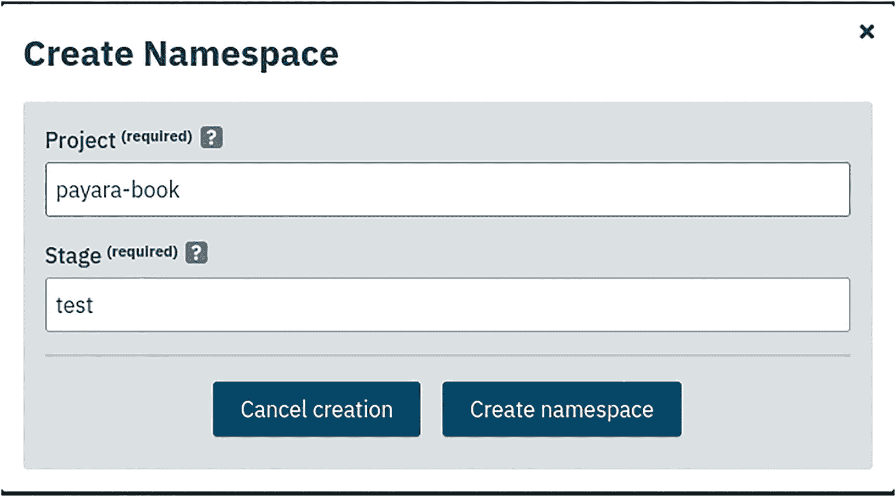

图 13-2

命名空间项目与阶段

项目名称可以任意设定；阶段应类似于“development”、“test”、“production”等。

输入项目名称和阶段后，点击*创建命名空间*，命名空间即创建完成，如图 13-3 所示。

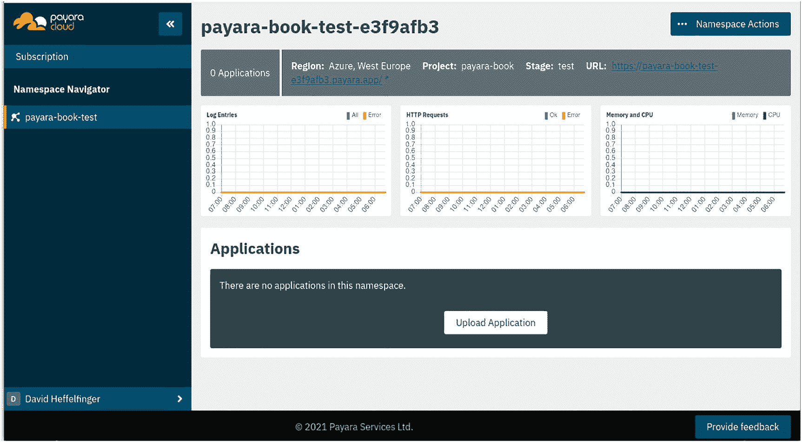

图 13-3

已创建的命名空间

生成的命名空间名称源自创建时输入的项目名称和阶段；名称末尾会附加几个随机字符，以避免与 Payara Cloud 中其他命名空间冲突。

创建命名空间后，即可向 Payara Cloud 上传应用程序。

### 上传应用程序

在任何命名空间中，只需上传已成功部署到本地 Payara Micro 实例的 WAR 文件，即可部署应用程序。操作方法为：点击命名空间网页用户界面底部的“上传应用程序”，如图 13-4 所示。

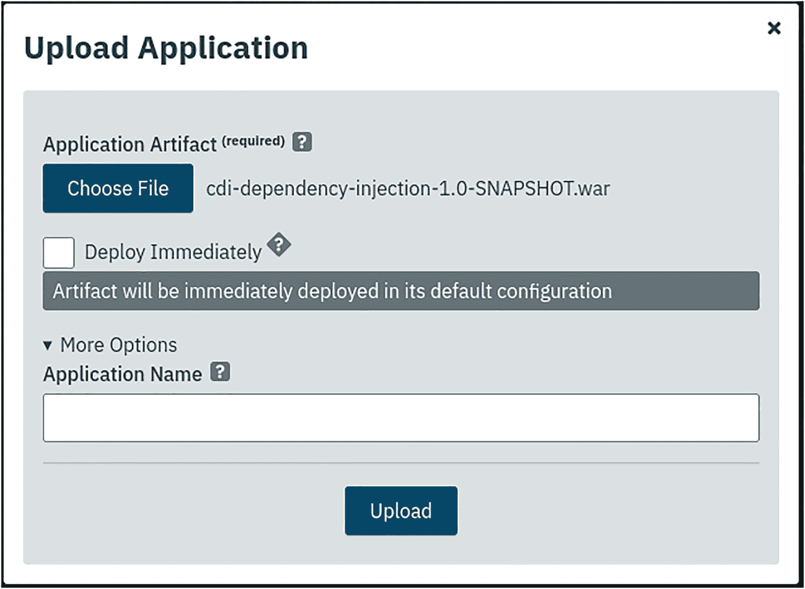

图 13-4

向 Payara Cloud 上传应用程序

如果勾选*立即部署*，应用程序将使用默认配置立即部署；如果取消勾选，则需要自行配置并部署应用程序。

我们可以为应用程序命名；如果应用程序是使用 Maven 构建的，Payara Cloud 默认会将 WAR 文件的 artifact ID 作为应用程序名称；如果这正是我们期望的行为，则无需指定应用程序名称。

如果未立即部署应用程序，上传后其状态将为*已配置*；我们可以通过点击*修订操作*，然后点击*编辑配置*来编辑应用程序的默认配置，如图 13-5 所示。

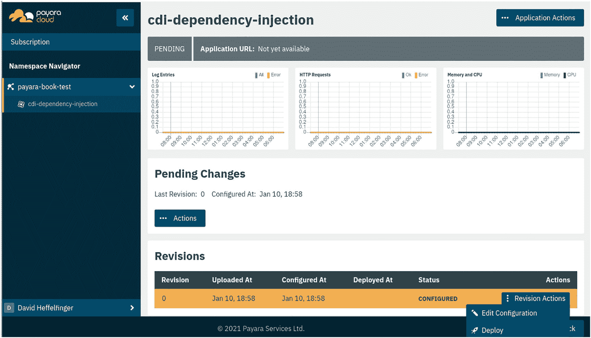

图 13-5

导航至应用程序配置

在应用程序配置界面中，我们可以为应用程序选择运行时大小，以及上下文根和互联网可访问路径，如图 13-6 所示。

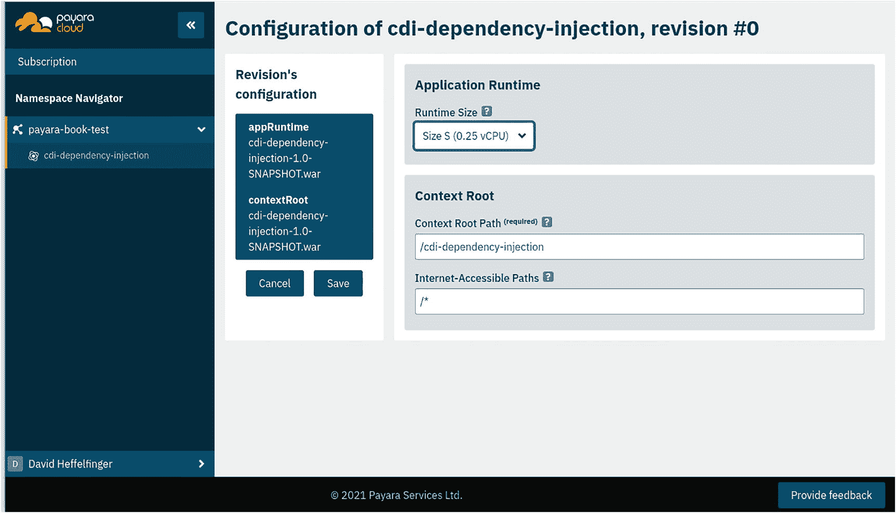

图 13-6

修改应用程序配置

默认情况下，应用程序中的所有路径都对互联网开放；如果只想向互联网公开某些 RESTful Web 服务端点或页面，可以在*互联网可访问路径*字段中指定以空格分隔的路径；例如，如果只希望以 /public 或 /default 开头的路径可被互联网访问，则需在该字段中输入以下值：

```
/public* /default*
```

对于我们的示例，允许所有路径可被互联网访问是可以的；因此，我们可以接受默认的 /* 值。

点击*保存*即可保存配置。

此时，应用程序仍处于*已配置*状态；我们需要点击*修订操作*，然后点击*部署*来部署它。

几秒钟后，应用程序状态将变为*已部署*，如图 13-7 所示。

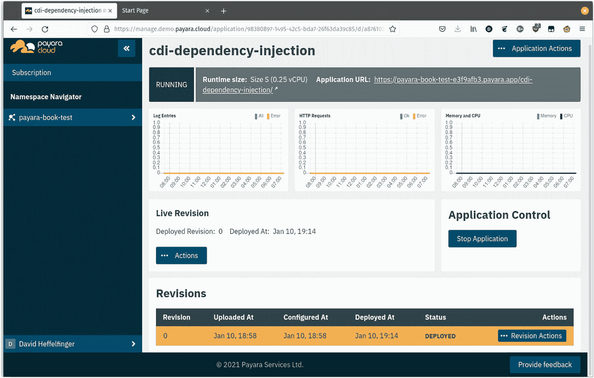

图 13-7

已部署的应用程序

此时，应用程序已上线；我们可以在 Payara Cloud 应用程序管理控制台的右上角看到其 URL。

## 在 Payara Cloud 中运行应用程序

现在应用程序已部署，我们只需点击 Payara Cloud 应用程序管理控制台右上角显示的 URL；即可在浏览器中看到由 Payara Cloud 提供的默认 index.html 页面，如图 13-8 所示。

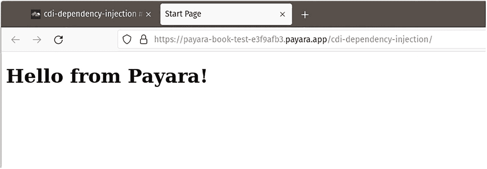

图 13-8

应用程序成功部署到 Payara Cloud

我们在这里看到的是 Payara Maven 插件创建的默认 *index.html* 页面；它可能无法赢得任何网页设计比赛，但这证明了我们的应用程序已成功部署并在线运行。

由于我们没有限制任何路径的互联网访问权限，因此可以通过 curl 或任何相关工具发送 HTTP 请求。

例如，以下 curl 命令向部署在 Payara Cloud 上的应用程序发送请求：

```
curl -XGET https://payara-book-test-e3f9afb3.payara.app/cdi-dependency-injection/webresources/cdiservice?countryAbbrev=UK
```

然后我们会收到预期的返回结果：

```
{"abbreviation":"UK","name":"United Kingdom"}
```

### 默认域名

从上面的示例可以看出，生成的域名（在我们的示例中是 [`https://payarabook-test-e3f9afb3.payara.app`](https://payara-book-test-e3f9afb3.payara.app/)）不太美观，也不易记忆；对于开发或测试目的来说，它完全可以满足需求；但对于生产环境，我们可能希望为用户提供一个美观且易于记忆的域名。Payara Cloud 标准版和高级版计划允许我们定义自定义域名。

### 自定义域名

要创建自定义域名，请点击 Payara Cloud 命名空间管理控制台右上角的*命名空间操作*，然后点击*自定义域名*，如图 13-9 所示。

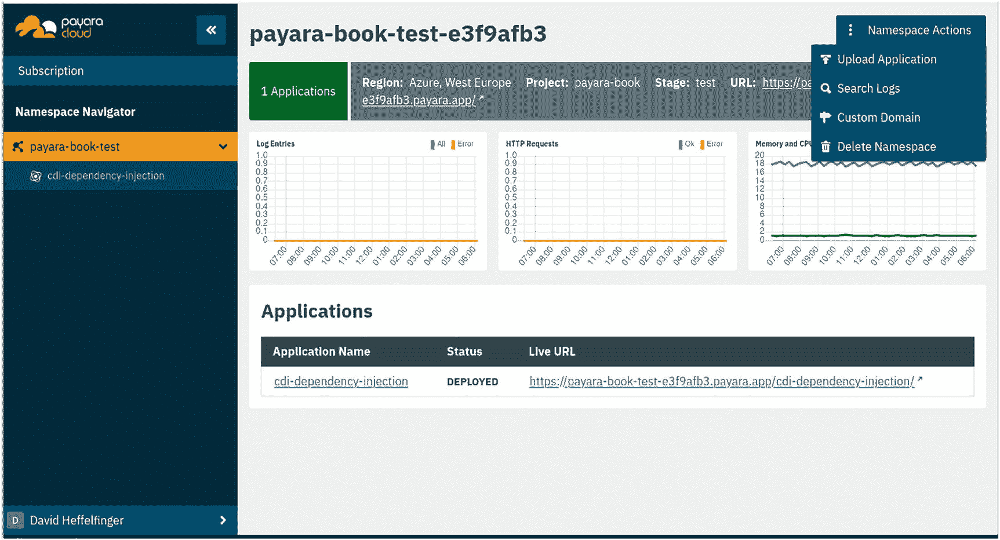

图 13-9

导航至自定义域名配置

然后，在*自定义域名*字段中指定我们的自定义域名，如图 13-10 所示；该域名必须是已在域名注册商处注册的有效域名。

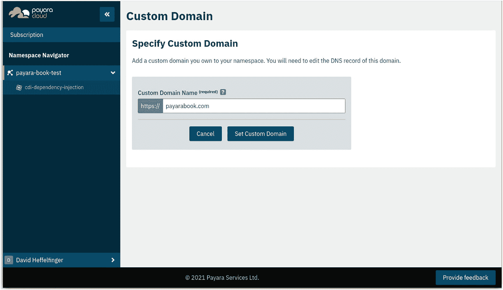

图 13-10

自定义域名配置

然后，我们需要点击*设置自定义域名*；在下一页中，我们会获得一个 CNAME DNS 记录，可用于在获取域名的域名注册商处更新我们的域名。图 13-11 展示了 Payara Cloud 提供的 CNAME DNS 记录示例。

更新 CNAME DNS 记录的过程因域名注册商而异，但通常通过注册商提供的网页界面完成。

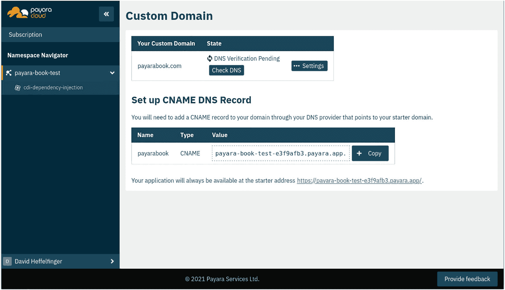

图 13-11

CNAME DNS 记录配置

更新 CNAME DNS 记录后，我们可以点击“检查 DNS”以确保其设置正确。如果设置正确，我们现在就可以使用自定义域名访问应用程序了。

## 总结

在本章中，我们介绍了 Payara Cloud，以及如何使用它来部署应用程序到云端，而无需更新复杂的配置文件。

我们涵盖了如何注册 Payara Cloud，以及任何能成功部署到 Payara Micro 的应用程序如何部署到 Payara Cloud。

我们还介绍了如何配置部署到 Payara Cloud 的应用程序，包括如何设置运行时大小、如何设置上下文根，以及如何在必要时隐藏路径使其不被互联网访问。

此外，我们还介绍了应用程序成功部署到 Payara Cloud 后如何访问它们。

最后，我们介绍了如何为 Payara Cloud 应用程序使用自定义域名。


索引 A 应用指标属性 @ConcurrentGauge @Counted 注解 Counter 接口 @Gauge @Metered 编程式指标 @SimplyTimed @Timed 异步客户端接口方法 CompletionStage 接口 端点调用方法 RESTful Web 服务端点 自动聚类 参见聚类 B 物料清单（BOM） C 云应用部署 概念 修改 命名空间 创建 导航 上传 应用开发 运行应用 浏览器窗口 curl 命令 自定义域名 默认域名 index.html 页面 记录配置 注册 聚类 物料清单（BOM） 命令行 数据网格 触发远程 CDI 事件 HTTP 请求 观察者方法 *pom.xml* 文件 作用域 Bean Uber JAR WAR 文件 配置源 抽象方法 云提供商 转换器 getCustomer() 方法 数值类型 Payara Micro 属性 注册 目录树 自定义配置目录树 动态属性 环境变量 getValue() 方法 序数值 Payara Micro 应用集群配置目录 域属性 getValue() 方法 JDBC 配置 JNDI 属性 LDAP 目录 模块 密码文件 postdeploycommandfile 参数 服务器配置属性文件 源搜索范围 系统属性 上下文与依赖注入（CDI） DI 事件 应用作用域 触发事件 监听 限定符 作用域类 生命周期 MicroProfile REST 客户端 *pom.xml* 文件 @PostConstruct/@PreDestroy 注解 作用域 跨域资源共享（CORS） D, E 依赖注入（DI） CDI Bean CodeLookup 类 curl 命令行 文档 @APIResponse 注解 自动生成 定义 DELETE/PUT 请求 employee 类 fireEmployee() 方法 GET 请求 HTTP 响应 OpenAPI 配置 CORS 标头 自定义 OpenAPI 端点 禁用选项 MicroProfile 配置 Payara Micro 安全操作 查询参数 RESTful Web 服务 更新 Web 服务 F 容错 异步属性 @CircuitBreaker 注解 并发执行 @Bulkhead 注解 信号量风格 线程池风格 失败端点 fallbackMethod 属性 handle() 方法 最大持续时间 重试执行 停止调用端点 G GlassFish 应用 H, I 健康检查 asadmin 命令 自定义健康端点 免费检查 @Livenesscheck 安全选项 服务就绪 程序 J, K Jakarta EE Java 数据库连接（JDBC） Java EE（Java 企业版） Java 语言 Java 命名与目录接口（JNDI） JavaScript 对象表示法（JSON） MicroProfile REST 客户端 Java 2 平台企业版（J2EE） Java 虚拟机（JVM） JSON Web 令牌（JWT） jwtenizr 文件 Keycloak 工具 MicroProfile claimNames() 方法 配置属性 @HeaderParam 接口 @LoginConfig 注解 REST 客户端 API 规范 测试与学习 令牌信息 L 轻量级目录访问协议（LDAP） M, N, O 指标 访问 基础应用 参见应用指标 端点 JSON 格式 Payara Micro 禁用选项 端点参数 安全静态指标 Prometheus 格式 供应商 MicroProfile MicroProfile REST 客户端 抽象方法 CDI 应用作用域 DELETE 请求 GET 请求 @Inject 注解 接口 JSON 字符串 META-INF 概述 路径参数 POST 请求 属性文件 PUT 请求 查询参数 微服务 P, Q Payara Payara Micro 配置源 转换器 嵌入 设计 健康检查 实现 指标 请求追踪 Payara Micro 应用 BOM 命令行选项 环境设置 Jakarta EE/MicroProfile JSON 数据 Maven 插件 参数 仓库 RESTful Web 服务 参见 RESTful Web 服务 运行应用代码 URL/RESTful Web 服务 普通旧式 Java 对象（POJO） 上下文 DI R 请求追踪 命令行参数 自定义 禁用 启用 enableRequestTracing 选项 操作名称 跨度/追踪定义 HTTP 请求 输出/结果 *pom.xml* 文件 POST 请求 PUT 请求 setTag() 方法 源代码 Tracer.buildSpan() 方法 时间单位 @Traced 注解 RESTful Web 服务 DELETE 请求 GET 请求 PATCH 请求 @Path 注解 POST 请求 PUT 请求 S 服务端技术 同步端点 T 线程池风格 U, V, W, X, Y, Z Uber JAR
