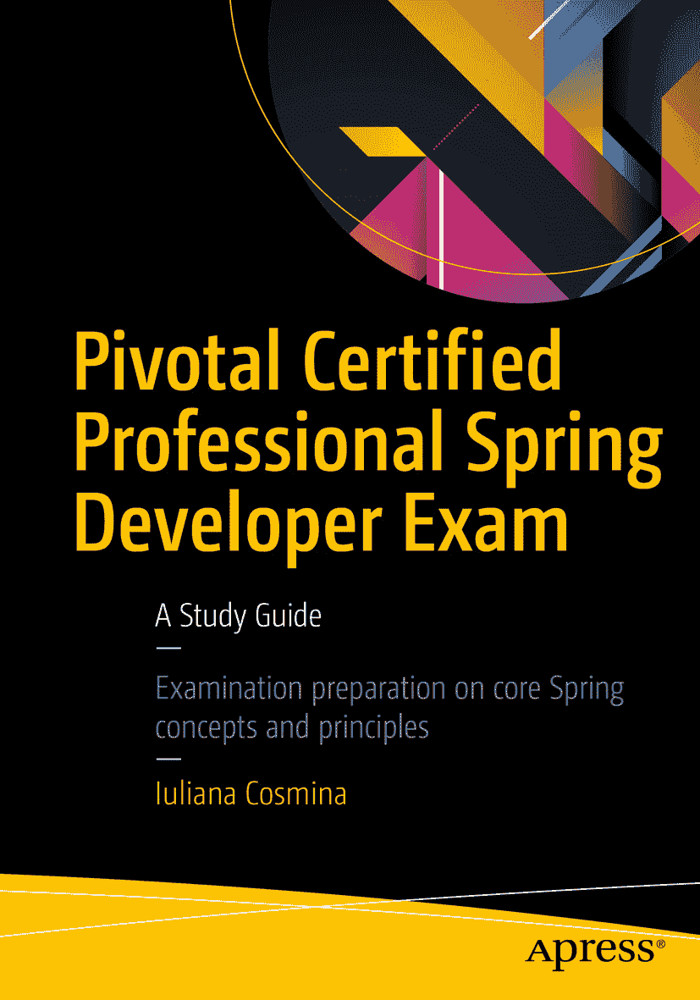

尤利安娜·科斯米娜 Pivotal 认证专业 Spring 开发者考试学习指南

ISBN 978-1-4842-0812-0 电子书 ISBN 978-1-4842-0811-3 DOI 10.1007/978-1-4842-0811-3 © 尤利安娜·科斯米娜 2017 Pivotal 认证 Spring Web 应用程序开发者考试 封面设计：Freepik 董事总经理：韦尔莫德·斯帕尔 采购编辑：史蒂夫·安格林 开发编辑：马修·穆迪 技术审校：曼努埃尔·乔丹·埃莱拉 协调编辑：马克·鲍尔斯 文字编辑：大卫·克雷默 排版：SPi Global 索引制作：SPi Global 插图制作：SPi Global 有关翻译信息，请发送电子邮件至 `rights@apress.com`，或访问 [`http://www.apress.com/rights-permissions`](http://www.apress.com/rights-permissions)。Apress 图书可批量购买，用于学术、企业或促销用途。大多数图书也提供电子书版本和许可证。更多信息，请参考我们的印刷版和电子版批量销售网页：[`http://www.apress.com/us/services/bulk-sales`](http://www.apress.com/us/services/bulk-sales)。本作品受版权保护。出版商保留所有权利，涉及材料的全部或部分，特别是翻译、重印、重用插图、朗诵、广播、微缩胶片复制或任何其他物理形式的复制权，以及信息存储与检索、电子改编、计算机软件或现在已知或以后开发的类似或不同方法的传输权。与本法律保留条款的例外情况是，与评论或学术分析相关的简短摘录，或专门为输入计算机系统并执行而提供的材料，仅供购买者独家使用。仅允许在出版商所在地现行版权法的规定下复制本出版物或其部分内容，且必须始终从 Springer 获得使用许可。使用许可可通过版权清算中心的 RightsLink 获取。违反行为将根据相应的版权法受到起诉。本书中可能出现商标名称、标识和图像。我们不以每次出现商标名称、标识或图像时都使用商标符号，而是仅以编辑方式使用这些名称、标识和图像，以利于商标所有者，且无意侵犯商标权。本出版物中对商品名称、商标、服务标志及类似术语的使用，即使未明确标识，也不应被视为对其是否受专有权利保护的意见表达。尽管本书中的建议和信息在出版时被认为是真实准确的，但作者、编辑和出版商均不对可能存在的任何错误或遗漏承担法律责任。出版商对本书所含材料不作任何明示或暗示的保证。印刷于无酸纸上 本书通过 Springer Science+Business Media New York 向全球图书贸易发行，地址：233 Spring Street, 6th Floor, New York, NY 10013。电话：1-800-SPRINGER，传真：(201) 348-4505，电子邮件：orders-ny@springer-sbm.com，或访问 www.springeronline.com。Apress Media, LLC 是加利福尼亚州的有限责任公司，其唯一成员（所有者）是 Springer Science + Business Media Finance Inc (SSBM Finance Inc)。SSBM Finance Inc 是一家特拉华州公司。献给所有充满热情的 Java 开发者，永不停歇学习，永不停止提升技能。献给我所有的朋友，感谢你们支持我完成这本书；你们不知道你们对我有多重要。引言

自从我编写第一个 Spring 项目以来，已经过去了四年多。从那时起，Spring 框架已经发展成为一项成熟的技术，提供了构建复杂且可靠的 Java 企业应用程序所需的一切。

到目前为止，Spring 已经发布了四个主要版本，第五个版本也即将到来。除了通过认证考试所需的官方学习指南之外，在本书构思之前，还没有像这样的额外资源。

本学习指南全面概述了从零开始创建 Spring 核心应用程序所涉及的所有技术。它循序渐进地引导你进入 Spring 世界，涵盖了 Spring 3 和 Spring 4。本书也涵盖了诸如 RMI 和 JMS 等更高级的主题，因为仍有公司倾向于使用它们，开发者在实际工作中也可能会遇到。

本书附带一个名为 Pet Sitter 的多模块项目，涵盖了书中介绍的每一个示例。在本书编写过程中，Spring 发布了新版本，Intellij IDEA 发布了新版本，Gradle 也发布了新版本。我升级到了新版本，以便提供最新的信息，并使本书与官方文档保持同步。一个审阅团队已经审阅了本书，但如果您发现任何不一致之处，请发送电子邮件至 `editorial` `@apress.com`，我们将进行更正。

本书的示例源代码可以通过图书产品页面上的“下载源代码”按钮在 GitHub 上找到，该页面位于 [`www.apress.com/9781484208120`](http://www.apress.com/9781484208120)。该代码将得到维护，与新技术版本保持同步，并根据使用它学习 Spring 的开发者的建议进行丰富。

Pet Sitter 项目的代码也将同样在公共 GitHub 仓库中提供。

附录中提供了每章末尾问题的答案，以及与可用于开发和运行本书代码示例的开发工具相关的额外细节，这些也将作为托管在 GitHub 上的源代码包的一部分提供。一份模拟实践考试也将发布在 Pet Sitter 仓库中。

我真心希望您能像我享受编写本书一样，享受使用本书学习 Spring 的过程。

作者在本书中引用的任何源代码或其他补充材料，读者均可通过图书产品页面获取，该页面位于 [`www.apress.com/9781484208120`](http://www.apress.com/9781484208120)。如需更详细信息，请访问 [`http://www.apress.com/source-code`](http://www.apress.com/source-code)。致谢

编写这本指南需要大量的团队合作。这是我第二次撰写技术书籍，如果没有马克·鲍尔斯和曼努埃尔·乔丹·埃莱拉给予我的所有帮助和建议，我是不可能完成的。马克一直非常支持我，与我分享他撰写书籍的经验，并在我因认为自己的工作不够好而准备放弃时鼓励我。当我因写作瓶颈或个人问题而错过截止日期时，他也非常理解和宽容。

曼努埃尔是一位出色的合作者；我喜欢我们之间关于技术思想的交流，对此我深表感激，因为与他们合作帮助我在专业上得到了成长。非常感谢帮助我将我的技术术语转化为通俗易懂文字的团队。

最重要的是，我要感谢史蒂夫·安格林信任我完成这本书。

Apress 出版了许多我在学习期间及之后阅读并用于提升专业水平的书籍。能够为 Apress 撰写并出版一本书，对我来说是莫大的荣幸，能够为下一代开发者的教育做出贡献，也让我感到无比满足。

我感谢所有耐心倾听我抱怨失眠、工作繁重和写作瓶颈的朋友们。感谢你们一直以来的支持，并确保我在撰写本书期间仍能享受一些乐趣。

此外，我还要特别感谢玛丽安·洛帕特尼克、克里斯蒂娜·卢泰和安德烈娅·朱格雷安。这三位特别的人不断提醒我，我在自己的专业领域是个厉害角色，只要我全力以赴，结果一定会很棒，从而确保我完成本书的决心从未动摇。

目录 第 1 章：书籍概述 1 什么是 Spring，为何你应该对它感兴趣？ 1 本书的重点是什么？ 3 谁应该阅读本书？ 3 关于认证考试 3 如何将本书用作学习指南 5 本书的结构是怎样的？ 5 每章的结构 6 推荐的开发环境 7 推荐的 JVM 8 推荐的项目构建工具 8 推荐的 IDE 10 项目示例 11 第 2 章：Spring Bean 生命周期与配置 17 传统风格的应用开发 17 Spring IoC 与依赖注入 24 Spring 配置 29 通过 XML 提供配置 29 丰富 XML 配置 53 应用上下文与 Bean 生命周期 64 使用 Java 配置和注解提供配置 85 总结 110 快速测验 111 第 3 章：测试 Spring 应用 115 几种测试类型 115 测试驱动开发 115 单元测试与集成测试 116 使用桩进行测试 117 使用模拟对象进行测试 124 使用 Spring 进行测试 134 使用 Profile 144 总结 146 快速测验 146 实践练习 148 第 4 章：使用 Spring 进行面向切面编程 153 AOP 解决的问题 154 Spring AOP 157 AOP 术语 158 快速入门 159 使用 XML 配置切面支持 165 定义切入点 165 实现通知 172 结论 178 总结 181 快速测验 181 实践练习 183 第 5 章：数据访问 185 使用 JDBC 进行基本数据访问 187 Spring 数据访问 189 介绍 JdbcTemplate 190 Spring 数据访问异常 207 事务环境中的数据访问配置 209 Spring 中事务管理的工作原理 212 配置事务支持 214 介绍 Hibernate 与 ORM 235 Session 与 Hibernate 配置 235 Session 与 Hibernate 查询 240 异常映射 243 对象关系映射 245 Java 持久化 API 247 Spring Data JPA 256 **Spring 与 MongoDB** 260 总结 265 测验 265 第 6 章：Spring Web 271 Spring Web 应用配置 274 快速入门 276 XML 281 @MVC 285 Spring MVC 的 Java 配置 286 摆脱 web.xml 288 运行 Spring Web 应用 291 使用 Jetty 运行 292 使用 Tomcat 运行 294 Spring Security 298 Spring Security 配置 301 XML 配置 301 无 web.xml 的 Spring XML 配置 313 Java 配置 313 安全标签库 317 方法安全 321 Spring Boot 326 配置 327 使用 YAML 进行配置 338 日志记录 341 使用 Spring Boot 进行测试 341 总结 344 测验 345 第 7 章：Spring 高级主题 349 Spring 远程调用 350 Spring 远程配置 353 Spring JMS 362 JMS 连接与会话 363 JMS 消息 364 JMS 目的地 365 Apache ActiveMQ 367 Spring JmsTemplate 370 使用 Spring Boot 的 JMS 378 Spring Web 服务 382 SOAP 消息 384 使用 XJC 生成 Java 代码 386 Spring Boot WS 应用 387 发布 WSDL 391 测试 Web 服务应用 392 Spring REST 395 Spring 对 REST 的支持 397 异常处理 402 HTTP 消息转换器 404 RESTful 应用的 Spring MVC 配置 405 使用 RestTemplate 测试 RESTful 应用 407 REST 的优势 416 Spring JMX 421 JMX 架构 421 纯 JMX 423 Spring JMX 424 总结 432 快速测验 433 第 8 章：使用 Spring Cloud 的 Spring 微服务 435 使用 Spring 的微服务 436 注册与发现服务器 439 微服务开发 442 微服务通信 451 更多新特性 456 实践部分 457 总结 458 快速测验 458 索引 461 内容一览 关于作者 xiii   关于技术审校者 xv   致谢 xvii   引言 xix   第 1 章：书籍概述 1   第 2 章：Spring Bean 生命周期与配置 17   第 3 章：测试 Spring 应用 115   第 4 章：使用 Spring 进行面向切面编程 153   第 5 章：数据访问 185   第 6 章：Spring Web 271   第 7 章：Spring 高级主题 349   第 8 章：使用 Spring Cloud 的 Spring 微服务 435   索引 461   关于作者与关于技术审校者 关于作者 关于技术审校者

