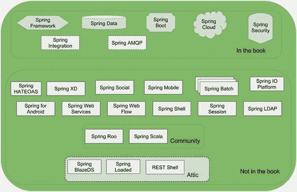
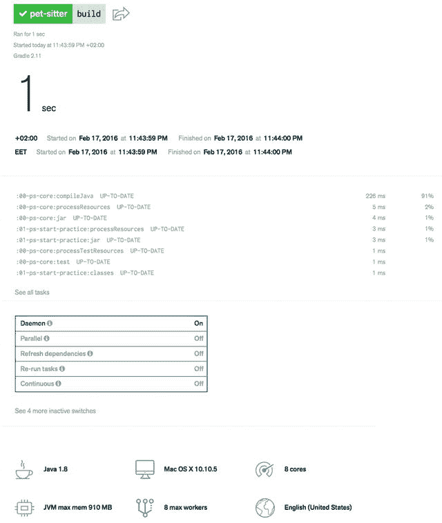
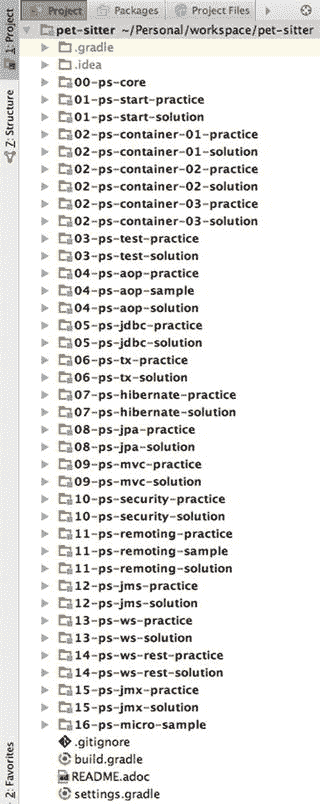
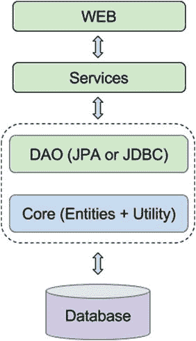
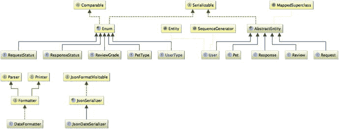
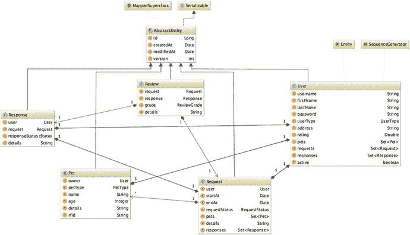
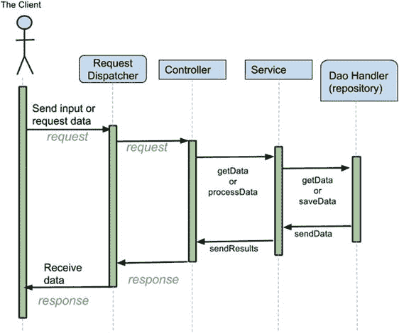

# 1. 书籍概述

Spring 是目前最具影响力且发展最快的 Java 框架之一。每当有新的创业想法诞生，如果开发语言是 Java，Spring 就会被纳入考量。到 2016 年 10 月 1 日，Spring 将迎来十四岁生日，这些年来，它已成长为一项成熟的软件技术。¹

本书涵盖了多个项目的核心功能。官方认证考试所需的主题会深入讲解，而所有扩展内容则简明扼要地呈现，旨在让你一窥门径，激发你进一步学习的兴趣。

## 什么是 Spring，为什么你应该对它感兴趣？

当使用 Java 构建项目时，大量功能需要从头开始构建。然而，由于我们身处开源世界，许多有用的功能早已被构建出来，并且可以免费获取。很久以前，当 Java 世界还相当小众时，如果你在项目中使用他人开发并以 `*.jar` 形式发布的开源代码，你会说你在使用一个库。但随着时间的推移，软件开发世界不断演进，库也日益壮大。它们演变成了框架。因为它们不再是一个可以导入的单一 `*.jar` 文件，而是变成了一个由或多或少解耦的、职责各异的库组成的集合，你可以只导入自己需要的部分。随着框架的发展，用于构建项目并将框架作为依赖项添加的工具也随之演进。目前最广泛使用的项目构建工具之一是 Maven，但新的构建工具正在抢占风头。本书将使用其中一种新型构建工具来构建项目。稍后会介绍它。

Spring 框架于 2002 年 10 月发布，是一个使用 Java 开发的开源框架和控制反转容器。随着 Java 的发展，Spring 也在不断演进。本书涵盖的 Spring 4.3 版本与 Java 8 完全兼容，而 Spring 5 计划于 2016 年第四季度发布。² 其意图是使其与计划于 2016 年 9 月发布的 Java 9 兼容。³ 但由于 Java 8 的发布延迟了六个多月，目前一切都还不确定。

Spring 自带了许多已实现好的默认行为。名为“基础设施 Bean”的组件拥有默认配置，这些配置可以直接使用，也可以轻松定制以满足项目需求。由于 Spring 遵循“约定优于配置”原则进行构建，它减少了开发人员在编写代码时需要做出的决策数量，因为基础设施 Bean 可用于创建功能性的基础应用程序，且只需极少的定制（甚至无需定制）。

Spring 是开源的，这意味着许多才华横溢的开发人员为其做出了贡献，但分析所开发组件质量的最终决定权属于 Pivotal Spring 开发团队，在 Pivotal 与 VMware 合并之前，该团队曾被称为 SpringSource 团队。Spring 框架的完整代码在 Github 上对公众开放，⁴ 任何使用 Spring 的开发人员都可以复刻仓库并提出修改建议。

一个 Java 应用程序本质上是由相互通信的对象组成的。Spring 在 Java 应用程序开发中获得如此多赞誉的原因在于，它通过提供全面的基础设施支持来组装对象，从而简化了对象的连接和断开。使用 Spring 开发 Java 应用程序就像搭建一个松散连接的乐高城堡；每个对象都是一块乐高积木，你可以轻松地将其移除并替换为另一块。Spring 目前是 Java 框架中的 VIP，如果你读到这里还没有对它产生丝毫兴趣，那说明我这本书写得太糟糕了，你应该写封邮件告诉我。

在进一步介绍本书将为你提供什么之前，让我们先概览一下 Spring 项目。图 1-1 描绘了所有的 Spring 项目。对于 2016 年，有 19 个主要项目、2 个社区项目，以及 3 个可以说是“被搁置”的项目，因为未来将不再对它们进行贡献，它们将被逐步淘汰。



图 1-1.

Spring Web 技术栈。（用虚线轮廓绘制的项目在本书中仅会部分涉及。）

## 本书的重点是什么？

本书涵盖的主题主要是 Spring 框架对后端层的支持组件。我们仅对 Spring Boot、Spring Data JPA、REST、MVC 和微服务进行浅尝辄止的介绍。本书旨在为开发一个完整的 Spring 应用程序提供一条自然的路径。随着每一章的推进，应用程序将变得越来越复杂，直到达到其最终形态，该形态还将包含安全设置、一个简单的 Web 应用程序，并支持 REST 请求。

本书专注于帮助开发人员理解 Spring 的基础设施是如何设计的，以及如何通过几个简单的步骤，最大限度地发挥 Spring 的潜力来编写 Spring 应用程序。其目标如下：

*   使用 Spring 开发应用程序
*   使用 Spring Security 保护资源
*   使用 Spring Test 和其他测试框架（JUnit、JsMock）测试应用程序
*   使用 Gradle⁵ 创建 Spring 应用程序

## 谁应该阅读本书？

本书旨在为使用 Spring 核心组件创建应用程序提供清晰的见解。对于那些希望成为认证 Spring 专业人士⁶ 的开发人员来说，这也是一本非常有帮助的书。这就是为什么官方 Pivotal Spring Core 学习指南中的每一个主题都得到了应有的重视。

你只需要具备最基础的 Java 知识就能很好地利用本书，但每当书中未能完全涵盖某个主题时，应查阅 Java⁷ 和 Spring⁸ 的在线文档。

简而言之，本书是为以下读者编写的：

*   想要初步了解 Spring 的 Java 开发人员
*   有兴趣学习熟练使用 Spring，但对官方认证不感兴趣的 Spring 开发人员
*   希望获得认证并希望得到尽可能多帮助的 Spring 和 Java 开发人员


## 关于认证考试

如果您有兴趣成为认证的 Spring 专业人士，第一步需要访问 Pivotal 官方学习网站 [`http://pivotal.io/training`](http://pivotal.io/training) 并搜索 Spring 认证部分。在那里您将找到有关官方培训的所有详细信息，包括培训地点和时间。培训为期四天，也提供在线培训。在 Pivotal 网站创建账户后，您可以选择所需的培训。完成付款后，如果您选择在线培训，大约一个月后，您将通过邮件收到一个官方培训套件，包含以下内容：

*   一副会议耳机（通常为罗技品牌），用于培训期间聆听讲师讲解并提问。⁹
*   一个专业网络摄像头（通常为罗技品牌），用于培训期间让讲师和同学看到您，从而模拟课堂体验。¹⁰
*   一本 Spring 学习指南，包含讲师在培训期间使用的幻灯片打印版。（出于环保考虑，也可能提供电子版。）
*   一本 Spring 实验手册，包含培训期间实践练习的说明和指导。（出于环保考虑，也可能提供电子版。）
*   一个 Pivotal 官方 U 盘，包含以下内容：
    *   JDK 安装程序
    *   培训期间所需的源代码。每个实验都附带一个缺少配置和代码的小型 Spring 应用程序，学员的任务是补全它，使其成为一个可运行的应用程序。本书附带的代码也采用了相同的模式。
    *   最新稳定版 Spring Tool Suite 的安装程序。课程强制要求使用 U 盘中的版本，因为该安装程序会设置一个包含所有必要依赖项的本地 Maven 仓库，以及一个包含实验源码的完整 Eclipse 项目配置。STS 还内置了一个 tcServer，用于运行 Web 实验应用程序。
    *   Spring 实验手册的 HTML 或 PDF 版本。

如果您决定不参加在线培训课程，则不会收到耳机和网络摄像头。培训套件和其他材料将在您抵达培训地点时发放。培训结束后，您将收到一张免费凭证，用于在附近的授权考试中心预约认证考试。基本上，发给您的凭证或凭证代码是您已参加官方 Spring Web 培训的证明。

!

考试时长为九十分钟，包含五十道题目。题目包括单选题和多选题。多选题会明确告知您需要选择多少个正确答案。本书中的题目实际上更难，因为不会告知您需要选择的正确选项数量。但附录中会提供答案的完整解释。

考试题目将（大致）涵盖以下主题：

*   Spring 概述容器、IoC 和依赖注入
*   SpEL 和 Spring AOP
*   Spring JDBC、事务、ORM
*   Spring MVC 和 Web 层
*   Spring Security
*   Spring 消息传递和 REST
*   Spring 测试

考试及格分数为 76%。这意味着需要答对 38 题才能通过。大多数题目会向您展示一段 Java 代码或配置，并询问其作用，因此请确保您理解本书附带的代码，并编写自己的 Bean 和配置，以便更好地理解框架。好消息是，考试中的所有代码都可以在您参加官方培训时获得的源码中找到。其他题目会给出关于 Spring Web 的断言，并要求您选择正确或错误的陈述。

如果您阅读本书、理解所有示例、完成实践练习，然后参加官方培训，我建议您尽快参加认证考试。不要在完成培训后间隔太长时间才参加考试，因为我们毕竟都是凡人，信息可能会被遗忘。此外，认证凭证的有效期仅为一年。如果第一次考试失败，您可以重考，但需要花费约 150 美元。

## 如何将本书用作学习指南

本书的编写方式旨在引导您逐步了解 Spring 这一精彩技术。它遵循与官方培训相同的学习曲线，并侧重于认证考试所需的相同主题，因为这些主题在实际生产应用中也最为需要。不需要用于认证考试的主题会进行标记，以便您知道可以跳过，但如果您对 Spring 真正感兴趣，肯定不会这样做。

主要区别在于实践示例中使用的工具，这些工具将在后面简要介绍。

## 本书的结构是怎样的？

本书包含八个章节和一个附录。官方 Spring 指南有十六个章节，但为了本书的目的，相关主题被整合在一起。例如，官方学习指南有四个独立的章节来介绍依赖注入、Spring Core 基础和配置。本书只有一个关于这些主题的大章节：第 2 章——Bean 生命周期与配置。

章节列表及其简要说明见表 1-1。

表 1-1.

按章节划分的主题列表

| 章节 | 主题 | 详情 |
| --- | --- | --- |
| 1 | 书籍概述 | Spring 历史、实践所用技术与工具介绍 |
| 2 | Bean 生命周期与配置 | Spring 核心基本概念、组件和配置 |
| 3 | 测试 Spring 应用程序 | 如何测试 Spring 应用程序、最常用的测试库和测试原则 |
| 4 | 面向切面编程 | AOP 概念、解决的问题及其在 Spring 中的支持方式 |
| 5 | 数据访问 | 使用 JDBC、Hibernate 和 Spring Data JPA 的高级 Spring 数据访问 |
| 6 | Spring Web | Spring MVC 基础介绍 |
| 7 | Spring 高级主题 | 远程处理、消息传递、基于 REST 的 Web 服务 |
| 8 | 使用 Spring Cloud 的 Spring 微服务 | Spring 微服务介绍及其用途 |
| A | 附录 | 两套模拟考试、复习题答案及其他说明 |


### 各章节结构

你正在阅读的引言章节涵盖了使用本书的每位开发者都应了解的 Spring 基础知识：什么是 Spring、它是如何演进的、有多少官方 Spring 项目、用于构建和运行实践练习的技术、如何注册成为认证 Spring 专业人士的考试等。本章是个例外，其结构与其他章节不同，旨在为你后续内容做好准备。

其余章节旨在介绍 Spring 模块及相关技术，帮助你构建特定类型的 Spring 应用程序。每章分为若干小节，但总体结构如下：

*   基础知识
*   配置
*   组件
*   总结
*   快速测验
*   实践练习

较长的章节会偏离此结构，在关键小节后引入小型实践练习，因为解决这些练习有助于你检查理解程度并巩固对所学组件的知识。

与 Spring 理解无关的代码不会在本书中全部引用，但你可以在本书的实践项目中获取。

#### 约定

!

此符号出现在需要特别关注的段落前。

** 此符号出现在可跳过的观察或执行步骤段落前。

? 此符号出现在面向用户的问题前。

. . . 此符号表示与示例无关的缺失代码。

CC 此符号出现在描述 Spring 中“约定优于配置”实践的段落前，这是一种帮助开发者减少工作量的默认行为。

[随机文本] 当文本被方括号包围时，表示括号内的内容应替换为与上下文相关的概念。

#### 下载代码

本书附有代码示例和实践练习。其中会有需要你填充的缺失代码片段，以使应用程序正常运行并测试你对 Spring Web 的理解。我建议你仔细阅读代码示例并完成练习，因为类似的代码和配置会出现在认证考试中。

以下下载内容可供使用：

*   使用 XML 配置的实践部分编程示例源代码
*   使用 Java 配置的实践部分编程示例源代码

你可以从 Apress 网站的源代码区域 [`http://www.apress.com`](http://www.apress.com/) 下载这些内容。

#### 联系作者

关于 Iuliana Cosmina 的更多信息，请访问 [`http://ro.linkedin.com/in/iulianacosmina`](http://ro.linkedin.com/in/iulianacosmina) 。可通过 `mailto:iuliana.cosmina@gmail.com` 联系她。

关注她的个人编程活动：[`https://github.com/iuliana`](https://github.com/iuliana) 。

## 推荐开发环境

如果你决定参加官方课程，你会注意到本书推荐的开发环境与课程中使用的环境有显著差异。推荐了不同的编辑器、不同的应用服务器，甚至不同的构建工具。这样做的目的是为了提升和扩展你的开发经验，并提供实用的开发基础设施。每个选择背后的动机将在相应章节中提及。

### 推荐 JVM

 Java 8，Oracle 官方 JVM。从 [`http`](http://www.oracle.com/) `:` [`//www.oracle.com`](http://www.oracle.com/) 下载与你操作系统匹配的 JDK 并安装。

!

建议你将 `JAVA_HOME` 环境变量设置为指向 Java 8 的安装目录（JDK 解压到的目录），并将 `%JAVA_HOME%\bin`（Windows）或 `$JAVA_HOME/bin`（基于 Unix 的操作系统）添加到系统全局路径中。这样做是为了确保其他用 Java 编写的开发应用程序使用此 Java 版本，并防止开发过程中出现奇怪的兼容性错误。

! 打开终端（Windows 中的 `命令提示符`，MacOs 和 Linux 中已安装的任何类型终端），输入以下命令，验证操作系统识别的 Java 版本是否为你刚刚安装的版本：

```
java -version
```

你应该会看到类似以下内容：

```
java version "1.8.0_74"
Java(TM) SE Runtime Environment (build 1.8.0_74-b02)
Java HotSpot(TM) 64-Bit Server VM (build 25.74-b02, mixed mode)
```


### 推荐的项目构建工具

 Grade 2.x ** 本书附带的源代码可以使用 Gradle 包装器进行编译和执行，该包装器在 Windows 上是一个批处理脚本，在其他操作系统上则是一个 Shell 脚本。当你通过包装器启动 Gradle 构建时，Gradle 会被自动下载并用于运行构建；因此，你无需像之前所述那样手动安装 Gradle。关于如何操作的具体说明，可以查阅 [`http://www.gradle.org/docs/current/userguide/gradle_wrapper.html`](http://www.gradle.org/docs/current/userguide/gradle_wrapper.html) 上的公开文档。

一个好的实践是将代码和构建工具分开存放，但对于本学习指南，我们选择使用包装器，以便通过跳过 Gradle 安装步骤来轻松搭建练习环境，同时因为推荐的源代码编辑器内部也使用了该包装器。

如果你决定在编辑器之外使用 Gradle，可以从其官方网站 [`https`](https://www.gradle.org/) `:` [`//www.gradle.org/`](https://www.gradle.org/) 仅下载二进制文件（或者如果你好奇，也可以下载包含二进制文件、源代码和文档的完整包），解压后将其内容复制到硬盘上的某个位置。创建一个 `GRADLE_HOME` 环境变量，并将其指向你解压 Gradle 的位置。同时，将 `%GRADLE_HOME%\bin`（Windows 系统）或 `$GRADLE_HOME/bin`（基于 Unix 的操作系统）添加到系统的全局路径中。

选择 Gradle 作为本书源代码的构建工具，是因为它设置简单、配置文件小巧、定义执行任务灵活，而且 Pivotal Spring 团队目前也使用它来构建所有 Spring 项目。

!

打开一个终端（在 `Windows` 中是 `命令提示符`，在 `MacOs` 和 `Linux` 上是你安装的任何类型的终端），输入以下命令，验证操作系统识别的 Gradle 版本是否是你刚刚安装的：

```
gradle -version
```

你应该会看到类似如下的输出：

```

Gradle 2.11

构建时间：    2016-02-08 07:59:16 UTC
构建编号：  无
修订版本：  584db1c7c90bdd1de1d1c4c51271c665bfcba978
Groovy：     2.4.4
Ant：        Apache Ant(TM) 版本 1.9.3，编译于 2013 年 12 月 23 日
JVM：        1.8.0_74 (Oracle Corporation 25.74-b02)
操作系统：   -- 你使用的任何操作系统 --
```

上述文本的显示，确认了 Gradle 命令可以在你的终端中执行；因此，Gradle 已成功安装。

使用 Gradle 来构建本书项目的原因在于其简洁性。Gradle 最近被介绍为现代开源的多语言构建自动化系统，Gradle 团队现在还会帮助你分析构建过程以证明这一点。Gradle 现在提供了在其网站上注册收据的功能，该收据将用于连接网站并生成构建统计信息。本书的项目将使用 Gradle 团队提供的这项新服务，让你随时了解项目随每个章节的进展。

如果你访问 [`https://gradle.com/demo/`](https://gradle.com/demo/) 并按照演示中的说明操作，就可以构建你的项目，并获得一组关于项目和团队健康状况的统计数据。在构思的初始阶段，项目非常简单，因此初始的自动构建提供的信息并不多。在图 1-2 中，你可以看到项目初始阶段的统计数据。如图所示，构建耗时一秒，没有运行任何测试，JVM 运行此构建最多需要 910 MB 的内存。



图 1-2.

Gradle.com 构建统计数据

### 推荐的 IDE

 本学习指南推荐的 IDE 是 IntelliJ IDEA。原因在于它是最智能的 Java IDE。IntelliJ IDEA 为 Java EE 和 Spring 提供了出色的框架特定编码辅助和生产力提升功能，并且还包含对 Maven 和 Gradle 的支持。它是帮助你专注于学习 Spring（而不是学习如何使用 IDE）的完美选择。可以从 JetBrains 官方网站 [`https://www.jetbrains.com/idea/`](https://www.jetbrains.com/idea/) 下载。它对你的操作系统也很轻量，并且非常易于使用。

由于本书附带项目中的 Web 应用程序将使用 Spring Boot 运行，你可以使用社区版来构建并解决项目中的待办事项。但如果你希望获得使用 Java 和 Spring 进行开发的专业体验，可以尝试使用旗舰版，该版本有三十天的试用期。本书中涉及代码运行、启动器创建以及其他 IDE 相关细节的截图均使用 IntelliJ IDEA 旗舰版制作。

我相信 IDE 应该足够易用和直观，让你能够专注于真正重要的事情：你正在实现的解决方案。但如果你已经熟悉其他 Java 编辑器，只要它支持 Gradle，你也可以继续使用它。


### 项目示例

本书附带的项目名为 **Pet Sitter**。你可能已经猜到，这是一个概念验证应用，旨在帮助宠物主人在度假或因故不得不让宠物独处时，找到可以照顾宠物的人。该项目应提供以下功能：

*   用户应拥有一个安全账户才能访问应用程序。账户类型可以是：
    *   OWNER（主人）= 仅为其宠物寻找看护人的用户
    *   SITTER（看护人）= 仅寻求提供宠物看护服务的用户
    *   BOTH（两者）= 兼具以上两种身份的用户
    *   ADMIN（管理员）= 拥有特殊权限，可管理网站上其他用户活动的账户
*   类型为 OWNER 的用户账户可以关联一个或多个宠物实例。
*   每只宠物必须植入 RFID¹¹ 微芯片，并且其条形码应提供给应用程序。
*   类型为 OWNER 的用户账户能够为多个时间段创建宠物看护请求。
*   类型为 SITTER 的用户账户可以通过创建响应对象来回复请求，这些响应对象将由该请求的主人批准或拒绝。
*   类型为 BOTH 的用户账户既可以充当 OWNER，也可以充当 SITTER。
*   管理员账户可以因不活跃而停用其他类型的账户。
*   宠物看护人和主人可以通过撰写体验评价来互相评分。评分结果存储在用户账户关联的评分字段中。

该项目是一个多模块的 Gradle 项目。每个模块都涵盖一个特定的 Spring 主题。后缀为 `practice` 的项目缺少部分代码和配置，需要你自行解决，以测试你对 Spring Web 的理解。后缀为 `solution` 的项目是这些任务的建议解决方案。部分项目后缀为 `sample`，表示它们包含需要你分析并特别关注的代码或配置示例。

图 1-3 展示了在 IntelliJ IDEA 中查看的 Pet Sitter 项目结构。每个模块名称都以数字为前缀，因此无论你使用什么 IDE，模块的排列顺序始终与预期使用顺序完全一致。



图 1-3.

Pet Sitter 模块

00-ps-core 模块包含映射到数据库表的实体类、枚举以及其他模块引用的工具类。正如项目名称所示，这是核心项目，即基础层。其他项目是构建于其上的服务层实现。Pet Sitter 在设计时考虑了多层架构，其抽象的内部层次结构如图 1-4 所示。



图 1-4.

Pet Sitter 应用层

实体类拥有 Hibernate 用于唯一标识每个实体实例的公共字段（`id`），用于审计每个实体实例的字段（`createdAt` 和 `modifiedAt`），以及用于跟踪实体修改次数的字段（`version`）。这些字段已被分组到 `AbstractEntity` 类中，以避免代码重复。其他类包括用于定义不同类型对象的枚举，以及其他工具类（用于转换和序列化）。00-ps-core 项目的内容如图 1-5 所示。



图 1-5.

Pet Sitter 00-ps-core 项目内容

类层次结构、类成员以及类之间的关系可以在图 1-6 中进行分析。



图 1-6.

Pet Sitter 实体类层次结构

图 1-7 中的 UML 图描述了应用程序的通用功能。RequestDispatcher 和 Controller 属于 Web 层，此处包含它们是因为 09-ps-mvc-* 和 10-ps-security-* 项目也包含一个简单的 Web 层，并且 Spring Web 的基本概念是认证考试的一部分。



图 1-7.

描述 Pet Sitter 应用程序通用行为的 UML 图

本章没有附带任何练习和示例代码，因此有关项目设置、构建和执行的更多信息将在后续章节中提供。

脚注 1

巧合且有趣的是，在罗马尼亚，你年满十四岁时才能获得第一张身份证，这被认为是智力成熟的年龄，能够让你区分善恶。

2

相关信息可在 Spring 官方博客上找到：[`https://spring.io/blog/2015/08/03/`](https://spring.io/blog/2015/08/03/coming-up-in-2016-spring-framework-4-3-5-0) [`coming-up-in-2016-spring-framework-4-3-5-0`](https://spring.io/blog/2015/08/03/coming-up-in-2016-spring-framework-4-3-5-0) 。

3

相关信息请访问：[`https://jaxenter.com/java-9-release-date-announced-116945.html`](https://jaxenter.com/java-9-release-date-announced-116945.html) 。

4

Github Spring Framework 源码：[`https://github.com/spring-projects/spring-framework`](https://github.com/spring-projects/spring-framework) 。

5

Gradle 是一个自动化构建工具，易于配置和使用，适用于任何类型的应用程序。其构建文件使用 Groovy 编写。Gradle 将 Ant 的强大功能和灵活性，与 Maven 的依赖管理和约定相结合，形成了一种更有效的构建方式。更多信息请访问：[`https://www.gradle.org/`](https://www.gradle.org/) 。

6

请记住，根据官方网站所述，参加 Pivotal 或 VMware 授权培训中心的 Spring Web 培训是成为认证 Spring 专业人士的先决条件：[`http://pivotal.io/academy#certification`](http://pivotal.io/academy#certification) 。

7

JSE8 官方参考：[`http://docs.oracle.com/javase/8/docs/`](http://docs.oracle.com/javase/8/docs/) ；JEE7 官方文档：[`http://docs.oracle`](http://docs.oracle.com/javaee/7/) 。 [`com/javaee/7/`](http://docs.oracle.com/javaee/7/) 。

8

Spring 官方 Javadoc：[`http://docs.spring.io/spring/docs/current/javadoc-api/`](http://docs.spring.io/spring/docs/current/javadoc-api/) ；Spring 参考文档：[`http://`](http://docs.spring.io/spring/docs/current/spring-framework-reference/) [`docs.spring.io/spring/docs/current/spring-framework-reference/`](http://docs.spring.io/spring/docs/current/spring-framework-reference/) 。

9

根据地区和培训中心的不同，此项为可选。

10

根据地区和培训中心的不同，此项同样为可选。

11

射频识别（RFID）利用电磁场自动识别和跟踪附着在物体（此处为宠物）上的标签。


