# 2. Spring Bean 生命周期与配置

Spring 框架提供了一种简便的方法来创建、初始化并连接对象，从而构建出功能完备、低耦合、易于测试的企业级应用程序。每个软件应用都由相互交互、协作并依赖其他组件来成功执行一系列任务的软件组件构成。每个软件组件都为其他组件提供服务，而连接客户组件与提供者组件的过程被称为依赖注入。Spring 提供了一种极其简单的方式来定义它们之间的连接，从而创建应用程序。

在 Spring 出现之前，定义类之间的连接并进行组合，需要遵循不同的设计模式进行开发，例如工厂模式、抽象工厂模式、单例模式、建造者模式、装饰器模式、代理模式、服务定位器模式，甚至反射机制。¹ Spring 的构建正是为了使依赖注入变得简单。这种软件设计模式意味着客户端将依赖解析委托给外部服务。客户端不允许调用注入器服务，因此这种软件模式的特点表现为控制反转行为，也称为“别找我们，我们会找你！”原则。

Spring 用于构建应用程序的软件组件被称为 Bean，它们不过是普通的 Java 对象（POJO），由 Spring 控制反转容器创建、初始化、组装和管理。在 Spring 2.5 版本之前，这些操作的顺序以及对象之间的关系是通过 XML 配置文件提供给 Spring IoC 容器的。从 2.5 版本开始，添加了一小部分用于配置 Bean 的注解，而随着 Spring 3 的推出，引入了使用注解的 Java 配置方式。

本章涵盖了开发人员使用 XML 和 Java 配置来配置基本 Spring 应用程序所需了解的所有内容。同时，还将介绍代表从 XML 配置到完整 Java 配置中间步骤的 Java 注解。

## 旧式应用程序开发

在最完善的开发风格中，Java 应用程序应由 POJO 组成，即每个都承担单一职责的简单 Java 对象。在上一章中，介绍了全书将使用的实体类以及它们之间的关系。为了在最低层级管理这类对象，即应用程序的 DAO（数据访问对象）层，将使用名为 Repository 的类。这些类的目的是从存储支持（通常是某种类型的数据库）中检索、更新、创建和删除实体。

这些类被称为 Repository，在本书的代码中，它们的名称是通过连接实体管理类型的简短标识、所管理实体对象的名称以及 Repo 后缀来创建的。每个类都实现一个简单的接口，该接口定义了为实现该实体类型所需行为而要实现的方法。所有接口都扩展一个公共接口，该接口声明了任何实体类型都应实现的通用方法。例如：保存、按 ID 查找和删除应对每种实体类型都支持。采用这种开发方法是因为 Java 是一种非常面向对象的编程语言，在这种情况下，继承原则得到了很好的遵循。此外，泛型使得这种级别的继承成为可能。

在图 2-1 中，展示了 AbstractRepo 接口以及每种实体类型的子接口。你可以注意到 AbstractRepo 接口如何为每种实体类型定义了典型的方法骨架，而子接口则定义了仅针对特定实体类型设计的方法骨架。

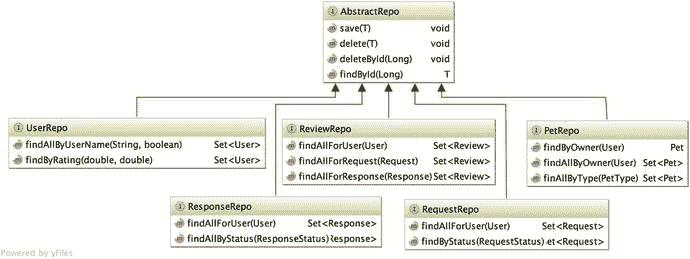

图 2-1.

Repository 接口层次结构

在本节末尾，你可以暂停阅读，以便熟悉此实现。为此专门设计的项目名为 `01-ps-start-practice`。它包含了 Repository 类的桩实现，这些实现可以在测试源目录下的 `com.ps.repo.stub` 包中找到。在图 2-2 中，展示了这些桩类。同样，使用了继承来减少需要编写的代码量，并避免编写重复代码。

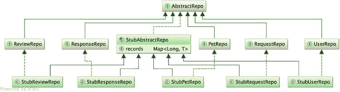

图 2-2.

Repository 桩实现

这些桩 Repository 将所有用户创建的数据存储在一个名为 `records` 的 Map 数据结构中。每个记录的唯一 ID 基于此 Map 的大小生成。该实现在 `StubAbstractRepo` 类中，如下所示，同时包含了所有基本的 Repository 操作：

```
package com.ps.repo.stub;
import com.ps.base.AbstractEntity;
import com.ps.repos.AbstractRepo;
import java.util.HashMap;
import java.util.Map;
public abstract class StubAbstractRepo
implements +underlineAbstractRepo {
protected Map records = new HashMap();
@Override
public void save(T entity) {
if (entity.getId() == null) {
Long id = (long) records.size() + 1;
entity.setId(id);
}
records.put(entity.getId(), entity);
}
@Override
public void delete(T entity) {
records.remove(entity.getId());
}
@Override
public void deleteById(Long entityId) {
records.remove(entityId);
}
@Override
public T findById(Long entityId) {
return records.get(entityId);
}
}
```


在 DAO（数据访问对象）层之后的下一个层次是服务层。该层由一些类组成，这些类负责在将实体对象传递给仓库以持久化更改到存储支持（数据库）之前，对其进行修改。服务层是 Web 层和 DAO 层之间的桥梁，也是本书的重点。它由专门的类组成，这些类协同工作以实现不特定于 Web 或数据访问的行为。它也被称为业务层，因为大多数应用程序业务逻辑都在这里实现。每个服务类都实现一个接口，该接口定义了它必须实现的方法以提供所需的行为。每个服务类使用一个或多个仓库字段来管理实体对象。通常，对于每种实体类型，也存在一个对应的服务类，但也可以定义更复杂的服务，这些服务可以使用多种实体类型来执行复杂任务。在本书的代码中，这样的一个类是 `SimpleOperationsService` 服务，它包含用于执行常见宠物保姆操作的方法，例如创建宠物保姆请求、接受响应、关闭请求以及对宠物主人进行评分。

最复杂的服务类叫做 `SimpleOperationsService`，这个服务类可用于创建响应、接受响应或关闭请求。在图 2-3 中，描绘了所有的服务类和接口。

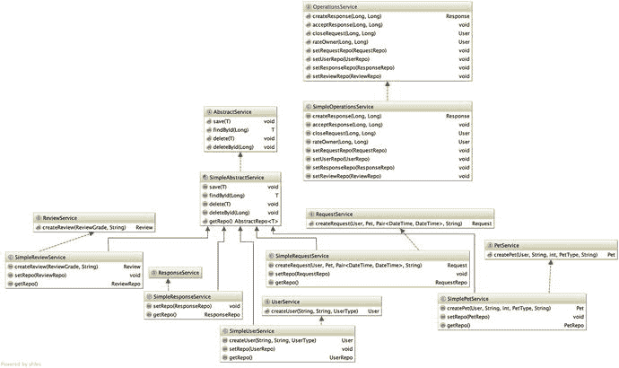

图 2-3.

服务接口与实现

这里介绍的所有类都是用于组装成一个管理用户数据的应用程序的部件。在生产环境中，需要实例化一个服务类，并且必须为其设置一个仓库实例，以便能够正确地管理数据。运行在生产环境中的应用程序支持诸如事务、安全、消息传递、远程访问和缓存等复杂操作。它们与其他应用程序和软件组件相连。为了测试它们，必须隔离其中的部分组件，并且一些非测试对象的组件会被简化的实现所替代。在测试环境中，可以使用桩（stub）或模拟（mock）实现来替代那些不打算被测试过程覆盖的实现。在图 2-4 中，你可以看到一个服务类及其在生产环境和测试环境中所需的依赖关系并列展示。

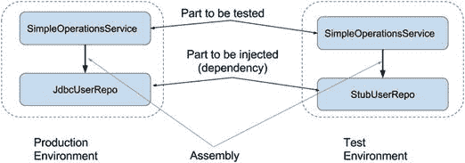

图 2-4.

不同运行环境下的服务类及其依赖关系

与上图相关的代码片段如下所示，它是 `SimpleOperationsService` 类定义的一部分。

```
public class SimpleOperationsService
implements OperationsService {
private UserRepo userRepo;
...
public void setUserRepo(UserRepo userRepo) {
this.userRepo = userRepo;
}
}
```

如你所见，依赖关系是使用抽象类型定义的，在本例中是 `UserRepo` 接口，因此可以提供任何实现。所以在生产环境中，将提供一个 `JdbcUserRepo` 类型的实例，并且该类型将被定义为实现 `UserRepo` 接口。

```
public class JdbcUserRepo extends JdbcAbstractRepo
implements UserRepo {
// 此处的实现不相关
...
}
```

创建一个 `SimpleOperationsService` 类型的实例需要以下步骤：

1.  实例化并初始化仓库实例

```
    JdbcUserRepo userRepo = new JdbcUserRepo(...);
    ```

2.  实例化服务类

```
    OperationsService service = new SimpleOperationsService();
    ```

3.  注入依赖

```
    service.setUserRepo(repo);
    ```

在测试环境中，只要实现了相同的接口，使用模拟对象或桩对象即可：

```
public class StubUserRepo extends StubAbstractRepo
implements UserRepo {
// 此处的实现不相关
...
}
```

对于测试环境，组装步骤是相同的：

```
1\. StubUserRepo userRepo = new StubUserRepo(...);
2\. OperationsService service = new SimpleOperationsService();
3\. service.setUserRepo(repo);
```

Spring 将使组装组件成为一件非常愉快的工作。使用 Spring，根据环境切换组件也是切实可行的。由于连接组件非常容易，编写测试也变得轻而易举，因为每个部分都可以与其他部分隔离并进行测试，而不会受到任何未知影响。Spring 通过 `spring-test.jar` 库为编写测试提供支持。

!

现在你已经了解了 Spring 能帮助你做什么，我们邀请你体验一下没有它时事情是如何完成的。请查看 `01-ps-start-practice` 项目。在 `SimpleOperationsService` 类中有一个名为 `createResponse` 的方法需要实现。创建一个 `Response` 实例的步骤如下：

1.  使用 `userRepo` 检索保姆 `User` 实例  
2.  使用 `requestRepo` 检索 `Request` 实例  
3.  实例化一个 `Response` 实例  
4.  填充 `Response` 实例：
    *   将响应状态设置为 `ResponseStatus.PROPOSED`
    *   将用户设置为保姆实例
    *   使用示例文本设置详细信息
    *   将响应添加到请求对象中
    *   使用 `responseRepo` 保存响应对象

图 2-5 描绘了操作顺序。

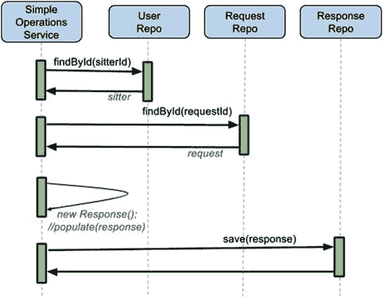

图 2-5.

服务类及其依赖关系

要运行该实现，请在测试目录下查找 `com.ps.repo.services.SimpleOperationsServiceTest` 类。在这个类中，有一个用 `@Test` 注解的方法。这是一个 JUnit 注解。关于测试工具的更多细节将在第 3 章“测试 Spring 应用程序”中介绍。为了在 Intellij IDEA 中运行单元测试，只需右键单击方法名称，就会显示一个类似图 2-6 的菜单。选择 `Run` 选项来运行测试。如果你想在调试模式下运行测试并检查字段值，请选择 `Debug`。

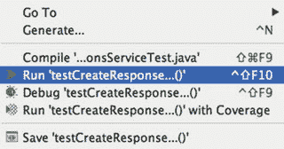

图 2-6.

Intellij IDEA 中的 JUnit 测试上下文菜单

如果实现不正确，测试将失败，并且在 Intellij IDEA 控制台中你应该会看到类似于图 2-7 所示的内容。是的，红色的进度条清楚地表明测试失败了。

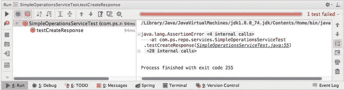

图 2-7.

Intellij IDEA 中的 JUnit 测试失败

如果实现正确，测试将通过，并且 Intellij IDEA 控制台中会出现大量绿色，如图 2-8 所示，这表明一切正常。

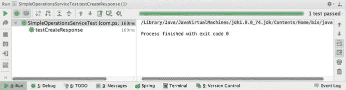

图 2-8.

Intellij IDEA 中的 JUnit 测试通过

你可以通过将你的实现与 `01-ps-start-solution` 项目中提供的代码进行比较来检查解决方案。


## Spring IoC 与依赖注入

本章开头提到，创建对象并组装它们是 Spring 的职责。Spring 框架的控制反转（IoC）组件是其核心。它使用依赖注入来组装 Spring 提供的（也称为基础设施组件）和开发人员提供的组件，以便快速构建一个应用程序。图 2-9 展示了 Spring IoC 在应用程序开发过程中的位置。

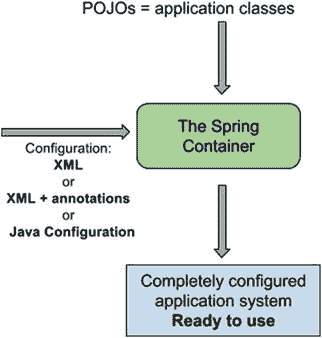

图 2-9.

Spring IoC 的用途

本书开发过程中构建的应用程序包含使用仓库实例构建的服务类。例如，可以这样定义一个 `UserService` 实现：

```
public class SimpleUserService extends SimpleAbstractService
implements UserService {
private UserRepo repo;
public SimpleUserService(UserRepo userRepo) {
this.repo = userRepo;
}
...
}
```

如你所见，依赖是通过构造函数注入的，因此创建服务实例需要提供一个仓库实例作为参数。需要仓库实例来从数据库中检索和持久化 `User` 对象。仓库可以这样定义：

```
import javax.sql.DataSource;
public class JdbcUserRepo extends JdbcAbstractRepo {
public JdbcUserRepo(DataSource dataSource) {
super(dataSource);
}
...
}
//JdbcAbstractRepo.java 包含所有仓库类的通用实现
import javax.sql.DataSource;
public class JdbcAbstractRepo
implements AbstractRepo {
protected DataSource dataSource;
public JdbcAbstractRepo(DataSource dataSource) {
this.dataSource = dataSource;
}
@Override
public void save(T entity) {...}
@Override
public void delete(T entity) {... }
@Override
public void deleteById(Long entityId) {...}
@Override
public T findById(Long entityId) {...}
}
```

为了创建仓库实例，需要一个 `DataSource` 实例来连接数据库。

为了告诉 Spring 容器创建这些对象以及如何将它们连接在一起，必须提供配置。这种配置可以通过 XML 文件、XML + 注解或 Java 配置类来提供。

以下配置片段展示了一个 XML Spring 配置文件的内容和模板，用于定义构成应用程序的组件。²

该 XML 文件通常放置在项目目录下的 `src/main/resources/spring` 中。`spring` 目录告诉你其下的文件是 Spring 配置文件，因为一个应用程序可能还有其他用途的 XML 配置文件（例如配置 Hibernate 等其他基础设施组件、使用 Ehcache 配置缓存、日志记录等）。以这种方式配置的应用程序将在 Spring 容器创建的应用程序上下文中运行。

应用程序上下文将管理由 Spring IoC 实例化和初始化的所有对象，从现在起，我们将这些对象称为 `beans`，以便你熟悉 Spring 的术语。这些对象与应用程序上下文之间的关系以及它们的唯一标识符如图 2-10 所示。

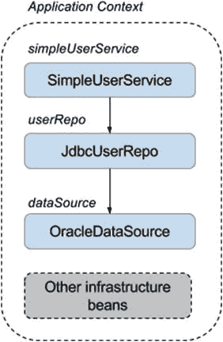

图 2-10.

应用程序上下文及其管理的 Bean

应用程序上下文实际上就是一个实现了 Spring 接口 `org.springframework.context.ApplicationContext` 的类，需要实例化该类并将配置文件作为参数传入。Spring 提供了多种应用程序上下文的实现，具体使用哪一种取决于配置的位置和包含配置的资源。对于 XML，使用 `org.springframework.context.support.ClassPathXmlApplicationContext` 类。

```
//创建上下文
(1)ApplicationContext context = new ClassPathXmlApplicationContext
("classpath:spring/application-config.xml");
// 获取 Bean 以调用服务
(2)UserService userService = (UserService)context.get("simpleUserService");
// 创建用户实体
(3)User user = new User();
// 填充用户信息
// 调用 Bean 的 save 方法
(4)userService.save(user);
```

在前面的例子中，有很多新信息，将在后续章节中逐步介绍。`classpath` 是在使用 XML 文件配置的 Spring 应用程序中常用的前缀，用于告诉 Spring IoC 配置的位置。应用程序上下文中 Bean 的唯一标识符，即 Bean 的 `id`，通过为其值添加下划线来突出显示，以便提示你如何识别特定实例。更多关于此主题的内容将在后续章节中介绍。

使用 Java 配置进行配置可以像下面的代码片段那样完成，但其中各项含义将在后续章节中更详细地介绍。用于创建 Bean 的方法名称通过添加下划线来突出显示，以便提示你如何确定 Bean 的 `id`。

```
@Configuration
@PropertySource("claspath:db/datasource.properties")
public class ApplicationConfig {
@Value("${url}")
private String url;
@Value("${username}")
private String username;
@Value("${password}")
private String password;
@Bean
public UserService simpleUserService() throws SQLException {
return new SimpleUserService(userRepo());
}
@Bean
public UserRepo userRepo() throws SQLException {
return new JdbcUserRepo(dataSource());
}
@Bean
public DataSource dataSource() throws SQLException {
OracleDataSource ds = new OracleDataSource();
ds.setURL(url);
ds.setUser(username);
ds.setPassword(password);
return ds;
}
}
```

`datasource.properties` 文件包含数据库访问凭证，这些凭证被设置到带有 `@Value` 注解的字段中，但其工作原理将在 Java 配置部分更详细地解释。对于 Java 配置类，使用 `org.springframework.context.annotation.AnnotationConfigApplicationContext` 类来创建应用程序上下文。

```
ApplicationContext ctx = new AnnotationConfigApplicationContext
(ApplicationConfig.class);
// 所有内容跨配置类自动装配...
SimpleUserService simpleUserService =
(SimpleUserService) ctx.getBean("simpleUserService");
```

现在，我们已经初步了解了 Spring 配置，可以准备深入学习高级配置了。


## Spring 配置

构成 Spring 应用程序的 Bean 定义可以通过 XML 文件、注解、基于 Java 的配置注解，或以上所有方式的组合来提供。XML 是 Spring 最初用于存储 Bean 定义的方法，这可能是因为在 Spring 诞生时注解尚未被发明。Spring 2.5 引入了一种基于注解的配置形式，当时引入了诸如 `@Component`、`@Service`、`@Repository` 等注解（也称为构造型注解）来定义常见的业务 Bean。然而，如今为 Spring 应用程序提供配置最常见的方式是基于 Java 的配置，从 Spring 3.0 开始，它引入了 `@Configuration`、`@Bean` 等用于基础设施 Bean 的注解。构造型注解和 Java 配置注解相辅相成，为定义 Spring 应用程序的配置提供了一种实用的、非 XML 的方式。由于遗留代码和支持多样性的原因，XML 配置仍然被支持。事实上，有些程序员仍然倾向于将所有配置与代码完全解耦，并且不允许为了配置而编写额外的代码，而基于 Java 的配置和/或注解则不完全允许这样做。

在本节中，将涵盖配置和依赖注入类型的所有方面，所以请给自己准备一大杯咖啡（或茶），然后开始阅读。

### 通过 XML 提供配置

为了给 Spring 应用程序提供一个 XML 配置，该配置将定义一个或多个 Bean 定义，文件必须使用特定的命名空间并遵守它们所定义的结构。一个 Bean 定义指定了 Bean 的 id、名称、别名、类型、用于初始化的参数、依赖关系以及许多其他项目。主要的命名空间是 `beans` 命名空间，它规定了 Bean 定义应该是什么样子。该命名空间有一个匹配的 XSD，需要将其添加到 `<beans/>` 元素中，以便配置文件可以根据其定义的规则进行验证。一个 Spring XML 配置文件必须至少定义这个命名空间。下面的代码片段展示了标准的基于 XML 的配置元数据：

!

在上面的代码示例中，Spring 版本没有在模式位置声明中使用。如果使用，模式位置元素将如下所示：

```
...
xsi:schemaLocation="http://www.springframework.org/schema/beans
http://www.springframework.org/schema/beans/spring-beans-4.3.xsd">
...
```

推荐（最佳）做法是不这样做，因为版本将从项目中的 Spring 依赖版本中正确识别。此外，另一个优点是，你可以升级正在使用的 Spring 版本，新的定义规范将自动在你的配置文件中得到支持，而无需你修改它们。

为了读取 Bean 定义以及创建和管理 Bean，也必须创建许多 Spring 提供的 Bean。这就是为什么必须将几个核心的 Spring 模块作为依赖项添加到你的项目中：

*   `spring-core:` Spring 框架的基础部分
*   `spring-beans:` 与 `spring-core` 一起提供框架的核心组件，包括 Spring IoC 和依赖注入特性。
*   `spring-context:` 扩展了前两个模块的功能，顾名思义，它包含帮助构建和使用应用程序上下文的组件。`ApplicationContext` 接口是这个模块的一部分，是每个应用程序上下文类都实现的接口。
*   `spring-context-support:` 提供与第三方库集成的支持，例如 Guava、Quartz、FreeMarker 等。
*   `spring-expressions:` 提供强大的表达式语言 (SpEL)，用于在运行时查询和操作对象；例如，可以从运行时决定的外部源读取属性并用于初始化 Bean。但这种语言非常强大，因为它还支持逻辑和数学运算、访问数组以及操作集合。

现在你已经了解了所有基础设施组件的来源，我们可以回到配置细节，向你展示 Bean 定义是什么样子的。最简单的 Bean 定义如下所示：

在 `上面的` 配置中，我们刚刚定义了一个 id 为 `simpleBean`、类型为 `com.ps.SimpleBeanImpl` 且没有依赖关系的 Bean。为了定义具有依赖关系的 Bean，我们必须决定如何注入这些依赖关系。在 Spring 中，有两种特定于 XML 的依赖注入类型：通过构造函数和通过 setter 方法，还有一种只能 `使用注解` 和 `Java 配置` 使用的类型：字段注入，这将在下一节中介绍。


#### 构造器注入

当 Bean 的类型是一个定义了带参数构造器的类时，可以使用构造器注入来定义 Bean。如果 Bean 的定义如下所示：

那么 `ComplexBeanImpl` 类看起来是这样的：

```
public class ComplexBeanImpl implements ComplexBean {
private SimpleBean simpleBean;
public ComplexBeanImpl(SimpleBean simpleBean) {
this.simpleBean = simpleBean;
}
...
}
```

上述代码和配置片段提供了所有必要的信息，以便 Spring 容器能够创建一个名为 `simpleBean` 的 `SimpleBeanImpl` 类型 Bean，然后将其注入到一个名为 `complexBean` 的 `ComplexBeanImpl` 类型 Bean 中。其幕后执行的操作是：

```
SimpleBean simpleBean = new SimpleBeanImpl();
ComplexBean complexBean = new ComplexBeanImpl(simpleBean);
```

Spring 会按照依赖所需的顺序创建 Bean。依赖项会首先被创建，然后注入到需要它们的 Bean 中。

关于构造器注入，你需要记住的是，使用它的 Bean 定义模板如下所示：

`<constructor-arg />` 元素用于定义构造器参数，它通过多个属性来实现，但 `ref` 是最常用的属性，它用于告诉容器该属性的值是对另一个 Bean 的引用。所有属性的完整列表及其文档可以在 `spring-beans-4.3.xsd` 中找到，在 Intellij IDEA 中，你可以通过按住 CTRL（MacOS 系统中为 Command）键并点击配置文件中的 `constructor-arg` 来轻松访问该文件。

另一个常用的属性是 `value`。当要注入的值是标量时，会使用此属性。³ 因此，文本值、数字、布尔值都可以通过 `value` 属性作为构造器的参数使用。

```

...

// ComplexBeanImpl.java 构造器
public ComplexBeanImpl(SimpleBean simpleBean, boolean complex) {
this.simpleBean = simpleBean;
this.complex = isComplex;
}
```

所以这里发生的事情等同于：

```
ComplexBean complexBean = new ComplexBeanImpl(simpleBean, true);
```

同样非常有用的是 `index` 属性，当构造器有多个相同类型的参数时，应该使用该属性。

```

// ComplexBean2Impl.java 构造器
public ComplexBean2Impl(SimpleBean simpleBean1, SimpleBean simpleBean2) {
this.simpleBean1 = simpleBean1;
this.simpleBean2 = simpleBean2;
}
```

所以这里发生的事情等同于：

```
ComplexBean complexBean2 = new ComplexBean2Impl(simpleBean0, simpleBean1);
```

处理具有多个相同类型参数的构造器的另一种方法是使用 `name` 属性，该属性接收构造器参数的名称作为其值。显然，使用它会使配置更加清晰易读。因此，对于之前定义的 `complexBean2`，还有另一种配置可以实现相同的功能。

当依赖项是必须提供的时候，开发者会选择使用构造器注入，因为依赖于它们的 Bean 如果没有这些依赖项就无法正常使用。当一个 Bean 需要是不可变的（通过将依赖项赋值给 final 字段）时，依赖注入也同样适用。使用构造器注入最常见的原因是，有时项目中会使用第三方依赖，而这些依赖的类被设计为仅支持这种类型的依赖注入。

在创建 Bean 时，有两个步骤需要依次执行。首先需要实例化 Bean，然后必须初始化 Bean。构造器注入将这两个步骤合二为一，因为使用构造器注入依赖项基本上意味着同时实例化和初始化对象。

如果 `constructor-arg` 作为配置元素的名称看起来有点长，请不要担心。Spring 在 3.1 版本中为此引入了一个解决方案：c-命名空间：`xmlns:c="` [`http://www.springframework.org/schema/c`](http://www.springframework.org/schema/c) `"`。这个命名空间允许使用内联属性来配置构造器参数，并且它没有 XSD 模式，因为它没有引入任何新的配置元素。只需将其添加到 Bean 配置文件中，你的配置就可以简化如下：

使用 c-命名空间时，你应该记住，当依赖项是另一个 Bean 时，需要在 `c:` 前缀的属性后添加 `"-ref"` 后缀。

!

如果你使用构造器参数的名称来注入依赖项，那么使用 `c:` 的属性定义应匹配模式 `c:nameConstructorParameter[-ref]`；而如果你使用索引，则属性定义应匹配 `c:_{index}[-ref]`。

!

所有这些示例都可以在 `02-ps-container-01-practice` 项目中找到。包含所有用于尝试构造器注入的 Bean 和配置的包名为 `com.ps.beans.ctr`。配置文件存储在 `02-ps-container-01-practice/src/main/resources/spring/ctr` 目录下，有两个配置文件：`sample-config-01.xml`（包含使用 `constructor-arg` 元素的 Bean 定义）和 `sample-config-02.xml`（包含使用 c-命名空间的 Bean 定义）。

为了测试这些文件的有效性，请运行 `com.ps.beans.ctr.CIBeansTest` 类中的测试。其中还有一个 TODO 任务，要求你检索 `ComplexBean` 类型的 Bean，并确保它们的依赖项已正确设置。如何实现这一点取决于你，因为有很多方法可以做到。在 `02-ps-container-01-solution` 中为你提供了一个解决方案。如果你愿意，可以暂时放下书本，尝试立即解决这个任务。


#### Setter 注入

要使用 Setter 注入，Bean 的类类型必须包含用于设置依赖项的 Setter 方法。构造函数并非必需。如果未声明构造函数，Spring 将使用默认的“无参”构造函数（每个类都会从 Java Object 类自动继承该构造函数）来实例化对象，并使用 Setter 方法来注入依赖项。如果显式定义了无参构造函数，Spring 将使用它来实例化 Bean。如果定义了带参数的构造函数，则通过这种方式声明的依赖项将使用构造函数注入，而通过 Setter 定义的依赖项则通过 Setter 注入。

总之，使用 Setter 注入创建 Bean 时，首先通过调用构造函数实例化 Bean，然后通过 Setter 注入依赖项来完成初始化。（当然，你将在本章后面了解到，初始化也可以分为两步：设置依赖项和调用处理这些依赖项的特殊 init 方法。）因此，如果你的 Bean 定义如下所示：

那么类 `com.ps.beans.set.ComplexBeanImpl` 看起来是这样的：

```
public class ComplexBeanImpl implements ComplexBean {
private SimpleBean simpleBean;
// 无参空构造函数，非必需
public ComplexBeanImpl() {}
public void setSimpleBean(SimpleBean simpleBean) {
this.simpleBean = simpleBean;
}
public SimpleBean getSimpleBean() {
return simpleBean;
}
}
```

上述代码和配置片段提供了所有必要信息，以便 Spring 容器能够创建一个类型为 `SimpleBeanImpl` 的 Bean 和一个名为 `simpleBean0` 的 Bean，然后将其注入到类型为 `ComplexBeanImpl`、名为 `complexBean` 的 Bean 中。依赖项在 Bean 实例化后，通过调用 `setSimpleBean` 方法并将 simpleBean 作为参数传入来注入。其幕后执行的操作是：

```
SimpleBean simpleBean = new SimpleBeanImpl();
ComplexBean complexBean = new ComplexBeanImpl();
complexBean.setSimpleBean(simpleBean);
```

关于 Setter 注入，你需要记住的是，使用它的 Bean 定义模板如下所示：

`<property />` 元素定义了要设置的属性及其值，并通过一对属性来实现：`[name, ref]` 或 `[name,value]`。

`name` 属性是必需的，因为其值是要设置的 Bean 属性的名称。

`ref` 属性用于告知容器，该属性的值是对另一个 Bean 的引用。

`value` 属性，正如你可能猜到的，用于告知容器该值不是一个 Bean，而是一个标量值。

```

// ComplexBeanImpl.java
public class ComplexBeanImpl implements ComplexBean {
private SimpleBean simpleBean;
private boolean complex;
public ComplexBeanImpl() {}
public void setSimpleBean(SimpleBean simpleBean) {
this.simpleBean = simpleBean;
}
public void setComplex(boolean complex) {
this.complex = complex;
}
}
```

与构造注入一样，Spring 也提供了一个命名空间，用于在使用 Setter 注入时简化 XML 定义。它被称为 p 命名空间：[`http://www.springframework.org/schema/p`](http://www.springframework.org/schema/p) `.` 该命名空间允许使用内联属性来配置属性参数，并且没有 XSD 模式，因为它没有引入任何新的配置元素。只需将其添加到 Bean 配置文件中，你的配置就可以得到简化。`"p:"` 属性的 `-ref` 后缀的作用是告知容器，该属性的值是对另一个 Bean 的引用。

关于 Setter 注入，目前要说的就是这些。在 Setter 注入和构造注入之间进行选择，仅取决于应用程序的需求、已编写且无法更改的代码（遗留代码）以及第三方库。Setter 注入的优势在于依赖项是可选的，可以使用默认值，并且支持继承。在决定使用哪种方式时，请尽可能遵循最佳实践：

*   当属性是必需时，使用构造注入。
*   当属性不是必需时，使用 Setter 注入。
*   使用与 Bean 类型实现相匹配的策略。
*   保持一致性。

构造注入和 Setter 注入可以同时用于创建同一个 Bean。以下是一个示例：

```

//ComplexBean2Impl.java
public class ComplexBean2Impl implements ComplexBean {
private SimpleBean simpleBean;
private boolean complex;
public ComplexBean2Impl(SimpleBean simpleBean)
{
this.simpleBean = simpleBean;
}
public void setComplex(boolean complex) {
this.complex = complex;
}
}
```

!

所有这些示例都可以在 `02-ps-container-01-practice` 项目中找到。包含所有用于尝试 Setter 注入的 Bean 和配置的包名为 `com.ps.beans.set`。配置文件存储在 `02-ps-container-01-practice/src/main/resources/spring/set` 目录下，共有两个配置文件：`sample-config-01.xml`（包含使用 `property` 元素的 Bean 定义）和 `sample-config-02.xml`（包含使用 p 命名空间的 Bean 定义）。

为了验证这些文件的有效性，请运行 `com.ps.beans.set.SIBeansTest` 类中的测试。其中还有一个 TODO 任务，要求你检索类型为 `ComplexBean` 的 Bean，并确保它们的依赖项已正确设置。如何实现这一点由你决定，因为有很多方法可以做到。解决方案已在 `02-ps-container-01-solution` 中提供。如果你愿意，可以暂时放下书本，尝试立即执行此任务。


#### 注入非 Bean 的依赖项

使用 Spring 进行依赖注入是一个庞大的主题，本书旨在涵盖企业开发中可能遇到的所有情况。之前提到过，可以注入`标量`值。这自然引出了关于类型转换的讨论。在前面的示例中，我们注入了一个布尔值，Spring 容器知道如何从配置文件中获取文本值，并将其转换为 Bean 类型定义中指定的属性类型。Spring 容器知道如何为所有基本类型及其对应的包装类型执行此操作。默认情况下，支持字符串值、布尔值和数值类型。但请记住，对于布尔值和十进制类型，必须遵循这些类型的典型语法；否则，默认的 Spring 转换将无法工作。

如果`Date`值的语法匹配任何使用“/”分隔符的日期模式（例如，dd/MM/yyyy、yyyy/MM/dd、dd/yyyy/MM），Spring 也知道在注入前自动转换它们。但要注意，即使是无效的数字组合（例如 25/2433/23）也会被接受并转换。

为了支持任何其他类型，必须告知 Spring 容器如何将属性的值转换为构造函数或 setter 方法所要求的参数类型。最常用的方法是使用属性编辑器。这是一个 Spring 概念，描述了一个用于处理任何`Object`和`String`之间转换的组件。为了实现这种转换，您需要为`java.beans.PropertyEditor`定义一个自定义实现，并将其注册到 Spring 上下文中。开箱即用，Spring 为常用类型提供了许多`PropertyEditor`实现。⁴ 开发人员需要做的就是自定义并注册它们。

假设我们想定义一个如下的 Person Bean：

有多种方法可以告诉 Spring IoC 如何将值 1977-10-16 转换为 Date。既然提到了`java.beans.PropertyEditor`，第一个示例将使用 Spring 的`org.springframework.beans.propertyeditors.CustomDateEditor`。为此，我们需要执行以下操作：

*   定义一个实现`org.springframework.beans.PropertyEditorRegistrar`的类，该类注册`org.springframework.beans.propertyeditors.CustomDateEditor`（Spring 内置的用于`java.util.Date`和`String`之间转换的实现）的自定义版本：

*   为`org.springframework.beans.factory.config.CustomEditorConfigurer`添加一个 Bean 定义，并将其`propertyEditorRegistrars`属性的参数设置为一个包含`DataConverter`类型 Bean 的列表：

```
package com.ps.beans.others;
import org.springframework.beans.PropertyEditorRegistrar;
import org.springframework.beans.PropertyEditorRegistry;
import org.springframework.beans.propertyeditors.CustomDateEditor;
import java.text.SimpleDateFormat;
import java.util.Date;
public class DateConverter implements PropertyEditorRegistrar {
@Override
public void registerCustomEditors(PropertyEditorRegistry registry) {
registry.registerCustomEditor(Date.class,
new CustomDateEditor(new SimpleDateFormat("yyyy-MM-dd"), false));
}
}
```

第二个示例展示了如何仅通过配置来完成此操作，并使用`<bean />`元素的两个属性（`factory-bean`和`factory-method`），这些属性将在后续章节中介绍。`formatter` Bean 被用作一个工厂 Bean，它根据传递给`parse`方法的字符串参数创建日期值。这种方法的缺点是 Bean 的定义被转换定义所污染。

在 Web 应用上下文中，必须提供并注册一个`org.springframework.format.Formatter`的实现。

!

在`02-ps-container-01-practice`中提供了一个包含各种类型字段的示例 Bean。该类名为`com.ps.beans.others.MultipleTypesBean`，可以通过运行名为`com.ps.beans.others.MtBeanTest`的测试类来测试它。Bean 定义可以在`02-ps-container-01-practice/src/main/resources/spring/others/sample-config-01.xml`文件中找到，如下代码片段所示：

如图 2-11 所示，以调试模式运行测试，并在`assertNotNull(mtBean);`行设置断点。在调试控制台（图底部可见）中，您可以看到`mtBean`所有字段的值。

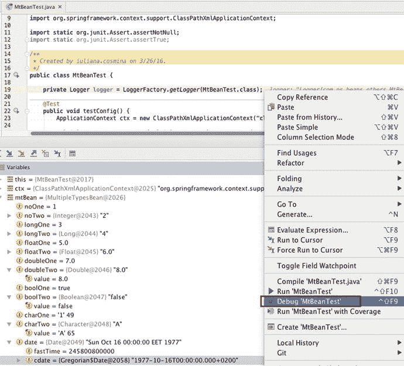

图 2-11.

以调试模式运行测试以检查 MultipleTypesBean 类型 Bean 的字段

后缀为`One`的字段是基本类型；其他的是对象。注意它们是如何被正确初始化的，并且 Bean 定义中的值被转换为了适当的类型。

另一种常用的对象类型是集合。为了简化集合与 Bean 的配合使用，Spring 开发团队创建了`util`命名空间。在前面的代码片段中，您可能注意到了`<list />`元素。这就是在不使用`util`命名空间的情况下使用集合的方式，并且将提供另一个代码片段来使它们的用法更清晰。考虑一个名为`CollectionHolder`的类，定义如下代码片段所示：

```
public class CollectionHolder {
private List simpleBeanList;
private Set simpleBeanSet;
private Map simpleBeanMap;
public void setSimpleBeanList(List simpleBeanList) {
this.simpleBeanList = simpleBeanList;
}
public void setSimpleBeanSet(Set simpleBeanSet) {
this.simpleBeanSet = simpleBeanSet;
}
public void setSimpleBeanMap(Map simpleBeanMap) {
this.simpleBeanMap = simpleBeanMap;
}
/**
* 此方法仅用于验证注入到此类型 Bean 中的集合
*/
@Override
public String toString() {
return "CollectionHolder{" +
"simpleBeanList=" + simpleBeanList +
", simpleBeanSet=" + simpleBeanSet +
", simpleBeanMap=" + simpleBeanMap +
’}’;
}
}
```

`collectionHolder` Bean 的状态将使用以下测试类进行测试：

```
// CollectionTest.java
public class MtBeanTest {
private Logger logger = LoggerFactory.getLogger(SIBeansTest.class);
@Test
public void testConfig() {
ApplicationContext ctx = new ClassPathXmlApplicationContext
("classpath:spring/others/sample-config-01.xml");
CollectionHolder ctBean = (CollectionHolder) ctx.getBean("collectionHolder");
assertNotNull(ctBean);
(*) logger.info(ctBean.toString());
}
}
```

可以创建 Bean，并像以下示例一样为其集合属性注入值：

*   注入空集合测试类中标记为 (`*`) 行的`logger.info`语句将打印：`CollectionHolder{simpleBeanList=[], simpleBeanSet=[], simpleBeanMap={}}`
*   注入包含`SimpleBean`元素的 List 类型属性测试类中标记为 `(*)` 行的`logger.info`语句将打印：

```
    CollectionHolder{
    simpleBeanList=[
    SimpleBeanImpl{ code: 454325163},
    SimpleBeanImpl{ code: 796667727},
    null
    ],
    simpleBeanSet=null, simpleBeanMap=null
    }
    ```


以下是关于三个注入元素的详细说明：
    *   `<ref bean="simpleBean"/>` 引用了一个已有的 bean。在运行时，名为 simpleBean 的 bean 会被添加到列表中。相当于 `list.add(simpleBean)`。
    *   `<bean class="com.ps.beans.SimpleBeanImpl"/>` 用于定义一个即时创建的 bean。相当于 `list.add(new SimpleBeanImpl)`。这个 bean 定义声明了一个称为内部 bean 的概念，稍后会介绍。
    *   `<null/>` 用于向列表中添加一个 null 元素。相当于 `list.add(null)`。
*   对 `list` 元素所做的操作同样适用于 `set` 元素。
*   注入一个类型为 `Map<String, SimpleBean>` 的属性：

测试类中标记为 `(*)` 的那一行中的 `logger.info` 语句将打印以下内容：

```
CollectionHolder{
simpleBeanList=null, simpleBeanSet=null,
simpleBeanMap={
one=SimpleBeanImpl{ code: 454325163}
}
}
```

在使用 `<map />` 元素且值或键为非原始类型时，使用 `"-ref"` 后缀来引用一个已有的 bean。此外，不能像 `<list />` 和 `<set />` 元素那样即时创建 bean，也不能使用 `<null />` 元素。

如果不使用 `util` 命名空间，则无法在配置文件中 bean 的定义之外定义集合元素。引入 `util` 命名空间是为了处理常见的实用配置问题，例如定义和注入集合、`java.util.Properties` 对象、引用常量。要使用其元素，必须将其添加到 `<beans />` 元素的命名空间列表中。使用此命名空间，可以在 `<beans \>` 元素下 `定义` 集合。它们被分配了自己的 id，可用于引用它们以注入到多个 bean 中。它们的使用方式与 bean 基本相同。

在前面的代码片段中，您可以注意到 `simpleList` 组件是如何被注入到两个 bean 中的：`collectionHolder` 和 `collectionHolder2`。

在 Spring 应用程序中另一种经常使用的 bean 类型是 `java.util.Properties` 类型。它的定义和使用方式与前面示例中其他集合的使用方式类似。前面的示例中没有涵盖此类型，因为它被留作特殊用途。

#### 使用 Bean 工厂

`<bean />` 元素具有更多属性，也可用于声明由工厂方法⁵或单例⁶对象创建的 bean。要使用单例类创建 bean，需要使用 `factory-method` 属性，其值将是返回 bean 实例的静态方法名称。下面是一个简单示例，展示了如何使用单例类和 bean 配置创建 bean：

```

// SimpleSingleton.java
public class SimpleSingleton {
private static SimpleSingleton instance = new SimpleSingleton();
private SimpleSingleton() { }
public static SimpleSingleton getInstance(){
return instance;
}
}
```

要使用工厂对象创建 bean，需要使用 `factory-bean` 和 `factory-method` 属性。顾名思义，第一个属性指向用于创建 bean 的对象，另一个属性指定返回实际结果的方法名称（此处不是静态的）。以下代码片段描述了一个由工厂 bean 创建的 bean：

```

// SimpleSingleton.java
public class SimpleFactoryBean {
public SimpleBean getSimpleBean() {
return new SimpleBeanImpl();
}
}
```

虽然这看起来有些多余，但当使用只允许通过工厂类创建对象的第三方库时，以这种方式创建 bean 可能会很有用。并且此方法可用于连接现有组件以提供特定行为，例如帮助 Spring 使用与默认格式不同的格式模式将 String 值转换为 Date 对象，如“注入非 Bean 的依赖项”部分所述。

在这种情况下，Spring 也提供了解决方案，它提供了一个名为 `org.springframework.beans.factory.FactoryBean<T>` 的接口。许多 Spring 类都使用此接口来简化配置。通过实现此接口，Spring 容器将自动拾取工厂 bean，并通过自动调用 `getObject` 方法来创建所需的 bean。即使以这种方式实现工厂会将您的代码与 Spring 组件耦合（通常建议避免这样做），但这种方法很实用，可以在需要时使用。

```

//SpringFactoryBean.java
import org.springframework.beans.factory.FactoryBean;
...
public class SpringFactoryBean implements FactoryBean {
private Logger logger = LoggerFactory.getLogger(SpringFactoryBean.class);
private SimpleBean simpleBean = new SimpleBeanImpl();
public SpringFactoryBean() {
logger.info(">> Look ma, no definition!");
}
@Override
public SimpleBean getObject() throws Exception {
return this.simpleBean;
}
@Override
public Class getObjectType() {
return SimpleBean.class;
}
@Override
public boolean isSingleton() {
return true;
}
}
```

如果您对实现 `org.springframework.beans.factory.FactoryBean` 的 Spring 类感到好奇，Intellij IDEA 可以帮到您。前面代码片段中描述的类是 `02-ps-container-01-practice` 的一部分。只需打开该类，单击接口名称，然后按 CTRL（MacOS 中为 Command）+ALT+B，就会显示实现它的类列表，如图 2-12 所示。

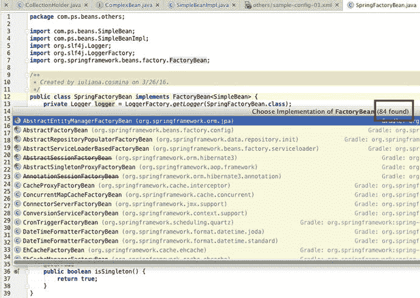

图 2-12.

实现 FactoryBean 接口的类

Spring 工厂 bean 类为使用 Hibernate 和 JPA 配置数据访问、处理事务、使用 EhCache 配置缓存等提供了帮助。本书的代码示例中将使用其中的一些，因此您将有机会看到它们的实际应用。


#### 创建应用上下文

到目前为止提供的示例中，测试类都包含如下语句：

```
import org.springframework.context.ApplicationContext;
import org.springframework.context.support.ClassPathXmlApplicationContext;
...
ApplicationContext ctx = newClassPathXmlApplicationContext("classpath:spring/others/sample-config-02.xml");
```

`org.springframework.context.ApplicationContext` 是一个接口，由为应用程序提供配置的类实现。该接口是 `org.springframework.beans.factory.BeanFactory` 接口的扩展，后者是访问 Spring Bean 容器的根接口。`ApplicationContext` 的实现管理着许多由其名称唯一标识的 Bean 定义。存在多种 Spring 应用上下文实现，每种都特定于一种应用程序类型。`ApplicationContext` 实现提供以下功能：

*   使用 Bean 工厂方法访问 Bean
*   以通用方式加载文件资源的能力
*   向已注册的监听器发布事件的能力
*   解析消息并支持国际化（最常用于国际化的 Web 应用程序）

应用上下文由 Spring 容器创建，并使用由资源提供的配置进行初始化，该资源可以是一个（或多个）XML 文件，或一个（或多个）配置类，或两者兼有。当资源以字符串实例形式提供时，Spring 容器会尝试根据该字符串值的前缀来加载资源。此外，根据前缀的不同，在实例化应用上下文时应使用不同的类。在表 2-1 中，你可以看到在 Spring 中加载资源时可以使用的不同前缀。

表 2-1.

前缀及对应路径

| 前缀 | 位置 | 说明 |
| --- | --- | --- |
| 无前缀 | 在创建上下文的类所在的根目录中 | 位于 `main` 或 `test` 目录中。加载的资源类型将取决于所使用的 `ApplicationContext` 实例。（表后提供了详细示例。） |
| `classpath:` | 应从类路径获取资源 | 位于 `resources` 目录中，资源类型为 `ClassPathResource`。如果使用该资源创建应用上下文，则 `ClassPathXmlApplicationContext` 类适用。 |
| `file:` | 位于前缀后的绝对路径中 | 从文件系统以 URL 形式加载资源，资源类型为 `UrlResource`。如果使用该资源创建应用上下文，则 `FileSystemXmlApplicationContext` 类适用。 |
| `http:` | 位于前缀后的网络位置中 | 以 URL 形式加载资源，资源类型为 `UrlResource`。如果使用该资源创建应用上下文，则 `WebApplicationContext` 类适用。 |

为了提供加载资源的功能，应用上下文必须实现 `org.springframework.core.io.ResourceLoader` 接口。以下是不使用前缀加载资源的示例：

```
Resource template = ctx.getResource("application-config.xml");
```

根据所使用的上下文类，加载的资源可以是以下类型之一：

*   如果 `ctx` 是 `ClassPathXmlApplicationContext` 实例，资源类型将为 `ClassPathResource`
*   如果 `ctx` 是 `FileSystemXmlApplicationContext` 实例，资源类型将为 `FileSystemResource`
*   如果 `ctx` 是 `WebApplicationContext` 实例，资源类型将为 `ServletContextResource`

这就是前缀发挥作用的地方。如果我们想强制指定资源类型，无论使用何种上下文类型，都必须使用所需的前缀来指定资源。

到目前为止提到的示例中，所有 Bean 定义都在同一个文件中，但对于大型多层应用程序，根据用途分离 Bean 定义更为合适。假设对于 Pet Sitter 应用程序，只有一个 XML 配置文件。该文件看起来像这样，而第二个... 替换了其他仓库 Bean 和服务 Bean 定义，每种应用程序中使用的对象类型对应一个。

```

...

... // 其他仓库 Bean

```

无法隔离测试某些组件。企业应用程序不推荐使用混合配置。它们更适合用于学习 Spring 的应用程序。

可以从多个 XML 文件加载应用上下文。这提供了按用途对 Bean 定义进行分组的机会，例如将基础设施 Bean 与应用程序 Bean 分开，因为基础设施在不同环境之间会发生变化。⁷

```
ApplicationContext ctx = new ClassPathXmlApplicationContext(
"classpath:spring/application-config.xml",
"classpath:spring/db-config.xml");
```

在上面的示例中，存储层的配置与 `db-config.xml` 中应用程序配置的其余部分解耦。这使得数据库配置可以根据环境轻松替换。生产环境的 `db-config.xml` 内容可以包含一个使用专业数据库（如 Oracle）的 `dataSource` Bean 定义。

测试环境的 `test-db-config.xml` 文件可以包含一个使用内存数据库的 `dataSource` Bean 定义。

```

classpath:testdb/schema.sql
classpath:testdb/test-data.sql

```

将 `application-configuration.xml` 文件与 `test-db-config.xml` 一起使用，可以创建一个可用于运行单元测试的测试环境应用上下文：

```
ApplicationContext ctx = new ClassPathXmlApplicationContext(
"classpath:spring/application-config.xml",
"classpath:spring/test-db-config.xml");
```

但正如我们在初始配置片段中看到的，我们可以更进一步，将仓库组件与服务组件分开，因此 `application-configuration.xml` 文件将被拆分为两个：

```
ApplicationContext ctx = new ClassPathXmlApplicationContext(
"classpath:spring/repo-config.xml",
"classpath:spring/service-config.xml");
```

并且由于文件名非常相似，支持通配符，可以用来使代码比这更简单：

```
ApplicationContext ctx = new ClassPathXmlApplicationContext(
"classpath:spring/*-config.xml");
```

在处理多个文件时，为了对它们进行分组，还可以使用 `<import />` 元素将一个文件包含在另一个文件中。import 元素支持前缀以便正确定位文件，并且当在单独配置文件中定义的 Bean 属于同一逻辑组时应使用它。以下代码和配置片段描述了如何导入配置文件。在图 2-13 中，展示了 resources 目录的内容。

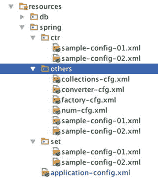

图 2-13.

resources 目录中的 Spring 配置文件

`application-config.xml` 文件应包含 ctr、set 和其他目录下所有名为 `sample-config-*` 的文件，以便可以像这样创建应用上下文：

```
ApplicationContext ctx = new ClassPathXmlApplicationContext(
"classpath:spring/application-config.xml");
```

当然，为了学习目的，使用不同的前缀，以下是导入文件的方式：

!

由于这是一个重要部分的结尾，这里有一个任务给你。在项目 `02-ps-container-01-practice` 中，有一个配置文件变得有点太大了：

```
02-ps-container-01-practice/src/main/resources/spring/others/sample-config-01.xml.
```


将此文件拆分为一个或多个配置文件，并修改测试类 `com.ps.beans.others.MtBeanTest`，使其使用这些文件加载上下文。测试必须成功完成，以验证你的配置。在 `02-ps-container-01-solution` 项目中提供了解决方案。你可以将自己的结果与之对比并得出结论。作为额外挑战，尝试使用通配符。

另外，请记住，在修改类之后，你可能需要在命令行中使用 `gradle build -x test` 构建项目，或从 Intellij IDEA 界面运行 `compileJava` 任务，以确保你使用最新的源代码运行测试。在图 2-14 中，`compileJava` 任务的位置已为你标出。

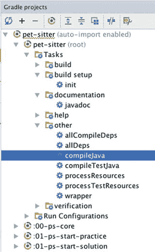

图 2-14.

Intellij IDEA 中的 Gradle 视图

### 丰富 XML 配置

XML 是一种非常灵活的文本格式，它定义了一套编码文本元素的规则，既适合人类阅读，也适合机器解析。XML 配置的目的是简化 Spring 应用程序的配置。即使使用 XML 配置 AOP、集合和事务等企业级行为，与第三方框架的集成仍然很繁琐，因此引入了特殊的命名空间，使得可以轻松定义复杂元素。这也有助于区分基础设施 Bean 和应用 Bean。

使用 XML 也很实用，因为配置文件可以外部化，从而允许在不重新编译应用程序的情况下控制其行为。因此，在接下来的章节中，将介绍高级 XML 配置。

#### Spring 命名空间

之前引入了 `util` 命名空间，以演示如何轻松地将集合注入到 Bean 中，以及如何将集合视为 Bean。下面，你可以使用 `util` 命名空间做几件事：

*   在配置中访问和使用常量

    ```

    // SimpleBean.java，其中定义了静态字段
    package com.ps.sample;
    public class SimpleBean {
    public static final SimpleBean DEFAULT_SIMPLE_BEAN= new SimpleBean("DEFAULT");
    }
    ```

    `FieldRetrievingFactoryBean` 是一个 `FactoryBean`，用于检索静态或非静态字段的值。Bean 的名称是被检索静态对象的完整路径。这种方法也适用于枚举。
*   使用类型化集合。当你声明 `<util:list />`、`<util:set />` 或 `<util:map/>` 时，Spring 会决定使用哪种实现类型，但你可以更改：

    ```
    ...

    ...

    ...

    ```

*   将文件中的属性直接读取到 `java.util.Properties` 中，该对象可以像 Bean 一样被处理，分配一个 ID，并从上下文中检索。

    ```
    ...
    Properties dbProp = ctx.getBean("dbProp", Properties.class);
    ```

另一个有用的命名空间是 `jdbc` 命名空间。它提供了用于创建内存数据源（用于测试目的）和初始化数据库的配置元素。

```

classpath:testdb/schema.sql
classpath:testdb/test-data.sql

```

其他一些重要的命名空间，如 `context`、`aop`、`tx` 和 `jms`，将在本书后面介绍。

#### 如何在 Spring 演进中读取属性文件

作为命名空间如何简化配置的一个例子，我们来看一个简单的操作：从文件中读取属性。以下是使用 `bean` 命名空间从文件读取属性的方法：

以下是使用 `context` 命名空间从文件读取属性的方法：

以下是使用 `util` 命名空间从文件读取属性的方法：

使用 `util` 命名空间的优点是，属性被加载到一个名为 `dbProp` 的 `java.util.Properties` 对象中，该对象可以在其他 Bean 的配置中使用。为了访问这些值并将它们注入到其他 Bean 中，需要使用 SpEL，这就是为什么使用 `#{}` 注入值的原因，这是典型的 SpEL 语法，用于访问对象的属性；基本上，`#{dbProp.url}` 等同于 `dbProp.getProperty("url")`。

#### Spring 表达式语言

SpEL 是 Spring 表达式语言。它非常强大，因为它支持在运行时查询和操作对象图。SpEL 的灵感来源于 WebFlow EL，⁸ 它是 Unified EL 的超集，⁹ 并提供了相当多的功能，例如：

*   方法调用
*   访问属性、索引集合
*   集合过滤
*   布尔和关系运算符
*   以及更多功能¹⁰

SpEL 有几种扩展（OGNL、MVEL 和 JBoss EL），但最棒的是它并不直接与 Spring 绑定，可以独立使用。

#### Bean 定义继承

由于类是创建对象的模板，并且可以被扩展，因此对于 Bean 定义也可以做同样的事情。它们可以被继承，并且现有的定义可以用额外的细节来丰富。假设 Pet Sitter 应用程序必须在由三台服务器组成的集群上投入生产运行。每台服务器都有自己的数据库，配置必须全部提及它们。连接数据库的配置文件如下所示：

这里面有很多重复，不是吗？Bean 继承有助于减小文件大小，并可以将公共配置元素分离到一个将被定义为抽象的模板 Bean 定义中。这种类型的 Bean 不能被 Spring IoC 创建。Bean 定义将声明模板作为父级，并将继承其中定义的所有细节。例如，在下面的代码片段中，Bean 类型、`user` 和 `loginTimeout` 属性值被继承。与类继承一样，Bean 定义可以覆盖继承的细节。`dataSource3` Bean 定义覆盖了 `loginTimeout`，并且也覆盖了 Bean 类型。

关于 Bean 继承的有趣之处在于，生成的 Bean 不必与父级具有相同的类型。只要继承的属性存在于扩展父模板的 Bean 定义中，继承就会生效。

#### 内部 Bean

内部 Bean 是在另一个 Bean 的作用域内定义的 Bean。它们相当于私有字段，无法通过 getter 方法访问，并且没有外部引用。在介绍集合时曾简要提及过这种类型的 Bean，但它值得拥有自己的章节，以确保清楚何时使用它们以及为什么使用。内部 Bean 由 `<property/>` 或 `<constructor-arg/>` 元素内部的 `<bean/>` 元素定义。

内部 Bean 可以填充 `id` 或 `name` 属性（这两个属性将在下一节中详细解释），但这将是无用的，因为这些 Bean 无法通过它们检索，因为它们是包含它们的 Bean 的内部 Bean。当然，如果你好奇的话，Bean 可以嵌套任意多次，但除非你真的真的必须这样做，否则请避免这样做，因为这会使你的配置看起来臃肿，并且变得难以测试。嵌套 Bean 通常是基础设施 Bean 的选择。

示例：一个 `Musician` Bean，包含一个 `Person` Bean，而 `Person` Bean 又包含一个 `Address` Bean。


#### Bean 命名

容器管理的每个 Bean 都有一个唯一标识符。开发者有责任在必要时使用 `id` 或 `name` 属性来恰当地命名 Bean，因为正如我们之前在自定义 `CustomDateEditor` 时所看到的，配置器 Bean 的定义是没有 id 的。一个 Bean 通常至少有一个唯一标识符，如果需要，可以通过为 name 属性设置多个值（用逗号（,）、分号（;）或空格分隔）来定义更多标识符。或者使用 `<alias />` 元素。

在 Spring 3.1 之前，`id` 属性的类型是 `xsd:ID`，因此不允许使用逗号、分号、空格等字符。从 Spring 3.1 开始，其类型改为 `xsd:string`，与 `name` 属性使用的类型相同，这使得这两个属性可以互换使用。因此，你可以使用其中任何一个，语法相同。如果需要，也可以同时使用两者，只要确保你的 Bean 能被正确识别即可。

让我们从头开始，假设你有一个配置文件，其中包含一个没有定义 id 或 name 的 Bean 定义：

可以从这个文件创建一个应用上下文，它将包含一个类型为 `SimpleBeanImpl` 的 Bean，其名称由容器设置。如果我们想查看容器分配给这个 Bean 的名称，只需打印上下文中所有 Bean 的名称即可，这可以通过调用应用上下文提供的 `getBeanDefinitionNames()` 方法并遍历返回结果来实现：

```
ApplicationContext ctx =
new ClassPathXmlApplicationContext("classpath:spring/application-config.xml");
for (String beanName : ctx.getBeanDefinitionNames()) {
logger.info("Bean " + beanName + " of type "
+ ctx.getBean(beanName).getClass().getSimpleName());
}
// 控制台输出结果：
Bean com.ps.beans.SimpleBeanImpl#0 of type SimpleBeanImpl
```

有趣的是，你完全可以复制 Bean 定义。容器只会为同一类型的第二个 Bean 分配一个不同的名称，上述代码将输出以下内容：

```
Bean com.ps.beans.SimpleBeanImpl#0 of type SimpleBeanImpl
Bean com.ps.beans.SimpleBeanImpl#1 of type SimpleBeanImpl
```

你甚至可以通过调用应用上下文上的 `getBeansOfType(...)` 方法来检索这些 Bean 及其名称：

```
Map simpleBeans = ctx.getBeansOfType(SimpleBean.class);
```

所以从技术上讲，如果你需要这样做，是可以的。但请记住，所有该类型的 Bean 都会被添加到该映射中，无论它们是否有开发者指定的 id/name。当你恰好有某个类型的唯一一个 Bean 时，可以使用 `getBean(...)` 方法从上下文中检索它，该方法有多个版本可供使用，本书将涵盖所有这些版本。

```
SimpleBean simpleBean = ctx.getBean(SimpleBean.class);
```

`getBean` 方法只需要一个 `Class<T>` 参数，它会返回唯一匹配给定对象类型的 Bean 实例（如果有的话）。Spring IoC 会搜索该类型的任何 Bean，无论 Bean 类型是接口还是超类。如果定义了多个该类型的 Bean，上下文将抛出异常，因为它无法确定你真正想要哪个 Bean。异常名称非常明显，如下面的日志片段所示。

```
org.springframework.beans.factory.NoUniqueBeanDefinitionException:
No qualifying bean of type com.ps.beans.SimpleBean is defined:
expected single matching bean but found 2: sb01,com.ps.beans.SimpleBeanImpl#0
```

尽管可以定义没有显式 id 的 Bean，但除非它们是内部 Bean 或某种基础设施 Bean（例如：`org.springframework.beans.factory.config.CustomEditorConfigurer`），否则定义没有 id 的 Bean 通常没有意义。

从 Spring 3.1 开始，`id` 和 `name` 属性具有相同的类型，因此它们的值可以包含特殊字符。在 Spring 3.1 之前的版本中，`name` 属性对于 Web 控制器是必需的，因为其语法要求 id 以 "/" 开头（例如，name="/persons"），而 id 属性不允许使用特殊字符。从现在开始，几乎所有关于 `id` 属性的内容也适用于 `name` 属性，除了一个将在适当时候提及的小细节。

!

Spring 的惯例是在命名 Bean 时使用标准的 Java 实例字段命名约定。这意味着 Bean 名称以小写字母开头，之后采用驼峰命名法。良好的 Bean 命名旨在使配置易于阅读和理解。此外，在使用像 AOP 这样更高级的功能时，能够将通知应用于一组按名称关联的 Bean 是非常有用的。

让我们介绍使用 id 命名 Bean 的多种方式。

如果 `sb01` Bean 像前面某个示例那样命名，那么有两种方法可以从应用上下文中检索这个 Bean：

```
SimpleBean sb01 = (SimpleBean)ctx.getBean("sb01");
SimpleBean sb01 = ctx.getBean("sb01", SimpleBean.class);
```

由于 `id` 和 `name` 具有相同的目的，因此不允许在同一个应用上下文中存在具有相同 id/name 值的 Bean 定义。智能的 Java 编辑器，比如推荐你使用的 Intellij IDEA，甚至会用红色下划线标出属性值来警告你不要这样做，如图 2-15 所示。

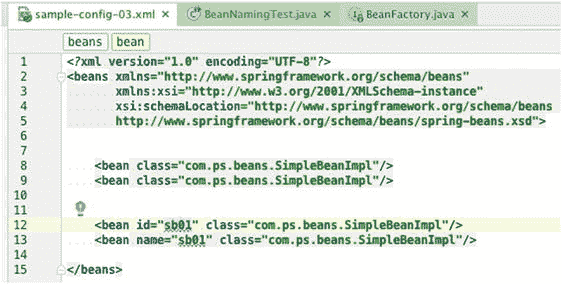

图 2-15.

在 Intellij IDEA 中，糟糕的 Bean 命名显而易见 ?

在下面的配置中，展示了一些 Bean 命名的示例。你能想象记录上下文中所有 Bean 的代码对于以下配置文件会打印出什么吗？

嗯，日志将打印出：

```
Bean sb01 of type SimpleBeanImpl
Bean sb02/sb03 of type SimpleBeanImpl
Bean sb04; sb05 of type SimpleBeanImpl
Bean sb04 of type SimpleBeanImpl
Bean $ of type SimpleBeanImp
```

因此，对每种情况进行详细解释是合适的。

*   `id` 和 `name` 属性可以具有相同的值。
*   “sb02/sb03” 是一个包含特殊字符的 id；$ 是一个由单个特殊字符组成的 id。两者都是有效的，并且可以使用以下方式成功检索 Bean：

```
    SimpleBean sb1 = ctx.getBean("sb02/sb03", SimpleBean.class);
    SimpleBean sb2 = ctx.getBean("$", SimpleBean.class);
    ```

但是等等，使用 name 属性设置的 "mumu" 值发生了什么？你能猜到吗？应用上下文也可以对此给出答案：

```
    for (String name : ctx.getAliases("sb02/sb03") ){
    logger.info ("Alias for sb04 -> " + name);
    }
    // 结果
    Alias for sb02/sb03 -> mumu
    ```

*   “sb04; sb05” 也是一个包含特殊字符的有效 id，这个字符恰好是一个分隔符，但只能使用完整的 id 值来检索 Bean，因为 Spring 对 id 和 name 的处理略有不同。一个 Bean 可以有多个名称，但只能有一个 id。
*   “sb04; sb05, sb004 sb005” 被用作 `name` 属性的值，因此分隔符被考虑在内，这就是为什么在日志中只打印了 s04 值。但是等等，其他的值发生了什么？我想你已经有所怀疑了。如果你运行上面打印别名的代码，输出如下：

```
    Alias for sb04 -> sb05
    Alias for sb04 -> sb004
    Alias for sb04 -> sb005
    ```

结论是，第一个名称成为了 id，而其他名称成为了别名。

既然我们提到了别名，那么也来举一个例子：

所以现在 $ Bean 可以使用其别名来检索：

```
SimpleBean s = ctx.getBean("properName", SimpleBean.class);
```


Bean 别名可用于覆盖已配置的 Bean，从而提供一种用不同 Bean 定义来替换它们的方式。这在测试中非常有用，当配置的解耦程度不够，且该配置来自无法修改的外部源时。通过使用别名，可以将真实的 Bean 替换为具有已知行为的测试 Bean，从而能够隔离测试特定模块。但关于测试的更多内容，请阅读第 3 章《测试 Spring 应用程序》。

所有这些示例都可以在 `02-ps-container-01-practice` 中找到。配置文件路径为 `/02-ps-container-01-practice/src/main/resources/spring/others/sample-config-03.xml`，要运行的测试类为 `02-ps-container-01-practice/src/test/java/com/ps/beans/others/BeanNamingTest.java`。欢迎您添加自己的 Bean 名称和自己的测试。

!

本节的结论非常重要，因此您可能考虑在此处添加书签，或做笔记。

*   如果 Bean 只定义了 `name` 属性，那么该属性的值将成为在上下文中唯一标识此 Bean 的 Bean 名称。
*   如果 Bean 同时定义了 `id` 和 `name` 属性，则 `name` 的值将用作别名，而 `id` 的值将成为在上下文中唯一标识此 Bean 的 Bean 名称。
*   `id` 和 `name` 属性的值类型相同，但如果 `id` 值包含分隔符字符：逗号（`,`）、分号（`;`）或空格，则这些字符不会被当作分隔符处理。
*   如果 Bean 只定义了 `name` 属性，并且该值包含多个名称，则第一个值将成为在上下文中唯一标识此 Bean 的 Bean 名称；其余值则成为别名。

### 应用上下文与 Bean 生命周期

在解释如何使用 Java 配置和注解完成到目前为止所介绍的所有内容之前，必须先介绍应用上下文和 Bean 生命周期，因为某些细节是相互交织的，因此在深入探讨此主题之前，最好先对此有一个整体的了解。

一个 Spring 应用程序的生命周期由三个阶段组成：

1.  **初始化**：在此阶段，读取 Bean 定义、创建 Bean、注入依赖项并分配资源，也称为引导阶段。此阶段完成后，应用程序即可使用。
2.  **使用**：在此阶段，应用程序启动并运行。客户端使用它，检索 Bean 并用于为其请求提供响应。这是生命周期的主要阶段，占据了 99% 的时间。
3.  **销毁**：上下文正在关闭，资源被释放，Bean 被交给垃圾回收器。

这三个阶段对于每种类型的应用程序都是通用的，无论是 JUnit 系统测试、Spring 或 JEE Web 应用程序，还是企业应用程序。请看以下代码片段（源代码可在 `/02-ps-container-02-solution` 项目中找到）；为了更清晰地显示每个阶段的结束点，已对其进行了修改。

```
import org.springframework.context.ConfigurableApplicationContext;
public class ApplicationContextTest {
private Logger logger = LoggerFactory.getLogger(ApplicationContextTest.class);
@Test
public void testDataSource1() {
ConfigurableApplicationContext ctx =
new ClassPathXmlApplicationContext("classpath:spring/test-db01-config.xml");
logger.info(" >> init done.");
DataSource dataSource1 = ctx.getBean("dataSource1", DataSource.class);
assertNotNull(dataSource1);
logger.info(" >> usage done.");
ctx.close();
}

```

Spring 应用程序的初始化阶段在应用上下文初始化过程结束时结束。如果将 Spring 框架的日志记录器设置为调试级别，则在打印 `init done` 消息之前，会显示大量日志条目，展示 Spring 容器正在执行的操作。下面是一个简化的示例：

```
DEBUG o.s.c.e.StandardEnvironment - Initialized StandardEnvironment
with PropertySources [systemProperties,systemEnvironment]
INFO o.s.c.s.ClassPathXmlApplicationContext - Refreshing
> o.s.context.support. ClassPathXmlApplicationContext@335eadca:
startup date; root of context hierarchy
...
INFO o.s.b.f.x.XmlBeanDefinitionReader -
> Loading XML bean definitions from class path resource
[spring/test-db01-config.xml]
...
DEBUG o.s.b.f.x.BeanDefinitionParserDelegate - Neither XML ’id’ nor ’name’ specified -
using generated bean name
> [org.springframework.beans.factory.config.PropertyPlaceholderConfigurer#0]
DEBUG o.s.b.f.x.XmlBeanDefinitionReader - Loaded 2 bean definitions from location
pattern [classpath:spring/test-db01-config.xml]
...
INFO o.s.b.f.c.PropertyPlaceholderConfigurer -
Loading properties file from class path resource [db/datasource.properties]
DEBUG o.s.b.f.s.DefaultListableBeanFactory - Pre-instantiating singletons in
o.s.beans.factory.support.DefaultListableBeanFactory@6591f517:
defining beans [o.s.b.f.config.PropertyPlaceholderConfigurer#0,dataSource1];
root of factory hierarchy
...
> DEBUG o.s.b.f.s.DefaultListableBeanFactory -
Creating instance of bean ’dataSource1’
DEBUG o.s.b.f.s.DefaultListableBeanFactory - Eagerly caching bean ’dataSource1’
to allow for resolving
potential circular references
DEBUG o.s.b.f.s.DefaultListableBeanFactory - Finished creating instance
of bean ’dataSource1’
INFO c.p.ApplicationContextTest - >> init done.
> DEBUG o.s.b.f.s.DefaultListableBeanFactory - Returning cached instance
of singleton bean ’dataSource1’
INFO c.p.ApplicationContextTest - >> usage done.
INFO c.p.ApplicationContextTest - >> bye bye.
INFO o.s.c.s.ClassPathXmlApplicationContext -
> Closing o.s.context.support.ClassPathXmlApplicationContext
@335eadca: startup date [Sun Mar 27 21:18:39 EEST 2016]; root of context hierarchy
DEBUG o.s.b.f.s.DefaultListableBeanFactory - Returning cached instance
of singleton bean ’lifecycleProcessor’
DEBUG o.s.b.f.s.DefaultListableBeanFactory -
>Destroying singletons in o.s.beans.factory.support.DefaultListableBeanFactory
@6591f517: defining beans
[o.s.beans.factory.config.PropertyPlaceholderConfigurer#0,dataSource1];
root of factory hierarchy...
```

虽然日志不完整，但所有重要的细节都已标出，通过跟踪这些细节，我们可以注意到以下一些步骤。为便于理解，日志中已用相应的步骤编号进行了标记。

1.  应用上下文被初始化。
2.  Bean 定义被加载（本例中从 `spring/test-db01-config.xml` 加载）。
3.  Bean 定义被处理（在我们的例子中，创建了一个 `PropertyPlaceholderConfigurer` 类型的 Bean，用于读取 `datasource.properties` 中的属性，然后将这些属性添加到 `dataSource` Bean 定义中）。
4.  Bean 被实例化。
5.  依赖项被注入（日志中不可见，因为 `dataSource` Bean 不需要任何依赖项）。
6.  Bean 被处理（日志中也不可见，因为 `dataSource` 没有定义任何处理过程）。
7.  Bean 被使用。
8.  上下文开始销毁过程。
9.  Bean 被销毁。

图 2-16 描绘了整个应用上下文生命周期和 Bean 生命周期。

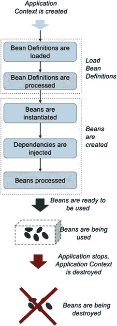

图 2-16.

应用上下文与 Bean 生命周期


#### Bean 生命周期内幕

在上一节中提到，一个 Bean 要诞生并可供使用，必须经历一系列步骤。由于上一节的重点是应用上下文，因此对 Bean 创建步骤的引用相当浅显。所以我们需要弥补这一点。让我们从描述 Bean 创建步骤的示意图开始：图 2-17。

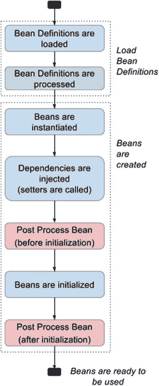

图 2-17.

Bean 创建步骤的完整列表

在“加载 Bean 定义”步骤中，会解析 XML 文件/配置类，并将 Bean 定义加载到应用上下文中，以 ID 为索引。然后，这些 Bean 定义会被称为“Bean 定义后处理器”的 Bean 处理，这些后处理器由应用上下文自动拾取、创建，并在任何其他 Bean 创建之前应用。这些 Bean 类型实现了 `org.springframework.beans.factory.config.BeanFactoryPostProcessor` 接口，应用上下文正是通过这种方式识别它们。在前面的示例中，提到了 `PropertyPlaceholderConfigurer` 类型。这个类是一个 Bean 定义后处理器，它使用从 Spring 环境及其属性源集合中读取的属性值来解析像 `${propName}` 这样的占位符。

`BeanFactoryPostProcessor` 包含一个必须实现的单一方法定义：`postprocess(BeanFactory)`。调用此方法时传入的参数是应用上下文用于创建 Bean 的工厂 Bean。开发者可以创建自己的 Bean 定义后处理器，并在其配置中定义一个此类型的 Bean，应用上下文将确保调用它们。

在图 2-18 中，描述了 `PropertyPlaceholderConfigurer` Bean 被调用时对 `dataSource1` Bean 定义的影响。

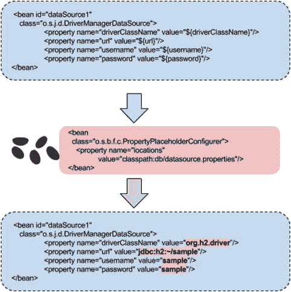

图 2-18.

PropertyPlaceholderConfigurer 对使用占位符的 Bean 定义的影响

这些类型的 Bean 非常有用，因为它们可以在运行时处理 Bean 定义，并根据应用程序外部的资源更改它们，这样应用程序就不需要为了更改 Bean 定义而重新编译。在上面的例子中，如果不是从外部文件读取 `dataSource1` 的属性，而是将信息直接写在配置文件中，那么如果 `dataSource1` 的位置和类型发生变化，就需要更改 XML 配置文件，并且应用程序必须重新编译和重启。这不太实用，对吧？

Bean 的创建步骤可以细分为几个阶段。

1.  在第一阶段，Bean 被实例化。这基本上意味着 Bean 工厂正在调用每个 Bean 的构造函数。如果 Bean 是使用构造函数依赖注入创建的，则依赖 Bean 会先被创建，然后注入到需要的地方。对于以这种方式定义的 Bean，实例化阶段与依赖注入阶段是重合的。
2.  在第二阶段，依赖关系被注入。对于定义为通过 Setter 方法注入依赖的 Bean，此阶段与实例化阶段是分开的。
3.  下一个阶段是在初始化之前调用 Bean 后处理 Bean。¹¹
4.  在这个阶段，Bean 被初始化。
5.  下一个阶段是在初始化之后调用 Bean 后处理 Bean。

如您所见，有两个阶段涉及调用 Bean 后处理 Bean。它们之间有什么区别？它们之间的阶段，即初始化阶段，用于将它们分为初始化前调用的后处理器和初始化后调用的后处理器。由于 Bean 后处理器这个主题相当庞大，我们将首先介绍初始化阶段。长话短说，可以定义一个 Bean，使得在 Bean 创建完成且依赖注入后，立即调用某个方法来执行一些代码。这个方法被称为初始化方法，在使用 XML 配置时，可以通过 Bean 定义上的 `init-method` 属性来设置此方法。`init-method` 属性的值应该是 Bean 类型中定义的方法名称。该方法必须返回 void，没有参数定义，并且可以有任何访问权限，因为 Spring 使用反射来查找和调用它，一些开发者实际上建议将其设为 private，这样它就不能从 Bean 外部调用，同时确保 Spring 完全控制它，并且只在 Bean 生命周期中调用它一次。在下面的代码片段中，您可以看到为 `ComplexBean` 类型的 Bean 配置这样一个方法。这个 Bean 非常简单，没有可供 Bean 后处理器拾取和执行的方法：

```
public class ComplexBean {
private Logger logger = LoggerFactory.getLogger(ComplexBean.class);
private SimpleBean simpleBean1;
private SimpleBean simpleBean2;
public ComplexBean(SimpleBean simpleBean1) {
logger.info("阶段 1: 调用构造函数。");
this.simpleBean1 = simpleBean1;
}
public void setSimpleBean2(SimpleBean simpleBean2) {
logger.info("阶段 2: 调用 Setter 方法。");
this.simpleBean2 = simpleBean2;
}
/**
* 初始化方法。
* 纯粹为了好玩：它仅在当前时间为偶数时实例化 simpleBean2。
*/
private void initMethod() {
logger.info("阶段 4: 调用 initMethod。");
long ct = System.currentTimeMillis();
if (ct % 2 == 0) {
simpleBean2 = new SimpleBean();
}
}
}
```

`ComplexBean` 的定义包含一个用于注入 `simpleBean2` 依赖的 Setter 方法定义，但在下面的配置中，并没有使用这个 Setter 方法，因为重点在于初始化阶段。

在基于上述配置初始化应用上下文时，日志中可以看到以下内容：

```
...
DEBUG o.s.b.f.s.DefaultListableBeanFactory - Creating instance of bean 'complexBean'
INFO c.p.s.ComplexBean - 阶段 1: 调用构造函数。
DEBUG o.s.b.f.s.DefaultListableBeanFactory - Eagerly caching bean 'complexBean' to allow for resolving potential circular references
DEBUG o.s.b.f.s.DefaultListableBeanFactory - Invoking init method 'initMethod' on bean with name 'complexBean'
INFO c.p.s.ComplexBean - 阶段 4: 调用 initMethod。
DEBUG o.s.b.f.s.DefaultListableBeanFactory - Finished creating instance of bean 'complexBean'
...
```

如您所见，Bean 被创建，然后创建该 Bean 的工厂调用了 `initMethod`。请记住这一点，因为它很重要，您很快就会明白。如果没有指定 `init` 方法，Spring 中还有其他初始化 Bean 的方法。以下是完整列表：

*   使用 `<bean>` XML 定义上的 `init-method` 属性来定义一个在初始化时调用的方法，前面已经介绍过。
*   实现 `org.springframework.beans.factory.InitializingBean` 接口并为 `afterPropertiesSet` 方法提供实现（不推荐，因为这会将应用程序代码与 Spring 基础设施耦合）。
*   使用 `@PostConstruct` 注解在 Bean 实例化且依赖注入后立即调用的方法。¹²
*   使用 Java 配置时，`@Bean(initMethod="...")` 等同于 `init-method` 属性。


`InstantiatingBean` 接口由那些需要在 BeanFactory 注入其所有依赖项后做出反应的 Bean 实现。它定义了一个相应命名的方法 `afterPropertiesSet()`，该方法由工厂调用。在下面的代码片段中，`ComplexBean` 被修改为实现此接口。

```
public class ComplexBean implements InitializingBean {
private Logger logger = LoggerFactory.getLogger(ComplexBean.class);
private SimpleBean simpleBean1;
private SimpleBean simpleBean2;
public ComplexBean(SimpleBean simpleBean1) {
logger.info("Stage 1: Calling the constructor.");
this.simpleBean1 = simpleBean1;
}
public void setSimpleBean2(SimpleBean simpleBean2) {
logger.info("Stage 2: Calling the setter.");
this.simpleBean2 = simpleBean2;
}
@Override
public void afterPropertiesSet() throws Exception {
logger.info("Stage 4: Calling afterPropertiesSet.");
}
}

```

在此示例中，使用了此 Bean 的 setter 方法，这样在日志中可以清楚地看到 `afterPropertiesSet()` 方法是在注入所有依赖项之后被调用的。如果使用之前的配置创建应用程序上下文，则可以在日志中看到以下内容：

```
...
DEBUG o.s.b.f.s.DefaultListableBeanFactory - Creating instance of bean 'complexBean'
INFO c.p.s.ComplexBean - Stage 1: Calling the constructor.
DEBUG o.s.b.f.s.DefaultListableBeanFactory - Eagerly caching bean 'complexBean'
to allow for resolving potential circular references
DEBUG o.s.b.f.s.DefaultListableBeanFactory - Returning cached instance
of singleton bean 'simpleBean2'
INFO c.p.s.ComplexBean - Stage 2: Calling the setter.
(*)DEBUG o.s.b.f.s.DefaultListableBeanFactory - Invoking afterPropertiesSet()
on bean with name 'complexBean'
INFO c.p.s.ComplexBean - Stage 4: Calling afterPropertiesSet.
DEBUG o.s.b.f.s.DefaultListableBeanFactory - Finished creating instance
of bean 'complexBean'
...
```

正如您从日志中注意到的，标有 (`*`) 的行，即调用 `afterProperties` 方法，也是创建该 Bean 的工厂的职责之一。

Spring 2.5 引入了对一小部分注解的注解支持。从那时起，Spring 不断发展，目前使用 Spring 4.0，应用程序可以仅使用注解（原型注解和完整的 Java 配置集）进行配置。`@PostConstruct` 注解是 JSR 250¹³ 的一部分，用于需要在依赖注入完成后执行以进行初始化的方法上。被注解的方法必须在 Bean 被使用之前调用，并且，就像任何其他选择的初始化方法一样，在 Bean 的生命周期中只能被调用一次。如果没有要注入的依赖项，则被注解的方法将在 Bean 实例化后被调用。只有一个方法应该使用 `@PostConstruct` 进行注解。

使用 `@PostConstruct` 注解的方法由实现 `org.springframework.beans.factory.config.BeanPostProcessor` 接口类型的预初始化 Bean 捕获并调用。实现此接口的类实际上是工厂钩子，允许对 Bean 实例进行修改。应用程序上下文会自动检测这些类型的 Bean，并在容器中的任何其他 Bean 之前实例化它们，因为在它们实例化之后，它们被用于操作由 IoC 容器管理的其他 Bean。

`BeanPostProcessor` 声明了两个需要实现的方法：`postProcessBeforeInitialization` 和 `postProcessAfterInitialization`，它们的名称清晰地表明了它们的用途。在图 2-17 中，有两个粉红色矩形描绘了 Bean 后处理器何时在 Bean 上调用方法。通常，通过标记接口（它们拾取使用 `@PostConstruct` 注解的方法）填充 Bean 的后处理器将实现 `postProcessBeforeInitialization`，而使用代理包装 Bean 的后处理器通常会实现 `postProcessAfterInitialization`。

对于 `@PostConstruct`，被注解的方法会被拾取并执行。配置中必须存在一个此类型的 Bean。注册 `@PostConstruct`（以及 JSR 250 中的其他注解，稍后您将看到）的 Bean 是 `org.springframework.context.annotation.CommonAnnotationBeanPostProcessor`。由于这是一个 Spring 基础设施 Bean，它可以像这样添加到配置文件中：

这可能会起作用，但像这样配置 Bean 会覆盖 Spring 默认值，这可能会导致意外行为，从而产生一些问题。幸运的是，此 Bean 配置是包含在以下行中的配置之一，这是一个基于 `context` 命名空间的 Spring 快捷方式：

`<context:annotation-config />` 启用了对项目中所有类的注解扫描，因此在大型应用程序中使用它可能会使其变慢。解决方案是使用 `<context:component-scan />`，因为 `base-package` 属性将减少需要扫描的类数量。此外，好处是您还可以通过逗号分隔来设置多个基础包。最棒的是，包中的类还可以按名称、按它们所注解的内容或其他条件进行过滤。

当 XML 文件中存在 `<context:component-scan />` 语句时，所有支持的注解都会在类路径中被检测到，或者在第二种情况下，仅在为 `base-package` 属性指定值的包中被检测到。

`<context:annotation-config/>` 激活了对 `@PostConstruct`、`@PreDestroy`、`@Resource`、`@Autowired` 和 `@Required` 以及其他 JPA 和 EJB 3 注解的检测。

`<context:component-scan/>` 激活了对前面提到的所有注解以及 Spring 原型注解的检测：@Component 及其扩展（例如，`@Service`、`@Repository`）。

回到我们的 Bean 初始化，下面的代码和配置描述了 `ComplexBean` 类使用 `@PostConstruct` 注解的情况：

```

//ComplexBean.java
import javax.annotation.PostConstruct;
public class ComplexBean {
private Logger logger = LoggerFactory.getLogger(ComplexBean.class);
private SimpleBean simpleBean1;
private SimpleBean simpleBean2;
public ComplexBean(SimpleBean simpleBean1) {
logger.info("Stage 1: Calling the constructor.");
this.simpleBean1 = simpleBean1;
}
public void setSimpleBean2(SimpleBean simpleBean2) {
logger.info("Stage 2: Calling the setter.");
this.simpleBean2 = simpleBean2;
}
@PostConstruct
private void initMethod() {
logger.info("Stage 4: Calling the initMethod.");
long ct = System.currentTimeMillis();
if (ct % 2 == 0) {
simpleBean2 = new SimpleBean();
}
}
}
```

可以使用 `@PostConstruct` 注解的方法必须遵守与所有其他初始化方法相同的规则：它们必须没有参数，返回 void，并且可以具有任何访问权限。如果从此配置创建应用程序上下文，以下是日志可能显示的内容：


```
...
DEBUG o.s.b.f.s.DefaultListableBeanFactory - Creating instance of bean ’complexBean’
INFO c.p.s.ComplexBean - Stage 1: Calling the constructor.
DEBUG o.s.c.a.CommonAnnotationBeanPostProcessor -
Found init method on class com.ps.sample.ComplexBean:
private void com.ps.sample.ComplexBean.initMethod()
DEBUG o.s.c.a.CommonAnnotationBeanPostProcessor -
Registered init method on class com.ps.sample.ComplexBean:
o.s.b.f.a.InitDestroyAnnotationBeanPostProcessor$LifecycleElement@fad21aed
DEBUG o.s.b.f.s.DefaultListableBeanFactory - Eagerly caching bean ’complexBean’
to allow for resolving potential circular references
DEBUG o.s.b.f.s.DefaultListableBeanFactory - Returning cached instance of
singleton bean ’simpleBean2’
INFO c.p.s.ComplexBean - Stage 2: Calling the setter.
DEBUG o.s.c.a.CommonAnnotationBeanPostProcessor - Invoking init method
on bean 'complexBean': private void com.ps.sample.ComplexBean.initMethod()
INFO c.p.s.ComplexBean - Stage 4: Calling the initMethod.
DEBUG o.s.b.f.s.DefaultListableBeanFactory - Finished creating instance
of bean 'complexBean'
...
```

从这段日志可以看出，虽然调用了相同的 `initMethod` 来初始化 Bean，但调用者与之前不同，因为该方法现在是由预初始化后置处理器 Bean（即 `CommonAnnotationBeanPostProcessor` Bean）调用的，而不是由创建 Bean 的工厂 Bean 调用。这一点很重要，因为现在可以理解，这类 Bean 能够在 Bean 初始化前后产生影响，因为显然，虽然它们可用于初始化，但其设计目的是在初始化之前或之后执行某些操作。

?

例如，如果我们向 `ComplexBean` 类添加另一个方法 `initMethod2`，并按照下面的代码片段配置 `complexBean`，上面的日志会如何变化？

如果你还没想明白，日志的变化如下：

```
...
DEBUG o.s.b.f.s.DefaultListableBeanFactory - Creating instance of bean ’complexBean’
INFO c.p.s.ComplexBean - Stage 1: Calling the constructor.
DEBUG o.s.c.a.CommonAnnotationBeanPostProcessor -
Found init method on class com.ps.sample.ComplexBean:
private void com.ps.sample.ComplexBean.initMethod()
DEBUG o.s.c.a.CommonAnnotationBeanPostProcessor -
Registered init method on class com.ps.sample.ComplexBean:
o.s.b.f.a.InitDestroyAnnotationBeanPostProcessor$LifecycleElement@fad21aed
DEBUG o.s.b.f.s.DefaultListableBeanFactory - Eagerly caching bean ’complexBean’
to allow for resolving potential circular references
DEBUG o.s.b.f.s.DefaultListableBeanFactory - Returning cached instance of
singleton bean 'simpleBean2'
INFO c.p.s.ComplexBean - Stage 2: Calling the setter.
DEBUG o.s.c.a.CommonAnnotationBeanPostProcessor - Invoking init method
on bean 'complexBean': private void com.ps.sample.ComplexBean.initMethod()
INFO c.p.s.ComplexBean - Stage 3: Calling the initMethod.
DEBUG o.s.b.f.s.DefaultListableBeanFactory - Invoking init method
'initMethod2' on bean with name 'complexBean'
c.p.s.ComplexBean - Stage 4: Calling the initMethod2.
DEBUG o.s.b.f.s.DefaultListableBeanFactory - Finished creating instance
of bean 'complexBean'
...
```

使用 `@PostConstruct` 注解的方法 `initMethod` 在方法 `initMethod2` 之前被调用，使其覆盖了 Bean 生命周期的第三阶段。

Bean 后置处理器非常强大，因为它们可用于强制执行 Bean 的行为（`@Required`），甚至透明地向应用逻辑添加行为（事务、安全）。`@Required` 注解用于标记强制性的依赖项，由 Spring 提供。在本章开头，展示如何配置 Setter 依赖注入时，曾提到使用 Setter 注入的依赖项不是必需的，但有一种方法可以强制开发者进行注入。`@Required` 注解就是这种方法。在下面的代码片段中，`ComplexBean` 类型被修改为使用 `@Required` 注解：

```
import org.springframework.beans.factory.annotation.Required;
public class ComplexBean {
private SimpleBean simpleBean1;
private SimpleBean simpleBean2;
public ComplexBean(SimpleBean simpleBean1) {
logger.info("Stage 1: Calling the constructor.");
this.simpleBean1 = simpleBean1;
}
@Required
public void setSimpleBean2(SimpleBean simpleBean2) {
logger.info("Stage 2: Calling the setter.");
this.simpleBean2 = simpleBean2;
}
...
}

```

无法使用上述配置创建应用上下文，因为 `complexBean` 的属性 `simpleBean2` 在任何地方都未设置。在控制台中，会打印一个异常，紧挨着异常下方，你可以看到强制执行依赖项强制性行为的 Bean 的 BeanPostProcessor 类型：

```
org.springframework.beans.factory.annotation.RequiredAnnotationBeanPostProcessor
org.springframework.beans.factory.BeanInitializationException:
Property 'simpleBean2' is required for bean 'complexBean'
at o.s.b.f.a.RequiredAnnotationBeanPostProcessor.postProcessPropertyValues
```

支持 Spring 的 IDE 会识别此注解，并尝试警告你的错误，用红色下划线标记 Bean 定义，或显示带有注释的弹出窗口，类似于你在图 2-19 中看到的内容。

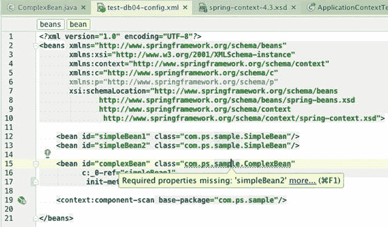

图 2-19.

Intellij IDEA 向开发者警告必需的依赖项

我们已到本节末尾，现在需要介绍 Bean 在被使用后、不再需要且应用关闭时（或仅管理它们的上下文关闭时）会发生什么。当上下文关闭时，它会销毁所有 Bean，这是显而易见的。但有些 Bean 使用的资源，如果在销毁前未收到通知，可能会拒绝释放它们。在 Spring 中，可以通过三种方式实现：

*   使用 `<bean />` 元素的 `destroy-method` 属性设置一个在销毁前调用的方法。
*   修改 Bean 以实现 `org.springframework.beans.factory.DisposableBean` 接口，并为 `destroy()` 方法提供实现（不推荐，因为这会将应用代码与 Spring 基础设施耦合）。
*   使用 `@PreDestroy` 注解方法，这也是 JSR 250 的一部分，并且是 Spring 最早支持的注解之一。
*   Java 配置中 `@Bean(destroyMethod="...")` 相当于 `destroy-method`。

Bean 的销毁方法与 POJO 的 `finalize` 方法目的相同。`ComplexBean` 被修改为使用销毁方法，代码和配置如下所示。

```
public class ComplexBean {
private SimpleBean simpleBean1;
private SimpleBean simpleBean2;
public ComplexBean(SimpleBean simpleBean1) {
logger.info("Stage 1: Calling the constructor.");
this.simpleBean1 = simpleBean1;
}
@Required
public void setSimpleBean2(SimpleBean simpleBean2) {
logger.info("Stage 2: Calling the setter.");
this.simpleBean2 = simpleBean2;
}
private void destroyMethod(){
logger.info(" --> Calling the destroyMethod.");
simpleBean1 = null;
simpleBean2 = null;
}
...
}

```

为了在日志中看到有用的信息，我们需要优雅地关闭应用上下文，这可以通过调用 `close` 方法来实现。

```
@Test
public void testBeanCreation() {
ConfigurableApplicationContext ctx =
new ClassPathXmlApplicationContext("classpath:spring/test-db04-config.xml");
... // use the bean
ctx.close();
}
```

瞧：（仅展示了日志的最后部分，其中记录了销毁方法的调用。）


```
...
DEBUG o.s.b.f.s.DefaultListableBeanFactory - Creating instance of bean ’complexBean’
...
DEBUG o.s.b.f.s.DefaultListableBeanFactory - Finished creating instance
of bean 'complexBean'
...
INFO o.s.c.s.ClassPathXmlApplicationContext - Closing
org.springframework.context.support.ClassPathXmlApplicationContext
DEBUG o.s.b.f.s.DefaultListableBeanFactory - Returning cached instance
of singleton bean ’lifecycleProcessor’
DEBUG o.s.b.f.s.DefaultListableBeanFactory - Destroying singletons in
org.springframework.beans.factory.support.DefaultListableBeanFactory...
DEBUG o.s.b.f.s.DisposableBeanAdapter - Invoking destroy method ’destroyMethod’
on bean with name ’complexBean’
INFO c.p.s.ComplexBean - --> Calling the destroyMethod.

```

如你所见，销毁 bean 的命令被发送给了创建它们的工厂，工厂将这项“脏活”委托给了一个类型为 `org.springframework.beans.factory.support.DisposableBeanAdapter` 的 bean。¹⁴

!

对于 `destroy` 方法，其签名和访问修饰符的规则与建议与 `init` 方法相同：

-   destroy 方法在 bean 的生命周期中只能被调用一次。
-   destroy 方法可以使用任何访问修饰符；一些开发者甚至建议将其设为 `private`，这样只有 Spring 能通过反射调用它。
-   destroy 方法不能有任何参数。
-   destroy 方法必须返回 `void`。

你现在可能已经猜到，如果 `ComplexBean` 实现了 `DisposableBean`，那么当通过 XML 配置了 destroy 方法时，工厂委托的“脏活”将由同一个 bean 完成。下面展示了实现代码和配置。

```
import org.springframework.beans.factory.DisposableBean;
public class ComplexBean implements DisposableBean {
private SimpleBean simpleBean1;
private SimpleBean simpleBean2;
public ComplexBean(SimpleBean simpleBean1) {
logger.info("Stage 1: Calling the constructor.");
this.simpleBean1 = simpleBean1;
}
@Required
public void setSimpleBean2(SimpleBean simpleBean2) {
logger.info("Stage 2: Calling the setter.");
this.simpleBean2 = simpleBean2;
}
@Override
private void destroy(){
logger.info(" --> Calling the destroy() method.");
simpleBean1 = null;
simpleBean2 = null;
}
...
}

```

日志与使用 `destroy-method` 属性指定 destroy 方法时相同。`DisposableBeanAdapter` 会调用 `destroy()` 方法，因此不再重复展示。

同样，你可能也猜到了，如果 `ComplexBean` 使用了 `@PreDestroy` 注解，那么这项“脏活”将由一个 bean 后置处理器完成。下面展示了实现代码、配置和日志：

```
import javax.annotation.PreDestroy;
public class ComplexBean {
private SimpleBean simpleBean1;
private SimpleBean simpleBean2;
public ComplexBean(SimpleBean simpleBean1) {
logger.info("Stage 1: Calling the constructor.");
this.simpleBean1 = simpleBean1;
}
@Required
public void setSimpleBean2(SimpleBean simpleBean2) {
logger.info("Stage 2: Calling the setter.");
this.simpleBean2 = simpleBean2;
}
@PreDestroy
private void destroyMethod(){
logger.info(" --> Calling the destroyMethod.");
simpleBean1 = null;
simpleBean2 = null;
}
...
}

// 日志
...
DEBUG o.s.b.f.s.DefaultListableBeanFactory - Creating instance of bean 'complexBean'
...
DEBUG o.s.b.f.s.DefaultListableBeanFactory - Finished creating instance
of bean 'complexBean'
...
INFO o.s.c.s.ClassPathXmlApplicationContext - Closing
org.springframework.context.support.ClassPathXmlApplicationContext
DEBUG o.s.b.f.s.DefaultListableBeanFactory - Returning cached instance
of singleton bean ’lifecycleProcessor’
DEBUG o.s.b.f.s.DefaultListableBeanFactory - Destroying singletons in
org.springframework.beans.factory.support.DefaultListableBeanFactory...
DEBUG o.s.c.a.CommonAnnotationBeanPostProcessor - Invoking destroy method
on bean ’complexBean’: private void com.ps.sample.ComplexBean.destroyMethod()
INFO c.p.s.ComplexBean ---> Calling the destroyMethod.

```

#### Bean 作用域

既然已经讨论了销毁 bean 的话题，接下来将讨论 bean 能存活多久，也就是 bean 的作用域。你可能已经注意到，当上下文关闭时，日志中总会看到这样一行：

```
DEBUG o.s.b.f.s.DefaultListableBeanFactory - Destroying singletons in org.springframework.beans.factory.support.DefaultListableBeanFactory@10e92f8f: defining beans simpleBean1,simpleBean2,complexBean, o.s.c.a.internalConfigurationAnnotationProcessor...
```

因此，Spring 将 bean 称为单例（singleton），因为这是 bean 的默认作用域。¹⁵ 当 Spring IoC 实例化 bean 时，它会为每个 bean 创建一个单一实例，除非在 bean 定义中设置了其他属性。这个属性叫做 `scope`，bean 的默认作用域是 `singleton`。作用域定义在表 2-2 中。

**表 2-2. Bean 作用域**

| 作用域 | 描述 |
| --- | --- |
| `Singleton` | Spring IoC 为此 bean 创建单一实例，任何对此 bean 定义匹配的 id 或 ids 的请求都会返回该实例。 |
| `Prototype` | 每次请求此特定 bean 时，Spring IoC 都会创建一个新实例。 |
| `Request` | Spring IoC 为每个 HTTP 请求创建一个 bean 实例。仅在支持 Web 的 Spring ApplicationContext 上下文中有效。 |
| `Session` | Spring IoC 为每个 HTTP 会话创建一个 bean 实例。仅在支持 Web 的 Spring ApplicationContext 上下文中有效。 |
| `global-session` | Spring IoC 为每个全局 HTTP 会话创建一个 bean 实例。仅在支持 Web 的 Spring ApplicationContext 上下文中有效。 |
| 自定义 | 开发者可以定义自己的作用域及其规则。 |

因此，当创建一个没有 scope 属性的 bean 时：

```

默认作用域是 `singleton`。
否则，bean 的作用域由 scope 属性的值指定。

```

既然我们知道了有更多可用的 bean 作用域，那么如何解决不同作用域之间的依赖问题呢？当我们有一个 `prototype` bean 依赖于一个 `singleton` bean 时，这没有问题。每次从上下文中请求 prototype bean 时，都会创建一个新实例，并将 singleton bean 注入其中。但在其他情况下，事情会变得有点复杂。

在具有不同作用域的 bean 之间处理依赖关系时，最敏感的领域是 Web 应用领域。你可能已经注意到，在 bean 作用域表中，有三个作用域是为 Web 应用设计的：`request`、`session` 和 `global-session`。假设我们有一个名为 ThemeManager 的服务 bean，它管理着一个 `UserSettings` 类型对象的更新，该对象包含了用户在 Web 应用界面的设置。这意味着 `ThemeManager` bean 必须为每个 HTTP 会话处理不同的 `UserSettings` bean。显然，这意味着 `UserSettings` bean 的作用域应该是 session：

但是，如何解决前面提到的单次实例化问题呢？在不同的 HTTP 会话中，应该使用该会话特定的 `userSettings` bean 来调用诸如 `themeManager.saveSettings(userSettings)` 之类的方法。但上面的配置不允许这样做。

Spring 对此问题有一个解决方案。Spring IoC 容器不仅处理 bean 的实例化，还处理依赖注入。如果它能被指示在需要时重新注入正确的依赖项就好了！类似的行为可以通过如下配置实现：


`<aop:scoped-proxy/>` 是 AOP¹⁶ 命名空间的一部分，它的作用是告诉 Spring IoC 容器不要注入 `UserSettings` bean，而是注入一个名为代理¹⁷的替代 bean，该代理具有与目标对象相同的公共接口，并且能够智能地获取当前会话特定的 `UserSettings`，并将来自 `ThemeManager` 的调用委托给它。

此处引入 AOP 框架是为了说明如何正确使用不同作用域的 bean。AOP 框架是对 Spring IoC 容器的补充。当然，在不需要使用安全或事务的小型应用程序中，可以不使用 AOP 框架而单独使用 Spring 容器，因为这些是企业应用程序的关键横切关注点。本书的整个第四章都专门用于介绍 Spring AOP 框架。

!

本节中展示的所有代码片段都可以在 `02-container-ps-02-practice` 中找到。Bean 类位于 `com.ps.sample` 下。为了测试你到目前为止的理解，一些 bean 类和配置的片段已被移除，并在其位置添加了 TODO 注释。你需要完成四项任务，编号为 9 到 12。这些 TODO 涵盖了 bean 的生命周期和作用域。在位于 `02-ps-container-02-practice/src/main/resources/logback.xml` 的 Logback 配置文件中，已为 Spring 框架配置了 DEBUG 级别的日志记录，因此你可以研究延迟日志并搜索本节中提到的元素。用于验证解决方案的核心类是

```
com.ps.ApplicationContextTest。
```

在 `02-container-ps-02-solution` 中为你提供了解决方案。你可以将其用于比较，或者如果遇到问题，也可以从中获得启发。

使用 Java 配置和注解提供配置

Spring 命名空间通过隐藏框架细节提供了一种简化 Spring 配置的方法。它们定义了一种用于创建 bean 定义的语言。由于它是 XML，因此可以进行验证，任何智能编辑器都能够在运行应用程序之前验证配置文件。它们还可以扩展，因此开发人员可以创建自己的元素来配置 bean。除了 beans 和已经提到的 util 命名空间之外，Spring 团队还开发了专用的命名空间，旨在简化本书将涵盖的许多主题的 Spring 基础设施 bean 的配置和使用：aop、context、jms、aop、jdbc、security、tx 等。所有这些都非常好，但总有改进的空间。

在第 2 节“如何在 Spring 演进中读取属性文件”中，你学习了使用 Spring 从文件中读取属性的三种方法。还有第四种方法。使用 Java 配置和注解，同样的操作如下所示：

```
import org.springframework.beans.factory.annotation.Value;
import org.springframework.context.annotation.Bean;
import org.springframework.context.annotation.Configuration;
import org.springframework.context.annotation.PropertySource;
import org.springframework.context.support.PropertySourcesPlaceholderConfigurer;
import org.springframework.jdbc.datasource.DriverManagerDataSource;
import javax.sql.DataSource;
import java.sql.SQLException;
@Configuration
@PropertySource("classpath:db/datasource.properties")
public class DataSourceConfig {
@Value("${driverClassName}")
private String driverClassName;
@Value("${url}")
private String url;
@Value("${username}")
private String username;
@Value("${password}")
private String password;
@Bean
public DataSource dataSource() throws SQLException {
DriverManagerDataSource ds = new DriverManagerDataSource();
ds.setDriverClassName(driverClassName);
ds.setUrl(url);
ds.setUsername(username);
ds.setPassword(password);
return ds;
}
// 需要解析通过 @Value 注入的属性
@Bean
public static PropertySourcesPlaceholderConfigurer
propertySourcesPlaceholderConfigurer() {
return new PropertySourcesPlaceholderConfigurer();
}
}
```

在深入探讨使用 Java 配置和注解来配置 Spring 应用程序之前，最好先了解一点历史。

当 Spring 1.0 于 2004 年发布时，它仅支持 XML 作为配置方法。注解的概念甚至还没有被发明出来。我记得我第一次接触 Spring 是在 2006 年。作为一个渴望学习编写 Java 代码的年轻程序员，使用 XML 编写应用程序似乎并不吸引人。一旦注解的概念出现，Spring 就迅速采纳并提供了自己的注解（例如原型注解 `@Component` 及其特化 `@Service` 和 `@Repository` 等），以使配置 Spring 应用程序更加实用。这发生在 2007 年，当时 Spring 2.5 发布了。在这个版本中，仍然需要 XML。从 2009 年的 Spring 3.0 开始，随着 Java 配置的引入（一种基于放置在 Java 代码中的注解的配置方法），XML 变得可有可无。上面的代码完全不需要任何 XML。可以使用相应的类 `org.springframework.context.annotation.AnnotationConfigApplicationContext` 基于该配置类创建应用程序上下文。为了测试配置，必须编写如下所示的测试类。

```
public class ApplicationContextTest {
@Test
public void testDataSource4() {
ApplicationContext ctx =
new AnnotationConfigApplicationContext(DataSourceConfig.class);
DataSource dataSource = ctx.getBean("dataSource", DataSource.class);
assertNotNull(dataSource);
}
}
```

以下各节将在适用的情况下与 XML 配置的相应部分类似。

注解

Spring 中的核心注解是来自 `org.springframework.stereotype` 包的 `@Component`。此注解标记一个类，将从中创建一个 bean。使用基于注解的配置和类路径扫描，可以自动发现此类。在图 2-20 中，描绘了本书中使用的所有注解，并按用途进行了分组。

*   原型注解用于根据用途标记类：

*   `@Component`：任何 Spring 管理的组件（bean）的模板。

*   `@Repository`：用于提供数据访问的组件的模板，是 `@Component` 注解在 Dao 层的特化。

*   `@Service`：用于提供服务执行的组件的模板，是 `@Component` 注解在 Service 层的特化。

*   `@Controller`：Web 组件的模板，是 `@Component` 注解在 Web 层的特化。


*   `@Cofiguration:`
        包含 Bean 定义（使用 `@Bean` 注解的方法）的配置类。

*   自动装配和初始化注解用于定义注入哪个依赖以及 Bean 的外观。例如：

*   `@Autowired:`
        该组核心注解；用于依赖项上，指示 Spring IoC 负责注入它们。可用于字段、构造方法和 setter 方法。与 Spring 的 `@Qualifier` 配合使用，以指定要注入的 Bean 的名称。

*   `@Inject:`
        等同于 javax.inject 包中的 @Autowired 注解。与 javax.inject 的 `@Qualifier` 配合使用，以指定要注入的 Bean 的名称。

*   `@Resource:`
        等同于 `javax.annotation` 包中的 `@Autowired` 注解。提供一个 `name` 属性来指定要注入的 Bean 的名称。

*   `@Required:`
        Spring 注解，用于将依赖标记为必需，用在 setter 方法上。

*   `@Lazy:`
        依赖项将在首次使用时才被注入。

*   仅出现在（且作用于）使用 `@Configuration` 注解的类中的注解；它们定义配置资源、组件及其作用域。

*   行为注解是定义 Bean 行为的注解。它们也可以被称为代理注解，因为它们涉及创建代理来拦截对使用这些注解配置的 Bean 的请求。

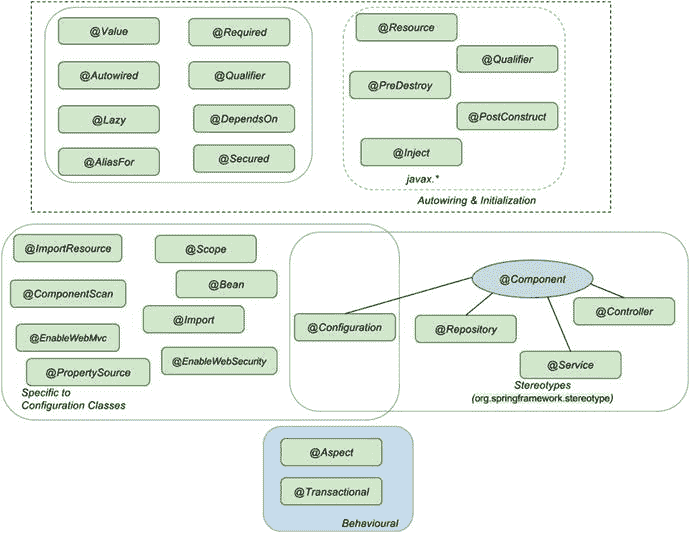

图 2-20.

本书中使用的注解

JDK 中包含的 JSR 250 注解，即 `javax.annotations` 包中的注解，均受支持。此外，在 Spring 3 中，增加了对 JSR 330¹⁸ 的支持，并且 Spring 注解是 JSR 330 注解的实现。每个包中注解的完整列表如图 2-21 所示。其中大部分是 Java 注解，它们提供了 Spring 注解的最小行为。

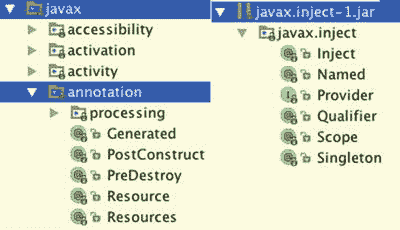

图 2-21.

Spring 支持的 JSR 250 和 JSR 330 注解

现在，后续章节的主角已经介绍完毕，好戏即将上演！

使用多个配置源

使用 `@Configuration` 注解的类包含 Bean 定义。一个 Spring 应用程序中可以有一个或多个这样的类，并且它们可以与 XML 配置文件结合使用。这些类可以通过多种方式引导¹⁹，具体取决于所选配置的设置方式。前面示例中使用的 `DataSourceConfig` 类是一个典型的 Java 配置类，它包含两个 Bean 定义和一些属性，这些属性通过 `PropertySource` 注解从属性文件中注入。

```
import org.springframework.jdbc.datasource.DriverManagerDataSource;
import org.springframework.beans.factory.annotation.Value;
import org.springframework.context.annotation.Bean;
import org.springframework.context.annotation.Configuration;
import org.springframework.context.annotation.PropertySource;
import org.springframework.context.support.PropertySourcesPlaceholderConfigurer;
@Configuration
@PropertySource("classpath:db/datasource.properties")
public class DataSourceConfig {
@Value("${driverClassName}")
private String driverClassName;
...
@Bean
public static PropertySourcesPlaceholderConfigurer
propertySourcesPlaceholderConfigurer() {
return new PropertySourcesPlaceholderConfigurer();
}
@Bean
public DataSource dataSource() throws SQLException {
DriverManagerDataSource ds = new DriverManagerDataSource();
ds.setDriverClassName(driverClassName);
ds.setUrl(url);
ds.setUsername(username);
ds.setPassword(password);
return ds;
}
}
```

`@Bean` 注解用于告诉 Spring，被注解方法的返回值将是一个需要由 Spring 管理的 Bean。`@Bean` 注解与方法一起被视为一个 Bean 定义，方法名成为 Bean 的 id。

`PropertySource` 注解向 Spring 环境中添加一个类型为 `PropertySource` 的 Bean，该 Bean 将用于从作为参数设置的属性文件中读取属性值。该配置还需要一个类型为 `PropertySourcesPlaceholderConfigurer` 的 Bean，用于替换作为 `@Value` 注解属性参数设置的占位符。此类可以使用 `AnnotationConfigApplicationContext` 实例进行引导，如前所示。但与 XML 结合使用时，也可以使用 `ClassPathXmlApplicationContext` 进行引导。在这种情况下，我们需要一个启用了组件扫描的 XML 配置文件，以便能够发现配置类。

以下代码片段中有两个使用 XML 进行配置的示例。`<context:annotation-config/>` 激活了 Bean 类中可检测的各种注解：Spring 的 `@Required` 和 `@Autowired`、JSR 250 的 `@PostConstruct`、`@PreDestroy` 和 `@Resource` 以及其他一些注解。这个配置元素如今很少使用，因为 `<context:component-scan />` 扩展了它，并且使用起来更实用，因为它支持许多用于过滤和减少扫描范围的属性。

在 Spring 测试环境中，spring-test 库提供了 `@ContextConfiguration`，用于使用一个或多个配置资源来引导测试环境。下面的代码描述了这种情况，现在不做解释，因为它将在第 3 章中介绍。

```
...
import org.junit.Test;
import org.junit.runner.RunWith;
import org.springframework.beans.factory.annotation.Autowired;
import org.springframework.test.context.ContextConfiguration;
import org.springframework.test.context.junit4.SpringJUnit4ClassRunner;
@RunWith(SpringJUnit4ClassRunner.class)
@ContextConfiguration(classes = {DataSourceConfig.class})
public class CfgToXmlTest {
@Autowired
DataSource dataSource;
@Test
public void testBoot() {
assertNotNull(dataSource);
}
}
```

当配置类和 XML 配置文件一起用于配置应用程序时，它们可以像上面的 XML 片段和引导示例那样进行配置和使用，但反过来也是可能的，即从 XML 文件导入配置，并使用 `AnnotationConfigApplicationContext` 实例引导所有内容，方法是在配置类上使用 `@ImportResource` 注解。以下代码片段描述了这种情况。

```

//UserRepoConfig.java
import org.springframework.context.annotation.ImportResource;
...
@Configuration
@PropertySource("classpath:db/datasource.properties")
@ImportResource("classpath:spring/user-repo-config.xml")
public class UserRepoDSConfig {
@Value("${driverClassName}")
private String driverClassName;
@Value("${url}")
private String url;
@Value("${username}")
private String username;
@Value("${password}")
private String password;
@Bean
public static PropertySourcesPlaceholderConfigurer
propertySourcesPlaceholderConfigurer() {
return new PropertySourcesPlaceholderConfigurer();
}
@Bean
public DataSource dataSource() throws SQLException {
DriverManagerDataSource ds = new DriverManagerDataSource();
ds.setDriverClassName(driverClassName);
ds.setUrl(url);
ds.setUsername(username);
ds.setPassword(password);
return ds;
}
}
//Test class
...
import org.junit.Test;
public class XmlToCfgTest {
private ApplicationContext ctx;
@Before
public void setup() {
ctx = new AnnotationConfigApplicationContext(UserRepoDSConfig.class);
assertNotNull(ctx);
}
@Test
public void testStart3() {
DataSource dataSource = ctx.getBean("dataSource", DataSource.class);
assertNotNull(dataSource);
UserRepo userRepo = ctx.getBean("userRepo", UserRepo.class);
assertNotNull(userRepo);
}
}
```


上一个示例中实际发生了什么？XML 文件中的 bean 定义被导入到用于测试引导的 `UserRepoDSConfig` 中，并且测试通过了。本节中的类可以在 `02-ps-container-02-practice` 中找到。配置文件位于 `02-ps-container-02-solution/src/main/resources/spring/user-repo-config.xml`，`UserRepoDSConfig` 位于 `02-ps-container-02-solution/src/main/java/com/ps/config/UserRepoDSConfig`，测试类位于 `02-ps-container-02-solution/src/test/java/com/ps/XmlToCfgTest.java`，紧邻之前的测试类 `CfgToXmlTest.java`。

在开发 Spring 应用程序时，你还会遇到另一种情况：拥有多个配置类。出于与推荐使用多个 XML 配置文件相同的原因，这也是推荐的做法：将具有相同职责的 bean 分组在一起，并使应用程序可测试。通过多个配置类配置的应用程序的引导，可以使用 `AnnotationConfigApplicationContext` 实例来完成，该实例将使用这两个类作为参数进行初始化。

```
ApplicationContext ctx =
new AnnotationConfigApplicationContext(DataSourceConfig.class,
PetRepoConfig.class);
```

如果应用程序中有多个配置类包含具有相同目的的 bean 定义，更实用的方法是使用 `@Import` 注解将一个类中的 bean 定义导入到另一个类中。

```
import org.springframework.context.annotation.Import;
@Configuration
@Import({DataSourceConfig.class,  UserRepoDSConfig.class})
public class AllRepoConfig {
...
}
```

到目前为止的配置示例中，我们使用了通过 `@Bean` 注解的方法来定义 bean，这些方法总是在带有 `@Configuration` 注解的类下找到。对于大型应用程序，你可以想象这相当不实用，因此还有另一种方法。在 Spring 中定义 bean 的最简单方法是使用 `@Component`（或任何适用的构造型注解）注解 bean 类，并启用组件扫描。当然，这仅适用于属于项目一部分的类。对于在第三方库中定义的类，例如到目前为止示例中出现的 `DataSource`，`@Bean` 是唯一的解决方案。这同样适用于 Spring 基础设施 bean，例如 `PropertySourcesPlaceholderConfigurer`。

在使用 Java 配置时，通过使用 `@ComponentScan` 注解配置类来启用组件扫描。它的工作方式与 XML 中的 `<context:component-scan />` 相同。下面的代码片段利用组件扫描来查找 `jdbcRequestRepo` 的 bean 定义。

```
package com.ps.repos.impl;
...
import org.springframework.stereotype.Repository;
//JdbcRequestRepo.java
@Repository
public class JdbcRequestRepo  extends
JdbcAbstractRepo implements RequestRepo{
...
}
//RequestRepoConfig.java
...
import org.springframework.context.annotation.ComponentScan;
@Configuration
@Import(DataSourceConfig.class)
@ComponentScan(basePackages = "com.ps")
public class RequestRepoConfig {
}
```

可以通过引导配置并测试能否找到 `jdbcRequestRepo` 来验证此设置。`jdbcRequestRepo` bean 的名称是由 Spring IoC 这样命名的，因为没有配置显式的 bean 名称。有关使用 Java 配置进行 bean 命名的更多详细信息，请参见 bean 命名部分。

```
public class BootstrapTest {
@Before
public void setup() {
ctx = new AnnotationConfigApplicationContext(DataSourceConfig.class,
RequestRepoConfig.class);
assertNotNull(ctx);
}
@Test
public void testStart5() {
DataSource dataSource = ctx.getBean("dataSource", DataSource.class);
assertNotNull(dataSource);
RequestRepo requestRepo = ctx.getBean("jdbcRequestRepo", RequestRepo.class);
assertNotNull(requestRepo);
}
}
```

Bean 命名

由于多种原因，使用 JavaConfigurations 时 bean 命名更简单。

CC

当使用 `@Bean` 声明的 bean 未定义名称时，Spring IoC 会使用注解方法的方法名来命名该 bean。

可以通过填充 `name` 属性来设置名称。同一个属性可以接收一个名称数组作为参数。第一个名称成为 bean 的名称；其余的名称成为别名。

```
// bean 名称 = dataSource
@Bean
public DataSource dataSource() throws SQLException {
...
}
//bean 名称 = one
@Bean(name="one")
public DataSource dataSource() throws SQLException {
...
}
//bean 名称 =  one, 别名 = two
@Bean(name={"one", "two"})
public DataSource dataSource() throws SQLException {
...
}
```

CC

当使用 `@Component` 声明的 bean 未定义名称时，Spring IoC 会通过将 bean 类型的名称首字母小写来创建 bean 的名称。

这就是为什么在前面的示例中，bean 名称是 `jdbcRequestRepo`，因为类名是 `JdbcRequestRepo`。如果你想重命名它，只需将名称作为参数传递给 `@Repository` 注解（或任何构造型注解）即可：

```
// bean 名称 = jdbcRequestRepo
@Repository
public class JdbcRequestRepo extends
JdbcAbstractRepo implements RequestRepo{
...
}
// bean 名称 = requestRepo
@Repository("requestRepo")
public class JdbcRequestRepo extends
JdbcAbstractRepo implements RequestRepo{
...
}
// 或者
@Repository(value="requestRepo")
public class JdbcRequestRepo extends
JdbcAbstractRepo implements RequestRepo{
...
}
//  或者
// bean 名称 = requestRepo
@Component("requestRepo")
public class JdbcRequestRepo extends
JdbcAbstractRepo implements RequestRepo{
...
}
```

不能使用构造型注解定义别名，但已经有人请求提供这样的功能。²⁰

与命名相关的是 `@Description` 注解，它是在 Spring 4.x 中添加的。此注解用于为 bean 添加描述，当 bean 出于监控目的而暴露时，这非常有用，正如你将在 JMX 部分看到的那样。它可以与 `@Bean` 和 `@Component`（及其特化注解）一起使用。

```
@Repository
@Description("这不是你要找的 bean")
public class JdbcRequestRepo extends JdbcAbstractRepo
implements RequestRepo {
...
}
```

在 Spring 4.2 中，添加了 `@AliasFor` 注解。此注解设置在注解属性上，用于将它们声明为其他注解属性的别名。在下面的示例中，声明了一个 `@DsCfg` 注解，它有一个名为 `loginTimeout` 的属性。

```
package com.ps.repos.impl;
public @interface DsCfg {
int loginTimeout() default 3600;
}
```

Repository bean 定义可以使用此注解进行注解，以自动将 dataSource 的 `loginTimeout` 值设置为注解的 `loginTimeout` 属性值所指定的值。²¹ 将注解中的值注入到 bean 的相应字段中，显然会使用后处理器 bean（还记得那些吗？）来完成，并且此示例所需的代码与此无关，因此不会在此处展示。

```
package com.ps.sample;
...
import com.ps.sample.DsCfg;
@DsCfg(loginTimeout = 4800)
@Repository("requestRepo")
public class JdbcRequestRepo extends JdbcAbstractRepo
implements RequestRepo {
...
}
```

属性名称相当长，对吧？如果应用程序很大，重命名属性会很麻烦，所以这就是 `@AliasFor` 发挥作用的地方。

```
package com.ps.sample;
import org.springframework.core.annotation.AliasFor;
public @interface DsCfg {
int loginTimeout() default 3600;
@AliasFor(attribute = "loginTimeout")
int lTout() default 3600;
}
```

使用 `@AliasFor`，为 `loginTimeout` 属性定义了别名 `lTout`，因此上面的 repository 定义现在可以这样写：


```
package com.ps.sample;
...
import com.ps.sample.DsCfg;
@DsCfg(lTout = 4800)
@Repository("requestRepo")
public class JdbcRequestRepo extends JdbcAbstractRepo
implements RequestRepo {
...
}
```

甚至还能做更多。可以为元注解的属性声明别名。假设我们不喜欢 `@Repository` 注解中的 `value` 属性名称，并希望在我们的应用中通过添加一个作为 `value` 属性别名的 `id` 属性，让 `@Repository` 注解用于设置 Bean 的 ID 这一用途更加明确。实现这一功能的唯一条件是：声明别名的注解必须被元注解标注，并且 `annotation` 属性必须引用该元注解。

```
package com.ps.sample;
import org.springframework.core.annotation.AliasFor;
@Repository
public @interface MyRepoCfg {
@AliasFor(annotation = Repository.class, attribute = "value")
String id() default "";
}
```

因此，Repository Bean 可以像以下代码片段那样进行声明：

```
...
import com.ps.MyRepoCfg;
...
//JdbcRequestRepo.java Bean 定义
@MyRepoCfg(id = "requestRepo")
public class JdbcRequestRepo extends JdbcAbstractRepo
implements RequestRepo {
...
}
```

字段注入、构造器注入与 Setter 注入

在 XML 配置部分的开头曾提到，XML 不支持字段注入。这是因为 `<bean />` 元素定义不支持此功能。²² 在使用注解配置 Bean 时，字段注入是可行的，因为用于定义依赖的核心注解 `@Autowire` 可以应用于字段、构造器、Setter 方法，甚至普通方法。

术语 `autowire` 是自动依赖注入的简称。这仅在 Spring 应用中使用组件扫描和构造型注解创建 Bean 时才有可能实现。`@Autowire` 注解表明 Spring 应负责注入该依赖。这引出了一个有趣的问题：Spring 如何知道要注入什么？

CC

默认情况下，Spring 会尝试按类型进行自动装配，因为在应用中很少需要同一类型的多个 Bean。Spring 会检查所需依赖的类型，并注入具有该确切类型的 Bean。让我们考虑一个名为 `RequestRepoConfig` 的配置类，它定义了一个类型为 `JdbcRequestRepo` 的 Bean。让我们为这个类型为 `JdbcRequestRepo` 的 Repository Bean 指定一个显式名称，然后在一个典型的 Spring 测试类中定义一个自动装配的依赖。通过在字段上使用 `@Autowire`，我们就是在利用**字段注入**。

```
//JdbcRequestRepo.java Bean 定义
@Repository("requestRepo")
public class JdbcRequestRepo extends JdbcAbstractRepo
implements RequestRepo {
...
}
//配置类 RequestRepoConfig.java
...
import org.springframework.context.annotation.ComponentScan;
@Configuration
@Import(DataSourceConfig.class)
@ComponentScan(basePackages = "com.ps")
public class RequestRepoConfig {
}
//AutowireTest.java Spring 典型测试类
import org.springframework.beans.factory.annotation.Autowired;
...
@RunWith(SpringJUnit4ClassRunner.class)
@ContextConfiguration(classes = {RequestRepoConfig.class})
public class AutowiringTest {
@Autowired
RequestRepo reqRepo;
@Test
public void testAutowiredField() {
assertNotNull(reqRepo);
}
}
```

只要上下文中恰好定义了一个类型为 `RequestRepo` 的 Bean，上述测试就会通过。Spring 不关心 Bean 的名称，除非上下文中存在多个相同类型的 Bean。

CC

默认情况下，如果 Spring 无法根据类型决定自动装配哪个 Bean（因为应用中存在多个相同类型的 Bean），它会回退到按名称自动装配。作为搜索正确依赖标准的名称，是被自动装配的字段的名称。

在前面的案例中，如果 Spring 无法根据类型决定自动装配哪个 Bean，它将查找名为 `reqRepo` 的 Bean。让我们在 `RequestRepoConfig` 中定义另一个类型为 `RequestRepo` 的 Bean，并将其命名为 `anotherRepo`，然后看看会发生什么。

```
@Configuration
@Import(DataSourceConfig.class)
@ComponentScan(basePackages = "com.ps")
public class RequestRepoConfig {
@Bean
public RequestRepo anotherRepo(){
return new JdbcRequestRepo();
}
}
```

类 `AutowireTest` 是 `02-ps-container-02-practice` 的一部分，并且 Spring 框架的日志已设置为调试级别。当运行 `testAutowiredField` 测试方法时，可以在日志中看到以下内容：²³

```
...
DEBUG o.s.b.f.s.DefaultListableBeanFactory - Creating instance of bean 'requestRepo'
DEBUG o.s.b.f.s.DefaultListableBeanFactory - Creating instance of bean 'anotherRepo'
ERROR o.s.t.c.TestContextManager - Caught exception while allowing TestExecutionListener
to prepare test instance com.ps.AutowiringTest@6ec8211c UnsatisfiedDependencyException
Error creating bean with name 'com.ps.AutowiringTest':
Unsatisfied dependency expressed through field 'reqRepo'
No qualifying bean of type com.ps.repos.RequestRepo is defined:
expected single matching bean but found 2: requestRepo,anotherRepo
```

在这种情况下，我们有两个类型为 `RequestRepo` 的 Bean，并且它们都不叫 `reqRepo`，所以 Spring 无法决定。第一个解决方案是重命名 `anotherRepo` 方法。第二个解决方案是通过 `@Autowired + @Qualifier`（Spring 提供的那个）告诉 Spring，应该使用名为 `anotherRepo` 的 Bean 进行自动装配，因为 `Qualifier` 注解的用途正是从开发者的角度告诉 Spring 哪个 Bean 符合自动装配的条件。

```
import org.springframework.beans.factory.annotation.Qualifier;
...
@RunWith(SpringJUnit4ClassRunner.class)
@ContextConfiguration(classes = {RequestRepoConfig.class})
public class AutowiringTest {
@Qualifier("anotherRepo")
@Autowired
RequestRepo reqRepo;
}
```

`@Autowire` 注解可以用于构造器，以告诉 Spring 使用自动装配来为该构造器提供参数。Spring 识别自动装配候选者的方式与之前介绍的逻辑相同：它会尝试找到一个唯一的参数类型 Bean。如果找到多个，则会注入与参数同名的那个。`JdbcRequestRepo` Bean 类型需要一个 `dataSource` 才能正常运行。该依赖将通过构造器注入提供，方法是用 `@Autowired` 注解构造器。到目前为止使用的测试类仍然可以用来测试 `reqRepo` 字段，因为如果 `dataSource` 无法注入，Bean 就无法创建，测试将会失败。如果你运行测试并通过，日志将是了解幕后情况的绝佳来源。

```
@Repository("requestRepo")
public class JdbcRequestRepo extends JdbcAbstractRepo
implements RequestRepo {
@Autowired
public JdbcRequestRepo(DataSource dataSource) {
super(dataSource);
}
}
//AutowiringTest.java Spring 典型测试类
...
@Qualifier("requestRepo")
@Autowired
RequestRepo reqRepo;
...
// 启动应用时的日志
DEBUG o.s.b.f.s...Factory - Creating instance of bean 'requestRepo'
DEBUG o.s.b.f.s...Factory - Returning cached instance of singleton bean 'one'
DEBUG o.s.b.f.s...Factory - Returning cached instance of singleton bean 'dataSource'
DEBUG o.s.b.f.s...Factory -
Autowiring by type from bean name 'requestRepo' via constructor
to bean named 'dataSource'
DEBUG o.s.b.f.a.AutowiredAnnotationBeanPostProcessor -
Autowiring by type from bean name 'com.ps.AutowiringTest'
to bean named 'requestRepo'
}
```


要测试 `dataSource` 的自动装配是否成功，可以在 `testAutowiredReq` 方法中设置断点。以调试模式运行测试，并检查 `reqRepo` 字段的内容。图 2-22 展示了这一操作，并高亮显示了目标 Bean 的内容。

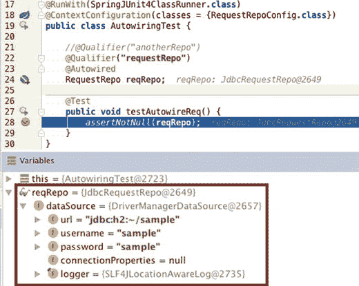

图 2-22.

以调试模式运行测试以测试构造函数注入

如果 Spring 在使用构造函数注入时发现多个候选 Bean 可供自动装配，解决方案仍然是使用 `@Qualifier`，只是在这种情况下，该注解需要用在参数上，因为构造函数可能有多个参数，必须明确告知 Spring 每个 Bean 将注入到哪个位置。构造函数的定义将修改如下：

```
@Autowired
public JdbcRequestRepo(@Qualifier("oracleDataSource") DataSource dataSource) {
super(dataSource);
}
// 定义两个数据源 Bean 的配置类
@Configuration
public class DataSourceConfig {
@Bean(name = "h2DataSource" )
public DataSource dataSource() throws SQLException {
DriverManagerDataSource ds = new DriverManagerDataSource();
// 填充属性
return ds;
}
@Bean(name = "oracleDataSource" )
public DataSource dataSource() throws SQLException {
OracleDataSource ds = new OracleDataSource();
// 填充属性
return ds;
}
}
```

在构造函数上使用 `@Autowired` 时，有多个构造函数被该注解标记是没有意义的，Spring 会因此报错，因为它无法确定使用哪个构造函数来实例化 Bean。

前面介绍的关于 `@Autowired` 和 `@Qualifier` 的功能以及如何使用它们控制 Bean 自动装配的所有内容，同样适用于 Setter 注入。因此，除了一个代码片段外，关于通过自动装配进行 Setter 注入，没有更多可说的了。

```
public class JdbcUserRepo extends JdbcAbstractRepo
implements UserRepo {
protected DataSource dataSource;
@Autowired
public void setDataSource(DataSource dataSource) {
this.dataSource = dataSource;
}
// 或按名称注入
@Autowired
public void setDataSource(@Qualifier("oracleDataSource") DataSource dataSource) {
this.dataSource = dataSource;
}
}
```

默认情况下，`@Autowired` 注解要求依赖项是必需的，但可以通过将 `required` 属性设置为 `true` 来改变此行为：

```
@Autowired(required=false)
public void setDataSource(DataSource dataSource) {
this.dataSource = dataSource;
}
```

`@Autowired` 注解也适用于方法。如果 Spring 能够识别出合适的 Bean，它就会自动装配。这对于开发特殊的 Spring 配置类非常有用，这些类的方法由 Spring 直接调用，并且包含需要配置的参数。最常见的例子是使用 `@EnableGlobalMethodSecurity` 注解的类来设置全局安全方法：

```
@Configuration
@EnableGlobalMethodSecurity
public class MethodSecurityConfig {
// 由 Spring 调用的方法
@Autowired
public void registerGlobal(AuthenticationManagerBuilder auth)
throws Exception {
auth
.inMemoryAuthentication()
.withUser("john").password("test").roles("USER").and()
.withUser("admin").password("admin").roles("USER", "ADMIN");
}
@Bean
public MethodSecurityService methodSecurityService() {
return new MethodSecurityServiceImpl()
}
}
```

此代码片段的更详细版本将在 Spring Web 章节的 Spring Security 部分中详细介绍和解释。

Spring 4.x 为 `@Autowired` 添加的一个强大功能是支持使用泛型类型作为限定符。当你的类按层次结构组织，并且都继承自某个泛型类时（例如本书附带项目中的仓库类，它们都扩展了 `JdbcAbstractRepo<T>`），这一功能非常有用。让我们看看如何使用此功能。

```
// 继承 JdbcAbstractRepo 的仓库类
public class JdbcReviewRepo extends JdbcAbstractRepo
implements ReviewRepo { ...}
public class JdbcResponseRepo extends JdbcAbstractRepo
implements ResponseRepo{ ...}
// 定义上述类型 Bean 的配置类
@Configuration
@Import({DataSourceConfig.class, UserRepoDSConfig.class})
public class AllRepoConfig {
@Bean
public ReviewRepo reviewRepo(){
return new JdbcReviewRepo();
}
@Bean
public ResponseRepo responseRepo(){
return new JdbcResponseRepo();
}
}
// 测试类
@RunWith(SpringJUnit4ClassRunner.class)
@ContextConfiguration(classes = {AllRepoConfig.class})
public class GenericQualifierTest {
@Autowired
JdbcAbstractRepo reviewRepo;
@Autowired
JdbcAbstractRepo responseRepo;
....
}
```

这非常有帮助，因为在相关类中，不再需要 `Qualifier` 注解来为相关类型的不同 Bean 命名，以确保 Spring 不会混淆。

之前提到过，JSR 250 和 JSR 330 注解是受支持的，并且可以与 Spring 注解一起使用，但它们有很多共同的功能。在表 2-3 中，你可以看到它们之间的对应关系和区别。

表 2-3.

前缀及对应路径

Spring | JSR | 说明
| --- | --- | --- |
`@Component` | `@Named` | `@Named` 可用于替代除 `@Configuration` 之外的所有构造型注解
`@Qualifier` | `@Qualifier` | JSR 的 `Qualifier` 是一个标记注解，用于标识限定符注解，例如 `@Named`
`@Autowired` | `@Inject` | `@Inject` 可应用于静态成员和实例成员
`@Autowired` + `@Qualifier` | `@Resource(name="beanName")` | `@Resource` 很有用，因为它替代了两个注解。

注入非 Bean 的依赖项

由于其语法和定义，`@Autowired` 不能用于自动装配原始值或字符串，这很合理，因为有一个名为 `@Value` 的注解专门用于此目的。此注解可用于插入标量值，或与占位符和 SpEL 一起使用，以提供配置 Bean 的灵活性。`DataSourceConfig` 用于定义 `dataSource` Bean，而初始化 `dataSource` 所需的属性值则使用 `@Value` 注入。

```
import org.springframework.beans.factory.annotation.Value;
...
@Configuration
@PropertySource("classpath:db/datasource.properties")
public class DataSourceConfig {
@Value("${driverClassName}")
private String driverClassName;
@Value("${url}")
private String url;
...
@Bean
public DataSource dataSource() throws SQLException {
DriverManagerDataSource ds = new DriverManagerDataSource();
ds.setDriverClassName(driverClassName);
ds.setUrl(url);
...
return ds;
}
}
```

此外，`@Value` 注解也可以与 SpEL 一起使用，以便从其他 Bean 或被视为 Bean 的对象中注入值，在以下示例中是从一个 `Properties` 对象中注入：

```
@Configuration
public class DataSourceConfig1 {
@Bean
public Properties dbProps(){
Properties p = new Properties();
p.setProperty("driverClassName", "org.h2.Driver");
p.setProperty("url", "jdbc:h2:∼/sample");
p.setProperty("username", "sample");
p.setProperty("password", "sample");
return p;
}
@Bean
public DataSource dataSource(
@Value("#{dbProps.driverClassName}")String driverClassName,
@Value("#{dbProps.url}")String url,
@Value("#{dbProps.username}")String username,
@Value("#{dbProps.password}")String password) throws SQLException {
DriverManagerDataSource ds = new DriverManagerDataSource();
ds.setDriverClassName(driverClassName);
ds.setUrl(url);
ds.setUsername(username);
ds.setPassword(password);
return ds;
}
}
```

`dbProps` 是一个被实例化并初始化的对象，由于使用了 `@Bean` 注解，它在应用程序中被视为一个 Bean。在任何 JSR 中都没有与 `@Value` 等效的注解。


Bean 生命周期与作用域

通过组件扫描可以发现带有注解的 Bean 和方法。无论应用程序如何配置、Bean 如何定义，Bean 的生命周期都是相同的。尽管从外部看行为一致，但底层实现却有所不同。这很正常，因为 Java 配置和 XML 配置是两种不同的方式，但它们也存在共同点。让我们逐步了解这些内容。

Bean 定义加载

*   回顾 XML Bean 生命周期部分，第一步是加载 Bean 定义。使用 XML 时，会通过 `org.springframework.beans.factory.xml.XmlBeanDefinitionReader` 类型的 Bean 从 XML 文件中加载 Bean 定义。

*   对于使用 Java 配置注解的配置，会通过 `org.springframework.context.annotation.ClassPathBeanDefinitionScanner` 类型的 Bean 扫描类路径，并由 `org.springframework.context.annotation.ConfigurationClassBeanDefinitionReader` 类型的 Bean 注册 Bean 定义。²⁴

*   对于同时使用 XML 和构造型注解的混合配置，则会同时使用上述两种类。

Bean 创建

在所有情况下，XML 和注解 Bean 都由 `org.springframework.beans.factory.support.DefaultListableBeanFactory` 类型的工厂创建。

依赖注入

*   XML：使用工厂 Bean 来注入依赖。

*   Java 配置及其他所有注解：使用 `org.springframework.beans.factory.annotation.AutowiredAnnotationBeanPostProcessor` 类型的 Bean 来自动装配依赖。这是一个后处理器 Bean 实现，用于自动装配带有注解的字段、setter 方法以及任意配置方法。它由 `@Configuration` 注解注册，但也可以通过组件扫描在混合配置中注册。该 Bean 负责处理通过 `@Autowired`、`@Value` 和 `@Inject` 配置的自动装配。

*   对于混合配置，上述两种方法会同时使用。

Bean 销毁

在所有情况下，无论是 XML 还是注解，销毁 Bean 的繁琐工作都由 `org.springframework.beans.factory.support.DisposableBeanAdapter` 类型的 Bean 负责。

以上就是关于注解处理内部机制的全部内容。所有注解都会被 Bean 后处理器捕获并相应处理。如果你真的好奇还有哪些 Bean 对运行应用程序有贡献，只需将 Spring 框架的日志级别设置为 DEBUG，然后欣赏输出即可。

在类似的 XML 部分中，我们提到过 `<bean/>` 元素中的 `init-method` 和 `destroy-method` 有对应的注解方式，这将在注解部分介绍，²⁵ 因为它们由 `@Bean` 注解的两个属性表示。请分析以下示例：

```
// JdbcRequestRepo.java
@Repository("requestRepo")=
public class JdbcRequestRepo extends JdbcAbstractRepo
implements RequestRepo {
private Logger logger = LoggerFactory.getLogger(JdbcRequestRepo.class);
private void init(){
logger.info(" ... 正在初始化 requestRepo ...");
}
private void destroy(){
logger.info(" ... 正在销毁 requestRepo ...");
}
...
}
//RequestRepoConfig.java 配置类
@Configuration
@Import(DataSourceConfig.class)
@ComponentScan(basePackages = "com.ps")
public class RequestRepoConfig {
@Bean (initMethod = "init", destroyMethod = "destroy")
public RequestRepo anotherRepo(){
return new JdbcRequestRepo();
}
}
```

Java 配置注解 `@Bean` 的 `initMethod` 属性指定了用于初始化 `anotherRepo` 的方法名称，而 `destroyMethod` 属性则指定了在上下文关闭时要调用的方法。来自 `RequestRepoConfig` 类的 Bean 定义基本上等同于以下内容：

通过 `@Bean`、`@Component` 或其任何特化注解标记的定义所创建的 Bean，默认是单例的。但可以通过使用 `@Scope` 注解类或方法，并将 `value` 属性设置为其他作用域来更改作用域。

```
@Component
@Scope(value = ConfigurableBeanFactory.SCOPE_PROTOTYPE)
public class SimpleBean {
...
}
```

!

`@Scope(value = ConfigurableBeanFactory.SCOPE_PROTOTYPE)` 等同于 `@Scope(ConfigurableBeanFactory.SCOPE_PROTOTYPE)`，也等同于 `@Scope("prototype")`，因为常量 `SCOPE_PROTOTYPE` 是值为 "prototype" 的字符串类型。使用 Spring 常量可以消除拼写错误作用域值的风险。

另一个有趣的注解是 `@Lazy`，从 Spring 4.x 开始，它也可以用于注入点（即任何使用 `@Autowired` 的地方）。通过将此注解添加到 Bean 定义中，可以延迟 Bean 的创建，直到首次访问它。当依赖项是一个巨大的对象，并且你不想在真正需要之前让内存被该对象占用时，这非常有用。

```
@Component
@Lazy
public class SimpleBean { ... }
// 或者在 @Bean 上使用
@Configuration
public class RequestRepoConfig {
@Lazy
@Bean
public RequestRepo anotherRepo(){
return new JdbcRequestRepo();
}
}
// 在注入点上使用
@Repository
public class JdbcPetRepo extends JdbcAbstractRepo
implements PetRepo {
...
@Lazy
@Autowired(required=false)
public void setDataSource(DataSource dataSource) {
this.dataSource = dataSource;
}
}
```

除了目前讨论的所有注解之外，开发者还可以开发自己的注解。Spring 提供的许多注解都可以作为元注解在你的代码中使用。你可以将元注解视为一个超类。元注解可用于注解另一个注解。例如，所有构造型特化注解都使用 `@Component` 进行注解。元注解可以组合以生成其他注解。例如，让我们创建一个 `@CustomTx` 注解，用于标记将使用不同事务的服务 Bean：

```
import java.lang.annotation.ElementType;
import java.lang.annotation.Retention;
import java.lang.annotation.RetentionPolicy;
import java.lang.annotation.Target;
import org.springframework.transaction.annotation.Transactional;
@Target({ElementType.METHOD, ElementType.TYPE})
@Retention(RetentionPolicy.RUNTIME)
@Transactional("customTransactionManager", timeout="90")
public @interface CustomTx {
boolean readOnly() default false;
}
```

!

在讨论了这么多关于注解及其强大之处的内容之后，你可能想要使用它们。`02-ps-container-02-practice` 包含了 Java 配置和注解部分的所有示例。所有配置类都在 `com.ps.config` 包中。所有 Bean 类都在 `com.ps.repo` 下。在 `resources` 目录中，你可以找到一些用于混合示例的 XML 配置类。该项目只有一个 TODO 任务。TODO 编号 13 要求你尽可能地将 Spring 注解替换为 JSR 注解。


使用注解进行 Spring 配置非常强大且灵活。
本书将同时介绍 Java 配置和注解，
因为这是实践中常用的方式。当然，
仍有偏好 XML 的老派开发者，以及喜欢混合搭配的
务实开发者。使用注解进行配置很实用，因为它
能帮助减少项目中的资源文件数量，但
缺点是其分散在代码各处。不过，由于与代码绑定，
重构过程变得可行，无需在 XML 文件中痛苦地搜索 bean 定义，
尽管如今智能编辑器在这方面能提供很大帮助。注解配置
更适合频繁变更的 bean：自定义业务 bean，例如服务、仓库和控制器。想象一下，
为构造函数添加一个新参数，然后需要在 XML 文件中搜寻 bean
以便更新定义。Java 配置
注解应用于配置基础设施 bean（数据源、持久化单元等）。

使用 XML 也有其优势。主要优势在于
配置集中在应用程序的少数几个部分，但 Java 配置
也能做到这一点。此外，XML 得到广泛支持和熟知。
最终，只有上下文才能决定最合适的
解决方案。如果你是一位 Spring 专家，开始开发自己的
初创应用，你可能会选择 Java 配置和
注解。可能还会选择 Spring Boot，它通过提供超级元注解来配置项目所需的大部分
基础设施，从而让你的工作更加轻松。如果你在一个包含遗留代码的大型项目上工作，
你可能不得不忍受这里那里的一些 XML 配置。
无论哪种情况，遵循良好实践并阅读手册，你就应该没问题。

总结

阅读本章后，你应该掌握足够的知识来
配置一个 Spring 应用程序，使用 XML、Java 配置和
注解，或全部三者，并利用 bean 的强大功能来开发
小型 Spring 应用程序。

*   Spring 专为依赖注入而构建，并提供了一个用于
    控制反转的容器，该容器负责根据配置注入依赖项。

*   两种配置风格也可以混合使用：当 bean 声明与代码解耦时使用基于 XML 的配置，当 bean 声明在代码中时使用 Java 配置。

*   Spring 提倡使用接口，因此实现同一接口的 bean 类型可以轻松互换。

*   Spring 的配置方式提升了可测试性。由于 bean 可以互换，因此很容易使用桩和模拟来隔离组件。

*   bean 的生命周期可以控制；可以在 bean 生命周期的特定点添加行为。

*   Spring 提供了许多简化配置的方法：XML 中的 bean 继承、嵌套和命名空间，以及 Java 配置中大量约定优于配置的默认行为。

*   Bean 定义源可以通过相互导入来耦合，或者通过组合它们来创建应用程序上下文。

2.1 快速测验

问题 1：什么是 bean？
（选择所有适用的选项）

1.  一个普通的 Java 对象

2.  一个类的实例

3.  一个由 Spring IoC 容器实例化、组装和管理的对象

问题 2：bean 的默认作用域是什么？

1.  default

2.  singleton

3.  protected

4.  prototype

问题 3：Spring IoC 容器支持哪些类型的依赖注入？（选择所有适用的选项）

1.  setter 注入

2.  构造函数注入

3.  基于接口的注入

4.  基于字段的注入

问题 4：用于引导 XML 配置的应用程序上下文的类是什么？

1.  `ClassPathXmlApplicationContext`

2.  `AnnotationConfigApplicationContext`

3.  `ApplicationContext`


问题 5：以下哪些是构造型注解？（请选择所有适用项）

1.  `@Component`

2.  `@Bean`

3.  `@PostConstruct`

4.  `@Scope`

5.  `@Configuration`

问题 6：使用`@Bean`声明 bean 与使用`@Component`声明 bean 有何区别？

1.  `@Bean`注解的是配置类中创建 bean 的方法；`@Component`注解的是类，将其标记为 Spring 容器的 bean 定义

2.  `@Bean`是`@Component`的一种特化，用于注解类，将其标记为 Spring 容器的 bean 定义

3.  `@Bean`是 JSR 250 中与`@Component`等效的注解

问题 7：给定以下 bean 定义，应用程序运行时日志中会打印什么？

1.  应用程序无法运行，会在初始化阶段崩溃，因为`initMethod`是私有的

2.  应用程序可以运行，但不会创建`quizBean`，因为其初始化方法是私有的

3.  `–> 我即将把它称为 bean`

```
public class QuizBean {
// 假设此处已正确实例化日志记录器
Logger log =...;
private void initMethod() {
logger.info("--> 我即将把它称为 bean");
}
}
// bean 配置

```

问题 8：给定 quizBean 的 bean 定义，从列表中选择与之等效的 bean 定义。

```

A.@Component
public class QuizBean {
public void setPetitBean(PetitBean petitBean) {
this.petitBean = petitBean;
}
@PostConstruct
private void initMethod() {
logger.info("--> 我即将把它称为 bean");
}
}
B. @Configuration
public class QuizConfiguration {
// 假设此处已定义 petitBean()
@Bean(initMethod="initMethod")
private QuizBean getQuizBean() {
return new QuizBean(petitBean());
}
}
C.  
```

问题 9：以下哪个 bean 是 bean 工厂后置处理器？

1.  `ClassPathXmlApplicationContext`

2.  `PropertySourcesPlaceholderConfigurer`

3.  `CommonAnnotationBeanPostProcessor`

问题 10：将 XML 文件中的 bean 定义导入配置类的正确方式是什么？

1.  `@Import("classpath:spring/app-config.xml")`

2.  `@Resource("classpath:spring/app-config.xml")`

3.  `@ImportResource("classpath:spring/app-config.xml")`

问题 11：给定以下配置类和 bean，该 bean 作为依赖项自动注入到另一个 bean 中，应用程序运行时会发生什么？

1.  会抛出异常，因为类型为`QuizBean`的 bean 没有定义作用域

2.  会抛出异常，因为配置类中缺少`@ComponentScan`，导致 bean 定义未被发现

3.  会创建一个类型为`QuizBean`的 bean，并自动注入到类型为`AnotherQuizBean`的 bean 中

```
package com.cfg;
// 配置
@Configuration
public class AppConfig {}
package com.quiz;
// bean
@Component
public class QuizBean {}
package com.another.quiz;
// 自动注入 bean
@Component
public class AnotherQuizBean {
@Autowired
QuizBean quizBean;
}
```

问题 12：Spring IoC 容器默认尝试按类型识别要自动注入的 bean；如果找到多个 bean，它会选择与正在自动注入的依赖项同名的那个 bean 进行自动注入

1.  正确

2.  错误

脚注

如果你对更多关于 Java 设计模式的书籍感兴趣，可以查阅 Apress 出版的这本书：[`http://www.apress.com/9781484218013?gtmf=s`](http://www.apress.com/9781484218013?gtmf=s) 。

此示例中使用 Oracle 进行数据存储，因为大多数生产应用程序都使用 Oracle 进行存储，并且本书旨在提供你在软件开发工作中可能遇到并需要的真实配置。

术语“标量”源自线性代数，用于将数字与向量或矩阵区分开来。在计算领域，该术语具有类似含义，它将单个值（如整数或浮点数）与数据结构（如数组）区分开来。在 Spring 中，标量指任何不是 bean 且不能被视为 bean 的值。


您可以在 Spring 参考文档中找到它们的完整列表：[`http://docs.spring.io/spring/docs/current/spring-framework-reference/html/validation.html#beans-beans-conversion`](http://docs.spring.io/spring/docs/current/spring-framework-reference/html/validation.html#beans-beans-conversion)。

工厂方法是一种设计模式，它意味着使用工厂方法来创建对象，而无需指定所创建对象的确切类型。关于此模式的更多信息，可以通过在 Google 上简单搜索轻松找到，但这里有一个快速且优质的来源：[`https://en.wikipedia.org/wiki/Factory_method_pattern`](https://en.wikipedia.org/wiki/Factory_method_pattern)。

单例是一种创建型模式，其特点是单例类只能被实例化一次。更多信息可以在这里阅读：[`https://en.wikipedia.org/wiki/Singleton_pattern`](https://en.wikipedia.org/wiki/Singleton_pattern)。

大多数公司使用三种类型的环境：开发环境、测试环境和生产环境。

用于配置 Web 流程的表达式语言：[`http://docs.spring.io/spring-webflow/docs/current/reference/html/el.html`](http://docs.spring.io/spring-webflow/docs/current/reference/html/el.html)。

Unified EL 是用于在 JSP 页面中添加逻辑的 Java 表达式语言：[`https://docs.oracle.com/javaee/5/tutorial/doc/bnahq.html`](https://docs.oracle.com/javaee/5/tutorial/doc/bnahq.html)。

全部功能列表不在本书的讨论范围之内。如果你对 SpEL 感兴趣，官方文档是最好的资源：[`http://docs.spring.io/spring/docs/current/spring-framework-reference/html/expressions.html`](http://docs.spring.io/spring/docs/current/spring-framework-reference/html/expressions.html)。

不幸的是，没有其他方式可以表述这一点。我们讨论的是那些能够对其他 Bean 进行后处理的 Bean。它们被令人困惑地称为：Bean 后处理 Bean。

从 Spring 2.5 开始，支持一些注解。

Java 请求规范 250 [`https://jcp.org/en/jsr/detail?id=250`](https://jcp.org/en/jsr/detail?id=250)。

DisposableBeanAdapter 是一种内部基础设施 Bean 类型，用于对给定的 Bean 实例执行各种销毁步骤。其代码可在此处获取：[`https://github.com/spring-projects/spring-framework/blob/master/spring-beans/src/main/java/org/springframework/beans/factory/support/DisposableBeanAdapter.java`](https://github.com/spring-projects/spring-framework/blob/master/spring-beans/src/main/java/org/springframework/beans/factory/support/DisposableBeanAdapter.java)。

因此，单例设计模式在 Spring 中被大量使用。

AOP 是面向切面编程的缩写，是一种旨在通过允许分离横切关注点来提高模块化程度的编程范式。这是通过定义所谓的“切入点”来实现的，它代表了代码中将注入新行为的一个点。这使得与业务逻辑无关的代码能够与业务代码分离，避免代码混乱。

代理编程设计模式的特点是使用代理或占位符来代替真正的目标对象。这种设计模板在 AOP 和远程处理中被大量使用。

Java 依赖注入 API 的扩展 [`https://jcp.org/en/jsr/detail?id=330`](https://jcp.org/en/jsr/detail?id=330)。

在 Spring 中，引导意味着加载应用程序上下文。

如果你对这个特性感兴趣，可以在这里关注该问题的演变：[`https://jira.spring.io/browse/SPR-6736`](https://jira.spring.io/browse/SPR-6736)。

在实践中，你可能永远不需要这样做；我们这样做是为了给出一个使用 @AliasFor 的具体示例。

它只支持用于构造器注入的 `<constructor-arg />` 元素和用于 Setter 注入的 `<property />` 元素。

日志条目被稍微清理了一下，出于显而易见的原因，这里只展示了日志的一个片段。

ConfigurationClassBeanDefinitionReader 是一个 Spring 内部类，不会出现在 Spring API 中，但其源代码可以在 GitHub 上找到：[`https://github.com/spring-projects/spring-framework/blob/master/spring-context/src/main/java/org/springframework/context/annotation/ConfigurationClassBeanDefinitionReader.java`](https://github.com/spring-projects/spring-framework/blob/master/spring-context/src/main/java/org/springframework/context/annotation/ConfigurationClassBeanDefinitionReader.java)。

Java 配置和构造型注解是同时引入的，因为 Java 配置只是 Spring 在完全移除 XML 配置方面的第二步。

3. 测试 Spring 应用程序

在应用程序交付给客户之前，必须由称为测试人员的专业团队对其进行测试和验证。可以想象，在开发完成后才测试应用程序有点太晚了，因为可能规范没有被正确理解，或者不完整。此外，应用程序在隔离的开发系统上的行为与在生产系统上的行为有很大差异。这就是为什么需要执行多个测试步骤，其中一些甚至在开发之前。还有人为因素。既然没有人是完美的，错误就会发生，而测试有助于在应用程序到达最终用户之前发现这些错误并修复它们，从而确保软件的质量。软件测试的目的是验证应用程序是否满足功能性（应用程序提供预期的功能）和非功能性（应用程序提供预期的功能，速度符合预期，并且不需要超过系统可用内存）需求，并检测错误，而规划、准备、评估和验证的所有活动都是其中的一部分。

有针对测试人员的特定课程和认证，旨在培训他们使用功能和软件测试流程来测试应用程序，而 ISTQB¹ 是提供培训和考试基础设施的组织。

几种测试类型

有多种类型的测试，可以根据它们执行的开发步骤或实现方式进行分类，但本书的目的并非涵盖所有类型。仅涵盖那些涉及使用测试库和框架编写实际代码的类型。

测试驱动开发

质量始于项目开始。确定并验证需求和规范，并基于它们可以执行一个称为测试驱动开发的过程。这个过程意味着在代码开发之前创建测试。测试最初会失败，但随着代码的开发，它们将开始逐个通过。测试决定了应用程序的行为方式，因此这种类型的测试被称为测试驱动开发。这是一种确保规范被正确理解和实现的测试类型。此过程的测试由业务分析师设计，由开发人员实现。这种方法对设计提出了质疑：如果测试难以编写，则应重新考虑设计。它更适合 JavaScript 应用程序（因为没有代码编译），但当使用接口进行开发时，它也可以用于 Java 应用程序。

在图 3-1 中，描述了恰好一个测试用例的测试驱动开发过程。

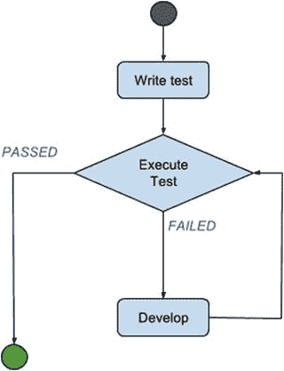

图 3-1.

测试驱动开发逻辑示意图


这种测试技术非常适合在开发过程早期发现问题。考虑到解决问题的难度会随着发现问题的时长呈指数级增长，任何项目在开发过程中都不应缺少它。此外，测试应使用像 Jenkins、Hudson 或 Bamboo 这样的持续集成工具自动运行。测试驱动开发能够比旧方法在更短的时间内产出高质量的应用程序，但它也有其局限性。有时测试可能被错误地构思或应用，这可能导致单元在实际环境中表现不如预期。即使所有单元在隔离状态下和所有预期场景中都能完美运行，最终用户也可能会遇到开发人员和测试人员未曾设想的情况。既然提到了单元测试，本节将在此结束，以便进入下一部分。

单元测试与集成测试

单元测试是指对应用程序中最小可测试部分进行单独且独立的测试，使其与任何可能以不可预测方式影响其行为的其他单元隔离开来。依赖关系被保持在最低限度，并且大多数依赖关系将被替换为能复现预期行为的伪单元。这基本上意味着功能单元被脱离了上下文。单元测试由开发人员编写，并使用自动化工具运行，但在需要时也可以手动运行。一个单元测试针对一个给定的输入执行单个场景，并将该输入的预期结果与实际结果进行比较。如果匹配，则测试通过；如果不匹配，则测试失败。这种测试方法速度快，是许多项目中最常用的方法。测试由开发人员编写，推荐的做法是使用正向测试和负向测试覆盖类中的每个方法。正向测试是测试单元的有效输入，而负向测试则测试单元的无效输入。这些测试覆盖了单元的失败情况，如果单元在被测试时实际上没有失败，则认为这些测试失败。自 2000 年以来，帮助开发人员在 Java 中轻松编写和执行单元测试的核心框架是 `JUnit`。当前版本是 4.13，但版本 5 正在开发中，Alpha 版本已于 2016 年 1 月发布。

`JUnit` 的扩展并不多，因为这个框架几乎无所不包，但有一个名为 `Hamcrest` 的框架相当有趣，它提供了一组匹配器，可以组合起来创建灵活的意图表达。它最初是一个基于 `JUnit` 的框架，用于在 Java 中编写测试，但成功打破了语言障碍，目前它已可用于大多数当前使用的语言，如 Python 和 Swift。更多信息可以在其官方网站上找到：[`http://hamcrest.org/`](http://hamcrest.org/)。

在包含所有真实依赖关系的上下文中一起运行一组单元测试称为集成测试。顾名思义，这种技术所需的连接被测对象的基础设施也是测试执行上下文的一部分。在图 3-2 中，展示了一个用于比较单元测试和集成测试概念的简单示意图。

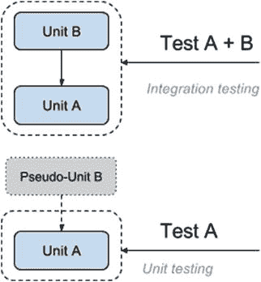

图 3-2.

单元测试与集成测试概念

为了在隔离状态下测试功能单元，必须用伪依赖关系替换真实依赖关系，这些伪依赖关系是模拟真实依赖关系行为的简单实现对象，从被依赖者的角度来看。伪依赖关系可以是桩（stubs）或模拟对象（mocks）。两者都执行相同的功能，即替换真实依赖关系，但它们的创建方式有所不同。

使用桩进行测试

桩由开发人员创建；它们不需要额外的依赖关系。桩是一个具体的类，实现了与被测单元原始依赖关系相同的接口。它们应该被设计成展示实际依赖关系的一小部分或全部行为。

例如，让我们尝试测试上一章中引入的一个服务类，即 `SimplePetService`。

```
package com.ps.services.impl;
...
public class SimplePetService extends SimpleAbstractService
implements PetService {
// 需要被打桩的依赖关系
private PetRepo repo;
@Override
public Pet createPet(User user, String name, int age,
PetType petType, String rfid) {
Pet pet = new Pet();
pet.setOwner(user);
pet.setName(name);
pet.setAge(age);
pet.setRfid(rfid);
user.addPet(pet);
repo.save(pet);
return pet;
}
@Override
public Set findAllByOwner(User user) {
return repo.findAllByOwner(user);
}
/**
* @param user 宠物主人
* @param name 宠物名字
* @return
*/
@Override
public Pet findByOwner(User user, String name) {
return repo.findByOwner(user, name);
}
public void setRepo(PetRepo petRepo) {
this.repo = petRepo;
}
public PetRepo getRepo() {
return repo;
}
}
// 定义特定宠物行为的接口
public interface PetService {
Pet createPet(User user, String name, int age, PetType petType,
String rfid);
Set findAllByOwner(User user);
Pet findByOwner(User user, String name);
}
```

这个类从抽象类 `SimpleAbstractService<Pet>` 继承了一些行为。

```
package com.ps.services.impl;
...
public abstract class SimpleAbstractService
implements AbstractService{
public void save(T entity) {
getRepo().save(entity);
}
public T findById(Long entityId){
return getRepo().findById(entityId);
}
@Override
public void delete(T entity) {
getRepo().delete(entity);
}
@Override
public void deleteById(Long entityId) {
getRepo().deleteById(entityId);
}
abstract AbstractRepo getRepo();
}
```

尽管测试的数量取决于开发人员的经验以及代码的实际功能（Alberto Savoia 在 Google 官方博客上发布的一个有趣短篇故事也与此相关²），我的建议是开始单元测试时，尝试为每个方法至少编写两个测试：一个正向测试和一个负向测试，适用于可以这样测试的方法。`SimplePetService` 中有七个方法（不包括 getter 和 setter），因此测试类应该大约有十四个测试。在测试服务类时，关注点在于该类应与仓库类正确交互。仓库类的行为被认为是已知且固定的。桩类将实现典型的仓库行为，但不需要数据库连接，因为与数据库的交互会在测试执行中引入不希望的延迟。这里给出的实现将使用 `java.util.Map` 来模拟数据库。由于在应用程序中，有更多的仓库类扩展了 `SimpleAbstractService<Pet>`，桩将遵循相同的继承设计，因此抽象类也将被打桩。


```
package com.ps.repo.stub;
...
public abstract class StubAbstractRepo
implements AbstractRepo {
protected Map records = new HashMap();
@Override
public void save(T entity) {
if (entity.getId() == null) {
Long id = (long) records.size() + 1;
entity.setId(id);
}
records.put(entity.getId(), entity);
}
@Override
public void delete(T entity) {
if(records.containsKey(entity.getId())) {
records.remove(entity.getId());
} else {
throw new NotFoundException("Entity with id "
+ entity.getId() + " could not be deleted because it does not exists");
}
}
@Override
public void deleteById(Long entityId) {
if(records.containsKey(entityId)) {
records.remove(entityId);
} else {
throw new NotFoundException("Entity with id "
+ entityId + " could not be deleted because it does not exists");
}
}
@Override
public T findById(Long entityId) {
return records.get(entityId);
}
}
```

`StubPetRepo` 类继承了之前的桩类，并添加了其特定的行为，但跳过了那些无法在用于模拟数据库的 `Map` 上执行的实现方法。由于 `Map` 包含的是 `<id,Pet>` 键值对，因此 `PetRepo` 的特定方法都无法被桩化，所以需要一个新的映射。

```
package com.ps.repo.stub;
import org.apache.commons.lang3.NotImplementedException;
...
public class StubPetRepo extends StubAbstractRepo implements PetRepo {
// 按主人对宠物进行分组
protected Map> records2 = new HashMap();
// 重写 StubAbstractRepo 中的 save 方法
// 以包含 PetRepo 的桩行为
@Override
public void save(Pet pet) {
super.save(pet);
addWithOwner(pet);
}
private void addWithOwner(Pet pet){
if (pet.getOwner()!= null) {
User owner = pet.getOwner();
if (records2.containsKey(owner)) {
records2.get(owner).add(pet);
} else {
Set newPetSet = new HashSet();
newPetSet.add(pet);
records2.put(owner, newPetSet);
}
}
}
@Override
public Pet findByOwner(User owner, String name) {
Set petSet = records2.get(owner);
for (Pet pet: petSet) {
if (pet.getName().equalsIgnoreCase(name)) {
return pet;
}
}
return null;
}
@Override
public Set findAllByOwner(User owner) {
Set petSet = records2.get(owner);
// 返回集合时从不返回 null，以避免 NullPointerException
return petSet != null? petSet : new HashSet();
}
@Override
public Set findAllByType(PetType type) {
throw new NotImplementedException("此桩不需要此功能。");
}
}
```

现在我们已经有了桩，接下来需要使用它们。为了编写多个单元测试并将它们作为一个测试套件一起执行，需要一个依赖项来使实现运行得更轻松。这个依赖项是 JUnit，³ 一个用于编写可重复单元测试的 Java 框架。它提供了用于准备和运行单元测试套件的注解。

推荐的做法是创建一个与被测试类同名的类，但后缀加上 `Test`，因此本例中的测试类将被命名为 `SimplePetServiceTest`。这里仅展示几个测试示例。更多内容请查看本书本章附带的代码，项目 `03-ps-test-` `practice`。

```
package com.ps.repo.services;
import org.junit.Before;
import org.junit.BeforeClass;
import org.junit.Test;
import static org.junit.Assert.assertEquals;
import static org.junit.Assert.assertNotNull;
import static org.junit.Assert.assertNull;
...
public class SimplePetServiceTest {
public static final Long PET_ID = 1L;
public static final User owner = buildUser("test@gmail.com", "test",
UserType.OWNER);
private StubPetRepo stubPetRepo = new StubPetRepo();
// 待测试的对象
private SimplePetService simplePetService;
@Before
public void setUp() {
// 创建一些条目以供使用
stubPetRepo.save(build(owner, PetType.CAT, "John", 3, "0122345645"));
stubPetRepo.save(build(owner, PetType.DOG, "Max", 5, "0222335645"));
// 创建待测试的对象
simplePetService = new SimplePetService();
simplePetService.setRepo(stubPetRepo);
}
// 正向测试，我们知道 ID=1 的 Pet 存在
@Test
public void findByIdPositive() {
Pet pet = simplePetService.findById(PET_ID);
assertNotNull(pet);
}
// 正向测试，我们知道该主人的宠物存在且数量已知
@Test
public void findByOwnerPositive() {
Set result = simplePetService.findAllByOwner(owner);
assertEquals(result.size(), 2);
}
// 负向测试，我们知道该主人的宠物不存在
@Test
public void findByOwnerNegative() {
User newOwner = buildUser("gigi@gmail.com", "test", UserType.OWNER);
Set result = simplePetService.findAllByOwner(newOwner);
assertEquals(result.size(), 0);
}
...
// User 实例的简单构建器
private static User buildUser(String email, String password,
UserType userType){
..
return user;
}
// Pet 实例的简单构建器
private static Pet build(User owner,PetType petType, String name,
Integer age, String rfid) {
...
pet.setOwner(owner);
return pet;
}
}
```

对于删除方法，负向测试看起来略有不同，因为 `delete` 方法不会返回可供断言的任何结果。相反，当它们无法删除记录时，会抛出一个 `com.ps.repos.NotFoundException` 类型的异常。当然，这有点极端，但为了向你展示如何测试这些方法，这是必要的。由于我们知道抛出异常的情况，为了使测试通过，我们使用 `@Test` 注解的 `expected` 属性来告知 JUnit 何时预期此行为。

```
// 正向测试，我们知道 ID=1 的 Pet 存在
@Test
public void deleteByIdPositive() {
simplePetService.deleteById(PET_ID);
// 我们执行一次查找来测试删除是否成功
Pet pet = simplePetService.findById(PET_ID);
assertNull(pet);
}
// 负向测试，我们知道 ID=99 的 Pet 不存在
@Test(expected = NotFoundException.class)
public void deleteByIdNegative() {
simplePetService.deleteById(99L);
}
```

在上面的代码片段中，使用了以下 JUnit 组件：

*   `@Before` 注解用于那些应在执行测试方法之前执行的方法。这些方法用于准备该测试执行的上下文。测试方法中使用的所有对象都应在此方法中创建和初始化。使用 `@Before` 注解的方法会在每个使用 `@Test` 注解的方法之前执行。

*   `@Test` 注解是告知 JUnit 此方法中的代码应作为测试用例运行的注解。使用 `@Test` 注解的方法应始终为 public 且返回 void。它也可用于处理预期的异常。

*   `assert*` 方法定义在 `org.junit.Assert` 类中，可用于简化测试方法的代码。没有它们，用户将不得不编写指定测试何时应通过或失败的代码。


快速分析代码后，有一点应该很明显：使用桩代码测试非常耗时，编写桩代码本身似乎与开发工作一样耗时。实际上，使用桩代码进行测试仅适用于非常简单的应用程序和场景。不过，使用桩代码测试最糟糕的一点是，如果接口发生变化，桩代码的实现也必须随之改变。因此，你不仅需要调整测试，还需要调整桩代码。第二糟糕的是，使用桩代码时，所有方法都必须实现，即使是测试场景中未使用的方法也是如此。例如：

```
@Override
public Set findAllByType(PetType type) {
throw new NotImplementedException("Not needed for this stub.");
}
```

该方法未参与任何测试场景，为了避免提供实现，决定抛出 `NotImplementedException` 异常。关于桩代码的第三糟糕之处是，如果我们有一个桩代码的层次结构，重构层次结构底部的桩代码意味着要重构所有基于它的桩代码，否则测试将会失败。在我们的示例中也是如此，因为所有桩代码都基于 `StubAbstractRepo`。

结论

桩代码让测试看起来像是一项繁琐的工作，那么让我们看看模拟对象如何改善这种情况。

使用模拟对象进行测试

模拟对象也是一种伪对象，它替代了我们不感兴趣测试的依赖项，并有助于隔离我们感兴趣的对象。模拟代码无需手动编写，因为有一些库和框架可用于生成模拟对象。模拟对象会动态实现依赖的接口。在生成模拟对象之前，开发者可以配置其行为：将调用哪些方法以及它们将返回什么。之后就可以使用模拟对象，然后检查预期结果以决定测试结果。

Java 应用程序中有更多用于生成模拟对象的库和框架，具体使用哪一个取决于你。

*   **EasyMock** 提供了一种简单的方法来替换被测单元的合作者。更多信息请访问其官方网站：[`http://easymock.org/`](http://easymock.org/) 。这个库非常流行，在 Spring 开发中被广泛使用，直到 3.1 版本转向使用 Mockito。

*   **jMock** 是一个小型库，其创建团队宣称可以快速轻松地定义模拟对象。其 API 非常友好，适用于复杂的有状态逻辑。更多信息请访问其官方网站：[`http://www.jmock.org/`](http://www.jmock.org/) 。

*   **Mockito** 是一个模拟框架，为编写测试提供了非常简洁干净的 API。其有趣之处在于它提供了部分模拟的可能性；真实方法会被调用，但仍然可以被验证和桩化。更多信息请访问其官方网站：[`http://mockito.org/`](http://mockito.org/) 。

*   **PowerMock** 是一个框架，它扩展了其他模拟库（如 EasyMock），提供了更强大的功能。它旨在为那些被认为不可测试的代码提供测试方法。它使用自定义类加载器和字节码操作来模拟静态方法、构造函数、final 类和方法、私有方法、移除静态初始化器等。你可以在这里了解更多信息：[`https://github.com/jayway/powermock`](https://github.com/jayway/powermock) 。

本章将涵盖这些模拟工具中的每一个。当在 Spring 上下文中进行集成测试时，它们也都提供了注解支持。但在涉及 Spring 测试之前，我们将坚持简单的单元测试。

EasyMock

使用 `EasyMock` 生成的模拟对象进行测试的类是 `SimpleUserService`。该类继承了 `SimpleAbstractService<T>` 的所有方法，并提供了自己针对用户特定行为的方法。

```
import static com.ps.util.TestObjectsBuilder.buildUser;
...
public class SimpleUserService extends SimpleAbstractService
implements UserService {
private UserRepo repo;
@Override
public User createUser(String email, String password, UserType userType) {
User user = buildUser(email);
user.setPassword(password);
user.setUserType(userType);
repo.save(user);
return user;
}
@Override
public Set findByName(String name, boolean exact) {
return repo.findAllByUserName(name, exact);
}
// setters & getters
public void setRepo(UserRepo repo) {
this.repo = repo;
}
@Override
public UserRepo getRepo() {
return repo;
}
}
// interface for User specific behavior
public interface UserService {
User createUser(String email, String password, UserType userType);
/**
* Method used to search an User by his name
* @param name name of the user searching for
* @param exact if the search should be exact (name= :name),
*         or not ( name like ’%name%’)
* @return
*/
Set findByName(String name, boolean exact);
}
```

`TestObjectsBuilder` 是一个 Java 类，包含用于创建用户和宠物对象的实用方法。其代码在此上下文中不相关，但你可以在本章附带的项目中检查其代码。

要使用 `EasyMock` 生成的模拟对象执行测试，需要完成以下步骤：

1.  声明模拟对象
2.  创建模拟对象
3.  注入模拟对象
4.  记录模拟对象应该执行的操作
5.  告知模拟对象正在进行的实际测试
6.  测试
7.  确保在模拟对象上调用了方法
8.  验证执行结果

测试类将被命名为 `SimpleUserServiceTest`，在下面的测试代码片段中，测试了 `findByName` 方法，并且上面列出的步骤已用下划线标出。

```
package com.ps.repo.services;
import org.junit.Before;
import org.junit.Test;
...
import static org.easymock.EasyMock.*;
import static org.junit.Assert.*;
public class SimpleUserServiceTest {
(1)private UserRepo userMockRepo;
private SimpleUserService simpleUserService;
@Before
public void setUp() {
(2)userMockRepo = createMock(UserRepo.class);
//create object to be tested
simpleUserService = new SimpleUserService();
(3)simpleUserService.setRepo(userMockRepo);
}
@Test
public void findByNamePositive() {
//record what we want the mock to do
User simpleUser = buildUser("gigi@gmail.com", "the_password", UserType.OWNER);
Set userSet = new HashSet();
userSet.add(simpleUser);
(4)expect(userMockRepo.findAllByUserName("gigi", false)).andReturn(userSet);
(5)replay(userMockRepo);
(6)Set result = simpleUserService.findByName("gigi", false);
(7)verify(userMockRepo);
(8) assertEquals(result.size(), 1);
}
}
```

`EasyMock` 库提供了处理模拟对象的静态方法，当需要多个模拟对象时，`replay` 和 `verify` 方法会被替换为 `replyAll` 和 `verifyAll`，模拟对象会被自动拾取并处理，无需直接引用它们中的任何一个。使用模拟对象的主要优点是不需要维护任何额外的类，因为使用模拟对象时，依赖项所需的行为是在测试方法体内当场定义的，而生成库负责模拟该行为。年轻且缺乏经验的开发者可能难以理解模拟对象的工作原理，但如果你是他们的导师，只需让他们先创建桩代码，然后再切换到模拟对象。他们会更容易理解，并且会着迷于无需编写太多额外代码就能测试一个对象的可能性。

jMock

使用 `jMock` 生成的模拟对象进行测试的类是 `SimpleRequestService`。该类继承了 `SimpleAbstractService<T>` 的所有方法，并提供了自己用于请求特定行为的方法。


```
public class SimpleRequestService extends SimpleAbstractService
implements RequestService {
private RequestRepo repo;
public Request createRequest(User user, Pet pet,
Pair interval, String details) {
Request request = new Request();
...
repo.save(request);
return request;
}
@Override
public Set findAllByUser(User user) {
return repo.findAllForUser(user);
}
// setters & getters
public void setRepo(RequestRepo requestRepo) {
this.repo = requestRepo;
}
@Override
public RequestRepo getRepo() {
return repo;
}
}
// interface for Request specific behavior
public interface RequestService {
Request createRequest(User user, Pet pet,
Pair interval, String details);
Set findAllByUser(User user);
}
```

`Pair` 类
是一个包含两个泛型类型字段的 Java 类。它是一个工具类，其代码在此上下文中并不相关，但你可以查阅本章附带的项目中的代码。

要使用 `jMock` 生成的模拟对象执行测试，需要完成以下步骤：

1.  声明模拟对象

2.  声明并定义被测对象的上下文，即 `org.jmock.Mockery` 类的一个实例

3.  创建模拟对象

4.  注入模拟对象

5.  定义我们对模拟对象的期望

6.  测试

7.  检查模拟对象是否确实被使用

8.  验证执行结果

测试类将被命名为 `SimpleRequestServiceTest`，在下面的测试代码片段中，`findAllByUser` 方法被测试，并且上述步骤已用下划线标出。

```
package com.ps.repo.services;
import org.jmock.Expectations;
import org.jmock.Mockery;
import org.joda.time.DateTime;
import org.junit.Before;
import org.junit.Test;
...
import static org.junit.Assert.assertEquals;
import static org.junit.Assert.assertNotNull;
public class SimpleRequestServiceTest {
(1)private RequestRepo requestMockRepo;
(2)private Mockery mockery = new Mockery();
private SimpleRequestService simpleRequestService;
@Before
public void setUp() {
(3)requestMockRepo = mockery.mock(RequestRepo.class);
simpleRequestService = new SimpleRequestService();
(4)simpleRequestService.setRepo(requestMockRepo);
}
@Test
public void findByUserPositive() {
User user = buildUser("gigi@gmail.com", "the_password", UserType.OWNER);
Request req = new Request();
req.setUser(user);
req.setStartAt(DateTime.parse("2016-09-06").toDate());
req.setEndAt(DateTime.parse("2016-09-18").toDate());
req.setRequestStatus(RequestStatus.NEW);
Set expectedResult= new HashSet();
expectedResult.add(req);
(5)
mockery.checking(new Expectations() {{
allowing(requestMockRepo).findAllForUser(user);
will(returnValue(expectedResult));
}});
(6)Set result = simpleRequestService.findAllByUser(user);
(7)mockery.assertIsSatisfied();
(8)assertEquals(result.size(), 1);
}
}
```

这里唯一需要注意的是，当使用多个模拟对象，或者同一个模拟对象执行多个操作时，定义期望可能会变得有些繁琐。尽管如此，它仍然比定义桩（stubs）要简单。

Mockito

`Mockito` 的优势在于，它通过编写可读性强且非常直观的代码来模拟行为。它所提供的方法集合设计得如此精妙，以至于即使是没有丰富编程知识的人，只要懂英语，也能理解代码中发生的事情。将使用 `Mockito` 进行测试的类是 `SimpleReviewService`。这个类继承了 `SimpleAbstractService<T>` 的所有方法，并提供了自己针对请求特定行为的方法。

```
public class SimpleReviewService extends SimpleAbstractService
implements ReviewService {
private ReviewRepo repo;
@Override
public Review createReview(ReviewGrade grade, String details) {
Review review = new Review();
review.setGrade(grade);
review.setDetails(details);
repo.save(review);
return review;
}
@Override
public Set findAllByUser(User user) {
return repo.findAllForUser(user);
}
// setters & getters
public void setRepo(ReviewRepo reviewRepo) {
this.repo = reviewRepo;
}
@Override
public ReviewRepo getRepo() {
return repo;
}
}
// interface for Review specific behavior
public interface ReviewService {
Review createReview(ReviewGrade grade, String details);
Set findAllByUser(User user);
}
```

要使用 `Mockito` 生成的模拟对象执行测试，需要完成以下步骤：

1.  声明并创建模拟对象

2.  注入模拟对象

3.  定义模拟对象的行为

4.  测试

5.  验证执行结果

测试类将被命名为 `SimpleReviewServiceTest`，在下面的测试代码片段中，`findAllByUser` 方法被测试，并且上述步骤已用下划线标出。

```
package com.ps.repo.services;
import org.junit.Before;
import org.junit.Test;
import static org.mockito.Mockito.*;
import static org.junit.Assert.*;
...
public class SimpleReviewServiceTest {
(1)private ReviewRepo reviewMockRepo = mock(ReviewRepo.class);
private SimpleReviewService simpleReviewService;
@Before
public void setUp(){
simpleReviewService = new SimpleReviewService();
(2)simpleReviewService.setRepo(reviewMockRepo);
}
@Test
public void findByUserPositive() {
User user = buildUser("gigi@gmail.com", "the_password", UserType.OWNER);
Request req = new Request();
req.setUser(user);
Review review = new Review();
review.setRequest(req);
Set reviewSet = new HashSet();
reviewSet.add(review);
(3) when(reviewMockRepo.findAllForUser(user)).thenReturn(reviewSet);
(4) Set result = simpleReviewService.findAllByUser(user);
(5) assertEquals(result.size(), 1);
}
}
```

`org.mockito.Mockito` 类提供了用于创建模拟对象和定义其行为的静态方法。定义模拟对象的行为非常直观，看到标有 `(3)` 的那一行，你就能直接理解模拟对象的工作方式：当在其上调用 `findAllForUser` 方法并传入参数 `user` 时，它将返回之前定义的 `reviewSet` 对象。当使用多个模拟对象或调用同一个模拟对象的多个方法时，则需要编写更多的 `when` 语句。

当模拟方法被多次调用时，`Mockito` 还可以通过结合使用 `verify` 和 `times` 方法来检查该方法被特定参数调用了多少次。

```
when(reviewMockRepo.findAllForUser(user)).thenReturn(reviewSet);
Set result = simpleReviewService.findAllByUser(user);
verify(reviewMockRepo, times(1)).findAllForUser(user);
assertEquals(result.size(), 1);
```

相当实用，对吧？这很可能就是 Spring 团队从 `EasyMock` 切换到 `Mockito` 的原因。而且还不止这些，因为当使用注解时，一切会变得更加实用。


```
package com.ps.repo.services;
import org.junit.Before;
import org.junit.Test;
import org.mockito.InjectMocks;
import org.mockito.Mock;
import org.mockito.Mockito;
import org.mockito.MockitoAnnotations;
import static com.ps.util.TestObjectsBuilder.buildUser;
import static org.junit.Assert.assertEquals;
import static org.junit.Assert.assertNotNull;
/**
* Created by iuliana.cosmina on 4/17/16.
*/
public class MockPetServiceTest {
public static final Long PET_ID = 1L;
public static final User owner = buildUser("test@gmail.com",
"the_password", UserType.OWNER);
@InjectMocks
SimplePetService simplePetService;
//创建该字段所注解的模拟实例
@Mock
PetRepo petRepo;
@Before
public void initMocks() {
MockitoAnnotations.initMocks(this);
}
//正向测试，我们知道该所有者存在宠物且知道数量
@Test
public void findByOwnerPositive() {
Set sample = new HashSet();
sample.add(new Pet());
Mockito.when(petRepo.findAllByOwner(owner)).thenReturn(sample);
Set result = simplePetService.findAllByOwner(owner);
assertEquals(result.size(), 1);
}
}
```

`InjectMock`
的行为类似于 Spring IoC，因为它的作用是实例化测试对象实例，并尝试将带有 `@Mock` 或 `@Spy` 注解的字段注入到测试对象的私有字段中。

当测试类使用 `@RunWith(MockitoJUnitRunner.class)` 注解，并且使用 Mockito JUnit 运行器类来执行测试时，`MockitoAnnotations.initMocks(this);` 这个用于初始化模拟对象的调用就不再需要了，因为运行器也会负责处理模拟对象。

此外，Mockito 还提供了匹配器，可用于替换模拟环境准备所需的任何变量。这些匹配器是 `org.mockito.Mockito` 类中的静态方法，可以调用它们将任何参数替换为所需类型的伪值。对于常见类型，方法名称以 `any` 为前缀（例如 `anyString()`, `anyLong()` 等），而对于其他所有对象类型，则可以使用 `any(Class<T>)`。因此，下面这行代码

```
Mockito.when(petRepo.findAllByOwner(owner)).thenReturn(sample);
```

可以使用匹配器来编写，这样就不需要 owner 变量了。

```
Mockito.when(petRepo.findAllByOwner(any(User.class))).thenReturn(sample);
```

PowerMock

`PowerMock` 的出现是因为有时代码不可测试，这可能是由于设计不佳或某些必要性所致。下面列出了一些不可测试的元素：

*   静态方法
*   具有静态初始化器的类
*   最终类和最终方法；有时需要确保代码不会被误用，或者确保对象被正确构造
*   私有方法和字段

`PowerMock` 在 Spring 应用程序中并不是那么有用，因为在那里你很少会找到静态元素，但总会存在遗留代码和第三方库可能需要模拟，因此了解可以这样做以及使用什么工具是合适的。如果你想了解更多，请查看他们的官方网站：[`https`](https://github.com/jayway/powermock) `:` [`//github.com/jayway/powermock`](https://github.com/jayway/powermock)

在测试应用程序时，所使用的技术和工具取决于应用程序的复杂性、开发人员的经验，以及最终的法律限制，因为有些公司被限制只能使用特定许可证下的软件。在开发职业生涯中，你可能会用到本书中提到的所有技术和库。对于非平凡的依赖和非平凡的接口，推荐使用模拟对象。当接口简单且行为重复时，推荐使用桩对象，同时也因为桩对象可以记录和追踪其使用情况。

话虽如此，你可以切换到下一节，它将向你展示如何使用所有这些技术来测试 Spring 应用程序。

3.1 使用 Spring 进行测试

Spring 提供了一个名为 `spring-test` 的模块，其中包含 Spring JUnit 测试支持类，可用于使测试 Spring 应用程序成为一项可管理的操作。该模块的核心类是 `org.springframework.test.context.junit4.SpringJUnit4ClassRunner`，它用于在测试方法之间缓存 `ApplicationContext`。所有测试都在相同的上下文中运行，使用相同的依赖项；因此这是集成测试。

为了定义一个在 Spring 上下文中运行的测试类，需要执行以下步骤：

1.  使用 `@RunWith(SpringJUnit4ClassRunner.class)` 注解测试类。
2.  使用 `@ContextConfiguration` 注解该类，以告知运行器类 bean 定义的来源。

```
    // bean 定义由 AllRepoConfig 类提供
    @ContextConfiguration(classes = {AllRepoConfig.class})
    public class GenericQualifierTest {...}
    // bean 定义从文件 all-config.xml 加载
    @ContextConfiguration(locations = {"classpath:spring/all-config.xml"})
    public class GenericQualifierTest {...}
```

注意：如果 `@ContextConfiguration` 未定义任何属性，Spring 的默认行为是在测试类所在的相同位置搜索名为 `{testClassName}-context.xml` 的文件，并从该文件加载 bean 定义（如果找到）。

3.  使用 `@Autowired` 注入要测试的 bean。

这种测试方法在上一章中已经介绍过，用于测试基于 Java 配置的应用程序，但在本章中，你将了解如何操作配置，以便测试可以在测试上下文中运行。

以下代码片段测试了由两个 Spring 配置 XML 文件定义的 Spring 上下文中的 `SimplePetService` 类。该测试使用了 `PetRepo` 的桩实现，该实现被声明为 bean，并通过配置注入到 `SimplePetService` 中。在图 3-3 中，描述了定义测试上下文和运行测试所涉及的类和文件。

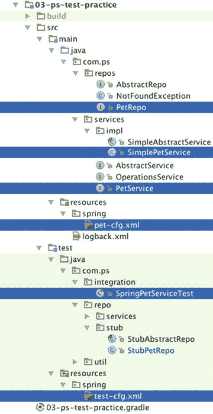

图 3-3.

用于测试 SimplePetService 的 Spring 测试上下文

`pet-cfg.xml` 文件包含我们感兴趣的测试 bean `SimplePetService` 类型的单个 bean 的定义。

```
//pet-cfg.xml

```

`petRepo` 未在此文件中定义。它通过配置与 `simplePetService` bean 解耦。可以根据执行上下文在不同的文件中提供它。在这种情况下，我们使用测试上下文，执行此测试的依赖项由文件 `test-cfg.xml` 提供。

```
//test-cfg.xml

```

为了使桩对象匹配 Spring 环境，对其进行了少量修改，并添加了一个 `init` 方法来初始化由仓库管理的内容。`TestObjectsBuilder` 工具类还包含一个 `buildPet` 方法，用于创建宠物对象。方法体也与上下文无关，但可以在本章附带的项目中查看。为简化操作，构建测试对象的方法已移至一个名为 `TestObjectsBuilder` 的不同类中。

```
package com.ps.repo.stub;
...
import static com.ps.util.TestObjectsBuilder.buildPet;
import static com.ps.util.TestObjectsBuilder.buildUser;
public class StubPetRepo extends StubAbstractRepo
implements PetRepo {
protected Map> records2 = new HashMap();
public void init(){
// 创建一些条目以供使用
final User owner = buildUser("test@gmail.com", "the_password", UserType.OWNER);
this.save(buildPet(owner, PetType.CAT, "John", 3, "0122345645"));
this.save(buildPet(owner, PetType.DOG, "Max", 5, "0222335645"));
}
@Override
public void save(Pet pet) {
super.save(pet);
addWithOwner(pet);
}
...
}
```


即使我们使用桩（stub），以下测试也是一个集成测试。所有测试方法将在同一个 Spring 测试上下文中运行。被测试对象及其依赖项仅在创建应用程序上下文时创建一次，并由所有方法共用。被测试对象是一个 bean，并通过 `@Autowired` 注入到测试类中。

```
package com.ps.integration;
import org.junit.Test;
import org.junit.runner.RunWith;
import org.springframework.beans.factory.annotation.Autowired;
import org.springframework.test.context.ContextConfiguration;
import org.springframework.test.context.junit4.SpringJUnit4ClassRunner;
import static com.ps.util.TestObjectsBuilder.buildUser;
import static org.junit.Assert.assertEquals;
import static org.junit.Assert.assertNotNull;
@RunWith(SpringJUnit4ClassRunner.class)
@ContextConfiguration(locations= {
"classpath:spring/test-cfg.xml",
"classpath:spring/pet-cfg.xml"} )
public class SpringPetServiceTest{
public static final Long PET_ID = 1L;
public static final User owner =
buildUser("test@gmail.com", "the_password", UserType.OWNER);
@Autowired
PetService simplePetService;
//正向测试，我们知道存在一个 ID=1 的 Pet
@Test
public void findByIdPositive() {
Pet pet = simplePetService.findById(PET_ID);
assertNotNull(pet);
}
//正向测试，我们知道该主人存在宠物及其数量
@Test
public void findByOwnerPositive() {
Set result = simplePetService.findAllByOwner(owner);
assertEquals(result.size(), 2);
}
}
```

Spring 测试上下文使用这两个配置文件创建，这将确保桩依赖项是唯一可注入到 `simplePetService` bean 中的依赖项。如你所见，不再需要 `@Before` 注解的方法。此外，也不再需要手动操作 `petRepo` 对象，因为它由 Spring 创建、初始化并注入。因此，开发者只需注入被测试的 bean，然后直接编写测试即可。

当使用 Java 配置提供配置时，也可以进行类似操作，因为可以使用 `@Bean` 注解来声明属性。在以下代码片段中，XML 文件被配置类取代。

```
// 替换 test-cfg.xml
@Configuration
public class TestAppConfig2 {
@Bean(initMethod = "init")
public PetRepo petRepo(){
return new StubPetRepo();
}
}
// 替换 pet-cfg.xml
public class PetConfigClass2 {
@Bean
public PetService simplePetService(){
return new SimplePetService();
}
}
```

测试类保持不变，仅将 `@ContextConfiguration` 注解中的 `locations` 属性替换为 `classes`，因为现在配置是通过 Java 配置类提供的。

```
@RunWith(SpringJUnit4ClassRunner.class)
@ContextConfiguration(classes = {TestAppConfig2.class,
PetConfigClass2.class})
// 之前的声明替换了 @ContextConfiguration(locations= {
//   "classpath:spring/test-cfg.xml",
//   "classpath:spring/pet-cfg.xml"} )
public class SpringPetServiceTest2
...
}
```

也可以添加构造型注解。`StubPetRepo` 类必须定义为 bean，并且 `init` 方法必须使用 `@PostConstruct` 注解。`SimplePetService` 类也必须定义为 bean，并且 `repo` 依赖项必须自动装配。

```
//StubPetRepo.java
@Component
public class StubPetRepo extends StubAbstractRepo implements PetRepo {
@PostConstruct
public void init(){
// 创建一些条目用于测试
final User owner = buildUser("test@gmail.com", "the_password", UserType.OWNER);
this.save(buildPet(owner, PetType.CAT, "John", 3, "0122345645"));
this.save(buildPet(owner, PetType.DOG, "Max", 5, "0222335645"));
}
...
}
//SimplePetService.java
@Component
public class SimplePetService extends SimpleAbstractService
implements PetService {
...
@Autowired
public void setRepo(PetRepo petRepo) {
this.repo = petRepo;
}
}
```

配置类必须启用组件扫描，并设置为使用我们感兴趣的包：

```
//PetConfigClass.java
@Configuration
@ComponentScan(basePackages = "com.ps.services.impl")
public class PetConfigClass {
}
//TestAppConfig.java
@Configuration
@ComponentScan(basePackages = "com.ps.repo.stub")
public class TestAppConfig {
}
```

测试类中唯一改变的是 `@ContextConfiguration` 注解的配置；被测试组件的自动装配和测试本身保持不变。

```
@RunWith(SpringJUnit4ClassRunner.class)
@ContextConfiguration(classes = {TestAppConfig.class, PetConfigClass.class})
public class SpringPetServiceTest2 {
...
}
```

在 Spring 3.1 中，引入了 `org.springframework.test.context.support.AnnotationConfigContextLoader` 类。该类从注解类加载 bean 定义。因此，可以直接在测试类中创建一个配置类，以创建需要隔离测试的 bean。这很有用，因为配置类通常包含多个 bean 定义，而加载所有 bean 仅仅为了测试其中一个，效率不高。该类必须是测试类的内部类且为静态类，并且必须将 `AnnotationConfigContextLoader` 类用作 `@ContextConfiguration` 注解的 `loader` 属性的值。

请查看以下代码片段：

```
package com.ps.integration;
import
org.springframework.test.context.support.AnnotationConfigContextLoader;
...
@RunWith(SpringJUnit4ClassRunner.class)
@ContextConfiguration(loader=AnnotationConfigContextLoader.class)
public class SpringPetServiceTest3 {
public static final Long PET_ID = 1L;
public static final User owner = buildUser("test@gmail.com", "test",
UserType.OWNER);
@Configuration
static class TestCtxConfig {
@Bean
StubPetRepo petRepo(){
return new StubPetRepo();
}
@Bean
PetService simplePetService(){
SimplePetService petService = new SimplePetService();
petService.setRepo(petRepo());
return petService;
}
}
@Autowired
PetService simplePetService;
@Test
public void findByOwnerPositive() {
Set result = simplePetService.findAllByOwner(owner);
assertEquals(result.size(), 2);
}
}
```

此外，Spring Test 可以与模拟（mocking）结合使用，编写跳过重量级组件（例如提供数据库访问的组件）的集成测试。为了涵盖这种特定场景，必须使用仓库类的具体实现。由于它们的实现与本章无关，将在后面的第 5 章（数据访问）中介绍，因此此处不提供完整代码。为了管理 `Pet` 对象，需要一个 Repository 类。在 Spring 应用程序中提供数据库访问的最基本方式是使用 `org.springframework.jdbc.core.JdbcTemplate` 类型的 bean，因此将创建具有该类型依赖项的仓库类。从该 bean 查询数据库的方法需要一个能够将数据库记录映射到实体的对象，这就是为什么每个仓库类都应定义一个实现 Spring 特定映射接口 `org.springframework.jdbc.core.RowMapper<T>` 的内部类。


```java
//抽象仓库基类
package com.ps.repos.impl;
import org.springframework.jdbc.core.JdbcTemplate;
...
public class JdbcAbstractRepo
implements AbstractRepo {
protected JdbcTemplate jdbcTemplate;
public JdbcAbstractRepo(JdbcTemplate jdbcTemplate) {
this.jdbcTemplate = jdbcTemplate;
}
...
}
@Repository("petRepo")
public class JdbcPetRepo extends JdbcAbstractRepo implements PetRepo {
private String findByIdQuery = "select id, name from pet";
private RowMapper rowMapper = new PetRowMapper();
@Autowired
public JdbcPetRepo(JdbcTemplate jdbcTemplate) {
super(jdbcTemplate);
}
...
@Override
public Pet findById(Long entityId) {
return jdbcTemplate.queryForObject(findByIdQuery, rowMapper, entityId);
}
...
// 数据库记录到实体的映射类
private class PetRowMapper implements RowMapper {
public Pet mapRow(ResultSet rs, int rowNum) throws SQLException {
Long id = rs.getLong("ID");
String name = rs.getString("NAME");
Pet pet = new Pet();
pet.setId(id);
pet.setName(name);
return pet;
}
}
}
```

需要一个配置类，提供替换 `jdbcTemplate` bean 的模拟对象。该模拟对象将通过 `org.mockito.Mockito` 类中的静态方法 `mock(Class<T>)` 创建。此配置类将与仓库和服务的配置类一起使用，以创建测试上下文。

```java
// 模拟配置类
import static org.mockito.Mockito.mock;
...
@Configuration
public class MockTemplateConfig {
@Bean
public JdbcTemplate jdbcTemplate() {
return mock(JdbcTemplate.class);
}
}
// 仓库配置类
@Configuration
@ComponentScan(basePackages = "com.ps.repos.impl")
public class JdbcRepoConfig {
}
// 服务配置类
@Configuration
@ComponentScan(basePackages = "com.ps.services.impl")
public class ServiceConfig {
}
```

现在可以创建测试类了；它必须遵守以下两条规则：

*   必须使用 `MockitoJUnitRunner` 运行器类来执行

*   必须在测试类中添加两个 Spring 特定组件，以便加载上下文

```java
    @ClassRule
    public static final SpringClassRule SPRING_CLASS_RULE = new SpringClassRule();
    @Rule
    public final SpringMethodRule springMethodRule = new SpringMethodRule();
```

`org.springframework.test.context.junit4.rules.SpringClassRule` 是 JUnit `org.junit.rules.TestRule` 的一个实现，它支持 Spring 测试上下文框架的类级别特性。`@ClassRule` 注解用于引用规则或返回规则的字段。字段必须是 public、static 且是 `org.junit.rules.TestRule` 的子类型。方法必须是 public、static 且返回 `TestRule` 的实现。`org.springframework.test.context.junit4.rules.SpringMethodRule` 是 JUnit `org.junit.rules.MethodRule` 的一个实现，它支持 Spring 测试上下文框架的实例级别和方法级别特性。`@Rule` 注解用于引用规则或返回规则的字段。字段必须是 public、非 static 且是 `TestRule` 或 `org.junit.rules.MethodRule` 的实现；方法必须是 public、非 static 且返回 `TestRule` 或 `MethodRule` 的实现。

最终的测试类如下代码片段所示：

```java
package com.ps.config;
import com.ps.ents.Pet;
import com.ps.mock.MockTemplateConfig;
import com.ps.services.impl.SimplePetService;
import org.junit.ClassRule;
import org.junit.Rule;
import org.junit.Test;
import org.junit.runner.RunWith;
import org.mockito.Mockito;
import org.mockito.runners.MockitoJUnitRunner;
import org.springframework.beans.factory.annotation.Autowired;
import org.springframework.jdbc.core.JdbcTemplate;
import org.springframework.jdbc.core.RowMapper;
import org.springframework.test.context.ContextConfiguration;
import org.springframework.test.context.junit4.rules.SpringClassRule;
import org.springframework.test.context.junit4.rules.SpringMethodRule;
import static org.junit.Assert.assertNotNull;
import static org.mockito.Mockito.any;
import static org.mockito.Mockito.anyString;
import static org.mockito.Mockito.anyLong;
@RunWith(MockitoJUnitRunner.class)
@ContextConfiguration(classes = {JdbcRepoConfig.class,
ServiceConfig.class, MockTemplateConfig.class})
public class TestAppConfig3 {
public static final Long PET_ID = 1L;
// 模拟数据库
@Autowired
JdbcTemplate jdbcTemplate;
// 被测试对象
@Autowired
SimplePetService simplePetService;
@ClassRule
public static final SpringClassRule SPRING_CLASS_RULE = new SpringClassRule();
@Rule
public final SpringMethodRule springMethodRule = new SpringMethodRule();
// 正向测试，我们知道 ID=1 的 Pet 存在
@Test
public void findByIdPositive() {
Mockito.when(jdbcTemplate.queryForObject(anyString(),
any(RowMapper.class), anyLong())).thenReturn(new Pet());
Pet pet = simplePetService.findById(PET_ID);
assertNotNull(pet);
}
}
```

如果你还没弄清楚发生了什么，这里解释一下：创建了一个测试上下文，其中包含了配置类中的所有 bean，但 `jdbcTemplate` bean 除外。这个 bean 被替换成了一个模拟对象，该模拟对象在测试配置类中被定义为一个 bean，并由 Spring 在需要的地方（仓库 bean 中）自动注入。

**使用 Profile**

从 Spring 3.1 开始，`@Profile` 注解变得可用。当类被此注解标注后，在一个或多个 profile 处于激活状态时，这些类才有资格被注册。Spring profile 与 Maven profile 功能相同，但使用起来更实用，因为它们配置起来简单得多，并且不依赖于应用程序的构建工具。之前提到过，不同的环境需要不同的配置，在开发过程中应格外注意，确保组件充分解耦，以便根据进程执行的上下文进行替换。Spring profile 在这种情况下大有帮助。例如，在开发过程中，测试在开发机器上运行，并不真正需要数据库，或者如果需要，应使用简单快速的内存实现。这可以通过创建一个测试数据源配置文件来实现，该文件仅在开发 profile 激活时使用。用于生产环境和测试环境的两个数据源类如下代码片段所示：


```
//生产数据源
package com.ps.config;
import org.springframework.context.annotation.Profile;
...
@Configuration
@PropertySource("classpath:db/datasource.properties")
@Profile("prod")
public class ProdDataConfig {
@Value("${driverClassName}")
private String driverClassName;
@Value("${url}")
private String url;
@Value("${username}")
private String username;
@Value("${password}")
private String password;
@Bean
public static PropertySourcesPlaceholderConfigurer
propertySourcesPlaceholderConfigurer() {
return new PropertySourcesPlaceholderConfigurer();
}
@Bean
public DataSource _underlinedataSource() throws SQLException {
DriverManagerDataSource ds = new DriverManagerDataSource();
ds.setDriverClassName(driverClassName);
ds.setUrl(url);
ds.setUsername(username);
ds.setPassword(password);
return ds;
}
}
//开发数据源
@Configuration
@Profile("dev")
public class TestDataConfig {
@Bean
public DataSource dataSource() {
return new EmbeddedDatabaseBuilder()
.setType(EmbeddedDatabaseType.H2)
.addScript("classpath:db/schema.sql")
.addScript("classpath:db/test-data.sql")
.build();
}
}
```

在上面的示例中，我们有两个配置类，每个类都声明了一个名为 `dataSource` 的 bean，每个 bean 都特定于不同的环境。profile 被简单地命名为 `prod`（生产环境）和 `dev`（开发环境）。在测试类中，我们可以通过使用 `@ActiveProfiles` 注解并传入 profile 名称作为参数来激活开发 profile。因此，在测试上下文中，只有那些在标注了 `@Profile("dev")` 的类中定义的 bean 才会被创建和注入。测试类如下面的代码片段所示。

```
import org.springframework.test.context.ActiveProfiles;
...
@RunWith(SpringJUnit4ClassRunner.class)
@ContextConfiguration(classes = {PetConfigClass.class})
@ActiveProfiles("dev")
public class PetServiceTest {
public static final Long PET_ID = 1L;
@Autowired
PetService simplePetService;
//正向测试，我们知道存在一个 ID=1 的 Pet
@Test
public void findByIdPositive() {
Pet pet = simplePetService.findById(PET_ID);
assertNotNull(pet);
}
}
```

通过使用 `@ActiveProfiles("dev")` 注解测试类，开发 profile 被激活，因此当上下文被创建时，bean 定义将从 `@ContextConfiguration` 注解指定的配置类（或文件）以及所有标注了 `@Profile("dev")` 的配置类中获取。因此，在运行测试时，将使用内存数据库，从而使执行快速且实用。

结论

使用 Spring 提供的测试类来测试 Spring 应用程序，无疑比不使用它们要容易得多，因为不需要外部容器来定义测试运行所需的上下文。如果配置的耦合度足够低，其部分内容可以在测试环境和生产环境之间共享。对于基本的单元测试，不需要 Spring，但为了实现正确的集成测试，能够快速建立测试上下文的能力无疑是非常有用的。

总结

阅读本章后，您应具备足够的知识，能够使用单元测试和集成测试来测试 Spring 应用程序。

*   测试是开发过程中的一个重要部分。

*   什么是单元测试，以及哪些库有助于在 Java 中编写单元测试？

*   什么是桩（stub）？

*   什么是模拟（mock）？

*   什么是集成测试？

*   如何设置 Spring 测试上下文？

快速测验

问题 1：给定以下集成测试：

```
@RunWith(SpringJUnit4ClassRunner.class)
@ContextConfiguration
public class SimpleTest {
//测试方法写在这里
}
```

关于执行测试时 Spring 的行为，以下哪些说法是正确的？（选择所有适用项）

1.  Spring 将构建一个空上下文，测试将失败

2.  Spring 将无法创建测试上下文供测试运行

3.  Spring 将在与 `SimpleTest` 类相同的位置查找名为 `SimpleTest-context.xml` 的文件，并用它来初始化上下文

问题 2：给定以下单元测试，类定义中缺少了什么导致测试无法正确执行？

1.  什么都不缺，测试将正确执行并通过。

2.  `petRepo` 字段缺少 `@Mock` 注解

1.  该类应使用 `@RunWith(MockitoRunner.class)` 注解

2.  `setUp` 方法缺少以下语句：

```
    simplePetService.setRepo(petRepo);
    ```

```
public class SimplePetServiceTest {
@InjectMocks
SimplePetService simplePetService;
PetRepo petRepo;
@Before
public void initMocks() {
MockitoAnnotations.initMocks(this);
}
@Test
public void findById() {
Mockito.when(petRepo.findById(1L)).thenReturn(new Pet());
Pet pet = simplePetService.findById(1L);
assertNotNull(pet);
}
}
```

问题 3：`SpringJUnit4ClassRunner` 类用于设置测试上下文。

1.  正确

2.  错误

问题 4：`@ContextConfiguration` 的用途是什么？

1.  加载和配置一个 TestApplicationContext 实例

2.  加载和配置一个用于集成测试的 ApplicationContext

3.  注入单元测试中使用的 bean

问题 5：为 Spring 应用程序编写单元测试，哪个库是必需的？

1.  JUnit

2.  spring-test

3.  任何模拟生成库，如 jMock、Mockito 或 EasyMock

实践练习

用于测试您对测试理解程度的项目是 `03-ps-test-practice`。该项目包含了代码片段中描述的部分实现。缺失的部分用 TODO 任务标记，并在 Intellij IDEA 的 TODO 视图中可见。为了测试您所获得的测试知识，有六个任务需要您解决，它们侧重于 Mockito 的使用和 Spring 测试。

任务 TODO 14 和 15 要求您完成两个单元测试，使用桩（stub）来测试 `SimplePetService` 对象。

任务 TODO 16 要求您在 `MockPetServiceTest` 中放置缺失的注解。

任务 TODO 17 要求您使用 Mockito 方法定义模拟对象的行为。

任务 TODO 18 和 19 要求您完成测试类定义，以便测试用例能够正确执行。要运行一个测试用例，只需在类内容或项目视图中的类名上单击，然后选择 `Run '{TestClassName}'` 选项。如果您想运行单个测试，只需右键单击，然后从菜单中选择 `Run '{TestMethodName}'`。这些选项在项目的测试类和测试方法的图 3-4 中进行了描述。如果您有兴趣在特定时间点停止执行，您甚至可以使用调试模式运行测试。实现所有解决方案后，您可以运行 Gradle `test` 任务来运行所有测试。您应该会看到一个绿色工具栏，旁边有一条消息告诉您所有二十个测试都已通过，类似于您在图 3-5 中看到的内容。

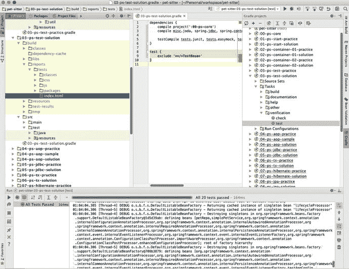

图 3-5.

在 Intellij IDEA 中使用 Gradle 测试任务运行模块的所有测试

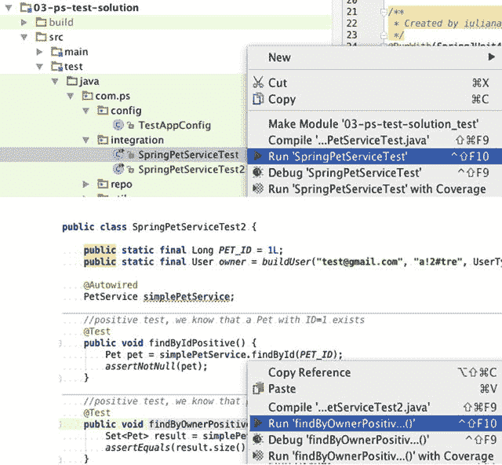

图 3-4.

如何在 Intellij IDEA 中运行测试

在图 3-5 中，Gradle 任务出现在右侧，位于以灰色选中的 Gradle 视图中。对于任何模块，都可以在 `ModuleName/Tasks/verification` 下找到它。

在左侧，选中了 Gradle 测试运行时生成的 `index.html` 文件。在编写测试时，您可以在浏览器中打开该文件，以检查测试通过的百分比以及详细日志，这些日志会告诉您测试失败的原因。如果最终一切顺利，您应该会看到一个类似于图 3-6 所示的页面。

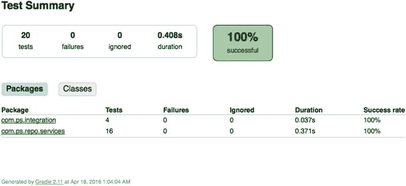


图 3-6.

所有测试通过后的 Gradle 网页报告

项目 `03-ps-test-solution` 包含了本章的参考答案。请将你的实现与提供的答案进行比较，以确保所有内容均按照规范实现。

此外，由于项目规模有所增长，你可以使用 `-Dreceipt` 选项运行一次，并分析其稳定性和执行时间。同时，为了并行构建模块，你可以添加 `-Dorg.gradle.parallel=true` 选项。

```
gradle build -Dreceipt -Dorg.gradle.parallel=true
```

如果存在包含未实现测试的 `*-practice` 项目，构建将会失败。当你在浏览器中分析构建结果时，会看到类似于图 3-7 所示的内容。但是，如果你刚刚完成的模块不在列出的模块中，那么一切正常。

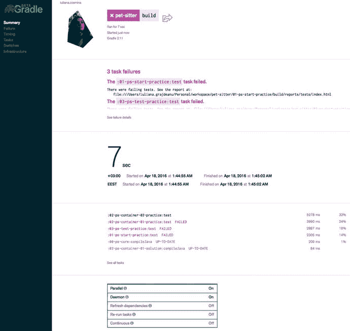

图 3-7.

关于 pet-sitter 项目构建的官方 Gradle 报告

脚注

国际软件测试资格认证委员会：[`http://www.istqb.org/`](http://www.istqb.org/) 。

如果你好奇，这里是链接：[`http://googletesting.blogspot.ro/2010/07/code-coverage-goal-80-and-no-less.html`](http://googletesting.blogspot.ro/2010/07/code-coverage-goal-80-and-no-less.html) 。

JUnit 官方网站：[`http://junit.org/junit4/`](http://junit.org/junit4/) 。

4.  使用 Spring 进行面向切面编程

AOP 是面向切面编程（Aspect Oriented Programming）的缩写，这个术语指的是一种旨在通过允许分离横切关注点来提高模块化程度的编程类型。横切关注点是一种与业务代码纠缠在一起的功能，通常无法与业务逻辑分离。审计、安全和事务管理是横切关注点的典型例子。它们与业务代码混杂在一起，与可能因它们失败而受影响的功能高度耦合。这些是使用切面进行分离的理想候选，因为没有哪种设计模式能够以将它们与业务逻辑分离的方式来编写代码。这意味着在应用程序编译时，会将额外的行为添加到现有行为中。因此，事务管理、安全逻辑和审计可以独立开发，并在编译时与功能代码混合。这是通过定义一个**通知**（advice）来实现的，该通知包含将在由**切入点**（pointcut）指定的**连接点**（join point）位置执行的代码。这种方法允许将与业务逻辑无关的行为实现代码从功能代码中分离出来，从而使应用程序更加模块化、耦合度更低、更简洁。

业务代码或基础代码实际上并未被修改；你可以将切面想象成插件。它们修改的是行为，而非实际的实现。

AOP 是一种旨在帮助分离横切关注点以提高模块化程度的编程类型；它意味着声明一个切面类，该类通过将通知应用于由切入点指定的特定连接点来改变基础代码的行为。

AOP 是 OOP（面向对象编程）的补充，它们可以一起使用来构建强大的应用程序，因为两者提供了不同的代码组织方式。OOP 专注于将所有事物都视为对象，而 AOP 则引入了切面，这是一种特殊类型的对象，它注入并包装其行为以补充其他对象的行为。横切关注点的其他例子包括：

*   缓存
*   国际化
*   错误检测与纠正
*   内存管理
*   性能监控
*   同步

AOP 解决的问题

当使用数据库存储数据时，会使用数据库连接与应用程序进行交互。为了成功完成与数据库的通信，需要在通信前打开数据库连接，并在通信后关闭它。每个数据库实现都允许同时存在有限数量的连接；因此，需要关闭不再使用的连接，以便可以打开新的连接。使用 Spring，一个基于用户 ID 查找用户的 JDBC 仓库方法，其实现类似于图 4-1 所示：

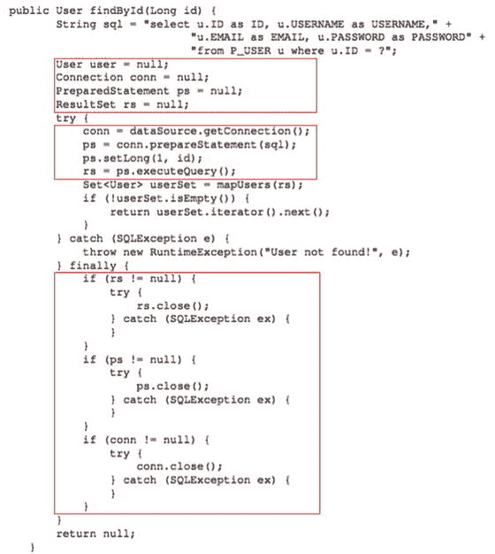

图 4-1.

使用 JDBC 根据用户 ID 在数据库中搜索用户的方法，其中横切关注点相关的代码已高亮显示

实现打开和关闭连接的代码被包含在红色矩形中。特意选择这段代码是为了强调一个与基础代码纠缠在一起的横切关注点，这会导致代码混乱。这既不是一个干净的解决方案，也不是一个稳定的解决方案，因为在一个大型项目中，数据库通信方法将由不同的程序员编写，只要其中一人犯错，导致数据库连接未能正确关闭，应用程序就可能最终无法与数据库通信，因为无法打开新的连接。

上面的例子相当古老，上述方法的调用图如图 4-2 所示。

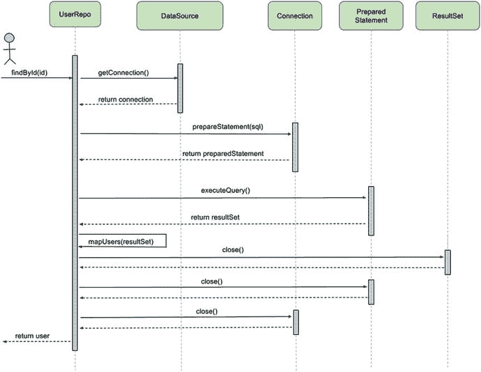

图 4-2.

用于按 ID 提取用户的 JDBC 方法的 UML 调用图

很复杂，对吧？AOP 可以帮助将连接管理代码与业务代码解耦。使用 AOP，之前的图应该简化为类似于图 4-3 所示的内容。

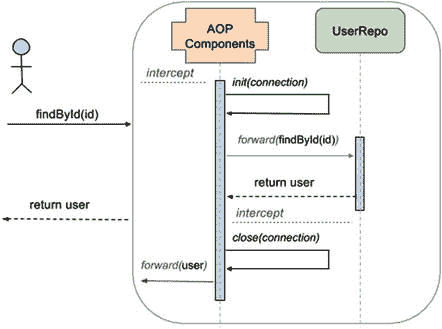

图 4-3.

使用 AOP 的 `findById()` 方法的概念示意图

上图中的示意图是一个概念图，它描绘了基本思想。AOP 组件拦截对某些对象的调用，并注入它们自己的功能，而无需与原始目标强关联，并且它们以透明的方式做到这一点。

现在直接使用 JDBC 组件的应用程序已经不多了。目前有一些框架提供了类来为你管理连接，因此你无需编写所有这些代码。例如，在 Spring 中，`org.springframework.jdbc.core.JdbcTemplate` 类为你完成了这项工作，这将在第 [5](http://link.springer.com/search?facet-content-type=ReferenceWorkEntry&query=5) 章“数据访问”中介绍。仓库组件可以基于 `JdbcTemplate` 实例创建，数据库连接由连接池组件管理。连接池是一种重用连接的技术：当一个连接被关闭时，它可以驻留在内存中，以便下次需要连接时重用，从而消除了创建新连接的开销。但是直接使用连接很麻烦，因为应用程序崩溃可能导致数据不一致。除了连接之外，应用程序还使用事务将数据库操作分组为工作单元。当所有操作都成功完成时，事务被提交，更改被持久化到数据库中。如果某个操作失败，事务则回滚，使数据库保持不变。

在这种情况下，事务成为一个横切关注点，因为一个应该在事务中被调用的方法必须获取一个事务，打开它，执行其操作，然后提交事务。


但通常一个应用程序会使用多个横切关注点，最常见的组合是：安全 + 日志（或审计）+ 事务。因此，那些提供并控制数据访问的服务类最终会变得如图 4-4 所示。

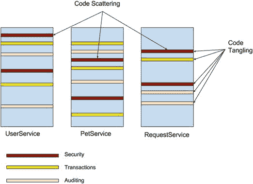

图 4-4.

未使用 AOP 的服务类中的代码纠缠与分散

当基础代码需要在特定条件下执行时，代码纠缠和代码分散这两个问题通常会同时出现。代码纠缠意味着同一个组件被注入到许多其他组件中，从而导致组件之间产生显著的依赖耦合。代码分散则意味着重复，因为你只能以一种方式完成同一件事。由此产生的解决方案难以扩展和维护，更难理解，并且调试起来非常痛苦。使用 AOP，程序员可以专注于核心实现，然后定义切面组件来处理横切关注点。AOP 提供了比 OOP 更强的模块化能力。

Spring AOP

最初用于创建切面的组件库名为 AspectJ。它由施乐帕克公司开发，并于 1995 年发布。由于其简单易用，它定义了 AOP 的标准。用于定义切面的语言语法与 Java 类似，允许开发者定义称为切面的特殊构造。在 AspectJ 中开发的切面在编译时处理，因此它们直接影响生成的字节码。

Spring AOP 框架是对当前版本 AspectJ 的补充，包含了许多可用于使用 Java 代码开发和配置切面的注解，但 Spring 开发团队也了解并承认其局限性。例如，它无法增强细粒度的对象，如领域对象。Spring AOP 功能基于 AspectJ，这就是为什么在使用 Spring AOP 库时，必须将 `aspectjweaver` 和 `aspectjrt` 添加到应用程序类路径中。

此外，Spring AOP 无法增强不受 Spring 容器管理的对象。AspectJ 可以做到这一点。Spring AOP 使用动态代理进行切面织入，因此目标对象的字节码不会受到任何影响。同时，遵循 Spring 的惯例，Spring AOP 是非侵入式的，其开发方式使得 AOP 组件与应用程序组件保持解耦。

在早期版本中，XML 被用来定义切面。本章的目的是帮助你模块化代码，以便利用 Spring 提供的所有功能来消除（或至少减少到最低限度）代码纠缠和分散。

Spring 框架由几个库组成：

*   `spring-aop` 提供了符合 AOP 联盟 API 的组件，可用于定义方法拦截器和切点，从而使具有不同职责的代码能够被清晰地解耦。
*   `spring-aspects` 提供了与 AspectJ 的集成。
*   `spring-instrument` 提供了类插装支持和可在应用服务器上使用的类加载器实现。
*   `spring-instrument-tomcat` 包含了 Spring 用于 Tomcat 的插装代理。

Spring IoC 可用于编写软件应用程序，而对于需要使用横切关注点的业务应用程序，使用 Spring AOP 是必须的。在深入探讨之前，让我们先介绍 AOP 的概念以及它们在 Spring 中是如何声明的。

AOP 术语

本章引言中提到了几个特定的 AOP 术语，但需要更详细的解释。

*   **切面**：包含特定于横切关注点代码的类。如果一个类声明使用了 `@Aspect` 注解进行标注，则它在 Spring 中被识别为一个切面。
*   **织入**：这个词的同义词是交织，但在软件中，其同义词是链接，它指的是将切面与其他类型的对象组合以创建一个被增强的对象。
*   **连接点**：程序执行过程中的一个点。在 Spring AOP 中，连接点总是一个方法执行。基本上，连接点标记了切面行为和基础行为结合的执行点。
*   **目标对象**：切面所应用的对象。
*   **目标方法**：被增强的方法。
*   **通知**：切面在连接点处执行的动作。在 Spring AOP 中有多种通知类型：
    *   **前置通知**：使用 `@Before` 注解的方法，将在连接点之前执行。除非这些方法抛出异常，否则它们不会阻止目标方法的执行。
    *   **返回后通知**：使用 `@AfterReturning` 注解的方法，将在连接点正常完成后执行，这意味着目标方法正常返回且没有抛出异常。
    *   **异常后通知**：使用 `@AfterThrowing` 注解的方法，将在连接点执行因抛出异常而结束时执行。
    *   **后置（最终）通知**：使用 `@After` 注解的方法，将在连接点执行后执行，无论执行结果如何。
    *   **环绕通知**：使用 `@Around` 注解的方法会拦截目标方法并包围连接点。这是最强大的通知类型，因为它可以在调用前后执行自定义行为。它负责选择执行调用或返回自己的值。
*   **切点**：用于识别连接点的谓词。通知定义与切点表达式相关联，通知将在任何匹配该切点表达式的连接点上执行。切点表达式使用 AspectJ 切点表达式语言定义。¹ 切点表达式可以定义为通知注解的参数，也可以定义为 `@Pointcut` 注解的参数。
*   **引入**：代表另一种类型声明额外的方法、字段、实现的接口、注解。Spring AOP 允许使用一套属于 `aspectjrt` 库的 AspectJ `@Declare*` 注解来实现这一点。
*   **AOP 代理**：由 AOP 创建以实现切面契约的对象。在 Spring 中，代理对象可以是 JDK 动态代理或 `CGLIB` 代理。默认情况下，代理对象将是 JDK 动态代理，并且被代理的对象必须实现一个接口，该接口也将由代理对象实现。但是，像 CGLIB 这样的库也可以通过子类化的方式创建代理，因此不需要接口。

快速入门

为了快速介绍上一节中的大多数 Spring AOP 术语，让我们考虑一个非常简单的例子。假设有一个 `JdbcTemplateUserRepo` Bean，它包含几个用于查询或修改 `User` 实例的简单方法。


```
...
@Repository("userTemplateRepo")
public class JdbcTemplateUserRepo implements UserRepo {
private RowMapper rowMapper = new UserRowMapper();
protected JdbcTemplate jdbcTemplate;
@Autowired
public JdbcTemplateUserRepo(JdbcTemplate jdbcTemplate) {
this.jdbcTemplate = jdbcTemplate;
}
public Set findAll() {
String sql = "select id, username, email, password from p_user";
return new HashSet(jdbcTemplate.query(sql, rowMapper));
}
public User findById(Long id) {
String sql = "select id, email, username,password from p_user where id= ?";
return jdbcTemplate.queryForObject(sql, rowMapper, id);
}
public Set findAllByUserName(String username, boolean exactMatch) {
String sql = "select id, username, email, password from p_user where ";
if (exactMatch) {
sql += "username= ?";
} else {
sql += "username like '%' || ? || '%'";
}
return new HashSet(jdbcTemplate.query(sql, new Object{username}, rowMapper));
}
public void updatePassword(Long userId, String newPass) {
String sql = "update p_user set password=? where ID = ?";
jdbcTemplate.update(sql, newPass, userId);
}
// Maps a row returned from a query executed on the P_USER table to a User object.
//implementation not relevant for this chapter
private class UserRowMapper implements RowMapper {
...
}
}
```

`UserRowMapper`实例与本章内容无关，但如果你好奇的话，这个类实现了 Spring 的`RowMapper`接口，并被`JdbcTemplate`实例用于将数据库记录转换为应用程序使用的领域对象。这种类型的对象通常是无状态且可复用的。它们将在第[5](http://link.springer.com/search?facet-content-type=ReferenceWorkEntry&query=5)章：数据访问中详细讨论。

可以创建一个切面来监控该 Bean 方法的执行。以下代码片段展示了一个切面类的定义，其中包含一个通知，该通知会在每次调用`findById`方法时打印一条消息。

```
package com.ps.aspects;
import org.apache.log4j.Logger;
import org.aspectj.lang.JoinPoint;
import org.aspectj.lang.ProceedingJoinPoint;
import org.aspectj.lang.annotation.Component;
import org.aspectj.lang.annotation.Aspect;
import underlineorg.aspectj.lang.annotation.Before;
@Aspect
@Component
public class UserRepoMonitor {
private static final Logger logger = Logger.getLogger(UserRepoMonitor.class);
@Before
("execution(public com.ps.repos.˙JdbcTemplateUserRepo+.findById(..))")
public void beforeFindById(JoinPoint joinPoint) throws Throwable {
String methodName = joinPoint.getSignature().getName();
logger.info(" ---> Method " + methodName + " is about to be called");
}
}
```

包含切面定义的类必须声明为一个 Bean。这可以通过[第 2 章](http://link.springer.com/search?facet-content-type=ReferenceWorkEntry&query=2)中介绍的三种方法中的任意一种来实现。在上面的例子中，通过使用`@Component`注解该类来完成声明。`@Before`注解与一个称为切入点表达式的参数一起使用，用于标识将应用该行为的方法执行点。

要测试以下代码，我们需要一个配置类和一个测试类。数据源的配置将在`com.ps.config.TestDataConfig`类中解耦，该类与本章内容无关，但你可以在本章附带的`04-aop-practice`项目源码中找到它。应用程序配置将由`AppConfig`类提供。为了启用切面支持，配置类必须使用`@EnableAspectJAutoProxy`注解。

```
package com.ps.config;
...
import org.springframework.context.annotation.EnableAspectJAutoProxy;
@Configuration
@ComponentScan(basePackages = {"com.ps.repos.impl","com.ps.aspects"})
@EnableAspectJAutoProxy
public class AppConfig {
}
```

为了能够向现有对象添加行为，Spring 使用了一种称为代理的方法，这意味着创建一个包装目标对象的对象。默认情况下，Spring 创建 JDK 动态代理，这些代理对象实现了目标对象所实现的相同接口。如果 CGLIB 在类路径上，`@EnableAspectJAutoProxy`注解也可以用于修改所创建的代理类型。CGLIB 代理被称为子类代理，因为它们扩展了目标对象的类型。要将代理类型更改为 CGLIB 代理，只需将`proxyTargetClass`参数设置为 true。但在深入探讨这个话题之前，让我们先进行一些测试。

```
... // imports here
@RunWith(SpringJUnit4ClassRunner.class)
@ContextConfiguration(classes = {TestDataConfig.class, AppConfig.class})
@ActiveProfiles("dev")
public class TestJdbcTemplateUserRepo {
@Autowired
@Qualifier("userTemplateRepo")
UserRepo userRepo;
@Test
public void testFindById() {
User user = userRepo.findById(1L);
assertEquals("John", user.getUsername());
}
}
```

!

由于`UserRepoMonitor`目前只打印消息，为了清晰看到通知的效果，所有日志将被设置为 OFF，除了切面类的日志。这可以通过编辑`04-ps-aop-practice/src/test/resources/logback-test.xml`文件，将其他包的所有日志设置为 OFF，并将`com.ps.aspects`的日志级别设置为 INFO 来实现，如下面的代码片段所示：

```

true

%d{HH:mm:ss.SSS} %thread %-5level %logger{5} - %msg%n

```

当执行`testFindById`方法时，日志中只会打印一行。

```
INFO c.p.a.UserRepoMonitor - ---> Method findById is about to be called.
```

很明显，前置通知被执行了，但它实际上是如何工作的呢？Spring IoC 创建了`userTemplateRepo` Bean。然后，包含一个必须在`findById`方法之前执行的通知的切面定义告诉 Spring，这个 Bean 必须被包装在一个代理对象中，该代理对象将添加额外的行为，并且这个对象将被注入到所有需要的地方以替代原始对象。由于我们使用的是 JDK 动态代理，代理将实现`UserRepo`接口。图 4-5 描述了这种情况。

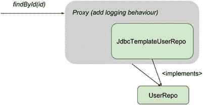

图 4-5.

userTemplateRepo 代理 Bean

可以通过在`testFindById`方法中设置断点并以调试模式启动测试来检查注入到测试 Bean 中的 Bean。在调试器视图中，可以展开`userRepo`并检查其内容。在图 4-6 中，你可以并排看到使用切面和不使用切面时`userRepo` Bean 的结构。²

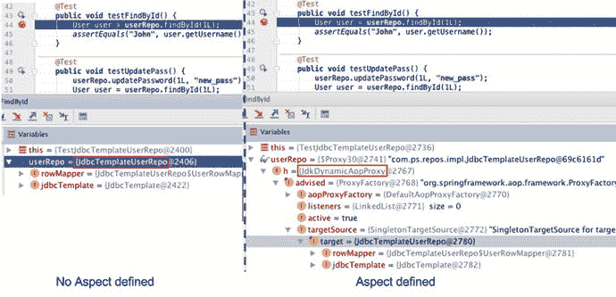

图 4-6.

在 Intellij IDEA 调试器视图中显示的，使用切面和不使用切面时注入的 Bean userRepo 结构。在右侧你可以注意到注入 Bean 的类型：JdkDynamicAopProxy

在这种情况下，很明显创建的代理类型是默认的 JDK 动态代理，当目标类实现一个或多个接口时，这非常有用，因为 Spring 将创建一个实现所有这些接口的代理。JDK 代理是在运行时使用 JDK 反射 API 创建的，而反射已知会影响性能。


如果要将 CGLIB 库添加到应用程序类路径中，必须通过将启用切面的注解修改为 `@EnableAspectJAutoProxy(proxyTargetClass = true)` 来告知 Spring 我们需要基于子类的代理。当目标类未实现任何接口时，此方法适用，因此 Spring 会动态创建一个新类，该类是目标类的子类。CGLIB 适用于此场景，因为它是一个字节码生成库。使用 CGLIB 生成的代理称为基于子类的代理，其优点之一是它们可以有选择地重写方法。它们使用专门的拦截器来调用方法，这实际上可以提高性能。

在图 4-7 中，你可以看到当使用 `CGLIB` 创建代理时 `userRepo` Bean 的结构。

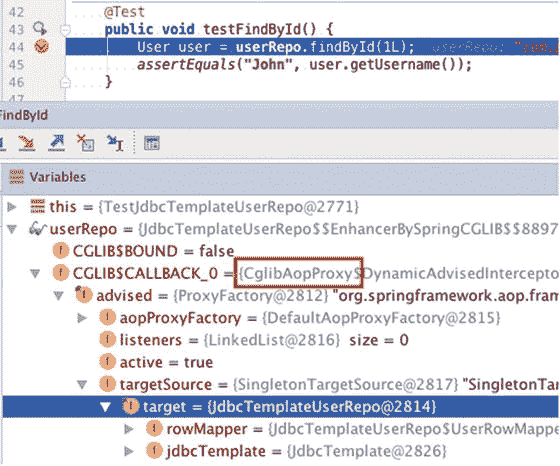

图 4-7.

在 Intellij IDEA 调试器视图中，使用 CGLIB 创建代理时注入的 Bean userRepo 结构

因此，基本上，要在 Spring 应用程序中使用切面，你需要以下内容：

*   将 spring-aop 作为依赖项
*   声明一个 `@Aspect` 类，并将其也声明为一个 Bean（使用 `@Component` 或 `@Bean` 或 XML 典型的 Bean 声明元素）
*   声明一个使用典型通知注解（`@Before`、`@After` 等）标注的通知方法，并将其与切入点表达式关联
*   通过使用 `@EnableAspectJAutoProxy` 注解配置类来启用切面支持
*   （可选）将 CGLIB 添加为依赖项，并通过使用 `@EnableAspectJAutoProxy(proxyTargetClass = true)` 注解配置类来启用基于子类代理的切面支持

使用 XML 配置切面支持

尽管自 Spring 3.1 以来，切面支持配置一直基于注解，但在该版本之前，配置是使用 XML 完成的。由于你作为开发者的经验，你最终可能会在基于 Spring < 3.1 的项目上工作，我们认为介绍如何使用 XML 配置切面支持是很有用的。

显然，有一个对应的命名空间，它提供了与 `@EnableAspectJAutoProxy` 等效的元素定义。该特定元素是 `<aop:aspectj-autoproxy../>`，它为应用程序中定义的每个切面包含一个子元素 `<aop:include ../>`。

如果你想完全避免使用注解配置切面，原因是你使用的是 Java < 5 版本且不支持注解，那么还有一个 `<aop:config />` 元素，可用于将 Bean 的方法声明为通知并关联切入点。

要配置使用基于子类的代理，`<aop:aspectj-autoproxy../>` 必须将其 `proxy-target-class` 属性设置为 `true`。

定义切入点

在快速入门部分，我们介绍了前置通知及其关联的切入点表达式，该表达式提供了识别在何处应用通知的方法。切入点表达式如下所示：

```
execution(public * com.ps.repos.*.JdbcTemplateUserRepo+.findById(..))
```

切入点表达式遵循的模板可以定义如下：

```
execution( [修饰符] [返回类型] [完整类名].[方法名] ([参数]) throws [异常类型])
```

该表达式可以包含像 `+` 和 `*` 这样的通配符，并且可以由多个通过布尔运算符（如 `&&`、`||` 等）连接的表达式组成。`*` 通配符替换任意字符组；`+` 通配符用于指定要通知的方法也可以在由 `[完整类名]` 条件标识的子类中找到。

还有一系列指示符可用于定义切入点的范围；例如，`within(...)` 指示符可用于将切入点限制在某个包内

```
public * com.ps.repos.*.JdbcTemplateUserRepo+.findById(..)) && +underlinewithin(com.ps.*)
```

此外，切入点表达式可以仅标识在具有特定注解的类中定义的方法：

```
execution(@org.springframework.transaction.annotation.Transactional
public * com.ps.repos.*.*Repo+.findById(..)))
```

切入点表达式甚至可以标识返回具有特定注解的值的方法：

```
execution(public (@org.springframework.stereotype.Service *) *(..))
```

并且通过使用 `@annotation()` 指示符，可以仅考虑那些使用特定注解标注的方法：

```
execution(public (public * com.ps.service.*.*Service+.*(..)
&& @annotation(org.springframework.security.access.annotation.Secured))
```

这在涉及安全性时非常有用，因为 `@annotation` 可以绑定到一个方法参数，以便注解对象在通知主体中可用。

```
@Around("execution(* *(..)) && @annotation(securedObj)")
public void calculateExecutionTime(ProceedingJoinPoint pjp,
Secured securedObj) throws Throwable {
// 使用 securedObj.allowedRoles() 进行额外的安全检查
...
}
```

!

观察：

*   `[返回类型]` 是必需的。如果返回类型不是筛选条件，只需使用 *。如果缺少它，应用程序将在启动时崩溃，抛出 `java.lang.IllegalArgumentException`，并附带一条消息说明切入点格式不正确。
*   `[修饰符]` 不是必需的，如果未指定，默认为 `public`。
*   `[方法名]` 不是必需的，这意味着启动时不会抛出异常。但如果未指定，则无法识别执行通知的连接点。可以肯定地说，如果你想定义一个技术上可用的切入点表达式，你需要指定它。
*   `[参数]` 是必需的。如果缺少它，应用程序将在启动时崩溃，抛出 `java.lang.IllegalArgumentException`，并附带一条消息说明切入点格式不正确。如果参数不是筛选条件，只需使用 `(..)`，它将匹配具有 0 个或多个参数的方法。如果你希望匹配没有参数的方法，请使用 `()`。如果你希望匹配具有单个参数的方法，请使用 `(*)`。

当确定要通知的方法的条件很复杂时，使用切入点表达式可能会变得繁琐。但是，通过将表达式分解为多个子表达式，这些子表达式可以组合并在其他组合表达式中重用，可以使声明切入点变得愉快。Spring 还提供了将表达式外部化到专用类中的可能性——是的，甚至切入点声明也可以解耦。在以下代码片段中，我们将解释如何实现这一点。

让我们声明一个可用于管理 `User` 实例的服务类。该服务类将使用 `userRepo` 与数据库交互。

```
...
@Service
public class UserServiceImpl implements UserService {
private UserRepo userRepo;
@Autowired
public void setUserRepo(UserRepo userRepo) {
this.userRepo = userRepo;
}
@Override
public Set findAll() {
return userRepo.findAll();
}
@Override
public void updateUsername(Long id, String username) {
userRepo.updateUsername(id, username);
}
@Override
public void updatePassword(Long id, String password) {
userRepo.updatePassword(id, password);
}
@Override
public User findById(Long id) {
return userRepo.findById(id);
}
}
```

我们想编写一个切面，每当从管理 `User` 实例的仓库或服务类中调用 `update*` 方法时，该切面都会写入一条消息。因此，切入点必须查找名称以 `update` 开头、带有参数、并且在任何实现 `UserRepo` 或 `UserService` 的类中找到的方法。

编写切入点表达式的方法有很多种，本节将介绍其中几种。切面类和通知如下所示：


```
@Aspect
@Component
public class UserRepoMonitor {
private static final Logger logger = Logger.getLogger(UserRepoMonitor.class);
@Before("execution( * com.ps.repos.*.*UserRepo+.update*(..))
|| execution (* com.ps.services.*Service+.update*(..)))")
public void beforeUpdate(JoinPoint joinPoint) throws Throwable {
String className = joinPoint.getSignature().getDeclaringTypeName();
String methodName = joinPoint.getSignature().getName();
logger.info(" ---> Method " + className + "." + methodName
+ " is about to be called");
}
}
```

当然，在一个小型应用中，当你明确只有这两个类时，这个切入点表达式也同样适用：`"execution( * update*(..))"`，但在大型应用中，这种宽松的表达式可能会导致通知被应用到你不希望被通知的方法上。第一个代码片段中使用的表达式由两个表达式组成。

```
execution( * com.ps.repos.*.*UserRepo+.update*(..))
|| execution (* com.ps.services.*Service+.update*(..)))
```

这两个表达式可以拆分为两个切入点声明，并与方法关联。这些方法的名称随后将用于复合表达式中以标识一个切入点。这就是为什么这些切入点被称为**命名切入点**。

```
@Aspect
@Component
public class UserRepoMonitor {
private static final Logger logger = Logger.getLogger(UserRepoMonitor.class);
@Before("repoUpdate() || serviceUpdate()")
public void beforeUpdate(JoinPoint joinPoint) throws Throwable {
String className = joinPoint.getSignature().getDeclaringTypeName();
String methodName = joinPoint.getSignature().getName();
logger.info(" ---> Method " + className + "." + methodName
+ " is about to be called");
}
@Pointcut("execution( * com.ps.repos.*.*UserRepo+.update*(..))")
public void repoUpdate() {}
@Pointcut("execution (* com.ps.services.*Service+.update*(..)))")
public void serviceUpdate() {}
}
```

之前提到过，可以创建一个专门的类来集中管理切入点。在这种情况下，复合表达式必须修改，以包含这些方法所在的包名和类名。

```
package com.ps.aspects;
import org.aspectj.lang.annotation.Pointcut;
public class PointcutContainer {
@Pointcut("execution( * com.ps.repos.*.*UserRepo+.update*(..))")
public void repoUpdate() {
}
@Pointcut("execution (* com.ps.services.*Service+.update*(..)))")
public void serviceUpdate() {
}
}
```

方法 `repoUpdate` 和 `serviceUpdate` 被移到了类 `com.ps.aspects.PointcutContainer` 中，因此 `beforeUpdate` 通知的表达式变为：

```
@Before("com.ps.aspects.PointcutContainer.repoUpdate() ||
com.ps.aspects.PointcutContainer.serviceUpdate()")
public void beforeUpdate(JoinPoint joinPoint) throws Throwable {
...
}
```

那么，既然切入点已经被外部化了，还能做些什么呢？那些用 `@Pointcut` 注解并与切入点表达式关联的方法可以用来处理数据。到目前为止，我们一直使用 `JoinPoint` 参数来提取上下文数据。但是，如果使用特殊指示符告知 Spring，它也可以注入上下文数据。

我们示例中的 update 方法有一个需要处理的字符串参数，如果该值包含特殊字符（如 $、#、&、%），则必须抛出异常。这应该只在服务方法中执行，因为用错误的参数调用 repo 方法是没有意义的。这意味着我们必须将通知分成两部分：一部分用于仓库，一部分用于服务。

```
@Aspect
@Component
public class UserRepoMonitor {
private static final Logger logger = Logger.getLogger(UserRepoMonitor.class);
@Before("com.ps.aspects.PointcutContainer.serviceUpdate()")
public void beforeServiceUpdate(JoinPoint joinPoint) throws Throwable {
Object[] args = joinPoint.getArgs();
String text = (String)args[1];
if (StringUtils.indexOfAny(text, new String[]{"$", "#", "&", "%"}) != -1) {
throw new IllegalArgumentException("Text contains weird characters!");
}
}
@Before("com.ps.aspects.PointcutContainer.repoUpdate()")
public void beforeRepoUpdate(JoinPoint joinPoint) throws Throwable {
String className = joinPoint.getSignature().getDeclaringTypeName();
String methodName = joinPoint.getSignature().getName();
logger.info(" ---> Method " + className + "." + methodName
+ " is about to be called");
}
}
```

请注意，所有关于通知上下文的信息都是从 `joinPoint` 对象中提取的。`JoinPoint` 接口提供了几种方法来访问目标方法的信息，所有这些信息都可以通过代理对象访问。可以通过调用 `joinPoint.getTarget()` 获取目标对象的引用。在图 4-8 中，在调用 `joinPoint.getTarget()` 方法后，测试运行在一个断点处暂停，目标对象是 Intellij IDEA 调试器视图的焦点。你可以清楚地注意到它的类型。

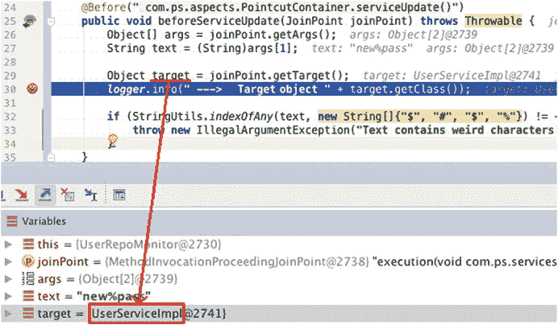

图 4-8.

通知的目标对象

我们将修改实现，不再调用 `JointPoint` 方法，而是使用 Spring 自动填充我们所需的信息。切入点表达式变为：

```
public class PointcutContainer {
...
@Pointcut("execution (* com.ps.services.*Service+.update*(..))
&& args(id,pass) && target (service)")
public void serviceUpdate(UserService service, Long id, String pass) {
}
}
```

!

`args()` 指示符用于识别具有由其定义的参数配置的方法。当它识别出具有一个 `User` 类型参数的方法时，可以这样使用：`args(com.ps.ents.User)`。但这个指示符也可以用于使方法参数在通知体中可用。

在上面的代码片段中，它以绑定形式使用，以确保在调用通知时，相应参数的值将作为参数值传递。在这种情况下，`(id,pass)` 方法参数的值将被注入到 `(id,pass)` 通知参数中。是的，正如你可能猜到的，指示符中的参数名称必须与通知参数名称匹配。

现在可以修改通知，精确声明我们需要 Spring 为我们填充的字段，并直接使用它们。无需使用 `JoinPoint` 对象来提取它们并在通知体中处理转换，因为 Spring 已经为我们完成了这些工作。

```
@Aspect
@Component
public class UserRepoMonitor {
private static final Logger logger = Logger.getLogger(UserRepoMonitor.class);
@Before("com.ps.aspects.PointcutContainer.serviceUpdate(service, id, pass)")
public void beforeServiceUpdate
(UserService service, Long id, String pass) throws Throwable {
logger.info(" ---> Proxied object " + service.getClass());
if (StringUtils.indexOfAny(pass, new String{"$", "#", "$", "%"}) != -1) {
throw new IllegalArgumentException("Text for " + id
+ " contains weird characters!");
}
}
}
```

现在我们已经了解了如何定义切入点，是时候回过头来深入探讨通知的类型和定义了。

实现通知

在快速入门部分，我们涉及了一些关于如何在 Spring 中实现切面和通知的技术细节，但只是浅尝辄止。必须先介绍切入点的具体细节，才能使通知声明更容易理解。本节将详细涵盖在开发 Spring 应用程序过程中最可能需要的每种通知类型。

前置通知


您之前已经了解了前置通知。在上一节中，定义了一个前置通知，用于测试一个字符串类型的参数。

```
import org.aspectj.lang.annotation.Before;
...
@Before("com.ps.aspects.PointcutContainer.serviceUpdate(id, pass)")
public void beforeServiceUpdate (Long id, String pass) throws Throwable {
if (StringUtils.indexOfAny(pass, new String{"$", "#", "$", "%"}) != -1) {
throw new IllegalArgumentException("Text for " + id
+ " contains weird characters!");
}
```

描述调用 `userService.update*(..)` 时发生情况的 UML `sequence` 序列图如图 4-9 所示。

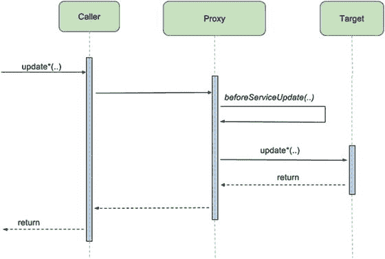

图 4-9.

前置通知 UML 调用图

代理对象接收发往目标 bean 的调用，并首先调用通知方法。如果通知方法成功返回，则它会将初始调用转发给目标 bean，并将结果返回给调用者。如果通知方法抛出异常，则该异常会传播给调用者，并且目标方法将不再执行。用于覆盖通知方法抛出异常情况的测试方法应预期抛出 `IllegalArgumentException` 类型的异常，相关代码如下所示。

```
@RunWith(SpringJUnit4ClassRunner.class)
@ContextConfiguration(classes = {TestDataConfig.class, AppConfig.class})
@ActiveProfiles("dev")
public class TestUserService {
@Autowired
UserService userService;
@Test(expected = IllegalArgumentException.class)
public void testUpdatePass() {
userService.updatePassword(1L, "new%pass");
User user = userService.findById(1L);
assertEquals("new%pass", user.getPassword());
}
}
```

由于前置通知对参数没有任何影响，因此它大多数时候用于执行检查，并在检查未通过时通过抛出异常来停止目标方法的执行。显然，最可能的应用场景是安全性问题。在要求用户提供凭证才能使用的应用程序中，每次调用处理敏感信息的方法时，都必须检查安全权限和角色。在每个方法体中包含安全检查将是一件痛苦的事情。因此，一个测试所提供凭证的通知无疑是一种更实用的解决方案。Spring 安全框架（将在第 [6](http://link.springer.com/search?facet-content-type=ReferenceWorkEntry&query=6) 章：Spring Web 中介绍）通过提供开箱即用的安全切面，使处理安全性变得更加容易。

后置返回通知

这种类型的通知仅在目标方法成功执行且未因抛出异常而结束时才会执行。下面代码片段中为目标 bean 中的相同更新方法定义了一个此类型的切面。该通知将仅打印一条消息，确认更新过程已正确执行。`@AfterReturning` 有一个属性可用于访问目标方法执行的结果，名为 `returning`。此属性的值必须与通知方法签名中的参数名称匹配，因为 Spring 会将目标方法执行的结果注入到那里。

```
import org.aspectj.lang.annotation.AfterReturning;
...
@AfterReturning(value="execution (* com.ps.services.*Service+.update*(..))",
returning = "result")
public void afterServiceUpdate(JoinPoint joinPoint, int result) throws Throwable {
String className = joinPoint.getSignature().getDeclaringTypeName();
String methodName = joinPoint.getSignature().getName();
if(result == 0) {
logger.info(" ---> Update method " + className + "." + methodName
+ " performed as expected.");
}
}
```

描述调用 `userService.update*(..)` 时发生情况的 UML 序列图如图 4-10 所示。由于后置返回通知可以访问目标方法返回的值，因此该通知适用于实现缓存的情况。

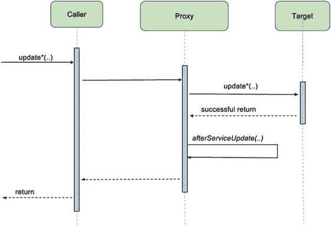

图 4-10.

后置返回通知 UML 序列图

后置异常通知

后置异常通知与后置返回通知类似。唯一的区别在于其执行条件正好相反。也就是说，此通知仅在目标方法因抛出异常而结束时才会执行。`@AfterThrowing` 注解有一个名为 `throwing` 的属性，可用于访问目标方法抛出的异常。此属性的值必须与通知方法的异常参数名称匹配。

```
//custom exception type for this example
import com.ps.exception.UnexpectedException;
...
import org.aspectj.lang.annotation.AfterThrowing;
...
@AfterThrowing(value="execution
(* com.ps.services.*Service+.updateUsername(..))", throwing = "e")
public void afterBadUpdate(JoinPoint joinPoint, Exception e) throws Throwable {
String className = joinPoint.getSignature().getDeclaringTypeName();
String methodName = joinPoint.getSignature().getName();
if(e instanceof DuplicateKeyException) {
logger.info(" ---> Update method " + className + "."
+ methodName + " failed. Existing username found.");
} else {
throw new UnexpectedException(" Ooops!", e);
}
}
```

这种类型的通知不会阻止异常的传播，但它可以更改所抛出异常的类型。

对于此示例，它是一个仅在调用 `userService.updateUsername()` 之前执行的通知。服务方法调用的仓库方法如果发现数据库中已存在该用户名，则会抛出 `DuplicateKeyException`。这种类型的异常是预期会抛出的，因此通知仅打印一条通知，原始异常会继续传播。但如果抛出了不同类型的异常，则通知会将原始异常包装到 `UnexpectedException` 中，以告知原始调用者发生了需要处理的错误。

为了测试此通知是否正确执行，测试方法必须声明预期会抛出 `DuplicateKeyException`，并提供一个数据库中已存在的用户名。

```
@Test(expected = DuplicateKeyException.class)
public void testAfterUpdateUsernameBad() {
int result = userService.updateUsername(1L, "Johnny");
assertEquals(1, result);
}
```

此测试必须通过，并且控制台中应打印一行信息。（当然，这仅在您没有为同一方法定义其他通知时才成立。）

```
INFO c.p.a.UserRepoMonitor - ---> Update method
com.ps.services.UserServiceImpl.updateUsername failed. Existing username found.
```

描述调用 `userService.updateUsername(..)` 时发生情况的 UML 序列图如图 4-11 所示。这种类型的通知可用于在意外失败后恢复系统状态。

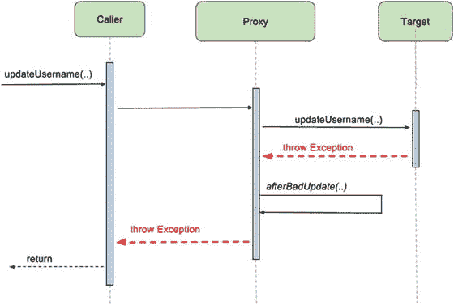

图 4-11.

后置异常通知 UML 序列图

后置最终通知

后置最终通知在目标方法执行后执行，无论其执行结果是成功还是抛出异常。正因如此，它最适合用于审计或日志记录。


```
import org.aspectj.lang.annotation.After;
...
@Aspect
@Component
public class UserRepoMonitor {
private static final Logger logger = Logger.getLogger(UserRepoMonitor.class);
private static long findByIdCount = 0;
@After
("execution(public * com.ps.repos.*.JdbcTemplateUserRepo+.updateUsername(..))")
public void afterFindById(JoinPoint joinPoint) throws Throwable {
++findByIdCount;
String methodName = joinPoint.getSignature().getName();
logger.info(" ---> Method " + methodName + " was called "
+ findByIdCount + " times.");
}
}
```

图 4-12 展示了当调用 `userService.updateUsername(..)` 时发生的 UML 时序图。

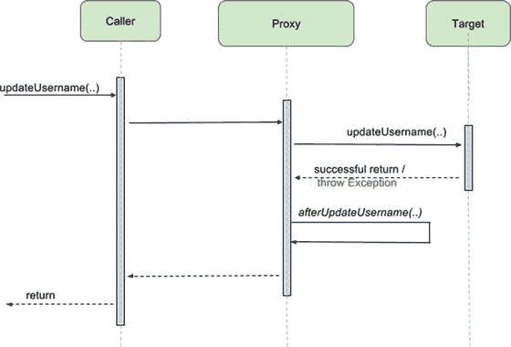

图 4-12.

后置通知 UML 时序图

!

到目前为止，默认实现（未使用 `args` 或 `target` 等绑定参数的设计指示符）中的每个通知，其参数都是 `org.aspectj.lang.JoinPoint` 类型的引用。Spring 在运行时注入的对象提供了对连接点可用状态及其静态信息的访问：目标类型、目标方法名称、参数、目标本身的引用。这些信息可用于跟踪和日志记录；但它不能直接控制目标方法的执行。

允许这种操作的类型是 `org.aspectj.lang.ProceedingJoinPoint`，它是 `org.aspectj.lang.JoinPoint` 的扩展，仅可在环绕通知中用作连接点参数的类型。

环绕

环绕通知是最强大的通知类型，因为它封装了目标方法并控制其执行，这意味着通知决定是否调用目标方法，以及何时调用。在本节中，创建了一个用于记录每次查找操作持续时间的通知。

```
import org.aspectj.lang.annotation.Around;
...
@Around("execution(public * com.ps.repos.*.*Repo+.find*(..))")
public Object monitorFind(ProceedingJoinPoint joinPoint) throws Throwable {
String methodName = joinPoint.getSignature().getName();
logger.info(" ---> Intercepting call of: " + methodName);
long t1 = System.currentTimeMillis();
try {
//put a pause here so we can register an execution time
Thread.sleep(1000L);
return joinPoint.proceed();
} finally {
long t2 = System.currentTimeMillis();
logger.info(" ---> Execution of " + methodName + " took: "
+ (t2 - t1) / 1000 + " ms.");
}
}
```

`ProceedingJoinPoint` 类型继承自 `JoinPoint`，并添加了用于调用目标方法的 `proceed()` 方法。由于在这种情况下，通知方法直接调用目标方法，因此可以在通知方法中捕获并处理异常，而不是传播它们。图 4-13 展示了当调用任何 `userService.find*(..)` 时发生的 UML 时序图。

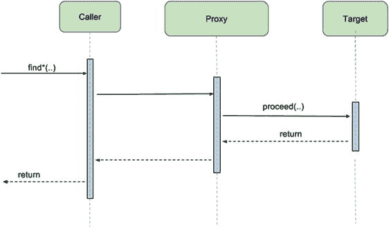

图 4-13.

环绕通知 UML 时序图

结论

Spring AOP 与 AspectJ 相结合，为在目标组件中分离横切关注点提供了一种非常实用的方法。如果没有 AOP，其他 Spring 模块和框架的开发和使用将会困难得多。下一章将介绍的 Spring 事务模块，利用 Spring AOP 来透明地管理事务。[第 6 章](http://link.springer.com/search?facet-content-type=ReferenceWorkEntry&query=6)将介绍的 Spring Security，则利用 AOP 来控制对敏感数据的访问。

然而，Spring AOP 确实有其局限性：

*   只能对公共连接点进行通知（你可能已经猜到了）。

*   切面只能应用于 Spring Bean。

*   即使 Spring AOP 未设置为使用 CGLIB 代理，如果连接点位于未实现接口的类中，Spring AOP 也会尝试创建 CGLIB 代理。


*   如果代理中的某个方法调用了代理中的另一个方法，并且这两个方法都匹配某个通知的切入点表达式，那么该通知**仅**会为第一个方法执行。这是代理的本质：只有当调用者调用目标方法时，它才会执行额外的行为。

让我们考虑以下示例。我们将编辑 `JdbcTemplateUserRepo` 类，添加一个名为 `updateDependencies` 的方法，该方法旨在更新依赖于正在更新的对象的一些记录。实际的方法体对于此场景并不重要。

```
@Repository("userTemplateRepo")
public class JdbcTemplateUserRepo implements UserRepo {
...
@Override
public int updateUsername(Long userId, String username) {
String sql = "update p_user set username=? where ID = ?";
updateDependencies(userId);
return jdbcTemplate.update(sql, username, userId);
}
@Override
public int updateDependencies(Long userId) {
//模拟方法，用于测试代理本质
return 0;
}
}
```

让我们考虑以下切入点表达式和通知声明：

```
// PointcutContainer.java
public class PointcutContainer {
...
@Pointcut("execution( * com.ps.repos.*.*UserRepo+.update*(..))")
public void proxyBubu() {
}
// UserRepoMonitor.java
@Aspect
@Component
public class UserRepoMonitor {
...
@Before("com.ps.aspects.PointcutContainer.proxyBubu()")
public void bubuHappens(JoinPoint joinPoint) throws Throwable {
String methodName = joinPoint.getSignature().getName();
String className = joinPoint.getSignature().getDeclaringTypeName();
logger.info(" ---> BUBU when calling: " + className + "." + methodName);
}
}
```

为了测试前面的示例，让我们使用一个简单的方法：

```
@RunWith(SpringJUnit4ClassRunner.class)
@ContextConfiguration(classes = {TestDataConfig.class, AppConfig.class})
@ActiveProfiles("dev")
public class TestUserService {
@Autowired
UserService userService;
...
@Test
public void testProxyBubu() {
int result = userService.updateUsername(3L, "Iuliana");
assertEquals(1, result);
}
}
```

如果执行前面的测试方法，在控制台中只能看到一行输出：

```
INFO c.p.a.UserRepoMonitor - ---> BUBU when calling:
com.ps.repos.impl.JdbcTemplateUserRepo.updateUsername
```

但是我们如何知道 `updateDependencies` 方法匹配了连接点表达式呢？我们在服务 bean 中创建一个调用此方法的方法，并为其编写一个测试。

```
// UserServiceImpl.java
@Service
public class UserServiceImpl implements UserService {
...
@Override
public int updateDependencies(Long id) {
return userRepo.updateDependencies(id);
}
}
// TestUserService.java
...@Test
public void testProxyBubuDeps() {
int result = userService.updateDependencies(3L);
assertEquals(0, result);
}
```

如果执行 `testProxyBubuDeps` 测试方法，在控制台中只能看到一行输出：

```
INFO c.p.a.UserRepoMonitor - ---> BUBU when calling:
com.ps.repos.impl.JdbcTemplateUserRepo.updateDependencies
```

现在我们可以确定这两个方法都匹配了切入点表达式。

这里实际发生的情况是，通知方法执行其操作，然后调用目标方法。目标方法执行，并调用目标对象上的 `updateDependencies` 方法。代理完全不参与此调用，这就是它无法应用任何通知的原因。图 4-14 中的 UML 序列图应该能让事情更清晰。

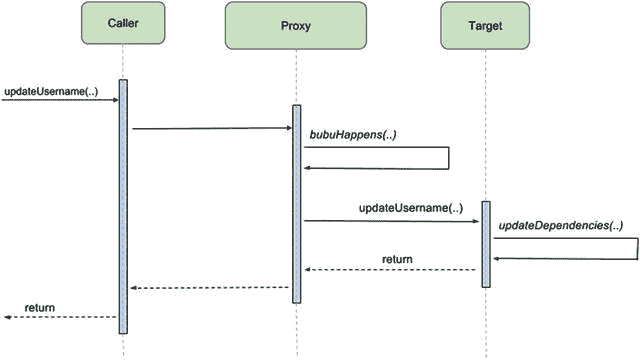

图 4-14.

通过 UML 序列图解释的代理本质

用于解释此特定场景的代码片段属于 `04-ps-aop-solution` 项目。

总结

阅读本章后，您应该拥有足够的知识来使用 Spring AOP 编写和配置切面。请记住以下几点：

*   横切关注点会导致代码分散和纠缠。
*   AOP 是一种编程类型，可以通过模块化横切关注点来帮助减少代码分散和纠缠。
*   最常见的横切关注点。
*   AOP 概念：切面、通知、连接点、切入点、AOP 代理等。
*   如何在 Spring 应用程序中配置切面支持。
*   有多少种通知类型。

快速测验

问题 1：以下列表中的哪些选项代表横切关注点？（选择所有适用项）

1.  连接到数据库
2.  缓存
3.  安全性
4.  事务

问题 2：以下列表中的哪些选项用于在 Spring AOP 中声明通知？（选择所有适用项）

1.  `@Aspect`
2.  `@Before`
3.  `@Pointcut`
4.  `@AfterReturning`
5.  `@After`

问题 3：关于后置通知（after advice），以下哪些说法是正确的？（选择所有适用项）

1.  如果目标方法执行因抛出异常而结束，则不会执行
2.  它可以捕获目标方法的异常并阻止其传播
3.  它可以捕获目标方法的异常并抛出不同的异常

问题 4：以下哪些方法会匹配下面的切入点表达式？（选择所有适用项） `execution(protected * com.ps.repos.*.*Repo.find*(..))`

1.  无：Spring AOP 仅支持对公共方法进行通知
2.  com.ps.repos.impl.JdbcTemplateUserRepo.findById(Long id)
3.  com.ps.repos.impl.JdbcUserRepository.findAll()

问题 5：以下哪些切入点表达式匹配下面的方法定义？方法定义：一个名为 update 的方法，其第一个参数类型为 Long，并且可能还有更多参数

1.  `execution(update(*))`
2.  `execution(* update(Long, *))`
3.  `execution(* update(..))`
4.  `execution(* update(Logn,..))`

问题 6：`@EnableAspectJAutoProxy` 的 XML 等价物是什么？

```
A.

B.

C.

```

问题 7：关于 Spring AOP 代理，以下哪项是正确的？

1.  代理对象必须实现目标对象所实现的接口，或者是目标类型的子类。
2.  代理对象的作用域是 prototype。
3.  Spring AOP 默认使用基于子类的代理。

问题 8：什么是切入点？

1.  每个通知方法在其签名中必须指定的一个参数，用于提供对执行上下文的访问
2.  用于标识通知所应用方法的表达式
3.  用于标识连接点的谓词

实践练习

本书的源代码中有一个名为 `04-ps-aop-practice` 的项目。此项目可用于测试您对 Spring AOP 的理解。该项目包含了代码片段中所示的部分实现。缺失的部分用 TODO 任务标记，并在 Intellij IDEA 的 TODO 视图中可见。为了测试您所获得的 Spring AOP 知识，有六个任务需要您解决。

任务 TODO 20 要求您通过修改 `AppConfig` 类来启用切面支持。您可以选择使用 JDK 代理或 CGLIB。CGLIB 依赖项在类路径上，可以使用。

任务 TODO 21 要求您将 `UserRepoMonitor` 声明为一个切面。

任务 22–26 要求您将 `UserRepoMonitor` 类内部声明的方法配置为不同类型的通知。切入点表达式也由您负责。

可用于验证您的通知是否正常工作的测试，在 `TestUserService` 类中声明。每个测试方法都注释了它所测试的通知类型。由于某些切入点表达式可能匹配多个方法，所有适用的通知都将被执行。为了防止这种情况发生，在配置某个通知时，请注释掉其他通知上的注解。

要运行一个测试用例，只需单击类内容中的任意位置，或项目视图中的类名，然后选择 `Run '{TestClassName}'` 选项。如果您想运行单个测试，只需右键单击并从菜单中选择 `Run '{TestMethodName}'`。这些说明已在第 [3](http://link.springer.com/search?facet-content-type=ReferenceWorkEntry&query=3) 章：测试的实践部分向您解释过。您可能需要回顾一下。


解决所有 TODO 后，你应该能够运行完整的测试套件，并看到与图 4-15 所示类似的结果。

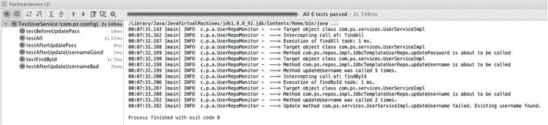

图 4-15.

Aspects 部分的测试套件，所有测试均通过

如果你在解决 TODO 时遇到困难，可以查看 `04-ps-aop-solution`。

!

如果你还想了解更多信息，Spring 官方博客上有两篇博文。一篇是关于代理的

[`https://spring.io/blog/2012/05/23/transactions-caching-and-aop-understanding-proxy-usage-in-spring`](https://spring.io/blog/2012/05/23/transactions-caching-and-aop-understanding-proxy-usage-in-spring)

另一篇是关于命名切点的

[`https://spring.io/blog/2007/03/29/aop-context-binding-with-named-pointcuts`](https://spring.io/blog/2007/03/29/aop-context-binding-with-named-pointcuts)

脚注

完整参考请见：[`https://eclipse.org/aspectj/doc/next/progguide/language.html`](https://eclipse.org/aspectj/doc/next/progguide/language.html) 。

你可以通过注释掉 @EnableAspectJAutoProxy 注解来禁用切面支持，Spring 将忽略 Aspect 注解。

5. 数据访问

软件应用程序通常处理需要以有序方式存储的数据集，以便于访问、管理和更新。数据可以持久化意味着即使应用程序关闭，数据仍然可用。因此，存储与应用程序的其他部分解耦。组织数据存储最常用的方式是数据库。任何允许数据以可查询和更新的方式组织的存储设置都代表一个数据库。目前最广为人知和使用的数据库是关系型数据库（如 MySQL、PostgreSQL 和 Oracle）以及键值数据库（也称为 NoSQL）。当然，XML 文件也可以用作数据库，但仅适用于小型应用程序，因为使用 XML 文件存储数据意味着必须将所有数据加载到内存中才能进行管理。

从架构角度来看，软件应用程序是多层或多层的，而数据库是基础层，数据存储在其中。基础层（也称为基础设施层）与应用程序其余部分之间的接口是数据访问层，也称为存储库层。在此之上是逻辑（或服务）层。该层转换用户数据并准备存储，或将数据库内容转换为适合在用户界面中显示的数据。在服务层之上是表示（或接口）层，负责接收命令和数据，并将其转发到服务层进行处理或显示结果。而贯穿所有层的，如前一章所述，是横切关注点，如图 5-1 所示。

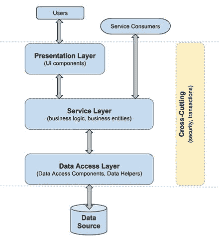

图 5-1.

典型的软件应用程序架构

数据库是软件应用程序中的核心资源，因此它可能成为瓶颈的来源。这就是为什么访问数据库执行典型操作（如搜索数据、创建数据和删除数据）需要妥善管理。Spring 支持多种数据库实现，并且可以与大多数提供高效数据访问管理的框架（Hibernate、EclipseLink 或 MyBatis。¹）集成。本章重点介绍如何使用 Spring 管理数据库访问，代码示例涵盖服务层、数据层和事务切面关注点。

使用 JDBC 进行基本数据访问

要执行数据操作，需要与数据库建立连接。在 Java 中获取连接最基本的方法是使用 JDBC。但基本方法也很繁琐，因为开发人员必须编写代码来关闭连接以及处理过程中使用的任何其他基于流的对象。因为仅有连接是不够的，在应用程序和数据库之间传输数据需要额外的对象来以可读的格式包含数据。任何基于连接构建的对象，例如预处理语句和结果集对象，也必须安全地丢弃。这会导致代码杂乱无章，难以维护、测试和编写。要使用 JDBC 访问数据库，需要以下内容：

*   用于与数据库通信的数据库驱动程序；
*   作为通信入口点的连接 URL；
*   数据库凭据（通常是用户名和密码）。

使用上述信息，可以创建一个 `javax.sql.DataSource` 对象。这是一个 Java 接口，必须由每个用于访问数据库的 dataSource 类实现，并且每个数据库驱动程序库都包含自己的实现。

例如：用于提供对 Oracle 数据库访问的类是 `oracle.jdbc.pool.OracleDataSource`。要使用 JDBC 与数据库交互，必须实现以下步骤：

*   使用 dataSource 打开与数据库的连接。连接对象的类型特定于数据库，并实现 `java.sql.Connection`。
*   要从数据库提取或保存数据，需要基于连接创建一个类型实现 `java.sql.PreparedStatement` 的语句实例。
*   执行语句后，结果存储在类型实现 `java.sql.ResultSet` 的对象中。

请看下面的示例，该示例使用 JDBC 从数据库中提取所有用户：

```
import javax.sql.DataSource;
import java.sql.Connection;
import java.sql.PreparedStatement;
import java.sql.ResultSet;
import java.sql.SQLException;
...
public Set findAll() {
Set userSet = new HashSet();
String sql = "select u.ID as ID, u.USERNAME as USERNAME," +
"u.EMAIL as EMAIL," +
"u.PASSWORD as PASSWORD from P_USER u ";
Connection conn = null;
PreparedStatement ps = null;
ResultSet rs = null;
try {
conn = dataSource.getConnection();
ps = conn.prepareStatement(sql);
rs = ps.executeQuery();
userSet = mapUsers(rs); // (*)
} catch (SQLException e) {
throw new RuntimeException("从数据库中提取用户时出现意外问题！", e);
} finally {
if (rs != null) {
try {
rs.close();
} catch (SQLException ex) {
...
}
}
if (ps != null) {
try {
ps.close();
} catch (SQLException ex) {
...
}
}
if (conn != null) {
try {
conn.close();
} catch (SQLException ex) {
...
}
}
}
return userSet;
}
```

上面的代码打开一个连接，提取数据，处理结果，然后关闭连接。每个单独的 SQL 语句都被视为一个事务，并在执行后立即自动提交。这里的另一个复杂之处在于，必须实现与数据库记录转换相对应的 Java 对象（实体）的领域对象，因为 JDBC 本身不知道如何执行此操作。在上面的示例中，请注意标有 (*) 的行。这是由 `mapUsers` 完成的，如下面的代码片段所示：

```
private Set mapUsers(ResultSet rs) throws SQLException {
Set userSet = new HashSet();
User user = null;
while (rs.next()) {
user = new User();
// 设置内部实体标识符（主键）
user.setId(rs.getLong("ID"));
user.setUsername(rs.getString("USERNAME"));
user.setEmail(rs.getString("EMAIL"));
user.setPassword(rs.getString("PASSWORD"));
userSet.add(user);
}
return userSet;
}
```


基本上，`ResultSet` 对象会根据语句执行返回的结果数量，被转换成一个或多个 `User` 对象。另外，不妨思考一下，使用上述方法处理 `Timestamp` 和 `Date` 值会变得多么棘手。

如果查询未能正确执行会发生什么？会抛出一个 `java.sql.SQLException`，由于这是一个受检异常，开发者当然必须编写适当的代码来处理它。传统的 JDBC 用法冗余、容易出错、异常处理能力差，而且整体使用起来非常繁琐。

Spring 数据访问

使用 Spring，就无需再编写基本的传统 JDBC 代码了。Spring 框架提供的组件旨在消除“手动”处理数据库连接的必要性。在编写企业级应用（无论是否使用 Spring）时，会使用称为 Repository 的类来与数据库通信。在图 5-2 中，你可以看到可以使用的不同类型的 Repository 类，以及用作数据库桥梁的持久化框架。

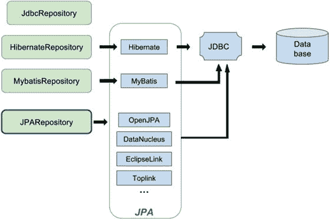

图 5-2.

Repository 类如何与数据库交互

如前所述，数据存储是一种资源。必须妥善管理对资源的访问，以避免出现瓶颈。在软件领域，瓶颈一词指的是多个进程需要访问同一资源的情况，如果对资源的访问管理不当，某些进程最终将永远无法访问该资源。在使用纯 JDBC 访问资源时，数据库由开发者显式管理。Spring 与持久化框架一起，减轻了开发者的这一责任。那么，让我们从使用 Spring 访问数据的最基本方式开始：使用 JDBC Repository 类。

JdbcTemplate 简介

Spring 框架的 JDBC 抽象框架包含四个主要包：`core`、`datasource`、`object` 和 `support`。² 此外还有一个小的 `config` 包，其中包含两个用于配置 Spring JDBC 环境的基础设施 Bean。Spring 通过引入 `org.springframework.jdbc.core.JdbcTemplate` 类（属于 `core` 包）简化了使用 JDBC 与数据库交互时需要编写的代码。这个类隐藏了大量 JDBC 样板代码，并减轻了开发者在连接管理方面的负担，因为数据库连接会自动获取和释放。`datasource` 包包含用于 `DataSource` 管理的工具类，以及一些可用于测试的简单 `DataSource` 实现。`object` 包包含将 RDBMS 查询、更新和存储过程表示为线程安全、可重用对象的类。`support` 包提供了 SQLException 转换功能和一些工具类。异常处理也得到了完善，提供了清晰的异常信息，始终报告根本原因，并且确保即使在失败的情况下也能正确释放资源。`JdbcTemplate` 类是根据模板方法模式设计的，这是一种行为设计模式，它定义了算法的骨架，而具体的实现则在之后定义或委托给子类。³

本节将介绍一个最简单的示例，用以演示如何使用 `JdbcTemplate`。为此，我们需要以下内容：

*   一个包含数据库详细信息的配置文件，我们称之为 db.properties：

```
    #db.properties 内容
    # 用于在内存数据库 H2 中运行应用程序
    driverClassName=org.h2.Driver
    url=jdbc:h2:∼/sample
    username=sample
    password=sample
    ```

*   包含用于初始化数据库结构的 SQL 查询的配置文件：schema.sql（包含用于创建表的 SQL 代码）和 test-data.sql（包含用于向表中填充初始数据的插入语句）。这些文件的内容与本章节无关，但它们是 `05-ps-jdbc-practice` 项目的一部分。

*   一个用于测试数据库的配置类，我们称之为 `TestDataConfig`。这个配置类将包含创建 `dataSource` Bean 所需的所有 Bean。我们将使用一个名为 H2 的内存数据库。以下配置看起来有些复杂，但它提供了定义连接 URL 和访问数据库凭据的可能性。此时，只需将 db.properties 配置文件替换为描述不同类型数据库的文件，应用程序的其余部分仍然可以正常工作。`dataSource` Bean 的类型是 `SimpleDriverDataSource`，这是 `javax.sql.DataSource` 的一个简单的 Spring 特定实现。两个专门的 Spring Bean 用于初始化 `dataSource` Bean（`DataSourceInitializer`）和填充 `dataSource` Bean（`DatabasePopulator`）。

```
package com.ps.config;
import org.springframework.beans.factory.annotation.Value;
import org.springframework.context.annotation.*;
import org.springframework.context.support.PropertySourcesPlaceholderConfigurer;
import org.springframework.core.io.Resource;
import org.springframework.jdbc.core.JdbcTemplate;
import org.springframework.jdbc.datasource.SimpleDriverDataSource;
import org.springframework.jdbc.datasource.init.DataSourceInitializer;
import org.springframework.jdbc.datasource.init.DatabasePopulator;
import org.springframework.jdbc.datasource.init.DatabasePopulatorUtils;
import org.springframework.jdbc.datasource.init.ResourceDatabasePopulator;
@Configuration
@Profile("dev")
@PropertySource("classpath:db/db.properties")
public class TestDataConfig {
@Value("${driverClassName}")
private String driverClassName;
@Value("${url}")
private String url;
@Value("${username}")
private String username;
@Value("${password}")
private String password;
@Bean
public static PropertySourcesPlaceholderConfigurer
propertySourcesPlaceholderConfigurer() {
return new PropertySourcesPlaceholderConfigurer();
}
@Lazy
@Bean
public DataSource dataSource() {
try {
SimpleDriverDataSource dataSource = new SimpleDriverDataSource();
Class driver =
(Class) Class.forName(driverClassName);
dataSource.setDriverClass(driver);
dataSource.setUrl(url);
dataSource.setUsername(username);
dataSource.setPassword(password);
DatabasePopulatorUtils.execute(databasePopulator(), dataSource);
return dataSource;
} catch (Exception e) {
return null;
}
}
@Value("classpath:db/schema.sql")
private Resource schemaScript;
@Value("classpath:db/test-data.sql")
private Resource dataScript;
@Bean
public DataSourceInitializer dataSourceInitializer
(final DataSource dataSource) {
final DataSourceInitializer initializer = new DataSourceInitializer();
initializer.setDataSource(dataSource);
initializer.setDatabasePopulator(databasePopulator());
return initializer;
}
private DatabasePopulator databasePopulator() {
final ResourceDatabasePopulator populator = new ResourceDatabasePopulator();
populator.addScript(schemaScript);
populator.addScript(dataScript);
return populator;
}
@Bean
public JdbcTemplate userJdbcTemplate() {
return new JdbcTemplate(dataSource());
}
}
```


这个配置类你可能看起来很眼熟，因为它已经在[第 2 章](http://link.springer.com/search?facet-content-type=ReferenceWorkEntry&query=2)：Bean 生命周期与配置中介绍过了。不过这里多了一个 bean 声明：`dataSourceInitializer`。这个 bean 使用`DatabasePopulator`实例来读取创建和填充`P_USER`与`P_PET`表所需的脚本。`db/schema.sql`文件包含定义表结构的 SQL DDL 语句。`db/test-data.sql`包含由`databasePopulator`组件执行的 SQL DML 插入语句，用于将数据插入到之前创建的表中。

使用嵌入式数据库的简单版本，如下面的代码片段所示，它利用 Spring JDBC 支持组件（如`EmbeddedDatabaseBuilder`）来创建一个轻量级的内存数据库。

```
package com.ps.config;
import org.springframework.context.annotation.Bean;
import org.springframework.context.annotation.Configuration;
import org.springframework.context.annotation.Profile;
import org.springframework.jdbc.core.JdbcTemplate;
import org.springframework.jdbc.datasource.embedded.EmbeddedDatabaseBuilder;
import org.springframework.jdbc.datasource.embedded.EmbeddedDatabaseType;
@Configuration
@Profile("dev")
public class TestDataConfig {
@Bean
public DataSource dataSource() {
return new EmbeddedDatabaseBuilder()
.setType(EmbeddedDatabaseType.H2)
.addScript("classpath:db/schema.sql")
.addScript("classpath:db/test-data.sql")
.build();
}
@Bean
public JdbcTemplate jdbcTemplate() {
return new JdbcTemplate(dataSource());
}
}
```

等效的配置可以使用 XML 和 JDBC 命名空间来设置。对于无需关心凭证或连接 URL 的嵌入式内存数据库，可以使用`<jdbc:embedded-database .../>`配置：

也可以使用`jdbc:initialize-database .../>`元素和`SimpleDriverDataSource` bean 来设置更复杂的配置，允许从外部配置文件中读取凭证：

*   一个声明待测试仓库 bean 的应用配置类，我们称之为`AppConfig`，并像这样定义它：

```
    @Configuration
    @ComponentScan(basePackages = {"com.ps.repos.impl"})
    public class AppConfig {
    }
    ```

*   一个使用`JdbcTemplate`类型 bean 来访问数据库的仓库 bean：`JdbcTemplateUserRepo`

```
    package com.ps.repos.impl;
    import com.ps.ents.User;
    // 定义 User 特定方法的接口
    // 由仓库实现
    import com.ps.repos.UserRepo;
    import org.springframework.beans.factory.annotation.Autowired;
    import org.springframework.jdbc.core.JdbcTemplate;
    import org.springframework.jdbc.core.RowMapper;
    import org.springframework.stereotype.Repository;
    import java.sql.ResultSet;
    import java.sql.SQLException;
    import java.util.HashSet;
    import java.util.Set;
    @Repository("userTemplateRepo")
    public class JdbcTemplateUserRepo implements UserRepo {
    private RowMapper rowMapper = new UserRowMapper();
    protected JdbcTemplate jdbcTemplate;
    @Autowired
    public JdbcTemplateUserRepo(JdbcTemplate jdbcTemplate) {
    this.jdbcTemplate = jdbcTemplate;
    }
    @Override
    public User findById(Long id) {
    String sql = "select id, email, username, password from p_user where id= ?";
    return jdbcTemplate.queryForObject(sql, rowMapper, id);
    }
    ... // 其他仓库方法
    /**
    * 将对 P_USER 表执行查询返回的行映射到 com.ps.ents.User 对象。
    */
    private class UserRowMapper implements RowMapper {
    public User mapRow(ResultSet rs, int rowNum) throws SQLException {
    Long id = rs.getLong("ID");
    String email = rs.getString("EMAIL");
    String username = rs.getString("USERNAME");
    String password = rs.getString("PASSWORD");
    User user = new User();
    user.setId(id);
    user.setUsername(username);
    user.setEmail(email);
    user.setPassword(password);
    return user;
    }
    }
    }
    ```

在软件应用中，数据被管理为称为实体或领域对象的对象。实体类由开发者编写，其字段与数据库表中的列相匹配。前面代码片段中展示的`UserRowMapper`内部类正是用于此目的，稍后在本节中会更详细地介绍它。

*   一个测试类：`TestJdbcTemplateUserRepo`

```
    @RunWith(SpringJUnit4ClassRunner.class)
    @ContextConfiguration(classes = {TestDataConfig.class, AppConfig.class})
    @ActiveProfiles("dev")
    public class TestJdbcTemplateUserRepo {
    @Autowired
    @Qualifier("userTemplateRepo")
    UserRepo userRepo;
    @Before
    public void setUp() {
    assertNotNull(userRepo);
    }
    @Test
    public void testFindById() {
    User user = userRepo.findById(1L);
    assertEquals("John", user.getUsername());
    }
    @Test
    public void testNoFindById() {
    User user = userRepo.findById(99L);
    assertEquals("John", user.getUsername());
    }
    }
    ```

这个测试类很简单，它通过 ID 查找用户对象。`testFindById`方法通过测试，而`testNoFindById`测试未通过，该方法将在关于 Spring 数据访问异常的章节中详细讨论。这里，该方法是不完整的，缺少了`expected`属性，因为目前这超出了讨论范围。

要创建一个`JdbcTemplate` bean，需要一个`dataSource`来访问数据库记录。每个仓库 bean 都会将这个 bean 作为依赖，并在调用`JdbcTemplate` bean 方法时使用它来操作数据，如下面的代码片段所示：

```
String sql = "select id, email, username,password from p_user where id= ?";
jdbcTemplate.queryForObject(sql, rowMapper, id);
```

接下来，Spring 在后台执行以下步骤序列：

1.  获取数据库连接。

2.  获取或创建一个事务，以便在事务环境中执行语句。在前面的例子中，没有使用`@Transactional`声明式或编程式定义的事务支持。这两种方式都将在本章后面介绍。

3.  执行语句。


4.  使用`RowMapper`实例处理`ResultSet`并将其转换为实体对象。

5.  处理异常。

6.  释放数据库连接。

运行此测试类的方法时，我们感兴趣的是后台发生了什么，这是因为无需为连接管理编写任何代码。之前已经提到，Spring 会处理这些，但最好能有实际的证明，对吧？为了能够看到这个过程，可以通过添加以下行来自定义`logback-test.xml`文件，以显示 Spring JDBC 的详细日志：

在查看测试类运行时生成的日志之前，必须先说明到目前为止所提及文件的存放位置，你可以在图 5-3 中看到。

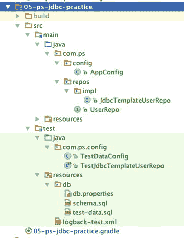

图 5-3.

05-ps-jdbc-practice 项目中文件的位置

该项目具有 Maven 所确立的典型 Java 项目结构，`*sql, *xml, *.properties` 是资源文件，因此它们存储在项目的`test`或`main`模块的`resources`目录中。

通过运行`TestJdbcTemplateUserRepo.testFindById()`方法（使用前面提到的日志设置），如果你扫描日志，将会发现以下行：

```
#booting up environment
... creating beans ...
DEBUG o.s.j.d.DataSourceUtils - Fetching JDBC Connection from DataSource
DEBUG o.s.j.d.SimpleDriverDataSource - Creating new JDBC Driver Connection
to [jdbc:h2:sample]
DEBUG o.s.j.d.i.ScriptUtils - Executing SQL script from class path
resource [db/schema.sql]
... listing SQL scripts ...
INFO o.s.j.d.i.ScriptUtils - Executed SQL script from class path
resource [db/schema.sql] in 23 ms.
INFO o.s.j.d.i.ScriptUtils - Executing SQL script from class path
resource [db/test-data.sql]
... listing SQL scripts ...
INFO o.s.j.d.i.ScriptUtils - Executed SQL script from class path
resource [db/test-data.sql] in 5 ms.
DEBUG o.s.j.d.DataSourceUtils - Returning JDBC Connection to DataSource
#executing the test
DEBUG o.s.j.c.JdbcTemplate - Executing prepared SQL query
DEBUG o.s.j.c.JdbcTemplate - Executing prepared SQL statement
[select id, email, username,password from p_user where id= ?]
DEBUG o.s.j.d.DataSourceUtils - Fetching JDBC Connection from DataSource
DEBUG o.s.j.d.SimpleDriverDataSource - Creating new JDBC Driver Connection
to [jdbc:h2:sample]
DEBUG o.s.j.d.DataSourceUtils - Returning JDBC Connection to DataSource
...
```

基本上，每次调用`JdbcTemplate`方法时，都会自动打开一个连接用于执行查询，然后释放同一个连接，所有这些神奇的操作都由 Spring 工具类`org.springframework.jdbc.datasource.DataSourceUtils`完成。这个类是抽象的，由`JdbcTemplate`以及将在后续章节中介绍的事务管理器类在内部使用。

到目前为止所描述的，使用 Spring 的`JdbcTemplate`适用于为学术用途设计的小型应用程序。当你需要摆脱传统的 JDBC 时，就可以使用它。在企业级应用程序中，很可能需要事务，因此必须向组合中添加更多的 Spring 组件。事务处理将在稍后介绍，但在此之前，让我们看看在使用`JdbcTemplate` bean 与数据库通信期间发生意外事件时会发生什么。

使用 JdbcTemplate 进行查询

`JdbcTemplate`为开发者提供了多种方法来查询实体（也称为领域对象）、通用映射、列表以及简单类型（long、int、String）。`JdbcTemplate`方法使用包含`'?'`占位符的查询来绑定参数和变量。它利用可变参数和自动装箱的优势来简化`JdbcTemplate`的使用。但也可以使用没有任何绑定变量的简单查询。以下示例使用查询来统计`p_user`表中的所有用户，并返回一个整数。

```
public int countUsers() {
String sql = "select count(*) from p_user";
return jdbcTemplate.queryForObject(sql, Integer.class);
}
```

这里使用的`queryForObject`方法不需要`RowMapper`对象，因为结果是 Integer 类型的数字。结果的类型也作为参数提供给该方法。在 Spring 3.2.2 版本中，此方法取代了诸如`queryForInt`和`queryForLong`之类的专用方法。以下代码片段展示了这些方法在 3.2.2 版本（它们被弃用时）之前的使用示例：

```
public int countUsers() {
String sql = "select count(*) from p_user";
return jdbcTemplate.queryForInt(sql);
}
public Long findIdByUsername(String username) {
String sql = "select id from p_user where username = ?";
return jdbcTemplate.queryForLong(sql, username);
}
```

有时可能需要以不同于实体的格式从表中提取记录。`JdbcTemplate`提供了一个名为`queryForMap`的方法，该方法从`ResultSet`中提取一行作为`Map<String,Object>`。

```
public Map findByIdAsMap(Long id) {
String sql = "select * from p_user where id= ?";
return jdbcTemplate.queryForMap(sql, id);
}
```

此方法返回的映射包含列名与列值的键值对。示例：

```
{
ID=1,
FIRST_NAME=null,
USERNAME=John,
LAST_NAME=null,
PASSWORD=test,
ADDRESS=null,
EMAIL=john@pet.com
}
```

`queryForList`与前面的方法功能相同，但适用于包含多行的`ResultSet`实例。此方法返回一个`List<Map<String, Object>>`对象，每个映射包含`ResultSet`中的一行。

```
public List> findAllAsMaps() {
String sql = "select * from p_user";
return jdbcTemplate.queryForList(sql);
}
```

示例输出：

```
[
{
ID=1,
FIRST_NAME=null,
USERNAME=John,
LAST_NAME=null,
PASSWORD=test,
ADDRESS=null,
EMAIL=john@pet.com
},
{
ID=2,
FIRST_NAME=null,
USERNAME=Mary,
LAST_NAME=null,
PASSWORD=test,
ADDRESS=null,
EMAIL=mary@pet.com
}
]
```

这两种方法可用于测试和审计。

第一个使用`JdbcTemplate`的示例返回一个实体对象（也称为领域对象）。为了将表记录转换为领域对象，Spring 提供了`org.springframework.jdbc.core.RowMapper<T>`接口。应该为应用程序中的每个实体类型实现此接口，因为返回实体的`JdbcTemplate`方法需要将实现类型的对象作为参数。`RowMapper`对象通常是无状态的，因此为每个仓库类创建一个并将其用作从表记录到 Java 对象的转换器是一种很好的做法。

Spring 使用回调方法将`ResultSet`的内容转换为领域对象。`JdbcTemplate`实例首先执行查询并填充`ResultSet`；然后调用作为参数传入的`RowMapper`实例的`mapRow`方法。如果`ResultSet`包含多个表行，则对每一行调用该方法。


```
@Repository("userTemplateRepo")
public class JdbcTemplateUserRepo implements UserRepo {
private RowMapper rowMapper = new UserRowMapper();
protected JdbcTemplate jdbcTemplate;
public Set findAll() {
String sql = "select id, username, email, password from p_user";
return new HashSet(jdbcTemplate.query(sql, rowMapper));
}
...
class UserRowMapper implements RowMapper {
public User mapRow(ResultSet rs, int rowNum) throws SQLException {
Long id = rs.getLong("ID");
String email = rs.getString("EMAIL");
String username = rs.getString("USERNAME");
String password = rs.getString("PASSWORD");
User user = new User();
user.setId(id);
user.setUsername(username);
user.setEmail(email);
user.setPassword(password);
return user;
}
}
}
```

该接口是泛型的，应以仓库管理的领域对象类型作为参数。通常，它被声明为仓库的内部类，但当多个仓库管理同一类型的领域对象时，可以将其声明为顶层类。然而，正如你所注意到的，将`ResultSet`转换为领域对象或领域对象集合的代码必须由开发者编写。当使用 ORM（对象关系映射）时，这也将不再必要。但关于这一点，我们稍后再谈。

到目前为止，只介绍了返回某种结果的`JdbcTemplate`方法。现在正适合介绍一个不返回结果的执行示例。`JdbcTemplate`类中执行查询但不返回结果的最重要方法名为`query`。该方法是多态的，⁴其方法签名根据查询结果的目的而有所不同。

Spring 提供了`org.springframework.jdbc.core.``RowCallbackHandler`接口，可以实现该接口将查询返回的行流式输出到文件、将其转换为 XML，或在将其添加到集合之前进行过滤。该类型的实例与查询参数（如有必要）一起提供给`query`方法，`JdbcTemplate`将相应地使用它。在下面的代码片段中，展示了该接口的代码。

```
public interface RowCallbackHandler {
void processRow(ResultSet rs) throws SQLException;
}
```

`JdbcTemplate`使用该方法的实现来处理`ResultSet`行，具体实现由开发者完成。异常由`JdbcTemplate`实例捕获和处理。在下面的代码片段中，`JdbcTemplate`实例使用`HTMLUserRowCallbackHandler`从`p_user`表中提取所有名为“John”的用户，将结果行写入 HTML，并打印到控制台。

```
...
import org.springframework.jdbc.core.RowCallbackHandler;
public class JdbcTemplateUserRepo implements UserRepo {
private class HTMLUserRowCallbackHandler
implements RowCallbackHandler {
private PrintStream out;
public HTMLUserRowCallbackHandler(PrintStream out) {
this.out = out;
}
@Override
public void processRow(ResultSet rs)
throws SQLException {
StringBuilder htmlSb =
new StringBuilder("user ID: " + rs.getLong("ID") + "\n")
.append("username: " + rs.getString("USERNAME") + "\n")
.append("email: " + rs.getString("EMAIL") + "");
out.print(htmlSb.toString());
}
}
public void htmlAllByName(String name) {
String sql = "select id, username, email from p_user where username= ?";
jdbcTemplate.query(sql, new HTMLUserRowCallbackHandler(System.out), name );
}
...
}
```

运行此方法时，在所有 Spring 日志的末尾，我们还会在控制台中看到以下内容：

```
user ID: 1
username: John
email: john@pet.com
```

如果`ResultSet`包含多行，`JdbcTemplate`实例将使用`HTMLUserRowCallbackHandler.processRow`方法处理每一行。

Spring 还提供了通过`org.springframework.jdbc.core.ResultSetExtractor<T>`一次性处理整个`ResultSet`并将其转换为对象的功能。当结果从多个表中提取，但必须在应用程序中作为单个对象处理时，此功能非常有用。开发者负责迭代`ResultSet`，并使用映射到数据库条目的其他对象设置对象的属性。该接口可按类型参数化。

```
public interface ResultSetExtractor {
T extractData(ResultSet rs) throws SQLException, DataAccessException;
}
```

下面的代码片段展示了使用`UserWithPetsExtractor`从`p_user`表中按 ID 提取用户，同时从`p_pet`表中提取宠物，并创建一个包含与该用户关联的`Pet`对象列表的`User`类型对象。

```
...
import org.springframework.jdbc.core.ResultSetExtractor;
@Repository("userTemplateRepo")
public class JdbcTemplateUserRepo implements UserRepo {
...
@Override
public User findByIdWithPets(Long id) {
String sql = "select u.id id," +
" u.username un," +
" u.email email, " +
"p.id pid, " +
"p.name pname," +
" p.age age," +
" p.pet_type pt" +
" from p_user u, p_pet p where u.id=p.owner and u.id=" + id;
return jdbcTemplate.query(sql, new UserWithPetsExtractor());
}
private class UserWithPetsExtractor implements
ResultSetExtractor {
@Override
public User extractData(ResultSet rs) throws SQLException,
DataAccessException {
User user = null;
while (rs.next()) {
if (user == null) {
user = new User();
// 设置内部实体标识符（主键）
user.setId(rs.getLong("ID"));
user.setUsername(rs.getString("UN"));
user.setEmail(rs.getString("EMAIL"));
}
Pet p = new Pet();
p.setId(rs.getLong("PID"));
p.setName(rs.getString("PNAME"));
p.setAge(rs.getInt("AGE"));
p.setPetType(PetType.valueOf(rs.getString("PT")));
user.addPet(p);
}
return user;
}
}
// findByIdWithPets() 的测试方法
@Test
public void testExtractor(){
User user = userRepo.findByIdWithPets(1L);
assertEquals(2, user.getPets().size());
}
```

关于`JdbcTemplate`，你需要了解的大致就是这些，这样你就可以在代码中正确使用它了。总结如下：

*   `JdbcTemplate`使用`'?'`占位符指定参数的查询。
*   当预期查询执行将返回单个结果时，使用`queryForObject`。
*   当`ResultSet`的每一行映射到一个领域对象时，使用`RowMapper<T>`。
*   当不应返回任何值时，使用`RowCallbackHandler`。
*   当`ResultSet`中的多行映射到单个对象时，使用`ResultSetExtractor<T>`。

使用 NamedParameterJdbcTemplate 进行查询

除了`JdbcTemplate`类，Spring 还提供了另一个用于执行带命名参数查询的模板类：

`org.springframework.jdbc.core.namedparam.NamedParameterJdbcTemplate`。该类提供了与`JdbcTemplate`类似的方法，这些方法需要一个包含命名参数及其值对的映射作为参数。⁵一旦命名参数被替换为值，调用将在后台委托给一个`JdbcTemplate`实例。这两个类之间的关系如图 5-4 所示。

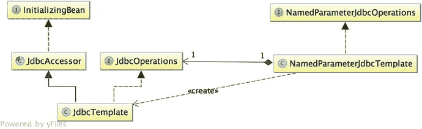

图 5-4.

JdbcTemplate 与 NamedParameterJdbcTemplate 之间的关系

如果你查看`NamedParameterJdbcTemplate`的代码，⁶你会看到以下内容：


```
...
public class NamedParameterJdbcTemplate
implements NamedParameterJdbcOperations {
...
/** 我们正在封装的 JdbcTemplate */
private final JdbcOperations classicJdbcTemplate;
...
/**
* 暴露经典的 Spring JdbcTemplate，以允许调用
* 不太常用的方法。
*/
@Override
public JdbcOperations getJdbcOperations() {
return this.classicJdbcTemplate;
}
...
}
```

因此，`JdbcTemplate` 通过 `getJdbcOperations` 方法暴露给开发者，传统的 `JdbcTemplate` 也可以被调用。

在下面的代码片段中，你可以比较使用两种 JDBC 模板类编写的 `findById` 方法：

```
//使用 JdbcTemplate
public User findById(Long id) {
String sql = "select id, email, username,password from p_user where id= ?";
return jdbcTemplate.queryForObject(sql, rowMapper, id);
}
//使用 NamedParameterJdbcTemplate
public User findById(Long id) {
String sql = "select id, email, username,password from p_user where id= :id";
Map params = new HashMap();
params.put("id", id);
return jdbcNamedTemplate.queryForObject(sql, params, rowMapper);
}
```

在编写应用程序时，使用 `JdbcTemplate` 还是 `NamedParameterJdbcTemplate` 由你决定。但请考虑这一点：命名查询更易于阅读且更安全，因为将值赋给错误参数的可能性很小。

除了 `SELECT` 查询，`JdbcTemplate` 还可以使用 `update` 方法执行 `INSERT`、`UPDATE` 和 `DELETE` 操作。这个方法也是多态的⁷，可以带参数或不带参数调用。它返回一个整数，表示受影响的行数。下面你可以看到每种操作的代码片段：

*   `INSERT`：下面的 `createUser` 方法插入一个新用户

```
    // JdbcTemplateUserRepo.java
    public int createUser(Long userId, String username, String password,
    String email) {
    return jdbcTemplate.update(
    "insert into p_user(ID, USERNAME, PASSWORD, EMAIL)"+
    " values(?,?,?,?)",
    userId, username, password, email
    );
    }
    ...
    public Set findAllByUserName(String username,
    boolean exactMatch) {
    String sql = "select id, username, email, password from p_user where ";
    if (exactMatch) {
    sql += "username= ?";
    } else {
    sql += "username like ’%’ || ? || ’%’";
    }
    return new HashSet(jdbcTemplate.query(sql,
    new Object{username}, rowMapper));
    }
    // TestJdbcTemplateUserRepo.java 中的测试方法
    @Test
    public void testCreate(){
    int result = userRepo.createUser(5L, "Diana", "mypass",
    "diana@opympus.com");
    assertEquals(1, result);
    Set dianas = userRepo.findAllByUserName("Diana", true);
    assertTrue(dianas.size() == 1);
    }
    ```

*   `UPDATE`：下面的方法通过用户 ID 更新其密码。

```
    // JdbcTemplateUserRepo.java
    public int updatePassword(Long userId, String newPass) {
    String sql = "update p_user set password=? where ID = ?";
    return jdbcTemplate.update(sql, newPass, userId);
    }
    // TestJdbcTemplateUserRepo.java 中的测试方法
    @Test
    public void testUpdate(){
    int result  = userRepo.updatePassword(1L, "newpass");
    assertEquals(1, result);
    }
    ```

*   `DELETE`：下面的方法通过用户 ID 删除用户。

```
    // JdbcTemplateUserRepo.java
    public int deleteById(Long userId) {
    return jdbcTemplate.update(
    "delete from p_user where id =? ",
    userId);
    }
    // TestJdbcTemplateUserRepo.java 中的测试方法
    @Test
    public void testDelete(){
    int result  = userRepo.deleteById(4L);
    assertEquals(1, result);
    }
    ```

DML 代表数据操作语言，到目前为止介绍的数据库操作都属于该语言，命令 `SELECT`、`INSERT`、`UPDATE` 和 `DELETE` 是用于从现有表中创建、更新或删除数据的数据库语句。

DDL 代表数据定义语言，属于该语言的数据库操作用于操作数据库对象：表、视图、游标等。DDL 数据库语句可以使用 `JdbcTemplate` 的 `execute` 方法执行。下面的代码片段描述了如何使用 `JdbcTemplate` 实例创建表。创建后，会执行一个查询来统计表中的记录数。如果表创建成功，查询将成功执行并返回 0。⁸

```
// JdbcTemplateUserRepo.java
public int createTable(String name) {
jdbcTemplate.execute("create table " + name +
" (id integer, name varchar2)" );
String sql = "select count(*) from " + name;
return jdbcTemplate.queryForObject(sql, Integer.class);
}
// TestJdbcTemplateUserRepo.java 中的测试方法
@Test
public void testCreateTable(){
int result = userRepo.createTable("new_p_user");
// 表存在但为空
assertEquals(0, result);
}
```

但事情并不总是一帆风顺，有时会抛出异常。下一节将介绍在这种意外情况下可以采取的措施以及用于妥善处理该情况的相关组件。

Spring 数据访问异常

在使用数据源时，有几种特殊情况会导致问题：有时，操作可能针对不再存在的记录进行调用；有时，由于某些数据库限制，无法创建记录；有时，数据库响应时间过长；等等。在纯 JDBC 中，总是抛出相同类型的受检异常 `java.sql.SQLException`，并且在其消息中包含一个 SQL 代码，开发人员必须识别并相应处理该代码。

Spring 提供了一个庞大的数据访问异常家族。所有这些异常都是 Java `RuntimeException` 的子类，并为开发人员提供了一种实用的方法来处理数据库访问异常，而无需了解数据访问 API 的细节。`JdbcTemplate` 实例在幕后使用一个实现 `org.springframework.jdbc.support.SQLExceptionTranslator` 类型的基础设施 bean，负责将晦涩难懂的 `java.sql.SQLExceptions` 转换为清晰简洁的 `org.springframework.dao.DataAccessException` 实现⁹。Spring 数据访问异常是非受检的，并包含可读性强的消息，能精确定位问题的原因。有一些转换器组件可用于将任何类型的数据访问异常转换为 Spring 特定的异常，这在从一种数据库类型迁移到另一种数据库类型时非常有用。Spring 数据访问异常层次结构的简化版本如图 5-5 所示。

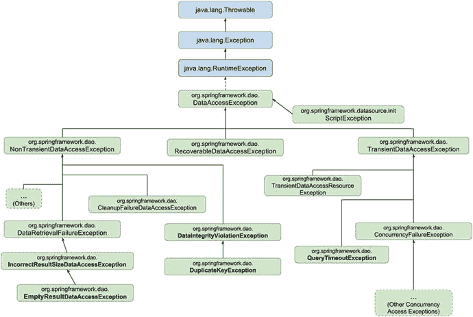

图 5-5.

Spring 数据访问异常层次结构

`java.sql.SQLException` 是一种受检异常，它强制开发人员捕获并处理它，或者声明它在调用方法调用层次结构中被抛出。这种类型的异常是通用的，每次数据库错误都会抛出。这引入了一种紧耦合形式。

在 Spring 中，数据访问异常是非受检的（它们扩展了 `java.lang.RuntimeException`，这就是为什么在前面的图中该类以红色边框显示），并且可以在方法调用层次结构中向上抛出，直到到达最适合处理它们的位置。Spring 数据访问异常隐藏了用于与数据库通信的技术。当使用 `JdbcTemplate`、JPA、Hibernate 等时，会抛出这些异常。这很可能就是它们属于 `spring-tx` 模块的原因。

正如你从图 5-5 中注意到的，Spring 数据访问异常家族有三个主要分支：


*   被视为**非瞬态**的异常，这意味着除非根本原因被修复，否则重试操作将会失败。该层次结构的父类是 `org.springframework.dao.NonTransientDataAccessException`。最明显的例子是搜索一个不存在的对象。在搜索的用户存在之前，重试此查询都会失败。下面的代码片段搜索了一个不存在的用户。其下方是控制台日志中描述异常类型和消息的片段。

```
    // TestJdbcTemplateUserRepo.java 中的测试方法
    @Test
    public void testNoFindById() {
    User user = userRepo.findById(99L);
    assertEquals("Darius", user.getUsername());
    }
    #来自控制台的日志
    org.springframework.dao.EmptyResultDataAccessException:
    Incorrect result size: expected 1, actual 0
    ```

显然，此测试将会失败，直到在 `p_user` 表中找到 ID 为 99 且用户名为 Darius 的用户。

*   `org.springframework.dao.RecoverableDataAccessException`
    在执行某些恢复步骤（通常是关闭当前连接并使用新连接）后，先前失败的操作可能会成功时抛出。当数据库与应用位于不同计算机上，且由于临时网络故障导致数据库连接失败时，这种异常类型非常有用。可以捕获该异常，并在网络恢复后重试查询，此时执行将在新连接上成功。

*   被视为**瞬态**的异常，它们继承自抽象类 `org.springframework.dao.TransientDataAccessException`，这意味着无需任何干预，重试操作就可能成功。这些是并发或延迟异常。例如，当查询执行过程中因网络连接不良导致数据库不可用时，会抛出类型为 `QueryTimeoutException` 的异常。开发者可以通过重试查询来处理此异常。

第四个分支仅包含一种异常类型，当使用类型为 `DataSourceInitializer` 的 Bean 初始化测试数据库因脚本错误而失败时使用；因此该异常类型被命名为 `ScriptException`。这就是关于 Spring 数据访问异常的全部内容。听起来很简单，对吧？

!

如果你想测试自己对目前所介绍的 Spring `JdbcTemplate` 及相关组件的理解，可以打开 `05-ps-jdbc-practice project` 并尝试完成其中的 TODO 任务。有三个任务是必须完成的，还有一个是奖励任务，供你非常喜欢本节内容并乐于实践时完成。缺失的部分用 TODO 任务标记，在 Intellij IDEA 的 TODO 视图中可见。

任务 TODO 27 位于 `TestJdbcTemplateUserRepo` 类中，要求你完成一个搜索不存在用户的负面测试方法的主体。该测试应能通过。要查看数据库中存在的用户 ID，请检查 `05-ps-jdbc-practice/src/test/resources/db/test-data.sql` 文件。

任务 TODO 28 位于 `TestJdbcTemplateUserRepo` 类中，要求你完成一个统计数据库中用户数量的测试方法的主体。

任务 TODO 29 位于 `JdbcNamedTemplateUserRepo` 中，要求你完成仓库方法的主体。你可以使用 `jdbcNamedTemplate` Bean，或者通过 `jdbcNamedTemplate.getJdbcOperations()` 访问底层的 `JdbcTemplate`。

奖励任务 TODO 30 位于测试类 `TestNamedJdbcTemplateUserRepo` 中，如果你决定完成它，它将帮助你测试通过完成 TODO 29 所实现的方法。

如果遇到困难，你可以查看 `05-ps-jdbc-solution` 项目中提供的解决方案。

事务环境中的数据访问配置

到目前为止，我们讨论的是在非事务环境中使用 Spring 进行数据访问，这意味着执行查询时，会获取一个连接，执行查询，然后释放连接。然而，在企业级应用中，需要将某些 SQL 操作分组，以便当其中一个操作失败时，同一组中先前查询的所有结果都应回滚，以避免数据库处于不一致状态。一组 SQL 操作的执行上下文称为**事务**，它具有以下属性：

*   **原子性**是事务的主要属性，也是前面提到的特性：如果事务中的一个操作失败，整个事务失败，数据库保持不变。当事务中的所有操作都成功时，所有更改在事务提交时保存到数据库中。基本上就是“要么全做，要么全不做”。

*   **一致性**意味着每个事务都应将数据库从一个有效状态转变为另一个有效状态。

*   **隔离性**意味着当多个事务并行执行时，它们不会相互妨碍或以任何方式相互影响。一组事务并行执行后的数据库状态，应与该组事务顺序执行后的状态相同。

*   **持久性**是事务的一个属性，即使在底层系统发生断电、崩溃和其他错误的情况下，事务也应持续存在。¹⁰

在事务环境中，必须管理事务。在 Spring 中，这是由一个名为**事务管理器**的基础设施 Bean 来完成的。事务管理器 Bean 的配置是环境变化时唯一需要更改的内容。有四种基本类型：

1.  **本地 JDBC Spring 环境**：一种本地 JDBC 配置，声明一个要使用的基本数据源（即使是嵌入式数据源也可以），以及一个类型为 `org.springframework.jdbc.datasource.DataSourceTransactionManager` 的 Bean，这是一个 Spring 特定的实现。使用的连接可以来自连接池，事务管理器 Bean 将根据配置的行为将连接关联到事务。配置事务行为是通过在方法上添加 `@Transactional` 注解以声明方式完成的。为了确保事务行为，也必须在仓库类上使用此注解。如果没有 ORM，则必须使用类型为 `JdbcTemplate` 的组件在仓库层执行查询。所有这些将在本章后面详细说明。此配置的抽象模式如图 5-6 所示。

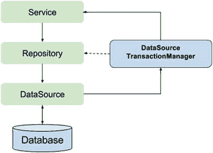

图 5-6. Spring 本地 JDBC 配置抽象模式

2.  **本地 Hibernate Spring 环境**：一种本地 Hibernate 配置，声明一个要使用的基本数据源（即使是嵌入式数据源也可以），以及一个类型为 `org.springframework.orm.hibernate5.HibernateTransactionManager` 的 Bean，这是一个 Spring 特定的实现，它使用由类型扩展自 `org.springframework.orm.hibernate5.LocalSessionFactoryBean` 的基础设施 Bean 创建的 Hibernate 会话对象，在事务上下文中管理实体。此配置的抽象模式如图 5-7 所示。

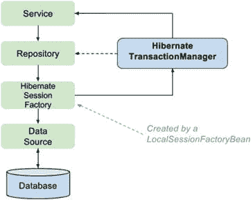

图 5-7. Spring 本地 Hibernate 配置抽象模式


3.  **本地 JPA Spring 环境**：一种本地配置，声明了一个要使用的基本数据源（即使是嵌入式数据源也可以），以及一个类型为 `org.springframework.orm.jpa.JpaTransactionManager` 的 Bean。这是一个 Spring 特定的实现，它使用由类型为 `org.springframework.orm.jpa.LocalContainerEntityManagerFactoryBean` 的基础设施 Bean 创建的实体管理器对象，在事务上下文中管理实体。此配置的抽象模式如图 5-8 所示。要创建 `LocalContainerEntityManagerFactoryBean` Bean，需要一个持久化管理器和一个 JPA 适配器 Bean。这些可以由 Hibernate、Apache OpenJPA 或任何其他 Spring 支持的持久化框架提供。

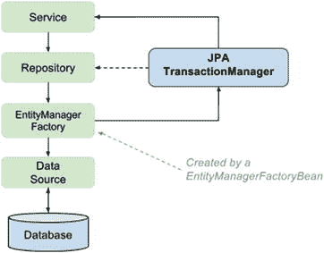

图 5-8.

Spring 本地 JPA 配置抽象模式

4.  **企业级 JTA Spring 环境**：此设置需要一个应用服务器，该服务器将使用 JNDI 配置并提供一个数据源 Bean。Spring 将加载一个类型扩展自 `org.springframework.transaction.jta.JtaTransactionManager` 的 Bean，该 Bean 特定于所使用的应用服务器。此事务管理器适用于处理分布式事务（即跨多个资源的事务），以及控制应用服务器资源上的事务。此配置的抽象模式如图 5-9 所示。

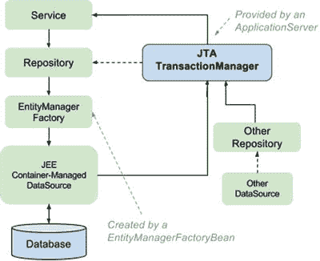

图 5-9.

企业级 JTA Spring 环境

**Spring 中事务管理的工作原理**

在上一节中，一个仓库类使用 `JdbcTemplate` 在连接内执行方法。为了引入事务，我们需要一个服务类，它将在事务上下文中调用仓库方法。图 5-10 描述了本节所涵盖示例的抽象 UML 时序图。图中的图表仅提到了 `findById(...)` 方法，但涉及管理数据库存储信息的每个服务方法的调用序列都是相同的。

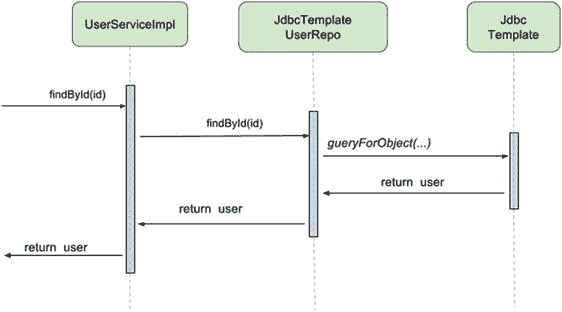

图 5-10.

服务类的 UML 调用图

Spring 在底层利用前一章介绍的框架 AOP 来实现事务管理，这是因为事务是一个横切关注点。基本上，对于每个必须在事务中执行的方法，都需要在执行前获取或打开一个事务，并在执行后提交它。对于具有必须在事务上下文中执行的方法的 Bean，会创建 AOP 代理，这些代理将方法包装在一个 `Around` 通知中，该通知负责在调用方法前获取事务，并在之后提交事务。AOP 代理为此使用两个基础设施 Bean：一个 `org.springframework.transaction.interceptor.TransactionInterceptor` 与一个 `org.springframework.transaction.PlatformTransactionManager` 的实现配合使用。Spring 为事务管理支持提供了一个灵活且强大的抽象层。其核心是 `PlatformTransactionManager` 接口。可以使用任何受支持的事务管理器提供程序框架。JTA 提供程序也可以使用，并且这不会影响应用程序的其余类。最常见的事务管理提供程序有：

*   `DataSourceTransactionManager`，Spring 基本事务管理提供程序类；
*   `HibernateTransactionManager`，当使用 Hibernate 进行持久化支持时；
*   `JpaTransactionManager`，当使用实体管理器进行持久化支持时；
*   `JtaTransactionManager`，用于将事务管理委托给 Java EE 服务器。也可以与 Atomikos 一起使用，从而无需应用服务器。¹¹
*   `WebLogicJtaTransactionManager`，由 WebLogic 应用服务器提供的事务支持。
*   等等。

从概念上讲，调用事务方法时发生的情况如图 5-11 所示。

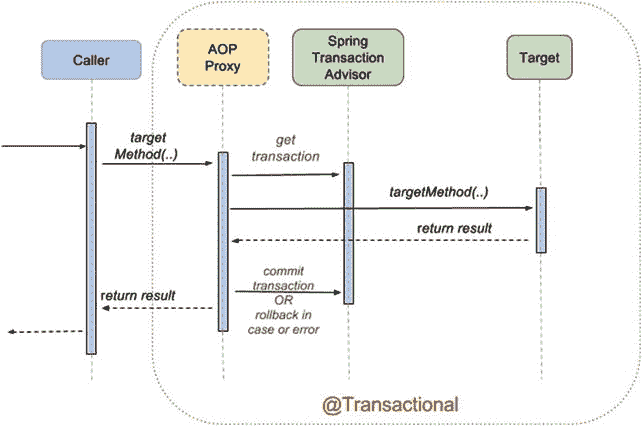

图 5-11.

事务操作的概念性 UML 时序图

需要在事务上下文中执行的方法使用 Spring 的 `@Transactional` 注解进行标注。这些方法的主体是一个不可再分的功能单元。Spring 官方教程将这些方法称为 `atomic units of work`。你可能还记得 AOP 章节的内容，此注解只能用于公共方法；否则，事务代理将无法应用事务行为。当创建应用程序上下文并通过配置启用对此注解的支持时（这将在下一节中介绍），底层会发生以下情况：一个类型为 `org.springframework.aop.framework.autoproxy.InfrastructureAdvisorAutoProxyCreator` 的内部基础设施 Spring 特定 Bean 被注册，并充当一个 Bean 后处理器，修改服务和仓库 Bean 以添加事务特定逻辑。基本上，这个 Bean 就是创建事务 AOP 代理的 Bean。

**配置事务支持**

为上一节中介绍的应用程序添加事务管理的最简单方法是执行以下操作：

*   **配置事务管理支持**：添加一个类型为 `org.springframework.jdbc.datasource.DataSourceTransactionManager` 的 Bean 声明。使用 XML 并通过 `<tx:annotation-driven ../>`（使用事务 XML 配置时要小心，因为忘记此元素是一个常见错误）配置元素（由 `tx` 命名空间提供）来激活它很容易。

上述配置声明了一个名为 `transactionManager` 的 Bean，并使用 `<tx:annotation-driven ../>` 将其设置为应用程序的通用事务管理器。或者使用一个配置类：

```
    public class TestDataConfig {
    ...
    @Bean
    public PlatformTransactionManager txManager(){
    return new DataSourceTransactionManager(dataSource());
    }
    }
    ```

然后我们使用 `@EnableTransactionManagement` 来激活它：

```
    import org.springframework.transaction.annotation.EnableTransactionManagement;
    @Configuration
    @EnableTransactionManagement
    @ComponentScan(basePackages = {"com.ps.repos.impl", "com.ps.services.impl"})
    public class AppConfig {
    }
    ```

*   **声明事务方法**：编写一个服务类，其中包含将在事务中调用 `UserRepo` Bean 方法的方法。要在事务中执行的方法必须使用 Spring 的 `@Transaction` 注解进行标注。由于事务行为必须传播到仓库，因此仓库类或方法也使用 `@Transactional` 进行标注。

```
    import org.springframework.stereotype.Service;
    import org.springframework.transaction.annotation.Transactional;
    @Service
    public class UserServiceImpl implements UserService {
    private UserRepo userRepo;
    @Autowired
    public UserServiceImpl(UserRepo userRepo) {
    this.userRepo = userRepo;
    }
    @Transactional
    @Override
    public User findById(Long id) {
    return userRepo.findById(id);
    }
    }
    ```

CC


`@EnableTransactionManagement` 和 `<tx:annotation-driven ../>` 都启用了支持事务执行所需的所有基础设施 Bean。但它们之间存在细微差别。XML 配置元素可以这样使用：`<tx:annotation-driven />`，无需 `transaction-manager` 属性。在这种情况下，Spring 默认会查找名为 `transactionManager` 的 Bean，如果找不到，应用程序将无法启动。`@EnableTransactionManagement` 则更加灵活；它会查找任何实现了 `org.springframework.transaction.PlatformTransactionManager` 接口的 Bean，因此名称并不重要。如果必须明确指定默认事务管理器 Bean，可以通过让标注了 `@EnableTransactionManagement` 的配置类实现 `org.springframework.transaction.annotation.TransactionManagementConfigurer` 接口，并为 `annotationDrivenTransactionManager` 方法提供实现来声明默认事务管理器。

```
import org.springframework.transaction.annotation.TransactionManagementConfigurer;
...
@EnableTransactionManagement
@Configuration
public class AppConfig implements TransactionManagementConfigurer {
...
@Bean
public PlatformTransactionManager txManager(){
return new DataSourceTransactionManager(dataSource());
}
@Overrride
public PlatformTransactionManager annotationDrivenTransactionManager() {
return txManager();
}
}
```

这非常有用，因为在需要多个数据源的较大型应用程序中，需要声明多个事务管理器 Bean。如果未指定默认使用哪个，Spring 无法自行选择，应用程序将因一个明确且丑陋的异常而启动失败：

```
org.springframework.beans.factory.NoUniqueBeanDefinitionException:
No qualifying bean of type [org.springframework.transaction.PlatformTransactionManager]
is defined: expected single matching bean but found 2: txManager,simpleManager
```

在事务上下文中执行方法时使用的事务管理器，也可以通过 `@Transactional` 注解的 `transactionManager` 属性来指定。因此，考虑到我们有两个事务管理器 Bean：配置为默认的 `txManager` 和 `simpleManager`，类似下一个代码片段中的代码将完美运行。

```
@Service
public class UserServiceImpl implements UserService {
private UserRepo userRepo;
@Autowired
public UserServiceImpl(UserRepo userRepo) {
this.userRepo = userRepo;
}
//使用默认的 txManager
@Transactional
@Override
public User findById(Long id) {
return userRepo.findById(id);
}
@Transactional(transactionManager = "simpleManager",readOnly = true)
@Override
public void htmlAllByNameAll(String name){
userRepo.htmlAllByName(name);
}
}
```

在 Spring 应用程序中，方法在其上下文中执行的事务，当使用 `@Transactional` 定义时，被称为声明式事务。这种声明事务的方式与 JTA（Java 事务 API）无关，这非常实用，因为这意味着事务可以在任何环境中使用：本地环境（配合 JDBC、JPA、Hibernate 或 JDO（Java 数据对象）），或与应用服务器一起使用。只要方法是公共的，就可以为任何 Bean 的任何方法添加事务行为，因为声明式事务行为在 Spring 中是通过 AOP 实现的。Spring 还提供了声明式回滚规则，以及通过 `@Transactional` 注解的属性来自定义事务行为的可能性。在此，列出这些属性是合适的：

1.  `transactionManager` 属性值定义了用于管理被注解方法执行所在事务上下文的事务管理器。

2.  `readOnly` 属性应用于涉及不修改数据库操作（例如：搜索、计数记录）的事务。默认值为 `false`，该属性的值仅是对事务管理器的一个提示，具体实现可能会忽略它。不过，如果你告诉 Spring 该事务仅用于读取数据，Spring 会为只读数据访问进行一些性能优化。虽然使用事务来读取数据看似无用，但建议这样做以考虑为事务配置的隔离级别。隔离属性稍后将介绍。

3.  `propagation` 属性可用于定义目标方法的行为：它们应该在现有事务、新事务中执行，还是完全不使用事务。该属性的值由 Spring 的 `org.springframework.transaction.annotation.Propagation` 枚举定义，并且与 JEE 为 EJB 事务定义的值相匹配。共有七种传播类型：

1.  `REQUIRED`：将使用现有事务，或者创建一个新事务来执行标注了 `@Transactional(propagation = Propagation.REQUIRED)` 的方法。

2.  `REQUIRES_NEW`：创建一个新事务来执行标注了 `@Transactional(propagation = Propagation.REQUIRES_NEW)` 的方法。如果当前存在事务，它将被挂起。

3.  `NESTED`：将使用现有的嵌套事务来执行标注了 `@Transactional(propagation = Propagation.NESTED)` 的方法。如果不存在此类事务，则会创建一个。

4.  `MANDATORY`：必须使用现有事务来执行标注了 `@Transactional(propagation = MANDATORY)` 的方法。如果没有可用的事务，将抛出异常。

5.  `NEVER`：标注了 `@Transactional(propagation = Propagation.NEVER)` 的方法不得在事务内执行。如果存在事务，将抛出异常。

6.  `NOT_SUPPORTED`：不使用事务来执行标注了 `@Transactional(propagation = Propagation.NOT_SUPPORTED)` 的方法。如果存在事务，它将被挂起。

7.  `SUPPORTS`：将使用现有事务来执行标注了 `@Transactional(propagation = Propagation.SUPPORTS)` 的方法。如果不存在事务，该方法仍将在没有事务上下文的情况下执行。

在以下代码片段中，`findById` 方法在一个事务中执行，而 `getPetsAsHtml` 方法在一个嵌套事务中执行。嵌套事务的实际创建仅适用于特定的事务管理器。正如你从代码片段末尾的日志中看到的，当使用内存数据库时，`DataSourceTransactionManager` 并不支持嵌套事务。该事务管理器通过 JDBC 3.0 的“保存点”机制支持嵌套事务，但它需要一个支持保存点的数据库管理系统，例如 Oracle。

嵌套事务允许复杂的行为；一个事务可以在其外层事务完成之前启动。嵌套事务中的提交没有效果，所有更改将在外层事务提交时应用到数据库。但是，如果嵌套事务回滚，外层事务也会回滚，以防止数据库处于不一致状态：部分更改将不会被保留。嵌套事务可用于强制多个方法的原子性执行。

如果使用 `REQUIRED` 而不是 `NESTED`，则无法保证原子性执行。


```
    //UserServiceImpl.java
    @Service
    public class UserServiceImpl implements UserService {
    ...
    @Transactional(propagation = Propagation.REQUIRED, readOnly= true)
    @Override
    public User findById(Long id) {
    return userRepo.findById(id);
    }
    }
    //PetServiceImpl.java
    @Service
    public class PetServiceImpl implements PetService {
    ...
    @Override
    @Transactional(propagation = Propagation.NESTED, readOnly = true)
    public String getPetsAsHtml(User owner) {
    Set pets = petRepo.findByOwner(owner);
    if(pets.isEmpty()) {
    return "User " + owner.getUsername() + " has no pets.\n";
    }
    // build html from pets
    StringBuilder htmlSb = ...;
    return htmlSb.toString();
    }
    }
    //PetServiceTest.java test class
    @RunWith(SpringJUnit4ClassRunner.class)
    @ContextConfiguration(classes = {TestDataConfig.class, AppConfig.class})
    @ActiveProfiles("dev")
    public class PetServiceTest {
    @Test
    public void testFindById() {
    User user = userService.findById(1L);
    String out = petService.getPetsAsHtml(user);
    assertTrue(out.contains("Name"));
    System.out.println(out);
    }
    }
    ```

在图 5-12 中，描述了嵌套事务的行为。

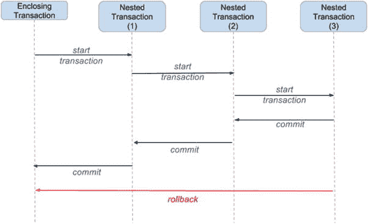

图 5-12.

嵌套事务行为

我们如何知道至少 Spring 正在尝试在嵌套事务中执行第二个方法？很简单，查看控制台日志：

```
    ...
    DEBUG o.s.b.f.s.DefaultListableBeanFactory - Returning cached instance
    of singleton bean ’transactionManager’
    DEBUG o.s.j.d.DataSourceTransactionManager - Creating new transaction:
    with name [com.ps.services.impl.UserServiceImpl.findById]
    PROPAGATION_REQUIRED,ISOLATION_DEFAULT,readOnly; ”
    DEBUG o.s.j.d.SimpleDriverDataSource -
    Creating new JDBC Driver Connection to [jdbc:h2:sample]
    DEBUG o.s.j.d.DataSourceTransactionManager - Acquired Connection
    [conn2: url=jdbc:h2:sample user=SAMPLE] for JDBC transaction
    DEBUG o.s.j.d.DataSourceUtils - Setting JDBC Connection
    [conn2: url=jdbc:h2:sample user=SAMPLE] read-only
    DEBUG o.s.j.d.DataSourceTransactionManager - Switching JDBC Connection
    [conn2: url=jdbc:h2:sample user=SAMPLE] to manual commit
    DEBUG o.s.j.c.JdbcTemplate - Executing prepared SQL statement
    [select id, email, username, password, user_type from p_user where id= ?]
    DEBUG o.s.j.d.DataSourceTransactionManager - Initiating transaction commit
    DEBUG o.s.j.d.DataSourceTransactionManager -
    Committing JDBC transaction on Connection
    [conn2: url=jdbc:h2:sample user=SAMPLE]
    DEBUG o.s.j.d.DataSourceTransactionManager - Releasing JDBC Connection
    [conn2: url=jdbc:h2:sample user=SAMPLE] after transaction
    DEBUG o.s.j.d.DataSourceUtils - Returning JDBC Connection to DataSource
    # Not actually nested.
    DEBUG o.s.j.d.DataSourceTransactionManager - Creating new transaction with name
    [com.ps.services.impl.PetServiceImpl.getPetsAsHtml]:
    PROPAGATION_NESTED,ISOLATION_DEFAULT,readOnly; ”
    DEBUG o.s.j.d.SimpleDriverDataSource - Creating new JDBC Driver Connection
    to [jdbc:h2:sample]
    DEBUG o.s.j.d.DataSourceTransactionManager - Acquired Connection
    [conn3: url=jdbc:h2:sample user=SAMPLE] for JDBC transaction
    DEBUG o.s.j.d.DataSourceUtils - Setting JDBC Connection
    [conn3: url=jdbc:h2:sample user=SAMPLE] read-only
    DEBUG o.s.j.d.DataSourceTransactionManager - Switching JDBC Connection
    [conn3: url=jdbc:h2:sample user=SAMPLE] to manual commit
    DEBUG o.s.j.c.JdbcTemplate - Executing SQL query
    [select id, name, age, pet_type from p_pet where owner=1]
    DEBUG o.s.j.d.DataSourceTransactionManager - Initiating transaction commit
    DEBUG o.s.j.d.DataSourceTransactionManager - Committing JDBC transaction
    on Connection [conn3: url=jdbc:h2:sample user=SAMPLE]
    DEBUG o.s.j.d.DataSourceTransactionManager - Releasing JDBC Connection
    [conn3: url=jdbc:h2:sample user=SAMPLE] after transaction
    DEBUG o.s.j.d.DataSourceUtils - Returning JDBC Connection to DataSource
    User John has:
    Name: Mona, type: CAT, Age: 2
    Name: Max, type: DOG, Age: 10
    ```

4.  `isolation` 属性值定义了事务中修改的数据如何影响其他并发事务。一般来说，事务应该是隔离的。一个事务不应能访问另一个未提交事务的更改。隔离级别有四种，但每个数据库管理系统对它们的支持方式不同。在 Spring 中，`org.springframework.transaction.annotation.Isolation` 枚举中定义了五种隔离值：

1.  `DEFAULT`：数据库管理系统的默认隔离级别。

2.  `READ_UNCOMMITED`：一个事务更改的数据可以在第一个事务尚未提交时被另一个事务读取，这也称为脏读。


3.  `READ_COMMITTED`:
        当事务使用此隔离级别时，无法进行脏读。这是大多数数据库的默认策略。但这里可能发生另一种现象：不可重复读：当多次执行同一查询时，可能会得到不同的结果。
        （示例：在同一事务中重复提取一个用户。与此同时，另一个不同的事务修改了该用户并提交。如果第一个事务使用此隔离级别，则在第二个事务提交后，它将返回具有新属性的用户。）

4.  `REPEATABLE_READ`: 此
        隔离级别不允许脏读，并且在同一个事务中重复查询某一行数据时，始终会返回相同的结果，即使在读取过程中另一个不同的事务更改了数据。在事务上下文中多次读取同一行并始终获得相同结果的过程称为可重复读。

5.  `SERIALIZABLE`:
        这是限制最严格的隔离级别，因为事务是以序列化方式执行的。因此，不可能出现脏读、不可重复读和幻读。幻读发生在事务过程中，执行相同的查询可能导致返回不同的结果集。

5.  `timeout`。默认情况下，此属性的值由事务管理器提供者定义，但可以通过在注解中设置不同的值来更改：`@Transactional(timeout=3600)`。
        该值表示事务被视为失败之前的毫秒数，默认值为 –1，表示不支持超时。

6.  `rollbackFor`
        属性的值应为一个或多个异常类，即 `Throwable` 的子类。
        当在事务性方法执行期间抛出此类异常时，事务将回滚。默认情况下，仅当抛出 `RuntimeException` 时才会回滚事务。使用此属性，也可以为受检异常触发回滚。

在下面的代码片段中，`MailSendingException`
    是一个受检异常，当无法通过电子邮件发送用户修改成功的通知时抛出。基本思路是：主要操作已成功执行，用户数据已更新。因为无法发送通知而回滚更改是没有意义的。

```
    @Transactional(rollbackFor = MailSendingException.class)
    public int updatePassword(Long userId, String newPass)
    throws MailSendingException {
    User u = userRepo.findById(userId);
    String email = u.getEmail();
    sendEmail(email);
    return userRepo.updatePassword(userId, newPass);
    }
    private void sendEmail(String email)
    throws MailSendingException {
    ... // 此处代码不相关
    }
    ```

7.  `noRollbackFor`
        属性的值应为一个或多个异常类，即 `Throwable` 的子类。
        当在事务性方法执行期间抛出此类异常时，事务不会回滚。默认情况下，仅当抛出 `RuntimeException` 时才会回滚事务。使用此属性，也可以避免因 `RuntimeException` 而回滚事务。

`@Transactional`
注解也可以在类级别使用。在这种情况下，类中的所有方法都成为事务性方法，并且为事务定义的所有属性都继承自 `@Transactional` 类级别定义，但可以通过方法级别定义的 `@Transactional` 进行覆盖。

```
@Service
@Transactional(readOnly = true,
propagation = Propagation.REQUIRED)
public class UserServiceImpl implements UserService {
...
@Transactional(propagation = Propagation.REQUIRES_NEW)
@Override
public User findById(Long id) {
return userRepo.findById(id);
}
@Transactional(propagation = Propagation.SUPPORTS)
@Override
public void htmlAllByNameAll(String name){
userRepo.htmlAllByName(name);
}
}
```

`@Transactional`
也可以用于抽象类和接口。这会导致所有实现方法继承父类/接口上注解定义的事务行为，但这并非推荐做法。

测试事务性方法

对于涉及数据源操作的测试用例，Spring 4.1 在 `org.springframework.test.context.jdbc`
包中添加了一些实用的注解：

*   `@Sql`
    注解可用于指定在集成测试期间针对给定数据库执行的 SQL 脚本。它可用于类和方法。当要执行的 SQL 文件具有不同的语法、错误处理规则或不同的执行阶段时，可以多次使用它。本节特定的测试是集成测试，因为它们测试服务与存储库之间的通信。因此，它们非常适合引入此注解。

*   `@SqlGroup`
    注解可用于类和方法，以将 `@Sql` 注解分组。它可以用作元注解来创建自定义的组合注解。例如，当涉及多个数据源时，它可以与 `@SqlConfig` 一起使用，对要执行的脚本进行分组，以便为涉及两个数据源的单个测试用例准备测试环境：

```
    @SqlGroup({
    @Sql(scripts = "script1.sql", config = @SqlConfig(dataSource = "dataSource1")),
    @Sql(scripts = "script2.sql", config = @SqlConfig(dataSource = "dataSource2"))
    })
    ```

*   `@SqlConfig`
    用于指定 SQL 脚本的配置。

在下面的代码片段中，您可以看到如何使用这些注解来测试您的服务类。第一个示例使用了多个 `@Sql` 注解；第二个示例使用 `@SqlGroup` 对它们进行分组。可以通过运行 `06-ps-tx-practice` 项目中的 `UserServiceTest.testCount()` 方法来测试该示例。

```
import org.springframework.test.context.jdbc.Sql;
import org.springframework.test.context.jdbc.SqlConfig;
import org.springframework.test.context.jdbc.SqlGroup;
...
@RunWith(SpringJUnit4ClassRunner.class)
@ContextConfiguration(classes = {TestDataConfig.class, AppConfig.class})
@ActiveProfiles("dev")
public class UserServiceTest {
@Test
@Sql(value ="classpath:db/extra-data.sql",
config = @SqlConfig(encoding = "utf-8", separator = ";", commentPrefix = "--"))
@Sql(
scripts = "classpath:db/delete-test-data.sql",
config = @SqlConfig(transactionMode = SqlConfig.TransactionMode.ISOLATED),
executionPhase = Sql.ExecutionPhase.AFTER_TEST_METHOD
)
public void testCount(){
int count = userService.countUsers();
assertEquals(8, count);
}
```

尽管语法相当明显，但以防万一需要额外说明，现解释如下：

*   第一个 `@Sql`
    注解指定了一个脚本，该脚本将在执行测试方法之前执行，以将一些数据保存到测试数据库中。`@SqlConfig` 用于声明特定的 SQL 语法细节，以便 Spring 能够正确执行 `extra-data.sql` 脚本。

*   第二个 `Sql`
    注解用于执行将在测试执行后清理测试数据库的脚本。指定脚本执行时间的属性是 `executionPhase`，在此例中，用于告诉 Spring 在测试方法之后执行脚本的值是 `Sql.ExecutionPhase.AFTER_TEST_METHOD`。


`@SqlConfig` 注解功能强大，它提供了用于声明隔离级别 `(transactionMode = SqlConfig.TransactionMode.ISOLATED)` 和要使用的事务管理器（transactionManager）的属性。

```
(transactionManager="txMng")
```

以下示例与上述示例行为相同，但出于教学目的，两个 `Sql` 注解已使用 `@SqlGroup` 组合在一起。

```
@RunWith(SpringJUnit4ClassRunner.class)
@ContextConfiguration(classes = {TestDataConfig.class, AppConfig.class})
@ActiveProfiles("dev")
public class UserServiceTest {
// @SqlGroup 版本
@Test
@SqlGroup({
@Sql(value = "classpath:db/extra-data.sql",
config = @SqlConfig(encoding = "utf-8", separator = ";", commentPrefix = "--")),
@Sql(
scripts = "classpath:db/delete-test-data.sql",
config = @SqlConfig(transactionMode = SqlConfig.TransactionMode.ISOLATED),
executionPhase = Sql.ExecutionPhase.AFTER_TEST_METHOD
)
})
public void testCount() {
int count = userService.countUsers();
assertEquals(8, count);
}
}
```

`@Sql` 注解还有更多属性，但有一个属性你肯定会觉得非常有用：`statements` 属性。此属性允许你提供一个在测试方法之前执行的语句。

```
@Test
@Sql(statements = {"drop table NEW_P_USER if exists;"})
public void testCreateTable(){
int result = userRepo.createTable("new_p_user");
// 表存在但为空
assertEquals(0, result);
}
```

仓库方法可以在事务上下文中进行测试，与服务方法解耦。当测试数据库必须不受测试执行影响时，这非常有用。`@Transactional` 注解可用于测试方法并进行适当配置，而 `@Rollback` 注解可用于实现这一特定目的：保持测试数据库不变。

```
import org.springframework.test.annotation.Rollback;
...
RunWith(SpringJUnit4ClassRunner.class)
@ContextConfiguration(classes = {TestDataConfig.class, AppConfig.class})
@ActiveProfiles("dev")
public class TransactionalJdbcRepoTest {
@Transactional
@Test
public void testFindById() {
User user = userRepo.findById(1L);
assertEquals("John", user.getUsername());
}
@Test
@Transactional @Rollback(false)
public void testCreate(){
int result = userRepo.createUser
(5L, "Diana", "mypass", "diana@opympus.com", UserType.BOTH);
assertEquals(1, result);
Set dianas = userRepo.findAllByUserName("Diana", true);
assertTrue(dianas.size() == 1);
}
}
```

`@Rollback` 注解可用于指定在测试方法执行后不应执行回滚，通过使用其默认属性：`@Rollback(false)`。这等同于 Spring 4.2 中引入的另一个注解：`@Commit`。你可能想象得到，你可以使用其中一个来实现此目的，但除非你真的想让 Spring 容器感到困惑，否则不应同时使用它们。结果将是不可预测的。这两个注解也可以在类级别使用，并且类级别的注解配置可以被方法级别的注解配置覆盖。

在 Spring 4.0 之前，`@TransactionConfiguration` 可用于测试类，用于定义测试的事务上下文。它在 Spring 4.0 中随着 profile 和 `@EnableTransactionManagement` 的引入而被弃用。但如果你对示例感兴趣，请看这里：

```
import org.springframework.test.context.transaction.TransactionConfiguration;
...
@TransactionConfiguration(defaultRollback = false,
transactionManager = "txManager")
@Transactional
public class TransactionalJdbcRepoTest {
@Test
public void testFindById() {
User user = userRepo.findById(1L);
assertEquals("John", user.getUsername());
}
...
}
```

`defaultRollback` 属性的默认值是 `true`，在上一个示例中将其设置为 `false` 只是为了介绍这个属性。

另一个有用的测试注解是 `@BeforeTransaction`，它可用于在执行事务性测试方法之前设置或检查测试环境。带有 `@Before` 注解的方法在事务上下文中执行。以下代码片段中的方法检查测试数据库是否在事务上下文之外正确初始化。

```
import org.springframework.test.context.transaction.BeforeTransaction;
...
@RunWith(SpringJUnit4ClassRunner.class)
@ContextConfiguration(classes = {TestDataConfig.class, AppConfig.class})
@ActiveProfiles("dev")
public class UserServiceTest {
...
@BeforeTransaction
public void checkDbInit(){
int count = userService.countUsers();
assertEquals(4, count);
}
}
```

**使第三方组件具有事务性**

对于无法使用注解配置事务执行的情况（例如使用 Java 1.5 之前的版本，或者服务是无法更改的第三方实现），可以通过使用 XML 声明 AOP 和 `tx` 配置元素的组合来实现 Spring 事务管理配置。

!

如果你想测试自己对 Spring 事务管理的理解，现在可以打开 `06-ps-tx-practice` 项目并尝试完成 TODO 任务。有五个任务需要你解决，编号从 31 到 35。缺失的部分用 TODO 任务标记，并在 Intellij IDEA 的 TODO 视图中可见。

任务 TODO 31 位于 `TestDataConfig` 类中，要求你定义一个用于管理事务的事务管理器 bean。

任务 TODO 32 位于 `AppConfig` 类中，要求你启用声明式事务的使用。

任务 TODO 33 位于 `UserServiceImpl` 中，要求你使所有方法都具有事务性。

任务 TODO 34 位于 `UserServiceImpl` 类中，要求你完成 `updatePassword(...)` 方法的事务定义，使事务可写，并为该方法抛出的受检异常进行回滚。

任务 TODO 35 位于测试类 `UserServiceTest` 中，要求你完成测试 `userService.updatePassword(...)` 方法的方法体。

如果你遇到困难，可以查看 `06-ps-tx-solution` 项目中提供的解决方案。

! **Spring 声明式模型澄清**

关于当存在服务层且服务类/方法已经使用 `@Transactional` 注解时，是否应该在仓库类/方法上使用 `@Transactional`，互联网上（主要发生在 StackOverflow¹²）目前存在激烈的争论。为了解决这个争论，我们必须考虑 Spring 中声明式事务是如何实现的。在第 9 节“Spring 中的事务管理如何工作”的开头已经提到，AOP 用于用事务行为装饰 bean。这意味着当我们用 `@Transactional` 注解类或方法时，将创建一个代理 bean 来提供事务行为，并将其包裹在原始 bean 周围。

在不使用服务层的应用程序中，为了确保与数据库交互时的事务行为，仓库类/方法必须使用 `@Transactional` 注解。这将告诉 Spring 为仓库类创建事务代理。此场景的抽象 UML 图如图 5-11 所示，目标对象是仓库 bean。当添加服务层和服务类时，有两种可能性：我们用 `@Transactional` 注解新的服务类并从仓库中移除该注解，或者我们注解服务类并同时在仓库类上保留 `@Transactional`。让我们详细分析每种情况。


**情况 1：只有服务类**被标注了`@Transactional`。在这种情况下，目标对象是服务 Bean，它包含一个对仓库 Bean 的引用。当调用服务方法时，会发生以下步骤：

1.  事务代理调用事务顾问以获取一个事务。
2.  事务代理将初始调用转发给目标服务 Bean。
3.  目标服务对象调用仓库方法，并将结果返回给代理。
4.  代理调用事务顾问以提交事务。
5.  代理将结果返回给调用者。

Spring 服务类持有一个对仓库类的引用，这意味着在运行时，服务 Bean 将通过聚合这两个对象来创建。实际上，当 Spring 应用上下文被创建时，会发生以下情况：

1.  在配置中找到了一个仓库 Bean 声明，因此创建了一个仓库 Bean。
2.  在配置中找到了一个服务 Bean 声明，因此创建了一个服务 Bean。该服务 Bean 依赖于先前创建的仓库 Bean，因此通过自动装配提供依赖。现在，仓库成为了服务 Bean 的一个成员。
3.  然后，`InfrastructureAdvisorAutoProxyCreator` Bean 创建了代理对象，该对象包裹在服务 Bean 周围以提供事务行为。因此，服务 Bean 现在成为了一个目标对象。

总结一下：服务方法调用仓库方法，这个调用是由目标对象在内部完成的。在代理从 Spring 事务顾问获取的事务上下文中，整个执行过程是原子的。这一点很重要，特别是当一个服务方法调用多个仓库方法时，因为这种方法确保了所有仓库方法将在同一个事务内执行。这种情况由图 5-13 中的图表描述。

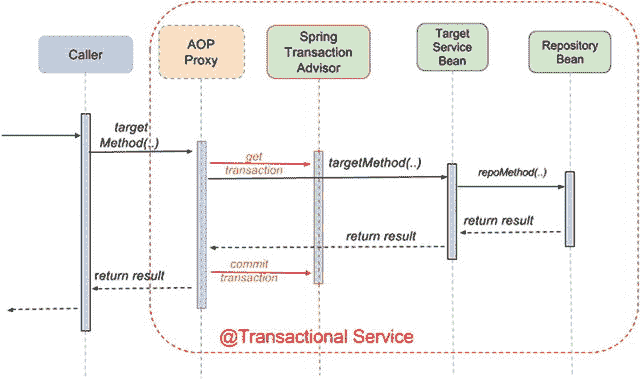

图 5-13.

标注了`@Transactional`的服务类

为了深入了解内部机制，你可以在 Intellij IDEA 中以调试模式执行项目`6-ps-tx-solution`中的`UserServiceTest.testFindById()`方法，并查看`userService` Bean。在`Variables`控制台中，你应该会看到如图 5-14 所示的内容。

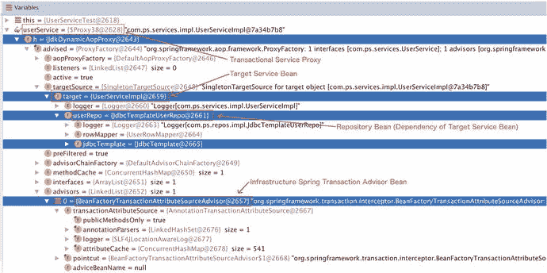

图 5-14.

Intellij IDEA 中暂停测试执行以分析服务事务 Bean

**情况 2：服务类和仓库类**都标注了`@Transactional`。在这种情况下，涉及两个事务代理，一个用于服务 Bean，一个用于仓库 Bean。在这种情况下，服务 Bean 包含一个对仓库代理的引用。当调用服务方法时，会发生以下步骤：

1.  事务服务代理调用事务顾问以获取一个事务。
2.  事务代理将初始调用转发给目标服务 Bean。
3.  服务 Bean 调用仓库方法。
4.  事务仓库代理调用事务顾问以获取一个事务。返回的事务取决于仓库类上声明的`@Transactional`注解的传播配置。
5.  执行目标仓库对象的方法，并将结果返回给事务仓库代理。
6.  事务仓库代理调用事务顾问以提交事务。
7.  事务仓库代理将结果返回给调用者，在本例中是目标服务对象。
8.  目标服务对象将结果返回给事务服务代理。
9.  事务服务代理调用事务顾问以提交事务。
10. 事务服务代理将结果返回给调用者。

总结一下：服务目标对象在仓库代理上调用仓库方法，仓库代理负责为仓库方法的执行建立事务上下文。这种情况由图 5-15 中的图表描述。

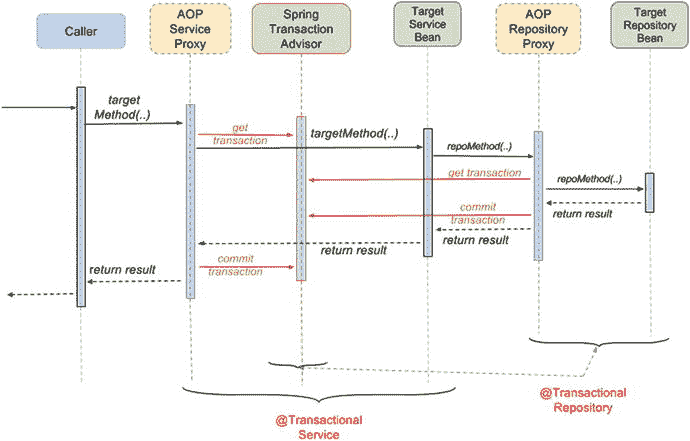

图 5-15.

标注了`@Transactional`的服务类和仓库类

为了深入了解内部机制，首先取消类`JdbcTemplateUserRepo`中`@Transactional`注解的注释，然后在 Intellij IDEA 中以调试模式执行项目`6-ps-tx-solution`中的`UserServiceTest.testFindById()`方法，并查看`userService` Bean。在`Variables`控制台中，你应该会看到如图 5-16 所示的内容。

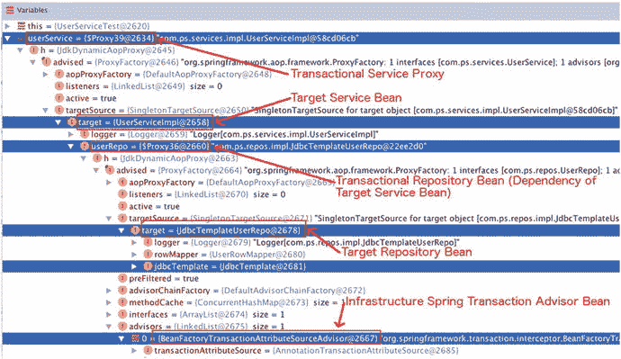

图 5-16.

Intellij IDEA 中暂停测试执行以分析服务和仓库事务 Bean

好了，争论到此结束。在服务层或 DAO/仓库层使用`@Transactional`，但不要两者都用。服务层是通常的选择，因为服务方法会调用多个需要在同一事务中执行的仓库方法。让你的仓库具有事务性的唯一原因是，你根本不需要服务层，这通常适用于小型教学应用程序。

**Spring 编程式事务模型**

使用声明式事务模型，好处是配置灵活且代码整洁，但事务管理完全交给了事务管理提供者。编程式模型虽然使用起来稍微繁琐一些，但在需要对事务管理进行一些控制时却很实用。为了能够对事务的处理进行一些控制，Spring 提供了`TransactionTemplate`类。在下面的代码片段中，展示了一个编程式事务服务，它使用`TransactionTemplate`的实例来管理事务。

```
import org.springframework.transaction.PlatformTransactionManager;
import org.springframework.transaction.TransactionStatus;
import org.springframework.transaction.support.TransactionCallback;
import org.springframework.transaction.support.TransactionTemplate;
...
@Service("programaticUserService")
public class ProgramaticUserService implements UserService {
private UserRepo userRepo;
private TransactionTemplate txTemplate;
@Autowired
public ProgramaticUserService(UserRepo userRepo,
PlatformTransactionManager txManager) {
this.userRepo = userRepo;
this.txTemplate = new TransactionTemplate(txManager);
}
@Override
public int updatePassword(Long userId, String newPass)
throws MailSendingException {
return txTemplate.execute(new TransactionCallback() {
@Override
public Integer doInTransaction(TransactionStatus status) {
try {
User user = userRepo.findById(userId);
String email = user.getEmail();
sendEmail(email);
return userRepo.updatePassword(userId, newPass);
} catch (MailSendingException e) {
status.setRollbackOnly();
}
return 0;
}
});
}
private void sendEmail(String email) throws MailSendingException {
... //与本部分无关
}
}
```

调用`status.setRollbackOnly()`方法是为了指示事务管理器，事务唯一可能的结果是回滚，而不是抛出异常（抛出异常反过来会触发回滚）。

**分布式事务**

分布式事务是涉及两个或更多事务资源的事务。这里最明显的例子是涉及 JMS 和 JDBC 的应用程序。从概念上讲，当执行涉及 JMS 和 JDBC 资源的分布式事务时，所发生的情况如图 5-17 所示。

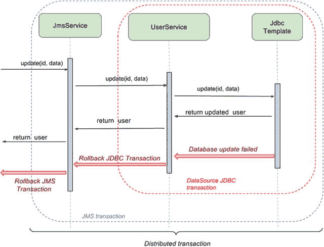

图 5-17.


涉及 JMS 和 JDBC 资源的分布式事务概念性 UML 时序图

`JmsService` 和 `UserService` 都是事务性的。其顺序或执行步骤如下：

1.  启动消息传递事务。
2.  接收请求更新用户记录的消息。
3.  启动数据库事务以编辑用户记录。
4.  如果数据库更新成功，则提交数据库事务。否则，回滚事务。
5.  如果数据库事务提交成功，则提交消息传递事务。如果数据库事务已回滚，则回滚消息传递事务。

使用分布式事务需要 JTA 和特定的 XA 驱动程序。¹³
有许多开源和商业的 JTA 提供者：JBossTS、Java 开放事务管理器 (JOTM) 和 Atomikos。¹⁴
由于分布式事务既不是官方认证考试的主题，也不是 Spring 核心组件的一部分，本节将在此结束，因为接下来有更有趣的内容。

介绍 Hibernate 和 ORM

前面已经介绍了 JPA 这个术语，但现在是时候详细讨论它了。JPA（Java 持久化 API）是一个供持久化提供者实现的接口。有许多可用于 Java 应用程序的 JPA 提供者：Hibernate、EclipseLink、Apache OpenJPA 等。

其中最流行的是 Hibernate，它是 Red Hat 的开源项目之一。Hibernate ORM 是一个对象关系映射框架，支持将面向对象的领域模型映射到关系数据库。该框架是开源的，并且 Hibernate 多年来已发展成为一个成熟的技术，被拆分为众多工具，用于领域模型验证、索引和搜索 NoSQL 数据库的 JPA（Hibernate OGM）¹⁵ 等等。如果您对 Red Hat Hibernate 项目家族感到好奇，可以在其官方网站 [`http://hibernate.org/`](http://hibernate.org/) 上找到更多信息。本节将介绍使用 Hibernate 配置 JPA 的基本细节。

会话与 Hibernate 配置

要在 Spring 应用程序中使用 Hibernate 配置 JPA，必须引入以下组件：

*   `org.hibernate.SessionFactory` 接口是 Hibernate 的核心组件。此类型的对象是线程安全、可共享且不可变的。通常，应用程序只有一个 `SessionFactory` 实例，为客户端请求提供服务的线程从此工厂获取 `Session` 实例。一旦创建了 `SessionFactory` 实例，其内部状态就被设置好了。此内部状态包括关于对象/关系映射的所有元数据。

*   `org.hibernate.Session` 接口是 Hibernate 组件，代表单个功能单元，并且是 Java 应用程序与 Hibernate 之间的主要运行时接口。会话是一个有状态对象，用于管理功能单元内的持久化对象。它充当事务范围的缓存，在会话中执行的操作基本上被缓存，当事务提交时，更改会持久化到数据源（二级缓存）。可以通过调用 `sessionFactory.getCurrentSession()` 来获取 `Session` 对象。

*   `org.springframework.orm.hibernate*.HibernateTransactionManager`：此类是针对单个 `SessionFactory` 的 `PlatformTransactionManager` 实现。Spring 4 当前包含三个 Hibernate 包，每个支持的版本（3、4 和 5）各一个。每个包中都有一个 `HibernateTransactionManager`。用于 Hibernate 3 的版本目前已弃用，可能会在 Spring 5 中被移除。

```
    import org.springframework.transaction.PlatformTransactionManager;
    ...
    @Bean
    public PlatformTransactionManager transactionManager() {
    return new HibernateTransactionManager(sessionFactory());
    }
    ```

*   `org.springframework.orm.hibernate5.LocalSessionFactoryBuilder`：这是一个工具类，可用于创建 `SessionFactory` bean。会话工厂 bean 需要应用程序使用的数据源、可以找到实体类的包以及 Hibernate 属性作为参数。

```
    import org.hibernate.SessionFactory;
    import org.springframework.orm.hibernate5.LocalSessionFactoryBuilder;
    ...
    @Bean
    public SessionFactory sessionFactory() {
    return new LocalSessionFactoryBuilder(dataSource())
    .scanPackages("com.ps.ents")
    .addProperties(hibernateProperties())
    .buildSessionFactory();
    }
    @Bean
    public Properties hibernateProperties() {
    Properties hibernateProp = new Properties();
    hibernateProp.put("hibernate.dialect",
    "org.hibernate.dialect.H2Dialect");
    hibernateProp.put("hibernate.hbm2ddl.auto", "create-drop");
    hibernateProp.put("hibernate.format_sql", true);
    hibernateProp.put("hibernate.use_sql_comments", true);
    hibernateProp.put("hibernate.show_sql", true);
    return hibernateProp;
    }
    ```

此类在 Spring 3.1 中引入，用于替换与 Hibernate 3 一起使用的类 `org.springframework.orm.hibernate3.annotation.AnnotationSessionFactoryBean`，并且它被设计为与 Hibernate 4 一起工作。正如您现在可能推断的那样，存在一个用于 Hibernate 5 的版本，该版本在 Spring 4.2 中引入。如果您好奇，以下代码片段展示了使用已弃用类的 Hibernate 3 的 XML 示例配置。

```

com.ps.ents.User
    com.ps.ents.Pet
    com.ps.ents.Request
    com.ps.ents.Response
    com.ps.ents.Review

hibernate.format_sql=true
    hibernate.show_sql=true

```

`"com.ps.ents"` 是实体类所在的包。它们代表了 Hibernate 需要将其映射到数据库对象的元数据。在以前的版本中使用了实体类和 Hibernate 的 XML 配置，但现在用得不多。在上一个代码示例中，类 `annotation.AnnotationSessionFactoryBean` 没有 `scanPackages` 属性，因此实体必须在 XML 配置文件中作为列表中的值列出，该列表用作设置 `annotatedClasses` 属性的参数。新方法更实用，因为它消除了在项目中添加新实体类时修改 XML Spring 配置文件的必要性。

`hibernateProperties` 是一个 `java.util.Properties`，包含特定的 Hibernate 属性。最常用的如下所列：

*   `hibernate.dialect`：值是与应用程序中使用的数据库匹配的方言类（例如：`org.hibernate.dialect.H2Dialect`）。
*   `hibernate.hbm2ddl.auto`：该值表示 Hibernate 在应用程序启动时应执行的操作：更新数据库以应用元数据中的更改、完全重新创建数据库或什么都不做。可能的值：`none（默认值）, create-only, drop, create, create-drop, validate, update`。这对于嵌入式测试数据库非常实用，因为开发人员可以专注于代码，而不是设置测试数据库。如果使用 create-drop，Hibernate 将扫描所有实体，并根据其字段上的特定注解生成表以及它们之间的关系。
*   `hibernate.format_sql`：如果为 true，并且下一个属性也为 true，则生成的 SQL 语句将以漂亮且可读的方式打印到控制台。


*   `hibernate.show_sql`:
        如果设为 true，所有生成的 SQL 语句都会打印到控制台。

*   `hibernate.use_sql_comments`:
        如果设为 true，Hibernate 会在 SQL 语句中添加注释，以告知
        开发者该语句试图执行的操作。

*   由于 Hibernate 是一个不断演进的工具，现在是时候引入
    连接池了。在本节中，选择使用 `HikariCP`
    来创建 `dataSource` bean。
    `HikariCP` 是
    开源的、小巧且实用的，因为只需向项目添加一个库，
    并且据称它是 Java 领域最快的连接池。¹⁶

```
    import com.zaxxer.hikari.HikariConfig;
    import com.zaxxer.hikari.HikariDataSource;
    ...
    @Bean(destroyMethod = "close")
    public DataSource dataSource() {
    try {
    HikariConfig hikariConfig = new HikariConfig();
    //datasource connection data
    hikariConfig.setDriverClassName(driverClassName);
    hikariConfig.setJdbcUrl(url);
    hikariConfig.setUsername(username);
    hikariConfig.setPassword(password);
    //connection pool specific configuration
    hikariConfig.setMaximumPoolSize(5);
    hikariConfig.setConnectionTestQuery("SELECT 1");
    hikariConfig.setPoolName("springHikariCP");
    hikariConfig.addDataSourceProperty("dataSource.cachePrepStmts", "true");
    hikariConfig.addDataSourceProperty("dataSource.prepStmtCacheSize", "250");
    hikariConfig.addDataSourceProperty("dataSource.prepStmtCacheSqlLimit", "2048");
    hikariConfig.addDataSourceProperty("dataSource.useServerPrepStmts", "true");
    HikariDataSource dataSource = new HikariDataSource(hikariConfig);
    return dataSource;
    } catch (Exception e) {
    return null;
    }
    }
    ```

`SessionFactory` bean
随后被注入到仓库中，并用于创建实现 `org.hibernate.query.Query<R>`
类型的对象，这些对象被执行后返回结果。但更多细节将在介绍实体类之后展开，这里先简单提及以保持清晰。

Hibernate 支持 `javax.persistence.*`
包中的所有 JPA 2.x 注解，并扩展了该包以提供 JPA 不支持的行为以及执行特定的增强功能。Hibernate 的元数据由放置在类、字段和方法上的注解组成，这些注解定义了应如何处理这些对象、它们有哪些限制等。最重要的注解是 `@Entity` 注解，
它是 `javax.persistence.*`
的一部分，并将类标记为领域对象的模板，这些对象也称为实体。

CC

使用 `@Entity` 注解的类会映射到与类名匹配的数据库表，除非使用 `@Table` 注解另行指定。

```
import javax.persistence.Table;
import javax.persistence.Entity;
...
@Entity
@Table(name="P_USER")
public class User extends AbstractEntity {
...
}
```

实体类成员通过注解来指定其用途、列名（如果与字段名不同）、验证规则、与其他实体的关系，以及本章后续将介绍的更多内容。

默认情况下，所有类成员都被视为持久化的，除非使用 `@Transient` 注解。`@Column` 注解并非必需，除非数据库列名需要与字段名不同，或者需要对字段应用限制。

示例：`unique`、`nullable`、`insertable`、`updatable`、`length`、`precision`、`scale`。

`@Id`
注解将该字段标记为此实体类型的唯一标识符，并与数据库表的主键匹配。`@Entity` 和 `@Id` 对于领域类是必需的。

使用持久化特定注解的实体类成员的访问类型为 `FIELD`。它们的值由 Hibernate 通过反射填充。可以通过使用 `@Access` 注解强制使用 setter 和 getter 方法，但不推荐这样做，因为它可能会干扰其他组件。（例如：监听器和 AOP 通知）

表之间的关系由使用 `@OneToMany`、`@ManyToOne`、`@ManyToMany`、`@OneToOne` 注解的字段定义，它们与数据库中的关系定义相对应。在以下代码片段中，展示了一个 `User` 实体及其大部分字段和注解。Hibernate 将在数据库中创建的表将命名为 `P_USER`。

`@OneToMany`
注解用于在 `P_PET` 表中定义一个外键，将宠物记录链接到 `P_USER` 中的记录，并且可以定义指定子实体行为的属性。例如，在下面的代码片段中，使用 `@OneToMany(mappedBy = "owner", cascade = {CascadeType.REMOVE})` 告诉 Hibernate，在删除用户实体时，所有类型为 `Pet` 的子实体也必须被删除。

```
import org.hibernate.validator.constraints.NotEmpty;
import javax.validation.constraints.NotNull;
import javax.persistence.Column;
import javax.persistence.OneToMany;
...
@Entity
@Table(name="P_USER")
@SequenceGenerator(name = "seqGen", allocationSize = 1)
public class User extends AbstractEntity {
@NotEmpty
@Column(nullable = false, unique = true)
private String username;
@Column(name="first_name")
public String firstName;
@NotNull
@Enumerated(EnumType.STRING)
@Column(name = "user_type")
private UserType userType;
@NotEmpty
@Column(unique = true)
private String email;
@JsonIgnore
@OneToMany(mappedBy = "owner",
cascade = {CascadeType.REMOVE})
private Set pets = new HashSet();
...
}
```

在 `Pet`
实体类中，声明了关系的 `@ManyToOne` 部分，并使用 `@JoinColumn` 定义了外键列的确切名称。外键字段将填充对作为此领域对象父级的 `User` 实体的引用。在 JPA 中，声明 `@OneToMany` 关系的实体通常称为父实体，而声明 `@ManyToOne` 的实体称为子实体。

```
import org.hibernate.validator.constraints.NotEmpty;
import javax.persistence.JoinColumn;
import javax.persistence.ManyToOne;
...
@Entity
@Table(name="P_PET")
public class Pet extends AbstractEntity {
...
@ManyToOne
@JoinColumn(name = "OWNER_ID", nullable = false)
private User owner;
}
```

此外，由于我们利用继承来避免编写重复代码，因此引入了一个名为 `AbstractEntity` 的抽象类，它定义了所有实体类的公共字段。为了告诉 Hibernate 此类不是实体类，而是其他实体类的模板，使用了 `@MappedSuperclass`。架构上决定将所有基础设施相关的字段分组到此类中：使用 `@Id` 和 `@GeneratedValue` 标记的主键字段（用于允许自动生成值）、对象编辑时修改的日期字段，以及使用 `@Version` 注解的字段（用于在执行合并操作时确保完整性以及实现乐观并发控制）。一个实体类只能有一个使用 `@Version` 注解的字段。

```
import com.fasterxml.jackson.annotation.JsonIgnore;
import org.springframework.format.annotation.DateTimeFormat;
import javax.validation.constraints.NotNull;
...
@MappedSuperclass
public abstract class AbstractEntity implements Serializable {
@JsonIgnore
@Id
@GeneratedValue(strategy = GenerationType.AUTO)
@Column(updatable = false)
protected Long id;
@JsonIgnore
@Column(name = "CREATED_AT", nullable = false)
@NotNull
@DateTimeFormat(pattern = "yyyy-MM-dd")
protected Date createdAt;
...
@JsonIgnore
@Version
public int version;
}
```

Session 与 Hibernate 查询


实体由 `Session` 实例管理，该实例提供了用于搜索、持久化、更新和删除的方法。此实例还负责管理事务，是 JPA 的 `EntityManager` 的良好替代品。当前会话通过调用 `SessionFactory` bean 获得：

```
sessionFactory.getCurrentSession();
```

这些操作的查询使用 Hibernate 查询语言编写，它提供了一种更实用的编写 SQL 查询的方式。HQL 查询作用于领域对象，并在底层转换为匹配的 SQL 查询。

示例：当我们知道对象的 ID 时，使用 Hibernate 检索该对象变得非常简单。

```
@Override
public User findById(Long id) {
return session.get(User.class, id);
}
```

如果我们想查看 Hibernate 生成的原始 SQL 查询，只需在日志中查看，并将 `SessionFactory` bean 的两个 Hibernate SQL 特定参数 `show_sql` 和 `format_sql` 设置为 `true` 即可。

```
select
user0_.id as id1_5_,
user0_.CREATED_AT as CREATED_2_5_,
user0_.MODIFIED_AT as MODIFIED3_5_,
user0_.version as version4_5_,
user0_.active as active5_5_,
user0_.address as address6_5_,
user0_.email as email7_5_,
user0_.first_name as first_na8_5_,
user0_.last_name as last_nam9_5_,
user0_.password as passwor10_5_,
user0_.rating as rating11_5_,
user0_.user_type as user_ty12_5_,
user0_.username as usernam13_5_
from
P_USER user0_
where
user0_.id=?
```

HQL 支持开发者在查询中使用占位符和命名参数，可以返回单个结果或集合，并且不需要映射对象。还记得 `RowMapper<T>` 吗？使用 Hibernate 就不需要它了。这就是 ORM 的强项。基于实体类中注解所表示的元数据，Hibernate 可以在底层轻松地将数据库记录转换为 Java 对象，反之亦然。在下面的代码片段中，你可以看到几个不同的 HQL 查询。

```
//当没有记录匹配条件时，返回空列表
List list = session.createQuery("from User u where username= ?")
//当没有记录匹配条件时，返回 null
User user = (User) session.createQuery("from User u where u.id= :id").
setParameter("id", userId).uniqueResult();
// 更新用户
User user = (User) session().createQuery("from User u where u.id= :id").
setParameter("id", userId).uniqueResult();
user.setUsername(username);
session.update(user);
//在数据库中保存一个新用户
public void save(User user) {
session.persist(user);
}
// 删除一个用户
public void deleteById(User user) {
session.delete(user);
}
```

为了将领域对象与数据库同步，`Session` 实例提供了不少方法。以下是最常用的几个：

*   `update(entity)` 用于持久化对现有数据库对象所做的更改。
*   `persist(entity)` 用于将新的领域对象保存到数据库中。如果此对象关联了其他领域对象，并且该关联使用 `cascade="persist"` 映射，则持久化操作也会包含这些关联对象。此方法不返回值。
*   `save(entity)` 用于将新的领域对象保存到数据库中。在保存对象之前，会生成一个标识符。如果关联使用 `cascade="save-update"` 映射，则此操作适用于关联的实例。此方法返回生成的标识符。
*   `saveOrUpdate(entity)` 用于将领域对象保存到数据库。如果对象已存在，则执行 `update`；否则，执行 `save`，并且如果关联使用 `cascade="save-update"` 映射，则此操作适用于关联的实例。

当在应用程序中使用 Hibernate 时，仓库类将使用 `sessionFactory` bean 来操作数据对象。`UserRepo` 的 Hibernate 特定实现如下代码片段所示。注意注入的 `sessionFactory` bean 以及如何获取当前会话。

```
import org.hibernate.Session;
import org.hibernate.SessionFactory;
import org.springframework.transaction.annotation.Transactional;
...
@Repository
@Transactional
public class HibernateUserRepo implements UserRepo {
private SessionFactory sessionFactory;
@Autowired
public HibernateUserRepo(SessionFactory sessionFactory) {
this.sessionFactory = sessionFactory;
}
/**
* @return 事务性会话
*/
protected Session session() {
return sessionFactory.getCurrentSession();
}
@Override
public List findAll() {
return session().createQuery("from User u").list();
}
...
```

Hibernate 与 Spring 一起使用时的 UML 序列图如图 5-18 所示。

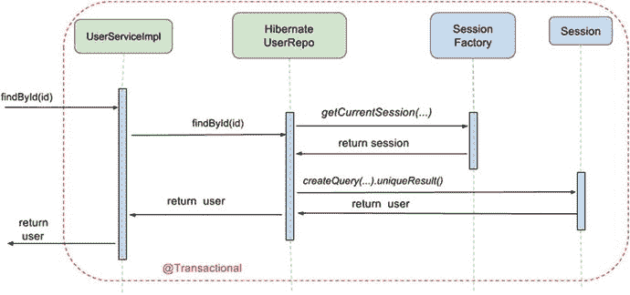

图 5-18.

涉及 Hibernate 仓库类操作的概念性 UML 序列图

除了所有这些方法之外，Hibernate 还支持使用 `Session` 实例执行原生查询。

```
import org.hibernate.query.NativeQuery;
...
public List findAll() {
NativeQuery nq = session()
.createNativeQuery("select first_name from P_USER");
return nq.getResultList();
}
```

异常映射

当出现问题时，Hibernate 会抛出自己的异常，这些异常的含义与之前章节中介绍的 Spring 数据访问异常相同。Hibernate 抛出扩展了 `HibernateException` 的运行时数据访问异常，但可以通过声明异常转换器 bean 将这些异常转换为 Spring 异常。要启用此行为，必须声明一个后处理器 bean，它将查找所有实现了 `org.springframework.dao.support.PersistenceExceptionTranslator` 的异常转换器 bean，并通知所有仓库 bean（使用 `@Repository` 注解的类），以便转换器可以拦截 Hibernate 异常并应用适当的转换。在下面的代码片段中，你可以看到在配置类中声明的后处理器 bean 和 Hibernate 特定的转换器 bean。

```
import org.springframework.dao.annotation.
PersistenceExceptionTranslationPostProcessor;
import org.springframework.orm.hibernate5.
HibernateExceptionTranslator;
...
@Bean
public PersistenceExceptionTranslationPostProcessor petpp() {
return new PersistenceExceptionTranslationPostProcessor();
}
@Bean
public HibernateExceptionTranslator hibernateExceptionTranslator() {
return new HibernateExceptionTranslator();
}
```

当无法使用 `PersistenceExceptionTranslationPostProcessor` 处理器进行异常转换时（可能是因为仓库类是第三方库的一部分），可以使用 XML 定义一个 AOP 通知，该通知使用 `PersistenceExceptionTranslationInterceptor` 类进行转换。

```
...

```

!

Hibernate 不是官方认证考试的主题，但如果你想测试自己对它的理解，有一个名为 `07-ps-hibernate-practice` 的项目，其中定义了四个 TODO 任务，编号从 36 到 39。

任务 36–38 要求你在 `HibernateUserRepo` 中编写一些缺失的 HQL 查询，这些查询可以使用 `TestHibernateUserRepo` 和 `TestUserService` 类进行测试。

任务 39 要求你完成 `TestDataConfig` 类中缺失的 `SessionFactory` bean 声明。

建议的解决方案可以在项目 `07-ps-hibernate-solution` 中找到。

执行任何测试时，请在控制台日志中搜索 `session` 和 `transaction` 这两个词，并注意 Hibernate 和 Spring 是如何协同工作的：


```
...
DEBUG o.s.b.f.a.AutowiredAnnotationBeanPostProcessor - Autowiring by type
from bean name ’hibernateUserRepo’ to bean named ’sessionFactory’
DEBUG o.s.b.f.s.DefaultListableBeanFactory - Creating instance of bean
’transactionManager’
INFO  o.s.o.h.HibernateTransactionManager - Using DataSource
HikariDataSource (springHikariCP)
of Hibernate SessionFactory for HibernateTransactionManager
DEBUG o.s.t.a.AnnotationTransactionAttributeSource - Adding transactional method
’HibernateUserRepo.findById’ with attribute: PROPAGATION_MANDATORY,ISOLATION_DEFAULT; ”
DEBUG o.s.o.h.HibernateTransactionManager - Participating in existing transaction
Hibernate:
select
user0_.id as id1_5_0_,
...
user0_.username as usernam13_5_0_
from
P_USER user0_
where
user0_.id=?
DEBUG o.s.o.h.HibernateTransactionManager - Initiating transaction commit
DEBUG o.s.o.h.HibernateTransactionManager -
Committing Hibernate transaction on Session ...
22:34:50.204 main DEBUG o.s.o.h.HibernateTransactionManager -
Closing Hibernate Session ...
...
```

Hibernate API 可用于实现数据访问并参与 Spring 管理的事务。它对于所使用的数据库也完全无关。它不依赖于 Spring 或实体类，并提供了钩子，使得 Spring 能够以透明的方式管理事务。Hibernate `sessionFactory` 实例、事务管理器和数据库的实现与配置位置可以与其他实现互换，而无需对代码进行任何更改。如果你使用 Spring 的 `LocalSessionFactoryBuilder` 类来创建 `SessionFactory` bean，它将被封装在一个代理中，该代理将确保此 bean 打开的每个会话都参与当前事务。当使用 Hibernate 时，在不执行写操作的事务上将其声明为 `readOnly` 可以带来显著的性能优化，因为 Hibernate 将跳过会话的刷新（毕竟，没有什么需要刷新的）。

现在我们已经介绍了 Hibernate，在深入探讨 JPA 之前，再补充一些关于 ORM 的信息是合适的。

对象关系映射

对象关系映射，简称 ORM，是一种将数据库对象映射到应用程序对象，反之亦然的方法。这使得数据处理变得简单。除此之外，它还提供了使用面向对象方法查询数据库的可能性。Hibernate 的全称是 Hibernate ORM，因为它实现了这种技术来允许查询和持久化数据对象。数据对象也称为领域对象或实体。无论其名称如何，该对象都对应一个数据库对象，通常是表中的一行。还可以定义更复杂的对象，它们可以封装来自多个表的数据，但由于此主题与本书无关，因此将尽量少提细节。领域对象在应用程序中易于使用，因为它们封装了存储在可访问字段中的、与表行相关的所有数据。当表中的一行成为一个领域对象时，会建立以下对应关系：

*   主键值存储在一个 ID 字段中。此字段用于在应用程序中标识该对象。在数据库中，标识是一个简单的话题。在 Java 中，由于涉及对象，情况略有不同。两个领域对象可能在逻辑上等价，但只有其中一个对象的 ID 字段设置了主键值，因此必须调整 `equals` 和 `hashcode` 方法以考虑这一方面。

*   数据库中的一对多关系被映射为 `HAS-A` 关系。领域对象将一个领域对象集合作为字段。通常这种关系是双向的，集合中的每个对象都有一个引用父对象的字段。此字段在数据库中被映射到外键列。

*   来自同一表的条目可以使用列值作为鉴别器，映射到同一层次结构中的不同类型的领域对象。

使用 ORM 框架具有以下优点：

*   它提供了数据库记录到应用程序对象的映射。

*   因此无需为此编写额外的代码。

*   它通常提供一种丰富的对象查询语言，比原生 SQL 更直观、更易于使用。

*   它提供了通过对象关系进行简单导航的能力。

*   它提供了通过可达性的持久化。请看以下代码片段：

```
    public class User extends AbstractEntity {
    ...
    @OneToMany(mappedBy = "owner",
    cascade = {CascadeType.PERSIST, CascadeType.REMOVE})
    private Set pets = new HashSet();
    }
    ```

`cascade` 属性定义了当类型为 `User` 的父领域对象被修改时，`P_PET` 表中映射到 `Pet` 对象的子记录会发生什么。如果 `User` 对象与 `Pet` 对象同时创建，则只需将 `User` 对象持久化到数据库，因为持久化操作会由于 `CascadeType.PERSIST` 值而传播到子领域对象。如果 `User` 对象被删除，子领域对象也会因为 `CascadeType.REMOVE` 而被删除。

*   它提供了并发支持：多个进程可以并行更新相同的数据。

*   它提供了按级别的缓存管理：

*   按事务（一级缓存）：当首次从数据库加载对象时，该对象存储在此缓存中，后续对该对象的请求将使用缓存，而不是访问数据库。

*   按数据源（`SessionFactory` 级别的二级缓存）：减少对数据库的读取密集型数据访问，并由 `SessionFactory` bean 创建的所有会话共享。当在一级缓存中未找到领域对象时，下一个查找位置就是此缓存。如果找到，模型对象在返回之前也会存储到一级缓存中。

*   事务管理和隔离。

*   键管理，因为标识符会自动传播和管理。例如：当在系统中创建一个 `User` 对象及其 `Pet` 实例时，用户 ID（主键）会被生成并自动用于填充宠物领域对象中的外键字段。

*   ORM 特定的代码可以重用。（在本书的示例项目中，领域对象、仓库和服务都使用了继承）。

*   ORM 代码已经过测试，并由框架的创建者维护；因此使用 ORM 减少了测试的工作量。

除了 Hibernate，Spring 还支持与所有主要的 ORM/持久化提供者集成，例如 EclipseLink、MyBatis 和 Open JPA。尽管 ORM 非常实用，但对于大量数据会引入一点延迟，因此在这种情况下，当数据处理速度是一个性能标准时，应该使用 JDBC 和原生 SQL。

Java 持久化 API

前面的示例直接使用 `SessionFactory` 描绘了一个 Spring 仓库类，这会将 Spring 与 Hibernate 紧密耦合。Java 持久化 API，也称为 JPA，为对象关系映射和持久化引入了一个通用接口，允许轻松切换所使用的 ORM 框架。JPA 旨在操作定义为 POJO 的领域对象。它取代了之前的持久化机制：EJB 和 JDO（Java 数据对象）。它于 2006 年首次引入，并克服了最初的局限性，成功提供了一套所有 Java ORM 框架和持久化框架都支持的特定 JPA 注解。上一节中用于配置领域对象的注解属于 `javax.persistence` 包，该包包含所有 JPA 组件。

核心 JPA 组件如下：


*   **持久化上下文**：一个包含一组领域对象/实体的上下文，其中每个持久化实体都有一个唯一的实体实例。

*   **实体管理器**：顾名思义，此类对象将管理实体，负责创建、更新、查询和删除。实体管理器类必须继承 `javax.persistence.EntityManager`，其实例通过 `@PersistenceContext` 注解与持久化上下文关联。通常，这些实例的生命周期与执行方法的事务绑定，因此由容器（在我们的案例中是 Spring 容器）管理。

*   **实体管理器工厂**：同样，其命名非常符合此类对象的用途。实体管理器工厂 Bean 负责创建由应用程序管理的实体管理器实例。这些工厂类必须实现 `javax.persistence.EntityManagerFactory`。它们是线程安全、可共享的，并代表单一数据源和持久化上下文。

*   **持久化单元**：由开发者定义的一组实体类，用于将数据库记录映射到由实体管理器管理的对象。基本上，它是应用程序中所有使用 `@Entity`、`@MappedSuperclass` 和 `@Embedded` 注解的类。所有实体类必须定义主键，必须拥有无参构造函数，且不能是 final 类。主键可以是单个字段或多个字段的组合。这组实体类代表单个数据源中包含的数据。可以在同一个应用程序中定义多个持久化单元。持久化单元的配置可以使用 XML 完成。官方文档指定必须在 `META-INF` 目录下定义 `persistence.xml` 文件，但如果使用了 Spring 和 Java 配置，则无需该文件。以下代码片段展示了一个 `persistence.xml` 示例文件。

```
该单元管理宠物、用户、请求、响应和评论。
```

*   **JPA 提供者**：为 JPA 提供后端的框架，是实际承担繁重工作的组件。实现 JPA 接口的最常用框架如下：

*   **Hibernate** 为 `EntityManager` 提供了实现，即 `org.hibernate.jpa.HibernateEntityManager`，但从 Hibernate 5.2 开始，使用 `org.hibernate.engine.spi.SessionImplementor`，因为它现在直接继承自 `EntityManager`。当然，这些都是内部细节，因为在配置中只需要 `org.springframework.orm.jpa.vendor.HibernateJpaVendorAdapter` 类。Hibernate 用于 JBoss 应用服务器内部。

*   **EclipseLink**：用于 Glassfish 应用服务器内部。

*   **Apache OpenJPA**：用于 Weblogic、WebSphere 和 TomEE 内部。

*   **Data Nucleus**：由 Google App Engine 使用。

其中任何一个也可以应用服务器外部使用。

使用 Hibernate 支持配置 Spring 和 JPA

对于本节相关的代码，您可以在项目 `09-ps-data-jpa-practice` 中找到，我们将使用 Hibernate 作为 JPA 提供者。最新版本的 Hibernate 已可用于生产环境，符合 JPA 2.1 规范的 JSR-338，并且仍然兼容 JPA 2.0。修改项目 `07-ps-hibernate-practice` 中的应用程序以支持 JPA 需要以下更改：

1.  不再需要 `SessionFactory` Bean 声明，它将被一个声明实体管理器工厂 Bean 的 Bean 所替代。为此将使用 Spring 特定的 `LocalContainerEntityManagerFactoryBean` 类。

```
    import javax.persistence.EntityManagerFactory;
    import org.springframework.orm.jpa.JpaTransactionManager;
    import org.springframework.orm.jpa.LocalContainerEntityManagerFactoryBean;
    import org.springframework.orm.jpa.vendor.HibernateJpaVendorAdapter;
    ...
    @Configuration
    @EnableTransactionManagement
    public class TestDataConfig {
    @Bean
    public EntityManagerFactory entityManagerFactory(){
    LocalContainerEntityManagerFactoryBean factoryBean =
    new LocalContainerEntityManagerFactoryBean();
    factoryBean.setPackagesToScan("com.ps.ents");
    factoryBean.setDataSource(dataSource());
    factoryBean.setJpaVendorAdapter(new HibernateJpaVendorAdapter());
    factoryBean.setJpaProperties(hibernateProperties());
    factoryBean.afterPropertiesSet();
    return factoryBean.getNativeEntityManagerFactory();
    }
    ...
    }
    ```

在上述方法中，`LocalContainerEntityManagerFactoryBean` 是通过显式实例化创建的，而非由 Spring 创建。因此，必须显式调用初始化工厂对象的 `afterPropertiesSet()` 方法。`LocalContainerEntityManagerFactoryBean` 对象用于创建一个原始的 `EntityManagerFactory` Bean，该 Bean 由 `PersistenceProvider` 实现（本例中为 `org.hibernate.jpa.HibernatePersistenceProvider`）返回。通过调用 `factoryBean.getNativeEntityManagerFactory()` 来检索由工厂 Bean 创建的 `EntityManagerFactory` 实例。

`HibernateJpaVendorAdapter` 暴露了 Hibernate 的持久化提供者和 `EntityManager` 扩展接口。可以通过 `setPackagesToScan(...)` 方法设置持久化元数据的位置，并且还需要数据源 Bean 才能正确创建 `EntityManagerFactory`。

2.  `HibernateTransactionManager` 将被一个类型为 `JpaTransactionManager` 的 Bean 替代，该 Bean 将使用 `EntityManagerFactory` 实现来将实体管理器操作与事务关联。

```
    import org.springframework.orm.jpa.JpaTransactionManager;
    ...
    @Configuration
    @EnableTransactionManagement
    public class TestDataConfig {
    @Bean
    @Bean
    public PlatformTransactionManager transactionManager() {
    return new JpaTransactionManager(entityManagerFactory());
    }
    ...
    }
    ```

3.  仓库类将被修改，以使用映射到应用程序持久化上下文的 `EntityManager` 类型实例。`@PersistenceContext` 注解表达了对容器管理的 `EntityManager` 及其关联持久化上下文的依赖。¹⁷ 此字段不需要自动装配，因为 `@PersistenceContext` 注解会被一个类型为 `org.springframework.orm.jpa.support.PersistenceAnnotationBeanPostProcessor` 的基础设施 Spring Bean 后处理器捕获，该处理器确保创建并注入一个 `EntityManager` 实例。为了创建此实例，会使用后端 ORM（本例中为 Hibernate 5.x），因此 `entityManager` Bean 的类型将是 `org.hibernate.engine.spi.SessionImplementor`。

```
    import javax.persistence.EntityManager;
    import javax.persistence.PersistenceContext;
    ...
    @Repository
    public class JpaUserRepo implements UserRepo {
    private EntityManager entityManager;
    @PersistenceContext
    void setEntityManager(EntityManager entityManager) {
    this.entityManager = entityManager;
    }
    ...
    }
    ```

在图 5-19 中，一个测试的执行在调试模式下暂停，以展示注入到仓库类中的实体管理器的类型。

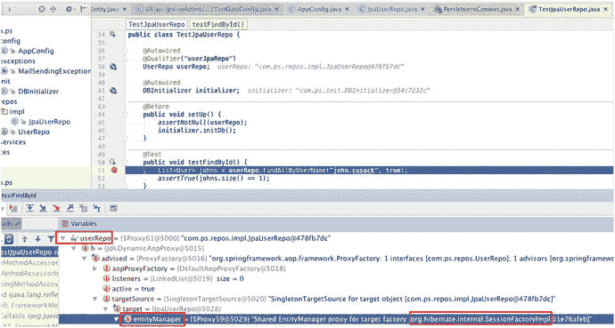

图 5-19.

TestJpaUserRepo.testFindById() 执行在调试模式下暂停，以显示注入到 JpaUserRepo 类中的 entityManager Bean 的类型。


需要修改仓库中的方法，以使用 `entityManager` bean。`EntityManager` API 中最有趣的部分在表 5-1 中进行了描述。

表 5-1.

EntityManager JPA 方法

| 方法 | 操作 | 说明 |
| --- | --- | --- |
| `<T> T find(Class<T> cl, Object pk);` | 通过主键查找实体 | 等同于：`select from table t where t.pk= PK_VAL` |
| `Query createQuery(String ql);` | 创建 JPQL 查询 | 如果在 JPQL Query 对象上调用 `getResultList()`，则返回集合。如果在 JPQL Query 对象上调用 `getSingleResult()`，则返回单个对象。 |
| `Query createNamedQuery(String name)` | 从元数据中的命名查询创建 JPQL 查询 | 如果在 JPQL Query 对象上调用 `getResultList()`，则返回集合。如果在 JPQL Query 对象上调用 `getSingleResult()`，则返回单个对象。 |
| `void persist(Object obj)` | 将实体添加到持久化上下文中 | 等同于：`insert into table...` |
| `<T> T merge(T entity);` | 将给定实体的状态合并到当前持久化上下文中 | 等同于：`update table t... where t.pk=PK_VAL` |
| `void flush()` | 立即将持久化上下文的内容持久化到数据库 | 请谨慎使用。 |
| `void refresh(Object entity)` | 从数据库重新加载实体的状态 | 持久化上下文中的更改将被丢弃，因此请谨慎使用。 |
| `void remove(Object entity)` | 从持久化上下文中移除实体 | 等同于：`delete from table t where t.pk=PK_ VAL` |

JPQL 是 Java 持久化查询语言（Java Persistence Query Language）的缩写。

与使用 Spring 的纯 Hibernate 实现相比，仅更改了事务管理器的声明，`sessionFactory` bean 被替换为 `entityManagerFactory`。数据源声明不变，并且仍然需要 Hibernate 属性，因为 Hibernate 仍然是底层的 ORM 框架。此外，仍然需要事务，因此 `@EnableTransactionManagement` 也保留。

当使用 JPA 通过 ID 搜索用户时，概念性的 UML 时序图如图 5-20 所示。

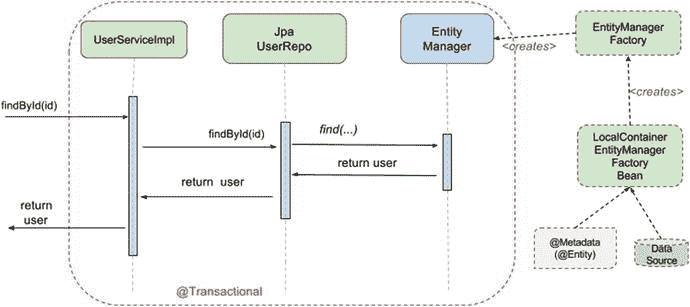

图 5-20.

Spring 与 JPA 一起使用时的概念性 UML 时序图

JPA 查询

JPA 最简单的操作是通过 ID 查询对象。无需编写查询，因为 `EntityManager` 为此提供了方法。当找不到用户时，它返回 null。它返回作为参数提供的实体类型的对象。无需进行类型转换，因为在底层使用了泛型，就像纯 Hibernate 一样。

```
public User findById(Long id) {
return entityManager.find(User.class, id);
}
```

JPQL 代表 JPA 查询语言。它用于以类似于 HQL 的方式编写领域对象查询。

```
public List findAllByUserName(String username, boolean exactMatch) {
if (exactMatch) {
return entityManager.createQuery("from User u where username= ?")
.setParameter(0, username).getResultList();
} else {
return entityManager.createQuery("from User u where username like ?")
.setParameter(0, "%" + username + "%").getResultList();
}
}
```

并且也支持命名参数：

```
public List findAllByUserName(String username, boolean exactMatch) {
if (exactMatch) {
return entityManager.createQuery("from User u where username= :un")
.setParameter("un", username).getResultList();
} else {
return entityManager.createQuery("from User u where username like :un")
.setParameter("un", "%" + username + "%").getResultList();
}
}
```

命名查询是元数据的一部分，并使用 `@NamedQuery` 注解定义，该注解必须放置在查询所管理的实体类上。上面的示例可以通过声明两个命名查询来简化。`@NamedQueries` 注解可用于将多个查询分组在一起。

```
//User.java
import javax.persistence.NamedQuery;
import javax.persistence.NamedQueries;
...
@Entity
@Table(name="P_USER")
@SequenceGenerator(name = "seqGen", allocationSize = 1)
@NamedQueries({
@NamedQuery(name=User.FIND_BY_USERNAME_EXACT,
query = "from User u where username= ?"),
@NamedQuery(name=User.FIND_BY_USERNAME_LIKE,
query = "from User u where username like ?")
})
public class User extends AbstractEntity {
public static final String FIND_BY_USERNAME_EXACT = "findByUsernameExact";
public static final String FIND_BY_USERNAME_LIKE = "findByUsernameLike";
...// 实体字段和方法
}
//JpaUserRepo.java
import static com.ps.ents.User.FIND_BY_USERNAME_EXACT;
import static com.ps.ents.User.FIND_BY_USERNAME_LIKE;
...
@Repository("userJpaRepo")
public class JpaUserRepo implements UserRepo {
public List findAllByUserName(String username, boolean exactMatch) {
if (exactMatch) {
return entityManager.createNamedQuery(FIND_BY_USERNAME_EXACT)
.setParameter(0, username).getResultList();
} else {
return entityManager.createNamedQuery(FIND_BY_USERNAME_LIKE)
.setParameter(0, "%" + username + "%").getResultList();
}
}
...
}
```

命名查询也支持命名参数，这是编写所有查询的推荐方式，因为它使查询更具可读性，并防止因参数索引错误而导致的问题。

```
//User.java
@Entity
@Table(name="P_USER")
@SequenceGenerator(name = "seqGen", allocationSize = 1)
@NamedQueries({
@NamedQuery(name=User.FIND_BY_USERNAME_EXACT,
query = "from User u where username= :un"),
@NamedQuery(name=User.FIND_BY_USERNAME_LIKE,
query = "from User u where username like :un")
})
public class User extends AbstractEntity {
public static final String FIND_BY_USERNAME_EXACT = "findByUsernameExact";
public static final String FIND_BY_USERNAME_LIKE = "findByUsernameLike";
...// 实体字段和方法
}
//JpaUserRepo.java
import static com.ps.ents.User.FIND_BY_USERNAME_EXACT;
import static com.ps.ents.User.FIND_BY_USERNAME_LIKE;
...
@Repository("userJpaRepo")
public class JpaUserRepo implements UserRepo {
public List findAllByUserName(String username, boolean exactMatch) {
if (exactMatch) {
return entityManager.createNamedQuery(FIND_BY_USERNAME_EXACT)
.setParameter("un", username).getResultList();
} else {
return entityManager.createNamedQuery(FIND_BY_USERNAME_LIKE)
.setParameter("un", "%" + username + "%").getResultList();
}
}
...
}
```

当查询预期返回多个结果时，应使用 `.getResultList()` 方法。当预期返回单个结果时，应使用 `getSingleResult()` 方法，并且必须进行类型转换。

JPA 提供了另一种使用 Criteria 查询来查询实体的方法。它们是 JPA API 的一部分，可用于创建临时查询。它是在 JPA 2 中引入的。虽然它看起来可能很复杂，但对于复杂的查询非常有用。对于像以下代码片段中实现的简单查询（仅搜索具有相同姓氏的用户），它看起来相当不实用。

```
import javax.persistence.criteria.*;
...
@Override
public List findAllByLastName(String username) {
//创建查询
CriteriaBuilder builder= entityManager.getCriteriaBuilder();
CriteriaQuery query = builder.createQuery(User.class);
Root userRoot = query.from(User.class);
ParameterExpression value = builder.parameter(String.class);
query.select(userRoot).where(builder.equal(userRoot.get("lastName"), value));
// 执行查询
TypedQuery tquery = entityManager.createQuery(query);
tquery.setParameter(value,username);
return tquery.getResultList();
}
```

除了这些方法之外，JPA 还支持使用 `Query createNativeQuery(String sqlString);` 方法执行原生查询，尽管在不使用托管对象时，为了更好的控制和效率，`JdbcTemplate` 更为合适。


```
import javax.persistence.Query;
...
public List findAllFirstNames() {
Query query = entityManager.createNativeQuery(
"select first_name from P_USER"
);
return query.getResultList();
```

失败的持久化操作会抛出 JPA 特有的异常。但 Spring 的异常转换器 Bean 会负责将这些类型的异常转换为 Spring Data Access 异常，从而实际上隐藏了持久化提供者。

高级 JPA、JTA、JNDI

当项目中使用 JTA 时，必须修改 `persistence.xml` 文件以包含数据源和持久化单元声明：

```

该单元管理宠物、用户、
请求、响应和评论。

dataSource
org.hibernate.jpa.HibernatePersistenceProvider

```

当使用 JTA 且 `EntityManagerFactory` 由应用服务器（如 JBoss 或 WebSphere）提供时，可以通过 JNDI 查找来获取它。

```

!

如果你想测试自己对 Spring 和 JPA（由 Hibernate 支持）配合使用的理解，可以查看 `08-ps-jpa-practice`。它只包含三个 TODO，编号从 40 到 42。

任务 40 位于 `TestDataConfig` 类中，要求你提供 `LocalContainerEntityManagerFactoryBean` 类所需的所有属性，以便它能正确配置一个 `EntityManagerFactory` Bean。

任务 41 也位于 `TestDataConfig` 类中，要求你提供一个合适的事务管理器 Bean 声明。

任务 42 位于 `JpaUserRepo` 类中，要求你正确地为 `EntityManager` 实例的 setter 方法添加注解，以便 `TestJpaUserRepo` 中的测试能够执行并通过。

作为附加任务，你可以为 `UserServiceImpl` 类增加新方法，这些方法将由 `UserServiceTest` 类进行测试。

Spring Data JPA

Spring Data 是一个 Spring 项目，旨在以更实用的方式帮助定义仓库类。仓库类有许多通用功能，因此 Spring 团队试图提供开箱即用这些功能的可能性。解决方案是引入抽象仓库，开发人员也可以对其进行自定义，以减少数据访问所需的样板代码。要在 JPA 项目中使用 Spring Data 组件，必须引入对 `spring-data-jpa` 包的依赖。

Spring Data 的核心接口是 `Repository<T,ID extends Serializable>`。完整的层次结构如图 5-21 所示。

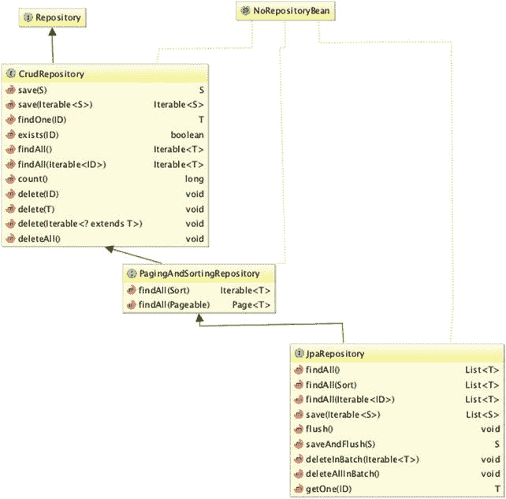

图 5-21.

Spring Data JPA 仓库层次结构

`NoRepositoryBean` 注解用于排除仓库接口被自动发现，并且不会为它们创建仓库实例。

通常，开发人员定义的仓库接口会扩展 `Repository<T,ID extends Serializable>` 层次结构中的某个接口。这将暴露一套完整的方法来操作实体。

如果只需要扩展 `Repository<T,ID extends Serializable>` 接口，但你不喜欢扩展 Spring 组件的想法，可以通过为仓库类添加 `@RepositoryDefinition` 注解来避免。这将产生与扩展 `Repository` 接口相同的效果，因为该接口是空的，所以它被用作一个标记接口，可以用注解替代。

由于本节项目需要 JPA，仓库将扩展 `JpaRepository<T, ID extends Serializable>` 接口，该接口包含一套开箱即用的默认方法骨架，为开发人员省去了相当多的工作。当自定义仓库接口扩展 `JpaRepository` 时，它将自动获得保存实体、按 ID 搜索实体、从数据库中检索所有实体、删除实体、刷新等功能。（只需查看图 5-21，其中列出了所有方法。）

通常，仓库类必须执行 Spring Data 仓库提供的默认方法未涵盖的自定义和更复杂的查询。在这种情况下，开发人员必须定义自己的方法，以便在创建仓库实例时让 Spring 实现这些方法。为了告诉 Spring 这些方法应该做什么，可以使用 `@Query` 注解来标注它们。该注解内部应包含一个查询定义，该定义将在运行时执行并返回结果。在下面的代码片段中，你可以看到使用 Spring Data JPA 时 `UserRepo` 组件的样子。

```
package com.ps.repos;
import com.ps.ents.User;
import org.springframework.data.jpa.repository.JpaRepository;
import org.springframework.data.jpa.repository.Query;
import org.springframework.data.repository.query.Param;
import java.util.List;
public interface UserRepo extends
JpaRepository {
@Query("select u from User u where u.username like %?1%")
List findAllByUserName(String username);
// 使用命名参数
@Query("select u from User u where u.username= :un")
User findOneByUsername(@Param("un") String username);
@Query("select u.username from User u where u.id= :id")
String findUsernameById(Long id);
@Query("select count(u) from User u")
long countUsers();
}
```

每个 `Repository` 接口都必须与其处理的领域对象类型以及主键类型相关联，这就是为什么在上面的例子中，`UserRepo` 接口扩展了 `JpaRepository<User, Long>`。因此，`UserRepo` 将管理具有 `Long` 类型主键值的 `User` 领域对象。

像这样的接口被称为即时仓库，因为它们可以通过扩展 Spring 专用接口之一来即时创建。因此，在底层，正如你可能已经猜到的，Spring 会创建一个代理对象，它是一个功能完整的仓库 Bean。任何默认未提供的额外功能都可以通过定义方法骨架并使用注解提供所需功能来轻松实现。

为了告诉 Spring 必须创建仓库实例，需要引入一个新的配置组件。`@EnableJpaRepositories` 告诉 Spring 必须创建仓库实例。作为参数，必须提供声明了自定义仓库接口的基础包。除此之外，配置还需要一个持久化单元管理器。在下面的代码片段中，你可以看到 Spring JPA 配置中涉及的所有 Bean。

```
import org.springframework.data.jpa.repository.config.EnableJpaRepositories;
import org.springframework.orm.jpa.persistenceunit.DefaultPersistenceUnitManager;
import org.springframework.orm.jpa.persistenceunit.PersistenceUnitManager;
...
@Configuration
@EnableJpaRepositories(basePackages = {"com.ps.repos"})
@Import(DataSourceConfig.class)
public class PersistenceConfig {
@Autowired
DataSource dataSource;
@Autowired
Properties hibernateProperties;
@Bean
public EntityManagerFactory entityManagerFactory(){
LocalContainerEntityManagerFactoryBean
factoryBean = new LocalContainerEntityManagerFactoryBean();
factoryBean.setPersistenceUnitManager(persistenceUnitManager());
factoryBean.setJpaVendorAdapter(new HibernateJpaVendorAdapter());
factoryBean.setJpaProperties(hibernateProperties);
factoryBean.afterPropertiesSet();
return factoryBean.getNativeEntityManagerFactory();
}
@Bean
public PlatformTransactionManager transactionManager() {
return new JpaTransactionManager(entityManagerFactory());
}
@Bean
public PersistenceExceptionTranslationPostProcessor exceptionTranslation(){
return new PersistenceExceptionTranslationPostProcessor();
}
@Bean
public PersistenceUnitManager persistenceUnitManager(){
DefaultPersistenceUnitManager
persistenceUnitManager = new DefaultPersistenceUnitManager();
persistenceUnitManager.setPackagesToScan("com.ps.ents");
persistenceUnitManager.setDefaultDataSource(dataSource);
return persistenceUnitManager;
}
}
```


该配置与由 Hibernate 支持的 JPA 并无不同，并且在此案例中同样使用 Hibernate 作为持久化工具。唯一的区别在于引入了 `PersistenceUnitManager` bean。Spring 利用该 bean 为内部生成的仓库提供对数据源和事务行为的访问。由于 Spring 正是为此目的自行创建仓库，因此不再需要 `@Repository` 注解。

由于这种创建仓库的方式快速且实用，它目前是在 Spring 应用中实现 JPA 的首选方式。在撰写本书时，该库的当前版本为 `1.10.2.RELEASE`。该库是 Spring Data 家族¹⁸的一部分，该项目旨在使仓库组件的创建尽可能实用，无论使用何种数据源。在下一节中，您将了解 Spring Data MongoDB，这是一个提供工具将 Spring 与名为 MongoDB 的 NoSQL 数据库集成的库。

!

在开始下一节之前，您可以在 `09-ps-data-jpa-practice` 项目中尝试使用 Spring Data JPA。在 `UserRepo` Java 文件中有一个编号为 44 的额外 TODO 任务，它挑战您将该接口转换为 Spring Data JPA 仓库，以便 `TestUserRepo` 类中的测试能够通过。

**Spring 与 MongoDB

这是一个附加章节，其中涵盖的信息不会出现在官方考试中。但由于 NoSQL 数据库的使用越来越广泛，我们认为至少浅尝辄止是合适的。NoSQL 数据库是越来越多内容通过互联网生成和分享的产物。关系型数据库非常健壮，旨在以高度结构化的方式存储对象及其之间的连接。但内容并不总是结构化的，将其规范化以存储在关系型数据库中的努力可能会变得繁琐且资源消耗巨大。

更合适的解决方案是拥有一个不需要完美结构化数据的数据库，它应支持云环境且可扩展。因此，NoSQL 数据库应运而生，以支持存储和快速访问大量组织混乱、复杂且不可预测的内容，这些内容也被称为大数据。目前有超过 225 种 NoSQL 数据库，¹⁹ 根据其内部组织方式，它们可以分为以下几类：

*   **键值存储**：使用哈希表，包含一个唯一键和一个指向特定数据项的指针（例如，Amazon SimpleDB、Redis）。这是最简单的实现方式，但当仅需查询或更新部分值时效率较低。

*   **列族存储**：数据按列组织，仍然使用键，但键指向一个列族。它们被创建用于存储和处理分布在多台机器上的海量数据（例如，HBase、Cassandra）。

*   **文档数据库**：类似于键值存储，但模型是键值对集合的版本化文档。半结构化文档以 JSON 等格式存储。这种类型的数据库支持高效查询（例如，MongoDB、CouchDB）。

*   **图数据库**：为了存储数据，使用灵活的图模型，该模型可以跨多台机器扩展（Infinite Graph、Neo4j）。

对于本节中的代码，使用了 MongoDB Community 版²⁰，因为它轻量级且易于在任何操作系统上安装。设置 `09-ps-mongo-sample` 项目采取了以下步骤：

*   第一步是在您的系统上安装它。在任何操作系统上安装的说明都可以在其官方网站上找到：[`https://docs.mongodb.com/manual/administration/install-community/`](https://docs.mongodb.com/manual/administration/install-community/)。

*   下一步是启动 MongoDB。在每个操作系统上都有一个可执行文件可以执行此操作。数据库服务将在 `27017` 端口上启动。

```
    iuliana.cosmina@home  -  $ mongod --dbpath temp/mongo-db/
    CONTROL initandlisten MongoDB starting : pid=89126 port=27017
    dbpath=/Users/iuliana.cosmina/temp/mongo-db/ 64-bit host=home
    CONTROL  initandlisten db version v3.2.8
    ```

*   打开 mongo shell 并通过执行 `db` 命令测试正在使用哪个数据库。返回的结果应为 `test`。

```
    iuliana.cosmina@home - $ mongo
    MongoDB shell version: 3.2.8
    connecting to: test
    Server has startup warnings:
    2016-07-25T22:00:24.783+0300 I CONTROL  initandlisten
    2016-07-25T22:00:24.783+0300 I CONTROL  initandlisten
    ** WARNING: soft rlimits too low.
    Number of files is 256, should be at least 1000
    > db
    test
    >
    ```

出于本节代码示例的目的，无需创建新数据库，因此使用 `test` 即可。

*   创建一个将映射到 MongoDB 对象的领域对象类。该类必须有一个标识字段，并使用来自 `org.springframework.data.annotation` 包的 Spring Data 特殊注解 `@Id` 进行注解。此类型的实例将成为集合中的条目，集合名称与类名相同但小写：`user`。

```
    package com.ps.ents;
    import org.springframework.data.annotation.Id;
    import java.math.BigInteger;
    public class User {
    @Id
    private BigInteger id;
    private String email;
    private String username;
    ... // 其他字段
    public BigInteger getId() {
    return id;
    }
    public void setId(BigInteger id) {
    this.id = id;
    }
    public String getEmail() {
    return email;
    }
    public void setEmail(String email) {
    this.email = email;
    }
    public String getUsername() {
    return username;
    }
    public void setUsername(String username) {
    this.username = username;
    }
    ... // 其他 setter 和 getter
    @Override
    public String toString() {
    return "User{" +
    "id=" + id +
    ", email=’" + email + ’\” +
    ", username=’" + username + ’\” +
    ", password=’" + password + ’\” +
    ", rating=" + rating +
    ", active=" + active +
    ", firstName=’" + firstName + ’\” +
    ", lastName=’" + lastName + ’\” +
    ’}’;
    }
    }
    ```

*   创建一个新的 `UserRepo` 接口，该接口将扩展 Spring Data MongoDB 专用接口 `MongoRepository<T,ID extends Serializable>`。

```
    package com.ps.repos;
    import com.ps.ents.User;
    import org.springframework.data.mongodb.repository.MongoRepository;
    import org.springframework.data.mongodb.repository.Query;
    import java.util.List;
    public interface UserRepo extends MongoRepository {
    @Query("{’username’: { ’$regex’ : ?0 } }")
    List findAllByUserName(String username);
    }
    ```

每个 `RepoMongoRepositorysitory` 接口都必须链接到它处理的对象类型以及唯一标识符的类型，这就是为什么在上面的示例中，`UserRepo` 接口扩展了 `MongoRepository<User, Long>`。因此，`UserRepo` 将管理具有 `Long` 类型唯一标识符的 `User` 对象。

*   创建一个配置类，并使用 `@EnableMongoRepositories` 注解它，以启用 MongoDB 仓库实例的创建。此注解在功能上类似于 `@EnableJpaRepositories`，但需要将声明了 Mongo 仓库类的包作为其 `basePackages` 属性的值提供。


```
    package com.ps.config;
    import com.mongodb.MongoClient;
    ...
    import org.springframework.data.mongodb.MongoDbFactory;
    import org.springframework.data.mongodb.core.MongoTemplate;
    import org.springframework.data.mongodb.core.SimpleMongoDbFactory;
    import org.springframework.data.mongodb.repository.config.EnableMongoRepositories;
    @Configuration
    @EnableMongoRepositories(basePackages = "com.ps.repos")
    @ComponentScan(basePackages = { "com.ps.init"})
    public class AppConfig {
    public static final String DB_NAME = "test";
    public static final String MONGO_HOST = "127.0.0.1";
    public static final int MONGO_PORT = 27017;
    @Bean
    public MongoDbFactory mongoDb() throws Exception {
    return new SimpleMongoDbFactory(new MongoClient(
    MONGO_HOST, MONGO_PORT), DB_NAME);
    }
    @Bean
    public MongoTemplate mongoTemplate() throws Exception {
    return new MongoTemplate(mongoDb());
    }
    }
    ```

`MongoTemplate` 被仓库实例用于操作 `user` 集合中的数据。
创建一个测试类来测试 User 数据的操作。

*   创建一个测试类来测试 `User` 数据的操作。

```
    ...
    @RunWith(SpringJUnit4ClassRunner.class)
    @ContextConfiguration(classes = { AppConfig.class})
    public class TestUserRepo {
    @Autowired
    UserRepo userRepo;
    @Test
    public void testFindById() {
    List johns = userRepo.findAllByUserName("john");
    assertTrue(johns.size() == 2);
    logger.info(johns.toString());
    }
    @Test
    public void testFindAll() {
    List users = userRepo.findAll();
    assertTrue(users.size() == 5);
    }
    @Test
    public void testNoFindById() {
    User user = userRepo.findOne(99L);
    assertNull(user);
    }
    @Test
    public void testCreate() {
    User diana = DBInitializer.buildUser("diana.ross@pet.com");
    diana.setPassword("test");
    diana = userRepo.save(diana);
    assertNotNull(diana.getId());
    }
    ...
    }
    ```

当对象首次保存到集合中时，该集合也会被创建。在首次运行某个测试方法后，可以使用 mongo shell 通过 `db.user.find()` 函数检查 `user` 集合的内容。集合的内容将以 JSON 格式呈现。若要获得美观的打印效果，请使用 `db.user.find().pretty()`。

```
> db.user.find().pretty()
{ "_id" : ObjectId("57966a4a17c62e0eae6b4b20"),
"_class" : "com.ps.ents.User",
"email" : "johnny.big@pet.com",
"username" : "johnny.big",
"rating" : 0,
"active" : true,
"firstName" : "johnny",
"lastName" : "big" }
{ "_id" : ObjectId("57966a4a17c62e0eae6b4b24"),
"_class" : "com.ps.ents.User",
"email" : "john.cusack@pet.com",
"username" : "john.cusack",
"rating" : 0,
"active" : true,
"firstName" : "john",
"lastName" : "cusack" }
```

你可能已经注意到，在 MongoDB 部分中从未提及事务。这是因为事务行为由事务管理器处理。在撰写本书时，Spring 的 `PlatformTransactionManager` 尚未有适用于 MongoDB 的实现，因为这类数据库在 ACID 意义上不具备事务性。

Spring 团队已建立了一个公共 GitHub 仓库 [`https://github.com/spring-projects/spring-data-book`](https://github.com/spring-projects/spring-data-book)，其中包含一个使用大多数受支持的 NoSQL 数据库的 Spring 简单应用示例。如果你感兴趣，欢迎克隆并尝试其中的代码示例。

本章末尾将不再设置练习部分，因为练习已分散在核心内容之后的各小节中。

总结

下面为你整理了与 Spring 数据访问相关的核心概念和重要细节列表：

*   Spring 通过分层架构支持数据访问；较高层对数据管理一无所知。
*   Spring 提供数据访问相关的智能非检查异常，如果未处理，这些异常会传播到较高层。
*   Spring 提供一致的事务管理：声明式事务管理和编程式事务管理。
*   Spring 支持大多数流行的持久化和 ORM 提供者，这些提供者为缓存、对象管理、自动变更检测提供了强大支持。
*   Spring 可以直接与 Hibernate 一起使用，无需 JPA API。
*   Spring 可以与 JPA API 一起使用，但必须由持久化和 ORM 提供者支持。
*   Spring Data JPA 帮助开发者在创建仓库组件时避免样板代码。
*   Spring Data 系列项目也提供对 NoSQL 数据库的支持。
*   事务管理可以由 Spring 专用的基础设施 Bean 完成，也可以由应用服务器提供的事务管理器完成。
*   数据库可以在 Spring 配置中定义，也可以由应用服务器提供。

测验

问题 1：Spring 框架支持哪些数据访问技术？（选择所有适用项）

1.  JDBC
2.  Hibernate
3.  JPA
4.  NoSQL

问题 2：使用 `JdbcTemplate` 时，Spring 是否支持事务性执行？

1.  是的，如果封装 `JdbcTemplate` 的方法使用了 `@Transactional` 注解
2.  不支持

问题 3：分析以下代码片段：

```
public Set findAll() {
String sql = "select id, username, email, password from p_user";
return new HashSet(jdbcTemplate.query(sql, rowMapper));
}
```

关于 `rowMapper` 对象，以下哪些说法是正确的？（选择所有适用项）

1.  必须实现 `RowMapper<T>` 接口
2.  是有状态的
3.  提供一种方法，将 `ResultSet` 内容转换为 `User` 对象

问题 4：`JdbcTemplate` 是否支持执行 SQL 原生查询？

1.  是
2.  否
3.  如果配置了则支持

问题 5：`JdbcTemplate` 不提供以下哪项功能？

1.  将 JDBC 异常包装为 `DataAccessException`
2.  数据源访问
3.  使用命名参数执行 JDBC 查询
4.  打开/关闭连接的方法

问题 6：在 Spring 应用中实现事务行为需要做什么？（选择所有适用项）

1.  通过在配置类上添加 `@EnableTransactionManagement` 注解来启用声明式事务支持
2.  声明一个事务管理器 Bean
3.  在服务方法上添加 `@Transactional` 注解
4.  激活事务配置文件
5.  使用 XML 时，声明 `<tx:annotation-driven/>`

问题 7：以下哪些是有效的事务传播行为值？（选择所有适用项）

1.  MANDATORY
2.  REQUIRED
3.  PREFERED
4.  NOT_ALLOWED

问题 8：何时应将事务声明为 `readOnly`？

1.  当它不包含任何写入语句执行时
2.  当读取大量数据时
3.  当不允许对数据库进行任何更改时

问题 9：分析以下代码片段：

```
@Service
@Transactional(readOnly = true, propagation = Propagation.REQUIRED)
public class UserServiceImpl implements UserService {
@Transactional(propagation = Propagation.REQUIRES_NEW)
@Override
public User findById(Long id) {
return userRepo.findById(id);
}
}
```

关于 `findById()` 方法，以下哪些说法是正确的？

1.  该方法在一个新事务中执行
2.  当方法执行时，会抛出异常，因为事务未声明为 `readOnly`
3.  该方法在现有事务中执行

问题 10：Spring 提供编程式事务管理。用于实现使用编程式事务管理的仓库类的 Spring 类型 Bean 有哪些？（选择所有适用项）

1.  `TransactionTemplate`
2.  `TransactionDefinition`
3.  `TransactionService`
4.  `TransactionCallback`
5.  `PlatformTransactionManager`
6.  `TransactionStatus`

问题 11：事务管理中的默认回滚策略是什么？

1.  任何异常都回滚
2.  RuntimeException 回滚
3.  受检异常回滚
4.  始终提交


问题 12：Spring 在“底层”使用什么来实现事务行为？

1.  JDBC

2.  JPA

3.  AOP

问题 13：如果一个标注了 `@Transactional` 的方法调用了另一个也标注了 `@Transactional` 的方法，会发生什么？

1.  每个方法都会创建一个事务

2.  创建一个单一事务，这些方法作为一个工作单元执行

3.  取决于每个 `@Transactional` 的配置

问题 14：以下哪些是 Hibernate 特有的 Spring 基础设施 Bean？（选择所有适用的选项）

1.  `SessionFactory`

2.  `Session`

3.  `HibernateTransactionManager`

4.  `HikariDataSource`

5.  `LocalSessionFactoryBuilder`

问题 15：关于 `@Entity` 注解，以下哪些说法是正确的？（选择所有适用的选项）

1.  它是 JPA 官方 API 的一部分

2.  可以在没有 JPA API 的情况下使用

3.  将类标记为实体；该类的实例将被映射到表记录

4.  它只能放在类级别

问题 16：在 Spring 中使用 JPA 需要什么？（选择所有适用的选项）

1.  声明一个 `EntityManagerFactory` Bean

2.  声明一个 `PersistenceProvider` Bean

3.  声明一个 `JpaTransactionManager` Bean

4.  以上所有

问题 17：如何使用 Spring Data JPA 声明一个即时仓库？（选择所有适用的选项）

1.  继承 `Repository` 接口

2.  无需继承接口；只需用 `@RepositoryDefinition` 注解该接口

3.  要获得开箱即用的多个方法，请继承 `JpaRepository`

4.  实现 `Repository` 接口

问题 18：哪个配置注解能够启用 Spring Data JPA 创建仓库实例？

1.  `@EnableJpaRepositories`

2.  `@EnableInstantRepositories`

3.  `@EnableRepositoryGeneration`

4.  `@EnableTransactionManagement`

问题 19：分析以下代码片段：

```
public interface UserRepo extends JpaRepository {
@Query("select u from User u where u.username like %?1%")
List findAllByUserName(String username);
}
```

关于 `findAllByUserName()` 方法，以下哪些说法是正确的？

1.  这不是一个有效的 Spring Data JPA 仓库方法

2.  `@Query` 的参数是一个 JPQL 查询

3.  该类不是一个仓库，因为它没有用 `@Repository` 注解

4.  这段代码无法编译

脚注

My Batis 之前被称为 iBatis，在 Apache 放弃它之后。更多信息请访问新官方网站：[`blog.mybatis.org/`](http://blog.mybatis.org/)

更多信息请访问 Spring 官方参考页面：[`http://docs.spring.io/spring/docs/4.3.2.RELEASE/spring-framework-reference/htmlsingle/#jdbc-packages`](http://docs.spring.io/spring/docs/4.3.2.RELEASE/spring-framework-reference/htmlsingle/#jdbc-packages) 。

其他用于访问不同类型资源的 Spring 类遵循相同的模式：JmsTemplate、RestTemplate 等。

多态是面向对象编程的原则之一。该术语源于希腊语，意为一个名字，多种形式。多态在软件中表现为多个方法具有相同的名称但功能略有不同。

JPA 和 Hibernate 也使用了这种提供参数的方式。

代码可在 GitHub 上访问：[`https://github.com/spring-projects/spring-framework/blob/master/spring-jdbc/src/main/java/org/springframework/jdbc/core/namedparam/NamedParameterJdbcTemplate.java`](https://github.com/spring-projects/spring-framework/blob/master/spring-jdbc/src/main/java/org/springframework/jdbc/core/namedparam/NamedParameterJdbcTemplate.java) ，或者在 Intellij IDEA 中，点击类名并按下 Control（MacOS 上为 Command）键，源代码将为您打开。

其众多签名和推荐用法可以在在线官方 JavaDoc 中查看：[`http://docs.spring.io/spring/docs/current/javadoc-api/org/springframework/jdbc/core/JdbcTemplate.html`](http://docs.spring.io/spring/docs/current/javadoc-api/org/springframework/jdbc/core/JdbcTemplate.html) 。

这种方法会使应用程序容易受到 SQL 注入攻击，这就是为什么在企业应用程序中，永远不会通过执行代码中带有用户提供参数值的 DDL 脚本来创建表。

类 org.springframework.dao.DataAccessException 是一个抽象类，是所有 Spring 数据访问异常家族的父类。

此规则的一个例外是服务器着火或严重进水。

您可以从 Atomikos 的官方网站了解更多信息：[`https://www.atomikos.com/`](https://www.atomikos.com/) 。

最受欢迎的程序员社交网络：[`http://stackoverflow.com`](http://stackoverflow.com/)

自 2009 年以来，关于 Spring 分布式事务最受欢迎的文章是 David Sayer 的 [`http://www.javaworld.com/article/2077963/open-source-tools/distributed-transactions-in-spring–with-and-without-xa.html`](http://www.javaworld.com/article/2077963/open-source-tools/distributed-transactions-in-spring%E2%80%93with-and-without-xa.html) 。

关于如何配置和使用 Atomikos JTA 提供程序的完整步骤列表可在 Spring 官方博客上找到：[`https://spring.io/blog/2011/08/15/configuring-spring-and-jta-without-full-java-ee/`](https://spring.io/blog/2011/08/15/configuring-spring-and-jta-without-full-java-ee/) 。

Hibernate OGM 为 NoSQL 解决方案提供 Java 持久化（JPA）支持。它重用 Hibernate ORM 的引擎，但将实体持久化到 NoSQL 数据存储中，而不是关系数据库中。在官方网站上了解更多信息：[`http://hibernate.org/ogm/`](http://hibernate.org/ogm/) 。

您可以在其 GitHub 页面上阅读更多关于该项目的信息：[`https://github.com/brettwooldridge/HikariCP`](https://github.com/brettwooldridge/HikariCP) 。

使用 @PersistenceContext 注解的 EntityManager 实例无法从构造函数访问，因为它无法在构造函数中创建并与持久化上下文关联。原因是 @PersistenceContext 的定义。此注解定义了以下元注解：@Target(value=TYPE,METHOD,FIELD)。完整的 JavaDoc API 在此：[`http://docs.oracle.com/javaee/7/api/javax/persistence/PersistenceContext.html`](http://docs.oracle.com/javaee/7/api/javax/persistence/PersistenceContext.html) 。

项目官方页面：[`http://projects.spring.io/spring-data/`](http://projects.spring.io/spring-data/)

您可以在此处阅读相关内容：[`http://nosql-database.org/`](http://nosql-database.org/) 。

官方网站在此：[`https://www.mongodb.com/community`](https://www.mongodb.com/community) 。

6. Spring Web

在前面的章节中，描述了多层风格的项目。在服务层之上始终是表示层，即 Web 层。该层是应用程序的顶层，其主要功能是将用户操作转换为较低层可以理解的命令，并将它们的结果转换为用户可理解的数据。Web 应用程序可以使用客户端（如浏览器）或能够正确解释应用程序提供的接口的特定应用程序（如移动应用程序）进行访问。到目前为止，本书只介绍了特定于较低层的 Spring 组件。本章将浅析特定于表示层的组件，这些组件用于构建用户界面和实现安全性。

Spring 也通过 Spring Web MVC 和 Spring WebFlow 等框架为 Web 层的开发提供支持。一个典型的 Java Web 应用程序架构如图 6-1 所示。

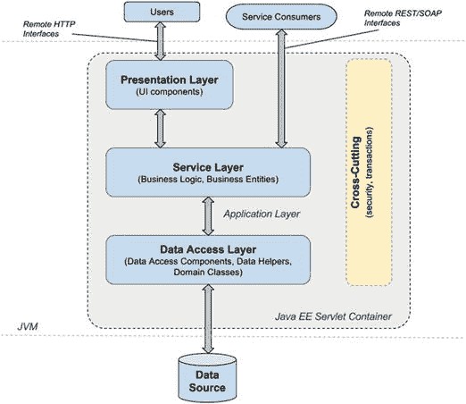

图 6-1.

典型的 Java Web 应用程序架构

可以有更多层，但通常 Web 应用程序至少包含以下三层：

*   DAO 层，其中定义了数据映射组件（领域对象或实体类）。


*   **服务层**（也称为业务层），其中包含所有用于将用户数据转换并传递给 DAO 层的类。业务实体是辅助此转换的 POJO。该层的所有组件都实现了数据的创建、显示、存储和更改方式。

*   **表示层**，其中包含实现和显示用户界面以及管理用户交互的组件。

Spring Web MVC 是一个流行的、基于请求驱动的框架，它遵循**模型-视图-控制器**软件架构模式，旨在解耦那些协同工作以构成完整用户界面的组件。典型的模型-视图-控制器行为如图 6-2 所示。

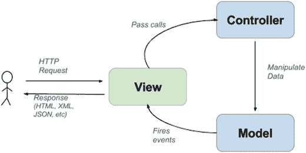

图 6-2.
典型的 MVC 行为

MVC 的主要思想是存在三个解耦的组件。每个组件都可以轻松替换为不同的实现，并且它们共同提供所需的功能。**视图**代表用户与之交互的界面。它显示数据并将请求传递给**控制器**。**控制器**调用业务组件并将数据发送给**模型**，模型通知视图需要进行更新。模型的内容由视图显示。

Spring Web MVC 的核心是 `DispatcherServlet` 类，它是每个 Spring Web 应用程序的入口点。它将请求分派给处理器，并支持可配置的处理器映射、视图解析、区域设置、时区以及文件上传。`DispatcherServlet` 将 HTTP 请求转换为控制器组件的命令，并同时管理渲染后的数据。它基本上充当了整个应用程序的**前端控制器**。前端控制器软件设计模式的基本思想是存在一个处理请求的集中点，如图 6-3 所示。

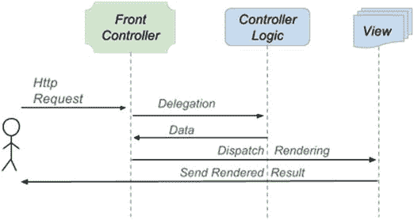

图 6-3.
前端控制器软件设计模式思想

Spring Web MVC 为这种行为的实现提供了已配置好的 Bean，这些 Bean 包含在两个主要模块中：

*   `spring-web.jar`
*   `spring-webmvc.jar`

使用标准的 Servlet 监听器来启动和关闭 Spring 应用程序上下文。在任何请求发出之前，应用程序上下文将被创建并注入到 `DispatcherServlet` 中；当应用程序停止时，Spring 上下文也会被优雅地关闭。Spring Servlet 监听器类是 `org.springframework.web.context.ContextLoaderListener`。

Spring Web MVC 是 Spring 的 Web 框架，因此使用 Spring 典型的配置风格，并且控制器组件是 Bean。从 Spring 2.5 开始，引入了注解配置，因此可以使用专门的构造型注解 `@Controller` 来声明控制器组件。Spring 应用程序可以部署在应用服务器上，可以在像 Jetty 这样的嵌入式服务器上运行，也可以使用 Spring Boot 运行。本章将涵盖这三种方式。

Spring 可以与其他框架集成：

*   **Struts 2**：一个基于 Apache 的开源框架，用于基于模型-视图-控制器（MVC）设计范式构建 Servlet/JSP Web 应用程序。该框架的先前版本 Struts 1 已于 2016 年停止维护，但 Struts 2 仍然活跃，并且根据其官方网站公告，2016 年 7 月 7 日发布了 2.5.2 GA 版本。更多信息请访问官方网站 [`https://struts`](https://struts.apache.org/) `.` [`apache.org/`](https://struts.apache.org/) `.`
*   **Wicket**：另一个来自 Apache 的开源 Java Web 框架，诞生于 2004 年，至今仍然活跃；2016 年 8 月 5 日发布了 1.5.16 版本。该框架的设计以简洁和关注点分离为主要目标。更多信息请访问官方网站 [`http://wicket`](http://wicket.apache.org/) `.` [`apache.org/`](http://wicket.apache.org/) `.`
*   **Tapestry 5**：一个面向组件的框架，用于在 Java 中创建高度可扩展的 Web 应用程序，同样由 Apache 支持。更多信息请访问官方网站 [`http://tapestry.apache.org/`](http://tapestry.apache.org/) `.`
*   **Spring WebFlow**：一个 Spring 框架，专为实现有状态流程而设计，适用于需要通过顺序步骤导航来执行业务任务的应用程序。更多信息请访问官方网站 [`http://projects.spring.io/spring-webflow/`](http://projects.spring.io/spring-webflow/) 。

使用 Spring Web MVC 编写和运行 Web 应用程序就像编写前几章中简单的独立应用程序一样容易。Spring 为启动 Web 应用程序所需的一切提供了基础设施 Bean，甚至提供了一个名为 Spring Boot 的框架，它通过提供已设置好默认通用配置的基础设施 Bean，使得创建独立的、生产级的基于 Spring 的应用程序变得简单。所有这些都将在本章中介绍，但请记住，本章只是触及了该主题的表面，因为 Spring Web MVC 是 Pivotal 认证 Spring Web 应用程序开发人员考试的主题之一，为此，Apress 出版了另一本书。¹

Spring Web 应用程序配置

当用户访问一个 URL 时，会向托管在应用服务器上的 Web 应用程序生成一个 HTTP 请求。基于该请求，必须在应用程序上下文内执行一个操作。执行操作的结果被返回，并且需要使用视图来表示。在 Spring Web 应用程序中，所有 HTTP 请求首先到达 `DispatcherServlet`。根据配置，会调用一个处理器，它是名为控制器的类的一个方法。结果用于填充模型，该模型被返回给 `DispatcherServlet`，后者根据另一组配置决定使用哪个视图来显示结果。

此过程如图 6-4 所示。

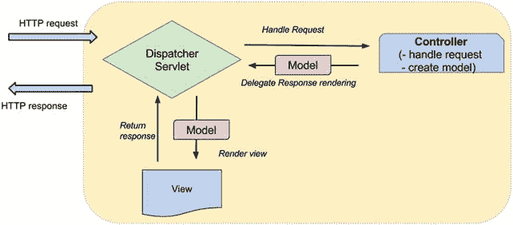

图 6-4.
Spring Web 应用程序中的请求处理步骤

`DispatcherServlet` 是应用程序的入口点，是 Spring Web MVC 的核心，它协调所有请求处理操作。它相当于 Struts 中的 `ActionServlet` 和 JEE 中的 `FacesServlet`²。它将职责委托给 Web 基础设施 Bean，并调用用户 Web 组件。它是可定制和可扩展的。当使用旧式 XML 配置应用程序时，必须在 `web.xml` 中定义 `DispatcherServlet`。当使用无 `web.xml` 的配置时，必须声明一个扩展了 `AbstractDispatcherServletInitializer` 或 `AbstractAnnotationConfigDispatcherServletInitializer` 的配置类。这两个是来自 `org.springframework.web.servlet.support` 包的 Spring 专用类，它们实现了 `org.springframework.web.WebApplicationInitializer`。实现此接口的类型的对象会被 `SpringServletContainerInitializer` 自动检测到，而 `SpringServletContainerInitializer` 会被每个 Servlet 3.0+ 环境自动引导。本章将介绍更多关于用于引导 Spring 和配置 `DispatcherServlet` 的专用类，并提供关于每种使用场景的上下文信息。


`DispatcherServlet` 使用 Spring 进行配置，因此必须通过接口进行编程，以便轻松替换不同的实现。

`DispatcherServlet` 会创建一个独立的“servlet”应用程序上下文，其中包含所有特定的 Web Bean（控制器、视图、视图解析器）。此上下文也称为 Web 上下文或 `DispatcherServletContext`。

应用程序上下文也称为 `RootApplicationContext`。它包含所有非 Web Bean，并通过类型为 `org.springframework.web.context.ContextLoaderListener` 的 Bean 进行实例化。这两个上下文之间的关系是父子关系，其中应用程序上下文是父级。因此，Web 上下文中的 Bean 可以访问父上下文中的 Bean，但反之则不行。³ 当一个应用程序定义了多个 Servlet 时，这种分离非常有用，例如，一个 Servlet 处理 Web 请求，另一个处理 Web 服务调用，因为它们都可以从根应用程序上下文继承 Bean。

当然，根上下文中的 Bean 可以包含在 Web 上下文中，但大多数非平凡的 Spring 应用程序都需要为 Web 部分和非 Web 部分设置独立的上下文，因为通常应用程序的 Web 部分只是整个应用程序的一小部分，而生产应用程序有许多位于 Web 上下文之外的问题需要关注。

`DispatcherServlet` 使用一些称为处理映射的基础设施 Bean 来识别要调用的控制器方法，并使用处理程序适配器来调用它。图 6-5 描述了一个描述调用序列的抽象图。

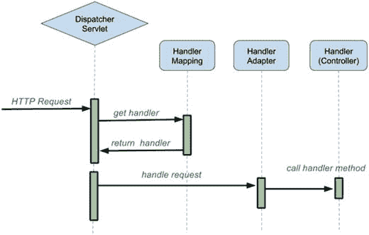

图 6-5. 处理 HTTP 请求的抽象 UML 图

在 Spring MVC 2.5 之前的版本中，所有配置都是使用 XML 完成的，并且控制器类必须继承 `org.springframework.web.servlet.mvc.AbstractController` Spring 类。在 Spring 2.5 中，引入了新的 @MVC 模型和对注解的支持。配置仍然依赖 XML 来处理 MVC 基础设施特定的 Bean，但控制器类不再需要继承 Spring 的专用类，因为只需使用原型注解 `@Controller` 对其进行注解，Spring 就能知道它们的用途。从 Spring 3.0 开始，引入了 Java 配置，这导致完全消除了 XML 配置。几乎完全消除。因为 Java Web 应用程序的典型配置文件 `web.xml` 仍然需要。从 Servlet 3.0 开始，`web.xml` 也不再需要了。

本书更侧重于 Web 应用程序的 @MVC 和 Java 配置，因为 XML 未来可能会被弃用。在 XML 配置主题上只会浅尝辄止，只是为了让你有个概念。

快速入门

以下是开发 Spring Web MVC 应用程序通常采取的步骤：

*   开发后端应用程序 Bean（服务和 DAO）及配置
*   开发 MVC 功能 Bean，也称为控制器或处理程序，其中包含也将用于处理 HTTP 请求的方法，这些方法称为处理程序方法
*   开发用于显示处理程序返回结果的视图（常见的 `*.jsp` 文件）
*   声明并配置 MVC 基础设施 Bean
*   配置 Web 应用程序

控制器

控制器是定义用于处理 HTTP 请求的方法的类。它们使用 Spring 的原型注解 `@Controller` 进行注解。每个处理程序方法都使用 `@RequestMapping` 进行注解，该注解提供了关于何时应调用此方法的信息。在以下代码片段中，定义了一个控制器类，其中包含一个处理程序方法，当用户发送具有以下 URL 的请求时，将调用该方法：

`http://localhost:8080/mvc-basic/users/list`

该 URL 包含以下元素：

*   `http` 是 HTML 协议定义
*   `localhost` 是安装应用程序服务器的机器名称/域名/IP
*   `8080` 是访问应用程序服务器的端口
*   `mvc-basic` 是 Web 应用程序上下文
*   `/users/list` 是请求映射值

```
import org.springframework.beans.factory.annotation.Autowired;
import org.springframework.stereotype.Controller;
import org.springframework.ui.Model;
import org.springframework.web.bind.annotation.RequestMapping;
import org.springframework.web.bind.annotation.RequestMethod;
...
@Controller
public class UserController {
@Autowired
private UserService userService;
/**
* 处理列出所有用户的请求。
*/
@RequestMapping(value = "/users/list", method = RequestMethod.GET)
public String list(Model model) {
logger.info("正在使用列表填充模型...");
model.addAttribute("users", userService.findAll());
//用于标识视图的字符串
return "users/list";
}
}
```

Spring 提供了一种方法，通过 `@RequestMapping` 注解的 `method` 属性，来指定应在哪种 HTTP 请求类型上调用处理程序方法。⁴ 映射规则通常基于 URL，并且还可以包含通配符和正则表达式。`@RequestMapping` 也可以在类级别使用，以便在映射具有公共元素时简化方法级别的映射。例如，如果你有许多具有公共模式 `/users` 的 `@RequestMapping` 方法，则 `UserController` 类可以使用 `@RequestMapping("/users")` 进行注解，如下面的代码片段所示。

```
...
@Controller
@RequestMapping("/users")
public class UserController {
//匹配 http://localhost:8080/mvc-basic/users/list
@RequestMapping(value = "/list", method = RequestMethod.GET)
public String list(Model model) { ...}
//匹配 http://localhost:8080/mvc-basic/users/105
@RequestMapping(value = "/{id:\\d*}", method = RequestMethod.GET)
public String show(Long id, Model model) {
...
}
}
```

处理程序方法具有灵活的方法签名，其参数提供了有关请求上下文的信息。当调用处理程序方法时，Spring 将透明地提供参数。根据 URL 类型，可以使用不同的注解来告诉 Spring 要使用哪些值。

*   URL（统一资源定位符）

`http://localhost:8080/mvc-basic`
    `/showUser?userId=105`

由具有使用 `@RequestParam` 注解的参数的方法处理，因为该请求是参数化的。如果 URL 参数的名称与方法参数的名称不同，则使用该注解来告知 Spring。

CC

此处的约定是，如果 `@RequestParam` 注解中未指定参数名称，则请求参数名称与方法参数名称相同。

*   URI（统一资源标识符）是一种更简洁的 URL 请求参数。从 Spring 3.0 开始支持处理 URI。

```
import org.springframework.web.bind.annotation.RequestParam;
...
@Controller
@RequestMapping("/users")
public class UserController {
@RequestMapping(value = "/showUser", method = RequestMethod.GET)
public String show(@RequestParam("userId") Long id, Model model) {
...
}
}
```

`http://localhost:8080/mvc-basic`
`/users/105`

上述 URI 由具有使用 `@PathVariable` 注解的参数的方法处理，因为请求 URI 包含一个可变的部分。该部分称为路径变量，由 `@RequestMapping` 注解定义。如果路径参数的名称与方法参数的名称不同，则使用该注解来告知 Spring。

CC

此处的约定是，如果 `PathVariable` 注解中未指定路径变量名称，则路径变量名称与方法参数名称相同。


```
import org.springframework.web.bind.annotation.PathVariable;
...
@Controller
@RequestMapping("/users")
public class UserController {
@RequestMapping(value = "/{userId}", method = RequestMethod.GET)
public String show(@PathVariable("userId") Long id, Model model) {
...
}
}
```

处理器方法通常返回一个字符串值，该值代表一个逻辑视图名称，并且视图会使用`Model`对象中的值进行填充。

CC

默认情况下，逻辑视图名称被解释为 JSP 页面的路径。控制器方法也可以返回 null 或 void，在这种情况下，会根据请求 URL 选择默认视图。控制器方法也可以返回具体的视图，但这通常会被避免，因为它会将控制器与视图实现耦合在一起。

```
import org.springframework.web.servlet.ModelAndView;
...
@Controller
@RequestMapping("/users")
public class UserController {
@RequestMapping(value = "/{userId}", method = RequestMethod.GET)
public ModelAndView show(@PathVariable("userId") Long id) {
User user = ...;// 无关代码
ModelAndView modelAndView = new ModelAndView("user");
return modelAndView;
}
}
```

模型包含用于填充视图的数据。Spring 提供了视图解析器来实现这一点，以避免与特定的视图技术绑定。Spring 开箱即用地支持 JSP、Velocity 模板和 XSLT 视图。实现此功能所需使用的接口是 `ViewResolver` 和 `View`。前者提供了视图名称与实际视图之间的映射。后者负责准备请求并将其转发给视图技术。`DispatcherServlet` 委托给 `ViewResolver` 来将逻辑视图名称映射到视图实现。Spring 开箱即用地提供了几个视图解析器实现。所有处理器方法必须解析为一个对应某个文件的逻辑视图名称，要么通过显式返回一个 `String`、`View` 或 `ModelAndView` 实例，要么基于内部约定隐式确定。Spring 提供的核心视图解析器是 `InternalResourceViewResolver`；它是默认的视图解析器。在 `spring-webmvc.jar` 内部有一个名为 `DispatcherServlet.properties` 的文件，其中声明了所有默认的基础设施 Bean。如果你查找默认的视图解析器，你会找到前面提到的实现：

```
org.springframework.web.servlet.ViewResolver=
org.springframework.web.servlet.view.InternalResourceViewResolver
```

可以通过向 `DispatcherServlet` 注册一个 `ViewResolver` Bean 来覆盖默认实现。默认的视图解析器实现也是可定制的，并且可以配置为在不同的位置查找视图模板文件。前面的代码片段返回字符串值作为视图名称。在图 6-6 中，描述了视图解析的配置和机制。

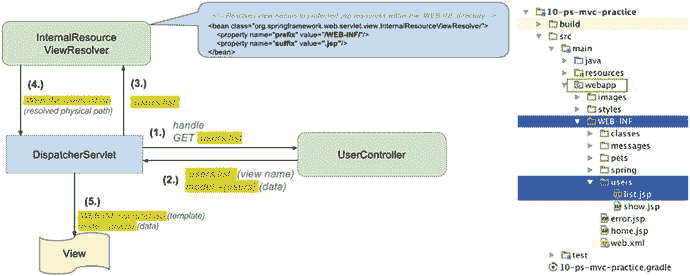

图 6-6.

自定义内部资源视图解析器示例

上图描述了 `DispatcherServlet`、`UserController` 以及由开发者配置的 `InternalResourceViewResolver` Bean 如何协同工作以生成视图。每个动作都有一个编号，步骤如下所述：

1.  `DispatcherServlet` 识别出处理 `users/list` GET 请求的处理器方法，并请求 `UserController` 的方法来处理该请求。

2.  执行处理器方法，并将逻辑视图名称 `users/list` 以及一个包含名为 `users` 的集合的模型对象返回给 `DispatcherServlet`。请注意，`model={users}` 是一种表示法，意味着 `users` 对象包含在模型对象中。

3.  `DispatcherServlet` 询问 `InternalResourceViewResolver`，`users/list` 这个逻辑视图名称对应哪个视图模板。

4.  `InternalResourceViewResolver`（配置如下所示）获取逻辑视图名称，应用前缀 `(/WEB-INF/)` 和后缀 `(.jsp)`，并将结果 `(/WEB-INF/users/list.jsp)`（即视图模板的物理路径）发送给 `DispatcherServlet`。

5.  `DispatcherServlet` 将进一步使用 `InternalResourceViewResolver` 提供的视图模板以及从 `UserController` 接收到的模型对象来创建一个视图。

总结到目前为止的所有内容，为了能够完全深入 Spring MVC 配置，要配置一个 Spring Web 应用程序，你必须执行以下操作：

*   在 `web.xml` 文件中将 `DispatcherServlet` 定义为应用程序的主 Servlet，它将处理所有请求，并将其链接到 Spring 配置；或者通过使用实现 `WebApplicationInitializer` 的类以编程方式配置此 Servlet（仅在 Servlet 3.0+ 环境中可行）。

*   定义应用程序配置（通常在一个名为 `mvc-config.xml` 的 Spring 配置文件中，或者一个 Java 配置类中），该配置应包含以下内容：

*   定义所使用的 MVC 上下文（处理器适配器、处理器映射和其他基础设施 Bean）

*   定义一个（或多个）视图解析器

听起来很简单，对吧？

XML

要将 `DispatcherServlet` 定义为应用程序的主 Servlet，必须修改位于 `webapp\WEB-INF` 目录下的 `web.xml` 文件，以包含这个 Spring 专用的 Servlet 及其参数。

以下配置片段适用于此场景：

```

pet-dispatcher

org.springframework.web.servlet.DispatcherServlet

contextConfigLocation

/WEB-INF/spring/mvc-config.xml

pet-dispatcher
/

...

```

`DispatcherServlet` 被命名为 `pet-dispatcher`，并且 Spring Web MVC 配置文件在 `web.xml` 文件中被引用为 `contextConfigLocation` 参数的值。在上述情况下，`mvc-config.xml` 包含了前端的 Spring 配置（控制器和 MVC 基础设施 Bean），该文件由 `DispatcherServlet` 加载，并为应用程序创建了一个 Web 执行上下文。

`servlet-mapping` 元素将所有传入的请求映射到 `DispatcherServlet`，并且 `url-pattern` 元素甚至可以包含一个上下文来进一步过滤请求，以防使用其他 Servlet（例如：安全处理器 Servlet）。

视图解析器 Bean 的声明应位于 `mvc-config.xml` 文件中，因为它是一个 Spring 基础设施 Bean。为了匹配前面介绍的 Web 应用程序的内部结构，该 Bean 的自定义方式如下：

```

...

```

这样配置的 `InternalResourceViewResolver` 从 `DispatcherServlet` 接收逻辑视图名称，应用前缀 `(/WEB-INF/)` 和后缀 `(.jsp)`，并将结果（类似于 `(/WEB-INF/[template_path/template_name].jsp)`，即视图模板的物理路径）发送给 `DispatcherServlet`，后者将使用该视图模板和从控制器接收到的模型对象来创建一个视图，该视图将显示给最终用户。

`InternalResourceViewResolver` 还有更多属性，其中一个重要的属性是 `requestContextAttribute`，它是请求特定状态（例如当前 Web 应用程序上下文、当前区域设置、当前主题以及潜在的绑定错误）的上下文持有者。它提供了对本地化消息和 `Errors` 实例的便捷访问。

```

...

```


本地化与个性化是高级主题，CORE 认证考试并不要求掌握，因此此处不作详细展开。之所以提到`requestContextAttribute`，是因为大多数刚接触 Spring 的开发者常常忽略它，导致在切换语言环境和主题时感到困惑——即使他们声明并配置了所有必要的 Bean，功能也无法正常运作。此外，`*.jsp`文件中会使用`requestContext`来决定语言环境和主题。以下 JSP 代码片段展示了如何利用该属性实现部分 URL，这些 URL 在被点击时会设置应用程序的语言环境。这里使用了额外的标签库：用于条件判断的 JSTL 标签库，以及用于国际化的 Spring 标签库。完整代码示例可参见本书附带的代码文件。

```

...

```

下一步：定义控制器。该类此前已介绍过，因此以下代码片段仅展示控制器类的核心元素。此处涉及的方法用于处理显示用户的请求。`id`值是 URI 的一部分，由 Spring 自动填充。`userService`是一个用于从数据库提取数据的 Bean，而`users/show`是视图的逻辑名称，它将被解析为`/WEB-INF/users/show.jsp`视图。

```
//自定义异常，实现细节与上下文无关
import com.ps.problem.NotFoundException;
...
@Controller
@RequestMapping("/users")
public class UserController {
private UserService userService;
public void setUserService(UserService userService) {
this.userService = userService;
}
@RequestMapping(value = "/{id:\\d*}", method = RequestMethod.GET)
public String show(@PathVariable Long id, Model model)
throws NotFoundException {
User user = userService.findById(id);
if (user == null) {
throw new NotFoundException(User.class, id);
}
model .addAttribute("user", user);
return "users/show";
}
}
```

控制器 Bean 也必须在`mvc-config.xml`文件中进行声明。

```

...

```

模型已填充了用户对象。现在，既然我们已经有了视图解析器和处理器，就需要定义`show.jsp`视图。该视图将通过名称`user`引用模型对象，并显示其属性的值。以下 JSP 代码片段展示了如何在 JSP 页面的代码中使用`user`对象。

```

...

${user.firstName}

${user.lastName}

${user.username}

${user.userType}

${user.rating}

```

JSP 页面通常使用标签库进行开发，这些标签库扩展了页面中可用的 JSP 元素集合，并提供了更简洁的语法。JSP 代码片段中声明的 Spring 标签库用于根据应用程序的语言环境提取表格标题的文本。例如，在创建要展示给最终用户的视图时，如果语言环境是英语，`<spring:message code="label.User.firstname"/>` 将被转换为 Firstname；如果语言环境是德语，则转换为 Vorname。

@MVC

在 Spring 3.0 中，@MVC 引入了一种新的配置模型。MVC XML 配置的主要组件是`<mvc:annotation-driven/>`元素，它注册了 Web 应用程序运行所需的所有默认基础设施 Bean：处理器映射、验证、转换 Bean 以及其他许多组件。

另一个重要的组件是`<mvc:default-servlet-handler/>`。通常在 Spring Web 应用程序中，默认的 Servlet 映射"/"被映射到 DispatcherServlet。这意味着静态资源也必须由它来提供，这可能会在响应时引入一定的延迟，因为 DispatcherServlet 需要找到请求 URL 所映射的资源。可以这样理解：一个请求到达 DispatcherServlet。DispatcherServlet 的默认行为是开始寻找一个控制器来处理这个请求。当它找不到时，就假定这是一个对静态资源的请求，然后询问静态资源处理器是否能处理该请求。通过声明`<mvc:default-servlet-handler/>`，一个用于处理静态资源的处理器被定义，并具有最低优先级，这个处理器将首先被询问是否能处理该请求。

从技术上讲，`<mvc:default-servlet-handler/>`配置了一个`DefaultServletHttpRequestHandler`，其 URL 映射为"/*"，并且相对于所有其他 URL 映射具有最低优先级，其唯一职责是提供静态资源。

要使用@MVC 元素，必须指定 mvc 命名空间：

@MVC 模型提供了许多开箱即用的功能，但这些超出了本书的范围。如果您想了解更多，有一本很好的 Apress 书籍涵盖了 Spring Web 相关内容：《The Pivotal Certified Spring Web Application Developer Exam Study Guide》。

Spring MVC 的 Java 配置

在 Spring 3.1 中，引入了`@EnableWebMvc`注解。当在配置类上使用此注解时，它等同于`<mvc:annotation-driven/>`。当然，还有一些额外的细节需要处理，以确保配置按预期工作，这些内容都将在本节中介绍。

第一步是将`mvc-config.xml`转换为配置类。每个 Bean 定义、每个扫描元素都必须在 Web 配置类中有对应的项。配置类必须使用`@Configuration`和`@EnableWebMvc`注解进行标注，并且要么实现`WebMvcConfigurer`接口，要么扩展该接口的一个实现（例如`WebMvcConfigurerAdapter`），这使开发者能够仅覆盖自己感兴趣的方法。使用`@EnableWebMvc`注解配置类会导入在`WebMvcConfigurationSupport`类中实现的 Spring MVC 配置，并且等同于`<mvc:annotation-driven/>`。该类注册了 Web 应用程序所需的许多基础设施 Spring 组件，本节仅涵盖其中一部分，因为 Spring Core 认证考试并不完全要求掌握此主题。

为了告知`DispatcherServlet`配置将由配置类而非文件提供，需要在`web.xml`中进行以下更改：

*   定义一个名为`contextClass`的初始化参数，其值为用于创建基于注解的上下文的 Spring 类的完整类名。
*   名为`contextConfigLocation`的初始化参数的值将是开发者编写的配置类的完整类名。

```

pet-dispatcher

org.springframework.web.servlet.DispatcherServlet

contextClass

org.springframework.web.context.
support.AnnotationConfigWebApplicationContext

contextConfigLocation

com.ps.config.WebConfig

```

上一节中使用 XML 配置的内容，其对应的配置类如下所示：


```
package com.ps.config;
import org.springframework.context.annotation.Bean;
import org.springframework.context.annotation.ComponentScan;
import org.springframework.context.annotation.Configuration;
import org.springframework.web.servlet.config.annotation.EnableWebMvc;
import org.springframework.web.servlet.config.annotation.WebMvcConfigurerAdapter;
import org.springframework.web.servlet.view.InternalResourceViewResolver;
...
@Configuration
// 
@EnableWebMvc
//  
@ComponentScan(basePackages = {"com.ps.web"})
public class WebConfig extends WebMvcConfigurerAdapter {
//  
@Override
public void configureDefaultServletHandling(
DefaultServletHandlerConfigurer configurer) {
configurer.enable();
}
@Bean
InternalResourceViewResolver getViewResolver(){
InternalResourceViewResolver resolver = new InternalResourceViewResolver();
resolver.setPrefix("/WEB-INF/");
resolver.setSuffix(".jsp" );
resolver.setRequestContextAttribute("requestContext");
return resolver;
}
... // 其他不在讨论范围内的 Bean 和方法实现
}
```

此处配置类所继承的 `WebMvcConfigurerAdapter` 类包含更多需要开发者提供实现的方法，这些方法不在讨论范围内，但本节对应的 `10-ps-mvc-practice` 项目包含一个完整、可运行且有文档说明的配置，供你参考。

**移除 web.xml**

从 Servlet 3.0+ 开始，`web.xml` 文件不再是配置 Web 应用程序的必需项。它可以被一个实现了 `WebApplicationInitializer` 接口的类（或一个继承自 Spring 中扩展了该接口的类的类）所替代。该类会被 `SpringServletContainerInitializer`（一个 Spring 内部支持的类，不打算被直接使用或继承）自动检测到，而 `SpringServletContainerInitializer` 本身又会被每个 Servlet 3.0+ 容器自动引导启动。

`SpringServletContainerInitializer`⁵ 扩展了 `javax.servlet.ServletContainerInitializer`，并为 `onStartup` 方法提供了 Spring 特定的实现。在容器启动期间，只要 `spring-web` 模块的 JAR 包存在于类路径中，每个符合 Servlet 3.0+ 规范的容器都会加载并实例化此类，并调用其 `onStartup` 方法。因此，`web.xml` 可以被删除，并且，考虑到我们仍在使用 XML 配置，可以用以下类来替代它：

```
package com.ps.config;
import org.springframework.web.WebApplicationInitializer;
import org.springframework.web.servlet.DispatcherServlet;
import javax.servlet.ServletContext;
import javax.servlet.ServletException;
import  javax.servlet.ServletRegistration;
public class WebInitializer implements WebApplicationInitializer {
@Override
public void onStartup(ServletContext servletContext) throws ServletException {
ServletRegistration.Dynamic registration =
servletContext.addServlet("pet-dispatcher", new DispatcherServlet());
registration.setLoadOnStartup(1);
registration.addMapping("/");
registration.setInitParameter("contextConfigLocation",
"/WEB-INF/spring/mvc-config.xml");
}
}
```

上述实现有多种写法。例如，可以先构建应用上下文，然后将其注入到 `DispatcherServlet` 中，但这同样超出了本书的讨论范围。

```
package com.ps.config;
import org.springframework.web.WebApplicationInitializer;
import org.springframework.web.servlet.DispatcherServlet;
import javax.servlet.ServletContext;
import javax.servlet.ServletException;
import javax.servlet.ServletRegistration;
public class WebInitializer implements WebApplicationInitializer {
@Override
public void onStartup(ServletContext servletContext) throws ServletException {
XmlWebApplicationContext appContext = new XmlWebApplicationContext();
appContext.setConfigLocation("/WEB-INF/spring/mvc-config.xml");
ServletRegistration.Dynamic registration =
servletContext.addServlet("dispatcher", new DispatcherServlet(appContext));
registration.setLoadOnStartup(1);
registration.addMapping("/");
}
}
```

如果使用了带有 `@EnableWebMvc` 注解的配置类，那么 `onStartup(…)` 方法的实现将变为：

```
package com.ps.config;
import org.springframework.web.WebApplicationInitializer;
import org.springframework.web.servlet.DispatcherServlet;
import javax.servlet.ServletContext;
import javax.servlet.ServletException;
import javax.servlet.ServletRegistration;
public class WebInitializer implements WebApplicationInitializer {
@Override
public void onStartup(ServletContext servletContext) throws ServletException {
ServletRegistration.Dynamic registration =
servletContext.addServlet("dispatcher", new DispatcherServlet());
registration.setLoadOnStartup(1);
registration.addMapping("/");
registration.setInitParameter("contextConfigLocation",
"com.ps.config.WebConfig");
registration.setInitParameter("contextClass",
"o.s.w.c.s.AnnotationConfigWebApplicationContext");
}
}
```

使用 Java 配置类编写配置也有很多方法，但这里只介绍最常见的一种，即扩展 `AbstractAnnotationConfigDispatcherServletInitializer` 类：

```
package com.ps.config;
import org.springframework.web.servlet.support.
AbstractAnnotationConfigDispatcherServletInitializer;
...
public class WebInitializer extends
AbstractAnnotationConfigDispatcherServletInitializer {
@Override
protected Class getRootConfigClasses() {
return new Class{
ServiceConfig.class
};
}
@Override
protected Class getServletConfigClasses() {
return new Class{
WebConfig.class
};
}
@Override
protected String getServletMappings() {
return new String{"/"};
}
@Override
protected Filter getServletFilters() {
CharacterEncodingFilter cef = new CharacterEncodingFilter();
cef.setEncoding("UTF-8");
cef.setForceEncoding(true);
return new Filter{new HiddenHttpMethodFilter(), cef};
}
}
```

该类定义了一组方法，开发者可以重写这些方法，为 Web 应用程序提供完整的配置，而无需任何 XML。它非常适合且易于用于多模块应用程序，在这些应用程序中，根上下文应与 Web 上下文分离。在上述代码中，`getRootConfigClasses()` 被内部调用，并使用这些配置类来创建根应用上下文。`getServletMappings()` 方法用于设置 `DispatcherServlet` 的上下文，而 `getServletFilters()` 用于为应用程序设置额外的过滤器。

使用 Spring 创建 Web 应用程序既简单又实用，但这也是一个广泛的课题，无法在本书中详尽涵盖，因为只有基本概念才是认证考试的主题。

**运行 Spring Web 应用程序**


`10-ps-mvc-practice` 是一个可用于测试你对 Spring Web MVC 知识掌握程度和基本理解的项目。该项目还包含了国际化（internationalization）和主题配置（theme configuration）的 Bean，这些 Bean 都有完善的文档说明，因此 Spring Web 应用的 `WebConfig` 配置类仍然相当直观。该应用很简单，仅列出系统中的用户列表，并允许你通过点击链接查看每个用户的详细信息。图 6-7 展示了 `users/list.jsp` 页面。

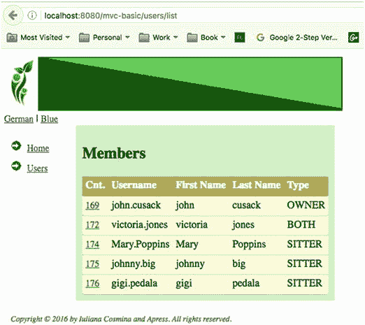

图 6-7.

Spring Web 应用实践

!

本节有三个 TODO 任务，编号从 45 到 47。如果你想测试自己对 Spring Web MVC 配置的理解，可以尝试解决它们。

任务 TODO 45 位于 `WebConfig` 类中，要求你完成该类的配置，使其能够用于创建 Web 应用上下文。

任务 TODO 46 位于 `WebConfig` 类中，要求你为 `InternalResourceViewResolver` Bean 提供配置。

任务 TODO 47 位于 `UserControllerTest` 中，要求你完成一个测试方法的主体，该方法用于检查 `UserController` 的 `show()` 方法是否工作正常：返回的视图逻辑名称是否正确，以及模型是否填充了正确的数据。请检查 `UserController` 类的实现，以找到断言语句中应使用的预期值。在同一个类中，有一个已完整实现的方法，用于测试 `UserController` 类的 `list()` 方法。分析该方法并从中获取灵感。

如果遇到困难，你可以查看 `10-ps-mvc-solution` 项目中提供的解决方案。

使用 Jetty 运行

该项目可以在 Jetty 嵌入式服务器上运行，使用 Gretty 插件，该插件已添加到此模块的 Gradle 配置文件中。该文件命名为模块名 `10-ps-mvc-practice.gradle`。这是开发过程中的一个选择，旨在帮助你轻松识别哪个配置文件对应哪个模块。Gradle 配置文件的默认名称是 `build.gradle`。在像 `pet-sitter` 这样的大型项目中，如果所有文件都命名为 `build.gradle`，那么在 Intellij IDEA 中使用 CTRL+SHIFT+N 将很难识别出模块的正确构建文件。以下代码片段展示了 `10-ps-mvc-practice` 模块的配置文件内容。

```
apply plugin: ’war’
apply from:
’https://raw.github.com/akhikhl/gretty/master/pluginScripts/gretty.plugin’
dependencies {
compile project(’:09-ps-data-jpa’)
compile misc.joda, spring.jdbc, spring.contextSupport, misc.h2, misc.commons,
spring.webmvc,  misc.hikari,...
//etc
testCompile tests.junit, tests.easymock, tests.jmock, tests.mockito,
spring.test, tests.hamcrestCore, tests.hamcrestLib
}
gretty {
port = 8080
// application context
contextPath = ’/mvc-basic’
}
```

设置好此插件后，Spring 应用可以通过两种方式运行：

*   从终端运行

```
    gradle appRun
    ```

*   查看控制台，Gretty 日志会告诉你可以在哪里访问 Web 应用。

```
    ...
    INFO Jetty 9.2.15.v20160210 started and listening on port 8080
    INFO mvc-basic runs at:
    INFO   http://localhost:8080/mvc-basic
    Run ’gradle appStop’ to stop the server.
    ```

*   从 Intellij IDEA 中，进入 `Gradle projects` 视图，展开 `pet-sitter` 项目，找到 `10-ps-mvc-practice`，展开该节点，然后进入 `Tasks -> gretty`。在其下你会看到 `appStart` 任务。双击它，将出现一个控制台，告知你应用何时启动以及运行了多长时间。当然，最初在解决 TODO 任务之前，应用在浏览器中是不可见的。在图 6-8 中，你可以看到要运行的 Gradle 任务以及 Intellij IDEA 中可用的控制台。

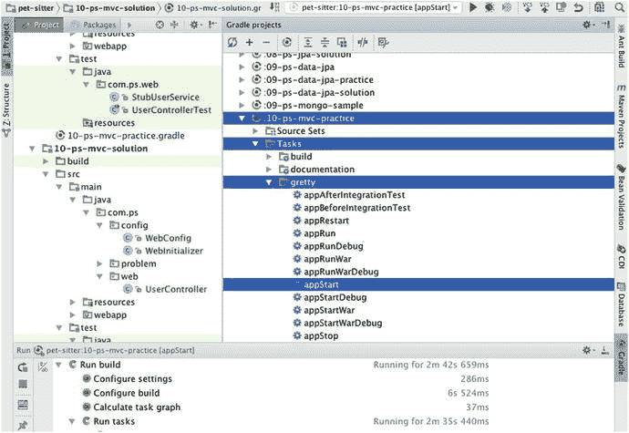

图 6-8.

在 Intellij IDEA 中使用 Gradle appStart 任务运行的 Spring Web 应用

使用 Tomcat 运行

Spring Web 应用也可以在应用服务器上运行。最常用的应用服务器是 Apache Tomcat。它是 Java Servlet、JavaServer Pages、Java Expression Language 和 Java WebSocket 技术的开源实现。目前版本为 9，自 1999 年以来一直存在。在任何操作系统上安装 Tomcat 都很容易；只需按照官方网站上的说明操作即可：[`http://tomcat.apache.org/`](http://tomcat.apache.org/)

构建 Web 应用时，结果是一个与项目同名的 *.war 归档文件。在上面的 `10-ps-mvc-practice.gradle` 文件中，必须添加额外的配置，以确保 war 文件名为 `mvc-basic`，这样当它部署到 Tomcat 上时，应用的上下文路径将保持一致。

```
war {
archiveName = ’mvc-basic.war’
}
```

在 `10-ps-mvc-practice` 模块上运行 gradle build 后，`10-ps-mvc-solution/build/libs` 目录下应该会出现 `mvc-basic.war` 文件。将此 Web 应用部署到 Tomcat 很简单：只需将 `mvc-basic.war` 复制到 `tomcat/webapps/` 目录下，然后启动服务器即可。应用将被部署，并可通过 `http://localhost:8080/mvc-basic/` 访问。

上述部署方法是手动方式。当你使用像 Intellij IDEA 这样智能的 Java IDE 时，事情可以变得更简单。开发者只需在 Intellij IDEA 中创建一个 Tomcat 配置，并添加生成所需部署 war 文件的项目即可。步骤如下：

*   打开 Run/Debug Configuration 菜单，选择 `Edit Configurations`（图 6-9）。

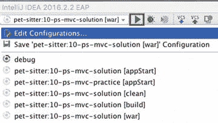

图 6-9.

Intellij IDEA Run/Debug Configuration 菜单

*   点击 + 按钮，从列表中选择 `Tomcat` `Server -> Local`，然后点击 `Ok`（图 6-10）。

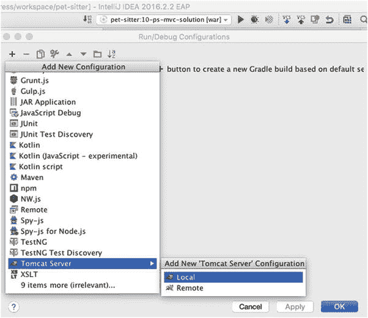

图 6-10.

选择配置类型前的 Intellij IDEA Run/Debug Configuration 对话框窗口

*   在弹出的窗口中，点击 `Configure` 按钮（图 6-11）。

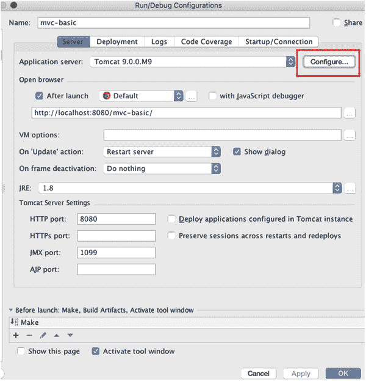

图 6-11.

选择配置类型后的 Intellij IDEA Run/Debug Configuration 对话框窗口

*   在 Application Server 配置对话框中，点击 + 按钮，添加你刚刚安装的 Tomcat 服务器并为其命名，然后点击 `Ok`（图 6-12）。

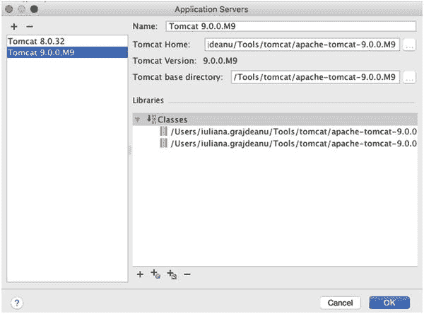

图 6-12.

Intellij IDEA Run/Debug Application Server 配置对话框窗口

*   现在，在 Run/Debug Configuration 对话框窗口中，`Application Server` 字段应该显示你之前设置的 Tomcat 安装路径。接下来需要配置在此实例上部署什么。为此，请转到 `Deployment` 选项卡，并针对图 6-13 中的每个编号项执行以下操作：

1.  为运行配置输入一个名称；`mvc-basic` 应该比较合适。


2.  点击 **+** 按钮。

3.  从 Intellij IDEA 识别出的 Web 工件列表中，选择
        `10-ps-mvc-practice-1.0.war`。
        如果你有兴趣在调试模式下运行 Tomcat 并使用断点，请选择（`exploded`）选项。

4.  在 `Application context` 部分，输入 Web 应用程序上下文的名称，此处为
        `mvc-basic`。

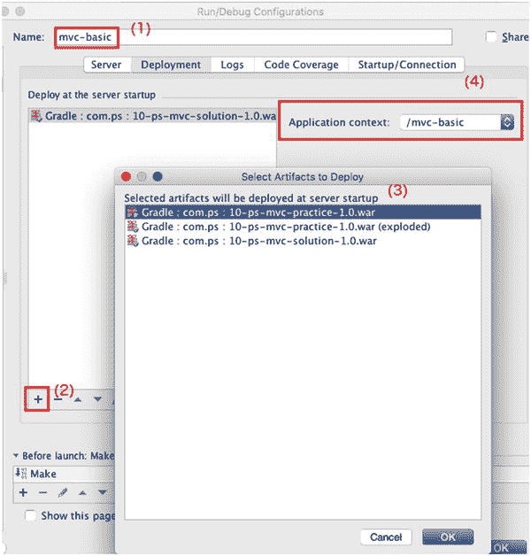

图 6-13.

Intellij IDEA 运行/调试配置对话框窗口中的“部署”选项卡

然后点击所有对话框窗口中的 `Ok`，并通过在“运行/调试配置”菜单中选择 `mvc-basic` 配置，并点击图 6-9 中高亮显示的 `Run` 按钮来启动服务器。Intellij IDEA 应自动打开浏览器并显示 Pet Sitter 应用程序的主页。

这就是使用 Apache Tomcat 9 运行 Pet Sitter 应用程序的方法。即使使用不同的应用服务器，步骤也是类似的。

Spring Security

Spring Security 是另一个 Spring 框架，旨在让开发者的生活更轻松、工作更愉快，因为它用于保护 Web 应用程序的安全。它非常易于使用，并且具有高度可定制性，可为应用程序的各个单元提供访问控制。对于编写安全的 Spring Web 应用程序，这是开发者的默认工具，因为其配置遵循所有 Spring 项目的相同标准，并且开箱即用地为多种身份验证类型提供了基础设施 Bean，所有这些显然都与其他 Spring 项目兼容。Spring Security 提供了一系列广泛的功能，可归纳为四个关注领域：身份验证、授权 Web 请求、授权方法调用以及授权对单个领域对象的访问。

在讨论保护应用程序安全时，以下概念非常重要：

*   `Principal` 是指能够在应用程序内执行操作的用户、设备或系统的术语。

*   `Credentials` 是主体用于确认其身份的识别密钥。

*   `Authentication` 是验证主体凭据有效性的过程。

*   `Authorization` 是决定是否允许经过身份验证的用户在应用程序内执行特定操作的过程。

*   `Secured item` 是用于描述任何被保护资源的术语。

身份验证有多种方式，Spring Security 支持所有方式：基本认证、表单认证、OAuth、X.509、Cookie、单点登录。在凭据的存储位置和方式方面，Spring Security 非常灵活，因为它支持所有方式：LDAP、RDBMS、属性文件、自定义 DAO；甚至支持 Bean 以及许多其他方式。⁶

授权依赖于身份验证。用户必须首先通过身份验证，才能进行授权。身份验证过程的结果是确定用户是否有权访问应用程序，以及用户可以根据角色执行哪些操作。应用程序中最常见的用户角色包括：

*   ADMIN 角色用于拥有完全权限。此类角色特定于有权访问和操作所有数据（包括其他用户的数据）的用户。

*   MEMBER 角色用于有限权限。此类角色特定于可以查看数据但只能操作自己详细信息的用户。

*   GUEST 角色用于对应用程序进行受限使用。此类角色用于只能查看有限数据的用户。

Spring Security 是开发 Web 应用程序的首选，因为它灵活且具有可移植性。Spring Security 不需要特殊的容器来运行；它可以简单地作为安全归档文件（WAR 或 EAR）进行部署，也可以在独立环境中运行。使用 Spring Security 保护并归档为 WAR 的 Web 应用程序可以部署在 JBoss 或 Apache Tomcat 应用服务器上，只要配置了底层的凭据存储方法，该应用程序在任何这些应用服务器上的运行方式都完全相同。Spring Security 非常灵活，因为身份验证和授权的配置是完全解耦的。因此，凭据的存储系统可以更改，而无需采取任何操作来调整授权配置。这使得应用程序非常一致，因为毕竟身份验证和授权的范围不同，因此由不同的可分离组件来覆盖它们是完全合乎逻辑的。

Spring Security 还具有很强的可扩展性，因为几乎所有与安全相关的内容都可以扩展和定制：如何识别主体、凭据存储在哪里、如何做出授权决策、安全约束存储在哪里等等。

安全是一个横切关注点，因此实现授权可能会导致代码混乱和纠缠。Spring Security 是使用 Spring AOP 实现的，并考虑了关注点分离。在底层，Spring Security 使用一些基础设施 Bean 来实现这两个过程。在图 6-14 中，以抽象但准确的方式描绘了用户的身份验证和授权过程。

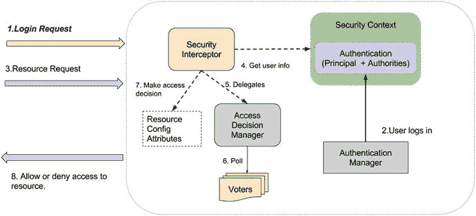

图 6-14.

Spring Security 底层原理

上图所示的流程可以解释如下。

1.  用户尝试通过发出请求来访问应用程序。应用程序要求用户提供凭据以便登录。

2.  凭据由 `Authenticaltion Manager` 验证，用户被授予访问应用程序的权限。该用户的授权权限被加载到 Spring Security 上下文中。

3.  用户发出资源请求（查看、编辑、插入或删除信息），在用户访问受保护/安全的资源之前，`Security Interceptor` 会拦截该请求。

4.  Security Interceptor 从安全上下文中提取用户授权数据，然后……

5.  ……将决策委托给 `Access Decision Manager`。

6.  Access Decision Manager 轮询一个投票者列表，以返回关于经过身份验证的用户对系统资源权限的决策。

7.  根据用户权限和资源属性，授予或拒绝对资源的访问。

Spring Security 配置

要配置 Spring Security，开发者需要处理三件事：

*   为应用程序声明安全过滤器

*   定义 Spring Security 上下文

*   配置身份验证和授权

XML 配置

要配置 Spring Security，必须修改 `web.xml` 以包含安全过滤器，并使安全上下文成为应用程序的根上下文。需要在 Web 应用程序的 XML 配置中添加/修改的元素如下面的代码片段所示。

```

contextConfigLocation

/WEB-INF/spring/security-config.xml

org.springframework.web.context.ContextLoaderListener

springSecurityFilterChain

org.springframework.web.filter.DelegatingFilterProxy

springSecurityFilterChain
/*

...

pet-dispatcher

org.springframework.web.servlet.DispatcherServlet

contextConfigLocation

/WEB-INF/spring/mvc-config.xml
/WEB-INF/spring/app-config.xml

```

!


`springSecurityFilterChain` 是一个强制性的名称，它引用 Spring 根应用上下文中同名的 Bean。`DelegatingFilterProxy` Bean 将调用委托给一系列链式安全过滤器 Bean，并充当安全请求的拦截器。在上述情况中，由于 `<url-pattern .../>` 元素定义了所有请求都将被拦截（使用了通配符 /*）。

实际上，在安全 Web 环境中，安全请求由一系列 Spring 管理的 Bean 处理，这就是代理 Bean 被命名为 `springSecurityFilterChain` 的原因，因为这些过滤器是链式连接的。这个过滤器链具有以下关键职责：

*   驱动身份验证
*   强制执行授权
*   管理登出
*   在 `HttpSession` 中维护 `SecurityContext`

Spring Security 框架建立在 ACEGI Security 1.x 的基础上。最初，安全过滤器 Bean 是手动配置的，可以单独使用，但这导致了冗长且容易出错的复杂 XML 配置。从 Spring Security 2.0 开始，过滤器 Bean 会使用默认值创建和初始化，除非需要更改默认的 Spring Security 行为，否则不建议手动配置。所有过滤器 Bean 都实现了 `javax.servlet.Filter` 接口。每个实现此接口的 Bean 类型都旨在对资源（Servlet 或静态内容）的请求、来自资源的响应或两者执行过滤任务。尽管这些过滤器在后台工作，但对其进行简要介绍是合适的。在表 6-1 中，列出了安全过滤器及其各自的目的。

表 6-1.

Spring Security 链式过滤器

过滤器类 | 详情
| --- | --- |
`ChannelProcessingFilter` | 用于在需要重定向到其他协议时使用
`SecurityContextPersistenceFilter` | 用于设置安全上下文并将更改复制到 `HttpSession`
`ConcurrentSessionFilter` | 用于并发会话处理包
`LogoutFilter` | 用于使主体登出。登出后，将重定向到配置的视图
`BasicAuthenticationFilter` | 用于在安全上下文中存储有效的 `Authentication` 令牌
`JaasApiIntegrationFilter` | 此 Bean 尝试获取 JAAS Subject 并作为该 `Subject` 继续运行 `FilterChain`
`RememberMeAuthenticationFilter` | 用于存储有效的 `Authentication`，并在安全上下文未更改时使用它
`AnonymousAuthenticationFilter` | 用于存储匿名的 `Authentication`，并在安全上下文未更改时使用它
`ExceptionTranslationFilter` | 用于将 Spring Security 异常转换为 HTTP 对应的错误响应
`FilterSecurityInterceptor` | 用于保护 URI 并引发访问拒绝异常

基本上，每当服务器收到 HTTP 请求时，每个过滤器都会在适用的情况下执行其操作。有趣的是，这些过滤器可以被自定义实现替换。它们在安全链中的位置由 Spring 通过枚举值列表定义，使用这些值作为 `<custom-filter …/>` 的 `position` 属性的参数，可以指定使用不同的过滤器 Bean 来替代默认的过滤器。在以下代码片段中，`ConcurrentSessionFilter` 被自定义实现替换。

枚举值列表可以在 `spring-security.xsd`⁷ 中找到，过滤器与值之间的对应关系如表 6-2 所示。

表 6-2.

Spring Security 链式过滤器

过滤器类 | 位置枚举值
| --- | --- |
`ChannelProcessingFilter` | CHANNEL_FILTER
`SecurityContextPersistenceFilter` | SECURITY_CONTEXT_FILTER
`ConcurrentSessionFilter` | CONCURRENT_SESSION_FILTER
`LogoutFilter` | LOGOUT_FILTER
`BasicAuthenticationFilter` | BASIC_AUTH_FILTER
`JaasApiIntegrationFilter` | JAAS_API_SUPPORT_FILTER
`RememberMeAuthenticationFilter` | REMEMBER_ME_FILTER
`AnonymousAuthenticationFilter` | ANONYMOUS_FILTER
`ExceptionTranslationFilter` | EXCEPTION_TRANSLATION_FILTER
`FilterSecurityInterceptor` | FILTER_SECURITY_INTERCEPTOR

使用 Java 配置的等效方法不使用位置枚举值，而是使用 `HttpSecurity` 对象的一组方法：

```
addFilterAfter(Filter  filter,Class  afterFilter)
```

和

`addFilterBefore(Filter  filter, Class<?  extends  Filter>  beforeFilter)`。它们接收过滤器类作为参数，自定义实现应相对于该类放置。在前面的示例中，`customConcurrencyFilter` Bean 被放置在链中 `securityContextPersistenceFilter` Bean 之后。因此，等效的 Java 配置将如下面的代码片段所示。不要关注注解，因为它们将在稍后的章节中介绍。只需注意自定义过滤器定义和 `http.addFilterAfter(..)` 调用：

```
import com.ps.web.session.CustomConcurrentSessionFilter;
import org.springframework.security.web.context.SecurityContextPersistenceFilter;
...
@Configuration
@EnableWebSecurity
@EnableGlobalMethodSecurity(jsr250Enabled = true)
public class SecurityConfig extends WebSecurityConfigurerAdapter {
@Override
protected void configure(HttpSecurity http) throws Exception {
http.addFilterAfter(
SecurityContextPersistenceFilter.class, customConcurrencyFilter());
http
.authorizeRequests()
...
.logout()
.logoutUrl("/logout")
.logoutSuccessUrl("/");
}
...
@Bean
CustomConcurrentSessionFilter customConcurrencyFilter(){
return new CustomConcurrentSessionFilter();
}
}
```

要拦截的 URL 在 Spring 特定的 XML 文件中定义，允许访问这些 URL 的角色在 Spring 上下文中定义，并在身份验证时加载。在使用 XML 时，会使用一个单独的安全配置文件，在本例中称为 `security-config.xml`。为了简化配置设置，Spring 提供了一个名为 `spring-security` 的特殊命名空间，其中包含严格的安全配置元素。安全配置文件可以相对于此命名空间编写，从而无需为安全元素使用前缀。在下面的代码片段中，展示了一个简单版本的配置文件，该文件将用户页面的访问权限限制为仅限完全通过身份验证的用户。登录表单位置和登出路径也一并展示。

`IS_AUTHENTICATED_ANONYMOUSLY` 值在底层由称为投票者的 Bean 处理，其类型为 `org.springframework.security.access.vote.AuthenticatedVoter`。在此类中，定义了 `access` 配置属性的三个值。投票者将处理此安全配置属性，并决定资源是否应对匿名用户可用。匿名用户用于对 Web 应用程序的公共访问（浏览），是无需登录即可访问网站的用户类型。`IS_AUTHENTICATED_FULLY` 配置属性也是顾名思义：匹配关联 URL 的资源只能由已登录、凭据已验证且身份已确认的用户访问。因此，该用户已完全通过身份验证。除了这两个配置属性之外，还有一个：`IS_AUTHENTICATED_REMEMBERED`。如果资源受此类规则保护，则只有用户完全通过身份验证或使用“记住我”方法通过身份验证后才能访问。⁸


`<form-login ../>` 配置元素用于定义登录表单的请求 URL，用户可通过该表单提供其凭证。使用此配置后，当匿名用户尝试访问受保护资源时，应用程序会将其引导至登录表单页面，而不是直接显示一个告知其无权访问该资源的页面。

`<logout ../>` 配置元素用于定义退出登录表单的请求 URL。当用户点击此链接时，HTTP 会话将失效，然后重定向至 "/login?success"。此行为可配置，也可以定义不同的退出成功 URL，但大多数应用程序会将用户重定向至登录页面，并在登录表单旁显示诸如“您已成功退出登录”之类的消息，以便用户在需要时重新登录。

作为 `pattern` 属性值定义的路径是使用 ANT 风格路径定义的 URL 片段。匹配这些路径的 URL 将根据 `<intercept-url …/>` 元素定义的规则进行保护和验证。可以使用通配符来指定一组相关的 URL，并对它们应用相同的安全规则。`access` 属性值是典型的安全令牌值，用于指定用户需要拥有何种访问权限。访问权限与用户角色相关联，因此可以配置 URL 仅允许具有特定权限的用户访问。

!

定义 URL 模式的顺序很重要，最严格的规则必须放在最上面；否则，更宽松的规则会生效，导致某些本不应有访问权限的用户也能访问这些 URL。

你可能已经注意到，如果使用令牌值来表示安全权限，为特定 URL 编写配置规则相当繁琐，因为你必须查阅文档来了解 `access` 属性允许使用哪些值。但 Spring 作为一项灵活且优秀的技术，从 Spring Security 3.0 开始，提供了使用 Spring EL 表达式声明访问规则的可能性。因此，上述文件可以利用安全相关的方法作为 `access` 属性的值，而所需做的只是通过相应配置 `<http .../>` 元素并将 `use-expressions` 属性值设置为 `true`，来告知 Spring Security 你想要使用这些表达式。

这些表达式的名称与其用途非常直观，并且可以组合使用来声明复杂的规则。以下列表仅展示了其中几种可能性：

*   `hasRole(’AnyRole’)`
    检查主体是否具有作为参数给定的角色。

*   `hasAnyRole(’[RoleList]’)`
    检查主体是否具有 `RoleList` 中的任意角色。

*   `isAnonymous()`
    允许未经身份验证的主体访问。

*   `isAuthenticated()`
    允许经过身份验证和已记住的主体访问。

*   `isAuthenticated()` 和
    `hasIpAddress(’192.168.1.0/24’)` 允许位于此 IP 类别（192.168.1.0/24）网络中的、经过身份验证和已记住的主体访问。

*   `hasRole(’ROLE_`
    `ADMIN` `’)` 和 `hasRole(’ROLE_MANAGER’)`
    允许同时具有 ROLE_ADMIN 和 ROLE_MANAGER 角色的主体访问。

!

一旦使用 `use-expressions="true"` 配置了对 SpEL 表达式的支持，就不能再使用之前的 `access` 值语法，因此角色和配置属性不能直接作为 `access` 属性的值。所以，这两种方式无法混合使用。

Spring Security 4 引入了一项简化功能，允许在指定访问表达式时省略其前面的 `ROLE_` 前缀，因此上述配置变为：

!

同样在 Spring Security 4 中，引入了在 Spring 表单中使用 CSRF 令牌以防止跨站请求伪造的可能性。⁹ 没有 `<csrf />` 元素配置的配置是无效的，并且每次登录请求都会将你导向一个 403 错误页面，显示：


```
请求参数 '_csrf' 或标头 'X-CSRF-TOKEN' 中发现无效的 CSRF 令牌 'null'。
```

要从 Spring Security 3 迁移到版本 4，你必须为该元素添加配置，即使你只是禁用 CSRF 令牌的使用。

```

...

```

`authentication-failure-url` 属性用于定义当身份验证失败时用户应被重定向到的位置。这可以是一个特殊的错误视图，根据参数向用户显示不同的错误消息。

`default-target-url` 属性用于定义成功身份验证后用户将被重定向到的位置。

!

其他关键变化与登录表单有关：默认的 Spring 资源，如登录 URL（指示身份验证请求的 URL）和请求参数的名称（用于生成身份验证令牌的预期键）。¹⁰ 这些更改是为了匹配 JavaConfig。在 Spring 3 之前，默认的登录 URL 值是 /j_spring_security_check，身份验证键的默认名称是 j_username 和 j_password，因此在 Spring 3 之前，`auth.jsp` 视图中映射到路径 /`auth` 的登录表单如下所示：

```

...
" method="post">

’/>

```

从 Spring 4 开始，默认的登录 URL 值是 /login，身份验证键的默认名称是 username 和 password，因此登录表单必须修改为：

```

...
" method="post">

’/>

```

!

之前的所有示例都使用了登录 URL 和身份验证键名称的默认值：j_spring_security_check、j_username、j_password（在 Spring Security 3 中），login、username、password（在 Spring Security 4 中），但所有这些值都可以使用 Spring 配置重新定义。只需为 `<form-login ../>` 元素设置以下属性：`login-processing-url`、`username-parameter`、`password-parameter`，并赋予所需的值。

```
/>
```

身份验证的配置也是在 Spring Security 配置文件中完成的，默认的身份验证提供者是 DAO 身份验证提供者。使用特定的 `UserDetailsService` 实现来提供凭据和权限。在本书的示例中，凭据直接在 Spring Security 配置文件中指定。

但还有其他选择。为了稍微提高应用程序的安全性，可以从属性文件中读取凭据，其中密码以加密形式存储，并且可以使用配置应用盐值。密码加盐是一种加密方法，通过向密码添加已知字符串来提高密码的安全性。

```

#/WEB-INF/users.properties
john=471540bd22898656564b9c85a18b3e80,ROLE_USER
#password: john
jane=1f533ad8d26c7bec84a291f62668a048,ROLE_USER,ROLE_ADMIN
#password: jane
admin=55c98bea671295de1e020621cc670ac4,ROLE_ADMIN
#password: admin
```

!

以下代码片段中显示的密码是通过在密码值后附加 "SpringSalt" 文本，然后对结果文本值应用 MD5 函数生成的。示例：

```
MD5("john"  +"SpringSalt")  =  "471540bd22898656564b9c85a18b3e80"
```

在 Windows 上，只能使用 `FCIV` 命令或 PowerShell 中的 `Get-FileHash` 命令为文件生成 MD5 哈希。在 MacOs 上有一个 `md5` 命令，在 Linux 系统上有一个 `md5sum` 命令。以下代码片段展示了在 MacOs 和 Linux 上为密码 "john" 和盐值 "SpringSalt" 生成 MD5 哈希的调用。

```
#MacOS
$ echo "johnSpringSalt" | md5
471540bd22898656564b9c85a18b3e80
#Linux system
$ echo "johnSpringSalt" | md5sum
471540bd22898656564b9c85a18b3e80
```

通过将凭据隔离在属性文件中，使其与配置解耦。该文件可以在应用程序外部编辑，并且可以使用属性读取器可刷新 bean 重新加载属性。¹¹

凭据属性文件具有特定的语法：

```
[username] = [password(encrypted)],[role1,role2...]
```

在前面的示例中，密码被添加到 `SpringSalt` 值中，然后使用 `md5`¹² 算法进行加密。但它们都以完全相同的方式和相同的盐值进行哈希处理。如果有人能找出服务器使用的盐值，它们就可能被破解。这就是为什么盐值应该是一个随机值，对每个用户都不同，例如该用户的唯一属性，如 ID。`salt-source` 也可以配置为使用常量用户属性（如 ID）作为盐值。

在上述示例中，只使用了 MD5 算法，但 Spring Security 支持更多算法，开发人员可以使用其中一种受支持的算法（MD4、Bcrypt、SHA、SHA-256 等）或实现自己的算法。

内存中或直接在配置文件中的方法对于测试和开发很有用，但在生产场景中，通常使用更安全的凭据存储方法。在生产环境中，凭据存储在数据库或 LDAP 系统中。在这种情况下，提供凭据的服务必须更改为基于 JDBC 的服务：

身份验证表必须可以使用 `authDataSource` bean 访问，并且它们的结构必须遵循以下规则：一个表名为 `users`，一个必须名为 `authorities`，并且必须正确执行以下查询：

```
SELECT username, password, enabled FROM users WHERE username = ?
SELECT username, authority FROM authorities WHERE username = ?
```

Spring Security 参考文档包含一些用于创建安全表的 SQL 脚本。语法是针对 HSQLDB 的，但脚本可以轻松调整为适用于任何 SQL 标准化数据库。¹³

本节中的一些细节是通用的，也适用于 Java 配置环境，但在此提及是为了全面展示 Spring Security 框架。现在是时候看看 Java 配置如何使所有这些配置细节更实用、更快速地设置了。

无 web.xml 的 Spring XML 配置

如果 `web.xml` 消失了，`springSecurityFilterChain` 过滤器会怎样？安全过滤器会转换为一个扩展 Spring 专用类的类：`org.springframework.security.web.context.AbstractSecurityWebApplicationInitializer`。并且与 `DispatcherServlet` 声明匹配的类必须扩展 `org.springframework.web.servlet.support.AbstractDispatcherServletInitializer`，以便根上下文可以设置为安全上下文。以下代码片段描述了使用 XML 配置 Spring Security 以及使用典型的 Web 初始化器类配置 Web 应用程序的情况。

```
import org.springframework.security.web.context.
AbstractSecurityWebApplicationInitializer;
// 需要空类来注册 springSecurityFilterChain bean
public class SecurityInitializer extends AbstractSecurityWebApplicationInitializer {
}
public class WebInitializer extends AbstractDispatcherServletInitializer {
@Override
protected WebApplicationContext createRootApplicationContext() {
XmlWebApplicationContext ctx = new XmlWebApplicationContext();
ctx.setConfigLocation("/WEB-INF/spring/security-config.xml");
return ctx;
}
@Override
protected WebApplicationContext createServletApplicationContext() {
XmlWebApplicationContext ctx = new XmlWebApplicationContext();
ctx.setConfigLocations(
// MVC 配置
"/WEB-INF/spring/mvc-config.xml",
// 服务配置
"/WEB-INF/spring/app-config.xml");
return ctx;
}
...
}
```

Java 配置


要为 Spring Security Web 应用程序开发一个可用的配置，需要将 XML 配置转换为安全配置类。替代 Spring XML 配置的类应继承 `WebSecurityConfigurerAdapter`，这样编写有效安全配置所需的代码量就能降到最低。因此，到目前为止作为示例给出的 XML 配置将变为：

```
package com.pr.config;
...
import org.springframework.beans.factory.annotation.Autowired;
import org.springframework.context.annotation.Configuration;
import org.springframework.security.config.annotation
.authentication.builders.AuthenticationManagerBuilder;
import org.springframework.security.config.annotation
.web.builders.HttpSecurity;
import org.springframework.security.config.annotation
.web.configuration.EnableWebSecurity;
import org.springframework.security.config.annotation
.web.configuration.WebSecurityConfigurerAdapter;
@Configuration
@EnableWebSecurity
public class SecurityConfig extends WebSecurityConfigurerAdapter {
@Autowired
public void configureGlobal(AuthenticationManagerBuilder auth) {
try {
auth.inMemoryAuthentication()
.withUser("john").password("doe").roles("USER").and()
.withUser("jane").password("doe").roles("USER","ADMIN").and()
.withUser("admin").password("admin").roles("ADMIN");
} catch (Exception e) {
e.printStackTrace();
}
}
@Override
protected void configure(HttpSecurity http) throws Exception {
http
.authorizeRequests()
.antMatchers("/user/edit").hasRole("ADMIN")
.antMatchers("/**").hasAnyRole("ADMIN","USER")
.anyRequest()
.authenticated()
.and()
.formLogin()
.usernameParameter("username")  //  可自定义
.passwordParameter("password") // 可自定义
.loginProcessingUrl("/login") // 可自定义
.loginPage("/auth")
.failureUrl("/auth?auth_error=1")
.defaultSuccessUrl("/home")
.permitAll()
.and()
.logout()
.logoutUrl("/logout")
.logoutSuccessUrl("/")
.and()
.csrf().disable();
}
}
```

`@EnableWebSecurity` 注解必须用于安全配置类，这些类还必须继承 `org.springframework.security.config.annotation.web.configuration.WebSecurityConfigurerAdapter`，并为 `configure(HttpSecurity http)` 方法提供实现。为了简化配置，还可以重写 `configure(WebSecurity web)` 方法来指定 Spring Security 应忽略的资源，例如样式文件和图片，从而简化 `configure(HttpSecurity http)` 方法的实现，并将非安全元素与安全元素解耦。

```
package com.pr.config;
...
import org.springframework.security.config.annotation.web.
builders.WebSecurity;
@Configuration
@EnableWebSecurity
public class SecurityConfig extends WebSecurityConfigurerAdapter {
@Override
public void configure(WebSecurity web) throws Exception {
web.ignoring().antMatchers("/resources/**","/images/**","/styles/**");
}
@Override
protected void configure(HttpSecurity http) throws Exception {
http
.authorizeRequests()
.antMatchers("/user/edit").hasRole("ADMIN")
.antMatchers("/**").hasAnyRole("ADMIN","USER")
.anyRequest()
.authenticated()
.and()
.formLogin()
.usernameParameter("username")  //  可自定义
.passwordParameter("password") // 可自定义
.loginProcessingUrl("/login") // 可自定义
.loginPage("/auth")
.failureUrl("/auth?auth_error=1")
.defaultSuccessUrl("/home")
.permitAll()
.and()
.logout()
.logoutUrl("/logout")
.logoutSuccessUrl("/")
.and()
.csrf().disable();
}
}
```

`antMatcher(…)` 方法等同于 XML 中的 `<intercept-url.../>` 元素，并且有等效的方法可用于替换登录表单、注销 URL 配置和 CSRF 令牌支持的配置。要启用 CSRF 使用，上述配置还必须定义一个 CSRF 提供者 bean 并在配置中使用它：

```
...
import org.springframework.security.web.csrf.CsrfTokenRepository;
import org.springframework.security.web.csrf.HttpSessionCsrfTokenRepository;
@Configuration
@EnableWebSecurity
public class SecurityConfig extends WebSecurityConfigurerAdapter {
@Bean
public CsrfTokenRepository repo() {
HttpSessionCsrfTokenRepository repo = new HttpSessionCsrfTokenRepository();
repo.setParameterName("_csrf");
repo.setHeaderName("X-CSRF-TOKEN");
return repo;
}
@Override
protected void configure(HttpSecurity http) throws Exception {
http.
...
.and()
.csrf().csrfTokenRepository(repo());
}
}
```

开箱即用，Spring 提供了三种 `CsrfTokenRepository` 实现，在表 6-3 中列出并说明。

表 6-3.

Spring Security 链式过滤器

| 过滤器类 | 位置枚举值 |
| --- | --- |
| `CookieCsrfTokenRepository` | 将 CSRF 令牌持久化在名为“XSRFTOKEN”的 cookie 中，并从名为“X-XSRF-TOKEN”的标头中读取，遵循 AngularJS 的约定 |
| `HttpSessionCsrfTokenRepository` | 将 CSRF 令牌持久化在 HttpSession 中，参数名称通过调用 `setParameterName()` 方法设置，并从通过调用 `setHeaderName()` 方法设置的标头名称中读取 |
| `LazyCsrfTokenRepository` | 延迟保存新的 CSRF 令牌，直到其生成的属性被访问。 |

当使用 CSRF 支持时，需要相应地实现注销，并确保 CSRF 令牌被彻底清除和禁用，使其无法被恶意请求使用。¹⁴ 因此，Spring 3 中简单的注销链接：

```
...
">

```

在 Spring 4 中变成了一个完整的表单，将 CSRF 令牌发送到应用程序以进行清除：

```
...

```

上面使用的 `<spring:message …/>` 元素是一个用于国际化的特殊 Spring 标签。标签库指令必须存在于 JSP 文件中，特定元素的值取自位于 `WEB-INF` 下的属性国际化文件。由于国际化不是 Spring Core 认证考试的主题，我们在此不会深入探讨。

既然配置部分已经涵盖了所有必要内容，现在是时候介绍如何在代码中使用安全上下文和规则了。

安全标签库

在编写 JSP 页面时，可以使用多个标签库来简化工作、减少冗余并提供功能。通过在 JSP 页面头部添加标签库引用，就可以使用该库中定义的 JSP 元素。Spring 提供了一个可用于保护 JSP 元素的标签库。

在迄今为止介绍的配置示例中，对某些资源的访问是通过 `<intercept-url .../>` 元素或 `antMatcher(...)` 方法管理的。

```
//mvc-security.xml

...

//或 SecurityConfig.java
public class SecurityConfig extends WebSecurityConfigurerAdapter {
...
Override
protected void configure(HttpSecurity http) throws Exception {
http
.authorizeRequests()
.antMatchers("/users/show/*").hasRole("ADMIN")
...
}
}
```

上述每个配置都会拒绝任何仅具有 USER 角色的用户访问 `/users/show/`。在图 6-15 中，描绘了当具有 USER 角色的用户尝试访问 `/users/show/` 资源时服务器的响应。

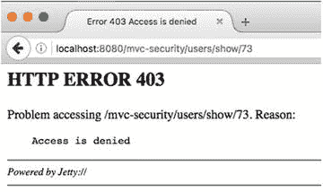

图 6-15.

用户未被授权查看资源时的服务器响应


在页面上显示一个指向被禁止资源的链接，这到底有意义吗？当然没有。此外，生产环境的应用通常相当庞大，包含许多不同的 URL，因此使用 XML 文件或安全配置类进行完整配置会变得相当复杂。为了简化这一点，从 Spring Security 2.0 版本开始，提供了一个安全标签库，可用于在 JSP 层面保护项目。在上面的例子中，我们可以根据用户的安全配置，选择是否显示包含资源链接的列。

```
//

...

...

${user.id}

${user.username}

...

```

`<spring:url ../>` 元素是来自 Spring 标签库的一个标签，用于根据参数动态构建链接。上述代码片段中的定义将解析为如下链接：

`http://localhost:8080/mvc-security/users/show/12`，其中 12 是用户的 ID。

上面的 `<sec:authorize ../>` 的作用是，在用户通过身份验证后，其角色会被加载到安全上下文中，当他访问 `list.jsp` 页面时，系统会考虑其角色来计算响应视图。前面例子中的安全元素表明，只有拥有 ADMIN 角色的用户，其视图中才应包含含有 `/users/show/*` URL 的 `<td/>` 元素。因此，例如，只有 USER 角色的用户 `john`，其看到的视图将与拥有 `ADMIN` 角色的用户不同，如图 6-16 所示。

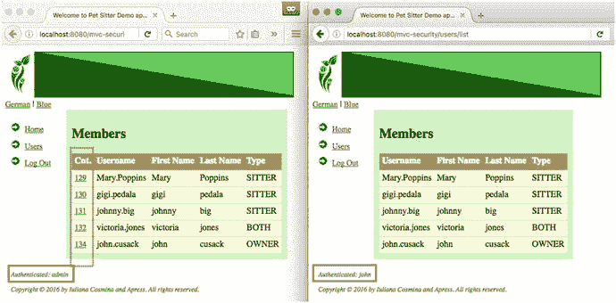

图 6-16.

ADMIN 和 USER 角色下的 /users/show 视图

根据前面所述，链接不会显示，但如果用户在浏览器中手动输入该链接会发生什么？如果配置中没有对该链接的限制，那么无论用户角色如何，视图都会显示给用户。因此，配置中的限制也是必需的。如果限制如本节开头的代码片段所示定义，那么可以在 JSP 代码中使用该安全规则，通过将 `authorize` 元素的 `access` 属性替换为 `url`，并将 `hasRole` 表达式替换为安全规则中定义的 URL，来避免像 `hasRole("ROLE_` `ADMIN` `")` 这样复杂的表达式。这将告诉 Spring 在显示视图之前检查用户是否有权访问该 URL。如果没有，则会显示图 6-15 中的消息。这使得可以将安全规则链接到一个 URL 模式，该模式可以作为安全属性值来保护任何 URL 路径下的资源。因此，上面的 JSP 代码变为：

```
//

...

...

${user.id}

${user.username}

...

```

但还有另一个安全问题：填充视图的方法是在服务层定义的。如果应用程序也支持 Web 服务，我们如何防止用户直接调用该方法获取数据？或者通过远程 REST 调用？因为目前安全仅定义在 Web 层。下一节将介绍如何使用 Spring Security 在更低层级保护项目。

方法安全

为了将安全应用于应用程序的较低层，Spring Security 使用了 AOP。相应的 Bean 被包装在一个代理中，该代理在调用目标方法之前，首先检查用户的凭证，并且仅在用户被授权调用时才调用该方法。在 XML 中，这种代理的定义是通过使用安全命名空间提供的 `global-method-security` 配置元素来启用方法级安全，并定义一个安全切入点及其适用的规则。

但是，使用 Spring Security 命名空间或 Java 配置和注解可以更轻松地完成相同的工作。有两种替代方法：

1.  必须通过使用 `@EnableGlobalMethodSecurity(securedEnabled = true)` 注解一个配置类（最佳实践是注解安全配置类，以便将所有与安全相关的配置集中在一个地方）来启用方法级安全。方法必须通过使用 Spring Security 注解 `@Secured` 来保护。

```
    import org.springframework.security.config.annotation
    .method.configuration.EnableGlobalMethodSecurity;
    ...
    @Configuration
    @EnableWebSecurity
    @EnableGlobalMethodSecurity(securedEnabled = true)
    public class SecurityConfig extends WebSecurityConfigurerAdapter {
    ...
    }
    //UserServiceImpl.java service class
    import org.springframework.security.access.annotation.Secured;
    ...
    @Service
    @Transactional(readOnly = true, propagation = Propagation.REQUIRED)
    public class UserServiceImpl implements UserService {
    @Secured("ROLE_ADMIN ")
    public User findById(Long id) {
    return userRepo.findOne(id);
    }
    ...
    }
    ```

使用 XML 的等效配置利用了 Spring Security 命名空间中定义的 `<global-method-security ../>` 元素，该元素是注解 `@EnableGlobalMethodSecurity` 的 XML 等效项。要启用方法安全，必须将此元素的 `secured-annotations` 属性配置为 `enabled` 值。

2.  必须通过使用 `@EnableGlobalMethodSecurity(jsr250Enabled = true)` 注解一个配置类（最佳实践是注解安全配置类，以便将所有与安全相关的配置集中在一个地方）来启用方法级安全。方法必须通过使用 JSR-250¹⁵ 注解来保护。

```
    import org.springframework.security.config.annotation
    .method.configuration.EnableGlobalMethodSecurity;
    ...
    @Configuration
    @EnableWebSecurity
    @EnableGlobalMethodSecurity(jsr250Enabled = true)
    public class SecurityConfig extends WebSecurityConfigurerAdapter {
    ...
    }
    //UserServiceImpl.java service class
    import javax.annotation.security.RolesAllowed;
    ...
    @Service
    @Transactional(readOnly = true, propagation = Propagation.REQUIRED)
    public class UserServiceImpl implements UserService {
    @RolesAllowed("ROLE_ADMIN ")
    public User findById(Long id) {
    return userRepo.findOne(id);
    }
    ...
    }
    ```

使用 XML 的等效配置利用了 Spring Security 命名空间中定义的 `<global-method-security ../>` 元素，该元素是注解 `@EnableGlobalMethodSecurity` 的 XML 等效项。要启用方法安全，必须将此元素的 `jsr250-annotations` 属性配置为 `enabled` 值。

JSR 250 注解是基于标准的，允许应用简单的基于角色的约束，但不如 Spring Security 的原生注解强大。

两种方法都会导致 Spring Security 将服务类包装在一个安全代理中。受保护方法执行的抽象模式以及所涉及的组件如图 6-17 所示。

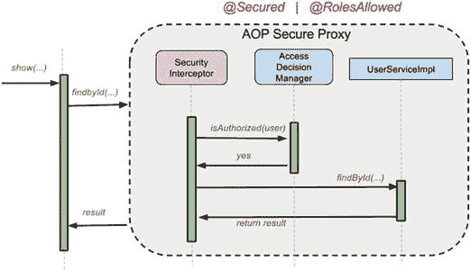

图 6-17.

受保护方法执行的抽象模式

有四个支持表达式属性的注解，它们是在 Spring 3.0 中引入的，用于允许调用前和调用后的授权检查，并支持过滤提交的集合参数或返回值：`@PreAuthorize`、`@PreFilter`、`@PostAuthorize` 和 `@PostFilter`。它们在 XML 中通过 `<global-method-security ../>` 元素的 `pre-post-annotations` 属性启用，该属性必须配置为 `enabled` 值。


它们通过 Java 配置启用，这依赖于 `@EnableGlobalMethodSecurity` 元素上的 `prePostEnabled` 属性，该属性必须配置为 `true` 值。

```
import org.springframework.security.config.annotation
.method.configuration.EnableGlobalMethodSecurity;
...
@Configuration
@EnableWebSecurity
@EnableGlobalMethodSecurity(prePostEnabled = true)
public class SecurityConfig extends WebSecurityConfigurerAdapter {
...
}
```

该注解的使用方式如下：

```
import org.springframework.security.access.prepost.PreAuthorize;
...
@Service
@Transactional(readOnly = true, propagation = Propagation.REQUIRED)
public class UserServiceImpl implements UserService {
@PreAuthorize("hasRole(’USER’)")
public void create(User user){
...
}
}
```

但这些注解的有趣之处在于它们可以访问方法参数。在下面的代码片段中，会验证当前登录用户是否拥有删除作为参数传入的用户的“admin”权限。这是通过使用 Spring ACL（访问控制列表）类来实现的。

```
import org.springframework.security.access.prepost.PreAuthorize;
import org.springframework.security.acls.model.Permission;
import org.springframework.security.acls.model.Sid;
...
@Service
@Transactional(readOnly = true, propagation = Propagation.REQUIRED)
public class UserServiceImpl implements UserService {
@PreAuthorize("hasPermission(#user, ’admin’)")
public void delete(User user, Sid recipient, Permission permission){
...
}
}
```

这些注解提供了更细粒度的控制，因为可以使用 SpEL 表达式来限制用户通过其操作所能影响的领域。例如，在下面的示例中，只允许用户影响其用户名与 `user` 参数用户名匹配的用户。

```
import org.springframework.security.access.prepost.PreAuthorize;
import org.springframework.security.acls.model.Permission;
import org.springframework.security.acls.model.Sid;
...
@Service
@Transactional(readOnly = true, propagation = Propagation.REQUIRED)
public class UserServiceImpl implements UserService {
@PreAuthorize("#user.username == authentication.name")
public void modifyProfile(User user){
...
}
}
```

当你能坚持使用 Spring 的数据库实现时，Spring Security ACL 非常强大且易于实现。因此，如果一个项目需要对资源进行细粒度控制，这绝对是首选方案。

!

关于 Spring Security 能说的就这些了。在进入下一节之前，你可以通过解决项目 `11-ps-security-practice` 中的 TODO 任务来测试你的知识和理解。这里有七个 TODO 任务，编号从 48 到 54。如果你需要灵感或确认你的解决方案是否正确，可以将其与项目 `11-ps-security-solution` 中提供的参考解决方案进行比较。

任务 TODO 48 位于 `SecurityWebApplicationInitializer` 类中，要求你完成该类的配置以注册 `DelegatingFilterProxy` bean。

任务 TODO 49 位于 `SecurityConfig` 类中，要求你完成该类的配置以启用对 Spring Security 的支持。

任务 TODO 50 位于 `SecurityConfig` 类中，要求你完成该类的配置以启用使用表达属性的注解来保护方法。

任务 TODO 51 位于 `SecurityConfig` 类中，要求你完成 `http` 对象的配置，并定义表 6-4 中的用户，你也可以在 `auth.jsp` 页面中找到这些用户。

表 6-4.

应用程序用户

用户名
 |
  密码
 |
  角色
 |

| --- | --- | --- | --- | --- | --- | --- |

john
 |
  doe
 |
  USER
 |

jane
 |
  does
 |
  USER, ADMIN
 |

admin
 |
  admin
 |
  ADMIN
 |

任务 TODO 52 位于 `SecurityConfig` 类中，要求你完成 `http` 对象的配置，并确保所有匹配 `/users/show/*` 和 `/users/delete/*` 的 URL 仅对具有 ADMIN 角色的用户可用。

任务 TODO 53 位于 `WebInitializer` 类中，要求你完成该类的配置，以便将 Spring 上下文注册为根上下文。

任务 TODO 54 位于 `list.jsp` 文件中，要求你完成此 JSP 页面的实现，以隐藏包含指向详情视图 URL 的成员 ID 列。

Spring Boot

Spring Boot 是一组预配置的框架/技术，旨在减少样板配置（基础设施），并提供一种快速启动和运行 Spring Web 应用程序的方法。它的目标是通过提供开箱即用的基础设施 bean，让开发人员专注于实现实际所需的功能，而不是如何配置应用程序。在 Spring Boot 官方页面¹⁶上，给出了一个 REST 应用程序作为示例，只需不到 20 行代码就能得到一个可运行的应用程序。令人印象深刻，对吧？而这仅仅是使用 Spring Boot 的优势之一。

Spring Boot 使开发人员更容易构建可立即运行的、独立的、生产级别的应用程序。Spring Boot 可用于创建打包为 `jar` 并可使用 `java -jar` 运行的应用程序，或者创建可部署在应用服务器上的典型 war 打包项目。新特性是 Web 归档文件也可以使用 `java -jar` 执行。Spring Boot 的主要关注点在于：

*   在极短的时间内为 Spring 项目搭建基础设施。

*   提供默认的通用基础设施配置，但随着应用程序的增长，允许轻松地偏离默认配置。因此，任何默认配置都可以很容易地被覆盖。

*   提供一系列适用于广泛项目的非功能性特性（嵌入式服务器、安全性、指标、健康检查、外部化配置）。

*   消除对 XML 和代码配置的需求。

在本书编写时，Spring Boot 的当前稳定版本是 1.4.0.RELEASE，它适用于 JDK 7+。在本书中，将使用源代码版本 1.4.1.BUILD-SNAPSHOT。

配置

Spring Boot 可以像任何 Java 库一样使用。它可以作为依赖项添加到项目中，因为它不需要任何特殊的集成工具，并且可以在任何 IDE 中使用。Spring Boot 提供了“starter” POM 来简化项目的 Maven 配置。当使用 Maven 时，项目必须将 `spring-boot-starter-parent` 作为父项目，以便提供有用的 Maven 默认值。由于本书附带的源代码使用 Gradle，因此支持 Gradle 也非常合适。对于 Gradle，无需指定父项目，但 Spring 提供了特定于不同类型应用程序的 starter 依赖项。因此，在 `pet-sitter` 父配置中，将声明所有 starter 依赖项和版本，子项目将只使用所需的部分。根据应用程序的类型，有不同的 starter 依赖项；在下面的示例中，只声明了几个。¹⁷ 为了重用父项目中的配置声明，所有 Spring Boot 组件和版本都将在 `pet-sitter/build.gradle` 文件中声明。


```
//pet-sitter/build.gradle 配置文件片段
plugins {
    id 'com.gradle.build-receipt' version '1.0'
}
buildReceiptLicense {
    agreementUrl = 'https://gradle.com/terms-of-service'
    agree = 'yes'
}
//gradle build –Dreceipt
allprojects {
    version = '1.0'
    group = 'com.ps'
    ext {
        //spring 库
        springVersion = '4.3.2.RELEASE'
        springJpaVersion = '1.10.2.RELEASE'
        springSecurityVersion = '4.0.3.RELEASE'
        springBootVersion = '1.4.1.BUILD-SNAPSHOT'
        aspectjVersion = '1.8.4'
        yamlVersion='1.17'
        ...
        boot = [
            springBootPlugin:
            "org.springframework.boot:spring-boot-gradle-plugin:$springBootVersion",
            starterWeb      :
            "org.springframework.boot:spring-boot-starter-web:$springBootVersion",
            starterJetty    :
            "org.springframework.boot:spring-boot-starter-jetty:$springBootVersion",
            starterSecurity :
            "org.springframework.boot:spring-boot-starter-security:$springBootVersion",
            starterJpa      :
            "org.springframework.boot:spring-boot-starter-data-jpa:$springBootVersion",
            starterTomcat   :
            "org.springframework.boot:spring-boot-starter-tomcat:$springBootVersion",
            starterTest     :
            "org.springframework.boot:spring-boot-starter-test:$springBootVersion",
            Actuator        :
            "org.springframework.boot:spring-boot-starter-actuator:$springBootVersion",
            Yaml            : "org.yaml:snakeyaml:$yamlVersion"
        ]
        ...
    }
}
subprojects {
    apply  plugin: 'java'
    sourceCompatibility = 1.8
    repositories {
        mavenLocal
        mavenCentral
        maven { url "https://oss.sonatype.org/content/repositories/snapshots/" }
        maven { url "http://repo.spring.io/snapshot/" }
        maven { url "http://repo.spring.io/milestone" }
    }
    ...
}
```

在父项目 `pet-sitter` 的 Gradle 配置文件中，声明了主要库或库系列的版本，以及下载依赖项的仓库和用于编译和运行项目的 JAVA 版本。`11-ps-boot-sample` 是 `pet-sitter` 项目的一个子模块。
`11-ps-boot-sample/11-ps-boot-sample.gradle`
配置文件仅包含所需的依赖项，不包含版本号，因为这些版本号继承自父配置。

```
//11-ps-boot-sample/11-ps-boot-sample.gradle
apply plugin: 'spring-boot'
buildscript {
    repositories {
        mavenCentral()
    }
    dependencies {
        classpath boot.springBootPlugin
    }
}
dependencies {
    compile boot.starterWeb
    testCompile boot.starterTest
}
jar {
    baseName = 'ps-boot'
}
```

Spring Boot 的每个版本都提供了一个其支持的依赖项精选列表。所需库的版本经过选择，以确保 API 完美匹配，这由 Spring Boot 处理。因此，无需手动配置依赖项版本。升级 Spring Boot 将确保这些依赖项也得到升级。通过查看 Intelij IDEA Gradle 视图中 `spring-boot-starter-web` 的传递依赖项，可以轻松证明这一点，如图 6-18 所示。

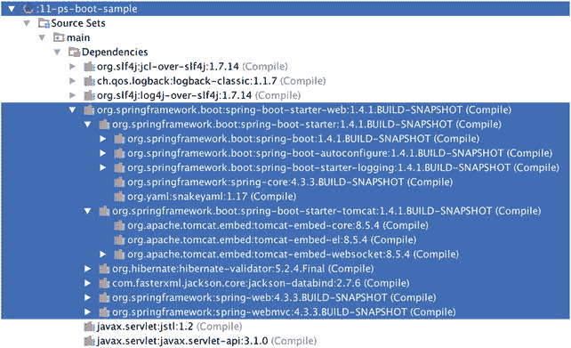

图 6-18.

11-ps-boot-sample: Intelij IDEA Gradle 视图中的 spring-boot-starter-web 传递依赖项

Spring Boot 的版本和项目版本继承自 `pet-sitter` 项目。要构建并运行此项目，我们只需要一个使用 `@SpringBootApplication` 注解的类。此注解是一个顶级注解，设计为仅在类级别使用。它是一个便捷注解，等同于声明以下三个注解：

*   `@Configuration`，
    因为该类是一个配置类，并且可以使用 @Bean 声明 Bean。

*   `@EnableAutoConfiguration`
    是一个特定的 Spring Boot 注解，来自包 `org.springframework.boot.autoconfigure`，其目的是启用 Spring 应用程序上下文，尝试根据指定的依赖项猜测并配置你可能需要的 Bean。

!

`@EnableAutoConfiguration`
与 Spring 提供的启动器依赖项配合良好，但并不直接绑定到它们，因此可以使用启动器之外的其它依赖项。例如，如果类路径上存在特定的嵌入式服务器，则将使用它，除非项目中存在另一个 `EmbeddedServletContainerFactory` 配置。

*   `@ComponentScan`，
    因为开发者将声明使用构造型注解进行注解的类，这些类将成为某种类型的 Bean。与 `@SpringBootApplication` 一起使用的用于列出要扫描的包的属性是 `scanBasePackages`。

```
package com.ps.start;
import org.springframework.boot.SpringApplication;
import org.springframework.boot.autoconfigure.SpringBootApplication;
@SpringBootApplication(scanBasePackages  =
{"com.ps.web", "com.ps.start"})
public class Application {
    public static void main(String... args) {
        SpringApplication.run(Application.class, args);
        System.out.println("Started ...");
    }
}
```

main 方法是应用程序的入口点，它遵循 Java 应用程序入口点的约定。此方法调用 `org.springframework.SpringApplication` 类中的静态 `run 方法`，该方法将引导应用程序并启动 Spring IoC 容器，该容器将启动配置好的嵌入式 Web 服务器。因此，如果你在 Intellij IDEA 中运行此类，或者编译并构建应用程序并执行 jar，结果将是相同的：一个 Spring 应用程序将启动，并带有许多已使用默认、最常见的配置配置好的基础设施 Bean。现在我们有了一个 Spring 应用程序上下文，让我们用它做点什么，比如检查所有 Bean。最简单的方法是添加一个控制器类来显示所有这些 Bean。但是声明控制器意味着视图也必须被解析，所以最简单的方法是使用 REST 控制器。REST 控制器是一个使用 `@RestController` 注解的控制器类。此注解是 `@Controller`（典型的构造型注解，将 Bean 标记为 Web 组件）和 `@ResponseBody`（一个基本上告诉 Spring 该类中方法返回的结果不需要存储在模型中并在视图中显示的注解）的组合。以下代码片段中描述的 `CtxController` 包含一个方法，该方法返回一个简单的 HTML 代码，其中包含应用程序上下文中所有 Bean 的列表。

!

这个 `CtxController` 是一个
特殊实现，旨在以可读的方式在浏览器中显示 Bean 名称，因为你可能会使用浏览器来测试此项目。HTML 格式不适用于 REST 服务，如第 7 章所示。

要注册此类，应使用 `@ComponentScan` 扫描该包。但是不再需要此注解，因为 `@SpringBootApplication` 已经涵盖了该行为。


```
//CtxController.java
package com.ps.start;
import org.springframework.beans.factory.annotation.Autowired;
import org.springframework.context.ApplicationContext;
import org.springframework.web.bind.annotation.RequestMapping;
import org.springframework.web.bind.annotation.RestController;
import java.util.Arrays;
@RestController
public class CtxController {
@Autowired
ApplicationContext  ctx;
@RequestMapping("/")
public String index() {
StringBuilder sb = new StringBuilder("");
sb.append("Hello there dear developer,
here are the beans you were looking for: ");
//method that returns all the bean names in the context of the application
String beanNames = ctx.getBeanDefinitionNames();
Arrays.sort(beanNames);
for (String beanName : beanNames) {
sb.append("").append(beanName);
}
sb.append("");
return sb.toString();
}
}
// Application.java
@SpringBootApplication
@ComponentScan(basePackages = {"com.ps.web", "com.ps.start"})
public class Application {
public static void main(String... args) {
SpringApplication.run(Application.class,  args);
System.out.println("Started ...");
}
}
```

如果应用程序仅由上述代码构成，那么在运行 main 方法并访问 `http://localhost:8080` 时，应用程序上下文中所有 bean 的列表将如图 6-19 所示。

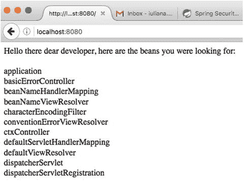

图 6-19.

Spring Boot 创建的应用程序上下文的基础设施 Bean

该应用程序将在嵌入式 Tomcat 容器上运行，可以轻松自定义该容器以声明端口和上下文。有多种方法，但最简单且可外部化的方法是在 `src/main/resources` 下创建一个名为 `application.properties` 的文件，并创建一个实现 `org.springframework.boot.context.embedded.EmbeddedServletContainerCustomizer` 的特殊 Bean，以加载这些值并将其注入到嵌入式服务器配置中。`11-ps-boot-sample` 项目的结构如图 6-20 所示。

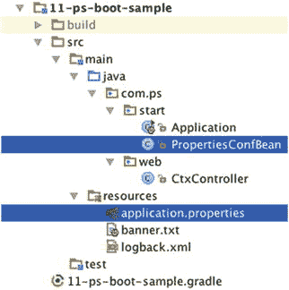

图 6-20.

11-ps-boot-sample：简单的 Spring Boot 项目结构

`application.properties` 文件的内容如下：

```
app.port=8080
app.context=/ps-boot
```

这里使用的属性名称并非 Spring Boot 保留或固定的。它们可以是任何名称，其值将通过 `@Value` 注解注入到使用它们的 Bean 中。¹⁸

这些值由以下 Bean 加载：

```
package com.ps.start;
import org.springframework.boot.context.embedded.ConfigurableEmbeddedServletContainer;
import org.springframework.boot.context.embedded.EmbeddedServletContainerCustomizer;
...
@Component
public class PropertiesConfBean implements EmbeddedServletContainerCustomizer {
@Value("${app.port}")
private Integer value;
@Value("${app.context}")
private String contextPath;
@Override
public void customize(ConfigurableEmbeddedServletContainer container) {
container.setPort(value);
container.setContextPath(contextPath);
}
}
```

`application.properties` 文件可以放置在以下位置：

1.  当前目录的 `/config` 子目录。
2.  当前目录。
3.  类路径下的 `config` 包。
4.  类路径根目录。

此列表按优先级排序，上层位置定义的属性会覆盖下层位置定义的属性。当从命令行使用 `spring.config.location` 参数执行应用程序时，可以提供 `application.properties` 文件：

```
java -jar ps-boot.jar --spring.config.location=
/Users/iuliana.cosmina/temp/application.properties
```

文件名也可以通过命令行中的 `spring.config.name` 进行更改：

```
java -jar ps-boot.jar --spring.config.name=my-boot.properties
```

使用此配置，可以通过 `http://localhost:8080/ps-boot/` 访问应用程序。上述配置在使用嵌入式 Jetty、Tomcat 或 Undertow 时均有效。如果需要一些特殊配置——假设我们使用的是 Tomcat——可以使用 `TomcatEmbeddedServletContainerFactory` Bean。并且由于 `@SpringBootApplication` 也包含扫描功能，整个应用程序可以通过使用 `@RestController` 注解来编写在 `Application` 类中。

```
import org.springframework.boot.context.embedded.EmbeddedServletContainerFactory;
import org.springframework.boot.context.embedded
.tomcat.TomcatEmbeddedServletContainerFactory;
...
@RestController
@SpringBootApplication(scanBasePackages = {"com.ps.start"})
public class Application {
public static void main(String... args) {
SpringApplication.run(Application.class, args);
System.out.println("Started ...");
}
@Value("${app.port}")
private Integer value;
@Value("${app.context} ")
private String contextPath;
@Bean
public EmbeddedServletContainerFactory servletContainer() {
TomcatEmbeddedServletContainerFactory factory =
new TomcatEmbeddedServletContainerFactory();
factory.setPort(value);
factory.setSessionTimeout(10, TimeUnit.MINUTES);
factory.setContextPath(contextPath);
return factory;
}
@Autowired
ApplicationContext ctx;
@RequestMapping("/")
public String index() {
StringBuilder sb = new StringBuilder("");
sb.append("Hello there dear developer,
here are the beans you were looking for: ");
String beanNames = ctx.getBeanDefinitionNames();
Arrays.sort(beanNames);
for (String beanName : beanNames) {
sb.append("").append(beanName);
}
sb.append("");
return sb.toString();
}
}
```

此外，当 Spring Boot 应用程序启动时，控制台会显示 Spring Boot 横幅。可以通过在 `src/main/resources` 下创建一个名为 `banner.txt` 的文件来替换它，该文件包含所需横幅的 ASCII 格式。原始的 Spring Boot 横幅和 Apress 横幅并排显示在图 6-21 中。¹⁹

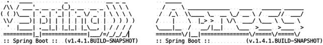

图 6-21.

Spring Boot 和 Apress 横幅

运行此应用程序有几种方式：

1.  在 Intellij IDEA 中，右键单击 `Application` 类，然后从出现的菜单中选择运行 `Application.main()`；基本上，就像执行任何其他包含 main 方法的 Java 类一样执行该类。

2.  如果在 Gradle 中配置了 jar 插件（在我们的项目中，默认情况下所有子项目都如此配置），则在执行 `gradle clean build` 后，将构建可执行的 `ps-boot-1.0.jar` 工件，并保存在 `11-ps-boot-sample/build/libs` 下。该工件可以使用 `java -jar ps-boot-1.0.jar` 执行。jar 插件可以在模块的 Gradle 配置文件中配置，并且可以为工件设置不同的名称。

```
    //11-ps-boot-sample/11-ps-boot-sample.gradle
    jar {
    baseName = ’ps-boot’
    }
    ```

当此配置片段存在于模块的 Gradle 配置文件中时，执行 `gradle clean build` 将创建一个名为 `ps-boot.jar` 的可执行工件，并将其保存在 `11-ps-boot-sample/build/libs` 下。

3.  如果在 Gradle 中配置了 boot 插件，则可以通过调用 boot Gradle 任务 `gradle bootRun` 来运行应用程序。

4.  如果在 Gradle 中配置了 war 插件，则在执行 `gradle clean war` 后，生成的工件将是一个名为 `ps-boot-1.0.war` 的 Web 归档文件，也可以使用 `java -jar ps-boot-1.0.war` 运行。war 插件可以在模块的 Gradle 配置文件中配置，并且可以为 Web 工件设置不同的名称。

```
    //11-ps-boot-sample/11-ps-boot-sample.gradle
    apply plugin: ’war’
    ...
    war {
    baseName = ’ps-boot’
    }
    ```


当此配置片段出现在模块的 Gradle 配置文件中时，执行 `gradle clean war` 将创建一个名为 `ps-boot.war` 的可执行工件，并将其保存在 `11-ps-boot-sample/build/libs` 目录下。

5.  如果在 Gradle 中配置了 `war` 插件，并且我们希望生成一个可部署到任何应用服务器上的 Web 归档文件，则需要将嵌入式容器依赖项标记为 provided。由于项目不包含 `web.xml` 文件，因此必须定义一个继承 `SpringBootServletInitializer` 的类，并重写其 `configure` 方法。`SpringBootServletInitializer` 类是 Boot 特有的类，它实现了 `WebApplicationInitializer`，这是从传统 WAR 部署中运行 Spring 应用程序所必需的。开发者必须重写 `configure()` 方法，并提供配置 Spring 应用程序所需的类，即使用 `@SpringBootApplication` 注解的类。这将利用 Spring Framework 的 Servlet 3.0 支持，并且当应用程序由 Servlet 容器运行时，它将被配置。最佳实践是让使用 `@SpringBootApplication` 注解的类继承此类。

```
    //Application.java
    import org.springframework.boot.web.support.SpringBootServletInitializer;
    import org.springframework.boot.builder.SpringApplicationBuilder;
    ...
    @RestController
    @SpringBootApplication(scanBasePackages = {"com.ps.start"})
    public class Application extends SpringBootServletInitializer {
    @Override
    protected SpringApplicationBuilder configure
    (SpringApplicationBuilder application) {
    return application.sources(Application.class);
    }
    public static void main(String... args) {
    SpringApplication.run(Application.class, args);
    System.out.println("Started ...");
    }
    ...//etc
    }
    ```

在这种情况下，当运行 `gradle clean war` 时生成的 Web 归档文件必须部署到应用服务器上，当服务器启动时，应用程序将通过 `http://localhost:8080/ps-boot/` 访问。

当您使用 Gradle 任务 `bootRun` “原地”运行应用程序时，能够在应用程序运行时重新加载静态资源（位于 `/src/main/resources` 下）会非常有用，这样开发就可以在不重启应用程序的情况下进行。这可以通过自定义 `bootRun` 任务来实现，使其使用 `resources` 目录的有效内容，而不是编译处理后的内容。

```
//11-ps-boot-sample/11-ps-boot-sample.gradle
bootRun{
addResources = true
}
```

为了让 Spring Boot 支持此功能，必须将另一个 Boot 特有的库添加到类路径中：`spring-boot-devtools`。在我们的项目设置中，我们需要将此库添加到 `pet-sitter/build.gradle` 下的父配置文件中：

```
//pet-sitter/build.gradle
allprojects {
boot = [
... // other starter libs declarations
starterWeb      :
org.springframework.boot:spring-boot-starter-web:$springBootVersion",
devtools        :
"org.springframework.boot:spring-boot-devtools:$springBootVersion"
]
... // other configuration elements
}
```

然后，必须更新模块配置文件 `11-ps-boot-sample/11-ps-boot-sample.gradle`，将其添加为编译依赖项：

```
//11-ps-boot-sample/11-ps-boot-sample.gradle
apply plugin: ’spring-boot’
dependencies {
compile boot.starterWeb, boot.devtools, misc.jstl, misc.servlet
testCompile boot.starterTest
}
war {
baseName = ’ps-boot’
}
... // other configuration elements
```

使用 YAML 进行配置

YAML 是 JSON 的超集，具有非常便捷的语法，可以以分层格式存储外部属性。`application.properties` 只包含两个属性，但对于大型生产应用程序，该文件可能会变得相当复杂，因此能够按用途对属性进行分组并创建层次结构非常有用。此类文件的一个示例：

```
spring:
app:
name: ps-boot
datasource:
driverClassName:  org.h2.Driver
url: jdbc:h2:sample;DB_CLOSE_ON_EXIT=TRUE
username: sample
password: sample
Server:
port: 9000
context:  /ps-boot
```

要使用 YAML，必须将 `application.properties` 替换为 `application.yml` 文件（此文件可能的位置与 `application.properties` 相同），并将 `snakeyaml` 依赖项添加到项目中。YAML 文件会被转换为 `Java Map<String,Object>`，Spring Boot 会扁平化该映射，使其只有一层深度，并使用句点分隔的键。因此，与之前描述的 `application.yml` 相对应的 `application.properties` 如下所示：

```
spring.app.name: ps-boot
spring.datasource.driverClassName: org.h2.Driver
spring.datasource.url: jdbc:h2:sample;DB_CLOSE_ON_EXIT=TRUE
spring.datasource.username: sample
spring.datasource.password: sample
server.port: 9000
server.context:  /ps-boot
```

要使用 YAML 配置之前的应用程序，我们不需要添加 `snakeyaml` 依赖项，因为它是 Spring Boot Web Starter 的传递依赖项。因此，唯一需要做的是：

1.  将 `application.properties` 转换为 `application.yml`

```
    app:
    port: 8084
    context: /ps-boot
    sessionTimeout:10
    ```

2.  创建一个类来加载和保存 YAML 值，并且为了增加趣味性，该类应该能够处理外部配置文件。这可以使用 Spring Boot 专用的注解 `@ConfigurationProperties` 来实现。²⁰ 此注解还提供了验证外部属性并为属性定义前缀的可能性。因此，如果有多个前缀，可以定义多个类。Spring Boot 使用名称前缀来标识可以绑定到配置对象的有效属性，并将其定义为 `@ConfigurationProperties` 注解的 `prefix` 属性的值。

```
    import org.springframework.boot.context.properties.ConfigurationProperties;
    import javax.annotation.PostConstruct;
    import javax.validation.constraints.NotNull;
    @ConfigurationProperties(prefix="app")
    public class AppSettings {
    private static Logger logger = LoggerFactory.getLogger(AppSettings.class);
    @NotNull
    private Integer port;
    @NotNull
    private String context;
    @NotNull
    private Integer sessionTimeout;
    public AppSettings() {
    }
    @PostConstruct
    public void check() {
    logger.info("Initialized {} {}", port, context);
    }
    ...//getters &  setters
    }
    ```

! 虽然 setter 和 getter 不是前面代码片段的一部分，但它们是强制性的，因为 Spring Boot 使用 setter 来填充 `AppSettings` bean 的属性，而 getter 用于访问这些值以便使用。

3.  通过在 Configuration 类上使用 `@EnableConfigurationProperties` 注解并为其指定配置 bean 类作为参数，来启用对使用 `@ConfigurationProperties` 注解的 bean 的支持。

```
    import org.springframework.boot.context.properties.EnableConfigurationProperties;
    ...
    @RestController
    @SpringBootApplication(scanBasePackages = {"com.ps.start"})
    @EnableConfigurationProperties(AppSettings.class)
    public class Application extends SpringBootServletInitializer {
    ...
    }
    ```

如果未使用此注解，则 `AppSettings` 类可以使用 `@Configuration` 注解，Spring Boot 将正确创建 bean 并从文件加载值。当使用多个配置类时，这种方法很实用。

4.  通过将属性值注入到需要的地方来使用它们。在这种情况下，需要将这些值注入到实现 `EmbeddedServletContainerFactory` 的类中。


```markdown

```
    @RestController
    @SpringBootApplication(scanBasePackages  =  {"com.ps.start"})
    @EnableConfigurationProperties(AppSettings.class)
    public class Application extends SpringBootServletInitializer {
    ...
    @Autowired
    private AppSettings appSettings;
    @Bean
    public EmbeddedServletContainerFactory servletContainer() {
    TomcatEmbeddedServletContainerFactory
    factory = new TomcatEmbeddedServletContainerFactory();
    factory.setPort(appSettings.getPort());
    factory.setSessionTimeout(
    appSettings.getSessionTimeout(), TimeUnit.MINUTES);
    factory.setContextPath(appSettings.getContext());
    return factory;
    }
    ....
    }
    ```

!

请记住，YAML 文件无法通过 `@PropertySource` 注解加载。该注解仅适用于 properties 文件。

日志记录

Spring Boot 默认在内部使用 `Commons` `Logging`，但底层实现是开放的。支持 Log4j2、Java Util 和 Logback。本书附带的应用程序使用 Logback。启动器默认使用 Logback，并预配置为使用控制台作为输出，但可以通过位于 `/src/main/resources` 下的 `logback.xml` 文件进行配置。默认情况下，会记录 ERROR、WARN 和 INFO 级别的消息。要修改此行为并为核心日志记录器类别（嵌入式容器、Hibernate 和 Spring Boot）启用 DEBUG 消息的写入，必须编辑 `application.properties` 文件，并添加以下属性：`debug=true`。

日志记录在应用程序上下文初始化之前进行，因此无法通过 `@Configuration` 类中的 `@PropertySources` 来控制日志记录。应使用系统属性和常规的 Spring Boot 外部配置文件。根据所使用的日志系统，Spring Boot 将按以下顺序查找特定的配置文件：

*   对于 Logback：`logback-spring.xml, logback-spring.groovy, logback.xml, logback.groovy`
*   对于 Log4j2：`log4j2-spring.xml, log4j2.xml`
*   对于 Java Util Logging：`logging.properties`

Spring Boot 默认使用的日志文件名可以通过 `logging.file` Spring 环境变量进行配置。还有更多 Spring 环境变量可用于配置 Spring Boot 日志记录，完整列表及其用途可在 Spring Boot 官方参考文档中找到。²¹ 建议使用带有 `-spring` 后缀的文件名，因为当使用标准配置位置时，Spring 无法完全控制日志初始化。

使用 Spring Boot 进行测试

测试 Spring 组件或 Bean 最实用的方法是完全不涉及 Spring。如果类有构造函数，直接使用 JUnit 断言即可。使用 Spring 4.3 进行测试非常容易，因为不再需要使用 `@Autowired`。在测试环境中，只要有一个构造函数，Spring 就会隐式地将其视为自动装配目标。在需要集成测试的更复杂的应用程序中，测试可能会变得复杂。这就是为什么 Spring Boot 提供了一个辅助注解来配置测试环境。

测试 Spring Web 应用程序意味着测试控制器是否按预期工作，是否返回正确的结果，以及是否使用了正确的视图。这可以在应用程序服务器外部完成，但在集成测试的情况下，嵌入式服务器对于在 Web 环境中进行测试非常有用。Spring Boot 通过提供专门的注解 `@SpringBootTest` 来实现这一点。此注解应用于运行基于 Spring Boot 的测试的测试类。它提供以下功能：

*   如果未通过 `@ContextConfiguration` 指定 `ContextLoader`，则默认使用 `org.springframework.boot.test.context.SpringBootContextLoader`。
*   当使用嵌套的 `@Configuration` 类时，自动搜索 Spring Boot 配置。
*   通过 `properties` 属性加载环境特定的属性。此属性允许将属性（键=值对）指定为属性的值。

```
    @RunWith(SpringRunner.class)
    @SpringBootTest(webEnvironment = SpringBootTest.WebEnvironment.RANDOM_PORT,
    properties = {"app.port=9090"})
    public class CtxControllerTest {
    ...
    }
    ```

*   使用 `webEnvironment` 属性定义不同的 Web 环境模式，并在随机端口上启动一个完全运行的容器。
*   注册一个 `org.springframework.boot.test.web.client.TestRestTemplate` Bean，用于使用完全运行容器的 Web 测试。

因此，定义了以下控制器：

```
@Controller
public class CtxController {
public static final String INTRO  = "你好，亲爱的开发者，这是您要查找的 Bean：";
@Autowired
ApplicationContext ctx;
@RequestMapping("/")
@ResponseBody
public String index() {
StringBuilder sb = new StringBuilder("");
sb.append(INTRO);
String beanNames = ctx.getBeanDefinitionNames();
Arrays.sort(beanNames);
for (String beanName : beanNames) {
sb.append("").append(beanName);
}
sb.append("");
return sb.toString();
}
@RequestMapping("/home")
public String home(ModelMap model) {
model.put("bogus", "data");
return "home";
}
}
```

可以使用 Spring Boot 轻松测试：

```
import org.junit.runner.RunWith;
import org.springframework.boot.test.context.SpringBootTest;
import org.springframework.test.context.junit4.SpringRunner;
import org.springframework.ui.ModelMap;
...
@RunWith(SpringRunner.class)
@SpringBootTest(webEnvironment =
SpringBootTest.WebEnvironment.RANDOM_PORT)
public class CtxControllerTest {
@Autowired
CtxController ctxController;
private ModelMap model = new ModelMap();
@Test
public void textIndex() {
String result = ctxController.index();
assertNotNull(result);
assertTrue(result.contains(CtxController.INTRO));
}
@Test
public void textHome() {
String result = ctxController.home(model);
assertEquals("home",  result);
String modelData = (String)model.get("bogus");
assertEquals("data", modelData);
}
}
```

`SpringRunner` 是 Spring 4.3 中引入的 `SpringJUnit4ClassRunner` 的别名。关于如何使用 Spring Boot 1.4 和 Spring 4.3 改进测试的更多信息，请参阅 Spring 官方博客。²²

Spring Boot 是一个相当大的主题，在官方认证考试中占两章。但官方课程并未完全涵盖。为了充分利用其功能，您应该阅读的完整文档是公开可用的官方参考文档：[`http://docs.spring.io/spring-boot/docs/`](http://docs.spring.io/spring-boot/docs/current/reference/) [`current/reference/`](http://docs.spring.io/spring-boot/docs/current/reference/)。Spring Boot 是加速开发的绝佳工具，如今，越来越多的开发 Spring 应用程序的公司都在使用它。

总结

以下为您整理了与 Spring Web MVC、Spring Security 和 Spring Boot 相关的核心概念和重要细节：

*   Spring Web MVC 旨在遵循 MVC 设计模式。
*   Spring Web 应用程序的入口点是 `DispatcherServlet`，它是应用程序的前端控制器。
*   `DispatcherServlet` 使用一组特定于 Web 的基础设施 Bean，将 HTTP 请求分配给来自称为控制器的类的方法调用。
*   要创建 Spring Web MVC 应用程序，必须将 `DispatcherServlet` 配置为应用程序的入口点，并且应用程序配置必须包含基础设施 MVC Bean 以及自定义控制器和视图 Bean。
*   `@EnableWebMvc` 注解用于 Spring Web MVC 应用程序的配置类。

```


*   MVC 配置类必须实现 `WebMvcConfigurer` 或继承一个实现了该接口的类，以自定义导入的配置。

*   @MVC 模型和支持 Servlet 3.0+ 的应用服务器允许应用程序无需任何 XML 配置。

*   Spring Security 允许将认证与授权完全解耦。

*   URL 可以通过安全规则进行保护，JSP 元素可以通过安全标签库进行保护，方法访问可以通过 `@Secured` 或 `@RolesAllowed` 进行限制。

*   方法安全是通过 AOP 实现的，使用了 Spring Security 特有的注解和 JSR 250 注解：`@Secured, @RolesAllowed, @PreAuthorize` 等。

*   支持对密码进行加密和加盐处理。

*   `@EnableWebSecurity` 是用于配置类上的注解，用于启用 Spring Security。

*   该类还必须实现 `WebSecurityConfigurer` 或继承一个实现了该接口的类，以自定义导入的配置。

*   Spring Boot 是一组预配置的框架/技术，旨在减少样板配置，并提供一种快速启动和运行 Spring 应用程序的方式。

*   Spring Boot 的默认配置可以轻松自定义。

*   Spring Boot 为众多 Spring 应用程序提供了启动依赖项。

*   Spring Boot 自带多种嵌入式服务器，因此开发人员无需在开发环境中下载、安装和配置它们。

*   Spring Boot 不生成代码；它只是在应用程序启动时动态地装配 Bean 和设置，并将它们应用到应用程序上下文中。

*   使用 Spring Boot 构建的工件，无论是 jar 还是 war，都是可执行的，并且可以使用 `java -jar` 执行。

测验

问题 1：下列关于 `DispatcherServlet` 的说法中，哪一项是正确的？

1.  它用于为 Spring 应用程序启用 Web 支持。

2.  拦截所有 HTTP 请求并将其委托给适当的处理器。

3.  它必须在应用程序的根上下文中声明为一个 Bean。

4.  没有 `web.xml` 文件就无法配置 `DispatcherServlet`。

5.  `DispatcherServlet` 是 Spring Web 应用程序的主要 Servlet 类。

问题 2：MVC 代表什么？

1.  Model View Controller

2.  Mapping View Controller

3.  Module View Control

问题 3：哪个注解用于将 HTTP 请求映射到处理器方法？

1.  `@HandlerMapping`

2.  `@RequestMapping`

3.  `@Mapping`

问题 4：考虑以下处理器方法定义：

```
@RequestMapping(value = "/showUser", method = RequestMethod.GET)
public String show(@RequestParam("userId") Long id, Model model) {
...
}
```

以下哪些请求会被映射到它？

1.  `http://localhost:8080/mvc-basic/showUser?userid=105`

2.  `http://localhost:8080/mvc-basic/showUser?userId=105`

3.  `http://localhost:8080/mvc-basic/showUser?id=105`

4.  `http://localhost:8080/mvc-basic/showUser?userId=2c`

问题 5：以下列表中，哪个类是 Spring 中的默认视图解析器？

1.  `JspResourceViewResolver`

2.  `ResourceViewResolver`

3.  `InternalResourceViewResolver`

问题 6：什么是认证？

1.  保护资源的过程

2.  决定是否允许用户访问资源的过程

3.  验证主体凭证有效性的过程

问题 7：什么是授权？

1.  验证主体凭证有效性的过程

2.  决定是否允许已认证用户在应用程序内执行特定操作的过程

3.  为用户生成凭证的过程

问题 8：什么是主体？

1.  存储用户凭证的对象

2.  表示可以在应用程序内执行操作的用户、设备或系统的术语

3.  表示受保护资源的术语

问题 9：关于应用程序安全，可以说明什么？


1.  是不必要的

2.  应由第三方框架提供

3.  是一个横切关注点

问题 10：考虑以下 XML 配置片段：

```

contextConfigLocation

/WEB-INF/spring/security-config.xml

org.springframework.web.context.ContextLoaderListener

######

org.springframework.web.filter.DelegatingFilterProxy

######
/*

```

对于上述配置，在 Spring Secure 应用程序中，应使用什么替换 `######` 模式才能使其有效？

1.  `springSecurityFilterChain`

2.  `securityFilterChain`

3.  `securityHandlerChain`

问题 11：考虑以下 Java 配置类片段：

```
@Configuration
public class SecurityConfig extends WebSecurityConfigurerAdapter {
@Override
protected void configure(HttpSecurity http) throws Exception {
...
}
}
```

上述代码中缺少什么，才能同时在 URL 和方法级别启用安全性？

1.  `@EnableWebSecurity`

2.  `@EnableWebMvc`

3.  `@EnableWebSecurity + @EnableWebMvc`

4.  `@EnableWebSecurity + @EnableGlobalMethodSecurity(jsr250Enabled = true)`

5.  `@EnableWebSecurity + @EnableGlobalMethodSecurity(secured = true)`

问题 12：以下哪些 Spring 注解组合在一起等同于 `@SpringBootApplication`？

1.  `@Component`

2.  `@Configuration`

3.  `@ComponentScan`

4.  `@EnableAutoConfiguration`

5.  `@Controller`

脚注

Pivotal 认证 Spring Web 应用程序开发人员考试；[`http://www.apress.com/9781484208090`](http://www.apress.com/9781484208090) `.`

FacesServlet 是一个 servlet，它管理使用 JavaServer Faces 构建用户界面的 Web 应用程序的请求处理生命周期。`org.springframework.web.context`

这类似于类继承：子类继承父类并可以访问其成员。

当用户从应用程序请求数据时，使用 HTTP GET 请求。HTTP POST 和 PUT 是向应用程序发送数据的请求。

此类的代码可在此处找到：[ `https://github.com/spring-projects/spring-framework/blob/master/` ](https://github.com/spring-projects/spring-framework/blob/master/) `spring-web/src/main/java/org/springframework/web/SpringServletContainerInitializer.java`.

Spring Security 集成的身份验证技术的完整列表可在此处找到：[ `http://docs.spring.io/` ](http://docs.spring.io/) `spring-security/site/docs/current/reference/htmlsingle/#what-is-acegi-security`

可在此处获取：[`http://www.springframework.org/schema/security/spring-security.xsd`](http://www.springframework.org/schema/security/spring-security.xsd) 。

记住我或持久登录身份验证是指网站能够在会话之间记住主体的身份。

这是一种攻击类型，包括入侵现有会话以在 Web 应用程序中执行未经授权的命令。您可以在此处阅读更多相关信息：[`https://en.wikipedia.org/wiki/Cross-site_request_forgery`](https://en.wikipedia.org/wiki/Cross-site_request_forgery) `.`

为匹配 Java 配置而进行的配置细节更改的完整列表可在此处找到：[`https://jira.spring.io/browse/SEC-2783`](https://jira.spring.io/browse/SEC-2783) 。

可刷新 bean 是一种动态语言支持的 bean，只需少量配置即可监视其底层源文件资源的更改，并在动态语言源文件更改时（例如，当开发人员编辑并保存对文件系统上文件的更改时）重新加载自身。官方文档参考：[`http://docs.spring.io/spring/docs/current/`](http://docs.spring.io/spring/docs/current/) `spring-framework-reference/htmlsingle/#dynamic-language-refreshable-beans.`

在此处阅读有关 MD5 的更多信息：[`https://en.wikipedia.org/wiki/MD5`](https://en.wikipedia.org/wiki/MD5)

安全表 DDL 脚本的文档参考：[`http://docs.spring.io/spring-security/site/docs/4.1.3`](http://docs.spring.io/spring-security/site/docs/4.1.3) `. RELEASE/reference/htmlsingle/#appendix-schema.`

跨站请求伪造或会话劫持利用了站点对用户浏览器的信任。当 CSRF 令牌存储在会话中时，它在会话期间具有特定值。因此，即使会话被拦截并且攻击者使用其中的数据访问站点，通过在注销时禁用 CSRF 令牌，需要 CSRF 令牌的敏感请求也会被禁止。

JSR 250：JavaTM 平台的通用注解 [`https://www.jcp.org/en/jsr/detail?id=250`](https://www.jcp.org/en/jsr/detail?id=250) `.`

Spring Boot 官方页面：[`http://projects.spring.io/spring-boot/`](http://projects.spring.io/spring-boot/)

完整列表可在 Spring Boot 参考文档中找到 [`http://docs.spring.io/spring-boot/docs/current/`](http://docs.spring.io/spring-boot/docs/current/) `reference/htmlsingle/#using-boot-starter`

Spring Boot 通用应用程序属性有一个很长的列表，您可以在 Spring Boot 参考文档中查看：[ `http://docs.spring.io/spring-boot/docs/1.4.0.RELEASE/reference/htmlsingle/` ](http://docs.spring.io/spring-boot/docs/1.4.0.RELEASE/reference/htmlsingle/) `#common-application-properties`.

您可以使用此站点创建自己的 ASCII 横幅：[`http://patorjk.com/software/taag/#p=display&f=Graffiti&t=Type%20Something%20`](http://patorjk.com/software/taag/#p=display&f=Graffiti&t=Type%20Something%20)

@ConfigurationProperties 注解也可以与 *.properties 文件一起使用，但重复提及没有意义。

Spring 环境日志记录变量：[ `http://docs.spring.io/spring-boot/docs/current/reference/htmlsingle/` ](http://docs.spring.io/spring-boot/docs/current/reference/htmlsingle/) `#boot-features-custom-log-configuration`

Spring Boot 1.4 中的测试改进 [`https://spring.io/blog/2016/04/15/testing-improvements-in-spring-boot-1-4`](https://spring.io/blog/2016/04/15/testing-improvements-in-spring-boot-1-4) `.`

7. Spring 高级主题

在前面的章节中，Spring 处理的对象是在 JVM 上创建的。用户使用 HTTP 协议间接访问和操作这些对象。在这种情况下，最终用户访问 JVM 中对象所需的只是应用程序的 Web 界面。

远程处理（Remoting）和 Web 服务是应用程序之间通信的方式。应用程序可以在同一台计算机、不同的计算机、不同的网络上运行，甚至可以用不同的语言编写（例如，Python 应用程序可以使用 Java 应用程序提供的 Web 服务）。在远程处理中，通信的应用程序彼此了解。存在一个服务器应用程序和一个客户端应用程序。因此，它支持状态管理选项，可以关联来自同一客户端的多个调用，并支持回调。在客户端应用程序上，会创建服务器目标对象的代理，并使用它来访问服务器上的对象。远程处理可以跨任何协议使用，但在防火墙方面表现不佳。远程处理依赖于包含数据类型信息的公共语言运行时程序集的存在。这限制了必须传递的关于对象的信息，并允许按值或按引用传递对象。通信使用二进制、XML 或 JSON 格式完成。所有这些限制使得远程处理在编写本书时已相当过时。Web 服务已完全取代了它们。


Web 服务构成了一种跨平台的进程间通信方法，它使用通用标准，并且能够穿透防火墙。它们基于消息而非对象进行工作。因此，客户端基本上发送一条消息，然后收到一个回复。Web 服务在无状态环境中运行，每条消息都会创建一个新的对象来处理该请求。Web 服务支持跨平台互操作性，非常适合异构环境。它们通过诸如 WSDL（Web 服务描述语言）和 SOAP（简单对象访问协议）等方式暴露自己任意定义的操作集。

REST，即表述性状态转移，也称为 RESTful Web 服务，是目前应用程序之间相互通信最流行的方式。REST 服务允许使用一组统一且预定义的无状态操作来访问和操作 Web 资源的文本表示。REST 服务最常用的协议是 HTTP，因此 HTTP 方法映射到 REST 操作，例如 GET、POST、PUT、DELETE。最初，Web 资源是使用 URL（统一资源定位符，也称为网址）访问的文档或文件，但最近，Web 资源已经能够成为任何可以通过 Web 访问并由 URI（统一资源标识符）标识的事物（对象、实体）。

两个异构系统进行通信的最简单方式是使用一个称为**中间件**的层。通过这一层，像应用程序、企业 Java Bean、Servlet 以及其他独立开发并在不同网络平台上运行的软件组件可以相互交互。中间件有三种类型：

*   **远程过程调用（RPC）**，允许一个应用程序像调用本地过程一样远程调用另一个应用程序的过程。
*   **对象请求代理（ORB）**，基于 ORB 的方式，使应用程序的对象能够在异构网络间分布和共享。（远程处理属于这一类。）
*   **面向消息的中间件（MOM）**，基于 MOM 的中间件，允许分布式应用程序通过发送和接收消息来通信和交换数据。

Spring 提供了对 JMS（Java 消息服务）API 的支持，这是一个用 Java 编写的用于访问 MOM 中间件的抽象层。消息传递是处理生产者-消费者问题的一种实现。一个应用程序生成消息，客户端应用程序异步地消费这些消息。发送消息的应用程序对其客户端（或多个客户端）一无所知。消息传递是一种松耦合的分布式通信形式。使用消息传递进行通信的主要优点是生产者和消费者之间的松耦合，以及集成异构平台、减少系统瓶颈、提高可扩展性以及更快地响应变化的能力。

JMX（Java 管理扩展）是一种 Java 技术，它提供了用于管理和监控应用程序、系统对象、设备（如打印机）以及面向服务的网络的工具。这些资源由称为 MBean（托管 Bean）的对象表示。Spring 中的 JMX 支持提供了将 Spring 应用程序轻松透明地集成到 JMX 基础设施中的特性。

本章将浅显地涵盖所有这些主题，但 REST 除外，它在核心认证考试的官方文档中有专门的章节。

## Spring 远程处理

在本章之前，所介绍的主题都是通过运行在单个 JVM 上的应用程序进行技术示例演示的。服务 Bean 调用仓库 Bean 的方法，并执行测试类来检查它们之间的正确通信。图 7-1 描述了到目前为止所涵盖的情况。

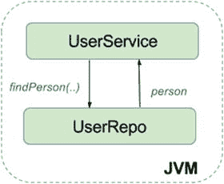

**图 7-1.** 客户端和服务器应用程序运行在同一个 JVM 上下文中

对于传统的远程处理客户端，应该引入一个 `ClientService` 类来访问存在于不同 JVM 上运行的应用程序中的远程对象。图 7-2 抽象地描绘了本章所涵盖的情况。远程对象在此图中由 `RemoteUserService` 类表示。

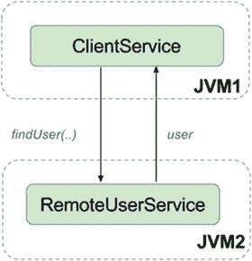

**图 7-2.** 客户端和服务器应用程序运行在不同的 JVM 上下文中

Java 远程调用允许在一个 JVM 中运行的对象调用在另一个 JVM 中运行的对象的方法。RMI（远程方法调用）是 Java 版本的 RPC（远程过程调用）。RMI 应用程序通常由两个进程组成：一个服务器和一个客户端。服务器创建将被远程访问的对象，并暴露一个**骨架**（远程对象的接口）。客户端在**存根**（代理对象）上调用方法。RMI 模型的抽象功能模式如图 7-3 所示。

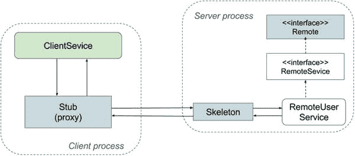

**图 7-3.** RMI 模型抽象功能模式

RMI 模型有一些缺点：

*   客户端和服务器实现与 RMI 框架耦合。
*   服务器接口必须扩展 `java.rmi.Remote`。
*   客户端必须捕获 `java.rmi.RemoteException`，因为它是一个受检异常。¹
*   RMI 存根和骨架必须使用 rmic 编译器生成，该编译器位于 `JAVA_HOME\bin` 目录中。²
*   并且必须编写额外的代码来处理从远程服务器绑定和检索对象。

为了在服务器和客户端之间传递对象，使用了 Java 编组。因此，使用 RMI 传输的对象必须是可序列化的，并且必须实现 `java.io.Serializable`。RMI 使用 Java 远程方法协议（JRMP）进行远程 Java 对象通信。在下面的远程示例中，使用了在 `00-ps-core` 中定义的实体对象，并且它们被定义为可序列化的，以便能够被 Spring JPA 处理。

```
// User.java
import javax.persistence.*;
...
@Entity
@Table(name="P_USER")
public class User extends AbstractEntity {
...
}
// AbstractEntity.java
import java.io.Serializable;
@MappedSuperclass
public abstract class AbstractEntity
implements Serializable {
...
}
```

Spring 提供了用于编写远程应用程序的类，这些类旨在隐藏“管道”细节。使用类 `org.springframework.remoting.rmi.RmiServiceExporter`，由类 `UserServiceImpl` 实现的接口 `UserService`（在 `09-ps-data-jpa` 中定义的服务 Bean）可以被暴露为 RMI 对象。此类可用于绑定到注册表或暴露端点。使用类 `org.springframework.remoting.rmi.RmiProxyFactoryBean`，可以通过创建的代理访问 `UserService` 接口，这些代理用于与服务器端端点通信，并将远程处理特定的异常转换为运行时层次结构，所有这些都扩展了核心的 `RemoteAccessException`。这两个类基本上是实用工具类，旨在帮助开发人员快速轻松地编写远程应用程序，因为通过使用配置，开发人员需要编写的代码大大减少了。³ 使用 Spring 进行客户端和服务器应用程序远程处理的抽象模式如图 7-4 所示。

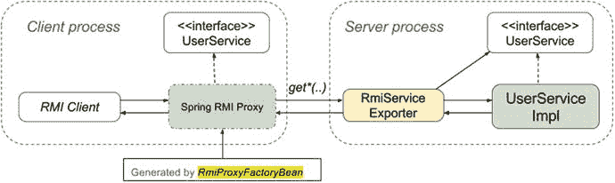

**图 7-4.** Spring 远程处理模式，描述了 RmiServiceExporter 和 RmiProxyFactoryBean 的角色

## Spring 远程配置


远程服务器和客户端的配置可以通过 XML 或 Java 配置来完成。将要远程暴露的服务是定义在 `09-ps-data-jpa` 项目中的一个服务 bean，它使用 Spring Repository 来创建和查询用户。为了使用 Spring 设置通过 JRMP 协议通信的客户端和服务器端远程应用程序，需要执行以下步骤：

1.  配置一个继承自 `org.springframework.remoting.rmi.RmiServiceExporter` 的 bean。
    使用 XML 配置：

使用 Java 配置：

```
    //RmiServerConfig.java
    import org.springframework.remoting.rmi.RmiServiceExporter;
    ...
    @Configuration
    public class RmiServerConfig {
    @Autowired
    @Qualifier("userServiceImpl")
    UserService userService;
    @Bean
    public RmiServiceExporter userService() {
    RmiServiceExporter exporter = new RmiServiceExporter();
    exporter.setRegistryPort(1099);
    exporter.setAlwaysCreateRegistry(true);
    exporter.setServiceName("userService");
    exporter.setServiceInterface(UserService.class);
    exporter.setService(userService);
    return exporter;
    }
    }
    ```

前面定义的两个 bean 都设置了以下属性：

*   `registryPort` –
        导出 RMI 服务的注册表端口，默认值为 1099，因此此属性不是必须设置的，示例中使用它仅出于教学目的。

*   `alwaysCreateRegistry`
        – 此属性的默认值为 `false`。当客户端请求 RMI 服务时，会查找现有的注册表，如果未找到，则会创建它。如果此属性设置为 true，则会在客户端请求时创建注册表，以避免在没有客户端需要时查找现有注册表的开销。由于此属性的默认值为 `false`，因此应用程序开发者无需显式配置它。

*   `serviceName` –
        导出的 RMI 服务默认可以通过以下模板标识的位置访问：`rmi://host:port/serviceName`。服务名称由此属性设置，并且必须由应用程序开发者显式设置。

*   `serviceInterface` –
        此属性用于设置将作为 RMI 服务暴露的 bean 类型的接口；它必须由应用程序开发者显式设置。

*   `service` – 此属性用于设置将作为 RMI 服务暴露的 bean；它必须由应用程序开发者显式设置。

2.  创建一个服务器端应用程序，该应用程序将包含远程导出的 bean 以及需要远程访问的应用程序 bean。

使用 XML 配置，配置如下代码片段所示。

```
    import org.springframework.context.support.ClassPathXmlApplicationContext;
    public class RmiExporterBootstrap {
    public static void main(String args) throws Exception {
    ClassPathXmlApplicationContext ctx =
    new ClassPathXmlApplicationContext(
    "spring/rmi-server-config.xml",
    "spring/app-config.xml");
    System.out.println("RMI server started.");
    System.in.read();
    ctx.close();
    }
    }
    ```

`app-config.xml`
    包含需要在远程服务器上执行的所有服务和仓库 bean。

使用 Java 配置，在 RmiExporterBootstrap 类中声明的上下文需要按以下示例定义：

```
    import com.ps.config.ServiceConfig;
    import org.springframework.context.annotation.AnnotationConfigApplicationContext;
    public class RmiExporterBootstrap {
    public static void main(String args) throws Exception {
    AnnotationConfigApplicationContext ctx =
    new AnnotationConfigApplicationContext(
    RmiServerConfig.class, ServiceConfig.class);
    System.out.println("RMI reward network server started.");
    System.in.read();
    ctx.close();
    }
    }
    ```

通过执行 `RmiExporterBootstrap`
    类，将启动一个 Java 进程，该进程将在端口 1099 上提供一个名为
    `userService` 的 RMI 服务。
    `System.in.read();` 用于保持进程运行，直到用户按下某个键。

3.  配置一个类型为 `org.springframework.remoting.rmi.RmiProxyFactoryBean` 的 bean，它将负责创建客户端访问 RMI 服务所需的代理对象。使用 XML 配置，配置如下代码片段所示。

使用 Java 配置的相同配置可以这样编写：

```
    //RmiClientConfig.java
    import org.springframework.remoting.rmi.RmiProxyFactoryBean;
    @Configuration
    public class RmiClientConfig {
    @Bean
    public UserService userService() {
    RmiProxyFactoryBean factoryBean = new RmiProxyFactoryBean();
    factoryBean.setServiceInterface(UserService.class);
    factoryBean.setServiceUrl("rmi://localhost:1099/userService");
    factoryBean.afterPropertiesSet();
    return (UserService) factoryBean.getObject();
    }
    }
    ```

在创建代理 bean 之前，必须初始化工厂 bean，这就是为什么在 Java 配置中必须显式调用 `afterPropertiesSet()` 方法的原因。`serviceUrl` 属性将设置为服务器提供 RMI 服务的 URL，而 `serviceInterface` 属性应设置为 RMI 服务器 bean 所实现的接口。这个接口就是工厂 bean 创建的代理将实现的接口，以允许客户端在服务器 `userService` bean 上调用远程方法。这就是为什么在该方法的最后一行，`factoryBean.getObject()` 返回的对象被转换为 `UserService`。

4.  创建一个将使用客户端工厂 bean 的客户端应用程序。最简单的方法是创建一个测试类，并注入 `RmiProxyFactoryBean` 将创建的客户端代理 bean：

```
    //RmiTests.java
    @ContextConfiguration(locations = {"classpath:spring/rmi-client-config.xml"})
    @RunWith(SpringJUnit4ClassRunner.class)
    public class RmiTests {
    @Autowired
    private UserService userService;
    public void setUp() {
    assertNotNull(userService);
    }
    @Test
    public void testRmiAll() {
    List users = userService.findAll();
    assertEquals(5, users.size());
    }
    @Test
    public void testRmiJohn() {
    User user = userService.findByEmail("john.cusack@pet.com");
    assertNotNull(user);
    }
    }
    ```

为了确认客户端确实使用了代理 bean，你只需在调试模式下运行其中一个测试方法，在断点处停止执行，然后查看 `userService` bean。在图 7-5 中，展示了一张 Intellij IDEA 测试执行的截图。你可以清楚地看到 `userService` 实际上是由 `RmiProxyFactoryBean` 创建的 RMI 代理。

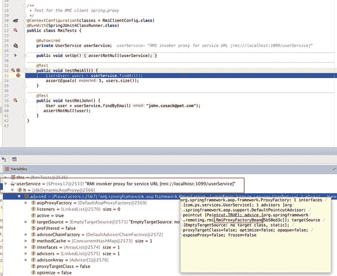

图 7-5.

在调试模式下执行的 RMI 测试截图

如果使用 Java 配置，`@ContextConfiguration` 声明必须更改为以下内容：

```
@ContextConfiguration(classes = RmiClientConfig.class)
```


在实现和访问 RMI 服务时，你可以注意到，Spring 可以像之前介绍的那样以声明式方式使用。这意味着，无需修改现有 Bean 的代码，即可将其暴露为 RMI 服务。因此，服务端接口无需实现 `Remote` 接口。在客户端，利用多态性，可以直接在注入的 Bean 上调用方法，并且 Spring 远程调用异常是未检查异常（存在一个远程调用异常层次结构，所有异常都继承自 `org.springframework.remoting.RemoteAccessException`），因此无需编写捕获和处理它们的代码。

Spring 的 `RmiServiceExporter` 和 `RmiProxyFactoryBean` 可用于多种协议。Spring 提供了相关类，允许通过 HTTP 暴露 RMI 服务，使用一种基于 HTTP 的轻量级二进制协议。要使用的类是 `HttpInvokerProxyFactoryBean` 和 `HttpInvokerServiceExporter`。RMI 方法将被转换为 HTTP 方法：GET 和 POST。这些方法的结果将作为 HTTP 结果返回。方法参数和结果使用 Java 序列化进行序列化，因此传输的对象需要是可序列化的。Spring 的 HttpInvoker 是另一种 Java 到 Java 的二进制远程调用协议；它要求在服务器端和客户端都使用 Spring。

除了这两个用于通过 HTTP 使用 RMI 的类之外，Spring 还支持另外两种协议：Caucho 提供的 `Hessian` 轻量级基于 HTTP 的二进制协议，以及 `Burlap`，它是 Hessian 的基于 XML 的替代方案。Hessian 协议是一种精简的二进制跨平台远程调用协议。大多数跨平台协议都是基于 XML 的，因此为了达到互操作性而牺牲了相当多的性能。Hessian 以最小的性能损失实现了跨平台互操作性。

Spring 为每种协议提供了相应的类：用于 Hessian 的 `HessianProxyFactoryBean` 和 `HessianServiceExporter`，以及用于 Burlap 的 `BurlapProxyFactoryBean` 和 `BurlapServiceExporter`。基本上，要编写一个基于 HTTP 协议的 Spring RMI 应用程序，必须将用于在客户端创建代理和在服务器端暴露服务的 RMI 特定类替换为 Spring HTTP 特定类，并且服务器必须在容器（如 Apache Tomcat 或 Jetty）中运行。图 7-6 应该看起来很熟悉；它描述了使用 Spring Http Invoker 类的抽象模式。

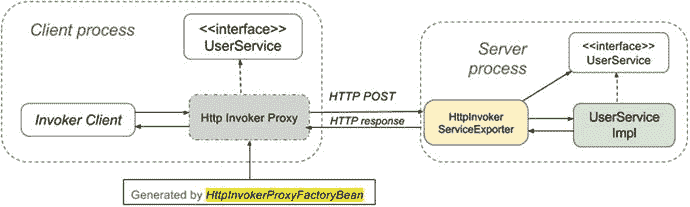

图 7-6.

Spring 远程调用抽象模式

无论配置是通过 XML 还是使用 Java 配置完成的，在服务器端，都必须配置一个类型为 `HttpInvokerServiceExporter` 的 Bean。

```
// HttpInvokerConfig.java
@Configuration
public class HttpInvokerConfig {
@Autowired
@Qualifier("userServiceImpl")
UserService userService;
@Bean(name = "/httpInvoker/userService")
HttpInvokerServiceExporter httpInvokerServiceExporter(){
HttpInvokerServiceExporter invokerService = new HttpInvokerServiceExporter();
invokerService.setService(userService);
invokerService.setServiceInterface(UserService.class);
return invokerService;
}
}
```

`/httpInvoker/userService` 是 HTTP 服务暴露的 URL。在客户端，必须配置一个类型为 `HttpInvokerProxyFactoryBean` 的 Bean。

```
//HttpInvokerClientConfig.java
@Configuration
public class HttpInvokerClientConfig {
@Bean
public UserService userService() {
HttpInvokerProxyFactoryBean factoryBean = new HttpInvokerProxyFactoryBean();
factoryBean.setServiceInterface(UserService.class);
factoryBean.setServiceUrl
("http://localhost:8080/invoker/httpInvoker/userService");
factoryBean.afterPropertiesSet();
return (UserService) factoryBean.getObject();
}
}
```

Spring Http Invoker 类的属性与 RMI Spring 类的属性含义相同；唯一的区别是它们应用于 HTTP 协议。你可能已经注意到，服务 URL 不是 RMI URL，而是由 Web 应用程序 URL [`http://hostname:port/context`] 与调用器服务 Bean 的名称拼接而成的 HTTP URL。在当前示例中，应用程序上下文（即处理 HTTP 请求的 Servlet 映射到的 URL）是 `/invoker`，而调用器 Bean 的名称是 `/httpInvoker/userService`。

暴露调用器服务的 Web 应用程序不需要复杂的 Web 界面，这就是为什么不需要带有完整 MVC 配置的 `DispatcherServlet`。所需要的只是一个拦截请求的 Servlet，而 `org.springframework.web.context.support.HttpRequestHandlerServlet` 非常适合这项工作。Web 应用程序的配置已在第 6 章中介绍过。

```
invoker

org.springframework.web.context.support.HttpRequestHandlerServlet

contextClass

org.springframework.web.context.support.AnnotationConfigWebApplicationContext

contextConfigLocation

com.ps.remoting.config.HttpInvokerConfig

invoker
/*

```

要测试通过 HTTP 暴露的服务，可以使用之前的测试类。只需更改配置文件或类即可。在下面的代码片段中，你可以看到可以在客户端测试类上使用的所有配置。由于客户端只需要代理的接口类型，而代理指向的位置由配置决定。

```
//@ContextConfiguration(locations = {"classpath:spring/rmi-client-config.xml"})
//@ContextConfiguration(classes = RmiClientConfig.class)
//@ContextConfiguration(locations = {"classpath:spring/httpinvoker-client-config.xml"})
@ContextConfiguration(classes = HttpInvokerClientConfig.class)
@RunWith(SpringJUnit4ClassRunner.class)
public class RmiTests {
...
}
```

为了确保客户端实际使用了 http invoker 代理 Bean，你只需以调试模式运行其中一个测试方法，在断点处停止执行，然后查看 `userService` Bean。在图 7-7 中，展示了来自 Intellij IDEA 测试执行的屏幕截图。你可以清楚地看到 `userService` 实际上是由 `HttpInvokerProxyFactoryBean` 创建的 Http Invoker 代理。

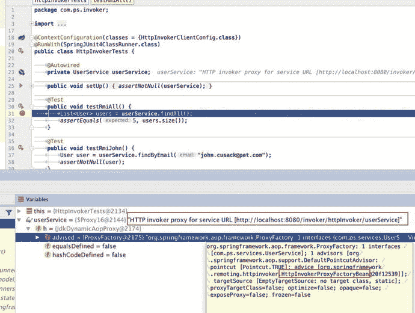

图 7-7.

在调试模式下执行的 HTTP Invoker 测试屏幕截图

Hessian 一直得到维护，并且仍在 Spring 4 中使用。目前处于草案状态的 Hessian 2 是 Hessian 协议的第二个版本，但显然尚未准备好用于生产环境。Burlap 已经有一段时间没有维护了，在 Spring 4 中，Burlap 的 Spring 特定类 `BurlapProxyFactoryBean` 和 `BurlapServiceExporter` 已被标记为已弃用，并可能在 Spring 5 中被移除。

Hessian 特定的配置如下面的代码片段所示（XML 和 Java 配置）。

要测试 Hessian 远程服务，只需编辑 `RmiTests` 类并使用以下配置：

```
@ContextConfiguration(locations = {"classpath:spring/ hessian-client-config.xml"})
@RunWith(SpringJUnit4ClassRunner.class)
public class RmiTests {
...
}
```


Hessian 客户端代理工厂 Bean 和服务器服务导出器
可以使用 Java 配置进行配置。如果你有足够的信心，还可以作为额外练习自行实现。本节使用的源代码可以在 Pet Sitter 项目的 `12-ps-remoting-sample` 和 `12-ps-remoting-practice` 模块中找到。`12-ps-remoting-practice` 项目包含使用 XML 配置的 Http Invoker 和 Hessian 远程处理的服务器端和客户端实现。`12-ps-remoting-solution` 是使用 Java 配置的 HttpInvoker 和 Hessian 的推荐解决方案。你可以将此解决方案与你将在 `12-ps-remoting-practice` 中实现的方案进行比较。

Spring JMS

JMS 是 Java 平台企业版的一部分，由 JSR 914 定义。⁴ 它是一种消息传递标准，允许基于 JEE 的应用程序组件创建、发送、接收和读取消息。JMS 应用程序的基本构建块包括：

*   消息
*   消息生产者（发布者）
*   消息消费者（订阅者）
*   连接
*   会话
*   连接工厂
*   目的地

在图 7-8 中，你可以看到前面列出的所有组件以及它们如何融入 JMS 应用程序。

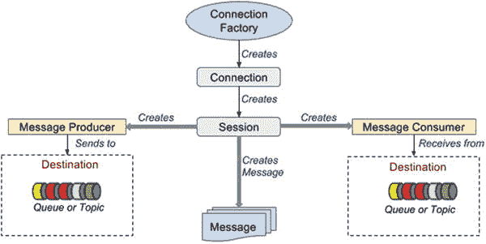

图 7-8.

JMS API 编程模型

在本章的引言中提到，JMS 是访问面向消息中间件的一种抽象，有助于避免供应商锁定并提高可移植性。在本节中，将简要描述上述组件，以及使用 Spring 通过 JMS 代理发布和订阅消息的过程，因为你可能已经猜到，Spring 也让 JMS 的使用变得非常简单。Spring 提供了一个 JMS 集成框架，使得使用 JMS API 变得容易。该框架采用了类似于 Spring JDBC 的方法进行开发。

JMS 连接和会话

连接工厂和目的地是 JMS 应用程序中通过管理方式而非编程方式维护的部分，因为提供实现的技术必须与所使用的 JMS API 实现解耦。JMS 客户端通过 JMS API 标准接口访问这些对象。在企业应用程序中，连接工厂可以绑定到 JNDI，并由企业应用服务器进行外部管理。JMS 连接从连接工厂获取，该工厂被注入到客户端中。

```
//XML 独立示例

//从 JNDI 检索的 XML 连接工厂

// 使用 Java 配置声明连接工厂
//JNDI 名称为 jms/ConnectionFactory
@Resource(lookup = "jms/ConnectionFactory")
private static ConnectionFactory connectionFactory;
// 独立示例
@Bean ConnectionFactory connectionFactory(){
ActiveMQConnectionFactory connectionFactory =
new ActiveMQConnectionFactory();
connectionFactory.setBrokerURL("tcp://localhost:60006");
return connectionFactory;
}
// 经典配置
import javax.naming.Context;
import javax.naming.InitialContext;
import javax.jms.*;
...
Properties properties = new Properties();
properties.put( /* JNDI 属性 */ );
Context context = new InitialContext(properties);
ConnectionFactory factory = (ConnectionFactory) context.lookup("jms/ConnectionFactory");
```

一旦获取了连接工厂，剩下的就是获取一个 `javax.jms.Connection`，然后启动一个 `javax.jms.Session` 来开始处理消息：

```
Connection connection = factory.createConnection();
connection.start();
Session session = connection.createSession(false, Session.AUTO_ACKNOWLEDGE);
// 处理消息
...
```

`createSession` 方法有两个参数：第一个是布尔类型，用于确定会话是否应支持事务（当使用 `false` 作为参数时，生成的会话不支持事务）；第二个参数用于确定会话是否在消息成功接收后自动确认消息。在前面的示例中，由于提供了 `Session.AUTO_ACKNOWLEDGE` 作为参数，生成的会话将自动执行此操作。

JMS 会话代表一个工作单元。当消息处理完成后，必须根据处理结果提交或回滚会话。

```
session.commit(); // 一切正常
// 或
session.rollback(); // 出现错误
```

`Session` 对象负责创建将发送给客户端的消息。

JMS 消息

JMS API 定义了 JMS 消息的标准形式，该形式应在所有 JMS 提供者之间可移植。尽管 JMS API 旨在适应许多现有的 JMS 提供者，但消息具有标准结构，由头部和主体组成。头部包含所有消息共有的系统级信息，例如目的地和发送时间，以及存储为关键字/值属性的应用程序特定信息。主体包含有效的应用程序数据，JMS 定义了五种不同的消息主体类型，表示为扩展 `javax.jms.Message` 的 Java 接口。因此，JMS 消息主体是实现 `javax.jms.Message` 层次结构中任何接口的类的实例。表 7-1 列出了 JMS API 定义的五种主体类型。

表 7-1.

JMS 消息格式

消息类型 | 消息内容
--- | ---
`javax.jms.TextMessage` | 一个 Java String 对象
`javax.jms.MapMessage` | 一组键值对，键为 String 类型，值为原始类型，无固定顺序。
`javax.jms.BytesMessage` | 一个未解释的字节流。
`javax.jms.StreamMessage` | Java 编程语言中的原始值流，按顺序填充和读取。
`javax.jms.ObjectMessage` | Java 编程语言中的一个 Serializable 对象

消息由 `Session` 对象创建，以下代码片段展示了如何创建上表中列出的每种类型的消息：

```
TextMessage message = session.createTextMessage();
message.setText("这是一条文本消息");
MapMessage mm = session.createMapMessage();
mm.set("key", "value");
session.createBytesMessage("字节数组".getBytes());
```

```
streamMessage = session.createStreamMessage();
// 向其写入原始值
streamMessage.writeBoolean(false);
streamMessage.writeInt(223344);
streamMessage.writeChar('q');
// 清空流
streamMessage.reset();
// 用户必须是可序列化的
session.createObjectMessage(user);
```

JMS 目的地

`javax.jms.Destination` 接口在客户端实现，用于指定客户端生成消息的目标以及客户端消费消息的来源，因为客户端应用程序也可以生成消息，这些消息可以作为回复发送给与其通信的 JMS 应用程序。想象一下这个场景：JMS 服务器应用程序向 JMS 客户端应用程序发送一条数据消息，客户端回复一条确认消息，表示数据已收到。根据消息传递域的不同，实现也有所不同：

*   点对点域中的队列，每条消息有一个生产者和一个消费者。
*   发布者/订阅者域中的主题，每条发布的消息由多个订阅者消费。

队列和主题之间的区别如图 7-9 所示。

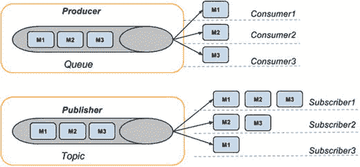

图 7-9.

队列和主题之间的区别

目的地可以是独立的，也可以从 JNDI 检索：


```
// 使用 Java 配置声明一个队列
// JNDI 名称为 jms/UserQueue
@Resource(lookup = "jms/UserQueue")
private static Queue userQueue;
// 使用 Java 配置声明一个主题
// JNDI 名称为 jms/Topic
@Resource(lookup = "jms/Topic")
private static Topic topic;
// 使用 XML 声明一个队列
// JNDI 名称为 jms/Queue

//XML 独立队列

//Java 配置独立队列
@Bean
public Queue userQueue(){
return new ActiveMQQueue("queues.users");
}
```

`Session` 对象负责使用目标对象创建生产者和消费者。生产者对象发送消息，消费者对象接收消息。

```
MessageProducer producer = session.createProducer(userQueue);
ObjectMessage userMessage = session.createMessage(user);
producer.send(userMessage);
...
MessageConsumer consumer = session.createConsumer(userQueue);
Message message = consumer.receive();
```

到目前为止，只介绍了核心的 JMS 组件，但在添加更多内容之前，必须先介绍一个 JMS 提供者。

Apache ActiveMQ

市面上有相当多的 JMS 实现。其中大部分由面向消息的中间件提供商提供，例如：WebSphere MQ、Oracle EMS、JBoss AP、SwiftMQ、TIBCO EMS、SonicMQ、ActiveMQ、WebLogic JMS。有些是开源的，有些则不是。其中一些还提供了原生 C API（如 TIBCO EMS 和 Sonic MQ）。有些则直接用 Java 实现。

本节选择 Apache ActiveMQ 作为 JMS 提供者，它具有以下特性：

*   最流行且功能最强大的开源消息传递与集成模式服务器
*   接受非 Java 客户端
*   可在生产环境中独立使用
*   支持可插拔的传输协议，如 in-VM、TCP、SSL、NIO、UDP、多播、JGroups 和 JXTA 传输
*   可使用嵌入式代理作为内存中的 JMS 提供者，从而避免在单元测试 JMS 时运行独立进程的开销⁵
*   `activemq` 可执行文件以默认配置启动
*   也可嵌入到应用程序中使用
*   可使用 ActiveMQ 或 Spring 配置（XML 或 Java 配置）进行配置
*   提供高级消息传递功能，如消息组、虚拟和复合目标以及通配符
*   与 Spring Integration 或 Apache Camel 配合使用时，支持企业集成模式
*   以及更多其他特性。

截至本章编写时，当前稳定版本为 5.14.1。⁶ 可从官方网站下载。⁷ 要运行本章附带的代码示例，您需要下载适合您系统的归档文件，并按照官方网站上的安装说明进行操作。基本上，您需要将归档文件解压到某个位置，并确保其包含图 7-10 所示的内容。您可以看到前面列出的所有组件以及它们如何融入 JMS 客户端应用程序。

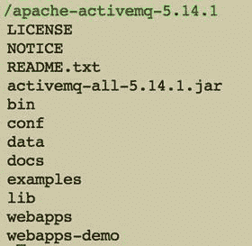

图 7-10.

目录 apache-activemq-5.14.1 的内容

在 `bin` 目录中，有一个名为 `activemq`（Windows 系统为 `activemq.bat`）的可执行文件，它将在您的计算机上启动 ActiveMQ。只需打开一个终端（或命令提示符），并使用参数 `start` 运行该可执行文件。

```
$ ./activemq start
或
$ activemq.bat start (Windows)
```

ActiveMQ 附带一个 Web 界面，可通过 `http://127.0.0.1:8161/admin/` 访问。它会要求输入用户名和密码。官方网站说明应使用 `admin/admin`。在图 7-11 中，您可以看到 Apache ActiveMQ Web 应用程序，它可用于监控前面提到的 JMS 组件：连接工厂和目标。

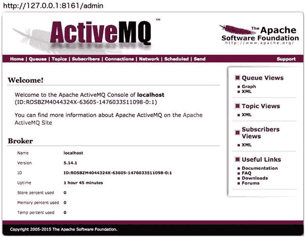

图 7-11.

Apache ActiveMQ Web 应用程序

本节涵盖的应用程序将使用托管在 `tcp://localhost:61616` 的 ActiveMQ 代理。连接工厂将使用此代理来创建连接。除此之外，`ObjectMessage` 对象依赖于 Java 序列化来编组/解组对象负载。此过程通常被认为是不安全的，因为恶意负载可能会利用主机系统。因此，从版本 5.12.2 和 5.13.0 开始，ActiveMQ 要求用户明确地将可以使用 `ObjectMessages` 交换的包列入白名单。⁸ 因此，`connectionFactory` bean 的声明将需要包含那些包含可在 JMS 通信中序列化和使用的类的包。

```

argument-->

com.ps

//Java 配置
@Configuration
public class JmsCommonConfig {
List packagesList= ...;
@Bean
public ConnectionFactory nativeConnectionFactory(){
ActiveMQConnectionFactory cf = new ActiveMQConnectionFactory();
cf.setBrokerURL("tcp://localhost:61616");
cf.setTrustedPackages(packagesList);
// 或者使用通用但不安全的方式
cf.setTrustAllPackages(true);
return cf;
}
...
}
```

当对象复杂且包含不同类型的字段时，需要信任用于序列化的包列表可能会很长，⁹ 因此出于教学目的，可以使用 `trustAllPackages` 属性作为替代。

ActiveMQ 目标必须声明为 bean，队列使用 `org.apache.activemq.command.ActiveMQQueue` 类型，主题使用 `org.apache.activemq.command.ActiveMQTopic` 类型。

Spring JmsTemplate

Spring 使应用程序与后端基础设施解耦，但应用程序必须针对 API 进行编码。`org.springframework.jms.core.JmsTemplate` 是 Spring JMS 核心包的中心类。它是一个辅助类，旨在通过处理资源的创建和释放来简化同步 JMS 消息的发送和接收。此模板类提供了以下开发优势：

*   减少样板代码，但如果任务需要，开发人员可以实现回调接口，从而获得明确定义的高级契约
*   透明管理 JMS 资源
*   公开基本的请求-回复操作，使得可以发送消息并在作为操作一部分创建的临时队列上等待回复
*   提供实用的异常处理，将 JMS 异常转换为 Spring 特定的 JMS 非检查异常（`org.springframework.jms.JmsException` 的扩展）
*   支持自定义消息转换器和目标解析器
*   提供便捷方法和回调

从 Spring Framework 4.1 开始，引入了 `org.springframework.jms.core.JmsMessagingTemplate` 类，它构建在 `JmsTemplate` 之上，以提供与 Spring 消息抽象 `org.springframework.messaging.Message<T>` 的集成，从而允许创建通用消息。

`JmsTemplate` 使用 `org.springframework.jms.support.converter.MessageConverter` 的实现来在对象和 `Messages` 之间进行转换。`SimpleMessageConverter` 处理基本类型：文本、可序列化对象类型、映射和 byte[]。对于更复杂的对象，开发人员可以提供自己的实现，或委托给 OXM 编组器（从 Spring 3 开始可用）。

以下代码片段描述了开发人员为实现自定义消息转换器而必须实现的 `MessageConverter` 接口。

```
package org.springframework.jms.support.converter;
...
public interface MessageConverter {
Message toMessage(Object object, Session session)
throws JMSException, MessageConversionException;
Object fromMessage(Message message)
throws JMSException, MessageConversionException;
}
```


开箱即用，为简化操作，Spring 为 `MessageConverter` 类 `org.springframework.jms.support.converter.SimpleMessageConverter` 提供了一个简单实现，用于将可序列化对象默认转换为对象消息，并且在 JMS 应用中，Spring 会自动创建此类型的 Bean。

`JmsTemplate` Bean 需要连接工厂和目的地才能初始化。连接工厂和目的地可以通过其 ID 注入到 `JmsTemplate` Bean 中。

```

//Java 配置
import org.apache.activemq.ActiveMQConnectionFactory;
import org.apache.activemq.command.ActiveMQQueue;
...
@Bean
public ConnectionFactory connectionFactory(){
ActiveMQConnectionFactory cf = new ActiveMQConnectionFactory();
cf.setBrokerURL("tcp://localhost:61616");
cf.setTrustAllPackages(true);
return cf;
}
@Bean
public ActiveMQQueue confirmationQueue(){
return new ActiveMQQueue("com.queue.confirmation");
}
@Bean
public JmsTemplate jmsTemplate(){
JmsTemplate jmsTemplate = new JmsTemplate();
jmsTemplate.setConnectionFactory(connectionFactory());
jmsTemplate.setDefaultDestination(confirmationQueue());
jmsTemplate.setPubSubNoLocal(false);
return  jmsTemplate;
}
```

`pubSubNoLocal` 属性用于设置是否禁止传递自身连接发布的消息。默认值为 `false`，但在之前的代码示例中，为了教学目的而显式设置了该值。当客户端（消费者）接收到消息时，由于通信是异步的，因此必须设置一个监听器来接收消息并对其进行处理。要实现自定义消息监听器，需要实现 `javax.jms.MessageListener` 接口，并且必须提供其单一方法 `onMessage(Message message)` 的实现。在 Spring 应用中，消息监听器由 `org.springframework.jms.listener.MessageListenerContainer` 的实现（通常是 `DefaultMessageListenerContainer`）管理。此类型的 Bean 管理着将调用监听器的 JMS 会话。可以通过设置 `concurrency` 属性（例如，最小-最大间隔为 5-10，或最大值如 10）来配置 `DefaultMessageListenerContainer`，以设置其所管理的 `JmsTemplate` 实例的消费者并发限制。但每个 `JmsTemplate` Bean 可以通过为其自身的 `concurrency` 属性设置不同的值来覆盖此设置。以下代码片段展示了这两个 Bean 的实现和配置。`UserReceiver` 类会发送一个确认，表明用户消息已成功接收。

```
import javax.jms.JMSException;
import javax.jms.Message;
import javax.jms.MessageListener;
public class UserReceiver implements MessageListener {
private Logger logger = LoggerFactory.getLogger(UserReceiver.class);
//用于为 Confirmation 对象生成唯一 ID
private static AtomicInteger id = new AtomicInteger();
@Autowired
MessageConverter messageConverter;
@Autowired
ConfirmationSender confirmationSender;
@Override
public void onMessage(Message message) {
try {
User receivedUser = (User) messageConverter.fromMessage(message);
logger.info(" >> 收到用户: " + receivedUser);
confirmationSender.sendMessage
(new Confirmation(id.incrementAndGet(), "用户 "
+ receivedUser.getEmail() + " 已收到。"));
} catch (JMSException e) {
logger.error("发生错误 ...", e);
}
}

//Java 配置
@Bean
public UserReceiver userReceiver(){
return new UserReceiver();
}
@Bean
public DefaultMessageListenerContainer containerListener() {
DefaultMessageListenerContainer listener =
new DefaultMessageListenerContainer();
listener.setConnectionFactory(connectionFactory());
listener.setDestination(userQueue());
listener.setMessageListener(userReceiver());
return listener;
}
}
```

在服务器（生产者）端，消息被发送，可以使用 `JmsTemplate` Bean 的不同方法来实现。发送消息的实现是一个简单的 Bean，其中注入了 `JmsTemplate` 实例作为依赖。

```
@Component
public class UserSender {
@Autowired
JmsTemplate jmsTemplate;
public void sendMessage(final User user) {
jmsTemplate.send ( (Session session) -> session.createObjectMessage(user));
}
}
```

并且服务器（生产者）端使用的 `JmsTemplate` 如前所述进行定义。用于发送消息的队列是 `userQueue`。

```
@Bean
public ActiveMQQueue userQueue(){
return new ActiveMQQueue("com.queue.user");
}
@Bean
public JmsTemplate jmsTemplate(){
JmsTemplate jmsTemplate = new JmsTemplate();
jmsTemplate.setConnectionFactory(connectionFactory());
jmsTemplate.setDefaultDestination(userQueue());
jmsTemplate.setPubSubNoLocal(false);
return  jmsTemplate;
}
```

`JmsTemplate` 提供了将目的地作为参数接收的方法；当应用需要向多个目的地发送消息时，这些方法非常有用。可以在 `JmsTemplate` 上设置自定义消息转换器，在这种情况下可以使用 `convertAndSend` 方法。

```
convertAndSend(final Object message)
convertAndSend(Destination destination, final Object message)
convertAndSend(String destinationName, final Object message)
```

分配给本节的项目是 `13-ps-jms-practice`。它包含两个应用，它们使用 ActiveMQ 通过两个对象队列进行通信。生产者应用从数据库中提取用户，并将其作为消息发送到 `userQueue`，然后等待在 `confirmationQueue` 上接收确认消息。消费者应用在 `userQueue` 上接收用户消息，并使用 `confirmationQueue` 为每个接收到的用户发送确认。配置将通过 Java 配置类提供。在图 7-12 中，您可以看到将用于测试您对 Spring 中 JMS 理解程度的 JMS 应用设计。

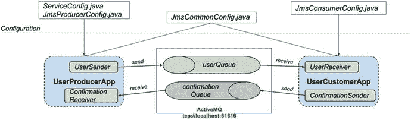

图 7-12.

生产者/消费者 JMS 抽象设计

这两个应用有一个共同的配置类 `JmsCommonConfig.java`。此类包含 JMS 基础设施的配置：连接工厂、队列和消息转换器。

```
import org.apache.activemq.ActiveMQConnectionFactory;
import org.apache.activemq.command.ActiveMQQueue;
import org.springframework.context.annotation.Bean;
import org.springframework.context.annotation.ComponentScan;
import org.springframework.context.annotation.Configuration;
import org.springframework.jms.support.converter.MessageConverter;
import org.springframework.jms.support.converter.SimpleMessageConverter;
import javax.jms.ConnectionFactory;
@Configuration
public class JmsCommonConfig {
@Bean
public ConnectionFactory connectionFactory(){
ActiveMQConnectionFactory cf =
new ActiveMQConnectionFactory();
cf.setBrokerURL("tcp://localhost:61616");
cf.setTrustAllPackages(true);
return cf;
}
@Bean
public ActiveMQQueue userQueue(){
return new ActiveMQQueue("com.queue.user");
}
@Bean
public ActiveMQQueue confirmationQueue(){
return new ActiveMQQueue("com.queue.confirmation");
}
@Bean
public MessageConverter converter() {
return new SimpleMessageConverter();
}
}
```

`JmsTemplate` 会主动打开和关闭连接、会话等资源，因为它假定这些资源由 connectionFactory 缓存。因此，不应使用 `ActiveMQConnectionFactory` 类作为 `connectionFactory` Bean 的类型，而应使用 Spring 特定的 `CachingConnectionFactory` 类来包装原生实现。


```
import org.springframework.jms.connection.CachingConnectionFactory;
...
@Configuration
public class JmsCommonConfig {
@Bean
public ConnectionFactory nativeConnectionFactory(){
ActiveMQConnectionFactory cf = new ActiveMQConnectionFactory();
cf.setBrokerURL("tcp://localhost:61616");
cf.setTrustAllPackages(true);
return cf;
}
@Bean
public ConnectionFactory connectionFactory() {
CachingConnectionFactory cf = new CachingConnectionFactory();
cf.setTargetConnectionFactory(nativeConnectionFactory());
return cf;
}
...
}
```

启动两个应用程序的类是带有 `main` 方法的简单类。它们可以作为 Java 应用程序从 Intellij IDEA 中运行。每个类都会从应用程序类实例化一个上下文，并可以通过在终端中按下 `<Enter>` 键来停止。

在运行应用程序之前，必须先启动 ActiveMQ 代理。两个队列上的通信和活动可以在 ActiveMQ Web 界面的“队列”选项卡中进行监控。应首先启动生产者应用程序（`UserProducerApp` 类），在 ActiveMQ 浏览器界面中，已生成的消息数量应显示在 `Message Enqueued` 列中，如图 7-13 所示。

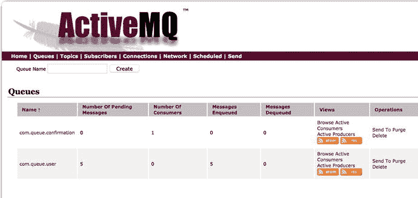

图 7-13.

ActiveMQ Web 应用程序，“队列”选项卡展示了应用程序使用的两个队列，以及已在 userQueue 中生成并存储的消息

队列在首次启动生产者应用程序时创建。可以从界面中清除消息。只要没有应用程序访问队列，也可以从 Web 界面中删除队列。在启动消费者应用程序（`UserConsumerApp` 类）后，第二个队列上的活动也应显示在 `Message Dequeued` 列中。这种情况如图 7-14 所示。

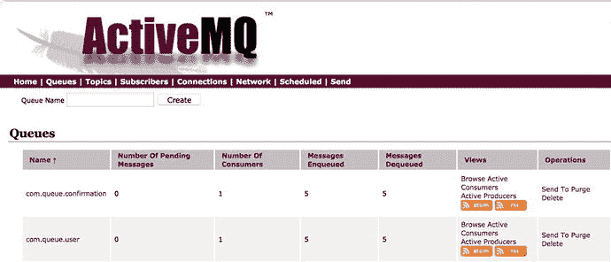

图 7-14.

ActiveMQ Web 应用程序，“队列”选项卡展示了应用程序使用的两个队列，以及已生成和已消费的消息

创建 Spring JMS 应用程序的下一步是将 Spring Boot 添加到组合中。在 `13-ps-jms-practice` 项目模块中，你可以找到前面描述的两个 JMS 应用程序，它们使用了预 Boot 的 Java 配置。在 `13-ps-jms-solution` 中，你可以找到一个使用 Spring Boot 配置的等效 Spring JMS 应用程序。

使用 Spring Boot 的 JMS

使用 Spring Boot 编写 Spring JMS 应用程序更加容易。项目模块 `13-ps-jms-solution` 中的应用程序包含一个 Spring Boot JMS 应用程序，它将 `User` 实例封装在 JMS 消息中发送到 `userQueue`。配置了一个消息监听器来处理该消息，并在 `confirmationQueue` 上发送一条确认消息。还定义了另一个监听器，它等待确认并打印其内容。为了进一步简化应用程序，不需要生产者类和消费者类。只有一个进程从两个队列发布和消费消息。Spring Boot JMS 应用程序的抽象架构如图 7-15 所示。

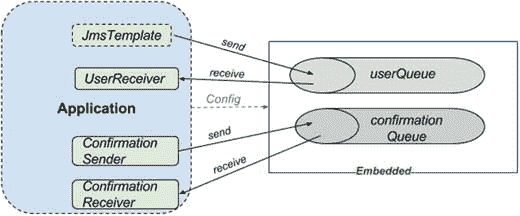

图 7-15.

Spring Boot JMS 应用程序抽象架构

该应用程序仅由四个类组成，其用途如下：

*   `UserReceiver` 和 `ConfirmationReceiver` 负责接收用户消息和确认消息。这些类具有更实用的实现，使用了 `@JmsListener` 注解。在将处理消息的方法上使用此注解，允许开发者避开实现 `MessageListener` 的 JMS 限制。此注解标记了在其上使用的方法，作为指定目标上的 JMS 监听器的目标，并且 `connectionFactory` 属性指定了用于构建 JMS 监听器容器的 Bean。此注解由特殊的 Spring Bean 后处理器处理：`org.springframework.jms.annotation.JmsListenerAnnotationBeanPostProcessor`。

```
    // UserReceiver.java
    @Component
    public class UserReceiver{
    private Logger logger = LoggerFactory.getLogger(UserReceiver.class);
    private static AtomicInteger id = new AtomicInteger();
    @Autowired
    ConfirmationSender confirmationSender;
    @JmsListener(destination = "userQueue",
    containerFactory = "connectionFactory")
    public void receiveMessage(User receivedUser) {
    logger.info(" >> 收到用户: " + receivedUser);
    confirmationSender.sendMessage(
    new Confirmation(id.incrementAndGet(), "用户 "
    + receivedUser.getEmail() + " 已收到。"));
    }
    }
    //ConfirmationReceiver.java
    @Component
    public class ConfirmationReceiver {
    private Logger logger = LoggerFactory.getLogger(ConfirmationReceiver.class);
    @JmsListener(destination = "confirmationQueue",
    containerFactory = "connectionFactory")
    public void receiveConfirmation(Confirmation confirmation) {
    logger.info(" >> 收到确认: " + confirmation);
    }
    }
    ```

*   `ConfirmationSender` 类只是一个注入了 `JmsTemplate` Bean 的 Bean，用于向 `confirmationQueue` 发送确认对象。

```
    @Component
    public class ConfirmationSender {
    @Autowired
    JmsTemplate jmsTemplate;
    public void sendMessage(final Confirmation confirmation) {
    jmsTemplate.convertAndSend("confirmationQueue", confirmation);
    }
    }
    ```

*   `Application` 类是应用程序的配置和启动类。它使用了功能强大的 `@SpringBootApplication` 注解，该注解将确保扫描当前包中的 Bean，并根据类路径设置注入所有基础设施 Bean。该类上的另一个注解是 `@EnableJms`，正如你可能推测的那样，此注解启用了 Bean 后处理器，该处理器将处理 `@JmsListener` 注解，并在“幕后”创建消息监听器容器。在此类中，还声明了 `connectionFactory` Bean。在此示例中，Bean 的类型是 `org.springframework.jms.config.JmsListenerContainerFactory`，使用的实现是 Spring Boot 的 `org.springframework.boot.autoconfigure.jms.DefaultJmsListenerContainerFactoryConfigurer`，它将启动 JMS 应用程序所需的所有 Spring Boot 基础设施 Bean。

还定义了一个类型为 `MappingJackson2MessageConverter` 的转换器 Bean，它实现了 JMS 的 `MessageConverter` 接口，将发送的对象转换为文本 JSON 格式。使用文本转换器非常有用，尤其是在要发送的消息不是可序列化类型时。在此示例中，`User` 和 `Confirmation` 类特意没有声明实现 `Serializable`。

`main` 方法除了启动应用程序外，还实例化了一个 `JmsTemplate` 对象，用于发送用户对象。


```
    import org.springframework.boot.autoconfigure.SpringBootApplication;
    import org.springframework.boot.autoconfigure.jms.
    DefaultJmsListenerContainerFactoryConfigurer;
    import org.springframework.jms.annotation.EnableJms;
    import org.springframework.jms.config.DefaultJmsListenerContainerFactory;
    import org.springframework.jms.config.JmsListenerContainerFactory;
    import org.springframework.jms.support.converter.MappingJackson2MessageConverter;
    import org.springframework.jms.support.converter.MessageConverter;
    import org.springframework.jms.support.converter.MessageType;
    ...
    @SpringBootApplication
    @EnableJms
    public class Application {
    private static Logger logger = LoggerFactory.getLogger(Application.class);
    public static void main(String args) throws Exception {
    ConfigurableApplicationContext context =
    SpringApplication.run(Application.class, args);
    JmsTemplate jmsTemplate = context.getBean(JmsTemplate.class);
    //Send an user
    System.out.println("Sending an user message.");
    jmsTemplate.convertAndSend("userQueue",
    new User("John.Cusack@pet.com", 5d, true));
    logger.info("Waiting for user and confirmation ...");
    System.in.read();
    context.close();
    }
    @Bean // Serialize message content to json using TextMessage
    public MessageConverter jacksonJmsMessageConverter() {
    MappingJackson2MessageConverter converter =
    new MappingJackson2MessageConverter();
    converter.setTargetType(MessageType.TEXT);
    converter.setTypeIdPropertyName("_type");
    return converter;
    }
    @Bean
    public JmsListenerContainerFactory connectionFactory(
    ConnectionFactory connectionFactory,
    DefaultJmsListenerContainerFactoryConfigurer configurer) {
    DefaultJmsListenerContainerFactory factory =
    new DefaultJmsListenerContainerFactory();
    configurer.configure(factory, connectionFactory);
    return factory;
    }
    }
    ```

在前面的代码示例中，`MappingJackson2MessageConverter` 转换器 Bean 设置了两个属性。`targetType` 被设置为信息序列化后的 JMS 消息类型。默认值为 `BytesMessage`。对于 JSON 类型，`TextMessage` 是合适的，因为这样 JMS 消息变得可读，从而在出现问题时更容易调试。`typeIdPropertyName` 用于命名 JMS 消息属性，该属性携带所包含对象的类型 ID：可以是映射的 ID 值，也可以是原始的 Java 类名。默认值为 NONE，但必须设置此属性才能将传入消息转换为 Java 对象。在前面的示例中，该属性被设置为 `_type`。假设发送了一个 `User` 实例，则该实例中的 JMS 消息会被转换为类似于以下代码片段所示的内容：

```
ActiveMQTextMessage {
commandId = 5,
responseRequired = true,
messageId = ID:ROSBZM4044324X-64390-1478342192637-4:3:1:1:1,
destination = queue://userQueue,
size = 1140,
properties = {_type=com.ps.jms.User},
text = {"email":"John.Cusack@pet.com","rating":5.0,"active":true}}
...
}
```

`@JmsListener` 是在 Spring 4.1 版本中添加的，它代表了一种非常实用的配置消息监听器的方式。使用该注解的方法具有灵活的方法签名，其参数可以由 Spring 容器自动注入，例如 JMS 会话、确切的消息对象、JMS 标头以及其他可以在官方文档中找到的参数。前面展示的 JSON 片段是通过修改 `UserReceiver` 实现并添加一个 `Message` 类型的参数获得的，Spring 会在运行时用原始的 JMS 消息替换该参数。

```
@Component
public class UserReceiver{
private Logger logger = LoggerFactory.getLogger(UserReceiver.class);
private static AtomicInteger id = new AtomicInteger();
@Autowired
ConfirmationSender confirmationSender;
@JmsListener(destination = "userQueue", containerFactory = "connectionFactory")
public void receiveMessage(User receivedUser, Message message) {
logger.info(" >> Original received message: " + message);
logger.info(" >> Received user: " + receivedUser);
confirmationSender.sendMessage(new Confirmation(id.incrementAndGet(), "User "
+ receivedUser.getEmail() + " received."));
}
}
```

`JmsTemplate` 使得向目标发送消息变得非常容易，在本示例中，它由 Spring Boot 自动创建。`connectionFactory` 也由 Spring Boot 创建，并由以嵌入式模式运行的 ActiveMQ 提供支持。

JMS 可以用作一种机制，允许后端组件之间进行异步请求处理。当需要数据复制，或者执行用户不知情且不应妨碍应用程序使用的长时间运行进程时，它非常有用。此外，发布/订阅是一种将发送者与接收者解耦的好技术，从而提高了架构的灵活性。JMS 仍然主要用于灵活的流程中，这些流程的通信是异步的，消息可能会丢失，并且重新发送消息也不是问题。

Spring Web Services

术语“Web 服务”描述了一种标准化的通信方式，它使用 XML、SOAP、WSDL 和 UDDI 开放标准，通过互联网协议主干网进行 Web 应用程序集成。这种通信方式允许进行通信的应用程序之间实现松散耦合，并且当应用程序经常发生变更时非常有用，因为变更不应影响它们之间的兼容性。XML 曾经是 Web 服务领域的国际语言，直到 JSON 的出现。XML 是一种标准化的数据组织方式，可以被所有主流平台理解：

*   Java，使用 SAX、StAX、DOM、JAXB 等 API 来操作 XML
*   .NET，使用 System.XML 或 .NET XML Parser
*   Ruby，使用 Nokogiri、REXML 或 XMLSimple
*   Perl，使用 LibXML、Perl-XML 或 XML::Simple
*   等等。

SOAP 是简单对象访问协议（Simple Object Access Protocol）的缩写。它是一种协议规范，用于在计算机网络中实现 Web 服务时交换结构化信息。SOAP 不一定与 Web 服务或 RPC 相关联，它封装了在设计需要交换信息的松散耦合应用程序时应尊重的关键术语：可扩展性（安全性和 WS-routing 是正在开发中的扩展）、中立性（可以运行在任何协议上，如 HTTP、SMTP、TCP、UDP 或 JMS）和独立性（允许任何编程模型）。基本上，SOAP 允许应用程序之间进行通信，无论其实现方式或底层操作系统如何。

Web 服务的实现细节通常封装在 Web 服务层中，该层直接与服务层通信。Web 服务层提供将软件对象转换为基于 XML 的表示形式的逻辑，这些表示形式可以发送到目标应用程序。Spring 通过其 Spring Web Services（Spring-WS）为 Web 服务实现提供支持，这是 Spring 社区专注于创建文档驱动的 Web 服务的产物。像所有 Spring 产品一样，其目标是提供基础设施和支持组件，使编写基于 Web 服务的应用程序变得实用且愉快。下面列出了 Spring-WS 的一些关键特性。

*   它使得使用 XSD/WSDL 优先契约的最佳实践变得容易，这一点非常重要，因为即使使用 WSDL 的主要优势在于它能解决许多互操作性问题，但开发者通常仍将其视为麻烦。


*   提供 XML API 支持：可以使用 JAXP API（如 DOM、SAX 和 StAX）处理 XML 消息，也可以使用 JDOM、dom4j、XOM，甚至编组技术。

*   提供灵活的 XML 编组：对象/XML 映射模块支持几乎所有已知的 XML 编组库：OXM、Castor、JAXB 1 和 2、XStream 等。

*   WS-Security 提供了对 SOAP 消息进行签名、加密和解密的工具，并与 Spring Security 集成。

*   以及更多功能。

Spring-WS 不是考试主题，也是一个广泛的课题，因此本节仅作浅尝辄止的介绍。不过，将涵盖主要要点，以帮助您理解使用 Spring 设计和开发基于 Web 服务的应用程序的总体思路。以下是设计“契约优先”的步骤：

*   创建示例消息。一个简单的服务用户消息可能如下所示：

```
    John.Cusack@pet.com
    5.0

```

*   定义服务消息必须遵守的 XSD 模式：

*   通过丰富 XSD 模式来限制类型和值。在下一个代码片段中，指定了一个正则表达式模式来验证电子邮件地址的值。

SOAP 消息

SOAP 消息的结构类似于 JMS 消息：它们有一个头部和一个正文，这些被封装在一个特殊的 SOAP 信封中，该信封将 XML 文档标识为 SOAP 消息。此外，SOAP 消息可以包含关于 Web 服务通信期间可能发生的错误的故障信息。因此，包含用户信息的 SOAP 消息看起来像下面的 XML 片段。

```

John.Cusack@pet.com

```

在编写 Web 服务应用程序时，有四个可能的起点：

*   从 XML 消息开始：在这种方法中，开发从 Web 服务消息的 XML 表示开始。然后使用智能编辑器（如 IntelliJ IDEA 或 Eclipse）生成一个简单的 XSD 模式，该模式可以进一步定制。从这一点开始，开发步骤与列表中下一个选项相同。（这是开发本节所涵盖的 Web 服务所使用的方法。）

*   从 XML 模式开始：在这种方法中，开发从定义 XML 数据结构的 XML 模式（XSD 文件）开始，这些数据结构将用作 Web 服务操作中的参数和返回类型。智能编辑器应为您提供一个选项，以生成表示 Web 服务应用程序要处理的对象所需的 Java 类。或者，可以使用 Java `xjc` 实用程序，稍后将介绍该实用程序。在 IntelliJ IDEA 中，右键单击 `*.xsd` 文件时出现的 WebServices 菜单下有两个代码生成选项：使用 JAXB¹⁰ 生成和使用 XMLBeans¹¹ 生成。

*   从 Java 类开始：在这种方法中，可以使用智能编辑器或稍后将介绍的 Java `xjc` 实用程序从现有代码生成 XSD 模式和 WSDL。

*   从 WSDL 开始：这也称为“契约优先”或“自顶向下”方法，在这种方法中，您首先定义 Web 服务契约或使用预先存在的契约。如果您有一个 `*.wsdl` 文件，您可以使用智能编辑器从 Wsdl 生成 Java 代码，或者使用稍后将介绍的 Java `xjc` 实用程序。（IntelliJ IDEA 在 WebServices 菜单项下提供了此选项。）

XSD 模式定义了 Web 服务域以及可以使用 Web 服务执行的操作。Spring-WS 会自动将此模式导出为 WSDL（Web 服务描述语言）。对于 `14-ps-ws-sample` 中的应用程序，XSD 模式将包含一个操作，该操作使用用户的电子邮件来提取用户类型。XSD 模式位于 `src/main/resources/sample` 下，名为 `userMessage`。该项目是使用 Spring Boot 创建的，以便将重点放在契约的实现上，而不是应用程序基础设施上。

在图 7-16 中，描绘了一个客户端和服务器 WS 应用程序以及它们的通信方式。

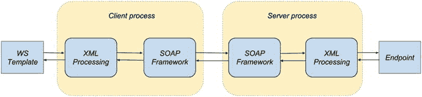

图 7-16.

Spring WS 客户端/服务器应用程序

现在消息结构已经定义，下一步是为其生成支持类。

使用 XJC 生成 Java 代码

JDK 附带了一个名为 `xjc` 的可执行实用程序。此可执行文件可用于使用 XSD 模式生成在 Web 服务应用程序中使用的类。这可以通过手动运行可执行文件或创建一个 Gradle 任务来为您完成。在 `14-ps-ws-sample` 项目中，有一个 `README.adoc` 文件，其中包含用于生成所需 Java 类并将其保存在名为 `jaxb` 的附加源目录中的 xjc 命令。默认情况下，这些类是使用 JAXB 生成的，因此带有 JAXB 注解。

```
xjc -d src/main/jaxb -p com.ps.ws src/main/resources/sample/userMessage.xsd
```

像 Intellij IDEA 这样的智能编辑器具有从内置 XSD 模式生成 Java 代码的能力。只需选择 `userMessages.xsd` 文件并右键单击。在出现的菜单中，有一个 `WebServices` 选项。单击它，它将展开。在子菜单中，有一个 `使用 JAXB 从 XML 模式生成 Java 代码`。选择此项后，将出现一个弹出窗口，要求提供包名和保存类的位置。如果您打开 UserMessage 类，您会注意到到处都是特定的 JAXB 注解，这些注解说明了该类型的对象将如何被序列化和反序列化：

```
import javax.annotation.Generated;
import javax.xml.bind.annotation.XmlAccessType;
import javax.xml.bind.annotation.XmlAccessorType;
import javax.xml.bind.annotation.XmlAttribute;
import javax.xml.bind.annotation.XmlElement;
import javax.xml.bind.annotation.XmlSchemaType;
import javax.xml.bind.annotation.XmlType;
@XmlAccessorType(XmlAccessType.FIELD)
@XmlType(name = "userMessage",
namespace = "http://ws-boot.com/schemas/um",
propOrder = {
"email",
"rating",
"userType"
})
@Generated(value = "com.sun.tools.internal.xjc.Driver",
date = "2016-10-16T08:23:57+03:00",
comments = "JAXB RI v2.2.8-b130911.1802")
public class UserMessage {
@XmlElement(namespace = "http://ws-boot.com/schemas/um",
required = true)
@Generated(value = "com.sun.tools.internal.xjc.Driver",
date = "2016-10-16T08:23:57+03:00",
comments = "JAXB RI v2.2.8-b130911.1802")
protected String email;
@XmlElement(namespace = "http://ws-boot.com/schemas/um")
@Generated(value = "com.sun.tools.internal.xjc.Driver",
date = "2016-10-16T08:23:57+03:00",
comments = "JAXB RI v2.2.8-b130911.1802")
protected double rating;
...
}
```

有关 JAXB 的更多信息，请访问 JAXB 官方网站 [`https://jaxb.java.net/`](https://jaxb.java.net/) 。

Spring Boot WS 应用程序

在图 7-17 中，您可以看到 `14-ps-ws-sample` 应用程序的结构。

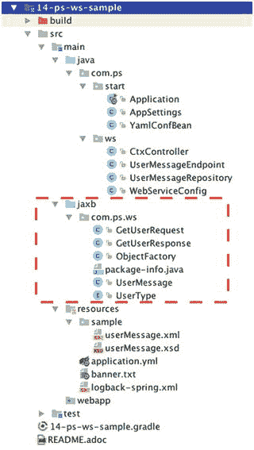

图 7-17.

Spring WS 应用程序的结构

`com.ps.start` 将 Spring Boot 组件组合在一起。

`src/main/java` 目录下的 `com.ps.ws` 将开发人员编写的与 WS 通信相关的类组合在一起：


*   WS 应用程序的配置，即 `WebServiceConfig`。
    该类继承了 Spring WS 的 `org.springframework.ws.config.annotation.WsConfigurerAdapter`，
    后者是 Web 服务核心配置接口 `org.springframework.ws.config.annotation.WsConfigurer` 的一个 Spring 裸实现（空方法）。
    该接口定义了回调方法，用于自定义基于 Java 的、通过 `@EnableWs` 启用的 Spring Web Services 配置。

```
    import org.springframework.boot.web.servlet.ServletRegistrationBean;
    import org.springframework.context.ApplicationContext;
    import org.springframework.context.annotation.Bean;
    import org.springframework.context.annotation.Configuration;
    import org.springframework.core.io.ClassPathResource;
    import org.springframework.ws.config.annotation.EnableWs;
    import org.springframework.ws.config.annotation.WsConfigurerAdapter;
    import org.springframework.ws.transport.http.MessageDispatcherServlet;
    import org.springframework.ws.wsdl.wsdl11.DefaultWsdl11Definition;
    import org.springframework.xml.xsd.SimpleXsdSchema;
    import org.springframework.xml.xsd.XsdSchema;
    @Configuration
    @EnableWs
    public class WebServiceConfig extends WsConfigurerAdapter {
    @Bean
    public ServletRegistrationBean messageDispatcherServlet
    (ApplicationContext applicationContext) {
    MessageDispatcherServlet servlet = new MessageDispatcherServlet();
    servlet.setApplicationContext(applicationContext);
    servlet.setTransformWsdlLocations(true);
    return new ServletRegistrationBean(servlet, "/ws/*");
    }
    @Bean(name = "userMessage")
    Public DefaultWsdl11Definition defaultWsdl11Definition
    (XsdSchema userMessageSchema) {
    DefaultWsdl11Definition wsdl11Definition = new DefaultWsdl11Definition();
    wsdl11Definition.setPortTypeName("UsersPort");
    wsdl11Definition.setLocationUri("/ws");
    wsdl11Definition.setTargetNamespace(UserMessageEndpoint.NAMESPACE_URI);
    wsdl11Definition.setSchema(userMessageSchema);
    return wsdl11Definition;
    }
    @Bean
    public XsdSchema userMessageSchema() {
    return new SimpleXsdSchema(new ClassPathResource("sample/userMessage.xsd"));
    }
    }
    ```

`org.springframework.ws.server.endpoint.adapter.DefaultMethodEndpointAdapter`
    Bean 用于启用后处理器 Bean，这些后处理器将处理用于配置 WS 端点的
    `@Endpoint, @RequestPayload, @PayloadRoot,` 和 `@ResponsePayload`
    注解。`messageDispatcherServlet`
    Bean 用于拦截 SOAP 请求。必须将应用程序上下文注入到此 Bean 中，
    以便能够自动检测 Spring Bean。
    此 Bean 不会覆盖默认的 `dispatcherServlet`
    Bean，因此也可以为此应用程序设置 Web 界面；
    配置好两个 Servlet 后，此 Web 应用程序可以处理正常的
    Web 请求和 Web 服务请求。`DefaultWsdl11Definition`
    使用通过 `userMessage.xsd`
    模式实例化的 `SimpleXsdSchema`
    实例来公开 WSDL 1.1。

*   `UserMessageEndpoint`
    类使用了 Spring 专用注解 `@Endpoint` 进行标注，该注解
    将此类标记为将处理 SOAP
    消息的 Web 服务端点。使用 `@Endpoint` 注解的类以类似方式处理 WS
    请求，而使用 `@Controller` 注解的类则处理
    Web 请求。

```
    import com.ps.ws.GetUserRequest;
    import com.ps.ws.GetUserResponse;
    import org.springframework.beans.factory.annotation.Autowired;
    import org.springframework.ws.server.endpoint.annotation.Endpoint;
    import org.springframework.ws.server.endpoint.annotation.PayloadRoot;
    import org.springframework.ws.server.endpoint.annotation.RequestPayload;
    import org.springframework.ws.server.endpoint.annotation.ResponsePayload;
    @Endpoint
    public class UserMessageEndpoint {
    public static final String NAMESPACE_URI = "http://ws-boot.com/schemas/um";
    @Autowired
    private UserMessageRepository userMessageRepository;
    @Autowired
    public UserMessageEndpoint(UserMessageRepository userMessageRepository) {
    this.userMessageRepository = userMessageRepository;
    }
    @PayloadRoot(namespace = NAMESPACE_URI, localPart = "getUserRequest")
    @ResponsePayload
    public GetUserResponse getUser(@RequestPayload GetUserRequest request) {
    GetUserResponse response = new GetUserResponse();
    response.setUserType(userMessageRepository.findUserType(request.getEmail()));
    return response;
    }
    }
    ```

`@Payload`
    注解将一个端点方法标记为传入请求的处理程序，
    并由 Spring WS 根据消息的 `namespace` 和
    `localPart` 进行识别。

`@ResponsePayload`
    注解指定 Spring WS 应将返回值映射到
    响应负载。

`@RequestPayload`
    注解指定传入消息将映射到方法的
    `request`
    参数。

位于 `src/main/jaxb` 下的 `com.ps.ws`
包（在图 7-17 中用红色圈出）
包含使用 `xjc` 生成的类。每次修改
`userMessage.xsd`
模式时，都必须重新生成这些类。

发布 WSDL

WSDL 定义了一个网络接口，该接口由接收消息然后有时回复消息的端点组成。WSDL 描述了
端点以及请求和回复消息。当使用
`DefaultWsdl11Definition`
Bean 时，Spring-WS 会自动从 XSD 生成 WSDL，该 WSDL 可通过 URL `http://<host>:<port>/ws/userMessage.wsdl`
访问，并在运行时动态生成。Default-Wsdl11Definition
从 XSD 模式构建 WSDL。此定义会遍历模式中找到的所有
`element`
元素，并为所有元素创建 `message`。接下来，它会为所有以定义的请求或响应后缀结尾的消息创建 WSDL 操作。建议在
生产应用程序中使用静态 WSDL 文件，并通过类型为
`org.springframework.ws.wsdl.wsdl11.SimpleWsdl11Definition`
的 Bean 公开它，因为生成 WSDL 文件可能需要很长时间。在开发期间，
在运行时生成它很有用，因为如果契约
发生更改，WSDL 必须随之调整。

!

可以访问 WSDL 信息的位置取决于
`DefaultWsdl11Definition`
Bean。基本上，可以在如下定义的位置找到 WSDL 信息：`http://<host>:<port>/[locationUri]/[DefaultWsdl11Definition_bean_id].wsdl`

对于到目前为止描述的应用程序，可以在
`http://localhost:8080/ws/`
`userMessage.wsdl`
找到 WSDL 信息，并且在浏览器中打开时，会显示 XSD 模式中的所有信息以及一些与服务器相关的其他信息，例如 SOAP 端点
地址。该地址是相对于用于访问 WSDL 信息的 URL 生成的，
因为 `DefaultWsdl11Definition`
Bean 的 `transformWsdlLocations`
属性设置为 `true`。下一个 XML
片段是 Spring WS 为 `14-ps-ws-sample`
应用程序生成的 WSDL 的一部分。

```

...

```

测试 Web 服务应用程序


为了测试应用程序，可以编写一个测试类，并使用 Spring Web 服务特定的组件（例如 `WebTemplate`）来使开发更实用。该应用程序是使用 Spring Boot 编写的，因此使用 Spring Boot 进行测试是合乎逻辑的。`SpringBootTest` 注解用于运行基于 Spring Boot 的测试的测试类，并搜索将用于创建 Spring Boot 测试上下文的 Spring Boot 配置类。`@LocalServerPort` 是一个 Spring Boot 注解，可以在字段或方法/构造函数参数级别使用，以注入在运行时分配的 HTTP 端口。测试方法中需要此值来创建要测试的 Web 服务所暴露的 URL。

```
import org.springframework.boot.context.embedded.LocalServerPort;
import org.springframework.boot.test.context.SpringBootTest;
import org.springframework.oxm.jaxb.Jaxb2Marshaller;
import org.springframework.test.context.junit4.SpringRunner;
import org.springframework.util.ClassUtils;
import org.springframework.ws.client.core.WebServiceTemplate;
import static org.assertj.core.api.Assertions.assertThat;
@RunWith(SpringRunner.class)
@SpringBootTest(webEnvironment = SpringBootTest.WebEnvironment.RANDOM_PORT)
public class ApplicationTest {
private static final Logger logger = LoggerFactory.getLogger(Application.class);
//用于反序列化 Web 服务消息
private static final Jaxb2Marshaller marshaller = new Jaxb2Marshaller();
private static final WebServiceTemplate ws = new WebServiceTemplate(marshaller);
@LocalServerPort
private int port;
@BeforeClass
public void init() throws Exception {
marshaller.setPackagesToScan(
ClassUtils.getPackageName(GetUserRequest.class));
marshaller.afterPropertiesSet();
}
@Test
public void testSendAndReceive() {
GetUserRequest request = new GetUserRequest();
request.setEmail("John.Cusack@pet.com");
Object responseObject = ws.marshalSendAndReceive(
"http://localhost:" + port + "/ws", request);
assertThat(responseObject).isNotNull();
assertThat(responseObject instanceof GetUserResponse).isTrue();
GetUserResponse response = (GetUserResponse) responseObject;
assertThat(response.getUserType()).isEqualTo(UserType.BOTH);
}
}
```

`WebServiceTemplate` 类相当于 Web 服务的 `RestTemplate` 和 `JdbcTemplate`。它是客户端 Web 服务的核心类，并提供了一种消息驱动的方法来发送和接收 `WebServiceMessage` 消息。它简化了对 Web 服务的访问，因为它使用编组器/解组器从 SOAP 消息体中提取对象。`WebServiceTemplate` 对象需要序列化/反序列化消息，并且需要一个 `JAXB2Marshaller` 来将消息从 XML 转换为 Java 对象，反之亦然。要测试 SOAP 接口并实际查看 XML 形式的消息，可以使用 SoapUI¹² 应用程序作为客户端，或者在基于 Unix 的系统上使用 `curl` 命令。SoapUI 团队还为 IntelliJ IDEA 开发了一个插件，可以从 IntelliJ IDEA 的“偏好设置”菜单中安装。独立版 SoapUI 的界面与插件界面非常相似，因此即使您不使用 IntelliJ IDEA 进行开发，本节中的图片也会有所帮助。在图 7-18 中，描绘了“偏好设置”菜单中的 IntelliJ IDEA 插件部分。只需在搜索框中输入 `SoapUI`，当插件出现在列表中时，单击 `Install` 按钮。

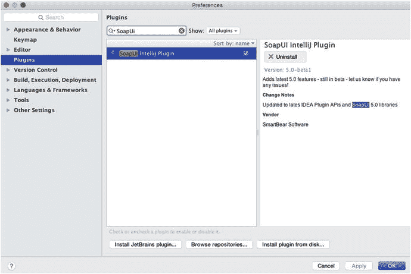

图 7-18.

Intellij IDEA 的插件部分

安装插件需要重启 Intellij IDEA。重启后，将出现两个 SoapUI 选项卡。从“工具” ➤ SoapUI ➤ 启动 SoapUI 菜单启动 SoapUI，然后打开 SoapUI 导航器选项卡并创建一个 SOAP 项目。需要提供 SOAP 接口的 WSDL 位置以及项目名称。创建新项目的对话框如图 7-19 所示。

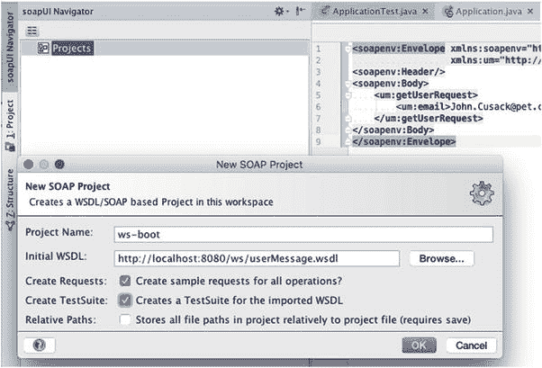

图 7-19.

用于创建项目的 SoapUI 插件界面

该项目将使用 WSDL 信息生成一个请求用户信息的骨架消息。由于应用程序在请求用户时使用电子邮件地址作为条件，SoapUI 不知道在骨架消息中放入什么数据，因此它只是用问号替换缺失的电子邮件。开发人员必须在发送请求之前将该问号替换为电子邮件（例如，John.Cusack@pet.com）。接收包含用户电子邮件的消息的应用程序会提取用户信息并返回用户类型。因此，将问号替换为有效的电子邮件，然后单击图 7-20 中红色包围的绿色箭头按钮，返回的消息将显示在右侧的文本区域中。

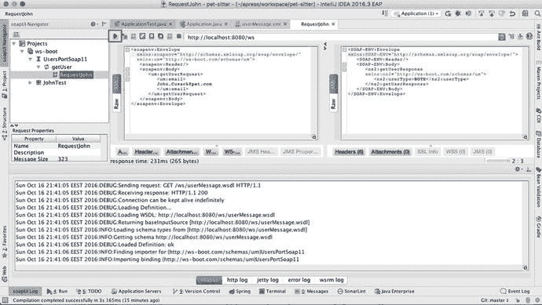

图 7-20.

用于发送 SOAP 消息的 SoapUI 导航器界面

SOAP 是所有 Web 服务接口的前身，尽管 REST 正在迅速普及，但它不会很快消失，因为最近引入的 SOAP 1.2 已经修复了该技术的许多公认缺点，并将其推向了采用率和易用性的新高度。此外，从 1.2 版本开始，SOAP 这个缩写词不再代表 W3C 组织的简单对象访问协议；它现在只是该规范的名称。REST 使用 HTTP/HTTPS 协议，但 SOAP 的主要优势在于比它更灵活，因为它几乎可以使用任何传输协议来发送消息，甚至包括 JMS。SOAP 的主要缺点是仅使用 XML，这很冗长并且需要大量时间来解析。因此，即使它不是官方考试的一部分，本节内容也可能对您未来的项目有所帮助。本节没有实际应用，但欢迎您修改 `userMessage.xsd` 模式并生成更复杂的 `UserMessage` 对象，并在 `UserMessageEndpoint` 类中添加更多请求。

Spring REST

REST 是表述性状态转移（REpresentational State Transfer）的缩写。它由 Roy Fielding 于 2000 年在他的博士论文中引入并定义。REST 是 RPC（远程过程调用）和 Web 服务（SOAP、WSDL 等）等机制的轻量级替代方案。REST 是一种用于设计网络化（分布式）应用程序的架构风格。其理念是，不使用 CORBA、RPC 或 SOAP 等复杂机制在机器之间进行连接，而是使用简单的 HTTP 在机器之间进行调用。RESTful 应用程序使用 HTTP 请求来发布数据（创建和/或更新）、读取数据（例如，进行查询）和删除数据。因此，REST 使用 HTTP 来处理所有四种 CRUD（创建/读取/更新/删除）操作。

Web 应用程序不仅被浏览器客户端使用。程序化客户端可以使用 HTTP 进行连接（例如，移动应用程序以及基本上任何开发为能够使用 HTTP 作为通信协议来请求和接收数据的应用程序）。REST 架构风格描述了通过 HTTP 公开 Web 服务的最佳实践；它不仅被用作传输协议，还被用作应用程序协议。使用了以下 HTTP 规范：


*   HTTP 动词被用作对资源执行的操作（GET、PUT、PATCH、POST、DELETE、HEAD、OPTIONS）。¹³ 主要的 REST HTTP 方法及其操作如表 7-2 所示。

表 7-2.

消息转换器表

HTTP 方法
     |
      用途
     |
      说明
     |

| --- | --- | --- | --- | --- | --- | --- |

GET
     |
      读取
     |
      读取资源，不改变资源。因此可视为安全。读取同一资源始终返回相同结果。因此可视为幂等。
     |

POST
     |
      创建
     |
      用于创建新资源。既不安全也不幂等。两个相同的 POST 请求将导致创建两个相同的资源，或在应用程序层面产生错误。
     |

PUT
     |
      更新
     |
      最常用于更新功能。不安全，因为它会修改服务器上的状态，但它是幂等的（除非后续调用相同的 PUT 请求会增加资源内的计数器等）。
     |

DELETE
     |
      删除
     |
      用于删除资源。不安全，但可视为幂等。因为删除一个已不存在资源的请求将始终返回 404（未找到）。
     |

*   URI（统一资源标识符）用于标识资源。资源在概念上与表示形式是分离的。在客户端请求后，服务器会向客户端返回资源的表示形式（通常是 JSON 或 XML）。表示形式包含元数据信息，客户端可利用这些信息在服务器上修改或删除资源（前提是拥有相应权限）。

*   HTTP 响应：响应码、响应体和响应头用于向客户端传递状态。客户端使用响应体内容、请求头和 URI 来传递状态。

RESTful 架构是一种无状态的客户端-服务器架构，因此系统是断连的（松散耦合）。服务器可能并非始终可用，因此操作是异步的，因为客户端不能假定与服务器直接连接。有时，请求的资源可以被缓存，并且客户端和服务器之间可能会插入其他未知的软件和硬件层。中间服务器可以通过启用负载均衡、提供共享缓存和执行安全策略来提高系统的可扩展性和/或安全性。在 REST 通信中，处理的对象是资源的表示形式。表示形式可以链接到其他资源，从而提供扩展和发现的机会。HTTP 头和状态码用于向客户端传达结果。当与特定容器一起工作时，会使用会话来跨多个 HTTP 请求保持状态。使用 REST 则无需如此，因为 REST 通信是无状态的，这提高了可扩展性，因为服务器无需维护、更新或通信会话状态。由于 HTTP 受到每个平台/语言的支持，这意味着 REST 通信可以在相当广泛的不同系统之间进行，因此它非常可扩展且绝对可互操作。¹⁴

为了分析 REST 请求和响应的内容，可以使用 Web 服务部分介绍的 SoapUI 插件（或应用程序）。从 Tools ➤ SoapUI ➤ Start SoapUI 菜单启动 SoapUI，然后打开 SoapUI Navigator 选项卡并创建一个 REST 项目。将弹出一个窗口，要求输入与 REST 请求匹配的 URL。创建 Request 对象后，可以单击绿色箭头按钮发送请求，服务器将返回与请求匹配的表示形式。但更多内容将在介绍 Spring 对 REST 的支持之后讨论。在图 7-21 中，您可以看到如何使用 SoapUI Intellij IDEA 插件创建一个 Rest 项目。

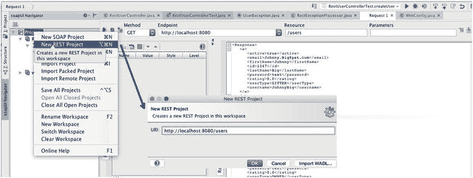

图 7-21.

用于发送 REST 请求的 SoapUI Navigator 界面

Spring 对 REST 的支持

JAX-RS 2.0 是 JAX-RS 的最新主要版本，它是用于构建 RESTful 应用程序的 Java EE 标准。JAX-RS 侧重于编程式客户端，并且有多种实现（Jersey(RI)、RESTEasy、Restlet、CXF）。Spring MVC 并未实现 JAX-RS，但从 3.0 版本开始，它确实提供了 REST 支持，不仅提供编程式客户端支持，还提供浏览器支持。在 Java 中构建编程式客户端的核心类是 `RestTemplate`。在服务器端，支持 REST 的核心组件是 Spring MVC。使用上一章介绍的 `@RequestMapping` 注解，可以将 HTTP REST 请求映射到控制器。REST 控制器是特殊的。虽然使用了构造型注解 `@Controller` 进行注解，但其方法返回的结果并非映射到视图，而是映射到表示形式。通过使用 `@ResponseBody` 注解方法，`DispatcherServlet` 会被告知控制器执行的结果不必映射到视图。

```
import org.springframework.stereotype.Controller;
import org.springframework.web.bind.annotation.ResponseBody;
@Controller
public class RestUserController {
@Autowired
UserService userService;
@RequestMapping(value = "/users", method = RequestMethod.GET)
public @ResponseBody List all() {
return userService.findAll();
}
...
}
```

在 Spring 4.0 中，引入了 `@RestController` 注解。该注解基本上是 `@Controller` 和 `@ResponseBody` 的组合，当用于类时，它假定此控制器中所有方法返回的值都应绑定到 Web 响应体。`@RestController` 注解是 `@Controller` 的一个专门版本，它不仅仅是将组件标记为用于 REST 请求；因此它不被视为构造型注解，并在不同的包中声明：`org.springframework.web.bind.annotation`。

```
import org.springframework.web.bind.annotation.RestController;
@RestController
public class RestUserController {
@Autowired
UserService userService;
@RequestMapping(value = "/users", method = RequestMethod.GET)
public List all() {
return userService.findAll();
}
...
}
```

如果方法属性设置为不同的 HTTP 方法，则一个 URL 可以映射到多个方法。上面的示例将 HTTP 方法类型声明为 GET。例如，同一个 URL 可以与 POST 方法一起使用，用于创建用户。


```
import org.springframework.web.bind.annotation.RequestMethod;
import org.springframework.http.HttpStatus;
@RestController
public class RestUserController {
...
@ResponseStatus(HttpStatus.CREATED)
@RequestMapping(value = "/users", method = RequestMethod.POST)
public void create(@RequestBody User newUser,
@Value("#{request.requestURL}")
StringBuffer originalUrl, HttpServletResponse response)
throws Exception {
if (newUser.getId() != null) {
throw new UserException("User found with email "
+ newUser.getEmail() + ". Cannot create!");
}
User user = userService.create(newUser);
response.setHeader("Location",
getLocationForUser(originalUrl, user.getUsername()));
}
protected static String getLocationForUser(StringBuffer url, Object childIdentifier) {
UriTemplate template = new UriTemplate(url.toString() + "/{$username}");
return template.expand(childIdentifier).toASCIIString();
}
}
```

`getLocationForUser` 方法是一个工具方法，用于创建已创建资源的 URI，然后将其放入 `HTTP Response Location` 标头中。这非常有用，因为它生成的 URI 是相对于应用程序上下文的，而该上下文由 Spring 自动注入，因此无需硬编码。在前面的示例中，原始请求 URI 可能是 `localhost:8080/users`，而 `Location` 标头值将是 `localhost:8080/users/johncusack`，这是通过将原始 URL 与用户名值拼接而成的。URL 参数 `$username`¹⁵ 通过调用 `template.expand(...)` 方法进行替换。客户端可以进一步使用此 URI 来请求新创建的资源表示。

!

您可能在前面的示例中注意到，用户资源的标识键是其 `username`。由于用户名在我们的数据库中是唯一的，并且出于安全原因不应暴露数据库 ID，因此在这种情况下，用户名是更合适的标识符选择。同时请记住，URL 中区分大小写的值可能会引起麻烦，尤其是当服务器应用程序安装在像 Windows 这样不区分大小写的操作系统上时。

Web 应用程序使用一组状态码来告知客户端请求发生了什么，是否已成功处理以及资源的状态。您最熟悉的可能是 `404 Not Found` 状态码，当请求的资源无法找到时会返回该状态码。HTTP 状态码的完整列表可以在维基百科上找到，如果您对 HTTP 状态码感到好奇或不熟悉，可以查阅一下。¹⁶

使用 Spring MVC，可以通过在控制器方法上使用 `@ResponseStatus` 注解轻松设置响应的状态码。该注解可以接收 Spring 类 `HttpStatus` 中定义的任何常量作为值。表 7-3 包含了 RESTful 应用程序中最常用的响应状态。

表 7-3.

HTTP 状态码表

HTTP 状态
 |
  HttpStatus 常量
 |
  说明
 |

| --- | --- | --- | --- | --- | --- | --- |

|
  OK
 |
  成功的 GET 请求，返回内容
 |

|
  CREATED
 |
  成功的 PUT 或 POST 请求；location 标头应包含新资源的 URI。
 |

|
  NO_CONTENT
 |
  成功的 PUT 或 DELETE 请求后的空响应
 |

|
  NOT_FOUND
 |
  未找到资源。
 |

|
  FORBIDDEN
 |
  服务器拒绝响应请求，因为响应未获授权。
 |

|
  METHOD_NOT_ALLOWED
 |
  请求 URI 标识的资源不支持该 HTTP 方法。
 |

|
  CONFLICT
 |
  进行更改时出现问题，当 PUT 或 POST 尝试保存已存在且标记为唯一的数据时。
 |

|
  UNSUPPORTED_MEDIA_TYPE
 |
  服务器拒绝处理请求，因为请求实体的格式不受请求资源对请求方法的支持。
 |

使用 `@ResponseStatus` 注解的控制器方法将阻止 `DispatcherServlet` 尝试查找要渲染的视图。因此，返回 void 的控制器方法将仅返回一个带有空正文的响应。返回空正文的方法通常是 DELETE 方法：

```
@RestController
public class RestUserController {
...
@ResponseStatus(HttpStatus.NO_CONTENT)
@RequestMapping(value = "/users/{$username}", method = RequestMethod.DELETE)
public void delete(@PathVariable("$username") String username)
throws UserException {
User user = userService.findByUsername(username);
if (user == null ) {
throw new UserException("No user found for username " + username);
}
userService.deleteById(user.getId());
}
}
```

从 Spring 4.3 开始，引入了组合注解，可以用特定的 HTTP 方法替换 `@RequestMapping` 注解。它们被分组在 `org.springframework.web.bind.annotation` 包中。在表 7-4 中，列出了 Spring 注解及其他等效项。

表 7-4.

HTTP 状态码表

HTTP 方法
 |
  @RequestMapping
 |
  Spring 4.3 注解
 |

| --- | --- | --- | --- | --- | --- | --- |

GET
 |
  @RequestMapping(method=RequestMethod.DELETE)
 |
  @GetMapping
 |

POST
 |
  @RequestMapping(method=RequestMethod.POST)
 |
  @PostMapping
 |

DELETE
 |
  @RequestMapping(method=RequestMethod.DELETE)
 |
  @DeleteMapping
 |

PUT
 |
  @RequestMapping(method=RequestMethod.PUT)
 |
  @PutMapping
 |

!

`@GetMapping` 和 `@RequestMapping` 之间的区别在于，前者不支持 `@RequestMapping` 的 `consumes` 属性。（此属性将在本节稍后介绍。）

如果由于某种原因无法使用 `@RestController`，在 Spring MVC 中，可以使用 `org.springframework.http.ResponseEntity` 类型作为 `@Controller` 方法的返回值，以告知调度器该响应将被序列化并转发给客户端，而不是解析为视图：

```
@Controller
public class UserController {
@Autowired
UserService userService;
@Autowired
PetService petService;
@RequestMapping(value = "/pets/{$username}", method = RequestMethod.POST)
public ResponseEntity createPet(@PathVariable("$username") String username,
@RequestBody Pet pet,
@Value("#{request.requestURL}") StringBuffer url)
throws UserException {
User owner = userService.findByUsername(username);
if (owner == null) {
throw new UserException("User not found with username " + username);
}
petService.save(pet);
HttpHeaders headers = new HttpHeaders();
headers.add("Location", getLocationForPet(url, pet.getRfid()));
return new ResponseEntity(headers, HttpStatus.CREATED);
}
/**
* 根据给定请求的完整 URL 确定宠物资源的 URL，使用 UriTemplate 将路径信息与给定的 childIdentifier 附加。
*/
protected static String getLocationForPet(StringBuffer url, Object petRfid) {
UriTemplate template = new UriTemplate(url.append("/{$petid}").toString());
return template.expand(petRfid).toASCIIString();
}
}
```

在前面的代码片段中，为通过 `$username` 路径变量标识的用户创建了一条 `Pet` 记录。创建对象后，会发送一个响应，其中包含可通过 REST 请求访问该宠物记录的位置。因此，如果原始 URI 是 `http://localhost:8080/pets/johncusack`，则返回的结果是一个 `ResponseEntity`，其中包含以下 URI：`http://localhost:8080/pets/johncusack/11223344`，其中 11223344 是宠物的 RFID 值。

异常处理

有时 REST 请求无法成功处理。可能是客户端请求的资源不再可用，或者客户端请求的某些操作在服务器上生成了错误。在这种情况下，可以在控制器异常处理方法上使用 `@ResponseStatus`，以向客户端提供请求未正确处理的基本原因。


```
@RestController
public class RestUserController {
...
/**
* 将 IllegalArgumentException 映射为 404 Not Found HTTP 状态码。
* 请求的资源未找到
*/
@ResponseStatus(HttpStatus.NOT_FOUND)
@ExceptionHandler({IllegalArgumentException.class})
public void handleNotFound() {
// 仅返回空的 404
}
/**
* 将 DataIntegrityViolationException 映射为 409 Conflict HTTP 状态码。
* 无法创建资源
*/
@ResponseStatus(HttpStatus.CONFLICT)
@ExceptionHandler({DataIntegrityViolationException.class})
public void handleAlreadyExists() {
// 仅返回空的 409
}
...
}
```

处理 REST 请求相关异常的另一种方法是，为 REST 控制器定义一个专门的异常类，并定义一个专门的组件来拦截这些类型的异常并以特定方式处理它们。例如，考虑一个名为 `UserException` 的类，每当 `RestUserController` 中的方法未正确执行时，就会抛出该异常。以下代码片段中定义的类将拦截此类异常，并将其转换为客户端易于解释的 JSON 错误对象。此行为通过 `@ControllerAdvice` 注解进行配置，该注解是 `@Component` 的一种特化，允许通过类路径扫描自动检测实现类。使用此注解标注的类通常会声明一个或多个使用 `@ExceptionHandler` 注解的方法，这些方法将负责处理异常。

```
import org.springframework.http.HttpStatus;
import org.springframework.web.bind.annotation.ControllerAdvice;
import org.springframework.web.bind.annotation.ExceptionHandler;
import org.springframework.web.bind.annotation.ResponseBody;
import org.springframework.web.bind.annotation.ResponseStatus;
@ControllerAdvice
public class RestExceptionProcessor {
@ExceptionHandler
@ResponseStatus(value = HttpStatus.NOT_FOUND)
@ResponseBody
public JsonError exception(UserException ex) {
return new JsonError(ex.getMessage());
}
}
```

在上一个代码示例中，异常类型被用作处理程序方法中的参数，因此只有该类型的异常才会被拦截和处理。此外，捕获自定义异常非常有用，因为它们通常包含与出错原因相关的特定信息。也可以通过配置 `@ControllerAdvice` 注解来实现类似的限制。通过设置 `basePackages` 属性，可以将控制器通知的范围限制为特定包集合中声明的控制器方法抛出的异常。

```
...
@ControllerAdvice(basePackages = {"com.ps.web", "com.ps.rest"})
public class RestExceptionProcessor {
@ExceptionHandler
@ResponseStatus(value = HttpStatus.NOT_FOUND)
@ResponseBody
public JsonError exception(Exception ex) {
return new JsonError(ex.getMessage());
}
}
```

控制器通知的范围也可以通过设置 `basePackageClasses` 属性，限制为某个类或类的层次结构。

```
...
@ControllerAdvice(basePackageClasses = RestExceptionProcessor.class)
public class RestExceptionProcessor {
@ExceptionHandler
@ResponseStatus(value = HttpStatus.NOT_FOUND)
@ResponseBody
public JsonError exception(UserException ex) {
return new JsonError(ex.getMessage());
}
}
```

HTTP 消息转换器

前面介绍的 `@ResponseBody` 也用于帮助理解客户端和服务器之间的 REST 消息格式。如本节开头所述，资源表示可以有多种格式：XML、JSON、HTML 等。客户端必须知道要使用的格式，或者向服务器请求一个它能理解的表示形式的资源。表示形式通过 `org.springframework.http.converter.HttpMessageConverter<T>` 接口的实现转换为 HTTP 请求和从 HTTP 响应转换而来。在配置了 `<mvc:annotation-driven/>` 或 `@EnableWebMvc` 的应用程序中，Spring 会自动检测并使用消息转换器。在本章的代码示例中，表示形式为 JSON 格式，因此使用了 `MappingJackson2HttpMessageConverter`。Spring 自带了一个广泛的默认支持的消息转换器列表，但在需要时，开发人员可以提供自己的 `HttpMessageConverter<T>` 实现。以下是最常用的消息转换器及其处理的数据类型列表：

表 7-5.

消息转换器表

消息转换器
 |
  数据类型
 |
  说明
 |

| --- | --- | --- | --- | --- | --- | --- |

StringHttpMessageConverter
 |
  text/plain
 |
   |

MappingJackson2HttpMessageConverter
 |
  application/*+json
 |
  仅当 Jackson 2 存在于类路径中时
 |

AtomFeedHttpMessageConverter
 |
  application/atom+xml
 |
  仅当 Rome 存在于类路径中时
 |

RssChannelHttpMessageConverter
 |
  application/rss+xml
 |
  仅当 Rome 存在于类路径中时
 |

MappingJackson2XmlHttpMessageConverter
 |
  application/*+xml
 |
  仅当 Jackson 2 存在于类路径中时
 |

正如注解名称所明确暗示的那样，`@ResponseBody` 应用于响应，其在控制器方法上的存在告诉 Spring，在将响应发送到客户端之前，应使用 HTTP 消息转换器对其进行处理。如果该方法需要一个需要由相同 HTTP 转换器处理的参数，则该参数必须使用 `RequestBody` 进行注解。以一个处理 PUT 请求的控制器方法为例。此方法从客户端接收一个用户表示，该表示必须转换为 `User` 实例，然后才能将其状态更新到数据库中。¹⁷ 此方法还返回更新后实例的表示，因此它需要同时存在这两个注解。

```
import org.springframework.http.MediaType;
...
@RestController
public class RestUserController {
@ResponseStatus(HttpStatus.OK)
@RequestMapping(value = "/users/{$username}",
method = RequestMethod.PUT,
consumes = MediaType.APPLICATION_JSON_UTF8_VALUE
produces = MediaType.APPLICATION_JSON_UTF8_VALUE)
public User updateByEmail(
@PathVariable("$username") String username,
@RequestBody User newUser) throws UserException {
User user = userService.findByUsername(username);
if (user == null) {
throw new UserException("User not found with username " + username);
}
copyProperties(newUser, user);
userService.update(user);
return user;
}
...
}
```

在前面的示例中，使用了 `@RequestMapping` 的 `consumes` 和 `produces` 注解属性。这两个属性用于缩小请求的主要映射范围。

`consumes` 属性定义了映射请求（在服务器端定义）的可消费媒体类型，并且 `Content-Type` 标头（在客户端定义）的值必须至少与此属性的一个值匹配，方法才能处理特定的 REST 请求。

`produces` 属性定义了映射请求的可生产媒体类型，从而缩小主要映射范围，并且 `Accept` 标头（在客户端）的值必须至少与此属性的一个值匹配，方法才能处理特定的 REST 请求。

!


上述更新用户的方法远非实际生产中的做法。它专门设计用于演示这两个属性的工作原理以及如何协同使用。不过该示例是可行的，你可以通过运行 `15-ps-ws-rest-practice` 项目进行测试——该项目用于检验完成本节学习后所掌握的知识。

RESTful 应用的 Spring MVC 配置

Spring Web RESTful 应用本质上是一个 Spring MVC 应用，因此其配置与第 6 章“Spring Web”中介绍的配置相同，无论使用 XML 还是 Java 配置。要支持自定义 HTTP 消息转换器实现，必须将依赖项添加到应用的类路径中，并在配置中声明一个特殊的 Bean。以下代码片段展示了 Spring Web RESTful 应用的配置，其中包含一个 `MappingJackson2HttpMessageConverter` 类型的 Bean，Spring 将自动使用它将对象转换为 JSON 表示形式，反之亦然。

```
@Configuration
@EnableWebMvc
@ComponentScan(basePackages = {"com.ps.web", "com.ps.exs"})
public class WebConfig extends WebMvcConfigurerAdapter {
    // 声明静态资源
    @Override
    public void addResourceHandlers(ResourceHandlerRegistry registry) {
        registry.addResourceHandler("/images/**")
                .addResourceLocations("/images/")
                // 设置缓存以加快页面加载速度
                .setCachePeriod(31556926);
    }

    @Override
    public void configureDefaultServletHandling(
            DefaultServletHandlerConfigurer configurer) {
        configurer.enable();
    }

    // 一个简单的视图，用于确认应用已启动
    @Override
    public void addViewControllers(ViewControllerRegistry registry) {
        registry.addViewController("/").setViewName("welcome");
    }

    @Bean
    InternalResourceViewResolver getViewResolver(){
        InternalResourceViewResolver resolver = new InternalResourceViewResolver();
        resolver.setPrefix("/WEB-INF/");
        resolver.setSuffix(".jsp" );
        return resolver;
    }

    @Bean
    public MappingJackson2HttpMessageConverter
            mappingJackson2HttpMessageConverter() {
        MappingJackson2HttpMessageConverter
                mappingJackson2HttpMessageConverter =
                new MappingJackson2HttpMessageConverter();
        // 当客户端为浏览器时，JSON 响应会缩进显示
        mappingJackson2HttpMessageConverter.setPrettyPrint(true);
        // 设置响应的编码
        mappingJackson2HttpMessageConverter.setDefaultCharset
                (StandardCharsets.UTF_8);
        mappingJackson2HttpMessageConverter.setObjectMapper(objectMapper());
        return mappingJackson2HttpMessageConverter;
    }

    @Bean
    public ObjectMapper objectMapper() {
        ObjectMapper objMapper = new ObjectMapper();
        objMapper.enable(SerializationFeature.INDENT_OUTPUT);
        objMapper.setSerializationInclusion
                (JsonInclude.Include.NON_NULL);
        return objMapper;
    }

    @Override
    public void configureMessageConverters(
            List<HttpMessageConverter<?>> converters) {
        super.configureMessageConverters(converters);
        converters.add(mappingJackson2HttpMessageConverter());
    }
}
```

使用 RestTemplate 测试 RESTful 应用

任何支持创建应用所支持请求类型的客户端（浏览器、移动应用、桌面应用等）都可以访问 RESTful 应用。¹⁸ `RestTemplate`¹⁹ 是 Spring 用于同步客户端 HTTP 访问的核心类。该类为每种 HTTP 方法提供了广泛的方法集，可用于访问 RESTful 服务。HTTP 方法与可用于访问 REST 服务的 RestTemplate 方法之间的对应关系如图 7-22 所示。

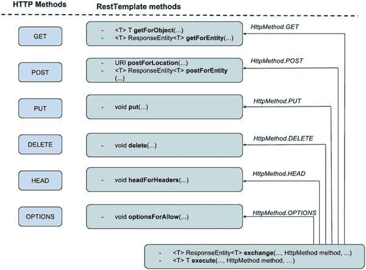

图 7-22. RestTemplate API 与 HTTP 方法的对应关系

如您所见，只要将 HTTP 方法作为参数传入，`execute` 和 `exchange` 方法即可用于任何类型的 REST 调用。所有方法都是多态的，²⁰ 使用哪种方法取决于具体需求和开发者的偏好。URI 实例被返回以标识资源，并且 RestTemplate 方法支持 URI 模板。因此，以下两个调用是相同的：

```
// 使用 URI 模板
String url = "http://localhost:8080/users/{$username}";
User user = restTemplate.getForObject(url, User.class, "johncusack");
// 使用 URI
String url = "http://localhost:8080/users/johncusack";
User user = restTemplate.getForObject(url, User.class);
```

!

提醒一下，路径变量 `$username` 是有效的，并且能按预期工作：`$` 字符允许作为路径变量名的一部分。选择这种特殊的路径变量命名方式，是为了让开发者（您）清楚地意识到 URL 的这一部分是一个变量，在发起 REST 请求时必须替换为实际值。

选择 `username` 作为标识用户的键，是因为它在数据库中是唯一的，即使数据库被清空并重新加载，用户名也不会改变。出于安全原因，不应暴露数据库 ID，并且在应用运行期间，如果数据库被清空并重新加载，ID 也可能会发生变化。

`execute` 方法还可以接收一个 `org.springframework.web.client.RequestCallback` 实现作为参数，该实现将告诉 `RestTemplate` 在将请求发送到服务器之前如何处理该请求。考虑到这一点，对于 `username=johncusack` 的 User 实例的 GET 请求，可以使用 exchange 方法编写如下：

```
String url ="http://localhost:8080/users/{$username}";
Person person = restTemplate.execute(url, HttpMethod.GET,
        new RequestCallback() {
            @Override
            public void doWithRequest(ClientHttpRequest request)
                    throws IOException {
                HttpHeaders headers = request.getHeaders();
                headers.add("Accept", MediaType.APPLICATION_JSON_UTF8_VALUE);
                System.out.println("Request headers = " + headers);
            }
        }, new HttpMessageConverterExtractor<User>(User.class,
                restTemplate.getMessageConverters())
        , new HashMap<String, String>() {{
            put("username", "johncusack");
        }});
```

传递给 `getForObject()`、`postForLocation()` 和 `put()` 方法以及从这些方法返回的对象，由 HttpMessageConverter 转换为 HTTP 请求和 HTTP 响应。

`exchange` 方法使用 `HttpEntity` 对象来封装请求头并将其作为参数。该方法返回一个包含 REST 请求结果的 `ResponseEntity` 对象，其主体会自动使用已注册的 `HttpMessageConverter` 实现进行转换。

```
import org.springframework.http.ResponseEntity;
...
public class RestUserControllerTest {
    public void editUser() {
        String url = "http://localhost:8080/users/{$username}";
        User user = new User();
        user.setEmail("MissJones@pet.com");
        user.setUsername("jessicajones");
        // 设置其他属性
        ..
        final HttpHeaders headers = new HttpHeaders();
        headers.setContentType(MediaType.APPLICATION_JSON_UTF8);
        final HttpEntity<User> userRequest = new HttpEntity<User>(user, headers);
        ResponseEntity<User> responseEntity = restTemplate.
                exchange(url, HttpMethod.PUT, userRequest, User.class,
                        "jessicajones");
        User editedUser = responseEntity.getBody();
        assertNotNull(editedUser);
        assertEquals("MissJones@pet.com", editedUser.getEmail());
    }
}
```


消息转换器会被 Spring 自动检测并使用，前提是应用配置了 `<mvc:annotation-driven/>` 或 `@EnableWebMvc`。在本章的代码示例中，表示形式为 JSON 格式，因此使用了 `MappingJackson2HttpMessageConverter`。并且由于该消息默认被支持，在前面的示例中并不需要 `HttpMessageConverterExtractor<T>`。同样，如果没有指定 `Accept` 头，Spring 支持的所有消息转换器都会被考虑，因此在这种情况下，`RequestCallback` 也变得不必要，我们可以坚持使用前面代码片段中提到的更简单的 `restTemplate.getForObject` 方法，因为即使在生产应用中，你也几乎不需要其他东西。

包含在 `15-ps-ws-rest-practice` 中的应用是一个 Spring Web RESTful 应用，可用于测试你对 Spring 为 REST 应用提供的支持组件的理解。`RestUserController` 类提供了处理 REST 请求的控制器方法。客户端由 `RestUserControllerTest` 类表示。该测试类中注入了一个 `RestTemplate`，可用于测试由 `RestUserController` 控制器暴露的所有与用户相关的 REST 操作。该 Web 应用没有上下文，控制器暴露的 REST 服务可通过类似 `http://localhost:8080/users/``*` 的 URI 访问。`RestUserControllerTest` 类包含使用四种主要 HTTP 方法测试 REST 请求的方法：

*   **GET**：用于获取资源表示形式的方法；可能根据服务器设置和使用的客户端而有长度限制。²¹ 当未找到资源时，返回 404（未找到）状态码，否则返回 200（成功）。在图 7-23 中，描述了 GET 请求和响应的内容。

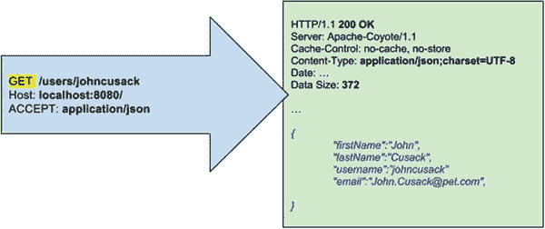

图 7-23.

GET 请求和响应示例

可以使用 `RestTemplate` 实例发送 REST GET 请求：只需要 REST URI 和一个用于标识资源的用户名即可。路径变量被命名为 `$username`，并加上 $ 前缀以使 URI 的参数化部分非常明显。以下代码片段描述了执行 GET 请求以获取用户名为“johncusack”的用户资源的测试方法。

```
    public class RestUserControllerTest {
    private static final String GET_PUT_DEL_URL =
    "http://localhost:8080/users/{$username}";
    private RestTemplate restTemplate = null;
    @Before
    public void setUp() {
    restTemplate = new RestTemplate();
    }
    //通过用户名测试 GET
    @Test
    public void findByUsername() {
    User user = restTemplate.getForObject(GET_PUT_DEL_URL,
    User.class, "johncusack");
    assertNotNull(user);
    assertEquals("John.Cusack@pet.com", user.getEmail());
    }
    }
    ```

*   **POST**：用于创建新资源的方法。当正在创建的资源需要一个不存在的父资源时，返回 404（未找到）状态码。²² 当已存在相同的资源时，返回 409（冲突）状态码。当资源创建成功时，返回 201（已创建）状态码。在图 7-24 中，描述了 POST 请求和响应的内容。

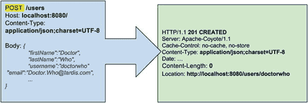

图 7-24.

POST 请求和响应示例

可以使用 `RestTemplate` 实例发送 REST POST 请求：只需要 REST URI 和用户对象即可。URI 与用于获取用户资源的 URI 相同，但 HTTP 方法不同。

```
    import org.springframework.http.*;
    ...
    public class RestUserControllerTest {
    private static final String GET_PUT_DEL_URL =
    "http://localhost:8080/users/{$username}";
    private static final String GET_POST_URL = "http://localhost:8080/users";
    private RestTemplate restTemplate = null;
    @Before
    public void setUp() {
    restTemplate = new RestTemplate();
    }
    //测试 POST
    @Test
    public void createUser() {
    User user = new User();
    user.setEmail("Doctor.Who@tardis.com");
    user.setUsername("DoctorWho");
    ...
    final HttpHeaders headers = new HttpHeaders();
    headers.setContentType(MediaType.APPLICATION_JSON);
    final HttpEntity crRequest = new HttpEntity(user, headers);
    URI uri = restTemplate.postForLocation(GET_POST_URL,
    crRequest, User.class);
    assertNotNull(uri);
    assertTrue(uri.toString().contains("doctorwho"));
    // 测试插入
    User newUser = restTemplate.getForObject(uri, User.class);
    assertNotNull(newUser);
    assertNotNull(newUser.getId());
    }
    }
    ```

在这种情况下，使用了 `postForLocation` 方法，因为之后必须测试资源是否成功创建。`HttpHeaders` 对象用于设置请求的头信息，例如消息的媒体类型，这样 Spring 就会知道使用哪个消息转换器将 JSON 表示形式转换为需要保存的用户实例。

*   **PUT**：更新现有资源或使用已知的目标 URI 创建资源。资源的 URI 包含该资源的标识符。当 PUT 请求引用一个现有资源时，该资源会被更新；否则，会使用 URI 中的标识符和请求体中的内容创建一个新资源。当正在更新的资源需要一个不存在的父资源时，²³ 或者请求更新的资源不存在时，返回 404（未找到）状态码。

当资源更新成功且响应体中没有返回任何内容时，返回 204（无内容）响应状态。

当资源不存在时，PUT 的行为类似于 POST 并创建它，并返回资源的位置。在这种情况下，响应状态为 201（已创建）。

在图 7-25 中，描述了 PUT 请求和响应的内容。

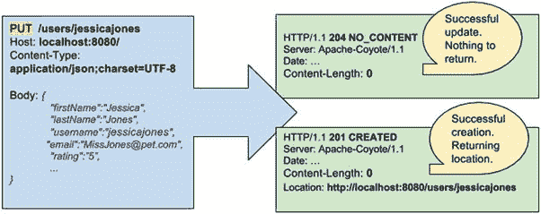

图 7-25.

PUT 请求和响应示例

可以使用 `RestTemplate` 实例发送 REST PUT 请求：只需要 REST URI 和用户对象即可。URI 与用于获取用户资源的 URI 相同，但 HTTP 方法不同。

```
    import org.springframework.http.*;
    ...
    public class RestUserControllerTest {
    private static final String GET_PUT_DEL_URL =
    "http://localhost:8080/users/{$username}";
    private static final String GET_POST_URL = "http://localhost:8080/users";
    private RestTemplate restTemplate = null;
    @Before
    public void setUp() {
    restTemplate = new RestTemplate();
    }
    // 测试 PUT
    @Test
    public void editUser() {
    User user = new User();
    user.setEmail("MissJones@pet.com");
    user.setUsername("JessicaJones");
    ...
    final HttpHeaders headers = new HttpHeaders();
    headers.setContentType(MediaType.APPLICATION_JSON_UTF8);
    final HttpEntity userRequest = new HttpEntity(user, headers);
    ResponseEntity responseEntity = restTemplate.exchange
    (GET_PUT_DEL_URL, HttpMethod.PUT, userRequest, User.class,
    "JessicaJones");
    User editedUser = responseEntity.getBody();
    assertNotNull(editedUser);
    assertEquals("MissJones@pet.com", editedUser.getEmail());
    }
    }
    ```


此处使用`exchange`方法仅用于教学目的，但`RestTemplate`提供了多种签名更易于使用的`put`方法。

*   DELETE：用于删除资源。当被删除的资源不存在时，会返回 404（未找到）状态码。当资源被正确删除时，会返回 200（成功）状态码。图 7-26 展示了 DELETE 请求和响应的内容。

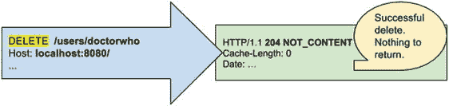

图 7-26.

DELETE 请求与响应示例

可以通过`RestTemplate`实例发送 REST DELETE 请求：所需的一切就是 REST URI 和用户名。该 URI 与用于检索用户资源的 URI 相同，但 HTTP 方法不同。

```
    import org.springframework.http.*;
    ...
    public class RestUserControllerTest {
    private static final String GET_PUT_DEL_URL =
    "http://localhost:8080/users/{$username}";
    private static final String GET_POST_URL = "http://localhost:8080/users";
    private RestTemplate restTemplate = null;
    @Before
    public void setUp() {
    restTemplate = new RestTemplate();
    }
    // 测试 DELETE
    @Test
    public void deleteUser() {
    restTemplate.delete(GET_PUT_DEL_URL,  "doctorwho");
    }
    }
    ```

如果操作成功，删除响应的主体为空。测试删除是否成功的唯一方法是使用 URI 等于`http://localhost:8080/users/doctorwho`来请求该资源，并预期返回失败或带有 404（未找到）状态的响应，因为该资源已被删除。

可以通过声明一个模拟 REST 服务器并使用模拟依赖项，在不将 Spring RESTful 应用程序部署到服务器的情况下对其进行测试，从而隔离地测试 REST 请求。提供此功能的类是 Spring Test 库的一部分，名为`org.springframework.test.web.client.MockRestServiceServer`。一个`RestTemplate`将绑定到这个模拟服务器，所有请求都将发送到这里。由于不是真正的服务器，因此不需要请求的完整 URL，只需要控制器方法上定义的请求映射。在每个测试方法中，都会执行以下步骤：

1.  模拟服务器首先定义它期望接收什么请求、接收多少次以及如何响应。
2.  将使用请求映射 URL 片段（例如“/users”）调用`RestTemplate`方法。
3.  执行断言方法，以确保 restTemplate 请求实际收到了步骤 1 中定义的响应。

项目`15-ps-ws-rest-solution`中的`StandaloneRestUserControllerTest`类可用于在测试模拟上下文中测试 RESTful 应用程序。定义了一个名为`TestConfig`的静态内部类，用于向测试上下文提供模拟依赖项。使用 JMock 和 Mockito 组件提供模拟对象，以便可以隔离地测试 REST 通信（请求和响应）。

```
import org.mockito.Mockito;
import org.springframework.context.annotation.Bean;
import org.springframework.context.annotation.Configuration;
import org.springframework.http.HttpMethod;
import org.springframework.http.MediaType;
import org.springframework.test.context.ContextConfiguration;
import org.springframework.test.context.junit4.SpringJUnit4ClassRunner;
import org.springframework.test.context.web.WebAppConfiguration;
import org.springframework.test.web.client.MockRestServiceServer;
import org.springframework.web.client.RestTemplate;
import static org.junit.Assert.*;
import static org.springframework.test.web.client.match.
MockRestRequestMatchers.method;
import static org.springframework.test.web.client.match.
MockRestRequestMatchers.requestTo;
import static org.springframework.test.web.client.ExpectedCount.once;
import static org.springframework.test.web.client.response.
MockRestResponseCreators.withSuccess;
...
@RunWith(SpringJUnit4ClassRunner.class)
@ContextConfiguration(classes  =  {WebConfig.class,
StandaloneRestUserControllerTest.TestConfig.class})
@WebAppConfiguration
public class StandaloneRestUserControllerTest {
@Configuration
static class TestConfig {
@Bean
UserService userService() {
return Mockito.mock(UserService.class);
}
}
private RestTemplate restTemplate = null;
private MockRestServiceServer server = null;
@Before
public void setup() {
restTemplate = new RestTemplate();
server = MockRestServiceServer.bindTo(restTemplate).build();
}
@Test
public void findByUsername() {
//步骤 1
server.expect(once(), requestTo("/users/johncusack"))
.andExpect(method(HttpMethod.GET))
.andRespond(withSuccess("{\n" +
"  \"id\" : 1575,\n" +
"  \"username\" : \"johncusack\",\n" +
"  \"firstName\" : \"John\",\n" +
"  \"lastName\" : \"Cusack\",\n" +
"  \"password\" : \"test\",\n" +
"  \"userType\" : \"OWNER\",\n" +
"  \"email\" : \"John.Cusack@pet.com\",\n" +
"  \"rating\" : 0.0,\n" +
"  \"active\" : true\n" +
"}",  MediaType.APPLICATION_JSON_UTF8));
//步骤 2
User user = restTemplate.getForObject("/users/{$username}",
User.class, "johncusack");
//步骤 3 assertNotNull(user);
assertEquals("John.Cusack@pet.com", user.getEmail());
assertEquals(UserType.OWNER, user.getUserType());
}
...
}
```

REST 的优势

*   REST 简单易用。
*   REST 得到广泛支持。
*   资源可以用多种数据格式（JSON、XML 等）表示。
*   可以充分利用 HTTP 缓存和代理服务器来帮助处理高负载并提高性能。
*   它降低了客户端/服务器的耦合度。
*   浏览器可以解释表示形式。
*   Javascript 可以使用表示形式。
*   REST 服务可以被用不同语言编写的应用程序消费。
*   它使得新客户端易于使用 RESTful 应用程序，即使该应用程序并非专门为其设计。
*   由于 REST 系统的无状态性，多个服务器可以位于负载均衡器后面透明地提供服务，这意味着可扩展性增强。
*   由于统一的接口，几乎不需要对资源和基本操作 API 进行文档记录。
*   使用 REST 并不意味着客户端需要特定的库才能与服务器通信。使用 REST，只需要一个网络连接。

REST 服务可以受到保护，但由于客户端和服务器之间的交互是无状态的，因此凭证必须嵌入到每个请求头中。基本身份验证是在无需额外库的情况下最容易实现的（HTTP Basic、HTTP Digest 或 XML-DSIG 或 XML-Encryption），但它保证的安全级别最低。在没有 TLS（以前称为 SSL）加密的情况下，绝不应使用基本身份验证，因为否则凭证很容易被解码。在图 7-27 中，您可以看到当客户端与需要基本身份验证的 RESTful 应用程序通信时，如何使用基本身份验证。


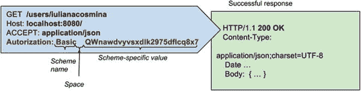

图 7-27.

使用 RESTful 系统时的基本身份验证

练习部分

`15-ps-ws-rest-practice`
是一个不完整的项目；其中缺少注解和方法体。为了测试你对实现 Spring RESTful
应用程序及其测试的理解，你可以尝试完成它。这里有七个 TODO 任务，编号从 55 到 61，如果你需要灵感或
确认你的解决方案是否正确，你可以将其与项目 `15-ps-ws-rest-solution` 中提供的参考解决方案进行比较。

任务 TODO 55 位于 `RestUserController`
类中，要求你完成该类的配置，将其注册为处理 REST 请求的控制器。

任务 TODO 56 位于 `RestUserController`
类中，要求你完成 `create` 方法的配置，使其能够处理 HTTP POST 请求并创建一个 `User` 实例。如果你
想立即测试该方法，请在命令行中使用 `gradle appRun` 启动应用程序，或者通过此模块节点下的 Gradle 项目选项卡执行 `appStart`，然后解决 `RestUserControllerTest` 类中的任务 TODO 59，以使用 `restTemplate` 对象发送 HTTP POST 请求。

任务 TODO 57 位于 `RestUserController`
类中，要求你完成 `update` 方法的配置，使其能够处理 HTTP PUT 请求并更新一个 `User` 实例。如果你
想立即测试该方法，请在命令行中使用 `gradle appRun` 启动应用程序，或者通过此模块节点下的 Gradle 项目选项卡执行 `appStart`，然后解决 `RestUserControllerTest` 类中的任务 TODO 60，以使用 `restTemplate` 对象发送 HTTP POST 请求。

任务 TODO 58 位于 `RestUserControllerTest`
类中，要求你完成测试方法体，使用 `restTemplate` 发起 REST 调用，请求一个用户名为 "johncusack" 的用户实例。

任务 TODO 61 位于 `RestUserControllerTest`
类中，要求你完成测试方法体，使用 `restTemplate` 发起 REST 调用，请求删除用户名为 "doctorwho" 的用户实例。

要测试你的操作结果，可以运行 `RestUserControllerTest` 类中的 `getAll()` 测试方法，该方法会在控制台打印数据库中的所有用户。或者你也可以直接从浏览器访问 URI，因为浏览器知道如何正确渲染 JSON 响应。如果你不想离开编辑器，另一种解决方案是使用本节开头提到的 SoapUI Intellij Idea 插件。只需创建一个项目，并使用正确的 URI 添加请求即可。在图 7-28 中，展示了请求用户名为 `johncusack` 的用户。点击绿色箭头按钮后，响应将显示在右侧的文本框中。

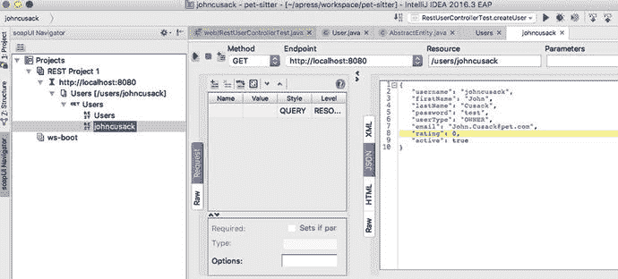

图 7-28.

SoapUI http://localhost:8080/users/johncusack REST 请求与响应

使用 Spring Boot 的 RESTful Spring 应用程序

`15-ps-ws-rest-practice`
应用程序是使用纯 Spring MVC 配置的，甚至还配置了一个视图解析器，因此如果应用程序成功启动，可以在 `http://localhost:8080/` 位置访问一个网页。
配置 RESTful Spring 应用程序的最简单方法是使用 Spring Boot，因为最简单的 RESTful 应用程序需要的代码行数少于 20 行。模块 `15-ps-rest-boot-sample`
包含一个 Spring Boot RESTful 应用程序，它提供了与 Spring MVC 应用程序相同的 HTTP
方法。唯一的区别是，为了保持简单，使用了 `User` 类的简化版本，并且没有使用 JPA。在图 7-29 中，展示了 `15-ps-rest-boot-sample` 应用程序的结构。

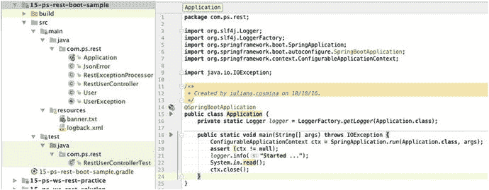

图 7-29.

15-ps-rest-boot-sample Spring RESTful Boot 应用程序结构

`Application`
类是应用程序的入口点。在 Intellij IDEA 中作为应用程序运行此类，REST 服务将变得可用。

```
package com.ps.rest;
import org.slf4j.Logger;
import org.slf4j.LoggerFactory;
import org.springframework.boot.SpringApplication;
import org.springframework.boot.autoconfigure.SpringBootApplication;
import org.springframework.context.ConfigurableApplicationContext;
import java.io.IOException;
@SpringBootApplication
public class Application {
private static Logger  logger = LoggerFactory.getLogger(Application.class);
public static void main(String args) throws IOException {
ConfigurableApplicationContext ctx =
SpringApplication.run(Application.class, args);
assert (ctx != null);
logger.info("Started ...");
System.in.read();
ctx.close();
}
}
```

`RestUserControllerTest`
包含测试 `RestUserController` 类暴露的所有 REST 请求的方法。RestUserController 类与之前介绍的相同；URI 也相同。唯一的区别是它从 map 结构中获取用户实例。

```
...
@RestController
public class RestUserController {
// 替代 JPA UserService
private Map userService = new HashMap();
// 创建一些用户以便测试控制器
@PostConstruct
public void init() {
User user = new User("johncusack", "John.Cusack@pet.com", 5d, true);
userService.put(user.getUsername(), user);
user = new User("jessicajones","Jessica.Jones@pet.com", 4d, true);
userService.put(user.getUsername(),   user);
}
@RequestMapping(value = "/users", method = RequestMethod.GET)
public List  all() {
return new ArrayList(userService.values());
}
@ResponseStatus(HttpStatus.CREATED)
@RequestMapping(value = "/users", method = RequestMethod.POST)
public void create(@RequestBody @Valid User newUser,
@Value("#{request.requestURL}")
StringBuffer originalUrl, HttpServletResponse response)
throws UserException {
if (userService.containsKey(newUser.getUsername())) {
throw new UserException("User found with email "
+ newUser.getEmail() + ". Cannot create!");
}
userService.put(newUser.getUsername(), newUser);
response.setHeader("Location", getLocationForUser(originalUrl,
newUser.getUsername()));
}
...
}
```

Spring Boot 对于编写 RESTful 应用程序非常实用，因为它会在后台自动配置必要的基础设施 Bean，开发人员只需创建 REST 控制器类即可。关于 Spring 对 REST 的支持，这就是全部内容了。现在是时候介绍本章最后一个高级主题了，它虽然不属于官方认证考试范围，但你可能会觉得它很有用。

Spring JMX

JMX 是 Java 管理扩展（Java Management Extensions）的缩写，这项技术提供了用于构建分布式、基于 Web、模块化和动态解决方案的工具，用于管理和监控设备、应用程序以及服务驱动的网络。²⁴ JMX 技术也可用于监控和管理 Java 虚拟机（Java VM）。JMX 规范定义了 Java 编程语言中用于管理和监控应用程序及网络的架构、设计模式、API 和服务。JMX 允许在运行时更改配置属性，可以在运行时报告缓存命中/未命中比率，甚至可以调用或模拟客户端调用。


在 JDK 5.0 和 6 版本中，JMX 技术作为 Java 规范请求 JSR 3²⁵（Java 管理扩展）和 JSR 160²⁶（JMX 远程 API）而开发。JDK 7 版本中 JMX API 和 JMX 远程 API 的演进由 JSR 255（JMX API 2.0）涵盖。JMX 是动态的，因此可以在运行时收集有关应用程序内部状态的信息。所以基本上，JDK 开箱即用地包含了 JMX。而且它并不难用。你必须创建一个以 `MXBean` 结尾的接口，或者使用注解。当然，也必须有一个实现。然后使用该实现来管理应用程序的各个方面。

使用 JMX，一个给定的资源可以通过一个或多个称为管理 Bean（Management Beans，或简称为 MBean）的组件进行检测。这些是包含管理元数据的对象。MBean 注册在一个核心托管对象服务器中，称为 MBean 服务器。MBean 服务器充当管理代理，并且可以在大多数已启用 Java 编程语言的设备上运行。

JMX 架构

JMX 架构如图 7-30 所示。JMX 架构分为三层：

*   **检测层**：在此层中，资源被封装在 MBean 中。

*   **代理层**：管理基础设施，由 MBean 服务器和提供以下 JMX 服务的代理组成：

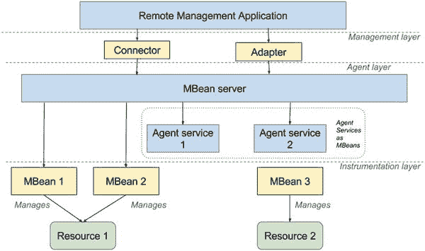

图 7-30.

JMX 架构

*   **监控**

*   **事件通知**

*   **定时器**

*   **管理层**：定义外部管理应用程序如何通过协议、API 等与底层交互。该层使用了分布式服务规范（JSR-077）的实现，该规范是 Java 2 平台企业版（J2EE）规范的一部分。²⁷

JMX 技术定义了标准连接器（称为 JMX 连接器），使您能够从远程管理应用程序访问 JMX 代理。MBean 服务器充当本地 MBean 与代理之间、以及 MBean 与远程客户端之间通信的代理。MBean 服务器保存一个键控引用，作为所有已注册 MBean 的证据。JDK 中提供了 MBean 服务器的通用且可访问的客户端：`jconsole`、`jvisualvm` 和 `jmc`。还有一个名为 VisualVM²⁸ 的开源工具。

MBean 是一个遵循 JMX 规范中设定的设计模式的受管 Java 对象。MBean 可以表示设备、应用程序或任何需要管理的资源。MBean 公开一个管理接口，该接口由以下内容组成：

*   **属性**，可以是可读的、可写的，或两者兼有

*   **操作（方法）**

*   **自描述**

JMX 规范定义了五种类型的 MBean：

*   **标准 MBean**，也称为简单 MBean

*   **动态 MBean**

*   **开放 MBean**

*   **模型 MBean**

*   **MXBean**

管理元数据可以通过实现 Java 接口或对实现进行注解来静态定义，并将在运行时自动生成。

纯 JMX

一个最纯粹的 JMX MBean 接口示例如下所示。

```
package com.ps.jmx;
public interface JmxCounterMBean {
int getCount(); // 属性 "count"
void add(); // 操作 "add"
}
public class JmxCounter implements JmxCounterMBean{
public int getCount() {
...
}
public void void add() {
...
}
}
```

CC

按照惯例，MBean 接口的名称采用实现它的 Java 类的名称，并添加后缀 `MBean`。

一旦资源被 MBean 检测，该资源的管理将由 JMX 代理执行。

```
MBeanServer mbs = ManagementFactory.getPlatformMBeanServer();
ObjectName name = new ObjectName("com.ps.jmx:type=UserCounter");
UserCounter mbean = new UserCounter();
mbs.registerMBean(mbean, name);
```

Spring JMX

像往常一样，使用原生 API 很繁琐，因此引入了 Spring JMX，通过提供一种将 Spring 应用程序集成到 JMX 基础设施中的实用方法，让开发人员的生活更轻松。Spring 的 JMX 支持提供了四个核心功能：

*   自动将任何 Spring Bean 注册为 JMX MBean。

*   用于控制 Bean 管理接口的灵活机制。

*   通过远程 JSR-160 连接器声明式地暴露 MBean。

*   对本地和远程 MBean 资源的简单代理。

这些功能无需编写复杂代码，也无需将应用程序耦合到 Spring 或 JMX 类或接口即可提供。JMX 基础设施可以使用上下文命名空间或 Java 配置进行配置。Spring Bean 可以使用注解或 XML 暴露为 MBean。JMX Bean 可以通过代理机制透明地使用。到目前为止，没有什么新内容；这就是 Spring 为最常用的 API 提供的功能。

Spring JMX 框架中的核心类是 `MBeanExporter`，负责获取您的 Spring Bean 并将它们注册到 JMX MBeanServer。声明服务器和导出器 Bean 是以典型的 Spring 方式完成的。

`<context:mbean-server/>` 声明了一个类型为 `org.springframework.jmx.support.MBeanServerFactoryBean` 的 Bean。该 Bean 负责从标准的 JMX 1.2 `javax.management.MBeanServerFactory` API 获取 `javax.management.MBeanServer` 引用。

`<context:mbean-export/>` 声明了一个类型为 `org.springframework.jmx.export.MBeanExporter` 的 Bean，该 Bean 允许将任何 Spring 管理的 Bean 暴露给 MBeanServer，而无需在 Bean 类中定义任何 JMX 特定的信息。

等效的 Java 配置如下面的代码片段所示。基本上，XML 中的两个上下文元素变成了配置类中的两个 Bean：

```
import org.springframework.jmx.export.MBeanExporter;
import org.springframework.jmx.support.MBeanServerFactoryBean;
...
@Configuration
public clas JmxConfig(){
// 等效于 
@Bean
MBeanServerFactoryBean mbeanServer(){
return new MBeanServerFactoryBean();
}
// 等效于 
@Bean
MBeanExporter exporter(){
MBeanExporter exporter = new MBeanExporter();
exporter.setAutodetect(true);
exporter.setBeans(map);
return exporter;
}
}
```

项目 `16-ps-jmx-sample` 分配给了本节。它包含了使用 Spring Boot 的实现，因为通过这种方式，设置变得更加容易，因为所需要的只是一个注解：`@EnableMBeanExport`。

```
import org.springframework.boot.SpringApplication;
import org.springframework.boot.autoconfigure.SpringBootApplication;
import org.springframework.context.ConfigurableApplicationContext;
import org.springframework.context.annotation.EnableMBeanExport;
@SpringBootApplication
@EnableMBeanExport
public class Application {
private static Logger logger = LoggerFactory.getLogger(Application.class);
public static void main(String args) throws IOException {
ConfigurableApplicationContext ctx =
SpringApplication.run(Application.class, args);
assert (ctx != null);
logger.info("已启动 ...");
System.in.read();
ctx.close();
}
}
```

`@EnableMBeanExport` 非常重要，因为它启用了从 Spring 上下文中默认导出所有标准 MBean，以及所有带有 `@ManagedResource` 注解的 Bean。在幕后，它基本上为您声明并注册了一个类型为 `JmxMBeanServer` 的 Bean 和一个类型为 `AnnotationMBeanExporter` 的 Bean，它们将负责注册并将您的 Spring 管理的 Bean 暴露为 MBean，这样您就不必自己做了。


启动应用程序后，你可以通过分析控制台日志来确认两个 Bean 已为你创建。你应该会看到类似以下的日志条目：

```
...
INFO o.s.j.e.a.AnnotationMBeanExporter - Registering beans for JMX exposure on startup
DEBUG o.s.j.e.a.AnnotationMBeanExporter - Autodetecting user-defined JMX MBeans
...
DEBUG o.s.j.s.JmxUtils - Found MBeanServer:
com.sun.jmx.mbeanserver.JmxMBeanServer@7c05a4af
DEBUG o.s.b.f.s.DefaultListableBeanFactory -
Creating instance of bean 'mbeanExporter'
DEBUG o.s.b.f.s.DefaultListableBeanFactory -
Creating shared instance of singleton bean 'mbeanServer'
...
```

Spring 的 `MBeanExporter` 可以将现有的 POJO Bean 暴露给 `MBeanServer`，而无需编写注册代码。Spring Bean 必须使用相应的注解进行标注。

```
import org.springframework.jmx.export.annotation.ManagedAttribute;
import org.springframework.jmx.export.annotation.ManagedOperation;
import org.springframework.jmx.export.annotation.ManagedResource;
import javax.annotation.ManagedBean;
@ManagedResource(description = "sample JMX managed resource"
, objectName="bean:name=jmxCounter")
public class JmxCounterImpl implements JmxCounter {
private int counter =0;
@ManagedOperation(description = "Increment the counter")
@Override
public int add() {
return ++counter;
}
@ManagedAttribute(description = "The counter")
@Override
public int getCount() {
return counter;
}
}
```

受管 Bean 的 ObjectName 要么从完全限定类名派生，要么作为属性传递给 `@ManagedResource`。`@ManagedResource` 将 `JmxCounterImpl` 的所有实例标记为 JMX 受管资源。`@ManagedOperation` 将该方法标记为 JMX 操作。`@ManagedAttribute` 将 getter 或 setter 标记为 JMX 属性的一半。

`MBeanExporter` 以 Map 形式接收受管资源作为参数：

```
@Configuration
public class JmxConfig {
@Bean
MBeanExporter exporter(){
MBeanExporter exporter = new MBeanExporter();
Map map = new HashMap();
map.put("bean:name=jmxCounter1", jmxCounter());
exporter.setBeans(map);
return exporter;
}
...
}
// 在这种情况下，JMX Bean 必须使用 @Component 注解
@Component
@ManagedResource(description = "Sample JMX managed resource",
objectName="bean:name=jmxCounter")
public class JmxCounterImpl implements JmxCounter {
...
}
```

但如果进行相应配置，`MBeanExporter` Bean 可以检测所有 JMX Bean：将 `autodetect` 属性设置为 `true`。

```
@Configuration
public class JmxConfig {
@Bean
MBeanExporter exporter(){
MBeanExporter exporter = new MBeanExporter();
exporter.setAutodetect(true);
return exporter;
}
...
}
// 在这种情况下，JMX Bean 必须使用 @Component 注解
@Component
@ManagedResource(description = "Sample JMX managed resource",
objectName="bean:name=jmxCounter")
public class JmxCounterImpl implements JmxCounter {
...
}
```

但是，当使用 `@EnableMBeanExport` 注解时，则无需显式配置导出器 Bean。

`objectName` 属性包含最终 MBean 的名称，因此任何客户端（本地或远程）都必须查找 `jmxCounter`。现在，我们已经完成了 JMX 配置并将一个 Spring Bean 暴露为 MBean，可以启动应用程序并开始搜索这个 Spring 管理的 Bean。

在当前的示例中，我们将使用 Oracle 的 Java Mission Control 作为客户端。²⁹ 如果你的系统中设置了 `JAVA_HOME` 变量，并且 `JAVA_HOME\bin` 在类路径中，请打开终端（或在 Windows 上打开命令提示符）并输入 `jmc`。在图 7-31 中，你可以看到 JMC 窗口。

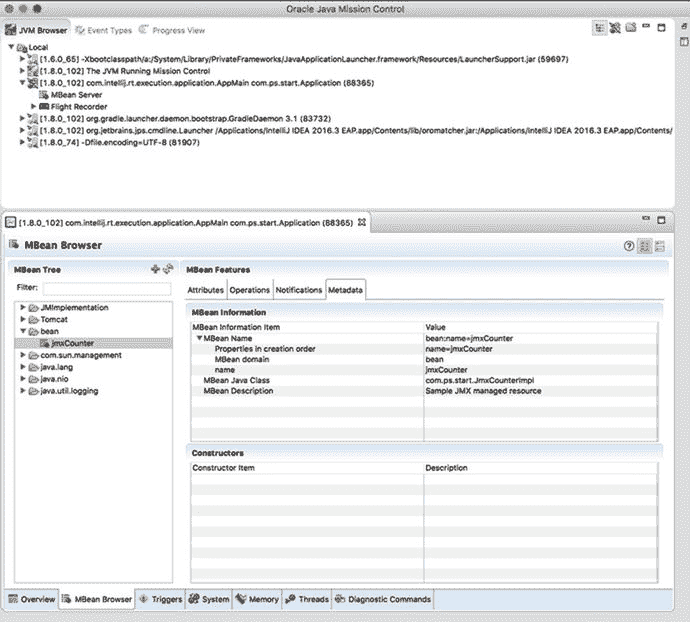

图 7-31.

Java Mission Control 连接到 16-ps-jmx-sample 应用程序并显示 jmxCounter MBean

在 JMC 中，你会看到一个名为 `JVM Browser` 的选项卡，它显示了系统上运行的所有 JAVA 进程。你可以通过主类名称 `com.ps.start.Application` 识别出对应于 `16-ps-jmx-sample` 的 Java 进程。双击并展开节点；然后双击 `MBeanServer` 节点。将打开一个名为 MBean Browser 的选项卡，在其中展开 `bean` 节点，你将看到 `jmxCounter`，可以通过单击右侧的选项卡来检查它。如果你单击操作选项卡，你将看到两个操作和一个名为 `Execute` 的按钮，你可以使用它来执行 `jmxCounter` MBean 的方法。

之前提到过，客户端应用程序可以通过代理访问 MBean。Spring JMX 架构支持这一点，因为这是 Spring 应用程序之间的标准远程通信方式。在图 7-32 中，你可以看到 Spring JMX 架构。

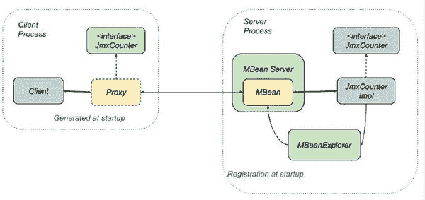

图 7-32.

Spring JMX 架构

所以基本上，服务器端将 Spring Bean 暴露为由 MBeanServer 管理的 MBean，而客户端则使用代理访问它们。典型的 Spring 风格，对吧？

为了能够为 MBean 创建 Spring 客户端，必须在服务器端为其定义一个客户端将用于访问 MBean 的连接器。为此，我们需要配置一个类型为 `ConnectorServerFactoryBean` 的 Bean。

```
@SpringBootApplication
@EnableMBeanExport
public class Application {
private static Logger  logger = LoggerFactory.getLogger(Application.class);
@Bean
ConnectorServerFactoryBean connector(){
return new ConnectorServerFactoryBean();
}
...
}
```

默认情况下，`ConnectorServerFactoryBean` 会创建一个绑定到 `"service:jmx:jmxmp://localhost:9875"` 的 `JMXConnectorServer`，这就是客户端将用于访问 MBean 的 URL。此示例中的客户端是一个测试类，其中注入了一个类型为 `MBeanServerConnectionFactoryBean` 的 Bean，该 Bean 将用于通过代理对象远程访问 MBean。JSR 160 规范将 JMXMP 协议标记为可选：目前，主要的开源 JMX 实现 MX4J 以及 JDK 自带的实现都不支持 JMXMP。因此，更简单的方法是通过 RMI 暴露 MBean。为此，必须更改服务器配置以包含 RMI 注册表和连接器 Bean。

```
import org.springframework.jmx.support.ConnectorServerFactoryBean;
import org.springframework.jmx.support.MBeanServerFactoryBean;
import org.springframework.remoting.rmi.RmiRegistryFactoryBean;
....
@SpringBootApplication
@EnableMBeanExport
public class Application {
private static Logger logger = LoggerFactory.getLogger(Application.class);
@Bean
@DependsOn("rmiRegistry")
ConnectorServerFactoryBean connector() {
ConnectorServerFactoryBean cf = new ConnectorServerFactoryBean();
try {
cf.setObjectName("connector:name=rmi");
} catch (MalformedObjectNameException e) {
return  null;
}
cf.setServiceUrl(
"service:jmx:rmi://localhost/jndi/rmi://localhost:1099/jmxrmi");
return cf;
}
@Bean
RmiRegistryFactoryBean rmiRegistry() {
RmiRegistryFactoryBean rmiRegistryFactoryBean = new RmiRegistryFactoryBean();
rmiRegistryFactoryBean.setAlwaysCreate(true);
rmiRegistryFactoryBean.setPort(1099);
return rmiRegistryFactoryBean;
}
...
}
```

在客户端，我们需要一个 `MBeanServerConnection` Bean 来连接到 RMI 服务器，该 Bean 将由 `MBeanServerConnectionFactoryBean` 工厂 Bean 创建，以及一个 `MBeanProxyFactoryBean`，它将负责创建 `JmxCounter` 代理。


```
import com.ps.start.JmxCounter;
import org.springframework.context.annotation.Bean;
import org.springframework.context.annotation.Configuration;
import org.springframework.jmx.access.MBeanProxyFactoryBean;
import org.springframework.jmx.support.MBeanServerConnectionFactoryBean;
import javax.management.MBeanServerConnection;
@Configuration
public class TestConfig {
@Bean
MBeanServerConnection connection() {
MBeanServerConnectionFactoryBean conn = new MBeanServerConnectionFactoryBean();
try {
conn.setServiceUrl(
"service:jmx:rmi://localhost/jndi/rmi://localhost:1099/jmxrmi");
conn.afterPropertiesSet();
return conn.getObject();
} catch (Exception e) {
e.printStackTrace();
return null;
}
}
@Bean
MBeanProxyFactoryBean proxy() throws MalformedObjectNameException {
MBeanProxyFactoryBean proxy = new MBeanProxyFactoryBean();
proxy.setObjectName("bean:name=jmxCounter");
proxy.setProxyInterface(JmxCounter.class);
proxy.setServer(connection());
return proxy;
}
}
```

测试类只需获取代理并对其执行一些操作：

```
...
@RunWith(SpringJUnit4ClassRunner.class)
@ContextConfiguration(classes = {TestConfig.class})
public class TestClient {
private static Logger logger = LoggerFactory.getLogger(TestClient.class);
@Autowired
JmxCounter counter;
@Test
public void test() {
assertNotNull(counter);
counter.add();
assertEquals(1, counter.getCount());
}
}
```

总结

阅读本章后，你应该对如何使用 Spring 提供和消费多种类型的服务有了恰当的理解。下面是一个简单的主题列表，在回顾所学知识时，你可以将其作为参考，但请记住，只有 Spring REST 属于官方认证考试的范围。

*   RMI 代表什么？

*   RMI 模型的缺点是什么？

*   `HttpInvoker` 用于什么？

*   解释 JMS 核心概念，如发布者、订阅者、生产者、消费者和目的地。

*   JMS 消息有多少种类型？

*   `JmsTemplate` 用于什么？

*   JMS 代表什么？

*   目的地有多少种类型？

*   JMS 消息的结构是什么？

*   什么是 SOAP？

*   SOAP 的优缺点。

*   `@EnableWs` 是 Spring WS 应用程序的关键配置注解。

*   如何为 WS 实现生成类？

*   `@Endpoint` 是将类标记为 Web 服务端点的注解。

*   什么是 REST？

*   哪些类型的客户端可以访问 Web 应用程序？

*   资源如何暴露给客户端？

*   支持多少种表示形式？

*   @Controller 和 @RestController 之间的区别是什么？

*   确保你能描述 Spring MVC 对 RESTful 应用程序的支持。

*   理解如何访问请求/响应数据。

*   @ResponseBody 和 @RequestBody 用于什么？

*   使用 MessageConverters。

*   在配置 RESTful 应用程序时，类路径中是否需要 Spring MVC？

*   `RestTemplate` 是用于创建 REST 应用程序客户端的核心 Spring 类。

*   Spring JMX 允许将 Spring 管理的 Bean 作为 MBeans 实际导出到 JMX MBeanServer。

*   Spring JMX 提供了一种配置 JMX 应用程序的简便方法，使开发者可以专注于 Spring Bean 的实现。

*   `@EnableMBeanExport` 是 Spring JMX 应用程序的关键配置注解。

快速测验

问题 1：什么是 REST？

1.  一种软件设计模式

2.  一个框架

3.  一种架构风格

问题 2：以下哪些方法是 HTTP 方法？

1.  PUT

2.  GET

3.  SUBMIT

4.  OPTIONS

问题 3：哪个 Spring 类可用于访问和测试 REST 服务？

1.  `RestTemplate`

2.  `RmiTemplate`

3.  两者都可以

4.  都不可以

问题 4：RestTemplate 处理什么？

1.  资源

2.  表示形式

3.  两者都处理

问题 5：关于 @RestController 注解，以下哪项是正确的？

1.  它用于声明提供 REST 服务的控制器。

2.  它被 @Controller 和 @ResponseBody 注解。


3.  在使用此注解 `@RequestMapping` 的控制器方法中，默认情况下会假定其具有 `@ResponseStatus` 语义。

问题 6：使用 `@ResponseStatus` 注解方法会产生什么效果？

1.  对于返回 void 或 null 的方法，默认的视图解析行为会被覆盖。
2.  与 `@ResponseStatus` 匹配的 HTTP 状态码会被添加到响应体中。
3.  它会强制使用 HTTP 消息转换器。

问题 7：Spring MVC 支持以下哪些 HTTP 消息转换器？

1.  `StringHttpMessageConverter`
2.  `MappingJackson2HttpMessageConverter`，但 Jackson2 必须位于类路径中
3.  `YamlMessageConverter`

问题 8：以下哪些 `RestTemplate` 方法可用于向 URL 发起 GET REST 调用？

1.  `restTemplate.getForObject(...)`
2.  `optionsForAllow(...)`
3.  `getForEntity(...)`
4.  `exchange(..., HttpMethod.GET,...)`

问题 9：以下 REST 处理器方法是否符合 HATEOAS 约束？

1.  是的，因为它返回了所创建对象的表示。
2.  不，因为它没有将 location 头设置为所创建资源的 URI。
3.  这不是一个 REST 处理器方法。
4.  不，因为没有将 Link 对象添加到返回的资源中。

```
@ResponseStatus(HttpStatus.CREATED)
@RequestMapping(value = "/create", method = RequestMethod.POST,
produces = MediaType.APPLICATION_JSON_UTF8_VALUE,
consumes = MediaType.APPLICATION_JSON_UTF8_VALUE)
public Person createPerson(@RequestBody @Valid Person newPerson) {
logger.info("----->  CREATE");
Hospital hospital = hospitalManager.findByCode(
newPerson.getHospital().getCode());
newPerson.setHospital(hospital);
Person person = personManager.save(newPerson);
logger.info("-----> PERSON: " + person);
return person;
}
```

脚注

Oracle JavaDoc API: [`http://docs.oracle.com/javase/8/docs/api/java/rmi/RemoteException.html`](http://docs.oracle.com/javase/8/docs/api/java/rmi/RemoteException.html) .

[`http://docs.oracle.com/javase/7/docs/technotes/tools/windows/rmic.html`](http://docs.oracle.com/javase/7/docs/technotes/tools/windows/rmic.html) .

这是一个无需 Spring 即可编写 RMI 应用程序的示例：[ `https://en.wikipedia.org/wiki/Java_remote_`
](https://en.wikipedia.org/wiki/Java_remote_method_invocation) [`method_invocation`](https://en.wikipedia.org/wiki/Java_remote_method_invocation) .

定义 JMS 的 Java 社区流程：[`https://jcp.org/en/jsr/detail?id=914`](https://jcp.org/en/jsr/detail?id=914) .

更多详情请访问 Apache ActiveMQ 官方网站：[`http://activemq.apache.org/how-to-unit-test-jms-code.html`](http://activemq.apache.org/how-to-unit-test-jms-code.html) .

ActiveMQ 官方网站：[`http://activemq.apache.org/how-to-unit-test-jms-code.html`](http://activemq.apache.org/how-to-unit-test-jms-code.html) .

Apache ActiveMQ [`http://activemq.apache.org/activemq-5141-release.html`](http://activemq.apache.org/activemq-5141-release.html) .

更多信息请点击此处：[`http://activemq.apache.org/objectmessage.html`](http://activemq.apache.org/objectmessage.html) .

假设一个 Object 消息类包含来自三个不同包的三个实体；那么 `packageList` 必须包含 [“package1”, “package2”, “package3”]。

JAXB 是 JavaEE 标准的一部分，指的是用于 XML 绑定的 Java 架构。JAXB 的使用是首选，因为它提供了一种在 Java 中处理 XML 文档的替代方案，而无需完全理解 XML 技术的所有细节。

XMLBeans 是 BEA 系统开发的一个开源项目，它提供了与 JAXB 类似的功能，允许访问 XML 文档。然而，处理 XMLBeans 需要具备良好的 XML 背景知识。

[`http://www.soapui.org/`](http://www.soapui.org/) .

尽管 REST 似乎与 HTTP 紧密相关，但 REST 原则也可以遵循其他协议，例如 POP、IMAP，以及任何使用类似 URL 路径并支持 GET 和 POST 方法的协议。

参见脚注 23。

在路径变量名中使用 `$` 符号作为前缀，是为了明确表明 URI 的这一部分是一个变量，将被替换为实际值。

[`http://en.wikipedia.org/wiki/List_of_HTTP_status_codes`](http://en.wikipedia.org/wiki/List_of_HTTP_status_codes) .

当然，首选方法是先执行更新操作，然后执行 GET 请求以提取保存的数据，但出于教学目的，将两者结合在了一起。

在我们的案例中是 HTTP 请求，但如前所述，REST 也可以与其他协议一起使用。

此类的 JavaDoc 可在此处找到：[ `http://docs.spring.io/spring/docs/current/javadoc-api/org/`
](http://docs.spring.io/spring/docs/current/javadoc-api/org/springframework/web/client/RestTemplate.html) [`springframework/web/client/RestTemplate.html`](http://docs.spring.io/spring/docs/current/javadoc-api/org/springframework/web/client/RestTemplate.html) .

提供了多个名称相同但签名不同的方法。RestTemplate [`http://docs`](http://docs.spring.io/spring/docs/current/javadoc-api/org/springframework/web/client/RestTemplate.html) `.` [`spring.io/spring/docs/current/javadoc-api/org/springframework/web/client/RestTemplate.html`](http://docs.spring.io/spring/docs/current/javadoc-api/org/springframework/web/client/RestTemplate.html) .

大多数 Web 服务器的限制是 8192 字节（8KB），这通常可以在服务器配置中进行调整。对于客户端而言，HTTP 1.1 规范警告 URI 长度不要超过 255 字节，因为较旧的客户端或代理实现可能无法正确支持它们。

例如，一个用于创建宠物的 POST 请求包含宠物的主人用户名。如果数据库中不存在具有指定用户名的所有者，则应使用 404 状态码通知客户端操作失败。

一个允许您更改宠物主人的 REST 服务需要该主人的用户名。如果指定了数据库中不存在的用户名，则应通过返回 404 HTTP 响应码来通知用户该资源不存在。

Oracle 官方定义请参见此处：[`http://www.oracle.com/technetwork/articles/java/javamanagement-140525`](http://www.oracle.com/technetwork/articles/java/javamanagement-140525.html) `.` [`html`](http://www.oracle.com/technetwork/articles/java/javamanagement-140525.html) .

官方页面：[`https://jcp.org/en/jsr/detail?id=3`](https://jcp.org/en/jsr/detail?id=3) .

官方文档请参见此处：[`http://www.jcp.org/en/jsr/detail?id=160`](http://www.jcp.org/en/jsr/detail?id=160) .

J2EE TM 管理官方页面：[`https://jcp.org/en/jsr/detail?id=077`](https://jcp.org/en/jsr/detail?id=077) .

VisualVM 官方页面 [`https://visualvm.github.io/`](https://visualvm.github.io/) .

您也可以使用 jconsole、jvisualvm 或外部的 visualvm。本书涵盖了 JMC，因为它最近已成为 Java 应用程序最强大的监控和分析工具之一。它可用于生成和分析完整或部分的线程和内存转储。

8. 使用 Spring Cloud 的 Spring 微服务


微服务是面向服务架构（SOA）的一种专门化实现方法，用于构建灵活且可独立部署的服务。微服务是一种范式，要求将服务分解为高度专业化的功能实例，并通过无关的通信协议（例如 REST）相互连接，共同实现一个共同的业务目标。每个微服务都是一个非常小的无状态功能单元，它不关心输入来自何处，也不知道输出去向何方，对整体架构毫无概念。由于其专业化和解耦的特性，每个问题都能被识别、定位并修复，且重新部署实现时不会影响其他微服务。这意味着微服务系统具有高内聚和低耦合的特点，这些特性允许单个服务的架构通过持续重构不断演进，减少了对前期大型设计的依赖，并使得软件能够更早、更持续地发布。

近年来，微服务越来越受欢迎，由于其细粒度和轻量级通信协议，已成为构建企业应用的首选方式。微服务的模块化架构风格似乎特别适合基于云的环境。这种架构方法具有很高的可扩展性，在需要支持多种平台和设备时被认为是理想选择。看看目前网络上的巨头：Twitter、Netflix、Amazon、PayPal、Soundcloud 等。它们的大型网站和应用都已从单体架构演变为微服务，以便能够从各种设备访问。

经典应用开发的特点是：将多种类型的服务作为单一的单体自治单元进行开发，并部署在服务器上供客户端访问。通常，这些应用是多层的，每一层对应应用的不同功能区域。单体应用会处理 HTTP 请求、执行业务逻辑，并处理数据库操作。在单体架构中，构成系统的服务在逻辑上被组织在同一个代码库和部署单元内。单体应用的缺点是：变更最终会与其他变更相互绑定，并且当涉及多个层级时，问题有时更难识别。对应用的一小部分进行修改，可能需要构建和部署一个全新的版本。显然，回归测试是强制性的，以验证之前开发和测试的代码在修改后仍能正确运行。因此，只有将微服务与传统的单体架构进行比较，才能凸显其优缺点。

微服务的优势总结如下：

*   更高的粒度
*   更高的可扩展性
*   易于自动化部署和测试
*   易于测试
*   更高的解耦度
*   增强的内聚性
*   适合持续重构、集成和交付
*   更高的模块独立性
*   围绕能力进行组织
*   提高了敏捷性和速度，因为当系统被正确分解为微服务时，每个服务都可以独立地、并行地开发和部署
*   每个服务都具有弹性¹、韧性、可组合性、最小化和完整性
*   改进了故障隔离
*   消除了对单一技术栈的长期依赖，因为微服务可以用不同的编程语言编写
*   更容易让新开发者融入团队

微服务的劣势总结如下：


*   微服务引入了额外的复杂性，并且需要谨慎处理模块之间的请求。

*   管理多个数据库和事务可能很麻烦。

*   测试微服务可能很繁琐，因为在实际测试某个服务之前，必须确认该微服务的每个依赖项都有效。

*   部署也变得复杂，需要模块之间的协调。

到目前为止的结论是，需要支持多个客户端和平台的新一代大型应用程序非常适合采用微服务。微服务有助于将单体应用程序分解为独立的部署单元，这些单元能够独立于其他子系统来演进自身的扩展需求。让我们看看 Spring 是否能让基于微服务的应用程序的开发变得像它让单体应用程序开发一样实用。

## 使用 Spring 的微服务

微服务的架构思想类似于 Spring 容器如何管理 Bean，以及它们如何在 Spring 应用程序上下文中进行通信。可以这样想象：如果一个 Spring 应用程序上下文是一片森林，那么每个 Bean 就是一棵树。微服务则是一个完整的生态系统。之所以举这个例子，是因为编程无非就是使用软件组件对现实世界进行建模，这可能会让微服务的概念更容易理解。本书中构建的演示应用程序基本上是一个网站，人们可以在上面注册自己和他们的宠物，以便提供宠物看护服务。如果使用微服务构建，则需要为用户、宠物、请求、回复和评论管理开发独立的微服务。这也意味着需要一些移动组件来搭建这样的系统，因为微服务之间的通信也必须被覆盖。图 8-1 并排展示了经典的单体架构和微服务架构。

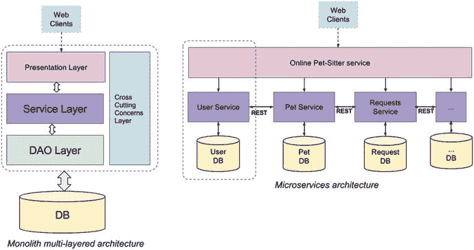

**图 8-1.** 单体架构与微服务架构

该图相当通用，它可能会让人认为每个微服务都有自己的数据库，这没错，但实际上并不需要为每个服务配置一个数据库服务器。开发中使用的数据库可以是关系型（基于 SQL）或非关系型（NoSQL）。如果使用关系型数据库，则有三种数据库实现策略可供选择：

*   **每个服务私有表**：每个服务拥有一组只能由该服务访问的表。
*   **每个服务一个模式**：每个服务拥有一个对该服务私有的数据库模式。
*   **每个服务一个数据库服务器**：每个服务拥有自己的数据库服务器。

所选的微服务数据库策略实现会影响最适合该应用程序的数据库类型。每个服务私有表和每个服务一个模式的开销最低。使用每个服务一个模式很有吸引力，因为它使所有权更加清晰。此外，如果有一个数据库服务器在微服务之间共享，那么关系型数据库是合适的，因为所有数据都在一个地方，并且通过遵循规范化标准进行了适当组织。为每个服务使用不同的数据库可能会使服务之间的数据共享变得困难，并引入数据冗余。NoSQL 数据库更适合这种类型的实现，因为它们更擅长处理冗余数据。另外，请记住，不共享数据库的一个缺点是维护数据一致性和实现查询更具挑战性。

Spring 是开发高级应用程序（例如基于微服务架构的应用程序）的最佳框架，原因如下：

*   依赖注入和集成
*   超实用的配置和服务创建
*   直接的服务发现注册

要使用 Spring 组件开发微服务应用程序，需要深入了解以下 Spring 技术：

*   服务注册和发现技术，例如 Netflix 的 OSS Eureka
*   Spring Cloud 项目，例如 Eureka 或 Consul
*   REST 概念

Spring Boot 使得创建独立的、生产级的、可以“直接运行”的基于 Spring 的应用程序变得容易。本书第 6 章已经对此进行了介绍，并且这是开发 Spring 微服务应用程序的唯一方式，因为 Spring Boot 旨在通过使常见概念（例如 RESTful HTTP 和嵌入式 Web 应用程序运行时）易于连接和使用，从而提高开发人员的生产力。它很灵活，允许开发人员只选择他们想要使用的模块，从而消除繁琐或庞大的配置以及运行时依赖。

Spring Cloud 是一个大型的伞式项目，提供了旨在简化分布式应用程序开发的开发工具。它包含用于构建分布式系统中常见模式的组件：

*   **配置管理**（Spring Cloud Config 提供了由 Git 仓库支持的集中式外部配置）
*   **服务发现**（Eureka 是一个 AWS 服务注册中心，用于弹性的中间层负载均衡和故障转移，并由 Spring Cloud 支持）
*   **断路器**（Spring Cloud 支持 Netflix 的 Hystrix，这是一个库，提供了在预定义阈值内未收到响应时停止调用服务的组件）
*   **智能路由**（Zuul，用于转发和分发对服务的调用）
*   **微代理**（面向中间层服务的客户端代理）
*   **控制总线**（消息系统可用于监控和管理框架内的组件，就像用于“应用程序级”消息传递一样）
*   **一次性令牌**（使用 Spring Vault 仅用于一次数据访问）
*   **全局锁**（用于协调、优先化或限制对资源的访问）
*   **领导者选举**（将单个进程指定为分布在多个节点间的某个任务的组织者的过程）
*   **分布式会话**（跨多个 Servlet 服务器分布的会话）
*   **集群状态**（集群状态请求被路由到主节点，以确保返回最新的集群状态）
*   **客户端负载均衡**

如果您有兴趣使用 Spring Cloud 构建微服务应用程序，Spring 团队提供的文档可在此处获取：[`http://projects.spring.io/spring-cloud/spring-cloud.html`](http://projects.spring.io/spring-cloud/spring-cloud.html)。它涵盖了前面列表中的每个主题以及更多内容。

协调分布式系统并不容易，并且可能导致样板代码。Spring Cloud 只是让开发人员更容易编写此类管理代码，并且其结果可以在任何分布式环境中工作，包括开发工作站、数据中心和托管平台（如 Cloud Foundry）。² Spring Cloud 构建在 Spring Boot 之上，并具有典型的 Spring Boot 优势：开箱即用的预配置基础设施 Bean，可以进一步配置或扩展以创建自定义解决方案。它遵循相同的 Spring 声明式方法，依赖于注解和属性文件。

Spring Cloud Netflix 提供了与 Netflix OSS（开源软件）的集成。其官方 GitHub 页面 `https: //netflix.github.io/` 基本上是一个开源库的集合，这些库由他们的开发人员编写，用于大规模解决一些分布式系统问题。它用 Java 编写，现在是用于在 Java 中编写微服务应用程序的最常用的软件解决方案之一。

## 注册与发现服务器


微服务架构确保一组进程能够协同工作，共同实现一个目标，为最终用户提供可靠且高效的服务。为此，这些进程必须高效地进行通信。为了相互通信，它们首先需要知道彼此的存在。这就是 Netflix Eureka 注册服务器发挥作用的地方。由于它是开源的，因此被整合到了 Spring Cloud 中，并且现在也遵循了 Spring 的简洁性原则。微服务应用中的进程可以使用一个注册或发现服务器来注册和发现彼此，如下面的代码片段所示，该片段来自 `17-ps-micro-sample` 项目。

```
package com.ps.server;
import org.springframework.boot.SpringApplication;
import org.springframework.boot.autoconfigure.SpringBootApplication;
import org.springframework.context.ConfigurableApplicationContext;
import org.springframework.cloud.netflix.eureka.server.EnableEurekaServer;
import java.io.IOException;
@SpringBootApplication
@EnableEurekaServer
public class DiscoveryServer {
private static Logger logger =
LoggerFactory.getLogger(DiscoveryServer.class);
public static void main(String args) throws IOException {
// 告诉服务器查找 discovery.properties 或 discovery.yml
System.setProperty("spring.config.name",  "discovery");
ConfigurableApplicationContext ctx =
SpringApplication.run(DiscoveryServer.class,  args);
assert (ctx != null);
logger.info("已启动 ...");
System.in.read();
ctx.close();
}
}
```

**

`System.in.read();`
调用的作用是，你可以通过按下 `<ENTER>` 键来优雅地停止应用程序。

要在项目中使用 `Eureka Server`，必须将 `spring-cloud-starter-eureka-server` 启动器项目作为项目的依赖项包含进来。请注意 `@EnableEurekaServer` 注解，它负责将一个 Eureka 服务器实例注入到你的项目中。该服务器有一个包含用户界面的主页，并根据 /eureka/* 下的标准 Eureka 功能提供 HTTP API 端点。

`discovery.yml` 文件包含了此服务器的设置。默认情况下，Spring Boot 会查找名为 `application` 的文件来读取配置。要指定从其他文件读取配置，必须将该文件名作为系统属性 `spring.config.name` 的值添加，方法是在创建 Spring 上下文之前调用 `System.setProperty("spring.config.name", "discovery");`。

```
eureka:
instance:
hostname: localhost
client:
registerWithEureka: false # 不要自动注册为客户端
fetchRegistry: false
server:
port: 3000 # 此发现服务器的访问端口
waitTimeInMsWhenSyncEmpty: 0
```

!

如果未指定 `port` 值，则端口默认值会被隐式设置为 `8761`。（在上面的示例中，端口被设置为 3000 仅作为示例。）

服务器将在 3000 端口上可用，当运行上述类时，显示一些统计信息和已注册微服务的服务器界面就可以在浏览器中通过 `http://localhost:3000/` 访问。图 8-2 展示了一个尚未注册任何微服务的裸 Eureka 服务器的界面。

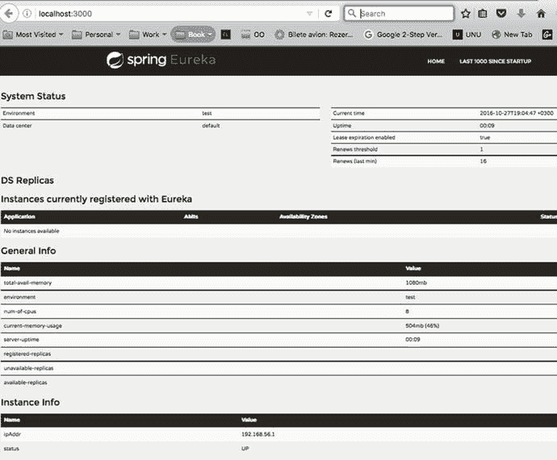

图 8-2.

Spring Eureka 网页界面

Netflix 原始版本的 Eureka 服务器，如果以空注册表启动，会在一个可配置的时间段内避免响应客户端。`waitTimeInMsWhenSyncEmpty` 属性控制此行为，其设计目的是让客户端在服务器有足够时间构建注册表之前，不会获取到部分或空的注册表信息。在前面的示例中，它被设置为零，以便尽快开始响应客户端。

!

如果未设置，`server.waitTimeInMsWhenSyncEmpty` 的默认值是 5 分钟。

`eureka.client.registerWithEureka` 属性的默认值为“true”，用于注册 Eureka 客户端。由于上述应用程序注册的是一个服务器，因此必须将其显式设置为“false”，以阻止服务器尝试注册自身。

现在我们有了服务器，接下来需要开发微服务。

微服务开发

要创建一个微服务，需要一个服务实现和一个类，该类将与注册和发现服务器交互，以将自身注册为客户端。服务的实现是一个典型的 Spring 服务，在我们的示例中，我们将有三个微服务：一个处理用户，一个处理宠物，还有一个连接这两者的功能。在图 8-3 中，描绘了这些微服务如何交互的示意图。

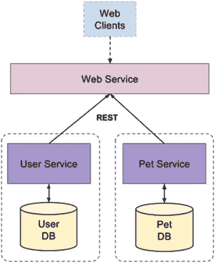

图 8-3.

17-ps-micro-sample 项目结构

微服务是一个独立的进程，用于处理一个明确定义的需求。在创建基于微服务的分布式应用程序时，每个微服务组件应根据其用途打包，并且整体实现应该是非常松散耦合但高度内聚的。这三个微服务在项目结构中会有独立的包，它们将使用 RESTful 请求相互通信。在图 8-4 中，描绘了 `17-ps-micro-sample` 项目。

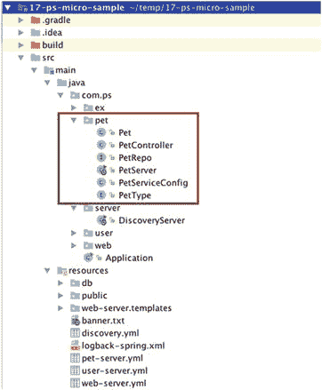

图 8-4.

17-ps-micro-sample 项目结构

在图 8-5 中，描绘了构成微服务及其交互的所有 Bean：

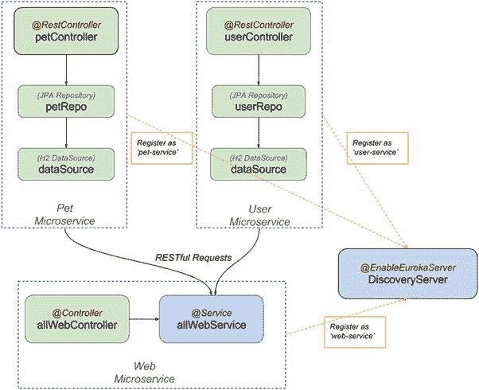

图 8-5.

17-ps-micro-sample 项目架构

`pet-service` 和 `user-service` 微服务的实现是相似的。它们各自使用一个 Spring Data JPA 仓库 Bean（`JpaRepository` 实现）和一个 Spring REST 控制器来提供 RESTful 接口以暴露其数据。

```
@RestController
@RequestMapping("/pets")
public class PetController {
@RequestMapping("/")
public List all() {
... // 获取所有宠物
}
@RequestMapping("/owner/{id}")
public List byOwner(@PathVariable("id") Long ownerId) {
// 获取主人 id = ownerId 的所有宠物
}
...
}
```

此实现的特殊之处在于 `PetServer` 类，它是一个 SpringBoot 特殊类，用于向上一节中配置的 Eureka 发现和注册服务器注册自身。

```
package com.ps.pet;
import org.springframework.boot.SpringApplication;
import org.springframework.boot.autoconfigure.EnableAutoConfiguration;
import org.springframework.cloud.client.discovery.EnableDiscoveryClient;
import org.springframework.context.ConfigurableApplicationContext;
@EnableAutoConfiguration
@EnableDiscoveryClient
@Import(PetServiceConfig.class)
public class PetServer {
private static Logger logger = LoggerFactory.getLogger(PetServer.class);
public static void main(String args) throws IOException {
// 告诉服务器查找 pet-server.properties 或 pet-server.yml
System.setProperty("spring.config.name",   "pet-server");
ConfigurableApplicationContext ctx =
SpringApplication.run(PetServer.class, args);
assert (ctx != null);
logger.info("已启动 ...");
System.in.read();
ctx.close();
}
}
```

使用 `@EnableAutoConfiguration` 注解代替 `@SpringBootApplication`，是因为一些自定义配置来自 `PetServiceConfig` 类，我们希望对其进行控制。但该应用程序仍然是一个 Spring Boot 应用程序。


请注意 `@EnableDiscoveryClient` 注解，它是将此应用转变为微服务的关键组件，因为它启用了服务注册与发现功能。该进程会以应用名称 `pets-service` 进行注册，并在 `pet-server.yml` 配置文件中指定其将在 4000 端口上可用。其内容如下面的配置片段所示。

```
