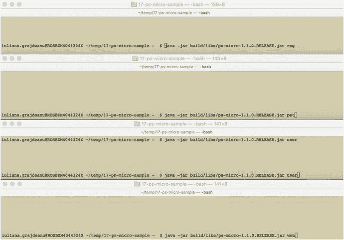
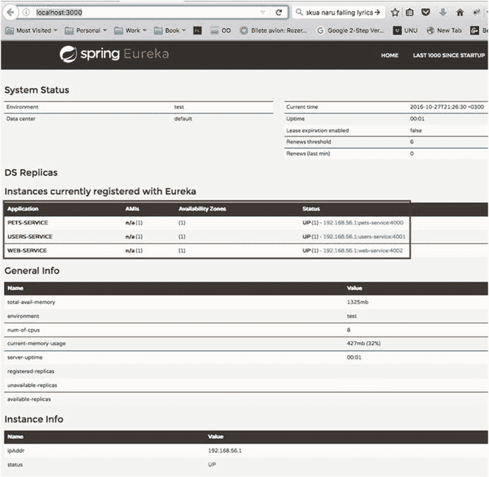
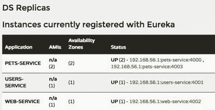

# Discovery Server Access
eureka:
client:
registerWithEureka: false
fetchRegistry: true
serviceUrl:
defaultZone: http://localhost:3000/eureka/
instance:
leaseRenewalIntervalInSeconds: 5
preferIpAddress: false
```

上述配置片段包含三个部分：

*   Spring 部分将应用名称定义为 `pets-service`。微服务将以该名称向 Eureka 服务器注册自身。

*   Server 部分定义了要监听的**自定义端口**。默认情况下，应用中的所有微服务进程都使用 Tomcat，因为它是 `spring-boot-starter-web` 的隐式依赖项，并且默认会尝试使用 8080 端口，而同一时间只能有一个进程监听一个端口。因此，每个微服务都会通过配置分配一个不同的端口。`pets-service` 使用 4000 端口，`user-service` 使用 4001 端口，`web-service` 使用 4002 端口。

*   Eureka 部分通过 `eureka.client.serviceUrl.defaultZone` 定义了要注册到的服务器 URL。可以设置其他属性来自定义与 Eureka 服务器的交互。

`eureka.client.registerWithEureka` 属性的默认值为 "true"，用于注册 Eureka 客户端。此处显式使用它仅出于教学目的，以便更清楚地表明 `pets-service` 微服务是一个客户端。

*   Eureka 客户端从服务器获取注册信息并在本地缓存。之后，客户端使用该信息来查找其他服务。由于 `pets-service` 无需与其他微服务通信，因此注册信息对它没有用处。所以将 `eureka.client.fetchRegistry` 设置为 `false`，以避免在无用的操作上浪费时间和资源。

*   Eureka 客户端需要通过发送一个名为 `heartbeat` 的信号来告知服务器它们仍处于活动状态。默认情况下，间隔为 30 秒。但可以通过自定义 `eureka.instance.leaseRenewalIntervalInSeconds` 属性的值来设置更短的间隔。在开发期间，可以将其设置为较小的值，这将加快注册速度，但在生产环境中，这会产生与服务器的额外通信，可能导致服务延迟。对于生产环境，不应修改默认值。

*   `eureka.instance.preferIpAddress` 用于告知 Eureka 服务器是应使用域名还是 IP。在我们的案例中，由于所有内容都在同一台机器上运行，我们更倾向于使用域名（localhost），因此该属性设置为 `false`。

所有这些细节以及更多信息都可以在 Netflix GitHub 页面 [`https://github.com/Netflix/`](https://github.com/Netflix/eureka/wiki/Understanding-eureka-client-server-communication) [`eureka/wiki/Understanding-eureka-client-server-communication`](https://github.com/Netflix/eureka/wiki/Understanding-eureka-client-server-communication) 上找到。此处仅引用并解释了对于示例实现重要的部分。

`PetServer` 类引入了一个新的 Spring Boot 主类，因此 Gradle 构建现在会失败，因为它不知道要执行哪个主类。所以必须修改 Gradle 配置以指定应用的主类。但由于 `17-ps-micro-sample` 是一个分布式应用，其目的是能够多次启动它：

*   一次作为发现和注册服务器，监听 3000 端口
*   一次作为 `pets-service` 微服务，监听 4000 端口
*   一次作为 `users-service` 微服务，监听 4001 端口
*   一次作为 `web-service` 微服务，监听 4002 端口

这意味着主类应根据传递给它的参数启动不同的 Spring 应用。对于作为示例给出的应用，主类如下所示：

```
package com.ps;
import com.ps.pet.PetServer;
import com.ps.server.DiscoveryServer;
import com.ps.user.UserServer;
import com.ps.web.WebServer;
import java.io.IOException;
public class Application {
public static void main(String args) throws IOException {
if (args.length == 0) {
System.out.println("请指定要启动的应用！
(选项: reg, user, pet, web)");
} else {
switch (args0) {
case "reg":
DiscoveryServer.main(args);
break;
case "user":
UserServer.main(args);
break;
case "pet":
PetServer.main(args);
break;
case "web":
WebServer.main(args);
break;
default:
System.out.println("请指定要启动的应用！
(选项: reg, user, pet, web)");
}
}
}
}
```

为了告知 Spring Boot 插件这是应用的主类，我们将以下配置片段添加到 Gradle 配置文件中：

```
springBoot {
mainClass = "com.ps.Application"
}
```

现在可以使用 `gradle clean build` 再次构建 Gradle 应用。此次构建的结果将是 `ps-micro-1.1.0.RELEASE.jar`，位于 `17-ps-micro-sample/build/libs` 目录下。运行应用多个实例的最简单方法是打开多个终端（Windows 中的命令提示符实例），并使用应用中可用的所有不同参数执行 `java -jar ps-micro-1.1.0.RELEASE.jar`。这对于优雅地关闭它们，或者当只需要停止其中一个服务时也很实用。在图 8-6 中，展示了用于启动应用不同实例的四个终端。



图 8-6.

启动 17-ps-micro-sample 应用的不同实例

服务的注册最多需要 30 秒（除非通过为 `eureka.instance.leaseRenewalIntervalInSeconds` 属性设置更小的值来更改），所以请耐心等待并观察注册服务器的控制台日志。所有主类最终都会显示 `Started ...` 文本。如果显示了此文本，并且在任何控制台中都没有看到异常，则意味着所有实例都已正确启动。注册后，当访问 Eureka 服务器的 `http://localhost:3000/` 界面时，您应该会在实例选项卡中看到所有已注册的客户端服务，如图 8-7 所示。



图 8-7.

在 Eureka 服务器上注册的客户端微服务

您可以在 `http://localhost:3000/eureka/apps/` 中查看有关已注册微服务的更多详细信息。

```

UP_3_

PETS-SERVICE

192.168.56.1:pets-service:4000
192.168.56.1
PETS-SERVICE
192.168.56.1
UP
UNKNOWN

http://192.168.56.1:4000/health
...

...

```

如果服务已正确启动，则可以在 [ `http://192.168.56.1:3000/eureka/apps/PETS-SERVICE`
](http://192.168.56.1:3000/eureka/apps/PETS-SERVICE) 获取相同的信息。否则，将显示 404 错误。


在注册时，每个微服务都会从服务器获取一个唯一的注册标识符。如果另一个进程使用相同的 ID 进行注册，服务器会将其视为重启，因此第一个进程会被丢弃。为了运行同一进程的多个实例——出于负载均衡和弹性的考虑，并且毕竟这是一个分布式应用，理应能够做到这一点——我们必须确保服务器生成不同的注册 ID。实现这一目标最简单的方法是提供为微服务指定不同端口的选项。到目前为止使用的配置中的注册 ID，即`<instanceId>`元素中的那个，是默认的命名模板，其形式如下：

```
${ipAddress}:${spring.application.name:${server.port}}
```

注册 ID 可以通过 Eureka 属性配置进行设置：

```
eureka:
instance:
metadataMap:
instanceId:
${spring.application.name}:${spring.application.instance_id:${server.port}}
```

如果未定义`spring.application.instance_id`，它将回退到前面提到的默认格式。`spring.application.instance_id`仅在使用 Cloud Foundry 时才会被设置³，并且它为同一应用的每个实例方便地提供了一个唯一的 ID 编号。

对于在本地运行微服务应用，使用可参数化端口的方法更为实用。这可以通过在启动应用前设置`server.port`属性轻松实现。

```
// 在 Application.main(...) 方法中
...
case "pet":
if (args.length == 2) {
System.setProperty("server.port", args1);
}
PetServer.main(args);
break;
...
```

因此，现在我们可以通过执行以下代码来启动任意数量的`pets-service`实例：

```
java -jar build/libs/ps-micro-1.1.0.RELEASE.jar pet PORT
```

在图 8-8 中，你可以看到启动并注册了两个`pets-service`实例，默认实例在端口 4000 上，第二个实例在端口 4003 上。



图 8-8.

两个不同的 PETS-SERVICE 微服务在 Eureka 服务器上注册

微服务通信

前面已经提到，微服务进程使用诸如 REST 之类的无关协议进行通信。`users-service`和`pets-service`都通过 HTTP 暴露 RESTful 接口（尽管也可以设置不同的协议：例如 JMS 或 AMQP），并且在给出的示例中，引入了另一个名为`web-service`的服务，它使用这些接口来访问它们的数据。为了使用 RESTful 服务，Spring 提供了`RestTemplate`类，该类可用于向 RESTful 服务器发送 HTTP 请求，并以多种格式（如 XML 和 JSON）获取数据。为了简化应用，我们将使用数据的默认格式，即 XML。`web-service`微服务客户端使用`RestTemplate`来连接其他两个已注册的微服务并请求数据，同时保持对其位置和确切 URL 的无关性，因为 Spring 会自动为其配置位置。

`web-services`的实现略有不同，因为它配置了一个 Web 界面。Eureka 服务器默认使用`FreeMarker`模板，因此如果需要不同的实现，必须首先通过配置忽略这些模板，即将`spring.application.freemarker.enabled`设置为`false`。`web-service`的配置文件如下代码片段所示。

```
spring:
application:
name: web-service
freemarker:
enabled: false     #不使用 FreeMarker 模板
thymeleaf: #将使用 Thymeleaf 模板
cache: false
prefix: classpath:/web-server/templates/
error:
path=/error
eureka:
instance:
leaseRenewalIntervalInSeconds: 5
client:
serviceUrl:
defaultZone: http://localhost:3000/eureka/
