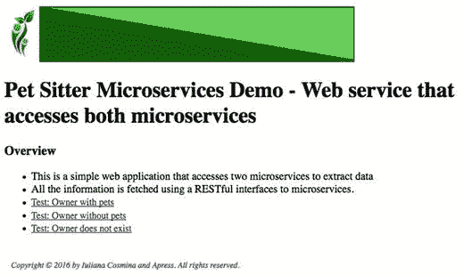

# HTTP 服务器
server:
port: 4002 # HTTP (Tomcat) 端口
```

该微服务的核心类是`AllWebController`，它使用`AllWebService`从`pets-service`和`users-service`微服务请求信息，并将其封装到可在 Thymeleaf 视图中渲染的对象中。`AllWebController`的代码并无特别之处，只是一个典型的 Spring 控制器类，使用服务实例来访问数据。

```
@Controller
public class AllWebController {
private static Logger logger = LoggerFactory.getLogger(AllWebController.class);
@Autowired
private AllWebService allWebService;
public AllWebController(AllWebService allWebService) {
this.allWebService = allWebService;
}
@RequestMapping("/all/{ownerId}")
public String byOwner(Model model,
@PathVariable("ownerId") Long ownerId) {
UserSkeleton owner = allWebService.findUserById(ownerId);
if (owner != null) {
owner.setPets(allWebService.findByOwnerId(ownerId));
}
model.addAttribute("owner", owner);
return "all";
}
@RequestMapping("/pets/{type}")
public String byOwner(Model model,
@PathVariable("type") String type) {
List pets = allWebService.findByType(type);
model.addAttribute("pets", pets);
model.addAttribute("type", type);
return "pets";
}
}
```

该服务的实现如下代码片段所示。

```
package com.ps.web;
import com.ps.ex.UserNotFoundException;
import org.springframework.cloud.client.loadbalancer.LoadBalanced;
import org.springframework.stereotype.Service;
import org.springframework.web.client.HttpClientErrorException;
import org.springframework.web.client.RestTemplate;
...
@Service
public class AllWebService {
private static Logger logger = LoggerFactory.getLogger(AllWebService.class);
@Autowired
@LoadBalanced
private RestTemplate restTemplate;
private String petsServiceUrl;
private String usersServiceUrl;
public AllWebService(String usersServiceUrl, String petsServiceUrl) {
this.usersServiceUrl = usersServiceUrl;
this.petsServiceUrl = petsServiceUrl;
}
public UserSkeleton findUserById(Long id) {
logger.info("findUserById(" + id + " ) called");
User user = null;
try {
user = restTemplate.getForObject(usersServiceUrl
+ "/users/id/{id}", User.class, id);
}catch (HttpClientErrorException e) {
// 没有用户
throw new UserNotFoundException(id);
}
return new UserSkeleton(user.getId(), user.getUsername());
}
public List findByOwnerId(Long ownerId) {
logger.info("findByOwnerId(" + ownerId + " ) called");
Pet pets = null;
try {
pets = restTemplate.getForObject(petsServiceUrl
+ "/pets/owner/{id}",
com.ps.pet.Pet.class,  ownerId);
} catch (HttpClientErrorException e) {
// 没有宠物
}
if(pets == null || pets.length ==0) {
return null;
}
List petsList = new ArrayList();
for (Pet pet : pets) {
petsList.add(new PetSkeleton(pet.getName(),
pet.getAge(), pet.getPetType().toString()));
}
return petsList;
}
}
```

前面的实现是一个普通的 Spring 服务类，使用了`@Service`构造型注解进行标注。它是一个`RestTemplate`实例的包装器，该实例访问两个 bean，这两个 bean 是对微服务`pets-service`和`users-service`的引用。`UserSkeleton`和`PetSkeleton`类是实体类的精简版本，引入它们是为了稍微简化实现，因为本节的重点是微服务的实现和逻辑。这两个类的代码只是最基本的 POJO 实现，位于`17-ps-micro-sample`的`com.ps.web`包中。

唯一的新颖之处是`@LoadBalanced`注解，它标记注入的`RestTemplate` bean，使其配置为使用`LoadBalancerClient`实现。

你可能还记得上一章的内容，`RestTemplate`是线程安全的，因此它可以用于访问应用中不同部分的任意数量的服务。在此示例中，同一个`RestTemplate` bean 访问了两个微服务。


`petsServiceUrl` 和
`usersServiceUrl`
应在注入到 `AllWebService` bean 之前完成解析。
为此，必须禁用主 Spring Boot 类上的自动扫描，并显式声明 bean。

```
@SpringBootApplication
@EnableDiscoveryClient
@ComponentScan(useDefaultFilters = false) // 禁用组件扫描器，
// 因为我们需要访问微服务
public class WebServer {
private static Logger logger = LoggerFactory.getLogger(WebServer.class);
public static final String USERS_SERVICE_URL = "http://USERS-SERVICE";
public static final String PETS_SERVICE_URL = "http://PETS-SERVICE";
public static void main(String args) throws IOException {
// 告诉服务器查找 web-server.properties 或 web-server.yml
System.setProperty("spring.config.name", "web-server");
ConfigurableApplicationContext ctx =
SpringApplication.run(WebServer.class, args);
assert (ctx != null);
logger.info("已启动 ...");
System.in.read();
ctx.close();
}
@Bean
RestTemplate restTemplate() {
return new RestTemplate();
}
@Bean
public AllWebService allWebService() {
return new AllWebService(USERS_SERVICE_URL, PETS_SERVICE_URL);
}
@Bean AllWebController allController() {
return new AllWebController(allWebService());
}
@Bean
public HomeController homeController() {
return new HomeController();
}
}
```

启动此应用程序时，服务 URL 由主程序提供给 `AllWebService`。

!

如果你对为什么到处都使用 URL 这个术语感到困惑，尽管我们使用的是 REST，这里有一个解释。两个微服务 URL `http://USERS-SERVICE`
和 `http://PETS-SERVICE`
被解析为 `http:/localhost:4001`
和 `http:/localhost:4000`，
因此它们实际上是 URL（位置）。当与 `/users/id/{id}` 和
`/pets/owner/{id}` 拼接后，它们就变成了 URI（资源）。

这两个微服务由其应用程序名称标识，这些名称是在其配置文件中设置的，并用于向发现服务器注册自己。大小写并不重要，但它能清楚地表明 `PETS-NAME` 是一个将通过发现获取的逻辑主机，而不是实际的主机名。此外，之前描述微服务详细信息时，你可以看到 `<app>` 元素中的应用程序名称也是用大写表示的。因此，这能很清楚地表明哪个服务应该被发现并进一步使用。在这个例子中，逻辑主机名是硬编码的，但在生产应用程序中，它们通常是在外部配置的。

由于我们使用的是 Netflix 软件，`RestTemplate` bean 将被 Spring Cloud 拦截并自动配置，以使用一个自定义的 `HttpRequestClient`，该客户端利用 Netflix Ribbon⁴ 进行微服务查找。

`RibbonLoadBalancerClient`
实现负责获取逻辑服务名称（如同在发现服务器中注册的那样），并将其转换为所选微服务的实际主机名。执行此操作的方法称为 `reconstructURI`，
代码如下面的代码片段所示。

```
package org.springframework.cloud.netflix.ribbon;
import org.springframework.cloud.client.ServiceInstance;
import org.springframework.cloud.client.loadbalancer.LoadBalancerClient;
import org.springframework.cloud.client.loadbalancer.LoadBalancerRequest;
...
public class RibbonLoadBalancerClient implements LoadBalancerClient {
public URI reconstructURI(ServiceInstance instance, URI original) {
Assert.notNull(instance, "instance can not be null");
String serviceId = instance.getServiceId();
RibbonLoadBalancerContext context = this.clientFactory
.getLoadBalancerContext(serviceId);
Server server = new Server(instance.getHost(), instance.getPort());
IClientConfig clientConfig = clientFactory.getClientConfig(serviceId);
ServerIntrospector serverIntrospector = serverIntrospector(serviceId);
URI uri = RibbonUtils.updateToHttpsIfNeeded(original, clientConfig,
serverIntrospector, server);
return context.reconstructURIWithServer(server, uri);
}
@Override
public ServiceInstance choose(String serviceId) {
Server server = getServer(serviceId);
if (server == null) {
return null;
}
return new RibbonServer(serviceId, server, isSecure(server, serviceId),
serverIntrospector(serviceId).getMetadata(server));
}
...
}
```

Ribbon 可用于从同一服务的多个实例中选择合适的实例，即响应最快的实例，这通常是在 `ClientHttpRequestFactory` 中通过首先调用 `choose(...)` 方法完成的，该方法也出现在上面的代码片段中。

更多新特性

编写基于微服务的分布式应用程序需要深入了解 Spring Boot 和 Spring Cloud。`17-ps-micro-sample` 与 `pet-sitter` 项目分离，因为它有特殊的设置和使用了所有新颖的软件。Gradle 设置不同，并且引入了许多新的注解，在要求你解决此项目的 TODO 任务之前，应该对这些注解进行解释。因此，内容如下：

*   两个微服务的数据库是独立的，即使使用了 JPA，也无法在 `P_USER` 和 `P_PET` 之间以经典方式使用 `@OneToMany` 和 `@ManyToOne` 注解建立一对多关系，因此，宠物属于某个用户这一事实是通过一个包含所有者 ID 的长整型字段来实现的。`AllWebService` 实现从用户 ID 开始，通过向 `users-service` 微服务请求该信息来检查其在用户数据库中的存在性。如果找到该用户，则将该用户 ID 作为 `pets-service` 微服务的搜索条件。

*   `@EntityScan`
    配置了在扫描实体类时自动配置使用的基础包。这是一个 Spring Boot 注解，它在“幕后”配置了一个 `LocalContainerEntityManagerFactoryBean`，并将 `packagestoScan` 属性设置为注解默认属性的值。

*   用于构建应用程序的库的版本被外部化到 `gradle.properties`
    文件中。这是 Gradle 配置可以完成的另一种方式。

*   Thymeleaf 被用于 Web 界面，因为它受 Eureka 支持，并且只需很少的配置即可使其工作。

在所有应用程序实例就绪后，你可以开始使用它们。尝试访问：

*   `http://localhost:4000/pets/`：以 XML 格式显示所有宠物信息

*   `http://localhost:4000/pets/1122664455`：以 XML 格式显示 RFID=1122664455 的宠物信息

*   `http://localhost:4000/pets/owner/1`：以 XML 格式显示所有者 id=1 的所有宠物

*   `http://localhost:4001/users/`：以 XML 格式显示所有用户信息


*   `http://localhost:4002/``:` 显示 `web-service` 微服务的索引页面，其中包含可点击的 URL，用于测试对 `pets-service` 和 `users-service` 微服务的访问；该索引页面如图 8-9 所示。



图 8-9.

web-service 的索引页面

练习部分

`17-ps-micro-sample` 中的 `PetController` 类包含一个未完全实现的方法。该方法应提取具有相同类型的宠物。

```
@RequestMapping("/type/{type}")
public List byPetType(@PathVariable("type") String type) {
// TODO  62
return null;
}
```

请完成该方法体，以便当向微服务发送 `http://localhost:4000/pets/type/DOG` 请求时，系统将返回所有狗的信息。

位于 `AllWebService` 类中的任务 TODO 63 要求您完成此方法的实现，以便当访问 `http://localhost:4002/pets/DOG` 时，将显示一个包含系统中所有狗的页面。

总结

阅读本章后，您应该对如何使用 Spring 开发基于微服务架构的分布式应用程序有适当的理解。下面，您可以找到一个简单的主题列表，在复习所学内容时应牢记这些主题。

*   描述微服务架构。

*   Spring Cloud 构建在 Spring Boot 之上。

*   在开发微服务应用程序时，使用了哪些典型的 Spring Cloud 注解？

*   Netflix 已经开发并外包了许多旨在支持分布式应用程序开发和运行的项目。

*   如何设置服务发现？

*   如何访问微服务的 RESTful 接口？

*   什么是 Eureka？

*   什么是 Ribbon？

快速测验

问题 1：以下哪些陈述描述了微服务架构？

1.  在微服务架构中，服务应具有细粒度，并且通信协议应该是轻量级的。

2.  在微服务架构中，进程间通信只能使用 RESTful 接口完成。

3.  在微服务架构中，设计是统一的，组件相互连接且相互依赖。

问题 2：以下哪些是微服务架构的优势？

1.  基于微服务的应用程序具有高度可扩展性。

2.  故障隔离得到改善。

3.  不需要事务管理。

4.  部署基于微服务的应用程序是无痛的。

问题 3：以下哪项是基于微服务的分布式应用程序的核心组件？

1.  服务实现

2.  数据库

3.  注册与发现服务器

问题 4：关于 Spring Cloud，以下哪项说法是正确的？

1.  它构建在 Spring Boot 之上。

2.  它是一个伞形项目，为开发人员提供工具，以快速构建分布式系统中的一些常见模式。

3.  它是一个专有的 Pivotal 服务，用于构建分布式应用程序，仅通过付费订阅获得。

问题 5：以下哪个注解用于声明 Eureka 服务器的实例？

1.  `@EnableNetflixEureka`

2.  `@EurekaAutoConfiguration`

3.  `@EnableEurekaServer`

问题 6：以下哪个注解用于与发现服务器进行服务注册和发现？

1.  `@EnableDiscoveryClient`

2.  `@EnableEurekaClient`

3.  `@EnableSeviceRegistration`

脚注

微服务必须能够独立于同一应用程序中的其他服务进行向上或向下的扩展。

Spring Cloud 项目在 Github 上公开可用：[`https://github.com/spring-cloud`](https://github.com/spring-cloud) 。


Cloud Foundry 是一个开源云平台即服务（PaaS），开发者可以在公有云和私有云模型上构建、部署、运行和扩展应用程序。它由 VMware 创建，并在被收购后由 Pivotal 维护。有一个 Spring Cloud 项目，可以轻松地在 Cloud Foundry 中运行 Spring Cloud 应用 [`https://cloud.spring.io/spring-cloud-cloudfoundry/`](https://cloud.spring.io/spring-cloud-cloudfoundry/)

Ribbon 是另一个 Netflix OSS 组件。它提供客户端软件负载均衡算法。更多信息请参见：[`https://github.com/Netflix/ribbon/wiki`](https://github.com/Netflix/ribbon/wiki) 。

索引

A

访问控制列表 (ACL)

Apache ActiveMQ

Apache Tomcat

面向切面编程 (AOP)

通知实现

后置通知

环绕通知

前置通知

IllegalArgumentException 方法

返回值

目标方法

UML 时序图

切面

业务/基础代码

横切关注点

问题解决

代码缠绕与分散

概念模式

数据库实现

仓库组件

事务

UML 调用图

Spring

通知实现

应用程序

AspectJ

切面支持配置

@EnableAspectJAutoProxy 方法

findById 方法

框架

IDEA 调试器视图

注入的 Bean

JdbcTemplateUserRepo 方法

JdkDynamicAopProxy 方法

库

局限性

切入点定义

通过 UML 时序图理解代理本质

proxyTargetClass 参数

术语

testFindById 方法

testProxyBubuDeps 方法

updateDependencies 方法

UserRepoMonitor 方法

userTemplateRepo 代理 Bean

B

Bean 生命周期与配置

@Bean 和 @Component 方法

Bean 定义

配置类

连接

默认作用域

依赖注入，类型

开发风格

AbstractRepo 接口

上下文菜单

Intellij IDEA 控制台

JUnit 测试失败

操作

生产与测试环境

仓库接口层次结构

顺序

服务接口与实现

SimpleOperationsService 类定义

桩实现

测试环境

UserRepo 接口

工厂后置处理器

IoC

参见控制反转 (IoC)

含义

quizBean Bean 定义

Spring 应用程序

Spring IoC 容器

构造型注解

Bean 生命周期与配置

参见 Spring 配置

C

构造器注入

Bean 定义

代码与配置

ComplexBeanImpl 类

ComplexBean 类型

配置元素

处理构造器

index 属性

value 属性

D

DAO 层

数据访问

Hibernate ORM

参见对象关系映射 (ORM)

JDBC

数据库

实现

源代码

NoSQL

软件应用架构

Spring

参见 Spring 数据访问

事务环境

抽象模式

Hibernate 配置

JPA 配置

JTA Spring 环境

本地 JDBC 配置

属性

事务管理器

数据访问异常

参见 Spring 数据访问

数据定义语言 (DDL)

数据操作语言 (DML)

DataSourceTransactionManager

依赖注入

Bean 定义

CollectionHolder

集合属性

转换定义

注入的元素

logger.info 语句

MultipleTypesBean 类型

原始类型

PropertyEditor 实现

引用包装类型

set 元素

SimpleBean 元素

util 命名空间

XML 配置

依赖注入

参见控制反转 (IoC)

声明式事务

E

EntityManager JPA 方法

异常处理

F

findById() 方法

G

Gradle 2.x 项目

H

Hibernate 配置

HibernateTransactionManager

HTTP 消息转换器

I

控制反转 (IoC)

应用上下文

应用开发过程

配置文件

datasource.properties 文件

仓库

UserService 实现

XML Spring 配置文件

J, K, L

Java 配置与注解

Bean 命名

@AliasFor

@Bean 和 @Component 方法

Java 配置

loginTimeout 方法

元注解

源代码

Bean

创建

定义加载

依赖

生命周期与作用域

构造器注入

核心注解

自动装配与初始化

JSR 250 注解

构造型

定义

依赖注入

优势

@Bean 注解

dataSource 方法

initMethod 属性

@Lazy

事务

@Value 注解

XML

字段、构造器和 Setter 注入

多个来源

AnnotationConfigApplicationContext 方法


@ContextConfiguration 方法

@Import 注解

@ImportResource 注解

jdbcRequestRepo 方法

PropertySource 注解

前缀与对应路径

setter 注入

源代码

Spring 演进

Spring Security 章节

测试类

Java 数据库连接（JDBC）

数据库

实现

源代码

Java 数据对象（JDO）

Java 管理扩展（JMX）

架构

层

MBeans

纯 JMX

Spring JMX

定义

JDK 5.0 和 6 版本

MBeans

Java 消息服务（JMS）

Apache ActiveMQ

API 编程模型

客户端应用程序

组件

连接与会话

描述

目的地

JmsTemplate

ActiveMQ Web 应用程序

优势

连接工厂与目的地

连接工厂、队列与消息转换器

convertAndSend 方法

JmsCommonConfig.java

MessageConverter

生产者/消费者

pubSubNoLocal 属性

userQueue

UserReceiver 类

UserSender 类

消息

SpringBoot

参见 Spring Boot JMS 应用程序

Java 开放事务管理器（JOTM）

Java 持久化 API（JPA）

Apache OpenJPA

组件

数据核

定义

EclipseLink

实体管理器工厂

Hibernate

JTA 与 JNDI

MongoDB 与 Spring 项目

basePackages 属性

列族存储

db.user.find() 函数

文档数据库

图数据库

键值存储

NoSQL 数据库

操作系统

源代码

用户数据操作，第 263 页

UserRepo 接口

持久化上下文

持久化单元

提供者

查询

Spring 配置

概念性 UML 时序图

调试模式

EntityManager 映射

EntityManager JPA 方法

实体管理器操作

SessionFactory Bean

Spring 项目

定义

即时仓库

MongoDB

NoRepositoryBean 注解

仓库层次结构

源代码

Java 持久化查询语言（JPQL）

Java 远程方法协议（JRMP）

Java Web 应用程序架构

JdbcTemplate

抽象框架

配置文件

嵌入式数据库

JdbcTemplateUserRepo 代码

位置文件

NamedParameterJdbcTemplate

DDL 数据库

DELETE

DML

findById 方法

INSERT

关系

SELECT 查询

源代码

UPDATE

项目结构

查询

回调方法

HTMLUserRowCallbackHandler

ORM

queryForObject

ResultSet

源代码

测试与审计

UserWithPetsExtractor

步骤序列

源代码

TestJdbcTemplateUserRepo 代码

XML 源代码

JMX

参见 Java 管理扩展（JMX）

JpaTransactionManager

JtaTransactionManager

M, N

微服务

17-ps-micro-sample

应用程序

架构

结构

优势

经典应用程序

通信

AllWebController

AllWebService

PETS-NAME

协议

RestTemplate

Ribbon

RibbonLoadBalancerClient 实现

Spring Boot 类

UserSkeleton 与 PetSkeleton

Web 服务

描述

Eureka 客户端

功能

单体应用程序

Netflix GitHub 页面

per-service 与 user-service

PetController 类

PetServer 类

pet-sitter 项目

流行度

注册与发现服务器

RESTful 接口

Spring

特性

数据库实现策略

单体架构

Spring Boot

Spring Cloud

Spring Cloud Netflix

技术

Spring Boot

Mock 对象

EasyMock

findByName 方法

SimpleUserService

TestObjectsBuilder

jMock

findAllByUser 方法

泛型类型

SimpleRequestService

库与框架

Mockito

findAllByUser 方法

InjectMock 方法

SimpleReviewService 方法

静态方法

verify 与 times 方法

PowerMock

模型-视图-控制器（MVC）

设计范式

行为

Java 配置

软件

O

对象关系映射（ORM）

优势

缓存管理

领域对象

条目

异常映射

框架

JPA

参见 Java 持久化 API（JPA）

一对多关系

查询

AbstractEntity

仓库类

dataSource Bean

hibernateProperties

Hibernate 查询语言

HQL 查询

Session 实例

SessionFactory

同步领域对象

会话与 Hibernate 配置

实体

@ManyToOne 注解

@OneToMany 注解

源代码

Spring 应用程序

P, Q

密码加盐（加密方法）

简单老式 Java 对象（POJOs）

Pet Sitter 项目

账户类型

应用程序层

实体类层次结构

模块

UML 图

切点表达式

通知目标对象

定义

识别方法

连接点方法

命名切点

参数方法

repoUpdate 与 serviceUpdate 方法

返回类型

更新方法

UserRepo 方法

伪对象

参见 Mock 对象

R


远程方法调用（RMI）

远程通信

客户端与服务器应用程序

配置

类型为 bean

客户端应用程序

Hessian 协议

HessianProxyFactoryBean

HessianServiceExporter

Http Invoker 类

Http Invoker 代理

HttpInvokerProxyFactoryBean

HttpInvokerServiceExporter

HTTP Invoker 测试

HTTP 方法

Intellij IDEA 测试执行

Java

属性

代理点

RmiExporterBootstrap

RmiServiceExporter 与 RmiProxyFactoryBean

服务器应用程序

Web 应用程序

XML

Java 编组

RMI 模型

服务 bean

与 Web 服务

表述性状态转移（REST）

优势

架构

描述

异常处理

HTTP 消息转换器

HTTP 规范

机制

消息转换器

请求与响应

RestTemplate

控制器方法

DELETE 方法

exchange 方法

execute 方法

GET 方法

HTTP 方法

JMock 与 Mockito 组件

消息转换器

POST 方法

PUT 方法

ResponseEntity 对象

StandaloneRestUserControllerTest 类

URI 模板

SoapUI Intellij IDEA 插件

SoapUI Navigator 接口

Spring Boot

Spring MVC

Spring 支持

控制器方法

DELETE 方法

getLocationForUser 方法

HTTP 状态码

JAX-RS 2.0

@ResponseBody

@RestController

SoapUI Navigator 接口

Spring MVC

URL

TODO 任务

Web 应用程序

REST

参见 表述性状态转移（REST）

RMI

参见 远程方法调用（RMI）

RootApplicationContext

S

Setter 注入

优势

bean 定义

创建（bean）

依赖

setSimpleBean 方法

XML 定义

简单对象访问协议（SOAP）

SOAP

参见 简单对象访问协议（SOAP）

Spring Boot

配置

日志记录

使用 YAML

测试

Spring Boot JMS 应用程序

抽象模式

ActiveMQ Web 应用程序

Application 类

ConfirmationSender 类

JmsTemplate 对象

MappingJackson2MessageConverter

机制

MessageConverter 接口

消息监听器

消息类型

UserReceiver 与 ConfirmationReceiver 类

Spring Boot WS 应用程序

Spring Cloud Netflix

Spring 配置

应用程序上下文

application-configuration.xml 文件

ApplicationContext 实现

bean 定义

配置文件

目录

Gradle 视图

内存数据库

前缀与对应路径

专业数据库

resources 目录

测试类

类型

单元测试

XML 文件

不良 bean 命名

bean 定义继承

配置文件

覆盖

bean 工厂

FactoryBean 接口

getObject 方法

静态方法

bean 作用域

AOP 框架

配置文件

上下文类

scope 属性

会话作用域

单例设计模式

上下文与 bean 生命周期

应用程序生命周期

初始化阶段

阶段

表达式语言

内部

afterProperties 方法

afterPropertiesSet() 方法

bean 创建步骤

BeanFactoryPostProcessor 方法

close 方法

CommonAnnotationBeanPostProcessor

ComplexBean 类

配置文件

上下文命名空间

依赖

destroy 方法

DisposableBean 方法

finalize 方法

初始化阶段

initMethod 方法

InstantiatingBean 接口

Intellij IDEA

加载 bean 定义

日志文件

@PostConstruct 方法

PropertyPlaceholderConfigurer

阶段

内部 bean

Java

参见 Java 配置与注解

名称定义

应用程序上下文

bean 定义

配置文件

约定

CustomDateEditor 方法

详细说明

getBeanDefinitionNames() 方法

getBeansOfType(…) 方法

getBean(…) 方法

覆盖

命名空间

内存数据源

读取属性

类型化集合

util 命名空间

读取属性

优势

bean 命名空间

上下文文件

util 命名空间

模式声明

XML 配置

应用程序上下文

bean 定义

bean 工厂

构造器注入

依赖注入

setter 注入

基于 XML 的元数据

Spring 数据访问

异常

分支

数据源

层次结构

非临时

TODO 视图

临时

JdbcTemplate

参见 JdbcTemplate

仓库类交互

事务管理

原子执行

@BeforeTransaction

概念性 UML 时序图

配置支持

控制台日志

声明式模型澄清

声明事务性方法

脏读

分布式事务

隔离属性

管理器框架

嵌套事务

noRollbackFor 属性值

幻读

编程式事务模型

传播属性

readOnly 属性

可重复读

@Rollback 注解

rollbackFor 属性值

序列化

测试方法

第三方实现

@Transactional 注解

@TransactionConfiguration

transactionManager 属性

UML 时序图

Spring 项目

认证考试

核心组件

开发环境

构建工具

IDE

JVM

Pet Sitter

闪存盘

框架

基础设施 bean

Java 应用程序

库

概要

目标

结构

作者信息

代码下载

约定

列表

模块

使用

Web 栈

Spring Security

链式过滤器

配置

Java 配置

方法安全

安全标签库

XML 配置

Spring Web

App 配置

应用程序

控制器

@MVC

运行应用程序

使用 Jetty 运行

使用 Tomcat 运行

开发 MVC 应用程序的步骤

XML

Spring WebFlow

Spring Web MVC 应用程序

T

测试

集成测试

Mockito 方法

Gradle 测试任务

Intellij IDEA

pet-sitter 项目构建

Web 报告

模拟对象

EasyMock

jMock

库与框架

Mockito

PowerMock

Spring 应用程序

buildPet 方法

配置类

@ContextConfiguration 注解

集成测试

Java 配置类

映射接口

配置文件

仓库依赖

规则

simplePetService

源代码

spring-test

构造型注解

测试类

测试上下文

TestObjectsBuilder 方法

桩

抽象类

assert* 方法

delete 方法

JUnit 组件

PetRepo 方法

SimplePetService

SimplePetServiceTest 方法

测试驱动开发

类型

单元测试

Tomcat

事务管理

配置支持

声明事务性方法

@EnableTransactionManagement

显式异常

transactionManager 属性

控制台日志

声明式模型

澄清

IDEA 执行

仓库事务性 bean

服务方法

@Transactional 服务类

分布式事务

隔离属性

管理器框架

嵌套事务

noRollbackFor 属性值

操作

编程式事务模型

传播属性

MANDATORY

NESTED

NEVER

NOT_SUPPORTED

REQUIRED

REQUIRES_NEW

SUPPORTS

readOnly 属性

rollbackFor 属性值

测试方法

@BeforeTransaction

defaultRollback 属性

仓库方法

@Rollback 注解

第三方实现

@TransactionConfiguration

@Transactional 注解

transactionManager 属性

UML 时序图

U, V

统一资源定位符（URL）

单元测试

W

WebLogicJtaTransactionManager

WebMvcConfigurerAdapter 类

Web 服务

描述

设计与开发

使用 XJC 的 Java 代码

与远程通信

与远程通信特性

与远程通信 XML

SOAP 消息

Spring Boot WS 应用程序

测试

WSDL

Web 服务描述语言（WSDL）

WSDL

参见 Web 服务描述语言（WSDL）

X

XML, Spring Web

Y, Z

YAML

