# 二、货物跟踪器

货物跟踪项目将作为这本书的主要参考应用。它作为 DDD 技术的参考已经在 DDD 世界流传了很长时间，在本书的过程中，我们将利用各种企业 Java 平台提供的工具/技术和功能来实现它。

货物跟踪应用由从事货物业务的企业使用。它提供了管理货物整个生命周期的能力，包括预订、路线安排、跟踪和处理。该应用旨在供企业运算符、客户和港口处理人员使用。

我们将通过首先建立 ***一个特定于 DDD 的领域建模过程*** 来为本章中我们随后的 DDD 实现打下基础。建模过程的意图是捕捉一组 ***高级和低级的 DDD 工件*** 。高级别工件需要的实现程度较低，也就是说，这些是更多的设计概念，只需要最少的物理工件。另一方面，低级工件具有高度的实现，也就是说，它们将是我们实现的实际物理工件。

无论我们是在着手一个基于单片或微服务的架构，这个领域建模过程都是适用的。

## 核心域

本着真正的 DDD 精神，我们首先声明我们的核心领域/问题空间是货物跟踪，而货物跟踪参考应用解决了这个核心领域/问题空间。

随着核心域的确定，我们接着建立核心域的 DDD 工件。作为该过程的一部分，我们确定了四个主要工件:

*   我们核心领域的子域/有界上下文

*   领域模型

*   领域传奇

*   领域模型服务

图 2-1 说明了领域建模过程。

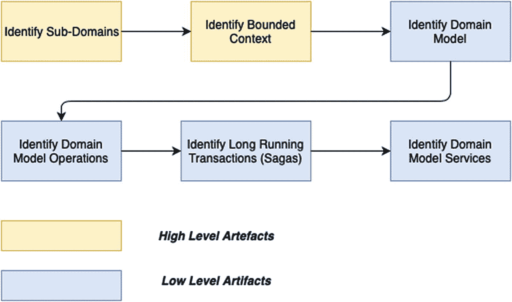

图 2-1

我们有界环境中的聚合

## 货物跟踪器:子域/有界上下文

为了识别货物核心领域/问题空间中的各个子域，我们将该领域划分为多个业务领域，每个业务领域被归类为一个子域。

在货物跟踪领域，我们有四个主要业务领域:

*   ***订舱***–该区域涵盖货物订舱的所有方面，包括以下内容:
    *   货物预订

    *   给货物分配路线

    *   货物的变更(例如，预订货物目的地的变更)

    *   取消货物

*   ***路线***–该区域涵盖货物行程的所有方面，包括以下内容:
    *   基于路线规格的货物最优路线分配

    *   承运货物的承运人的航程维护(例如，增加新航线)

*   ***搬运***——随着货物沿着其指定路线前进，需要在各个转运港进行检查/搬运。该区域涵盖所有与货物装卸活动相关的操作。

*   ***跟踪***–客户需要其预订货物的全面、详细和最新信息。跟踪业务领域提供了这种能力。

这些业务领域中的每一个都可以归类为 DDD 范式中的子领域。虽然识别子域是问题空间识别的一部分，但我们也需要它们的解决方案。正如我们在前一章所看到的，我们使用了有界环境的概念。有界上下文是我们主要问题空间的设计解决方案，每个有界上下文可以有一个或多个映射到它的子域。

对于我们所有的实现，我们假设每个有界上下文被映射到一个子域。

捕获子域的需求与您在构建应用时打算遵循的架构风格无关，无论是整体式应用还是基于微服务的应用。捕获子域的想法是为了确保在练习结束时，我们已经清楚地将核心域划分为不同的业务领域，这些业务领域是独立的，并且可以在特定的业务领域/子域中拥有自己的可识别的业务语言。

图 2-2 将我们的货物跟踪核心域的各个子域显示为一个整体中的模块，也就是说，有界上下文被解决为模块。

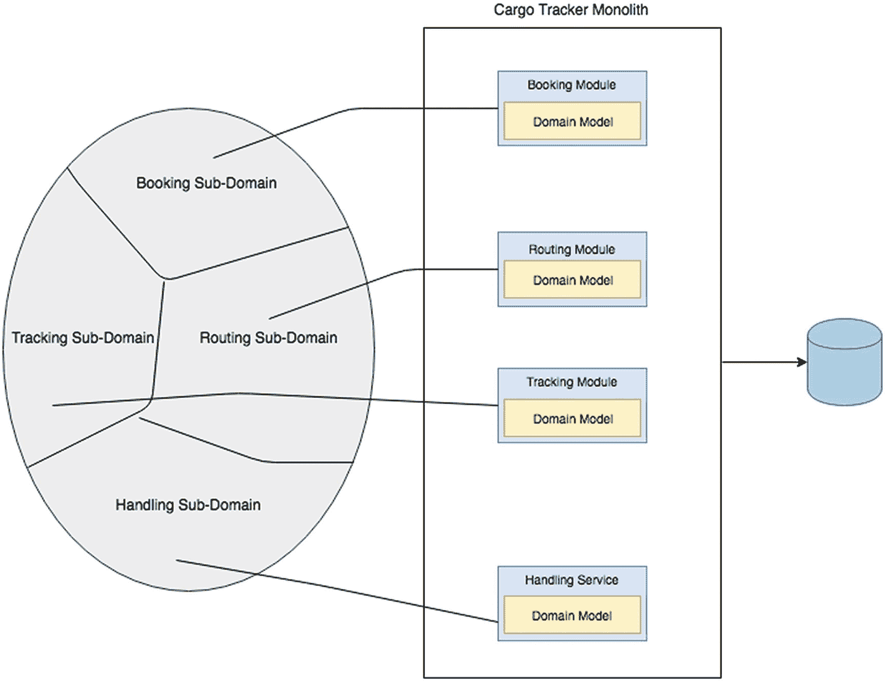

图 2-2

货物跟踪器应用的子域作为一个整体中的独立模块

图 2-3 将我们的货物跟踪核心域的各个子域显示为独立的微服务，也就是说，有界上下文被解决为微服务。

图 2-3

货物跟踪器应用的子域作为独立的微服务

***这些子域*** 的设计解决方案是通过 ***有界上下文*** 完成的，这些上下文或者被部署为单片架构 中的 ***模块，或者被部署为我们基于微服务的架构中的 ***单独的微服务。******

为了总结这一部分，使用 ***业务领域*** 的概念，我们 ***将我们的核心域*** 划分成多个子域，并且 ***将有界上下文识别为它们的解决方案*** 。根据我们正在开发的解决方案的类型，有界上下文的设计是不同的。在整体架构的环境中，它们被 ***实现为模块，*** 而在微服务架构的环境中，它们被 ***实现为独立的微服务*** 。这里要注意的一点是，我们的有界上下文的设计实现是基于我们最初的决定，即每个子域映射一个有界上下文。在某些情况下，在单片架构的情况下，在相同的有界环境中解决多个模块，以及在基于微服务的架构的情况下，在相同的有界环境中解决多个微服务是非常常见和必要的。有界的上下文是最终的解决方案。

下一步是现在用 ***为每个有界上下文*** **捕获域模型。**

## 货物跟踪系统:领域模型

有界上下文的域模型是任何基于 DDD 的架构的基础部分，用于表达有界上下文的业务意图。领域模型的识别包括两组主要的工件:

*   ***核心域模型***——聚合、聚合标识符、实体和值对象

*   ***域模型操作***–命令、查询和事件

### 总计

设计领域模型的最基本和最重要的方面是识别有界上下文 中的 ***集合。聚合定义了有界上下文中的一致性范围，也就是说，聚合由一个根实体和一组实体/值对象组成。您可以将聚合视为一个单元，其中任何操作都会整体更新聚合的状态。聚合负责 ***捕获所有与有界上下文相关的状态和业务规则*** 。***

图 2-4 说明了货物跟踪器的有界上下文中的集合。

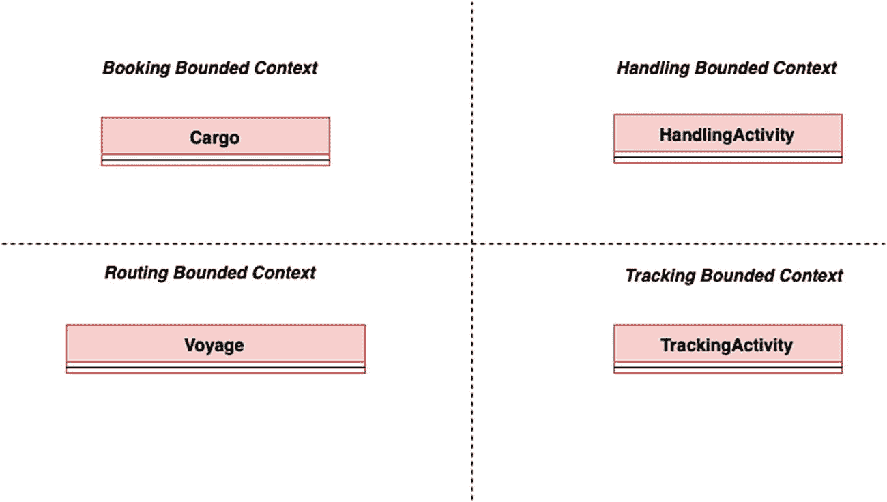

图 2-4

货物跟踪者的有限范围内的集合

聚合的识别有助于建立每个有界上下文的范围。让我们确定每个聚合的聚合标识符。

### 聚合标识符

每个集合需要使用一个 ***集合标识符*** 进行唯一标识。聚合标识符是使用业务密钥实现的。对于货物跟踪器的实现，图 2-5 说明了我们集合的业务关键。

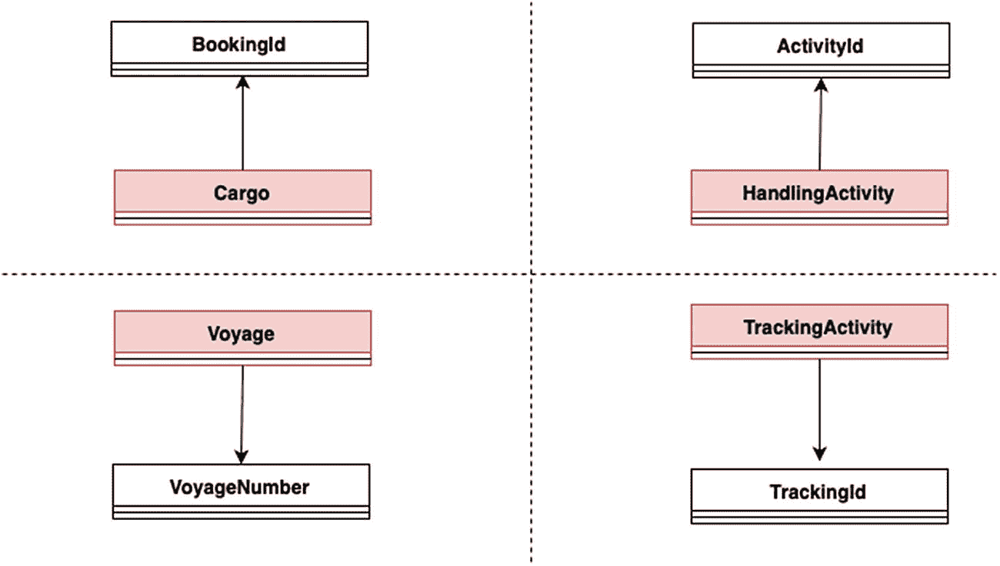

图 2-5

使用业务关键字聚合我们的聚合标识符

每个有界上下文通过一组 ***关联来表达其域逻辑，这些关联通过实体和值对象*** 来实现。让我们在货物跟踪应用中识别这些。

### 实体

有界上下文中的实体有它们自己的身份，但是没有集合就不能存在。除此之外，聚合中的实体不能被替换。让我们看一个例子来帮助定义识别实体的规则。

在货物集合中(预订限制上下文)，作为预订过程的一部分，预订员需要指定货物的来源。这被映射为实体对象，也就是说，位置显然具有其自身的身份，但是没有货物集合也不能独立存在。

图 2-6 展示了我们的有界上下文中的实体对象。识别实体的经验法则是确保它们有自己的身份，并且不能在聚合中被替换。

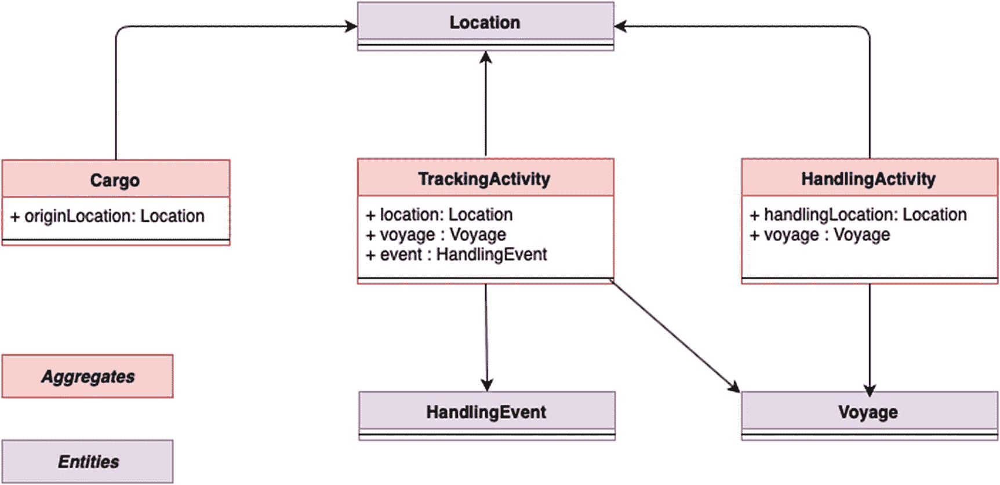

图 2-6

我们实体的一个例子

### 价值对象

有界上下文中的值对象没有自己的标识，在聚合的任何实例中都是可替换的。

让我们看一个例子来帮助定义识别值对象的规则。

货物集合具有以下值对象:

*   ***货物的预订金额*** 。

*   ***路线规格*** (始发地、目的地、目的地到达截止日期)。

*   根据路线规格将货物分配到的 ***路线*** 。路线由多段 ***路程*** 组成，货物可能会通过这些路程到达目的地。

*   ***货物的交付进度*** 对照其指定的路线规格和路线。交付进度提供了关于 ***路线状态、运输状态、货物的当前航程、货物的最后已知位置、下一预期活动以及货物上发生的最后活动的细节。***

让我们浏览一下场景和基本原理，为什么我们将它们作为值对象而不是实体，因为这是一个 ***重要的领域建模决策*** :

*   当一个新的货物被预订，我们将有 ***一个新的路线规格*** 、 ***一个空货物行程、*** 和 ***没有交货进度*** 。

*   当货物被分配一个行程单时， ***空载货物行程单*** 被一个 ***已分配货物行程单替代。***

*   当货物作为其行程的一部分通过多个港口时， ***交货*** 进度在货物集合内被更新和替换。

*   最后，如果客户选择更改货物的交货地点或交货截止日期， ***路线规格更改*** ，将分配一个 ***新的货物路线*** ，重新计算 ***交货，*** 和 ***预订金额更改。***

它们有 ***没有自己的身份，*** 并且它们在货物集合体中是 ***可替换的，因此被建模为价值对象。*** 那是识别值对象的 ***经验法则。***

图 2-7 展示了添加值对象后货物集合的完整类图。

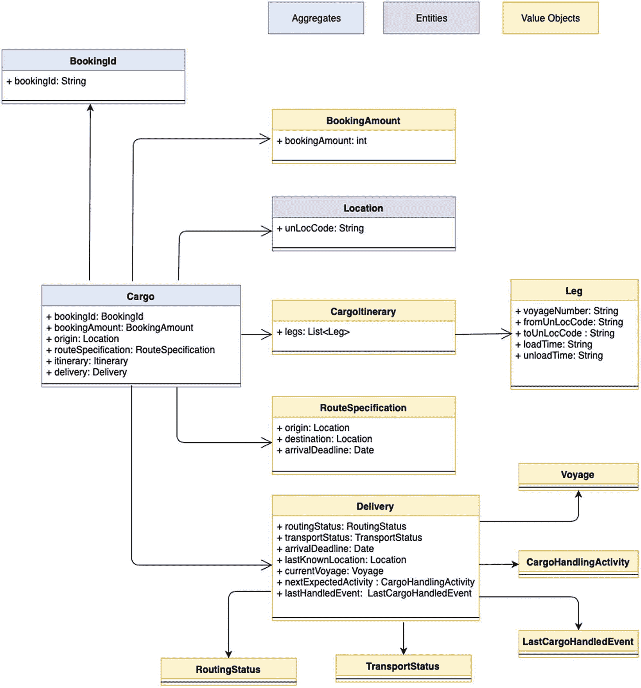

图 2-7

货物总分类图

让我们看看其他聚合的简化类图，从处理活动开始(图 2-8 )。

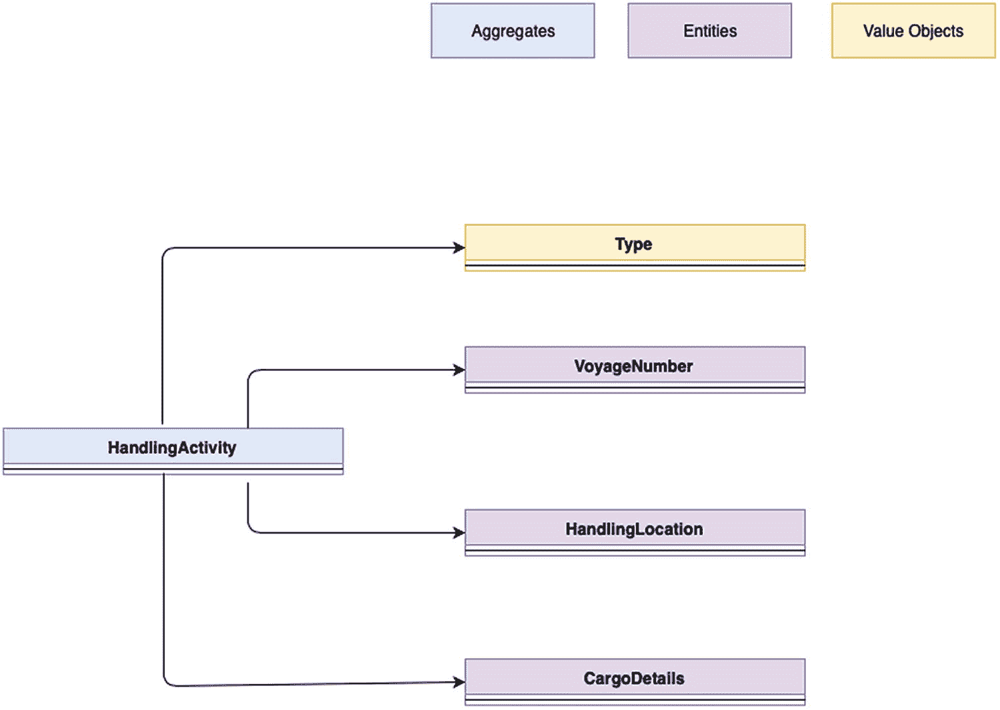

图 2-8

处理活动类图

图 2-9 显示了航行总量。

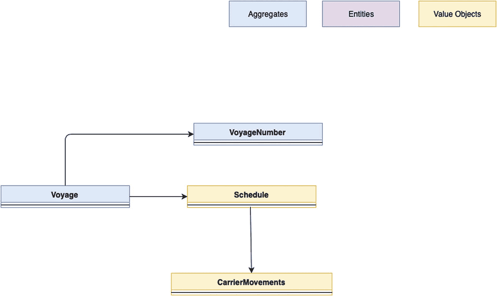

图 2-9

航次总分类图

最后，图 2-10 显示了跟踪活动。

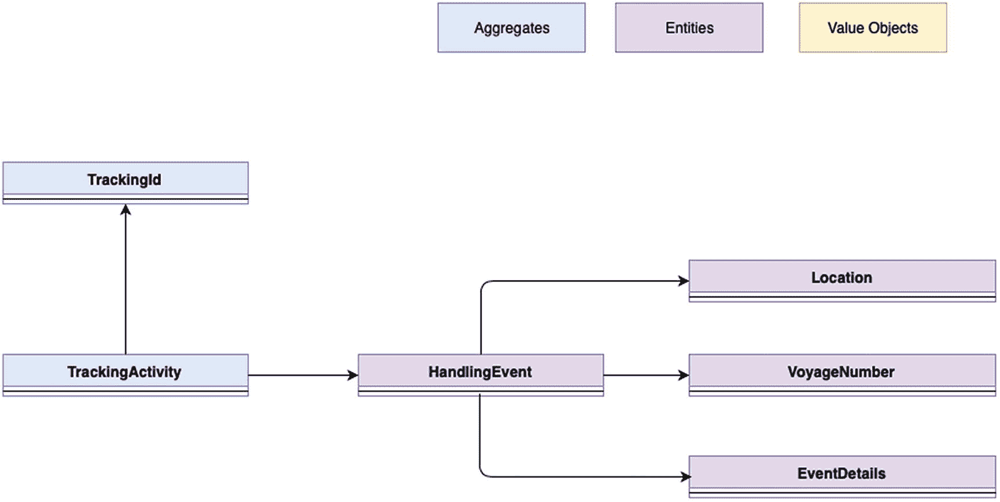

图 2-10

跟踪活动类图

### 注意

*本书的源代码通过包分离展示了核心领域模型。您可以在* [`www.github.com/apress/practical-ddd-in-enterprise-java`](http://www.github.com/apress/practical-ddd-in-enterprise-java) 查看源代码，更清楚地了解领域模型内的对象类型。

## 货物跟踪:领域模型操作

我们已经概述了货物跟踪器的有界上下文，并为它们中的每一个列出了核心域模型。下一步是捕获发生在有界上下文中的域模型操作。

有界上下文中的操作可能是

*   ***命令*** 请求有界上下文内的状态改变

*   ***查询*** 请求有界上下文的状态

*   ***事件*** 通知有界上下文的状态变化

图 2-11 说明了有界上下文中的系统操作。

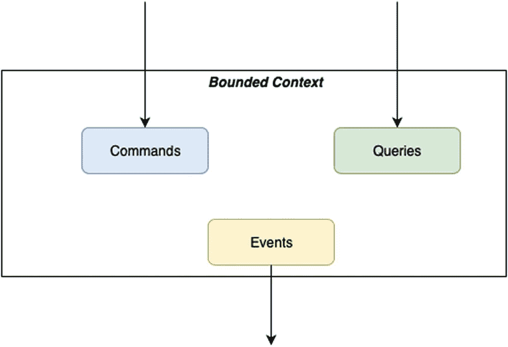

图 2-11

有界环境中的系统操作

图 2-12 说明了我们的货物跟踪器的有界上下文的域模型操作。

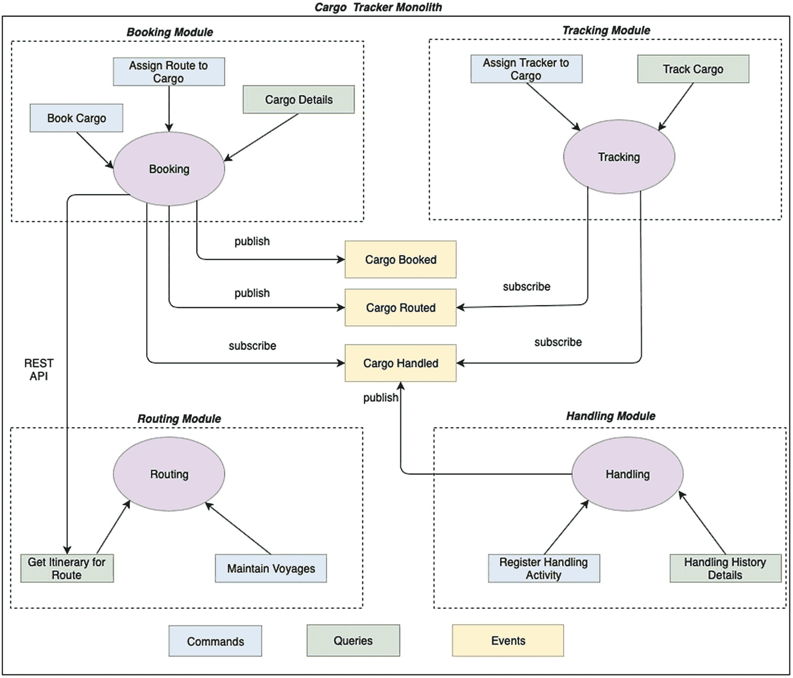

图 2-12

我们的货物跟踪器的有界上下文的域模型操作

## 萨迦

当我们采用微服务架构风格开发应用时，主要使用 Sagas。微服务应用的分布式本质要求我们实现一种机制来维护可能跨越多个微服务的用例的数据一致性。传奇帮助我们实现这一点。传奇可以通过两种方式实现，要么通过 ***事件编排*** ，要么通过 ***事件编排:***

*   基于编排的传奇的实现很简单，因为参与特定传奇的**微服务**将直接发起和订阅事件。

*   On the other hand, in orchestration-based Sagas, the lifecycle coordination happens through a central component. This central component is responsible for Saga creation, coordination of the flow across the various Bounded Contexts participating in the Saga, and finally the Saga Termination itself.

    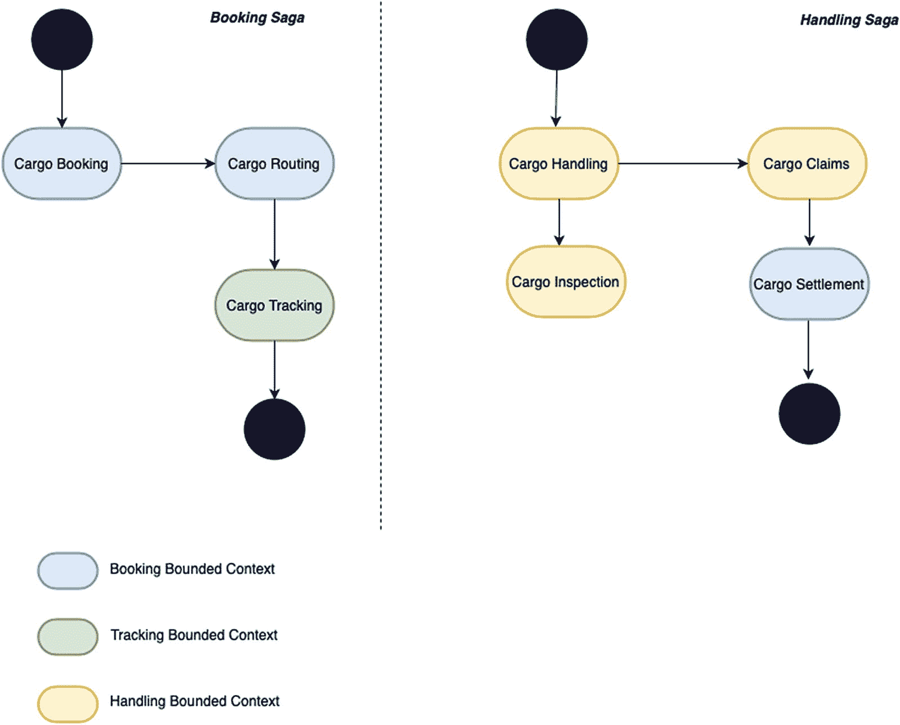

    图 2-13

    货物跟踪应用中的 Sagas

图 2-13 展示了货物跟踪应用中的几个故事。

订舱传奇包括货物订舱、货物运输路线和货物跟踪中的业务操作。它从货物被预订到其后续路线开始，最后以分配给预订货物的跟踪标识符结束。客户使用该跟踪标识符来跟踪货物的进度。

装卸传奇包括货物装卸、检验、索赔和最终结算中的业务操作。它始于货物在港口的处理，货物在港口经过一次航行，并在最终目的地被客户认领，止于货物的最终结算(例如，延迟交货的罚款)。

这两个传奇都跨越多个受限的上下文/微服务，并且在传奇结束时，需要在所有这些受限的上下文中维护事务一致性。

## 领域模型服务

使用域模型服务有两个主要原因。首先是通过 定义好的接口使 ***有界上下文的域模型*** 对外部方 ***可用。第二个是与外部方交互，无论是 ***将有界上下文的状态保存到*** 【数据库】， ***将有界上下文的状态改变事件发布到外部*** 消息代理，还是与其他有界上下文通信。***

对于任何有界的上下文，有三种类型的域模型服务:

*   ***入站服务*** 其中我们实现了定义良好的接口，使外部各方能够与域模型进行交互

*   ***出站服务*** 在这里，我们实现了与外部存储库/其他有界上下文的所有交互

*   ***应用服务*** ，它充当域模型与入站和出站服务之间的外观层

图 2-14 说明了货物跟踪单块中的一组域模型服务。

图 2-14

货物跟踪单块中的域模型服务

图 2-15 展示了货物跟踪微服务中的一组域模型服务。与 monolith 不同，微服务不提供本地 web 界面。

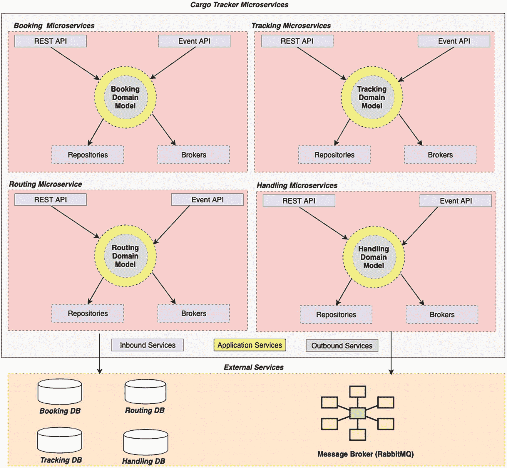

图 2-15

货物跟踪微服务中的领域模型服务

## 领域模型服务设计

那么我们如何设计这些服务呢？我们可以遵循哪种架构模式来实现这些支持服务？

六边形架构模式非常适合帮助我们建模/设计和实现域模型支持服务。图 2-16 图示六边形建筑格局。

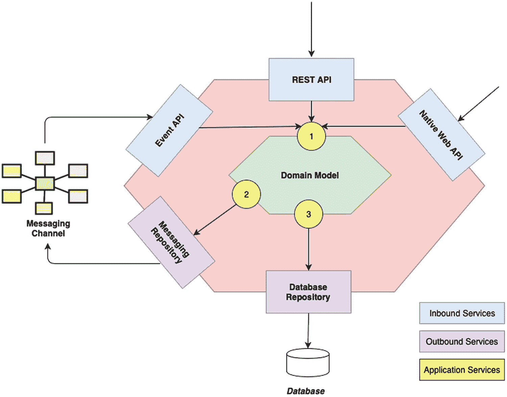

图 2-16

六边形建筑模式

六边形架构使用 ***端口和*** 适配器的概念来实现域模型服务。让我们稍微扩展一下这个概念。

六边形架构模式中的端口可以是入站端口或出站端口:

*   入站端口为我们的域模型的业务操作提供了一个接口。这通常是通过应用服务实现的。看(1)。

*   出站端口为我们的域模型所需的技术操作提供了一个接口。域模型使用这些接口来存储或发布来自子域的任何类型的状态。看(2)和(3)。

六边形架构模式中的适配器可以是一个 ***入站适配器，也可以是一个出站适配器:***

*   入站适配器使用入站端口为外部客户机提供使用域模型的能力。这些是通过 REST API、本地 Web API 或事件 API 实现的。

*   出站适配器是特定存储库的出站端口的实现。看看下面的出站适配器。

总而言之，“领域模型”需要一组支持服务，也称为“领域模型服务”这些支持服务使外部客户能够使用我们的域模型，同时也使域模型能够在多个存储库中存储和发布子域的状态。

这些支持服务使用六边形架构模式建模，其中这些服务被映射为“入站/出站端口”或“入站/出站适配器”六边形架构模式使得“领域模型”能够独立于这些支持服务。

这就完成了我们针对 DDD 的**设计流程。我们为我们的问题空间计算出了 ***子域/有界上下文*** ，为每一个有界上下文 细化出了 ***域模型，细化出了在有界上下文内发生的 ***域模型操作*** ，最后得出了域模型所需的 ***域模型支持服务*** 。*****

 **无论我们是要遵循微服务架构还是基于整体架构的架构，都要遵循这个设计流程。当我们开始使用企业 Java 空间中可用的工具和技术实现前面确定的 DDD 工件时，我们将扩展设计过程并获得更多的细节。

## 货物跟踪系统:DDD 实施

接下来的章节将详细描述我们之前识别的 DDD 工件的货物跟踪应用的实现。

作为实施的一部分，我们将设计和开发货物跟踪应用:

*   作为一个总部设在 DDD 的利用 Jakarta EE 平台的整体

*   作为一个基于 DDD 的微服务应用，它利用了 Eclipse MicroProfile 平台

*   作为一个基于 DDD 的利用 Spring Boot 平台的微服务应用

*   作为一个基于 DDD 的微服务应用，使用 Axon 框架

让我们朝着货物跟踪器作为一个整体的第一个实现前进。

## 摘要

总结我们的章节

*   我们对货物跟踪参考应用进行了概述，并确定了应用的子域/有界上下文。

*   我们清除了货物跟踪器的核心域模型，包括集合、实体和价值对象的标识。我们还建立了与货物跟踪应用相关的领域模型操作和 Sagas。

*   我们通过使用六边形架构模式来确定货物跟踪器的域模型所需的域模型服务，从而结束了这一章。**