# 三、货物跟踪器：Jakarta EE

我们现在已经有了一个为任何应用建模各种 DDD 工件的过程，并为货物跟踪应用详述了同样的过程。

快速回顾一下

> *我们将货物跟踪确定为主要问题空间/核心领域，并将货物跟踪应用作为解决这一问题空间的解决方案。*

> 我们确定了货物跟踪应用的各种子域/有界上下文。

> 我们详细描述了每个有界上下文的域模型，包括集合、实体、值对象和域规则的标识。

> 我们确定了有界环境中所需的支持领域服务。

> 我们在有限的上下文中确定了各种操作(命令、查询、事件和故事)。

这结束了我们 DDD 之旅的建模阶段，我们已经准备好了开始实施阶段的所有细节。

我们的书介绍了四个独立的 DDD 实现，并以 Enterprise Java 作为开发这些实现的基础:

*   使用 Java EE 8/Jakarta EE 的整体实现

*   基于 Eclipse MicroProfile 的微服务实现

*   一种基于 Spring Boot 的微服务实现

*   基于使用 Axon 框架的纯播放命令/查询责任分离(CQRS)/事件源(es)设计模式的微服务实施

企业 Java 环境提供了一个巨大的工具、框架和技术生态系统，它将帮助我们实现前面章节中概述的 DDD 概念。

本章详细介绍了我们的货物跟踪应用的第一个 DDD 实现，它使用 Java EE 8 平台作为实现的基础。Cargo Tracker 应用将被设计成一个模块化的整体，我们将把 DDD 工件映射到 Java EE 8 平台中可用的相应实现。

首先，这里是 Java EE 平台的概述。

## Java EE 平台

近 20 年来，Java EE(企业版)平台一直是企业应用开发的标准。该平台提出了一组规范，涵盖了企业以可伸缩、安全、健壮和标准的方式构建应用所需的一系列技术能力。

该平台的目标是简化开发人员的体验，使他们能够构建业务功能，同时该平台通过使用应用服务器实现规范来完成系统服务的繁重工作。

在 Oracle 的领导下，该平台得到了广泛的认可和广泛的社区参与，并有近 15 家供应商实现了各种规范。该平台的当前版本是 Java EE 8，Oracle GlassFish Application Server v . 5.0 提供了参考应用。

## 更名为 Jakarta EE 和前进的道路

2017 年，Oracle 在 IBM 和 Red Hat 的支持下，决定将 Java EE 源代码转移到 Eclipse Foundation 的一个新项目**EE4J(Eclipse Enterprise for Java)**下。该运动的目的是创建一个更灵活的治理过程，以更快的发布节奏来跟上企业空间中快速发展的技术前景。

EE4J 是 Eclipse Foundation 中的一个顶级项目，所有的 Java EE 源代码、参考实现和 tck(技术兼容性工具包)都被转移到这个项目中。Jakarta EE 平台是 EE4J 下的一个项目，旨在成为未来的平台，取代当前的 Java EE 平台。

> *简而言之，所有新的规范发布或维护规范发布现在都将在 Jakarta EE 上进行，Java EE 8 将是该平台的最后一个版本。*

Jakarta EE 已经看到了众多供应商加入工作委员会的巨大势头，旨在实现栈的现代化，使其与传统企业应用相关，同时与基于云原生/微服务的新架构保持一致。

Jakarta EE 平台的第一个版本旨在成为 Java EE 8 平台的精确复制品，主要关注 Oracle 和 Eclipse Foundation 之间各种规范的传输过程。新 Jakarta EE 平台品牌下的第一个参考实现已经发布为 Eclipse GlassFish 5.1，它被认证为 Java EE 8 兼容。

本章将重点介绍兼容 Java EE 8 的 GlassFish 版本，以及 Jakarta EE 平台上的第一个版本——Eclipse GlassFish 5.1。我们在这一章的目的是在基于传统整体架构风格的货物跟踪参考应用中实现 DDD 概念。

让我们深入了解一下规格。

## Jakarta EE 平台规范

Jakarta EE(基于 Java EE 8)规范非常广泛，旨在提供企业构建应用所需的一组标准功能。规范在多个版本中不断发展，功能作为新规范或维护规范被添加或修改。

规格分为两种配置文件——完整配置文件或 Web 配置文件。引入概要文件的概念是为了对应用所需的功能进行分类。对于纯 web 应用，Web Profile 规范提供了所需的一组功能(Java 持久性 API [JPA]、上下文和依赖注入[CDI]、用于 RESTful Web 服务的 Java API[JAX-RS])，而对于可能需要消息传递功能或具有遗留应用集成需求的大型复杂应用，完整的配置文件提供了额外的功能。

就我们的目的而言，Web Profile 足以帮助我们以整体架构风格实现 Cargo Tracker，因此我们将只扩展那组规范。

Jakarta EE 的 Web Profile 规范集(基于 Java EE 8)如图 3-1 所示，按其覆盖的区域分组。访问这些规范的官方网址是 [`www.oracle.com/technetwork/java/javaee/tech/index.html`](http://www.oracle.com/technetwork/java/javaee/tech/index.html) 。


图 3-1

Jakarta EE 的 Web 概要规范(基于 Java EE 8)

### Web 应用技术

Web 应用技术代表了 Jakarta EE 平台中的所有规范，包括

*   HTTP 协议请求/响应处理能力

*   HTML 组件来构建基于浏览器的瘦客户端应用

*   JSON 数据处理能力

#### 小服务程序

Servlets 本质上接收 HTTP(s)请求，处理它们，并将响应发送回客户机，客户机通常是 web 浏览器。servlet 规范是自 Java EE 1.0 以来最重要的规范之一，是 web 应用的基础技术。

许多 web 框架(例如 JavaServer Faces [JSF]，Spring Model View Controller [MVC])使用 servlet 作为基础工具包，并抽象它们的用法，也就是说，在使用 web 框架时，直接使用 servlet 是很少见的。

在 Java EE 8 中，该规范的最新版本是 Servlet 4.0，它为 Servlet API 引入了一个主要特性——支持 HTTP/2。传统的 HTTP 请求只有一个请求/响应，而使用 HTTP/2，您可以有一个请求，但服务器可以选择同时提供多个响应，从而优化资源并改善用户体验。

#### JavaServer Faces

JavaServer Faces 提供了一种基于组件的方法来构建 web 应用。基于服务器端呈现方面，它实现了众所周知的 MVC 模式和清晰的分离。视图通常基于 JSF 的 Facelets 模板技术，模型使用 JSF 支持 Beans 构建，控制器构建在 Servlet API 之上。

由于其坚实的设计原则和规范的稳定性，JSF 得到了广泛的采用，并一直被列为企业客户为其 web 应用采用的顶级 web 框架之一。存在多种实现，包括 Oracle 的 ADF Faces、PrimeFaces 和 BootsFaces。

该规范的最新版本是 JavaServer Faces 2.3。

#### JavaServer 页面

JavaServer Pages (JSP)是在创建 Java EE 平台时提出的第一种视图技术。JSP 在运行时被翻译成 servlets，帮助在 Java web 应用中创建动态 web 内容。由于优先选择 JSF 作为 Java web 应用的 UI 技术，JSP 不再被广泛使用，并且规范已经很长时间没有更新了。

该规范的最新版本是 JavaServer Pages 2.3。

#### 表达语言

表达式语言(EL)规范有助于访问和操作数据。这被多个规范使用，包括 JSP、JSF 和 CDI。EL 非常强大，被广泛采用。最新的改进包括支持 Java 8 中引入的 lambda 表达式。

该规范的最新版本是 EL 3.0。

#### JSP 标准标记库(JSTL)

JSTL 提供了一组可以在 JSP 页面中使用的实用程序标签。这些实用程序标签涵盖了迭代/条件/SQL 访问等任务。自从 JSF 出现后，该规范已经有一段时间没有更新了，也不再被广泛使用。

该规范的当前版本是 1.2。

#### WebSocket 的 Java API

提供该规范是为了在 Java web 应用中集成 WebSockets。该规范详细描述了一个 API，它涵盖了 WebSockets 的服务器端和客户端实现。

该规范在 Java EE 8 中进行了维护，最新版本是 1.1。

#### JSON 绑定的 Java API

Java EE 8 中引入的一个新规范，它详细描述了一个 API，该 API 提供了一个绑定层来将 Java 对象转换为 JSON 消息，反之亦然。

该规范的第一个版本是 1.0 版。

#### 用于 JSON 处理的 Java API

这个规范提供了一个 API，可以用来访问和操作 JSON 对象。Java EE 8 中规范的最新版本是一个主要版本，有各种增强，比如 JSON 指针、JSON 补丁、JSON 合并补丁和 JSON 收集器。

该规范的当前版本是 1.1 版。

### 企业应用技术

企业应用技术代表了 Jakarta EE 平台中的所有规范，包括

*   构建企业业务组件

*   业务组件依赖管理/注入功能

*   验证功能

*   事务管理

*   ORM(对象关系映射)功能

#### 企业 Java bean(3.2)

从 Java EE 平台的 v. 1.0 开始，Enterprise JavaBean s(EJB)就提供了一种为企业应用实现服务器端业务逻辑的标准方法。EJB 将开发人员从一堆基础设施问题(例如，事务处理、生命周期管理)中抽象出来，允许他们只关注业务逻辑。作为最受欢迎的规范之一，它确实存在使用起来过于复杂和笨重的问题。该规范经历了重大的转变，去掉了这些标签。作为该规范的最新版本，它为构建业务对象提供了一个极其简单和精简的编程模型。

该规范的最新版本是 3.2 版。

#### Java 的上下文和依赖注入(2.0)

CDI 是在 Java EE 规范中引入的，通过注入来构建组件并管理其依赖关系。引入该规范是为了将 EJB 限制在外围基础设施的职责上，同时用 CDI Beans 编写核心业务逻辑。随着平台的最新发布，这些基础设施问题现在也可以在 CDI Beans 中编写。CDI 现在已经成为该平台几乎所有其他部分的基础技术，而 EJB 正慢慢地被挤出人们的视线。该规范在 Java EE 8 中发布了一个主要版本，支持异步事件、观察者排序和与 Java 8 流的对齐。

CDI 最强大的方面之一是它提供的扩展框架，用来创建标准规范集目前不支持的功能。

这些能力可能包括以下内容:

*   与新的消息代理(例如 Kafka)集成

*   与非关系型数据存储集成(例如，MongoDB、Cassandra)

*   与新时代云基础架构的集成(例如，AWS S3、Oracle 对象存储)

一些知名的 CDI 扩展包括 Apache DeltaSpike ( [`https://deltaspike.apache.org/`](https://deltaspike.apache.org/) )和 Arquillian ( [`http://arquillian.org/`](http://arquillian.org/) )。

该规范的最新版本是 2.0 版。

#### Bean 验证

该规范提供了一个 Java API 来实现应用中的验证。该规范在 Java EE 8 中有一个主要版本，支持新类型的验证，集成了新的 Java Time API，等等。

该规范的最新版本是 2.0 版。

#### Java 持久性 API (JPA)

该规范提供了一个 Java API 来实现 Java 对象和关系数据存储之间的 ORM(对象关系映射)工具。这是一个比较流行的规范，它被广泛采用并有多种实现，其中最著名的是 Hibernate。

该规范的最新版本是 2.2 版。

#### Java 事务 API (JTA)

该规范提供了一个 Java API 来实现应用中的编程事务功能。API 支持跨多个存储库的分布式事务，这对于需要高事务一致性的 monolith 来说是最重要的方面之一。

该规范的最新版本是 1.2 版。

#### 常见注释

该规范提供了一组注释或标记，帮助容器执行常见任务(例如，资源注入、生命周期管理)。

该规范的最新版本是 1.3 版。

#### 拦截器

该规范帮助开发人员在相关的托管 bean(EJB、CDI)上编写拦截器方法。拦截器通常用于集中式横切关注点，比如审计和日志记录。

该规范的最新版本是 1.2 版。

### Jakarta 的网络服务

Web 服务技术代表了 Jakarta EE 平台中涵盖构建企业 REST 服务的所有规范。目前，有一个主要的 API。

#### 用于 RESTful Web 服务的 Java API(JAX-RS)

该规范为开发人员实现 RESTful web 服务提供了一个标准的 Java API。另一个流行的规范，该规范的最新版本发布了一个主要版本，支持反应式客户端和服务器端事件。

该规范的最新版本是 2.1 版。

### 安全技术

安全技术代表了 Jakarta EE 平台中涵盖保护企业业务组件的所有规范。

#### Java EE 安全 API (1.0)

Java EE 8 中引入的新规范，为以用户管理为中心的安全实现提供了标准的 Java API。为身份验证管理、身份存储交互和安全上下文实现(检索用户信息)引入了新的 API。

### Jakarta EE 规范摘要

这就完成了我们对基于 Java EE 8 的 Jakarta EE 平台规范的高级概述。可以看出，这些规范非常全面，提供了构建企业应用所需的几乎所有功能。该平台还提供了扩展点，以防它不能满足企业的任何特定需求。

最重要的一点是，这些是由多个供应商支持的标准规范，以遵守这些标准。这为企业选择部署平台提供了极大的灵活性。

随着新的治理结构在 Eclipse Foundation 下就位，该平台正在为正在构建的下一代企业应用做准备。

## 作为模块化整体的货物跟踪器

很长一段时间以来，整体架构风格一直是企业项目的基础。

单片架构的主要关注点如下:

*   强大的事务一致性

*   更易维护

*   集中式数据管理

*   分担责任

随着最近微服务的出现，单片架构的压力无疑越来越大。微服务架构风格在应用的开发、测试和部署方面为团队提供了高度的独立性；但是，在您开始拆除一个整体并将它转移到基于微服务的架构之前，需要采取适当的措施。微服务本质上是分布式系统，这反过来需要在自动化、监控和一致性妥协方面的大量投资。单片对于复杂的商业应用有相当大的价值。

然而，通过借用微服务的概念，尤其是在构建单片应用的领域，单片的架构方法已经发生了变化。这是 DDD 发挥核心作用的地方。我们已经看到，有界上下文帮助我们将特定领域的业务能力划分为独立的" ***"解决方案领域。*** “将这些有界的上下文构建为一个整体中的独立模块，并使用域事件在它们之间进行通信，这有助于我们实现松散耦合，从而实现“**”或称为“ ***模块化整体。*****

 **走“ ***真正模块化*** ”或“ ***模块化单片*** ”之路的优势是，使用 DDD 有助于我们获得拥有单片架构的好处，同时有助于保持一定程度的独立性，这有助于我们在需要时过渡到微服务。

在前面的章节中，我们已经为我们的 Cargo Tracker 应用划分出了我们的业务能力/子域，并用有限的上下文解决了它们。在这一章中，我们将把货物跟踪器应用构造成一个模块化的整体，每个有界的上下文被建模成一个独立的模块。

图 3-2 显示了有界上下文到货物跟踪单块中相应模块的映射。

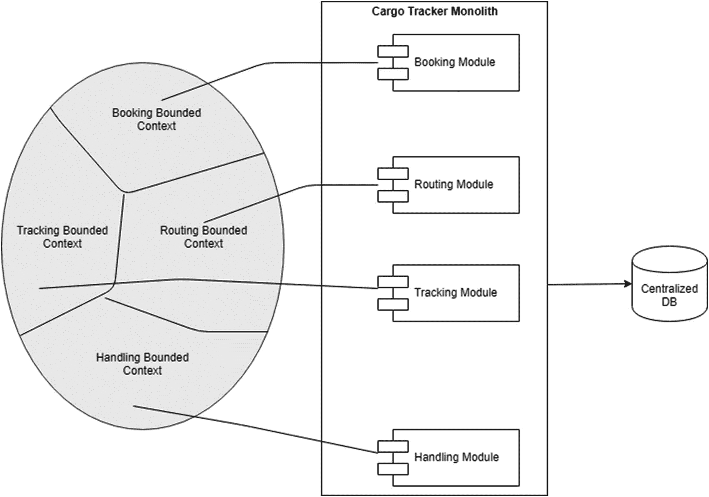

图 3-2

作为集中数据库上的货物跟踪模块的有界上下文

随着一系列规范的概述和我们对 Cargo Tracker 作为基于 DDD 的模块化整体架构的意图的明确，让我们继续在 Java EE 平台上实现它。

### 具有 Jakarta EE 的有界上下文

有界的上下文是我们的货物跟踪单块的 DDD 实现的解决方案阶段的起点。每个有界的上下文都将被构造成一个模块，作为它自己独立的可部署的工件。

Cargo Tracker monolith 的主要部署工件将是一个标准的 WAR (Web Archive)文件，它将被部署到一个应用服务器(Eclipse GlassFish)上。如前所述，应用服务器为 Jakarta EE 规范的特定版本(在本例中是 Java EE 8)提供了一个实现。每个有界上下文的部署工件将是一个标准的 JAR (Java Archive)文件，它将被捆绑在 WAR 文件中。

这个 WAR 文件将包含一组 JAR 文件，每个 JAR 文件代表模块/有界上下文。部署架构如图 3-3 所示。

实现有界上下文包括将我们的 DDD 工件逻辑分组到一个可部署的工件中。逻辑分组包括识别一个包结构，我们将各种 DDD 工件放置在这个包结构中，以实现我们对有界上下文的整体解决方案。也就是说，我们不专门使用任何特定的 Java EE 规范来实现有界上下文。我们只是在有限的上下文中为我们的 DDD 工件识别一个良好识别的包结构。

封装结构需要反映我们在第二章中布局的六边形架构(图 2-16 )。

图 3-3 显示了我们的任何有界上下文的包结构。

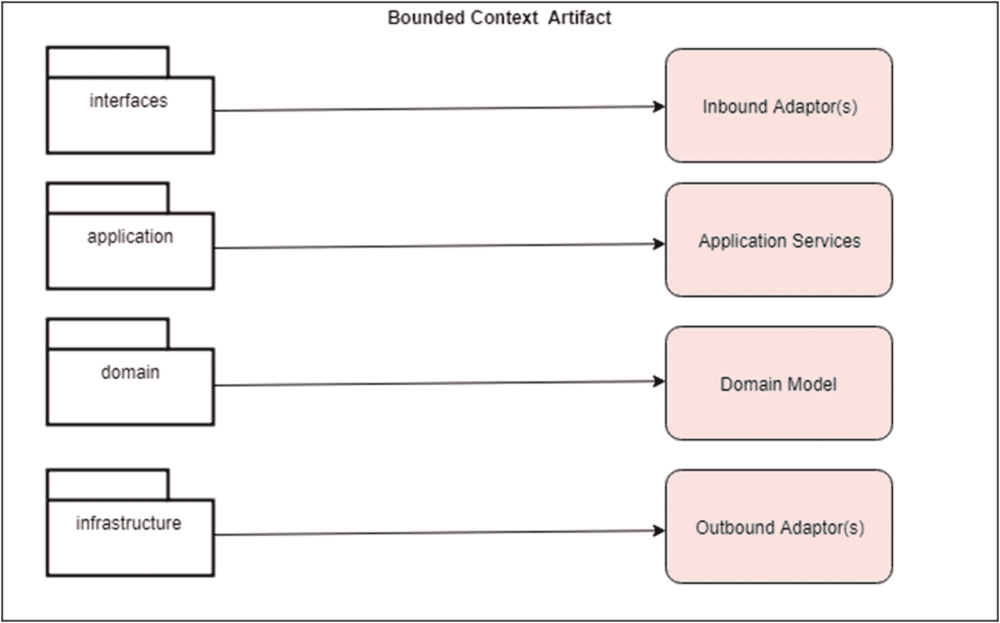

图 3-3

有界上下文的包结构

让我们扩展一下包的结构。

#### 接口

这个包包含一个有界上下文提供的所有可能的入站服务，按协议分类。

它们有两个主要目的:

*   代表域模型的协议协商(例如，REST API、Web API、WebSocket、FTP)

*   数据的视图适配器(例如，浏览器视图、移动视图)

例如，预订有界上下文提供多种类型的服务。一个例子是货物跟踪应用中的本地 UI 的 Web API，用于为客户预订货物/修改货物以及货物列表。类似地，处理有界上下文为由处理移动应用消费的任何种类的处理操作提供 RESTful API。所有这些服务都是“接口”包的一部分。

包装结构如图 3-4 所示。

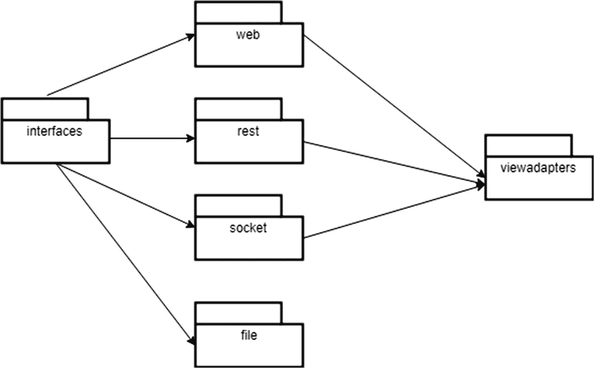

图 3-4

接口的封装结构

#### 应用

这个包包含了一个有界上下文的域模型所需要的应用服务。

应用服务类有多种用途:

*   充当输入接口和输出库的端口

*   命令、查询、事件和 Saga 参与者

*   交易启动、控制和终止

*   底层领域模型的集中关注点(例如，日志记录、安全性、指标)

*   数据传输对象转换

*   对其他有界上下文的标注

包装结构如图 3-5 所示。

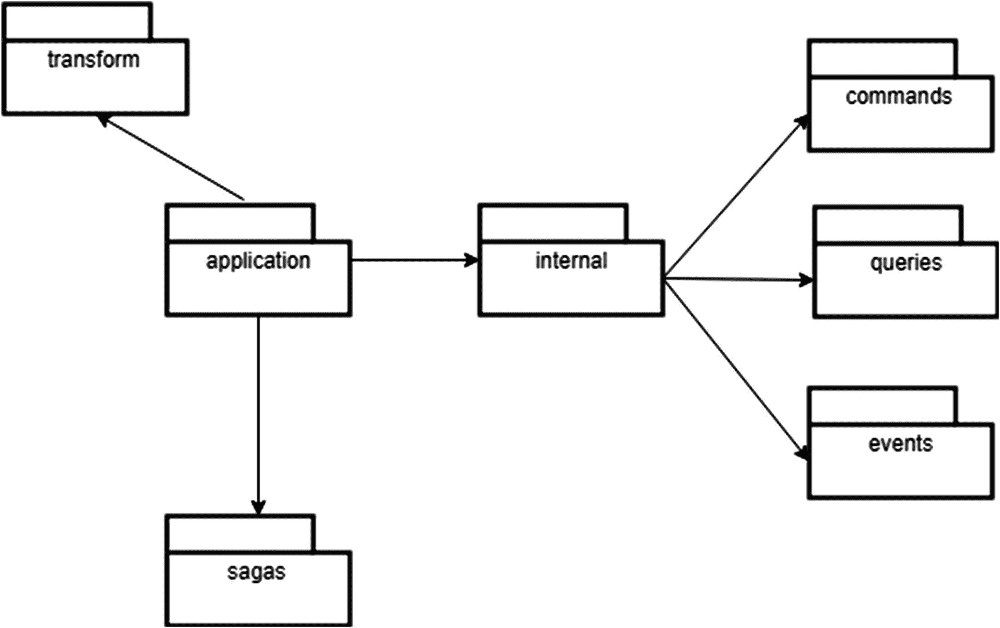

图 3-5

应用服务的包结构

#### 领域

这个包包含有界上下文的域模型。

以下是我们的有界上下文的核心类:

*   总计

*   实体

*   价值对象

*   域规则

包装结构如图 3-6 所示。

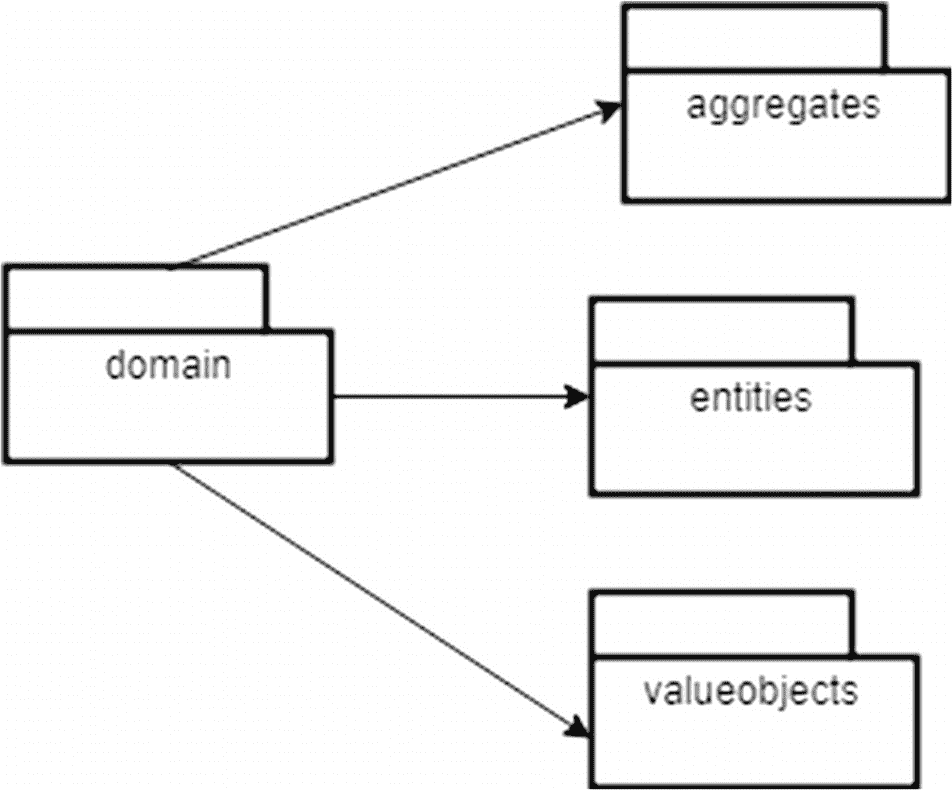

图 3-6

我们的领域模型的包结构

#### 基础设施

该包包含有界上下文的域模型所需的基础设施组件，以与任何外部存储库(例如，关系数据库、NoSQL 数据库、消息队列、事件基础设施)进行通信。

包装结构如图 3-7 所示。


图 3-7

基础设施组件的包装结构

#### 共享内核

有时候，领域模型可能需要在多个有界的上下文中共享。DDD 的共享内核为我们提供了一个健壮的机制来共享领域模型，减少了重复代码的数量。共享内核更容易在一个整体中实现，而不是基于微服务的应用，后者提倡更高水平的独立性。

这确实带来了相当程度的挑战，尽管多个团队需要就领域模型的哪个方面需要在有限的上下文中共享达成一致。

在我们的例子中，在 Cargo Tracker monolith 中，我们将保存由共享内核中的各种有界上下文引发的所有事件(package–events . CDI)。

这如图 3-8 所示。


图 3-8

包含所有 CDI 事件的共享基础架构

现在，我们已经将有界的上下文按照模块整齐地分组到一个包结构中，并且关注点明确分离。

### 用 Jakarta EE 实现领域模型

我们的核心域模型是我们的有界上下文的中心特征，并且如前所述，有一组与之相关的工件。这些工件的实现是在 Java EE 提供的工具的帮助下完成的。

简单总结一下，我们需要实现的领域模型工件如下:

*   总计

*   实体

*   价值对象

让我们逐一查看这些工件，看看 Java EE 为我们实现这些工件提供了哪些相应的工具。

#### 总计

聚合是我们领域模型的核心。简单回顾一下，我们在每个有界上下文中有四个聚合，如图 3-9 所示。


图 3-9

我们有界环境中的聚合

聚合的实现包括以下几个方面:

*   聚合类实现

*   领域丰富性(业务属性、业务方法)

*   国家建设

*   状态持久性

*   聚合间引用

*   事件

##### 聚合类实现

为了实现我们的根聚合，我们将使用来自 Java EE 框架的 JPA (Java Persistence API)作为主要工具。我们的每个根聚合类都被实现为一个 JPA 实体。JPA 没有提供特定的注释来将特定的类注释为根聚合，所以我们使用 JPA 提供的标准注释`"@Entity"`。

货根集合体清单 3-1 如下所示:

```java
package com.practicalddd.cargotracker.booking.domain.model.aggregate;

import javax.persistence.Entity;
@Entity // JPA provided annotation
public class Cargo implements Serializable{
@Id
@GeneratedValue
private Long id; // Surrogate Key
@Embedded //To retain domain richness use an Embedded class instead of the direct Java implementation
private BookingId bookingId // Globally unique identifier of the Cargo Root Aggregate (Booking Id)
}

Listing 3-1.Cargo Root Aggregate

```

清单 3-2 显示了`BookingID`集合标识符:

```java
@Embeddable
public class BookingId implements Serializable{
@Column(name="booking_id", unique=true,updateable=false)
private String id;
public BookingId(){
}
public BookingId(String id){
      this.id = id;
}
public String getBookingId(){
return id;
}

Listing 3-2.Booking ID Aggregate Identifier

```

对于我们的聚合标识符实现，我们选择拥有一个技术/代理键(主键)和一个相应的业务键(唯一键)。业务键传达聚合标识符 clear 的业务意图，即新预订货物的预订标识符，并且是向域模型的消费者公开的键。另一方面，技术键是聚合标识符的纯内部表示，对于聚合间引用等用例非常有用。

JPA 为我们提供了`@Id`注释来表示我们的根聚合的主键。

##### 富含结构域的聚集体与贫血的聚集体

DDD 的基本前提是在领域模型中表达和集中领域丰富性，我们的集合构成了我们的领域模型的核心。

聚集应该是领域丰富的，并使用清晰的业务概念传达有界上下文的意图。

一个集合也可能会变得贫血，也就是说，一个只有 getters 和 setters 的集合。这在 DDD 世界被认为是反模式的。

总结

*   贫血的聚集没有给出领域的目的或意图。

*   该模式仅用于捕获属性，在表示数据传输对象而非核心业务对象时最为有用。

*   缺乏活力的聚集导致域逻辑泄漏到周围的服务中，从而污染周围服务的意图。

*   在一段时间内，不完善的聚合会导致不可维护的代码。

我们应该尽可能避免贫血的聚集，并将它们限制在预期的用途上，即纯数据对象。

另一方面，域丰富的聚合，顾名思义，就是**丰富**。它们根据业务属性和业务方法清楚地表达了它们所代表的子领域的意图。让我们在接下来的章节中对此进行更详细的解释。

##### 业务属性覆盖范围

根聚合应该覆盖有界上下文运行所需的所有业务属性。这些属性应该用业务术语而不是技术术语来建模。

让我们看一下我们的货物根集合的例子。

一个货物会有

*   原始位置

*   预订金额

*   路线说明(起点位置/目的地位置/目的地到达期限)

*   旅行路线

*   交付进度

货物根聚合类将这些作为单独的类捕获到主聚合类中。

货物根集合的清单 3-3 演示了这些注释:

```java
@ManyToOne // JPA Provided annotation
private Location origin;
@Embedded // JPA Provided annotation
private CargoBookingAmount bookingAmount;
@Embedded // JPA Provided annotation
private RouteSpecification routeSpecification;
@Embedded // JPA Provided annotation
private Itinerary itinerary;
@Embedded // JPA Provided annotation
private Delivery delivery;

Listing 3-3.Cargo root aggregate - Business attribute coverage

```

注意我们如何使用业务术语来表达这些依赖类，它们清楚地表达了货物根集合的意图。

Java Persistence API (JPA)为我们提供了一组结构化(例如，嵌入/可嵌入)和关系(例如，ManyToOne)注释，它们有助于在纯业务概念中定义根聚合类。

关联的类被建模为实体对象或值对象。我们将在后面详述这些概念；但是快速总结一下，有界上下文中的实体对象有它们自己的身份，但是总是存在于根聚合中，也就是说，它们不能独立存在，并且在聚合的整个生命周期中从不改变。另一方面，值对象没有自己的身份，在聚合的任何实例中很容易被替换。

##### 商业方法覆盖面

聚合的另一个重要方面是通过业务方法表达领域逻辑。这增加了在 DDD 世界中最重要的领域丰富性。

聚合需要捕获特定子域运行所需的域逻辑。例如，当我们请求装载一个货物集合时，该货物集合应该获得其交付进度并呈现给消费者。这应该通过聚合中的域方法，而不是在支持层中实现。

业务方法在聚合中作为简单方法实现，并与聚合的当前状态一起工作。清单 3-4 展示了一些商业方法的概念。注意聚合如何处理这个域逻辑，而不是支持层:

```java
public class Cargo{
      public void deriveDeliveryProgress() {
            //Implementation goes here
      }
      public void assignToRoute(Itinerary itinerary){
       //implementation goes here
      }

}

Listing 3-4.Cargo root aggregate - Business methods

```

关于完整的实现，请参考本章的源代码。

##### 聚集态结构

聚合状态构造可以针对新的聚合，也可以在我们必须加载现有聚合时进行。

创建新的聚合就像在 JPA 实体类上使用构造函数一样简单。清单 3-5 显示了创建我们的货物根集合类的新实例的构造函数:

```java
public Cargo(BookingId bookingId, RouteSpecification routeSpecification) {
        this.bookingId = bookingId;
        this.origin = routeSpecification.getOrigin();
        this.routeSpecification = routeSpecification;
   }

Listing 3-5.Cargo root aggregate construction

```

创建新聚合的另一种机制是使用工厂设计模式，也就是说，利用静态工厂返回新的聚合。

在我们的处理有界上下文中，我们根据正在执行的活动的类型来构造处理活动根集合。某些装卸作业类型不需要航行。当客户认领货物时，相应的处理活动不需要航行。然而，当货物在港口被卸载时，相关的处理活动要求航行。因此，创建各种类型的处理活动集合的工厂是这里推荐的方法。

清单 3-6 显示了一个创建处理活动集合实例的工厂。工厂类是使用 CDI Bean 实现的，而聚合实例是使用常规构造函数创建的:

```java
package com.practicalddd.cargotracker.handling.domain.model.aggregate;

@ApplicationScoped // CDI scope of the factory (Application scope indicates a single instance at the application level)
public class HandlingActivityFactory implements Serializable{
      public HandlingActivity createHandlingActivity(Date registrationTime,
            Date completionTime, BookingId bookingId,
            VoyageNumber voyageNumber, UnLocode unlocode,
            HandlingActivity.Type type){
            if (voyage == null) {
                return new HandlingActivity(cargo, completionTime,
                        registrationTime, type, location);
                   } else {
                   return new HandlingActivity(cargo, completionTime,
                        registrationTime, type, location, voyage);
            }
      }
}

Listing 3-6.Handling Activity root aggregate

```

可以通过两种方式加载现有聚合，即获取聚合的状态:

*   源自域，我们通过直接从数据存储区加载聚合的当前状态来构建聚合状态

*   事件源，其中我们通过加载一个空聚合并重放该特定聚合上发生的所有事件来构建聚合状态

对于我们的整体实现，我们将使用一个状态源聚合。

使用基础设施数据储存库类加载以状态为源的集合，该基础设施数据储存库类接受集合的主标识符，并从数据存储(例如，关系数据库或 NoSQL 数据库)加载集合的整个对象层次，包括其相关实体和值对象。

状态源聚合的加载通常在应用服务中完成(参见下面的应用服务部分)。

清单 3-7 中显示了装载国家采购的货物集合体。这通常放在应用服务中:

```java
Cargo cargo = cargoRepository.find(bookingId);

Listing 3-7.Cargo root aggregate - loading state via repositories

```

这段代码使用了`CargoRepository`基础设施类，它接受一个货物预订 ID 并加载货物的对象层次结构，其中包括货物的预订金额、货物的路线规范、货物的路线以及货物的交付进度。作为这个实现的一部分，我们将使用一个特定于 JPA 的实现(`JPACargoRepository`类)，它从一个关系数据库中加载货物集合。

快速总结一下

*   可以使用常规构造函数或静态工厂来构造新的聚合。

*   现有的聚合是使用域源构建的，即使用存储库类直接从数据库加载聚合及其对象层次结构状态。

##### 聚合状态持久性

聚合的持久化操作应该只影响该聚合的状态。一般来说，聚合本身不会持久化，而是依赖于存储库来执行这些操作，在本例中是我们的 JPA 存储库。如果需要持久化多个聚合，这将需要在其中一个应用服务类中。

##### 聚合间引用

聚合间引用是存在于有界上下文中的聚合之间的关系。在整体实现中，这些是通过使用 JPA 提供的注释作为关联来实现的。

例如，在我们的处理有界上下文的根聚合处理活动中，我们通过作为连接列的货物的预订 id 与货物建立了多对一的关联。

清单 3-8 显示了关联:

```java
public class HandlingActivity implements Serializable {
            @ManyToOne
            @JoinColumn(name = "cargo_ id")
            @NotNull
            private Cargo cargo; // Aggregate reference linked via association
}

Listing 3-8.Root Aggregate associations

```

因此，每当我们从数据存储中加载一个`HandlingActivity`集合时，它对应的货物关联就会通过前面定义的关联进行加载。

可能还有其他方法来设计集合引用，例如，您可以只使用货物集合的主键标识符，即预订 id，并通过服务调用来检索货物的详细信息。或者，您可以存储处理绑定上下文中所需的货物详细信息的子集，并通过拥有货物集合的预订绑定上下文触发的事件获得货物集合变化的通知。

聚合关联的选择总是引起争论。根据纯粹的 DDD 方法，这是完全可以避免的，因为这表示泄漏，并且需要重新查看有界上下文的边界。然而，有时考虑到应用需求(例如，事务一致性)和底层平台的能力(例如，事件基础设施)，有必要采用实用的方法。

我们的微服务实现采用了最纯粹的方法，而对于 Cargo Tracker monolith，我们通过 JPA 协会实现聚合引用。

##### 聚合事件

按照真正的 DDD，领域事件总是需要由集合发布。如果事件是由应用的任何其他部分(例如，应用服务类)发布的，则它被视为技术事件，而不是业务领域事件。虽然这个定义还存在争议，但是域事件的定义是源自聚合，因为只有聚合知道状态变化的发生。

Java EE 没有为我们提供任何直接的功能来从构建在 JPA 之上的聚合层发布域事件，所以我们将这部分实现转移到了应用服务层。在接下来的章节中，我们将看到底层工具包提供的功能，它支持从我们的聚合层发布域事件(例如，作为 Spring 框架的一部分，Spring Data Commons 项目为我们提供了注释`@DomainEvents`，我们可以将它添加到 JPA 聚合中)。虽然理论上您可以使用`EntityListener`类来监听底层聚合的生命周期事件，但它代表的是实体数据的变化，而不是业务事件本身。

图 3-10 显示了我们使用 Java EE 的聚合实现的概要。

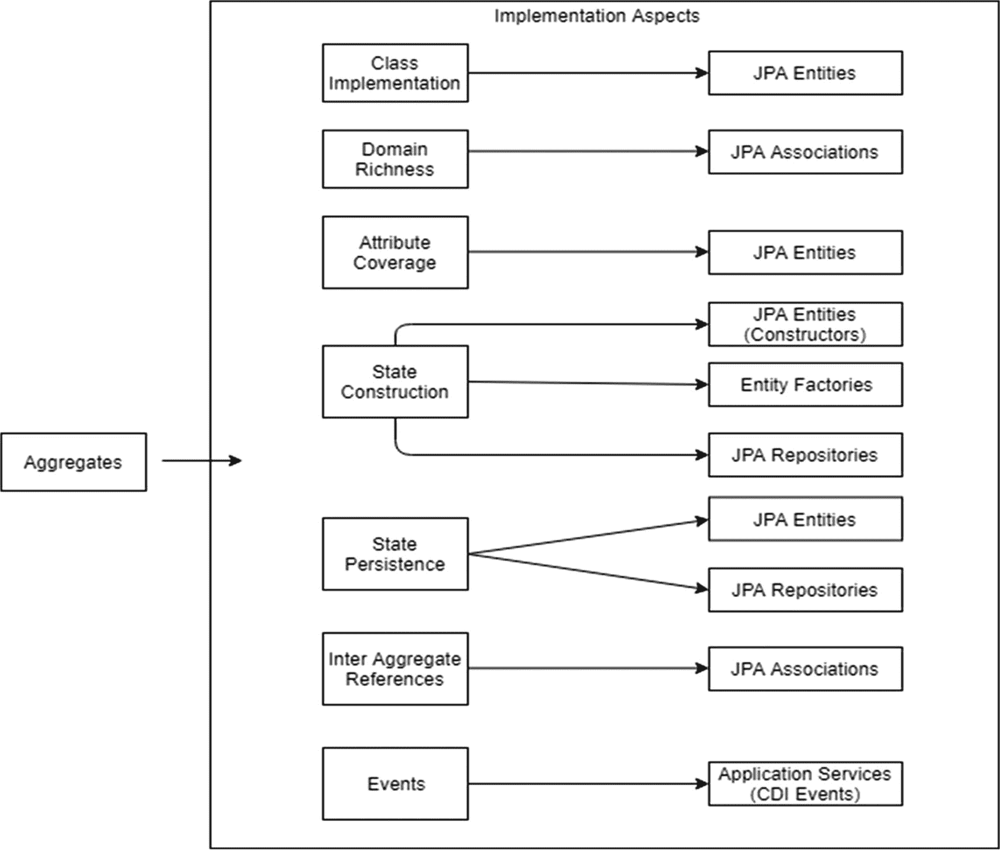

图 3-10

聚合实施摘要

#### 实体

有界上下文中的实体有自己的身份，但总是存在于根聚合中，也就是说，它们不能独立存在。在聚合的整个生命周期中，实体对象从不改变。

如第二章所见，在我们的 Booking Bounded 上下文中，我们有一个实体对象——货物的原产地。货物的起始位置在货物的整个生命周期中从不改变，因此是被建模为实体对象的合适候选。

实体对象的实现包括以下几个方面:

*   实体类实现

*   实体-聚合关系

*   实体国家建设

*   实体状态持久性

##### 实体类实现

实体类使用 JPA 提供的标准@Entity 注释作为 JPA 实体单独实现。

Location 实体类包含生成的主键、联合国(UN)位置代码和描述，如清单 3-9 所示:

```java
package com.practicalddd.cargotracker.booking.domain.model.entities;

import com.practicalddd.cargotracker.booking.domain.model.entities.UnLocode;

@Entity
public class Location implements Serializable {
    @Id
    @GeneratedValue
    private Long id;
    @Embedded
    private UnLocode unLocode;
    @NotNull
    private String name;
}

Listing 3-9.Location Entity Class

```

实体标识符使用与聚合标识符相同的概念——技术/代理键和业务键。

##### 实体-聚合关系

实体类与它们的根聚合有很强的关联，也就是说，没有根聚合它们就不能存在。使用标准 JPA 关联注释对根聚合的关联进行建模。

在货物根集合中，位置实体类用于表示货物的起始位置。在没有货物存在的情况下，预订范围内的起点位置不能存在。

清单 3-10 显示了位置实体类和货物根集合之间的关联:

```java
public class Cargo implements Serializable {
      @ManyToOne
      @JoinColumn(name = "origin_id", updatable = false) //Not the responsibility of Location to update the root aggregate i.e. Cargo
      private Location origin;
}

Listing 3-10.Cargo root aggregate associations

```

##### 实体状态构造/持久性

当在根聚合上执行这些操作时，实体总是只与底层根聚合一起被构造/持久化。

构建货物集合时，始终会构建货物始发地位置。对于持久化来说也是一样，当我们持久化一个新的货物预订时，我们会持久化它的起始位置。

图 3-11 显示了我们使用 Java EE 的实体实现的概要。


图 3-11

实体对象实现概要

#### 价值对象

值对象存在于有界上下文的聚合范围内。它们没有自己的身份，在任何聚合实例中都是可替换的。

重复我们在第二章中看到的例子，在我们的预订限制上下文中，我们有多个值对象，它们是货物根聚合的一部分:

*   货物的路线说明

*   货物的路线

*   货物的交付进度

这些都很容易在我们的货物根集合中替换。让我们看一下场景和为什么我们把它们作为值对象而不是实体的基本原理，因为这是一个重要的领域建模决策:

*   订了新的货，我们会有新的路线规范，空的行程单，没有发货进度。

*   当货物被分配路线时，空的路线值对象被分配的路线对象替换。

*   随着货物在其行程中经过多个港口，交付值对象在根聚合中被更新和替换。

*   最后，如果客户选择更改货物的交货地点或交货截止日期，则路线规格会发生变化，分配新的行程，并更新交货进度。

在每个场景中，很明显这些对象需要在根聚合中被替换，因此它们被建模为值对象。

值对象的实现包括以下几个方面:

*   值对象类实现

*   值对象-聚合关系

*   价值对象结构

*   值对象持久性

##### 值对象类实现

使用 JPA 提供的`@Embeddable`注释，值对象被实现为 JPA 可嵌入对象。

***由于值对象没有自己的身份，所以它们没有任何主标识符。***

清单 3-11 显示了我们的价值对象——`RouteSpecification`、`Itinerary,`和`Delivery`——实现为 JPA 可嵌入对象:

```java
@Embeddable
public class RouteSpecification implements Serializable{

    @ManyToOne
    @JoinColumn(name = "spec_origin_id", updatable = false)
    private Location origin;
    @ManyToOne
    @JoinColumn(name = "spec_destination_id")
    private Location destination;

   @Temporal(TemporalType.DATE)
    @Column(name = "spec_arrival_deadline")
    @NotNull
    private LocalDate arrivalDeadline;
}

@Embeddable
public class Delivery implements Serializable{
    public static final LocalDate ETA_UNKOWN = null;
    public static final HandlingActivity NO_ACTIVITY = new HandlingActivity();
    @Enumerated(EnumType.STRING)
    @Column(name = "transport_status")
    @NotNull
    private TransportStatus transportStatus;
    @ManyToOne
    @JoinColumn(name = "last_known_location_id")

    private Location lastKnownLocation;
    @ManyToOne
    @JoinColumn(name = "current_voyage_id")
    private Voyage currentVoyage;
    @NotNull
    private boolean misdirected;
    private LocalDate eta;
    @Embedded
    private HandlingActivity nextExpectedActivity;
    @Column(name = "unloaded_at_dest")
    @NotNull
    private boolean isUnloadedAtDestination;
    @Enumerated(EnumType.STRING)
    @Column(name = "routing_status")
    @NotNull
    private RoutingStatus routingStatus;
    @Column(name = "calculated_at")
    @NotNull
    private LocalDateTime calculatedAt;
    @ManyToOne
    @JoinColumn(name = "last_event_id")
    private HandlingEvent lastEvent;
}

@Embeddable

public class Itinerary implements Serializable{
    public static final Itinerary EMPTY_ITINERARY = new Itinerary();
    @OneToMany(cascade = CascadeType.ALL, orphanRemoval = true)
    @JoinColumn(name = "booking_id")
    @OrderBy("loadTime")
    @Size(min = 1)
    private List<Leg> legs = Collections.emptyList();
}

Listing 3-11.Delivery Value Objects

```

##### 值对象-聚合关系

没有根聚合，值对象就不能存在，但是因为它们没有标识符，所以在聚合实例中很容易被替换。

使用 JPA 提供的@Embedded 注释来实现值对象和聚合之间的关联。

清单 3-12 显示了我们的价值对象——`RouteSpecification`、`Itinerary,`和`Delivery`——作为嵌入对象与我们的货物根集合相关联:

```java
@Embedded
private RouteSpecification routeSpecification

;
@Embedded
private Itinerary itinerary;
@Embedded
private Delivery delivery;

Listing 3-12.Cargo root aggregate’s Value Objects

```

##### 价值对象构造/持久性

当在根聚合上执行这些操作时，值对象总是只与底层根聚合一起被构造/持久化。

当我们预订一个新的货物时，在那个时间点，该集合没有分配路线；如果我们试图获得交付进度，它将显示为空，因为它还没有被路由。注意我们如何在清单 3-13 中的根聚合中映射这些业务概念。我们为我们的货物总量分配一个空行程和一个基于空处理历史的交货快照。

清单 3-13 显示了构建货物根集合时如何创建价值对象路线和交付:

```java
public Cargo(BookingId bookingId, RouteSpecification routeSpecification) {
        this.bookingId = bookingId;
        this.origin = routeSpecification.getOrigin();
        this.routeSpecification = routeSpecification;
       this.itinerary = Itinerary.EMPTY_ITINERARY; // Empty Itinerary since the cargo is not routed yet
                                   this.delivery = new Delivery(this.routeSpecification, this.itinerary, HandlingHistory.EMPTY); // Delivery snapshot derived based on an empty handling history since this is a new cargo booking
   }

Listing 3-13.Value Objects state construction

```

图 3-12 总结了我们使用 Jakarta EE 实现的值对象。


图 3-12

值对象实施摘要

#### 域规则

域规则帮助聚合在有界上下文范围内执行任何类型的业务逻辑。虽然这些规则通常会丰富集合的状态，但它们本身并不会保持状态的变化。它们向应用服务呈现新的状态变化，应用服务检查状态变化以采取相应的动作。正如在前一章中所看到的，这些规则可以存在于域模型之内，也可以存在于域模型之外(服务层之内)。

业务规则(在域模型中)通常作为私有例程在值对象中找到自己的位置。我们通过一个例子来说明这一点。

货物根集合总是与一个`Delivery`值对象相关联。当这三者中的任何一个发生变化时，即当为货物指定新的路线时，货物被分配到一个路线；或者在处理货物时，必须重新计算交货进度。让我们来看看清单 3-14 中`Delivery`值对象的构造函数:

```java
public Delivery(HandlingEvent lastEvent, Itinerary itinerary,
            RouteSpecification routeSpecification) {
        this.calculatedAt = new Date();
        this.lastEvent = lastEvent;
        this.misdirected = calculateMisdirectionStatus(itinerary);
        this.routingStatus = calculateRoutingStatus(itinerary,
                routeSpecification);
        this.transportStatus = calculateTransportStatus();
        this.lastKnownLocation = calculateLastKnownLocation();
        this.currentVoyage = calculateCurrentVoyage();
        this.eta = calculateEta(itinerary);
        this.nextExpectedActivity = calculateNextExpectedActivity(
                routeSpecification, itinerary);
        this.isUnloadedAtDestination = calculateUnloadedAtDestination(routeSpecification);
    }

Listing 3-14.Delivery value object

```

这些计算是域规则，它们检查聚合的当前状态，以确定聚合的下一个状态。

同样，正如我们之前看到的，域模型中的域规则的执行只依赖于现有的聚合状态。如果该规则需要聚合状态之外的数据，则域规则应该被推送到服务层。

我们的实施总结如图 3-13 所示。

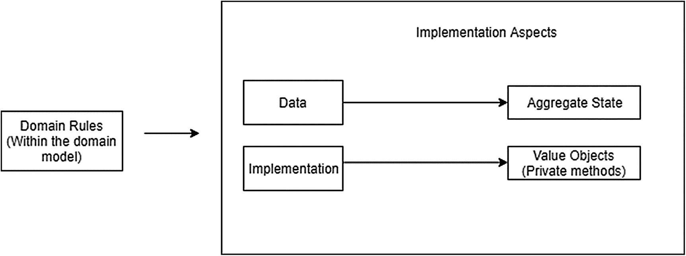

图 3-13

域规则实施摘要

#### 命令

有界上下文中的命令是改变聚集状态的任何操作。Java EE 没有为我们提供任何表示命令操作的特定内容，所以在我们的实现中，这是跨应用服务和域模型的。域模型部分改变聚集状态，而应用服务保存这些改变。

对于命令更改目的地，这包括将货物根集合与新的路线规范和新的交付状态相关联。

清单 3-15 显示了货物根集合中的实现部分:

```java
public void specifyNewRoute(RouteSpecification routeSpecification) {
        Validate.notNull(routeSpecification, "Route specification is required");
        this.routeSpecification = routeSpecification;
        this.delivery = delivery.updateOnRouting(this.routeSpecification,
                this.itinerary);
    }

Listing 3-15.Command example within the Cargo root aggregate

```

清单 3-16 显示了预订绑定上下文的应用服务中的实现部分:

```java
public void changeDestination(BookingId bookingId, UnLocode unLocode) {
        Cargo cargo = cargoRepository.find(bookingId);
        Location newDestination = locationRepository.find(unLocode);
        RouteSpecification routeSpecification = new RouteSpecification(
                cargo.getOrigin(), newDestination,
                cargo.getRouteSpecification().getArrivalDeadline());
        cargo.specifyNewRoute(routeSpecification); //Call to domain model
        cargoRepository.store(cargo); //Store the State
   }

Listing 3-16.Command example within the Cargo root aggregate

```

我们的实施总结如图 3-14 所示。

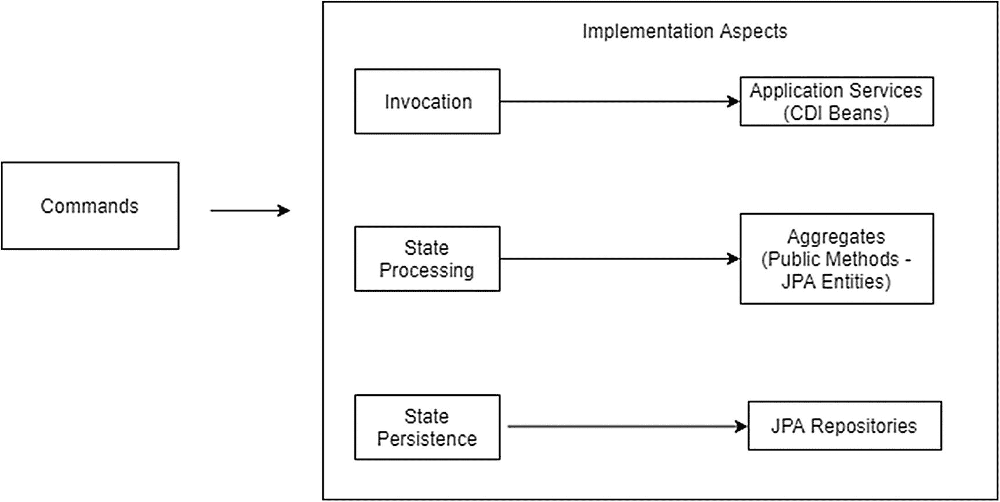

图 3-14

命令执行摘要

#### 问题

有界上下文中的查询是检索聚集状态的任何操作。JPA 为我们提供了命名查询，我们可以在聚合 JPA 实体上标记这些查询来查询聚合的状态。JPA 存储库可以使用命名查询来检索聚合的状态。

清单 3-17 显示了命名查询在货物根集合中的用法。我们得到了用于查找所有货物、通过特定预订 id 查找货物以及最终获得所有预订 id 的指定查询:

```java
@Entity
@NamedQueries({
    @NamedQuery(name = "Cargo.findAll",
            query = "Select c from Cargo c"),
    @NamedQuery(name = "Cargo.findByBookingId",
            query = "Select c from Cargo c where c.bookingId = :bookingId"),
    @NamedQuery(name = "Cargo.getAllBookingIds",
            query = "Select c.bookingId from Cargo c") })
public class Cargo implements Serializable {}

Listing 3-17.Named queries within the Cargo root aggregate

```

清单 3-18 显示了在 Cargo JPA 存储库中命名查询`findByBookingId`的用法:

```java
@Override
public Cargo find(BookingId bookingId) {
             Cargo cargo;
try {
            cargo = entityManager.createNamedQuery("Cargo.findByBookingId",
                    Cargo.class) 

                    .setParameter("bookingId", bookingId)
                    .getSingleResult();
        } catch (NoResultException e) {
            logger.log(Level.FINE, "Find called on non-existant Booking ID.", e);
            cargo = null;
        }
      return cargo;
    }

Listing 3-18.Named queries within the Cargo root aggregate

```

我们的实施总结如图 3-15 所示。

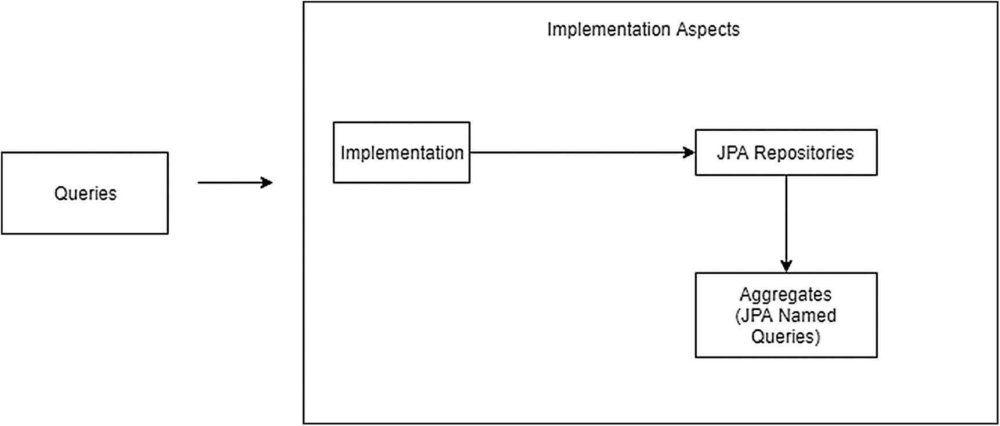

图 3-15

查询实施摘要

### 用 Jakarta EE 实现领域模型服务

如前所述，核心领域模型需要三种类型的支持服务。

### 入站服务

入站服务(或六角形架构模式中表示的入站适配器)充当我们的核心域模型的最外层网关。

在 Cargo Tracker 中，我们根据域模型的消费者类型实现了两种类型的入站服务:

*   使用 RESTful web 服务实现的 HTTP API

*   使用 JSF (JavaServer Faces)管理的 Beans 实现的本机 Web API

我们可以根据需要支持的协议对额外的入站服务/适配器进行分类，例如，我们可以使用基于 WebSocket 的入站服务进行实时更新，或者使用基于文件的入站服务进行批量上传。所有这些协议都应该被建模为入站服务的一部分。

让我们以 Cargo Tracker 应用中的每种入站服务为例，看看它们是如何使用 Jakarta EE 实现的。

### RESTful API

Jakarta EE 提供了使用 JAX-RS 规范实现 RESTful API 的能力。该规范是平台中使用最广泛的规范之一。

清单 3-19 中显示了一个使用 JAX-RS 的货物跟踪应用中的 RESTful API 示例:

```java
package com.practicalddd.cargotracker.handling.interfaces.rest;
@Path("/handling")
public class HandlingService{
      @POST
      @Path("/reports")
      @Consumes("application/json")
      public void submitReport(@NotNull @Valid HandlingReport handlingReport){
      }
}

Listing 3-19.REST API example

```

这个 RESTful API 作为处理绑定上下文的一部分公开，并在中转港处理货物的处理。API 的路径在/handling/reports；它使用一个 JSON 结构，并且是一个 POST 请求，JAX-RS 支持的典型 RESTful 结构。

### 本机 Web API

第二种类型的入站服务是通过本地 Web API 实现的。Cargo Admin Web 界面是一个基于浏览器的瘦界面，使用 JavaServer Faces (JSF)实现，JavaServer Faces 是在 Jakarta EE 平台中构建 HTML 应用的标准。

JSF 基于流行的 MVC(模型视图控制器),使用基于 CDI(组件依赖注入)的 JSF 托管 Beans 实现模型。该模型充当 web 接口的入站服务层。

清单 3-20 显示了使用 JSF/CDI 的货物跟踪应用中的本地 Web API 示例:

```java
package com.practicalddd.cargotracker.booking.interfaces.web;

@Named //Name of the bean
@RequestScoped //Scope of the bean
public class CargoAdmin {
      public String bookCargo() {
            //Invoke the domain model to book a new cargo
      }
}

Listing 3-20.Web API example

```

Cargo Admin 类是使用 JSF 和 CDI Beans 作为 Web API 实现的。它将一组操作(例如，bookCargo)暴露给货物管理 Web 界面，职员使用该界面来执行各种操作(例如，货物的预订)。Cargo Admin Web 界面可以调用这些 CDI Beans 上的操作。

实施总结如图 3-16 所示。


图 3-16

入站服务实施摘要

### 应用服务程序

应用服务是使用 Jakarta EE 平台中可用的 CDI(组件依赖注入)组件构建的。虽然我们前面已经谈到了 CDI 的主题，但是我们并没有深入讨论它的很多细节。现在让我们来谈谈这一方面。

CDI 最初是在 Java EE 6.0 中引入的，它已经有效地取代 EJB，成为 Jakarta EE 平台中构建业务组件的事实上的工具。CDI 通过支持类型安全依赖注入来管理组件的生命周期和交互。此外，CDI 提供了全面的 SPI(服务提供商框架),允许在 Jakarta EE 平台内构建和集成可移植扩展。

使用 CDI 构建应用服务包括以下步骤。我们将以货物预订申请服务为例:

*   使用应用服务提供的操作创建一个常规的 Java 接口。清单 3-21 展示了这一点:

*   提供用特定于 CDI 的批注标记的接口的实现。CDI 注释通常用于给组件提供一个范围和一个名称(在一个特定接口有多个实现的情况下)。

    我们提供了预订服务接口的实现，并给它一个应用范围，即整个应用的单个实例。

    清单 3-22 演示了这一点:

```java
package com.practicalddd.cargotracker.booking.application;

public interface BookingService {
 BookingId bookNewCargo(UnLocode origin, UnLocode destination, LocalDate arrivalDeadline);
List<Itinerary> requestPossibleRoutesForCargo(BookindId bookingId);
 void assignCargoToRoute(Itinerary itinerary, BookingId bookingId);
 void changeDestination(BookingId bookingId, UnLocode unLocode);

}

Listing 3-21.Booking Application services interface

```

*   一个应用服务将有一组依赖项，例如，它需要访问存储库基础结构类来检索作为特定操作一部分的聚合细节。清单 3-6 确实简单地提到了这一点，其中在应用服务中，我们使用了一个货物存储库类来加载货物集合。通过 CDI“Inject”注释，为应用服务类提供了对货物储存库类的依赖

    清单 3-23 展示了这一点:

```java
package com.practicalddd.cargotracker.booking.application.internal;

@ApplicationScoped //CDI Annotation to determine scope
public class  DefaultBookingService implements BookingService {
      BookingId bookNewCargo(UnLocode origin, UnLocode destination, LocalDate arrivalDeadline){
            //Implementation provided here
      }
    List<Itinerary> requestPossibleRoutesForCargo(BookindId bookingId){
            //Implementation provided here
      }
    void assignCargoToRoute(Itinerary itinerary, BookingId bookingId){
            //Implementation provided here
      }
    void changeDestination(BookingId bookingId, UnLocode unLocode){
            //Implementation provided here
      }
}

Listing 3-22.Booking Application services implementation

```

```java
package com.practicalddd.cargotracker.booking.application.internal;

@Inject //Inject the dependency of the Cargo Repository infrastructure
private CargoRepository cargoRepository;

@ApplicationScoped //CDI Annotation to determine scope
public class DefaultBookingService implements

BookingService {
 @Override
 public List<Itinerary> requestPossibleRoutesForCargo(BookingId bookingId) {
 Cargo cargo = cargoRepository.find(bookingId); //Use the Cargo Repository
            //Subsequent implemtnation here.
 }
}

Listing 3-23.Booking Application services dependencies

```

实施总结如图 3-17 所示。


图 3-17

应用服务实施摘要

### 应用服务:事件

正如我们前面所说的，真正意义上的 DDD 内部的领域事件必须由集合体产生。由于 Jakarta EE 没有为我们提供一种通过聚合生成域事件的机制，我们需要将这种能力推送到应用服务中。

事件基础架构基于 CDI 事件。它是在 CDI 2.0 中引入的，提供了一个非常简洁的事件通知/观察者模型的实现。这导致了各种有界上下文之间的松散耦合，这反过来又帮助我们实现了我们想要的真正模块化整体设计。

CDI 事件模型如图 3-18 所示。

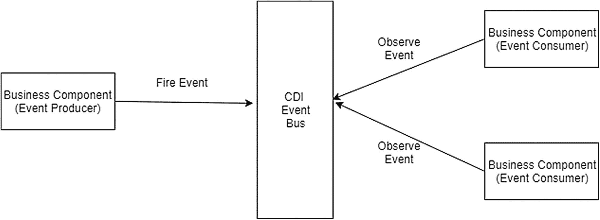

图 3-18

CDI 事件模型

CDI 事件总线不是专用的事件总线；它是 Observer 模式的内部实现，在容器中实现，具有增强的支持，包括事务性观察器、条件性观察器、排序以及同步和异步事件。

让我们看一下货物跟踪应用中的一个实现。作为处理活动的一部分，每次检查货物时，处理有界上下文都会触发一个“货物检查”事件。跟踪有界上下文观察该事件，并相应地更新货物的跟踪进度。

流程如图 3-19 所示。

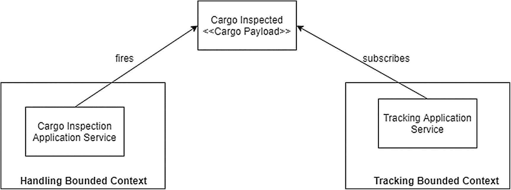

图 3-19

事件在处理有界上下文和跟踪有界上下文之间流动

在实际实施方面，遵循以下步骤:

*   *创建一个事件类(通过原型)。*

    清单 3-24 演示了这一点。我们创建一个“货物检查”事件类:

*   *炒事件。*

    清单 3-25 展示了从应用服务触发“货物检查”事件，在本例中，货物检查应用服务:

```java
package com.practicalddd.cargotracker.handling.infrastructure.events.cdi;

import static java.lang.annotation.ElementType.FIELD;
import static java.lang.annotation.ElementType.PARAMETER;
import static java.lang.annotation.RetentionPolicy.RUNTIME;
import java.lang.annotation.Retention;
import java.lang.annotation.Target;
import javax.inject.Qualifier;

@Qualifier // Stereotype annotations
@Retention(RUNTIME) //Stereotype annotations
@Target({FIELD, PARAMETER}) //Stereotype annotations
public @interface CargoInspected { //Event
}

Listing 3-24.Cargo Inspected event class stereotype

```

*   *观察事件。*

    跟踪有界环境中的货物跟踪服务观察该事件，并相应地更新货物的跟踪进度。

    清单 3-26 演示了这一点:

```java
package com.practicalddd.cargotracker.handling.application.internal;

import javax.enterprise.event.Event;
import javax.inject.Inject;
import com.practicalddd.cargotracker.infrastructure.events.cdi.CargoInspected; //Import the stereotype event class

public class DefaultCargoInspectionService implements CargoInspectionService{

@Inject
@CargoInspected
private Event<Cargo> cargoInspected; //The event that will get fired. The payload is the Cargo aggregate

    /**
     * Method which will process the inspection of the cargo and fire a subsequent event
     */
    public void inspectCargo(BookingId bookingId) {
            //Load the Cargo
            Cargo cargo = cargoRepository.find(bookingId);

            //Process the inspection

            // Fire the event post inspection
            cargoInspected.fire(cargo);
    }
}

Listing 3-25.Firing the cargo inspected event

```

```java
package com.practicalddd.cargotracker.tracking.application.internal;

import javax.enterprise.event.Event;
import javax.inject.Inject;
import com.practicalddd.cargotracker.infrastructure.events.cdi.CargoInspected;

public class DefaultTrackingService implements TrackingService{

@Inject
@CargoInspected
private Event<Cargo> cargoInspected; //Subscription to the event

    /**
     * Method which observes the CDI event and processes the payload
     */
    public void onCargoInspected(@Observes @CargoInspected Cargo cargo) {
          //Process the event
    }
}

Listing 3-26.Observing the Cargo Inspected event

```

实施总结如图 3-20 所示。

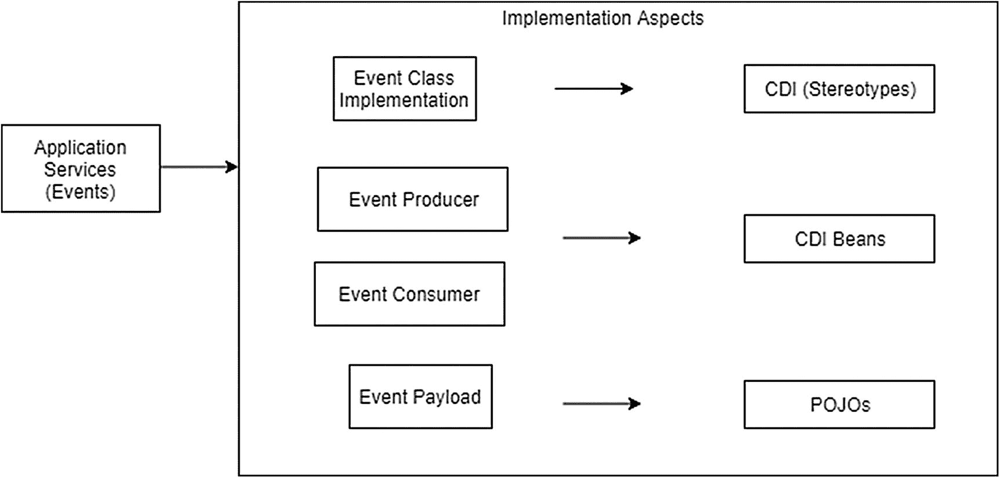

图 3-20

应用服务事件实施摘要

### 出站服务

在 Cargo Tracker monolith 中，我们主要使用出站服务与底层数据库存储库进行通信。出站服务被实现为“存储库”类，是基础设施层的一部分。

存储库类使用 JPA 构建，并使用 CDI 进行生命周期管理。JPA 提供了一个名为“EntityManager”的托管资源，它抽象了数据库配置细节(例如，数据源)。

存储库类通常围绕特定的聚合，并处理该聚合的所有数据库操作，包括以下内容:

*   新聚集及其关联的持久性

*   更新聚合及其关联

*   查询聚合及其关联

清单 3-27 展示了一个存储库类 JPACargoRepository 的例子:

```java
package com.practicalddd.cargotracker.booking.infrastructure.persistence.jpa;

//JPA Annotations
import javax.enterprise.context.ApplicationScoped;
import javax.persistence.EntityManager;
import javax.persistence.NoResultException;
import javax.persistence.PersistenceContext;

@ApplicationScoped
public class  JpaCargoRepository implements CargoRepository, Serializable {

@PersistenceContext
    private EntityManager entityManager; //Managed resource used by the Repository class to interact with the database

// Store a cargo
@Override
    public void store(Cargo cargo) {
        entityManager.persist(cargo);
    }

//Find all cargos. Uses a Named Query defined on the Cargo root aggregate. See also Queries
@Override
    public List<Cargo> findAll() {
        return entityManager.createNamedQuery("Cargo.findAll", Cargo.class)
                .getResultList();
    }

//Find a specific cargo. Uses a Named Query defined on the Cargo root aggregate
@Override
    public Cargo find(BookingId bookingId) {
        Cargo cargo;

        try {
            cargo = entityManager.createNamedQuery("Cargo.findByBookingId",
                    Cargo.class)
                    .setParameter("bookingId", bookingId)
                    .getSingleResult();
        } catch (NoResultException e) {
            logger.log(Level.FINE, "Find called on non-existant Booking ID.", e);
            cargo = null;
        }
        return cargo;
    }

}

Listing 3-27.Cargo Repository class implementation

```

实施总结如图 3-21 所示。


图 3-21

出站服务实施摘要

这完成了我们使用 Jakarta EE 8 将货物跟踪器实现为一个模块化的整体。

### 实施摘要

我们现在有了一个完整的单片货物跟踪应用的 DDD 实现，其中使用 Java EE 中可用的相应规范实现了各种 DDD 工件。

实施总结如图 3-22 所示。


图 3-22

使用 Java EE 的 DDD 工件实现概要

## 摘要

总结我们的章节

*   我们从建立 Jakarta EE 平台及其提供的各种功能的细节开始。

*   然后，我们使用领域驱动设计，将货物跟踪系统作为一个模块化的整体来实现，并使其背后的决策合理化。

*   我们还深入研究了各种 DDD 工件的开发——首先是域模型，然后是使用 Jakarta EE 平台上可用的技术支持服务的域模型。**