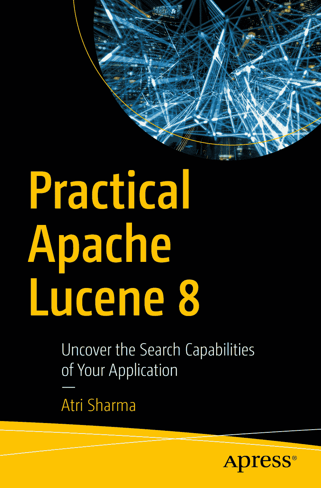

ISBN 978-1-4842-6344-0e-ISBN 978-1-4842-6345-7 [`doi.org/10.1007/978-1-4842-6345-7`](https://doi.org/10.1007/978-1-4842-6345-7) © Atri Sharma 2020 Standard Apress 本出版物中使用的通用描述性名称、注册名称、商标、服务标志等，即使未作明确声明，也不意味着这些名称不受相关保护法律和法规的约束，因此可自由使用。出版商、作者和编辑假定本书中的建议和信息在出版之日是真实准确的。出版商、作者和编辑均不对本书所含材料或可能存在的任何错误或遗漏提供明示或暗示的担保。出版商对已出版地图中的管辖权主张和机构归属保持中立。本书通过 Springer Science+Business Media New York 在全球图书贸易中发行，地址：233 Spring Street, 6th Floor, New York, NY 10013。电话：1-800-SPRINGER，传真：(201) 348-4505，电子邮件：orders-ny@springer-sbm.com，或访问 www.springeronline.com。Apress Media, LLC 是一家加利福尼亚有限责任公司，其唯一成员（所有者）是 Springer Science + Business Media Finance Inc (SSBM Finance Inc)。SSBM Finance Inc 是一家特拉华州公司。

*谨以此书献给我的导师（Merlin Moncure、*Mike McCandless* 和 Adrien Grand）。*

*谨以此书献给我的家人。*

*谨以此书献给全能者。*

引言

Lucene 凭借一己之力征服了搜索世界。从 Doug Cutting 最初开发该项目至今，它在功能和用户基础方面已经取得了长足的发展。

时光飞逝，世界正在发生变化。随着大数据和机器学习的兴起，Lucene 必须拥抱即将到来的变革，并确保人们对该项目所期望的搜索质量保持不变。

Lucene 8 正是朝着这个方向迈出的一步。随着系统中引入重要的新功能，用户需要了解如何使用 Lucene 的最新视角，而本书正是为此提供。

致谢

我要感谢 Lucene/Solr 社区，感谢他们构建了如此出色的产品，并在我撰写本书期间给予我的支持。

关于作者 关于技术审校者

