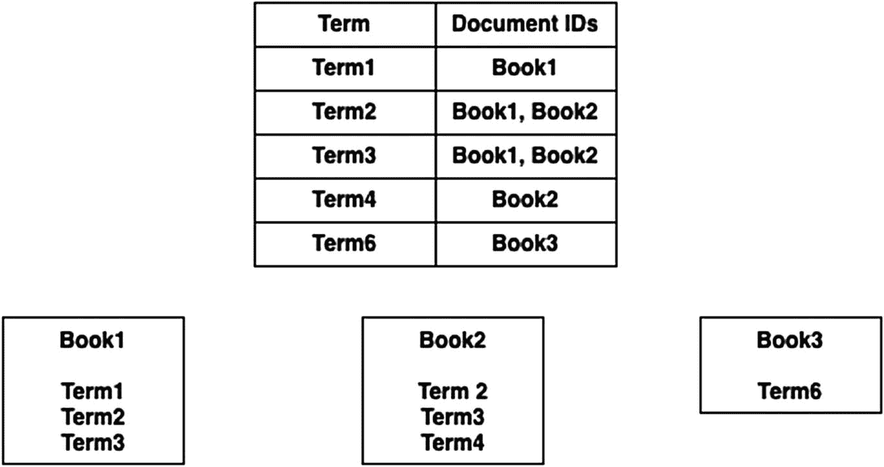
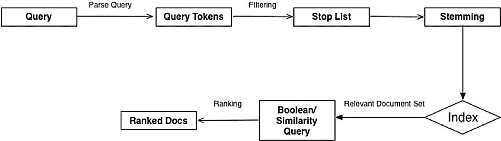
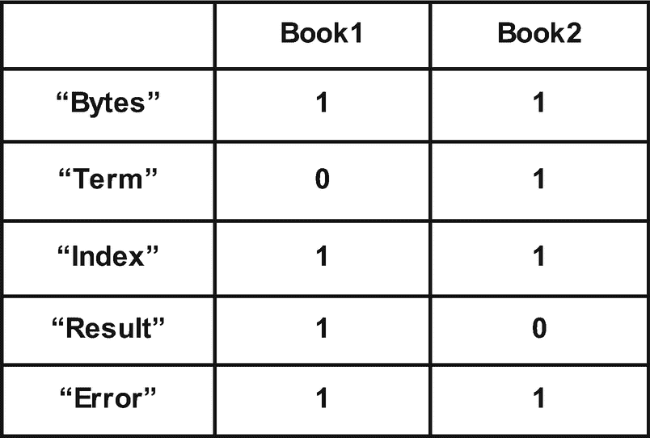
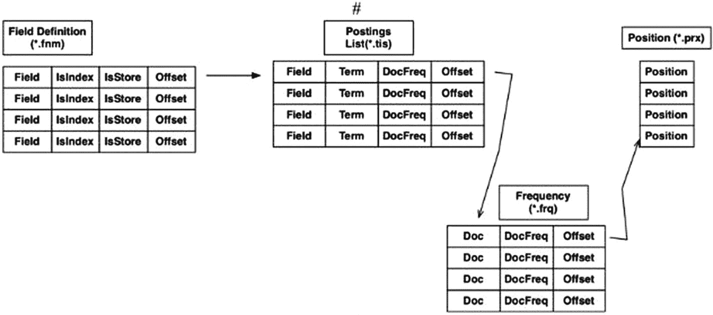
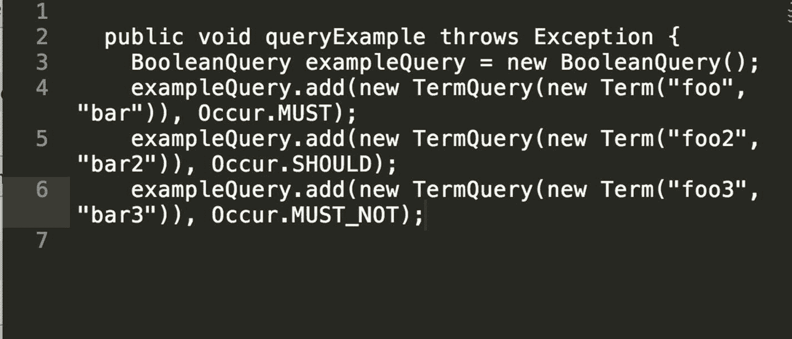

# 1. 你好，Lucene！

欢迎踏上探索神秘而有趣的搜索世界之旅！

本章讨论信息检索（IR）系统，重点介绍 Lucene，并包含许多术语和关键信息，随着我们深入 Lucene 的内部机制并构建一些酷炫的应用程序，你会发现这些信息非常有用。

在开始之前，让我们先回顾一些常见问题及其答案。

> *Lucene 是一个搜索引擎吗？*

我通常会回答：“嗯，既是也不是。”

Lucene 是一个用于构建各种信息检索系统的库和平台，其中搜索引擎最为人所知。Lucene 适用的其他领域包括：

*   *文档分析*：根据某些给定标准加载和遍历文本文档，从文档中找出热门词汇，对特定字段进行聚合。

*   *日志分析*：使用直接构建在 Lucene 之上的高性能仪表板分析应用程序日志。

*   *地理空间搜索*：随着地理空间查询和数据结构的近期兴起，Lucene 正迅速成为索引经纬度数据以及执行诸如共址搜索等查询的热门选择。

> *我需要信息检索的背景知识吗？*

具备信息检索背景固然好，但这并非理解 Lucene 的必备条件。尽管本书涵盖了一些背景理论，但所有复杂信息都会以帮助你建立上下文理解的方式来解释。

注意

信息检索是一个庞大的学科，本书无意在此主题上做到详尽权威。相反，本书侧重于加深你对 Lucene 的理解。为了更全面地理解信息检索，建议结合一本信息检索书籍来阅读本书。Manning 所著的《信息检索导论》是一本不错的入门参考书。

> *Lucene 支持 SQL 或 SQL 方言吗？*

不支持，Lucene 有一套受支持的查询（将在后续章节中讨论）。不过，你可以使用这些查询来构建可从类似 SQL 的语言派生的执行计划。有些引擎确实做到了这一点，但 Lucene 本身并不原生支持。

Lucene 是一个让你能够构建自己搜索应用程序的库。当你的应用程序需要快速索引和搜索能力时，请使用 Lucene。Lucene 赋予了用户强大的能力，但能力越大，责任越大。因此，对于 Lucene 更高级的特性（如后续章节所述），有辨别力的用户理解其权衡和最佳适用场景至关重要。

## Lucene 的主要特性

Lucene 已经存在了一段时间，其众多特性和能力使其非常受欢迎，包括：

*   *可扩展的高性能索引*：Lucene 支持非常快速的索引（在现代硬件上每小时超过 150GB）。

*   *增量索引*：随着新文档的加入，索引会被添加，无需修改现有索引（从而避免过多的索引变动）。

*   *Top N 查询*：Lucene 能高效地扫描大量数据，并获取与查询匹配、按所用评分函数排序的前 N 个文档。

*   *多种查询类型*：短语查询、通配符查询、邻近查询、范围查询等等。

*   *单字段和多字段搜索*：Lucene 允许在单个字段或多个字段上进行搜索——支持跨多个字段进行排序。

*   *排序和分面*：Lucene 允许按特定字段对结果进行排序（类似于 SQL 的 ORDER BY）。Lucene 还允许对不同属性进行分面（类似于 SQL 的 GROUP BY）。

*   *多索引搜索*：Lucene 允许单个查询查询多个索引，然后将所有索引的结果合并到一个最终结果集中。

*   *并发索引和搜索*：Lucene 允许使用多个线程处理单个索引或搜索请求。这可以显著加快单个请求的性能。

*   *高亮、连接和结果分组*：Lucene 允许在满足特定条件的情况下跨不同索引进行连接。

*   *可插拔的排序模型*：包括[向量空间模型](http://en.wikipedia.org/wiki/Vector_Space_Model)和 [Okapi BM25](http://en.wikipedia.org/wiki/Okapi_BM25)。

*   *用于存储的自定义编解码器*：可以在 Lucene 中实现并使用自定义存储格式，从而在搜索应用程序中使用 Lucene 时提供灵活性。

尽管上述列表并不详尽，但它突出了 Lucene 中一些更受欢迎的特性，这些特性使你能够在构建高性能系统的同时，保持返回结果的高度相关性。

## 信息检索基础

在深入探讨 Lucene 的内部机制之前，我们先来回顾一下信息检索系统中的搜索究竟是怎么回事。虽然这里的讨论不会涉及信息检索的全部复杂性，但它应该能帮助你随着我们的学习进度，掌握 Lucene 的更多细节。

在信息检索系统的语境下，*搜索* 是一门从信息中提取与给定查询高度相关的内容的艺术。

在信息检索系统的语境下，*索引* 是从给定文本构建倒排索引的过程。该过程在索引章节中有详细描述。请注意，此处及后续章节所指的索引，与关系型数据库系统中的典型索引不同。关系型数据库系统中的索引通常是指在表属性之上创建诸如 B 树之类的辅助数据结构，以加快搜索速度。而在此语境下，索引是指在给定数据集之上构建倒排索引。

想象一本厚书，要对其中的特定术语组合进行顺序搜索（逐行查找）是不可能的。例如，在一本儿童睡前故事书中，我们可能会搜索：所有包含“阳光”和“糖果”但不包含“鬼怪”的故事。

从信息检索系统的角度来看，该查询可以表示如下：

*   阳光 AND 糖果 AND NOT 鬼怪

以下章节将讨论执行此查询的几种方式。

## 线性扫描

*线性扫描* 是一个简单的过程，它依次遍历系统中的每一行，并检查参数（即给定查询中的条件）。这正是 Unix 的 `grep` 命令的工作方式，并且它在处理通配符和正则表达式时也相当有效。如果被搜索的数据集规模不是太大，并且所使用的硬件性能足够强大，那么线性搜索是最简单的方法。

然而，当文档数量超过一百万篇中等大小的文档时，线性搜索的性能就会开始下降。我们周围的世界正在经历信息爆炸。事实上，由于互联世界、手持设备和物联网的出现，在过去 10 年里，需要处理以提取相关信息的数据量已经翻了两番。线性搜索无法扩展以满足这些需求，因此我们需要更复杂、性能更高的方案，能够处理海量数据集，同时仍能以合理的速度提供相关结果。

线性搜索也限制了能够回答的查询类型。例如，无法定义一个查询来寻找给定模式的“近似”匹配。假设我们要搜索文档中“flower”和“sunshine”这两个词出现在三个词距离内的文档。使用线性搜索是无法做到的。此外，也没有排序结果的概念。也就是说，对于给定的查询，线性扫描的结果要么匹配，要么不匹配。如果我们想要某种排序，就不能使用线性扫描。

*倒排索引* 是一种以“倒排”方式存储数据的数据结构（即，将词条映射到包含这些词条的文档）。任何出现在任何文档中的唯一词条都会成为倒排索引的一部分。

如图 1-1 所示，这种数据结构对于以优化方式回答诸如“找到包含 Term1 的文档”这类问题非常有用。如您所见，单词条搜索是一个常数时间操作。

表 1-1.

| 查询类型 | 应用场景 | 示例查询 |
| --- | --- | --- |
| TermQuery | 单词条匹配 | “Foo”:”Bar” |
| PhraseQuery | 多个词条组合在一起 | “所有带黑色轮胎的汽车” |
| RangeQuery | 词条范围，包含或不包含端点 | “年龄”:[13-19] |
| PrefixQuery | 匹配给定前缀 | Foo* |
| FuzzyQuery | 用于近似匹配的 Levenshtein 算法 | Foo~ |
| WildcardQuery | 类似正则表达式的匹配 | F??bar |
| BooleanQuery | 通过逻辑子句连接的多个查询 | “姓名:Ramesh” AND “年龄”:[13-19] |

图 1-1.

倒排索引的表示

为了创建倒排索引，首先需要将文档中的字段进行拆分和分词，创建一个包含所有唯一词条的排序列表，然后填充包含相应词条的文档。

虽然倒排索引对于单词条查询速度很快，但它也能回答一类重要的问题：相似性查询。

图 1-2 展示了信息检索系统中处理查询的典型方式。查询进入系统后，会被解析并拆分成独立的词元。词元是查询中具有自身语义的独立词条。

图 1-2.

查询处理的控制流程

例如，考虑以下查询：

*   找出所有昨天开车去大学的人

在这种情况下，对该查询进行分词将得到独立的词条，例如“开车”、“大学”、“昨天”和“去”。

## 停用词表

*停用词表* 包含在相关语言中用于构成句子结构，但对语义匹配和搜索不一定有用的词。例如，在句子“Alex went to London”中，我们看到单词“to”是一个停用词，因为它有助于构成查询的结构。然而，它不一定能为潜在文档匹配的语义评估做出任何贡献，因此不应将其与其它词同等对待。

在进一步处理之前，会过滤掉停用词，以帮助将索引中的词元数量限制在那些能够对文档相关性做出贡献的词元上。当然，我们之后可能会发现，一些具有语义能力的词在匹配相关文档时并无用处，但这是分阶段进行的，我们不想过度优化。

## 词干提取

查询可能包含不同形式的单词，具有不同的时态、拼写和相关的语法语义。例如，“drive”、“driving”和“drives”都基于同一个词，但结构不同。然而，对于语义匹配而言，单词的实际结构价值不大。真正重要的是词根，它将有助于计算文档与查询的整体相关性。

忽略同一单词不同结构的另一个好处是，可以匹配剩余部分。例如，包含单词“drive”的查询应该匹配包含单词“driving”的文档。这提高了查询结果的*召回率*。召回率定义为返回结果的广度（即，有多少文档匹配给定查询）。与关系数据库不同，信息检索系统可以回答带有语义元素的查询；也就是说，任何文档都可以匹配给定的查询。关键在于识别最相关的文档并消除不必要的噪音。

注意

*召回率*是返回结果中文档的宽度。然而，召回率过高，返回结果的正确性就会降低。召回率过低，返回结果的数量就会非常少。大多数信息检索系统都在这种权衡中挣扎。

*词干提取*是将单词还原为其基本词，并消除源自同一词根的单词之间结构差异的过程。然而，词干提取的操作可能很粗糙。例如，词干提取可以使用粗糙的启发式方法来去除单词的某些部分，这有时会导致奇怪的语义输出。虽然这种方法很高效，并且在大多数情况下都有效，但处理此需求的更复杂方法是词形还原的艺术：使用给定的词汇表并根据查询词元的形态分析来重写单词。词形还原超出了当前讨论的范围。

为了避免线性搜索，你可以预先索引文档集，并使用特殊查询来获取正确的结果集。例如，考虑一组包含一系列单词的文档。让我们使用一组相关的书籍，如下所示：

*   Databases in Action World of Lucene Introduction to Information Retrieval

现在假设我们必须为这三本书提供查询服务。这样做需要我们对这三本书的数据进行索引，以便在查询操作中提高效率。请注意，有多种方法可以实现相同的目的。我们可以为每本书创建一个单独的索引，或者将这三本书索引到同一个索引中。要了解我们正在构建哪种索引，请参考图 1-1。

请注意，这些书会有一些共同的关键词。例如，我们预计“search”会出现在所有三本书的文本中。同样，“bytes”是另一个可能在三本书的文本中重复出现的词。

一种简单的索引技术是为每个文档维护独立的元数据，从而有效地丢弃了常见的词项。这种方法浪费空间，并且对于寻求跨所有文本匹配的查询服务来说效率也很低。

要实现图 1-1 中概述的倒排索引，你首先需要理解词项和词项-文档关联矩阵的概念。

## 词项

*词项*是信息检索系统中一个独立的可索引单元。词项通常是单词，但也可能是更复杂和结构化的类型。与我们数据集相关的示例有“search”和“bytes”。

## 词项-文档关联矩阵

*词项-文档关联矩阵*将词项映射到包含该词项的文档。简单来说，它是一个二维矩阵，其中列代表书名，行代表涉及的词项。

图 1-3 展示了一个给定书籍和词项集的词项-文档关联矩阵。

图 1-3.

词项-文档关联矩阵

## 使用词项-文档关联矩阵提供查询服务

本节解释如何使用构建好的结构来提供查询服务。一个使用词项-文档关联矩阵的简单模型涉及为正在服务的查询构建向量。例如，考虑一个查询：

*   TERM and INDEX and not RESULT

使用每个相关词项的向量，我们执行以下操作：

*   vector(term) AND vector(index) AND NOT vector(result)

AND NOT vector(result) 可以转换为 AND ~vector(result)，其中 ~ 表示布尔向量的补集。

这转换为以下内容：

*   vector(term) AND vector(index) AND ~vector(result)

用实际的布尔向量替换：

*   01 AND 11 AND 10

得到查询的最终结果：Book2。

现在你已经基本了解了倒排索引的工作原理、构建方式以及如何用于查询，让我们来看看实际的 Lucene 实现。

## 基本术语

在讨论 Lucene 数据结构的更精细方面之前，这里有一些你需要理解的一般术语。这些术语将有助于你在 Lucene 中的探索之旅：

*   *文档*：一条记录；搜索的单位；作为搜索结果返回的内容
*   *字段*：文档中用于存储和索引值的类型化槽位
*   *索引*：文档的集合，通常具有相同的模式
*   *语料库*：索引中所有文档的完整集合
*   *倒排索引*：通过唯一标识符将词项映射到文档的内部数据结构。
*   *词项*：从源文档中提取的值，用于构建倒排索引
*   *词汇表*：语料库中所有不同词项的完整集合
*   *字段数据*：按文档标识符排序的每个字段的所有字段值数组
*   *文档值*：表示字段值的列式存储

## Lucene 数据表示的核心

请注意，在最基本的层面上，Lucene 以倒排索引的形式存储数据，类似于我们之前讨论的内容。然而，倒排索引的实际表示、构建和存储都是针对 Lucene 进行优化和特定的，如下所述。

## Lucene 的倒排索引结构

在更仔细地审视这种格式的语义之前，让我们先回顾一下 Lucene 索引和搜索术语的一些基本元素：

*   *词项*：Lucene 中的词项相当于英语中的词元，只是比其英语对应物更强大，语义更丰富。在 Lucene 中，词项可以被分析或不被分析，尽管未被分析的词项价值不大。考虑以下输入到 Lucene 的内容：

“Foo” : “Bar”

这转换为词项“Bar”，并且可以以该格式被任何此类 Lucene 查询检索到。

请记住，词项是索引和搜索的基本单位。Lucene 将其底层数据存储为词项，用户查询被分解为词项，然后发送以进行进一步处理。

*   *词项词典*：词项词典保存了在 Lucene 索引中索引的词项及其对应的文档频率。

## Lucene 索引的磁盘表示形式

Lucene 索引的磁盘表示形式经过优化，读写效率高，并且允许搜索索引中的特定区域。

Lucene 的核心在于其索引文件格式。在 Lucene 4 之后，格式是可插拔的（使用自定义编解码器，本章后续会讨论）。然而，默认的文件格式是 Lucene 官方网站上发布的格式，也是本节将要介绍的内容。

参考图 1-4，开始定义的基本组件如下：

*   **字段定义**：字段定义存储在一个名为 FieldInfos 的独立文件中（扩展名为 .fnm）。

    

    图 1-4.

    Lucene 索引结构

根据官方定义：

FieldInfos (.fnm) --> FNMVersion,FieldsCount, <FieldName, FieldBits> FieldsCount

*   FNMVersion, FieldsCount --> VInt

*   FieldName --> Strings

*   FieldBits --> Byte

*   最低位为 1 表示已索引字段，为 0 表示未索引字段。

*   次低位为 1 表示字段存储了词向量，为 0 表示字段没有词向量。

*   如果第三低位被设置（0x04），则词项位置与词向量一起存储。

*   如果第四低位被设置（0x08），则词项偏移量与词向量一起存储。

*   如果第五低位被设置（0x10），则已索引字段的范数被省略。

如果第六低位被设置（0x20），则为已索引字段存储载荷。

### 词项字典

词项字典由两个文件表示：

词项信息（或 tis）文件保存关于词项的元数据，例如词项名称、跳跃信息和文档频率（即包含该词项的文档数量）。tis 文件还保存有用的信息，帮助 Lucene 构建结构，以便更优地访问给定词项的相关文档（Lucene 内部使用跳跃数据结构来加快访问速度，tis 文件保存的数据有助于构建此结构）。此外，此文件中的词项频率等元数据允许在其他文件中更快地访问。

词项信息索引文件（扩展名 .tii）保存元数据，允许对词项信息文件进行随机访问。

## 频率文件

频率文件（扩展名 .frq）将文档映射到词项。也就是说，它包含一个列表，列出了词项字典中所有包含某个词项的文档，以及每个词项在文档中的出现频率。

## 位置文件

位置文件（扩展名 .prx）表示每个词项在文档中出现的位置列表。

## Lucene 查询

查询是应用程序与 Lucene 交互并从中提取数据的灵魂。

Lucene 在这方面拥有多种核心能力，并允许构建丰富且语义多样的查询。Lucene 查询引擎的一个关键特性是其可扩展性，以及能够根据用户需求设置自定义参数来定制搜索和排序，这将在后续章节中讨论。

与普遍预期相反，Lucene 不支持 SQL 或类似 SQL 的语法。Lucene 拥有自定义的查询语法，旨在充分利用 Lucene 提供的所有功能。

## Lucene 查询的结构

Lucene 的查询由两个主要部分组成：词项和操作符。由于我们之前已经讨论过词项的定义和语义相关性，这里不再赘述。然而，词项的两个重要分类对我们后续的讨论会很有帮助：

*   **单一词项**：单一词项是由单个词元组成的词项（例如，“walk”）。它们通常是原子的，构成了查询的基本结构。

*   **短语**：短语是由多个单一词项组成的多词项现象。例如“Walk This Way”。短语允许更丰富的查询匹配和检索，以及一种语义更强大的表达查询的方式。表 1-1 描述了查询及其等效应用，并为每种查询提供了一个示例。

## 字段

字段用于在定义查询时指定谓词。字段是特定于数据语料库的，可以在构建查询时使用。可以指定任何可查询的有效字段。执行搜索时，可以指定要搜索的字段。可以使用任何现有的字段名称作为字段名称。在某些类型的查询中，可以指定多个字段。

## Lucene 中的查询类型

本节介绍 Lucene 中可用的不同查询类型、它们的应用以及一个简短的示例。

图 1-5 展示了一种实例化复合查询并为其设置一组子句的方法。大多数查询支持单个谓词，但某些查询（如 BooleanQuery）支持多个且多样化的子句，从而允许进行更复杂的搜索。

图 1-5.

## Lucene 与关系数据库

尽管在许多方面相似，但信息检索系统与传统的关系统数据库系统存在本质区别。主要区别包括：

*   数据库提供严格的模式，从而强制输入系统的数据必须符合特定的结构。相比之下，信息检索系统通常是无模式的，并基于元组模型工作。

*   数据库建立在模式之上，允许进行数据建模（例如实体关系图）。信息检索系统不具备这种能力（也不需要）。

*   必须使用精确值查询数据库，但信息检索系统允许不精确的搜索和语义。

*   数据库通常用于精确检索，而信息检索系统通常用于不精确的“广泛”搜索，其中所有文档都可能匹配查询，因此排序和相关性概念得以应用。

