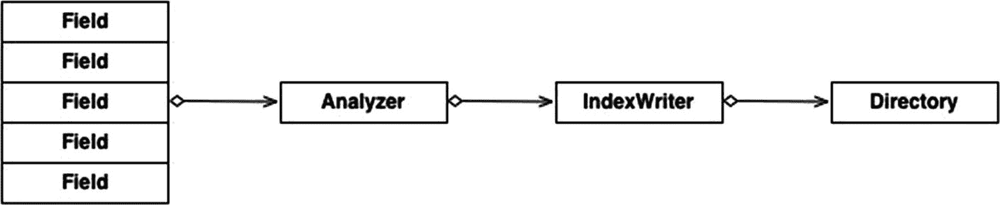
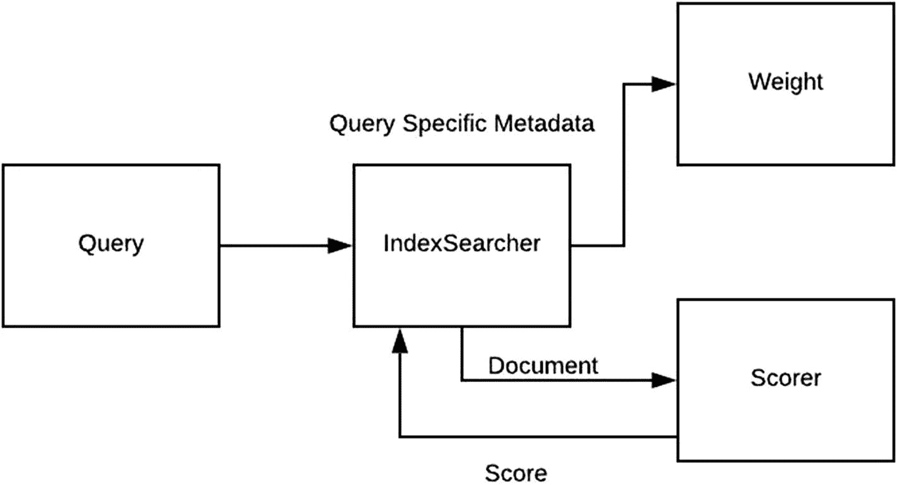

# 2. Hello World：Lucene 之道

本章介绍如何使用 Lucene 索引数据，具体包括 Lucene 如何存储和表示数据、Lucene 查询的细微差别，以及 Lucene 如何促进多参数搜索。

## 在 Lucene 中索引数据

`IndexWriter` 是面向用户的主要类，负责在 Lucene 中索引数据。`IndexWriter` 用于分析文档、打开目录以及将数据写入目录。

图 2-1 展示了索引操作的整体流程。一个由各种字段组成的文档首先被传递给分析器，然后被交给一个 `IndexWriter` 实例。`IndexWriter` 与 Lucene 内部交互以打开相关目录，以正确且必需的格式形成索引，并将其写入底层目录。此后打开的任何读取器都可以访问（可见）该文档。



图 2-1

索引操作流程

现在让我们更仔细地看看此过程中涉及的类。


## 文档

`Document` 是 Lucene 中代表文档及其关联内容的基类。文档是索引和搜索的宏观单元；索引和搜索均以文档为单位处理数据。

一个 `Document` 由一个或多个 `Field` 类的实例组成。字段是键和值的组合。字段可以选择是否存储。存储的字段会随搜索结果一起返回，因此理想情况下每个文档应至少包含一个存储字段。然而，存储字段会显著增加索引的存储占用。在最坏的情况下（所有字段都存储），字段存储可能导致磁盘索引的整体存储大小增加约 30%。

创建 Document 类的实例时，你可以将每个字段标记为是否进行分词。标记为分词的字段会通过分析器进行处理。

## 分析器

分析器在数据作为输入传递给另一个 Lucene 类之前对其进行分析。你可以在索引和搜索时使用分析器，通常建议使用它们。分析器通常使用一组已定义的分词器并应用一组过滤器，将输入文本拆分为词元。以下部分介绍了 Lucene 中一些可用的分析器。

### StandardAnalyzer

大多数 Lucene 用户使用 `StandardAnalyzer`，这是一个通用的分析器，旨在提供简单性、通用行为和易用性。

`StandardAnalyzer` 会从输入中移除停用词，这在处理自然语言文本时非常有帮助。`StandardAnalyzer` 还会将文本转换为小写（这是一个需要注意的重点，因为在搜索使用 `StandardAnalyzer` 索引的数据时，大小写问题可能导致应用程序代码中出现细微的错误）。

注意

`StandardAnalyzer` 会将数据转换为小写。因此，请记住这一点，并确保在搜索时使用相同的分析器，或者自行将文本转换为小写。

示例如下：

*   *输入：* “Lucene Is A Library”

*   *输出：* [Lucene] [a] [Library]

### StopAnalyzer

`StopAnalyzer` 与 `StandardAnalyzer` 类似，但它使用 `StopFilter` 执行停用词移除。

### SimpleAnalyzer

`SimpleAnalyzer` 同样与 `StandardAnalyzer` 类似，但它无法移除停用词，也无法识别 URL。

示例如下：

*   *输入：* “Lucene Is A Library”

*   *输出：* [Lucene] [is] [a] [Library]

以下代码示例展示了一个用于分析文本并返回分词结果的输入分析器。请注意，分词结果取决于所使用的分析器及其特性：

```
public List performAnalyze(String input, Analyzer analyser) throws IOException {
List result = new ArrayList();
TokenStream tokenStream = analyser.tokenStream("field_name", input);
CharTermAttribute attr = tokenStream.addAttribute(CharTermAttribute.class);
tokenStream.reset();
while(tokenStream.incrementToken()) {
result.add(attracts.toString());
}
return result;
}
```

### IndexWriter

`IndexWriter` 创建索引并将数据写入索引。由于 `IndexWriter` 是索引过程中的关键组件，构建应用程序的用户需要理解它。

`IndexWriter` 允许你创建新索引以及打开现有索引。请记住，Lucene 索引是仅追加的。也就是说，一旦数据被写入，它就是不可变的，直到一个称为段合并（稍后讨论）的过程合并旧数据。这种不可变性允许 `IndexWriter` 在仅提供查询服务的现有索引上工作。正在运行的查询仅使用索引的快照，不会干扰 `IndexWriter` 的数据写入过程。

`IndexWriter` 支持多种应用程序编程接口（API）来与底层数据交互，并允许与数据进行复杂和自定义的交互。可以使用 `addDocument()` 添加新文档，使用 `deleteDocuments()` 删除文档，以及使用 `updateDocument()` 更新现有文档。请注意，`deleteDocuments()` 也可以传入一个查询，所有匹配该查询的文档都将被删除。更新文档意味着一次删除和一次插入，因为 Lucene 索引是仅追加的。

`IndexWriter` 将数据写入索引内的一个新段。段是 Lucene 索引内的一个逻辑数据单元。调用 `commit()` 会强制创建一个新段。然而，在每次文档插入后都调用 `commit()` 是一项昂贵的操作，并且不是一个好主意。请注意，`commit()` 是一个原子操作。

## 目录

`Directory` 表示文件系统级别目录的逻辑表示。`Directory` 允许创建和访问索引，并支持随机访问。Lucene 支持多种 `Directory` 实现，例如使用 Java 非阻塞 I/O（NIO）的实现（`NIOFSDirectory`），另一种是内存映射文件的实现（`MMapDirectory`），等等。

现在，让我们按照以下高级步骤创建文档并对其进行索引：

1.  创建文档。

2.  创建索引并打开它以进行写入。

3.  索引数据。

### 创建文档

在此示例中，假设我们得到一个 `File` 实例作为输入。然后我们完成以下步骤：

1.  从原始 `File` 实例中获取字段。

2.  根据步骤 1 中获取的数据创建 Lucene `Field` 实例。

3.  为每个字段设置相关属性。

4.  创建一个 Lucene 文档。

5.  将字段添加到文档中。

以下代码按给定顺序遵循上述步骤：

```
private Document parseAndCreateDocument(File file) throws IOException {
//假设我们有一个解析器，可以从文件中返回不同的字段
FancyParser fancyParser = FancyParser.getParser().parse(file);
//步骤 1
String firstTest = fancyParser.getFirst();
String secondText = fancyParser.getSecond();
String thirdText = fancyParser.getThird();
//步骤 2 和 3
Field firstField = new Field("first_field", firstText, Field.Store.YES, Field.Index.NOT_ANALYZED);
Field secondField = new Field("second_field", secondText, Field.Store.YES, Field.Index.NOT_ANALYZED);
Field thirdField = new Field("third_field", thirdText, Field.Store.YES, Field.Index.NOT_ANALYZED);
//步骤 4
Document document = new Document();
//步骤 5
document.add(firstField);
document.add(secondField);
document.add(thirdField);
return document;
}
```

### 创建索引并写入文档

在本节中，我们将创建一个新索引并使用它来索引文档。如前所述，此过程中涉及的主要组件是 `IndexWriter` 和 `Directory`。`IndexWriter` 既可以创建索引，也可以写入索引。`IndexWriter` 使用其底层的目录来实际写入所需数据。

高级步骤如下：

1.  创建一个 `IndexWriter` 实例。

2.  创建一个用于存储索引的 Lucene 目录。

3.  使用正确的配置初始化 `IndexWriter`。

实现上述步骤：

```
public IndexWriter getIndexWriter(String path) throws IOException {
//步骤 1
IndexWriter indexWriter;
//步骤 2
FSDirectory.open(new File(path));
//步骤 3
indexWriter = new IndexWriter(indexDirectory,
new StandardAnalyzer(Version.LUCENE_80), true,
IndexWriter.MaxFieldLength.UNLIMITED);
return indexWriter;
}
```


### 向索引添加数据

你可以通过多种方式向刚刚创建的索引中添加数据。请注意，`IndexWriter` 不仅用于创建索引，还用于添加、删除和更新索引中的文档。在创建 `IndexWriter` 实例时作为参数传入的分析器，决定了输入文档在被添加到索引之前如何被分析。以下代码展示了一个 `IndexWriter` 实例将文档写入其对应索引的简单示例：

```
private void doIndexing(File file, IndexWriter indexWriter) throws IOException {
//检查 indexWriter 不为空且处于打开状态
if (indexWriter == null) {
throw new IllegalArgumentsException("IndexWriter instance must not be null");
}
if (!indexWriter.isOpen()) {
throw new IllegalArgumentsException("IndexWriter instance must be open");
}
Document document = parseAndCreateDocument(file);
indexWriter.addDocument(document);
}
```

### 整合所有组件

以下是包含所有组件的最终类：

```
public class DemoIndexing {
private final String indexPath;
public Indexer(String indexDirectoryPath) throws I0Exception {
this.indexPath = indexDirectoryPath;
}
private Document parseAndCreateDocument(File file) throws I0Exception {
Document document = new Document();
//假设我们有一个解析器，可以从文件中返回不同的字段
FancyParser fancyParser = FancyParser.getParser().parse(file);
String        firstText   =  fancyParser.getFirst();
String        secondText  =  fancyParser.getSecond();
String        thirdText   =  fancyParser.getThird();
Field firstField = new Field("first_field", firstText,
Field.Store.YES,Field.Index.NOT_ANALYZED);
Field secondField = new Field("second_field", secondText,
Field.Store.YES,Field.Index.NOT_ANALYZED);
Field thirdField = new Field("third_field", thirdText,
Field.Store.YES,Field.Index.NOT_ANALYZED);
document.add(firstField);
document.add(secondField);
document.add(thirdField);
return document;
}
public IndexWriter getIndexWriter(String path) throws I0Exception {
IndexWriter indexWriter;
Directory indexDirectory = FSDirectory.open(new File(path));
//创建索引器
indexWriter = new IndexWriter(indexDirectory,
new StandardAnalyzer(Version.LUCENE_80),true,
IndexWriter.MaxFieldLength.UNLIMITED);
return indexWriter;
}
private void doIndexing(File file, IndexWriter indexWriter) throws I0Exception {
//检查 indexWriter 不为空且处于打开状态
if (indexWriter == null) {
throw new IllegalArgumentsException("IndexWriter instance must not be null");
}
if (!indexWriter.isOpen() {
throw new IllegalArgumentsException("IndexWriter instance must be open");
}
//使用我们之前编写的方法获取文档
Document document = parseAndCreateDocument(file);
writer.addDocument(document);
}
public void index(List files) {
IndexWriter indexWriter = getIndexWriter(indexPath);
for (File file : files) {
doIndexing(file, indexWriter);
}
}
}
```

## 测试类

以下 `TestClass` 演示了一个类的功能：

```
public class TestClass {
DemoIndexer demoIndexer;
List files;
public TestClass(List files) {
this.files = files;
}
public static void main(String[] args) {
//args[0] 是目录名
try {
index();
} catch (IOException e) {
e.printStackTrace();
}
}
private void index() throws IOException {
demoIndexer.index(files);
}
}
```

现在，让我们看看如何查询刚刚写入索引的数据。

## 文档搜索

Lucene 搜索 API 接收一个查询，并可选地指定要返回的顶部命中数。返回的文档按相关性和分数排序。分数表示命中结果与给定参数的“接近程度”。下一章将讨论 Lucene 的排名和评分模型。以下代码执行搜索并返回前 N 个命中结果。

```
private void performIndexSearch(File indexDir, String query, int maxHits) throws Exception {
Directory directory = FSDirectory.open(indexDir);
//Contents 是要分析的默认字段
QueryParser parser = new QueryParser(Version.LUCENE_80, "contents', new StandardAnalyzer());
Query query = parser.parse(query);
TopDocs topDocs = searcher.search(query. maxHits);
//获取为此查询返回的顶部文档（由 maxHits 指定）
ScoreDoc[] hits = topDocs.scoreDocs;
for (int i = 0; i < hits.length; i++) {
int docId = hits[I].doc;
System.out.println(docId);
}
}
```

现在让我们看看代码的具体细节。

`Directory` 是底层实现，允许访问、加载和读取正在被搜索的索引。

### QueryParser

`QueryParser` 从查询字符串生成一个 `Query` 实例。一个查询可以由一系列子句组成。子句可以以 `+` 或 `-` 为前缀，表示该子句是 `MUST` 或 `MUST_NOT`。如前面的代码所示，调用的构造函数定义了要使用的编解码器（`LUCENE_80`）、默认字段（`"contents"`）以及要使用的分析器（`StandardAnalyzer()`）。

### TopDocs

`TopDocs` 是匹配给定查询的顶部文档的表示。它们是一种通用表示，不一定依赖于用于计算顶部文档的底层算法。`TopDocs` 由两部分组成：`scoreDocs`（前 N 个命中结果的 `documentIDs`，其中 N 是请求的值）以及每个命中结果的分数。文档的分数是 Lucene 的内部概念，将在本章后面讨论。

`TopDocs` 的第二部分是 `totalHits`，它表示命中的总数。

在前面的代码示例中，我们通过指定查询和希望返回的命中数来获取 `TopDocs`。

### IndexSearcher

`IndexSearcher` 是 Lucene 中存在的抽象，用于在单个 Lucene 索引上执行搜索。`IndexSearcher` 在 `IndexReader` 之上打开，`IndexReader` 用于使用 `Directory` 和相应的抽象来读取底层索引。请注意，我们需要 `IndexReader`，因为 `Directory` 可能以一种不便于直接搜索的格式表示索引（因此需要抽象来处理这种情况）。

构建 `IndexSearcher` 实例的开销很大，因此应重复使用，除非底层索引发生变化且用户希望看到更新后的值。可以通过使用 `DirectoryReader.openIfChanged(DirectoryReader)` 重新打开搜索器来实现“重用”。前面代码中使用的构造函数使用给定的目录打开了一个 `IndexSearcher`。

### IndexReader

`IndexReader` 是一个抽象，提供访问索引的接口。`IndexReader` 的两种类型如下：

*   `AtomicReader`：这些读取器读取实际文件，例如 posting 列表、文档值、词项和存储字段。这些操作是原子性的。

*   `CompositeReader`：`CompositeReader` 实例用于从底层的 `AtomicReader` 获取存储字段。请注意，无法直接从 `CompositeReader` 实例获取 posting 列表；你仍然需要获取底层的 `AtomicReader` 实例。

## 搜索

Lucene 信息检索机制的核心是评分算法，该算法确定文档与给定查询的相关性。

让我们首先看看 Lucene 使用的查询执行模型。

### 布尔模型

在布尔模型中，查询被表示为一组由 AND、OR 和 NOT 连接的谓词，用于查找与查询匹配的文档。

例如，查询 x AND y AND z 将只匹配同时包含 x、y 和 z 的文档。


### 什么是相关性？

相关性指的是相似度的衡量标准（即，一个文档与给定查询的相关程度）。每个文档都会被分配一个分数，用于筛选文档并返回最相关的结果（见图 2-2）。请注意，相关性是针对所有文档按每个查询分别计算的。



图 2-2

搜索布局

根据前面描述的布尔模型，假设查询由多个子句组成，每个子句可以相同或不同。

每个子句对评分的影响各不相同，并且并非所有子句都必然对评分有贡献。

请注意，每种查询类型所对应的相关性（或相似度）参数是不同的。

### 评分算法

评分算法决定了在给定查询下文档的“相似度”（即，给定文档与给定查询的接近程度）。

Lucene 拥有多种评分算法。以下小节将介绍最常用的几种。

#### TF/IDF

词频/逆文档频率（TF/IDF）是 Lucene 使用的默认评分算法。

以下因素对 TF/IDF 评分模型有贡献：

*   *词频*：词频简单来说就是一个词在文档中重复出现的频率。重复 5 次比重复 1 次更好。

*   *逆文档频率*：逆文档频率是衡量一个词在整个文档集合中出现频率的指标。它用于区分“罕见”词与“常见”词。例如，如果一个词只出现在一个文档中，那么它可能比出现在 80% 文档中的某个词更有价值。

*   *字段长度归一化*：字段长度是衡量一个词与命中文档相关性的重要方面。匹配的字段越长，该字段仅与该词相关的可能性就越小。字段越短，相关性越高。

这三个因素共同作用，生成一个权重，用以表示文档的重要性。

#### 向量空间模型

向量空间模型使用向量模型来与查询中的多个词项进行比较。向量中的每个词项代表查询中一个词项的 TF/IDF 分数。请注意，TF/IDF 只是一种选择。这里也可以使用任何其他评分模型。

例如，考虑一个查询“foo bar”。对于这个查询，计算每个词项在每个文档中的权重，为每个文档构建一个向量，并将它们与查询向量一起绘制。向量之间的夹角表示偏差，或者反过来说，表示相关性。

#### 评分示例

考虑一个包含 100 个单词的文档，其中单词“cat”出现了 3 次。那么“cat”的词频（tf）为 (3 / 100) = 0.03。现在，假设我们有 1000 万个文档，其中“cat”出现在 1000 个文档中。那么，逆文档频率（idf）计算为 log(10,000,000 / 1,000) = 4。因此，tf-idf 权重是这些数量的乘积：0.03 * 4 = 0.12。

### Lucene 的评分模型

虽然单词项查询适合学习其内部机制，但实际的生产工作负载处理的是多词项查询。Lucene 构建了一个模型，将本章前面讨论的所有内容整合到一个通用的模型中。

Lucene 的核心查询模型建立在布尔模型之上；所有多词项查询都是由谓词连接的一系列子句组成的。

Lucene 评分算法的核心思想是：它考量一个词项在某个文档中出现的次数，相对于该词项在所述文档集合中所有文档里出现的总次数。如果一个文档中某个词项出现了 100 次，而该词项在所有文档中总共出现了 10,000 次，那么其得分低于一个词项在某个文档中出现 5 次、而在整个文档集合中总共出现 7 次的情况。

#### 字段

字段是文档的构建块。文档由一组字段组成。请注意，Lucene 的评分是基于字段而非文档进行的，因此字段的表示方式对于分数的计算方式至关重要。

#### 相似度

`Similarity` 类负责对给定词项进行最终的“接近度”计算。相似度可以被覆盖，高级用户可以编写自己的相似度实现。然而，这属于复杂领域，需要谨慎操作。

一旦确定了用于过滤词项的布尔子句并批准了文档，就会使用定义的 `Similarity` 类对它们进行评分。默认的评分模型基于 TF/IDF 工作，计算结果随后被返回给上层进行进一步处理。

## 权重提升

权重提升可以在三个层面进行：

*   *文档级权重提升*：可以在索引时指定
*   *字段级权重提升*：可以在将字段添加到文档时指定
*   *查询级权重提升*：可以在查询时通过对查询中的特定子句指定提升值来实现

权重提升允许影响整个评分决策，并为查询中的特定文档、字段或子句赋予优先级。

## 收集器

收集器是 Lucene 查询中的“文件库”。它们根据给定的查询收集命中的结果。收集器非常有用，因为它们定义了结果的结构，并且可以以更有用的方式处理命中结果。示例包括最高分文档收集器（将在下一节中描述）、Elasticsearch 聚合等。

用户可以通过实现 Lucene 中定义的 `Collector` 接口来编写自定义收集器。这个功能为处理收集到的命中结果以及如何返回/排序命中结果提供了极大的灵活性。

在大多数常见的搜索场景中，用户只关心给定查询和数据集的前 N 个最相关的命中结果。Lucene 支持的前 N 个查询对于构建搜索引擎、搜索项目等非常有用。

Lucene 提供了一种特殊机制来精确处理这类特定的查询。这些被称为前 N 个命中结果查询。

通常，用户必须向底层的 `IndexSearcher` 指定一个 `Collector` 和一个 `Query`，才能让查询填充所需的结果。然而，对于前 N 个命中结果，用户可以指定查询和请求的命中结果数量，Lucene 会在内部从一个收集器家族（称为 `TopScoreDocsCollector`）中创建一个 `Collector`，并返回一个名为 `TopDocs` 的类的对象。`TopDocs` 负责保存给定查询的前 N 个命中结果。

在内部，`TopScoreDocCollector` 使用一个优先级队列来根据文档的分数维护它们。当收集完成时，优先级队列用于返回前 N 个命中结果。

