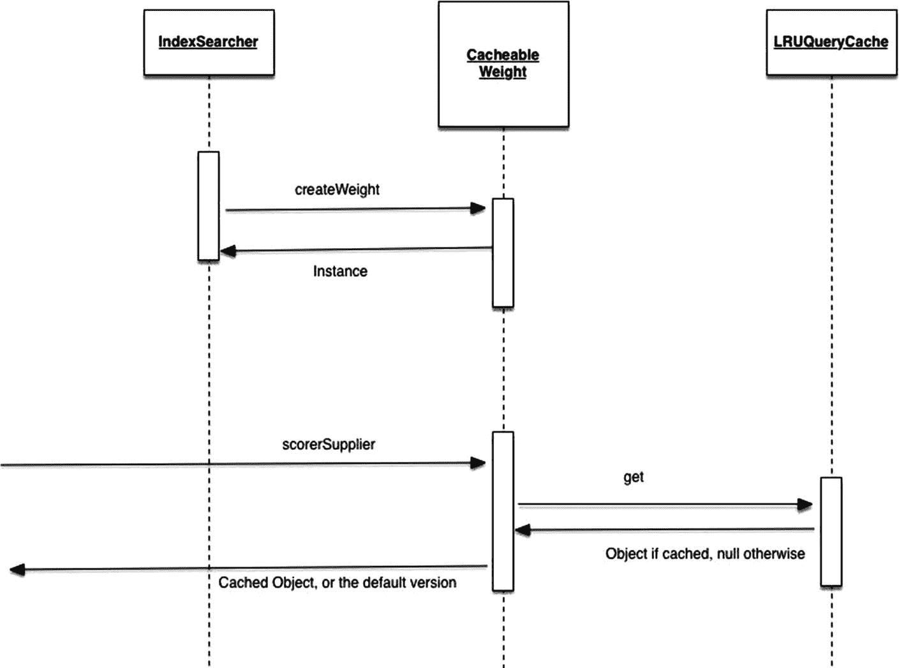
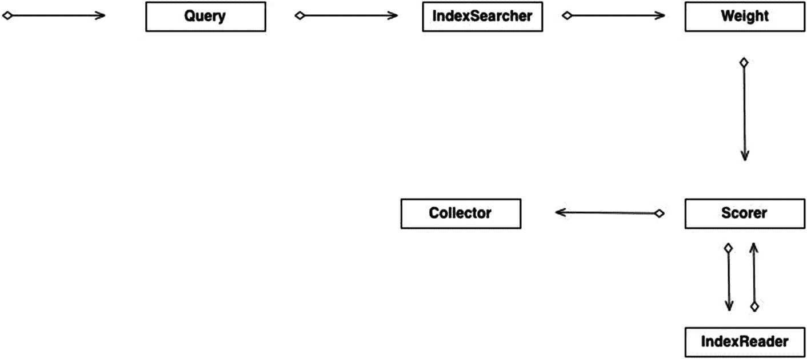

# 3. 核心搜索基础

查询是任何使用 Lucene 的应用程序的基本构建块，理应如此。毕竟，Lucene 之所以备受喜爱，是因为其建立在复杂索引模型之上的强大搜索能力。

本章涵盖了 Lucene 的核心搜索基础、过程中涉及的组件，以及用于利用 Lucene 搜索能力的更常用结构。

作为概述，本章将向您介绍基础知识，而不会深入探讨过于复杂的细节。


## 编解码器

编解码器支持对索引的读写操作。

Lucene 定义了一个抽象类 `Codec`，它概述了 `Codec` 用户应期望的使用模型契约。每个具体的编解码器都需要实现该契约，并确保其性能尽可能高。（请记住，编解码器通常活跃地用于索引的关键路径中，因此任何性能泄漏都可能影响索引创建/更新/删除的整体性能。）

`Codec` 的一个显著特点是它抽象了索引存储方式的复杂性和底层细节。回顾前几章，Lucene 以多种方式表示其索引，并进行了大量底层调优以确保相应的读写操作快速执行。通过这种方式，Lucene 允许在数据结构上轻松执行各种操作。编解码器在向用户隐藏具体细节的同时，兑现了这一承诺。

这种抽象表示还确保了灵活性，可以在不破坏用户现有代码的情况下更改编解码器的底层实现，因为所有编解码器都必须实现相同的契约。

编解码器为底层索引的不同类型组件返回 `Format` 类的具体实例。

`Codec` 使用/返回的 `Format` 实现包括以下内容：

*   `StoredFieldsFormat`：表示存储在底层索引中的字段
*   `FieldsInfoFormat`：包含每个字段的元数据
*   `PostingsFormat`：表示底层的倒排列表，包括字段、词项、文档、偏移量等
*   `DocValuesFormat`：表示列式存储（用于分组、范围查询和排序访问等操作）

当启用复合索引时，会使用一种新的格式类型 `CompoundFormat`。传统上，Lucene 将索引中的不同布局存储在磁盘上的不同文件中。然而，在 Lucene 的新版本中，可以启用复合索引，从而将索引的物理文件统一表示（并导致编解码器返回 `CompoundFormat`，从而支持访问相同的文件）。

## DocValues

Lucene 使用其倒排索引功能以倒排格式存储数据，并允许匹配查询生成结果。然而，这种方式限制了 Lucene 执行其他有趣操作的能力。例如，如果我们想按字段分组、排序或分面，倒排索引无法提供这些功能。

Lucene 有一个重要的组件来解决这个特定用例：`DocValues`。DocValues 是一种列式存储，是倒排索引的非倒排形式。具体来说，`DocValues` 允许访问特定字段。与某个字段关联的所有值都存储在一起，使得访问高效。

一个常见的反对观点是，存储字段提供了类似的功能（即访问字段的特定值）。然而，存储字段在数据批量加载到系统内存时效果最佳。它们不适用于对字段值进行点查找。

可以将 `DocValues` 视为一个反向映射的倒排索引，它与 Lucene 常规倒排索引的映射关系相反。（也就是说，`DocValues` 将文档 ID 映射到字段值。）将字段值存储在一起也有助于磁盘读取，因为读取通常以块为单位进行（因此，当从磁盘读取一个块到主内存时，存储在一起的值很可能会被加载）。在这种情况下，进一步的查找应该具有更低的延迟，因为理想情况下数据应该已经存在于内存中。

为了思考其用途，考虑一个场景：某个字段用于对根据评分标准识别出的命中结果进行排序。要进行排序，我们需要实际的字段值。一种方法是使用命中结果的文档 ID 进行文档读取，然后使用必要的字段来获取所需的值。

然而，这种方法效率低下，对于此类查询来说性能不佳。执行此类查询的最佳方式是拥有一个列式存储，将文档 ID 映射到字段值，从而获得前面描述的所有好处。因此，使用 `DocValues` 的价值现在对你来说应该显而易见了。

你可以按如下方式向文档添加 `DocValue`：

```
doc.add(new SortedDocValuesField ("date", new BytesRef(date) ));
```

## 短语查询

短语查询用于匹配词项的“短语”。系统会搜索按给定顺序出现的一组词项，然后返回保持该顺序的文档，如下所示：

```
private void searchPhraseQuery(String[] phrases)
throws I0Exception, ParseException {
searcher = new Searcher(indexDir);
long startTime = System.currentTimeMillis();
PhraseQuery query = new PhraseQuery();
query.setSlop(0);
for(String word:phrases) {
query.add(new Term(LuceneConstants.FILE_NAME,word));
}
TopDocs hits = searcher.search(query);
long endTime = System.currentTimeMillis();
for(ScoreDoc scoreDoc : hits.scoreDocs) {
Document doc = searcher.getDocument(scoreDoc);
System.out.println("File: "+ doc.get(LuceneConstants.FILE_PATH));
}
searcher.close();
}
```

短语查询要求给定的词项按顺序出现在任何文档中。例如，短语“hi friend”需要匹配“hi”和“friend”，并且“friend”必须紧跟在“hi”之后。

然而，你可以通过为 `slop` 参数赋值来解除此限制。`slop` 参数允许短语中的词之间出现 N 个单词，从而使文档匹配。`slop` 的值越高，命中结果的数量就越多。（不过，较高的值不一定是个好主意，因为高 `slop` 值可能会导致返回的文档中出现不必要的噪音。）


## 词项向量

你可能还记得，词项是 Lucene 中基本的可搜索单元。它由一对字符串组成：字段名和值。

词项向量是一种字段级数据结构，适用于多种操作。如果为某个字段启用了词项向量，该字段中的所有词项都会出现在词项向量中，并且会为每个词项计算相应的元数据。

让我们看几个用例来理解词项向量的价值。

考虑这样一种情况：用户想要挖掘两个文档之间的相似性，或者想要从查询返回的命中结果中获取数据字段的预览。在这两种场景中，底层任务都是在查询生成相应命中结果后，获取关于这些命中结果的额外元数据。

这种操作在倒排索引中很难实现，因为倒排索引的结构和布局不允许轻松获取命中结果周围的内容。为了解决这个特定问题，词项向量应运而生。

我们可以使用词项向量来获取此类数据，并执行复杂的排序（例如在向量空间模型中）、相似度排序，或者仅仅是从命中结果中获取文本摘要。

```
RAMDirectory ramDir = new RAMDirectory();
//索引一些虚构的内容
IndexWriter writer = new IndexWriter(ramDir, new StandardAnalyzer(), true,
IndexWriter.MaxFieldLength.UNLIMITED);
for (int i = 0; i < DOCS.length; i++){
Document doc = new Document();
Field id = new Field("id", "doc_" + i, Field.Store.YES,
Field.Index.NOT_ANALYZED_NO_NORMS);
doc.add(id);
//同时存储位置和偏移量信息
Field text = new Field("content", DOCS[i], Field.Store.NO, Field.Index.ANALYZED,
Field.TermVector.WITH_POSITIONS_OFFSETS);
doc.add(text);
writer.addDocument(doc);
}
writer.close();
```

可以将词项向量视为针对单个文档的微型倒排索引。

词项向量的各种构建模式包括：

*   `TermVector.YES`：仅存储出现次数。
*   `TermVector.WITH_POSITIONS`：存储词项的出现次数和位置，但不存储偏移量。
*   `TermVector.WITH_OFFSETS`：存储词项的出现次数和偏移量，但不存储位置。
*   `TermVector.WITH_POSITIONS_OFFSETS`：存储词项的出现次数、位置和偏移量。
*   `TermVector.NO`：不存储任何词项向量信息。

词项向量为启用了词项向量的字段存储了关于词项的大量元数据。存储的信息包括：

*   文档 ID
*   字段名
*   词项的实际文本
*   频率
*   位置
*   偏移量

## BooleanQuery

`BooleanQuery` 是用于查询 Lucene 并获取相关文档的基本构造。由于其通用行为以及其子句的多样性和表现力，`BooleanQuery` 是最常用的查询类型之一。

`BooleanQuery` 允许指定多个子句及其在整个评分/选择过程中的重要性。

布尔模型在第 2 章中讨论过——本章讨论 Lucene 中的 `BooleanQuery` 实现。

你可以为查询中的子句分配三种“级别”：

*   `MUST`：文档必须匹配此子句才能被视为命中结果。
*   `SHOULD`：这些子句是可选的，有助于提高分数。
*   `MUST NOT`：要被视为命中结果，文档中不应出现这些子句。

以下方法执行了一个 `BooleanQuery`：

```
private void booleanQueryExample(String firstQuery,
String secondQuery) throws I0Exception, ParseException {
searcher = new Searcher(indexDir);
long startTime = System.currentTimeMillis();
Term firstTerm = new Term("foo", firstQuery);
Query internalFirstQuery = new TermQuery(firstTerm);
Term secondTerm = new Term("bar", secondQuery);
Query internalSecondQuery = new PrefixQuery(secondTerm);
BooleanQuery query = new BooleanQuery();
query.add(firstInternalQuery, BooleanClause.Occur.MUST_NOT);
query.add(secondInternalQuery, BooleanClause.Occur.MUST);
TopDocs hits = searcher.search(query);
long endTime = System.currentTimeMillis();
for(ScoreDoc scoreDoc : hits.scoreDocs) {
Document doc = searcher.getDocument(scoreDoc);
}
searcher. Close();
}
```

## MultiTermQuery

`MultiTermQuery` 是一种查询类型，它匹配词项的一个子集并返回相应的结果。

当查询需要按多个词项进行过滤时，多词项查询非常有用。它们相当于 SQL 中的 `IN` 和 `NOT IN` 构造。可以将它们视为动态过滤的强大工具。当通过应用程序自动生成查询时，它们尤其有用。

多词项查询需要传入一个 `FilteredTermsEnum` 来定义用于过滤的词项集合。`FilteredTermsEnum` 是一个词项迭代器，本质上是一个子集。

多词项查询不能直接使用（通过调用构造函数）。相反，必须传入一个 `FilteredTermsEnum` 的具体实现，然后调用 `getTerms()` 方法。

`MultiTermQuery` 的一个流行版本是 `TermRangeQuery`。`TermRangeQuery` 允许指定一个词项范围作为过滤器，两端都包含在内。任何大于或等于下限词项且小于或等于上限词项的词项都将匹配。

```
//假设索引已存在
IndexReader reader = DirectoryReader.open(dir);
IndexSearcher searcher = newSearcher(reader);
TermRangeQuery query = new TermRangeQuery("content", new Term("foo"),
new Term("bar"), true, true);
searcher.search(query);
```

上述代码定义了一个词项范围，从“foo”到“bar”。


## 查询缓存

`QueryCache` 在需要提升重度查询性能时非常有用。`QueryCache` 定义了一个接口，允许在最需要缓存的地方——即查询开始时——对查询进行缓存。

所使用的 `QueryCache` 实现是 `LRUQueryCache`。顾名思义，`LRUQueryCache` 使用最近最少使用算法，在缓存满时淘汰键值。

如第 2 章所述，每个查询都会创建一个 `Weight` 实例（与相应的 `IndexSearcher` 关联）。默认的 `IndexSearcher` 实现使用 `LRUQueryCache` 实例来缓存传入的查询，并创建一个可缓存的 `Weight` 实例。当评分开始时，可缓存的 `Weight` 实例会检查该查询是否存在于缓存中。如果存在，则检索并返回缓存版本。否则，会执行缓存加载，并返回相应的实例（见图 3-1）。



图 3-1

`QueryCache` 的实际应用

`QueryCache` 在高负载和重复查询下能极大地提升性能。然而，对于大量不同的查询，`QueryCache` 实际上可能会增加查询延迟，因为需要额外的查询缓存加载时间。此外，如果被缓存的查询很大，这也会成为整个查询延迟中的一个显著开销。

`Weight` 表示与查询关联的、每个 `IndexSearcher` 的统计信息。这一点至关重要，因为它允许查询被重用（正如本章前面关于 `QueryCache` 的讨论所述）。因此，同一个查询可以在多个 `IndexSearcher` 之间使用，但每个 `IndexSearcher` 都会拥有自己的 `Weight` 实例。请记住，`Weight` 与 `IndexSearcher` + `Query` 相关联，而不仅仅是两者中的某一个。

当将一个查询交给 `IndexSearcher` 执行时，`IndexSearcher` 实例会为其创建一个 `Weight` 实例。`Weight` 的生命周期仅限于该查询在 `IndexSearcher` 内的执行生命周期。

`Weight` 还负责参与评分过程。`Weight` 创建相应的 `Scorer`（在下一节中描述），然后针对正在评估查询的各种文档调用该 `Scorer`。

请注意，`Weight` 完全由 `IndexSearcher` 拥有。它仅为特定查询维护统计信息，`IndexSearcher` 可以随意操作 `Weight` 的数据，而不会对系统的其他部分产生副作用。

## 评分器作为搜索过程的一部分

`Scorer` 是 Lucene 搜索过程的核心。`Scorer` 负责识别匹配项，并对现有文档集中的命中结果进行评分。

`Scorer` 是一个特殊的类。它也是名为 `DocIdSetIterator` 的类的扩展。`DocIdSetIterator` 允许对文档 ID 进行“迭代”，从而可以在索引中定位以获取特定文档，或遍历所有文档。请注意，该迭代器只能向前移动，不能向后移动。这一限制简化了支持该迭代器的底层编解码器。

`DocIdSetIterator` 提供了三个有用的方法：

*   `docID()`：获取此文档的内部索引文档 ID。此方法始终返回单调递增的文档 ID。
*   `nextDoc()`：迭代到下一个文档。
*   `advance(location)`：前进到指定的位置。

该接口允许 `Scorer` 遍历所有文档，并判断它们是否与查询相关。

`Scorer` 通过在迭代器之上实现 `score()` 方法来工作。`score()` 方法获取当前文档 ID，获取当前文档，并返回其分数。`IndexReader` 拥有关于当前文档的统计信息，`Scorer` 可以充分利用这些信息来确定分数。如果为该字段启用了词向量，`Scorer` 可以访问该词向量，并执行更复杂的操作。

评分是如何执行的，在第 2 章中讨论过。这里你将看到所有这些是如何结合在一起的（见图 3-2）。



图 3-2

搜索中的 `Scorer`

用户使用 `Query` 类的实例发出一个查询。该查询被交给一个 `IndexSearcher`，后者首先递归地重写查询（如果可能，调用任何修改/简化操作）。重写完成后，会创建一个 `Weight` 类的实例，该实例特定于 `Query` + `IndexSearcher` 的组合。这个 `Weight` 将包含适用于此查询执行的所有查询特定统计信息。

在评分过程中，`Weight` 创建一个 `Scorer`，它遍历索引中的所有文档，过滤掉不相关的文档，并对候选文档应用评分算法。评分算法可以是用户选择实现或使用的任何算法，但通常是词频/逆文档频率（TF/IDF）家族的一个变体。

`Scorer` 与 `IndexReader` 交互，以从底层文件目录获取相关细节。如果存在词向量，`Scorer` 也可以选择使用其中的特征来计算文档的分数。`Scorer` 需要为它迭代的每个文档返回一个分数。

评分完成后，结果返回给收集器，然后收集器选择下一步操作。如果请求的是前 N 个命中结果，收集器通常会维护一个优先级队列来识别前 N 个命中结果，然后将它们返回给用户。

