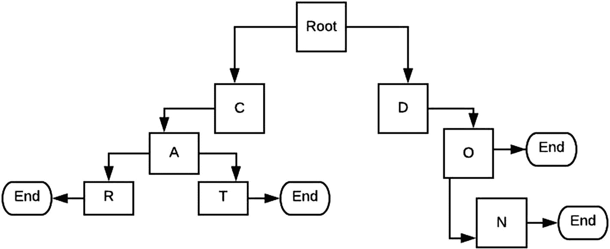
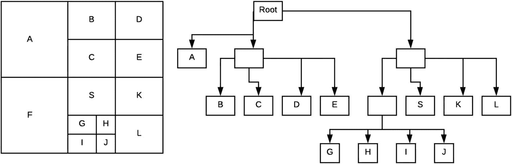
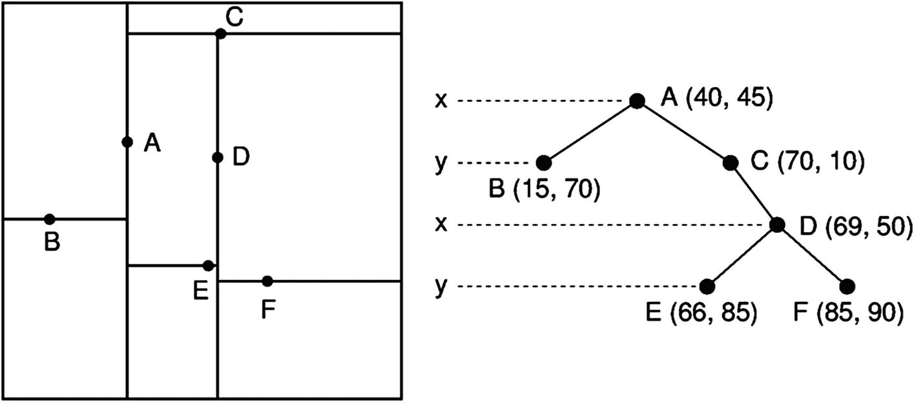
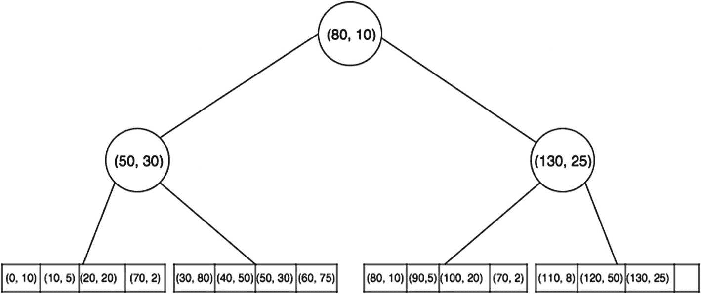

# 4. 空间索引

Lucene 提供了一套丰富的应用程序编程接口（API）来索引和查询空间字段，从而允许执行各种查询。Lucene 支持平面模型或球面模型的空间搜索。

Lucene 在该领域的一些关键特性包括多维点、经纬度点和盒形查询。

Lucene 有一个空间模块，它是负责空间索引和搜索的核心引擎。下一节将研究该模块暴露的 API。


## 空间模块

空间模块基于 Spatial4j，这是一个采用 Apache 许可证的库，提供了各种形状的实现，例如点、矩形和圆形，并且通过额外依赖还支持多边形。

`SpatialStrategy` 是与空间模块交互、索引空间数据以及执行空间查询的核心接口。`SpatialStrategy` 定义了基于形状进行索引和查询的方式。根据 Lucene 的 javadocs，由 `SpatialStrategy` 定义的点如下：

*   每个字段能否索引多个形状？
*   可以索引哪些类型的形状？
*   可以使用哪些类型的查询形状？
*   支持哪些类型的查询操作？这可能因形状而异。

请记住，如果尝试索引的形状与相应 `SpatialStrategy` 定义的不符，则会抛出异常。

前缀树构成了 Lucene 中空间索引数据结构的基础。前缀树类似于字典树（一种树形数据结构，其中形状被分解为字符串，每个字符串代表一个矩形空间区域）。图 4-1 展示了单词“Car”、“Cat”、“Do”和“Don”的前缀树。



图 4-1

一个前缀树

Lucene 定义了一个抽象类 `SpatialPrefixTree`，它代表了前缀树的抽象表示。该类定义了所有必要的方法，例如获取层级数量、获取某一层级的单元格等，这些方法是在搜索过程中处理前缀树所必需的。

正如后续章节所讨论的，Lucene 包含 `SpatialPrefixTree` 的两个具体实现：`QuadPrefixTree` 和 `GeoHashPrefixTree`。

## 什么是地理哈希？

地理哈希是一种将地理信息对象编码为短字母和数字字符串形式的方法。

地理哈希具有层级结构，并提供可变精度（通过从字符串末尾删除字符来减少表示的长度，并相应降低精度）。

地理哈希的价值在于，它可以简单地比较两个地理信息对象的相似性。

对于以地理哈希表示的两个给定对象，前缀匹配将给出这两个对象相似度的值。匹配的前缀程度越高，两个地理对象之间的相似度就越高。

`GeoHashPrefixTree` 基于地理哈希的概念，并使用这种技术来实现 Lucene 的 `Prefix` 树类，以进行相似度计算和匹配。

### 四叉树

四叉树是一种空间数据结构，其中每个节点恰好有四个子节点。每当向树中添加一个新层级时，四叉树都会将空间维度四等分。

四叉树因其两个有用的特性而著称：

*   四叉树中较高层级的节点有助于以较粗的粒度表示整体数据（即，顶层存储的细节深度小于叶节点存储的细节深度）。
*   四叉树非常适合搜索二维空间。例如，给定一个二维空间，要找到最接近给定坐标的点，只需简单遍历四叉树即可得到结果。

图 4-2 展示了一个四叉树。



图 4-2

一个四叉树

### K-D 树

K-D 树是一种空间分割树，允许将空间平面分割成 K 维空间。

K-D 树是一种二叉树，每个节点代表一个 K 维点。简单来说，给定一组点，使用一个轴值来分割范围。例如，如果一个节点代表 X 轴，并且使用 X 轴进行分割，那么左子树包含所有 X 轴值小于分割值的点，右子树包含所有大于该值的点。

K-D 树对于多种查询类型（例如点和范围查询）非常有用。因此，它们是 Lucene 索引能力的重要成员。图 4-3 展示了一个 K-D 树的示例。



图 4-3

一个 K-D 树

Lucene 的实现使用了 Block-KD (BKD) 树，这是一种高效的版本，对 I/O 友好并限制了 I/O 的使用。

### BKD 树

BKD 树的构建方式与 K-D 树相同，递归地划分 N 维空间，并在每次递归时进行等分。然而，一旦点数少于 1024，BKD 树就会停止递归。

此时，所有点都会被写入磁盘上的一个块中。

当一个点在 BKD 树中被索引时，它会被转换为其等效的 byte[] 表示。然后 Lucene 会缓冲正在被索引的点，并使用 `PointsFormat` 将它们写入。所有默认的 Lucene 编解码器现在都支持点的索引。

如图 4-4 所示，BKD 树是一种融合了 B 树的 K-D 树。节点拥有其子节点的压缩键，并定义了键范围以及指向其子节点的等效指针。



图 4-4

一个 BKD 树


## 使用空间索引

现在，我们来看一个如何使用 Lucene 的空间索引能力来表达空间数据和相应查询的示例（该示例同样存在于 Lucene 的仓库中）。

我们首先创建索引：

```
final SpatialContext spatialCxt = SpatialContext.GEO;
final ShapeFactory shapeFactory = spatialCxt.getShapreFactory();
spatialCxt.getShapeFactory();
// 定义空间树的构建方式——我们将使用 "Coordinates" 作为键来为树添加前缀。树的最大深度为 5
// 该树将用于深度为 5 的层级。"Coordinates" 是用作键的字段。
final SpatialStrategy coordinatesStrategy = new RecursivePrefixTreeStrategy(new GeohashPrefixTree(spatialCxt, 5), "coordinates");
// 创建索引
Final Directory directory = new RAMDirectory();
IndexWriterConfig iwConfig = new IndexWriterConfig();
IndexWriter indexWriter = new IndexWriter(directory, iwConfig);
```

显然，我们是在之前见过的标准 `IndexWriter` 类之上，创建了一个基于地理哈希的前缀树。现在，这将允许我们使用创建的实例，直接将点索引到前缀树中。

现在，让我们索引一些文档：

```
//索引一些文档
var r = new Random();
for (int i = 0; i < 3000; i++) {
double latitude = ThreadLocalRandom.current().nextDouble(50.4D, 51.4D);
double longitude = ThreadLocalRandom.current().nextDouble(8.2D, 11.2D);
Document doc = new Document();
doc.add(new StoredField("id", r.nextInt())));
var point = shapeFactory.pointXY(longitude, latitude);
for (var field: coordinatesStrategy.createIndexableFields(point)) {
doc.add(field);
}
doc.add(new StoredField(coordinatesStrategy.getFieldName(), latitude + ":" + longitude));
indexWriter.addDocument(doc);
}
indexWriter.forceMerge(1);
indexWriter.close();
```

请注意，所使用的 `SpatialContext` 类是 Spatial4j 中的一个类，而 Spatial4j 是 Lucene 空间模块的一个依赖项。`SpatialContext` 允许从多种来源（在此上下文中，是从纬度和经度）创建点。然后，该点被索引到数据结构中。

现在，让我们查询索引：

```
//查询索引
final IndexReader indexReader = DirectoryReader.open(directory);
IndexSearcher indexSearcher = new IndexSearcher(indexReader);
// 获取搜索范围
double latitude = ThreadLocalRandom.current().nextDouble(50.4D, 51.4D)
double longitude = TheradLocalRandom.current().nextDouble(8.2D, 11.2D);
/// 近似半径度数
final double NEARBY_RADIUS_DEGREE = DistanceUtils.dist2Degrees(100, DistanceUtils.EARTH_MEAN_RADIUS_KM);
final var spatialArgs = new SpatialArgs(SpatialOperation.IsWithin, shapeFactory.circle(longitude, latitude, NEARBY_RADIUS_DEGREE));
final Query q = coordinatesStratefy.makeQuery(spatialArgs);
try {
final TopDocs topDocs = indexSearcher.search(q, 1 // 文档数量);
if (topDocs.totalHits == 0) {
return;
}
// 获取文档
var doc = indexSearcher.doc(topDocs.scoreDocs[0].doc);
// 获取 ID
var id = doc.getField("id").numericValue();
} catch (IOException e) {
e.printStackTrace();
}
```

这里我们生成了随机的纬度和经度值。然后，我们创建了一个圆形的空间“边界框”，其关系是点应位于圆内。因此，只有当点位于定义的圆内时，它才会被认定为匹配结果。

