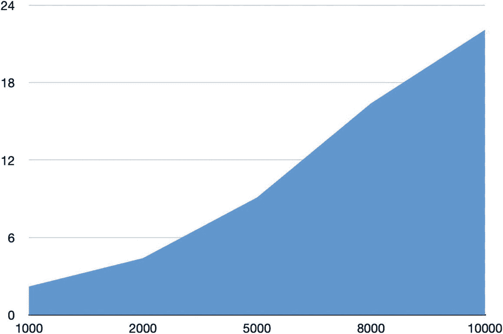
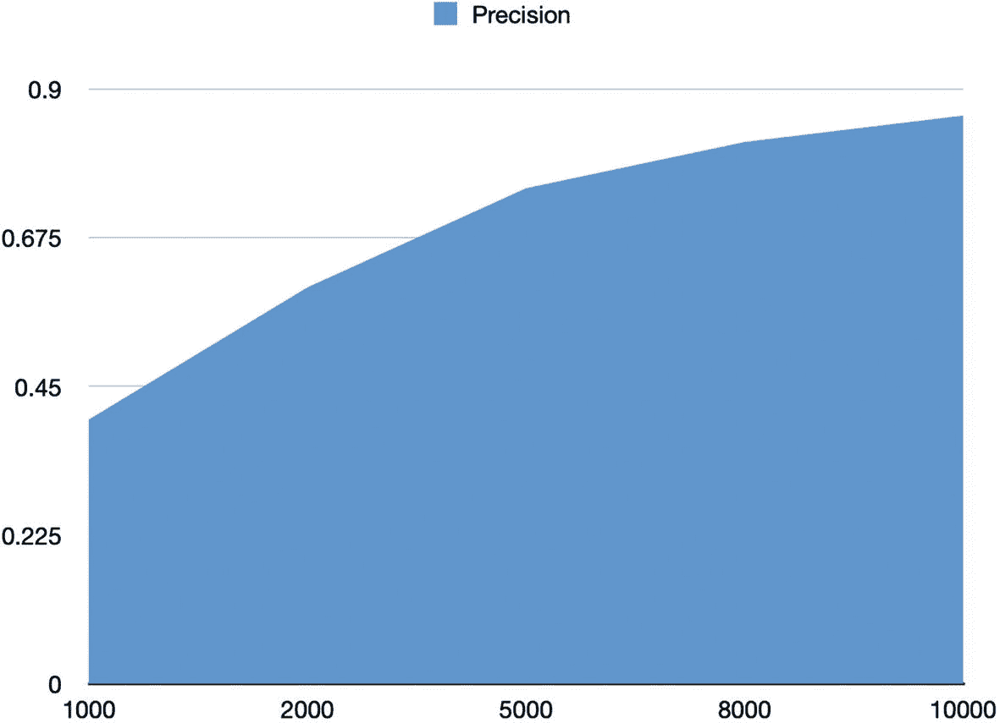
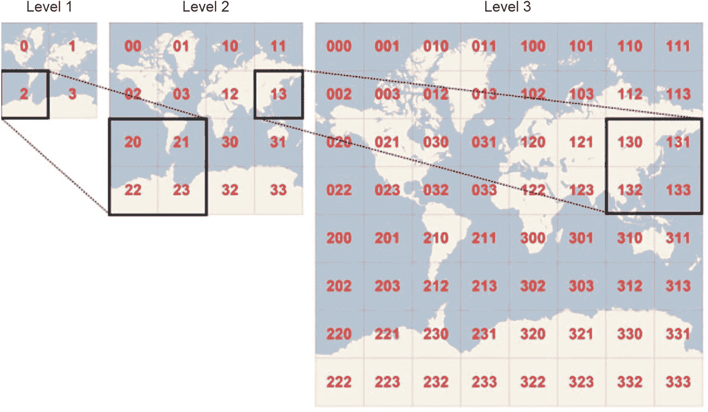

# 5. 位置感知搜索引擎

如今，位置感知搜索引擎至关重要，无论是作为独立的搜索引擎，还是作为支持业务逻辑和运营的组件（想想食品配送应用）。随着支持位置的智能设备的出现，这类数据比以往任何时候都更容易获取，但这也意味着在任意给定时间点，可用于此类查询的数据量呈爆炸式增长。因此，我们必须构建能够随数据扩展，同时持续提供合理性能的存储、索引和搜索策略。

注意

这是一个理论章节，建立在我们之前所讲内容的基础上。这些概念将有助于巩固你已有的知识，并为你构建位置感知搜索引擎奠定基础。

## 为何使用搜索引擎进行地理搜索？

许多可用的地理信息系统（GIS）工具都能执行地理搜索任务。然而，在此用例中利用搜索引擎的优势在于，你可以结合结构化和非结构化数据。这一优势意味着可以表达允许跨文本和地理数据进行搜索的查询。一个查询可以查询文本数据，并对地理数据创建过滤器，反之亦然。

让搜索引擎处理该功能的另一个优势是，可以利用诸如分面、高亮和拼写检查等功能，这些功能使用户在表达查询时拥有更大的控制权。

下一节首先回顾了 Lucene 提供的一些核心查询选项，这些选项使你能够构建此类应用。然后，讨论转向地理空间搜索基础知识，接着我们将完成一个相关项目。

了解地理空间系统并非必需，但理解纬度和经度的一般概念是有益的。本章提供了足够的背景知识，帮助你理解所涉及的概念。

## 范围查询

范围查询和范围过滤器允许你限制给定的输入空间。在范围查询中，用户指定一个边界范围。该边界范围充当索引中文档的边界框，查询仅返回位于给定范围内的文档。这种查询模型非常有用，因为它允许应用程序在地理范围上进行过滤，从而仅对数据集的一个子集执行复杂操作。

```
mod_date:[20020101 TO 20030101]
```

在内部，Lucene 必须枚举所有文档，并根据给定条件进行匹配，以确保它们符合条件，并仅选择那些匹配范围的文档（并根据查询丢弃其他文档）。这个过程可能代价高昂，因此定义你所拥有的地理数据至关重要，这样这些查询就不会显著变慢。

## 函数查询

Lucene 还提供了函数查询，它基本上允许字段的值参与评分机制，而不是仅仅使用默认的评分机制。在本章后面，我们将使用函数查询将纬度和经度数据纳入我们的评分机制。

```
q={!func}div(popularity,price)&fq={!frange l=1000}customer_ratings
```


## 地理空间基础

在构建地理空间搜索引擎时，定义数据的表示方式至关重要。糟糕的表示方式会导致查询缓慢且效率低下，从而全面降低最终用户体验。

地理空间数据通常有多种形式。从州、城市等高层抽象模型，到经纬度等精细形式，地理空间数据的形式决定了其用例。诸如国家及其大致位置这类数据，适用于世界地图等场景，但对于超本地化配送应用（实际经纬度至关重要）则并不适用。因此，没有万能解决方案。

另一个考虑因素是数据在搜索引擎中的表示方式。一旦决定了要使用的数据格式，就必须定义数据在索引中的存储方式以及查询路径的工作方式。通常，糟糕的表示方式会导致索引规模急剧膨胀，并伴随存储成本的相应增加。此外，Lucene 查询是扇出式的，因此被检查的数据量也会增加，这可能导致延迟增加。

从上述讨论中您已经可以理解，与使用纯 GIS 应用程序相比，使用搜索引擎通常更具优势。搜索引擎允许您使用多个焦点来构建复合结果。如前所述，位置数据与语义数据等信息的组合，可以为应用程序提供强大的洞察力。

## 表示空间数据

表示空间数据的一种显而易见的方法是仅存储位置的标识符。例如，考虑将城市名称作为词元索引到倒排索引中。这样做可以支持按城市名称进行搜索。

然而，这种方法具有局限性，因为它只允许执行单一维度的搜索。在这种情况下，只能提供针对城市名称的搜索词查询。

因此，我们需要转向更深层、更丰富的数据模型，以便支持更精细的查询。

需要考虑的一点是，我们的应用程序中使用什么系统来表示所述数据。用于定义被索引数据表示方式的空间参考至关重要。最常见的空间参考是**世界大地测量系统**，我们假设在整个引擎中使用标准系统。

我们将为搜索存储的数据，是我们想要索引和存储的位置的经纬度表示。经纬度通常以相对于本初子午线的度、分、秒来表示。

使用经纬度时的一个问题是信息爆炸的可能性。这完全取决于整体地理范围的构建方式。这意味着数据存储的粒度至关重要。存储的数据过于精细，索引规模就会越大；过于宏观，搜索质量就会下降。

图 5-1 显示了在同一地理区域内，随着存储的经纬度对粒度增加，索引大小的变化。X 轴表示存储的对数，Y 轴表示以千兆字节 (GB) 为单位的大小。



图 5-1

粒度与存储大小

图 5-2 显示了搜索精度与索引大小的关系。显而易见，随着索引大小的增加，搜索精度最终会达到峰值。



图 5-2

搜索精度与索引大小

我们如何解决存储与搜索质量之间的这个矛盾？下一节将为您解答这个问题。

## 分层存储设计

我们不是将所有经纬度都存储在同一个索引中，而是将整个地理范围划分为多个区域。这种在精度和存储之间的权衡是一种达到平衡的方法。

这种划分是通过笛卡尔层级实现的。每个笛卡尔层级专注于地理范围的特定部分。例如，一个层级可能专注于城市的一半区域，而另一个层级可能专注于同一城市的另一部分。

这种设计有助于将数据空间划分为逻辑分区，并有助于为分区组定义独立的索引（从而减少查询的内存占用和整体延迟）。然而，由于同一引擎中两种不同的设计布局可能导致正确性问题，因此在插入新记录或读取数据时，必须确保不存在混淆或歧义。

## 地理哈希

地理哈希是一种流行的经纬度表示方法。从 Lucene 的角度来看，经纬度可以表示为两个独立的字段，但这种表示方式可能导致查询和索引性能问题。

地理哈希提供了表示这些数据的另一种方式。地理哈希将点表示在 Z 阶曲线上，是给定位置的哈希值。Z 阶曲线是一种在不丢失信息的情况下将多维数据映射到单一维度的方法。

想象一下，将世界划分为一个包含 32 个单元格的网格。地理哈希中的第一个字符将初始位置标识为这 32 个单元格之一。

这个单元格本身也包含 32 个单元格，而其中的每个单元格又包含 32 个单元格（以此类推，无穷无尽）。向地理哈希添加字符会细分一个单元格，有效地放大到更详细的区域。

图 5-3 展示了三个不同层级的地理哈希。



图 5-3

地理哈希的三个层级

使用地理哈希可以将其作为 Lucene 中的单个字段进行索引，从而节省一些性能开销。然而，编码和解码本身会消耗 CPU 周期（在性能规划时需要考虑这一点）。

## 结合文本搜索的空间数据

一个典型的位置搜索引擎通常会对索引数据提出以下要求：

*   *距离计算*：给定两个点，计算它们之间的距离。
*   *边界框过滤*：给定一个区域，查找该区域内所有匹配的文档。
*   *排序*：根据所有文档与某个原点的距离进行排序。
*   *相关性增强*：在排序算法中使用距离作为提升因子。
*   *查询解析*：给定一个抽象查询，将其转换为实际的内部表示。


## 距离计算

假设我们需要定义一个度量标准以及计算两点之间距离的方法。最简单的选择是将地球视为平面模型，并使用欧几里得模型计算两点间的距离。这种模型能以最小的复杂度进行直线距离计算。然而，随着距离增加和对更高精度的需求，该模型将不再适用。

另一种选择是将地球视为球体，并使用球面模型计算距离。虽然计算成本更高，但该模型能提供更好的精度。

### 边界框过滤器

边界框过滤器用于指定边界过滤条件，以创建符合地理空间过滤条件的文档候选空间。考虑一个包含文本过滤器和地理空间过滤器的查询。由于地理空间索引会包含大量点，因此合理的做法是先将文档集缩小到一个小子集，然后对该子集应用进一步的过滤器，以实现查询的最佳性能。这就是边界框过滤器的作用所在。理想情况下，地理空间搜索的第一阶段应执行高级别的边界框过滤，然后对第一阶段的结果应用更复杂的搜索方法。

通常，当系统中存储了纬度和经度时，你可以围绕给定的纬度和经度定义一个区域，从而划定一个区域，在该区域内的相关文档符合条件，并参与更高级别的整体过滤。

请注意，如果系统使用地理哈希（geohashes）而不是纬度和经度，则可以确保更高的精度。

### 关于距离计算的一点说明

对于具备地理空间搜索功能的搜索引擎而言，一个关键问题是用于处理和评估查询的距离算法。使用哪种算法取决于你对搜索精度的要求。在某些场景下，偏差一英里是可以接受的。然而，在其他场景下，偏差几英寸就可能导致严重问题。

在大多数情况下，使用欧几里得距离对于各种查询来说已经足够。然而，对于类似地球的模型，哈弗辛（Haversine）计算算法效果非常好。对于更高的精度要求，文森特（Vincenty）模型则更为合理。

