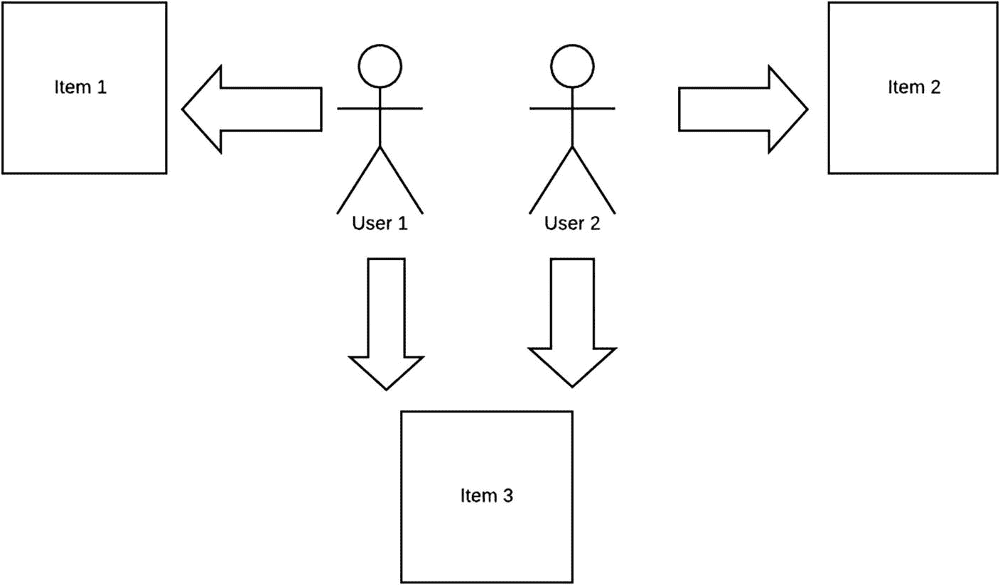
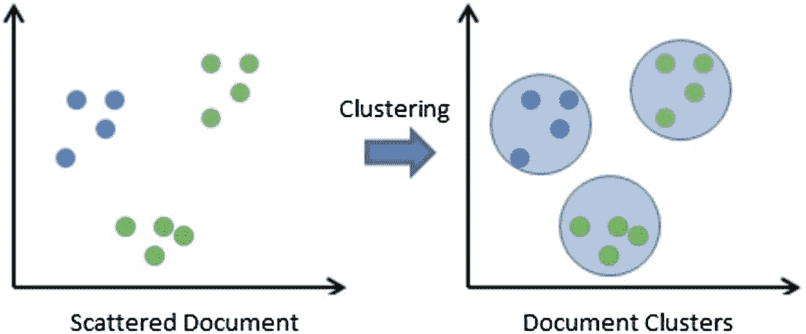

# 6. 使用 Apache Mahout 引入机器学习

本章介绍 Apache Mahout 以及 Apache Mahout 与 Lucene 之间的协同作用。

Apache Mahout 是一个专为可扩展性而设计的机器学习算法库。

## Apache Mahout 的起源

Mahout 起源于 Apache Lucene。2008 年，Lucene 默认内置了一些用于执行某种聚类的算法。

Lucene 在其现有功能基础上不断添加机器学习算法，以至于将其保留在 Lucene 中已不再合理，而是应该将其打造成一个能够独立运行的引擎。这就是 Apache Mahout 项目的诞生。Mahout 最初是 Apache Lucene 的一个子项目，后来成为了顶级项目。

## 为什么选择 Apache Mahout？

Apache Mahout 只是构建机器学习引擎的众多方式之一。我们在此探讨 Apache Mahout，是因为它最初是 Apache Lucene 的一个子项目，因此 Mahout 具有一种天然的互补架构，能够支持对 Lucene 中的数据进行机器学习。

## 机器学习简介

机器学习的应用范围从游戏博弈到欺诈检测，再到股票市场分析。

机器学习使得构建诸如亚马逊推荐系统（试图推测用户购买意图）和 Netflix 推荐系统（基于过往观看历史推荐相关或互补的节目）等系统成为可能。

机器学习利用算法和数学来定义预期结果的类型。分类和过滤是应用机器学习的两个强大用例。

### 学习

*学习*（在机器学习语境中）是“学习”关于数据的新信息，并以越来越高的正确概率做出决策的过程。

两种主要的学习类型是监督学习和无监督学习：

*   *监督学习*是指有样本数据可用于训练机器学习模型，以预测和理解预期输出。

*   *无监督学习*在没有输入数据的情况下工作。相反，它随着过程的进行从结果中学习。通过这种机制，算法从非常低的正确概率开始，然后利用反馈，最终逐步达到更高的正确概率。

聚类是执行第一级过滤并排除你不希望包含在最终搜索结果中的内容的好方法。

### 协同过滤

协同并非一个复杂的概念。这里有一个简单的例子：如果你想看一部电影，你会向朋友寻求推荐。同样地，协同过滤在执行过滤时采用最近邻方法。图 6-1 展示了一个协同过滤模型，其中用户推荐项目。如图所示，项目 3 获得了最高评分，因为两位用户都推荐了该项目。



图 6-1

协同过滤

### 聚类

*聚类*是将相似对象分组的技术。

聚类涉及将大量对象分隔成多个组，使得每个组内的对象彼此之间的相似度高于它们与其他组中对象的相似度。

当你希望将对象分隔到不同的桶中，然后按桶进行处理时，聚类非常有用。

聚类和协同过滤在它们都计算对象之间的相似度这一点上是相似的。然而，聚类仅涉及分隔，而协同过滤则更进一步。

给定两个向量（值元组），我们实际上可以执行不同的分析来确定两者的“接近程度”（例如曼哈顿距离、余弦相似度、欧几里得距离等）。

两种最流行的聚类方式是自上而下和自下而上。自上而下的聚类从一个大的簇开始，然后迭代地将大簇分解成更小的子簇，随着簇粒度的增加，簇内对象之间的相似度也随之增加。自下而上的聚类则相反。它将小簇合并成大簇，以形成最终的配置。流行的方法包括 K-means 和层次聚类。图 6-2 展示了使用 K-means 算法聚类的一组文档。



图 6-2

聚类

### 分类

分类（通常也称为归类）的目标是标记未见过的对象，从而将它们分组在一起。

分类是在看到“未见过的”对象时立即将其放入已知的桶中。这个过程可以包括从先前的候选对象中学习，观察未见过的对象具有哪些属性，然后利用这些属性的已知特征构建模型，以一定的概率为新对象分配一个类别。

用于分类的特征可以是任何在被分类对象的上下文中具有意义的东西。它可以是词性、标签、短语等等。

## 从 Lucene 组件转换为 Mahout 组件

在 Mahout 世界中，特征向量是一个对象或文档的一个子集。明确地说，特征向量是用于表示文档特定属性的一组属性元组。在一般情况下，它可以是一组权重。

特征向量构成了 Lucene 和 Mahout 之间集成的基础。大多数 Mahout 算法都基于特征向量运行。


## 将 Lucene 与 Mahout 集成

Lucene 与 Mahout 的关键区别在于，Lucene 需要支持搜索的特征，而 Mahout 需要与机器学习相关的特征。

将 Lucene 与 Mahout 集成有两种标准方法，如下两小节所述。

### lucene.vector

`lucene.vector` 工具能够将 Lucene 向量转换为 Mahout 向量。请注意，创建向量的 Lucene 版本应与 Mahout 中使用的 Lucene 向量版本一致。

第一步是在转换之前创建词向量。

这里，我们创建一个包含词向量的字段：

```
Field fld = new Field("text", "foo", Field.Store.NO, Field.Index.ANALYZED, Field.TermVector.YES)
```

使用以下命令直接在 Mahout 中转换已创建的 Lucene 索引：

```
/bin/mahout lucene.vector –dir / example/solr/data/index/ –output /tmp/ foo/part-out.vec –field title-clustering – idField id –dictOut 
```

### Lucene2seq

上一节展示了如何将 Lucene 词向量转换为 Mahout 向量，以供 Mahout 集成和处理。本节将展示如何将 Lucene 存储字段转换为 Mahout 可消费的对象（从而可用于 Mahout 处理）。运行以下命令查看选项：

| `$ bin/mahout lucene2seq – help`作业特定选项： |   |
| --- | --- |
| `--output (-o) output` | `输出目录的路径名` |
|   | `output.` |
| `--dir (-d) dir` | `Lucene 目录` |
| `--idField (-i) idField` | `索引中包含 ID 的字段` |
| `containing the id` |   |
| `--fields (-f) fields` | `索引中包含文本的存储字段` |
| `index containing text` |   |
| `--query (-q) query` | `（可选）Lucene 查询。` |
| `Defaults to` | `MatchAllDocsQuery` |
| `--maxHits (-n) maxHits` | `（可选）最大命中数。` |
| `Defaults to 2147483647` |   |
| `--method (-xm) method` | `要使用的执行方法：` |
| `sequential or` | `mapreduce。默认为` |
| `mapreduce` |   |
| `--help (-h)` | `打印帮助信息` |
| `--tempDir tempDir` | `中间输出目录` |
| `directory` |   |
| `--startPhase startPhase` | `要运行的第一个阶段` |
| `--endPhase endPhase` | `要运行的最后一个阶段` |

该工具会获取所有文档并创建一组键值对，其中键是字段 ID 的值，值是与该键关联的所有存储字段的拼接值。

`Lucene2seq` 会转换为序列文件（这些是 Mahout 的组件）。

### Java 版本的 Lucene2seq

使用 `lucene2seq` 的另一种方法是编写一个 Java 程序。一个等效的 Java 类是 `LuceneStorageConfiguration`：

```
LuceneStorageConfiguration luceneStorageConf = new LuceneStorageConfiguration(configuration, asList(index), seqFilesOutputPath, "id", asList("title", "description"));
LuceneIndexToSequenceFiles lucene2Seq = new LuceneIndexToSequenceFiles();
lucene2Seq.run(luceneStorageConf);
```

## 综合运用

在本节中，我们将运用本章讨论的所有内容，使用从 Lucene 索引积累的数据，为 Mahout 编写一个聚类程序。

请注意，这里使用了 `LuceneIndexToSequenceFiles` 将 Lucene 索引转换为 Mahout 序列文件。

然后，它基于标准的 Mahout 技术执行聚类（代码的这一部分没有任何 Lucene 特定的内容）：

```
import org.apache.hadoop.conf.Configuration; import org.apache.hadoop.fs.FileSystem; import org.apache.hadoop.fs.Path;
import org.apache.hadoop.io.IntWritable; import org.apache.hadoop.io.SequenceFile; import org.apache.hadoop.util.ToolRunner; import org.apache.mahout.clustering.Cluster;
import org.apache.mahout.clustering.canopy.CanopyDriver;
import org.apache.mahout.clustering.classify.WeightedPropertyVectorWritable;
import org.apache.mahout.clustering.kmeans.KMeansDriver;
import org.apache.mahout.common.distance.TanimotoDistanceMeasure;
import org.apache.mahout.text.LuceneStorageConfiguration;
import org.apache.mahout.text.SequenceFilesFromLuceneStorage;
importorg.apache.mahout.vectorizer.SparseVectorsFromSequenceFiles;
import com.google.common.collect.Lists;
import java.util.Arrays;
import java.util.List;
//执行简单的 K-means 聚类以分离文档
public class SimpleKMeansClustering {
public static void main(String args[]) throws Exception {
Configuration conf = new Configuration(); FileSystem fs = FileSystem.get(conf);
//使用 Lucene 索引作为输入数据源
Path indexFilesPath = new Path("lucene/indexes/educations");
//ML 模型数据输入——训练数据
Path sequenceFilesPath = new Path("clustering/testdata/sequencefiles/");
Path sparseVectorsPath = new Path("clustering/testdata/sparsevectors/");
//用于 TF IDF 计算
Path tfVectorsPath = new Path("clustering/testdata/sparsevectors/tf-vectors");
Path inputClustersPath = new Path("clustering/testdata/input-clusters");
Path finishedInputClustersPath = new Path("clustering/testdata/input-clusters/clusters-0-final");
Path finalClustersPath = new Path("clustering/output");
//从 Lucene 索引创建序列文件
LuceneStorageConfiguration luceneStorageConf = new LuceneStorageConfiguration(conf, Arrays.asList(indexFilesPath),
sequenceFilesPath, "id", Arrays.asList("name", "description"));
SequenceFilesFromLuceneStorage sequenceFilefromLuceneStorage = new SequenceFilesFromLuceneStorage();
sequenceFilefromLuceneStorage.run(luceneStorageConf);
//从序列文件生成稀疏向量
generateSparseVectors(true, true, true, 5, 4, sequenceFilesPath, sparseVectorsPath);
//为 K-means 生成输入聚类（而不是随机初始化 K 个聚类）
TanimotoDistanceMeasure tanimoDistance = new TanimotoDistanceMeasure();
CanopyDriver.run(tfVectorsPath, inputClustersPath, tanimoDistance, (float) 3.1, (float) 2.1, false, (float) 0.2, true);
//生成 K-means 聚类
KMeansDriver.run(conf, tfVectorsPath, finishedInputClustersPath, finalClustersPath, 0.001, 10, true, 0, true);
//在控制台读取并打印聚类结果
//SequenceFile.Reader reader = new
SequenceFile.Reader(fs, new Path("clustering/output/" + Cluster.CLUSTERED_POINTS_DIR + "/part-m-0"), conf);
IntWritable key = new IntWritable(); WeightedPropertyVectorWritable value = new WeightedPropertyVectorWritable();
while (reader.next(key, value)) {
System.out.println(value.toString() + " belongs to cluster " + key.toString());
}
reader.close();
}
//使用 Mahout 生成权重
public static void generateSparseVectors (boolean tfWeighting, boolean sequential, boolean named, double maxDFSigma, int numDocs, Path inputPath, Path outputPath) throws Exception {
List argList = Lists.newLinkedList();
argList.add("-i");
argList.add(inputPath.toString());
argList.add("-o");
argList.add(outputPath.toString());
if (sequential) {
argList.add("-seq");
}
if (named) {
argList.add("-nv");
}
if (maxDFSigma >= 0) {
argList.add("--maxDFSigma");
argList.add(String.valueOf(maxDFSigma));
}
if (tfWeighting) {
argList.add("--weight");
argList.add("tf");
}
String[] args = argList.toArray(new String[argList.size()]);
ToolRunner.run(new SparseVectorsFromSequenceFiles(), args);
}
}
```

