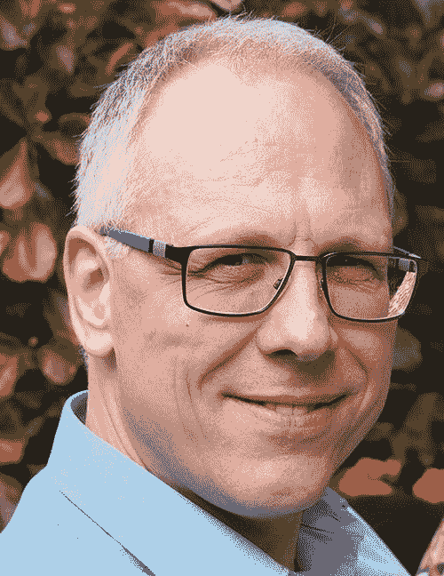

# 关于作者

Michael Müller 是一位拥有超过 30 年经验的 IT 专业人士，其中约 25 年深耕于医疗保健领域。在此期间，他涉足多个领域，尤其擅长项目与产品管理、咨询以及软件开发。他不仅通过开拓国际市场积累了国际视野，还通过领导来自东欧和印度的外部团队获得了国际经验。

目前，他担任德国 DRG 研究所（[`inek.org`](http://inek.org)）的软件开发主管。在此职位上，他负责 Web 应用程序以及其他 Java 和.NET 项目。Web 项目优先采用 Java 技术构建，例如借助 JavaScript 等辅助语言的 JSF。

Michael 是一位专业的 JSF 用户，同时也是 JSR 344 和 JSR 372（JSF）专家组的成员。由于他在社区中的活跃表现，他于 2016 年 1 月受邀加入 NetBeans 梦之队并成为其成员。您可以通过他的博客 [blog.mueller-bruehl.de](https://blog.mueller-bruehl.de) 联系他。在 Twitter 上关注他：@muellermi。

