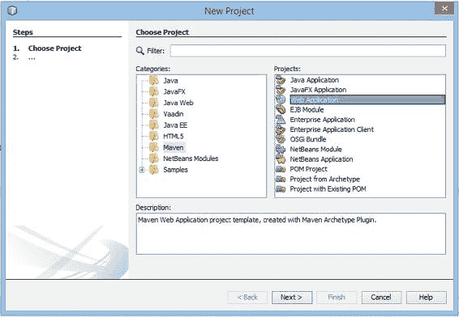
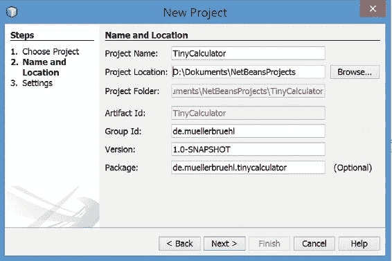
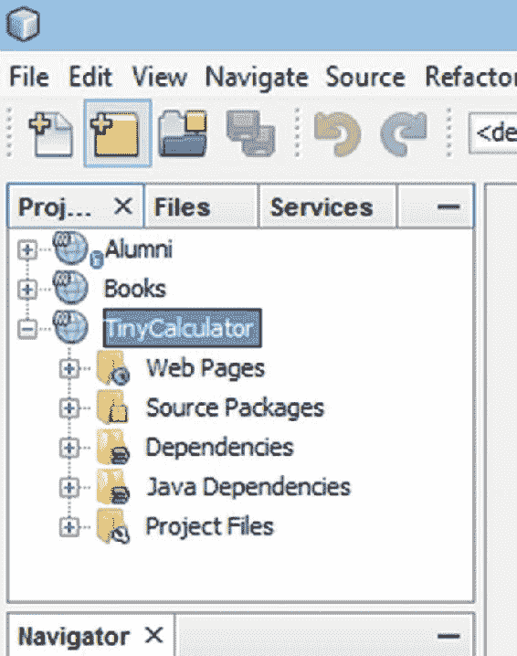
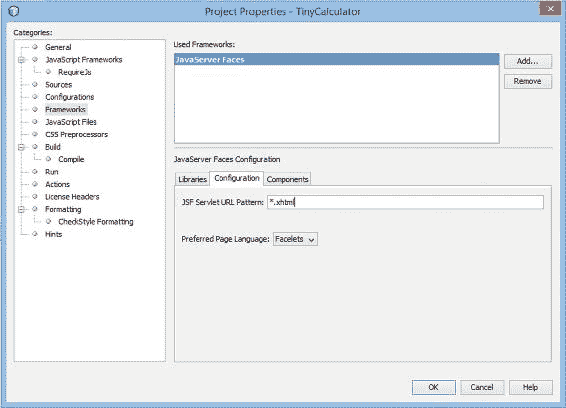
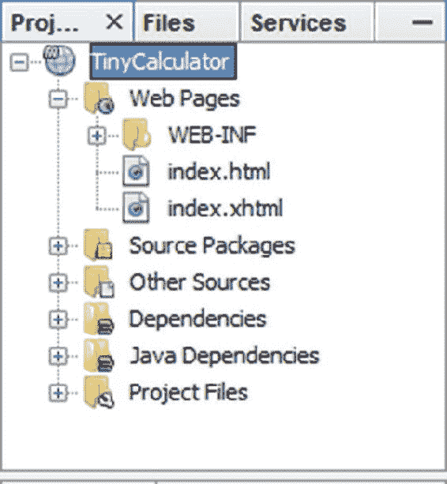
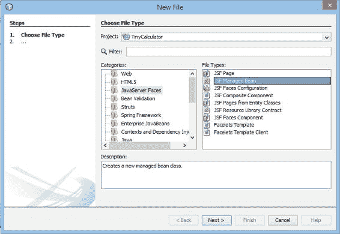
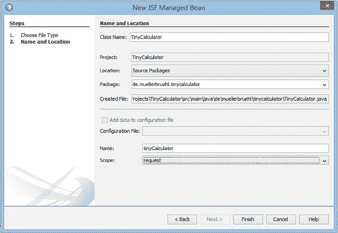
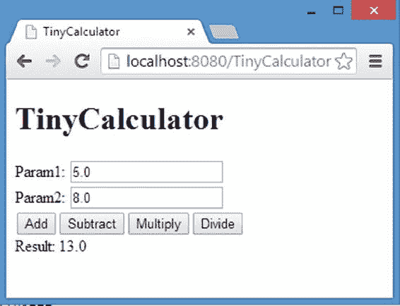
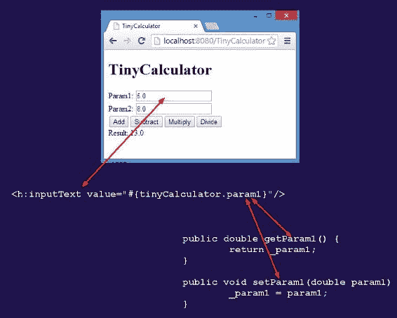

# 1. TinyCalculator

Michael Müller¹

(1) 德国，北莱茵-威斯特法伦州，布吕尔

TinyCalculator 是本书中讨论的第一个也是最简单的应用程序。它不过是一个用于基本算术运算的简单计算器。但它对于展示使用 Java 和 JSF 开发 Web 应用程序的一些基本概念非常有用。

作为一种开胃菜，与我处理其他应用程序的方式不同，我将首先向您展示整个应用程序，然后稍作解释。接着，作为一种重新开始，我将讨论 Web 应用程序的基础知识，并解释 TinyCalculator 以及不同的方法。

您可以通过点击 [www.apress.com/9781484230299](http://www.apress.com/9781484230299) 上的“下载源代码”按钮来获取 TinyCalculator 的源代码。您也可以在 [`webdevelopment-java.info`](http://webdevelopment-java.info) 找到源代码。

## 创建应用程序

使用 Java 和 JSF 的 Web 应用程序需要应用服务器才能运行。别担心——您的 IDE 通常会处理这个问题。稍后，我将更详细地讨论这一点。我们从应用程序开始。

对于本书，我不得不决定在教程部分使用哪个 IDE。NetBeans，无论是 Java EE 版还是 All 版，都附带 GlassFish。在撰写本文时，下载页面的直接链接是 [`netbeans.org/downloads/index.html`](https://netbeans.org/downloads/index.html)。由于 NetBeans 已捐赠给 Apache，此位置可能会更改。如果该链接不再可用，请参考 [`apache.netbeans.org`](https://apache.netbeans.org)。只需安装它，无需进一步配置即可开始使用简单的应用程序。这非常简单。

本书中的许多基本示例都基于 NetBeans 8（英文版），它捆绑了 GlassFish 4。GlassFish 4 是 Java EE 7 的参考实现，对于 TinyCalculator 来说已经足够。要启用全新的 Java EE 8 特性，您需要 GlassFish 5 或任何其他兼容 Java EE 8 的服务器（一旦可用）。GlassFish 5 将随 NetBeans 9 一起提供。由于第一次捐赠（IDE）仍在进行中，而 Java EE 是第二次 Java EE 8 捐赠的一部分，这可能是一个漫长的过程。我将在解释完 TinyCalculator 后描述如何更新到 Java EE 8。

本书中的所有应用程序都使用 Apache Maven（[`maven.apache.org`](http://maven.apache.org)）构建，该工具已捆绑在 NetBeans 中。Maven 应用程序结构几乎与 IDE 无关。因此，您可以使用您选择的任何 IDE（另请参阅第 2 章）。根据您的 IDE，您可以直接打开 Maven 项目（例如，使用 NetBeans），或者可能需要执行简单的导入（例如，使用 Eclipse）。

作为 JSF 或 Java EE 的新手，您可能以前从未创建过基于 Java 的 Web 应用程序。因此，我将以逐步教程的形式从头开始创建这个应用程序。与后续章节不同，我将在此处涵盖整个应用程序而不做详细解释，然后在教程之后我们再补充说明：

1.  启动 NetBeans。

2.  从“文件”菜单中，选择“新建项目”。NetBeans 将显示“新建项目”向导，如图 1-1 所示。



###### 图 1-1 新建项目向导

3.  点击类别“Maven”，点击“Web 应用程序”，然后点击“下一步”。NetBeans 将显示“新建 Web 应用程序”向导，如图 1-2 所示。



###### 图 1-2 新建 Web 应用程序向导

4.  对于“项目名称”，输入 **TinyCalculator**。您可以根据需要调整其他字段，或者保持不变。最佳实践是将“组 ID”设置为您的域名的反向表示。点击“下一步”，在下一个对话框中保持设置不变，然后点击“完成”。

NetBeans 会为您创建一个新的 Web 应用程序骨架，并将其显示在项目树中，如图 1-3 所示。



###### 图 1-3 项目树

5.  在项目树中右键单击（辅助单击）TinyCalculator，然后从上下文菜单中选择“属性”。将出现“项目属性”屏幕，如图 1-4 所示。



###### 图 1-4 框架配置

6.  选择“框架”类别。选择“JavaServer Faces”并点击“添加”按钮。点击“配置”选项卡，并将“JSF Servlet URL 模式”框的内容更改为 ***.xhtml**。点击“确定”。

在将 JSF 添加到项目时，NetBeans 会在网页中创建一个名为 index.xhtml 的网页，同时保留之前创建的 index.html 文件。


7.  在项目树中，打开“Web 页面”节点（如果尚未打开），如图 1-5 所示。选择 `index.html` 并将其删除。



###### 图 1-5 项目树

从“文件”菜单中，选择“新建文件”——或者按下菜单中显示的快捷键，这比点击鼠标更快。IDE 将打开“新建文件”向导，如图 1-6 所示。



###### 图 1-6 新建文件向导

8.  选择类别 **JavaServer Faces**，然后选择 **JSF 托管 Bean**。点击“下一步”。

将出现“新建 JSF 托管 Bean”窗口，如图 1-7 所示。



###### 图 1-7 新建 JSF 托管 Bean

9.  在“类名”中输入 **TinyCalculator**，并从“范围”中选择 `request`。点击“完成”。

NetBeans 将创建并打开一个名为 `TinyCalculator` 的 Java 类文件。

10. 现在，编辑这个类。输入或粘贴清单 1-1 中所示的代码。

###### 清单 1-1 编辑 TinyCalculator 类文件

```
     1   package de.muellerbruehl.tinycalculator;

3   import javax.inject.Named;
     4   import javax.enterprise.context.RequestScoped;

6   /**
     7    *
     8    * @author mmueller
     9    */
    10   @Named
    11   @RequestScoped
    12   public class TinyCalculator {

14     public TinyCalculator() {
    15     }

17     private double _param1;
    18     private double _param2;
    19     private double _result;

21     public double getParam1() {
    22       return _param1;
    23     }

25     public void setParam1(double param1) {
    26       _param1 = param1;
    27     }

29     public double getParam2() {
    30       return _param2;
    31     }

33     public void setParam2(double param2) {
    34       _param2 = param2;
    35     }

37     public double getResult() {
    38       return _result;
    39     }

41     public void setResult(double result) {
    42       _result = result;
    43     }

45     public String add(){
    46       _result = _param1 + _param2;
    47       return "";
    48     }

50     public String subtract(){
    51       _result = _param1 - _param2;
    52       return "";
    53     }

55     public String multiply(){
    56       _result = _param1 * _param2;
    57       return "";
    58     }

60     public String divide(){
    61       _result = _param1 / _param2;
    62       return "";
    63     }
    64   }
    ```

你可能会注意到表示字段的下划线。这种用法与 Java 命名约定略有不同。如果你对我为什么这样做感兴趣，请参阅附录 D。

11. 在编辑器中打开 `index.xhtml` 页面，并将其更改为以下内容：

```
     1   <?xml version='1.0' encoding='UTF-8' ?>
     2   <!DOCTYPE html>
     3   <html xmlns:="http://www.w3.org/1999/xhtml"
     4       xmlns:h="http://xmlns.jcp.org/jsf/html">
     5     <h:head>
     6       <title>TinyCalculator</title>
     7     </h:head>
     8     <h:body>
     9       <h1>TinyCalculator</h1>
    10       <h:form>
    11         <div>
    12           <h:outputLabel value="Param1: "/>
    13           <h:inputText value="#{tinyCalculator.param1}"/>
    14         </div>
    15         <div>
    16           <h:outputLabel value="Param2: "/>
    17           <h:inputText value="#{tinyCalculator.param2}"/>
    18         </div>
    19         <div>
    20           <h:commandButton value="Add"
    21                            action="#{tinyCalculator.add}"/>
    22           <h:commandButton value="Subtract"
    23                            action="#{tinyCalculator.subtract}"/>
    24           <h:commandButton value="Multiply"
    25                            action="#{tinyCalculator.multiply}"/>
    26           <h:commandButton value="Divide"
    27                            action="#{tinyCalculator.divide}"/>
    28         </div>
    29         <div>
    30           <h:outputLabel value="Result: "/>
    31           <h:outputText value="#{tinyCalculator.result}"/>
    32         </div>
    33       </h:form>
    34     </h:body>
    35   </html>
    ```

12. 通过点击“运行”➤“运行项目 (TinyCalculator)”来运行项目。

如果你的应用服务器尚未运行，NetBeans 将启动你的 GlassFish 应用服务器——以及你的浏览器。它将显示 TinyCalculator，如图 1-8 所示。



###### 图 1-8 TinyCalculator 运行中

13. 深吸一口气——很快你就会得到关于到目前为止所发生事情的说明。

###### NetBeans 代码补全

正如你所料，一个好的 Java IDE 会帮助你创建代码。无需手动输入全部源代码。例如，你可以简单地输入三个属性，然后让 NetBeans 为你创建 getter 和 setter 方法。NetBeans 将通过“插入代码”菜单来创建代码。打开上下文菜单（在源代码中右键单击并选择适当的菜单项）或按 `Alt+Insert`。描述 IDE 的所有功能远远超出了本书的范围，但你可以查看 NetBeans 帮助，该帮助可通过“帮助”菜单在线获取。

###### 注意

对于这个逐步教程，我添加了完整的源代码。在未来的清单中，为了简洁起见，我通常会省略导入、简单的 getter 和 setter 等内容。如果你缺少某个导入，请按 `Alt+Shift+I`，NetBeans 将添加这些导入。其他 IDE 也提供类似的快捷键。此外，我通常会将代码示例与详细信息混合在一起。

## 使用 TinyCalculator

本节简要介绍 TinyCalculator 应用程序的一些方面。


### 托管 Bean

我猜想，作为一名 Java 开发者，托管 Bean 的代码是 TinyCalculator 应用程序中最让你熟悉的部分。在 JSF 中，开发者经常谈论*托管 Bean*，NetBeans 在其新建文件对话框中也这样称呼它们。然而，这个术语其实并不准确。

*Java Bean* 是一种可复用的软件组件。它本质上就是一个纯 Java 类，拥有无参构造器，并且其属性遵循特定的约定。*属性*是一个私有成员（字段），通过一对 getter 和 setter 方法进行访问。这些方法遵循 `setName` 和 `getName` 的命名约定。

从面向对象编程的抽象角度来看，对象的状态由属性（attribute）持有。*属性*是一个变量，可以拥有任何修饰符，例如 private、protected、public、static 等。术语 *attribute* 使用广泛，几乎可以指代任何东西。尽管它是描述对象状态的正确术语，但在 Java 中经常使用其他术语（在其他语言中可能也有不同的叫法）。在本书中，我主要使用以下术语：

*   *字段* 是一个 private（有时是 protected）的实例变量。

*   *属性* 是通过一对 getter 和 setter 暴露出来的字段。

JavaServer Faces 被设计为既可以在企业 Java Bean（EJB）容器中运行，也可以在 Servlet 容器中运行。两者都被称为*应用服务器*。前者包含 Java EE 技术的完整或部分栈（除了完整平台外，还定义了一个配置文件，即 *Web 配置文件*），包括 Servlet；而后者仅提供 Servlet 服务。因此，其他 Java EE 技术，如上下文和依赖注入（CDI），在 Servlet 容器中不可用。一些广为人知的 EJB 容器示例包括 GlassFish 和 WildFly。Servlet 容器的示例包括 Tomcat 和 Jetty。

如果 JSF 运行在纯 Servlet 容器上，JSF 管理所谓的*支持 Bean*。这种 Bean 会被注解为 `@ManagedBean`，这就是术语*托管 Bean* 的起源。从 Java EE 6/JSF 2.0 开始，开发者也可以使用 CDI *命名 Bean*，这是当今推荐的技术。在 TinyCalculator 中，我们使用了 CDI 命名 Bean。这种 Bean 通过 `@Named` 注解进行标注。当前版本 JSF 2.3 已弃用旧的 JSF 托管 Bean。如果你想使用 CDI 托管 Bean，你需要使用像 GlassFish 这样的 EJB 容器，或者将 CDI 框架添加到 Servlet 容器中。命名 Bean 或托管 Bean 可以通过其名称进行访问。

第二个注解 `@RequestScoped` 声明了 Bean 的生命周期——对于来自浏览器的每个请求，都会创建该类的一个实例，并在请求结束时销毁。更长的生命周期可以通过 `@SessionScoped`（为每个用户会话提供一个 Bean 实例）、`@ApplicationScoped`（在应用程序生命周期内提供一个实例）等来声明。我将在本书后面部分对此进行更多讨论。

在示例中，我们使用了 CDI 命名 Bean，如代码清单 1-2 所示。

###### 代码清单 1-2 请求作用域 Bean 的 CDI 注解

```
1   import javax.inject.Named;
2   import javax.enterprise.context.RequestScoped;

4   @Named
5   @RequestScoped
6   public class TinyCalculator {...}
```

另一方面，JSF 托管 Bean 的声明方式如代码清单 1-3 所示。

###### 代码清单 1-3 请求作用域 Bean 的 JSF 注解（请勿使用）

```
1   import javax.faces.bean.ManagedBean;
2   import javax.faces.bean.RequestScoped;

4   @ManagedBean
5   @RequestScoped
6   public class TinyCalculator {...}
```

###### 警告

始终将命名/托管 Bean 的注解与适当的作用域注解结合使用——例如，要么都使用 JSF 注解，要么都使用 CDI 注解。特别是，命名 Bean 搭配 JSF 作用域会导致运行时错误。

虽然你不能在单个 Bean 中混合使用这些注解，但在一个应用程序中同时使用两种类型（命名 Bean 和托管 Bean）是可能的。这对于迁移使用了 JSF 托管 Bean 的旧应用程序可能很有用。可以通过将新功能实现为 CDI 命名 Bean 来添加，同时保留现有的 Bean。然后，随着时间的推移，现有的 Bean 也可以逐步更改为命名 Bean。

但是，为什么你应该优先选择 CDI 命名 Bean 而不是 JSF 托管 Bean 呢？顾名思义，JSF 托管 Bean 是专门为 JSF 开发并仅用于 JSF 的。

CDI（上下文和依赖注入）对于 Java EE 来说相对较新，并已纳入 EE 6。它允许容器将合适的对象“注入”到你的对象中。这些对象在编译时可能未知，依赖关系将在运行时解析。这实现了对象的松散耦合。该解决方案的一个基本部分是通用的命名概念。

由于 CDI 命名 Bean 可以在不同的 Java EE 技术中使用，JSF 本身也在逐步迁移到 CDI，这有时会取代专有解决方案。JSF 2.3 最终允许将 JSF 相关对象注入到以前访问这些值非常棘手的地方。对于这个版本，向 CDI 的迁移基本完成。

###### 注意

从 JSF 2.3（Java EE 8）开始，JSF 托管 Bean（`@ManagedBean`）已被弃用。

但是，CDI 在像 Apache Tomcat 这样的纯 Servlet 容器中可用吗？不，但除非你部署 JSF 库来启用它，否则 JSF 也不可用。类似地，你可以将 CDI 添加到 Servlet 容器：只需提供一个 CDI 实现——例如，Weld（[`repo1.maven.org/maven2/org/jboss/weld/servlet/weld-servlet/`](http://repo1.maven.org/maven2/org/jboss/weld/servlet/weld-servlet/)）。对于 Tomcat，有一个更简单的解决方案：使用 TomEE（[`tomee.apache.org/index.html`](http://tomee.apache.org/index.html)），它是 Tomcat 与 Java EE 技术的捆绑包，实现了 Java EE Web Profile。

###### Bean 钝化

如果 Bean 的生命周期扩展到超过一个请求，服务器仍然需要管理这个对象，即使下一个请求可能需要一段时间才会发生，或者永远不会发生。后者通过会话超时来缓解。在此之前，Bean 一直存活。在流量很大的情况下，这种内存消耗可能会引起问题。

为了避免内存问题，或出于其他原因，根据具体实现，容器可能会*钝化*一个 Bean：将对象持久化到某个地方，例如磁盘，并在下一个请求需要时，将其恢复到内存中（*激活*）。

要启用此功能，Bean 必须实现 *Serializable* 接口。


###### 预览作用域

我将在本书后续章节详细讨论作用域。但为了让您对作用域有个初步认识，可以先完成一个小任务。

1.  添加一个日志记录器，并记录 TinyCalculator 类的构造过程：

    ```
    1   private static final Logger LOGGER = Logger.getLogger("TinyCalculator");
    2   public TinyCalculator() {
    3       LOGGER .log(Level.INFO, "ctor TinyCalculator");
    4   }
    ```

2.  启动应用程序，并观察 NetBeans 控制台窗口。

3.  执行一些计算，然后关闭并重新打开浏览器和应用程序。

4.  再执行一些计算。

5.  现在，将 @RequestScoped 注解依次替换为 @SessionScoped 和 @ApplicationScoped，并执行相同的操作。

6.  观察不同的输出结果。

您是否观察到控制台输出了 "ctor TinyCalculator" 这条消息（*ctor* 是 *constructor* 的缩写）？您也会在日志中找到这条消息。使用 @RequestScoped 注解时，每次请求都会出现一次该消息。使用 @SessionScoped 时，该消息仅在新会话（例如关闭并重新启动浏览器后）中出现。使用 @ApplicationScoped 时，该消息仅在应用程序启动后首次调用该 bean 时出现。

这些计算方法可能看起来很奇怪。它们不是返回计算值的函数，而是返回字符串并通过更改结果变量的状态来执行计算的方法。原因很简单：计算是在相应按钮的操作中调用的。此类操作会执行页面导航。返回空字符串或 null 会使浏览器“停留在”当前页面。实际上，此页面将被重新加载（我将在本书后续章节详细讨论页面导航）。如果使用 JSF 2.2 或更高版本，此类函数也可以声明为 void。

### 页面

我不想提前讨论下一章中将要出现的详细解释。我只想指出，页面将被渲染为 HTML 并发送到浏览器。如果您熟悉 HTML，您只会识别出一些 HTML 元素。JSF 最初的意图是为程序员提供一种熟悉的界面，从而隐藏 HTML 的那些细节。因此，JSF 提供了一组自己的标签，这些标签包含在页面中，并在页面发送到浏览器之前被替换。这些标签是常规的 XML 标签，分配给相应的命名空间：

```
1   <h:outputLabel value="Param1: "/>
2   <h:inputText value="#{tinyCalculator.param1}"/>
```

这是一个值为“Param1:”的标签（文本），后面跟着一个文本元素。文本元素的值从我们的 bean 中检索并发送回 bean。`#{…}` 表示表达式语言（EL），用于将用户界面的各个部分与托管 bean 连接起来。`tinyCalculator` 引用我们的 bean——默认情况下，EL 使用首字母小写的 bean 名称，后跟点号表示法和引用的方法。对于属性，这建立了与 getter/setter 对的双向通信。`Name` 指的是 `getName` 和 `setName`（省略了 get 和 set 前缀）。因此，文本元素读取和写入该属性：

```
1   <h:commandButton value="Add" action="#{tinyCalculator.add}"/>
```

对于按钮，每个操作都定义了一个计算方法。

###### 注意

从 JSF 2.2 开始，引入了一种替代方法，减少了 JSF 特定的标签，并使用了更多纯 HTML。这被称为 *HTML 友好标记*，或者更常见的是 *HTML5 友好标记*，尽管它并非 HTML5 所特有。

### 代码与视图之间的关系

从解释中应该可以理解浏览器视图、页面定义和托管 bean 之间的大致关系。但一张图片，如图 1-9 所示，胜过千言万语。



###### 图 1-9 代码与视图之间的大致关系

`<inputText ...>` 标签表示浏览器中的一个文本字段。其值绑定到 bean 的 getter/setter 对。当 JSF 渲染页面时，它会调用 getter 来检索输入字段的值。点击操作按钮后，页面内容会被发送到服务器（在底层使用 HTTP POST）。JSF 通过使用 setter 将数据传输到模型（我们的 bean）中。

###### 注意

前面展示的简化演示有助于初步理解 JSF，但它忽略了一个重要事实：组件树。在处理请求时，所有 JSF 组件都保存在一个树形数据结构中。根据应用程序的增强功能，直接访问或操作此组件树可能很有用。我将在本书后续章节更详细地讨论组件树。

## 总结

在本章中，我们创建了第一个小型 JSF 应用程序。为了快速获得结果，本应用程序以分步教程的形式介绍，随后进行了简要讨论。

还有很多需要解释的内容，包括 NetBeans 在底层为我们构建的配置，我们通过简单地更改项目属性对其进行了修改。本章只是一个开胃菜——一个快速入门。从下一章开始，我将讨论 JSF 及其相关技术的基础知识。

© Michael Müller 2018

Michael Müller, Practical JSF in Java EE 8 , `doi.org/10.1007/978-1-4842-3030-5_2`

