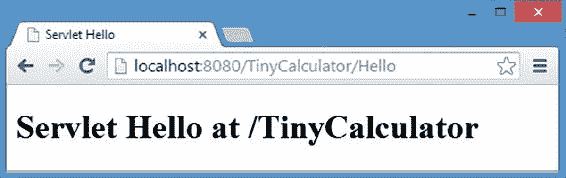

# 2. 基础

Michael Müller^(1 )

(1)德国北莱茵-威斯特法伦州布吕尔

对于 Web 开发，会用到几种不同的技术。本章讨论其中一些技术的基础知识，并提及其他重要技术，包括以下内容：

*   Web 应用程序

*   超文本传输协议（HTTP）

*   超文本标记语言（HTML）

*   层叠样式表（CSS）

*   JavaScript

*   Java

*   Maven

*   Selenium 和 Arquillian

*   Servlet

*   部署

## Web 应用程序

当我在本书中使用 *Web 应用程序* 这个术语时，我遵循以下定义：

> *Web 应用程序是一种通过 Web 浏览器与用户动态交互的客户端-服务器应用程序。*

因此，我们讨论的是不同的部分：呈现用户界面的客户端，以及执行应用程序主要部分的服务器。客户端通过互联网连接到服务器。应用程序逻辑可以分层组织，并在客户端和服务器之间拆分。为了获得更灵敏的用户体验，一些代码在客户端执行。与使用专门编程的客户端的应用程序不同，这里使用通用的 Web 浏览器来显示表示层。这意味着我们无法管理每一个细节。相反，我们必须依赖浏览器的功能，其主要功能是检索和显示 HTML 页面等内容。HTML 页面不仅包含文本信息，还包括图像、媒体文件等。除了内容之外，浏览器还需要处理布局，并可选择执行脚本代码。我们将所有这些内容发送到浏览器，但我们无法完全控制其行为。

一个仅提供静态页面的简单 Web 服务器，对于本书的目的而言，并不是一个 Web 应用程序。但是，通过使用标准 Web 浏览器，Web 应用程序可以在任何（现代）浏览器可用的平台上使用。Web 浏览器通过 HTTP 连接到 Web 服务器。因此，Web 应用程序必须处理此协议的一些限制，如下一节所述。


## HTTP

超文本传输协议是一个逻辑传输层（*应用层协议*），它作用于其他协议层之上，直至物理传输层。HTTP 通常运行在 TCP/IP 之上。顾名思义，它最初设计用于分发超文本信息。因此，它是万维网的基础。

HTTP 是一种无状态的请求-响应协议。服务器监听请求并发送回响应，如图 2-1 所示。随后通信终止。


###### 图 2-1 HTTP 请求-响应周期

图 2-1 中的简化图示展示了用户在检索页面时触发的典型请求-响应周期。实际上，响应是一个 HTTP 响应，由消息头和消息体组成，它可能携带 HTML 以外的信息，例如 JSON、XML 或其他内容。

任何后续请求都独立于之前的请求。这种协议会影响 Web 应用程序与其客户端的工作方式。为了处理应用程序的用户会话，需要在 HTTP 之上实现会话管理。此会话管理的目标是记住应用程序的当前状态。要么服务器需要在某处存储应用程序状态并向客户端提供关键信息，要么服务器将完整的状态信息传输给客户端。

对于后一种方法，服务器端无需记住任何内容。任何状态都可以通过客户端在后续请求中提供的信息来恢复。这种方法使服务器的内存消耗保持在较低水平。通过网络发送大量信息有一些重要的缺点。延迟会降低应用程序的速度。另一个缺点是安全性。如果网络传输未通过传输层安全性（TLS）等协议进行保护，则发送的信息可能会被未经授权的人员读取。将完整状态保存到客户端可以避免“粘性”会话：下一个请求可以由负载均衡器后面的不同服务器处理。

刚才提到的第一种方法是将所有信息保存在服务器上，只向客户端发送一个标识符。这种标识符称为*会话 ID*。传递会话 ID 的常见方式包括使用隐藏字段或发送 HTTP Cookie。如果服务器持有状态，则会话需要由同一台服务器继续，除非你实现了在不同服务器之间共享此状态信息的解决方案。例如，应用程序状态可以保存在共享的键值存储中，并且可以由任何接收到会话 ID 的服务器恢复。在实践中，现代服务器每天可能处理几十个或十万个会话。因此，在许多场景下，这种“粘性”会话无关紧要。

###### 会话劫持

由于 HTTP 的特性，服务器需要会话 ID 等信息来确定如何继续处理。如果未经授权的人员（例如破解者——意为*犯罪黑客*）捕获了此信息，他们可能会接管会话。这被称为*会话劫持*。JSF 提供了一些额外的功能来保护你的应用程序。

幸运的是，会话管理由 Java 环境实现。在 Servlet/JSF 配置中，可以选择客户端状态或服务器状态。

在请求期间，HTTP 会定位一个统一资源标识符（URI）。此外，它会告知服务器要使用哪个 HTTP 方法。这通常被称为*动词*。与 JSF 相关的最常用的方法是 GET 和 POST。

###### URI、URL、URN

有些人说，统一资源标识符（URI）通常用于 REST（*表述性状态转移*的缩写，在第 24 章讨论）的上下文中，而网页是通过称为统一资源定位符（URL）的东西来寻址的。但实际上，URI 可以是 URL 或统一资源名称（URN）。你可以在 [www.ietf.org/rfc/rfc3986.txt](http://www.ietf.org/rfc/rfc3986.txt) 阅读更多关于 URN 的信息。

根据 REST 编程风格，寻址网页以及寻址资源都涉及位置，而非名称。因此，在这两种上下文中，我们都使用 URL。并且由于任何 URL 都是一个 URI，我在本书中使用 URI。

GET 通过使用 URI 从服务器查询信息。额外的参数可以附加到 URI 上——例如，[`it-rezension.de/Books/books.xhtml?catId=2`](http://it-rezension.de/Books/books.xhtml%3FcatId=2)。这定位了位于 it-rezension.de 的服务器，以及其中的应用程序和页面 Books/books.xhtml。附加了一个参数 catId=2。

通过 POST 请求，信息在请求体中被发送到服务器——例如，一个 Web 表单（HTML）包含一些输入字段和一个提交按钮。点击此按钮会发起一个 POST 请求。

在 REST 的上下文中，方法（动词）PUT 和 DELETE 也很重要。REST 背后的思想是将定义好的操作分配给这些动词。虽然本书是关于 JSF 的，并且一个纯 JSF 应用程序不会使用 REST，但我在第 24 章中描述的 Alumni 应用程序并非一个单体应用程序。相反，它利用了一个遵循 REST 概念的 API 服务。

## HTML

HTML 用于描述网页的内容。与 XML 一样，HTML 源自标准通用标记语言（SGML）。

作为一名 Java 开发者，我假设你熟悉 XML。与 XML 类似，HTML 使用标签来组织页面内容。在 XML 中，你可以定义任何你选择的标签并为其赋予任何含义。与 XML 不同，HTML 标签是预定义的，并具有特殊意义。例如，`<head>` 表示 HTML 文件的头部，`<p>` 表示一个段落，等等。因此，HTML 不像 XML 那样具有可扩展性。

###### 标签猜测

在某种程度上，HTML 比 XML 限制更少：缺失的闭合标签不会被标记为错误，而是会自动闭合。浏览器会尝试处理重叠的标签。有些人称赞这种行为，因为它意味着编写更少的标记、更少的工作量、传输更少的数据，并且页面加载更快（但少几个字符真的能让页面加载更快吗？）。

不同的浏览器可能以不同的方式处理缺失或交错的标签，猜测如何补全缺失部分有时会导致危险的代码。（关于这一点，请参阅 Michael Zalewski 的 *The Tangled Web*（No Starch Press, 2011）。）为了避免这一系列问题，我建议你使用 XHTML，这是一种基于 XML 重新定义的 HTML 变体。XML 要求你闭合每一个打开的标签。除了避免刚才提到的问题之外，这还能强制生成格式良好的文档，如果可管理的话，这些文档可以被 XML 工具处理。

一个 HTML 文档以 `<!DOCTYPE>` 开头，后面紧跟一个 `<html>` 标签。然后可以包含 `<head>` 和 `<body>` 标签。对于 XHTML，`<!DOCTYPE>` 之前是 XML 版本声明，如代码清单 2-1 所示。

###### 代码清单 2-1 包含表单的示例 HTML 页面

```
 1   <?xml version='1.0' encoding='UTF-8' ?>
 2   <!DOCTYPE html>
 3   <html>
 4       <head>
 5           <title>TinyCalculator</title>
 6       </head>
 7       <body>
 8           <h1>TinyCalculator</h1>
 9           <form>
10               <div>
11                   <label>Param1: </label>
12                   <input type="text" value="0.0" />
13               </div>
14           </form>
15       </body>
16   </html>
```

你可以在附录 A 中阅读更多关于 HTML 的内容，包括一个带有注释的重要标签列表。


## CSS

HTML 提供了一些用于通过强调、斜体等方式设置页面样式的小标签。层叠样式表（CSS）是作为一种更强大的设计工具而开发的。根据经验法则，你应该将布局与内容分离。因此，不要使用 HTML 样式标签。请专门使用 CSS 进行页面布局。

通过使用 CSS，可以在花括号内定位一个元素并为其分配布局信息，如清单 2-2 所示。

###### 清单 2-2 CSS 语句示例

```
1   h1 {
2       font-size: 2em;
3   }

5   h2 {
6       font-size: 1.5em;
7       font-style: italic;
8   }
```

清单 2-2 演示了如何将布局信息应用于 HTML 标题标签。在第 1 行，我们定位了标题 1（h1）。第 1 行的语句影响字体大小，设置为 2em。这是一个*相对*大小，是标准大小的两倍（无论标准是如何定义的——例如，通过浏览器设置或其他 CSS 语句）。第 5 到 8 行定义了一个带有斜体样式的较小标题。如你所见，多个布局指令（每个指令以分号结尾）可以放在花括号内。从这个意义上说，CSS 等同于 Java 编程。

在前面的示例中，使用 HTML 标签名称来定位 HTML 元素。通常，我们需要对相同名称的不同标签应用可变的样式。为了定位正确的元素，我们需要通过提及不同的标签来构建某种路径（例如，`div div` 用于定位 div 内部的 div），或者为 HTML 元素分配一个类或 id，并使用它进行定位。这些定位元素可以组合起来定义复杂的路径。这种定位元素被称为*选择器*。存在某些规则来避免歧义。

使用 CSS，你不仅可以影响元素的布局，还可以影响其位置和可见性。布局信息可能因输出设备或屏幕尺寸而异。结合所有这些特性，我们可以创建*响应式网页设计*：布局会根据浏览器窗口的大小进行更改和调整。

第 10 章讨论了如何在 Web 应用程序中使用 CSS。我将向你展示如何使用 CSS 创建响应式设计。你可以通过使用不同设备打开 Books（可在 [`it-rezension.de`](https://it-rezension.de) 获取）或通过更改浏览器窗口的大小来模拟其行为。

如今，有许多库可以帮助你设计 Web 应用程序。一个流行的库是 Bootstrap（[`getbootstrap.com`](https://getbootstrap.com)），它不仅依赖于 CSS，还依赖于 JavaScript 等。

与 HTML 一样，我不想让熟悉 CSS 的读者感到厌烦。我在附录 B 中提供了 CSS 的介绍。

## JavaScript

JavaScript 是客户端的编程语言。几乎所有现代浏览器都实现了 JavaScript 解释器或即时（JIT）编译器。微软几年前引入了 VB Script，但 JavaScript 已成为首选语言，并且微软的浏览器也很好地支持它。

###### 注意

JavaScript 由 Netscape 创建，并由欧洲计算机制造商协会标准化。因此，其官方名称是 ECMAScript。*JavaScript* 是 Netscape 对 ECMAScript 实现的名称，而微软的实现官方称为 *JScript*。JavaScript 通常用作 ECMAScript 的同义词，我在本书中也这样使用。

###### JavaScript 和 Java

JavaScript 既不是 Java，也不是从 Java 派生出来的！它以前被称为 *LiveScript*，但很快就被重命名了。它是一种成熟的编程语言，也用于服务器端编程（[`nodejs.org`](http://nodejs.org)）。

Java 8 附带了一个用 Java 编写的 JavaScript 解释器，称为 *Nashorn*。它能够访问 Java 类，这使得无需编译即可运行和测试部分 Java 代码。这在探索新库或测试一些新的 Java 结构时特别有用。你可以在我的博客上找到一个借助 Nashorn 解释 Java 代码的示例：[`blog.mueller-bruehl.de/netbeans/interactive-java-using-nashorn-part-i/`](https://blog.mueller-bruehl.de/netbeans/interactive-java-using-nashorn-part-i/)。

更棒的是，Java 的当前版本 9 包含了 Java Shell（JShell），它实现了一个真正的读取-求值-打印循环（REPL）。你也可以在我的博客上阅读更多相关内容，网址是 [`blog.mueller-bruehl.de/netbeans/interactive-java-with-jshell/`](https://blog.mueller-bruehl.de/netbeans/interactive-java-with-jshell/)。

JavaScript 用于增强客户端行为或发起部分请求（AJAX）。JSF 在其 AJAX 标签背后隐藏了 JavaScript。有时编写一些 JavaScript 代码是很有用的。作为一名 Java 开发人员，理解本书中描述的简单示例（如清单 2-3 所示的示例）对你来说应该没有问题。

###### 清单 2-3 JavaScript 示例：显示一条消息

```
1   alert("The information has been saved");
```

与 Java 不同，JavaScript 不是一种类型化语言。因此，你可以将一个整数赋值给一个变量，然后稍后用字符串替换其值。

## Java

Java 是本书中用于 Web 应用程序编程的主要技术基础。我假设你熟悉 Java SE。

本书中讨论的所有 Web 应用程序都是使用 Java EE 构建的。Java EE 平台是作为 JSR（Java 规范请求，Java EE 7：JSR 342，Java EE 8：JSR 366）构建的。这是一个总括性规范，描述了一个由大量技术构建的完整架构，每种技术都由其自己的 JSR 定义。在本书中，我将介绍其中的大部分技术。

## Maven

对于专业的 Java 开发，你需要一个构建工具。许多开发人员从不关心他们的构建工具，因为它是由他们最喜欢的 IDE 配置的。其他人则非常了解他们的构建工具，并喜欢调整每一个细节。

对于其他开发人员来说，Java 世界中有三种流行的工具：Apache Ant（[`ant.apache.org`](http://ant.apache.org)），它更倾向于命令式；Gradle（[`gradle.org`](https://gradle.org)）；以及 Apache Maven（[`maven.apache.org`](http://maven.apache.org)），它遵循更声明式的方法。Apache 的网站称 Maven 为“软件项目管理和理解工具”。流行的 IDE，如 NetBeans，对这两种工具都有内置支持。然而，无论你更喜欢哪种工具，基于 Ant 的项目通常使用特定于你所使用的 IDE 的配置，而 Maven 项目遵循更严格的约定，因此大多独立于 IDE。例如，NetBeans 能够直接打开 Maven 项目。其他 IDE（如 Eclipse）为基于 Maven 的项目提供了导入功能。

为了确保与你最喜欢的 IDE 的最大兼容性，本书中讨论的所有应用程序都是使用 Maven 构建的。

## Selenium 和 Arquillian

Selenium（[`docs.seleniumhq.org`](http://docs.seleniumhq.org)）可以自动化浏览器。除了宏录制和回放之外，这种自动化可以完全从 Java 应用程序内部进行控制——例如，通过测试。这样做可以启用 Web 应用程序的 GUI 测试。

测试由容器管理的 Bean 或其他组件可能很麻烦。Arquillian（[`arquillian.org`](http://arquillian.org)）允许在容器内测试 Web 应用程序中感兴趣的部分。它与 JUnit 等测试框架完全集成。

虽然本书不侧重于单元测试或测试驱动开发，但我将使用这两种工具讨论一些简单的测试场景。


## Servlet

*Servlet* 是一种托管在 Servlet 容器中的 Java 类，用于动态处理请求并构建响应。此类必须符合 Java Servlet API 规范。与其他 Java EE 组件一样，它由 *Java 社区进程*（JCP）制定规范。Java EE 7 中包含的 Servlet 版本是 JSR 340：Java Servlet 3.1 规范（[`jcp.org/en/jsr/detail?id=340`](https://jcp.org/en/jsr/detail%3Fid=340)），而 Java EE 8 中对应的则是 JSR 369（[`jcp.org/en/jsr/detail?id=369`](https://jcp.org/en/jsr/detail%3Fid=369)）：Java Servlet 4.0 规范。（JSR 是 Java 规范请求的缩写。）

尽管理论上 Servlet 可以响应任何请求，但 Java EE 实现仅响应 HTTP 请求。因此，我将 *Servlet* 一词用作 *HTTP Servlet* 的同义词。Servlet 的生命周期由容器维护。Web 客户端（浏览器）通过请求/响应与 Servlet 交互，如“HTTP”一节所述。Servlet 是扩展抽象类 javax.servlet.http.HttpServlet 的类。在大多数常见场景中，至少需要重写 doGet 和 doPost 这两个方法来实现特定行为并发送回响应。这两个方法分别对应 HTTP 的 GET 和 POST 方法。

Servlet 由客户端对特定路径（URI 的一部分）的请求调用。通过使用简单的注解 @WebServlet("/path") 即可定义此路径。在讨论 JSF 配置时，我将介绍如何通过配置文件（web.xml）配置 Servlet。JSF 本身也是作为 Servlet（FacesServlet）实现的。

如果你通过 NetBeans 8 的“添加 Servlet”向导（新建文件 ➤ Web ➤ Servlet）来增强 TinyCalculator，并将名称设为 Hello，NetBeans 将生成如代码清单 2-4 所示的代码。

###### 代码清单 2-4 通过 Servlet 以编程方式生成 HTML 页面

```
 1   [imports omitted]

 3   @WebServlet(name = "Hello", urlPatterns = {"/Hello"})
 4   public class Hello extends HttpServlet {

 6       /**
 7        * Processes requests for both HTTP <code>GET</code>
 8        * and <code>POST</code> methods.
 9        *
10        * @param request servlet request
11        * @param response servlet response
12        * @throws ServletException if a servlet-specific error occurs
13        * @throws IOException if an I/O error occurs
14        */
15       protected void processRequest(HttpServletRequest request,
16               HttpServletResponse response)
17               throws ServletException, IOException {
18           response.setContentType("text/html;charset=UTF-8");
19           try (PrintWriter out = response.getWriter()) {
20               /* TODO output your page here.
21                  You may use following sample code. */
22               out.println("<!DOCTYPE html>");
23               out.println("<html>");
24               out.println("<head>");
25               out.println("<title>Servlet Hello</title>");
26               out.println("</head>");
27               out.println("<body>");
28               out.println("<h1>Servlet Hello at "
29                   + request.getContextPath() + "</h1>");    
30               out.println("</body>");
31               out.println("</html>");
32           }
33       }

35       /**
36        * Handles the HTTP <code>GET</code> method.
37        *
38        * @param request servlet request
39        * @param response servlet response
40        * @throws ServletException if a servlet-specific error occurs
41        * @throws IOException if an I/O error occurs
42        */
43       @Override
44       protected void doGet(HttpServletRequest request,
45               HttpServletResponse response)
46               throws ServletException, IOException {
47           processRequest(request, response);
48       }

50       /**
51        * Handles the HTTP <code>POST</code> method.
52        *
53        * @param request servlet request
54        * @param response servlet response
55        * @throws ServletException if a servlet-specific error occurs
56        * @throws IOException if an I/O error occurs
57        */
58       @Override
59       protected void doPost(HttpServletRequest request,
60               HttpServletResponse response)
61               throws ServletException, IOException {
62           processRequest(request, response);
63       }

65       [...code omitted ...]
66   }
```

如果你启动此应用程序，并在 URI 后添加 /Hello，即可验证 Servlet 正在响应你的请求，如图 2-2 所示。



###### 图 2-2 Hello Servlet 运行效果

如前所述，我们需要重写 doGet 和 doPost 方法。这是我们通常放置代码以响应 HTTP 方法的地方。如果处理 GET 或 POST 请求没有区别，这两个方法可以委托给一个公共处理器。NetBeans 正是这样生成这个骨架文件的。这个公共处理器就是 processRequest 方法（第 15 行及之后）。这个骨架会响应一个网页。所有 HTML 标签都通过 Java 指令写入输出流。除了字面 HTML 代码外，NetBeans 还向此输出中插入了一个方法调用：request.getContextPath()，它指向当前应用程序的上下文路径。上下文路径是 URI 中服务器和端口之后的第一部分，是应用程序所在的位置。在图 2-2 中，输出为 "/TinyCalculator"。我们将在第 24 章使用的服务中再次用到此方法。

对于任何超出简单示例的应用程序，直接在 Java 代码中编写 HTML 代码都不是一个好方法。一种替代方案是使用 Java 服务器页面（JSP）将 HTML 页面与 Java 代码分离。页面独立存储，其中嵌入了 JSP 标签，并在稍后编译成 Servlet。尽管纯 JSP 仍在使用，但它可被视为 JSF 的前身。事实上，早期版本的 JSF 使用 JSP 进行视图定义。

## 部署

所有 Servlet，包括 JSF，都在 Servlet 容器内运行。当我们启动 TinyCalculator 时，NetBeans 会自动启动 GlassFish（如果尚未运行）并将应用程序部署到应用服务器。

如果我们想将应用程序安装到生产服务器，可以将该服务器添加到 NetBeans 环境（或你喜欢的 IDE）中，并让 IDE 执行到生产系统的部署。如果由于某种原因无法使用 IDE 进行部署，你也可以自行部署应用程序。此过程取决于你使用的应用服务器。

以 GlassFish 为例，你可以使用 asadmin 命令在命令行进行部署，也可以使用浏览器登录管理控制台。GlassFish 提供了一个“应用程序”菜单，用于部署、取消部署、启动应用程序等操作。最后但同样重要的是，你可以使用 Maven 在构建过程之后自动部署应用程序。

## 总结

本章介绍了本书后续开发 Web 应用程序所需的技术基础：HTTP、HTML、CSS、JavaScript、Java、Maven、Selenium 和 Arquillian、Servlet 以及部署。对选定的技术进行了简要说明，其他技术则仅提及。我跳过了对 Java EE 和 JSF 的讨论，因为它们不属于基础部分，而是本书的主要主题。

对于不熟悉此技术栈中浏览器部分的读者，本书在附录 A 中提供了有关 HTML 的补充信息，在附录 B 中提供了有关 CSS 的补充信息。

© Michael Müller 2018

Michael Müller, Practical JSF in Java EE 8 , `doi.org/10.1007/978-1-4842-3030-5_3`


