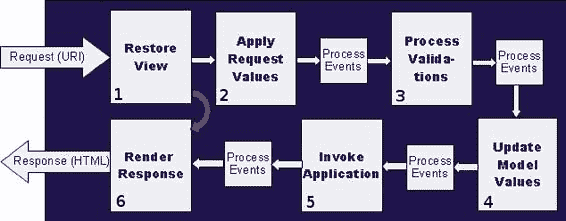

# 3. JavaServer Faces

Michael Müller¹

(1)德国北莱茵-威斯特法伦州布吕尔

如果说 JavaServer Pages (JSP) 用于定义页面，这些页面会被编译成 Servlet，那么 JavaServer Faces (JSF) 则是一个完整的 Web MVC（模型-视图-控制器）框架。有趣的是，它本身也是作为一个 Servlet 实现的。

以下是该规范的一个简短摘录：

*   使得从一组可复用的 UI 组件构建用户界面变得简单
*   简化了应用程序数据与用户界面之间的迁移
*   帮助管理跨服务器请求的 UI 状态
*   为将客户端生成的事件连接到服务器端应用程序代码提供了一个简单的模型
*   允许轻松构建和复用自定义 UI 组件

JSF 旨在处理跨多个请求的组件状态。它可以用于处理复杂的表单，即使这些表单跨越多个页面。它为客户端创建的事件提供了一个强类型的事件模型，并实现了强大的页面导航功能。

JSF 由一系列 JSR 定义：

*   2004 年 JSR 127 JavaServer Faces
*   2006 年 JSR 252 JavaServer Faces 1.2
*   2009 年 JSR 314 JavaServer Faces 2.0
*   2010 年及以后 JavaServer Faces 2.1，JSF 2.0 的维护版本
*   2013 年 JSR 344 JavaServer Faces 2.2
*   2016 年 JSR 372 JavaServer Faces 2.3

如果你对 JSF 的完整历史感兴趣，包括哪个版本引入了哪些特性，你可能想阅读相应的 JSR。但请注意：规范主要是一个抽象的定义文档——它既不是入门指南，也不是实践手册。

JSF 最初的一个意图是隐藏 HTML，并为程序员提供一个熟悉的事件处理编程概念。从 JSF 2.2 开始，你可以主要使用 JSF 标签，或者创建以 HTML 为主的文档，并加入一些 JSF 特有的属性。

在本书中，我们将从第一种（传统）方法开始，使用特定的标签。之后，我们将使用对 HTML 友好的标记，如果你熟悉 HTML，这可能是一个不错的选择。正如你将看到的，两种风格都有其特定的优势。

## 视图定义语言

JSF 使用一种可交换的视图定义语言（VDL）来定义用户界面。目前，JSF 支持 JSP 和 Facelets。

JSP 从第一个版本就开始使用。由于 JSF 的生命周期与 JSP 的生命周期略有不同，Jacob Hookom 开发了一种名为 *Facelets* 的替代 VDL，它与 JSF 完美集成。Facelets 在 JSF 2.0 中成为标准的 VDL。从该版本开始的所有主要新特性，如模板、复合组件等，都仅适用于 Facelets。尽管为了兼容性仍然支持 JSP，但你可以将其视为已弃用。

本书中的所有应用程序都是使用 Facelets 构建的。

## Web 应用与传统应用

在传统应用中，应用程序本身通常负责呈现。即使你使用了像 X Window 系统这样的专用显示服务器，它仍然由应用程序控制。

但在 Web 应用中，数据被传递给浏览器，由浏览器负责呈现。为此，服务器将要显示的内容打包成浏览器能够理解的格式——例如，HTML 或 XHTML 文档。此外，服务器可能会以层叠样式表（CSS）的形式提供一些布局信息。其他一切都取决于浏览器。正如存在不同的浏览器一样，呈现方式也可能不同。幸运的是，标准的持续发展确保了逐渐趋同。但如果用户使用自己的浏览器配置，呈现方式可能又会不同。

Web 应用不仅将输出委托给客户端浏览器，而且通常不会自行激活！只有当用户通过浏览器请求页面时，应用程序才会在服务器上激活，执行一些操作，并将内容传递给浏览器。根据用户的输入，页面的内容可能会在不导航到新 URL 的情况下发生变化。这种（看似）主动的内容变化可能会让用户感觉是由服务器端主动发起的。实际上，这种处理通常是通过一个小的后台请求，借助异步 JavaScript 和 XML（AJAX）来完成的。

除了 (X)HTML 和 CSS，我们还提到了另一种浏览器端技术：JavaScript。浏览器使用 JavaScript 在后台请求一些数据，并交换浏览器内容的部分，即文档对象模型（DOM）。用 JSF 的术语来说，这是通过部分处理和/或部分渲染来完成的。这种魔法给人的印象是服务器在更新屏幕，尽管实际上是由客户端向服务器请求信息（客户端拉取）。真正的*推送*，即服务器主动改变呈现，要稍微复杂一些。对客户端的响应被人为延迟，以便在服务器端出现新信息时，稍后传输更多信息。或者你可以使用像 WebSockets 这样的新技术。WebSockets 需要更多解释，将在本书后面讨论。

在传统应用中，程序通常立即响应用户输入。在 Web 应用中，程序只有在请求新页面或（通常结合 AJAX）请求部分新数据时，才会检测到用户输入。到此时，用户可能已经在各个字段中进行了输入。不难想象，应用程序必须以不同的方式处理这种情况。在这一点上，JSF 为程序员提供了支持，并为每个输入在服务器上引发相应的事件，使得编程模型与开发者通常使用的模型并非完全不同。

另一个区别：Web 应用通常运行在一个提供多种服务的执行环境中。这样的运行时环境被称为*容器*。在 JSF 的情况下，它是一个所谓的 Servlet 容器。这指向了 Servlet 的底层技术。即使在使用 JSF 开发时，直接使用 Servlet 有时也可能是合适的，因此熟悉 Servlet 技术不会有坏处。

Servlet 容器为应用程序提供了与其他服务的接口。它是应用服务器或 Web 服务器的一部分。许多服务器主要包含一个容器，因此容器和应用服务器的概念经常互换使用。实际上，一个服务器可以托管多个容器。例如，GlassFish 不仅托管一个 Servlet 容器，还托管一个 EJB 容器。在下一节中，我们将首先从外部来看应用服务器。

现在，当用户想要使用 Web 应用时，他会在浏览器中调用应用程序的 URI。客户端向 HTTP 服务器发出请求。HTTP 服务器根据 URI 识别出它不能简单地向浏览器提供静态页面。因此，服务器将请求通过容器转发给 Web 应用，在本例中，是 JSF Servlet 与用户代码的结合体，并在那里进行处理。输出被生成为 (X)HTML 文档，发送到浏览器，并在那里显示。该过程如图 3-1 所示。


###### 图 3-1 HTTP 请求-响应周期

从技术上讲，响应是 HTTP 协议，其中可能包含 HTML 之外的其他信息。例如，响应可能是嵌入在 HTML 页面中的一张图片。因此，许多程序员将其视为 HTML 响应。图 3-1 展示了这种简化视图。

从这个角度来看，我们将应用服务器视为一个*黑盒*。其内部发生的事情很有趣。简要回顾一下之前的应用程序——这里你定义了一个 JSF 页面。我们使用 Facelets 作为页面语言。除了 HTML，每个 Facelets 页面定义都包含一些 JSF 特定的标签，例如 `<h:inputText>`。在浏览器中，我们提供了这样一个页面的 URI。在应用程序的后续步骤中，这个 URI 将不再由用户（通过输入 URI）提供，而是由应用程序本身提供。

服务器根据 URI 确定要渲染的页面，解析其内容，并解析这些标签。在最简单的情况下，标签会被替换为相应的数据，然后生成的页面被发送到浏览器。但这只是部分情况。浏览器之前确实可能已经显示了应用程序的数据。因此，JSF 首先会检查是否已存在会话。如果存在，则会恢复组件树——即视图模型的逻辑表示。接着验证输入项，并更新数据模型。总的来说，对于图 3-1 中的步骤 2，JSF 有六个不同的阶段。

让我们深入一点，简要了解一下处理过程以及 JSF 生命周期。

## JSF 生命周期概述

JSF 生命周期包含六个阶段，如图 3-2 所示：

1.  恢复视图
2.  应用请求值
3.  处理验证
4.  更新模型值
5.  调用应用程序
6.  渲染响应



###### 图 3-2 JSF 生命周期

图 3-2 展示了六个主要阶段以及它们之间表示事件处理的小方框。箭头表示顺序处理流程，指示了正常流程。对于新页面，流程可能会有所不同，如弯曲箭头所示。在某些阶段之间，会处理（前一阶段的）事件。作为此处理的异常结果（图中未显示），你可能会跳出顺序流程。

当请求到达服务器时，首先会恢复组件树。如果是对新页面的请求，则不存在现有的组件树。因此，无需恢复，而是创建一个新的组件树。在这种情况下，阶段 2 到阶段 5 是无用的，将被跳过。服务器只需渲染响应并将其发送回客户端。

在阶段 2，传入的值将被应用到组件树中的组件上。我稍后会解释组件树——现在，只需将组件树想象成页面中每个 JSF 标签在内存中的表示。

*处理验证*阶段（阶段 3）将验证并转换数据。假设有一个用于输入年龄的字段。在浏览器中，用户可能输入任何文本，这个传入的字符串必须被转换为数字。然后检查有效范围——例如，从 0 到 120 岁。

一旦值被转换和验证，模型值将在阶段 4 被更新。此时，传入的值将被分配给模型——例如，托管 Bean 的属性。

在阶段 5，JSF 将通过调用适当的事件（例如值更改事件、动作事件等）来调用应用程序。在传统应用程序中，这些事件由屏幕组件（如按钮、图标、菜单项等）触发。在 Web 应用程序中，浏览器只发送请求，所有事件都在服务器端生成，以模拟非 Web 应用程序的行为。例如，如果 JSF 检测到输入元素的值不同，它会生成一个“已更改”事件。因此，作为应用程序开发者，你可以对此事件做出反应。

在*渲染响应*阶段（阶段 6），会创建 HTTP 响应（主要是 HTML），然后发送给客户端。

通常，只有当一个阶段成功完成后，才会执行下一个阶段。例如，如果在验证期间发生错误，后续阶段将被跳过，JSF 会继续执行最后一个阶段——渲染响应，并将响应发送给客户端。在图中主要阶段之间，你可以看到*处理事件*方框。在此类事件处理过程中，你可以通过编程方式退出常规工作流，并直接继续执行渲染响应阶段。为了完整描述，我们需要添加从每个处理事件方框指向阶段 6 的箭头。这种绕过正常流程的情况可能由异常触发。根据异常的类型，JSF 会生成消息并发送回客户端。此外，虽然不太常用，但你可以在处理事件期间终止整个生命周期。

因此，例如，如果单个输入字段在验证期间失败，则其他字段都不会被推送到模型中。这种“全有或全无”的方法有助于获得基本一致的数据。但有时，即使数据的其他部分有误，接收部分数据也可能是有价值的。为了实现这一点，JSF 提供了一个 `immediate` 属性，可以将其设置为 `true` 来改变相应 UI 元素的这种行为。

以上是对 JSF 生命周期的简要概述。在讨论示例应用程序的各个方面时，我们将更深入地探讨它。

## JSF 命名空间和标签

到目前为止，我已经讨论了 JSF 标签，但没有过多解释。像 `<h:inputText ...>` 或 `<h:commandButton>` 这样的标签，对于 Java 开发者来说（例如，与 Swing 的 `JTextField` 或 `JButton` 相比）比 HTML 等效标签 `<input type="text">` 或 `<input type="button">` 更熟悉，并且大多不言自明。事实上，JSF 旨在为 Java 开发者提供一种类似于已知技术的抽象，包括强大的事件处理。

但是浏览器显示的是 HTML 页面，而这正是必须从服务器发送给浏览器的内容。正如关于 Servlet 的章节所示，HTML 标签可以通过编写一系列 HTML 语句嵌入到 Java 代码中。JSF 的方式是将页面与代码分离，同时使用 JSF 标签库中的标签提供一种抽象。这些标签以 XML 风格包含在 HTML 页面中。

到目前为止展示的标签属于标准 JSF 组件库。为了声明 `inputText` 属于该库而不是其他库，它带有前缀 `h:`。这个前缀被定义为命名空间 `http://xmlns.jcp.org/jsf/html` 的别名，该命名空间指明了库。`xmlns:h="http://xmlns.jcp.org/jsf/html"` 是一个纯 XML 命名空间声明。尽管 URI 特定于该库，但你可以选择自己的前缀，但我建议使用推荐的别名。

命名空间用于避免命名冲突。在 XML 中，你可以定义自己的 `<h1>` 标签。在 XHTML 中，你必须区分你的标签和标准的标题 1 标签。你需要定义一个新的命名空间和一个别名。要使用你的 `h1` 标签，你需要用别名作为标签的前缀——例如，`<my:h1>`。更多信息请阅读 [`en.wikipedia.org/wiki/XML_namespace`](https://en.wikipedia.org/wiki/XML_namespace) 或 [www.w3schools.com/xml/xml:namespaces.asp](http://www.w3schools.com/xml/xml:namespaces.asp)。

###### 提示

在 JSF 2.2 之前，标准命名空间是 `java.sun.com/jsf`，而不是当前的 `xmlns.jcp.org/jsf`。为了兼容性，仍然可以使用旧的命名空间。我建议只使用新的（`xmlns.jcp.org`）规范。前者可能会被弃用。

标准 JSF 组件库由几个部分组成，如表 3-1 所示。


###### 表 3-1 标准 JSF 组件库部件

| URI | 前缀 | 名称 |
| --- | --- | --- |
| [`xmlns.jcp.org/jsf`](http://xmlns.jcp.org/jsf) | jsf: | 透传元素 |
| [`xmlns.jcp.org/jsf/core`](http://xmlns.jcp.org/jsf/core) | f: | 核心库，非 HTML 专用 |
| [`xmlns.jcp.org/jsf/html`](http://xmlns.jcp.org/jsf/html) | h: | HTML 库 |
| [`xmlns.jcp.org/jsf/facelets/`](http://xmlns.jcp.org/jsf/facelets/) | ui: | Facelet 模板标签库 |
| [`xmlns.jcp.org/jsf/composite`](http://xmlns.jcp.org/jsf/composite) | cc: | 复合组件标签库 |
| [`xmlns.jcp.org/jsf/passthrough`](http://xmlns.jcp.org/jsf/passthrough) | p: | 透传属性 |

###### 注意

PrimeFaces 是一种流行的 JSF 扩展方式，早在 JSF 通过透传属性进行扩展之前，它就已经使用了 `p:` 前缀。如果同时使用两者，为避免冲突，必须为其中之一选择不同的前缀。拥有现有代码库的开发人员通常会保留 `p:` 前缀，并为透传属性使用类似 `pt:` 的前缀。

正如命名空间所示，接下来的几个库并非标准 JSF 组件库的一部分，而是 JSP 时代的遗留产物。它们提供了一些本书中会用到的有用标签。（JSF 的最初版本构建于 JSP 之上，JSP 是一种稍旧的技术，你仍然可以在 JSF 上下文之外使用它。因此，这些库与 JSF 本身无关，但可以在 JSF 内部使用。）

从 JSF 2.0 开始，Facelets 成为首选的视图声明语言（VDL），此版本及更新版本中的大多数改进仅适用于 Facelets。只有核心库和 HTML 库可用于使用 JSP 构建的页面。另一方面，JSP 标准标签库提供了有用的标签，如表 3-2 所示，这些标签将在本书的应用程序中使用。

###### 表 3-2 JSP 标准标签库标签

| URI | 前缀 | 名称 |
| --- | --- | --- |
| [`xmlns.jcp.org/jsp/jstl/core`](http://xmlns.jcp.org/jsp/jstl/core) | c: | JSP 标准标签库 (JSTL) |
| [`xmlns.jcp.org/jsp/jstl/functions`](http://xmlns.jcp.org/jsp/jstl/functions) | fn: | JSTL 函数 |

在附录 C 中，你将找到所有标签及其简短描述的概览。完整的描述可在线查阅：[`docs.oracle.com/javaee/7/javaserver-faces-2-2/vdldocs-facelets/toc.htm`](https://docs.oracle.com/javaee/7/javaserver-faces-2-2/vdldocs-facelets/toc.htm)。如果你更喜欢印刷版参考资料，可以查阅 Ed Burns 和 Chris Schalk 合著的 *JavaServer Faces 2.0*（McGraw-Hill, 2010）。

## 组件树

在处理请求时，JSF 会搜索请求的页面并扫描其内容。除了纯 HTML 之外，页面还可以包含特殊标签，例如 `<h:inputText value="..."/>`。正如我在第 5 章中解释的那样，元素通过特殊的 XML 命名空间得到增强，这表示由 JSF 处理。所有这些 UI 元素将被收集到一个树形数据结构中。这就是在恢复视图阶段构建或恢复的*组件树*。

清单 3-1 展示了一个精简的页面。

###### 清单 3-1 精简页面示例

```
 1   <?xml version='1.0' encoding='UTF-8' ?>
 2   <!DOCTYPE html>
 3   <html xmlns:="http://www.w3.org/1999/xhtml"
 4         xmlns:h="http://xmlns.jcp.org/jsf/html">
 5       <h:head>
 6           <h:outputLabel value="Demo"/>
 7       </h:head>
 8       <h:body>
 9           <h:form>
10               <h:outputLabel value="Param1: "/>
11               <h:inputText value="#{tinyCalculator.param1}"/>
12           </h:form>
13       </h:body>
14   </html>
```

在恢复视图阶段，JSF 将构建一个如清单 3-2 所示的组件树（这是一个简化的表示）。

###### 清单 3-2 简化组件树

```
1             [UIViewRoot]
2              |
3   [UIOutput (Head)] --|-- [UIOutput (Body)]
4        |              |
5   [HtmlOutputLabel]        [HtmlForm]
6                       |
7           [HtmlOutputLabel] --|-- [HtmlInputText]
```

如你所见，这棵树的根节点（始终）是 `UIViewRoot`。在其下方，你会找到两个兄弟节点，分别代表页面的 head 和 body，再往下则是嵌套在该页面中的其他元素。

在此示例中，所有带有 `jsf/html` 命名空间（以 `h:` 为前缀）的特殊标签的元素都会出现在组件树中（清单 3-3）。如果省略此命名空间，这些元素将被视为纯 HTML，并且不会包含在组件树中。

###### 清单 3-3 使用较少 JSF 前缀的精简页面示例

```
 1   <?xml version='1.0' encoding='UTF-8' ?>
 2   <!DOCTYPE html>
 3   <html xmlns:="http://www.w3.org/1999/xhtml"
 4         xmlns:h="http://xmlns.jcp.org/jsf/html">
 5       <head>
 6           Demo
 7       </head>
 8       <body>
 9         <form>
10             <h:outputLabel value="Param1: "/>
11             <h:inputText value="#{tinyCalculator.param1}"/>
12         </form>
13       </body>
14   </html>
```

清单 3-4 是该页面生成的简化树。

###### 清单 3-4 包含标准（非 JSF）标签的 HTML 页面的组件树

```
1             [UIViewRoot]
2               |
3   [HtmlOutputLabel] --|-- [HtmlInputText]
```

这看起来是一棵简单得多的树，不是吗？那么，你是否应该优先选择这些简单的形式呢？这取决于具体情况。有时遍历组件树很有帮助。遍历一棵精简的树可能更容易和/或更快，但在第一个版本中，所有元素都由标签表示，并由 JSF 处理。如果你替换渲染引擎，这些标签可能会以不同的方式渲染，而第二个版本则混合了标签和纯 HTML。因此，它只能与 HTML 渲染器一起使用。由于 JSF 通常用于 (X)HTML 页面，这算不上一个很大的缺点。一些 JSF 元素，例如 `commandLink`，需要嵌入在 JSF 管理的表单中。

###### 注意

JSF 被设计为独立于 HTML 工作。因此，有人可能会创建不同的渲染引擎——例如，根据标签渲染 PDF。但我除了 HTML 渲染引擎之外，不知道任何其他渲染引擎。

再次强调，如果你更喜欢更纯粹的 HTML，以保持组件树较小，你应该优先选择 HTML 友好的标记。

某些元素，如按钮，只有在嵌入到表单中时才能调用操作，而表单是包含在组件树中的。因此，你应该始终优先使用 JSF 标签（如前面的示例所示）或 HTML 友好的标记来声明表单。

如前所述，这里的树是简化的。执行以下练习时，你会注意到一些 `UIInstructions`。这些包含了其他（HTML）元素，以容纳整个页面。

###### 遍历组件树

1.  使用以下代码向 `TinyCalculator` 添加一个按钮：

    ```
    value="Print component tree" action="#{tinyCalculator.printTree}".
    ```

2.  启动应用程序。

3.  点击按钮并观察输出。

如果你愿意，可以将简单的输出方法 `logElement` 替换为可交换的算法，例如使用策略模式或访问者模式。参见清单 3-5。


###### 清单 3-5 组件树的简单打印函数

```
 1   /**
 2    * printTree 可能用于按钮的操作中
 3    * 根据操作要求，它返回一个字符串
 4    * @return ""
 5    */
 6   public String printTree() {
 7       UIViewRoot root = FacesContext.getCurrentInstance().getViewRoot();
 8       printTree(root, 0);
 9       return "";
10   }

12   private void printTree(UIComponent element, int level) {
13       logElement(level, element);
14       for (UIComponent child : element.getChildren()) {
15           printTree(child, level + 1);
16       }
17   }

19   private void logElement(int level, UIComponent element) {
20       String out = "";
21       for (int i = 0; i < level; i++) {
22           out += "----";
23       }
24       out += element.getClass().getSimpleName()
25               + " - " + element.getFamily()
26               + " - " + element.getRendererType();
27       _logger.log(Level.INFO, out);
28   }
```

###### 注意

JSF 提供了一个用于调试的标签（别忘了合适的命名空间）：<ui:debug hotkey="1"/>。如果包含此标签的页面在浏览器中显示，按下 Ctrl+Shift+1 即可获取一些有用信息，例如组件树、变量和视图状态。将 1 替换为你选择的任意键。如果省略了 key 属性，则默认为 d。根据你的浏览器和已安装的插件，此默认键可能已被用于其他用途。

## 导航

导航是应用程序的重要组成部分。在桌面应用程序中，你可能通过点击菜单选项或选择注册标签页来打开一个对话框。在 Web 应用程序中，我们总是处理页面。尽管我们可能为用户提供类似标签控件的外观和感觉，但一切仍然是页面。

HTML 的标准导航元素是链接。但在 JSF 应用程序中，导航也可能由按钮点击触发。在 JSF 2.0 之前，导航规则必须在 faces-config.xml 文件中定义（更多信息请参见第 6 章）。

导航可以这样定义：

```
1   <navigation-rule>
2       <from-view-id>/index.xhtml</from-view-id>
3       <navigation-case>
4           <from-outcome>add</from-outcome>
5           <to-view-id>/index.xhtml</to-view-id>
6       </navigation-case>
7   </navigation-rule>
```

假设页面上有一个“添加”按钮。该按钮被分配到一个方法，该方法返回字符串 add。如果从 index.xhtml 页面开始，点击该按钮，则接下来应打开 index.xhtml 页面。在这种情况下，它只是同一个页面——这正是我们在 TinyCalculator 中所做的。

但我们的例子更简单。没有定义导航规则。从 JSF 2.0 开始，操作方法的结果可以直接用作下一个 URL。因此，我们的 add 方法简单地返回 index.xhtml 以导航到此页面。或者更简单，它返回一个空字符串（或 null）以停留在当前页面。此功能称为*内部导航*（或*隐式导航*）。但由 XML 定义的*外部导航*仍然允许，并且会覆盖内部导航规则。

在本书的示例应用程序中，我们将主要使用内部导航。

## 总结

JSF 是在 Java 规范请求（JSR）的开放过程中开发的。最新版本是 JSF 2.3。JSF 支持两种不同的视图定义语言：JSP（JavaServer Pages）和 Facelets。由于新功能仅适用于 Facelets，因此本书主要省略 JSP 而采用 Facelets。

Web 开发的一个挑战是底层 HTTP 协议的无状态行为。虽然 JSF 大多隐藏了这一点，但具备最低限度的知识仍然是有帮助的。JSF 通过其生命周期阶段来应对这一挑战。JSF 提供了一些命名空间和标签来描述应用程序的页面（视图），并在处理请求时构建这些元素的组件树。网页之间的导航可以在外部（通过 XML 配置文件）或内部定义。本书主要使用内部导航。

© Michael Müller 2018

Michael Müller, Practical JSF in Java EE 8 , `doi.org/10.1007/978-1-4842-3030-5_4`

