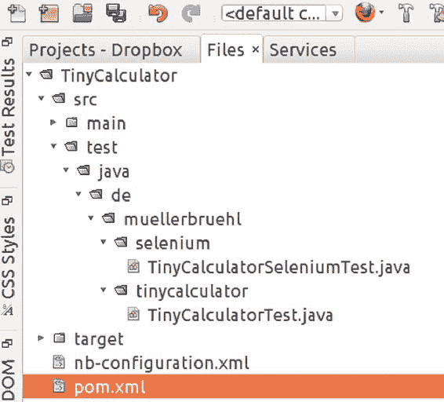

# 7. 使用 Selenium 进行测试

Michael Müller^(1 )

(1)德国北莱茵-威斯特法伦州布吕尔

本书专注于 Web 开发，而非*测试驱动开发*（TDD）。当然，无论你是遵循 TDD 范式，还是在编写生产代码之后才编写单元测试，为每种应用程序编写测试都是良好的实践。但如果为本书中描述的每一段代码都添加测试，本书的篇幅可能会翻倍。市面上已有关于单元测试的优秀书籍，我也会在本书中介绍一些工具，但无法涵盖过多的单元测试内容。

使用 Java 和 JSF 开发 Web 应用程序时，你会遇到一些与 Java SE 应用程序不同的陌生问题：用户界面（UI）由第三方软件（浏览器）呈现。而且，大部分业务逻辑和持久化操作由容器管理。因此，我们有一些额外的环境需要在部分测试中加以考虑。

第一个问题，即浏览器中的 UI 呈现，由 Selenium 来解决。

## Selenium 概述

什么是 Selenium？查看 Selenium 网站（[`docs.selenium.org`](http://docs.selenium.org)）可以得到这样的答案：“*Selenium 自动化浏览器。* 就这么简单！你用这种能力做什么完全取决于你自己。它主要用于自动化 Web 应用程序以进行测试，但当然不仅限于此。枯燥的基于 Web 的管理任务也可以（并且应该！）被自动化。”

Selenium 有两个版本可用：

*   Selenium IDE
*   Selenium WebDriver

Selenium IDE 带有一个宏记录器。你可以开始录制，调用一个网页，执行一些操作，停止录制，然后一遍又一遍地重放这些操作。这对于登录应用程序并导航到感兴趣的页面可能很有用。然后，你可以手动执行测试新功能的步骤。或者，你可以定义一个在“无限”循环中重复的工作，以执行压力测试。

Selenium WebDriver 是一个可以在 Java 程序中使用的驱动程序。流行的 Web 浏览器都有对应的驱动程序。借助这个驱动程序的功能，可以通过自编写的应用程序来自动化浏览器。到目前为止，Selenium 可以在像 JUnit 这样的测试框架中使用。

使用这两个版本，都可以定义要加载哪些页面、要控制哪些 UI 组件，以及从这些组件中读取值。

## 准备 TinyCalculator

在测试过程中，Selenium WebDriver 需要定位 UI 组件。这可以通过多种寻址方案来完成——例如，按名称、按类型、按 id 或按路径。寻址元素也是层叠样式表（CSS）的一个主题，我们之前尚未讨论过。由于 HTML 元素的 id 必须是唯一的，最简单的方法（在不知道其他寻址方案的情况下）就是使用这个 id。

JSF 会为其控制的每个元素分配一个 id。这种自动生成的 id 会像 `j_idt18` 这样丑陋。该数字取决于元素的位置，如果添加或删除元素，它就会改变。为了获得更易读且可预测的 id，清单 7-1 通过添加 `id="..."` 为 TinyCalculator 丰富了 id。

###### 清单 7-1 TinyCalculator：更易读的 Id

```
 1   [为简洁起见，省略了表单外的所有内容]

 3   <h:form id="form">
 4       <div>
 5           <h:outputLabel value="参数 1: "/>
 6           <h:inputText id="param1" value="#{tinyCalculator.param1}"/>
 7       </div>
 8       <div>
 9           <h:outputLabel value="参数 2: "/>
10           <h:inputText id="param2" value="#{tinyCalculator.param2}"/>
11       </div>
12       <div>
13           <h:commandButton id="add" value="相加"
14                            action="#{tinyCalculator.add}"/>
15           <h:commandButton id="sub" value="相减"
16                            action="#{tinyCalculator.subtract}"/>
17           <h:commandButton id="mul" value="相乘"
18                            action="#{tinyCalculator.multiply}"/>
19           <h:commandButton id="div" value="相除"
20                            action="#{tinyCalculator.divide}"/>
21       </div>
22       <div>
23           <h:outputLabel value="结果: "/>
24           <h:outputText id="result" value="#{tinyCalculator.result}"/>
25       </div>
26   </h:form>
```

声称 id 必须是唯一的只是说对了一半。就像 Java 变量一样，其名称在其作用域内（或者，简化一点说，在一个嵌套层级内）必须是唯一的。如果我们在不同的作用域中使用相同的 id，我们可以使用由该 id 构建的路径来获得唯一的寻址方案。

要定位参数 1，我们可以在同一作用域内使用 `param1`。当我们开始对应用程序进行 AJAX 化（本书后面会介绍）时，这样做没问题。或者我们使用完整路径 `form:param1`。这里，`form` 是我们分配给包含元素（表单）的 id。假设我们给一个 div 元素分配了一个 id（例如，`<div jsf:id="div1">`）。现在，如果我们有两个 div，每个都包含一个 `id="param1"` 的元素，我们可以通过 `form:div1:param1` 和 `form:div2:param1` 来定位它们。

使用 Selenium 测试 TinyCalculator 时，我们需要使用完整路径 `form:param1` 来定位这个元素。

## 创建测试

使用 Maven 时，测试通常创建在待测试项目内，并放置在 `test` 文件夹中，该文件夹是 `src` 下 `main` 文件夹的同级目录。无需额外配置，Maven 会在编译期间执行测试。

Selenium 自动化浏览器。在浏览器中显示的应用程序必须同时运行。因此，我们不能使用 Maven 的标准测试调用。我们需要在应用程序运行时运行测试。一种解决方案是创建一个单独的项目来对 TinyCalculator 运行测试。另一种方法是在编译期间排除 Selenium 测试。我们可以通过配置 Maven Surefire 插件来实现这个目标。如果我们想要执行测试，需要先启动应用程序，然后指示我们的 IDE 运行测试。

我们需要区分不同的测试。为了确定哪些测试应由 Maven 插件在编译期间执行，哪些测试应在运行时启动，我为 Selenium 测试创建了一个名为 `selenium` 的包，如图 7-1 所示。



###### 图 7-1 TinyCalculator 的目录结构

对于测试，我使用的是 JUnit 5。与 JUnit 4 不同，这个版本由不同的模块构建而成。因此，我们需要定义一些依赖项，如果你之前只使用过 JUnit 4，这些依赖项可能看起来有点陌生。为了跟进项目，清单 7-2 展示了完整的 POM。我只会解释一些与 Selenium 测试相关的重要细节。如果你需要关于 JUnit 5 的更多信息，请参考 [`junit.org/junit5/docs/current/user-guide/`](http://junit.org/junit5/docs/current/user-guide/) 上的 JUnit 5 用户指南。


###### 清单 7-2 pom.xml

```
  1  <?xml version="1.0" encoding="UTF-8"?>
  2  <project xmlns:="http://maven.apache.org/POM/4.0.0"
  3           xmlns:xsi="http://www.w3.org/2001/XMLSchema-instance"
  4          xsi:schemaLocation="http://maven.apache.org/POM/4.0.0
  5          http://maven.apache.org/xsd/maven-4.0.0.xsd">
  6    <modelVersion>4.0.0</modelVersion>

8    <groupId>de.muellerbruehl</groupId>
  9    <artifactId>TinyCalculator</artifactId>
 10    <version>1.0-SNAPSHOT</version>
 11    <packaging>war</packaging>

13    <name>TinyCalculator</name>

15    <properties>
 16      <java.version>1.8</java.version>
 17      <project.build.sourceEncoding>UTF-8</project.build.sourceEncoding>
 18    </properties>

20    <build>
 21      <plugins>
 22        <plugin>
 23          <groupId>org.apache.maven.plugins</groupId>
 24          <artifactId>maven-compiler-plugin</artifactId>
 25          <version>3.7.0</version>
 26          <configuration>
 27            <source>${java.version}</source>
 28            <target>${java.version}</target>
 29          </configuration>
 30        </plugin>

32        <plugin>
 33          <groupId>org.apache.maven.plugins</groupId>
 34          <artifactId>maven-war-plugin</artifactId>
 35          <version>3.2.0</version>
 36        </plugin>

38        <plugin>
 39          <groupId>org.apache.maven.plugins</groupId>
 40          <artifactId>maven-surefire-plugin</artifactId>
 41          <version>2.19.1</version> <!-- 2.20.1 版本会失败！ -->
 42          <configuration>
 43            <excludes>
 44              <exclude>de.muellerbruehl.selenium.*</exclude>
 45            </excludes>
 46          </configuration>

48          <dependencies>
 49            <dependency>
 50              <groupId>org.junit.platform</groupId>
 51              <artifactId>junit-platform-surefire-provider</artifactId>
 52              <version>1.0.2</version>
 53            </dependency>

55            <dependency>
 56              <groupId>org.junit.jupiter</groupId>
 57              <artifactId>junit-jupiter-engine</artifactId>
 58              <version>5.0.2</version>
 59            </dependency>
 60          </dependencies>
 61        </plugin>

63      </plugins>
 64    </build>

66    <dependencies>
 67      <dependency>
 68        <groupId>org.glassfish</groupId>
 69        <artifactId>javax.faces</artifactId>
 70        <version>2.3.3</version> <!-- 如果使用 GlassFish 4.1，则使用 2.2.19 版本 -->
 71      </dependency>

73      <dependency>
 74        <groupId>org.seleniumhq.selenium</groupId>
 75        <artifactId>selenium-firefox-driver</artifactId>
 76        <version>3.8.1</version>
 77        <scope>test</scope>
 78      </dependency>

80      <dependency>
 81        <groupId>javax</groupId>
 82        <artifactId>javaee-web-api</artifactId>
 83        <version>8.0</version> <!-- 如果使用 GlassFish 4.1，则使用 7.0 版本 -->
 84        <scope>provided</scope>
 85      </dependency>

87      <dependency>
 88        <groupId>org.junit.jupiter</groupId>
 89        <artifactId>junit-jupiter-api</artifactId>
 90        <version>5.0.2</version>
 91        <scope>test</scope>
 92      </dependency>

94      <dependency>
 95        <groupId>org.junit.jupiter</groupId>
 96        <artifactId>junit-jupiter-engine</artifactId>
 97        <version>5.0.2</version>
 98        <scope>test</scope>
 99      </dependency>

102      <dependency>                                                                                      
103        <groupId>org.junit.platform</groupId>
104        <artifactId>junit-platform-runner</artifactId>
105        <version>1.0.2</version>
106        <scope>test</scope>
107      </dependency>
108    </dependencies>
109  </project>
```

与之前不同，此 POM 是为兼容 Java EE 8 的服务器创建的。如果你仍在使用 GlassFish 4.1（正如我们之前假设的那样），则需要调整第 70 行和第 83 行（如注释中所述）。

现在来看第 42–46 行：这里我们排除了 Selenium 测试，以防止它们在编译时执行。如果你不熟悉 Maven Surefire 插件，请查阅 [`maven.apache.org/surefire/maven-surefire-plugin/index.html`](http://maven.apache.org/surefire/maven-surefire-plugin/index.html) 。

第 73–78 行展示了如何将 Selenium 添加到项目中。添加驱动程序会隐式添加其他依赖项，例如 Selenium API 本身。此外，还提供了适用于 Android、Chrome、IE、iPhone、Safari 等浏览器的其他驱动程序。驱动程序是 Selenium 端用于控制浏览器的部分。通常，你需要在浏览器端安装一个或多个组件，以便驱动程序能够控制浏览器。对于 Firefox，我们还需要 gecko 驱动程序，你可以从 [`github.com/mozilla/geckodriver/releases`](https://github.com/mozilla/geckodriver/releases) 获取。

如前所述，POM 包含了 JUnit 5 的依赖项。尽管 Selenium 既不依赖 JUnit，也不需要它来运行，但我们仍使用 JUnit 基础设施来运行测试。

清单 7-3 为 TinyCalculator 项目添加了一个测试类。


###### 清单 7-3 使用 Selenium 进行浏览器自动化的示例单元测试

```
 1   public class TinyCalculatorTest {
 2       private static WebDriver _driver;

4       @BeforeClass
 5       public static void setUpClass() {
 6           _driver = new FirefoxDriver();
 7       }

9       @AfterClass
10       public static void tearDownClass() {
11           _driver.quit();
12       }

14       @Before
15           public void setUp() {
16           _driver.get("http://localhost:8080/TinyCalculator/index.xhtml");
17           setValue("form:param1", "6");
18           setValue("form:param2", "4");
19       }

21       private void setValue(String id, String value){
22           WebElement element = _driver.findElement(By.id(id));
23           element.clear();
24           element.sendKeys(value);
25       }

27       @Test
28       public void testAdd() {
29           _driver.findElement(By.id("form:add")).click();
30           String text = _driver.findElement(By.id("form:result")).getText();
31           assertThat(text, equalTo("10.0"));
32       }

34       @Test
35       public void testSubstract() {
36           _driver.findElement(By.id("form:sub")).click();
37           String text = _driver.findElement(By.id("form:result")).getText();
38           assertThat(text, equalTo("2.0"));
39       }

41       @Test
42       public void testMultiply() {
43           _driver.findElement(By.id("form:mul")).click();
44           String text = _driver.findElement(By.id("form:result")).getText();
45           assertThat(text, equalTo("24.0"));
46       }

48       @Test
49       public void testDivide() {
50           _driver.findElement(By.id("form:div")).click();
51           String text = _driver.findElement(By.id("form:result")).getText();
52           assertThat(text, equalTo("1.5"));
53       }
54   }
 1  package de.muellerbruehl.selenium;

3  import org.junit.jupiter.api.AfterAll;
 4  import static org.junit.jupiter.api.Assertions.assertEquals;
 5  import org.junit.jupiter.api.BeforeAll;
 6  import org.junit.jupiter.api.BeforeEach;
 7  import org.junit.jupiter.api.Test;
 8  import org.openqa.selenium.By;
 9  import org.openqa.selenium.WebDriver;
10  import org.openqa.selenium.WebElement;
11  import org.openqa.selenium.firefox.FirefoxDriver;

13  public class TinyCalculatorSeleniumTest {

15    private static WebDriver _driver;

17    @BeforeAll
18    public static void setUpClass() {
19      System.setProperty("webdriver.gecko.driver", "/home/mmueller/.local/geckodriver");
20      _driver = new FirefoxDriver();
21    }

23    @AfterAll
24    public static void tearDownClass() {
25      _driver.quit();
26    }

28    @BeforeEach
29    public void setUp() {
30      _driver.get("http://localhost:8080/TinyCalculator/index.xhtml");
31      setValue("form:param1", "6");
32      setValue("form:param2", "4");
33    }

35    private void setValue(String id, String value) {
36      WebElement element = _driver.findElement(By.id(id));
37      element.clear();
38      element.sendKeys(value);
39    }

41    @Test
42    public void testAdd() {
43      _driver.findElement(By.id("form:add")).click();
44      String text = _driver.findElement(By.id("form:result")).getText();
45      assertEquals("10.0", text);
46    }

48    @Test
49    public void testSubstract() {
50      _driver.findElement(By.id("form:sub")).click();
51      String text = _driver.findElement(By.id("form:result")).getText();
52      assertEquals("2.0", text);
53    }

55    @Test
56    public void testMultiply() {
57      _driver.findElement(By.id("form:mul")).click();
58      String text = _driver.findElement(By.id("form:result")).getText();
59      assertEquals("24.0", text);
60    }

62    @Test
63    public void testDivide() {
64      _driver.findElement(By.id("form:div")).click();
65      String text = _driver.findElement(By.id("form:result")).getText();
66      assertEquals("1.5", text);                                                                                      
67    }
68  }
```

以下是关于这个长清单的一些说明：

*   在 `setUpClass` 中，实例化了一个新的驱动对象。在第 19 行，我们需要定义你下载的 gecko 驱动的路径。此方法执行后，会打开一个浏览器窗口。

*   在每个测试（`setUp` 方法）之前，都会打开 TinyCalculator 页面。参数被设置为 6 和 4。

*   这里有四个测试，分别对应 TinyCalculator 支持的基本算术运算。每个测试都会点击相应的按钮并检查结果。

*   最后，在 `tearDownClass` 中，驱动被退出。这会关闭浏览器窗口。

你可能已经注意到，Selenium 的基本用法相当简单。你导航到选择的 URL，定位元素，然后执行操作：

```
WebElement element = _driver.findElement(By.id(id));
```

`findElement` 方法需要一个 `By` 类型的参数，`By` 被定义为一个抽象类。`By.id` 调用了一个静态工厂方法，该方法创建了一个具体的 `By` 类型：

```
public static By id(final String id){...}
```

`By` 包含多个工厂方法，用于创建 `By` 的实例，你可以使用这些实例来选择元素。除了 `By.id`，你还可以使用 `By.name`、`By.linkText`、`By.tagName` 等。因此，它为你提供了多种定位感兴趣元素的方式。

为了设置我们的测试，我们需要定位输入参数并输入一些值。`sendKeys` 模拟用户的输入。由于我们重复使用同一个浏览器窗口，事先清除输入字段至关重要。否则，新文本会被追加。另一方面，可以从字段中读取文本，例如 `String text = _driver.findElement(By.id("form:result")).getText();`。

## 不使用 Selenium 的单元测试

通过基于 Selenium 的测试，我们检查了 GUI，并由此检查了底层模型。用单元测试单独测试模型不是一条经验法则吗？当然，对于 TinyCalculator 来说，这没有问题。清单 7-4 展示了一个简单的测试（在 TinyCalculator 项目内）。

###### 清单 7-4 计算器模型的单元测试

```
 1   public class TinyCalculatorTest {

 3       TinyCalculator _calculator;

 5       @BeforeEach
 6       public void setUp() {
 7           _calculator = new TinyCalculator();
 8           _calculator.setParam1(6);
 9           _calculator.setParam2(4);
10       }

12       @Test
13       public void testAdd() {
14           _calculator.add();
15           assertEquals("10.0", text);
16       }

18       @Test
19       public void testSubtract() {
20           _calculator.subtract();
21           assertEquals("2.0", text);
22       }

24       @Test
25       public void testMultiply() {
26           _calculator.multiply();
27           assertEquals("24.0", text);
28       }

30       @Test
31       public void testDivide() {
32           _calculator.divide();
33           assertEquals("1.5", text);
34       }
35   }
```

这测试了模型，没有 GUI 的开销。那么，你是否应该优先选择单元测试而不是使用 Selenium 的测试呢？这取决于具体情况。

考虑一个使用注入的命名 bean。我将在本书后面讨论上下文和依赖注入（CDI），但现在我只说一件事：我们不想手动创建对象，而是希望容器来完成这项工作，并通过将对象“注入”到我们的类中来提供对对象的引用。你无法为这样的类编写一个简单的测试。你必须要么模拟对象引用，要么使用像 Arquillian 这样的工具来为你的测试提供注入基础设施。与其在你的应用程序中包含编译时测试，不如将你的应用程序视为一个黑盒，并从“外部”在运行时执行测试。这就是 Selenium 的用途。


## 摘要

Selenium 是一款用于浏览器自动化的工具。因此，它可以用来对你的应用程序执行黑盒测试。幸运的是，它很容易使用，因为本章只能对 Selenium 略窥一二，而它的功能远比这些简单测试所能展示的要强大得多。Selenium 可以自动截图、控制远程浏览器等等。除了对应用程序进行黑盒测试，你还可以使用 Selenium 在不同类型的浏览器中测试图形用户界面。标准化在不断发展，但浏览器模型之间仍然存在差异。因此，在一个浏览器中运行良好的应用程序，在另一个浏览器或系统中可能会表现出意外行为。

本章的目的仅仅是作为 Selenium 的快速入门指南。由于本书是关于 JSF 和 Java EE 的，我没有更多篇幅来深入讨论它。但请记住，它可以用于你的 Web 应用程序测试场景。

© Michael Müller 2018

Michael Müller, Practical JSF in Java EE 8 , `doi.org/10.1007/978-1-4842-3030-5_8`

