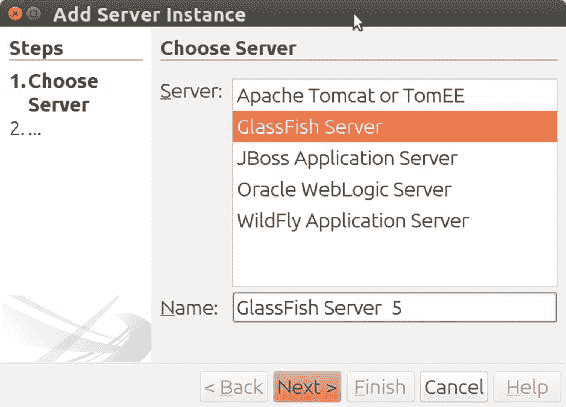
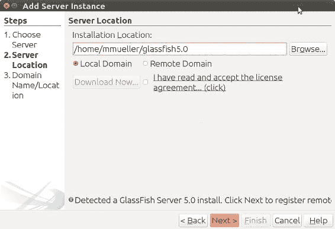
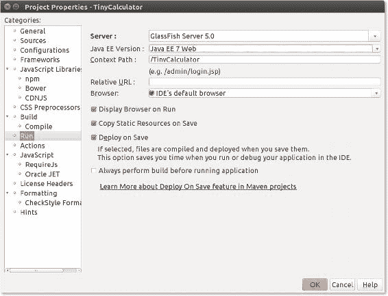

# 9. 为 Java EE 8 做准备

Michael Müller^(1 )

(1)德国，北莱茵-威斯特法伦州，布吕尔

到目前为止，我们一直使用 NetBeans 8.2 及其捆绑的 Glassfish 4.1（撰写本文时的最新版本）。Java EE 7 对于 TinyCalculator 和技术基础来说已经足够，但现在是时候搭建一个符合 Java EE 8 的环境了。

## 当前演进

过去，NetBeans 的新版本发布与核心 Java 语言以及 Java EE 的新版本发布是同步的。但情况发生了变化。Oracle 将 NetBeans 捐赠给了 Apache 基金会（[`netbeans.apache.org`](http://netbeans.apache.org)），而下一个 Java EE 版本（以前称为 Java EE 9）将在 Eclipse 基金会的支持下进行开发。（你可以在 [`blogs.oracle.com/theaquarium/ee4j-eclipse-enterprise-for-java`](https://blogs.oracle.com/theaquarium/ee4j-eclipse-enterprise-for-java) 阅读该公告，并在 [`blogs.oracle.com/theaquarium/opening-up-ee-update`](https://blogs.oracle.com/theaquarium/opening-up-ee-update) 阅读其更新。）它的新名称是 Jakarta EE。

NetBeans 从 Oracle 到 Apache 的过渡是一个持续的过程。该过程并未发布针对 Java 9 和 Java EE 8 的新版本，而是停滞在清理许可证信息上。因此，在撰写本文时，这个优秀的集成开发环境仅以测试版形式提供，但遗憾的是，它不包含 Java EE 8 的功能。Java EE 相关组件将是 Oracle 第二次捐赠的一部分。这就是为什么你仍然能获得 NetBeans 8.2 作为最新版本，它开箱即用地包含了 Java EE。

幸运的是，更新应用服务器并为 NetBeans 准备 Java EE 8 开发环境并不是一个大问题。我希望当你拿到这本书时，NetBeans 已经可以用于 Java EE 8，从而省去这个升级步骤。如果有可用的更新信息，我会在我的博客上提供。

然而，了解如何更新环境的部分组件总是很有帮助的。

## 升级应用服务器

尽管 Oracle 停止了对 GlassFish 的商业支持，但这个应用服务器仍然被用于 Java EE 8 参考实现。GlassFish 5 可在 [`javaee.github.io/glassfish/download`](https://javaee.github.io/glassfish/download) 下载。只需下载 GlassFish 5 完整平台，并将文件解压到你计算机上的任意文件夹即可。

在 NetBeans 中，点击 工具 ➤ 服务器 ➤ 添加服务器。NetBeans 会启动一个添加新服务器的向导。从可用的服务器类型中，选择 GlassFish 服务器，并输入名称 **GlassFish Server 5**（或你选择的任何其他名称），如图 9-1 所示。

###### 图 9-1 添加新服务器

点击 下一步。

###### 图 9-2 定义服务器位置

输入你的安装位置，或浏览到包含已下载服务器的新创建的文件夹。如果一切正常，NetBeans 会显示它已检测到该服务器。再次点击 下一步 >（全部显示在图 9-2 中）。在此向导的最后一个屏幕（此处未显示）中，NetBeans 会询问域。保持此对话框不变，点击 完成。NetBeans 会将新定义的服务器添加到其存储库中。现在，在项目树视图中右键点击新创建的项目，选择 属性。在项目属性中（图 9-3），你现在可以选择这个新服务器：在项目树中右键点击项目名称，选择 属性。

点击 运行。在右侧，你现在可以选择新服务器，如图 9-3 所示。由于 NetBeans 不了解 Java EE 8，请将 Java EE 版本 框保留设置为 *Java EE 7 Web*。请记住，我们将在项目的 POM 中定义 Java EE 版本。

###### 图 9-3 项目属性

## Payara 服务器

在 Oracle 停止对 GlassFish 的商业支持后，Payara 服务器应运而生。该服务器源自 GlassFish，并为该项目提供频繁的支持。有免费版本以及带有商业支持的版本可供使用。由于它直接源自 GlassFish，你可以直接使用它来代替。作为直接替代品，请从 [www.payara.fish](http://www.payara.fish) 下载你的版本。在撰写本文时，Payara 5 以测试版形式提供（[www.payara.fish/upstream_builds](http://www.payara.fish/upstream_builds)）。下载后，请按照前一段中为 GlassFish 描述的相同安装步骤进行操作。

在我撰写本文时，GlassFish 5.0 和 5.0.1 测试版在使用 Servlet 4 时，访问 JSF 的 CDI 支持 Bean 存在问题。如果你想使用 GlassFish 5，则需要在 web.xml 配置中提供 Servlet 版本 3.1（参见第 6 章）。当你阅读本书时，这个问题可能已经解决。

如果你使用 Payara 5，则不存在此类问题，因此我将在接下来的应用程序中使用此服务器。

## 摘要

当前版本的 NetBeans 不直接支持 Java EE 8。为了准备 Java EE 8 开发，你需要将应用服务器升级到符合 Java EE 8 的版本。本章简要介绍了如何执行此升级。

© Michael Müller 2018

Michael Müller, Practical JSF in Java EE 8 , `doi.org/10.1007/978-1-4842-3030-5_10`

