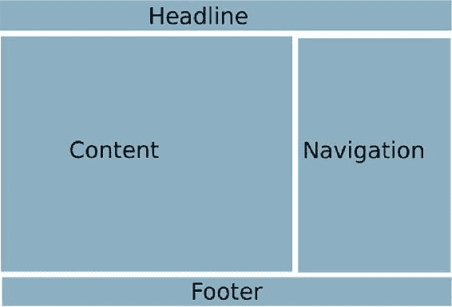
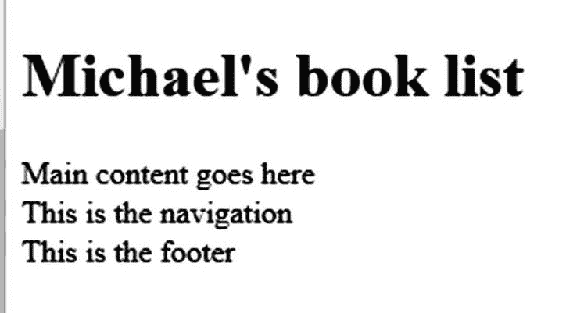
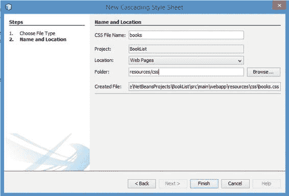
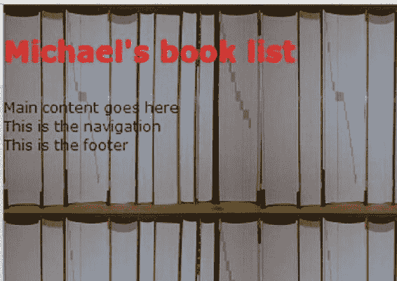
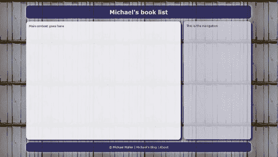
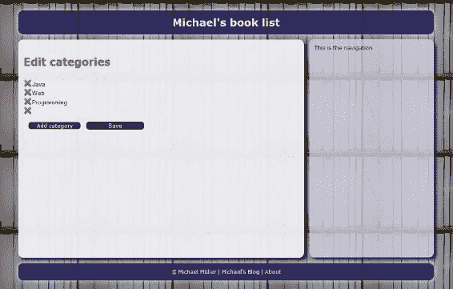

# 11. 启动图书应用

Michael Müller^(1 )

(1)德国，北莱茵-威斯特法伦州，布吕尔

让我们回顾一下第一个对话框的步骤：

1.  草拟并实现初步的整体布局

2.  设计第一个对话框的数据模型

3.  实现第一个对话框

4.  添加持久化

## 页面布局

第一步，我们需要回答一个关键问题：应用程序的未来用户将使用哪些设备？是台式机或笔记本电脑？还是主要是移动设备？或者两者都有？

小屏幕的屏幕布局通常必须与大屏幕的布局不同。对于图书应用，我们假设用户既想通过个人电脑访问，也想通过智能手机访问。这意味着我们需要一个灵活的设计，通过动态改变某些元素的大小和/或重新排列元素位置来适应所有尺寸。换句话说，它需要是*响应式*的。如何创建这样的响应式设计是第 19 章的主题。

为了准备响应式设计，我们将屏幕布局拆分为逻辑组——例如，主要内容区和导航区。在桌面屏幕上，这两个组可能并排排列，而在移动设备上，它们可能垂直排列。或者导航可能被隐藏，仅在需要时显示。对于移动设备，每个组的内容也可能被精简。

虽然“移动优先”的方法很流行，但我假设我的读者是 Java 开发者。作为 Java 开发者，你通常使用屏幕分辨率水平方向至少为 1280 像素的台式机或笔记本电脑。因此，我们将从针对这类设备的设计开始。

除了主要内容和导航，图书应用还将包含一个标题栏和一个页脚。布局草图如图 11-1 所示。



###### 图 11-1 图书应用的桌面屏幕整体布局

在开发过程中，我使用的屏幕水平尺寸为 1680、1920 和 2560 像素。你是否曾在浏览器中阅读过文本行延伸到这些尺寸的文档？那简直是一团糟。因此，我们希望限制布局的水平尺寸，并将其在浏览器窗口中居中。我们将用一张漂亮的图片替换外部的空白区域。请注意，这种方法也缩小了与小型（移动）设备的差距，这些设备也需要被这个响应式设计所覆盖。

### HTML 结构

首先，我们需要创建一个页面。NetBeans 创建了 index.xhtml 页面，我们可以使用并重命名它。这个页面将包含四个区域，分别对应不同的区域，以及一个容器元素（div id="wrapper"），它包含了前面提到的四个部分，用于限制整个页面的宽度。

在 HTML5 之前，通常使用 div 来实现此目的。每个 div 都有自己的 id。由于这种方法仍被广泛使用，清单 11-1 演示了这样一个页面。

###### 清单 11-1 使用 div 元素的粗略页面结构

```
 1   <?xml version='1.0' encoding='UTF-8' ?>
 2   <!DOCTYPE html>
 3   <html xmlns:="http://www.w3.org/1999/xhtml"
 4         xmlns:h="http://xmlns.jcp.org/jsf/html">
 5     <h:head>
 6       <title>图书</title>
 7     </h:head>
 8     <h:body>
 9       <div id="wrapper">
10         <div id="header">
11           <h1>迈克尔的图书列表</h1>
12         </div>
13         <div id="main">
14           主要内容在此
15         </div>
16         <div id="navigation">
17           这是导航区
18         </div>
19         <div id="footer">
20           这是页脚
21         </div>
22       </div>
23     </h:body>
24   </html>
```

HTML5 提供了一些更具体的标签来构建页面结构。我们可以用新的语义元素替换部分 div 元素。例如，我们可以使用 `<header>` 代替 div 来表示页面的标题部分，如清单 11-2 所示——但不要与 HTML 的 head 混淆！

###### 清单 11-2 使用特定元素构建的 HTML 页面结构

```
 1   <?xml version='1.0' encoding='UTF-8' ?>
 2   <!DOCTYPE html>
 3   <html xmlns:="http://www.w3.org/1999/xhtml"
 4         xmlns:h="http://xmlns.jcp.org/jsf/html">
 5     <h:head>
 6       <title>图书</title>
 7     </h:head>
 8     <h:body>
 9       <div id="wrapper">
10         <header>
11           <h1>迈克尔的图书列表</h1>
12         </header>
13         <main>
14           主要内容在此
15         </main>
16         <nav>
17           这是导航区
18         </nav>
19         <footer>
20           这是页脚
21         </footer>
22       </div>
23     </h:body>
24   </html>
```

只有用作页面容器元素的 div 带有 id。div 被广泛使用，并且将在此应用程序中使用。唯一的 id 有助于定位正确的 div。正如你将看到的，我们在这里并不需要这个 id，但对于管理页面，我们将使用这样的 id。

其他元素，如 header，在我们的应用程序中是唯一的。根据定义，这些元素可能多次出现。在这种情况下，id 将再次发挥作用。

如果我们运行这个应用程序，浏览器将显示一个相当单调的页面，如图 11-2 所示。



###### 图 11-2 未定义布局的结构化页面

我们已经为未来的内容定义了一些容器元素。对于 main、nav 和 footer，页面仅包含一些占位符文本。

### 使用 CSS 进行基本样式设计

如前所述，内容和样式应该分离。一个网页，就像一个 Web 应用程序，不仅仅是内容和功能——愉悦的外观和感觉也很重要。层叠样式表（CSS）是我们用来创建这种外观和感觉的技术。如果你不熟悉 CSS，可以查看附录 B，它提供了基本的介绍。

虽然可以将样式包含在页面 `<html>` 头部的 `<style>` 元素中，但更好的做法是将样式放在一个或多个单独的文件中。这简化了重用，并且由于浏览器缓存，减少了页面加载时间。CSS 只加载一次，而不是随每个页面加载。

使用 NetBeans，在项目视图中的任意项目文件夹上右键单击，选择新建 ➤ 其他 ➤ Web ➤ 层叠样式表。输入名称 **books**，并将文件夹设置为 resources/css，如图 11-3 所示。




###### 图 11-3 使用 NetBeans 创建 CSS

你正在 Web Pages 文件夹内创建一个嵌套的子文件夹结构和一个文件。或者，你也可以在 Web Pages 文件夹中创建一个名为 resources 的文件夹，然后在其下创建子文件夹 css，并在该文件夹中创建一个新文件 books.css。

现在，我们将向 JSF 页面添加对该文件的引用，如清单 11-3 所示。

###### 清单 11-3 使用 JSF 标签嵌入 CSS

```
1   ...
2     <h:head>
3       <title>Books</title>
4       <h:outputStylesheet name="css/books.css"/>
5     </h:head>
6   ...
```

标签 `<h:outputStylesheet>` 将被 JSF 渲染为 `<link type="text/css" rel="stylesheet" href="/Books/javax.faces.resource/css/books.css.xhtml"/>`，这是用于包含 CSS 的 HTML 语法。

检查这个标签。你可能会认出 `javax.faces.resource`，尽管我们将样式表放在了 resources 目录下。JSF 使用一个符号名称，而实际资源可能位于不同的位置，但这些位置必须位于名为 resources 的文件夹内。

###### JSF 资源管理

```
1   <h:outputStylesheet ... />
2   <h:outputScript ... />
3   <h:graphicImage ... />
```

上述三个 JSF 标签引用资源。一个*资源*可以位于 resources 文件夹内的任何文件夹中。resources 文件夹可以位于 webapp 文件夹的顶层（你也能在那里找到页面）。或者，它也可以位于 jar 文件的 META-INF 目录内。如果你的应用程序由多个不同的 jar 文件组成，每个 jar 文件都可以包含（其自身的）资源。这种方法使你能够在部署时交换资源。

如果你使用大量资源，你可以按逻辑将它们分组到一个*库*中，并添加属性 `library="yourLibrary"`。该属性被视为一个文件夹——例如，`<h:outputStylesheet library="muellerbruehl" name="css/books.css"/>` 指向 `resource/muellerbruehl/css/books.css`。你可能会问，为什么不能使用 `<h:outputStylesheet name="muellerbruehl/css/books.css"/>`？这确实指向同一个文件夹，并且也能正常工作，但意图不同。通过使用 library 属性，你的意图不仅仅是指向一个特定的资源文件，而是指向一组相互配合的资源——例如，属于某个特定主题的 CSS、图标和脚本。我将在本书末尾更改应用程序外观时介绍这一点。

此外，使用 library 属性，你可以在库文件夹和资源文件路径之间放置一个可选的版本文件夹。版本文件夹的命名遵循 `\d+(_\d+)*` 模式。默认情况下，JSF 总是加载最新版本（编号最高）。

如果没有版本号，`<h:outputStylesheet library="muellerbruehl" name="css/books.css"/>` 指向文件 `resources/muellerbruehl/css/books.css`。

假设有一个版本 `1_0`，该文件必须位于 `resources/muellerbruehl/1_0/css/books.css`。你的库的完整路径由 `resources/<library>/<version>/<name>` 组成，其中 name 可能包含额外的文件夹。

假设我们有两个版本，`1_0` 和 `1_1`，如下所示：

```
resources/muellerbruehl/1_0/css/books.css
resources/muellerbruehl/1_1/css/books.css
```

那么我提到的标签会自动解析到第二个文件夹，因为它包含最新版本。`h:outputStyle` 标签内没有版本属性。因此，你可以向文件夹结构中添加一个更新的版本，它会被自动解析，但你无法选择特定版本。

更多信息，请查看 Bauke Scholtz 在 [`stackoverflow.com/questions/11988415/what-is-the-jsf-resource-library-for-and-how-should-it-be-used`](http://stackoverflow.com/questions/11988415/what-is-the-jsf-resource-library-for-and-how-should-it-be-used) 上发表的文章。

清单 11-4 向 books.css 文件添加了一些内容。

###### 清单 11-4 书籍的基本 CSS

```
 1   * {
 2     margin: 0px;
 3     padding: 0px;
 4     border: 0px;
 5     color: #000044;
 6   }

 8   body {
 9     font-size: 12px; /* 基础大小 */
10     text-align: left;
11     font-family: Verdana, "Verdana CE",
12                  Arial, "Arial CE", "Lucida Grande CE",
13                  lucida, "Helvetica CE", sans-serif;
14     background-image: url(/Books/resources/images/books1.png);
15     background-repeat: repeat;
16     background-position: top left;
17     background-attachment: fixed;
18   }

20   h1, h2, h3, h4, h5, h6 {
21     color: red;
22     padding: 1.0em 0em 1.0em 0em;
23   }

25   h1 {
26     font-size: 2em;
27   }

29   h2 {
30     font-size: 1.5em;
31     font-style: italic;
32   }

34   h3 {
35     font-size: 1.2em;
36   }
```

通过通用选择器 `*`，执行了一些重置操作。由于某些默认值因浏览器而异，我们将它们设置为定义好的值，以便在几乎所有浏览器中实现相同（或至少相似）的布局。这被称为*CSS 重置*（你可以在 [`cssreset.com/what-is-a-css-reset/`](http://cssreset.com/what-is-a-css-reset/) 阅读更多相关信息）。在这里，我们覆盖了浏览器对内边距、外边距和边框的设置。我们还将默认文本颜色设置为深蓝色。

在 body 中，我们将设置基本字体大小。这样做可以使字体独立于浏览器的默认字体大小。我们从字体列表中选择一种字体。浏览器会尝试应用此列表中的字体，从第一个开始。最后一个 `sans-serif` 通常被所有浏览器识别，如果浏览器找不到此列表中的任何其他字体系列，则会应用它。这确保了字体没有衬线。背景语句加载一张图片作为背景，采用固定（不滚动）定位，并无限重复。

接下来，应用了标题标签（h1 到 h6）的一些标准设置。单位 *em* 是一个排版术语，意为“字母 *M* 的宽度”，它是一个相对大小。作为字体大小，2em 将字体大小加倍。此大小的基准是应用于容器元素的大小，而不是我们在 body 中定义的大小！body 的大小仅仅是所有其他相对大小的基准。

例如，如果我们有一个 12px 的基本字体大小，并定义一个 div，对其应用 2em 的大小，那么该 div 内的最终字体大小将是 24px。现在，如果我们在该 div 之前放置一个 h1，h1 将创建一个 24px 的字体（12px × 2）。但是，如果我们将 h1 放置在该 div 内部，那么 h1 将创建一个 48px 的字体大小（12px × 2[由 div] × 2[由 h1]），因为 h1 的 2em 是相对于 div 内字体的相对大小，而 div 内的字体本身已被缩放 2em。

如图 11-4 所示，无论你使用何种浏览器窗口大小，所有内容仍然左对齐显示。



###### 图 11-4 应用了重置、背景和标题样式

如果你为任何部分（例如主要内容）插入一长行文本，你会看到该文本延伸到浏览器窗口的右边界。我们的目标是限制内容的长度并将其居中。为此，请将清单 11-5 的内容添加到 books.css 文件中。


###### 清单 11-5 通过 CSS 固定宽度（添加到 books.css）

```
1   body > div {
2     width: 80em;
3     margin: 0 auto;
4     text-align: left;
5   }
```

这些样式会影响文档中最顶层的 `div`，也就是我们的包裹元素。使用组合元素和 ID 选择器 `div#wrapper` 也能选中同一个 `div`。稍后在设计管理页面时，我们希望重用此样式。对于管理页面，第一个 `div` 会有一个不同的 ID。因此，如果使用 `div#wrapper` 选择器，我们就无法重用这个样式信息。

`width: 80em;` 通过相对大小限制了网页内容的尺寸。几年前，通常会将限制设置为固定的绝对大小，比如 `width: 960px;`。这样可以创建几乎完全控制精确尺寸的固定布局。但我们不仅仅为台式电脑开发。从相对大小开始，便于以后切换到响应式布局。`1em` 是一个相对单位，其宽度大约等于当前所用字体和大小中大写字母 *M* 的宽度。稍后，我们会添加所谓的*媒体查询*，以考虑更小的屏幕（或窗口）尺寸。

###### 检查包裹元素

1.  向主要内容中添加一段长文本（例如 200 个字符）。

2.  运行应用程序。

3.  将浏览器窗口从全屏宽度调整为较窄的宽度。

请注意，文本保持居中。也就是说，每行文本的左右两侧会有大致相等的空间。当你缩小窗口尺寸时，这个空间会减少。一旦空间消失，就会出现水平滚动条。

我们的页眉将与包裹区域同宽，带有圆角，显示的文本将是蓝底白字。为了获得流畅的设计，它会有一点透明，让背景略微透出。页脚看起来类似，但不会包含标题，而是包含一些文本和链接。目前，它只包含纯文本，所以让我们添加一些链接，如清单 11-6 所示。

###### 清单 11-6 书籍页脚

```
 1   ...
 2     <footer>
 3       &copy; Michael Müller
 4       |
 5       <h:outputLink value="http://blog.mueller-bruehl.de">
 6         Michael's Blog
 7       </h:outputLink>
 8       |
 9       <h:link value="About" outcome="index.xhtml"/>
10     </footer>
11   ...
```

`&copy;` 是一个 HTML 实体，代表版权符号。使用 HTML 4.x 时，你可以直接这样使用——但我们将文档类型声明为 HTML5，它不认识这种实体。因此，我们必须首先通过增强 XHTML 文件第一行的文档类型信息来声明此实体：`<!DOCTYPE html [<!ENTITY copy "©">]>`。

JSF 标签 `<h:outputLink ...>` 渲染一个出站链接。这种链接会离开应用程序。在此页面中，它会被简单地渲染为 `<a href="http://blog.mueller-bruehl.de">Michael's Blog</a>`，这是一个标准的 HTML 链接。为什么有人会使用这个 JSF 标签而不是 HTML 版本？因为可以用附加信息来丰富这个标签。例如，你可以添加 JSF 已知的属性，比如 `rendered = "#{someCondition}"`。这样做的话，只有当条件评估为 `true` 时，链接才会被渲染。

`<h:link ...>` 也会渲染成一个 `<a href=...>`。它被用作内部链接（在应用程序内部），并且也可以添加 JSF 特有的属性。因为我们还没有“关于”页面，它只是指向源页面。各种链接的区别将在后面的第 18 章讨论。

添加了一些“真实”内容后，我们可以继续应用样式，如清单 11-7 所示。

###### 清单 11-7 页面布局和菜单的基本 CSS（添加到 books.css）

```
1   header, footer {
 2     opacity: 0.75;
 3     border-radius: 1em;
 4     background-color: #000044;
 5     padding: 1em;
 6     text-align: center;
 7     box-shadow: 0 0 1em white;
 8   }

10   header {
11     margin: 2em auto 1em auto;
12   }

14   footer {
15     margin: 0.5em auto 1em auto;
16     color: white;
17   }

19   header > h1{
20     color: white;
21     margin: 0;
22     padding: 0;
23   }

25   a {
26     text-decoration: none;
27     color: white;
28   }

30   a:hover{
31     color: red;
32   } 
```

尽管我们使用了 JSF 标签，但样式始终应用于渲染后的 HTML 元素。链接被渲染为锚点标签（`<a href=...>`）。设置 `text-decoration: none;` 将去掉下划线。相反，鼠标悬停时链接会变成红色（通过定义 `hover`）。

`padding 1em;` 为每边应用 1em 的内边距。与 `margin` 类似，你可以使用两个参数（上下内边距 左右内边距）或四个参数（上内边距 右内边距 下内边距 左内边距），而不是一个参数。或者，你可以只为特定的一边定义 `padding-top: 1em;`（`-right`、`-bottom`、`-left`）。

`box-shadow: 0 0 1em white;` 定义了一个白色的“阴影”。实际上，这看起来像是一束明亮的光。水平和垂直位置没有添加值。从不透明度 100% 到 0 的宽度是 1em。

其他元素应该相当不言自明。导航将放置在主要部分的左侧。

###### 列布局

一种计算布局尺寸的成熟方法是将整个内容区域划分为列——例如，六列，列之间有间隙。如果我们为这样的间隙取全宽的 2%，那么每列的宽度可以通过 `(100% – 5 × 2%) / 6 = 15%` 来计算。详细版本：六列之间有五个间隙。每个间隙占宽度的 2%，间隙总共占 10%。我们需要从 100% 的宽度中减去这个值。结果，全宽的 90% 必须除以六列。在这个例子中，我们为主要部分使用四列，包括三个间隙，为导航使用两列，包括一个间隙。最后但同样重要的是，主要部分和导航之间还有一个剩余的间隙。

我提到列布局是因为它非常流行，你可能听说过或读到过。对于本书来说，不需要将内容排列成列。导航在滚动时会保持“固定”；这将通过 `position: fixed;` 实现。参见清单 11-8。

###### 清单 11-8 主要部分和导航的 CSS（添加到 books.css）

```
 1   main {
 2     min-height: 40em;
 3     width: 53em;
 4     opacity: 0.95;
 5     border-radius: 1em;
 6     background-color: #eeeef3;
 7     padding: 1em;
 8     margin-bottom: 1em;
 9     box-shadow: 0.5em 0.5em 0.5em #004
10   }

12   nav{
13     min-height: 40em;
14     position: fixed;
15     margin-left: 56em;
16     width: 22em;
17     padding: 1em;
18     top: 7.5em;
19     opacity: 0.85;
20     border-radius: 1em;
21     background-color: #ccccd8;
22     box-shadow: 0.5em 0.5em 0.5em #004
23   }
```

元素的高度通常由其内容计算得出。主要部分可能会比导航长得多。目前，两个部分都只包含几个词。为了平衡高度，为每个部分定义了最小高度。主要部分的宽度简单地设置为 53em（记住包裹元素是 80em 宽）。根据盒模型，会加上 `2 × 1em` 的内边距。如果我们假设主要部分和导航之间的间隙为 1em，那么导航需要左边距为 56em。导航的宽度简单地通过 `80em – 56em – 2 × 1em`（内边距）`= 22em` 计算得出。

图 11-5 显示了正在运行的应用程序。



###### 图 11-5 所有样式已应用


## 优先设计数据模型

现在我们可以实现第一个对话框了。在实际开发中，你可能会先着手实现一个大型功能，比如图书编辑器或评论编辑器。这很合理，因为这些功能对客户来说很有价值。但我们希望将每本书分配到一个或多个类别中。因此，在录入新书数据时，类别必须已经可用。在真实开发中，我们可能会先跳过这个小功能，等客户对整体编辑器满意后再实现它。

我们还没有讨论持久化，而类别是应用程序中最简单的结构之一，因此它是介绍数据存储和访问的良好起点。我们在此开始设计数据模型。在第 12 章中，我们将持久化这些数据。

忽略不同显示语言的因素，一个*类别*仅由 id 和文本组成。到目前为止，我们的数据模型看起来非常简单：两个属性，带有 getter 和 setter。参见清单 11-9。

###### 清单 11-9 类别

```
 1   public class Category {
 2     // <editor-fold defaultstate="collapsed" desc="Property Id">
 3     private int _id = -1;

 5     public int getId() {
 6       return _id;
 7     }

 9     public void setId(int id) {
10       _id = id;
11     }
12     // </editor-fold>

14     // <editor-fold defaultstate="collapsed" desc="Property Name">
15     private String _name;

17     public String getName() {
18       return _name;                                                                
19     }

21     public void setName(String name) {
22       _name = name;
23     }
24     // </editor-fold>
25   }
```

id 初始化为 -1，表示尚无有效 id。

顺便提一下，`editor-fold` 注释是 NetBeans 特有的。它们允许对代码进行结构化和折叠。这里仅作一次性展示。

这就够了吗？不。我们还需要做更多。作为 Java 开发者，你可能会发现缺少 `hashCode` 和 `equals` 方法。如果该类的对象将用于任何集合中，这两个方法都是必需的。NetBeans 可以为你生成它们。生成的代码可能仅作为起点。使用持久化后，id 将由数据库管理系统生成。

只有这个 id 能标识类别。存在有效 id 时，`hashCode` 和 `equals` 仅依赖于这个 id，忽略文本。但如果没有有效 id，我们可能需要区分两个不同的对象实例。我们通过考虑文本来实现这一点。

通常，在我们的应用程序中，我们会显示实体的选定属性。但如果简单地将实体放到页面上，JSF 会通过其字符串表示形式来显示它。因此，我们应该重写 `toString` 方法以获得更具信息性的输出，如清单 11-10 所示。

###### 清单 11-10 任何实体都需要定义 HashCode 和 Equals

```
 1   @Override
 2   public int hashCode() {
 3     if (_id < 0) {
 4       return _name.hashCode();
 5     }
 6     return _id;
 7   }

 9   @Override
10   public boolean equals(Object object) {
11     if (!(object instanceof Category)) {
12       return false;
13     }
14     Category other = (Category) object;
15     if (_id < 0 && other._id < 0) {
16       return _name.equals(other._name);
17     }
18     return _id == other._id;
19   }

21   @Override
22   public String toString() {
23     return "Category[ id=" + _id + "] " + _name;
24   }
```

现在，第一个对话框的数据模型已经准备就绪。

## 第一个对话框（重复结构）

类别是最简单的待持久化数据结构，因此是讨论数据存储的良好起点。一个*类别*仅由 id 和文本组成。我们当然可以设计一个包含这两个字段以及“保存”和“删除”两个按钮的小对话框，为每个类别提供独立的编辑界面。实际上，id 对用户来说无关紧要；它仅在我们进行持久化时用作主键。因此，我们将所有类别放入一个列表中，并一次性编辑它们。

我们需要：

*   添加一个类别
*   修改类别的文本
*   删除一个类别
*   保存列表

添加类别和保存列表各使用一个按钮。

通常的做法是显示一个只读列表，并为每一行添加一个“编辑”链接。点击链接后，会显示编辑对话框。不过，使用这种方法的应用程序让我感到不太舒服。因此，我们将允许直接、随机地访问每个类别。

每个类别将显示为一个输入字段。在其前面，我们放置一个删除图标，用于删除该行的类别。图 11-6 展示了完成后的类别编辑器概貌。我们将在本章剩余部分从左侧的核心功能开始，并在后续章节中继续讨论其他主题（导航和国际化）。


###### 图 11-6 类别编辑器

我们还没有用于从数据库检索或保存类别的服务类。因此，让我们创建一个包含一些初始类别的列表来模拟数据库访问。而“保存”按钮仅执行日志记录，你可以在 NetBeans 控制台（输出、GlassFish Server 窗口）中观察到。参见清单 11-11。

###### 清单 11-11 CategoryEditor

```
 1   @Named
 2   @SessionScoped
 3   public class CategoryEditor implements Serializable{
 4     private static final long serialVersionUID = 1L;
 5     private static final Logger _logger = Logger.getLogger("CategoryEditor");

 7     @PostConstruct
 8     private void init(){
 9       _categories = new ArrayList<>();
10       _categories.add(new Category(){{setId(1); setName("Java");}});
11       _categories.add(new Category(){{setId(2); setName("Web");}});
12     }

14     private List<Category> _categories;

16     public List<Category> getCategories() {
17       return _categories;
18     }

20     public void setCategories(List<Category> categories) {
21       _categories = categories;
22     }

24     public String addCategory(){
25       _categories.add(new Category());
26       return "";
27     }

29     public String deleteCategory(Category category){
30       _categories.remove(category);
31       return "";                                                                
32     }

34     public String save(){
35       String categories = _categories
36               .stream()
37               .filter(cat -> !cat.getName().isEmpty())
38               .map(cat -> cat.toString())
39               .collect(Collectors.joining(", "));
40       _logger.log(Level.INFO, "Save categories: {0}", categories);
41       return "";
42     }
43   }
```

上述代码使用了 Java 8 中引入的 *lambda* 和 *stream* 特性（我的书《Java Lambdas and Parallel Streams》（Apress, 2016）是这些内容的良好入门介绍，恕我直言）。如果你不熟悉 lambda 和 stream，可以使用更传统的 for 循环方法。如前所述，`save` 方法尚未执行保存操作，而是进行日志记录。参见清单 11-12。


###### 清单 11-12 Java 7 版本的 save 方法

```
 1   ...
 2     public String save(){
 3       String categories = "";
 4       for (Category category : _categories){
 5         if (!category.getName().isEmpty()){
 6           if (categories.length() > 0){
 7             categories += ", ";
 8           }
 9           categories += category;
10         }
11       }
12       _logger.log(Level.INFO, "Save categories: {0}", categories);
13       return "";
14     }
15   ...
```

该 bean 简单地使用了 `@SessionScoped` 注解（请记得导入正确的类——这是 CDI 作用域，而非旧的 JSF SessionScope！）。通常，这并非最佳选择。一旦实例化，此类 bean 将与会话同生命周期。在高流量的服务器上，这种方法可能导致较高的内存消耗。

`@SessionScoped` 的生命周期相对较长。服务器可能会*钝化*该 bean 以释放资源，并在需要时重新加载（激活）它。*钝化*是通过序列化对象，将对象临时持久化到某处（由服务器根据其实现自行选择位置）的过程。这就是为什么需要相应的标记接口。`serialVersionUID` 用于区分不同的对象版本。此处，除了钝化之外，我们并未使用序列化。我们不期望加载由非钝化对象版本激活的数据。因此，我们简单地使用常量值 `1L`。这可以防止 Java 自行计算对象版本。（你可以阅读 Java 文档以了解更多关于序列化的信息：[`docs.oracle.com/javase/8/docs/api/java/io/Serializable.html`](http://docs.oracle.com/javase/8/docs/api/java/io/Serializable.html)）。

尽管钝化是一种减少内存消耗的策略，但它会使用额外的 IO 或其他资源。因此，生命周期更短的作用域通常是更好的选择。Books 应用程序仅面向一两位编辑和大量读者。此处延长 bean 的生命周期并无大碍。我将在后面讨论其他作用域。

为了模拟从数据库加载数据，分类列表将在 `PostConstruct` 时创建。容器会在创建类的实例并注入依赖项（如果有的话）之后立即调用此类注解方法。我们本可以在类构造函数中完成此初始化，但使用 Java 持久化 API（JPA——下一章的主题）时，相应的服务类将在类构造*之后*被注入。然后我们需要稍后执行数据库检索，这就是 `PostConstruct` 成为理想选择的原因。

双花括号表示法是一种古老的 Java 惯用法。然而，许多开发者并不了解它。它只是在构造 `categories` 后立即调用 setter 的一种快捷方式。要为新建的类设置属性，最好使用一个允许将属性作为参数传递的特殊构造函数。正如你将在 JPA 中看到的，并不需要这样的构造函数，而且由于我们是在模拟数据库访问，数据模型中也未包含它。

该代码包含三个方法，用于添加、删除和保存分类。它们都返回一个空字符串以重新加载同一页面。为简单起见，这个命名 bean 被设置为会话作用域。稍后，当我介绍 AJAX 时，我们将对两者进行优化。

接下来，我们需要向页面的主体部分添加一些内容，如清单 11-13 所示。

###### 清单 11-13 分类编辑器的主体部分

```
 1   ...
 2   <main>
 3     <h1>编辑分类</h1>
 4     <h:form>
 5       <h:dataTable value="#{categoryEditor.categories}"
 6                    var="cat">
 7         <h:column>
 8           <h:commandLink
 9             action="#{categoryEditor.deleteCategory(cat)}">
10             <h:graphicImage alt="删除"
11                             name="Delete.png"
12                             library="icon/small"
13                             title="删除"/>
14           </h:commandLink>
15         </h:column>
16         <h:column>
17            <h:inputText value="#{cat.name}"/>
18         </h:column>
19       </h:dataTable>
20       <h:commandLink styleClass="button"
21                        value="添加分类"
22                        action="#{categoryEditor.addCategory}"/>
23       <h:commandButton styleClass="button"
24                        value="保存"
25                        action="#{categoryEditor.save}"/>
26     </h:form>
27   </main>
28   ...
```

除了标题外，主体部分现在包含一个表单，该表单包含三个子元素：

*   `<h:dataTable...>`：渲染一个 HTML 表格
*   `<h:commandLink...>`：渲染一个 HTML 链接
*   `<h:commandButton...>`：渲染一个 HTML 输入元素，类型为 submit

`<h:dataTable...>` 标签的值引用了分类列表（`getCategories()`）。每个条目都绑定到一个变量 `cat`。这个名称是自由选择的。现在，对于每一行，我们可以使用这个 `cat` 变量来访问当前分类。在 `dataTable` 内部，定义了两列。第一列显示一个删除图标，嵌套在 `commandLink` 中。我们将当前分类作为 `deleteCategory` 方法的参数。该图标位于 `icon/small` 文件夹结构中，该文件夹本身位于 `resources` 文件夹中（与我们处理 CSS 文件的方式相同）。图标本身是一个 16 × 16 像素的 PNG 图像。

此应用程序使用的图标是免费应用程序图标，可在任何应用程序中免费使用。它们根据知识共享署名-相同方式共享 3.0 许可协议进行分发。可从 [www.small-icons.com/packs/16x16-free-application-icons.htm](http://www.small-icons.com/packs/16x16-free-application-icons.htm) 下载。

图 11-6 显示了表格下方的两个按钮，但它们真的是两个按钮吗？坦率地说，不是。其中一个（`h:commandLink`）被渲染为一个链接。通过定义样式类 `button`，链接和真正的按钮都将像按钮一样显示。为此，我们需要添加一点 CSS。使用不同的 JSF 标签来处理这些按钮有一个特殊原因：如果某个输入字段获得焦点，并且用户按下 Enter 键，那么第一个 HTML 输入元素（类型为 submit）将被调用。这种行为让人联想到桌面应用程序，在其中你按 Tab 键向前移动，但按 Enter 键会执行保存或接受数据等操作。因为我们只定义了一个真正的按钮元素，所以其关联的动作 `save` 会在按下 Enter 时被调用。

按钮样式如清单 11-14 所示。

###### 清单 11-14 创建按钮样式的 CSS

```
 1   .button{
 2     width: 10em;
 3     border-radius: 0.5em;
 4     background-color: #000044;
 5     color: white;
 6     display: inline-block;
 7     text-align: center;
 8     margin-top: 1em;
 9     margin-right: 1em;
10   }

12   .button:hover{
13     font-weight: bold;
14     color: red;
15   }
```

在 CSS 文件的这一部分，我们使用了一个类选择器，如开头的点号所示。将按钮声明为 `display: inline-block;` 使我们能够应用定义的宽度。

现在，如果你运行该应用程序，它应该看起来像图 11-7。



###### 图 11-7 分类编辑器的版本 1


###### 观察编辑器

作为练习，添加一些类别：编辑和删除。

点击“保存”按钮，观察 GlassFish 控制台（或日志）。添加三个类别，分别命名为 x、y 和 x。现在，针对最后一个 x，点击“删除”。第一个 x 类别将被删除。你知道为什么吗？

新创建的类别不包含有效的 id。根据 `hashCode()` 和 `equals()` 方法，文本相同的类别被视为相等。`_categories.remove(category);` 会移除第一个匹配项。由于文本相同，删除“错误”条目实际上无关紧要。但如果我们构建的 `hashCode` 和 `equals` 方法仅依赖于 id，那么删除任何没有有效 id 的条目都会移除第一个没有有效 id 的条目，即使文本可能不同。

## 总结

Books 应用的开发始于应用程序的整体布局。由于许多 Java 开发者更熟悉桌面应用程序，因此本应用采用“桌面优先”的方法，而非当前流行的“移动优先”。我们考虑了响应式设计，并指出 CSS 是应用这些样式的首选技术。本章展示了 CSS 在应用程序中的基本用法。

我们开发了第一个对话框。通过模拟数据库访问，我们可以专注于用户界面，并引入了第一个重复结构来创建可编辑表格。

在下一章中，我们将持久化这些数据。

© Michael Müller 2018

Michael Müller, Practical JSF in Java EE 8 , `doi.org/10.1007/978-1-4842-3030-5_12`

