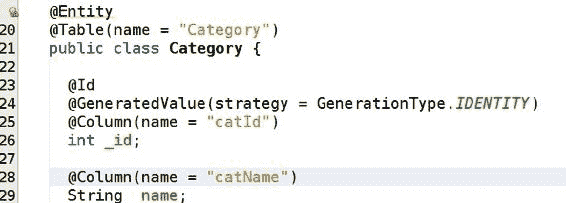
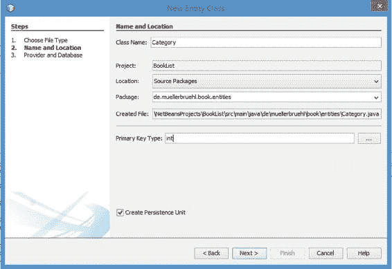
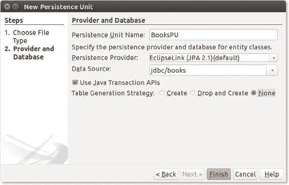
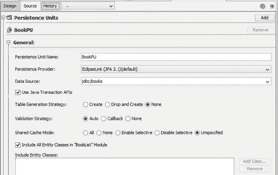
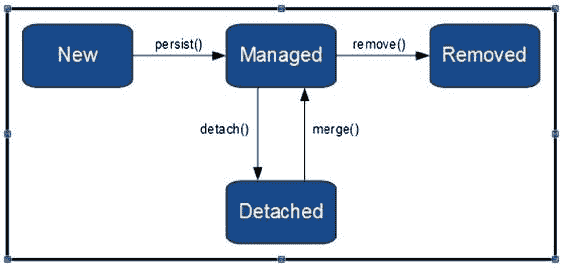

# 12. Java 持久化 API

Michael Müller^(1 )

(1)德国，北莱茵-威斯特法伦州，布吕尔

Books 应用的数据是同构的，这意味着每个类别、书籍、评论或链接信息的整体结构都是相同的。此类数据的经典存储方法（通常也是最佳选择）是 SQL 数据库系统。

如果您是 Java SE 开发者，并且到目前为止一直在访问 SQL 数据库，那么您可能使用过 Java 数据库连接（JDBC）。JDBC 是 SQL 语句的一种抽象。程序查询数据库并返回一个结果集，然后由您的程序将其转换为列表、对象等。将持久化数据转换为对象的责任落在了开发者身上。这是一项重复性、有时甚至是枯燥的工作，只是为了弥合关系型数据和对象之间的鸿沟。

如果可以定义从关系到对象以及反向的映射规则，那么这项工作就可以由软件来完成。而这正是*对象关系映射器*（ORM）的用途。有几种兼容 JPA 的 ORM 可用。在 Java EE 世界中，ORM 由 Java 持久化 API（JPA）定义。

###### 注意

作为 Java EE 8 的一部分，JPA 的当前版本是 2.2。作为 JPA 2.1 的维护版本，它仍然由 JSR 338 定义（更多信息请访问 [`jcp.org/en/jsr/detail?id=338`](https://jcp.org/en/jsr/detail%3Fid=338)）。换句话说，没有专门针对 2.2 版本的 JSR。

## 实体

如果您熟悉 SQL，您可能知道数据库存储实体。*实体*是一个信息单元，或者简单地说，是一个事物。通常，实体由表的列表示。实体之间的关系通过实体-关系模型来建模。

JPA 也使用术语*实体*来表示信息单元——在这种情况下，是一个 Java 对象。您可以将一个类注解为 @Entity，但一个 Java 对象可能很复杂。除了简单的属性之外，这样的对象可能包含集合或嵌入的其他对象。例如，如果您的 Java 对象模拟一辆汽车，那么这个实体可能包含一个座椅对象列表。正如您可能想象的那样，如此复杂的对象无法存储在单个表中。一个 Java 对象可能存储在几个不同的表中。SQL 实体通常存储在一个表中，而 JPA 实体可能变得更复杂。

从技术上讲，JPA 实体是一个*普通的旧式 Java 对象*（POJO），它被映射到一个或多个 SQL 表。为了开始定义这种映射，我们选择 Books 中最简单的结构之一：类别。在初步方法中，忽略不同语言，一个类别由一个 id 和一个文本组成。

我们已经创建了 Category 类。要通过 JPA 将此 POJO 映射到数据库，只需使用 @Entity 对其进行注解即可。但这里还有两个更重要的事实：实体应该实现 Serializable，并且声明 id 是必不可少的。通常，此 id 指的是数据库表的主键：

```
1   @Entity
2   public class Category implements Serializable{
3     @Id
4     private int id;
5     private String name;

7     [为简洁起见，省略了 getter 和 setter]
8   }
```

默认情况下，实体被映射到一个表，表名等于大写的类名，列名等于大写的属性名。因为 JPA 使用*反射*将数据库值传递到对象中，所以它可以访问私有字段（属性）。如果您让 JPA 创建您的表，您会注意到这些大写名称。

###### 注意

术语*属性*根据上下文用于许多不同的事物。在面向对象软件设计的术语中，属性是一个*实例变量*。有时它被称为*字段*，或者，如果与 getter 和 setter 一起使用，则称为*属性*。

如果您自己定义数据库表，您可能更喜欢所谓的驼峰式名称而不是大写名称，或者您可能更喜欢与 Java 类中使用的名称不同的名称。例如，许多数据库管理员更喜欢包含前缀的列名，例如 catId 和 catName（顺便说一下，这些是驼峰式）。我通常用下划线作为 Java 属性的前缀，这是 C# 中的一种约定。只需确保属性名和列名之间存在差异即可。

如果由于某种原因上述默认映射不合适，可以添加注解来映射表和列名。

通常，表的主键只是一个由数据库生成的、无意义的唯一数字。JPA 支持这种生成策略。这里我们也需要一个特殊的注解。清单 12-1 显示了使用此类注解增强的类的摘录。

###### 清单 12-1 带有列映射的实体

```
 1   @Entity
 2   @Table(name = "Category")
 3   public class Category implements Serializable{
 4     @Id
 5     @GeneratedValue(strategy = GenerationType.IDENTITY)
 6     @Column(name = "Id")
 7     private int _id;

 9     @Column(name = "Name")
10     private String _name;

12     [为简洁起见，省略了 getter 和 setter]
13   }
```

在清单中，所有属性都使用 @Column 进行了注解。我建议要么注解所有列，要么都不注解，但这并不关键。您可以在一个类中混合使用注解和非注解属性。在这种情况下，所有未注解的属性将匹配它们的大写名称。每个属性都引用表中的一个列。如果您需要一个不应映射到列的属性，则该属性必须使用 @Transient 进行注解。

###### 表特定前缀

一些开发者和/或数据库管理员更喜欢为每个列名添加一个表特定的前缀，以减少对别名的需求。考虑以下带前缀和不带前缀的示例：

```
SELECT * FROM book b JOIN category c on b.CategoryId = c.CategoryId
SELECT * FROM book JOIN category on bookCategoryId = catId
```

使用 @Column 注解，两种方法都可以使用。

除了注解属性，您还可以注解 getter/setter 对。您必须决定是注解属性还是注解 getter/setter 对。不能混合使用。请考虑清单 12-2 中的示例。


###### 清单 12-2 混合字段与方法注解的 JPA 注解

```
 1   @Entity
 2   @Table(name = "Category")
 3   public class Category implements Serializable{
 4     @Id
 5     @GeneratedValue(strategy = GenerationType.IDENTITY)
 6     @Column(name = "Id")
 7     private int _id;

 9     private String _name;

11     @Column(name = "Name")
12     public String getName() {
13         return _name;
14     }
15  ...
```

此处，id 通过字段级注解映射，而 name 则通过方法级注解（第 11 行）映射。NetBeans 会提示问题，但代码仍能正常编译！运行时你可能会发现异常行为——那么为什么编译时不会报错呢？因为我并未道出全部实情。编译器之所以接受这种混合注解，是因为它*可能*是可行的。只有当通过特殊注解明确告知 JPA 你将同时使用两种方式时，混合使用才是允许的。因此，永远不要这样做。（这就是我不透露这些注解的原因。）

在开发 Books 应用时，我们需要更复杂的映射。例如，一个分类可能以不同语言显示。一本书与多个分类相关联。这些都需要将集合纳入实体中。因此，单个 Java 对象可能映射到多个表。

想象一个 Java 对象描述了一辆汽车。该对象包含一个列表，其中存放了几个（例如 3 个、4 个或 6 个）车轮。现在，我们需要一个表来存储汽车的所有唯一属性，以及另一个表来存储车轮。在 Java 中，我们将汽车类和车轮类都注解为实体。我们可以一次性存储汽车。根据经验法则，对于所有非瞬态的基本类型或字符串属性，我们需要一个 SQL 表；而对于每个被引用的对象，则需要另一个表。我将在本书后续部分对此进行更详细的讨论。

###### 将 Category 声明为实体

对于 Books 应用，我为数据库列使用了前缀。你可以自行决定如何为现有的 Category 类添加适当的注解：

1.  对于列名，请使用 `catId` 和 `catName`。

2.  不要忘记让 Category 类实现 `Serializable`。

3.  如果你使用了 NetBeans，请观察编辑器的输出。

你是否注意到 `@Entity` 行上的灯泡指示器？你可以在图 12-1 中看到它。



###### 图 12-1 NetBeans 中 @Entity 前的灯泡指示器

将鼠标指针悬停在该指示器上，NetBeans 会弹出一个提示，告知你该项目目前没有“持久化单元”。在下一节中，我们将讨论这个问题。

## 持久化单元

顾名思义，*持久化单元*（PU）将用于存储的工件组合在一起。这些工件是由所谓的*实体管理器*实例管理的实体。除此之外，PU 还引用了关于数据库连接（*数据源*）的信息，并通过一个 XML 文件进行描述。在继续之前，请尝试通过以下练习创建一个 PU。

###### 使用持久化单元创建实体

使用 NetBeans，创建一个新项目并添加 JSF 框架。如果你尚未向新创建的 Books 项目添加任何内容，可以直接在此处使用它。

1.  添加一个名为 `entities` 的包。

2.  在 NetBeans 的项目树中，右键单击新包，然后选择 **新建 ➤ 其他 ➤ 持久性 ➤ 实体类**。

3.  NetBeans 会要求输入名称。选择 `Category`。

4.  将主键类型更改为 `int`。

5.  保持 **创建持久化单元** 标记为选中状态（如图 12-2 所示），并按照 NetBeans 的步骤创建持久化单元以及数据库连接。



###### 图 12-2 NetBeans 创建实体类的对话框

上述练习将创建一个持久化单元以及一个实体类。

或者，你也可以仅通过选择 **新建 ➤ 其他 ➤ 持久性 ➤ 持久化单元** 来添加持久化单元。NetBeans 会直接带你进入“新建持久化单元”向导，如图 12-3 所示，该向导是上述练习所启动的整个流程的一部分。



###### 图 12-3 NetBeans 创建持久化单元的对话框

在向导中，将“持久化单元名称”设置为 `BooksPU`，“持久化提供程序”设置为 `EclipseLink`。无需在意当前 NetBeans（8.2）仍提供 JPA 2.1 版本。你可以在之后手动修改生成的持久化单元中的版本。对于“数据源”，选择“新建数据源”以建立一个指向你数据库的数据源。输入名称 **jdbc/books**。点击“完成”后，NetBeans 将在 `src/main/resources/META-INF` 文件夹中创建持久化单元。

如果你不使用 NetBeans 或手动创建持久化单元，请确保将文件 `persistence.xml` 放置在此文件夹中。清单 12-2 展示了该文件。

###### 清单 12-2 persistence.xml

```
 1   <?xml version="1.0" encoding="UTF-8"?>
 2   <persistence version="2.2"
 3                            xmlns:="http://xmlns.jcp.org/xml/ns/persistence"
 4                            xmlns:xsi="http://www.w3.org/2001/XMLSchema-instance"
 5                            xsi:schemaLocation="http://xmlns.jcp.org/xml/ns/persistence
 6                            http://xmlns.jcp.org/xml/ns/persistence/persistence_2_2.xsd">
 7        <persistence-unit name="BooksPU" transaction-type="JTA">
 8            <jta-data-source>jdbc/books</jta-data-source>
 9            <exclude-unlisted-classes>false</exclude-unlisted-classes>
10       </persistence-unit>
11   </persistence>
```

命名空间的定义取决于此定义所使用的版本。在清单 12-2 中，我手动将 JPA 版本更新为 2.2（第 2 行和第 6 行）。有趣的部分从标签 `<persistence-unit>`（第 7 行）开始。如你所见，在此示例中，有两个属性：

*   `name`：在代码中，通过此名称访问 PU。按照惯例，此名称通常以 *PU* 结尾。
*   `transaction-type`：在 Java EE 环境中，此值为 `"JTA"`。容器管理 PU、*实体管理器*（EM，稍后解释）以及事务。另一个可选值是 `"RESOURCE_LOCAL"`。如果选择此值，则由开发者负责管理 EM 和事务。此类型适用于 Java SE 环境。

除了这两个属性外，`persistence-unit` 还包含两个元素。`<jta-data-source>` 声明了数据源（稍后解释）。如果标签 `<exclude-unlisted-classes>` 设置为 `false`，则不会从 PU 中排除任何类。换句话说，默认情况下包含所有类。如果设置为 `true`，则必须提供由此 PU 管理的类（实体）列表，如下所示：

```
    <class>de.muellerbruehl.books.entities.Category</class>
    <exclude-unlisted-classes>true</exclude-unlisted-classes>
```

如果你的数据库包含应用程序所需的所有表，则可以使用此处所示的 PU，因此必须单独创建这些表。如果有数据库管理员负责维护数据库，这是首选方式。如果你作为 Java 开发人员有时也兼任数据库管理员，那么这也可能是你的首选方式。

但如果你不喜欢创建数据库表，JPA 可以为你完成这项工作。要配置建表策略，你必须在 `persistence-unit` 内添加一个属性：

```
1   <properties>
2     <property name="javax.persistence.schema-generation.database.action"
3               value="create"/>
4   </properties>
```

你可以使用 `"drop-and-create"` 代替 `"create"`，这会重新创建表。

如果你不喜欢记住这么长的属性名，可以使用 NetBeans 的 PU 图形编辑器，如图 12-4 所示。




###### 图 12-4 NetBeans 的图形化 PU 编辑器

我建议单独创建数据库表。这种关注点分离通常能提高质量。**删除并创建**策略可能特别危险，因为它会在应用启动时删除并重新创建你的表（尽管在测试时可能有用）。选择 **None** 则不会在应用启动期间更改你的表结构。

### 数据源

*数据源*定义了访问数据库的连接参数。它既与你使用的应用服务器相关，也与数据库管理系统相关。以 GlassFish 4 或 5 为例，这些信息位于 `src/main/setup` 文件夹下的 `glassfish-resources.xml` 文件中，如代码清单 12-3 所示。如果你按照之前所述选择了创建新的数据源，NetBeans 会自动生成此文件。

###### 代码清单 12-3 glassfish-resources.xml

```
 1   <?xml version="1.0" encoding="UTF-8"?>
 2   <!DOCTYPE resources PUBLIC
 3   "-//GlassFish.org//DTD GlassFish Application Server 3.1 Resource Definitions\
 4   //EN"
 5   "http://glassfish.org/dtds/glassfish-resources_1_5.dtd">
 6   <resources>
 7     <jdbc-resource enabled="true"
 8                    jndi-name="jdbc/books"
 9                    object-type="user"
10                    pool-name="mysql_Books_booksPool"/>
11     <jdbc-connection-pool> <!-- 为简洁起见，省略了属性 -->
12         <property name="serverName" value="192.168.1.11"/>
13         <property name="portNumber" value="3306"/>
14         <property name="databaseName" value="Books"/>
15         <property name="User" value="books"/>
16         <property name="Password" value="top secret"/>
17         <property name="URL" value="jdbc:mysql://192.168.1.11:3306/Books"/>
18         <property name="driverClass" value="com.mysql.jdbc.Driver"/>
19     </jdbc-connection-pool>
20   </resources>
```

数据库连接在 `<jdbc-connection-pool>` 标签中定义。其内容几乎不言自明。请记得使用你自己的连接信息。使用 MySQL 时，你需要在第 12 行和第 17 行提供你的服务器名称或 IP 地址。通常，此文件是通过使用相应的向导创建数据源，或者在 GlassFish 管理页面的 JDBC 节点中输入信息来生成的。

`<jdbc-resource>` 是持久化单元中使用的数据源名称与连接池之间的映射。在 Java EE 世界中，JNDI 用于配置。第 7-10 行定义了一个在运行时查找的 JDBC 资源。它引用了一个 JDBC 连接池。现在，如果我们想更改数据库连接——例如，区分开发环境和生产环境——我们只需创建第二个连接池。切换连接只需在资源定义中引用另一个连接池即可。

###### 注意

本书中的应用程序（Books 和 Alumni）设计为使用 MySQL DBMS。MySQL 社区服务器可从 [`dev.mysql.com/downloads/`](http://dev.mysql.com/downloads/) 获取。JPA 几乎独立于特定的 DBMS，因此你也可以使用 NetBeans 和 GlassFish 附带的 Derby 服务器。某些原生查询可能需要调整。

通常，应用程序使用的用户应拥有最低必需的权限。因此，不建议让 JPA 创建任何数据库或表。

代码清单 12-4 显示了用于生成 Category 表的 SQL 脚本。

###### 代码清单 12-4 为 Category 创建数据库表

```
1   CREATE TABLE Books.Category (
2    catId INT NOT NULL AUTO_INCREMENT,
3    catName VARCHAR(255) NOT NULL,
4    PRIMARY KEY (catId));
```

如果你让 MySQL 为你生成这个创建脚本，它会略有不同——MySQL 会用反引号将每个名称括起来。当你想要使用与保留字相同或包含空格的名称时，这很有用。你可以打开 MySQL Workbench 并使用其表编辑器来定义表。当你点击 Apply 时，MySQL 会生成并显示要执行的用于创建表的脚本。参见代码清单 12-5。

###### 代码清单 12-5 使用带框架的名称创建 Category 数据库表

```
1   CREATE TABLE `Books`.`Category` (
2    `catId` INT NOT NULL AUTO_INCREMENT,
3    `catName` VARCHAR(255) NOT NULL,
4    PRIMARY KEY (`catId`));
```

这种名称框架方式可能因供应商而异。例如，MS SQL Server 使用方括号代替（`create table [Category]...`）。详细讨论 SQL 超出了本书的范围。我假设你对此有一些了解。如果没有，你可以阅读像 [www.w3schools.com/sql](http://www.w3schools.com/sql) 这样的教程。

### 实体管理器

EM 处理诸如创建、读取、更新和删除（通常缩写为 CRUD 操作）之类的操作。在 Web 应用程序（`transaction-type="JTA"`）中，EM 的实例可以通过容器的注入来提供，如代码清单 12-6 所示。

###### 代码清单 12-6 注入 EntityManager

```
 1   ...
 2   @PersistenceContext(unitName = "BooksPU")
 3   private EntityManager _em;

 5   protected EntityManager getEntityManager() {
 6     return _em;
 7   }

 9   public void create(Category category) {
10     getEntityManager().persist(category);
11   }
12   ...
```

除了注入之外，代码清单 12-5 还展示了如何创建（*persist*）一个实体。EM 的使用将在 Books 应用程序的服务类中进行说明。

## 服务类

实体只不过是我们用一些 JPA 特定注解丰富后的数据模型。我们需要添加一些方法来创建、读取、更新和删除数据。由于我们不想用这些特性污染实体，我们创建了一个包含这些方法的服务类。刚才你只看到了这个类的一个片段。

在我们创建这个类之前，先看一下实体生命周期，如图 12-5 所示。




###### 图 12-5 实体生命周期（简化版）

使用 `new` 关键字创建的实体处于 **New** 状态。如果新实体由上下文和依赖注入（CDI）框架（使用 `@Inject`）创建，情况也是如此。通过调用 `persist(entity)`，它会转换到 **Managed**（或 attached）状态。**Managed** 状态反映了持久化状态。因此，对处于 **Managed** 状态的实体所做的任何更改都会自动存储（更新）到数据库中。数据库检索可能会在内存中创建一个处于托管状态的实体。调用 `remove(entity)` 将从数据库中删除该实体。

到目前为止，我们已经了解了所有四种 CRUD 操作：创建（persist）、读取（数据库检索）、更新（更改托管实体）和删除（remove）。但图 12-5 还显示了其他内容——实体可能处于 **Detached** 状态。除了这些操作，该图还显示了一个特殊的 **Detached** 状态。当实体存在于内存中但不再受管理时，它就会变为分离状态。这可以通过显式调用 `detach(entity)` 方法来实现。但还有其他原因，在简化图中省略了：如果 EM 被关闭，或者实体被序列化和反序列化，它也会变为分离状态。后者会在内存中恢复实体，但不受管理。例如，如果应用服务器内存不足，它可能会钝化 bean（通常通过序列化值保存到某处），并在稍后激活它们。一个特殊的方法 `merge(entity)` 会将实体再次转换回托管状态。

如图所示，`remove()` 将删除该实体。我的一位朋友拒绝使用 JPA，因为“一个需要加载实体才能执行删除操作的框架毫无用处，简直是疯了。” 这是一个我见过多次的严重误解。`remove()` 方法对于删除仍驻留在内存中的实体非常有用。例如，应用用户加载了一些显示在屏幕上的数据——然后她决定删除这些数据。另一方面，如果你想删除一个或多个不驻留在内存中的实体，你将使用删除操作。

EM 提供了 `contains(entity)` 方法来检查实体是否处于托管状态。此方法简单地返回 `true` 或 `false`。

如果我们将服务类注入到编辑器 bean 中，Categories 可能会变为分离状态！因此，要执行更新或删除操作，我们需要先合并实体。

清单 12-7 展示了初步的服务类。

###### 清单 12-7 CategoryService

```
 1   @Stateless
 2   public class CategoryService {
 3     @PersistenceContext(unitName = "BooksPU")
 4     private EntityManager _em;

 7     protected EntityManager getEntityManager() {
 8       return _em;
 9     }

11     public Category create(Category entity) {
12       getEntityManager().persist(entity);
13       return entity;
14     }

16     public Category read(Object id) {
17       return getEntityManager().find(Category.class, id);
18     }

20     public Category update(Category entity) {
21       return getEntityManager().merge(entity);
22     }

24     public void delete(Category entity) {
25       getEntityManager().remove(getEntityManager().merge(entity));
26     }

28     /**
29      * 便捷方法，用于自动创建或更新
30      * @param entity
31      * @return 托管实体
32      */
33     public Category save(Category entity) {
34       if (entity.getId() < 0){
35           return create(entity);
36       }
37       return update(entity);                                                                                      
38     }

40     public List<Category> findAll() {
41       CriteriaQuery cq = getEntityManager().getCriteriaBuilder().createQuery();
42       cq.select(cq.from(Category.class));
43       return getEntityManager().createQuery(cq).getResultList();
44     }

46   }
```

如前所述，将使用注解中给定的 PU 注入一个 `EntityManager`。

使用 `@Stateless` 注解会自动将该 bean 声明为企业 JavaBean（EJB）。使用 EJB 会自动将数据库访问置于事务范围内。这种简单的方法假设有一个功能完备的 Java EE 容器，例如 GlassFish。在仅支持 servlet 的容器上，我们必须使用不同的方法。如今，CDI 可以注入 `EntityManager`。如果你将 Weld CDI 实现添加到 servlet 容器中（清单 12-8），则需要更改类注解（清单 12-9）。

###### 清单 12-8 Weld 的 Maven 坐标（如 Java EE 中所定义）

```
1   <dependency>
2     <groupId>javax.enterprise</groupId>
3     <artifactId>cdi-api</artifactId>
4     <version>2.0</version>
5     <scope>provided</scope>
6   </dependency>
```

###### 清单 12-9 CategoryService

```
1   @RequestScoped
2   @Transactional
3   public class CategoryService {
```

这将服务类从企业 JavaBean 更改为纯 CDI bean。由于不会自动添加事务，我们需要使用特殊注解（或通过代码管理事务）来添加它。此 CDI 注解也可以在功能完备的应用服务器上运行。

`EntityManager` 有一些用于 CRUD（创建、读取、更新、删除）操作的方法。它们分别被称为 `persist`、`find`、`merge`（仅用于重新附加到托管状态）和 `remove`。服务类将使用 CRUD 名称来公开它们。为简洁起见，该类尚未包含任何异常处理。

`findAll()` 方法将从数据库中检索所有类别。它通过使用 criteria API 来实现。或者，我们也可以直接使用 JPA 查询语言（JPQL）查询来获取类别。我稍后会解释这两种方法。

`merge` 不仅仅是将实体重新附加到托管状态。如果实体之前不存在，它将被创建。在图 12-5 中，`persist` 用于进入托管状态。这就是 `persist` 的用途。但你可以改用 `merge`。

有了这些知识，我们可以简化我们的服务。只需省略 `create` 和 `update` 方法，并用清单 12-10 替换 `save`。

###### 清单 12-10 save 方法

```
1   public Category save(Category entity) {
2     return getEntityManager().merge(entity);
3   }
```

## 使用 CategoryService/注入

在我们的类别编辑器中，我们需要注入刚刚创建的服务类，并采用 `init` 和 `change` 方法，如清单 12-11 所示。


###### 清单 12-11 控制器 Bean CategoryEditor

```
 1   @Named
 2   @SessionScoped
 3   public class CategoryEditor implements Serializable{
 4     private static final Logger _logger = Logger.getLogger("CategoryEditor");

 6     @Inject CategoryService _categoryService;    

 8     @PostConstruct
 9     private void init(){
10       _categories = _categoryService.findAll();
11       _deletedCategories = new ArrayList<>();
12     }

14     private List<Category> _deletedCategories;
15     private List<Category> _categories;

17     public List<Category> getCategories() {
18       return _categories;
19     }

21     public void setCategories(List<Category> categories) {
22       _categories = categories;
23     }

25     public String deleteCategory(Category category){
26       if (category.getId() >= 0){
27         _deletedCategories.add(category);
28       }
29       _categories.remove(category);
30       return "";
31     }

33     public String addCategory(){
34       _categories.add(new Category());
35       return "";
36     }

38     public String save(){
39       for (Category category : _categories){
40         _categoryService.save(category);
41     }
42     for (Category category : _deletedCategories){
43       _categoryService.delete(category);
44     }
45     _deletedCategories = new ArrayList<>();

47     return "";                                                                                      
48     }
49   }
```

`@Inject` 是 CDI 的一部分。由容器负责将请求类型（类）的对象传递给带注解的变量。如有必要，容器会创建合适的对象并维护其生命周期。在 JSF 的旧时代，你只能注入生命周期比当前 Bean 更长的 JSF 托管 Bean（例如，将会话作用域的 Bean 注入到请求作用域的 Bean 中，反之则不行）。与注入请求类的实例不同，CDI 会注入一个代理对象。一旦该代理被注入，你就可以用它来访问请求类的相应对象。真正的对象可能会在请求之间发生变化。

例如，容器可以将一个请求作用域的 Bean 注入到会话作用域的 Bean 中。现在，如果你尝试访问那个请求作用域的 Bean，代理会在每次请求时为你呈现一个不同的真实对象。

只有符合条件的 Bean 才能被注入。否则，NetBeans 会提醒你没有 Bean 匹配注入点。但哪些 Bean 是符合条件的呢？例如，EJB、命名 Bean 等。所有这些都通过特殊的注解或配置文件来标识。你也可以创建自己的注解来“生产”符合条件的 Bean。我稍后会更详细地讨论 CDI。新技术的问题可能在于 IDE 不了解它们——特别是对于某些 NetBeans 不了解的新 Java EE 可注入对象，它会发出此类警告信息。不用担心——尽管使用它。

到目前为止，分类编辑器的第一个版本已经就绪。稍后，我们将通过使用通用服务类、对 JSF 页面进行 AJAX 化等方式来完善它。

###### 检查实体状态

在服务类中添加一个简单的方法来返回实体的状态：

```
1   public String checkState(Category entity){
2     return entity + (_em.contains(entity) ? "attached" : "detached");
3   }
```

在 `findAll`（CategoryService）和 `init`（CategoryEditor）方法中调用此方法，打印输出，并观察实体的状态。

## 总结

本章我们涵盖了很多内容。Java 持久化 API 定义了一个用于对象关系映射（ORM）的框架。它基于由实体管理器（EM）管理的实体这一核心概念。实体是一个带有一些特殊注解的普通 Java 对象（POJO）。只有 `@Entity` 和 `@Id` 注解是必需的，而框架会为表和列名假定默认值。通常需要为不同的表名（`@Table`）或列名（`@Column`）提供映射。

一个实体将处于由 EM 管理的四种不同状态之一。建议将数据对象与数据访问分离。因此，实体不应包含（特定于数据库的）逻辑。数据访问由专门的服务类执行。

EM 依赖于持久化单元的定义，该单元配置了逻辑数据库访问。技术层面的数据库访问（驱动程序、服务器属性）由数据源配置。

本章还解释了如何在支持 Bean 中使用服务类。

© Michael Müller 2018

Michael Müller, Practical JSF in Java EE 8 , `doi.org/10.1007/978-1-4842-3030-5_13`

