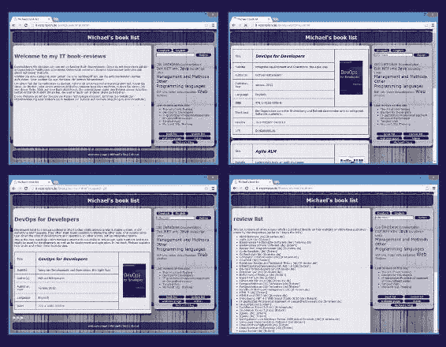
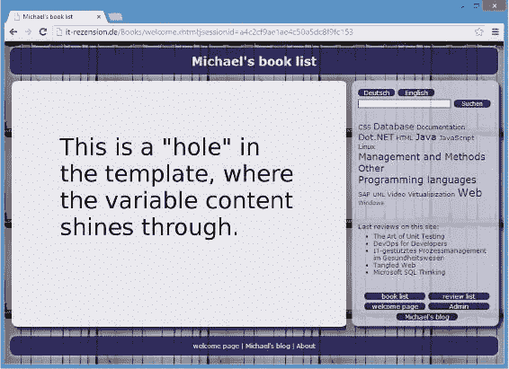

# 13. JSF 模板化

Michael Müller^(1 )

(1)德国，北莱茵-威斯特法伦州，布吕尔

通常，应用程序会提供一致的外观和感觉。这样，整体布局保持不变，只有内容或其他次要元素在不同页面之间变化。JSF 通过其简单而强大的模板功能支持这种整体布局。

## 模板化图书

*模板*就像一张图片，上面有一些（大多是）矩形的孔洞。通过在其他图片后面放置这些孔洞，你可以在保持基本布局的同时更改图片。

图 13-1 展示了图书应用程序的一些不同屏幕。



###### 图 13-1 图书运行中

如你所见，由于 JSF 模板化（见图 13-2），只有主要内容区域发生了变化。



###### 图 13-2 图书运行中

对于模板化，至少需要两个组件：模板文件和内容文件。由于内容文件使用了模板，因此它被称为*客户端*。

让我们从模板开始。还记得分类编辑器吗？第一个（原型）版本仍然叫做 index.xhtml。这个文件包含页眉、导航、主体和页脚。我们需要的“孔洞”正好是主体部分。创建模板最简单的方法是复制这个文件（在项目树的网页分支中，即 src/webapp 文件夹），剪切主体中的内容，并用一条指令替换它，该指令的意思是“在此插入可变内容”。这就是 `<ui:insert ...>` 标签的作用。不要忘记为 `ui:` 插入命名空间声明。然后——瞧——模板就准备好了，如清单 13-1 所示。


###### 清单 13-1 booksTemplate.xhtml 草案

```
 1   <?xml version='1.0' encoding='UTF-8' ?>
 2   <!DOCTYPE html [<!ENTITY copy "©">]>
 3   <html xmlns:="http://www.w3.org/1999/xhtml"
 4         xmlns:ui="http://xmlns.jcp.org/jsf/facelets"
 5         xmlns:h="http://xmlns.jcp.org/jsf/html">
 6       <h:head>
 7           <title>图书</title>
 8           <h:outputStylesheet library="css" name="books.css" />
 9       </h:head>
10       <h:body>
11           <div id="wrapper">
12               <header>
13                   <h1>迈克尔的书单</h1>
14               </header>
15               <main>
16                   <ui:insert name="content">此处为内容</ui:insert>
17               </main>
18               <nav>
19                   这是导航栏
20               </nav>
21               <footer>
22                   &copy;  迈克尔·穆勒
23                   |
24                   <h:outputLink value="http://blog.mueller-bruehl.de">
25                       迈克尔的博客
26                   </h:outputLink>
27                   |
28                   <h:link value="关于" outcome="index.xhtml"/>
29               </footer>
30           </div>
31       </h:body>
32   </html>
```

`<ui:insert ...>` 标签定义了一个名为 `content` 的占位符，由 `name` 属性指定。这是一个内容将显现的“孔洞”。在一个给定的模板中，可以定义多个插入标签。该标签中的文本 *此处为内容* 将被模板客户端提供的内容替换。

###### 浏览模板

1.  启动应用程序。

2.  打开模板页面。在浏览器的地址（URL）栏中，输入 **http://localhost:8080/Books/booksTemplate.xhtml**。

您应该会看到基本布局，其中主要内容部分显示为“此处为内容”。

现在我们需要重构 `index.xhtml`，将其转换为模板客户端。我们将使用 `<ui:composition ...>` 标签代替 `html` 标签。在此标签内，我们放置 `<ui:define name="content">`。这里提供的名称与我们在模板中作为占位符提供的名称相同。无论我们想为模板内容显示什么，只需将适当的内容放在此标签中即可。

最后但同样重要的是，我们需要声明要使用的模板，如清单 13-2 所示。

###### 清单 13-2 模板客户端

```
 1   <?xml version='1.0' encoding='UTF-8' ?>
 2   <!DOCTYPE html>
 3   <ui:composition xmlns:="http://www.w3.org/1999/xhtml"
 4         xmlns:h="http://xmlns.jcp.org/jsf/html"
 5         xmlns:ui="http://xmlns.jcp.org/jsf/facelets"
 6         template="/booksTemplate.xhtml">
 7       <ui:define name="content">
 8           <h1>编辑分类</h1>
 9           <h:form>
10               <h:dataTable value="#{categoryEditor.categories}"
11                            var="cat">
12                   <h:column>
13                       <h:commandLink
14                           action="#{categoryEditor.deleteCategory(cat)}">
15                           <h:graphicImage alt="删除"
16                                           name="Delete.png"
17                                           library="icon/small"
18                                           title="删除"/>
19                       </h:commandLink>
20                   </h:column>
21                   <h:column>
22                       <h:inputText value="#{cat.name}"/>
23                   </h:column>
24               </h:dataTable>
25               <h:commandLink styleClass="button"
26                              value="添加分类"
27                              action="#{categoryEditor.addCategory}"/>
28               <h:commandButton styleClass="button"
29                                value="保存"                                                                
30                                action="#{categoryEditor.save}"/>
31           </h:form>
32       </ui:define>>
33   </ui:composition>
```

在此示例中，命名空间被定义为 `<ui:composition ...>` 元素的属性。有时您会看到 JSF 模板客户端包含一个 `html` 元素，并在其中声明命名空间。然后 `<ui:composition ...>` 定义在此页面的某处，例如在 `body` 内。`<ui:composition ...>` 之外的所有内容对于客户端都将被忽略。清单 13-3 展示了这种方法。在我看来，它更简洁，没有这种额外的开销。

###### 清单 13-3 包含多余 html 标签的模板客户端

```
 1   <?xml version='1.0' encoding='UTF-8' ?>
 2   <!DOCTYPE html>
 3   <html xmlns:="http://www.w3.org/1999/xhtml"
 4         xmlns:h="http://xmlns.jcp.org/jsf/html"
 5         xmlns:ui="http://xmlns.jcp.org/jsf/facelets">

 7       此处内容将被忽略

 9     <ui:composition  template="/booksTemplate.xhtml">
10         <ui:define name="content">
12               此处放置内容
13         </ui:define>>
14     </ui:composition>

16       此处内容将被忽略

18  </html>
```

正如我们将在本书后面看到的，一个模板可能是另一个模板的客户端。JSF 允许您定义嵌套模板的级联。

###### 注意

从启动到模板化开发的 Books 完整源代码可从 [`webdevelopment-java.info`](http://webdevelopment-java.info) 获取。

## 总结

通过 JSF 的模板机制，可以创建统一的整体外观和感觉。它由一个定义整体布局的模板构建而成。客户端通过替换或添加预定义位置的内容来使用此模板。一个模板可以被多个客户端使用，并且一个模板可以是另一个模板的客户端，从而支持级联结构。

© 迈克尔·穆勒 2018

迈克尔·穆勒，Java EE 8 中的实用 JSF，`doi.org/10.1007/978-1-4842-3030-5_14`

