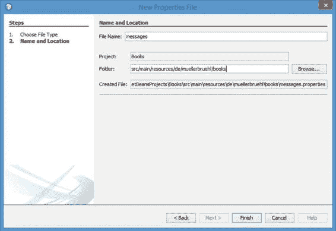
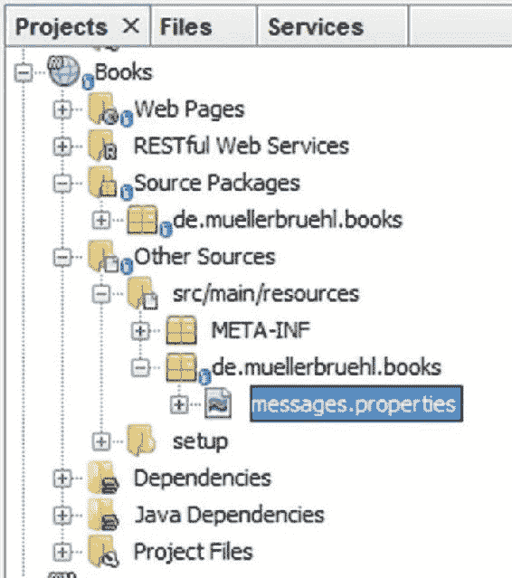
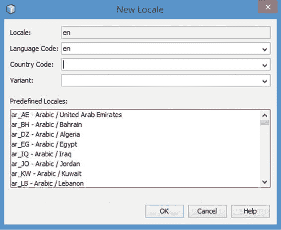
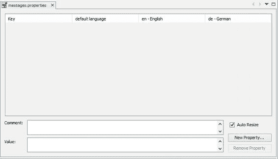
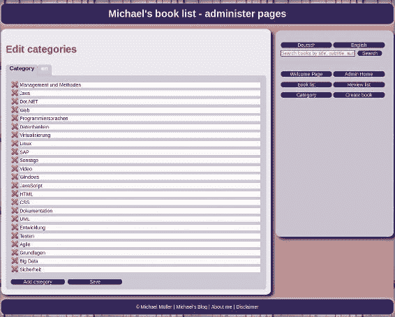
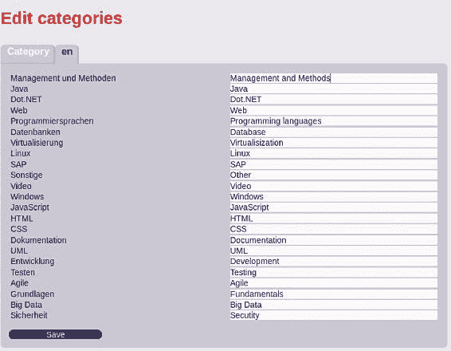
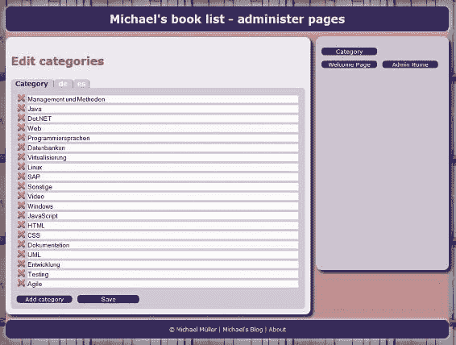
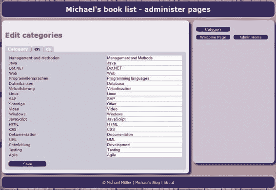

# 14. 走向国际化

迈克尔·穆勒^(1 )

(1)德国，北莱茵-威斯特法伦州，布吕尔

托管在互联网上 Web 服务器中的应用程序，几乎可以从全球任何地方访问。即使您的应用程序并非面向所有人，您也可能需要面向不同国家、使用不同语言的用户。这意味着您需要为国际市场准备您的软件。

## 国际化和本地化

Books 将针对不同语言和格式进行准备（*国际化*），并针对英语（如澳大利亚、加拿大、美国和英国等国家）和德语（德国）语言进行实现。使图书支持不同语言并适应其他环境，比听起来要容易。

Java 通过让您简单地指定一个区域，为我们完成了大部分工作。我们只需提供关于该区域的信息，以我们选择的语言为所有 GUI 元素和消息提供文本。GUI 元素和消息的文本将根据用户系统的语言设置应用所选语言。此外，我们可能还需要提供一个语言选择器。

到目前为止，我们已经开发了分类编辑器的第一个版本。该编辑器带有一个极简的用户界面。只有少数几个元素需要翻译。但除了翻译页面之外，我们还需要翻译内容（分类）——想象一下应用程序以不同语言显示。因此，让我们首先介绍并本地化欢迎屏幕（一个非常简单的页面），然后再回到分类编辑器。


###### 国际化与本地化

*国际化*（常缩写为 *i18n*）是指让软件能够适配其他语言和地区的过程，而*本地化*（*L10n*）则是针对特定语言和地区进行适配。

这两者都不仅仅是简单地将图形界面元素翻译成另一种语言。还需要考虑不同的日期格式、不同的符号（德国邮箱与美国邮箱的外观差异很大）、同一语言内因地区不同而产生的用词差异（如 mailbox/postbox、localization/localisation、cellular phone/mobile phone）等等。

## 欢迎页面

欢迎页面（或称着陆页）仅向访问者介绍应用程序的用途，并包含一些静态文本。考虑到国际用户，该文本以多种语言提供。

在我的网站（it-rezension.de）上，我提供德语和英语两种语言，因为我阅读这两种语言的书籍。我对德语书籍的评论用德语撰写。我对英语书籍的评论则根据出版媒介（如印刷杂志或在线平台）用德语和/或英语撰写。因此，仅提供这两种语言对我的网站来说就足够了。但 Books 应用程序的设计目标是能够根据需要以其他语言呈现。

欢迎页面上只有文本。我们可以将国际化工作的重点放在以不同语言提供这些文本上。目前无需调整日期、数字格式或图标。我们将在处理 Alumni 应用程序时再探讨这些方面。

### 消息包

为了实现目标，我们将使用所谓的*消息包*。这本质上是一个为 JSF 提供的资源包。*资源包*是一组遵循特殊命名约定的属性文件。即使你从未为国际市场开发过应用程序，也可能使用过属性文件来配置应用程序。每个文件都是一种键值存储。对于国际化和本地化，我们需要为每种语言准备这样一个文件。每个文件包含相同的键，但值已翻译成目标区域设置。如果用户的区域设置未知，应用程序必须提供一个默认值。惯例是使用简单的文件名作为默认值，并附加语言代码（ISO-639 语言代码）以及可选的地区代码（ISO-3166 国家代码，极少数情况下还会加上变体）。你可以在互联网上的不同站点找到这些代码，例如在 Oracle 网站，ISO-3166 国家代码和 ISO-639 语言代码可在 [`docs.oracle.com/cd/E13214_01/wli/docs92/xref/xqisocodes.html`](http://docs.oracle.com/cd/E13214_01/wli/docs92/xref/xqisocodes.html) 找到。

表 14-1 展示了一个示例。

###### 表 14-1 语言代码

| 文件名 | 用途 |
| --- | --- |
| messages.properties | 默认 |
| messages_de.properties | 德语 |
| messages_en.properties | 英语 |
| messages_en_US.properties | 英语（美国） |
| messages_en_GB.properties | 英语（英国） |

在此示例中，messages 是文件名。你可以选择任何你喜欢的其他名称。语言和地区（国家）代码附加在下划线之后。

现在，让我们创建一个资源包，并讨论如何在我们的 Web 应用程序中使用它。

使用 NetBeans，选择 New File ➤ Other ➤ Properties File，然后点击 Next。将出现 New Properties File 对话框，如图 14-1 所示。提供名称 **messages**，并在文件夹名称字段中输入 **src/main/resources/de/muellerbruehl/books**。你可以将 de/muellerbruehl/books 替换为你选择的包名。点击 Browse 先浏览到现有的 src/main/resources 目录，然后补全名称。请注意，在 Windows 系统上浏览时，你会看到 src\main\resources，因为 Windows 使用反斜杠作为文件夹分隔符。你可以输入正斜杠或反斜杠——对话框都能识别。点击 Finish 创建属性文件。



###### 图 14-1 New Properties File 对话框

NetBeans 会创建一个新文件并在编辑器中打开它。如果 NetBeans 在此文件中放置了任何内容，请将其删除，保存文件，然后在编辑器中关闭它。

在项目树中，右键点击 messages.properties 文件（图 14-2），然后选择 Add ➤ Locale。



###### 图 14-2 项目树

NetBeans 会显示 New Locale 向导，如图 14-3 所示。



###### 图 14-3 New Locale 向导

如你所见，你可以选择一种语言和一个地区（国家和变体）。对于 Books，输入 **en** 并点击 OK 或按 Enter 键。NetBeans 会为你创建相应的属性文件（messages.properties 和 messages_en.properties）。再为 **de**（德语）添加第二个文件，从而创建一个 messages_de.properties 文件。如果你了解语言代码，则无需使用 New Locale 向导；你可以直接按照正确的名称创建文件，这只需在属性文件名后附加正确的语言代码即可。如果你偏好的 IDE 不提供此类向导，你也可以这样做。要提供同一语言的不同版本，你需要附加正确的变体，例如 messages_en_US.properties（美国英语）或 messages_en_GB.properties（英国英语）。

我们打算提供两种语言，但总共创建了三个属性文件。当然，我们可以将默认文件用于德语，另一个用于英语，但我建议为每种语言使用一个特定的文件，并将默认文件作为后备。

我们页面标题的文本位于键 headWelcome 中。你可以像图 14-4 那样编辑属性文件，但你必须将键输入到每个文件中以保持文件同步，这可能是一项繁琐的工作。为了方便编辑，NetBeans 提供了一个特殊的属性编辑器，如图 14-4 所示。右键点击任意一个属性文件，选择 Open——不要选择 Edit，因为那会在文本编辑器中打开单个文件。你可以通过选择 New Property 来创建新的键值对，如图 14-5 所示。



###### 图 14-4 属性文件编辑器


###### 图 14-5 新建属性对话框

在**键**处输入 **headWelcome**，在**值**处输入 **欢迎来到我的 IT 书评**。可选地提供一条注释。点击确定或按回车键。

NetBeans 会将新属性插入到每个属性文件中——并非项目中的每个属性文件，而是资源包 messages。条目看起来像这样：headWelcome=欢迎来到我的 IT 书评。现在只需调整一个文件（德语版），可以直接在属性文件编辑器中完成：Willkommen zu meinen IT-Rezensionen。

接下来，创建一个键为 textWelcome 的属性。其值将变为包含一些换行的多行文本。例如：

*   浏览我评论过的书籍。获取印刷出版物的参考信息或在线评论的链接。

*   请从分类中选择，或输入搜索词进行搜索。你也可以从本站发布的评论列表中选择。

*   为了部分抵消服务器费用，我参与了亚马逊合作伙伴计划。如果你通过封面图片的链接从亚马逊购买商品，将有助于资助本站。当然，你可以随意在任何地方购买书籍。

*   本站由 JavaServer Faces 技术驱动。在我的书《<a href=“ [`leanpub.com/jsf`](http://leanpub.com/jsf) ”>使用 Java 和 JSF 进行 Web 开发</a>》以及我的博客 <a href=“ [`blog.mueller-bruehl.de/en/`](http://blog.mueller-bruehl.de/en/) ”>[blog.mueller-bruehl.de]</a> 中了解实现细节。

点击 *de – 德语* 列的相应字段，输入德语版本的欢迎文本，类似这样：

*   Durchstöbern Sie die Liste der von mir verfassten Buch-Rezensionen. Diese ist mit Verweisen auf die entsprechende Publikation oder einem Online-Link versehen. Diverse Rezensionen befinden sich gleich auf dieser WebSite.

*   Wählen Sie eine Kategorie oder geben Sie eine Suchbegriff ein, um die entsprechenden Bücher aufzurufen. Oder wählen Sie aus der Liste der letzten Rezensionen.

*   Um einen Teil der Serverkosten zu decken, nehme ich am Amazon-Partnerprogramm teil. Wenn Sie eines der Bücher, oder einen anderen Artikel bei Amazon bestellen möchten, nutzen Sie einen Link von dieser Seite (Klick auf eine Buch-Abbildung). Sie unterstützen damit den Betrieb dieser WebSite. Selbstverständlich steht Ihnen frei, die Bücher auch von anderer Stelle zu beziehen.

*   Diese WebSite ist mit der JavaServer Faces Technologie realisiert. Erfahren Sie Details zur Implementierung in meinem Buch <a href=“ [`leanpub.com/jsf`](http://leanpub.com/jsf) ”> “Web Development with Java and JSF”</a> oder stöbern Sie in meinem JSF Turorial auf meinem Blog <a href=“ [`blog.mueller-bruehl.de/en/`](http://blog.mueller-bruehl.de/en/) ”> [blog.mueller-bruehl.de]</a>.

创建好属性文件后，如何在 JSF 中使用它们呢？

你需要在 WEB-INF 文件夹中创建一个 faces-config.xml 文件（参见第一部分中的“配置文件”），如清单 14-1 所示。如果你使用 NetBeans 创建此文件，它将自动生成带有适当命名空间的文件。

###### 清单 14-1 faces-config.xml

```
 1   <?xml version='1.0' encoding='UTF-8'?>
 2   <faces-config version="2.3"
 3                 xmlns:="http://xmlns.jcp.org/xml/ns/javaee"
 4                 xmlns:xsi="http://www.w3.org/2001/XMLSchema-instance"
 5                 xsi:schemaLocation="http://xmlns.jcp.org/xml/ns/javaee
 6                 http://xmlns.jcp.org/xml/ns/javaee/web-facesconfig_2_2.xsd">

 8     <application>
 9       <locale-config>
10         <default-locale>en</default-locale>
11         <supported-locale>de</supported-locale>
12         <supported-locale>en</supported-locale>
13       </locale-config>
14       <resource-bundle>
15         <base-name>de.muellerbruehl.books.messages</base-name>
16         <var>msg</var>                                                                                              
17       </resource-bundle>
18       <message-bundle>de.muellerbruehl.books.messages</message-bundle>
19     </application>

21   </faces-config>
```

在 `<application>` 标签内，我们定义了要使用的不同区域设置（第 9-14 行）。在 `<locale-config>` 中，我们可以定义默认语言以及其他语言。由于 Books 支持（至少）两种语言，我们需要在此声明英语和德语。英语（en）用作默认区域设置（第 10 行），德语（de）定义为受支持的区域设置（第 11 行）。英语也被定义为受支持的区域设置（第 12 行）。虽然你可以使用英语而无需将其重新声明为受支持的区域设置，但此声明对于查询所有受支持的语言很有用。应用程序应支持的任何区域设置都需要在此声明。

接下来，我们定义一个资源包（`<resource-bundle>`，第 14 至 17 行）。这定义了我们要在页面中访问的资源。它由完整的包名和文件名定义，不带 properties 扩展名。`<var>` 定义了我们在 JSF 页面中用于引用此包的变量名。

有时覆盖一些 JSF 的标准消息非常有用。我们将通过提供与 JSF 使用的键相同的本地化文本来实现这一点。`<message-bundle>`（第 18 行）声明了属性文件（不带区域设置和扩展名）。在 Books 中，我们为所有文本使用一个文件组。因此，消息包指向相同的文件。它本可以是另一组不同的属性文件。

在 web.xml（位于同一文件夹中）中，我们将欢迎文件条目更改为 `<welcome-file>welcome.xhtml</welcome-file>`。

### 简单的欢迎页面实现

欢迎页面应简单地显示标题和文本。与分类编辑器一样，它使用现有的模板。因此，我们必须定义一个 `<ui:composition>`。这是一个首次的简单实现，如清单 14-2 所示，输出结果如图 14-6 所示。

###### 清单 14-2 welcome.xhtml 初稿

```
 1   <?xml version='1.0' encoding='UTF-8' ?>
 2   <!DOCTYPE html>
 3   <ui:composition xmlns:="http://www.w3.org/1999/xhtml"
 4                   xmlns:h="http://xmlns.jcp.org/jsf/html"
 5                   xmlns:ui="http://xmlns.jcp.org/jsf/facelets"
 6                   template="/booksTemplate.xhtml">

 8     <ui:define name="content">
 9       <h1>#{msg.headWelcome}</h1>
10       <p>
11         #{msg.textWelcome}
12       </p>
13     </ui:define>

15   </ui:composition>
```

如果你熟悉 HTML，可能能猜到问题所在：HTML 会忽略由回车符或回车换行符造成的换行。并且嵌入的 HTML 元素（链接）不会被解释。结果，欢迎文本的格式会不正确。不过，你可以使用此页面来检查本地化。使用默认区域设置为德语的浏览器，页面将以德语显示，否则将以英语显示。


###### 图 14-6 使用简单实现的欢迎页面（英文版）

###### 检查其他区域设置

尝试更改浏览器的语言设置。例如，在 Firefox 中选择选项 ➤ 内容 ➤ 语言。如果所需语言不存在，则添加并将其移至顶部。使用 Chrome 时，你需要先展开设置到扩展视图。将德语声明为默认语言（或者如果你的默认语言是德语，则将其设置为英语）。重新加载应用程序。语言应该会改变。

然后将默认语言设置为任何其他（非英语、非德语）语言并重新加载应用程序。它应该显示英文版本。


### 使用段落和 `<ui:repeat>`

一旦消息资源包正确配置，我们就可以着手处理格式问题。首先，我们将文本按换行符拆分成数组，从而将文本切分为独立的段落。在 Windows 系统中，换行符编码为 CRLF，而在其他系统中则为 LF。因此，需要先对换行符进行标准化处理。

得到数组后，我们可以使用 `<ui:repeat>` 标签遍历所有元素，并且为了让链接正常工作，需要关闭 HTML 转义。

###### HTML 转义

简而言之，HTML 由文本和标签组成。标签由尖括号界定，因此尖括号具有特殊含义。如果有人想要显示尖括号，则必须先将其*转义*，使其不再是标签分隔符。要显示 `<`，需要写成 `&lt;`（*lt* 代表 less-than，即小于号）。`&xxx;` 序列（其中 xxx 是由两个或更多字符组成的符号名称）称为 HTML 实体，用于转义特殊字符。字符也可以通过其代码进行转义。`<` 也是小于号。

在 Web 应用程序中，通常会显示持久化到数据库中的文本。这些文本可能来自用户输入。如果将该文本视为 HTML，恶意用户可能会插入指向恶意网站或包含恶意脚本的代码。为了防止此类注入攻击，JSF 通常默认对输出进行转义。

我们欢迎页面的文本不依赖于任何用户输入。它存储在资源文件中。我们信任自己的内容（有人可能会攻击应用服务器，但出于此处目的，我们假设他们不会），因此关闭 HTML 转义，如清单 14-3 所示。

###### 清单 14-3 优化后的欢迎页面

```
 1   <?xml version='1.0' encoding='UTF-8' ?>
 2   <!DOCTYPE html>
 3   <ui:composition xmlns:="http://www.w3.org/1999/xhtml"
 4                   xmlns:h="http://xmlns.jcp.org/jsf/html"
 5                   xmlns:ui="http://xmlns.jcp.org/jsf/facelets"
 6                   template="/booksTemplate.xhtml">

 8     <ui:define name="content">
 9       <h1>#{msg.headWelcome}</h1>
10       <ui:repeat value="#{msg.textWelcome.replace('\\r', '').split('\\n')}"
11                  var="text">
12         <p>
13           <h:outputText value="#{text}" escape="false"/>
14         </p>
15       </ui:repeat>
16     </ui:define>

18   </ui:composition>
```

技巧在于将输出文本拆分为一个数组，然后由 `<ui:repeat...>` 元素进行遍历。`<ui:repeat...>` 可用于遍历数组、集合或映射。

每个元素将在名为 `text` 的变量中可用。每个段落都被包裹在段落标签（`<p>`）中。

到目前为止，我们使用了 `<h:dataTable...>` 和 `<ui:repeat...>` 作为重复元素。在本书后续部分，我们将探讨更多重复结构，并讨论每种结构的优缺点。

现在，要实现漂亮的格式，我们只需要一些 CSS 代码来为段落添加上下内边距。因为我们定义了链接以白色显示，而内容背景是亮色，所以我们必须选择一种深色，如清单 14-4 所示。

###### 清单 14-4 books.css 中的附加格式声明

```
1   p {
2     margin: 5px  0 5px  0;
3   }

5   p > a {
6     color: blue;
7   }
```

###### 注意

运行应用程序并检查格式行为。你应该会看到几个段落，它们之间有一个小间隙，并且包含真正的链接。

## 语言切换器

通常，根据用户环境选择显示语言是合适的。我在我的网站 [`it-rezension.de`](http://it-rezension.de) 上使用了一个语言切换器。切换语言似乎很简单：

```
1   FacesContext.getCurrentInstance().getViewRoot()
2               .setLocale(new  Locale(getLanguageCode()));
```

获取当前 `FacesContext` 实例的视图根，并将区域设置设置为新的区域设置。看起来很容易！但是，如果你以这种方式切换语言，你会发现旧语言很快就会被恢复。发生了什么？

JSF 规范规定，每次请求都必须根据用户设置来设置区域设置。这将覆盖语言切换器的设置。因此，`#{msg.headWelcome}` 将根据用户设置显示语言，而不是根据切换器的结果。我最初为 Books 使用的技巧是将语言选择保存在一个会话作用域的 bean 中，并通过一个工具类检索所有值。

清单 4-5 显示了该页面的摘录。

###### 清单 14-5 将本地化字符串插入网页

```
1   ...
2   <h1>#{sessionTools.getMessage('headWelcome')}</h1>
3   ...
```

清单 14-6 显示了相关的 Java 代码。

###### 清单 14-6 通过键引用特定区域设置的字符串

```
1   public String getMessage(String key) {
2     ResourceBundle messageBundle;
3     Locale locale = new Locale(getLanguageCode());
4     messageBundle = ResourceBundle
5                     .getBundle("de.muellerbruehl.books.messages", locale);
6     return messageBundle.getString(key);
7   }
```

为简洁起见，此处仅展示原理。

自 JSF 2.0 起，可以注册系统事件监听器。我将在后面详细讨论这些事件。这里仅说明如何将其用于语言切换器的更好版本。技巧仍然是在 `@SessionScoped` bean 中记住所选语言，因为一旦用户更改语言，我们希望记住该设置。但是，就在渲染页面之前，我们切换到所选语言。然后 JSF 将使用来自相应资源包的字符串。因此，我们可以简单地通过 `#{msg.XXX}` 在页面定义中访问消息资源包。

为此，我们需要注册一个 `preRenderView` 事件的监听器，如清单 14-7 所示。每当页面应该被渲染时，就会触发此事件。一个配套的 `preRenderComponent` 事件将在渲染单个组件之前触发。

###### 清单 14-7 为语言切换器嵌入监听器

```
1   ...
2   <f:metadata>
3     <f:event type="preRenderView"
4       listener="#{sessionTools.preRenderView}"/>
5   </f:metadata>
6   ...
7   <h1>#{msg.headWelcome}</h1>
8   ...
```

系统事件的监听器是一个返回类型为 void、参数类型为 `ComponentSystemEvent` 的方法，如清单 14-8 所示。

###### 清单 14-8 用于在渲染前设置区域设置的 SystemEvent 监听器

```
1   public void preRenderView(ComponentSystemEvent event) {
2     Locale locale = new Locale(getLanguageCode());
3     FacesContext.getCurrentInstance().getViewRoot().setLocale(locale);
4   }
```

最后但同样重要的是，你可以使用 `<f:view>` 标签来定义区域设置。这定义了 ViewRoot，即组件树的根。因此，所有其他 JSF 组件都必须包含在 `<f:view>` 内。使用 Facelets 作为 VDL 时，视图根是隐式定义的。通常，显式定义仅在与 JSP 作为 VDL 结合使用时才会使用。

尽管如此，你仍然可以在 Facelets 中使用视图根定义。页面定义将类似于清单 14-9。


###### 清单 14-9 显式定义视图根的页面定义骨架

```
 1   <html xmlns:="http://www.w3.org/1999/xhtml"
 2         xmlns:ui="http://xmlns.jcp.org/jsf/facelets"
 3         xmlns:h="http://xmlns.jcp.org/jsf/html"
 4         xmlns:f="http://xmlns.jcp.org/jsf/core">

 6     <f:view locale="#{sessionTools.language}">
 7       <h:head>
 8         ...
 9       </h:head>
10       <h:body>
11         ...
12       </h:body>
13     </f:view>
14   </html>
```

`<f:view>` 可以接受一个可选的 `locale` 属性，用于为该视图定义特定的区域设置。和之前一样，我们将获取当前会话中存储的值。

我认为将所有部分组合在一起应该没有问题。或者，可以尝试使用语言切换器，它包含在完整应用的源代码中。

## 本地化内容

现在，我们将使用增强版的分类编辑器来翻译内容。对于 Books 应用，我们需要区分两种用户：

*   **管理员**，即编辑和维护数据的编辑者
*   **网站访客**，即希望获取信息的用户

管理区域应通过视觉效果进行标识。

### 准备管理区域

管理页面有多种解决方案。它们都需要具有一致的外观和风格，并与应用的整体感觉保持一致。因此，我们选择更换背景颜色，同时保留其他部分。但从读者的角度来看，有一个部分是不同的：导航。

一种方法是替换导航部分。根据我们显示的页面，我们可以包含一个*访客导航*或*管理导航*。另一种方法是使用不同的模板，而 Books 应用采用的就是这种方法。

要准备这些页面，请遵循以下步骤：

1.  在你的 Web Pages (webapp) 文件夹中，创建一个子文件夹，并将其命名为 `admin`。
2.  将 `booksTemplate.xhtml` 复制到 `admin` 文件夹中，并将目标文件重命名为 `adminTemplate.xhtml`。
3.  将 `index.xhtml` 文件移动到 `admin` 文件夹中，并将其重命名为 `categoryEditor.xhtml`。
4.  在此页面的头部，将 `booksTemplate` 更改为 `adminTemplate`。
5.  在 `admin` 文件夹中创建一个 `welcome.xhtml` 页面。与现有的欢迎页面类似，在其中为管理员添加一些欢迎文本。

### 包含到页面中

通过复制模板，我们重复了页脚的标记。在这种情况下，它只是很小的一部分，但重用代码是一个好习惯。提醒一下，页脚如清单 14-10 所示。

###### 清单 14-10 页脚

```
 1   ...
 2     <footer>
 3       &copy; Michael Müller
 4       |
 5       <h:outputLink value="http://blog.mueller-bruehl.de">
 6         Michael's Blog
 7       </h:outputLink>
 8       |
 9       <h:link value="About" outcome="/welcome.xhtml"/>
10     </footer>
11   ...
```

JSF 提供了 `<ui:include src="..."/>` 标签，用于将一个页面的一部分包含到另一个页面中。

我们将把公共部分放到它们自己的目录中。因此，我们在 Web Pages 文件夹中创建一个文件夹，并将其命名为 `common`。

接下来，让我们在该文件夹中创建一个新文件 `footer.xhtml`。该文件包含一个 `<ui:composition>`，如前所述，并包含我们的页脚，如清单 14-11 所示。

###### 清单 14-11 重构为 HTML 片段的页脚

```
 1   <?xml version='1.0' encoding='UTF-8' ?>
 2   <!DOCTYPE html [<!ENTITY copy "©">]>
 3   <ui:composition xmlns:="http://www.w3.org/1999/xhtml"
 4                   xmlns:h="http://xmlns.jcp.org/jsf/html"
 5                   xmlns:ui="http://xmlns.jcp.org/jsf/facelets">

 7     &copy; Michael Müller
 8     |
 9     <h:outputLink value="http://blog.mueller-bruehl.de">
10       Michael's Blog
11     </h:outputLink>
12     |
13     <h:link value="About" outcome="/welcome.xhtml"/>
14   </ui:composition>
```

现在，两个模板（`booksTemplate` 和 `adminTemplate`）中的页脚部分都可以重写，以引用这个新文件，如清单 14-12 所示。

###### 清单 14-12 包含 HTML 文件

```
1   ...
2     <footer>
3       <ui:include src="/common/footer.xhtml"/>
4     </footer>
5   ...
```

这会将 `<ui:composition>` 标签内的部分插入到模板中。非常简单直接，不是吗？

除了静态包含，还可以通过 EL 表达式获取要包含的文件：

```
1   <ui:include src="#{someBean.someProperty}"/>
```

现在，如果你计算这个属性，就可以动态地决定要包含哪个源文件。例如，你可以模拟一个选项卡控件，并根据当前选择插入选项卡的内容。

回到分类编辑器。图 14-7 显示了两个不同的选项卡，一个用于分类，另一个用于翻译。单击其中一个选项卡的标题将触发重新加载，并包含视图描述的不同部分。



###### 图 14-7 分类编辑器

### 公共导航

创建一个文件 `include\commonNavigation.xhtml`，并将其插入到两个模板的 `<nav>` 区域中。在管理模板中，在公共导航上方的一个 `div` 内添加两个按钮，用于导航到 `\admin\categoryEditor.xhtml` 和 `\admin\bookEditor.xhtml`。创建一个新文件 `\admin\bookEditor.xhtml`（将在第 15 章中使用）。参见清单 14-13。

###### 清单 14-13 简单导航

```
 1   <?xml version='1.0' encoding='UTF-8' ?>
 2   <!DOCTYPE html [<!ENTITY copy "©">]>
 3   <ui:composition xmlns:="http://www.w3.org/1999/xhtml"
 4                   xmlns:h="http://xmlns.jcp.org/jsf/html"
 5                   xmlns:ui="http://xmlns.jcp.org/jsf/facelets">

 7     <div>
 8       <h:link styleClass="button"
 9               value="#{msg.btnWelcome}"
10               outcome="/welcome.xhtml"/>
11       <h:link styleClass="button"
12               value="#{msg.btnAdmin}"
13               outcome="/admin/welcome.xhtml"/>
14     </div>

16   </ui:composition>
```

在管理模板中，将 `<div id="wrapper">` 替换为 `<div id="adminWrapper">`，并将此代码片段添加到 CSS 中：

```
1   body > div#adminWrapper {
2     background-color: rosybrown;
3     border-radius: 1em;
4   }
```

### 主题

尽管 Books 的原始版本仅支持两种语言，但我们希望将分类编辑器设计为原则上支持任何语言。对于翻译，我们需要原始（默认）语言的分类，以及我们想要支持的每种额外语言的一个额外列。每个分类将显示在自己的行中。这可能会变成一个非常宽的表格，所以让我们实现另一种解决方案：通过几个页面，我们将构建一个类似选项卡控件的外观和感觉，每种语言一个注册选项卡（如图 14-7 和 14-8 所示）。

第一个页面类似于我们现有的编辑器。它用于以默认语言添加（编辑、删除）分类。所有其他选项卡将为每个分类显示两列。第一列是只读的，显示默认语言中的现有分类。第二列是可编辑的，用于输入目标语言之一的翻译。由于我的大部分评论是用德语写的，我将 `de` 定义为默认语言。图 14-8 显示了英语翻译的编辑器。




###### 图 14-8 分类编辑器，翻译

每个注册标签页都有一个简短的标题——例如，根据我们想要支持的语言数量，显示为 Category、en、es、fr 等。或者，我们可能更倾向于显示一面旗帜来表示语言，而不是显示语言缩写。（我们暂时忽略一些潜在问题，比如不同的旗帜代表同一种语言。英国国旗还是星条旗代表英语？一面旗帜能否代表不同的语言，例如瑞士国旗代表德语、法语或意大利语，或者加拿大国旗代表英语或法语？）

好的，对于每个注册标签页，我们需要一些信息，比如标题或旗帜、URL 等。我们将把这些信息放入一个名为 Topic 的容器中。编辑器的主题将维护在一个我们称之为 Topics 的集合结构中。一个主题可能不仅仅用于分类编辑器，因此它包含的元素比这个编辑器所需的要多。根据编辑器的不同，一个主题可能只需要包含一个标题，或者键、标题和 URL，或者其他元素的组合。对于这样的容器类，有不同的解决方案——例如，一个无参构造函数和每个字段的 getter/setter，或者接受不同参数的不同构造函数。或者——这也是 Books 的构建方式——我们可以使用一个构建器类，如代码清单 14-14 所示。

###### 代码清单 14-14 Topic.java

```
 1   public class Topic implements Serializable {

 3     private final String _key;
 4     private final String _title;
 5     private final String _outcome;
 6     private final String _info;
 7     private final String _imageEnabled;
 8     private final String _imageDisabled;
 9     private boolean _isEnabled;

11     private Topic(String key, String title, String outcome,
12                   String info, String imageEnabled,
13                   String imageDisabled, boolean isEnabled) {
14       _key = key;
15       _title = title;
16       _outcome = outcome;
17       _info = info;
18       _imageEnabled = imageEnabled;
19       _imageDisabled = imageDisabled;
20       _isEnabled = isEnabled;
21     }

24     public String getKey() {
25       return _key;
26     }

28     public String getTitle() {
29       return _title;
30     }

32     ... 其他 getter 方法已省略 ...

34     public String getImageDisabled() {
35       return _imageDisabled;
36     }

38     public String getImage() {
39       return _isEnabled ? _imageEnabled : _imageDisabled;
40     }

42     public boolean isIsEnabled() {
43       return _isEnabled;
44     }

46     public void setIsEnabled(boolean isEnabled) {
47       _isEnabled = isEnabled;
48     }                                                                                              

50     ... hashCode 和 equals 方法已省略 ...

53     public static class TopicBuilder {

55       private final String _key;
56       private String _title = "";
57       private String _outcome = "";
58       private String _info = "";
59       private String _imageEnabled = "";
60       private String _imageDisabled = "";
61       private boolean _isEnabled = true;

63       static public TopicBuilder createBuilder(String key) {
64         return new TopicBuilder(key);
65       }

67       private TopicBuilder(String key) {
68         _key = key;
69         _title = key;   // 默认为键
70       }

72       public TopicBuilder setTitle(String title) {
73         _title = title;
74         return this;
75       }

77       ... 其他链式调用元素已省略 ...

79       public Topic build() {
80         return new Topic(_key, _title, _outcome, _info,
81                          _imageEnabled, _imageDisabled, _isEnabled);
82       }
83     }
84   }
```

代码清单 14-15 展示了 Topics 的列表：

###### 代码清单 14-15 Topics.java

```
 1   public class Topics implements Serializable {

 3     private Optional<Topic> _activeTopic = Optional.empty();
 4     private final Set<Topic> _topics = new LinkedHashSet<>();

 6     public Set<Topic> getTopics() {
 7       return _topics;
 8     }

10     public void clear() {
11       _topics.clear();
12     }

14     public void addTopic(String title) {
15       addTopic(Topic.TopicBuilder.createBuilder(title).build());
16     }

18     public void addTopic(Topic topic) {
19       _topics.add(topic);
20     }

22     public void remove(String key) {
23       Optional<Topic> topic = findTopic(key);
24       topic.ifPresent(t -> _topics.remove(t));
25     }

27     public void remove(Topic topic) {
28       _topics.remove(topic);
29     }

31     public Optional<Topic> findTopic(String key) {
32       return _topics.stream()
33               .filter(topic -> topic.getKey().equals(key))
34               .findAny();
35     }

37     /* Java 8 之前的代码示例
38      public Topic findTopic(String key) {
39      for (Topic topic : _topics) {
40      if (topic.getKey().equals(key)) {
41      return topic;
42      }
43      }
44      return Topic.TopicBuilder.createBuilder("").build();
45      }
46      */
47     public Optional<Topic> getActiveTopic() {
48       return _activeTopic;
49     }

51     public void setActive(String key) {
52       _activeTopic = findTopic(key);                                                                                              
53     }

55   }
```

每个主题旨在保存特定标签页的信息。第一个标签页将是我们现有的分类编辑器页面，只需稍作调整。对于每个支持的语言环境，我们将添加另一个标签页。要执行此任务，我们需要有关支持的语言的信息，因此我们将创建一个小的收集方法。并且由于我们可能会重用此方法，我们将把它放入一个 Utilities 类中，如代码清单 14-16 所示。

###### 代码清单 14-16 Utilities.java

```
 1   public class Utilities {
 2     public static Set<String> getSupportedLocales(HandleDefault defHandler) {
 3       Application app = FacesContext.getCurrentInstance().getApplication();
 4       Set<String> languageCodes = new HashSet<>();
 5       for (Iterator<Locale> itr = app.getSupportedLocales(); itr.hasNext();) {
 6         Locale locale = itr.next();
 7         languageCodes.add(locale.getLanguage());
 8       }

10       String defaultLang = app.getDefaultLocale().getLanguage();
11       if (defHandler == HandleDefault.Exclude) {
12         languageCodes.remove(defaultLang);
13       } else {
14         languageCodes.add(defaultLang);
15       }
16       return languageCodes;                                                                                              
17     }

19     public enum HandleDefault {

21       Include, Exclude
22     }
23   }
```

语言环境在 `faces-config.xml` 文件中定义，该文件对整个应用程序有效。因此，我们需要查询的是应用程序对象。`getSupportedLocales()` 返回的是一个迭代器，而不是可迭代对象，所以我们不能使用 for each 循环。根据配置文件的不同，默认语言可能包含在支持的语言环境中，也可能不包含。我们将通过根据参数 `defHandler` 显式排除或包含默认语言环境来解决这个问题。

由于应用程序可能需要支持多种语言，并且我们需要节省空间，主题将只包含语言环境代码本身。但第一个标签页将被命名为 Category，或者德语中的 *Kategorie*。它需要被翻译，因此我们必须从中获取消息包和相应的翻译。为此，我们将向 Utilities 类添加另一个方法，如代码清单 14-17 所示。


###### 清单 14-17 通过键获取本地化消息

```
1   public static String getMessage(String key) {
2     ResourceBundle messageBundle = ResourceBundle
3             .getBundle("de.muellerbruehl.books.messages");
4     try {
5       return messageBundle.getString(key);
6     } catch (MissingResourceException e) {
7       return "<unknown resource: " + key + ">";
8     }
9   }
```

现在，我们可以在 `CategoryEditor` 类中初始化并使用这些主题。`initTopics()` 方法将从现有的 `init()` 方法中调用，如清单 14-18 所示。

###### 清单 14-18 CategoryEditor.java 中的主题处理

```
 1   ...
 2     private static final String CATEGORY = "category";
 3     private Topics _topics;

 5     private void initTopics() {
 6       _topics = new Topics();
 7       Topic topic = Topic.TopicBuilder
 8               .createBuilder(CATEGORY)
 9               .setTitle(Utilities.getMessage("lblCategory"))
10               .setOutcome("categoryEditor.xhtml")
11               .build();
12       _topics.addTopic(topic);
13       for (String lang : Utilities.getSupportedLocales(HandleDefault.Exclude))
14       {
15         topic = Topic.TopicBuilder
16                 .createBuilder(lang)
17                 .setOutcome("categoryTranslator.xhtml")
18                 .build();
19         _topics.addTopic(topic);
20       }
21       _topics.setActive(CATEGORY);
22     }

24     public String changeTab(String newTopicKey) {
25       if (_topics.getActiveTopic().get().getKey().equals(newTopicKey)) {
26         return "";
27       }
28       _topics.setActive(newTopicKey);
29       return _topics.getActiveTopic().get().getOutcome();
30     }

32     public Set<Topic> getTopics() {
33       return _topics.getTopics();
34     }

36     public boolean isActive(Topic topic) {
37     Optional<Topic> activeTopic = _topics.getActiveTopic();
38     if (activeTopic.isPresent()) {
39       return activeTopic.get().equals(topic);
40     }
41     return false;                                                                                              
42   }
```

如果用户点击某个主题，它会调用 `changeTab` 方法，该方法返回要导航到的页面。主题将被显示出来，为了允许访问它们，我们必须通过 `getTopics` 方法暴露它们。最后展示的方法是一个便捷方法，用于检查参数是否为当前活动主题。

一旦我们准备好了主题，就可以在页面布局中使用它们。现有的 `CategoryEditor` 现在变成了多个标签页之一。为此，我们引入一个新的模板 `categoryTemplate.xhtml`，并使 `categoryEditor.xhtml` 成为它的客户端。同时，我们将标题从现有的编辑器移动到新模板中。参见清单 14-19。

###### 清单 14-19 categoryTemplate.xhtml

```
 1   <?xml version='1.0' encoding='UTF-8' ?>
 2   <!DOCTYPE composition PUBLIC "-//W3C//DTD XHTML 1.0 Transitional//EN"
 3     "http://www.w3.org/TR/xhtml1/DTD/xhtml1-transitional.dtd">
 4   <ui:composition xmlns:ui="http://xmlns.jcp.org/jsf/facelets"
 5                   template="adminTemplate.xhtml"
 6                   xmlns:h="http://xmlns.jcp.org/jsf/html"
 7                   xmlns:c="http://java.sun.com/jsp/jstl/core"
 8                   xmlns:f="http://xmlns.jcp.org/jsf/core">

10     <ui:define name="content">

12       <h1>编辑分类</h1>

14       <h:form id="form">
15         <div class="tab">
16           <ul class="tab">
17             <c:forEach items="#{categoryEditor.topics}" var="topic">
18               <li class="#{categoryEditor.isActive(topic) ?'activetab':'tab'}">
19                 <h:commandLink value="#{topic.title}"
20                                action="#{categoryEditor.changeTab(topic.key)}">
21                   <f:param name="langCode" value="#{topic.key}"/>
22                 </h:commandLink>
23               </li>
24             </c:forEach>
25           </ul>                                                                                              
26         </div>
27       </h:form>
28       <div class="editor">
29         <ui:insert name="editContent">内容</ui:insert>
30       </div>
31     </ui:define>

33   </ui:composition>
```

每个主题都被包裹在无序列表 `<ul>` 的一个列表项 `<li>` 中。使用 `<c: forEach>` 来遍历所有主题。为什么不像之前那样使用 `<ui:repeat value="#{categoryEditor.topics}" var="topic">`？如果你尝试这样做，会得到一个错误。从技术上讲，`<c:forEach>` 是一个标签处理器。因此，它不会成为组件树的一部分。它会被求值，重复的结果将用于构建组件树。另一方面，`<ui: repeat>` 是一个组件，它将成为组件树的一部分。无论重复多少次，其子组件只会被插入组件树一次。并且它会在 `topics` 映射还不存在的时候被求值。听起来很吓人？其实不然。但你需要考虑重复结构之间的一些差异。我将在第 23 章中详细讨论这些细节和差异。

现在，我们来谈谈这里其他值得注意的元素。对于每个列表项，我们根据它是否是活动主题来选择样式类。结合 CSS，这将模拟出标签页的效果。所有翻译都将由同一个页面（`categoryTranslator.xhtml`）处理。为了确定正确的语言，我们使用 `<f:param>` 标签将其作为参数传递到该页面，该标签通过名称和值定义一个参数，这实际上形成了一个键值对，可供被调用的页面访问。

为了准备后续步骤并测试到目前为止的应用程序，请创建一个空的 `categoryTranslator.xhtml` 页面（更准确地说，是 `ui:composition`）。将你现有的分类编辑器作为模板。如果你手头没有代码，可以查看清单 14-20。为了让我们的标签页能够正常运行，我们最后还需要添加一些 CSS 魔法。

###### 清单 14-20 标签页外观格式化 (book.css)

```
 1   main div.tab {
 2     display: block;
 3   }

 5   main ul.tab {
 6     list-style-type: none;
 7     display: inline;
 8   }

10   main li.tab,
11   main li.activetab {
12     list-style-type: none;
13     display: inline;
14     border-style: solid;
15     border-width: 2px 2px 1px 2px;
16     border-top-left-radius: 0.5em;
17     border-top-right-radius: 0.5em;
18     background-color: #ccccd8;
19   }

21   main li.tab {
22     border-color:  #cccccc #aaaaaa #aaaaaa #cccccc;
23   }

25   main li.activetab {
26     border-color:  #cccccc #aaaaaa #ccccd8 #cccccc;
27   }

29   main li.tab a,
30   main li.activetab a {
31     padding: 0 0.5em 0 0.5em;
32     font-size: 1.2em;
33     text-decoration: none;
34     font-weight: bold;
35   }

37   main li.activetab a {
38     color: #000044;
39   }                                                                                              

41   .editor {
42     background-color: #ccccd8;
43     border-radius: 0.5em;
44     border-top-left-radius: 0;
45     padding: 1em;
46   }
```

图 14-9 展示了我们努力的成果。



###### 图 14-9 使用标签页控件外观的分类编辑器

### 增强分类实体

在实现分类翻译器之前，我们需要准备一个合适的翻译实体并增强分类实体。翻译实体引用分类 ID，并为一种语言提供翻译后的名称。参见清单 14-21。


###### 清单 14-21 CategoryTranslation.java 的重要部分

```
 1   @Entity
 2   @Table(name = "CategoryTranslation")
 3   public class CategoryTranslation implements Serializable {

 5     @Id
 6     @GeneratedValue(strategy = GenerationType.IDENTITY)
 7     @Column(name = "ctId")
 8     private int _id = -1;

10     @Column(name = "ctCategoryId")
11     private int _categoryId = -1;

13     @Column(name = "ctLanguage")
14     private String _language;

16     @Column(name = "ctName")
17     private String _name;

19     ... 为简洁起见，省略了 getter 和 setter ...

21     @Override
22     public int hashCode() {
23       if (_id < 0) {
24         int hash = 3;
25         hash = 89 * hash + _categoryId;
26         hash = 89 * hash + Objects.hashCode(_language);
27         return hash;
28       }
29       return _id;
30     }

32     @Override
33     public boolean equals(Object object) {
34       if (!(object instanceof CategoryTranslation)) {
35         return false;
36       }
37       CategoryTranslation other = (CategoryTranslation) object;
38       if (_id < 0 && other._id < 0) {
39         return _categoryId == other._categoryId
40                 && _language.equals(other._language);
41       }
42       return _id == other._id;
43     }
44   }
```

同样，对于两个具有相同有效 id 的对象，我们需要 hashCode 和 equals 保持一致。否则，两者都由 _categoryId 和 _language 决定。请参见清单 14-22。

###### 清单 14-22 CategoryTranslation 的创建语句（MySQL）

```
 1   CREATE TABLE `CategoryTranslation` (
 2     `ctId` int(11) NOT NULL AUTO_INCREMENT,
 3     `ctCategoryId` int(11) NOT NULL,
 4     `ctLanguage` varchar(10) NOT NULL,
 5     `ctName` varchar(45) NOT NULL,
 6     PRIMARY KEY (`ctId`),
 7     KEY `FK_CategoryTranslation_Category2` (`ctCategoryId`),
 8     CONSTRAINT `FK_CategoryTranslation_Category2`
 9       FOREIGN KEY (`ctCategoryId`)
10       REFERENCES `Category` (`catId`)
11   );
```

上述语句为 MySQL 数据库创建了该表——如果你使用其他 DBMS，可能需要对其进行调整。请参见清单 14-23 和 14-24。

###### 清单 14-23 CategoryTranslation 的创建语句（MS SQL Server 版本）

```
1   CREATE TABLE CategoryTranslation(
2           ctId int IDENTITY(1,1) NOT NULL,
3           ctCategoryId int NOT NULL
4             CONSTRAINT FK_CategoryTranslation_Category2
5             FOREIGN KEY(ctCategoryId) REFERENCES Category (catId),
6           ctLanguage varchar(10) NOT NULL,
7           ctName varchar(45) NOT NULL,
8     PRIMARY KEY (ctId)
9   )
```

###### 清单 14-24 CategoryTranslation 的创建语句（MySQL 版本）

```
 1 CREATE TABLE Books.CategoryTranslation (
 2    ctId INT NOT NULL AUTO_INCREMENT,
 3   ctCategoryId INT NOT NULL,
 4   ctLanguage VARCHAR(10) NOT NULL,
 5   ctName VARCHAR(45) NOT NULL,
 6   PRIMARY KEY (ctId),
 7   INDEX fk_CategoryTranslation_1_idx (ctCategoryId ASC),
 8   CONSTRAINT fk_CategoryTranslation_1
 9     FOREIGN KEY (ctCategoryId)
10     REFERENCES Books.Category (catId)
11     ON DELETE NO ACTION
12     ON UPDATE NO ACTION);
```

如你所见，定义了一个外键来为现有的 Category 表添加引用完整性。我们可以将其翻译为“此翻译属于某个类别”。实际上，一个类别可以没有、有一个或多个翻译。每个类别包含一个翻译集合，该集合可能为空。

清单 14-25 增强了类别实体，以建模这种一对多关系。

###### 清单 14-25 使用 List 的一对多关系

```
1   ...
2     @OneToMany
3     @JoinColumn(name = "ctCategoryId", referencedColumnName = "catId")
4     private List<CategoryTranslation> _catTranslations;
5   ...
```

此关系由 @OneToMany 注解定义。我们使用一个带有外键的第二张表。这通过 @JoinColumn 注解建模，该注解指定了用于连接这些表的两个列。这应该相当不言自明。所有翻译都将由一个列表持有。

使用 JPA，你可以建模其他类型的一对多关系，例如使用专用的连接表。通常，对于一对多关系，这种专用的连接表是多余的。你会在多对多关系中需要它。

考虑到类别翻译，直接通过语言代码访问翻译会很有用。因此，`Map<String, CategoryTranslation>` 比列表更合适。没问题——我们只需定义翻译的哪个字段将成为映射的键。

我们还需要此映射的访问器，并且为了将来使用，还需要一些便捷方法来访问单个翻译。请参见清单 14-26。


###### 清单 14-26 Category.java 的翻译增强

```
 1   ...
 2     @OneToMany(fetch = FetchType.LAZY,
 3               cascade = CascadeType.ALL,
 4               orphanRemoval = true)
 5     @JoinColumn(name = "ctCategoryId", referencedColumnName = "catId")
 6     @MapKey(name = "_language")
 7     private Map<String, CategoryTranslation> _catTranslations =
 8                       new HashMap<>();

10     public Map<String, CategoryTranslation> getCategoryTranslations() {
11       return _catTranslations;
12     }

14     public void setCategoryTranslations(
15           Map<String, CategoryTranslation> catTranslations) {
16       _catTranslations = catTranslations;
17   }

19     public String getTranslatedName(String langCode) {
20       if (_catTranslations.containsKey(langCode)) {
21         return _catTranslations.get(langCode).getName();
22       }
23       return "";
24     }

26     public void setTranslatedName(String langCode, String name) {
27       if (_catTranslations.containsKey(langCode)) {
28         _catTranslations.get(langCode).setName(name);
29       } else {
30         CategoryTranslation translation = new CategoryTranslation();
31         translation.setLanguage(langCode);
32         translation.setCategoryId(_id);
33         translation.setName(name);
34         _catTranslations.put(langCode,  translation);
35       }
36     }

38     public String getTranslatedNameOrDefault(String langCode) {
39       if (_catTranslations.containsKey(langCode)) {
40         String name = _catTranslations.get(langCode).getName();
41         if (name.isEmpty()) {
42           return _name;
43         }
44         return name;
45       }
46       return _name;
47     }
48   ...
```

虽然这些便捷方法无需进一步解释，但关于 `@OneToMany` 注解的一些信息值得注意。`fetch = FetchType.LAZY` 表示仅在首次访问时加载翻译内容。`EAGER` 则会与类别本身一起加载。哪种性能更优取决于数据结构和用法。想象一个庞大的对象图，其中许多部分很少被使用。在这种情况下，延迟加载通常是更好的选择。就我们的类别而言，翻译内容体积小且经常使用，因此我倾向于使用立即加载（出于教学原因，先介绍了延迟加载）。

根据 `cascade` 的设置，操作可能会被级联，也可能不会——例如，持久化一个类别时，其翻译内容可能会被持久化，也可能不会。这里，我们使用 `CascadeType.ALL` 来级联所有操作。其他值包括 `DETACH`、`MERGE`、`PERSIST`、`REFRESH` 和 `REMOVE`。

在清单 14-26 的第 6 行，我们使用了 `@MapKey(name = "_language")`。这一行告诉 JPA 使用 `CategoryTranslation` 类的 `_language` 字段，并使用其列名 `@Column(name = "ctLanguage")`。如果我们省略 `@MapKey` 注解，JPA 会尝试通过将 `_KEY` 附加到大写字段名来猜测列名。它将使用 `_CATTRANSLATIONS_KEY`，这与我们使用的列名略有不同。

我们所有的翻译内容都保存在一个 `Map<LanguageCode = Translation>` 中。当我们保存类别时，这个映射会自动保存。假设我们删除了该映射中的一个条目，然后再次保存类别。被删除的翻译条目会发生什么？由于我们级联了所有操作，保存类别也会影响 `CategoryTranslation`。如果没有进一步的定义，JPA 会将翻译的类别 ID 设置为 `NULL`，并更新相应的数据库表。如果我们删除类别，所有翻译内容将保留在数据库中，其类别 ID 设置为 `NULL`。这种行为适用于聚合关系。想象一个包含书籍列表的书架对象。如果书架被删除，你仍然会保留书籍，并将它们放到另一个书架上。与类别及其翻译不同，这是一种典型的组合关系。没有其类别，翻译内容就成了无用的孤儿。`orphanRemoval = true` 将确保删除此类孤儿。

### 类别翻译页面

现在我们已经准备好了拼图的所有碎片。是时候将它们组合在一起，创建类别翻译器了。事实上，大部分工作已经完成。我们需要一个页面定义和一些为 bean 添加的额外方法。

清单 14-27 中显示的页面非常简单。其中大部分内容我们已经熟悉。

###### 清单 14-27 categoryTranslator.xhtml

```
 1   <?xml version='1.0' encoding='UTF-8' ?>
 2   <!DOCTYPE html>
 3   <ui:composition xmlns:="http://www.w3.org/1999/xhtml"
 4                   xmlns:h="http://xmlns.jcp.org/jsf/html"
 5                   xmlns:ui="http://xmlns.jcp.org/jsf/facelets"
 6                   template="categoryTemplate.xhtml"
 7                   xmlns:f="http://xmlns.jcp.org/jsf/core"
 8                   xmlns:c="http://xmlns.jcp.org/jsp/jstl/core">

10     <ui:define name="editContent">
11       <h:form>
12         <h:dataTable value="#{categoryEditor.categories}"
13                      var="cat"
14                      styleClass="wide">
15           <h:column>
16             <h:outputText styleClass="wide" value="#{cat.name}"/>
17           </h:column>
18           <h:column>
19             <h:inputText styleClass="wide"
20                  value="#{cat.categoryTranslations[param.langCode].name}"/>
21           </h:column>
22           </h:dataTable>

24           <h:commandButton styleClass="button"
25                            value="保存"
26                            action="#{categoryEditor.save}">
27             <f:param name="langCode" value="#{param.langCode}"/>
28           </h:commandButton>
29           </h:form>
30     </ui:define>
31   </ui:composition>
```

`#{cat.categoryTranslations[param.langCode].name}` 提供了对类别翻译映射的访问。在方括号内，我们提供了键，即语言代码。请记住，我们通过 `<f:param>` 标签将此代码传递到了该页面。现在，我们可以从保存请求参数的参数映射中访问它。`param.langCode` 使用常见的点号表示法引用参数 `langCode`。“保存”按钮将触发页面导航，重新加载同一页面。要在重新加载后访问该语言，我们需要通过一个 `param` 标签再次传递它。

我们只需要在 bean 中初始化翻译，这意味着添加那些尚未从数据库中检索到的翻译。参见清单 14-28。

###### 清单 14-28 CategoryEditor.java

```
 1   public String changeTab(String newTopicKey) {
 2     if (_topics.getActiveTopic().get().getKey().equals(newTopicKey)) {
 3       return "";
 4     }
 5     _topics.setActive(newTopicKey);
 6     if (!newTopicKey.equals(CATEGORY)) {
 7       initTranslation(newTopicKey);
 8     }
 9     return _topics.getActiveTopic().get().getOutcome();
10   }

12   private void initTranslation(String langCode) {
13     // 确保映射中存在该语言的元素
14     _categories.stream().forEach(c -> {
15       if (c.getTranslatedName(langCode).isEmpty()) {
16         c.setTranslatedName(langCode,  "");
17       }
18     });
19   }
```

最后但同样重要的是，图 14-10 展示了翻译编辑器的快速预览。



###### 图 14-10 类别翻译器


## 摘要

国际化流程涵盖了使软件能够在其他国家/地区及语言环境中使用的准备工作。本地化则是针对特定语言或国家（或地区）的适配。本地化不仅意味着翻译，还包括调整日期和数字格式、字符集、书写方向、图像等内容。

Java 通过消息资源包支持对文字文本的翻译。有时内容也需要翻译。本章通过向对象和数据库添加翻译功能，演示了一种可行的解决方案。

本章还讨论了语言切换器、HTML 转义、通过 JPA 连接表以及在页面间传递参数。它介绍了 JSF 的一些重复结构（部分基于 JSP 标签库）。虽然提及了一些差异，但关于重复结构的详细讨论将在本书后续章节展开。

###### 注

从项目启动到国际化阶段开发的 Books 完整源代码可从 webdevelopment-java.info 获取。

© Michael Müller 2018

Michael Müller, 《Java EE 8 中的实用 JSF》，`doi.org/10.1007/978-1-4842-3030-5_15`

