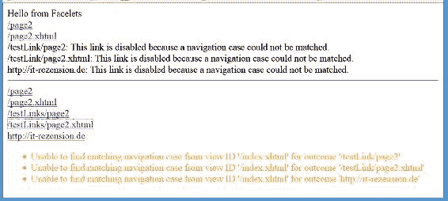

# 18. 链接

Michael Müller^(1 )

(1)Brühl, Nordrhein-Westfalen, Germany

书籍不仅仅是一个已审阅书籍的列表。您还可以使用它来创建和显示评论。除了这些*内部*评论外，大多数评论都发布在其他地方，例如印刷媒体和/或在线媒体。本章的目标是创建一个评论列表，其中包含指向内部和*外部*评论的链接。

## 内部评论

指向内部评论的链接将从评论实体创建。这样的实体包含以下属性：

*   Id

*   BookId

*   Date

*   Language

*   Text

*   Book

最后一个属性并未存储在相应的 SQL 表中。数据库中存储的与书籍的唯一引用是 BookId。但是，将 Book 作为附加属性使用，将使我们能够显示书籍本身的一些信息，而无需编写额外的数据库调用。用 SQL 术语来说，我们执行了一种类似于 select ...from Review join Book.... 的操作。我们只需要定义一个关系，如清单 18-1 所示。JPA 将执行 SQL 相关的工作。清单 18-1 展示了 Review 类的一个片段。

###### 清单 18-1 内部评论的实体

```
 1 @Entity
 2 @Table(name = "Review")
 3 public class Review implements Serializable {

 5   private static final long serialVersionUID = 1L;

 7   // <editor-fold defaultstate="collapsed" desc="Property Id">
 8   @Id
 9   @GeneratedValue(strategy = GenerationType.IDENTITY)
10   @Column(name = "rvId")
11   private Integer _id;

13   public Integer getId() {
14     return _id;
15   }

17   public void setId(Integer id) {
18     _id = id;
19   }
20     // </editor-fold>

22   // <editor-fold defaultstate="collapsed" desc="Property BookId">
23   @Column(name = "rvBookId")
24   private Integer _bookId;

26   public Integer getBookId() {
27     return _bookId;
28   }

30   public void setBookId(Integer bookId) {
31     _bookId = bookId;
32   }
33     // </editor-fold>

35  // <editor-fold defaultstate="collapsed" desc="Property Book">
36   @ManyToOne
37   @JoinColumn(name = "rvBookId", insertable = false, updatable = false)
38   private Book _book;

40   public Book getBook() {
41     return _book;
42   }
43  // </editor-fold>

45   [... other fields, hashCode etc. omitted for brevity...]

47 }
```

书籍在第 36-42 行被引用。您可以为同一本书编写多条评论（例如，使用不同的语言）。这就是我们在这里使用多对一关系的原因。我们假设我们撰写评论的书籍存在于数据库中。当我们存储评论时，需要包含对书籍的引用。在数据库表中，我们只需要一个用于 BookId 的列（第 23-32 行）。我之前提到的 book 属性正是通过这个 id 从数据库中检索出来的。

到目前为止，我们有两个属性依赖于这一个属性。JPA 不允许两个属性写入同一列。我们需要将其中一个声明为不可写。因为我们只想保存 bookId 而不是整个 book，所以我们建议 JPA 在插入和更新时忽略 book 属性的 bookId（第 37 行）。

## 外部评论

外部链接存储在自己的表中。与评论类似，我们创建了一个类型为 Book 的便捷属性。清单 18-2 展示了具体做法。

###### 清单 18-2 管理外部评论链接的实体

```
 1   @Entity
 2   @Table(name = "ReviewLink")
 3   public class ReviewLink implements Serializable {

 5     private static final long serialVersionUID = 1L;

 7     @Id
 8     @GeneratedValue(strategy = GenerationType.IDENTITY)
 9     @Column(name = "Id")
10     private Integer _id;

12     @Column(name = "BookId")
13     private Integer _bookId;

15     @Column(name = "LanguageCode")
16     private String _language;

18     @Column(name = "URI")
19     private String _URI;

21     [getter/setter omitted]

23     @ManyToOne
24     @JoinColumn(name = "BookId", insertable = false, updatable = false)
25     private Book _book;

27     public Book getBook() {
28       return _book;
29     }

31     [HashCode and more omitted]
32   }
```

清单 18-2 展示了 ReviewLink 类的一个片段。访问 book（第 23 行及之后）的方式与 Review 类中描述的非常相似。

## JSF 链接

JSF 提供了三种不同的标签来创建链接。它们有何不同，哪一种适合实现此目标？表 18-1 列出了这些标签。

###### 表 18-1 用于创建链接的 JSF 标签

| 标签名称 | 描述 |
| --- | --- |
| commandLink | 渲染一个 HTML 链接 <a href=...>，同时执行提交操作。 |
| link | 渲染一个 HTML 链接 <a href=...>，可用于可书签化的 JSF 导航。 |
| outputLink | 渲染一个 HTML 链接 <a href=...>，主要用于导航到应用程序外部。 |

### commandLink

commandLink 是经典的 JSF 链接。实际上，它渲染了一个 HTML 链接元素，但行为更像一个提交元素。在渲染 commandLink 时，JSF 会向元素的 onClick 事件分配一个函数调用。这个位于 JSF JavaScript 库中的函数会动态添加一个隐藏的输入元素并执行提交。这种方法对开发者是透明的。

提交元素会执行 POST 请求。这是 HTML 中提交表单的标准方式。因此，commandLink 需要嵌套在 `<h:form>` 元素内。POST 请求会为当前 URI 发送数据。如果使用 commandLink 导航到另一个页面，浏览器在显示新页面时仍会显示之前的 URI。使用这种导航方式，浏览器标题栏中显示的 URI 会落后一个页面。

### link

link 标签是在 JSF 2.0 中引入的，用于支持使用 GET 请求进行 JSF 导航。GET 请求与您直接在浏览器中输入 URI 时使用的请求相同。服务器发送所请求页面的内容，并且使用 GET 导航，浏览器会显示当前页面的 URI。因此，URI 变得可书签化。


### outputLink

outputLink 标签是用于创建 GET 请求的 HTML 链接元素的经典标签。顾名思义，它用于导航到应用程序外部。使用此标签，你只需创建链接，而非 JSF 导航，但你也可以用它来在应用程序内部进行导航。

### 选择合适的链接

如果用户通过定义的入口点（例如登录页面）启动我们的应用程序，回传导航就没有问题。也许你可以为用户提供应用程序的一些额外起始点。一旦应用程序启动，它就会遵循其工作流程。用户在应用程序内操作，无需关心 URI。在这种情况下，这无关紧要——URI 是次要的。

就书籍而言，评论列表应链接到评论。这些评论应该是可直接寻址的。它们也应该能被搜索引擎搜索到，因此我们需要通过 GET 请求访问它们。commandLink 不符合这些要求。

但另外两个链接元素中哪个最好？还是我们需要两者都用？在讨论它们之前，我邀请你在下一个练习中自行找出它们的行为。

######  调查链接

创建一个名为 testLinks 的新 Web 应用程序，并添加 JSF 框架。JSF servlet URL 模式使用 *.xhtml。你可能想回顾一下 TinyCalculator，并了解如何使用 NetBeans 创建此类应用程序。

NetBeans 会在应用程序设置期间自动创建页面 index.xhtml。如果你使用不同的 IDE，则可能需要自己创建这样的页面。添加第二个页面 page2.xhtml。

在 index.xhtml 页面中，添加 <h:link...>（outcome="link"）以及 <h:outputLink...>（value="link"），目标如下：

*   /page2

*   /page2.xhtml

*   /testLink/page2

*   /testLink/page2.xhtml

*   [`it-rezension.de`](http://it-rezension.de)

运行项目并尝试观察这些链接。

清单 18-3 展示了 index.xhtml 页面的一个简单版本。它并不复杂——仅用于演示。

###### 清单 18-3 链接演示 (testLink) index.xhtml

```
 1   <?xml version='1.0' encoding='UTF-8' ?>
 2   <!DOCTYPE html">
 3   <html xmlns:="http://www.w3.org/1999/xhtml"
 4         xmlns:h="http://xmlns.jcp.org/jsf/html">
 5     <h:head>
 6       <title>Facelet 标题</title>
 7     </h:head>
 8     <h:body>
 9       来自 Facelets 的问候

11       <div>
12         <h:link value="/page2" outcome="/page2"/>
13       </div>
14       <div>
15         <h:link value="/page2.xhtml" outcome="/page2.xhtml"/>
16       </div>
17       <div>
18         <h:link value="/testLink/page2" outcome="/testLink/page2"/>
19       </div>
20       <div>
21         <h:link value="/testLink/page2.xhtml" outcome="/testLink/page2.xhtml"/>
22       </div>
23       <div>
24         <h:link value="http://it-rezension.de" outcome="http://it-rezension.de”/>

26       </div>
27       <hr/>
28       <div>
29         <h:outputLink value="/page2">
30           /page2
31         </h:outputLink>
32       </div>
33       <div>
34         <h:outputLink value="/page2.xhtml">
35           /page2.xhtml
36         </h:outputLink>
37       </div>
38       <div>
39         <h:outputLink value="/testLinks/page2">
40           /testLinks/page2
41         </h:outputLink>
42       </div>
43       <div>
44         <h:outputLink value="/testLinks/page2.xhtml">
45           /testLinks/page2.xhtml
46         </h:outputLink>
47       </div>
48       <div>
49         <h:outputLink value="http://it-rezension.de">
50           http://it-rezension.de
51         </h:outputLink>
52       </div>

54     </h:body>
55   </html>
```

图 18-1 显示了输出结果。



###### 图 18-1 testLink 的输出

link 为 /page2 和 /page2.xhtml 创建了链接，但没有为其他目标创建。如果省略文件扩展名，JSF 会自动添加 .xhtml。斜杠 / 决定了我们应用程序内的根目录——*不是*绝对路径。

/testLink 是应用程序的上下文路径，是一种“应用程序外部”的路径。而指向我的评论页面的链接则指向一个不同的网站。link 用于 JSF 导航，因此对于任何其他链接，它都无法找到导航。

另一方面，outputLink 会按照指定方式创建我们提供的每一个链接。如果未提供，JSF 会自动添加当前主机前缀以完成链接。因此 /page2 变成了 http://localhost:8080/page2。这样的链接会指向一个不存在的页面。只有 /testLinks/page2.xhtml 和 [`itrezension.de`](http://itrezension.de) 指向了存在的页面。

### 得出结论

link 只能用于内部导航。outputLink 既可用于外部链接，也可用于内部链接。对于内部链接，需要添加上下文路径。

对于评论列表，（至少）可以使用两种替代方案：

*   同时使用 link 和 outputLink，并附带一个条件，根据链接类型选择适当的元素。清单 18-4 展示了这种方法的原则。

*   或者始终使用 outputLink 来处理内部和外部链接。对于内部链接，你需要将上下文路径添加到页面地址中，使 URI 成为完全限定形式。

Books 采用了第二种方法。

###### 清单 18-4 确定内部链接与外部链接的原则

```
1   <h:link rendered="#{review.intern}" .../>
2   <h:outputLink rendered="#{not review.intern}" .../>
```

###### 清单 18-5 reviewList.xhtml 的摘录

```
1   <h:outputLink value="#{review.url}"
2                 target="#{review.intern ? '_self' : '_blank'}">
3     #{review.title}
4   </h:outputLink>
```

外部链接存储在 ReviewLink 表中。它们定义了完整的 URI，并按原样存储在数据库中使用。内部链接通过将 bookId 和 language 附加到页面，并在前面加上上下文路径来动态创建。上下文路径可从 Faces 上下文的外部上下文中获取，如清单 18-6 所示。

###### 清单 18-6 创建内部链接

```
1   private String buildUrl(int bookId, String language) {
2     String path = FacesContext.getCurrentInstance()
3             .getExternalContext().getRequestContextPath();
4     return path + Page.UserReview.getUrl() +
5             "?bookId=" + bookId + "&language=" + language;
6   }
```

buildUrl 是 ReviewInfo.class 的一部分。

## 总结

JSF 提供了三种不同类型的链接。commandLink 渲染一个 HTML 链接（href 元素）。在渲染此链接时，JSF 会添加一个 onClick 处理程序，将该链接重定向到一个输入提交元素。因此，这样的链接会发起一次回传导航。

link 渲染一个用于 JSF 导航案例（内部导航）的真实链接，而 outputLink 的意图是创建一个不用于常规 JSF 导航、而是用于导航到外部页面的链接元素。无论如何，我们都可以用它来在应用程序内部进行导航。

© Michael Müller 2018

Michael Müller, Practical JSF in Java EE 8 , `doi.org/10.1007/978-1-4842-3030-5_19`


