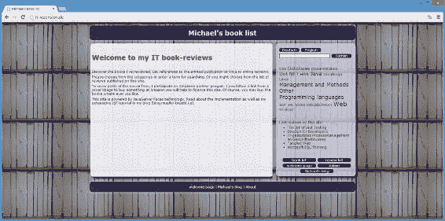
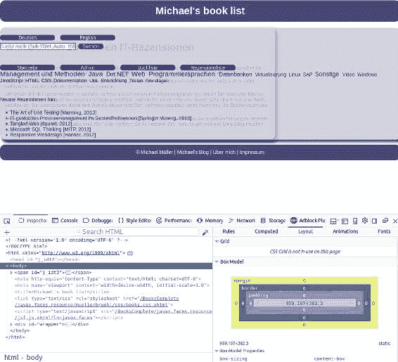

# 19. 响应式设计

Michael Müller¹

(1)德国北莱茵-威斯特法伦州布吕尔

几年前，开发固定页面宽度为 960 像素的 Web 应用还很常见。对于当时流行的 17 英寸台式机显示器来说，这个尺寸是个不错的选择。

时代变了。台式机和现代笔记本电脑拥有高分辨率屏幕，许多人都在使用相当大的屏幕。例如，全高清屏幕宽度为 1920 像素。即使这允许在屏幕上显示更多信息，为了保持文本可读性，每行也不应超过约 1200 像素。平板电脑和智能手机等移动设备的兴起主导了市场，这些设备上的应用运行在较小的显示屏上，宽度甚至不到 400 像素。尽管现代智能手机的物理分辨率有时优于全高清，但它们通常使用*逻辑*像素，这些像素由一组物理像素构成。挑战在于创建能够自动适应大、中、小屏幕分辨率的网页和应用。这可以通过*响应式设计*来实现。你可能听说过*自适应设计*，它也能适应屏幕分辨率。这两种技术略有不同，但我们在本书中将忽略这些细微差别。

本章将介绍一些使应用能够适应各种屏幕尺寸的技术。

## 使 Books 应用具有响应性

Books 应用采用了一种简单的响应式设计形式。在 PC 上，可以通过调整浏览器窗口大小来模拟。图 19-1 到 19-4 展示了 Books 应用如何根据窗口大小的变化自动改变其布局。



###### 图 19-1 宽屏显示下的 Books


###### 图 19-2 中屏显示下的 Books


###### 图 19-3 平板尺寸显示下的 Books


###### 图 19-4 智能手机尺寸显示下的 Books

要使应用具有响应性，无需更改应用的代码或内容。通过修改其 CSS 布局即可实现应用的响应式。

如前图所示，根据所使用的屏幕尺寸，存在不同的显示策略。作为一名软件开发人员，我假设你个人使用的是高分辨率屏幕。你可以通过调整浏览器窗口大小来模拟不同设备的尺寸。让我们从全屏开始，然后缩小窗口。

对于宽屏显示，内容和导航区域的大小受最大尺寸限制。我们使用这个最大尺寸来保持内容的可读性。如果浏览器窗口宽度超过此尺寸，我们会添加外边距以使内容居中。如果缩小窗口，左右外边距会减小，而内容和导航区域的大小保持不变。然后，在某个特定宽度下，策略会改变：内容和导航区域的宽度将根据窗口大小而减小。在另一个特定宽度下，策略再次改变：导航区域显示在内容下方。这些改变显示策略的特殊宽度被称为*断点*。

诀窍在于根据屏幕尺寸应用不同的样式。特别是对于移动设备，一些制造商对其*视口*（浏览器窗口的可视区域）应用了一种逻辑像素尺寸，这可能与实际像素尺寸不同。因此，我们需要在 JSF 模板的 `<h:head>` 部分添加一个简单的条目来准备这种缩放，如清单 19-1 所示。

###### 清单 19-1 booksTemplate.xhtml 中的视口缩放

```
1   <meta name="viewport" content="width=device-width, initial-scale=1.0"/>
```

接下来，我们使用媒体查询来定义断点。*媒体查询*以 `@media` 开头，后跟媒体名称，例如 `@media screen` 或 `@media print`。还有另外两个选项：`speech`（用于语音合成器）和 `all`（用于所有设备）。尽管媒体查询早在 1994 年就被首次推荐，但随着 HTML 4 和 CSS 2 的普及，它们被广泛用于为不同媒体定制样式。当添加了 `width` 等其他属性后，驱动响应式设计才成为可能。这种方案于 2012 年成为 W3C 推荐标准。

为了实现响应式设计，我们将结合视口大小使用针对屏幕的媒体查询，以决定应用哪些样式。我们将定义断点，即样式发生变化的离散尺寸。

但首先，让我们看一下 CSS 文件的相关摘录，如清单 19-2 所示。

###### 清单 19-2 响应式设计前的 books.css 摘录

```
 1   body > div {
 2     width: 80em;
 3     margin: 0 auto;
 4     text-align: left;
 5   }

 7   main {
 8     min-height: 40em;
 9     width: 53em;
10     opacity: 0.95;
11     border-radius: 1em;
12     background-color: #eeeef3;
13     padding: 1em;
14     margin-bottom: 1em;
15     box-shadow: 0.5em 0.5em 0.5em #004
16   }

18   nav{
19     min-height: 40em;
20     position: fixed;
21     margin-left: 56em;
22     width: 22em;
23     padding: 1em;
24     top: 7.5em;
25     opacity: 0.85;
26     border-radius: 1em;
27     background-color: #ccccd8;
28     box-shadow: 0.5em 0.5em 0.5em #004
29   }
```

请记住，`body > div` 声明了应用空间的一些属性。对宽度使用相对单位 `em` 允许空间随着用户更改浏览器字体大小而增长或缩小。但我们必须根据以像素为单位的屏幕尺寸来选择断点。

在宽视口下，我们应用的内容使用 `80em`。如果视口宽度大于此值，浏览器会在右侧或左侧添加一些空白区域。缩小窗口会减少此空白区域。如果视口尺寸变得小于我们的最大内容尺寸，我们需要缩小内容宽度。因此，当视口宽度小于或等于 `body div` 元素的宽度时，似乎就达到了第一个断点。

###### 注意

虽然可以对媒体宽度使用 `em`，但这会导致一些奇怪的行为。假设我们在 `60em` 处定义一个断点。低于该尺寸时，我们会减小以像素为单位的字体大小，而这会改变 `1em` 的宽度。换句话说，我们改变了缩放基准。将视口缩小到小于这 `60em` 时，会突然导致视口宽度大于 `60em`。你能想象会发生什么吗？这确实出乎意料。一条经验法则：不要改变断点的缩放基准。

最好为屏幕宽度定义精确的像素值。因此，我们需要根据我们的宽度计算像素：

*   *像素宽度 = em 宽度 × 像素字体大小*

因为我们定义了默认字体大小为 12 像素，所以宽度为 `80em × 12px = 960px`。

如果屏幕尺寸小于此值，则必须减小应用尺寸。如果未定义尺寸，则尺寸由浏览器的显示宽度决定。因此，可以省略宽度。我们只需要为大型浏览器窗口定义一个最大宽度。为此，我们将第 2 行的 `width: 80em` 替换为 `max-width: 80em`。不需要特殊的断点。

`main` 部分为 `53em`，加上左右内边距各 `1em`。因此，总宽度为 `55em`。这占我们 `80em` 宽度的 `55/80 × 100% = 68.75%`。如果我们缩小窗口，我们首先希望保持这个相对比例来缩小 `main` 部分。在我们的应用中，`1em` 相当于 `1/80 × 100% = 1.25%`。利用这些信息，我们可以通过将 `em` 尺寸替换为百分比尺寸来细化所有宽度。


###### 注意

百分比尺寸是相对尺寸。请注意：这些尺寸并非相对于屏幕，而是相对于外层容器。

如果我们缩小宽度，每行显示的文本字符数可能会减少。但我们不会改变行高，因此在许多情况下，最好使用 `em` 单位来保持垂直尺寸。

对于响应式设计，我们将 `main` 和 `nav` 类分为两部分。其中一部分包含所有与视口宽度无关的样式（参见代码清单 19-3 第 7–20 行），而另一部分则包含与视口相关的样式。这些部分在每个断点处都会有所不同。第 23–37 行使用了与前一个代码清单中相同的原始值。

###### 代码清单 19-3 摘自 books.css，首个响应式方案

```
 1   body > div {
 2     max-width: 80em;
 3     margin: 0 auto;
 4     text-align: left;
 5   }

 7   main {
 8     opacity: 0.95;
 9     border-radius: 1em;
10     background-color: #eeeef3;
11     margin-bottom: 1em;
12     box-shadow: 0.5em 0.5em 0.5em #004;
13   }

15   nav{
16     opacity: 0.85;
17     border-radius: 1em;
18     background-color: #ccccd8;
19     box-shadow: 0.5em 0.5em 0.5em #004;
20   }

22   @media screen and (min-width: 960px){
23     main {
24       min-height: 40em;
25       width: 53em;
26       padding: 1em;
27     }

29     nav{
30       min-height: 40em;
31       position: fixed;
32       margin-left: 56em;
33       width: 22em;
34       top: 7.5em;
35       padding: 1em;
36     }
37   }

39   @media screen and (min-width: 600px) and (max-width: 960px){
40     main {
41       min-height: 45em;                                                                                      
42       width: 66.25%;
43       padding: 1.25%;
44     }

46     nav{
47       min-height: 45em;
48       position: fixed;
49       margin-left: 70%;
50       width: 27.5%;
51       padding: 1.25%;
52       top: 7.5em;
53     }
54   }

56   @media screen and (max-width: 600px){
57     main {
58       width: 97.5%;
59       padding: 1.25%;
60     }

62     nav{
63       width: 97.5%;
64       padding: 1.25%;
65       bottom: 1em;
66     }
67   }
```

在第 22 行，你会找到第一个媒体查询。它适用于屏幕视口宽度最小为 960px 的情况。只有当最小宽度条件为真时，从该行左花括号到第 37 行对应右花括号之间的所有样式声明才会应用于 HTML 页面。下一个断点出现在宽度为 960px 时。在相应媒体查询的条件中，我们像之前提到的那样，使用百分比而非 `em` 来定义宽度（第 39–54 行）。如果宽度小于 600px，我们会重新排列导航，使其显示在主内容下方。如你所见，媒体查询通过一个或多个宽度条件进行了增强。我认为这些条件大多不言自明。

有一个重要的细节需要讨论。请看代码清单 19-4。

###### 代码清单 19-4 级联媒体查询

```
1   @media screen and (min-width: 960px){...}
2   @media screen and (min-width: 600px) and (max-width: 960px){...}
3   @media screen and (max-width: 600px){...}
```

在这个定义中，较小屏幕（或窗口）的 `max-width` 等于较大屏幕的 `min-width`。这些重叠可以接受吗？代码清单 19-5 似乎展示了一种更好的方式。

###### 代码清单 19-5 级联媒体查询，无重叠

```
1   @media screen and (min-width: 960px){...}
2   @media screen and (min-width: 600px) and (max-width: 959px){...}
3   @media screen and (max-width: 599px){...}
```

现在尺寸不再重叠，这也是你在一些讨论响应式设计的书籍或博客中会看到的方式。乍一看，这种无重叠的定义似乎是正确的。但事实并非如此：我们现在有了*两个*间隙，一个在 959px 和 960px 之间，另一个在 599px 和 600px 之间。嗯？

###### 尝试一个实验：

将媒体查询替换为无重叠版本。从一个宽浏览器窗口开始，然后缩小其宽度。当到达一个断点时，缓慢增大和缩小窗口大小，观察会发生什么。根据你的系统或浏览器设置（你可能放大了字体，或者缩放了浏览器窗口），大多数浏览器在到达断点时会将导航显示在主内容下方。这是因为存在一个 1 像素的间隙，并且计算出的尺寸恰好位于两个定义之间。两个定义都不会被使用，因此导航不会按预期显示。

请看图 19-5。这里浏览器计算出的宽度为 959.167px，正好落在这个 1 像素的间隙中。



###### 图 19-5 宽度 = 959.167px

由于这个问题，Books 采用了重叠方法。为了避免歧义，CSS 会使用 CSS 文件中找到的最后一个定义。

在我们的首个响应式方案中，对于宽视口尺寸，我们仍然使用 `em`。但由于容器被限制为 80em，即使视口更宽，主内容部分中基于百分比的相对尺寸也无法增长。因此，我们可以使用与较小窗口相同的百分比尺寸。

导航浮动在 `body > div` 容器之外。它的容器是浏览器的显示区域，并且会随着窗口的增大而增大。为了保持导航尺寸，仍然需要使用 `em` 来定义。说到这里，我们可以重构样式表。参见代码清单 19-6。

###### 代码清单 19-6 摘自 books.css，优化后的响应式定义

```
 1   body > div {
 2     max-width: 80em;
 3     margin: 0 auto;
 4     text-align: left;
 5   }

 7   main {
 8     opacity: 0.95;
 9     border-radius: 1em;
10     background-color: #eeeef3;
11     margin-bottom: 1em;
12     box-shadow: 0.5em 0.5em 0.5em #004;
13   }

15   nav{
16     opacity: 0.85;
17     border-radius: 1em;
18     background-color: #ccccd8;
19     box-shadow: 0.5em 0.5em 0.5em #004;
20   }

22   @media screen and (min-width: 600px){
23     main {
24       width: 66.25%;
25       padding: 1.25%;
26     }

28     nav{
29       position: fixed;
30       top: 7.5em;
31     }
32   }

34   @media screen and (min-width: 960px){
35     main, nav {
36       min-height: 40em;
37     }

39     nav{
40       margin-left: 56em;                                                                                      
41       width: 22em;
42       padding: 1em;
43     }
44   }

46   @media screen and (min-width: 600px) and (max-width: 960px){
47     main, nav {
48       min-height: 45em;
49     }

51     nav{
52       margin-left: 70%;
53       width: 27.5%;
54       padding: 1.25%;
55     }
56   }

58   @media screen and (max-width: 600px){
59     main {
60       width: 97.5%;
61       padding: 1.25%;
62     }

64     nav{
65       width: 97.5%;
66       padding: 1.25%;
67       bottom: 1em;
68     }
69   }
```

在第 22 行，你会找到一个适用于所有宽度大于等于 600px 的通用定义。

## 响应式像素布局

正如我们所见，制作响应式布局并不太难。幸运的是，我们创建的第一个（非响应式）布局版本中，尺寸是相对于字体大小而非屏幕的。然而，许多页面是使用像素尺寸设计的。这里的转换需要更多功夫，如代码清单 19-7 所示。

假设原始布局是使用像素精确设计的。


###### 清单 19-7：像素尺寸布局示例

```
 1   main {
 2     min-height: 500px;
 3     width: 640px;
 4     opacity: 0.95;
 5     border-radius: 10px;
 6     background-color: #eeeef3;
 7     padding: 10px;
 8     margin-bottom: 10px;
 9     box-shadow: 5px 5px 5px #004
10   }

12   nav{
13     min-height: 500px;
14     position: fixed;
15     margin-left: 670px;
16     width: 270px;
17     padding: 10px;
18     top: 90px;
19     opacity: 0.85;
20     border-radius: 10px;
21     background-color: #ccccd8;
22     box-shadow: 5px 5px 5px #004
23   }
```

请注意，这并不相同！例如，导航栏的左边距是 670px，而原始布局使用的是 56em = 672px。在这里，设计者更倾向于能被 10 整除，或者至少能被 5 整除的尺寸。根据我的经验，这对于基于固定像素数设计的布局来说很典型。

大多数关于响应式设计的书籍都会从一个示例开始，介绍如何使像素布局具有响应性。常见的方法是计算一个像素的相对宽度，然后将每个像素宽度乘以这个精确的因子。让我们来操作一下：

*   总宽度 = 960 像素，因此一个像素是 1/960 × 100% = 0.1041666666666667%。

*   640px = 640 × 0.1041666666666667% = 66.66666666666667%。

*   670px = 670 × 0.1041666666666667% = 69.79166666666667%。

依此类推。

现在 CSS 看起来很难看。在大多数情况下，不需要如此高的精度。鼓起勇气将这些值四舍五入到最多两位小数。相信我，用户不会注意到任何差异。

## 计算尺寸

清单 19-8 计算了一些尺寸。

###### 清单 19-8：导航布局示例

```
 1   @media screen and (min-width: 960px){
 2     nav{
 3       margin-left: 56em;
 4       width: 22em;
 5       padding: 1em;
 6     }
 7   }

 9   @media screen and (min-width: 600px) and (max-width: 960px){
10     nav{
11       margin-left: 70%;
12       width: 27.5%;
13       padding: 1.25%;
14     }
15   }
```

通过缩小屏幕尺寸，我们将相对于当前字体大小的内边距，切换到了相对于周围容器的百分比尺寸。这意味着内边距本身会缩小。有时，保持内边距相对于字体大小是很有用的。使用 CSS 3，混合不同尺寸并保持精度是没有问题的。

在我们的示例中，元素宽度加上其内边距将得到总宽度 1.25% + 27.5% + 1.25% = 30%。假设我们有一个要求，即保持 1em 的内边距。那么元素宽度必须是 30% 减去 2em。这正是你可以做到的：

```
width: calc(30% - 2em);
```

我假设内边距会被添加到盒子宽度中。这是大多数浏览器的做法。（旧版本的 Internet Explorer 声明宽度包含内边距和边框。）使用 CSS 3，你可以改变盒子大小的行为，使得宽度包含内边距和边框（通过 `box-sizing: border-box;`）。

###### 提示

你可以在 W3Schools 上阅读关于 CSS 盒子模型的内容。请查看 [www.w3schools.com/css/css_boxmodel.asp](http://www.w3schools.com/css/css_boxmodel.asp) 和 [www.w3schools.com/cssref/css3_pr_box-sizing.asp](http://www.w3schools.com/cssref/css3_pr_box-sizing.asp)。

## 移动优先与桌面优先

起初，Books 仅针对台式电脑开发。随后，随着移动设备的兴起，需要使其适应更小的屏幕尺寸。这个过程就是今天所谓的*桌面优先*方法。

当屏幕尺寸缩小时，Books 简单地将导航栏放置在底部。通常，对于小尺寸屏幕，高度非常有限。用折叠菜单替换导航栏以节省空间可能是个好主意。这也可以通过 CSS 解决。移动设备有时只有较小的带宽（蜂窝网络速度）可用。因此，我经常建议简化用户界面。例如，你可以省略背景图片。或者你可能需要减少内容。

后者可能是一项艰巨的工作。哪些部分不太重要，可以删除？带着这个问题，许多人更喜欢*移动优先*的方法：先开发一个具有最小界面的应用程序，然后使其适应更大的屏幕，添加一些装饰性的内边距。

不要担心有人说某种方法是最好的。按照你自己的方式去做就行。

## 总结

几年前，应用程序可以针对特定的屏幕分辨率进行设计，但今天我们需要考虑不同种类的屏幕和尺寸。用户可能不仅仅使用台式电脑。我们必须考虑笔记本电脑尺寸、平板电脑和其他移动设备。因为我们不能期望用户在小型屏幕上滚动长内容，所以我们需要使应用程序页面的内容适应不同的屏幕尺寸。

使 Web 应用程序具有*响应性*的一个关键技术是在 CSS 的媒体查询中定义不同的断点。本章展示了一种纯 CSS 的方法。这可以通过 JavaScript 来补充，我们将在 Alumni 应用程序中使用它。

要创建响应式应用程序，你可以从移动布局开始（移动优先）或桌面布局开始（桌面优先）。

© Michael Müller 2018

Michael Müller, Practical JSF in Java EE 8 , `doi.org/10.1007/978-1-4842-3030-5_20`

