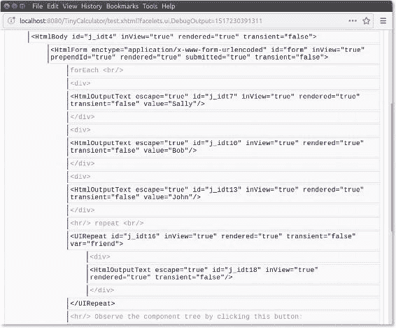
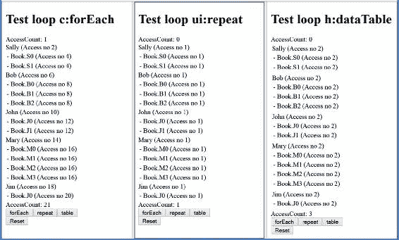

# 23. 重复结构

Michael Müller¹

(1)德国北莱茵-威斯特法伦州布吕尔

到目前为止，我们已经使用了三种不同的标签来处理重复结构：

*   c:forEach

*   ui:repeat

*   h:dataTable

在本章中，我们将讨论它们之间的差异和覆盖范围。

前两个元素用于重复开始和结束标签之间的所有内容。作为开发者，你需要自行选择 HTML 中的合适结构。如果没有特殊结构，你可以简单地将字符串拼接成一个段落。或者，你可以将其嵌套在表格标签内，并重复行来渲染一个表格。或者，你也可以使用 HTML 的 `<ul>` 或 `<ol>` 元素及其嵌套项（`<li>`）来创建一个列表。无论你选择哪种方式，你都有完全的控制权。

顾名思义，第三个元素 `h:dataTable` 会在 HTML 表格的预定义结构内重复其内容。这提供了较少的选项，但创建表格的方式更简单。

## 标签处理器 vs. 组件

`forEach` 是一个标签处理器，而另外两个元素是组件。请记住，标签处理器在组件树的编译阶段生效。当组件树构建时，JSF 会为循环的每次迭代添加所包含的组件。

考虑一下 `forEach` 标签处理器：它仅仅是对其子元素进行重复处理的指令，如清单 23-1 所示。

###### 清单 23-1 c:forEach 示例，Facelets 源码

```
1   <c:forEach items="#{controller.friends}" var="friend">
2     <div>
3       <h:outputText value="#{friend.name}"/>
4     </div>
5   </c:forEach>
```

假设好友列表包含三位好友：那么会显示三个名字。如果你检查渲染后的 HTML 页面（例如，在 Firefox 中，你可以按 Ctrl+U 显示 HTML 源码），你会看到三个包含名字的 div，正如你可能预期的那样，如清单 23-2 所示。

###### 清单 23-2 c:forEach 示例，渲染后的 HTML

```
1   <div>Sally
2   </div>
3   <div>Bob
4   </div>
5   <div>John
6   </div>
```

在清单 23-3 中，你可以看到类似的逻辑，只是使用了 `repeat` 而不是 `forEach`。

###### 清单 23-3 ui:repeat 示例

```
1   <ui:repeat value="#{controller.friends}" var="friend">
2     <div>
3       <h:outputText value="#{friend.name}"/>
4     </div>
5   </ui:repeat>
```

如果你运行这个示例（作为完整页面的一部分），你会得到相同的输出，无论是视觉上还是 HTML 代码上。那么区别在哪里呢？

嗯，一个可观察到的区别是组件树。图 23-1 展示了两种结构的组件树。由于使用了 `forEach`（标签处理器），三个 `outputText` 会被插入到组件树中。标签处理器本身不会被插入。另一方面，`repeat`（一个组件）本身被插入到组件树中，并且只嵌套了一个 `outputText`。这就像源页面中定义的两个组件，没有重复。

重复操作直到渲染输出阶段被调用时才发生。如果我们想显示三位好友，`forEach` 的主体将被重复三次，并插入属于三个不同 div 的三个名字。结果，两种结构的 HTML 源码将是相同的。

如果你在循环中使用标签处理器，那么循环会在构建组件树时进行迭代。如果你使用组件，它在组件树中只会出现一次。迭代发生在解释树（渲染页面）的过程中。



###### 图 23-1 组件树

除了组件树之外，在这个简短的示例中没有其他可观察到的区别。但很容易想象，不同的时机和不同的组件树可能会导致截然不同的行为，这取决于应用程序的复杂性。

让我们检查一个稍微修改过的 `forEach` 循环示例，如清单 23-4 所示。

###### 清单 23-4 带条件的 c:forEach 示例

```
1   <c:forEach items="#{controller.friends}" var="friend">
2     <c:if test="#{friend.name.length() > 0}">
3       <div>
4         <h:outputText value="#{friend.name}"/>
5       </div>
6     </c:if>
7   </c:forEach>
```

唯一的区别是增加了一个对非空名字的测试。因为所有好友都有名字，所以输出仍然相同。

接下来，在清单 23-5 中，我们将以相同的方式修改 `repeat`。

###### 清单 23-5 带条件的 ui:repeat 示例

```
1   <ui:repeat value="#{controller.friends}" var="friend">
2     <c:if test="#{friend.name.length() > 0}">
3       <div>
4         <h:outputText value="#{friend.name}"/>
5       </div>
6     </c:if>
7   </ui:repeat>
```

如果你运行前面的示例，将不会显示任何名字。

###### 标签处理器 vs. 组件谜题

运行前面的示例并思考发生了什么。在继续阅读之前，尝试自己弄清楚。你如何修改显示条件才能使其正确工作？

因为标签处理器是在（组件树的）编译时被解释的，所以所有信息在那时也必须可用。在编译时，组件只是被插入到树中。它在渲染阶段被处理。

尽管这是一个简化的视图，但足以描述发生了什么：`forEach` 和 `if` 都是标签处理器。在编译树时，执行循环并检查条件。到目前为止，一切正常。但 `repeat` 是一个组件，这意味着循环直到渲染阶段才会执行。在编译时，没有执行循环，没有变量 `friend` 是已知的，因此，没有测试结果为真。

一种可能的解决方案是使用组件 `panelGroup`。结合任何样式类使用 `layout="block"`，当且仅当 `rendered` 条件为真时，它会渲染一个 div。在组件内部，条件与循环执行的阶段相同。如果你省略了 `layout` 或 `styleClass`，那么 JSF 将不会插入 div，你的浏览器会将所有名字显示在一行上。参见清单 23-6。


###### 清单 23-6 使用 Rendered 属性的 ui:repeat 示例

```
1   <ui:repeat value="#{controller.friends}" var="friend">
2     <h:panelGroup rendered="#{friend.name.length() > 0}"
3                   layout="block"  styleClass="dummy">
4       <h:outputText value="#{friend.name}"/>
5     </h:panelGroup>
6   </ui:repeat>
```

使用预定义的 JSF 标签（panelGroup）需要一些无用的工作。一种更符合 HTML 习惯的方法看起来清晰得多，如清单 23-7 所示。

###### 清单 23-7 使用 HTML 友好方法的 ui:repeat 示例

```
1   <ui:repeat value="#{controller.friends}" var="friend">
2     <div jsf:rendered="#{friend.name.length() > 0}">
3       <h:outputText value="#{friend.name}"/>
4     </div>
5   </ui:repeat>
```

## 性能问题

看一下清单 23-8 中 loopDemo 的源代码，并回顾一下你对 forEach 循环的了解。在 getNames() 方法内部，我们会打印一条简短的消息。你认为：单次调用 loopDemo 会调用该方法多少次？一次都没有、一次，还是三次？

###### 清单 23-8 循环谜题

```
 1   private static void loopDemo(){
 2     for (String name : getNames()){
 3       System.out.println("Name is " + name);
 4     }
 5   }

 7   private static List<String> getNames() {
 8     System.out.println("withing  getNames");
 9     List<String> names = new  ArrayList<>();
10     names.add("Bob");
11     names.add("Anne");
12     names.add("Eve");
13     return names;
14   }
```

这其实并不难：列表只被构建了一次。

在检索循环变量的值时，你可能会期望类似的行为。为了验证这些不同标签的行为，让我们进行一些测试。

我们将创建三个简单的类：一个（非持久化的）Friend 实体、一个用于处理 JSF 部分的命名 Bean “controller”，以及一个模拟对持久化数据（例如数据库）进行相对较慢访问的数据提供者。

###### 清单 23-9 Friend

```
 1   public class Friend {
 2       private final String _name;
 3       private final List<Book> _books = new ArrayList<>();

 5       public Friend( String name){
 6           _name = name;
 7       }

 9       public String getName() {
10           return _name;
11       }

13       public List<Book> getBooks() {
14           return _books;
15       }

17   }
```

一个 Friend 有一个名字并持有一些书籍。为了尽可能保持简单，我们通过返回完整的列表来直接访问书籍列表。这种简单的方法让我们可以直接向列表中添加书籍。在实际应用中，你可能会隐藏列表并实现一个 addBook() 方法。尽管一本*书*包含除标题外的其他信息，但在此演示中我们将使用一个非常简单的 Book 类。创建一个新的 Book 类，只包含一个字段以及 Title 的 getter 和 setter。让 NetBeans 创建 hashCode 和 equals 方法。

接下来，我们创建一个命名 Bean，它只是请求作用域的。它所做的就是向我们的页面提供好友列表。为此，必须从某个数据提供者那里获取数据。在实际应用中，这可能是一个 JPA 服务。参见清单 23-10。

###### 清单 23-10 Controller

```
 1   @Named
 2   @RequestScoped
 3   public class Controller {

 5     private int _counter;

 7     public int getCounter() {
 8       return _counter;
 9     }

11     public List<Friend> getFriends() {
12       _counter++;
13       return DataProvider.instance.getFriends();
14     }
15   }
```

除了好友的 getter 之外，这个控制器还包含一个用于统计列表访问次数的字段。并且它提供了一个 getter 来访问这个计数器。

接下来，你会看到简单的数据提供者，如清单 23-11 所示。它创建了一个包含五个好友的固定列表，并为每个好友分配了随机数量的书籍。当有人试图访问好友列表时，我们会调用 retrieveDatafromDB() 方法。由于这应该模拟一个耗时较长的方法，线程会休眠 100 毫秒。在真实的 Java EE 应用中，我们不会使用 sleep()，因为服务器会为我们控制线程。但对于这个小测试来说，这完全没问题。

###### 清单 23-11 DataProvider

```
 1   public class DataProvider {

 3     private final List<Friend> _friends = new ArrayList<>();

 5     public static DataProvider instance = new DataProvider();

 7     private DataProvider() {
 8       createData();
 9     }

11     /**
12      * 检索好友列表
13      * @return 好友列表    
14      */
15     public List<Friend> getFriends() {
16       retrieveDatafromDB();
17       return _friends;
18     }

20     private void retrieveDatafromDB() {
21       // 这里可能是对数据库的访问
22       // 通过 sleep 来模拟（是的，在 EE 环境中不应该使用 sleep）
23       try {
24         Thread.sleep(100);  // 慢速数据库访问
25       } catch (InterruptedException ex) {
26         // 忽略
27       }
28     }
29     private void createData() {
30       _friends.clear();
31       String[] names = {"Sally", "Bob", "John", "Mary", "Jim"};
32       for (int i = 0; i < 5; i++){
33         addFriend(names[i]);
34       }
35     }

37     private void addFriend(String name) {                                                                                      
38       Friend friend = new Friend(name);
39       Random random = new Random();
40       int count = random.nextInt(5);
41       for (int i = 0; i < count; i++) {
42         String title = "Book." + name.substring(0, 1) + i;
43         Book book = new Book(title);
44         friend.getBooks().add(book);
45       }
46       _friends.add(friend);
47     }
48   }
```

现在我们需要一个页面来显示好友列表。我们将以三种不同的风格创建这个页面，以检查不同的重复结构。目的是显示一个好友列表，并为每个好友显示一个包含其书籍的表格。参见清单 23-12。

###### 清单 23-12 通过 Repeat 显示好友（repeat.xhtml）

```
 1   <?xml  version='1.0'  encoding='UTF-8'  ?>
 2   <!DOCTYPE html>
 3   <html xmlns:="http://www.w3.org/1999/xhtml"
 4         xmlns:h="http://xmlns.jcp.org/jsf/html"
 5         xmlns:f="http://xmlns.jcp.org/jsf/core"
 6         xmlns:ui="http://xmlns.jcp.org/jsf/facelets"
 7         xmlns:c="http://xmlns.jcp.org/jsp/jstl/core">
 8     <h:head>
 9       <title>LoopCompare</title>
10     </h:head>

12     <h:body>
13       <h1>测试循环 ui:repeat</h1>

15       AccessCount:  #{controller.counter}                                                                                      

17       <ui:repeat value="#{controller.friends}" var="friend">
18         <div>
19           #{friend.name} (Access no #{controller.counter})
20            <h:dataTable value="#{friend.books}" var="book">
21              <h:column>
22                - #{book.title} (Access no #{controller.counter})
23              </h:column>
24            </h:dataTable>
25         </div>
26       </ui:repeat>

28       AccessCount:  #{controller.counter}

30       <div>
31         <h:button value="forEach" outcome="forEach"/>
32         <h:button value="repeat" outcome="repeat"/>
33         <h:button value="table" outcome="table"/>
34       </div>
35     </h:body>
36   </html>
```

在第 15 行，我们在调用循环之前简单地显示计数器，在第 28 行则在之后显示。第 17-26 行展示了由 repeat 组件构建的循环。这是我们在每个文件中都会采用的部分。第 31-33 行创建了三个按钮，用于在三个测试页面之间切换。

对于另外两个页面，只有不同的部分显示在清单 23-13 和 23-14 中。


###### 清单 23-13 使用 forEach 显示好友 (forEach.xhtml)

```
 1   [...]
 2       <h1>测试循环 c:forEach</h1>

 4       访问计数: #{controller.counter}

 6       <c:forEach  items="#{controller.friends}" var="friend">
 7         <div>
 8           #{friend.name}  (访问编号 #{controller.counter})
 9           <h:dataTable value="#{friend.books}" var="book">
10             <h:column>
11               - #{book.title} (访问编号 #{controller.counter})
12             </h:column>
13           </h:dataTable>
14         </div>
15       </c:forEach>

17       访问计数:  #{controller.counter}                                                                                      
18   [...]
```

###### 清单 23-14 使用 dataTable 显示好友 (table.xhtml)

```
 1   [...]
 2       <h1>测试循环 h:dataTable</h1>

 4       访问计数: #{controller.counter}

 6       <h:dataTable value="#{controller.friends}" var="friend">
 7         <h:column>
 8           #{friend.name} (访问编号 #{controller.counter})
 9           <h:dataTable value="#{friend.books}" var="book">
10             <h:column>
11               - #{book.title} (访问编号 #{controller.counter})
12             </h:column>
13           </h:dataTable>
14         </h:column>
15       </h:dataTable>

17       访问计数: #{controller.counter}
18   [...]
```

每个页面都包含一个循环，用于从控制器中检索好友列表。在此列表中，又使用了另一个循环来显示每位好友的书籍列表。我们在多处打印了当前的计数器。由于控制器是请求作用域的，每个页面都会重新创建它，因此计数器从 0 开始。

###### 运行并观察

启动项目，点击另一个页面，再点击同一个页面，并观察结果。将你的观察结果与预期进行比较。

图 23-2 展示了一个示例输出（使用 JSF 2.3 和 GlassFish 5.0）。



###### 图 23-2 循环问题

在不深入探讨实现细节的情况下，一些结果是显而易见的：根据对循环变量的访问，`repeat` 仅访问列表一次，这正如你可能预期的那样；而 `forEach` 则对 `getFriends` 方法进行了大量调用。事实上，调用次数取决于好友数量和嵌套表格。如果省略书籍列表，`forEach` 会调用 `getFriends` 1 + *n* 次。包含书籍列表时，则需要 1 + 4 × *n* 次访问。无论好友数量多少，也无论是否使用内部表格，`dataTable` 都只调用该方法三次。

如果你想知道为什么 `forEach` 的计数器从 1 开始，那是因为它是一个标签处理器。它的循环在构建组件树时就被解析了。因此，在页面渲染之前就发生了第一次访问。

大量的访问次数可能会在你的应用程序中引发问题。从这个角度来看，`repeat` 可能是最佳选择。但对于特定的应用程序，你可能需要在循环内访问单个组件。作为一个组件，`repeat` 不会重复其子组件。它只是重复生成输出。因此，有时需要一个标签处理器来执行循环。

大量的方法调用取决于 `ForEachHandler` 的实现。Ed Burns（JSF 规范负责人）将调查此问题。我创建了一个稍大的演示来展示这个问题，你可以从 [webdevelopment-java.info](https://webdevelopment-java.info) 下载。

为了缓解这个问题，你可以使用本地缓存，如清单 23-15 所示。

###### 清单 23-15 本地缓存

```
 1   private List<Friend> _friends;
 2   public List<Friend> getFriends() {
 3     if (_friends == null) {
 4       _friends = DataProvider.instance.getFriends();
 5     }
 6     return _friends;
 5   }
```

清单 23-15 展示了我们如何修改 `Controller` 类。当且仅当好友列表为空时，我们才会执行缓慢的数据库访问。这是一个非常短期的缓存，因为一旦请求完成，`Controller` 对象就会被销毁。但如果我们使用 `forEach` 标签处理器，这可能会显著提升性能。

## 总结

JSF 提供了几种不同的重复结构，我们需要区分组件和标签处理器。标签处理器在编译时被解析，而组件则被包含在组件树中。这种差异对重复执行的方式和时间有很大影响，并可能导致性能问题。缓存可能是缓解此类问题的一个好方法。

