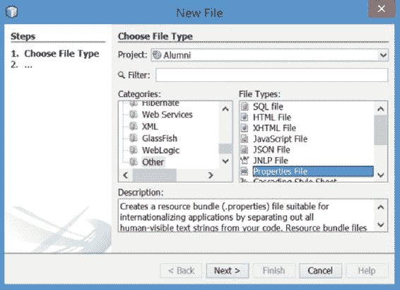
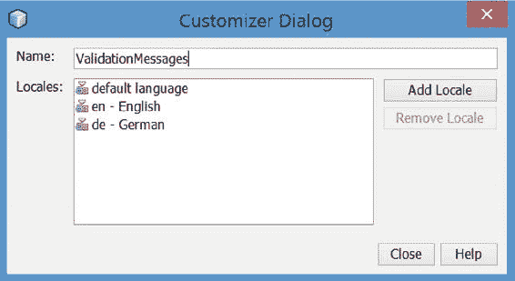

# 25. 验证

Michael Müller^(1 )

(1)德国北莱茵-威斯特法伦州布吕尔

在 JSF 将数据传输到模型之前，原始数据必须经过转换和验证。第 15 章简要介绍了*Bean 验证*。如前所述，除了 Bean 验证之外，JSF 还提供了自己的验证规范。尽管 Bean 验证是较新的技术，但它并不能替代较旧的 JSF 验证——有时使用这种“旧”验证非常方便。

本章涵盖不同类型的验证。

## Bean 验证

Bean 验证使用特殊的约束，这些约束通过注解应用于字段或访问器。其中一些约束在前面的章节中已经提到过，当时在描述 Books 中的 Book 实体时。你可以在 Java EE 8 教程（ [`javaee.github.io/tutorial/bean-validation.html`](https://javaee.github.io/tutorial/bean-validation.html) ）中找到这些约束的表格。Bean 验证的完整描述也可在 [`beanvalidation.org`](http://beanvalidation.org) 上找到。

为了进一步讨论，清单 25-1 显示了用于注册过程的 Account 实体的一个片段。


###### 清单 25-1 注册的数据模型

```
01   @Entity
02   @Table(name = "Account")
03   public class Account implements Serializable {

05     // <editor-fold defaultstate="collapsed" desc="Property Id">
06     @Id
07     @Column(name = "id")
08     private byte[] _id = UuidUtil.toBytes(UUID.randomUUID());

10     public String getId() {
11       return HashUtils.byte2hex(_id);
12     }
13     // </editor-fold>

15     // <editor-fold defaultstate="collapsed" desc="Property Status">
16     @Column(name = "status")
17     private AccountStatus _status = AccountStatus.New;

19     public AccountStatus getStatus() {
20       return _status;
21     }

23     public void setStatus(AccountStatus status) {                                                                                                                                                      
24       _status = status;
25     }
26     // </editor-fold>

28     // <editor-fold defaultstate="collapsed" desc="Property LoginName">
29     @Column(name = "loginName")
30     private String _loginName;

32     @Size(min = 1, max = 50)
33     public String getLoginName() {
34       return _loginName;
35     }

37     public void setLoginName(String loginName) {
38       _loginName = loginName;
39     }
40     // </editor-fold>

42     // <editor-fold defaultstate="collapsed" desc="Property FirstName">
43     @Column(name = "firstName")
44     private String _firstName = "";

46     @Size(min = 1, max = 50)
47     public String getFirstName() {
48       return _firstName;
49     }

51     public void setFirstName(String firstName) {                                                                                                                                                      
52       _firstName = firstName;
53     }
54     // </editor-fold>

56     // <editor-fold defaultstate="collapsed" desc="Property LastName">
57     @Column(name = "lastName")
58     private String _lastName;

60     @Size(min = 1, max = 50, message = "{validation.lastname.size}")
61     public String getLastName() {
62       return _lastName;
63     }

65     public void setLastName(String lastName) {
66       _lastName = lastName;
67     }
68     // </editor-fold>

70     // <editor-fold defaultstate="collapsed" desc="Property Email">
71     @Column(name = "email")
72     private String _email = "";

74     @Size(min = 6, max = 100)
75     public String getEmail() {
76       return _email;
77     }

79     public void setEmail(String email) {
80       _email = email;
81     }
82     // </editor-fold>
83   }
```

除了 id 之外，此代码片段还展示了一些（但并非全部）与 UI 相应输入字段对应的字段。名称长度必须在 1 到 50 个字符之间。电子邮件必须遵循一种特殊模式，该模式通过正则表达式强制执行（本章后面会介绍）。电子邮件的长度限制为 100 个字符。

###### 注意

有些注册无法完成的故事，是因为系统验证了最小长度为 3，但有效名称（据我所知，某些非洲名字可能会出现这种情况）只有 1 个字符长。

JSF 会自动调用 Bean 验证。在幕后，有很多工作要做：JSF 必须发现是否使用了 Bean 验证，并在需要时调用它。此调用的本质如清单 25-2 所示，这是一个演示原理的简短代码片段。

###### 清单 25-2 Bean 验证的程序化调用

```
1   @Inject private Account _account;

3   Validator validator = Validation.buildDefaultValidatorFactory()
4                                   .getValidator();
5   Set<ConstraintViolation<Accountt>> violations =
6                                        validator.validate(_account);
```

此代码片段仅展示了如何检查违规并将其分配给一个集合。JSF 在幕后执行的操作远不止这些。

如果 JSF 发现一个或多个约束违规，它将生成相应的消息并重新渲染当前页面以显示它们。数据不会传输到模型，并且用户单击“注册”按钮时应发生的任何操作都不会执行。

Bean 验证提供了一种注释自定义消息的选项：

```
1   @Size(min = 1, max = 50,
2   message = "名字长度必须在 {min} 到 {max} 个字符之间")
```

您可能想要开发一个国际化应用程序。通过此处展示的方法，可以自定义消息，但无法进行本地化。您可以通过在默认包中创建 `ValidationMessages.properties` 文件及其本地化变体（例如 `ValidationMessages_de.properties`）来实现本地化。在此文件中，您可以覆盖默认值或创建自己的自定义消息，包括其本地化变体。

### 创建自定义消息

1.  （可选）在项目树中，选择 **Other Sources/src/main/resources** 文件夹。

2.  要使用 NetBeans 创建属性文件，请选择“新建文件”（或按 Ctrl+N）。此时将打开“新建文件”对话框（图 25-1）。

    

    ###### 图 25-1 新建文件对话框

3.  在对话框中，选择类别 **Other**，然后选择 **Properties File**。

4.  单击“下一步”。

5.  在“名称”字段中，输入 **ValidationMessages**。

6.  如果您执行了步骤 1，则文件夹应预先填充为 `src\main\resources`。否则，请输入此值或浏览到所需文件夹。

7.  单击“完成”。NetBeans 会为您创建属性文件。

8.  右键单击属性文件并选择“自定义”。NetBeans 将打开“自定义器”对话框，如图 25-2 所示。

    

    ###### 图 25-2 自定义器对话框

9.  添加您选择的区域设置。

10. 右键单击这些新文件中的任何一个，然后选择“打开”（不要选择“编辑”）。NetBeans 会打开包含所有区域设置的属性编辑器。

11. 单击“新建属性”。

12. 对于“键”，输入 **javax.validation.constraints.Size.message**。

13. 对于“值”，输入您的自定义消息。例如，**长度必须在 {min} 到 {max} 个字符之间**。

14. 运行应用程序并输入一个过短或过长的名称。JSF 将显示自定义消息。

### 自定义消息的详细信息

那么，如何确定那个神奇的键呢？以及如何为同一约束（在其他字段或 getter 上）创建其他自定义消息？您可以在本书中找到答案——或者通过浏览 Java 源代码。使用 NetBeans，将光标放在 `@Size` 注解上，然后按 Ctrl+B（如果使用 Eclipse，则按 Ctrl+Enter）。这是“转到声明”的快捷键。NetBeans 会在其编辑器中打开 `Size.java`，如清单 25-3 所示。

###### 清单 25-3 Size.java（摘录）

```
 1   [...]
 2   public @interface Size {
 3    [...]
 4     public String message()
 5                   default "{javax.validation.constraints.Size.message}";

 7     public int min() default 0;

 9     public int max() default 2147483647;
10    [...]
11   }
```

在这里，您将找到带有默认值的 `message` 声明。查看属性 `min` 和 `max`。两者都是公共的，如果放在消息的花括号内，则可以在消息的值中引用它们。

有了这些知识，我们可以在不同位置创建不同的键。请参见清单 25-4。


###### 清单 25-4 使用自定义键的自定义消息

```
1   @Size(min = 3, max = 50, message = "{validation.lastname.size}")
2   public String getLastName() {
3     return _lastName;
4   }
```

注意花括号，它们表示键。如果没有花括号，消息将被视为纯文本。花括号本身不是键的一部分。现在，在 `ValidationMessages.properties` 文件中，我们可以添加键 `validation.lastname.size` 和如下所示的值：

```
The length of LastName must be between {min} and {max} characters.
```

### 空值处理

Bean 验证提供了两个约束来处理空值（`@Null`）或非空值（`@NotNull`）。在转换之前，所有 UI 输入在 JSF 中都被视为字符串。因此，空的输入字段是一个空字符串，这与 null 不同。你可以指示 JSF 在 `web.xml` 文件中将空字符串视为 null。参见清单 25-5。

###### 清单 25-5 将空输入视为 null 的上下文参数

```
1   <context-param>
2     <param-name>
3       javax.faces.INTERPRET_EMPTY_STRING_SUBMITTED_VALUES_AS_NULL
4     </param-name>
5     <param-value>true</param-value>
6   </context-param>
```

由于避免 null 总是好的，我建议不要使用此选项。如果不允许空输入，请定义最小长度或将 `required` 属性设置为 `true`。参见清单 25-6。

###### 清单 25-6 required 属性（包含自定义消息）

```
1   <h:inputText id="lastName"
2                value="#{register.accountRequest.lastName}"
3                required="true"
4                requiredMessage="#{msg.msgValueRequired}"
5                styleClass="inputFull">
```

## 验证方法

验证方法是 JSF 自身的验证特性之一。通过定义 Facelets（JSF 页面），可以添加 `validator` 属性，该属性接受一个用于验证输入的方法名称，如清单 25-7 所示。

###### 清单 25-7 向标记添加验证器

```
1   <h:inputText id="email"
2                value="#{register.accountRequest.email}"
3                required="true"
4                requiredMessage="#{msg.msgValueRequired}"
5                validator="#{register.checkEmail}"
6                styleClass="inputFull">
```

在第 5 行，调用了 `Register` bean 的 `checkEmail` 方法。该方法接收三个参数：`FacesContext`、`UIComponent` 以及转换后的值（作为对象），你需要将其转换为适当的类型。参见清单 25-8。

###### 清单 25-8 用于检查电子邮件的验证器方法

```
 1   public void checkEmail(FacesContext context,
 2                          UIComponent component,
 3                          Object value) {
 4     String address = (String) value;
 5     if (!address.matches(
 6        "(\\w[a-zA-Z_0-9+-.]*\\w|\\w+)@(\\w(\\w|-|\\.)*\\w|\\w+)\\.[a-zA-Z]+"))\
 7     {
 8        String msg = Helper.getMessage("errEmail");
 9        throw new ValidatorException(new FacesMessage(msg));
10     }
11   }
```

在转换问题的情况下，验证器方法会抛出一个 `ValidatorException`，该异常接收你选择的消息。如果你在页面中定义了适当的消息标签，JSF 将收集所有消息（可能来自其他组件的异常）并在重新渲染页面时显示它们。如果你遗漏了这样的消息标签，JSF 将在你在 `web.xml` 文件中定义开发阶段时显示所有消息（参见第 6 章）。

## 验证器

除了指定验证方法之外，你还可以使用特殊标签声明一个验证器。这样的验证器必须插入到所需的组件中，如清单 25-9 所示。

###### 清单 25-9 validateLength

```
1   <h:inputText id="lastName"
2                value="#{register.accountRequest.lastName}"
3                styleClass="inputFull">
4     <f:validateLength minimum="3" maximum="50"/>
5   </h:inputText>
```

清单 25-9 在第 4 行演示了这一点。`validateLength` 是一个预定义的验证器，它执行与我们之前使用 `@Size` 约束进行 Bean 验证相同的验证。

如果你想覆盖或本地化消息，可以将所需的键放入你的 `messages.properties` 文件中。对于长度验证器，键是 `javax.faces.Length`。

JSF 附带了一些预定义的验证器。有关列表，请参见附录 C 中的 JSF 核心库部分。你也可以定义自己的验证器。你的验证器需要实现 `Validator` 并重写 `validate` 方法。它将通过 `@FacesValidator` 注解进行注册，如清单 25-10 所示。我认为该类的其余部分是不言自明的。清单 25-11 演示了我们验证器的用法（第 4 行）。

###### 清单 25-10 自定义验证器

```
 1   @FacesValidator(value = "EmailValidator")
 2   public class EmailValidator implements Validator {

 4     @Override
 5     public void validate(FacesContext context, UIComponent component,
 6                          Object value) throws ValidatorException {
 7       if (value == null) {
 8         return;
 9       }
10       if (!isValidEmail("" + value)) {                                                                
11         String msg = Helper.getMessage("msgNoEmail");
12         throw new ValidatorException(new FacesMessage(msg));
13       }
14     }

16     public static boolean isValidEmail(String address) {
17       return address.matches(
18          "(\\w+|\\w(\\w|[+-.])*\\w)@(\\w+|\\w(\\w|[-.])*\\w)\\.[a-zA-Z]+");
19     }
20   }
```

###### 清单 25-11 自定义验证器的使用

```
1   <h:inputText id="email"
2                value="#{register.accountRequest.email}"
3                styleClass="inputFull">
4     <f:validator validatorId="EmailValidator"/>
5   </h:inputText> 
```

## 多组件验证

在注册页面上，会向用户询问密码。为了防止输入错误，用户需要再次输入密码。验证器需要将第二次输入与第一次输入进行核对。这是一种*多组件*验证。

JSF 2.3 引入了多组件验证。这不是一个特殊的 JSF 验证特性，而是建立在标准 Bean 验证之上。

通常，每个字段在传输到数据模型之前都必须经过验证。为了执行多组件验证，我们可能需要访问模型另一个字段的值。但该字段也只有在其之前能够通过验证时才会被传输到模型中。换句话说，我们需要一个验证来将字段传输到模型中，同时我们需要模型中的值来执行验证。这形成了一种死锁。

JSF 使用了一个简单的技巧：数据模型被临时复制，并且这个副本在验证发生之前接收新值。如果副本能够通过验证，那么这些值就会被推送到数据模型中。

多组件验证需要在 `web.xml` 中进行配置，如清单 25-12 所示。


###### 清单 25-12 在 web.xml 中启用多组件验证的上下文参数

```
01  <context-param>
02    <param-name>javax.faces.validator.ENABLE_VALIDATE_WHOLE_BEAN</param-name>
03    <param-value>true</param-value>
04  </context-param>
```

我们需要在数据模型中定义不同的验证组——例如，实体。JSF 允许在 `validateBean` 标签中定义不同的验证组。假设我们希望用户重复输入其电子邮件。在页面表示中，我们定义了两个字段，它们既属于默认验证组，也属于一个专门用于多组件验证的特殊验证组。此处，这个特殊组是 `de.muellerbruehl.demo.RepeatedEntryConstraint`。你可以声明任何你喜欢的接口作为组名。

将输入字段分配给多个验证组并非新功能。但 JSF 2.3 引入了新标签 `validateWholeBean`，它必须放置在所有输入字段之后。这就是新操作发生的地方——参见清单 25-13 的第 23–25 行。

###### 清单 25-13 重复输入示例（必须放置在 h:form 中）

```
 1 <?xml version='1.0' encoding='UTF-8' ?>
 2 <!DOCTYPE html>
 3 <html xmlns:="http://www.w3.org/1999/xhtml"
 4       xmlns:h="http://xmlns.jcp.org/jsf/html"
 5       xmlns:f="http://xmlns.jcp.org/jsf/core">
 6   <h:body>
 7     <h:form>

 9       <div>
10         <h:outputLabel value="输入电子邮件"/>
11         <h:inputText id="email1" value="#{emailBean.email1}"/>
12         <h:message id="msgEmail1" for="email1"/>
13       </div>

15       <div>
16         <h:outputLabel value="重复输入电子邮件"/>
17         <h:inputText id="email2" value="#{emailBean.email2}"/>
18         <h:message for="emailValidator"/>
19       </div>

21       <h:commandButton value="检查" actionListener="null"/>

23       <f:validateWholeBean value="#{emailBean}"
24                            validationGroups="de.muellerbruehl.demo.RepeatedEntryConstraint"
25                            id="emailValidator"/>

27     </h:form>    
28   </h:body>
29 </html>
```

上述清单创建了一个包含两个输入字段的表单，分别标记为“输入电子邮件”和“重复输入电子邮件”。第一个字段包含一个直接分配给它的 `h:message`，而放置在第二个输入字段附近的 `message` 标签则分配给 `validateWholeBean` 标签。此验证器将验证这两个输入字段。如果它们不同，则会在第二个输入字段之后立即显示一条“两个输入字段必须匹配”的消息。当用户点击检查按钮（第 21 行）时，将执行验证。此按钮不执行任何特殊操作——此表单的唯一目的是展示多字段验证的工作原理。

在此示例中，我们检查电子邮件是否两次输入一致。我们也可以检查密码重复输入。为了创建更通用的验证器，我们不创建 `EmailValidator`，而是创建 `RepeatedEntryValidator`。此验证器将接收我们数据模型的一个副本——此处是 `EmailBean` 类的一个实例（第 23 行）。考虑到通用性，验证器将接受一个接口 `RepeatedValueHolder`。该接口的职责是提供这两个输入字段。参见清单 25-14。

###### 清单 25-14 接口 RepeatedValueHolder

```
 1 public interface RepeatedEntryHolder {

 3   String getValue1();

 5   String getValue2();
 6 }
```

验证器需要实现一个 `ConstraintValidator`，它接受两个参数（清单 25-15 第 2 行）：我们的约束定义和我们的值持有者。

###### 清单 25-15 验证器

```
 1 public class RepeatedEntryValidator
 2         implements ConstraintValidator<RepeatedEntryConstraint, RepeatedEntryHolder> {

 4   @Override
 5   public void initialize(RepeatedEntryConstraint constraintAnnotation) {
 6   }

 8   @Override
 9   public boolean isValid(RepeatedEntryHolder other,
10           ConstraintValidatorContext context) {
11     return other.getValue1().equals(other.getValue2());
12   }

14 }
```

`ConstraintValidator` 接口强制我们实现两个方法：用于初始化（`initialize`，第 4–6 行）和验证（`isValid`，第 8–12 行）。因为我们不需要初始化验证器，所以第一个方法实现保持为空。验证非常简单：我们只需返回两个值是否相等。

接下来，我们需要定义我们的约束。每个约束需要包含三个属性，如清单 25-16 所示。（更多信息，请参见 [`javaee.github.io/javaee-spec/javadocs/javax/validation/Constraint.html`](https://javaee.github.io/javaee-spec/javadocs/javax/validation/Constraint.html)。）

###### 清单 25-16 RepeatedEntryConstraint

```
 1 @Constraint(validatedBy = RepeatedEntryValidator.class)
 2 @Documented
 3 @Target(TYPE)
 4 @Retention(RUNTIME)
 5 public @interface RepeatedEntryConstraint {

 7   String message() default "两个输入字段必须匹配";

 9   Class<?>[] groups() default {};

11   Class<? extends Payload>[] payload() default {};
12 }
```

第 1 行定义了此约束由哪个验证器进行验证。

对于这三个属性，我们仅为消息提供了一个简单的值（第 7 行）。与这个简单示例中提供字面量不同，更好的做法是提供一个指向可本地化字符串的键。

我们验证拼图的最后一部分是页面的支持 bean，如清单 25-17 所示。


###### 清单 25-17 EmailBean

```
 1 @Named
 2 @RequestScoped
 3 @RepeatedEntryConstraint(groups = RepeatedEntryConstraint.class)
 4 public class EmailBean implements RepeatedEntryHolder, Cloneable {

 6   //<editor-fold defaultstate="collapsed" desc="Property Email1">
 7   private String _email1 = "";                                                                

 9   @NotNull
10   @Pattern(regexp = "(\\w+|\\w(\\w|[+-.])*\\w)@(\\w+|\\w(\\w|[-.])*\\w)\\.[a-zA-Z]+",
11           message = "This is not a valid email")
12   public String getEmail1() {
13     return _email1;
14   }

16   public void setEmail1(String email1) {
17     _email1 = email1;
18   }
19   //</editor-fold>

21   //<editor-fold defaultstate="collapsed" desc="Property Email2">
22   private String _email2 = "";

24   @NotNull
25   public String getEmail2() {
26     return _email2;
27   }

29   public void setEmail2(String email2) {
30     _email2 = email2;
31   }
32   //</editor-fold>

34   //<editor-fold defaultstate="collapsed" desc="Implement RepeatedEntryHolder">
35   @Override
36   public String getValue1() {
37     return _email1;
38   }

40   @Override
41   public String getValue2() {
42     return _email2;
43   }
44   //</editor-fold>

46   //<editor-fold defaultstate="collapsed" desc="Implement Cloneable">
47   @Override
48   protected Object clone() throws CloneNotSupportedException {
49     EmailBean other = (EmailBean) super.clone();
50     other.setEmail1(this.getEmail1());
51     other.setEmail2(this.getEmail2());                                                                
52     return other;
53   }
54   //</editor-fold>
55 }
```

该类由我们的约束注解（第 3 行）。由于我们也使用此接口作为组名，因此其类再次为组声明（第 4 行）。请记住，我们本可以使用不同的接口作为组名。

该 Bean 同时实现了 `RepeatedEntryHolder` 和 `Clonable`。我们需要前者将其传递给验证器——否则，验证器将需要接受 `EmailBean` 类的实例，这阻碍了泛化。请记住，JSF 中的验证发生在数据被传输到模型（支持 Bean）*之前*。多字段验证在对象的副本上进行，这就是为什么我们需要克隆它。无需复制电子邮件字段，因为 JSF 会在克隆中将这些字段设置为当前的输入字段。

我希望你能看到，仅仅为了验证用户需要重复输入的字段，就需要付出如此多的努力。在我看来，只有当验证需要执行的操作不仅仅是比较两个字段时，这种努力才值得。由于我没有在此解释中使用密码比较，你可以猜到我在 Alumni 中选择了不同的方法来比较密码。换句话说，对于如此简单的场景，我们不会使用内置的多重验证。

## 自行实现

用于注册的支持 Bean 引用了一个包含目标密码字段的账户。该密码将与另一个字段进行比较，该字段将放置在表单中账户密码字段之前。这第一个密码字段由支持 Bean 持有。

用于密码重复输入的 `inputSecret` 引用了此 Bean 的 `checkPassword` 方法：`validator="#{register.checkPassword}"`。请参见清单 25-18。

###### 清单 25-18 注册 Bean 的摘录

```
 1   private Account _account = new Account();

 3   public Account getAccount() {
 4     return _account;
 5   }

 7   public void setAccount(Account account) {                                                                
 8     this._account = account;
 9   }

11   String _password;

13   public String getPassword() {
14     return _password;
15   }

17   public void setPassword(String password) {
18     _password = password;
19   }

21   public void checkPassword(FacesContext context,
22           UIComponent component,
23           Object value) {
24     if (_password != null && !_password.equals("" + value)) {
25       String msg = Helper.getMessage("msgPasswordMismatch");
25       throw new ValidatorException(new FacesMessage(msg));
27     }
28  }
```

对于密码检查，我们的验证器需要将第二次输入的值与第一次进行比较。由于数据尚未传输到模型（将在成功验证后进行），我们需要比较输入组件的原始值。在给出的解决方案中，原始值与密码字段进行比较，而密码字段需要在此之前传输到 Bean。这就是下一章主题 AJAX 的用途。

如果不使用 AJAX，我们还需要检索第一个密码字段的原始值。我们将从组件树中获取它，如清单 25-19 所示。

###### 清单 25-19 多组件验证示例

```
 1     public void checkPassword(FacesContext context, UIComponent component, Obj\
 2   ect value) {
 3       UIViewRoot root = context.getViewRoot();
 4       String targetId = component.getNamingContainer().getClientId() + ":passw\
 5   ord";
 6       Object password = ((HtmlInputSecret) root.findComponent(targetId))
 7                .getValue();
 8       if (!password.equals("" + value)) {
 9         String msg = Helper.getMessage("msgPasswordMismatch");
10         throw new ValidatorException(new FacesMessage(msg));
11       }
12   }
```

清单 25-19 中显示的方法替换了清单 25-18 中的方法。

## 总结

尽管 JSF 从早期就提供了自己的验证功能，但现在也可以使用 Java EE 的 Bean 验证特性。如果数据模型使用验证约束进行注解，JSF 会自动调用 Bean 验证。自 JSF 2.3（Java EE 8）起，提供了基于 Bean 验证组的多组件验证。它需要大量样板代码，因此最好在需要复杂验证时使用。对于简单地比较两个字段值是否相同，不使用此新功能可能更容易实现。

© Michael Müller 2018

Michael Müller, Practical JSF in Java EE 8 , `doi.org/10.1007/978-1-4842-3030-5_26`

