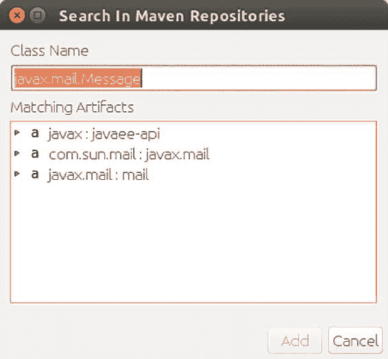
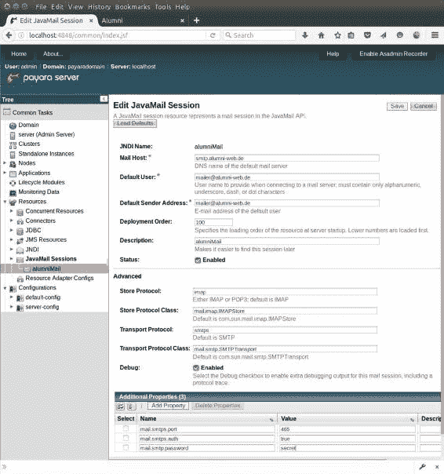

# 30. 激活邮件

Michael Müller^(1 )

(1)德国，北莱茵-威斯特法伦州，布吕尔

在 Alumni 中，一旦账户创建完成，我们就会向用户发送一封激活邮件，其中包含一个带有通用唯一标识符（UUID）的链接。如果用户点击此链接，账户将被激活并可供使用。

## 通过代码配置邮件属性

邮件的发送由一个名为 Mailer 的应用程序作用域类执行。在此类中，一些硬编码的属性被收集到一个映射中。在最终版本中，我们将选择 JavaMail 会话来从中获取配置（请参阅下一节）。


###### 清单 30-1 邮件发送器（为演示目的使用硬编码属性）

```
01   @Dependent
02   public class Mailer implements Serializable {

04     protected static final Logger LOGGER = Logger.getLogger("Mailer");

06     public boolean sendMail(String to, String subject, String body) {
07       List<Recipient> recipients = new ArrayList<>();
08       recipients.add(new Recipient(to, RecipientType.TO));
09       return sendMail("mailer@alumni-web.de", recipients, subject, body);
10     }

12     public boolean sendMail(String from, List<Recipient> recipients,
13             String subject, String body, String... files) {
14       try {
15         Properties properties = obtainConfig();
16         Session session = Session.getDefaultInstance(properties);
17         MimeMessage message = composeMessage(session, from, recipients,
18                 subject, body, files);
19         Transport.send(message, from, "secret");
20         return true;
21       } catch (MessagingException ex) {
22         LOGGER.log(Level.SEVERE, "Mailer failed: {0}", ex.getMessage());
23         return false;
24       }
25     }

27     private Properties obtainConfig() {
28       Properties properties = System.getProperties();
29       properties.put("mail.transport.protocol.rfc822", "smtps");
30       properties.put("mail.smtps.host", "smtp.strato.de");
31      properties.put("mail.smtps.port", 465);
32       properties.put("mail.smtps.auth", true);
33       return properties;                                                          
34     }

36     private MimeMessage composeMessage(Session session,
37             String from,
38             List<Recipient> recipients,
39             String subject,
40             String body,
41             String[] files) throws MessagingException {
42       MimeMessage message = new MimeMessage(session);
43       for (Recipient recipient : recipients) {
44         message.addRecipient(recipient.getType(),
45                 new InternetAddress(recipient.getEmail()));
46       }
47       message.setSubject(subject);
48       message.setContent(getMultipartBody(body, files));
49       message.setFrom(new InternetAddress(from));
50       return message;
51     }

53     private Multipart getMultipartBody(String body, String[] files)
54             throws MessagingException {
55       MimeBodyPart messageBodyPart = new MimeBodyPart();
56       messageBodyPart.setText(body);
57       Multipart multipart = new MimeMultipart();
58       multipart.addBodyPart(messageBodyPart);
59       for (String file : files) {
60         addAttachment(multipart, file);
61       }
62       return multipart;
63     }

65     private static void addAttachment(Multipart multipart, String filename)
66          throws MessagingException {
67        if (filename.isEmpty()) {
68         return;
69       }
70       MimeBodyPart messageBodyPart = new MimeBodyPart();
71       DataSource source = new FileDataSource(filename);
72       messageBodyPart.setDataHandler(new DataHandler(source));
73       File file = new File(filename);
74       messageBodyPart.setFileName(file.getName());
75       multipart.addBodyPart(messageBodyPart);
76     }

78   }
```

JavaMail 是 Java 企业版（EE）的一部分。因此，无需直接引用 JavaMail jar。我们只需在 POM 中添加正确的 Java EE 依赖项即可。

如果没有这个依赖项，IDE 就无法添加所需的导入。NetBeans 为未满足的导入提供了 Maven 搜索功能。我们需要添加以下内容：

```
import javax.mail.Message;
```

将光标放在该行的末尾，然后按 Alt+Enter。NetBeans 会弹出一个 Maven 搜索对话框，如图 30-1 所示。



###### 图 30-1 Maven 搜索对话框

在“匹配工件”字段中选择 javax:javaee-api。NetBeans 会将依赖项添加到 POM 中。如果使用其他 IDE，你可以手动添加依赖项。请参见清单 30-2。

###### 清单 30-2 JavaMail（以及 Java EE API 的其他部分）的依赖项

```
1   <dependency>
2     <groupId>javax</groupId>
3     <artifactId>javaee-api</artifactId>
4     <version>8.0</version>
5     <type>jar</type>
6   </dependency>
```

一旦包含了该依赖项，NetBeans 就可以修复缺失的导入（Ctrl+Shift+I）。

让我们检查一下代码：第 1 行显示了 `@Dependent` 注解。这声明了一个符合 CDI 规范的 bean，其生命周期取决于它被注入到的那个 bean。

为了发送激活邮件，Alumni 使用了 `sendMail` 方法，该方法从第 6 行开始。它只是向一个收件人发送一封由主题和正文组成的电子邮件。

我们可能需要附加文件或添加其他收件人。`sendMail` 委托给了该方法的另一个重载版本，该版本接受更多参数（清单 30-1 中的第 12 行）。用一个携带所有信息的邮件信息对象来替换这么多参数可能会更好。由于 Mailer 的最终版本需要的参数更少，因此保持现状可能也可以。

要创建一条消息，我们需要一个会话。这样的会话是通过将邮件服务器特定的属性传递给其工厂方法来创建的（第 16 行）。这些属性由 `obtainConfig` 方法（第 27 行）收集到一个映射中。在此方法中，一些硬编码的属性被收集到一个映射中。在最终版本中，我们将选择使用 JavaMail Session 来检索配置。

Alumni 使用安全协议版本，因此我们将协议设置为 SMTPS。接下来，我们根据邮件服务器设置一些 SMTPS 参数。属性 `mail.smpts.XXX` 对应于所选的协议。你可以在 [`javaee.github.io/javaee-spec/javadocs/javax/mail/package-summary.html`](https://javaee.github.io/javaee-spec/javadocs/javax/mail/package-summary.html) 阅读 API 的完整描述。

一旦 `sendMail` 获取到会话，它就会构建消息（第 17 和 18 行）并发送邮件（第 19 行）。这里我们提供了一个秘密密码。如果不需要密码，我们可以通过一个属性设置发件人，并仅将消息传递给 `Transport.send` 方法。

## 邮件会话

如前所述，硬编码配置在这里不是一个好选择。你可能需要区分开发环境和生产环境，或者在不同的生产系统上需要不同的配置。Alumni 使用在 GlassFish/Payara 上定义的 JavaMail 会话，如图 30-2 所示。假设你在本地运行服务器，管理页面可通过地址 https://localhost:4848 访问。如果你使用 NetBeans，也可以通过服务树视图中服务器的上下文菜单打开管理控制台。在管理控制台中，选择“资源” ➤ “JavaMail 会话” ➤ “新建”来创建一个会话。



###### 图 30-2 GlassFish/Payara 中的 *JavaMail* *会话*

或者，你可以创建一个 `glassfish-resources.xml` 文件（或让 NetBeans 在正确的位置创建它），该文件位于 `WEB-INF` 文件夹中。请参见清单 30-3。


###### 清单 30-3 glassfish-resources.xml

```
01   <!DOCTYPE resources PUBLIC
02   "-//GlassFish.org//DTD GlassFish Application Server 3.1 Resource Definitions//EN"
03   "http://glassfish.org/dtds/glassfish-resources_1_5.dtd">
04   <resources>
05     <mail-resource debug="true"
06                    enabled="true"
07                    from="mailer@alumni-web.de"
08                    host="smtp.strato.de"
09                   jndi-name="alumniMail"
10                   object-type="user"
11                   store-protocol="imap"
12                   store-protocol-class="com.sun.mail.imap.IMAPStore"
13                   transport-protocol="smtps"
14                   transport-protocol-class="mail.smtp.SMTPTransport"
15                   user="mailer@alumni-web.de">
16      <description>alumniMail</description>
17      <property name="mail.smtps.port" value="465"/>
18      <property name="mail.smtps.auth" value="true"/>
19      <property name="mail.smtps.password" value="secret"/>
20    </mail-resource>
21  </resources>
```

这个会话可以通过传统的 `@Resource` 注解注入，如清单 30-4 所示。自 JSF 2.3 起，也可以通过 `@Inject` 使用。无需收集配置属性，因为它们是在代码外部定义的，如清单 30-5 所示。因此，你可以通过管理控制台更改参数来修改配置，而无需更改代码。

让我们看看最终 Mailer 类中一些有趣的部分，由于我们移除了 sendMail 方法中的 from 参数，其大小有所缩减。请参见清单 30-4。

###### 清单 30-4 使用注入会话的 Mailer（节选）

```
01     @Resource(lookup = "alumniMail")
02     private Session _session;

04     public boolean sendMail(List<Recipient> recipients,
05             String subject, String body, String... files) {
06       try {
07         MimeMessage message = composeMessage(recipients,
08                 subject, body, files);
09         String user = _session.getProperty("mail.user");
10         String password = _session.getProperty("mail.smpt.password");
11        Transport.send(message, user, password);
12        return true;
13      } catch (MessagingException ex) {
14        LOGGER.log(Level.SEVERE, "Mailer failed: {0}", ex.getMessage());
15        return false;
16      }
17    }

19    private MimeMessage composeMessage(List<Recipient> recipients,
20            String subject,                                                                                                
21            String body,
22            String[] files) throws MessagingException {
23      MimeMessage message = new MimeMessage(_session);
24      for (Recipient recipient : recipients) {
25        message.addRecipient(recipient.getType(),
26                new InternetAddress(recipient.getEmail()));
27      }
28      message.setSubject(subject);
29      message.setContent(getMultipartBody(body, files));
30      String from = _session.getProperty("mail.from");
31      message.setFrom(new InternetAddress(from));
32      return message;
33    }
```

## 发送激活邮件

当用户点击“注册”按钮时，Alumni 会创建一个状态为“new”的新账户。我稍后会在登录部分对此进行说明。账户激活后（即状态为 *active*），用户才能登录。

为了向用户发送激活邮件，我们需要一个邮件模板，并在其中添加用户名和激活链接等信息。该模板将由管理员使用一个简单的基于 JSF 的 Web 表单创建，并存储在数据库的表中。它包含一个 id、一个名称（作为人类可读的标识符）、一个主题和一个正文。请记住为你想要支持的每种语言存储一个模板版本。

之前介绍 Mailer 时，我重点介绍了 sendMail 功能。在 Alumni 中，Mailer 委托给 MailService 类的一个实例（此处未显示），该类用于访问邮件模板。在这样的模板中，我们使用花括号内的名称作为占位符，这些占位符会在发送前被替换。激活邮件的正文可能如下所示：

```
Hello {firstName},                
In order to complete your registration, please click the following link {link}. 
```

发送激活邮件变得很简单：检索邮件模板（清单 30-5 的第 4 行），通过替换占位符来构建主题和正文（第 5–9 行），然后发送邮件（第 10 行）。最复杂的部分是构建替换其中一个占位符的 URL（第 13–30 行）。

###### 清单 30-5 注册用户（节选）

```
01     @Inject private Mailer _mailer;

03     private void sendMail(String accessKey) {
04       MailTemplate template = _mailer.findTemplateByName(TemplateName.ActivationMail);
05       String subject = template.getSubject();
06       String body = template
07               .getBody()
08               .replace("{firstName}", _account.getFirstName())
09               .replace("{link}", getUrl(accessKey));
10       _mailer.sendMail(_account.getEmail(), subject, body);
11     }

13     private String getUrl(String key) {
14       HttpServletRequest request = obtainServletRequest();
15       try {
16         URL url = new URL(request.getScheme(),
17                 request.getServerName(),
18                 request.getServerPort(),
19                 request.getContextPath() + Page.Activate.url() + "?key=" + key);
20         return url.toString();
21       } catch (MalformedURLException ex) {
22         Logger.getLogger(Register.class.getName()).log(Level.SEVERE, null, ex);
23         return "";
24       }
25  }

27     private HttpServletRequest obtainServletRequest() {
28       FacesContext context = FacesContext.getCurrentInstance();
29       return (HttpServletRequest) context.getExternalContext().getRequest();
30     }
```

通常，我们会在应用程序中导航到页面。这样的路径会自动附加到上下文路径之后。但对于激活邮件，我们需要向用户发送一个完整的 URL（URI），包括域名（或在开发环境中为服务器名称）和上下文路径。这个 URL 在第 16–20 行构建。如果你的服务器运行在标准 HTTP 端口（端口 80，或 HTTPS 的 430 端口）上，则可以省略端口号。

用户收到此激活邮件后，会点击其中的链接。

## 总结

通过 JavaMail，你拥有一个处理电子邮件的 API，既可以在 Java SE 中使用，也可以在 Java EE 中使用。它已包含在 Java EE 中，因此在 Java EE 项目中无需在 POM 中添加额外的引用。

JavaMail 需要一些属性来配置传输，包括邮件服务器、协议等。本章展示了使用硬编码解决方案的这些属性。更好的做法是，将这些属性设置在应用程序外部。符合 Java EE 规范的服务器提供了通过其控制台或 `.properties` 文件定义邮件会话的能力。Alumni 正是利用这种方式，使用邮件功能向用户发送激活邮件或其他信息。

© Michael Müller 2018

Michael Müller, Practical JSF in Java EE 8 , `doi.org/10.1007/978-1-4842-3030-5_31`

