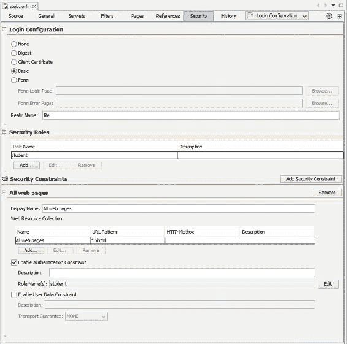
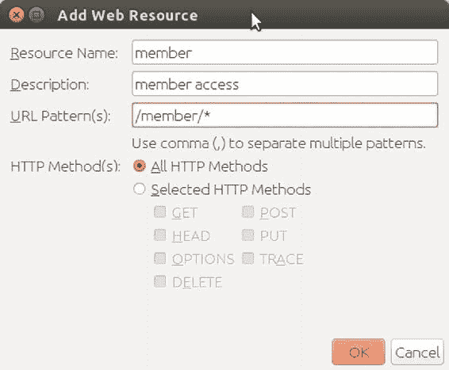
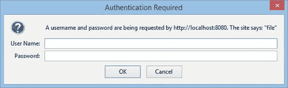
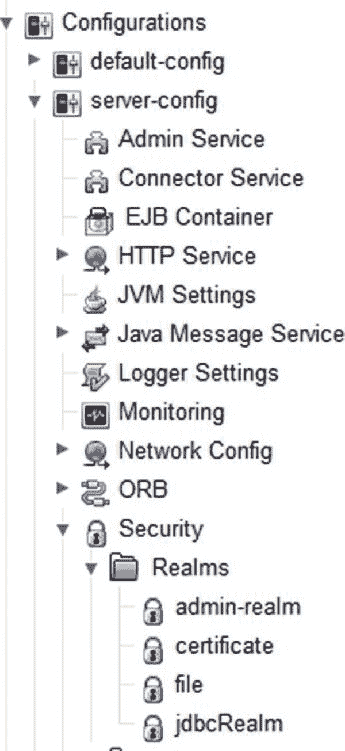
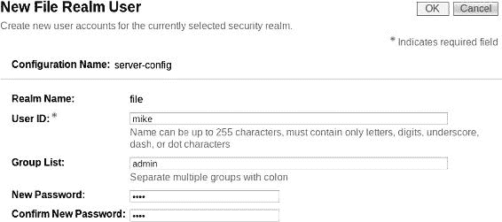
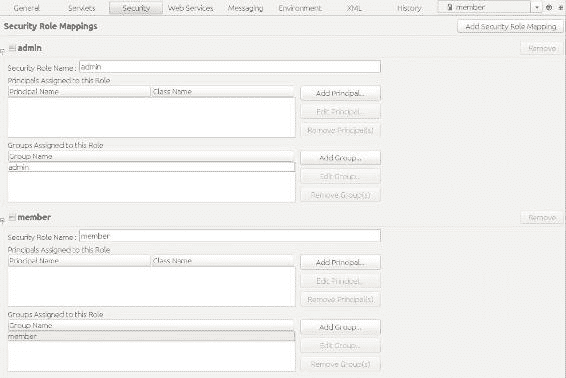
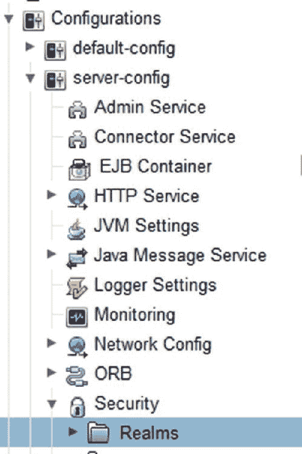
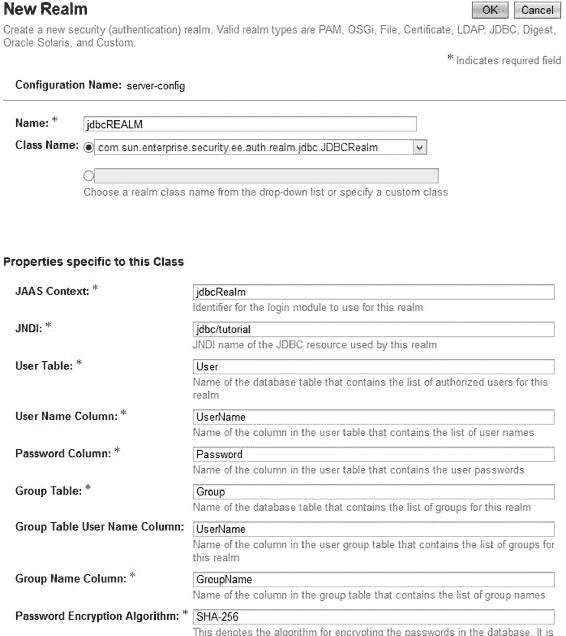
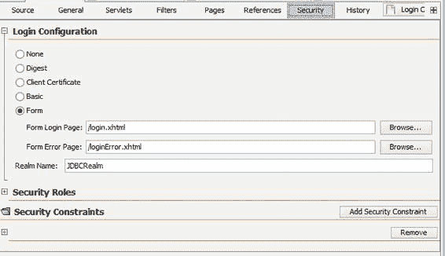
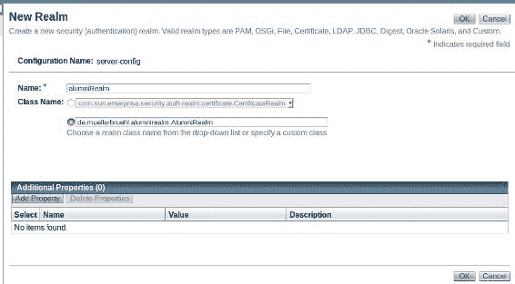

# 32. 认证与授权

Michael Müller^(1 )

(1)德国，北莱茵-威斯特法伦州，布吕尔

有时保护应用程序或数据免受未经授权的访问至关重要。尽管 Alumni 提供了一些公共页面，但大多数页面仅限于成员访问。系统将仅向已知用户授予对某些功能的访问权限。幸运的是，应用服务器提供了一些安全特性，例如认证和授权，并通过用户角色的概念控制对程序部分的访问。

容器提供的安全性并非 JSF 所特有。它是 HTTP 处理的一部分，也可以被简单的 Servlet 使用。在将其集成到 Alumni 之前，让我们先了解一些关于安全性的基本信息。


## 安全基础

要授予用户对受保护应用程序的访问权限，首先必须对用户进行身份验证。用户必须告知系统其身份。这可以通过提供用户名（“是我”）和密码（“你可以通过检查只有我们共享的某些秘密信息来验证确实是我”）来实现。其他身份验证技术包括使用身份证、证书、指纹等。在本书中，我们主要关注用户名和密码。

一旦系统验证了用户身份，它就会对用户进行授权，根据安全状态决定是允许他们访问整个应用程序还是仅访问部分内容。这是通过为用户分配一个或多个不同的*角色*来实现的。根据角色的不同，对应用程序的访问权限会受到控制。

让我们回顾一下：

1.  系统提供一个登录界面（例如表单）来查询用户名和密码。
2.  用户提供这些信息。
3.  系统验证这些信息。如果不匹配，则登录中止。
4.  系统确定角色并根据这些角色授予访问权限。

使用容器提供的安全机制，步骤 1 至少可以通过三种方式实现：

*   用户的网络浏览器会显示一个简单的输入对话框。其外观和客户端数据处理由浏览器决定。开发者无需采取进一步操作。此模式称为*基本认证*。
*   开发者提供一个包含两个输入字段以及提交或重置按钮的 HTML 表单。这些字段可以集成到具有应用程序外观和风格的网页中。输入字段的名称和操作必须严格遵循约定。此模式称为*基于表单的认证*。
*   开发者使用预先安排好的 JSF 表单。在服务器端，应用程序调用容器的登录方法。这被称为*编程式认证*。

用户名和密码必须从客户端发送到服务器。无论密码是以明文形式发送还是以哈希摘要形式发送（这可能在服务器属性中配置），结果都一样：如果有人截获了这些数据，他们可能会尝试利用它来获取访问权限。因此，一个常见的建议是使用安全的传输协议，例如 TSL/SSL。用户可以通过 URL 中的 `https://` 协议部分来识别此类安全协议——其中的 *s* 代表安全。

对于认证/授权过程的步骤 3，服务器必须根据存储在某个地方的信息来检查输入（用户名/密码）。这是通过所谓的*安全域*来实现的。通常，你的服务器上会预定义一个或多个域。例如，GlassFish 提供了几个域。我们将讨论其中两个：`fileRealm`（用户信息存储在文件中）和 `jdbcRealm`（用户信息存储在数据库中）。最后但同样重要的是，我们将讨论一个自行编程的（自定义）域。

尽管这些安全域有时以类似的方式实现，但它们仍然是特定于供应商的。术语约定也可能不同。有些称之为*域*，另一些则称之为*领域*、*区域*等。这同样适用于此上下文中的其他术语，例如*组*、*角色*、*主体*、*权限*等。

为了消除这种混乱，创建了一个标准：Java 容器认证服务提供者接口（JASPIC，JSR 196）。尽管 JASPIC 的定义始于十多年前，但专有域仍然普遍存在。随着 Java EE 6 的出现，这种情况开始改变，JASPIC 似乎成为了一等公民。然而，Java EE 7 并未引入足够多的改进，并且有一个正在进行的标准化过程（JSR 375），它建立在 JASPIC 和 JACC（Java 容器授权服务提供者契约）之上。这个 Java 安全 API 部分计划用于 Java EE 8，并将随 Java EE 9 完成。稍后我们将使用其参考实现 Soteria，以便比直接使用 JASPIC 更简单地访问。

我们将从 HTTP 认证及其域开始。Java 认证和授权服务（JAAS）已集成到 Java 2 SDK 1.4 中。（要了解更多信息，请查看 [`docs.oracle.com/javase/8/docs/technotes/guides/security/jaas/JAASRefGuide.html`](https://docs.oracle.com/javase/8/docs/technotes/guides/security/jaas/JAASRefGuide.html)。）当我写到域时，请记住特定于供应商的实现。我将重点介绍 GlassFish 和 NetBeans，你可能需要将某些信息转换到你的环境中。

例如，NetBeans 提供了一些特殊的编辑器来配置基于容器的安全性。我将讨论这一点以及最终的配置，这通常是纯 XML。

## 基本认证与 fileRealm

为了保护 Alumni 应用，我们需要向 `web.xml` 添加一个安全约束。在你的编辑器中打开此文件。使用 NetBeans，在你的项目树中选择 Web Pages、WEB-INF、`web.xml`。NetBeans 默认在源代码视图中打开此文件。要获得概览，请切换到 Security 选项卡。这样做会改变视图，并允许你轻松读取或定义安全设置。参见图 32-1。



###### 图 32-1 web.xml 的安全选项卡。

在顶部，注意不同的登录配置。如前所述，本教程将涵盖基本认证和表单认证。从用户的角度来看，摘要认证与基本认证几乎相同：两者都在浏览器中显示一个小型输入对话框，用户可以在其中输入用户名和密码。在底层，从密码派生出一个*摘要*（哈希值）。因此，没有明文发送到服务器。但这并不是一个真正的安全特性。如果摘要被某个犯罪分子截获，其效果几乎与密码被截获相同。因此，你必须使用 SSL（安全套接层）或其现代继任者 TLS（传输层安全）来加密连接本身。使用其中任何一种都会产生 HTTPS 连接。

表单登录配置将显示指定的表单来查询凭据。这允许你自定义该过程。

客户端证书登录配置基于 SSL 以及服务器证书与客户端证书的结合。

要继续进行基本认证，请选择 Basic 并在 Realm Name 字段中输入 **file**。此信息不会被 NetBeans 检查，因此请确保输入一个现有的域名称。请参考你的应用服务器以确定哪些值是有效的。因为我在此教程中使用 GlassFish，所以 *file* 是一个有效的域名称。大多数应用服务器都提供文件域（也称为域、区域等）。

接下来，转到 Security Roles 并添加两个角色。将它们命名为 **member** 和 **admin**。你可以根据需要定义任意数量的角色。这对于需要区分不同访问级别（如管理员、普通用户、经理、服务等）的应用程序可能很有用。对于 Alumni 的完整版本，我们同样需要几个角色，但对于这第一个演示，还不需要定义更多角色。

配置 `web.xml` 的下一步是添加安全约束。单击 Add Security Constraint 添加一个。显示名称是可选的，为了方便起见。我们在这里使用 *member access*。如果你需要处理大量不同的约束，显示名称非常有用。

现在添加一个 Web 资源集合（参见图 32-2）。给它一个名称并提供 URL 模式。**/member/*** 适用于 member 文件夹中的所有页面。单击 OK 返回 Security 选项卡。




###### 图 32-2 添加 Web 资源

我们希望限制只有特定角色的成员才能访问，因此勾选“启用身份验证约束”（Enable Authentication Constraint）并编辑“角色名称”（Role Name）。选择我们之前定义的 *member* 和 *admin* 这两个角色。这建立了一个授权要求，而“启用用户数据约束”（Enable User Data Constraint）则强制要求传输层。

现在创建第二个安全约束，仅允许 admin 角色的成员访问 admin 页面。

没有 NetBeans？或者你更倾向于直接编辑 XML 文件？让我们来看看。使用 NetBeans，选择“源”（Source）选项卡。你的 `web.xml` 文件应该类似于清单 32-1。

###### 清单 32-1 web.xml 中的 security-constraint 部分

```
 1   <?xml version="1.0" encoding="UTF-8"?>
 2   <web-app version="3.1" xmlns:="http://xmlns.jcp.org/xml/ns/javaee"
 3       xmlns:xsi="http://www.w3.org/2001/XMLSchema-instance"
 4       xsi:schemaLocation="http://xmlns.jcp.org/xml/ns/javaee
 5       http://xmlns.jcp.org/xml/ns/javaee/web-app_3_1.xsd">

 8       [... 省略条目...]

10       <security-constraint>
11           <display-name>member access</display-name>
12           <web-resource-collection>
13               <web-resource-name>member</web-resource-name>
14               <description>member access</description>
15               <url-pattern>/member/*</url-pattern>
16           </web-resource-collection>
17           <auth-constraint>
18               <description>Member pages are available to all roles</description\>

20               <role-name>member</role-name>
21               <role-name>admin</role-name>
22           </auth-constraint>
23       </security-constraint>
24       <security-constraint>
25           <display-name>admin access</display-name>
26           <web-resource-collection>
27               <web-resource-name>admin</web-resource-name>
28               <description>admin access</description>
29               <url-pattern>/admin/*</url-pattern>
30           </web-resource-collection>
31           <auth-constraint>
32               <description>Admin pages are restricted to people of the admin role only</description>

34               <role-name>admin</role-name>
35           </auth-constraint>
36       </security-constraint>
37       <login-config>
38           <auth-method>BASIC</auth-method>
39           <realm-name>file</realm-name>
40       </login-config>
41       <security-role>
42           <description/>
43           <role-name>member</role-name>
44           </security-role>
45       <security-role>
46           <description/>                                                          
47           <role-name>admin</role-name>
48       </security-role>
49   </web-app>
```

找到标签 `security-constraint`、`login-config`、`security-role` 及其子标签。这就是之前配置的结果。因此，这些标签的意图应该很明确。如果你熟悉这些标签，直接编辑 XML 文件可能会更快。要应用更多约束，可以添加一个同级元素。在一个约束内部，你可以添加更多的 Web 资源集合。并且你可以将其限制为一个或多个特定的 HTTP 方法，如清单 32-2 所示。

###### 清单 32-2 特定 HTTP 方法示例

```
1   <web-resource-collection>
2       <web-resource-name>All web pages</web-resource-name>
3       <description/>
4       <url-pattern>*.xhtml</url-pattern>
5       <http-method>PUT</http-method>
6       <http-method>POST</http-method>
7   </web-resource-collection>
```

如果你选择了不同的身份验证方式（例如表单验证）或不同的域（realm），则需要在 `<login-config>` 中进行更改。更改方法通常不会影响安全约束或角色，因此当我们转向不同的域或身份验证方法时，我不会再重复解释这一点。

为了测试安全行为，我们创建三个简单的网页，分别放在 `admin`、`member` 和 `public` 文件夹中。始终将它们命名为 `test.xhtml`。对于这个简单的测试，我们不需要任何 JSF 特定的标签。只需在页面中放置一些文本来标识文件夹即可。清单 32-3 显示了我放在 `admin` 文件夹中的测试页面。

###### 清单 32-3 简单测试页面

```
 1   <?xml version='1.0' encoding='UTF-8' ?>
 2   <!DOCTYPE html PUBLIC "-//W3C//DTD XHTML 1.0 Transitional//EN"
 3       "http://www.w3.org/TR/xhtml1/DTD/xhtml1-transitional.dtd">
 4   <html xmlns:="http://www.w3.org/1999/xhtml">
 5       <head>
 6           <title>Admin Test Page</title>
 7       </head>
 8       <body>
 9           <h1>Admin Page</h1>
10       </body>
11   </html>
```

现在，如果你启动应用程序并导航到这些页面，会发生什么？首先尝试公共页面 `http://localhost:8080/Alumni/public/test.xhtml` 或其 TLS 对应页面 `https://localhost:8181/Alumni/public/test.xhtml`。如果你没有安装自己验证过的证书，后者将使用 GlassFish 服务器的自签名证书，因此你的浏览器会抱怨证书不受信任。因为你知道这是你自己的服务器，所以可以接受它。连接将被完全加密。

你的浏览器会按预期显示页面。但是，如果你尝试导航到 `member` 或 `admin` 文件夹中的测试页面，行为就会改变：你的浏览器会显示一个小的登录对话框，要求输入用户名和密码，如图 32-3 所示。



###### 图 32-3 基本身份验证的登录对话框

输入一些凭据，按回车键（或单击“确定”），此对话框将重新显示，直到（取决于你的浏览器）你输入有效的用户名/密码组合。但我们没有定义任何用户，所以唯一的选择是取消。你将看到浏览器显示的 *401 – 未授权* 页面。应用程序现在已受到保护。

想让某些用户进入？好的，我们来定义他们。

打开 GlassFish 管理控制台。确保 GlassFish 正在运行（它将随你的应用程序一起启动）。使用 NetBeans，打开“服务”（Services）视图（Ctrl+5），选择“服务器”（Servers），然后打开你的 GlassFish 的上下文菜单。选择“查看域管理控制台”（View Domain Admin Console）。或者，在浏览器中访问 `http://localhost:4848/`。

在导航窗格中，选择“配置”（Configurations）➤ `server-config` ➤ “安全”（Security）➤ “域”（Realms）➤ `file`，如图 32-4 所示。



###### 图 32-4 GlassFish 配置树

GlassFish 会显示“编辑域”（Edit Realm）页面。单击“管理用户”（Manage Users）➤ “新建”（New）。现在输入一些凭据，如图 32-5 所示。单击“确定”（OK）确认。




###### 图 32-5 GlassFish 用户编辑器（用于文件域）

为了进行测试，你可以输入两个不同的用户，一个作为组成员，另一个作为管理员组。正如域名称所示，你的用户信息将存储在一个文件中，该文件位于你的 domain/config 文件夹中，名为 keyfile。你可以用文本编辑器打开它。其内容应类似于以下内容：

```
1     guest;{SSHA256}c6/mlRhM7djv01PY+eA1tF6plcQ/3IROXeCwO06ZTLtkF+dqmg2Erw==;\
2   student
```

每一行由三列组成：用户名、密码和组。出于技术原因，组显示在第二行。为了安全起见，密码以加密哈希值的形式存储。如果你需要复习安全密码的相关知识，请参阅第 28 章。考虑到这一点，文件域可能仅适用于安全性要求不高的应用程序。

如果你启动应用程序，仍然无法登录。你还记得 web.xml 处理角色以及 GlassFish 存储组的方式吗？尽管我们使用了相同的名称（member 和 admin），但它们是两个略有不同的对象。缺少的是从组（或主体）到角色的映射。这是 GlassFish 特有的任务。

对于这种映射，你需要一个 glassfish-web.xml（或 sun-web.xml）文件。如果该文件不存在，你必须创建一个。使用 NetBeans，选择 New ➤ Other ➤ GlassFish ➤ GlassFish Descriptor 来创建此文件。或者，在 WEB-INF 文件夹中手动创建。

在 Security 选项卡中，输入如图 32-6 所示的信息。



###### 图 32-6 NetBeans 安全编辑器

你在 Security Role Mappings 框中输入的信息，只是将清单 32-4 中的行添加到文件中。如果你愿意，可以直接在 XML 模式下编辑它们。

###### 清单 32-4 将每个组映射到一个角色

```
1   <security-role-mapping>
2     <role-name>admin</role-name>
3     <group-name>admin</group-name>
4   </security-role-mapping>
5   <security-role-mapping>
6     <role-name>member</role-name>
7     <group-name>member</group-name>
8   </security-role-mapping>
```

你可以将多个组映射到一个角色，如清单 32-5 所示。

###### 清单 32-5 将多个组映射到一个角色

```
1   <security-role-mapping>
2     <role-name>member</role-name>
3     <group-name>admin</group-name>
4     <group-name>member</group-name>
5   </security-role-mapping>
```

此配置将组 member 和 admin 都映射到角色 member。

你也可以直接将用户（主体）映射到一个角色：{lang="XML", title="将组和成员映射到一个角色"}：

```
1   <security-role-mapping>
2     <role-name>admin</role-name>
3     <group-name>admin</group-name>
4     <principal-name>muellermi</principal-name>
5   </security-role-mapping>
```

如果不需要这种灵活的映射，你可以将其关闭。在 GlassFish 中，选择 Configurations ➤ server-config ➤ Security check ➤ Default Principal To Role Mapping。现在，组直接映射到角色（组名 = 角色名）——无需专门的映射。但请注意：这仅影响更改此设置后部署的应用程序！通常，用户和角色会满足要求，不需要变体组。因此，我建议使用此设置。

现在，如果你启动应用程序，就可以登录 Alumni 了。

## 表单登录

既然我们已经介绍了使用简单文件域的基本登录，那么让我们继续，更改身份验证方法。请记住，本书是关于使用 JavaServer Faces 进行 Web 开发的。到目前为止，我展示的基于容器的安全技术完全独立于 JSF。简单的表单登录也是如此。但可以将其嵌入到某些 JSF 技术中。此外，程序化登录是使用 JSF 完成的。

对于基于表单的登录，我们必须稍微修改 web.xml。除了更改身份验证方法外，我们还必须声明两个页面，一个用于登录，一个用于失败页面（它们可能是同一个页面）。

因此，请将清单 32-6 替换为清单 32-7。

###### 清单 32-6 基本身份验证的配置

```
1   <login-config>
2       <auth-method>BASIC</auth-method>
3       <realm-name>file</realm-name>
4   </login-config>
```

###### 清单 32-7 表单身份验证的配置

```
1   <login-config>
2       <auth-method>FORM</auth-method>
3       <realm-name>file</realm-name>
4       <form-login-config>
5           <form-login-page>/public/login.xhtml</form-login-page>
6           <form-error-page>/public/loginError.xhtml</form-error-page>
7       </form-login-config>
8   </login-config>
```

清单 32-8 显示了一个简短的登录页面。

###### 清单 32-8 简单登录页面

```
 1   <?xml version='1.0' encoding='UTF-8' ?>
 2   <!DOCTYPE html PUBLIC "-//W3C//DTD XHTML 1.0
 3       Transitional//EN" "http://www.w3.org/TR/xhtml1/DTD/xhtml1-transitional.d\
 4   td">
 5   <html xmlns:="http://www.w3.org/1999/xhtml"
 6         xmlns:h="http://xmlns.jcp.org/jsf/html">
 7       <h:head>
 8           <title>登录</title>
 9       </h:head>
10       <h:body>
11           <form method="POST" action="j_security_check">
12               用户名: <input type="text" name="j_username" />
13               密码: <input type="password" name="j_password" />
14               <br />
15               <input type="submit" value="登录" />
16           </form>
17       </h:body>
18   </html>
```

由于本书主要介绍 JSF，我使用了 NetBeans 命令 New ➤ JSF Page 来创建一个存根。但此页面的核心是纯 HTML——使用 POST 方法和 action 为 j_security_check 的表单。此名称是固定的，用户（j_username）和密码（j_password）字段的名称也是如此。如果你愿意，可以将此表单插入到完整的 JSF 页面中。或者，你可以将此登录表单嵌入到 JSF 组件中，使其更具可重用性。请记住使用此标准 HTML 表单来定义 action；其 JSF 对应项不知道如何定义特殊 action。

清单 32-9 显示了一个示例错误页面，但你可以使用任何页面。这里我使用了一些简单的 JSF，没有任何后台 bean。它只是通知用户身份验证失败，并提供一个导航按钮返回登录页面。


###### 清单 32-9 示例登录错误页面

```
 1   <?xml version='1.0' encoding='UTF-8' ?>
 2   <!DOCTYPE html PUBLIC "-//W3C//DTD XHTML 1.0 Transitional//EN"
 3       "http://www.w3.org/TR/xhtml1/DTD/xhtml1-transitional.dtd">

 5   <html xmlns:="http://www.w3.org/1999/xhtml"
 6         xmlns:h="http://xmlns.jcp.org/jsf/html">
 7       <h:head>
 8           <title>登录错误</title>
 9       </h:head>
10       <h:body>
11           <div>
12               <h:outputText value="抱歉，无法验证您的身份。"/>
13           </div>
14           <div>
15               <h:button outcome="/public/login.xhtml" value="重试。"/>
16           </div>
17       </h:body>
18   </html>
```

启动您的应用，它应使用表单身份验证。如果您尝试访问需要身份验证的页面，系统会将您重定向到登录页面。输入有效凭据后，系统将打开所请求的页面。但使用用户 John（仅拥有成员访问权限）登录成员页面后，尝试导航到 admin 文件夹。正如您所料，您会收到一条未授权消息，因为您需要管理员访问权限。系统不会将您重定向到登录页面，因为您已登录。自动重定向仅在用户未登录时可用。通常这正是您的意图。

但您如何保护您的计算机？您在日常工作中是否以普通用户身份登录，并针对管理任务使用单独的登录？使用 Linux 时，这个单独的登录可能是 root，您在此类操作系统上执行 `su` 或 `sudo`。因此，对于像 Alumni 这样的应用，您也可能拥有两个不同访问级别的账户。在这种情况下，您需要有机会以不同用户身份登录（无需关闭并重新打开浏览器）。为解决此问题，我们需要一个注销功能。不幸的是，HTTP 身份验证不提供注销功能。但幸运的是，我们可以使用编程式登录和编程式注销，而不是使用之前显示的预定义字段和操作。

## 编程式登录

我认为我刚才提到的编程式登录更有趣。它允许我们创建自己的表单。登录在其支持 bean 中完成。让我们尝试一下（清单 32-10）。

###### 清单 32-10 用于编程式登录的 JSF 表单

```
 1   <?xml version='1.0' encoding='UTF-8' ?>
 2   <!DOCTYPE html PUBLIC "-//W3C//DTD XHTML 1.0
 3       Transitional//EN" "http://www.w3.org/TR/xhtml1/DTD/xhtml1-transitional.d\
 4   td">
 5   <html xmlns:="http://www.w3.org/1999/xhtml"
 6         xmlns:h="http://xmlns.jcp.org/jsf/html">
 7       <h:head>
 8           <title>登录</title>
 9       </h:head>
10       <h:body>
11           <h:form>
12               <div>
13                   <h:outputLabel for="userName" value="用户"/>
14                   <h:inputText id="userName" value="#{login.userName}"
15                                required="true"
16                                requiredMessage="请输入用户名"/>
17               </div>
18               <div>
19                   <h:outputLabel for="password" value="密码"/>
20                   <h:inputSecret id="password" value="#{login.password}"
21                                  required="true"
22                                  requiredMessage="请输入密码"/>
23               </div>
24               <div>
25                   <h:commandButton action="#{login.login}" value="登录"/>
26               </div>
27           </h:form>
28       </h:body>
29   </html>
```

清单 32-10 展示了一个功能完备的 JSF 页面，您可以根据喜好自行设计。用户名和密码字段现在是必填项，通过使用 `required` 属性来保证，并存储到支持 bean 的两个属性中。如果用户单击“登录”按钮，则执行登录操作。对于此类登录，无需更改 `web.xml`。请参见清单 32-11。

###### 清单 32-11 编程式登录的登录方法

```
 1   public String login() {
 2       FacesContext context = FacesContext.getCurrentInstance();
 3       HttpServletRequest request = (HttpServletRequest) context
 4                                                  .getExternalContext().getRequest();

 6       try {
 7           request.login(_userName, _password);
 8       } catch (ServletException e) {
 9           context.addMessage(null, new FacesMessage("登录失败。"));
10           return "/public/loginError";
11       }
12       return "/member/index";
13   }
```

首先，您必须获取 `HttpServletRequest`，然后通过调用其 `login` 方法来委托登录。非常简单，不是吗？如果登录失败，则会抛出 `ServletException` 异常。我只是创建了一个 `FacesMessage`，它将显示在用户的浏览器中。除了返回 `/public/loginError`，也可以返回一个空字符串。这样做会重新显示登录表单并附带失败消息（别忘了在此页面添加消息标签）。尽管此方法不关心 `web.xml` 的 `<form-error-page>` 标签，但您不能省略此标签。它仍然是必需的，但其内容无关紧要。

您可能已经注意到与所谓的基于表单的登录相比的一个重要区别：与之前一样，当您尝试导航到受保护页面时，会显示登录页面。使用表单登录时，会调用您尝试导航到的页面。使用编程式登录时，登录方法返回的页面是我们导航的目标。因此，我们可以强制用户进入特定的入口页面。通常这正是我们想要做的。为了保持基于表单的登录的行为，我们需要在打开登录对话框之前存储目标页面，并在成功登录后调用它。

### 编程式注销

如前所述，要切换用户，我们需要先注销。我们通过调用 servlet 请求的 `logout` 方法来实现，如清单 32-12 所示。

###### 清单 32-12 编程式注销的注销方法

```
 1   public void logout() {
 2       FacesContext context = FacesContext.getCurrentInstance();
 3       HttpServletRequest request = (HttpServletRequest) context
 4                                                .getExternalContext().getRequest();
 5       try {
 6           request.logout();
 7       } catch (ServletException e) {
 8           context.addMessage(null, new FacesMessage("注销失败。"));
 9       }
10   }
```

您只需在页面某处放置一个指向此方法的命令链接，如清单 32-13 所示。

###### 清单 32-13 调用注销方法

```
1   <h:commandLink action="#{login.logout}" value="注销"/>
```

接下来，我将向您展示如何更换密码存储。首先，我们将转向 `JDBCRealm`，它允许您将用户名和密码信息存储在数据库中。


## jdbcRealm

好了，我们已经通过使用 JSF 表单保护了我们的 JSF Web 应用程序。用户信息仍然存储在纯文本文件中。但正如我所说，你的应用服务器提供了更多功能。让我们继续了解 GlassFish 的 JDBCRealm，它允许你将用户信息存储在数据库中。

在你的应用程序中，你可以提供一个注册表单，用户在其中输入用户名、其他一些数据和密码。你可以将这些数据全部存储在一个名为 `account` 的表中。或者，你也可以将凭据存储在一个单独的表中，例如名为 `user` 的表。请根据你的应用程序需求自由地持久化数据。你可以将密码存储为明文（不推荐——仅用于测试目的），或者使用像 SHA-256 这样的知名算法进行哈希处理。容器所需要的只是一个包含用户名和密码的表格（或视图）的访问权限。

为了从你的应用程序和 JDBCRealm 访问这个表，你需要设置一个连接池和一个合适的 JDBC 资源。除了用户表之外，还需要第二个表来访问用户的角色。需要一个用于用户名的列，再加上一个用于组的列。一个用户可以是多个组的成员。如果一个用户只属于一个组，你可以将此信息存储在与密码相同的表中。

让我们来设置这个 realm。打开 GlassFish 控制台，选择 **配置** ➤ **server-config** ➤ **安全** ➤ **领域**。参见图 32-7。



###### 图 32-7 GlassFish 配置

GlassFish 会显示现有领域的概览。点击 **新建** 来创建一个新的领域。将打开 **新建领域** 对话框，如图 32-8 所示。



###### 图 32-8 GlassFish 的新建领域对话框

以下是填写该对话框的一些要点：

*   提供一个你选择的名称。此名称将在你的 `web.xml` 配置中被引用。

*   从 **类名** 下拉列表中选择 **JDBCRealm**。

*   对于 **JAAS 上下文**，输入 **jdbcRealm**。

*   对于 **JNDI**，输入你为 JDBC 资源选择的名称。

*   对于 **用户表**，提供你存储凭据的表的名称。

*   对于 **用户名列**，输入你存储用户名的列名。

*   对于 **密码列**，输入你存储密码的列名。

*   对于 **组表**，提供你存储组信息的名称。如果一个用户只能属于一个组，并且你将组信息存储在与凭据相同的表中，请在此处输入相同的名称。

*   **组表用户名列** 提供与 **用户表** 相同的用户名，即使其列名可能不同。

*   对于 **组名列**，输入包含组名的列名。

*   **密码加密算法**：如前所述，你可以将密码存储为纯文本或加密形式。强烈建议你使用加密。选择你使用的算法。请记住，MD5 或 SHA1 已知是不安全的，因此请选择例如 SHA-256 或 SHA-512。

*   **摘要算法**：提供相同的算法。

*   **编码**：你可以将加密后的密码存储为十六进制字符串或 base64 编码。此属性定义了编码方式（Hex 或 Base64）。

*   **字符集**：选择你用于存储密码的字符集。你可以使用 UTF-8。

点击 **确定** 保存你的配置。如果你更喜欢通过编辑配置文件来配置 GlassFish，请打开文件 `YourGlassFishRoot/glassfish/domains/yourDomain/config/domain.xml`。找到标签 `security-service` 并添加 `auth-realm`，如清单 32-14 所示。（注意：`[...]` 表示为了简洁而省略的文本。）此标签会出现两次，分别用于默认配置和活动配置！

###### 清单 32-14 domain.xml（节选）

```
 1   [...]
 2   <security-service activate-default-principal-to-role-mapping="true">
 3     <auth-realm classname="com.sun.enterprise.security.ee.auth.realm.jdbc.JDBC\
 4   Realm"
 5           name="jdbcRealm">
 6       <property name="jaas-context" value="jdbcRealm"></property>
 7       <property name="encoding" value="Hex"></property>
 8       <property name="password-column" value="Hash"></property>
 9       <property name="datasource-jndi" value="jdbc/tutorial"></property>
10       <property name="group-table" value="Group"></property>
11       <property name="charset" value="UTF-8"></property>
12       <property name="user-table" value="User"></property>
13       <property name="group-name-column" value="GroupName"></property>
14       <property name="digestrealm-password-enc-algorithm" value="SHA-256">
15       </property>
16       <property name="group-table-user-name-column" value="UserName">
17       </property>
18       <property name="digest-algorithm" value="SHA-256"></property>
19       <property name="user-name-column" value="UserName"></property>
20     </auth-realm>
21   [...]
22   </security-service>
23   [...]
```

在编辑此文件之前，请确保已停止 GlassFish，并在编辑后重新启动它。

一旦我们定义了 realm（并将一些凭据和组存储到表中），唯一要做的就是编辑 `web.xml` 中的安全配置。你所需要做的就是更换 realm。将文件替换为 JDBCRealm，如图 32-9 所示。



###### 图 32-9 NetBeans 安全配置

或者，在 NetBeans 提供的 XML 视图中进行操作（其他 IDE 可能只提供 XML 视图）：

```
1   <realm-name>JDBCRealm</realm-name>
```

就是这样。

## 自定义 Realm

还记得安全密码的要求吗？

*   我们需要一种需要一定计算时间的算法来防止暴力破解攻击（或至少降低其成功几率）。JDBCRealm 允许你确定算法。

*   我们需要为每个密码添加一个盐值，以防止彩虹表攻击。JDBCRealm 无法满足这个要求。

这就是自定义 realm 发挥作用的地方。它使开发人员能够使用任何算法将密码保存在任何存储中。这样的自定义 realm 可能是特定于供应商的。清单 32-15 中的 realm 是为 GlassFish 服务器开发的。你可以检查它是否适用于你的服务器。首先，我们需要从 `AppservRealm` 派生一个自定义 realm。

###### 清单 32-15 用于校友的自定义 Realm

```
01   public class AlumniRealm extends AppservRealm {

03     @Override
04     public String getAuthType() {
05       return "alumniRealm";
06     }

08    @Override
09    public String getJAASContext() {
10      return "alumniRealm";
11    }

13    @Override
14    public Enumeration getGroupNames(String username) {
15      List<String> groups = new ArrayList<>();
16      groups.add("member");
17      groups.add("admin");
18      return Collections.enumeration(groups);
19    }

21  }
```

我们需要重写三个方法。对于 `AuthType` 和 `JAASContext`，此 realm 简单地返回其名称。这对于在服务器配置中标识此 realm 是必要的。

`GroupNames` 的目的是提供解决方案的所有可能组。为了演示和简单起见，所有名称都硬编码在方法中。这对于用于特定应用程序的身份验证 realm 来说可能是可以的。更好的是，你可以在某些属性中定义组名，或者从数据库中获取它们。

接下来，我们需要一个 `LoginModule`，它需要从 `AppservPasswordLoginModule` 派生。参见清单 32-16。


###### 清单 32-16 校友自定义领域

```
01   public class LoginModule extends AppservPasswordLoginModule {

03     @Override
04     protected void authenticateUser() throws LoginException {
05       if (!(_currentRealm instanceof AlumniRealm)) {
06         throw new LoginException("意外的领域: "
07                 + _currentRealm.getClass().getSimpleName());
08       }

10       String[] groups = obtainPermittedGroups(_username, _passwd);
11       if (groups.length > 0) {
12         commitUserAuthentication(groups);
13       }
14     }

16   String[] obtainPermittedGroups(String userName, char[] passwd) {
17       ...
18       return groups;
19     }

21   }
```

在登录模块中，我们首先检查当前领域是否为预期的自定义领域。`_currentRealm`（带下划线前缀，正如我在本书中一贯的做法）是父方法中的一个字段。如果它不是预期的类型，我们就抛出一个异常。

在第 10 行，我们调用了 `obtainPermittedGroups` 方法，该方法返回一个允许的组名数组。如果身份验证失败，该方法不会返回任何组名。否则，我们通过传入该数组来调用 `commitUserAuthentication`。

在 `obtainPermittedGroups` 方法内部，我们需要检查用户凭据并确定允许的组。我在清单 32-16 中省略了具体实现，但将在下一章中展示。相反，在清单 32-17 中，我提供了一个简陋的实现，让您初步了解这里需要做什么。您可以使用这种伪造的方法来测试领域，而无需在此实现真正的用户/密码检查。

###### 清单 32-17 身份验证的简陋实现（伪造方法）

```
 01    String[] obtainPermittedGroups(String userName, char[] passwd) {
 02      List<String> groupList = new ArrayList<>();
 03      String password = new String(passwd);
 04      if ("muellermi".equals(userName) && "secret".equals(password)) {
 05        String[] groups = new String[2];
 06        groups[0] = "member";
 07        groups[1] = "admin";
 08        return groups;
 09     }
 10      return new String[0];
 11    }
```

创建一个名为 `AlumniRealm` 的简单 Java 项目，其中包含这两个类。我使用包 `de.muellerbruehl.alumnirealm` 来存放这些类。该项目只需构建一个 jar 文件。现在，我们需要将生成的 jar 部署到 GlassFish 域的 `lib` 文件夹中。在复制此文件之前，请确保您的服务器已关闭。

接下来，找到 GlassFish 域的 `config` 文件夹——例如，`GlassFishRoot/glassfish/domains/domain1/config`。编辑 `login.conf` 文件。在这里，我们需要添加新的领域，如清单 32-18 所示。

###### 清单 32-18 需要添加到 login.conf 的行

```
01   alumniRealm {
02      de.muellerbruehl.alumnirealm.LoginModule required;
03    };
```

在同一文件夹中，还要编辑 `domain.xml` 文件。在这里，您需要在 `<security-service>` 标签中添加身份验证领域，如清单 32-19 所示。

###### 清单 32-19 domain.xml（节选）

```
 1 ...
 2   <security-service>
 3     <auth-realm classname="de.muellerbruehl.alumnirealm.AlumniRealm"
 4     name="alumniRealm"></auth-realm>
 5     ...
 6   </security-service>
 7 ...
```

如果您不想直接编辑 `domain.xml`，可以启动服务器并打开管理控制台。使用对象树，依次打开 **Configurations** ➤ **server-config** ➤ **Security** ➤ **Realms**，然后点击 **New**。接着提供以下信息，如图 32-10 所示。

*   **名称：** alumniRealm

*   **类名：** "de.muellerbruehl.alumnirealm.AlumniRealm" name="alumniRealm"



###### 图 32-10 web.xml（节选）

自定义领域已准备就绪。

我们只需要配置应用程序（在其 `web.xml` 文件中）来使用它：

```
<realm-name>alumniRealm</realm-name>
```

## 总结

Java EE 开箱即用地支持用户身份验证和授权等安全特性。Servlet 规范定义了几种不同的模式来查询用户凭据，例如基本模式或表单模式。

虽然基本模式对大多数场景并不实用，但基于表单的模式可用于将未登录的用户重定向到登录表单。最灵活的登录方法是编程式登录。在这种情况下，由开发者决定将登录功能嵌入到合适的页面中。

根据应用服务器的不同，应用程序开发者可以从多个身份验证领域（区域、域等）中进行选择。例如，GlassFish 提供了 `fileRealm` 以及 `JDBCRealm`。为了实施强密码策略，开发者可能需要一个能够使用自己身份存储的领域。这时，自定义领域就派上了用场。

在下一章中，我将演示这个自定义领域如何与身份存储进行交互。

© Michael Müller 2018

Michael Müller, Practical JSF in Java EE 8 , `doi.org/10.1007/978-1-4842-3030-5_33`

