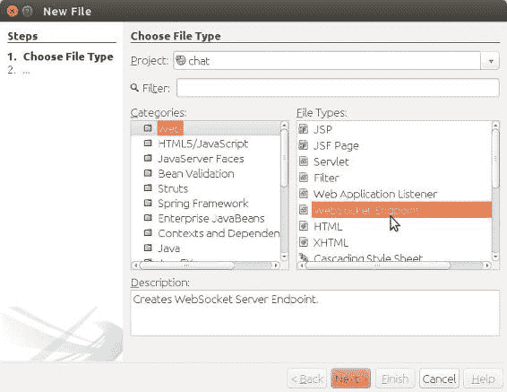
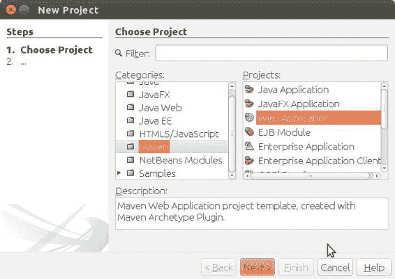
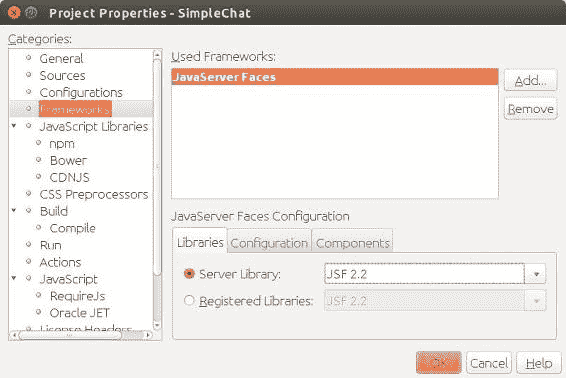

# 34. 课堂聊天（WebSocket）

Michael Müller^(1 )

(1)德国，北莱茵-威斯特法伦州，布吕尔

Alumni 是为加入一个或多个班级的校友或学生构建的。他们可以在每个班级内部进行交流。该应用支持两种不同的交流方式：消息和聊天。

使用消息功能，用户可以选择若干收件人，编写消息并发送。点击“发送”按钮后，消息会被存储到一张表中。对于每个收件人，会存储一些元数据，包括指向该消息的链接。他们可以随时登录并打开消息箱阅读消息。这种交流方式通常用于个人之间的异步通信。它通过前面章节已描述的技术实现，因此我不再深入探讨其实现细节。

另一方面，聊天则用于*同步*通信。你可以将聊天比作在房间里说话：假设没有明显的延迟且人们能够听到，那么房间里的所有人当时都能听到所说的话。我们经常使用术语*聊天室*，它是共享通信渠道的口语化同义词。当任何用户发送一条消息时，该消息会立即显示给同一聊天室中的所有用户。要实现这一点，要么客户端需要每隔几毫秒拉取一次新信息，要么服务器需要推送信息。到目前为止，我们一直使用 HTTP 概念：客户端发起通信，服务器发送响应，通信终止直到下一次请求。纯 HTTP 可用于实现这种*拉取*概念，但很容易想象这种方法会产生巨大的流量。因此，我们需要另一种技术来实现*推送*方法。

当有人进入聊天室时，能够轻松了解正在进行的讨论是件好事。Alumni 会存储最近的一些消息，并在用户进入聊天室时将其显示出来，作为一种回放。


## HTTP 协议及其替代方案

HTTP 是当前所有浏览器都支持的互联网协议之一。HTTP（超文本传输协议）是互联网浏览的标准。顾名思义，它最初是为了将文本从服务器传输到客户端而开发的。这些文本可以包含指向其他文本的超链接。HTTP 由万维网联盟（W3C）标准化，你可以在 [www.w3.org/Protocols/](http://www.w3.org/Protocols/) 了解更多信息。

HTTP 是一种无状态的请求-响应协议：客户端向服务器发送请求，服务器向客户端发送响应并终止连接。对于每个请求的资源，都需要建立一个新的连接。例如，如果一个网页包含一些文本和三张图片，那么总共需要四次请求。

由于每个请求都由客户端发起，通常无法随时将信息从服务器推送到客户端。有一些变通方法，例如*延迟应答*：服务器延迟其响应，直到某些信息可用，然后发送应答。之后，连接关闭，服务器需要一个新的请求才能*推送*更多信息。

尽管 HTTP 应用广泛，但它还有一些其他限制，因此开发了一些替代方案和扩展来克服这些限制。

HTTP/2（[`tools.ietf.org/html/rfc7540`](https://tools.ietf.org/html/rfc7540)）允许客户端更有效地请求资源，因为该协议允许在同一连接上进行多个并发交换。它允许服务器使用客户端发起的同一连接抢先推送数据块。对于一个包含三张图片的页面，服务器通过发送页面内容并推送这三张图片来响应客户端的请求。这提高了性能，但仍然不是我们实现聊天所需的功能。HTTP/2 于 2015 年由互联网工程任务组（IETF）标准化，并从版本 8（Java EE 8）开始成为 Java 企业版的一部分。

服务器发送事件（SSE）提供了一种真正将信息从服务器推送到客户端的方式。核心协议仍然是 HTTP：与普通 HTTP 一样，连接由客户端请求。服务器保持连接，并能够以所谓的*事件*形式推送信息块。

SSE 提供了真正的服务器推送，也是 Java EE 8 的一部分，但它只是单向通信，即从服务器到客户端。要使用 SSE 创建聊天，我们可以对输入字段进行 AJAX 化处理，将用户的输入发送到服务器。然后我们将此消息推送到聊天室中的所有客户端。由于 SSE 是在 JAX-RS 之上实现的，我们需要引入一些与通常的 JSF 方式略有不同的其他技术。因此，Alumni 的聊天室也没有使用 SSE。

WebSocket（[`html.spec.whatwg.org/multipage/web-sockets.html#network`](https://html.spec.whatwg.org/multipage/web-sockets.html%23network)）代表了建立服务器推送的一种不同方法。WebSocket 协议实现了两个对等点之间的真正双向通信。它于 2011 年由 IETF 标准化。与 SSE 一样，其规范是 HTML 动态标准的一部分。

这种技术似乎最适合聊天室，因此 Alumni 使用了 WebSocket 协议。WebSocket 成为 Java EE 7 的一部分，并得到 JSF 2.3 或更新版本的支持，后者是 Java EE 8 的一部分。尽管 JSF 直接支持 WebSocket 协议，但其实现更像是一种纯粹的服务器推送。为了充分利用完整的双向支持，Alumni 没有使用 JSF 对 WebSocket 的支持。我将在本书后面向你展示一种使用 JSF 的 WebSocket 功能的替代实现。

## WebSocket

从技术上讲，WebSocket 协议是作为 HTTP 请求的升级而发起的。这意味着连接需要由客户端发起。一旦在此升级请求之后建立了 WebSocket 连接，双方都作为对等点。连接变为全双工通信。每个对等点都可以随时发送数据。

双向通信并不是该协议的唯一优势。由于连接保持活动状态，因此无需为每个信息块反复发起连接。这节省了一些比特并提高了性能。

从 HTTP 到 WebSocket 的切换由 WebSocket 打开握手请求发起，该请求如清单 34-1 所示。

###### 清单 34-1 WebSocket 打开握手请求（摘录）

```
1   GET /endpoint HTTP/1.1
2   Host: mueller-bruehl.de
3   Connection: Upgrade
4   upgrade: websocket
5   ...
```

`GET /endpoint` 指向 WebSocket 服务器的一个端点。`endpoint` 不是一个固定术语，而是你想要连接的端点的名称。实现一个聊天应用程序时，它可能是 `GET /chat`。实现这样一个端点是至关重要的。

我不想深入探讨协议细节。如果你对这些细节感兴趣，我建议你阅读规范。查看我已经提到的资源，或者维基百科上的详细概述。

### 端点

首先，我将演示如何使用 NetBeans 创建一个 WebSocket 端点。首先创建一个新的 Web 项目。然后添加一个新文件（Ctrl+N）。在新建文件对话框中，选择 WebSocket 端点，如图 34-1 所示。



###### 图 34-1 新建文件向导，WebSocket 端点

点击下一步，提供类名、包名和端点名称。点击完成后，NetBeans 会为你创建一个骨架类，如清单 34-2 所示。

###### 清单 34-2 为 WebSocket 通信生成的骨架类

```
 1   package de.muellerbruehl.chat;

 3   import javax.websocket.OnMessage;
 4   import javax.websocket.server.ServerEndpoint;

 6   /**
 7    *
 8    * @author mmueller
 9    */
10   @ServerEndpoint("/chat")
11   public class Chat {

13     @OnMessage
14     public String onMessage(String message) {
15       return null;
16     }

18   }
```

当此端点在其连接上接收到数据时，会调用带有 `@OnMessage` 注解的方法。这里我们需要实现所需的行为。在描述 Alumni 的聊天室之前，我将通过一个小型示例应用程序逐步解释 WebSocket 的使用。

### 简单聊天

首先，我将描述目前我能用 JSF 和 WebSocket 编写的最简单的聊天。JSF 仅用于处理浏览器中的一些元素。在这种小型应用程序中，也可以使用纯 HTML/JavaScript 来处理，但本书是关于 Java EE 和 JSF 的，因此我们将学习如何在 Java EE 中使用 WebSocket。

本段提供了一个使用 NetBeans 的逐步教程。如果你选择的 IDE 不同，你应该能够迁移这些步骤。或者尝试一下 NetBeans。你需要安装 NetBeans Java EE（或全部）捆绑包。

从 NetBeans 菜单中，选择文件 ➤ 新建项目（或按 Shift+Ctrl+N）打开新建项目窗口。选择 Maven ➤ Web 应用程序，然后点击下一步，如图 34-2 所示。



###### 图 34-2 新建项目向导

在下一个屏幕中，提供项目名称（**SimpleChat**），在最后一个屏幕中，选择 GlassFish（如果已安装，则选择 Payara）作为应用服务器。然后完成向导。

一旦 NetBeans 为你创建了项目，右键单击项目并打开项目属性对话框。添加 JavaServer Faces 框架，如图 34-3 所示。




###### 图 34-3 项目属性

点击“配置”选项卡，输入 ***.xhtml** 作为 URL 模式。关闭“属性”对话框。

到目前为止，这与创建其他任何带有 JSF 的 Java Web 项目类似，但这次我们将为 Tyrus 服务器添加一个依赖项。Tyrus 是 WebSocket 的参考实现，包含在 GlassFish、WebLogic 以及其他一些服务器中。

打开 POM 文件，添加清单 34-3 中所示的依赖项。

###### 清单 34-3 POM 文件中的 Tyrus 依赖项

```
1   <dependency>
2     <groupId>org.glassfish.tyrus</groupId>
3     <artifactId>tyrus-server</artifactId>
4     <version>1.13</version>
5   </dependency>
```

我们将在本书后面创建一个不依赖此 Tyrus 服务器的另一个版本。使用 Tyrus 时，端点将是最简单的。

对于不使用 NetBeans 的用户，清单 34-4 显示了到目前为止创建并编辑的完整 POM 文件。

###### 清单 34-4 SimpleChat 的 POM 文件

```
1   <?xml version="1.0" encoding="UTF-8"?>
 2   <project xmlns:="http://maven.apache.org/POM/4.0.0"
 3            xmlns:xsi="http://www.w3.org/2001/XMLSchema-instance"
 4            xsi:schemaLocation="http://maven.apache.org/POM/4.0.0
 5            http://maven.apache.org/xsd/maven-4.0.0.xsd">
 6     <modelVersion>4.0.0</modelVersion>

 8     <groupId>de.muellerbruehl</groupId>
 9     <artifactId>SimpleChat</artifactId>
10     <version>1.0-SNAPSHOT</version>
11     <packaging>war</packaging>

13     <name>SimpleChat</name>

15     <properties>
16       <endorsed.dir>${project.build.directory}/endorsed</endorsed.dir>
17       <project.build.sourceEncoding>UTF-8</project.build.sourceEncoding>
18     </properties>

20     <dependencies>
21       <dependency>
22         <groupId>javax</groupId>
23         <artifactId>javaee-web-api</artifactId>
24         <version>8.0</version>
25         <scope>provided</scope>
26       </dependency>
27       <dependency>
28         <groupId>org.glassfish.tyrus</groupId>
29         <artifactId>tyrus-server</artifactId>
30         <version>1.13</version>
31       </dependency>
32     </dependencies>

34     <build>
35       <plugins>
36         <plugin>
37           <groupId>org.apache.maven.plugins</groupId>
38           <artifactId>maven-compiler-plugin</artifactId>
39           <version>3.1</version>
40           <configuration>
41             <source>1.8</source>
42             <target>1.8</target>
43             <compilerArguments>
44               <endorseddirs>${endorsed.dir}</endorseddirs>
45             </compilerArguments>
46           </configuration>
47         </plugin>
48         <plugin>
49           <groupId>org.apache.maven.plugins</groupId>
50           <artifactId>maven-war-plugin</artifactId>
51           <version>2.3</version>
52           <configuration>
53             <failOnMissingWebXml>false</failOnMissingWebXml>
54           </configuration>                                                                
55         </plugin>
56         <plugin>
57           <groupId>org.apache.maven.plugins</groupId>
58           <artifactId>maven-dependency-plugin</artifactId>
59           <version>2.6</version>
60           <executions>
61             <execution>
62               <phase>validate</phase>
63               <goals>
64                 <goal>copy</goal>
65               </goals>
66               <configuration>
67                 <outputDirectory>${endorsed.dir}</outputDirectory>
68                 <silent>true</silent>
69                 <artifactItems>
70                   <artifactItem>
71                     <groupId>javax</groupId>
72                     <artifactId>javaee-endorsed-api</artifactId>
73                     <version>8.0</version>
74                     <type>jar</type>
75                   </artifactItem>
76                 </artifactItems>
77               </configuration>
78             </execution>
79           </executions>
80         </plugin>
81       </plugins>
82     </build>

84   </project> 
```

下一步是创建一个服务器端点，如前所述。名称选择 SimpleChat，并为包提供相同的名称。端点 URI 将是 simplechat。

接下来，修改 onMessage 方法，如清单 34-5 所示。

###### 清单 34-5 用于广播消息的 onMessage 方法

```
1   @OnMessage
2   public void onMessage(String message, Session session) {
3     ((TyrusSession) session).broadcast(message);
4   }
```

现在修复导入（Ctrl+Shift+I）。

每当我们的端点收到消息时，都会调用此方法。它所做的就是将这条消息广播给所有已打开与此端点 WebSocket 连接的客户端。虽然看起来是广播，但在底层，服务器处理的是单个连接。我们将在不使用 Tyrus 的版本中自行处理这个问题。

接下来，修改 index.xhtml 页面，如清单 34-6 所示。

###### 清单 34-6 SimpleChat 页面（index.xhtml）

```
 1   <?xml version='1.0' encoding='UTF-8' ?>
 2   <!DOCTYPE html PUBLIC "-//W3C//DTD XHTML 1.0 Transitional//EN"
 3     "http://www.w3.org/TR/xhtml1/DTD/xhtml1-transitional.dtd">
 4   <html xmlns:="http://www.w3.org/1999/xhtml"
 5         xmlns:h="http://xmlns.jcp.org/jsf/html">
 6     <h:head>
 7       <title>聊天</title>
 8       <h:outputScript name="simpleChat.js"/>
 9     </h:head>
10     <h:body>

12       <h1>简单聊天</h1>
13       <h:form prependId="false">

15         <div>
16           输入消息：
17           <h:inputTextarea style="height: 1em;"
18               onkeypress="if (event.keyCode === 13) {
19                 acceptValue(this);
20               }"
21           />
22         </div>
23         <h:inputTextarea id="messages"
24            style="width: 100%;
25            min-height: 10em;"/>
26         </h:form>
27       </h:body>
28   </html>
```

此页面定义了两个文本区域。一个只是简单的单行输入字段。我选择文本区域而不是简单的文本字段，是为了在按下回车键时能停留在该字段内。正如你在第 18 行所见，按下回车键时会触发某些操作（调用 acceptValue）。

第二个文本区域用于公共输出。这里我们将显示聊天中所有用户的消息。我们需要的粘合代码包含在一个 JavaScript 文件 simpleChat.js 中。

在项目的 Web Pages 文件夹中，创建一个新文件夹 resources，然后在该文件夹中创建文件 simpleChat.js。JSF 将根据我们页面中的 outputScript 标签加载此文件。

将以下内容添加到脚本文件中，如清单 34-7 所示。


###### 清单 34-7 SimpleChat 的 JavaScript 部分

```
 1   var websocket;

 3   window.onload = function () {
 4     invokeConnection();
 5   }

 7   function invokeConnection() {
 8     websocket = new WebSocket(obtainUri());
 9     websocket.onerror = function (evt) {
10       onError(evt)
11     };
12     websocket.onmessage = function (evt) {
13       onMessage(evt)
14     };
15     return true;
16   }

18   function obtainUri() {
19     return "ws://" + document.location.host + "/SimpleChat/simplechat";
20   }

22   function onError(evt) {
23     writeToScreen('<span style="color: red;">ERROR:</span> ' + evt.data);
24   }

27   function onMessage(evt) {
28     element = document.getElementById("messages");
29     if (element.value.length === 0) {
30       element.value = evt.data;
31     } else {
32       oldTexts = element.value.split("\n").slice(-19);
33       element.value = oldTexts.join("\n") + evt.data;
34       element.scrollTop = element.scrollHeight;
35     }
36     return;                                                                
37   }

39   function acceptValue(element) {
40     websocket.send(element.value);
41     element.value = "";
42     return true;
43   }
```

现在我们的简易聊天应用已经准备就绪。编译并启动应用程序。输入一些文本并按回车键：文本会出现在输出区域。在第二个浏览器中打开该应用并输入更多文本：这些文本会出现在所有浏览器的输出字段中。

我们来谈谈这是如何工作的。当页面加载时，会调用 `invokeConnection` 方法。该方法会建立一个到服务器的 WebSocket 通信通道，并注册两个方法。`onMessage` 用于处理常规消息，`onError` 用于处理错误。每当客户端收到来自服务器的消息（通过广播发送）时，它会获取用于输出的文本区域，并将消息追加进去。如果达到某个最大值，它会组合最后几条消息的输出。

每当用户在输入字段中按下回车键时，会调用 `acceptValue` 方法。消息被发送到服务器，输入字段被清空以接受新值。

到目前为止，我们使用自 Java EE 7 以来就有的技术创建了一个非常简单的聊天应用。Java EE 8 为 JSF 添加了 WebSocket，我将在本章末尾讨论这一点。在简易聊天的第一个版本中，任何消息都由一个 Tyrus 会话广播。接下来，我将展示如何自行处理广播。你会意识到这实际上并不是广播：正如我所说，WebSocket 是两个对等端之间的全双工通信协议。为了模拟广播，服务器需要将消息发送给每个对等端。

每次在浏览器中打开 URL 时，都会创建我们服务器端点的一个实例。如果你停留在该页面上，可以重用现有的端点。如果你想验证这一行为，只需添加一个默认构造函数并报告构造过程，如清单 34-8 所示。

###### 清单 34-8 通过简短的构造函数消息观察对象创建

```
1   public SimpleChat() {
2     System.out.println("ctor SimpleChat");
3   }
```

使用 Glassfish/Payara 时，输出会被记录。你也可以改用日志记录器。使用 NetBeans 时，你可以直接在 IDE 的输出窗口中观察此日志。

每个用户都会创建该类的一个实例。每个对象都与一个客户端相关联。因此，如果我们想向所有客户端广播一条消息，那么每个端点都需要知道其他端点的存在。为此，每个想要参与聊天的对等端会话都需要在一个公共位置注册自己。执行此任务的最简单方法是使用一个静态的对等端会话集合，如清单 34-9 所示。

###### 清单 34-9 用于保存所有会话的 HashSet

```
1   private static final Set<Session> peers =
2         Collections.synchronizedSet(new HashSet<Session>());
```

在会话的开始和结束时，有一个我们可以观察到的事件。为了将一个方法连接到这些事件之一，我们需要用 `@OnOpen` 或 `@OnClose` 注解一个方法。这些方法需要接受一个会话参数，这意味着这些方法是注册和注销对等端会话的完美候选。参见清单 34-10。

###### 清单 34-10 注册/注销对等端的方法

```
1   @OnOpen
2   public void onOpen(Session peer) {
3     peers.add(peer);
4   }

6   @OnClose
7   public void onClose(Session peer) {
8     peers.remove(peer);
9   }
```

一旦我们注册了所有对等端，我们只需要在 `@OnMessage` 期间遍历它们，并将消息发送给每个对等端。为此，我们使用 `getBasicRemote()` 来获取对远程端点的引用，以便同步发送数据，如清单 34-11 所示。还有第二种方法 `getAsyncRemote()`，可用于异步发送数据。

###### 清单 34-11 通过向每个对等端发送消息来实现广播

```
 1   @OnMessage
 2   public void onMessage(String message) {
 3     for (Session peer : peers) {
 4       try {
 5         peer.getBasicRemote().sendObject(message);
 6       } catch (IOException | EncodeException ex) {
 7         // 在此处记录、处理或忽略异常
 8       }
 9     }
10   }
```

你可能已经注意到 `onMessage()` 方法的不同签名。我们不需要会话参数，因此可以使用不带该参数的重载方法签名。

为了方便起见，清单 34-12 显示了完整的端点类（不含导入语句）。

###### 清单 34-12 完整的 SimpleChat（省略导入语句）

```
1   @ServerEndpoint("/simplechat")
 2   public class SimpleChat {

 4     private static final Set<Session> peers =
 5           Collections.synchronizedSet(new HashSet<Session>());

 7     @OnMessage
 8     public void onMessage(String message) {
 9       for (Session peer : peers) {
10         try {
11           peer.getBasicRemote().sendObject(message);
12         } catch (IOException | EncodeException ex) {
13           // 在此处记录、处理或忽略异常
14         }
15       }
16     }

18     @OnOpen
19     public void onOpen(Session peer) {
20       peers.add(peer);
21     }

23     @OnClose
24     public void onClose(Session peer) {
25       peers.remove(peer);
26     }
27   } 
```

## 教室聊天

让我们回到 Alumni 应用。我们希望在每条消息前加上发送该消息的用户，并且需要为不同的班级处理不同的聊天室。

学生会长大并成为大学生。他们可能会改变居住地、学校和大学。总而言之，随着时间的推移，一个人可能属于不同的班级，由最终班级标识。一旦用户登录，他们可以选择一个班级并进入专用的虚拟教室。在每个教室中，Alumni 提供一个黑板、一个活动日历和一个聊天功能。

我们不想为每个班级实现一个单独的端点。相反，我们希望使用单个端点，并通过最终班级来区分聊天。

一种解决方案是在端点 URI 中提供教室信息。假设教室由一个名称标识。代码可能类似于清单 34-13 中的摘录。


###### 清单 34-13 通过端点 URI 传递参数

```
 1   @ServerEndpoint("/classroomchat/{classroom}")
 2   public class ClassroomChat {

 4     @OnOpen
 5     public void onOpen(Session peer) {
 6       String classroom = peer.getRequestParameterMap().get("classroom").get(0);
 7       [...]
 8     }

10     [...]

12   }
```

这是 Java EE 通过 JAX-RS（Java API for RESTful Web Services）所支持的一种风格：URI 的部分内容是可变的，并且可以通过请求参数映射进行访问，如 `onOpen` 方法所示。非常简单，不是吗？

WebSocket 连接是客户端和服务器之间的一个通道。作为 HTTP 的升级，第一个请求由客户端发起。如果用户伪造 URI 并选择了一个不同的教室，会发生什么？而且我们希望在每条消息中包含用户信息。你希望有人冒充用户吗？无论如何，这里展示的方法确实很简单，但在安全方面可能无法满足我们的要求。为什么服务器已经知道的信息还要由客户端提供呢？

基于这些考虑，Alumni 采用了不同的方法。用户和教室在服务器端是已知的，因此它们会被注入到端点中。

一旦用户登录到 Alumni，我们就会将会话范围内的对象中的一些信息存储起来，如清单 34-14 所示。这里，用户账户和当前选定的毕业班是值得注意的。

###### 清单 34-14 用于保存用户信息的会话范围对象

```
1   @SessionScoped
2   public class UserController implements Serializable {

4     private Account _account;
5     private FinalYear _finalYear;

7     [为简洁起见，省略了 Getter/Setter 和其他字段]
8   }
```

我们将把这个类的一个实例注入到聊天端点中。通过账户可以访问用户的姓名。

###### 通过 CDI 进行注入

记住 CDI 的一些特性：你可以独立于 bean 的生命周期来注入它。例如，你可以将一个请求范围的 bean 注入到一个会话范围的 bean 中。尽管会话范围的 bean 通常存活时间超过一个请求，但被注入的 bean 仅在一个请求期间存活。然而，你可以在持有对象的生命周期内访问被注入的 bean。这难道不矛盾吗？

CDI 通过注入一个代理对象来实现这个技巧。这个代理在包含它的 bean 的整个生命周期内都是可用的。在底层，这个代理在每个请求中指向一个不同的对象。

现在，如果我们尝试为来自用户的每条消息添加前缀，比如 `sendObject(_userController.GetAccount().getDisplayName()+ ": " + message)`，我们会遇到一个错误：尽管已经注入，`_userController` 解析为 `null`。

原因很简单：端点将在 HTTP 请求中创建，即当用户进入教室时。注入的用户控制器包含我们期望的所有值。CDI 实际上并没有注入 `UserController` 类的一个实例，而是注入了一个指向当前请求的活动用户控制器对象的代理。WebSocket 通道是通过 HTTP 升级打开的。发起请求正常终止，而通道保持打开状态。现在，如果用户输入一条消息，它会通过 WebSocket 通道发送。由于此时没有 HTTP 请求，即使用户控制器是会话范围的，CDI 代理也无法引用任何 bean。因此，代理解析为 `null`。

尽管用户控制器是作为代理注入的，但它包含“真正的”对象。Alumni 只是将这些对象存储在端点中，瞧，我们就可以使用它们了。除了包和导入语句，清单 34-15 展示了完整的端点类：

###### 清单 34-15 Alumni 的教室聊天

```
 1   @ServerEndpoint("/classroomchat")
 2   public class ClassroomChat {

 4       private static final Map<Integer, Set<Session>> PEERS = new ConcurrentHa\
 5   shMap<>();
 6       private static final Logger LOGGER = Logger.getLogger(ClassroomChat.clas\
 7   s.getName());

 9       private ChatService _chatService;
10       private Account _account;
11       private int _finalYearId;

13       @Inject
14       public ClassroomChat(UserController user, ChatService chatService){
15           _account = user.getAccount();
16           _finalYearId = user.getFinalYear().getId();
17           _chatService = chatService;
18       }

20       public ClassroomChat() {
21           LOGGER.log(Level.INFO, "ctor ClassroomChat");
22       }

24       @OnMessage
25       public void onMessage(String message, Session session) {
26           //String name = session.getUserPrincipal().getName();
27           for (Session peer : PEERS.get(_finalYearId)) {
28               try {
29                   peer.getBasicRemote().sendObject(_account.getDisplayName() +\
30   ": " + message);
31               } catch (IOException | EncodeException ex) {
32                   // 如果发生错误，记录问题并继续
33                   LOGGER.log(Level.SEVERE, null, ex);
34               }
35           }
36       }

38       @OnOpen
39       public void onOpen(Session peer) {
40           LOGGER.log(Level.INFO, "onOpen ClassroomChat, user {0}",
41                                _account.getDisplayName());
42           if (!PEERS.containsKey(_finalYearId)){
43             PEERS.put(_finalYearId,
44                              Collections.synchronizedSet(new HashSet<>()));
45           }
46           PEERS.get(_finalYearId).add(peer);
47           sendLatestMessages(peer);
48       }

50       private void sendLatestMessages(Session peer) {
51           List<String> messages = _chatService.getLatestMessages(_finalYearId);
52           for (String message : messages) {
53               try {
54                   peer.getBasicRemote().sendObject(message);                                                          
55               } catch (IOException | EncodeException ex) {
56                   // 如果发生错误，记录问题并继续
57                   LOGGER.log(Level.SEVERE, null, ex);
58               }

60           }
61       }

63       @OnClose
64       public void onClose(Session peer) {
65           LOGGER.log(Level.INFO, "onClose ClassroomChat, user {0}",
66                                 _account.getDisplayName());
67           PEERS.get(_finalYearId).remove(peer);
68       }

70   }
```

在第 13 和 14 行，我们存储了对用户和毕业班的引用，这些引用是作为 `userController` 的一部分注入的。除了 `UserController` 的一个实例外，还注入了 `ChatService` 的一个实例。与用户控制器不同，这个代理直接存储在一个字段中（第 15 行）。我们是否会遇到前面描述的代理问题？顾问的标准答案会是：“这取决于……”

如果我们将 `ChatService` 定义为一个短（请求）范围的 CDI bean，如清单 34-16 所示，我们会遇到 `ContextNotActiveException` 异常。

###### 清单 34-16 作为请求范围 CDI Bean 的 ChatService

```
1   @RequestScoped
2   @Transactional
3   public class ChatService extends AbstractService {
4   ...
5   }
```

将范围扩展到会话范围并不能解决这个问题：这样的范围存储在请求的会话映射中，而可能没有请求存在。

有两种可能的解决方案。你可以将服务定义在应用程序范围内。或者，如果你不想使用生命周期如此长的全局对象，你可以使用无状态 EJB，如清单 34-17 所示。


###### 清单 34-17 将 ChatService 作为无状态 EJB

```
1   @Stateless
2   public class ChatService extends AbstractService {
3   ...
4   }
```

与简单聊天相比，这里有三个扩展点：Alumni 使用一个映射来保存每个教室的对等节点。每条消息都以用户名作为前缀。最后但同样重要的是，所有消息都保存到数据库中，这样我们进入教室时就能回复最新的消息。

清单 34-18 展示了服务中的相应部分。

###### 清单 34-18 ChatService（节选）

```
 1   @Stateless
 2   public class ChatService extends AbstractService {

 4     public ChatEntry saveChatEntry(ChatEntry chatEntry) {
 5       return save(chatEntry);
 6     }

 8     public ChatEntry saveChatEntry(int finalClassId, int accountId, String mes\
 9   sage) {
10       ChatEntry chatEntry = new ChatEntry(finalClassId, accountId, message);
11       return save(chatEntry);
12     }

14     /**
15      * 检索最近 10 条不超过 2 小时的消息
16      *
17      * @param finalYearId
18      * @return
19      */
20     public List<String> getLatestMessages(int finalYearId) {
21       String jpql = "Select concat(a._firstName, ' ', a._lastName, ': ', e._me\
22   ssage) "
23               + "from ChatEntry e "
24               + "join Account a "
25               + "where e._accountId = a._id "
26               + "and e._finalYearId = :finalYearId "
27               + "and e._moment > :refMoment order by e._id desc";
28       TypedQuery<String> query = getEntityManager().createQuery(jpql, String.c\
29   lass);                                                          
30       query.setParameter("finalYearId", finalYearId);
31       query.setMaxResults(10);
32       Date refMoment = new Date(new Date().getTime() - 2 * 3600 * 1000);
33       query.setParameter("refMoment", refMoment);
34       List<String> messages = query.getResultList();
35       return Lists.reverse(messages);
36     }

38   }
```

## JSF 2.3 websocket

JSF 2.3 的亮点之一，正如 Java EE 8 所引入的，是其对 WebSocket 协议的支持。以前，由于 HTTP 协议的限制，JSF 仅使用从客户端到服务器的单向通信。多年来，在没有任何客户端请求的情况下将数据从服务器发送到客户端一直是一个挑战。WebSocket 协议是解决这一限制的方案之一。当 `<f:websocket>` 标签被引入 JSF 2.3 时，其主要意图是将消息从服务器推送到客户端。目前，这个标签并未启用这种双向协议的全部优势。相反，它建立了从服务器到客户端的单向通信。如果我们只需要使用 JSF 功能进行双向通信，我们可以通过使用 inputText 结合 Ajax 的传统方式将数据从客户端发送到服务器。我们将通过 websocket 接收数据。由于这种变通方法仅模拟了使用不同协议的双向通信，Alumni 的聊天并未使用新的 JSF websocket。为了向您介绍这个新标签的原理，清单 34-19 从页面开始。

###### 清单 34-19 在页面中使用 websocket

```
 1        <f:websocket channel="events" onmessage="eventListener" />

 3        <script type="text/javascript">
 4          function eventListener(message, channel, event) {
 5            document.getElementById("lastEvent").innerHTML += message + "<br/>";
 6          }
 7        </script>                                                          

 9        <h:outputLabel value="Last event:"/>
10       <h:outputText id="lastEvent" value=""/>
```

在第 1 行，websocket 标签订阅了通道 events。此名称必须与您在服务器端使用的通道名称一致。它可以是您选择的任何有效名称。`onmessage` 属性引用了一个您需要为实现数据处理而编写的 JavaScript 函数。在这个简单的演示代码中，我们使用消息来替换我们在第 10 行声明的 `outputText` 的内容。

在服务器端，我们需要一个 `PushContext`，它可以直接被注入（参见清单 34-20 的第 5 行）。这里我们需要提供通道名称。现在我们可以通过这个通道向客户端发送消息（第 8-10 行）。

###### 清单 34-20 作为 websocket 源的 PushContext

```
 1  @Named
 2  @ApplicationScoped
 3  public class EventPatcher {

 5    @Inject @Push(channel = "events")
 6    private PushContext _pushContext;

 8    public void sendMessage(String message){
 9      _pushContext.send(message);
10   }

12 }
```

当第一个客户端使用此通道时，WebSocket 通信将被建立。发送消息就像广播一样。所有订阅了此通道的客户端都将收到该消息。通道会在应用程序关闭时自动关闭，因此 `PushContext` 需要被注入到一个应用程序作用域的 bean 中。

最后但同样重要的是，您需要通过 `web.xml` 启用 WebSocket 端点。

###### 清单 34-21 作为 web.xml 一部分的上下文参数

```
 1   <context-param>
 2     <param-name>javax.faces.ENABLE_WEBSOCKET_ENDPOINT</param-name>
 3     <param-value>true</param-value>
 4   </context-param>
```

向所有用户推送一些内容是最常见的操作领域。因此，应用程序作用域是在 JSF 中使用 websocket 的默认作用域。无论如何，您可以将通道限制为会话或视图。或者，您可以将其限制为特定用户，这也会强制使用会话作用域。（更多信息，请阅读 [`javaserverfaces.github.io/docs/2.3/vdldoc/f/websocket.html`](https://javaserverfaces.github.io/docs/2.3/vdldoc/f/websocket.html) 的 API 文档）。

如果您想实现一个新闻滚动条或类似功能，JSF websocket 标签非常棒。Alumni 没有这样的需求。请将此处给出的解释作为您自己实验的起点。

## 总结

本章介绍了 WebSocket 协议的主要方面及其在 Alumni 中的使用。Alumni 的这个聊天实现适用于 Java EE 8，但它仅使用了早期 Java EE 7 实现中可用的技术。

作为 Java EE 8 一部分的 JSF 2.3 现在直接支持 WebSocket 协议，但 Alumni 并未使用它。当前 JSF WebSocket 实现的主要意图是将消息从服务器推送到客户端。这增加了从服务器到客户端的单向通信。另一方面，Alumni 使用双向通信。

© Michael Müller 2018

Michael Müller, Practical JSF in Java EE 8 , `doi.org/10.1007/978-1-4842-3030-5_35`

