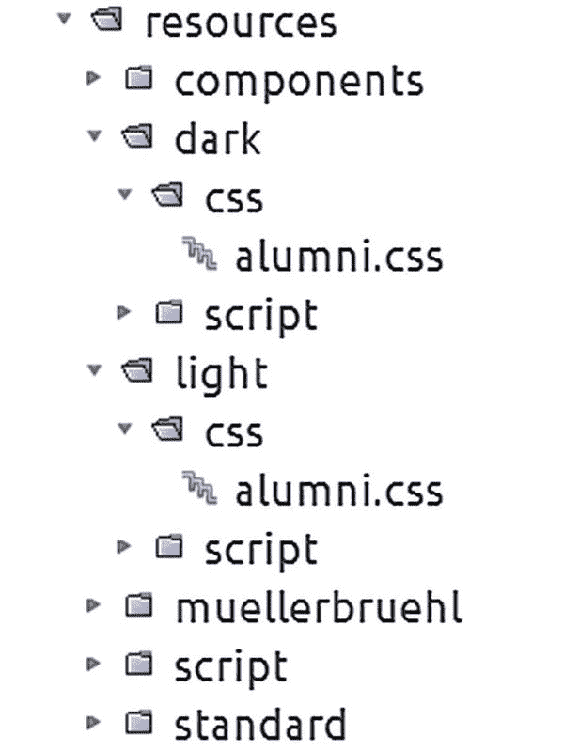

# 35. 更改外观与感觉

Michael Müller^(1 )

(1)德国，北莱茵-威斯特法伦州，布吕尔

有时用户喜欢更换应用程序的外观与感觉，例如通过选择不同的主题。问题来了，我们如何在不更改程序代码的情况下更改应用程序的外观与感觉？如果我们使用 CSS 将内容与布局分离，那么选择不同的 CSS 文件似乎就很简单了。

## 资源库

在实践中，布局可能不仅依赖于单个 CSS 文件，还依赖于多个 CSS 文件以及相关的脚本文件或其他资源。让我们回顾一下第 10 章：JSF 能够将一组资源分组到一个库中。实际上，这样的库由一个文件夹的内容表示。如果我们为每个库使用相同的目录结构，我们就不需要为所有资源文件提供不同的名称，只需要提供库名称即可。

在 Facelet 模板 `alumniTemplate.xhtml` 中，我们将从后台 bean 中获取适当的库，如清单 35-1 所示。


###### 清单 35-1 从后台 Bean 获取库

```
01     <h:outputStylesheet library="#{sessionTools.theme}" name="css/alumni.css"/>
02     <h:outputScript library="#{sessionTools.theme}" name="script/alumni.js"/>
```

该后台 Bean 用于在会话持续期间保存用户特定信息，因此它是会话作用域的。请参见清单 35-2。

###### 清单 35-2 SessionTools

```
01   @Named
02   @SessionScoped
03   public class SessionTools implements Serializable {

05     private String _theme = "standard";

07     public String getTheme() {
08       return _theme;
09     }

11     public void setTheme(String theme) {
12       _theme = theme;
13     }

15     ...

17   }
```

当用户登录时，我们需要从相应的用户配置中读取主题，并在后台 Bean 中设置该主题。仅此而已。

## 立即更改外观

我们可能希望让用户能够立即更改外观，而不是在配置对话框中询问用户。作为初步方法，我们将在屏幕上呈现两个按钮，分别代表两种不同的主题。如果用户点击某个按钮，我们希望外观能立即改变。

解决方案也非常简单。我们只需要设置主题，然后重新加载页面即可。如果 commandLink 或 commandButton 的操作返回空字符串或空值（null 或 void），那么 JSF 会重新加载同一页面。为了执行此任务，我们将主题的设置器用作链接的操作。请参见清单 35-3。

###### 清单 35-3 切换主题的按钮

```
01    <h:commandLink styleClass="button"
02                           immediate="true"
03                           value="standard"
04                           action="#{sessionTools.setTheme('standard')}"/>
05    <h:commandLink styleClass="button"
06                           immediate="true"
07                           value="muellerbruehl"
08                           action="#{sessionTools.setTheme('muellerbruehl')}"/>
```

## 从资源中读取

随着主题数量的增加，按钮数量也会增加，这会使页面变得丑陋。通过菜单可以实现更优雅的解决方案，用户可以从多个条目中选择一个。而且，如果我们添加一个主题，系统应该能自动识别它。为此，我们需要检查资源。为简单起见，我们假设资源目录中每个包含 CSS 文件的文件夹都是一个资源库。我们将忽略该文件夹下可能存在的版本。

方法 getThemes 返回一个字符串列表，其中包含我们找到的所有库文件夹，如清单 35-4 所示。

###### 清单 35-4 从资源中检索主题

```
01     public List<String> getThemes() throws IOException {
02       String resourcePath = obtainResourcePath();
03       List<String> themes = obtainThemes(resourcePath);
04       return themes;
05     }

07     private String obtainResourcePath() {
08       ServletContext context = (ServletContext) FacesContext
09               .getCurrentInstance()
10               .getExternalContext()
11               .getContext();
12       return context.getRealPath("/resources");
13     }

15     private List<String> obtainThemes(String resourcePath){
16       List<String> themes = new ArrayList<>();
17       for (File file : new File(resourcePath).listFiles()) {
18         addFilenameIfContainsCss(file, themes);
19       }
20       return themes;
21     }

23     private void addFilenameIfContainsCss(File file, List<String> themes) {
24       if (!file.isDirectory()) {
25         return;
26       }
27       try (Stream<Path> paths = Files.walk(Paths.get(file.getAbsolutePath()))) {
28         boolean conatinsCss = paths
29                 .filter(Files::isRegularFile)
30                 .anyMatch(f -> f.toString().toLowerCase().endsWith(".css"));
31         if (conatinsCss) {
32           themes.add(file.getName());
33         }
34       } catch (IOException ex) {
35         LOGGER.log(Level.SEVERE, null, ex);
36       }
37     } 
```

图 35-1 展示了项目树的一个片段。你会为每个主题找到一个文件 alumni.css（muellerbruehl 和 standard 也是主题，但此处树已折叠）。



###### 图 35-1 不同主题的资源文件

由于我们不知道应用程序部署后的具体位置，因此需要找出正确的路径。资源位于 \resources 路径下。虽然从应用程序的角度看，它看起来像绝对路径，但实际上它是一个相对路径。我们需要找出它的父路径。

清单 35-4 中值得关注的部分是 obtainResourcePath 方法（第 7–13 行）。在这里，我们将检索 ServletContext。我们可以用它来确定一个真实路径。在许多情况下，都需要搜索资源。

在另一个项目中，我需要创建报告。我没有从头开始创建报告文件，而是添加了在运行时完成的模板文件。我将这些文件部署在 resources 文件夹中，并使用此处讨论的相同逻辑来检索文件的位置。

清单 35-4 的其余部分是简单的 Java 代码，用于在此路径中搜索 CSS 文件。如果你不熟悉流，请允许我推荐我的书 *Java Lambdas and Parallel Streams*（Apress，2016）作为很好的信息来源。

一旦我们确定了主题，就需要在 selectOneMenu 中将其呈现给用户，如清单 35-5 所示。

###### 清单 35-5 选择主题（不完整）

```
01  <h:form id="theme">
02    <h:selectOneMenu value="#{sessionTools.theme}">
03      <f:selectItems value="#{sessionTools.themes}"/>
04      <f:ajax/>
05    </h:selectOneMenu>
06  </h:form>
```

上述清单使用了我们之前创建的 getter/setter 对。如果用户选择了一个主题，它将在后台 Bean 中立即更新。在下次导航期间，JSF 将应用新主题。

但是，我们如何立即应用主题呢？好吧，我们可以添加信息来渲染所有内容：<f:ajax render="@all"/>。

现在，当用户选择不同的主题时，布局似乎会改变。但这并不是预期的布局。只有重新加载页面后，才会显示预期的布局。似乎 @all 并没有真正加载我们需要的所有内容。

如果我们应用一个监听器方法并添加程序化导航，如清单 35-6 所示，会怎么样？

###### 清单 35-6 程序化导航

```
01  public void themeChangeListener(AjaxBehaviorEvent event) {
02    FacesContext facesContext = FacesContext.getCurrentInstance();
03    NavigationHandler navigationHandler = facesContext
04            .getApplication()
05            .getNavigationHandler();
06    navigationHandler.handleNavigation(facesContext, null, "");
07  }
```

在第 6 行，第三个参数表示目标页面。我们将其留空以重新加载当前页面。

不要尝试这样做。你可能会在请求时使用这样的片段进行导航，但不能在部分请求期间使用。*部分*请求仅查询一些信息来更新当前页面。

selectOneMenu 并非旨在触发任何导航。一些额外的库——例如，PrimeFaces（[www.primefaces.org](http://www.primefaces.org)）——包含针对此用例的扩展。但是，这个问题可能有一个简单的解决方案：当用户选择了新主题时，我们需要通过点击 commandLink 来触发页面导航。我们使用一个不可见的链接和一些 JavaScript 魔法来执行此任务，如清单 35-7 所示。


###### 清单 35-7 选择主题，欺骗导航

```
01  <h:form id="theme">
02    <h:selectOneMenu value="#{sessionTools.theme}"
03         onchange="document.getElementById('theme:refresh').click();">
04      <f:selectItems value="#{sessionTools.themes}"/>
05      <f:ajax/>
06    </h:selectOneMenu>

08    <h:commandLink id="refresh" immediate="true"/>
09  </h:form>
```

在第 3 行，我们定义了一些在点击事件期间被处理的代码。它简单地搜索不可见的链接并对其执行点击操作。

但是，当用户点击链接时，JSF 是如何执行页面导航的呢？惊喜——在底层它也使用了 JavaScript！如果我们使用相同的功能，我们实际上就为菜单添加了导航能力。请参见清单 35-8 以及图 35-2 和图 35-3。

###### 清单 35-8 选择主题（最终版）

```
01  <h:form id="theme">
02    <h:selectOneMenu value="#{sessionTools.theme}"
03                         onchange="mojarra.jsfcljs(document.getElementById('theme'),
04                          {'theme':'theme'},'');return false;">
05      <f:selectItems value="#{sessionTools.themes}"/>
06      <f:ajax />
07    </h:selectOneMenu>
08  </h:form>
```


###### 图 35-2 muellerbruehl 主题示例


###### 图 35-3 深色主题示例

图 35-2 和 35-3 展示了两种不同的主题。在左上角，您可以看到一个下拉菜单框，它允许用户更改菜单。这两张图都显示的是德语版本（您自己就能看出来，对吧？）。

## 总结

更改应用程序的外观和感觉就像更改资源库一样简单。为了立即应用这种更改，我们需要稍微欺骗一下系统。本章还向您展示了如何在运行时在应用服务器文件系统中查找文件。最后但同样重要的是，它演示了 JSF 如何将导航能力分配给 HTML 元素。

© Michael Müller 2018

Michael Müller, Practical JSF in Java EE 8 , `doi.org/10.1007/978-1-4842-3030-5_36`

