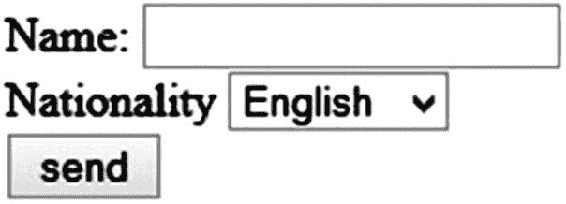
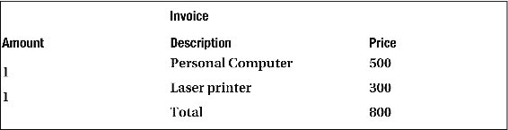

# 附录 A：HTML

超文本标记语言用于描述网页的内容。与 XML 一样，HTML 是标准通用标记语言（SGML）的成员。

我假设您至少具备 XML 的基础知识。因此，本书不会详细讨论如何构建 XML 文档。HTML 文档必须考虑类似的规则，但有时不那么严格。与您可以定义自己的标签的 XML 不同，HTML 附带了一组预定义的标签。以下各节将简要描述最常见的标签。

### HTML 结构

一个 HTML 文档以文档类型声明开始，后跟一个 < html > 标签，该标签类似于 XML 文档的文档根节点。在其中，可能包含用于头部和主体的标签。对于 XHTML（即使用严格的 XML 规则构建的 HTML），文档类型声明之前是 XML 版本声明。

这个基本结构如清单 A-1 所示。


###### 清单 A-1 基本 HTML 文件

```
 1                       <?xml version='1.0' encoding='UTF-8' ?>                  
                     2                       <!DOCTYPE html>                  
                     3   <                    html                    >                  
                     4       <                    head                    >                  
                     5                               <!-- header content -->                  
                     6       </                    head                    >                  
                     7       <                    body                    >                  
                     8                               <!-- body content -->                  
                     9       </                    body                    >                  
                    10   </                    html                    > 
```

从 HTML5 开始，文档类型声明仅仅是简单的 <!DOCTYPE html>，当今所有主流浏览器都支持它。在较旧的 HTML 版本中，存在不同的文档类型声明，使用严格模式、过渡模式或框架集模式，例如 <!DOCTYPE HTML PUBLIC "-//W3C//DTD HTML 4.01 Transitional//EN">。

### HTML 头部

| 标签名 | 描述 |
| --- | --- |
| base | 本页面的基础地址（URI）。相对路径会以此为基础。这会将所有路径绑定到一个特定的 URI。如果你希望保持页面的可移植性，请不要使用此标签。 |
| link | 描述当前文档与其他文档的关系。用于指向应与页面一起加载的文件，例如 CSS 文件。 |
| meta | 当前文档的元信息，通常包括作者、关键词（用于搜索引擎）、转发信息等。 |
| style | 内部层叠样式表。如果与外部样式表一起使用，它将覆盖为相同路径定义的样式。 |
| title | 本页面的标题。大多数浏览器会将其显示在标题栏或标签页控件中。 |

### HTML 主体

对于主体部分，定义了更多的标签。相关的标签被分组在一起。这些表格仅列出常用元素。

#### 页面与文本结构、链接

| 标签名 | 描述 |
| --- | --- |
| h1 | 一级标题的语义装饰。没有任何样式时，它会以更大的字号显示。因此，HTML 不仅仅赋予语义含义。较低级别的标题范围从 h2 到 h6。 |
| div | 用于将文本划分为多个部分，是一个用于容纳其他元素的容器元素。仅在没有其他具有更具体语义含义的标签可用时才应使用它。 |
| p | 表示一个段落，用于将较长的文本拆分为单个段落。开发 Web 应用程序时，通常不会有那么多文本。 |
| hr | 水平标尺，用于主题分隔。除非被 CSS 覆盖，否则它会绘制一条水平线。 |
| ol | 有序列表，列表项的容器。除非被 CSS 覆盖，否则包含的项会编号显示。 |
| ul | 无序列表，列表项的容器。除非被 CSS 覆盖，否则包含的项会以项目符号显示。 |
| li | 列表项。 |
| a | 锚点，定义一个超链接。 |

其他语义结构标签包括 nav（导航）、aside、main、section、article、footer、address 等。

#### 表单与输入

| 标签名 | 描述 |
| --- | --- |
| form | 定义一个 HTML 表单，作为输入元素、按钮等的容器。表单值可以通过适当的元素提交。 |
| input | 一个通用的输入元素。属性 type="..." 指定此元素的特性，例如 text（文本字段）、radio（单选按钮）、checkbox（复选框）、submit（提交按钮）。 |
| textarea | 一个多行文本字段。 |
| button | 一个可点击的按钮。此元素可以比 input type="submit" 更灵活地定义。缺点是它不提交任何值。因此，需要一个脚本处理程序来执行操作。 |
| select | 一个可选择的列表。可以配置为单选或多选。 |
| label | 定义一个标签，可以分配给一个输入元素。 |

清单 A-2 中的 HTML 页面展示了一个简单的表单。

###### 清单 A-2 包含表单的 HTML 页面

```
 1                         <?xml version='1.0' encoding='UTF-8' ?>                    
                       2                         <!DOCTYPE html>                    
                       3   <                      html                      >                    
                       4       <                      head                      >                    
                       5           <                      title                      >form demo</                      title                      >                    
                       6       </                      head                      >                    
                       7       <                      body                      >                    
                       8           <                      form                      >                    
                       9               <                      label                      for="txtName">Name:</                      label                      >                    
                      10               <                      input                      type="text" id="txtName"/>                    
                      11               <                      br                      />                    
12               Nationality
                      13               <                      select                      >                    
                      14                   <                      option                      >English</                      option                      >                    
                      15                   <                      option                      >French</                      option                      >                    
                      16                   <                      option                      >German</                      option                      >                    
                      17               </                      select                      >                    
                      18               <                      br                      />                    
                      19               <                      input                      type="submit" value="send"/>                    
                      20           </                      form                      >                    
                      21       </                      body                      >                    
                      22   </                      html                      > 
```

标签内的文字文本，例如 Name: 或 Nationality，如图 A-1 所示，会原样显示。



###### 图 A-1 表单演示的输出

此类别中的其他标签包括 fieldset、legend、datalist、optgroup、option、textarea、keygen、output、progress 和 meter。


#### 表格

| 标签名称 | 描述 |
| --- | --- |
| table | 一个 HTML 表格元素。 |
| caption | 表格标题。 |
| thead | 表格头部。可选的语义装饰。 |
| tbody | 表格主体。可选的语义装饰。一个表格可能包含多个主体部分。 |
| tfoot | 表格底部。可选的语义装饰。 |
| tr | 表格行。直接嵌套在 table 中，或嵌套在三个子部分之一。如果只有一行，则为可选。 |
| th | 列标题。标题单元格的内容。如果省略任何样式，则显示为粗体。 |
| td | 表格数据。表格单元格的值。 |
| colgroup | 可选的列组。列定义的容器，例如用于定义列的样式。 |
| col | 一列。 |

清单 A-3 展示了一个 HTML 表格的实际应用。

###### 清单 A-3 包含表格的 HTML 页面

```
 1                         <?xml version='1.0' encoding='UTF-8' ?>                    
                       2                         <!DOCTYPE html>                    
                       3   <                      html                      >                    
                       4       <                      head                      >                    
                       5           <                      title                      >Table demo</                      title                      >                    
                       6       </                      head                      >                    
                       7       <                      body                      >                    
                       8           <                      table                      >                    
                       9               <                      caption                      >Invoice</                      caption                      >                    
                      10               <                      colgroup                      >                    
                      11                                     <!-- if used, you'll find attributes for each col -->                    
                      12                   <                      col                      />                    
                      13                   <                      col                      />                    
                      14                   <                      col                      />                    
                      15               </                      colgroup                      >                    
                      16               <                      thead                      >                    
                      17                   <                      tr                      >                    
                      18                       <                      th                      >Amount</                      th                      >                    
                      19                       <                      th                      >Description</                      th                      >                    
                      20                       <                      th                      >Price</                      th                      >                    
                      21                   </                      tr                      >                    
                      22               </                      thead                      >                    
                      23               <                      tbody                      >                    
                      24                   <                      tr                      >                    
                      25                       <                      td                      >1</                      td                      >                    
                      26                       <                      td                      >Personal Computer</                      td                      >                    
                      27                       <                      td                      >500</                      td                      >                    
                      28                   </                      tr                      >                    
                      29                   <                      tr                      >                    
                      30                       <                      td                      >1</                      td                      >                    
                      31                       <                      td                      >Laser printer</                      td                      >                    
                      32                       <                      td                      >300</                      td                      >                    
                      33                   </                      tr                      >                    
                      34               </                      tbody                      >                    
                      35               <                      tfoot                      >                    
                      36                   <                      tr                      >                    
                      37                       <                      td                      ></                      td                      >                    
                      38                       <                      td                      >Total</                      td                      >                    
                      39                       <                      td                      >800</                      td                      >                    
                      40                   </                      tr                      >                    
                      41               </                      tfoot                      >                    
                      42           </                      table                      >                    
                      43       </                      body                      >                    
                      44   </                      html                      > 
```

像清单 A-3 那样使用完整的装饰并不常见。省略可选元素后，你将得到一个更常用的表格定义，如清单 A-4 所示。


###### 清单 A-4 简化版带表格的 HTML 页面

```
 1                         <?xml version='1.0' encoding='UTF-8' ?>                    
                       2                         <!DOCTYPE html>                    
                       3   <                      html                      >                    
                       4       <                      head                      >                    
                       5           <                      title                      >表格演示</                      title                      >                    
                       6       </                      head                      >                    
                       7       <                      body                      >                    
                       8           <                      table                      >                    
                       9               <                      caption                      >发票</                      caption                      >                    
                      10               <                      th                      >数量</                      th                      >                    
                      11               <                      th                      >描述</                      th                      >                    
                      12               <                      th                      >价格</                      th                      >                    
                      13               <                      tr                      >                    
                      14                   <                      td                      >1</                      td                      >                    
                      15                   <                      td                      >个人电脑</                      td                      >                    
                      16                   <                      td                      >500</                      td                      >                    
                      17               </                      tr                      >                    
                      18               <                      tr                      >                    
                      19                   <                      td                      >1</                      td                      >                    
                      20                   <                      td                      >激光打印机</                      td                      >                    
                      21                   <                      td                      >300</                      td                      >                    
                      22               </                      tr                      >                    
                      23               <                      tr                      >                    
                      24                   <                      td                      ></                      td                      >                    
                      25                   <                      td                      >总计</                      td                      >                    
                      26                   <                      td                      >800</                      td                      >                    
                      27               </                      tr                      >                    
                      28           </                      table                      >                    
                      29       </                      body                      >                    
                      30   </                      html                      > 
```

两个版本都会生成如图 A-2 所示的页面。



###### 图 A-2 HTML 表格的输出

通过使用适当的属性——或者更好的方式是使用 CSS——你可以为表格添加边框和其他装饰样式。

### 标签补全/标签猜测

考虑一个简单的输入标签 `<input type="text" id="txtName"/>`。该标签通过斜杠 `/` 正确闭合。使用 HTML5 时，可以省略这个斜杠：`<input type="text" id="txtName">`。虽然在旧版本中，`<br>` 可以代替正确的 `<br/>` 使用。

以下是一些格式化元素：

```
This text is <b> bold, <i> bold and italics, </b> italics only.
```

大多数浏览器会渲染为：“This text is **bold,** bold and italics, *italics only.* ” 在 XML 中，这段代码是无效的。你不能重叠标签，并且每个开始标签都需要一个对应的结束标签。

在 XML 中，以下写法才是正确的：

```
This text is <b> bold, <i> bold and italics, </i></b> <i>italics only.</i>
```

###### 提示

请记住，HTML 应仅用于内容——格式化应由 CSS 完成。因此，不要在真实的 HTML 页面中使用这些元素。在宽松的版本中，如果某些文本跟在缺失的斜体结束标签之后，它将以斜体显示。

正如这些示例所示，浏览器*会尝试*解释不严谨的 HTML 页面。有些人喜欢利用浏览器的这一特性。有些人则喜欢省略一切浏览器能自动补全的内容，以减少加载时间。但实际上，如果你省略这么一小部分字符（不到 1%），*你*或许能测量出加载时间的缩短，但用户永远不会注意到。

在他的著作 *Tangled Web*（No Starch Press, 2011）中，Michal Zelewski 展示了这种标签补全（通常不过是标签*猜测*）可能导致的缺陷。出于安全原因，所有标签都应在 XML 意义上保持有效。这可以通过使用 XHTML 来强制执行，XHTML 是将 HTML 精炼为有效 XML 代码的产物。

对于那些刚接触 Web 开发、从未使用过 HTML 的程序员来说，本附录只是一个非常基础的介绍。要学习 HTML，市面上有很多好书，互联网上也有大量在线教程。

###### 提示

W3schools 提供了关于不同 Web 技术（包括 HTML）的优秀教程。你可以访问 [www.w3schools.com/html](http://www.w3schools.com/html) 查看。

