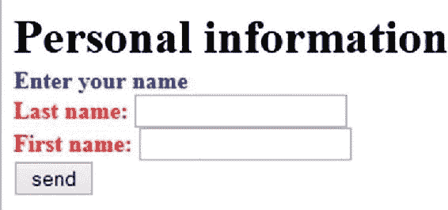
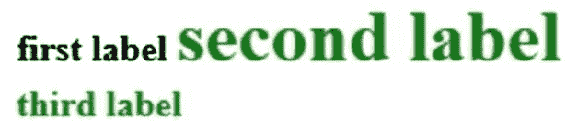
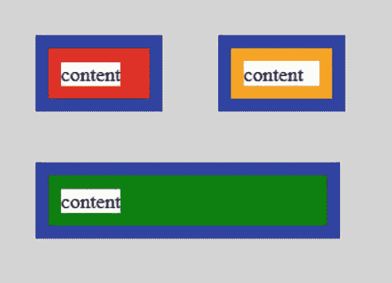

# 附录 B：层叠样式表

CSS 是一种为 HTML、XML 或其他类型文档添加样式信息的语言。它旨在支持内容（HTML）与样式（CSS）的分离。例如，无需再使用 HTML 中像 `<i>` 和 `<b>` 这样的旧式样式元素，因为所有样式都可以通过 CSS 更好地应用。

简而言之，CSS 通过*选择器*（一种路径）定位 HTML（或 XML）元素，并向其应用一组或多组样式。不同的选择器可能指向同一个元素。CSS 会解析所谓的*层叠*规则，并将所有样式应用到该元素上。如果应用了相同的样式元素，CSS 会确定最具体的选择器，如果仍然存在歧义，则采用最后定义的那个。

CSS 可以包含在 HTML 页面的 `<style>` 标签内。我们在此仅用于演示目的。在实际应用（如本书中描述的 Books 和 Alumni 应用）中，所有 CSS 语句都按照这些应用的说明放置在一个单独的文件中。这允许在不同页面中复用相同的定义，并保持一致的视觉风格。

清单 B-1 展示了一个小示例，图 B-1 显示了输出结果。


###### 图 B-1 应用 CSS 后的效果


###### 清单 B-1 嵌入 CSS 的 HTML 页面

```
 1                     <?xml version='1.0' encoding='UTF-8' ?>                
                   2                     <!DOCTYPE html>                
                   3   <                  html                  >                
                   4       <                  head                  >                
                   5           <                  title                  >CSS 演示</                  title                  >                
                   6       </                  head                  >                

                   8       <                  style                  type="text/css">                
                   9                             label                  {                
                  10                                 font-weight                  :                  bold                  ;                
                  11                                 font-size                  : 2                  em                  ;                
12           }
                  13                             form label                  {                
                  14                                 color                  :                  red                  ;                
                  15                                 font-size                  : 1                  em                  ;                
16           }
                  17       </                  style                  >                

                  19       <                  body                  >                
                  20           <                  label                  >输入你的名字</                  label                  >                
                  21           <                  br                  />                
                  22           <                  form                  >                
                  23               <                  label                  for="txtName">姓名：</                  label                  >                
                  24               <                  input                  type="text" id="txtName"/>                
                  25               <                  input                  type="submit" value="发送"/>                
                  26           </                  form                  >                
                  27       </                  body                  >                
                  28   </                  html                  > 
```

`label` 是一个元素选择器。它简单地选择一个 HTML 元素。其他类型的选择器包括 id 选择器和类选择器（稍后讨论）。在此选择器之后，样式在大括号内指定。此示例中的样式不言自明。字体大小的单位是相对单位：`2em` 在当前上下文中将大小加倍。

`form label` 是一个复合元素选择器，用于定位嵌套在 `form` 元素内的 `label`。如你所见，`color` 样式被添加到 `bold` 样式中，而 `font-size` 被覆盖，因为该选择器比单独的 `label` 选择器更具体。如果你交换顺序，结果将相同。

但是，如果你使用的选择器与此文件中先前指定的选择器具有相同的特异性，它将覆盖该样式，如清单 B-2 所示。图 B-2 显示了输出结果。因为第 13 行中的 `font-size` 引用的 `label` 与第 5 行中的特异性相同，所以字体大小将被设置为该大小，从而覆盖（或简单地忽略）第 5 行中设置的格式。


###### 图 B-2 应用 CSS 后的效果

###### 清单 B-2 CSS 覆盖先前指令的示例

```
 1   ...
                   2       <                  style                  type="text/css">                
                   3                             label                  {                
                   4                                 font-weight                  :                  bold                  ;                
                   5                                 font-size                  : 2                  em                  ;                
 6           }
                   7                             form label                  {                
                   8                                 color                  :                  red                  ;                
                   9                                 font-size                  : 1                  em                  ;                
10           }
                  11                             label                  {                
                  12                                 font-weight                  :                  normal                  ;                
                  13                                 font-size                  : 1                  em                  ;                
14           }
                  15       </                  style                  >                
16   ...
```

示例中使用的换行和空格是可选的。以下代码：

```
 1                     form label                  {                
                  2                         color                  :                  red                  ;                
                  3                         font-size                  : 1                  em                  ;                
4   }
```

等同于以下代码：

```
 1                     form label                  {                  color                  :                  red                  ;                  font-size                  : 1                  em                  ;} 
```

可以使用逗号作为分隔符同时声明多个元素。以下代码：

```
 1                     label                  {                  font-size                  : 1                  em                  ;}                
                  2                     input                  {                  font-size                  : 1                  em                  ;} 
```

等同于以下代码：

```
 1                     label                  ,                  input                  {                  font-size                  : 1                  em                  ;} 
```

### **选择器**

任何 CSS 指令都应用于由选择器指定的一个或多个元素。在前面的示例中，元素名称被用作这样的选择器。CSS 支持多种类型的选择器。

#### 类型选择器

到目前为止讨论的所有选择器都是*类型*选择器，有时也称为*元素*选择器。元素通过其标签名称来指定。

#### ID 选择器

这里通过元素的 id 来指定它。ID 选择器以井号（#）开头。示例如下：

```
 1   #                      txtName                      {                      color                      :                      red                      ;} 
```

#### 类选择器

这里通过元素的类名来指定它。类选择器以点号（.）开头，如清单 B-3 所示。


###### 列表 B-3 CSS 类

```
1   ...
                      2       <                      style                      type="text/css">                    
                      3           .                      requiredInput                      {                      background-color                      :                      yellow                      ;}                    
                      4       </                      style                      >                    
5   ...
                      6       <                      input                      type="text" id="txtName" class="requiredInput"/>                    
7   ...
```

#### 属性选择器

元素的*属性*及其值由方括号表示。列表 B-4 对此进行了说明。

###### 列表 B-4 针对元素类型的 CSS 指令

```
1   ...
                      2       <                      style                      type="text/css">                    
                      3           [                      type                      ="text"] {                      background-color                      :                      yellow                      ;}                    
                      4       </                      style                      >                    
5   ...
                      6       <                      input                      type="text" id="txtName"/>                    
7   ...
```

#### 嵌套选择器

在入门示例中使用了一个选择器来处理嵌套结构：`tagname1 tagname2` 指的是类型为 `tagname2` 的元素，该元素嵌套在类型为 `tagname1` 的元素中。`tagname2` 可以嵌套在 `tagname1` 内的任何位置。

请注意，`>` 用于处理直接嵌套的元素，如列表 B-5 的第 17 行所示（图 B-3 显示了输出结果）。



###### 图 B-3 CSS 嵌套示例

###### 列表 B-5 CSS 嵌套选择器（第 17 行）

```
 1                         <?xml version='1.0' encoding='UTF-8' ?>                    
                       2                         <!DOCTYPE html>                    
                       3   <                      html                      >                    
                       4       <                      head                      >                    
                       5           <                      title                      >CSS demo</                      title                      >                    
                       6       </                      head                      >

8       <                      style                      type="text/css">                    
                       9                                 label                      {                    
                      10                                     font-weight                      :                      bold                      ;                    
                      11                                     font-size                      : 2                      em                      ;                    
12           }
                      13                                 form label                      {                    
                      14                                     color                      :                      red                      ;                    
                      15                                     font-size                      : 1                      em                      ;                    
16           }
                      17                                 form                      >                      label                      {                    
                      18                                     color                      :                      blue                      ;                    
19           }
                      20       </                      style                      >

22       <                      body                      >                    
                      23           <                      label                      >Personal information</                      label                      >                    
                      24           <                      br                      />                    
                      25           <                      form                      >                    
                      26               <                      label                      >Enter your name</                      label                      >                    
                      27               <                      br                      />                    
                      28               <                      div                      >                    
                      29                   <                      label                      for="txtFirstName">Last name:</                      label                      >                    
                      30                   <                      input                      type="text" id="txtFirstName"/>                    
                      31               </                      div                      >                    
                      32               <                      div                      >                    
                      33                   <                      label                      for="txtLasrName">First name:</                      label                      >                    
                      34                   <                      input                      type="text" id="txtLastName"/>                    
                      35               </                      div                      >                    
                      36                   <                      input                      type="submit" value="send"/>                    
                      37           </                      form                      >                    
                      38       </                      body                      >                    
                      39   </                      html                      > 
```

只有“Enter your name”显示为蓝色。使用 `>` 运算符，可以通过 `form > div > label` 来定位用于输入姓氏或名字的标签，因为该路径包含了缺失的 `div`。

#### 兄弟选择器

波浪号（`~`）选择元素之后的所有同级元素。*兄弟元素*是指处于同一嵌套级别的元素。加号（`+`）选择相邻的同级元素。列表 B-6 对此进行了说明，图 B-4 显示了输出结果。



###### 图 B-4 CSS 兄弟选择器示例


###### 列表 B-6 兄弟选择器示例

```
 1                         <?xml version='1.0' encoding='UTF-8' ?>                    
                       2                         <!DOCTYPE html>                    
                       3   <                      html                      >                    
                       4       <                      head                      >                    
                       5           <                      title                      >CSS demo</                      title                      >                    
                       6       </                      head                      >                    

                       8       <                      style                      type="text/css">                    
                       9                                 label                      {                    
                      10                                     font-weight                      :                      bold                      ;                    
11           }
                      12                                 label                      ~                      label                      {                    
                      13                                     color                      :                      green                      ;                    
14           }
                      15                                 label                      +                      label                      {                    
                      16                                     font-size                      : 2                      em                      ;                    
17           }
                      18       </                      style                      >                    

                      20       <                      body                      >                    
                      21           <                      label                      >first label</                      label                      >                    
                      22           <                      label                      >second label</                      label                      >                    
                      23           <                      br                      />                    
                      24           <                      label                      >third label</                      label                      >                    
                      25       <                      body                      >                    
                      26   </                      html                      > 
```

`label ~ label` 用于选择第二个和第三个标签，它们都是第一个标签的兄弟元素。`label + label` 仅选择第二个标签，因为它紧跟在第一个标签之后，而第三个标签则被一个 `<br/>` 标签分隔开。

### 盒模型

每个元素都占用一个空间，该空间由其显示样式及其内容决定。

像 `label` 或 `input` 这样的文本元素属于 `inline`（内联）显示类型。元素的宽度由其内容决定。每个元素都排列在前一个元素的右侧。根据浏览器窗口的大小，可能会插入换行符。

像 `div` 这样的元素是块级元素。这些元素可以有一个 `width` 属性来定义其宽度。否则，将使用浏览器窗口的完整宽度。块级元素是垂直排列的。

使用 CSS，可以定义 `inline-block`（内联块）显示类型。（`display` 属性的有效值包括 `none`、`inline`、`block` 和 `inline-block`。）此类元素像 `inline` 元素一样水平排列，但可以独立于其内容定义宽度。例如，考虑一个 `label`，它通常会在文本结束处结束，无论是否声明了宽度。如果你使用 `display: inline-block;`，你可以为该 `label` 分配任意宽度。

元素的高度通常由其内容决定。

在*盒模型*中，每个元素的宽度由其内容决定，或者对于块级（包括 `inline-block`）元素，由 `width` 属性决定。高度通常自动确定。元素周围是定义大小的内边距（`padding`），可能为 `0`。在内边距之外，可以定义边框（`border`）。而在边框之外是外边距（`margin`）。

列表 B-7 演示了此模型，其输出如图 B-5 所示。为了使内边距可见，每个 `div` 元素都有其自己的背景色，该背景色包围着内部的 `label`。外边距的背景是透明的。它只是定义了浏览器元素之间的间隙以及到浏览器边框的距离。为了使它在本书中可见，整个 HTML 文档的背景色被设置为灰色。



###### 图 B-5 CSS 盒模型示例


###### 清单 B-7 CSS 盒模型

```
 1                       <?xml version='1.0' encoding='UTF-8' ?>                  
                     2                       <!DOCTYPE html>                  
                     3   <                    html                    >                  
                     4       <                    style                    type="text/css">                  
                     5                               html                    {                  
                     6                                   background-color                    :                    lightgray                    ;                  
 7           }
                     8                               div                    {                  
                     9                                   display                    :                    inline-block                    ;                  
                    10                                   width                    : 60                    px                    ;                  
                    11                                   padding                    : 10                    px                    ;                  
                    12                                   border-style                    :                    solid                    ;                  
                    13                                   border-color                    :                    blue                    ;                  
                    14                                   border-width                    : 10                    px                    ;                  
                    15                                   margin                    : 20                    px                    ;                  
                    16                                   background-color                    :                    red                    ;                  
17           }
                    18                               div                    +                    div                    {                  
                    19                                   background-color                    :                    orange                    ;                  
20           }
                    21                               br                    +                    div                    {                  
                    22                                   width                    : 200                    px                    ;                  
                    23                                   background-color                    :                    green                    ;                  
24           }
                    25                               label                    {                  
                    26                                   background-color                    :                    white                    ;                  
27           }
                    28                               div                    +                    div                    >                    label                    {                  
                    29                                   display                    :                    inline-block                    ;                  
                    30                                   width                    : 60                    px                    ;                  
31           }
                    32       </                    style                    >

34       <                    body                    >                  
                    35           <                    div                    ><                    label                    >content<                    label                    ></                    div                    >                  
                    36           <                    div                    ><                    label                    >content<                    label                    ></                    div                    >                  
                    37           <                    br                    />                  
                    38           <                    div                    ><                    label                    >content<                    label                    ></                    div                    >                  
                    39       <                    body                    >                  
                    40   </                    html                    > 
```

第一行中的两个盒子宽度均为 60 像素。这比该 div 中包含的标签宽度要大。对于第二个 div，标签的显示方式被重新定义为 `inline-block`。这允许为该标签定义宽度。如你所见，标签（白色背景）变宽了，但 div 的宽度（与之相同）并未改变。

第一行的两个元素看起来与第三个盒子宽度相同。但 2*60 并不等于 200！

盒模型的特点是它定义的是内容尺寸，而非整个显示尺寸。因此，我们必须在左右两侧都加上内边距、边框和外边距。2*(60+2*内边距+2*边框+2*外边距) = 2*(60+20+20+40) = 280，这与第二行相等：200+20+20+40 = 280。

理解这个盒模型对于计算布局至关重要。使用 CSS3，可以通过 `box-sizing: border-box;` 来改变这个默认模型。应用 `border-box` 后，宽度将决定包含内边距和边框在内的宽度。

###### 注意

为了便于计算，盒模型的示例使用了以像素为单位的固定尺寸。在实际应用中，应优先使用相对尺寸，如 `em`（如其他示例中所用）或百分比。相对尺寸可以方便地全局调整大小，并且对于响应式设计至关重要。

### 增强样式

使用 CSS，可以重新排列内容，或者添加文本或图像，还可以根据显示尺寸改变设计。本附录仅介绍了 CSS 的基础知识。

本书中的应用程序有时会使用此类增强样式特性，例如伪元素、多种定位方式、背景、媒体查询等。这些内容将在相应章节中描述。

###### 注意

如果你想学习 CSS，市面上有很多好书，互联网上也有大量优秀的在线教程。W3schools 的 CSS 教程值得一看：[www.w3schools.com/css](http://www.w3schools.com/css)。

